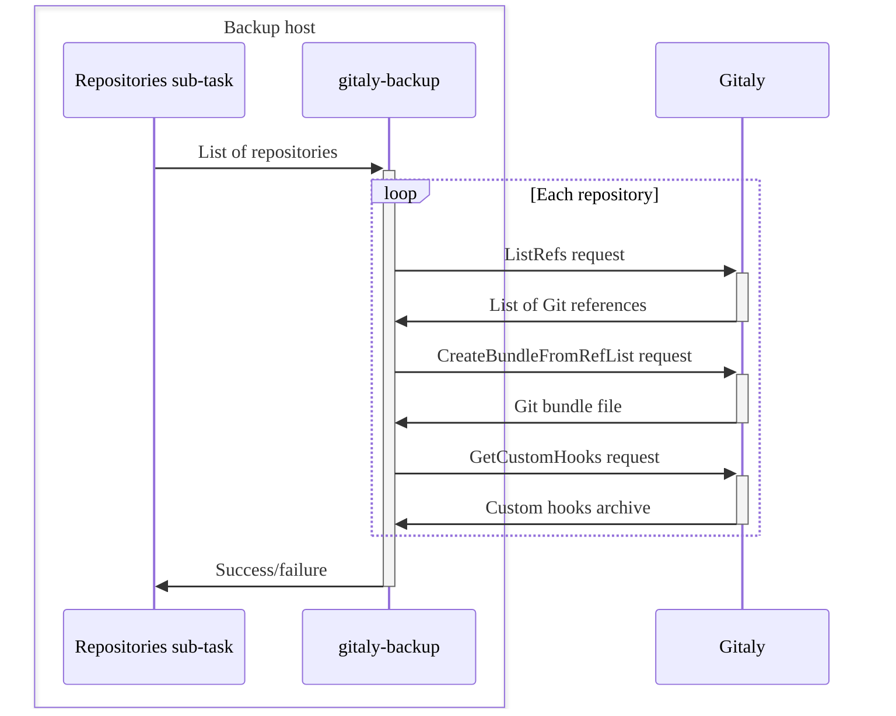
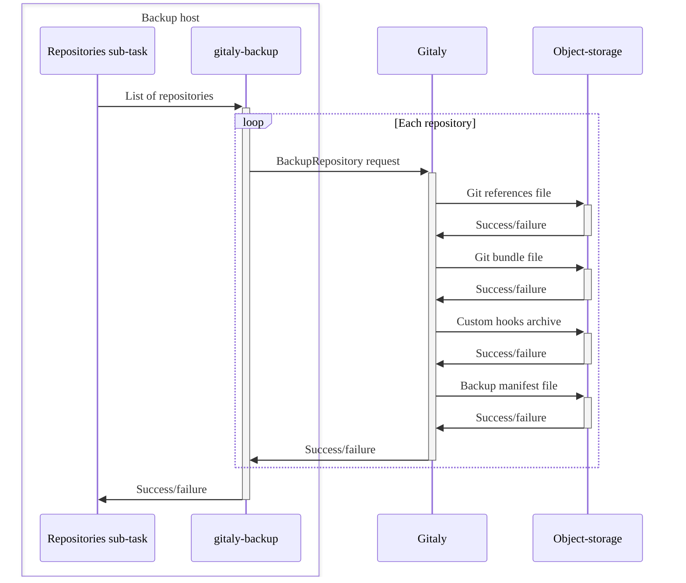

Lorsque vous exécutez la [commande de sauvegarde](backup_gitlab.md#backup-command), un script de sauvegarde crée un fichier d'archive de sauvegarde pour stocker vos données GitLab.

Pour créer le fichier d'archive, le script de sauvegarde :

1. Extrait le fichier d'archive de sauvegarde précédent, lorsque vous effectuez une sauvegarde incrémentielle.
1. Met à jour ou génère le fichier d'archive de sauvegarde.
1. Exécute toutes les sous-tâches de sauvegarde pour :
   - [Sauvegarder la base de données](#back-up-the-database).
   - [Sauvegarder les dépôts Git](#back-up-git-repositories).
   - [Sauvegarder les fichiers](#back-up-files).
1. Archive la zone de transit de sauvegarde dans un fichier `tar`.
1. Charge la nouvelle archive de sauvegarde vers le stockage d'objets, si [configuré](backup_gitlab.md#upload-backups-to-a-remote-cloud-storage).
1. Nettoie les fichiers archivés du [répertoire de transit de sauvegarde](#backup-staging-directory).

## Sauvegarder la base de données {#back-up-the-database}

Pour sauvegarder la base de données, la sous-tâche `db` :

1. Utilise `pg_dump` pour créer un [dump SQL](https://www.postgresql.org/docs/16/backup-dump.html).
1. Redirige la sortie de `pg_dump` à travers `gzip` et crée un fichier SQL compressé.
1. Enregistre le fichier dans le [répertoire de transit de sauvegarde](#backup-staging-directory).

## Sauvegarder les dépôts Git {#back-up-git-repositories}

Pour sauvegarder les dépôts Git, la sous-tâche `repositories` :

1. Informe `gitaly-backup` des dépôts à sauvegarder.
1. Exécute `gitaly-backup` pour :

   - Effectuer une série d'appels de procédures distantes (RPC) sur Gitaly.
   - Collecter les données de sauvegarde pour chaque dépôt.

1. Transmet les données collectées dans une structure de répertoires dans le [répertoire de transit de sauvegarde](#backup-staging-directory).

Le diagramme suivant illustre le processus :



Les stockages configurés de Gitaly Cluster (Praefect) sont sauvegardés de la même manière que les instances Gitaly autonomes.

- Lorsque Gitaly Cluster (Praefect) reçoit les appels RPC de `gitaly-backup`, il reconstruit sa propre base de données.
  - Il n'est pas nécessaire de sauvegarder séparément la base de données de Gitaly Cluster (Praefect).
- Chaque dépôt est sauvegardé une seule fois, quel que soit le facteur de réplication, car les sauvegardes fonctionnent via des RPC.

### Sauvegardes côté serveur {#server-side-backups}

Les sauvegardes de dépôts côté serveur constituent un moyen efficace de sauvegarder les dépôts Git. Les avantages de cette méthode sont :

- Les données ne sont pas transmises via des RPC depuis Gitaly.
- Les sauvegardes côté serveur nécessitent moins de transfert réseau.
- Le stockage sur disque de la machine exécutant la tâche Rake de sauvegarde n'est pas requis.

Pour sauvegarder Gitaly côté serveur, la sous-tâche `repositories` :

1. Exécute `gitaly-backup` pour effectuer un seul appel RPC pour chaque dépôt.
1. Déclenche le nœud Gitaly stockant le dépôt physique pour charger les données de sauvegarde vers le stockage d'objets.
1. Lie les sauvegardes stockées sur le stockage d'objets à l'archive de sauvegarde créée à l'aide d'un [ID de sauvegarde](#backup-id).

Le diagramme suivant illustre le processus :



## Sauvegarder les fichiers {#back-up-files}

Les sous-tâches suivantes sauvegardent des fichiers :

- `uploads` : Pièces jointes
- `builds` : Journaux de sortie des jobs CI/CD
- `artifacts` : Artefacts de job CI/CD
- `pages` : Contenu de page
- `lfs` : Objets LFS
- `terraform_state` : États Terraform
- `registry` : Images du registre de conteneurs
- `packages` : Paquets
- `ci_secure_files` : Fichiers sécurisés au niveau du projet
- `external_diffs` : Diffs de merge request (lorsqu'ils sont stockés en externe)

Chaque sous-tâche identifie un ensemble de fichiers dans un répertoire spécifique à la tâche et :

1. Crée une archive des fichiers identifiés à l'aide de l'utilitaire `tar`.
1. Compresse l'archive via `gzip` sans enregistrement sur le disque.
1. Enregistre le fichier `tar` dans le [répertoire de transit de sauvegarde](#backup-staging-directory).

Les sauvegardes étant créées à partir d'instances en cours d'exécution, des fichiers peuvent être modifiés pendant le processus de sauvegarde. Dans ce cas, une [stratégie alternative](backup_gitlab.md#backup-strategy-option) peut être utilisée pour sauvegarder les fichiers. L'utilitaire `rsync` crée une copie des fichiers à sauvegarder et les transmet à `tar` pour l'archivage.

> [!note]
> Si vous utilisez cette stratégie, la machine exécutant la tâche Rake de sauvegarde doit disposer d'un espace de stockage suffisant pour les fichiers copiés et l'archive compressée.

## ID de sauvegarde {#backup-id}

Les ID de sauvegarde sont des identifiants uniques pour les archives de sauvegarde. Ces ID sont essentiels lorsque vous devez restaurer GitLab et que plusieurs archives de sauvegarde sont disponibles.

Les archives de sauvegarde sont enregistrées dans un répertoire spécifié par le paramètre `backup_path` dans le fichier `config/gitlab.yml`. L'emplacement par défaut est `/var/opt/gitlab/backups`.

L'ID de sauvegarde est composé de :

- Horodatage de la création de la sauvegarde
- Date (`YYYY_MM_DD`)
- Version de GitLab
- Édition de GitLab

Voici un exemple d'ID de sauvegarde : `1493107454_2018_04_25_10.6.4-ce`

## Nom de fichier de sauvegarde {#backup-filename}

Par défaut, le nom de fichier suit la structure `<backup-id>_gitlab_backup.tar`. Par exemple, `1493107454_2018_04_25_10.6.4-ce_gitlab_backup.tar`.

## Fichier d'informations de sauvegarde {#backup-information-file}

Le fichier d'informations de sauvegarde, `backup_information.yml`, enregistre toutes les entrées de sauvegarde qui ne sont pas incluses dans la sauvegarde. Le fichier est enregistré dans le [répertoire de transit de sauvegarde](#backup-staging-directory). Les sous-tâches utilisent ce fichier pour déterminer comment restaurer et lier les données de la sauvegarde avec des services externes tels que les [sauvegardes de dépôts côté serveur](#server-side-backups).

Le fichier d'informations de sauvegarde comprend les éléments suivants :

- L'heure de création de la sauvegarde.
- La version de GitLab ayant généré la sauvegarde.
- D'autres options spécifiées. Par exemple, les sous-tâches ignorées.

## Répertoire de transit de sauvegarde {#backup-staging-directory}

Le répertoire de transit de sauvegarde est un emplacement de stockage temporaire utilisé pendant les processus de sauvegarde et de restauration. Ce répertoire :

- Stocke les artefacts de sauvegarde avant de créer l'archive de sauvegarde GitLab.
- Extrait les archives de sauvegarde avant de restaurer une sauvegarde ou de créer une sauvegarde incrémentielle.

Le répertoire de transit de sauvegarde est le même répertoire où les archives de sauvegarde terminées sont créées. Lors de la création d'une sauvegarde non archivée (untarred), les artefacts de sauvegarde restent dans ce répertoire et aucune archive n'est créée.

Voici un exemple de répertoire de transit de sauvegarde contenant une sauvegarde non archivée (untarred) :

```plaintext
backups/
├── 1701728344_2023_12_04_16.7.0-pre_gitlab_backup.tar
├── 1701728447_2023_12_04_16.7.0-pre_gitlab_backup.tar
├── artifacts.tar.gz
├── backup_information.yml
├── builds.tar.gz
├── ci_secure_files.tar.gz
├── db
│   ├── ci_database.sql.gz
│   └── database.sql.gz
├── lfs.tar.gz
├── packages.tar.gz
├── pages.tar.gz
├── repositories
│   ├── manifests/
│   ├── @hashed/
│   └── @snippets/
├── terraform_state.tar.gz
└── uploads.tar.gz
```
