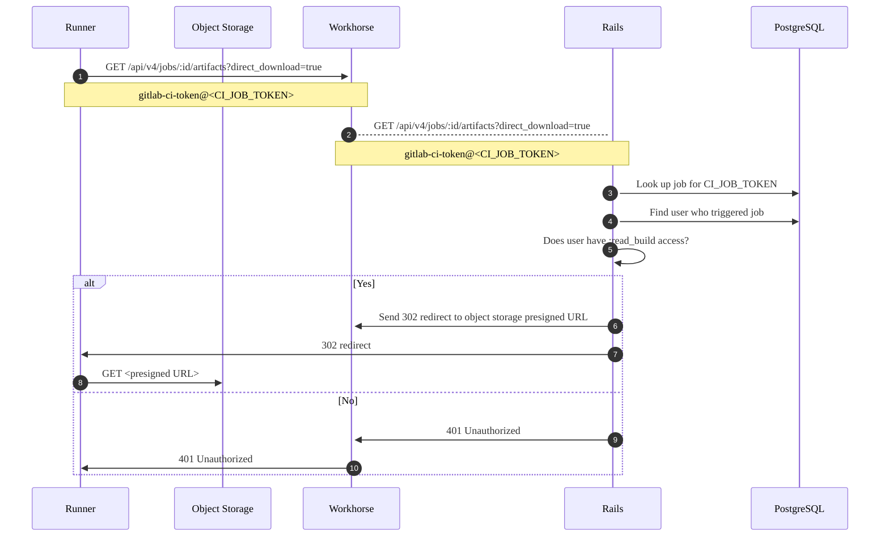
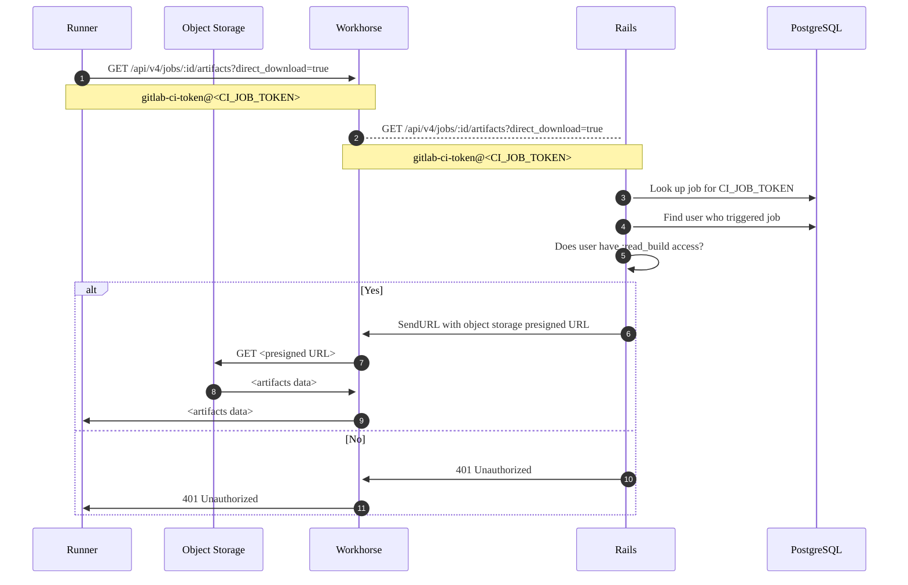



- Niveau : Free, Premium, Ultimate
- Offre : GitLab Self-Managed



Lors de l'administration des artefacts de job, vous pouvez rencontrer les problèmes suivants.

## Les artefacts de job peuvent avoir des noms de fichiers incorrects {#job-artifacts-can-have-wrong-filenames}

Avant GitLab 18.6, la migration du stockage distant vers le stockage local pouvait entraîner la copie des artefacts avec des noms de fichiers incorrects.

Par exemple :

- Les artefacts doivent ressembler à : `path/to/artifacts/2025_10_15/922/485/artifacts.zip`.
- Les artefacts avec des noms de fichiers incorrects ressemblent à : `path/to/artifacts/2025_10_15/922/485/4f8681af93715b90c913e507f24b05cc6ca6e` (sans extension `.zip`).

Si cela s'est produit sur votre instance GitLab, exécutez :

```shell
gitlab-rake gitlab:artifacts:fix_artifact_filepath
```

Cette tâche vérifie les artefacts dans le stockage local qui ont un nom de fichier incorrect et les renomme avec le nom de fichier attendu.

## Les artefacts de job occupent trop d'espace disque {#job-artifacts-using-too-much-disk-space}

Les artefacts de job peuvent saturer votre espace disque plus rapidement que prévu. Voici quelques raisons possibles :

- Les utilisateurs ont configuré une expiration des artefacts de job plus longue que nécessaire.
- Le nombre de jobs exécutés, et donc d'artefacts générés, est plus élevé que prévu.
- Les job logs sont plus volumineux que prévu et se sont accumulés au fil du temps.
- Le système de fichiers peut manquer d'inœuds car [des répertoires vides sont laissés derrière par le housekeeping des artefacts](https://gitlab.com/gitlab-org/gitlab/-/issues/17465). [La tâche Rake pour les fichiers d'artefacts orphelins](../raketasks/cleanup.md#remove-orphan-artifact-files) les supprime.
- Des fichiers d'artefacts peuvent être laissés sur le disque et ne pas être supprimés par le housekeeping. Exécutez la [tâche Rake pour les fichiers d'artefacts orphelins](../raketasks/cleanup.md#remove-orphan-artifact-files) pour les supprimer. Ce script trouve toujours du travail à effectuer car il supprime également les répertoires vides (voir la raison précédente).
- Les artefacts avec le statut `unknown` peuvent ne pas être traités par le nettoyage automatique. Vous pouvez [vérifier ces artefacts](#check-for-artifacts-with-unknown-status) et les nettoyer pour récupérer de l'espace disque.
- La fonctionnalité [conserver les derniers artefacts des jobs réussis les plus récents](../../ci/jobs/job_artifacts.md#keep-artifacts-from-most-recent-successful-jobs) est activée.

Dans ces cas et d'autres, identifiez les projets les plus responsables de l'utilisation de l'espace disque, déterminez quels types d'artefacts utilisent le plus d'espace et, dans certains cas, supprimez manuellement les artefacts de job pour récupérer de l'espace disque.

### Housekeeping des artefacts {#artifacts-housekeeping}

Le housekeeping des artefacts est le processus qui identifie les artefacts expirés pouvant être supprimés.

#### Vérifier les artefacts avec le statut `unknown` {#check-for-artifacts-with-unknown-status}

Certains artefacts ont un statut `unknown` car le système de housekeeping ne peut pas déterminer leur statut de verrouillage correct. Ces artefacts ne sont pas traités par le nettoyage automatique même après leur expiration et peuvent contribuer à une utilisation excessive de l'espace disque.

Pour vérifier si votre instance contient des artefacts avec le statut `unknown` :

1. Démarrez une console de base de données :

   

   

   ```shell
   sudo gitlab-psql
   ```

   

   

   ```shell
   # Find the toolbox pod
   kubectl --namespace <namespace> get pods -lapp=toolbox
   # Connect to the PostgreSQL console
   kubectl exec -it <toolbox-pod-name> -- /srv/gitlab/bin/rails dbconsole --include-password --database main
   ```

   

   

   ```shell
   sudo docker exec -it <container_name> /bin/bash
   gitlab-psql
   ```

   

   

   ```shell
   sudo -u git -H psql -d gitlabhq_production
   ```

   

   

1. Exécutez la requête suivante :

   ```sql
   select expire_at, file_type, locked, count(*) from p_ci_job_artifacts
   where expire_at is not null and
   file_type != 3
   group by expire_at, file_type, locked having count(*) > 1;
   ```

Si des enregistrements sont retournés avec le statut verrouillé `2`, ce sont des artefacts `unknown`. Par exemple :

```plaintext
           expire_at           | file_type | locked | count
-------------------------------+-----------+--------+--------
 2021-06-21 22:00:00+00        |         1 |      2 |  73614
 2021-06-21 22:00:00+00        |         2 |      2 |  73614
 2021-06-21 22:00:00+00        |         4 |      2 |   3522
 2021-06-21 22:00:00+00        |         9 |      2 |     32
 2021-06-21 22:00:00+00        |        12 |      2 |    163
```

Si vous avez des artefacts `unknown`, vous pouvez [définir des délais d'expiration plus courts](#clean-up-unknown-artifacts) ou les supprimer manuellement pour récupérer de l'espace disque.

#### Nettoyer les artefacts `unknown` {#clean-up-unknown-artifacts}

Pour nettoyer les artefacts `unknown`, vous pouvez définir des délais d'expiration plus courts, ce qui permet au processus de nettoyage automatique de les traiter :

1. Démarrez une [console Rails](../operations/rails_console.md#starting-a-rails-console-session).
1. Définissez l'expiration à l'heure actuelle pour les artefacts `unknown` :

   ```ruby
   # This marks unknown artifacts for immediate cleanup
   Ci::JobArtifact.where(locked: 2).update_all(expire_at: Time.current)
   ```

Le processus de housekeeping automatique nettoiera ensuite ces artefacts lors de sa prochaine exécution.

#### Les artefacts `@final` ne sont pas supprimés du stockage d'objets {#final-artifacts-not-deleted-from-object-store}

Dans GitLab 16.1 et versions ultérieures, les artefacts sont téléchargés directement vers leur emplacement de stockage final dans le répertoire `@final`, plutôt que d'utiliser d'abord un emplacement temporaire.

Un problème dans GitLab 16.1 et 16.2 entraîne [la non-suppression des artefacts du stockage d'objets](https://gitlab.com/gitlab-org/gitlab/-/issues/419920) lors de leur expiration. Le processus de nettoyage des artefacts expirés ne supprime pas les artefacts du répertoire `@final`. Ce problème est corrigé dans GitLab 16.3 et versions ultérieures.

Les administrateurs d'instances GitLab ayant utilisé GitLab 16.1 ou 16.2 pendant un certain temps pourraient constater une augmentation du stockage d'objets utilisé par les artefacts. Suivez cette procédure pour vérifier et supprimer ces artefacts.

La suppression des fichiers est un processus en deux étapes :

1. [Identifier les fichiers devenus orphelins](#list-orphaned-job-artifacts).
1. [Supprimer les fichiers identifiés du stockage d'objets](#delete-orphaned-job-artifacts).

##### Lister les artefacts de job orphelins {#list-orphaned-job-artifacts}





```shell
sudo gitlab-rake gitlab:cleanup:list_orphan_job_artifact_final_objects
```





```shell
docker exec -it <container-id> bash
gitlab-rake gitlab:cleanup:list_orphan_job_artifact_final_objects
```

Écrivez soit dans un volume persistant monté dans le conteneur, soit, lorsque la commande se termine : copiez le fichier de sortie hors de la session.





```shell
sudo -u git -H bundle exec rake gitlab:cleanup:list_orphan_job_artifact_final_objects RAILS_ENV=production
```





```shell
# find the pod
kubectl get pods --namespace <namespace> -lapp=toolbox

# open the Rails console
kubectl exec -it -c toolbox <toolbox-pod-name> bash
gitlab-rake gitlab:cleanup:list_orphan_job_artifact_final_objects
```

Lorsque la commande se termine, copiez le fichier hors de la session vers un stockage persistant.





La tâche Rake possède quelques fonctionnalités supplémentaires qui s'appliquent à tous les types de déploiement GitLab :

- L'analyse du stockage d'objets peut être interrompue. La progression est enregistrée dans Redis, ce qui permet de reprendre l'analyse des artefacts à partir de ce point.
- Par défaut, la tâche Rake génère un fichier CSV : `/opt/gitlab/embedded/service/gitlab-rails/tmp/orphan_job_artifact_final_objects.csv`
- Définissez une variable d'environnement pour spécifier un nom de fichier différent :

  ```shell
  # Packaged GitLab
  sudo su -
  FILENAME='custom_filename.csv' gitlab-rake gitlab:cleanup:list_orphan_job_artifact_final_objects
  ```

- Si le fichier de sortie existe déjà (le fichier par défaut ou le fichier spécifié), il ajoute des entrées à la fin du fichier.
- Chaque ligne contient les champs `object_path,object_size` séparés par des virgules, sans en-tête de fichier. Par exemple :

  ```plaintext
  35/13/35135aaa6cc23891b40cb3f378c53a17a1127210ce60e125ccf03efcfdaec458/@final/1a/1a/5abfa4ec66f1cc3b681a4d430b8b04596cbd636f13cdff44277211778f26,201
  ```

##### Supprimer les artefacts de job orphelins {#delete-orphaned-job-artifacts}





```shell
sudo gitlab-rake gitlab:cleanup:delete_orphan_job_artifact_final_objects
```





```shell
docker exec -it <container-id> bash
gitlab-rake gitlab:cleanup:delete_orphan_job_artifact_final_objects
```

- Copiez le fichier de sortie hors de la session lorsque la commande se termine, ou écrivez-le dans un volume monté par le conteneur.





```shell
sudo -u git -H bundle exec rake gitlab:cleanup:delete_orphan_job_artifact_final_objects RAILS_ENV=production
```





```shell
# find the pod
kubectl get pods --namespace <namespace> -lapp=toolbox

# open the Rails console
kubectl exec -it -c toolbox <toolbox-pod-name> bash
gitlab-rake gitlab:cleanup:delete_orphan_job_artifact_final_objects
```

- Lorsque la commande se termine, copiez le fichier hors de la session vers un stockage persistant.





Ce qui suit s'applique à tous les types de déploiement GitLab :

- Spécifiez le nom du fichier d'entrée à l'aide de la variable `FILENAME`. Par défaut, le script recherche : `/opt/gitlab/embedded/service/gitlab-rails/tmp/orphan_job_artifact_final_objects.csv`
- Au fur et à mesure que le script supprime des fichiers, il génère un fichier CSV avec les fichiers supprimés :
  - le fichier se trouve dans le même répertoire que le fichier d'entrée
  - le nom du fichier est préfixé par `deleted_from--`. Par exemple : `deleted_from--orphan_job_artifact_final_objects.csv`.
  - Les lignes du fichier sont : `object_path,object_size,object_generation/version`, par exemple :

    ```plaintext
    35/13/35135aaa6cc23891b40cb3f378c53a17a1127210ce60e125ccf03efcfdaec458/@final/1a/1a/5abfa4ec66f1cc3b681a4d430b8b04596cbd636f13cdff44277211778f26,201,1711616743796587
    ```

### Lister les projets et les builds avec des artefacts ayant une expiration spécifique (ou sans expiration) {#list-projects-and-builds-with-artifacts-with-a-specific-expiration-or-no-expiration}

À l'aide d'une [console Rails](../operations/rails_console.md), vous pouvez trouver des projets ayant des artefacts de job avec :

- Aucune date d'expiration.
- Une date d'expiration supérieure à 7 jours dans le futur.

De la même façon que pour [la suppression des artefacts](#delete-old-builds-and-artifacts), utilisez les exemples de périodes suivants et adaptez-les selon vos besoins :

- `7.days.from_now`
- `10.days.from_now`
- `2.weeks.from_now`
- `3.months.from_now`
- `1.year.from_now`

Chacun des scripts suivants limite également la recherche à 50 résultats avec `.limit(50)`, mais ce nombre peut également être modifié selon les besoins :

```ruby
# Find builds & projects with artifacts that never expire
builds_with_artifacts_that_never_expire = Ci::Build.with_downloadable_artifacts.where(artifacts_expire_at: nil).limit(50)
builds_with_artifacts_that_never_expire.find_each do |build|
  puts "Build with id #{build.id} has artifacts that don't expire and belongs to project #{build.project.full_path}"
end

# Find builds & projects with artifacts that expire after 7 days from today
builds_with_artifacts_that_expire_in_a_week = Ci::Build.with_downloadable_artifacts.where('artifacts_expire_at > ?', 7.days.from_now).limit(50)
builds_with_artifacts_that_expire_in_a_week.find_each do |build|
  puts "Build with id #{build.id} has artifacts that expire at #{build.artifacts_expire_at} and belongs to project #{build.project.full_path}"
end
```

### Lister les projets par taille totale des artefacts de job stockés {#list-projects-by-total-size-of-job-artifacts-stored}

Listez les 20 premiers projets, triés par taille totale des artefacts de job stockés, en exécutant le code suivant dans la [console Rails](../operations/rails_console.md) :

```ruby
include ActionView::Helpers::NumberHelper
ProjectStatistics.order(build_artifacts_size: :desc).limit(20).each do |s|
  puts "#{number_to_human_size(s.build_artifacts_size)} \t #{s.project.full_path}"
end
```

Vous pouvez modifier le nombre de projets listés en remplaçant `.limit(20)` par le nombre souhaité.

### Lister les artefacts les plus volumineux dans un seul projet {#list-largest-artifacts-in-a-single-project}

Listez les 50 artefacts de job les plus volumineux dans un seul projet en exécutant le code suivant dans la [console Rails](../operations/rails_console.md) :

```ruby
include ActionView::Helpers::NumberHelper
project = Project.find_by_full_path('path/to/project')
Ci::JobArtifact.where(project: project).order(size: :desc).limit(50).map { |a| puts "ID: #{a.id} - #{a.file_type}: #{number_to_human_size(a.size)}" }
```

Vous pouvez modifier le nombre d'artefacts de job listés en remplaçant `.limit(50)` par le nombre souhaité.

### Lister les artefacts dans un seul projet {#list-artifacts-in-a-single-project}

Listez les artefacts pour un seul projet, triés par taille d'artefact. La sortie comprend les éléments suivants :

- ID du job ayant créé l'artefact
- taille de l'artefact
- type de fichier de l'artefact
- date de création de l'artefact
- emplacement de l'artefact sur le disque

```ruby
p = Project.find_by_id(<project_id>)
arts = Ci::JobArtifact.where(project: p)

list = arts.order(size: :desc).limit(50).each do |art|
    puts "Job ID: #{art.job_id} - Size: #{art.size}b - Type: #{art.file_type} - Created: #{art.created_at} - File loc: #{art.file}"
end
```

Pour modifier le nombre d'artefacts de job listés, changez le nombre dans `limit(50)`.

### Supprimer les anciens builds et artefacts {#delete-old-builds-and-artifacts}

> [!warning]
> Ces commandes suppriment des données de façon permanente. Avant de les exécuter dans un environnement de production, vous devriez d'abord les tester dans un environnement de test et effectuer une sauvegarde de l'instance pouvant être restaurée si nécessaire.

#### Supprimer les anciens artefacts pour un projet {#delete-old-artifacts-for-a-project}

Cette étape efface également les artefacts que les utilisateurs ont [choisi de conserver](../../ci/jobs/job_artifacts.md#with-an-expiry) :

```ruby
project = Project.find_by_full_path('path/to/project')
builds_with_artifacts =  project.builds.with_downloadable_artifacts
builds_with_artifacts.where("finished_at < ?", 1.year.ago).each_batch do |batch|
  batch.each do |build|
    Ci::JobArtifacts::DeleteService.new(build).execute
  end

  batch.update_all(artifacts_expire_at: Time.current)
end
```

#### Supprimer les anciens artefacts à l'échelle de l'instance {#delete-old-artifacts-instance-wide}

Cette étape efface également les artefacts que les utilisateurs ont [choisi de conserver](../../ci/jobs/job_artifacts.md#with-an-expiry) :

```ruby
builds_with_artifacts = Ci::Build.with_downloadable_artifacts
builds_with_artifacts.where("finished_at < ?", 1.year.ago).each_batch do |batch|
  batch.each do |build|
    Ci::JobArtifacts::DeleteService.new(build).execute
  end

  batch.update_all(artifacts_expire_at: Time.current)
end
```

#### Supprimer les anciens job logs et artefacts pour un projet {#delete-old-job-logs-and-artifacts-for-a-project}

```ruby
project = Project.find_by_full_path('path/to/project')
builds =  project.builds
admin_user = User.find_by(username: 'username')
builds.where("finished_at < ?", 1.year.ago).each_batch do |batch|
  batch.each do |build|
    print "Ci::Build ID #{build.id}... "

    if build.erasable?
      Ci::BuildEraseService.new(build, admin_user).execute
      puts "Erased"
    else
      puts "Skipped (Nothing to erase or not erasable)"
    end
  end
end
```

#### Supprimer les anciens job logs et artefacts à l'échelle de l'instance {#delete-old-job-logs-and-artifacts-instance-wide}

```ruby
builds = Ci::Build.all
admin_user = User.find_by(username: 'username')
builds.where("finished_at < ?", 1.year.ago).each_batch do |batch|
  batch.each do |build|
    print "Ci::Build ID #{build.id}... "

    if build.erasable?
      Ci::BuildEraseService.new(build, admin_user).execute
      puts "Erased"
    else
      puts "Skipped (Nothing to erase or not erasable)"
    end
  end
end
```

`1.year.ago` est une méthode Rails [`ActiveSupport::Duration`](https://api.rubyonrails.org/classes/ActiveSupport/Duration.html). Commencez par une longue durée pour réduire le risque de suppression accidentelle d'artefacts encore utilisés. Relancez la suppression avec des durées plus courtes selon les besoins, par exemple `3.months.ago`, `2.weeks.ago` ou `7.days.ago`.

La méthode `erase_erasable_artifacts!` est synchrone et, lors de son exécution, les artefacts sont immédiatement supprimés ; ils ne sont pas planifiés par une file d'attente en arrière-plan.

### La suppression des artefacts ne libère pas immédiatement l'espace disque {#deleting-artifacts-does-not-immediately-reclaim-disk-space}

Lorsque des artefacts sont supprimés, le processus se déroule en deux phases :

1. **Marked as ready for deletion** : les enregistrements `Ci::JobArtifact` sont supprimés de la base de données et convertis en enregistrements `Ci::DeletedObject` avec un horodatage `pick_up_at` futur.
1. **Remove from storage** :  Les fichiers d'artefacts restent sur le disque jusqu'à ce que le worker `Ci::ScheduleDeleteObjectsCronWorker` traite les enregistrements `Ci::DeletedObject` et supprime physiquement les fichiers.

La suppression est délibérément limitée pour éviter de surcharger les ressources système :

- Le worker s'exécute une fois par heure, à la 16e minute.
- Il traite les objets par lots avec un maximum de 20 jobs simultanés.
- Chaque objet supprimé possède un horodatage `pick_up_at` qui détermine à quel moment il devient éligible à la suppression physique

Pour les suppressions à grande échelle, le nettoyage physique peut prendre un temps considérable avant que l'espace disque soit entièrement récupéré. Le nettoyage peut prendre plusieurs jours pour des suppressions très importantes.

Si vous avez besoin de récupérer rapidement de l'espace disque, vous pouvez accélérer la suppression des artefacts.

#### Accélérer la suppression des artefacts {#expedite-artifact-removal}

Si vous avez besoin de récupérer rapidement de l'espace disque après avoir supprimé un grand nombre d'artefacts, vous pouvez contourner les limitations de planification standard et accélérer le processus de suppression.

> [!warning]
> Ces commandes exercent une charge significative sur votre système si vous supprimez un grand nombre d'artefacts.

```ruby
# Set the pick_up_date to the current time on all artifacts
# This will mark them for immediate deletion
Ci::DeletedObject.update_all(pick_up_at: Time.current)

# Get the count of artifacts marked for deletion
Ci::DeletedObject.where("pick_up_at < ?", Time.current)

# Delete the artifacts from disk
while Ci::DeletedObject.where("pick_up_at < ?", Time.current).count > 0
  Ci::DeleteObjectsService.new.execute
  sleep(10)
end

# Get the count of artifacts marked for deletion (should now be zero)
Ci::DeletedObject.count
```

### Supprimer les anciens pipelines {#delete-old-pipelines}

> [!warning]
> Ces commandes suppriment des données de façon permanente. Avant de les exécuter dans un environnement de production, envisagez de demander conseil à un ingénieur du support. Vous devriez également les tester d'abord dans un environnement de test et effectuer une sauvegarde de l'instance pouvant être restaurée si nécessaire.

La suppression d'un pipeline supprime également les éléments suivants de ce pipeline :

- Artefacts de job
- Job logs
- Métadonnées de job
- Métadonnées de pipeline

La suppression des métadonnées de job et de pipeline peut aider à réduire la taille des tables CI dans la base de données. Les tables CI sont généralement les plus grandes tables dans la base de données d'une instance.

#### Supprimer les anciens pipelines pour un projet {#delete-old-pipelines-for-a-project}

```ruby
project = Project.find_by_full_path('path/to/project')
user = User.find(1)
project.ci_pipelines.where("finished_at < ?", 1.year.ago).each_batch do |batch|
  batch.each do |pipeline|
    puts "Erasing pipeline #{pipeline.id}"
    Ci::DestroyPipelineService.new(pipeline.project, user).execute(pipeline)
  end
end
```

#### Supprimer les anciens pipelines à l'échelle de l'instance {#delete-old-pipelines-instance-wide}

```ruby
user = User.find(1)
Ci::Pipeline.where("finished_at < ?", 1.year.ago).each_batch do |batch|
  batch.each do |pipeline|
    puts "Erasing pipeline #{pipeline.id} for project #{pipeline.project_id}"
    Ci::DestroyPipelineService.new(pipeline.project, user).execute(pipeline)
  end
end
```

## L'upload d'un artefact de job échoue avec l'erreur 500 {#job-artifact-upload-fails-with-error-500}

Si vous utilisez le stockage d'objets pour les artefacts et qu'un artefact de job ne parvient pas à être uploadé, vérifiez :

- Le job log pour un message d'erreur similaire à :

  ```plaintext
  WARNING: Uploading artifacts as "archive" to coordinator... failed id=12345 responseStatus=500 Internal Server Error status=500 token=abcd1234
  ```

- Le [journal workhorse](../logs/_index.md#workhorse-logs) pour un message d'erreur similaire à :

  ```json
  {"error":"MissingRegion: could not find region configuration","level":"error","msg":"error uploading S3 session","time":"2021-03-16T22:10:55-04:00"}
  ```

Dans les deux cas, vous pourriez avoir besoin d'ajouter `region` à la [configuration du stockage d'objets](../object_storage.md) des artefacts de job.

## L'upload d'un artefact de job échoue avec `500 Internal Server Error (Missing file)` {#job-artifact-upload-fails-with-500-internal-server-error-missing-file}

Les noms de compartiments incluant des chemins de dossiers ne sont pas pris en charge avec le [stockage d'objets consolidé](../object_storage.md#configure-a-single-storage-connection-for-all-object-types-consolidated-form). Par exemple, `bucket/path`. Si un nom de compartiment contient un chemin, vous pouvez recevoir une erreur similaire à :

```plaintext
WARNING: Uploading artifacts as "archive" to coordinator... POST https://gitlab.example.com/api/v4/jobs/job_id/artifacts?artifact_format=zip&artifact_type=archive&expire_in=1+day: 500 Internal Server Error (Missing file)
FATAL: invalid argument
```

Si un artefact de job ne parvient pas à être uploadé en raison de l'erreur précédente lors de l'utilisation du stockage d'objets consolidé, assurez-vous d'[utiliser des compartiments séparés](../object_storage.md#use-separate-buckets) pour chaque type de données.

## Les artefacts de job ne parviennent pas à être uploadés avec `FATAL: invalid argument` lors de l'utilisation d'un montage Windows {#job-artifacts-fail-to-upload-with-fatal-invalid-argument-when-using-windows-mount}

Si vous utilisez un montage Windows avec CIFS pour les artefacts de job, vous pouvez voir une erreur `invalid argument` lorsque le runner tente d'uploader des artefacts :

```plaintext
WARNING: Uploading artifacts as "dotenv" to coordinator... POST https://<your-gitlab-instance>/api/v4/jobs/<JOB_ID>/artifacts: 500 Internal Server Error  id=1296 responseStatus=500 Internal Server Error status=500 token=*****
FATAL: invalid argument
```

Pour contourner ce problème, vous pouvez essayer :

- Passer à un montage ext4 au lieu de CIFS.
- Mettre à niveau vers au moins le noyau Linux 5.15 qui contient un certain nombre de correctifs importants relatifs aux baux de fichiers CIFS.
- Pour les noyaux plus anciens, utiliser l'option de montage `nolease` pour désactiver le bail de fichiers.

Pour plus d'informations, [consultez les détails de l'investigation](https://gitlab.com/gitlab-org/gitlab/-/issues/389995).

## Le quota d'utilisation affiche une utilisation incorrecte du stockage des artefacts {#usage-quota-shows-incorrect-artifact-storage-usage}

Parfois, [l'utilisation du stockage des artefacts](../../user/storage_usage_quotas.md) affiche une valeur incorrecte pour l'espace de stockage total utilisé par les artefacts. Pour recalculer les statistiques d'utilisation des artefacts pour tous les projets de l'instance, vous pouvez exécuter ce script en arrière-plan :

```shell
gitlab-rake gitlab:refresh_project_statistics_build_artifacts_size[https://example.com/path/file.csv]
```

Le fichier `https://example.com/path/file.csv` doit lister les ID de projet pour tous les projets pour lesquels vous souhaitez recalculer l'utilisation du stockage des artefacts. Utilisez ce format pour le fichier :

```plaintext
PROJECT_ID
1
2
```

La valeur d'utilisation des artefacts peut fluctuer à `0` pendant l'exécution du script. Après le recalcul, l'utilisation devrait à nouveau s'afficher comme prévu.

## Schémas du flux de téléchargement des artefacts {#artifact-download-flow-diagrams}

Les schémas de flux suivants illustrent le fonctionnement des artefacts de job. Ces schémas supposent que le stockage d'objets est configuré pour les artefacts de job.

### Proxy download désactivé {#proxy-download-disabled}

Avec [`proxy_download` défini à `false`](../object_storage.md), GitLab redirige le runner pour télécharger les artefacts depuis le stockage d'objets avec une URL pré-signée. Il est généralement plus rapide pour les runners de récupérer directement depuis la source, c'est pourquoi cette configuration est généralement recommandée. Cela devrait également réduire l'utilisation de la bande passante car les données n'ont pas à être récupérées par GitLab et envoyées au runner. Cependant, cela nécessite de donner aux runners un accès direct au stockage d'objets.

Le flux de requêtes ressemble à :



Dans ce schéma :

1. Premièrement, le runner tente de récupérer un artefact de job en utilisant le point de terminaison `GET /api/v4/jobs/:id/artifacts`. Le runner joint le paramètre de requête `direct_download=true` lors de la première tentative pour indiquer qu'il est capable de télécharger directement depuis le stockage d'objets. Les téléchargements directs peuvent être désactivés dans la configuration du runner via le [feature flag `FF_USE_DIRECT_DOWNLOAD`](https://docs.gitlab.com/runner/configuration/feature-flags/). Ce feature flag est défini à `true` par défaut.

1. Le runner envoie la requête GET en utilisant l'authentification HTTP de base avec le nom d'utilisateur `gitlab-ci-token` et un jeton de job CI/CD généré automatiquement comme mot de passe. Ce jeton est généré par GitLab et fourni au runner au début d'un job.

1. La requête GET est transmise à l'API GitLab, qui recherche le jeton dans la base de données et trouve l'utilisateur qui a déclenché le job.

1. Aux étapes 5 à 8 :

   - Si l'utilisateur a accès au build, GitLab génère une URL pré-signée et envoie une redirection 302 avec `Location` défini sur cette URL. Le runner suit la redirection 302 et télécharge les artefacts.

   - Si le job est introuvable ou si l'utilisateur n'a pas accès au job, l'API retourne 401 Unauthorized.

   Le runner ne réessaie pas s'il reçoit les codes de statut HTTP suivants :

   - 200 OK
   - 401 Unauthorized
   - 403 Forbidden
   - 404 Not Found

   Cependant, si le runner reçoit tout autre code de statut, tel qu'une erreur 500, il tente à nouveau de télécharger les artefacts deux fois supplémentaires, avec une pause d'1 seconde entre chaque tentative. Les tentatives suivantes omettent `direct_download=true`.

### Proxy download activé {#proxy-download-enabled}

Si `proxy_download` est `true`, GitLab récupère toujours les artefacts depuis le stockage d'objets et envoie les données au runner, même si le runner envoie le paramètre de requête `direct_download=true`. Les téléchargements via proxy peuvent être souhaitables si les runners ont un accès réseau restreint.

Le schéma suivant est similaire à l'exemple de proxy download désactivé, sauf qu'aux étapes 6 à 9, GitLab n'envoie pas de redirection 302 au runner. Au lieu de cela, GitLab demande à Workhorse de récupérer les données et de les diffuser au runner. Du point de vue du runner, la requête GET originale vers `/api/v4/jobs/:id/artifacts` retourne directement les données binaires.



## Erreur `413 Request Entity Too Large` {#413-request-entity-too-large-error}

Si les artefacts sont trop volumineux, le job peut échouer avec l'erreur suivante :

```plaintext
Uploading artifacts as "archive" to coordinator... too large archive <job-id> responseStatus=413 Request Entity Too Large status=413" at end of a build job on pipeline when trying to store artifacts to <object-storage>.
```

Vous pourriez avoir besoin de :

- Augmenter la [taille maximale des artefacts](../settings/continuous_integration.md#set-maximum-artifacts-size).
- Si vous utilisez NGINX comme serveur proxy, augmentez la limite de taille d'upload de fichier qui est limitée à 1 Mo par défaut. Définissez une valeur plus élevée pour `client-max-body-size` dans le fichier de configuration NGINX.
