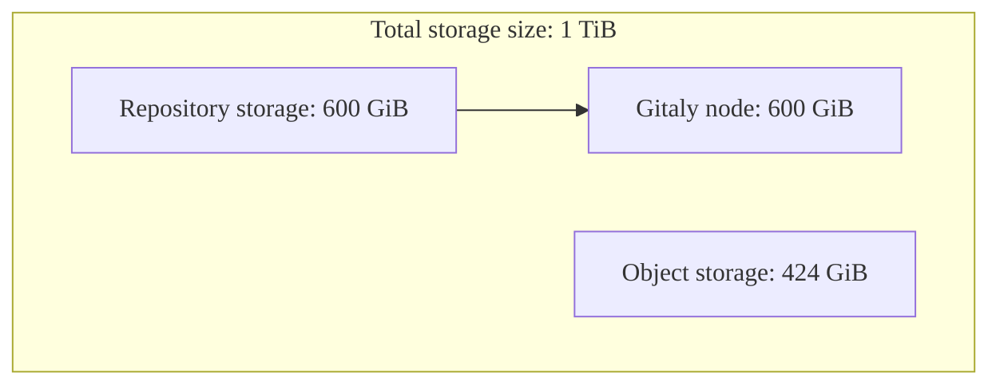
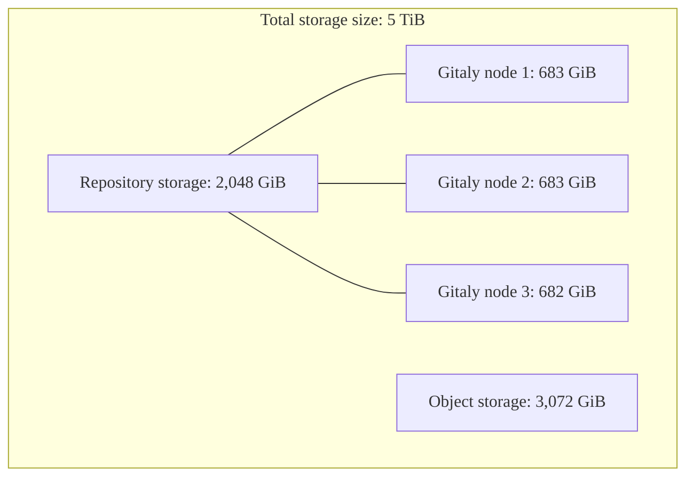



- Niveau : Ultimate
- Offre : GitLab Dedicated



GitLab Dedicated fournit une instance GitLab monolocataire entièrement gérée, déployée dans la région AWS cloud de votre choix. Votre équipe de compte travaille avec vous pour déterminer vos besoins en stockage lors du processus d'approvisionnement.

Comprendre le fonctionnement du stockage dans GitLab Dedicated vous aide à prendre des décisions éclairées concernant la configuration de l'instance et la gestion des ressources.

## Composants de stockage {#storage-components}

GitLab Dedicated utilise différents types de stockage à différentes fins. L'allocation totale de stockage est répartie entre ces composants en fonction des modèles d'utilisation.

### Stockage total acheté {#total-purchased-storage}

Le stockage total acheté correspond au stockage combiné alloué à une instance GitLab Dedicated, incluant à la fois le stockage de vos dépôts et le stockage d'objets. Cette allocation représente la capacité de stockage totale achetée avec un abonnement GitLab Dedicated et configurée lors du provisionnement de l'instance.

Lors de la détermination des besoins en stockage, il s'agit de la mesure principale utilisée pour la planification et la tarification. Le stockage total acheté est ensuite réparti entre le stockage de dépôts et le stockage d'objets en fonction des modèles d'utilisation prévus.

### Stockage de dépôts {#repository-storage}

Le stockage de dépôts désigne l'espace alloué aux dépôts Git sur vos nœuds Gitaly. Ce stockage est réparti entre les nœuds Gitaly de votre instance en fonction de votre architecture de référence.

#### Stockage de dépôts par nœud Gitaly {#repository-storage-per-gitaly-node}

Chaque nœud Gitaly de votre instance dispose d'une capacité de stockage spécifique. Cette capacité détermine la taille maximale des dépôts individuels, car aucun dépôt ne peut dépasser la capacité d'un seul nœud Gitaly. Les poids de stockage déterminent quel nœud Gitaly reçoit chaque nouveau dépôt. GitLab gère ces poids en votre nom pour répartir les dépôts uniformément entre les nœuds.

Par exemple, si chaque nœud Gitaly dispose de 100 Gio de capacité de stockage et qu'il y a 3 nœuds Gitaly, votre instance peut stocker un total de 300 Gio de données de dépôts, mais aucun dépôt individuel ne peut dépasser 100 Gio.

### Stockage d'objets {#object-storage}

Le stockage d'objets est une architecture de stockage qui gère les données sous forme d'objets plutôt que selon une hiérarchie de fichiers. Dans GitLab, le stockage d'objets gère tout ce qui ne fait pas partie des dépôts Git, notamment :

- Les artefacts de job et les job logs issus des pipelines CI/CD
- Les images stockées dans le registre de conteneurs
- Les paquets stockés dans le registre de paquets
- Les sites web déployés avec GitLab Pages
- Les fichiers d'état pour les projets Terraform

Le stockage d'objets dans GitLab Dedicated est implémenté via Amazon S3 avec une réplication appropriée pour la protection des données.

### Stockage blended {#blended-storage}

Le stockage blended est le stockage global utilisé par une instance GitLab Dedicated, incluant le stockage d'objets, le stockage de dépôts et les transferts de données.

<!-- vale gitlab_base.Spelling = NO -->

### Stockage unblended {#unblended-storage}

Le stockage unblended est la capacité de stockage au niveau de l'infrastructure pour chaque type de stockage. Vous travaillez principalement avec la taille totale du stockage et les chiffres de stockage de dépôts.

<!-- vale gitlab_base.Spelling = YES -->

## Planification et configuration du stockage {#storage-planning-and-configuration}

La planification du stockage pour une instance GitLab Dedicated implique de comprendre comment le stockage d'objets et le stockage de dépôts sont alloués dans l'infrastructure.

### Détermination de l'allocation initiale du stockage {#determining-initial-storage-allocation}

L'équipe de compte GitLab Dedicated vous aide à déterminer la quantité de stockage appropriée en fonction de :

- Nombre d'utilisateurs
- Nombre et taille des dépôts
- Modèles d'utilisation CI/CD
- Croissance anticipée

### Capacité des dépôts et architectures de référence {#repository-capacity-and-reference-architectures}

Le stockage de vos dépôts est réparti entre les nœuds Gitaly. Cela détermine la taille maximale des dépôts individuels, car aucun dépôt ne peut dépasser la capacité d'un seul nœud Gitaly.

Le nombre de nœuds Gitaly pour une instance dépend de l'architecture de référence déterminée lors de l'intégration, principalement en fonction du nombre d'utilisateurs. Les architectures de référence pour les instances de plus de 2 000 utilisateurs utilisent généralement trois nœuds Gitaly. Pour plus d'informations, consultez [les architectures de référence](../../reference_architectures/_index.md).

#### Afficher l'architecture de référence {#view-reference-architecture}

Pour afficher votre architecture de référence :

1. Connectez-vous à [Switchboard](https://console.gitlab-dedicated.com/).
1. En haut de la page, sélectionnez **Configuration**.
1. Depuis la page de présentation du tenant, localisez le champ **Reference architecture**.

> [!note]
> Pour confirmer le nombre de nœuds Gitaly dans l'architecture de votre tenant, [soumettez un ticket de support](https://support.gitlab.com/hc/en-us/requests/new?ticket_form_id=4414917877650).

### Exemples de calculs de stockage {#example-storage-calculations}

Ces exemples illustrent comment l'allocation du stockage affecte les limitations de taille des dépôts :

#### Charge de travail standard avec 2 000 utilisateurs {#standard-workload-with-2000-users}

- Architecture de référence :  Jusqu'à 2 000 utilisateurs (1 nœud Gitaly)
- Taille totale du stockage :  1 Tio (1 024 Gio)
- Allocation :  600 Gio de stockage de dépôts, 424 Gio de stockage d'objets
- Stockage de dépôts par nœud Gitaly :  600 Gio

#### Charge de travail intensive CI/CD avec 10 000 utilisateurs {#cicd-intensive-workload-with-10000-users}

- Architecture de référence :  Jusqu'à 10 000 utilisateurs (3 nœuds Gitaly)
- Taille totale du stockage :  5 Tio (5 120 Gio)
- Allocation :  2 048 Gio de stockage de dépôts, 3 072 Gio de stockage d'objets
- Stockage de dépôts par nœud Gitaly : ~683 Gio (2 048 Gio ÷ 3 nœuds Gitaly)

## Gérer la croissance du stockage {#manage-storage-growth}

Pour gérer efficacement la croissance du stockage :

- Définissez des politiques de nettoyage pour le [registre de paquets](../../../user/packages/package_registry/reduce_package_registry_storage.md#cleanup-policy) afin de supprimer automatiquement les anciens actifs de paquets.
- Définissez des politiques de nettoyage pour le [registre de conteneurs](../../../user/packages/container_registry/reduce_container_registry_storage.md#cleanup-policy) afin de supprimer les tags de conteneurs inutilisés.
- Définissez une période d'expiration pour les [artefacts de job](../../../ci/jobs/job_artifacts.md#with-an-expiry).
- Passez en revue et archivez ou supprimez les [projets inutilisés](../../../user/project/working_with_projects.md).

## Foire aux questions {#frequently-asked-questions}

### Puis-je modifier l'allocation de stockage après le provisionnement de mon instance ? {#can-i-change-my-storage-allocation-after-my-instance-is-provisioned}

Oui, vous pouvez demander du stockage supplémentaire en contactant votre équipe de compte ou en ouvrant un ticket de support. Les modifications du stockage affectent la facturation.

### Comment le stockage affecte-t-il les performances ? {#how-does-storage-affect-performance}

Une allocation de stockage appropriée garantit des performances optimales. Un stockage sous-dimensionné peut entraîner des problèmes de performances, en particulier pour les opérations sur les dépôts et les pipelines CI/CD.

### Comment le stockage est-il géré pour la réplication Geo ? {#how-is-storage-handled-for-geo-replication}

GitLab Dedicated inclut un site Geo secondaire pour la reprise après sinistre, avec une allocation de stockage basée sur la configuration de votre site principal.

### Puis-je utiliser mon propre compartiment S3 pour le stockage d'objets ? {#can-i-bring-my-own-s3-bucket-for-object-storage}

Non, GitLab Dedicated utilise des compartiments AWS S3 gérés par GitLab dans votre compte tenant.

## Sujets connexes {#related-topics}

- [Résidence des données et haute disponibilité](data_residency_high_availability.md)
- [Architectures de référence](../../reference_architectures/_index.md)
- [Stockage d'objets](../../object_storage.md)
