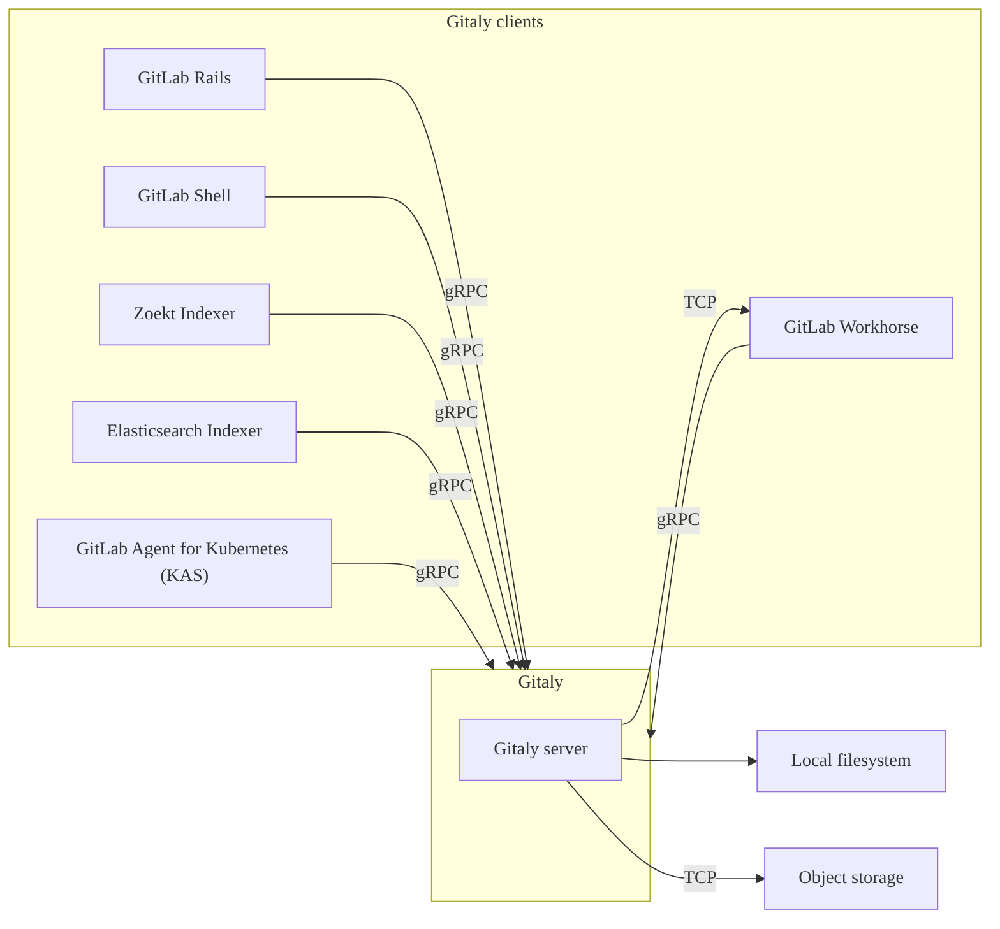



- Édition : Gratuite, GitLab Premium, GitLab Ultimate
- Offre : GitLab Self-Managed



[Gitaly](https://gitlab.com/gitlab-org/gitaly) fournit un accès de haut niveau par appel de procédure distante (RPC) aux dépôts Git. Il est utilisé par GitLab pour lire et écrire des données Git.

Gitaly est présent dans chaque installation GitLab et coordonne le stockage et la récupération des dépôts Git. Gitaly peut être :

- Un service en arrière-plan fonctionnant sur une installation de package Linux à instance unique (l'ensemble de GitLab sur une seule machine).
- Séparé sur sa propre instance et configuré dans une configuration de cluster complète, selon les exigences de mise à l'échelle et de disponibilité.

> [!note]
> Gitaly gère uniquement l'accès aux dépôts Git pour GitLab. Les autres types de données GitLab ne sont pas accessibles via Gitaly.

GitLab accède aux [dépôts](../../user/project/repository/_index.md) via les [stockages de dépôts](../repository_storage_paths.md) configurés. Chaque nouveau dépôt est stocké dans l'un des stockages de dépôts en fonction de leurs [poids configurés](../repository_storage_paths.md#configure-where-new-repositories-are-stored). Chaque stockage de dépôt est soit :

- Un stockage Gitaly avec accès direct aux dépôts via les [chemins de stockage](../repository_storage_paths.md), où chaque dépôt est stocké sur un seul nœud Gitaly. Toutes les requêtes sont acheminées vers ce nœud.
- Un [stockage virtuel](praefect/_index.md#virtual-storage) fourni par [Gitaly Cluster (Praefect)](praefect/_index.md), où chaque dépôt peut être stocké sur plusieurs nœuds Gitaly pour la tolérance aux pannes. Avec Gitaly Cluster (Praefect) :
  - Les requêtes en lecture sont distribuées entre plusieurs nœuds Gitaly, ce qui peut améliorer les performances.
  - Les requêtes en écriture sont diffusées aux réplicas du dépôt.

Ce qui suit montre GitLab configuré pour utiliser l'accès direct à Gitaly :

Dans cet exemple :

- Chaque dépôt est stocké dans l'un des trois stockages Gitaly : `storage-1`, `storage-2` ou `storage-3`.
- Chaque stockage est desservi par un nœud Gitaly.
- Les trois nœuds Gitaly stockent les données sur leurs systèmes de fichiers.

## Exigences en matière de disque {#disk-requirements}

Gitaly et Gitaly Cluster (Praefect) nécessitent un stockage local rapide pour fonctionner efficacement, car ce sont des processus à forte intensité d'E/S. Par conséquent, nous recommandons vivement que tous les nœuds Gitaly utilisent des disques à état solide (SSD). Ces SSD doivent avoir un débit élevé en lecture et en écriture, car Gitaly traite simultanément de nombreux petits fichiers.

À titre de référence, les graphiques suivants montrent les IOPS disque P99 sur l'ensemble de la flotte de production Gitaly sur GitLab.com à une granularité d'une minute. Les données ont été extraites sur une période représentative de sept jours, commençant et se terminant un lundi matin. Notez les pics réguliers d'IOPS lorsque le trafic devient plus intense pendant la semaine de travail. Les données brutes montrent des pics encore plus importants, avec des écritures culminant à 8 000 IOPS. Le débit disque disponible doit gérer ces pics pour éviter les interruptions des requêtes Gitaly.

- IOPS disque P99 (lectures) :

  

- IOPS disque P99 (écritures) :

  

Nous observons généralement :

- Entre 500 et 1 000 lectures par seconde, avec des pics à 3 500 lectures par seconde.
- Environ 500 écritures par seconde, avec des pics de plus de 3 000 écritures par seconde.

La majorité de la flotte Gitaly au moment de la rédaction sont des instances `t2d-standard-32` avec des disques `pd-ssd`. Les IOPS maximaux [annoncés](https://cloud.google.com/compute/docs/disks/performance#t2d_instances) en écriture et en lecture sont de 60 000.

GitLab.com applique également des [limites de simultanéité](concurrency_limiting.md) plus strictes sur les opérations Git coûteuses qui ne sont pas activées par défaut sur les instances GitLab Self-Managed. Les limites de simultanéité assouplies, les opérations sur des monodépôts particulièrement volumineux, ou l'utilisation du [cache pack-objects](configure_gitaly.md#pack-objects-cache) peuvent également augmenter significativement l'activité disque.

En pratique, dans votre propre environnement, l'activité disque que vous observez sur vos instances Gitaly peut varier considérablement par rapport à ces résultats publiés. Si vous fonctionnez dans un environnement cloud, le choix d'instances plus grandes augmente généralement les IOPS disque disponibles. Vous pouvez également choisir de sélectionner un type de disque IOPS provisionné avec un débit garanti. Consultez la documentation de votre fournisseur cloud pour savoir comment configurer correctement les IOPS.

Pour les données de dépôt, seul le stockage local est pris en charge pour Gitaly et Gitaly Cluster (Praefect) pour des raisons de performances et de cohérence. Les alternatives telles que [NFS](../nfs.md) ou les [systèmes de fichiers basés sur le cloud](../nfs.md#avoid-using-cloud-based-file-systems) ne sont pas prises en charge.

## Architecture de Gitaly {#gitaly-architecture}

Gitaly implémente une architecture client-serveur :

- Un serveur Gitaly est tout nœud qui exécute Gitaly lui-même.
- Un client Gitaly est tout nœud qui exécute un processus effectuant des requêtes vers le serveur Gitaly. Les clients Gitaly sont également connus sous le nom de consommateurs Gitaly et comprennent :
  - [Application GitLab Rails](https://gitlab.com/gitlab-org/gitlab)
  - [GitLab Shell](https://gitlab.com/gitlab-org/gitlab-shell)
  - [GitLab Workhorse](https://gitlab.com/gitlab-org/gitlab-workhorse)
  - [GitLab Elasticsearch Indexer](https://gitlab.com/gitlab-org/gitlab-elasticsearch-indexer)
  - [GitLab Zoekt Indexer](https://gitlab.com/gitlab-org/gitlab-zoekt-indexer)
  - [GitLab Agent for Kubernetes (KAS)](https://gitlab.com/gitlab-org/cluster-integration/gitlab-agent)

Ce qui suit illustre l'architecture client-serveur de Gitaly :

## Configuration de Gitaly {#configuring-gitaly}

Gitaly est préconfiguré avec une installation de package Linux, qui est une configuration [adaptée jusqu'à 20 RPS / 1 000 utilisateurs](../reference_architectures/1k_users.md). Pour :

- Les installations de packages Linux jusqu'à 40 RPS / 2 000 utilisateurs, voir les [instructions de configuration spécifiques à Gitaly](../reference_architectures/2k_users.md#configure-gitaly).
- Les installations compilées à partir des sources ou les installations Gitaly personnalisées, voir [Configurer Gitaly](configure_gitaly.md).

Les installations GitLab pour plus de 2 000 utilisateurs actifs effectuant des opérations d'écriture Git quotidiennes peuvent être mieux adaptées à l'utilisation de Gitaly Cluster (Praefect).

## Interface en ligne de commande Gitaly {#gitaly-cli}



- Sous-commande `gitaly git` [introduite](https://gitlab.com/gitlab-org/gitaly/-/merge_requests/7119) dans GitLab 17.4.



La commande `gitaly` est une interface en ligne de commande qui fournit des sous-commandes supplémentaires pour les administrateurs Gitaly. Par exemple, l'interface en ligne de commande Gitaly est utilisée pour :

- [Configurer des hooks Git personnalisés](../server_hooks.md) pour un dépôt.
- Valider les fichiers de configuration Gitaly.
- Vérifier que l'API Gitaly interne est accessible.
- [Exécuter des commandes Git](troubleshooting.md#use-gitaly-git-when-git-is-required-for-troubleshooting) sur un dépôt sur disque.

Pour plus d'informations sur les autres sous-commandes, exécutez `sudo -u git -- /opt/gitlab/embedded/bin/gitaly --help`.

## Sauvegarde des dépôts {#backing-up-repositories}

Lors de la sauvegarde ou de la synchronisation de dépôts à l'aide d'outils autres que GitLab, vous devez [empêcher les écritures](../backup_restore/backup_gitlab.md#prevent-writes-and-copy-the-git-repository-data) lors de la copie des données du dépôt.

## URI de bundle {#bundle-uris}

Vous pouvez utiliser les [URI de bundle](https://git-scm.com/docs/bundle-uri) Git avec Gitaly. Pour plus d'informations, consultez la [documentation sur les URI de bundle](bundle_uris.md).

## Accès direct aux dépôts {#directly-accessing-repositories}

GitLab déconseille d'accéder directement aux dépôts Gitaly stockés sur disque avec un client Git ou tout autre outil, car Gitaly est continuellement amélioré et modifié. Ces améliorations peuvent invalider vos hypothèses, entraînant une dégradation des performances, une instabilité, voire une perte de données. Par exemple :

- Gitaly dispose d'optimisations telles que le [cache d'annonce `info/refs`](https://gitlab.com/gitlab-org/gitaly/blob/master/doc/design_diskcache.md), qui repose sur le contrôle et la surveillance par Gitaly de l'accès aux dépôts via l'interface gRPC officielle.
- [Gitaly Cluster (Praefect)](praefect/_index.md) dispose d'optimisations, telles que la tolérance aux pannes et les [lectures distribuées](praefect/_index.md#distributed-reads), qui dépendent de l'interface gRPC et de la base de données pour déterminer l'état du dépôt.

> [!warning]
> L'accès direct aux dépôts Git est effectué à vos propres risques et n'est pas pris en charge.
