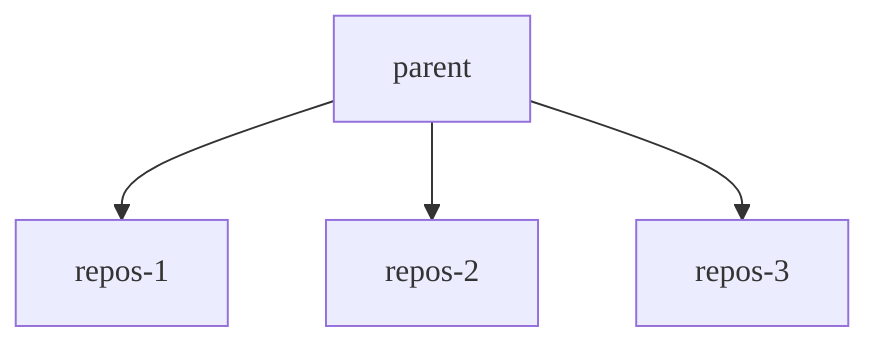

Vous pouvez utiliser les groupes de contrôle (cgroups) dans Linux pour imposer des limites sur la quantité de mémoire et de CPU pouvant être consommée par des processus spécifiques. Les cgroups peuvent aider à protéger les systèmes contre l'épuisement inattendu des ressources dû à une surconsommation de mémoire et de CPU. Les cgroups sont largement disponibles et sont couramment utilisés comme mécanisme fondamental pour la conteneurisation.

Les cgroups sont configurés à l'aide d'un pseudo-système de fichiers, généralement monté sur `/sys/fs/cgroup`, et allouent les ressources de manière hiérarchique. Le point de montage est configurable dans Gitaly. La structure varie selon la version des cgroups utilisée :

- Cgroups v1 suit une hiérarchie orientée ressources. Les répertoires parents sont des ressources telles que `cpu` et `memory`.
- Cgroups v2 adopte une approche orientée processus. Les répertoires parents sont des groupes de processus, et les fichiers qu'ils contiennent représentent chaque ressource contrôlée.

Pour une introduction plus approfondie, consultez la [page de manuel Linux des cgroups](https://man7.org/linux/man-pages/man7/cgroups.7.html).

Lorsque Gitaly s'exécute :

- Sur une machine virtuelle, les cgroups v1 et v2 sont tous deux pris en charge. Gitaly détecte automatiquement la version de cgroup à utiliser en fonction du point de montage.
- Sur un cluster Kubernetes, seuls les cgroups v2 sont pris en charge, car les autorisations de lecture et d'écriture dans la hiérarchie des cgroups ne peuvent pas être déléguées aux conteneurs utilisant les cgroups v1.

Des fonctionnalités et améliorations supplémentaires peuvent être disponibles lorsque Gitaly s'exécute avec les cgroups v2, telles que la possibilité d'utiliser l'appel système [clone](https://man7.org/linux/man-pages/man2/clone.2.html) pour démarrer directement un processus sous un cgroup.

## Avant de commencer {#before-you-begin}

L'activation des limites sur votre environnement doit être effectuée avec prudence et uniquement dans des circonstances particulières, par exemple pour se protéger contre un trafic inattendu. Une fois atteintes, les limites entraînent des déconnexions qui ont un impact négatif sur les utilisateurs. Pour des performances cohérentes et stables, vous devez d'abord explorer d'autres options, telles que l'ajustement des spécifications des nœuds et [l'examen des grands dépôts](../../user/project/repository/monorepos/_index.md) ou des charges de travail.

Lors de l'activation des cgroups pour la mémoire, vous devez vous assurer qu'aucun swap n'est configuré sur les nœuds Gitaly, car les processus pourraient basculer vers son utilisation au lieu d'être arrêtés. Le noyau considère la mémoire swap disponible comme un complément aux limites imposées par le cgroup. Cette situation pourrait entraîner des performances notablement dégradées. Pour activer les cgroups dans Gitaly, vous devez configurer le champ `repositories` avec un `count` supérieur à `0`.

## Comment Gitaly bénéficie des cgroups {#how-gitaly-benefits-from-cgroups}

Certaines opérations Git peuvent consommer des ressources excessives jusqu'au point d'épuisement dans des situations telles que :

- Trafic exceptionnellement élevé.
- Opérations exécutées sur de grands dépôts qui ne respectent pas les bonnes pratiques.

L'activité sur des dépôts spécifiques qui consomment ces ressources est connue sous le nom de « voisins bruyants » (noisy neighbors), et peut entraîner une dégradation des performances Git pour les autres dépôts hébergés sur le serveur Gitaly.

En tant que protection ferme, Gitaly peut utiliser les cgroups pour indiquer au noyau de mettre fin à ces opérations avant qu'elles n'accaparent toutes les ressources système et ne causent une instabilité. Gitaly assigne les processus Git à un cgroup en fonction du dépôt dans lequel la commande Git opère. Ces cgroups sont appelés cgroups de dépôt. Chaque cgroup de dépôt :

- Possède une limite de mémoire et de CPU.
- Contient les processus Git pour un ou plusieurs dépôts. Le nombre total de cgroups est configurable. Chaque cgroup utilise un hachage circulaire cohérent pour garantir qu'un processus Git pour un dépôt donné se retrouve toujours dans le même cgroup.

Lorsqu'un cgroup de dépôt atteint sa :

- Limite de mémoire, le noyau recherche parmi les processus un candidat à terminer, ce qui peut entraîner l'abandon des requêtes client.
- Limite de CPU, les processus ne sont pas terminés, mais ils sont empêchés de consommer plus de CPU que ce qui est autorisé, ce qui signifie que les requêtes client peuvent être limitées, mais pas abandonnées.

Lorsque ces limites sont atteintes, les performances peuvent être réduites et les utilisateurs peuvent être déconnectés.

Le diagramme suivant illustre la structure des cgroups :

- Le cgroup parent régit les limites pour tous les processus Git.
- Chaque cgroup de dépôt (nommé `repos-1` à `repos-3`) applique des limites au niveau du dépôt.

Si le stockage Gitaly sert :

- Seulement trois dépôts, chaque dépôt s'insère directement dans l'un des cgroups.
- Plus que le nombre de cgroups de dépôt, plusieurs dépôts sont assignés au même groupe de manière cohérente.



## Configuration de la souscription excessive {#configuring-oversubscription}

Le nombre de cgroups de dépôt doit être raisonnablement élevé afin que l'isolation puisse toujours avoir lieu sur les stockages qui servent des milliers de dépôts. Un bon point de départ pour le nombre de dépôts est le double du nombre de dépôts actifs sur le stockage.

Étant donné que les cgroups de dépôt imposent des limites supplémentaires en plus du cgroup parent, si nous les configurions en divisant les limites parentes par le nombre de groupes, nous nous retrouverions avec des limites trop restrictives. Par exemple :

- Notre limite de mémoire parente est de 32 Gio.
- Nous avons environ 100 dépôts actifs.
- Nous avons configuré `cgroups.repositories.count = 100`.

Si nous divisons 32 Gio par 100, nous allouerions seulement 0,32 Gio par cgroup de dépôt. Ce paramètre entraînerait des performances extrêmement médiocres et une sous-utilisation significative.

Vous pouvez utiliser la souscription excessive pour maintenir un niveau de performance de référence pendant les opérations normales, tout en permettant à un petit nombre de dépôts à forte charge de travail de « burster » si nécessaire, sans impacter les requêtes sans rapport. La souscription excessive consiste à attribuer plus de ressources que ce qui est techniquement disponible sur le système.

En utilisant l'exemple précédent, nous pouvons sursouscrire nos cgroups de dépôt en allouant 10 Gio de mémoire chacun, bien que le système ne dispose pas de 10 Gio * 100 de mémoire système. Ces valeurs supposent que 10 Gio est suffisant pour les opérations normales sur n'importe quel dépôt, mais permettent également à deux dépôts de burster à 10 Gio chacun, tout en laissant un troisième espace de ressources pour maintenir les performances de référence.

Une règle similaire s'applique au temps CPU. Nous allouons délibérément des cgroups de dépôt avec plus de cœurs CPU que ce qui est disponible dans l'ensemble du système. Par exemple, nous pourrions décider d'allouer 4 cœurs par cgroup de dépôt, même si le système ne dispose pas de 400 cœurs au total.

Deux valeurs principales contrôlent la souscription excessive :

-`cpu_quota_us` -`memory_bytes`

La différence entre chaque valeur pour les cgroups parents par rapport aux cgroups de dépôt détermine le niveau de souscription excessive.

## Mesure et ajustement {#measurement-and-tuning}

Pour établir et ajuster les besoins en ressources de référence corrects pour la souscription excessive, vous devez observer la charge de production sur vos serveurs Gitaly. Les [métriques Prometheus](../monitoring/prometheus/_index.md) exposées par défaut sont suffisantes à cet effet. Vous pouvez utiliser les requêtes suivantes comme guide pour mesurer l'utilisation du CPU et de la mémoire pour un serveur Gitaly spécifique :

| Requête                                                                                                                                                | Ressource                                                          |
|------------------------------------------------------------------------------------------------------------------------------------------------------|-------------------------------------------------------------------|
| `quantile_over_time(0.99, instance:node_cpu_utilization:ratio{type="gitaly", fqdn="gitaly.internal"}[5m])`    | Utilisation CPU au p99 d'un nœud Gitaly avec le `fqdn` spécifié    |
| `quantile_over_time(0.99, instance:node_memory_utilization:ratio{type="gitaly", fqdn="gitaly.internal"}[5m])` | Utilisation mémoire au p99 d'un nœud Gitaly avec le `fqdn` spécifié |

En fonction de l'utilisation que vous observez sur une période représentative (par exemple, une semaine de travail typique), vous pouvez déterminer les besoins en ressources de référence pour les opérations normales. Pour établir la configuration de l'exemple précédent, nous aurions observé une utilisation mémoire cohérente de 10 Gio sur la semaine de travail, et une charge de 4 cœurs sur le CPU.

À mesure que votre charge de travail évolue, vous devez revoir les métriques et apporter des ajustements à la configuration des cgroups. Vous devez également ajuster la configuration si vous constatez des performances significativement dégradées après l'activation des cgroups, car cela pourrait être un indicateur de limites trop restrictives.

## Paramètres de configuration disponibles {#available-configuration-settings}



- `max_cgroups_per_repo` [introduit](https://gitlab.com/gitlab-org/gitaly/-/issues/5689) dans GitLab 16.7.
- La documentation de la méthode héritée a été [supprimée](https://gitlab.com/gitlab-org/gitlab/-/merge_requests/176694) dans GitLab 17.8.



Pour configurer les cgroups de dépôt dans Gitaly, utilisez les paramètres suivants pour `gitaly['configuration'][:cgroups]` dans `/etc/gitlab/gitlab.rb` :

- `mountpoint` est l'endroit où le répertoire cgroup parent est monté. Par défaut, `/sys/fs/cgroup`.
- `hierarchy_root` est le cgroup parent sous lequel Gitaly crée des groupes, et est censé appartenir à l'utilisateur et au groupe sous lesquels Gitaly s'exécute. Une installation via le package Linux crée l'ensemble des répertoires `mountpoint/<cpu|memory>/hierarchy_root` au démarrage de Gitaly.
- `memory_bytes` est la limite totale de mémoire imposée collectivement à tous les processus Git que Gitaly génère. 0 signifie aucune limite.
- `cpu_shares` est la limite CPU imposée collectivement à tous les processus Git que Gitaly génère. 0 signifie aucune limite. Le maximum est de 1024 parts, ce qui représente 100 % du CPU.
- `cpu_quota_us` est le [`cfs_quota_us`](https://docs.kernel.org/scheduler/sched-bwc.html#management) permettant de limiter les processus des cgroups s'ils dépassent cette valeur de quota. Nous définissons `cfs_period_us` à `100ms` de sorte qu'1 cœur corresponde à `100000`. 0 signifie aucune limite.
- `repositories.count` est le nombre de cgroups dans le pool de cgroups. Chaque fois qu'une nouvelle commande Git est générée, Gitaly l'assigne à l'un de ces cgroups en fonction du dépôt concerné par la commande. Un algorithme de hachage circulaire assigne les commandes Git à ces cgroups, de sorte qu'une commande Git pour un dépôt est toujours assignée au même cgroup.
- `repositories.memory_bytes` est la limite totale de mémoire imposée à tous les processus Git contenus dans un cgroup de dépôt. 0 signifie aucune limite. Cette valeur ne peut pas dépasser celle du niveau supérieur `memory_bytes`.
- `repositories.cpu_shares` est la limite CPU imposée à tous les processus Git contenus dans un cgroup de dépôt. 0 signifie aucune limite. Le maximum est de 1024 parts, ce qui représente 100 % du CPU. Cette valeur ne peut pas dépasser celle du niveau supérieur`cpu_shares`.
- `repositories.cpu_quota_us` est le [`cfs_quota_us`](https://docs.kernel.org/scheduler/sched-bwc.html#management) imposé à tous les processus Git contenus dans un cgroup de dépôt. Un processus Git ne peut pas utiliser plus que le quota donné. Nous définissons `cfs_period_us` à `100ms` de sorte qu'1 cœur corresponde à `100000`. 0 signifie aucune limite.
- `repositories.max_cgroups_per_repo` est le nombre de cgroups de dépôt sur lesquels les processus Git ciblant un dépôt spécifique peuvent être répartis. Cela permet de configurer des limites CPU et mémoire plus conservatrices pour les cgroups de dépôt tout en permettant des charges de travail en rafale. Par exemple, avec un `max_cgroups_per_repo` de `2` et une limite `memory_bytes` de 10 Go, les opérations Git indépendantes sur un dépôt spécifique peuvent consommer jusqu'à 20 Go de mémoire.

Par exemple (pas nécessairement des paramètres recommandés) :

```ruby
# in /etc/gitlab/gitlab.rb
gitaly['configuration'] = {
  # ...
  cgroups: {
    mountpoint: '/sys/fs/cgroup',
    hierarchy_root: 'gitaly',
    memory_bytes: 64424509440, # 60 GB
    cpu_shares: 1024,
    cpu_quota_us: 400000 # 4 cores
    repositories: {
      count: 1000,
      memory_bytes: 32212254720, # 20 GB
      cpu_shares: 512,
      cpu_quota_us: 200000, # 2 cores
      max_cgroups_per_repo: 2
    },
  },
}
```

## Surveillance des cgroups {#monitoring-cgroups}

Pour des informations sur la surveillance des cgroups, consultez [Surveiller les cgroups Gitaly](monitoring.md#monitor-gitaly-cgroups).
