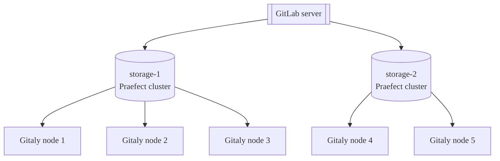
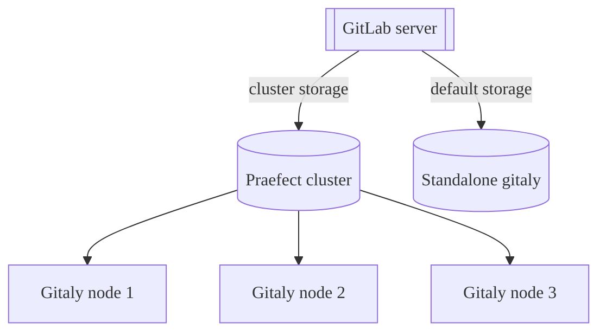



- Édition : Gratuite, GitLab Premium, GitLab Ultimate
- Offre : GitLab Self-Managed



Le stockage Git est fourni via le service Gitaly dans GitLab et est essentiel au fonctionnement de GitLab. Lorsque le nombre d'utilisateurs, de dépôts et l'activité augmentent, il est important de mettre à l'échelle Gitaly de manière appropriée en :

- Augmentant les ressources CPU et mémoire disponibles pour Git avant que l'épuisement des ressources ne dégrade les performances de Git, Gitaly et de l'application GitLab.
- Augmentant le stockage disponible avant que les limites de stockage ne soient atteintes, entraînant l'échec des opérations d'écriture.
- Supprimant les points de défaillance uniques pour améliorer la tolérance aux pannes. Git doit être considéré comme critique si une dégradation du service vous empêche de déployer des modifications en production.

Gitaly peut être exécuté dans une configuration en cluster pour :

- Mettre à l'échelle le service Gitaly.
- Augmenter la tolérance aux pannes.

Dans cette configuration, chaque dépôt Git peut être stocké sur plusieurs nœuds Gitaly dans le cluster.

L'utilisation de Gitaly Cluster (Praefect) augmente la tolérance aux pannes en :

- Répliquant les opérations d'écriture vers des nœuds Gitaly de secours actifs.
- Détectant les défaillances des nœuds Gitaly.
- Routant automatiquement les requêtes Git vers un nœud Gitaly disponible.

> [!note]
> Le support technique pour Gitaly Cluster (Praefect) est limité aux clients GitLab Premium et Ultimate.

Ce qui suit montre GitLab configuré pour accéder à `storage-1`, un stockage virtuel fourni par Gitaly Cluster (Praefect) :


Dans cet exemple :

- Les dépôts sont stockés sur un stockage virtuel appelé `storage-1`.
- Trois nœuds Gitaly fournissent l'accès à `storage-1` : `gitaly-1`, `gitaly-2` et `gitaly-3`.
- Les trois nœuds Gitaly partagent des données dans trois emplacements de stockage haché distincts.
- Le [facteur de réplication](#replication-factor) est `3`. Trois copies de chaque dépôt sont conservées.

Les objectifs de disponibilité pour Gitaly Cluster (Praefect) en supposant une défaillance d'un seul nœud sont :

- Objectif de point de récupération (RPO) : Moins d'1 minute.

  Les écritures sont répliquées de manière asynchrone. Toute écriture n'ayant pas été répliquée vers le nouveau nœud primaire promu est perdue. Toute opération de lecture en cours sur le nœud défaillant est terminée.

  [La cohérence forte](#strong-consistency) évite les pertes dans certaines circonstances.

- Objectif de temps de récupération (RTO) :  Moins de 10 secondes. Les pannes sont détectées par un contrôle de santé effectué par chaque nœud Praefect toutes les secondes. Le basculement nécessite dix contrôles de santé consécutifs échoués sur chaque nœud Praefect.

Des améliorations du RPO et du RTO sont proposées dans l'epic [8903](https://gitlab.com/groups/gitlab-org/-/epics/8903).

> [!warning]
> En cas de défaillance complète du cluster, les plans de reprise après sinistre doivent être mis en œuvre. Ceux-ci peuvent affecter le RPO et le RTO discutés précédemment.

## Avant de déployer Gitaly Cluster (Praefect) {#before-deploying-gitaly-cluster-praefect}

Gitaly Cluster (Praefect) offre les avantages de la tolérance aux pannes, mais implique une complexité supplémentaire de configuration et de gestion. Avant de déployer Gitaly Cluster (Praefect), consultez :

- Les [problèmes connus](#known-issues) existants.
- [Sauvegarde et récupération par snapshot](#snapshot-backup-and-recovery).
- [Conseils de configuration](../configure_gitaly.md) et [Options de stockage de dépôt](../../repository_storage_paths.md) pour vous assurer que Gitaly Cluster (Praefect) est la meilleure configuration pour vous.

Si vous n'avez pas encore migré vers Gitaly Cluster (Praefect), vous avez deux options :

- Une instance Gitaly fragmentée (sharded).
- Gitaly Cluster (Praefect).

Contactez votre Customer Success Manager ou le support client si vous avez des questions.

Si vous utilisez déjà Gitaly Cluster (Praefect) et rencontrez un problème ou une limitation, contactez le support client pour une aide immédiate à la restauration ou à la récupération.

### Problèmes connus {#known-issues}

Le tableau suivant présente les problèmes connus actuels ayant un impact sur l'utilisation de Gitaly Cluster (Praefect). Pour connaître le statut actuel de ces problèmes, consultez les tickets et les epics référencés.

| Problème                                                                                                 | Résumé                                                                                                                                                                                                                                    | Comment éviter                                                                                                                                                                                                                                                                                                                                                                                                               |
|:------------------------------------------------------------------------------------------------------|:-------------------------------------------------------------------------------------------------------------------------------------------------------------------------------------------------------------------------------------------|:---------------------------------------------------------------------------------------------------------------------------------------------------------------------------------------------------------------------------------------------------------------------------------------------------------------------------------------------------------------------------------------------------------------------------|
| Gitaly Cluster (Praefect) + Geo - Problèmes lors de la relance des synchronisations échouées                                        | Si Gitaly Cluster (Praefect) est utilisé sur un site secondaire Geo, les dépôts dont la synchronisation a échoué peuvent continuer à échouer lorsque Geo tente de les resynchroniser. La récupération depuis cet état nécessite l'assistance du support pour exécuter des étapes manuelles. | Dans GitLab 15.0 à 15.2, activez le [`gitaly_praefect_generated_replica_paths` feature flag](#praefect-generated-replica-paths) sur votre site primaire Geo. Dans GitLab 15.3, le feature flag est activé par défaut.                                                                                                                                                                                                           |
| Praefect incapable d'insérer des données dans la base de données en raison de migrations non appliquées après une mise à niveau | Si la base de données n'est pas tenue à jour avec les migrations terminées, le nœud Praefect est incapable d'effectuer des opérations standard.                                                                                                         | Assurez-vous que la base de données Praefect est opérationnelle avec toutes les migrations terminées. Par exemple, cette commande devrait afficher la liste de toutes les migrations appliquées : `sudo -u git -- /opt/gitlab/embedded/bin/praefect -config /var/opt/gitlab/praefect/config.toml sql-migrate-status`. Envisagez de [demander une assistance à la mise à niveau](https://about.gitlab.com/support/scheduling-upgrade-assistance/) afin que votre plan de mise à niveau puisse être examiné par le support. |
| Restauration d'un nœud Gitaly Cluster (Praefect) à partir d'un snapshot dans un cluster en cours d'exécution                       | Étant donné que Gitaly Cluster (Praefect) fonctionne avec un état cohérent, l'introduction d'un seul nœud en retard empêche le cluster de réconcilier les données de ce nœud avec celles des autres nœuds.                                    | Ne restaurez pas un seul nœud Gitaly Cluster (Praefect) à partir d'un snapshot de sauvegarde. Si vous devez effectuer une restauration à partir d'une sauvegarde :<br/><br/>1\. [Arrêtez GitLab](../../read_only_gitlab.md#shut-down-the-gitlab-ui).<br/>2\. Prenez un snapshot de tous les nœuds Gitaly Cluster (Praefect) en même temps.<br/>3\. Effectuez un dump de la base de données Praefect.                                                                                              |
| Limitations lors de l'exécution dans Kubernetes, Amazon ECS ou similaire                                        | Gitaly Cluster (Praefect) n'est pas pris en charge et Gitaly présente des limitations connues. Pour plus d'informations, consultez l'epic [6127](https://gitlab.com/groups/gitlab-org/-/epics/6127).                                                                     | Utilisez nos [architectures de référence](../../reference_architectures/_index.md).                                                                                                                                                                                                                                                                                                                                                |
| `PostReceiveHook` invoqué avant que l'écriture ait été enregistrée par Praefect                                  | Une condition de concurrence permet à `PostReceiveHook` de s'exécuter avant que les écritures ne soient répliquées sur tous les nœuds. Lorsque les pipelines CI/CD ciblent des réplicas qui n'ont pas encore reçu l'écriture, cette condition de concurrence provoque l'échec des pipelines avec une erreur `couldn't find remote ref refs/merge-requests/$iid/{head,merge}`. Pour plus d'informations, consultez le ticket [5406](https://gitlab.com/gitlab-org/gitaly/-/issues/5406) | Relancez l'intégralité du job ou relancez uniquement l'étape de récupération des sources. Pour plus d'informations, consultez [les tentatives d'étapes de job](../../../ci/runners/configure_runners.md#job-stages-attempts). |
| La mise à l'échelle automatique HPA peut entraîner l'échec silencieux des déplacements de stockage                                             | Lors de l'utilisation de l'Horizontal Pod Autoscaler (HPA) avec des pods Sidekiq, les déplacements de stockage de dépôt peuvent échouer silencieusement en raison de la mise à l'échelle des pods pendant l'exécution du job.                                                                                                | Avant d'effectuer des déplacements de stockage de dépôt, configurez HPA avec des réplicas fixes, en définissant `minReplicas` = `maxReplicas` pour éviter la mise à l'échelle pendant la migration.                                                                                                                                                                                                                                                                        |

### Sauvegarde et récupération par snapshot {#snapshot-backup-and-recovery}

Gitaly Cluster (Praefect) ne prend pas en charge les sauvegardes par snapshot. Les sauvegardes par snapshot peuvent entraîner des problèmes de désynchronisation entre la base de données Praefect et le stockage disque. En raison de la façon dont Praefect reconstruit les métadonnées de réplication des informations du disque Gitaly lors d'une restauration, vous devez utiliser les [tâches Rake officielles de sauvegarde et de restauration](../../backup_restore/_index.md).

La [méthode de sauvegarde incrémentielle](../../backup_restore/backup_gitlab.md#incremental-repository-backups) peut être utilisée pour accélérer les sauvegardes de Gitaly Cluster (Praefect).

Si vous ne pouvez pas utiliser l'une ou l'autre méthode, contactez le support client pour obtenir de l'aide à la restauration.

## Comparaison avec Geo {#comparison-to-geo}

Gitaly Cluster (Praefect) et [Geo](../../geo/_index.md) offrent différents types de redondance.

- La redondance de Gitaly Cluster (Praefect) assure la tolérance aux pannes pour le stockage des données et est invisible pour l'utilisateur.
- La redondance de Geo fournit la [réplication](../../geo/_index.md) (visible par l'utilisateur) et la [reprise après sinistre](../../geo/disaster_recovery/_index.md) pour une instance entière de GitLab. Geo [réplique plusieurs types de données](../../geo/replication/datatypes.md#replicated-data-types), y compris les données Git.

Le tableau suivant présente les principales différences entre Gitaly Cluster (Praefect) et Geo :

| Outil                      | Nœuds    | Emplacements | Tolérance à la latence                                                                                      | Basculement                                                                     | Cohérence                   | Assure la redondance pour |
|:--------------------------|:---------|:----------|:-------------------------------------------------------------------------------------------------------|:-----------------------------------------------------------------------------|:------------------------------|:------------------------|
| Gitaly Cluster (Praefect) | Multiple | Unique    | [Moins d'1 seconde, idéalement en millisecondes à un seul chiffre](configure.md#network-latency-and-connectivity) | [Automatique](configure.md#automatic-failover-and-primary-election) | [Forte](#strong-consistency) | Stockage de données dans Git     |
| Geo                       | Multiple | Multiple  | Jusqu'à une minute                                                                                       | [Manuelle](../../geo/disaster_recovery/_index.md)                              | Éventuelle                      | Instance GitLab entière  |

Pour plus d'informations, voir :

- Geo [cas d'utilisation](../../geo/_index.md#use-cases).
- Geo [architecture](../../geo/_index.md#architecture).

## Stockage virtuel {#virtual-storage}

Le stockage virtuel permet de disposer d'un seul stockage de dépôt dans GitLab pour simplifier la gestion des dépôts.

Le stockage virtuel avec Gitaly Cluster (Praefect) peut généralement remplacer les configurations de stockage Gitaly direct. Cependant, cela se fait au détriment d'un espace de stockage supplémentaire nécessaire pour stocker chaque dépôt sur plusieurs nœuds Gitaly. L'avantage d'utiliser le stockage virtuel Gitaly Cluster (Praefect) par rapport au stockage Gitaly direct est :

- Meilleure tolérance aux pannes, car chaque nœud Gitaly possède une copie de chaque dépôt.
- Meilleure utilisation des ressources, réduisant le besoin de surprovisionnement pour les pics de charge spécifiques aux fragments, car les charges de lecture sont distribuées entre les nœuds Gitaly.
- Le rééquilibrage manuel pour les performances n'est pas nécessaire, car les charges de lecture sont distribuées entre les nœuds Gitaly.
- Gestion simplifiée, car tous les nœuds Gitaly sont identiques.

Le nombre de réplicas de dépôt peut être configuré à l'aide d'un [facteur de réplication](#replication-factor).

Il peut être peu économique d'avoir le même facteur de réplication pour tous les dépôts. Pour offrir une plus grande flexibilité aux instances GitLab extrêmement grandes, le facteur de réplication variable est suivi dans [ce ticket](https://gitlab.com/groups/gitlab-org/-/epics/3372).

Comme pour les stockages Gitaly standard, les stockages virtuels peuvent être fragmentés (sharded).

### Stockages virtuels multiples {#multiple-virtual-storages}

Vous pouvez configurer plusieurs stockages virtuels dans un déploiement Gitaly Cluster (Praefect). Cela vous permet de :

- Organiser les dépôts en clusters distincts avec différentes caractéristiques de performance.
- Appliquer différents facteurs de réplication à différents groupes de dépôts.
- Mettre à l'échelle différentes parties de votre infrastructure indépendamment.

Les stockages virtuels sont configurés dans `gitlab_rails['repositories_storages']` sur le serveur GitLab. Chaque entrée dans ce hash représente un stockage virtuel distinct. La configuration de Praefect définit quels nœuds Gitaly servent chaque stockage virtuel. Les dépôts dans différents stockages virtuels sont complètement indépendants et ne sont pas répliqués entre les stockages virtuels.

Par exemple, vous pourriez configurer :

- `storage-1` : Un stockage virtuel pour les dépôts de production critiques avec un facteur de réplication de 3.
- `storage-2` : Un stockage virtuel pour les dépôts moins critiques avec un facteur de réplication de 2.

Chaque stockage virtuel nécessite son propre ensemble de nœuds Gitaly.



Pour les instructions de configuration, consultez [Configurer plusieurs stockages virtuels](configure.md#configure-multiple-virtual-storages).

### Configuration mixte {#mixed-configuration}

Vous pouvez configurer GitLab pour utiliser une combinaison de :

- Instances Gitaly autonomes (stockage Gitaly direct).
- Stockages virtuels Gitaly Cluster (Praefect).

Vous pouvez utiliser une configuration mixte lorsque :

- Vous migrez de manière incrémentielle de Gitaly autonome vers Gitaly Cluster (Praefect).
- Certains dépôts nécessitent une haute disponibilité tandis que d'autres non.
- Vous souhaitez optimiser les coûts en utilisant Gitaly Cluster (Praefect) uniquement pour les dépôts critiques.

Dans une configuration mixte, chaque stockage est configuré indépendamment dans GitLab :

- Les stockages Gitaly autonomes se connectent directement aux nœuds Gitaly.
- Les stockages Gitaly Cluster (Praefect) se connectent à l'équilibreur de charge Praefect.

GitLab traite tous les stockages configurés de manière égale, qu'ils soient autonomes ou en cluster. Lors de la création d'un nouveau dépôt, GitLab sélectionne un stockage en fonction des poids de stockage configurés et de la capacité disponible.



Pour plus d'informations, voir :

- [Configuration mixte](../configure_gitaly.md#mixed-configuration) pour des exemples de configuration.
- [Utiliser TCP pour les instances GitLab existantes](configure.md#use-tcp-for-existing-gitlab-instances) pour des conseils de migration.

## Layout de stockage {#storage-layout}

> [!warning]
> Le layout de stockage est un détail interne de Gitaly Cluster (Praefect) et n'est pas garanti de rester stable entre les releases. Les informations ici sont uniquement à titre informatif et pour aider au débogage. L'exécution de modifications dans les dépôts directement sur le disque n'est pas prise en charge et peut entraîner des dysfonctionnements ou l'écrasement des modifications.

Les stockages virtuels Gitaly Cluster (Praefect) fournissent une abstraction qui ressemble à un stockage unique mais qui consiste en réalité en plusieurs stockages physiques. Gitaly Cluster (Praefect) doit répliquer chaque opération vers chaque stockage physique. Les opérations peuvent réussir sur certains stockages physiques mais échouer sur d'autres.

Les opérations partiellement appliquées peuvent causer des problèmes avec d'autres opérations et laisser le système dans un état dont il ne peut pas se remettre. Pour éviter ces types de problèmes, chaque opération doit soit s'appliquer entièrement, soit ne pas s'appliquer du tout. Cette propriété des opérations est appelée [atomicité](https://en.wikipedia.org/wiki/Atomicity_(database_systems)).

GitLab contrôle le layout de stockage sur les stockages de dépôts. GitLab indique au stockage de dépôt où créer, supprimer et déplacer les dépôts. Ces opérations créent des problèmes d'atomicité lorsqu'elles sont appliquées à plusieurs stockages physiques. Par exemple :

- GitLab supprime un dépôt pendant que l'un de ses réplicas est indisponible.
- GitLab recrée ultérieurement le dépôt.

En conséquence, le réplica obsolète qui était indisponible au moment de la suppression peut entraîner des conflits et empêcher la recréation du dépôt.

Ces problèmes d'atomicité ont causé plusieurs problèmes par le passé avec :

- La synchronisation Geo vers un site secondaire avec Gitaly Cluster (Praefect).
- La restauration de sauvegardes.
- Les déplacements de dépôts entre les stockages de dépôts.

Gitaly Cluster (Praefect) assure l'atomicité de ces opérations en stockant les dépôts sur le disque dans un layout spécial qui prévient les conflits pouvant survenir en raison d'opérations partiellement appliquées.

### Chemins de réplica générés par le client {#client-generated-replica-paths}

Les dépôts sont stockés dans les stockages au chemin relatif déterminé par le [client Gitaly](../_index.md#gitaly-architecture). Ces chemins peuvent être identifiés par le fait qu'ils ne commencent pas par le préfixe `@cluster`. Les chemins relatifs suivent le schéma de [stockage haché](../../repository_storage_paths.md#hashed-storage).

### Chemins de réplica générés par Praefect {#praefect-generated-replica-paths}

Lorsque Gitaly Cluster (Praefect) crée un dépôt, il lui attribue un identifiant unique et permanent appelé _ID de dépôt_. L'ID de dépôt est interne à Gitaly Cluster (Praefect) et n'est pas lié à d'autres identifiants dans GitLab. Si un dépôt est supprimé de Gitaly Cluster (Praefect) et déplacé ultérieurement, le dépôt se voit attribuer un nouvel ID de dépôt et est considéré comme un dépôt différent du point de vue de Gitaly Cluster (Praefect). La séquence des IDs de dépôt augmente toujours, mais il peut y avoir des lacunes dans la séquence.

L'ID de dépôt est utilisé pour dériver un chemin de stockage unique appelé _chemin de réplica_ pour chaque dépôt dans le cluster. Les réplicas d'un dépôt sont tous stockés au même chemin de réplica sur les stockages. Le chemin de réplica est distinct du _chemin relatif_ :

- Le chemin relatif est un nom que le client Gitaly utilise pour identifier un dépôt, ainsi que son stockage virtuel, qui leur est unique.
- Le chemin de réplica est le chemin physique réel dans les stockages physiques.

Praefect traduit les dépôts dans les RPC de l'identifiant virtuel `(virtual storage, relative path)` en identifiant de dépôt physique `(storage, replica_path)` lors du traitement des requêtes clientes.

Le format du chemin de réplica pour :

- Les pools d'objets est `@cluster/pools/<xx>/<xx>/<repository ID>`. Les pools d'objets sont stockés dans un répertoire différent des autres dépôts. Ils doivent être identifiables par Gitaly pour éviter qu'ils ne soient élagués dans le cadre de la maintenance. L'élagage des pools d'objets peut entraîner une perte de données dans les dépôts liés.
- Les autres dépôts est `@cluster/repositories/<xx>/<xx>/<repository ID>`

Par exemple, `@cluster/repositories/6f/96/54771`.

Le dernier composant du chemin de réplica, `54771`, est l'ID du dépôt. Cela peut être utilisé pour identifier le dépôt sur le disque.

`<xx>/<xx>` sont les quatre premiers chiffres hexadécimaux du hachage SHA256 de la représentation sous forme de chaîne de l'ID du dépôt. Ces chiffres sont utilisés pour équilibrer les dépôts uniformément dans des sous-répertoires afin d'éviter des répertoires trop volumineux qui pourraient causer des problèmes sur certains systèmes de fichiers. Dans ce cas, `54771` est haché en `6f960ab01689464e768366d3315b3d3b2c28f38761a58a70110554eb04d582f7`, donc les quatre premiers chiffres sont `6f` et `96`.

### Identifier les dépôts sur le disque {#identify-repositories-on-disk}

Utilisez la sous-commande [`praefect metadata`](troubleshooting.md#view-repository-metadata) pour :

- Récupérer le stockage virtuel et le chemin relatif d'un dépôt à partir du magasin de métadonnées. Une fois que vous disposez du chemin de stockage haché, vous pouvez utiliser la console Rails pour récupérer le chemin du projet.
- Trouver l'emplacement de stockage d'un dépôt dans le cluster avec l'un ou l'autre des éléments suivants :
  - Le stockage virtuel et le chemin relatif.
  - L'ID du dépôt.

Le dépôt sur le disque contient également le chemin du projet dans le fichier de configuration Git. Le fichier de configuration peut être utilisé pour déterminer le chemin du projet même si les métadonnées du dépôt ont été supprimées. Suivez les [instructions dans la documentation du stockage haché](../../repository_storage_paths.md#from-hashed-path-to-project-name).

### Atomicité des opérations {#atomicity-of-operations}

Gitaly Cluster (Praefect) utilise le magasin de métadonnées PostgreSQL avec le layout de stockage pour garantir l'atomicité des opérations de création, de suppression et de déplacement de dépôts. Les opérations sur disque ne peuvent pas être appliquées de manière atomique sur plusieurs stockages. Cependant, PostgreSQL garantit l'atomicité des opérations de métadonnées. Gitaly Cluster (Praefect) modélise les opérations de manière à ce que les opérations échouées laissent toujours les métadonnées dans un état cohérent. Les disques peuvent contenir un état obsolète même après des opérations réussies. Cette situation est attendue et l'état résiduel n'interfère pas avec les opérations futures, mais peut occuper inutilement de l'espace disque jusqu'à ce qu'un nettoyage soit effectué.

Des travaux sont en cours sur un [crawler en arrière-plan](https://gitlab.com/gitlab-org/gitaly/-/issues/3719) qui nettoie les dépôts résiduels des stockages.

#### Créations de dépôts {#repository-creations}

Lors de la création de dépôts, Praefect :

1. Réserve un ID de dépôt depuis PostgreSQL, ce qui est atomique et aucune création ne reçoit le même ID.
1. Crée des réplicas sur les stockages Gitaly dans le chemin de réplica dérivé de l'ID du dépôt.
1. Crée des enregistrements de métadonnées une fois que le dépôt est créé avec succès sur le disque.

Même si deux opérations concurrentes créent le même dépôt, elles seraient stockées dans des répertoires différents sur les stockages et ne seraient pas en conflit. La première à se terminer crée l'enregistrement de métadonnées et l'autre opération échoue avec une erreur « already exists ». La création échouée laisse des dépôts résiduels sur les stockages. Des travaux sont en cours sur un [crawler en arrière-plan](https://gitlab.com/gitlab-org/gitaly/-/issues/3719) qui nettoie les dépôts résiduels des stockages.

Les IDs de dépôt sont générés à partir de `repositories_repository_id_seq` dans PostgreSQL. Dans l'exemple précédent, l'opération échouée a pris un ID de dépôt sans créer avec succès un dépôt avec celui-ci. Les créations de dépôts échouées sont susceptibles d'entraîner des lacunes dans les IDs de dépôt.

#### Suppressions de dépôts {#repository-deletions}

Un dépôt est supprimé en retirant son enregistrement de métadonnées. Le dépôt cesse d'exister logiquement dès que l'enregistrement de métadonnées est supprimé. PostgreSQL garantit l'atomicité de la suppression et une suppression concurrente échoue avec une erreur « not found ». Après avoir supprimé avec succès l'enregistrement de métadonnées, Praefect tente de supprimer les réplicas des stockages. Cela peut échouer et laisser un état résiduel dans les stockages. L'état résiduel est éventuellement nettoyé.

#### Déplacements de dépôts {#repository-moves}

Contrairement à Gitaly, Gitaly Cluster (Praefect) ne déplace pas les dépôts dans les stockages, mais ne fait que déplacer virtuellement le dépôt en mettant à jour le chemin relatif du dépôt dans le magasin de métadonnées.

## Composants {#components}

Gitaly Cluster (Praefect) est composé de plusieurs composants :

- [Équilibreur de charge](configure.md#load-balancer) pour distribuer les requêtes et fournir un accès tolérant aux pannes aux nœuds Praefect.
- Nœuds [Praefect](configure.md#praefect) pour gérer le cluster et router les requêtes vers les nœuds Gitaly.
- [Base de données PostgreSQL](configure.md#postgresql) pour la persistance des métadonnées du cluster et [PgBouncer](configure.md#use-pgbouncer), recommandé pour le pooling des connexions de base de données de Praefect.
- Nœuds Gitaly pour fournir le stockage de dépôt et l'accès Git.

## Architecture {#architecture}

Praefect est un routeur et gestionnaire de transactions pour Gitaly, et un composant requis pour l'exécution de Gitaly Cluster (Praefect).


Pour plus d'informations, consultez [Gitaly High Availability (HA) Design](https://gitlab.com/gitlab-org/gitaly/-/blob/master/doc/design_ha.md).

## Fonctionnalités {#features}

Gitaly Cluster (Praefect) fournit les fonctionnalités suivantes :

- [Lectures distribuées](#distributed-reads) entre les nœuds Gitaly.
- [Cohérence forte](#strong-consistency) des réplicas secondaires.
- [Facteur de réplication](#replication-factor) des dépôts pour une redondance accrue.
- [Basculement automatique](configure.md#automatic-failover-and-primary-election) du nœud Gitaly primaire vers les nœuds Gitaly secondaires.
- Signalement d'une éventuelle [perte de données](recovery.md#check-for-data-loss) si la file d'attente de réplication n'est pas vide.

Suivez l'epic [1489](https://gitlab.com/groups/gitlab-org/-/epics/1489) pour les améliorations proposées, y compris la [distribution horizontale des lectures](https://gitlab.com/groups/gitlab-org/-/epics/2013).

### Lectures distribuées {#distributed-reads}

Gitaly Cluster (Praefect) prend en charge la distribution des opérations de lecture entre les nœuds Gitaly configurés pour le [stockage virtuel](#virtual-storage).

Tous les RPCs marqués avec l'option `ACCESSOR` sont redirigés vers un nœud Gitaly à jour et en bonne santé. Par exemple, [`GetBlob`](https://gitlab.com/gitlab-org/gitaly/-/blob/v12.10.6/proto/blob.proto#L16).

« À jour » dans ce contexte signifie que :

- Aucune opération de réplication n'est planifiée pour ce nœud Gitaly.
- La dernière opération de réplication est dans un état terminé.

Le nœud primaire est choisi pour traiter la requête si :

- Aucun nœud à jour n'existe.
- Toute autre erreur survient lors de la sélection du nœud.

Si vous avez un dépôt volumineux et fortement modifié (comme un monorepo de plusieurs gigaoctets), le nœud primaire peut traiter la plupart ou la totalité des requêtes si les modifications arrivent plus vite que Praefect ne peut les répliquer vers les secondaires. Lorsque cela se produit, les jobs CI/CD et autre trafic du dépôt sont limités par la capacité du nœud primaire.

Vous pouvez [surveiller la distribution des lectures](monitoring.md) à l'aide de Prometheus.

### Cohérence forte {#strong-consistency}

Gitaly Cluster (Praefect) assure une cohérence forte en écrivant les modifications de manière synchrone sur tous les réplicas sains et à jour. Si un réplica est obsolète ou défaillant au moment de la transaction, l'écriture lui est répliquée de manière asynchrone.

La cohérence forte est la méthode de réplication principale. Un sous-ensemble d'opérations utilise encore des jobs de réplication (cohérence éventuelle) au lieu de la cohérence forte. Consultez l'epic [de cohérence forte](https://gitlab.com/groups/gitlab-org/-/epics/1189) pour plus d'informations.

Si la cohérence forte est indisponible, Gitaly Cluster (Praefect) garantit la cohérence éventuelle. Dans ce cas, Gitaly Cluster (Praefect) réplique toutes les écritures vers les nœuds Gitaly secondaires après que l'écriture sur le nœud Gitaly primaire a eu lieu.

Pour plus d'informations sur la surveillance de la cohérence forte, consultez [Surveillance de Gitaly Cluster (Praefect)](monitoring.md).

### Facteur de réplication {#replication-factor}

Le facteur de réplication est le nombre de copies que Gitaly Cluster (Praefect) conserve d'un dépôt donné. Un facteur de réplication plus élevé :

- Offre une meilleure redondance et distribution de la charge de lecture.
- Entraîne un coût de stockage plus élevé.

Par défaut, Gitaly Cluster (Praefect) réplique les dépôts vers chaque stockage dans un [stockage virtuel](#virtual-storage).

Pour les informations de configuration, consultez [Configurer le facteur de réplication](configure.md#configure-replication-factor).

## Mettre à niveau Gitaly Cluster (Praefect) {#upgrade-gitaly-cluster-praefect}

Pour mettre à niveau un Gitaly Cluster (Praefect), suivez la documentation sur les [mises à niveau sans interruption de service](../../../update/zero_downtime.md).

## Revenir à une version précédente de Gitaly Cluster (Praefect) {#roll-back-gitaly-cluster-praefect-to-a-previous-version}

Si vous devez revenir à une version antérieure de Gitaly Cluster (Praefect), certaines migrations de la base de données Praefect peuvent devoir être annulées.

Pour revenir à une version antérieure d'un Gitaly Cluster (Praefect), en supposant plusieurs nœuds Praefect :

1. Arrêtez le service Praefect sur tous les nœuds Praefect :

   ```shell
   gitlab-ctl stop praefect
   ```

1. Revenez à l'ancienne version du package GitLab sur l'un des nœuds Praefect.
1. Sur le nœud dont la version a été rétablie, vérifiez l'état des migrations Praefect :

   ```shell
   sudo -u git -- /opt/gitlab/embedded/bin/praefect -config /var/opt/gitlab/praefect/config.toml sql-migrate-status
   ```

1. Comptez le nombre de migrations avec `unknown migration` dans la colonne `APPLIED`.
1. Sur un nœud Praefect dont la version n'a pas été rétablie, effectuez une simulation du retour en arrière pour valider les migrations à annuler. `<CT_UNKNOWN>` est le nombre de migrations inconnues signalé par le nœud dont la version a été rétablie.

   ```shell
   sudo -u git -- /opt/gitlab/embedded/bin/praefect -config /var/opt/gitlab/praefect/config.toml sql-migrate <CT_UNKNOWN>
   ```

1. Si les résultats semblent corrects, exécutez la même commande avec l'option `-f` pour annuler les migrations :

   ```shell
   sudo -u git -- /opt/gitlab/embedded/bin/praefect -config /var/opt/gitlab/praefect/config.toml sql-migrate -f <CT_UNKNOWN>
   ```

1. Revenez à l'ancienne version du package GitLab sur les nœuds Praefect restants et redémarrez le service Praefect :

   ```shell
   gitlab-ctl start praefect
   ```

## Migrer vers Gitaly Cluster (Praefect) {#migrate-to-gitaly-cluster-praefect}

> [!warning]
> Certains [problèmes connus](#known-issues) existent dans Gitaly Cluster (Praefect). Consultez les informations suivantes avant de continuer.

Avant de migrer vers Gitaly Cluster (Praefect) :

- Consultez [Avant de déployer Gitaly Cluster (Praefect)](#before-deploying-gitaly-cluster-praefect).
- Mettez à niveau vers la dernière version possible de GitLab pour profiter des améliorations et des corrections de bugs.

Pour migrer vers Gitaly Cluster (Praefect) :

1. Créez le stockage requis. Consultez les [recommandations de stockage de dépôt](configure.md#repository-storage-recommendations).
1. Créez et configurez [Gitaly Cluster (Praefect)](configure.md).
1. Configurez l'instance Gitaly existante [pour utiliser TCP](configure.md#use-tcp-for-existing-gitlab-instances), si ce n'est pas déjà le cas.
1. [Déplacez les dépôts](../../operations/moving_repositories.md). Pour migrer vers Gitaly Cluster (Praefect), les dépôts existants stockés en dehors de Gitaly Cluster (Praefect) doivent être déplacés. Il n'y a pas de migration automatique, mais les déplacements peuvent être planifiés avec l'API GitLab.

Même si vous n'utilisez pas le stockage de dépôt `default`, vous devez vous assurer qu'il est configuré. [En savoir plus sur cette limitation](../configure_gitaly.md#gitlab-requires-a-default-repository-storage).

Pour migrer depuis le chart Gitaly sur Kubernetes, suivez les [instructions de migration spécifiques](https://docs.gitlab.com/charts/advanced/external-gitaly/#migrate-from-gitaly-chart-to-external-gitaly).

## Quitter Gitaly Cluster (Praefect) {#migrate-off-gitaly-cluster-praefect}

Si les limitations et compromis de Gitaly Cluster (Praefect) s'avèrent inadaptés à votre environnement, vous pouvez migrer depuis Gitaly Cluster (Praefect) vers une instance Gitaly fragmentée :

1. Créez et configurez un nouveau [serveur Gitaly](../configure_gitaly.md#run-gitaly-on-its-own-server).
1. [Déplacez les dépôts](../../operations/moving_repositories.md) vers le stockage nouvellement créé. Vous pouvez les déplacer par fragment ou par groupe, ce qui vous donne l'opportunité de les répartir sur plusieurs serveurs Gitaly.
