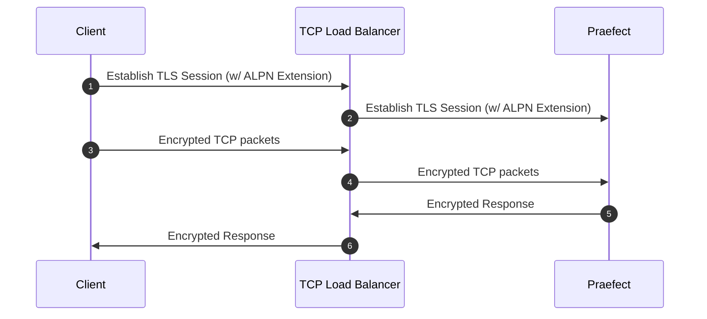
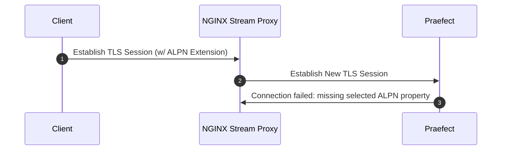

Configurer Gitaly Cluster (Praefect) en utilisant :

- Instructions de configuration de Gitaly Cluster (Praefect) disponibles dans le cadre des [architectures de référence](../../reference_architectures/_index.md) pour les installations allant jusqu'à :
  - [60 RPS ou 3 000 utilisateurs](../../reference_architectures/3k_users.md#configure-gitaly-cluster-praefect).
  - [100 RPS ou 5 000 utilisateurs](../../reference_architectures/5k_users.md#configure-gitaly-cluster-praefect).
  - [200 RPS ou 10 000 utilisateurs](../../reference_architectures/10k_users.md#configure-gitaly-cluster-praefect).
  - [500 RPS ou 25 000 utilisateurs](../../reference_architectures/25k_users.md#configure-gitaly-cluster-praefect).
  - [1000 RPS ou 50 000 utilisateurs](../../reference_architectures/50k_users.md#configure-gitaly-cluster-praefect).
- Les instructions de configuration personnalisées qui suivent sur cette page.

Les installations GitLab plus petites peuvent n'avoir besoin que de [Gitaly lui-même](../_index.md).

> [!note]
> Gitaly Cluster (Praefect) n'est pas encore pris en charge dans Kubernetes, Amazon ECS ou des environnements de conteneurs similaires. Pour plus d'informations, consultez l'epic [6127](https://gitlab.com/groups/gitlab-org/-/epics/6127).

## Prérequis {#requirements}

La configuration minimale recommandée pour un Gitaly Cluster (Praefect) nécessite :

- 1 équilibreur de charge
- 1 serveur PostgreSQL (une [version prise en charge](../../../install/requirements.md#postgresql))
- 3 nœuds Praefect
- 3 nœuds Gitaly (1 primaire, 2 secondaires)

> [!note]
> Les [exigences en matière de disque](../_index.md#disk-requirements) s'appliquent aux nœuds Gitaly.

Vous devez configurer un nombre impair de nœuds Gitaly afin que les transactions disposent d'un mécanisme de départage au cas où l'un des nœuds Gitaly échoue lors d'un appel RPC mutatif.

Voir le [document de conception](https://gitlab.com/gitlab-org/gitaly/-/blob/master/doc/design_ha.md) pour les détails d'implémentation.

> [!note]
> Si non définis dans GitLab, les feature flags sont lus comme faux depuis la console et Praefect utilise leur valeur par défaut. La valeur par défaut dépend de la version de GitLab.

### Latence réseau et connectivité {#network-latency-and-connectivity}

La latence réseau pour Gitaly Cluster (Praefect) devrait idéalement être mesurable en quelques millisecondes à un seul chiffre. La latence est particulièrement importante pour :

- Les contrôles de santé des nœuds Gitaly. Les nœuds doivent pouvoir répondre dans un délai d'une seconde.
- Les transactions de référence qui imposent la [cohérence forte](_index.md#strong-consistency). Des latences plus faibles signifient que les nœuds Gitaly peuvent s'accorder sur les changements plus rapidement.

Pour obtenir une latence acceptable entre les nœuds Gitaly :

- Sur les réseaux physiques, cela signifie généralement des connexions à haute bande passante et en emplacement unique.
- Sur le cloud, cela signifie généralement dans la même région, y compris en autorisant la réplication inter-zones de disponibilité. Ces liens sont conçus pour ce type de synchronisation. Une latence inférieure à 2 ms devrait être suffisante pour Gitaly Cluster (Praefect).

Si vous ne pouvez pas fournir de faibles latences réseau pour la réplication (par exemple, entre des emplacements distants), envisagez Geo. Pour plus d'informations, voir [Comparaison avec Geo](_index.md#comparison-to-geo).

Les [composants](_index.md#components) de Gitaly Cluster (Praefect) communiquent entre eux via de nombreuses routes. Vos règles de pare-feu doivent autoriser les éléments suivants pour que Gitaly Cluster (Praefect) fonctionne correctement :

| De                   | Vers                     | Port par défaut | Port TLS |
|:-----------------------|:-----------------------|:-------------|:---------|
| GitLab                 | Équilibreur de charge Praefect | `2305`       | `3305`   |
| Équilibreur de charge Praefect | Praefect               | `2305`       | `3305`   |
| Praefect               | Gitaly                 | `8075`       | `9999`   |
| Praefect               | GitLab (API interne)  | `80`         | `443`    |
| Gitaly                 | GitLab (API interne)  | `80`         | `443`    |
| Gitaly                 | Équilibreur de charge Praefect | `2305`       | `3305`   |
| Gitaly                 | Praefect               | `2305`       | `3305`   |
| Gitaly                 | Gitaly                 | `8075`       | `9999`   |

> [!note]
> Gitaly ne se connecte pas directement à Praefect. Cependant, les requêtes de Gitaly vers l'équilibreur de charge Praefect peuvent toujours être bloquées, sauf si les pare-feux sur les nœuds Praefect autorisent le trafic en provenance des nœuds Gitaly.

### Stockage de la base de données Praefect {#praefect-database-storage}

Les exigences sont relativement faibles car la base de données contient uniquement des métadonnées sur :

- L'emplacement des dépôts.
- Quelques travaux en file d'attente.

Cela dépend du nombre de dépôts, mais un bon minimum est de 5 à 10 Go, similaire à la base de données principale de l'application GitLab.

## Instructions de configuration {#setup-instructions}

Si vous avez [installé](https://about.gitlab.com/install/) GitLab en utilisant le package Linux (fortement recommandé), suivez les étapes ci-dessous :

1. [Préparation](#preparation)
1. [Configuration de la base de données Praefect](#postgresql)
1. [Configuration du proxy/routeur Praefect](#praefect)
1. [Configuration de chaque nœud Gitaly](#gitaly) (une fois pour chaque nœud Gitaly)
1. [Configurer l'équilibreur de charge](#load-balancer)
1. [Mise à jour de la configuration du serveur GitLab](#gitlab)
1. [Configurer Grafana](#grafana)

### Préparation {#preparation}

Avant de commencer, vous devez déjà disposer d'une instance GitLab fonctionnelle. [Apprenez comment installer GitLab](https://about.gitlab.com/install/).

Provisionnez un serveur PostgreSQL. Vous devez utiliser le PostgreSQL fourni avec le package Linux et l'utiliser pour configurer la base de données PostgreSQL. Vous pouvez utiliser un serveur PostgreSQL externe, mais vous devez le configurer [manuellement](#manual-database-setup).

Préparez tous vos nouveaux nœuds en [installant GitLab](https://about.gitlab.com/install/). Vous aurez besoin de :

- 1 nœud PostgreSQL
- 1 nœud PgBouncer (optionnel)
- Au moins 1 nœud Praefect (stockage minimal requis)
- 3 nœuds Gitaly (CPU élevé, mémoire élevée, stockage rapide)
- 1 serveur GitLab

Vous avez également besoin de l'adresse IP/hôte pour chaque nœud :

1. `PRAEFECT_LOADBALANCER_HOST` : l'adresse IP/hôte de l'équilibreur de charge Praefect
1. `POSTGRESQL_HOST` : l'adresse IP/hôte du serveur PostgreSQL
1. `PGBOUNCER_HOST` : l'adresse IP/hôte du serveur PostgreSQL
1. `PRAEFECT_HOST` : l'adresse IP/hôte du serveur Praefect
1. `GITALY_HOST_*` : l'adresse IP ou hôte de chaque serveur Gitaly
1. `GITLAB_HOST` : l'adresse IP/hôte du serveur GitLab

Si vous utilisez Google Cloud Platform, SoftLayer ou tout autre fournisseur proposant un cloud privé virtuel (VPC), vous pouvez utiliser les adresses privées pour chaque instance cloud (correspond à l'« adresse interne » pour Google Cloud Platform) pour `PRAEFECT_HOST`, `GITALY_HOST_*` et `GITLAB_HOST`.

#### Secrets {#secrets}

La communication entre les composants est sécurisée par différents secrets, décrits ci-dessous. Avant de commencer, générez un secret unique pour chacun d'eux et notez-le. Cela vous permettra de remplacer ces jetons fictifs par des jetons sécurisés au fur et à mesure que vous terminez le processus de configuration.

1. `GITLAB_SHELL_SECRET_TOKEN` : utilisé par les hooks Git pour effectuer des requêtes de rappel à l'API HTTP de GitLab lors de l'acceptation d'un push Git. Ce secret est partagé avec GitLab Shell pour des raisons historiques.
1. `PRAEFECT_EXTERNAL_TOKEN` : les dépôts hébergés sur votre cluster Praefect ne sont accessibles que par les clients Gitaly qui portent ce jeton.
1. `PRAEFECT_INTERNAL_TOKEN` : ce jeton est utilisé pour le trafic de réplication à l'intérieur de votre cluster Praefect. Ce jeton est distinct de `PRAEFECT_EXTERNAL_TOKEN` car les clients Gitaly ne doivent pas pouvoir accéder directement aux nœuds internes du cluster Praefect ; cela pourrait entraîner une perte de données.
1. `PRAEFECT_SQL_PASSWORD` : ce mot de passe est utilisé par Praefect pour se connecter à PostgreSQL.
1. `PRAEFECT_SQL_PASSWORD_HASH` : le hachage du mot de passe de l'utilisateur Praefect. Utilisez `gitlab-ctl pg-password-md5 praefect` pour générer le hachage. La commande demande le mot de passe de l'utilisateur `praefect`. Saisissez le mot de passe en clair `PRAEFECT_SQL_PASSWORD`. Par défaut, Praefect utilise l'utilisateur `praefect`, mais vous pouvez le modifier.
1. `PGBOUNCER_SQL_PASSWORD_HASH` : le hachage du mot de passe de l'utilisateur PgBouncer. PgBouncer utilise ce mot de passe pour se connecter à PostgreSQL. Pour plus de détails, voir la documentation du [PgBouncer intégré](../../postgresql/pgbouncer.md).

Nous indiquons dans les instructions ci-dessous où ces secrets sont requis.

> [!note]
> Les installations du package Linux peuvent utiliser `gitlab-secrets.json` pour `GITLAB_SHELL_SECRET_TOKEN`.

### Personnaliser le paramètre du serveur de temps {#customize-time-server-setting}

Par défaut, les nœuds Gitaly et Praefect utilisent le serveur de temps à `pool.ntp.org` pour les vérifications de synchronisation de l'heure. Vous pouvez personnaliser ce paramètre en ajoutant ce qui suit dans `gitlab.rb` sur chaque nœud :

- `gitaly['env'] = { "NTP_HOST" => "ntp.example.com" }`, pour les nœuds Gitaly.
- `praefect['env'] = { "NTP_HOST" => "ntp.example.com" }`, pour les nœuds Praefect.

### PostgreSQL {#postgresql}

> [!note]
> Praefect gère l'état de réplication du dépôt Gitaly en utilisant une base de données distincte de la base de données de l'application GitLab. Lors de l'utilisation de [Geo](../../geo/_index.md) et de Gitaly Cluster (Praefect), l'état de réplication de Praefect est unique à chaque site. Chaque site Geo doit disposer d'une instance de base de données PostgreSQL distincte en lecture-écriture pour héberger la base de données Praefect.
>
> - Ne stockez pas la base de données de l'application GitLab et la base de données Praefect sur le même serveur PostgreSQL.
> - Ne configurez pas la base de données Postgres de Praefect sur le site primaire Geo pour qu'elle se réplique vers les sites secondaires Geo.

Ces instructions aident à configurer une seule base de données PostgreSQL, ce qui crée un point de défaillance unique. Pour éviter cela, vous pouvez configurer votre propre PostgreSQL en cluster. La prise en charge des bases de données en cluster pour d'autres bases de données (par exemple, les bases de données Praefect et Geo) est proposée dans le [ticket 7292](https://gitlab.com/gitlab-org/omnibus-gitlab/-/issues/7292).

Les options suivantes sont disponibles :

- Pour les installations non-Geo, soit :
  - Utilisez l'une des [configurations PostgreSQL](../../postgresql/_index.md) documentées.
  - Utilisez votre propre configuration de base de données tierce. Cela nécessite une [configuration manuelle](#manual-database-setup).
- Pour les instances Geo, soit :
  - Configurez une [instance PostgreSQL](https://www.postgresql.org/docs/16/high-availability.html) distincte.
  - Utilisez un service PostgreSQL géré dans le cloud. AWS [Relational Database Service](https://aws.amazon.com/rds/) est recommandé.

La configuration de PostgreSQL crée des tables Praefect vides. Pour plus d'informations, voir la [section de dépannage correspondante](troubleshooting.md#relation-does-not-exist-errors).

#### Exécution des bases de données GitLab et Praefect sur le même serveur {#running-gitlab-and-praefect-databases-on-the-same-server}

La base de données de l'application GitLab et la base de données Praefect peuvent être exécutées sur le même serveur. Cependant, Praefect devrait avoir son propre serveur de base de données lors de l'utilisation de PostgreSQL à partir du package Linux. En cas de basculement, Praefect n'en est pas informé et commence à échouer car la base de données qu'il tente d'utiliser serait soit :

- Indisponible.
- En mode lecture seule.

#### Configuration manuelle de la base de données {#manual-database-setup}

Pour compléter cette section, vous avez besoin de :

- Un nœud Praefect
- Un nœud PostgreSQL
  - Un utilisateur PostgreSQL avec les permissions pour gérer le serveur de base de données

Dans cette section, nous configurons la base de données PostgreSQL. Cela peut être utilisé pour les serveurs PostgreSQL externes et ceux fournis par le package Linux.

Pour exécuter les instructions suivantes, vous pouvez utiliser le nœud Praefect, où `psql` est installé par le package Linux (`/opt/gitlab/embedded/bin/psql`). Si vous utilisez le PostgreSQL fourni par le package Linux, vous pouvez utiliser `gitlab-psql` sur le nœud PostgreSQL à la place :

1. Créez un nouvel utilisateur `praefect` à utiliser par Praefect :

   ```sql
   CREATE ROLE praefect WITH LOGIN PASSWORD 'PRAEFECT_SQL_PASSWORD';
   ```

   Remplacez `PRAEFECT_SQL_PASSWORD` par le mot de passe fort que vous avez généré lors de l'étape de préparation.

1. Créez une nouvelle base de données `praefect_production` appartenant à l'utilisateur `praefect`.

   ```sql
   CREATE DATABASE praefect_production WITH OWNER praefect ENCODING UTF8;
   ```

Lors de l'utilisation du PgBouncer fourni par le package Linux, vous devez effectuer les étapes supplémentaires suivantes. Nous recommandons fortement d'utiliser le PostgreSQL fourni avec le package Linux comme backend. Les instructions suivantes ne fonctionnent que sur le PostgreSQL fourni par le package Linux :

1. Pour le PgBouncer fourni par le package Linux, vous devez utiliser le hachage du mot de passe `praefect` à la place du mot de passe réel :

   ```sql
   ALTER ROLE praefect WITH PASSWORD 'md5<PRAEFECT_SQL_PASSWORD_HASH>';
   ```

   Remplacez `<PRAEFECT_SQL_PASSWORD_HASH>` par le hachage du mot de passe que vous avez généré lors de l'étape de préparation. Il est préfixé par le littéral `md5`.

1. Créez un nouvel utilisateur `pgbouncer` à utiliser par PgBouncer :

   ```sql
   CREATE ROLE pgbouncer WITH LOGIN;
   ALTER USER pgbouncer WITH password 'md5<PGBOUNCER_SQL_PASSWORD_HASH>';
   ```

   Remplacez `PGBOUNCER_SQL_PASSWORD_HASH` par le hachage du mot de passe fort que vous avez généré lors de l'étape de préparation.

1. Le PgBouncer fourni avec le package Linux est configuré pour utiliser [`auth_query`](https://www.pgbouncer.org/config.html#generic-settings) et utilise la fonction `pg_shadow_lookup`. Vous devez créer cette fonction dans la base de données `praefect_production` :

   ```sql
   CREATE OR REPLACE FUNCTION public.pg_shadow_lookup(in i_username text, out username text, out password text) RETURNS record AS $$
   BEGIN
       SELECT usename, passwd FROM pg_catalog.pg_shadow
       WHERE usename = i_username INTO username, password;
       RETURN;
   END;
   $$ LANGUAGE plpgsql SECURITY DEFINER;

   REVOKE ALL ON FUNCTION public.pg_shadow_lookup(text) FROM public, pgbouncer;
   GRANT EXECUTE ON FUNCTION public.pg_shadow_lookup(text) TO pgbouncer;
   ```

La base de données utilisée par Praefect est maintenant configurée.

Vous pouvez maintenant configurer Praefect pour utiliser la base de données :

```ruby
praefect['configuration'] = {
   # ...
   database: {
      # ...
      host: POSTGRESQL_HOST,
      user: 'praefect',
      port: 5432,
      password: PRAEFECT_SQL_PASSWORD,
      dbname: 'praefect_production',
   }
}
```

Si vous voyez des erreurs de base de données Praefect après avoir configuré PostgreSQL, voir les [étapes de dépannage](troubleshooting.md#relation-does-not-exist-errors).

#### Mise en cache de la distribution des lectures {#reads-distribution-caching}

Les performances de Praefect peuvent être améliorées en configurant également les paramètres `session_pooled` :

```ruby
praefect['configuration'] = {
   # ...
   database: {
      # ...
      session_pooled: {
         # ...
         host: POSTGRESQL_HOST,
         port: 5432

         # Use the following to override parameters of direct database connection.
         # Comment out where the parameters are the same for both connections.
         user: 'praefect',
         password: PRAEFECT_SQL_PASSWORD,
         dbname: 'praefect_production',
         # sslmode: '...',
         # sslcert: '...',
         # sslkey: '...',
         # sslrootcert: '...',
      }
   }
}
```

Lorsqu'elle est configurée, cette connexion est automatiquement utilisée pour la fonctionnalité [SQL LISTEN](https://www.postgresql.org/docs/16/sql-listen.html) et permet à Praefect de recevoir des notifications de PostgreSQL pour l'invalidation du cache.

Vérifiez que cette fonctionnalité fonctionne en recherchant l'entrée de journal suivante dans le journal Praefect :

```plaintext
reads distribution caching is enabled by configuration
```

#### Utiliser PgBouncer {#use-pgbouncer}

Pour réduire la consommation des ressources PostgreSQL, vous devez configurer [PgBouncer](https://www.pgbouncer.org/) devant l'instance PostgreSQL. Cependant, PgBouncer n'est pas obligatoire car Praefect effectue un faible nombre de connexions. Si vous choisissez d'utiliser PgBouncer, vous pouvez utiliser la même instance PgBouncer pour la base de données de l'application GitLab et la base de données Praefect.

Pour configurer PgBouncer devant l'instance PostgreSQL, vous devez pointer Praefect vers PgBouncer en définissant les paramètres de base de données dans la configuration Praefect :

```ruby
praefect['configuration'] = {
   # ...
   database: {
      # ...
      host: PGBOUNCER_HOST,
      port: 6432,
      user: 'praefect',
      password: PRAEFECT_SQL_PASSWORD,
      dbname: 'praefect_production',
      # sslmode: '...',
      # sslcert: '...',
      # sslkey: '...',
      # sslrootcert: '...',
   }
}
```

Praefect nécessite une connexion supplémentaire à PostgreSQL qui prend en charge la fonctionnalité [LISTEN](https://www.postgresql.org/docs/16/sql-listen.html). Avec PgBouncer, cette fonctionnalité n'est disponible qu'avec le mode de pool `session` (`pool_mode = session`). Elle n'est pas prise en charge en mode de pool `transaction` (`pool_mode = transaction`).

Pour configurer la connexion supplémentaire, vous devez soit :

- Configurer une nouvelle base de données PgBouncer qui utilise le même point de terminaison de base de données PostgreSQL, mais avec un mode de pool différent (`pool_mode = session`).
- Connecter Praefect directement à PostgreSQL et contourner PgBouncer.

##### Configurer une nouvelle base de données PgBouncer avec `pool_mode = session` {#configure-a-new-pgbouncer-database-with-pool_mode--session}

Vous devez utiliser PgBouncer avec le mode de pool `session`. Vous pouvez utiliser le [PgBouncer intégré](../../postgresql/pgbouncer.md) ou utiliser un PgBouncer externe et le [configurer manuellement](https://www.pgbouncer.org/config.html).

L'exemple suivant utilise le PgBouncer intégré et configure deux pools de connexion distincts sur l'hôte PostgreSQL, l'un en mode de pool `session` et l'autre en mode de pool `transaction`. Pour que cet exemple fonctionne, vous devez préparer le serveur PostgreSQL comme indiqué dans [les instructions de configuration](#manual-database-setup).

Ensuite, configurez les pools de connexion distincts sur l'hôte PgBouncer :

```ruby
pgbouncer['databases'] = {
  # Other database configuration including gitlabhq_production
  ...

  praefect_production: {
    host: POSTGRESQL_HOST,
    # Use `pgbouncer` user to connect to database backend.
    user: 'pgbouncer',
    password: PGBOUNCER_SQL_PASSWORD_HASH,
    pool_mode: 'transaction'
  },
  praefect_production_direct: {
    host: POSTGRESQL_HOST,
    # Use `pgbouncer` user to connect to database backend.
    user: 'pgbouncer',
    password: PGBOUNCER_SQL_PASSWORD_HASH,
    dbname: 'praefect_production',
    pool_mode: 'session'
  },

  ...
}

# Allow the praefect user to connect to PgBouncer
pgbouncer['users'] = {
  'praefect': {
    'password': PRAEFECT_SQL_PASSWORD_HASH,
  }
}
```

`praefect_production` et `praefect_production_direct` utilisent le même point de terminaison de base de données (`praefect_production`), mais avec des modes de pool différents. Cela se traduit par la section `databases` suivante de PgBouncer :

```ini
[databases]
praefect_production = host=POSTGRESQL_HOST auth_user=pgbouncer pool_mode=transaction
praefect_production_direct = host=POSTGRESQL_HOST auth_user=pgbouncer dbname=praefect_production pool_mode=session
```

Vous pouvez maintenant configurer Praefect pour utiliser PgBouncer pour les deux connexions :

```ruby
praefect['configuration'] = {
   # ...
   database: {
      # ...
      host: PGBOUNCER_HOST,
      port: 6432,
      user: 'praefect',
      # `PRAEFECT_SQL_PASSWORD` is the plain-text password of
      # Praefect user. Not to be confused with `PRAEFECT_SQL_PASSWORD_HASH`.
      password: PRAEFECT_SQL_PASSWORD,
      dbname: 'praefect_production',
      session_pooled: {
         # ...
         dbname: 'praefect_production_direct',
         # There is no need to repeat the following. Parameters of direct
         # database connection will fall back to the values specified in the
         # database block.
         #
         # host: PGBOUNCER_HOST,
         # port: 6432,
         # user: 'praefect',
         # password: PRAEFECT_SQL_PASSWORD,
      },
   },
}
```

Avec cette configuration, Praefect utilise PgBouncer pour les deux types de connexion.

> [!note]
> Les installations du package Linux gèrent les exigences d'authentification (en utilisant `auth_query`), mais si vous préparez vos bases de données manuellement et configurez un PgBouncer externe, vous devez inclure l'utilisateur `praefect` et son mot de passe dans le fichier utilisé par PgBouncer. Par exemple, `userlist.txt` si l'option de configuration [`auth_file`](https://www.pgbouncer.org/config.html#auth_file) est définie. Pour plus de détails, consultez la documentation de PgBouncer.

##### Configurer Praefect pour se connecter directement à PostgreSQL {#configure-praefect-to-connect-directly-to-postgresql}

En guise d'alternative à la configuration de PgBouncer avec le mode de pool `session`, Praefect peut être configuré pour utiliser des paramètres de connexion différents pour un accès direct à PostgreSQL. Cette connexion prend en charge la fonctionnalité `LISTEN`.

Un exemple de configuration Praefect qui contourne PgBouncer et se connecte directement à PostgreSQL :

```ruby
praefect['configuration'] = {
   # ...
   database: {
      # ...
      session_pooled: {
         # ...
         host: POSTGRESQL_HOST,
         port: 5432,

         # Use the following to override parameters of direct database connection.
         # Comment out where the parameters are the same for both connections.
         #
         user: 'praefect',
         password: PRAEFECT_SQL_PASSWORD,
         dbname: 'praefect_production',
         # sslmode: '...',
         # sslcert: '...',
         # sslkey: '...',
         # sslrootcert: '...',
      },
   },
}
```

### Praefect {#praefect}

Avant de configurer Praefect, référez-vous au [fichier de configuration Praefect d'exemple](https://gitlab.com/gitlab-org/gitaly/-/blob/master/config.praefect.toml.example) pour vous familiariser avec celui-ci. Si vous avez utilisé le package Linux pour installer GitLab, les paramètres du fichier d'exemple doivent être convertis en Ruby.

S'il y a plusieurs nœuds Praefect :

1. Désignez un nœud comme nœud de déploiement et configurez-le en suivant les étapes suivantes.
1. Effectuez les étapes suivantes pour chaque nœud supplémentaire.

Pour compléter cette section, vous avez besoin d'un [serveur PostgreSQL configuré](#postgresql), notamment :

> [!warning]
> Praefect doit être exécuté sur un nœud dédié. N'exécutez pas Praefect sur le serveur d'application ou sur un nœud Gitaly.

Sur le nœud Praefect :

1. Désactivez tous les autres services en modifiant `/etc/gitlab/gitlab.rb` :

<!--
Updates to example must be made at:

- <https://gitlab.com/gitlab-org/gitlab/-/blob/master/doc/administration/gitaly/configure_gitaly.md#configure-gitaly-server>
- All reference architecture pages
-->

   ```ruby
   # Avoid running unnecessary services on the Praefect server
   gitaly['enable'] = false
   postgresql['enable'] = false
   redis['enable'] = false
   nginx['enable'] = false
   puma['enable'] = false
   sidekiq['enable'] = false
   gitlab_workhorse['enable'] = false
   prometheus['enable'] = false
   alertmanager['enable'] = false
   gitlab_exporter['enable'] = false
   gitlab_kas['enable'] = false

   # Enable only the Praefect service
   praefect['enable'] = true

   # Prevent database migrations from running on upgrade automatically
   praefect['auto_migrate'] = false
   gitlab_rails['auto_migrate'] = false
   ```

1. Configurez Praefect pour écouter sur les interfaces réseau en modifiant `/etc/gitlab/gitlab.rb` :

   ```ruby
   praefect['configuration'] = {
      # ...
      listen_addr: '0.0.0.0:2305',
   }
   ```

1. Configurez les métriques Prometheus en modifiant `/etc/gitlab/gitlab.rb` :

   ```ruby
   praefect['configuration'] = {
      # ...
      #
      # Enable Prometheus metrics access to Praefect. You must use firewalls
      # to restrict access to this address/port.
      # The default metrics endpoint is /metrics
      prometheus_listen_addr: '0.0.0.0:9652',
      # Some metrics run queries against the database. Enabling separate database metrics allows
      # these metrics to be collected when the metrics are
      # scraped on a separate /db_metrics endpoint.
      prometheus_exclude_database_from_default_metrics: true,
   }
   ```

1. Configurez un jeton d'authentification fort pour Praefect en modifiant `/etc/gitlab/gitlab.rb`, qui est nécessaire aux clients extérieurs au cluster (comme GitLab Shell) pour communiquer avec le cluster Praefect :

   ```ruby
   praefect['configuration'] = {
      # ...
      auth: {
         # ...
         token: 'PRAEFECT_EXTERNAL_TOKEN',
      },
   }
   ```

1. Configurez Praefect pour [se connecter à la base de données PostgreSQL](#postgresql). Nous recommandons fortement d'utiliser également [PgBouncer](#use-pgbouncer).

   Si vous souhaitez utiliser un certificat client TLS, les options ci-dessous peuvent être utilisées :

   ```ruby
   praefect['configuration'] = {
      # ...
      database: {
         # ...
         #
         # Connect to PostgreSQL using a TLS client certificate
         # sslcert: '/path/to/client-cert',
         # sslkey: '/path/to/client-key',
         #
         # Trust a custom certificate authority
         # sslrootcert: '/path/to/rootcert',
      },
   }
   ```

   Par défaut, Praefect utilise TLS opportuniste pour se connecter à PostgreSQL. Cela signifie que Praefect tente de se connecter à PostgreSQL avec `sslmode` défini sur `prefer`. Vous pouvez remplacer cela en décommentant la ligne suivante :

   ```ruby
   praefect['configuration'] = {
      # ...
      database: {
         # ...
         # sslmode: 'disable',
      },
   }
   ```

1. Configurez le cluster Praefect pour se connecter à chaque nœud Gitaly du cluster en modifiant `/etc/gitlab/gitlab.rb`.

   Le nom du stockage virtuel doit correspondre au nom de stockage configuré dans la configuration GitLab. Dans une étape ultérieure, nous configurons le nom du stockage comme `default`, donc nous utilisons également `default` ici. Ce cluster possède trois nœuds Gitaly `gitaly-1`, `gitaly-2` et `gitaly-3`, qui sont destinés à être des répliques les uns des autres.

   > [!warning]
   > Si vous avez des données sur un stockage existant appelé `default`, vous devez configurer le stockage virtuel avec un autre nom et [migrer les données vers le stockage Gitaly Cluster (Praefect)](_index.md#migrate-to-gitaly-cluster-praefect) ensuite.

   Remplacez `PRAEFECT_INTERNAL_TOKEN` par un secret fort, utilisé par Praefect lors de la communication avec les nœuds Gitaly dans le cluster. Ce jeton est distinct du `PRAEFECT_EXTERNAL_TOKEN`.

   Remplacez `GITALY_HOST_*` par l'adresse IP ou hôte de chaque nœud Gitaly.

   Des nœuds Gitaly supplémentaires peuvent être ajoutés au cluster pour augmenter le nombre de répliques. Des clusters supplémentaires peuvent également être ajoutés pour les très grandes instances GitLab.

   > [!note]
   > Lors de l'ajout de nœuds Gitaly supplémentaires à un stockage virtuel, tous les noms de stockage de ce stockage virtuel doivent être uniques. De plus, toutes les adresses de nœuds Gitaly référencées dans la configuration Praefect doivent être uniques.

   ```ruby
   # Name of storage hash must match storage name in gitlab_rails['repositories_storages'] on GitLab
   # server ('default') and in gitaly['configuration'][:storage][INDEX][:name] on Gitaly nodes ('gitaly-1')
   praefect['configuration'] = {
      # ...
      virtual_storage: [
         {
            # ...
            name: 'default',
            node: [
               {
                  storage: 'gitaly-1',
                  address: 'tcp://GITALY_HOST_1:8075',
                  token: 'PRAEFECT_INTERNAL_TOKEN'
               },
               {
                  storage: 'gitaly-2',
                  address: 'tcp://GITALY_HOST_2:8075',
                  token: 'PRAEFECT_INTERNAL_TOKEN'
               },
               {
                  storage: 'gitaly-3',
                  address: 'tcp://GITALY_HOST_3:8075',
                  token: 'PRAEFECT_INTERNAL_TOKEN'
               },
            ],
         },
      ],
   }
   ```

1. Enregistrez les modifications dans `/etc/gitlab/gitlab.rb` et [reconfigurez Praefect](../../restart_gitlab.md#reconfigure-a-linux-package-installation) :

   ```shell
   gitlab-ctl reconfigure
   ```

1. Pour :

   - Le « nœud de déploiement » :
     1. Réactivez la migration automatique de la base de données Praefect en définissant `praefect['auto_migrate'] = true` dans `/etc/gitlab/gitlab.rb`.
     1. Pour vous assurer que les migrations de base de données ne sont exécutées que lors de la reconfiguration et non automatiquement lors de la mise à niveau, exécutez :

        ```shell
        sudo touch /etc/gitlab/skip-auto-reconfigure
        ```

   - Les autres nœuds : vous pouvez laisser les paramètres tels quels. Bien que `/etc/gitlab/skip-auto-reconfigure` ne soit pas requis, vous pouvez souhaiter le définir pour empêcher GitLab d'exécuter automatiquement la reconfiguration lors de l'exécution de commandes telles que `apt-get update`. Ainsi, les modifications de configuration supplémentaires peuvent être effectuées, puis la reconfiguration peut être exécutée manuellement.

1. Enregistrez les modifications dans `/etc/gitlab/gitlab.rb` et [reconfigurez Praefect](../../restart_gitlab.md#reconfigure-a-linux-package-installation) :

   ```shell
   gitlab-ctl reconfigure
   ```

1. Pour vous assurer que Praefect [a mis à jour son adresse d'écoute Prometheus](https://gitlab.com/gitlab-org/gitaly/-/issues/2734), [redémarrez Praefect](../../restart_gitlab.md#reconfigure-a-linux-package-installation) :

   ```shell
   gitlab-ctl restart praefect
   ```

1. Vérifiez que Praefect peut atteindre PostgreSQL :

   ```shell
   sudo -u git -- /opt/gitlab/embedded/bin/praefect -config /var/opt/gitlab/praefect/config.toml sql-ping
   ```

   Si la vérification échoue, assurez-vous d'avoir suivi les étapes correctement. Si vous modifiez `/etc/gitlab/gitlab.rb`, n'oubliez pas d'exécuter `sudo gitlab-ctl reconfigure` à nouveau avant d'essayer la commande `sql-ping`.

#### Activer la prise en charge TLS {#enable-tls-support}

Praefect prend en charge le chiffrement TLS. Pour communiquer avec une instance Praefect qui écoute les connexions sécurisées, vous devez :

- S'assurer que Gitaly est [configuré pour TLS](../tls_support.md) et utiliser un schéma d'URL `tls://` dans `gitaly_address` de l'entrée de stockage correspondante dans la configuration GitLab.
- Apportez vos propres certificats car cela n'est pas fourni automatiquement. Le certificat correspondant à chaque serveur Praefect doit être installé sur ce serveur Praefect.

De plus, le certificat, ou son autorité de certification, doit être installé sur tous les serveurs Gitaly et sur tous les clients Praefect qui communiquent avec lui en suivant la procédure décrite dans [la configuration de certificat personnalisé GitLab](https://docs.gitlab.com/omnibus/settings/ssl/#install-custom-public-certificates) (et répétée ci-dessous).

Notez ce qui suit :

- Le certificat doit spécifier l'adresse que vous utilisez pour accéder au serveur Praefect. Vous devez ajouter le nom d'hôte ou l'adresse IP en tant que Subject Alternative Name au certificat.
- Lors de l'exécution de sous-commandes Praefect telles que `dial-nodes` et `list-untracked-repositories` depuis la ligne de commande avec [TLS Gitaly activé](../tls_support.md), vous devez définir la variable d'environnement `SSL_CERT_DIR` ou `SSL_CERT_FILE` pour que le certificat Gitaly soit approuvé. Par exemple :

  ```shell
  SSL_CERT_DIR=/etc/gitlab/trusted-certs sudo -u git -- /opt/gitlab/embedded/bin/praefect -config /var/opt/gitlab/praefect/config.toml dial-nodes
  ```

- Vous pouvez configurer les serveurs Praefect avec à la fois une adresse d'écoute non chiffrée `listen_addr` et une adresse d'écoute chiffrée `tls_listen_addr` en même temps. Cela vous permet d'effectuer une transition progressive du trafic non chiffré vers le trafic chiffré, si nécessaire.

  Pour désactiver l'écouteur non chiffré, définissez :

  ```ruby
  praefect['configuration'] = {
    # ...
    listen_addr: nil,
  }
  ```

Configurez Praefect avec TLS.

Pour les installations avec le package Linux :

1. Créez des certificats pour les serveurs Praefect.
1. Sur les serveurs Praefect, créez le répertoire `/etc/gitlab/ssl` et copiez-y votre clé et votre certificat :

   ```shell
   sudo mkdir -p /etc/gitlab/ssl
   sudo chmod 755 /etc/gitlab/ssl
   sudo cp key.pem cert.pem /etc/gitlab/ssl/
   sudo chmod 644 key.pem cert.pem
   ```

1. Modifiez `/etc/gitlab/gitlab.rb` et ajoutez :

   ```ruby
   praefect['configuration'] = {
      # ...
      tls_listen_addr: '0.0.0.0:3305',
      tls: {
         # ...
         certificate_path: '/etc/gitlab/ssl/cert.pem',
         key_path: '/etc/gitlab/ssl/key.pem',
      },
   }
   ```

1. Enregistrez le fichier et [reconfigurez](../../restart_gitlab.md#reconfigure-a-linux-package-installation).
1. Sur les clients Praefect (y compris chaque serveur Gitaly), copiez les certificats, ou leur autorité de certification, dans `/etc/gitlab/trusted-certs` :

   ```shell
   sudo cp cert.pem /etc/gitlab/trusted-certs/
   ```

1. Sur les clients Praefect (sauf les serveurs Gitaly), modifiez `gitlab_rails['repositories_storages']` dans `/etc/gitlab/gitlab.rb` comme suit :

   ```ruby
   gitlab_rails['repositories_storages'] = {
     "default" => {
       "gitaly_address" => 'tls://PRAEFECT_LOADBALANCER_HOST:3305',
       "gitaly_token" => 'PRAEFECT_EXTERNAL_TOKEN'
     }
   }
   ```

1. Enregistrez le fichier et [reconfigurez GitLab](../../restart_gitlab.md#reconfigure-a-linux-package-installation).

Pour les installations compilées à partir des sources :

1. Créez des certificats pour les serveurs Praefect.
1. Sur les serveurs Praefect, créez le répertoire `/etc/gitlab/ssl` et copiez-y votre clé et votre certificat :

   ```shell
   sudo mkdir -p /etc/gitlab/ssl
   sudo chmod 755 /etc/gitlab/ssl
   sudo cp key.pem cert.pem /etc/gitlab/ssl/
   sudo chmod 644 key.pem cert.pem
   ```

1. Sur les clients Praefect (y compris chaque serveur Gitaly), copiez les certificats, ou leur autorité de certification, dans les certificats de confiance du système :

   ```shell
   sudo cp cert.pem /usr/local/share/ca-certificates/praefect.crt
   sudo update-ca-certificates
   ```

1. Sur les clients Praefect (sauf les serveurs Gitaly), modifiez `storages` dans `/home/git/gitlab/config/gitlab.yml` comme suit :

   ```yaml
   gitlab:
     repositories:
       storages:
         default:
           gitaly_address: tls://PRAEFECT_LOADBALANCER_HOST:3305
   ```

1. Enregistrez le fichier et [redémarrez GitLab](../../restart_gitlab.md#self-compiled-installations).
1. Copiez tous les certificats du serveur Praefect, ou leur autorité de certification, dans les certificats de confiance du système sur chaque serveur Gitaly afin que le serveur Praefect approuve le certificat lorsqu'il est appelé par les serveurs Gitaly :

   ```shell
   sudo cp cert.pem /usr/local/share/ca-certificates/praefect.crt
   sudo update-ca-certificates
   ```

1. Modifiez `/home/git/praefect/config.toml` et ajoutez :

   ```toml
   tls_listen_addr = '0.0.0.0:3305'

   [tls]
   certificate_path = '/etc/gitlab/ssl/cert.pem'
   key_path = '/etc/gitlab/ssl/key.pem'
   ```

1. Enregistrez le fichier et [redémarrez GitLab](../../restart_gitlab.md#self-compiled-installations).

#### Découverte de service {#service-discovery}

Prérequis :

- Un serveur DNS.

GitLab utilise la découverte de service pour récupérer une liste d'hôtes Praefect. La découverte de service implique des vérifications périodiques d'un enregistrement DNS A ou AAAA, les adresses IP récupérées de l'enregistrement servant d'adresses aux nœuds cibles. Praefect ne prend pas en charge la découverte de service par enregistrement SRV.

Par défaut, le temps minimum entre les vérifications est de 5 minutes, indépendamment des TTL des enregistrements. Praefect ne prend pas en charge la personnalisation de cet intervalle. Lorsque les clients reçoivent une mise à jour, ils :

- Établissent de nouvelles connexions aux nouvelles adresses IP.
- Maintiennent les connexions existantes vers les adresses IP intactes.
- Abandonnent les connexions vers les adresses IP supprimées.

Les requêtes en cours sur les connexions à supprimer sont toujours traitées jusqu'à leur fin. Workhorse dispose d'un délai d'expiration de 10 minutes, tandis que les autres clients ne spécifient pas de délai d'expiration gracieux.

Le serveur DNS devrait retourner toutes les adresses IP plutôt que d'effectuer lui-même l'équilibrage de charge. Les clients peuvent distribuer les requêtes vers les adresses IP de manière cyclique (round-robin).

Avant de mettre à jour la configuration client, assurez-vous que la découverte de service DNS fonctionne correctement. Elle devrait retourner la liste des adresses IP correctement. `dig` est un bon outil à utiliser pour vérifier.

```console
❯ dig A praefect.service.consul @127.0.0.1

; <<>> DiG 9.10.6 <<>> A praefect.service.consul @127.0.0.1
;; global options: +cmd
;; Got answer:
;; ->>HEADER<<- opcode: QUERY, status: NOERROR, id: 29210
;; flags: qr aa rd ra; QUERY: 1, ANSWER: 3, AUTHORITY: 0, ADDITIONAL: 1

;; OPT PSEUDOSECTION:
; EDNS: version: 0, flags:; udp: 4096
;; QUESTION SECTION:
;praefect.service.consul.                     IN      A

;; ANSWER SECTION:
praefect.service.consul.              0       IN      A       10.0.0.3
praefect.service.consul.              0       IN      A       10.0.0.2
praefect.service.consul.              0       IN      A       10.0.0.1

;; Query time: 0 msec
;; SERVER: ::1#53(::1)
;; WHEN: Wed Dec 14 12:53:58 +07 2022
;; MSG SIZE  rcvd: 86
```

##### Configurer la découverte de service {#configure-service-discovery}

Par défaut, Praefect délègue la résolution DNS au système d'exploitation. Dans ce cas, l'adresse Gitaly peut être définie dans l'un de ces formats :

- `dns:[host]:[port]`
- `dns:///[host]:[port]` (notez les trois barres obliques)

Vous pouvez également désigner un serveur de noms faisant autorité en le définissant dans ce format :

- `dns://[authority_host]:[authority_port]/[host]:[port]`



- [Introduit](https://gitlab.com/gitlab-org/gitlab/-/work_items/585789) dans GitLab 18.10.



Pour utiliser la découverte de service avec le chiffrement TLS, utilisez le schéma `dns+tls` :

- `dns+tls:[host]:[port]` (forme abrégée)
- `dns+tls:///[host]:[port]` (notez les trois barres obliques)
- `dns+tls://[authority_host]:[authority_port]/[host]:[port]`

Le schéma `dns+tls://` combine la découverte de service basée sur DNS avec le chiffrement TLS. Vous devez configurer TLS sur vos serveurs Praefect avant d'utiliser ce schéma. Pour plus d'informations, voir [Activer TLS](#enable-tls-support).

Le certificat TLS de chaque point de terminaison Praefect doit inclure un Subject Alternative Name (SAN) correspondant au nom d'hôte utilisé dans `PRAEFECT_SERVICE_DISCOVERY_ADDRESS` ci-dessous. Par exemple, si l'adresse est `dns+tls:///praefect.service.consul:3305`, le certificat de chaque nœud Praefect doit avoir `praefect.service.consul` comme entrée SAN. Les connexions échouent si le SAN ne correspond pas.





1. Ajoutez l'adresse IP de chaque nœud Praefect à l'adresse de découverte de service DNS.
1. Sur les clients Praefect (sauf les serveurs Gitaly), modifiez `gitlab_rails['repositories_storages']` dans `/etc/gitlab/gitlab.rb` comme suit. Remplacez `PRAEFECT_SERVICE_DISCOVERY_ADDRESS` par l'adresse de découverte de service Praefect, telle que `praefect.service.consul`.

   ```ruby
   gitlab_rails['repositories_storages'] = {
     "default" => {
       "gitaly_address" => 'dns:PRAEFECT_SERVICE_DISCOVERY_ADDRESS:2305',
       "gitaly_token" => 'PRAEFECT_EXTERNAL_TOKEN'
     }
   }
   ```

   Pour utiliser TLS, changez le schéma en `dns+tls://` :

   ```ruby
   gitlab_rails['repositories_storages'] = {
     "default" => {
       "gitaly_address" => 'dns+tls://DNS_SERVER_ADDRESS:53/PRAEFECT_SERVICE_DISCOVERY_ADDRESS:3305',
       "gitaly_token" => 'PRAEFECT_EXTERNAL_TOKEN'
     }
   }
   ```

1. Enregistrez le fichier et [reconfigurez GitLab](../../restart_gitlab.md#reconfigure-a-linux-package-installation).





1. Installez un service de découverte de service DNS. Enregistrez tous les nœuds Praefect auprès du service.
1. Sur les clients Praefect (sauf les serveurs Gitaly), modifiez `storages` dans `/home/git/gitlab/config/gitlab.yml` comme suit :

   ```yaml
   gitlab:
     repositories:
       storages:
         default:
           gitaly_address: dns:PRAEFECT_SERVICE_DISCOVERY_ADDRESS:2305
   ```

   Pour utiliser TLS, changez le schéma en `dns+tls://` :

   ```yaml
   gitlab:
     repositories:
       storages:
         default:
           gitaly_address: dns+tls://DNS_SERVER_ADDRESS:53/PRAEFECT_SERVICE_DISCOVERY_ADDRESS:3305
   ```

1. Enregistrez le fichier et [redémarrez GitLab](../../restart_gitlab.md#self-compiled-installations).





##### Configurer la découverte de service avec Consul {#configure-service-discovery-with-consul}

Si vous disposez déjà d'un serveur Consul dans votre architecture, vous pouvez ajouter un agent Consul sur chaque nœud Praefect et y enregistrer le service `praefect`. Cela enregistre l'adresse IP de chaque nœud dans `praefect.service.consul` afin qu'il puisse être trouvé par la découverte de service.

Prérequis :

- Un ou plusieurs serveurs [Consul](../../consul.md) pour suivre les agents Consul.

1. Sur chaque serveur Praefect, ajoutez ce qui suit à votre `/etc/gitlab/gitlab.rb` :

   ```ruby
   consul['enable'] = true
   praefect['consul_service_name'] = 'praefect'

   # The following must also be added until this issue is addressed:
   # https://gitlab.com/gitlab-org/omnibus-gitlab/-/issues/8321
   consul['monitoring_service_discovery'] = true
   praefect['configuration'] = {
     # ...
     #
     prometheus_listen_addr: '0.0.0.0:9652',
   }
   ```

1. Enregistrez le fichier et [reconfigurez GitLab](../../restart_gitlab.md#reconfigure-a-linux-package-installation).
1. Répétez les étapes précédentes sur chaque serveur Praefect à utiliser avec la découverte de service.
1. Sur les clients Praefect (sauf les serveurs Gitaly), modifiez `gitlab_rails['repositories_storages']` dans `/etc/gitlab/gitlab.rb` comme suit. Remplacez `CONSUL_SERVER` par l'adresse IP ou l'adresse d'un serveur Consul. Le port DNS Consul par défaut est `8600`.

   ```ruby
   gitlab_rails['repositories_storages'] = {
     "default" => {
       "gitaly_address" => 'dns://CONSUL_SERVER:8600/praefect.service.consul:2305',
       "gitaly_token" => 'PRAEFECT_EXTERNAL_TOKEN'
     }
   }
   ```

1. Utilisez `dig` depuis les clients Praefect pour confirmer que chaque adresse IP a été enregistrée dans `praefect.service.consul` avec `dig A praefect.service.consul @CONSUL_SERVER -p 8600`. Remplacez `CONSUL_SERVER` par la valeur configurée précédemment et toutes les adresses IP des nœuds Praefect doivent être présentes dans la sortie.
1. Enregistrez le fichier et [reconfigurez GitLab](../../restart_gitlab.md#reconfigure-a-linux-package-installation).

### Gitaly {#gitaly}

> [!note]
> Effectuez ces étapes pour chaque nœud Gitaly.

Pour compléter cette section, vous avez besoin de :

- [Nœud Praefect configuré](#praefect)
- 3 serveurs (ou plus), avec GitLab installé, à configurer comme nœuds Gitaly. Ceux-ci doivent être des nœuds dédiés, n'exécutez pas d'autres services sur ces nœuds.

Chaque serveur Gitaly affecté au cluster Praefect doit être configuré. La configuration est la même que pour un [serveur Gitaly autonome](_index.md) standard, sauf :

- Les noms de stockage sont exposés à Praefect, pas à GitLab
- Le jeton secret est partagé avec Praefect, pas avec GitLab

La configuration de tous les nœuds Gitaly dans le cluster Praefect peut être identique, car nous nous appuyons sur Praefect pour acheminer correctement les opérations.

Une attention particulière doit être portée à :

- La valeur `gitaly['configuration'][:auth][:token]` configurée dans cette section doit correspondre à la valeur `token` sous `praefect['configuration'][:virtual_storage][<index>][:node][<index>][:token]` sur le nœud Praefect. Cette valeur a été définie dans la [section précédente](#praefect). Ce document utilise le paramètre fictif `PRAEFECT_INTERNAL_TOKEN` tout au long.
- Les noms de stockage physique dans `gitaly['configuration'][:storage]` configurés dans cette section doivent correspondre aux noms de stockage physique sous `praefect['configuration'][:virtual_storage]` sur le nœud Praefect. Cela a été défini dans la [section précédente](#praefect). Ce document utilise `gitaly-1`, `gitaly-2` et `gitaly-3` comme noms de stockage physique.

Pour plus d'informations sur la configuration du serveur Gitaly, voir notre [documentation Gitaly](../configure_gitaly.md#configure-gitaly-servers).

1. Connectez-vous en SSH au nœud Gitaly et identifiez-vous en tant que root :

   ```shell
   sudo -i
   ```

1. Désactivez tous les autres services en modifiant `/etc/gitlab/gitlab.rb` :

   ```ruby
   # Disable all other services on the Gitaly node
   postgresql['enable'] = false
   redis['enable'] = false
   nginx['enable'] = false
   puma['enable'] = false
   sidekiq['enable'] = false
   gitlab_workhorse['enable'] = false
   prometheus_monitoring['enable'] = false
   gitlab_kas['enable'] = false

   # Enable only the Gitaly service
   gitaly['enable'] = true

   # Enable Prometheus if needed
   prometheus['enable'] = true

   # Disable database migrations to prevent database connections during 'gitlab-ctl reconfigure'
   gitlab_rails['auto_migrate'] = false
   ```

1. Configurez Gitaly pour écouter sur les interfaces réseau en modifiant `/etc/gitlab/gitlab.rb` :

   ```ruby
   gitaly['configuration'] = {
      # ...
      #
      # Make Gitaly accept connections on all network interfaces.
      # Use firewalls to restrict access to this address/port.
      listen_addr: '0.0.0.0:8075',
      # Enable Prometheus metrics access to Gitaly. You must use firewalls
      # to restrict access to this address/port.
      prometheus_listen_addr: '0.0.0.0:9236',
   }
   ```

1. Configurez un `auth_token` fort pour Gitaly en modifiant `/etc/gitlab/gitlab.rb`, nécessaire aux clients pour communiquer avec ces nœuds Gitaly. En règle générale, ce jeton est le même pour tous les nœuds Gitaly.

   ```ruby
   gitaly['configuration'] = {
      # ...
      auth: {
         # ...
         token: 'PRAEFECT_INTERNAL_TOKEN',
      },
   }
   ```

1. Configurez le jeton secret GitLab Shell, nécessaire pour les opérations `git push`. Soit :

   - Méthode 1 :

     1. Copiez `/etc/gitlab/gitlab-secrets.json` du client Gitaly vers le même chemin sur les serveurs Gitaly et tout autre client Gitaly.
     1. [Reconfigurez GitLab](../../restart_gitlab.md#reconfigure-a-linux-package-installation) sur les serveurs Gitaly.

   - Méthode 2 :

     1. Modifiez `/etc/gitlab/gitlab.rb`.
     1. Remplacez `GITLAB_SHELL_SECRET_TOKEN` par le secret réel.

        - GitLab 17.5 et versions ultérieures :

          ```ruby
          gitaly['gitlab_secret'] = 'GITLAB_SHELL_SECRET_TOKEN'
          ```

        - GitLab 17.4 et versions antérieures :

          ```ruby
          gitlab_shell['secret_token'] = 'GITLAB_SHELL_SECRET_TOKEN'
          ```

1. Configurez une `internal_api_url`, également nécessaire pour les opérations `git push` :

   ```ruby
   # Configure the gitlab-shell API callback URL. Without this, `git push` will
   # fail. This can be your front door GitLab URL or an internal load balancer.
   # Examples: 'https://gitlab.example.com', 'http://10.0.2.2'
   gitlab_rails['internal_api_url'] = 'https://gitlab.example.com'
   ```

1. Configurez l'emplacement de stockage des données Git en définissant `gitaly['configuration'][:storage]` dans `/etc/gitlab/gitlab.rb`. Chaque nœud Gitaly doit avoir un nom de stockage unique (tel que `gitaly-1`) et ne doit pas être dupliqué sur d'autres nœuds Gitaly.

   ```ruby
   gitaly['configuration'] = {
      # ...
      storage: [
        # Replace with appropriate name for each Gitaly nodes.
        {
          name: 'gitaly-1',
          path: '/var/opt/gitlab/git-data/repositories',
        },
      ],
   }
   ```

1. Enregistrez les modifications dans `/etc/gitlab/gitlab.rb` et [reconfigurez Gitaly](../../restart_gitlab.md#reconfigure-a-linux-package-installation) :

   ```shell
   gitlab-ctl reconfigure
   ```

1. Pour vous assurer que Gitaly [a mis à jour son adresse d'écoute Prometheus](https://gitlab.com/gitlab-org/gitaly/-/issues/2734), [redémarrez Gitaly](../../restart_gitlab.md#reconfigure-a-linux-package-installation) :

   ```shell
   gitlab-ctl restart gitaly
   ```

> [!note]
> Les étapes précédentes doivent être effectuées pour chaque nœud Gitaly !

Une fois tous les nœuds Gitaly configurés, exécutez le vérificateur de connexion Praefect pour vérifier que Praefect peut se connecter à tous les serveurs Gitaly dans la configuration Praefect.

1. Connectez-vous en SSH à chaque nœud Praefect et exécutez le vérificateur de connexion Praefect :

   ```shell
   sudo -u git -- /opt/gitlab/embedded/bin/praefect -config /var/opt/gitlab/praefect/config.toml dial-nodes
   ```

### Équilibreur de charge {#load-balancer}

Dans une configuration Gitaly tolérante aux pannes, un équilibreur de charge est nécessaire pour acheminer le trafic interne de l'application GitLab vers les nœuds Praefect. Les détails sur le choix de l'équilibreur de charge ou la configuration exacte dépassent le cadre de la documentation GitLab.

> [!note]
> L'équilibreur de charge doit être configuré pour accepter le trafic des nœuds Gitaly en plus des nœuds GitLab.

Nous espérons que si vous gérez des systèmes tolérants aux pannes comme GitLab, vous disposez déjà d'un équilibreur de charge de votre choix. Parmi les exemples, on trouve [HAProxy](https://www.haproxy.org/) (open-source), [Google Internal Load Balancer](https://cloud.google.com/load-balancing/docs/internal/), [AWS Elastic Load Balancer](https://aws.amazon.com/elasticloadbalancing/), F5 Big-IP LTM et Citrix Net Scaler. Cette documentation décrit les ports et protocoles que vous devez configurer.

Vous devez utiliser l'équivalent de la stratégie d'équilibrage de charge HAProxy `leastconn` car les opérations de longue durée (par exemple, les clones) maintiennent certaines connexions ouvertes pendant de longues périodes.

| Port LB | Port backend | Protocole |
|:--------|:-------------|:---------|
| 2305    | 2305         | TCP      |

Vous devez utiliser un équilibreur de charge TCP. L'utilisation d'un équilibreur de charge HTTP/2 ou gRPC avec Praefect ne fonctionne pas en raison des [canaux latéraux Gitaly](https://gitlab.com/gitlab-org/gitaly/-/blob/master/doc/sidechannel.md). Cette optimisation intercepte le processus de handshake gRPC. Elle redirige toutes les opérations Git intensives vers un « canal » plus efficace que gRPC, mais les équilibreurs de charge HTTP/2 ou gRPC ne gèrent pas correctement de telles requêtes.

Si TLS est activé, [certaines versions de Praefect](#alpn-enforcement) exigent que l'extension Application-Layer Protocol Negotiation (ALPN) soit utilisée conformément à la [RFC 7540](https://datatracker.ietf.org/doc/html/rfc7540#section-3.3). Les équilibreurs de charge TCP transmettent ALPN directement sans configuration supplémentaire :



Certains équilibreurs de charge TCP peuvent être configurés pour accepter une connexion client TLS et transmettre la connexion à Praefect avec une nouvelle connexion TLS. Cependant, cela ne fonctionne que si ALPN est pris en charge sur les deux connexions.

Pour cette raison, le [`ngx_stream_proxy_module`](https://nginx.org/en/docs/stream/ngx_stream_proxy_module.html) de NGINX ne fonctionne pas lorsque l'option de configuration `proxy_ssl` est activée :



À l'étape 2, ALPN n'est pas utilisé car [NGINX ne prend pas en charge cela](https://mailman.nginx.org/pipermail/nginx-devel/2017-July/010307.html). Pour plus d'informations, [suivez le ticket NGINX 406](https://github.com/nginx/nginx/issues/406) pour plus de détails.

#### Application de l'ALPN {#alpn-enforcement}

L'application de l'ALPN a été activée dans certaines versions de GitLab. Cependant, l'application de l'ALPN a causé des problèmes de déploiement et est donc désactivée [pour fournir un chemin de migration](https://github.com/grpc/grpc-go/issues/7922). Les versions suivantes de GitLab ont l'application de l'ALPN activée :

- GitLab 17.7.0
- GitLab 17.6.0 - 17.6.2
- GitLab 17.5.0 - 17.5.4
- GitLab 17.4.x

Avec [GitLab 17.5.5, 17.6.3 et 17.7.1](https://about.gitlab.com/releases/2025/01/08/patch-release-gitlab-17-7-1-released/), l'application de l'ALPN est à nouveau désactivée. GitLab 17.4 et les versions antérieures n'ont jamais eu l'application de l'ALPN activée.

### GitLab {#gitlab}

Pour compléter cette section, vous avez besoin de :

- [Nœud Praefect configuré](#praefect)
- [Nœuds Gitaly configurés](#gitaly)

Le cluster Praefect doit être exposé comme emplacement de stockage à l'application GitLab, ce qui est fait en mettant à jour `gitlab_rails['repositories_storages']`.

Une attention particulière doit être portée à :

- le nom de stockage ajouté à `gitlab_rails['repositories_storages']` dans cette section doit correspondre au nom de stockage sous `praefect['configuration'][:virtual_storage]` sur les nœuds Praefect. Cela a été défini dans la section [Praefect](#praefect) de ce guide. Ce document utilise `default` comme nom de stockage Praefect.

1. Connectez-vous en SSH au nœud GitLab et identifiez-vous en tant que root :

   ```shell
   sudo -i
   ```

1. Configurez `external_url` pour que les fichiers puissent être servis par GitLab via un accès approprié aux points de terminaison en modifiant `/etc/gitlab/gitlab.rb` :

   Vous devez remplacer `GITLAB_SERVER_URL` par l'URL externe réelle sur laquelle l'instance GitLab actuelle est en cours d'exécution :

   ```ruby
   external_url 'GITLAB_SERVER_URL'
   ```

1. Désactivez le service Gitaly par défaut en cours d'exécution sur l'hôte GitLab. Il n'est pas nécessaire car GitLab se connecte au cluster configuré.

   > [!warning]
   > Si vous avez des données existantes stockées sur le stockage Gitaly par défaut, vous devez d'abord [migrer les données vers votre stockage Gitaly Cluster (Praefect)](_index.md#migrate-to-gitaly-cluster-praefect).

   ```ruby
   gitaly['enable'] = false
   ```

1. Ajoutez le cluster Praefect comme emplacement de stockage en modifiant `/etc/gitlab/gitlab.rb`.

   Vous devez remplacer :

   - `PRAEFECT_LOADBALANCER_HOST` par l'adresse IP ou le nom d'hôte de l'équilibreur de charge.
   - `PRAEFECT_EXTERNAL_TOKEN` par le secret réel

   Si vous utilisez TLS :

   - La valeur `gitaly_address` doit commencer par `tls://` à la place.
   - Le port doit être changé en `3305`.

   ```ruby
   gitlab_rails['repositories_storages'] = {
     "default" => {
       "gitaly_address" => "tcp://PRAEFECT_LOADBALANCER_HOST:2305",
       "gitaly_token" => 'PRAEFECT_EXTERNAL_TOKEN'
     }
   }
   ```

1. Configurez le jeton secret GitLab Shell pour que les rappels des nœuds Gitaly lors d'un `git push` soient correctement authentifiés. Soit :

   - Méthode 1 :

     1. Copiez `/etc/gitlab/gitlab-secrets.json` du client Gitaly vers le même chemin sur les serveurs Gitaly et tout autre client Gitaly.
     1. [Reconfigurez GitLab](../../restart_gitlab.md#reconfigure-a-linux-package-installation) sur les serveurs Gitaly.

   - Méthode 2 :

     1. Modifiez `/etc/gitlab/gitlab.rb`.
     1. Remplacez `GITLAB_SHELL_SECRET_TOKEN` par le vrai secret :

        - GitLab 17.5 et versions ultérieures :

          ```ruby
          gitaly['gitlab_secret'] = 'GITLAB_SHELL_SECRET_TOKEN'
          ```

        - GitLab 17.4 et versions antérieures :

          ```ruby
          gitlab_shell['secret_token'] = 'GITLAB_SHELL_SECRET_TOKEN'
          ```

1. Ajoutez les paramètres de surveillance Prometheus en modifiant `/etc/gitlab/gitlab.rb`. Si Prometheus est activé sur un nœud différent, effectuez les modifications sur ce nœud à la place.

   Vous devez remplacer :

   - `PRAEFECT_HOST` par l'adresse IP ou le nom d'hôte du nœud Praefect
   - `GITALY_HOST_*` par l'adresse IP ou le nom d'hôte de chaque nœud Gitaly

   ```ruby
   prometheus['scrape_configs'] = [
     {
       'job_name' => 'praefect',
       'static_configs' => [
         'targets' => [
           'PRAEFECT_HOST:9652', # praefect-1
           'PRAEFECT_HOST:9652', # praefect-2
           'PRAEFECT_HOST:9652', # praefect-3
         ]
       ]
     },
     {
       'job_name' => 'praefect-gitaly',
       'static_configs' => [
         'targets' => [
           'GITALY_HOST_1:9236', # gitaly-1
           'GITALY_HOST_2:9236', # gitaly-2
           'GITALY_HOST_3:9236', # gitaly-3
         ]
       ]
     }
   ]
   ```

1. Enregistrez les modifications dans `/etc/gitlab/gitlab.rb` et [reconfigurez GitLab](../../restart_gitlab.md#reconfigure-a-linux-package-installation) :

   ```shell
   gitlab-ctl reconfigure
   ```

1. Vérifiez sur chaque nœud Gitaly que les hooks Git peuvent atteindre GitLab. Sur chaque nœud Gitaly, exécutez :

   ```shell
   sudo -u git -- /opt/gitlab/embedded/bin/gitaly check /var/opt/gitlab/gitaly/config.toml
   ```

1. Vérifiez que GitLab peut atteindre Praefect :

   ```shell
   gitlab-rake gitlab:gitaly:check
   ```

1. Vérifiez que le stockage Praefect est configuré pour stocker les nouveaux dépôts :

   1. Dans le coin supérieur droit, sélectionnez **Admin**.
   1. Dans la barre latérale gauche, sélectionnez **Paramètres** > **Dépôt**.
   1. Développez la section **Stockage du dépôt**.

   En suivant ce guide, le stockage `default` devrait avoir un poids de 100 pour stocker tous les nouveaux dépôts.

1. Vérifiez que tout fonctionne en créant un nouveau projet. Cochez la case « Initialiser le dépôt avec un README » pour qu'il y ait du contenu dans le dépôt consulté. Si le projet est créé et que vous pouvez voir le fichier README, cela fonctionne !

#### Utiliser TCP pour les instances GitLab existantes {#use-tcp-for-existing-gitlab-instances}

Lors de l'ajout de Gitaly Cluster (Praefect) à une instance Gitaly existante, le stockage Gitaly existant doit être en écoute sur TCP/TLS. Si `gitaly_address` n'est pas spécifié, un socket Unix est utilisé, ce qui empêche la communication avec le cluster.

Par exemple :

```ruby
gitlab_rails['repositories_storages'] = {
  'default' => { 'gitaly_address' => 'tcp://old-gitaly.internal:8075' },
  'cluster' => {
    'gitaly_address' => 'tls://<PRAEFECT_LOADBALANCER_HOST>:3305',
    'gitaly_token' => '<praefect_external_token>'
  }
}
```

Voir [Configuration mixte](../configure_gitaly.md#mixed-configuration) pour plus d'informations sur l'exécution de plusieurs stockages Gitaly.

#### Configurer plusieurs stockages virtuels {#configure-multiple-virtual-storages}

Vous pouvez configurer plusieurs stockages virtuels pour organiser les dépôts dans des clusters Gitaly Cluster (Praefect) distincts. Chaque stockage virtuel fonctionne indépendamment avec son propre ensemble de nœuds Gitaly et ses propres paramètres de réplication.

Pour configurer plusieurs stockages virtuels :

1. Sur chaque nœud Praefect, modifiez `/etc/gitlab/gitlab.rb` pour ajouter plusieurs entrées dans le tableau `virtual_storage` :

   ```ruby
   praefect['configuration'] = {
      # ...
      virtual_storage: [
         {
            name: 'storage-1',
            default_replication_factor: 3,
            node: [
               {
                  storage: 'gitaly-1',
                  address: 'tcp://GITALY_HOST_1:8075',
                  token: 'PRAEFECT_INTERNAL_TOKEN'
               },
               {
                  storage: 'gitaly-2',
                  address: 'tcp://GITALY_HOST_2:8075',
                  token: 'PRAEFECT_INTERNAL_TOKEN'
               },
               {
                  storage: 'gitaly-3',
                  address: 'tcp://GITALY_HOST_3:8075',
                  token: 'PRAEFECT_INTERNAL_TOKEN'
               }
            ]
         },
         {
            name: 'storage-2',
            default_replication_factor: 2,
            node: [
               {
                  storage: 'gitaly-4',
                  address: 'tcp://GITALY_HOST_4:8075',
                  token: 'PRAEFECT_INTERNAL_TOKEN'
               },
               {
                  storage: 'gitaly-5',
                  address: 'tcp://GITALY_HOST_5:8075',
                  token: 'PRAEFECT_INTERNAL_TOKEN'
               },
               {
                  storage: 'gitaly-6',
                  address: 'tcp://GITALY_HOST_6:8075',
                  token: 'PRAEFECT_INTERNAL_TOKEN'
               }
            ]
         }
      ]
   }
   ```

1. Enregistrez les modifications et [reconfigurez Praefect](../../restart_gitlab.md#reconfigure-a-linux-package-installation) :

   ```shell
   gitlab-ctl reconfigure
   ```

1. Sur le serveur GitLab, modifiez `/etc/gitlab/gitlab.rb` pour configurer les deux stockages virtuels :

   ```ruby
   gitlab_rails['repositories_storages'] = {
     "storage-1" => {
       "gitaly_address" => "tcp://PRAEFECT_1_LOADBALANCER_HOST:2305",
       "gitaly_token" => 'PRAEFECT_EXTERNAL_TOKEN'
     },
     "storage-2" => {
       "gitaly_address" => "tcp://PRAEFECT_2_LOADBALANCER_HOST:2305",
       "gitaly_token" => 'PRAEFECT_EXTERNAL_TOKEN'
     }
   }
   ```

1. Enregistrez les modifications et [reconfigurez GitLab](../../restart_gitlab.md#reconfigure-a-linux-package-installation) :

   ```shell
   gitlab-ctl reconfigure
   ```

1. Vérifiez la configuration :

   ```shell
   gitlab-rake gitlab:gitaly:check
   ```

Après la configuration, vous pouvez :

- Attribuer des poids de stockage pour contrôler quel stockage est utilisé pour les nouveaux dépôts. Voir [Poids du stockage des dépôts](../../repository_storage_paths.md#configure-where-new-repositories-are-stored).
- Déplacer des dépôts existants entre les stockages. Voir [Déplacer des dépôts](../../operations/moving_repositories.md).

#### Configurer des stockages autonomes et en cluster mixtes {#configure-mixed-standalone-and-cluster-storages}

Vous pouvez configurer GitLab pour utiliser simultanément des instances Gitaly autonomes et des stockages virtuels Gitaly Cluster (Praefect). Vous pourriez faire cela lors d'une migration ou lorsque seuls certains dépôts nécessitent une haute disponibilité.

Pour configurer une configuration mixte :

1. Assurez-vous que votre instance Gitaly autonome est configurée pour écouter sur TCP. Sur le nœud Gitaly autonome, modifiez `/etc/gitlab/gitlab.rb` :

   ```ruby
   gitaly['configuration'] = {
      # ...
      listen_addr: '0.0.0.0:8075'
   }
   ```

1. Configurez l'authentification pour l'instance Gitaly autonome :

   ```ruby
   gitaly['configuration'] = {
      # ...
      auth: {
         token: 'GITALY_AUTH_TOKEN',
      },
   }
   ```

1. Enregistrez et [reconfigurez](../../restart_gitlab.md#reconfigure-a-linux-package-installation) :

   ```shell
   gitlab-ctl reconfigure
   ```

1. Sur le serveur GitLab, modifiez `/etc/gitlab/gitlab.rb` pour configurer les stockages autonomes et en cluster :

   ```ruby
   gitlab_rails['repositories_storages'] = {
     'default' => {
       'gitaly_address' => 'tcp://STANDALONE_GITALY_HOST:8075',
       'gitaly_token' => 'GITALY_AUTH_TOKEN'
     },
     'cluster' => {
       'gitaly_address' => 'tcp://PRAEFECT_LOADBALANCER_HOST:2305',
       'gitaly_token' => 'PRAEFECT_EXTERNAL_TOKEN'
     }
   }
   ```

1. Enregistrez et [reconfigurez GitLab](../../restart_gitlab.md#reconfigure-a-linux-package-installation) :

   ```shell
   gitlab-ctl reconfigure
   ```

1. Vérifiez que les deux stockages sont accessibles :

   ```shell
   gitlab-rake gitlab:gitaly:check
   ```

Dans cette configuration :

- Le stockage `default` se connecte directement à un nœud Gitaly autonome.
- Le stockage `cluster` se connecte à Gitaly Cluster (Praefect) via l'équilibreur de charge.
- GitLab traite les deux stockages de manière égale et peut stocker des dépôts sur l'un ou l'autre stockage.
- Vous pouvez [configurer les poids de stockage](../../repository_storage_paths.md#configure-where-new-repositories-are-stored) pour préférer un stockage plutôt qu'un autre pour les nouveaux dépôts.

Pour plus d'informations, voir [Configuration mixte](../configure_gitaly.md#mixed-configuration).

### Grafana {#grafana}

Grafana est inclus avec GitLab et peut être utilisé pour surveiller votre cluster Praefect. Voir [Service de tableau de bord Grafana](../../monitoring/performance/grafana_configuration.md) pour une documentation détaillée.

Pour commencer rapidement :

1. Connectez-vous en SSH au nœud GitLab (ou au nœud sur lequel Grafana est activé) et connectez-vous en tant que root :

   ```shell
   sudo -i
   ```

1. Activez le formulaire de connexion Grafana en modifiant `/etc/gitlab/gitlab.rb`.

   ```ruby
   grafana['disable_login_form'] = false
   ```

1. Enregistrez les modifications dans `/etc/gitlab/gitlab.rb` et [reconfigurez GitLab](../../restart_gitlab.md#reconfigure-a-linux-package-installation) :

   ```shell
   gitlab-ctl reconfigure
   ```

1. Définissez le mot de passe administrateur de Grafana. Cette commande vous invite à saisir un nouveau mot de passe :

   ```shell
   gitlab-ctl set-grafana-password
   ```

1. Dans votre navigateur web, ouvrez `/-/grafana` (par exemple `https://gitlab.example.com/-/grafana`) sur votre serveur GitLab.

   Connectez-vous à l'aide du mot de passe que vous avez défini et du nom d'utilisateur `admin`.

1. Accédez à **Explorer** et interrogez `gitlab_build_info` pour vérifier que vous obtenez des métriques de toutes vos machines.

Félicitations ! Vous avez configuré un cluster Praefect tolérant aux pannes et observable.

## Configurer le facteur de réplication {#configure-replication-factor}

Praefect prend en charge la configuration d'un facteur de réplication par dépôt, en assignant des nœuds de stockage spécifiques pour héberger un dépôt.

> [!warning]
> Ne réduisez pas le facteur de réplication des pools d'objets, de tout dépôt ayant été dupliqué, ni des duplications elles-mêmes. Cela peut entraîner la corruption de l'ensemble du réseau de duplication. Les pools d'objets ont des chemins relatifs qui commencent par `@pools/`. Vous pouvez vérifier si un dépôt a été dupliqué via l'interface utilisateur GitLab.

Praefect ne stocke pas le facteur de réplication réel, mais assigne suffisamment de stockages pour héberger le dépôt afin que le facteur de réplication souhaité soit atteint. Si un nœud de stockage est ultérieurement supprimé du stockage virtuel, le facteur de réplication des dépôts assignés à ce stockage est diminué en conséquence.

Vous pouvez configurer l'un ou l'autre des éléments suivants :

- Un facteur de réplication par défaut pour chaque stockage virtuel, appliqué aux dépôts nouvellement créés.
- Un facteur de réplication pour un dépôt existant avec la sous-commande `set-replication-factor`.

### Configurer le facteur de réplication par défaut {#configure-default-replication-factor}

> [!warning]
> Réduire la réplication par défaut en présence de pools d'objets peut entraîner la rupture de certains dépôts liés. Les pools d'objets ont des chemins relatifs qui commencent par `@pools/`.

Si `default_replication_factor` n'est pas défini, les dépôts sont toujours répliqués sur chaque nœud de stockage défini dans `virtual_storages`. Si un nouveau nœud de stockage est introduit dans le stockage virtuel, les dépôts nouveaux et existants sont automatiquement répliqués vers ce nœud.

Pour les grands déploiements de Gitaly Cluster (Praefect) comportant de nombreux nœuds de stockage, la réplication d'un dépôt vers chaque nœud de stockage n'est souvent pas judicieuse et peut entraîner des problèmes. Un facteur de réplication de 3 est généralement suffisant, ce qui signifie que les dépôts sont répliqués vers trois stockages même si davantage sont disponibles. Des facteurs de réplication plus élevés augmentent la pression sur le stockage principal.

Pour configurer un facteur de réplication par défaut, ajoutez la configuration dans le fichier `/etc/gitlab/gitlab.rb` :

```ruby
praefect['configuration'] = {
   # ...
   virtual_storage: [
      {
         # ...
         name: 'default',
         default_replication_factor: 3,
      },
   ],
}
```

### Configurer le facteur de réplication pour les dépôts existants {#configure-replication-factor-for-existing-repositories}

La sous-commande `set-replication-factor` assigne ou désassigne automatiquement des nœuds de stockage aléatoires selon les besoins pour atteindre le facteur de réplication souhaité. Le nœud principal du dépôt est toujours assigné en premier et n'est jamais désassigné.

```shell
sudo -u git -- /opt/gitlab/embedded/bin/praefect -config /var/opt/gitlab/praefect/config.toml set-replication-factor -virtual-storage <virtual-storage> -relative-path <relative-path> -replication-factor <replication-factor>
```

- `-virtual-storage` est le stockage virtuel dans lequel se trouve le dépôt.
- `-relative-path` est le chemin relatif du dépôt dans le stockage.
- `-replication-factor` est le facteur de réplication souhaité du dépôt. La valeur minimale est `1` car le nœud principal a besoin d'une copie du dépôt. Le facteur de réplication maximal correspond au nombre de stockages dans le stockage virtuel.

En cas de succès, les stockages hôtes assignés sont affichés. Par exemple :

```shell
$ sudo -u git -- /opt/gitlab/embedded/bin/praefect -config /var/opt/gitlab/praefect/config.toml set-replication-factor -virtual-storage default -relative-path @hashed/3f/db/3fdba35f04dc8c462986c992bcf875546257113072a909c162f7e470e581e278.git -replication-factor 2

current assignments: gitaly-1, gitaly-2
```

### Recommandations pour le stockage des dépôts {#repository-storage-recommendations}

La taille du stockage requis peut varier entre les instances et dépend du [facteur de réplication](_index.md#replication-factor) défini. Vous pourriez envisager d'implémenter la redondance du stockage des dépôts.

Pour un facteur de réplication :

- De `1` : Gitaly et Gitaly Cluster (Praefect) ont des exigences de stockage à peu près identiques.
- Supérieur à `1` : La quantité de stockage requise est `used space * replication factor`. `used space` doit inclure toute croissance future planifiée.

## Vérification des dépôts {#repository-verification}

Praefect stocke des métadonnées sur les dépôts dans une base de données. Si les dépôts sont modifiés sur le disque sans passer par Praefect, les métadonnées peuvent devenir inexactes. Par exemple, si un nœud Gitaly est reconstruit plutôt que remplacé par un nouveau nœud, la vérification des dépôts garantit que cela est détecté.

Les métadonnées sont utilisées pour les décisions de réplication et de routage, donc toute inexactitude peut entraîner des problèmes. Praefect contient un worker en arrière-plan qui vérifie périodiquement les métadonnées par rapport à l'état réel sur les disques. Le worker :

1. Récupère un lot de répliques à vérifier sur les stockages sains. Les répliques sont soit non vérifiées, soit ont dépassé l'intervalle de vérification configuré. Les répliques qui n'ont jamais été vérifiées sont prioritaires, suivies des autres répliques classées par durée la plus longue depuis la dernière vérification réussie.
1. Vérifie si les répliques existent dans leurs stockages respectifs. Si la/le :
   - Réplique existe, met à jour son dernier temps de vérification réussie.
   - Réplique n'existe pas, supprime son enregistrement de métadonnées.
   - La vérification a échoué, la réplique est reprise pour vérification lorsque le prochain worker défile plus de travail.

Le worker acquiert un bail de vérification exclusif sur chacune des répliques qu'il est sur le point de vérifier. Cela évite que plusieurs workers vérifient la même réplique simultanément. Le worker libère les baux lorsqu'il a terminé sa vérification. Si des workers sont terminés pour une raison quelconque sans libérer le bail, Praefect contient une goroutine en arrière-plan qui libère les baux périmés toutes les 10 secondes.

Le worker consigne chaque suppression de métadonnées avant de les exécuter. La clé `perform_deletions` indique si les enregistrements de métadonnées invalides sont réellement supprimés ou non. Par exemple :

```json
{
  "level": "info",
  "msg": "removing metadata records of non-existent replicas",
  "perform_deletions": false,
  "replicas": {
    "default": {
      "@hashed/6b/86/6b86b273ff34fce19d6b804eff5a3f5747ada4eaa22f1d49c01e52ddb7875b4b.git": [
        "praefect-internal-0"
      ]
    }
  }
}
```

### Configurer le worker de vérification {#configure-the-verification-worker}

Le worker est activé par défaut et vérifie les enregistrements de métadonnées tous les sept jours. L'intervalle de vérification est configurable avec toute [chaîne de durée Go](https://pkg.go.dev/time#ParseDuration) valide.

Pour vérifier les métadonnées tous les trois jours :

```ruby
praefect['configuration'] = {
   # ...
   background_verification: {
      # ...
      verification_interval: '72h',
   },
}
```

Les valeurs de 0 et inférieures désactivent le vérificateur en arrière-plan.

```ruby
praefect['configuration'] = {
   # ...
   background_verification: {
      # ...
      verification_interval: '0',
   },
}
```

#### Activer les suppressions {#enable-deletions}



- [Introduit](https://gitlab.com/gitlab-org/gitaly/-/issues/4080) et désactivé par défaut dans GitLab 15.0
- [Activé par défaut](https://gitlab.com/gitlab-org/gitaly/-/merge_requests/5321) dans GitLab 15.9.



> [!warning]
> Les suppressions étaient désactivées par défaut avant GitLab 15.9 en raison d'une condition de concurrence avec les renommages de dépôts pouvant entraîner des suppressions incorrectes, ce qui est particulièrement notable dans les instances Geo, car Geo effectue plus de renommages que les instances sans Geo. Dans GitLab 15.0 à 15.5, vous ne devez activer les suppressions que si le [`gitaly_praefect_generated_replica_paths` feature flag](_index.md#praefect-generated-replica-paths) est activé. Le feature flag a été supprimé dans GitLab 15.6, rendant les suppressions toujours sûres à activer.

Par défaut, le worker supprime les enregistrements de métadonnées invalides. Il consigne également les enregistrements supprimés et génère des métriques Prometheus.

Vous pouvez désactiver la suppression des enregistrements de métadonnées invalides avec :

```ruby
praefect['configuration'] = {
   # ...
   background_verification: {
      # ...
      delete_invalid_records: false,
   },
}
```

### Prioriser la vérification manuellement {#prioritize-verification-manually}

Vous pouvez prioriser la vérification de certaines répliques avant leur prochain délai de vérification planifié. Cela peut être nécessaire après une défaillance de disque, par exemple, lorsque l'administrateur sait que le contenu du disque a pu changer. Praefect finirait par vérifier à nouveau les répliques, mais les utilisateurs peuvent rencontrer des erreurs entre-temps.

Pour prioriser manuellement la re-vérification de certaines répliques, utilisez la sous-commande `praefect verify`. La sous-commande marque les répliques comme non vérifiées. Les répliques non vérifiées sont prioritaires par le worker de vérification en arrière-plan. Le worker de vérification doit être activé pour que les répliques soient vérifiées.

Prioriser la vérification des répliques d'un dépôt spécifique :

```shell
sudo -u git -- /opt/gitlab/embedded/bin/praefect -config /var/opt/gitlab/praefect/config.toml verify -repository-id=<repository-id>
```

Prioriser la vérification de toutes les répliques stockées dans un stockage virtuel :

```shell
sudo -u git -- /opt/gitlab/embedded/bin/praefect -config /var/opt/gitlab/praefect/config.toml verify -virtual-storage=<virtual-storage>
```

Prioriser la vérification de toutes les répliques stockées dans un stockage :

```shell
sudo -u git -- /opt/gitlab/embedded/bin/praefect -config /var/opt/gitlab/praefect/config.toml verify -virtual-storage=<virtual-storage> -storage=<storage>
```

La sortie inclut le nombre de répliques qui ont été marquées comme non vérifiées.

## Basculement automatique et élection du nœud principal {#automatic-failover-and-primary-election}

Praefect vérifie régulièrement l'état de santé de chaque nœud Gitaly, ce qui est utilisé pour basculer automatiquement vers un nœud Gitaly principal nouvellement élu si le nœud principal actuel est jugé non sain.

[Les nœuds principaux spécifiques aux dépôts](#repository-specific-primary-nodes) constituent la seule stratégie d'élection disponible.

### Nœuds principaux spécifiques aux dépôts {#repository-specific-primary-nodes}

Gitaly Cluster (Praefect) élit un nœud Gitaly principal séparément pour chaque dépôt. Combiné avec [des facteurs de réplication configurables](#configure-replication-factor), vous pouvez faire évoluer horizontalement la capacité de stockage et distribuer la charge d'écriture sur les nœuds Gitaly.

Les élections principales sont exécutées de manière différée. Praefect n'élit pas immédiatement un nouveau nœud principal si le nœud actuel n'est pas sain. Un nouveau nœud principal est élu si une requête doit être traitée alors que le nœud principal actuel est indisponible.

Un candidat valide pour le nœud principal est un nœud Gitaly qui :

- Est sain. Un nœud Gitaly est considéré comme sain si `>=50%` des nœuds Praefect ont effectué avec succès un contrôle de santé du nœud Gitaly au cours des dix dernières secondes.
- Dispose d'une copie entièrement à jour du dépôt.

S'il existe plusieurs candidats pour le nœud principal, Praefect :

- En choisit un aléatoirement.
- Priorise la promotion d'un nœud Gitaly qui est assigné pour héberger le dépôt. S'il n'y a aucun nœud Gitaly assigné à élire comme nœud principal, Praefect peut temporairement élire un nœud non assigné. Le nœud principal non assigné est rétrogradé au profit d'un nœud assigné lorsque celui-ci devient disponible.

S'il n'y a aucun candidat principal valide pour un dépôt :

- Le nœud principal non sain est rétrogradé et le dépôt se retrouve sans nœud principal.
- Les opérations nécessitant un nœud principal échouent jusqu'à ce qu'un nœud principal soit élu avec succès.
