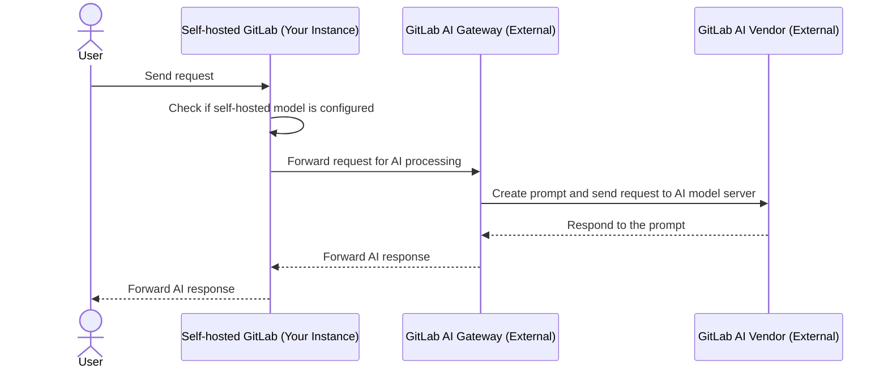
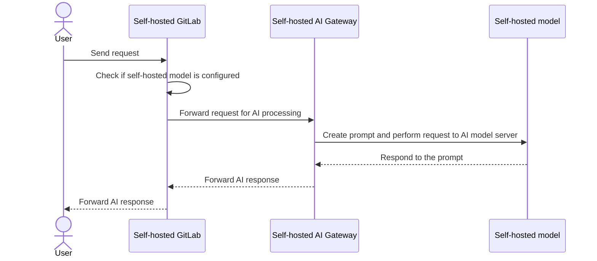
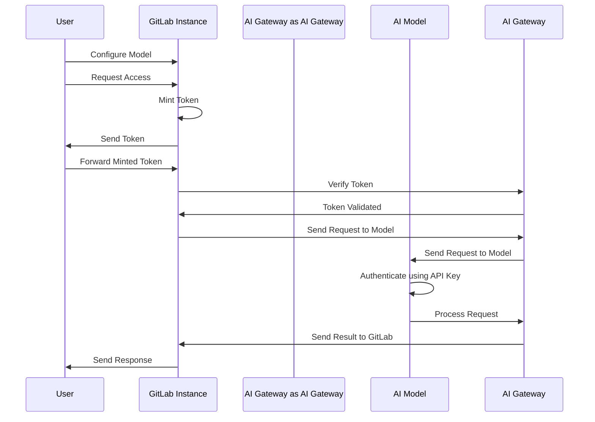



- Édition : GitLab Premium, GitLab Ultimate
- Offre : GitLab Self-Managed





- [Introduit](https://gitlab.com/groups/gitlab-org/-/epics/12972) dans GitLab 17.1 [avec un flag](../feature_flags/_index.md) nommé `ai_custom_model`. Désactivé par défaut.
- [Activé sur GitLab Self-Managed](https://gitlab.com/groups/gitlab-org/-/epics/15176) dans GitLab 17.6.
- Modifié pour nécessiter le module complémentaire GitLab Duo dans GitLab 17.6 et versions ultérieures.
- Le feature flag `ai_custom_model` a été supprimé dans GitLab 17.8.
- Généralement disponible dans GitLab 17.9.
- Modifié pour inclure Premium dans GitLab 18.0.



Il existe deux options de configuration d'AI Gateway pour les clients auto-gérés :

- **GitLab.com AI Gateway** : Il s'agit de la configuration par défaut pour les clients GitLab Self-Managed. Utilisez l'AI Gateway géré par GitLab avec des fournisseurs de grands modèles de langage (LLM) externes sélectionnés par GitLab (par exemple, Google Vertex ou Anthropic).
- **AI Gateway auto-hébergé** : Déployez et gérez votre propre AI Gateway et vos modèles de langage dans votre infrastructure, sans dépendre des fournisseurs de langage externes fournis par GitLab.

## AI Gateway GitLab.com {#gitlabcom-ai-gateway}

Dans cette configuration, votre instance GitLab dépend de l'AI Gateway GitLab externe et lui envoie des requêtes, lequel communique avec des fournisseurs d'IA externes tels que Google Vertex ou Anthropic. La réponse est ensuite transmise à votre instance GitLab.

## AI Gateway auto-hébergé {#self-hosted-ai-gateway}

Dans cette configuration, l'ensemble du système est isolé au sein de l'entreprise, garantissant un environnement entièrement auto-hébergé qui protège la confidentialité des données.

## Authentification pour les modèles auto-hébergés {#authentication-for-self-hosted-models}

Le processus d'authentification pour les modèles auto-hébergés est sécurisé, efficace et composé des éléments clés suivants :

- **Self-issued tokens** : Dans cette architecture, les informations d'identification d'accès ne sont pas synchronisées avec `cloud.gitlab.com`. Les jetons sont plutôt auto-émis de manière dynamique, à l'instar des fonctionnalités de GitLab.com. Cette méthode fournit aux utilisateurs un accès immédiat tout en maintenant un niveau de sécurité élevé.
- **Offline environments** : Dans les configurations hors ligne, il n'y a aucune connexion à `cloud.gitlab.com`. Toutes les requêtes sont acheminées exclusivement vers l'AI Gateway auto-hébergé.
- **Token minting and verification** : L'instance émet le jeton, qui est ensuite vérifié par l'AI Gateway auprès de l'instance GitLab.
- **Model configuration and security** : Lorsqu'un administrateur configure un modèle, il peut intégrer une clé API pour authentifier les requêtes. De plus, vous pouvez renforcer la sécurité en spécifiant des adresses IP de connexion au sein de votre réseau, garantissant que seules les adresses IP de confiance peuvent interagir avec le modèle.

Comme illustré dans le diagramme suivant :

1. Le flow d'authentification commence lorsque l'utilisateur configure le modèle via l'instance GitLab et soumet une requête pour accéder à la fonctionnalité GitLab Duo.
1. L'instance GitLab émet un jeton d'accès, que l'utilisateur transmet à GitLab, puis à l'AI Gateway pour vérification.
1. Après avoir confirmé la validité du jeton, l'AI Gateway envoie une requête au modèle d'IA, qui utilise la clé API pour authentifier la requête et la traiter.
1. Les résultats sont ensuite relayés vers l'instance GitLab, complétant le flow en envoyant la réponse à l'utilisateur, conçu pour être sécurisé et efficace.

