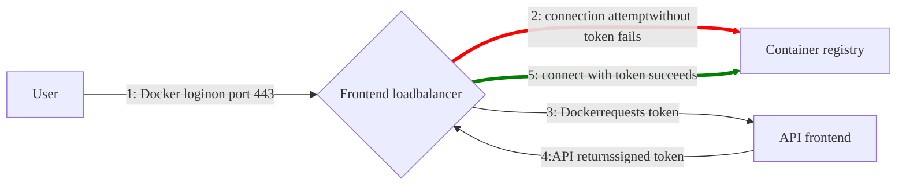



- Niveau : Free, Premium, Ultimate
- Offre : GitLab Self-Managed



> [!note]
> Le [registre de conteneurs de nouvelle génération](container_registry_metadata_database.md) est désormais disponible pour une mise à niveau sur les instances GitLab Self-Managed. Ce registre mis à niveau prend en charge le ramasse-miettes en ligne et présente des améliorations significatives en termes de performances et de fiabilité.

Avec le registre de conteneurs GitLab, chaque projet peut disposer de son propre espace pour stocker des images Docker.

Pour plus de détails sur le Distribution Registry :

- [Configuration](https://distribution.github.io/distribution/about/configuration/)
- [Pilotes de stockage](https://distribution.github.io/distribution/storage-drivers/)
- [Déployer un serveur de registre](https://distribution.github.io/distribution/about/deploying/)

Ce document est le guide de l'administrateur. Pour apprendre à utiliser le registre de conteneurs GitLab, consultez la [documentation utilisateur](../../user/packages/container_registry/_index.md).

## Activer le registre de conteneurs {#enable-the-container-registry}

Le processus d'activation du registre de conteneurs dépend du type d'installation que vous utilisez.

### Installations avec le package Linux {#linux-package-installations}

Si vous avez installé GitLab à l'aide du package Linux, le registre de conteneurs peut ou non être disponible par défaut.

Le registre de conteneurs est automatiquement activé et disponible sur votre domaine GitLab, port 5050, si vous utilisez l'[intégration Let's Encrypt intégrée](https://docs.gitlab.com/omnibus/settings/ssl/#enable-the-lets-encrypt-integration).

Sinon, le registre de conteneurs n'est pas activé. Pour l'activer :

- Vous pouvez le configurer pour votre [domaine GitLab](#configure-container-registry-under-an-existing-gitlab-domain), ou
- Vous pouvez le configurer pour [un domaine différent](#configure-container-registry-under-its-own-domain).

Le registre de conteneurs fonctionne sous HTTPS par défaut. Vous pouvez utiliser HTTP, mais ce n'est pas recommandé et cela dépasse la portée de ce document.

### Installations avec Helm Charts {#helm-charts-installations}

Pour les installations avec Helm Charts, consultez [Utilisation du registre de conteneurs](https://docs.gitlab.com/charts/charts/registry/) dans la documentation Helm Charts.

### Installations compilées manuellement {#self-compiled-installations}

Si vous avez compilé manuellement votre installation GitLab :

1. Vous devez déployer un registre à l'aide de l'image correspondant à la version de GitLab que vous installez (par exemple : `registry.gitlab.com/gitlab-org/build/cng/gitlab-container-registry:v3.15.0-gitlab`)
1. Une fois l'installation terminée, pour l'activer, vous devez configurer les paramètres du Registry dans `gitlab.yml`.
1. Utilisez l'exemple de fichier de configuration NGINX depuis [`lib/support/nginx/registry-ssl`](https://gitlab.com/gitlab-org/gitlab/-/blob/master/lib/support/nginx/registry-ssl) et modifiez-le pour qu'il corresponde au `host`, au `port` et aux chemins des certificats TLS.

Le contenu de `gitlab.yml` est :

```yaml
registry:
  enabled: true
  host: <registry.gitlab.example.com>
  port: <5005>
  api_url: <http://localhost:5000/>
  key: <config/registry.key>
  path: <shared/registry>
  issuer: <gitlab-issuer>
```

Où :

| Paramètre | Description |
| --------- | ----------- |
| `enabled` | `true` ou `false`. Active le Registry dans GitLab. Par défaut, cette valeur est `false`. |
| `host`    | L'URL d'hôte sous laquelle le Registry s'exécute et que les utilisateurs peuvent utiliser. |
| `port`    | Le port sur lequel écoute le domaine Registry externe. |
| `api_url` | L'URL de l'API interne sous laquelle le Registry est exposé. La valeur par défaut est `http://localhost:5000`. Ne modifiez pas ce paramètre, sauf si vous configurez un [registre Docker externe](#use-an-external-container-registry-with-gitlab-as-an-auth-endpoint). |
| `key`     | L'emplacement de la clé privée qui est associée au `rootcertbundle` du Registry. |
| `path`    | Il doit s'agir du même répertoire que celui spécifié dans le `rootdirectory` du Registry. Ce chemin doit être lisible par l'utilisateur GitLab, l'utilisateur du serveur web et l'utilisateur du Registry. |
| `issuer`  | Cette valeur doit être identique à celle configurée dans l’`issuer` du Registry. |

Un fichier d'initialisation du Registry n'est pas livré avec GitLab si vous l'installez depuis les sources. Par conséquent, [redémarrer GitLab](../restart_gitlab.md#self-compiled-installations) ne redémarre pas le Registry si vous modifiez ses paramètres. Consultez la documentation amont pour savoir comment y parvenir.

Au strict minimum, assurez-vous que votre configuration Registry utilise `container_registry` comme service et `https://gitlab.example.com/jwt/auth` comme realm :

```yaml
auth:
  token:
    realm: <https://gitlab.example.com/jwt/auth>
    service: container_registry
    issuer: gitlab-issuer
    rootcertbundle: /root/certs/certbundle
```

> [!warning]
> Si `auth` n'est pas configuré, les utilisateurs peuvent extraire des images Docker sans authentification.

## Configuration du domaine du registre de conteneurs {#container-registry-domain-configuration}

Vous pouvez configurer le domaine externe du Registry de l'une des façons suivantes :

- [Utiliser le domaine GitLab existant](#configure-container-registry-under-an-existing-gitlab-domain). Le Registry écoute sur un port et réutilise le certificat TLS de GitLab.
- [Utiliser un domaine complètement séparé](#configure-container-registry-under-its-own-domain) avec un nouveau certificat TLS pour ce domaine.

Étant donné que le registre de conteneurs nécessite un certificat TLS, le coût peut être un facteur à prendre en compte.

Prenez cela en compte avant de configurer le registre de conteneurs pour la première fois.

### Configurer le registre de conteneurs sous un domaine GitLab existant {#configure-container-registry-under-an-existing-gitlab-domain}

Si le registre de conteneurs est configuré pour utiliser le domaine GitLab existant, vous pouvez exposer le registre de conteneurs sur un port. De cette façon, vous pouvez réutiliser le certificat TLS GitLab existant.

Si le domaine GitLab est `https://gitlab.example.com` et que le port vers le monde extérieur est `5050`, pour configurer le registre de conteneurs :

- Modifiez `gitlab.rb` si vous utilisez une installation avec package Linux.
- Modifiez `gitlab.yml` si vous utilisez une installation compilée manuellement.

Assurez-vous de choisir un port différent de celui sur lequel écoute le Registry (`5000` par défaut), sinon des conflits se produiront.

> [!note]
> Les règles de pare-feu de l'hôte et du conteneur doivent être configurées pour autoriser le trafic entrant via le port indiqué sous la ligne `registry_external_url`, plutôt que le port indiqué sous `gitlab_rails['registry_port']` (par défaut `5000`).





1. Votre `/etc/gitlab/gitlab.rb` doit contenir l'URL du Registry ainsi que le chemin vers le certificat TLS et la clé existants utilisés par GitLab :

   ```ruby
   registry_external_url '<https://gitlab.example.com:5050>'
   ```

   Le `registry_external_url` écoute sur HTTPS sous l'URL GitLab existante, mais sur un port différent.

   Si votre certificat TLS ne se trouve pas dans `/etc/gitlab/ssl/gitlab.example.com.crt` et que la clé ne se trouve pas dans `/etc/gitlab/ssl/gitlab.example.com.key`, décommentez les lignes ci-dessous :

   ```ruby
   registry_nginx['ssl_certificate'] = "</path/to/certificate.pem>"
   registry_nginx['ssl_certificate_key'] = "</path/to/certificate.key>"
   ```

1. Enregistrez le fichier et [reconfigurez GitLab](../restart_gitlab.md#reconfigure-a-linux-package-installation) pour que les modifications prennent effet.

1. Validez avec :

   ```shell
   openssl s_client -showcerts -servername gitlab.example.com -connect gitlab.example.com:5050 > cacert.pem
   ```

Si votre fournisseur de certificats fournit les certificats CA Bundle, ajoutez-les au fichier de certificat TLS.

Un administrateur peut souhaiter que le registre de conteneurs écoute sur un port arbitraire tel que `5678`. Cependant, le registre et le serveur d'application sont derrière un équilibreur de charge applicatif AWS qui écoute uniquement sur les ports `80` et `443`. L'administrateur peut supprimer le numéro de port pour `registry_external_url`, de sorte que HTTP ou HTTPS est supposé. Ensuite, les règles qui mappent l'équilibreur de charge au registre depuis les ports `80` ou `443` vers le port arbitraire s'appliquent. Cela est important si les utilisateurs s'appuient sur l'exemple `docker login` dans le registre de conteneurs. Voici un exemple :

```ruby
registry_external_url '<https://registry-gitlab.example.com>'
registry_nginx['redirect_http_to_https'] = true
registry_nginx['listen_port'] = 5678
```





1. Ouvrez `/home/git/gitlab/config/gitlab.yml`, trouvez l'entrée `registry` et configurez-la avec les paramètres suivants :

   ```yaml
   registry:
     enabled: true
     host: <gitlab.example.com>
     port: 5050
   ```

1. Enregistrez le fichier et [redémarrez GitLab](../restart_gitlab.md#self-compiled-installations) pour que les modifications prennent effet.
1. Apportez également les modifications pertinentes dans NGINX (domaine, port, chemins des certificats TLS).





Les utilisateurs devraient maintenant pouvoir se connecter au registre de conteneurs avec leurs identifiants GitLab en utilisant :

```shell
docker login <gitlab.example.com:5050>
```

### Configurer le registre de conteneurs sous son propre domaine {#configure-container-registry-under-its-own-domain}

Lorsque le Registry est configuré pour utiliser son propre domaine, vous avez besoin d'un certificat TLS pour ce domaine spécifique (par exemple, `registry.example.com`). Vous pourriez avoir besoin d'un certificat générique si le registre est hébergé sous un sous-domaine de votre domaine GitLab existant. Par exemple, `*.gitlab.example.com` est un caractère générique qui correspond à `registry.gitlab.example.com`, et est distinct de `*.example.com`.

En plus des certificats SSL générés manuellement (expliqués ici), les certificats générés automatiquement par Let's Encrypt sont également [pris en charge dans les installations avec package Linux](https://docs.gitlab.com/omnibus/settings/ssl/).

Supposons que vous souhaitiez que le registre de conteneurs soit accessible à `https://registry.gitlab.example.com`.





1. Placez votre certificat TLS et votre clé dans `/etc/gitlab/ssl/<registry.gitlab.example.com>.crt` et `/etc/gitlab/ssl/<registry.gitlab.example.com>.key` et assurez-vous qu'ils ont les permissions correctes :

   ```shell
   chmod 600 /etc/gitlab/ssl/<registry.gitlab.example.com>.*
   ```

1. Une fois le certificat TLS en place, modifiez `/etc/gitlab/gitlab.rb` avec :

   ```ruby
   registry_external_url '<https://registry.gitlab.example.com>'
   ```

   Le `registry_external_url` écoute sur HTTPS.

1. Enregistrez le fichier et [reconfigurez GitLab](../restart_gitlab.md#reconfigure-a-linux-package-installation) pour que les modifications prennent effet.

Si vous avez un [certificat générique](https://en.wikipedia.org/wiki/Wildcard_certificate), vous devez spécifier le chemin vers le certificat en plus de l'URL, dans ce cas `/etc/gitlab/gitlab.rb` ressemble à :

```ruby
registry_nginx['ssl_certificate'] = "/etc/gitlab/ssl/certificate.pem"
registry_nginx['ssl_certificate_key'] = "/etc/gitlab/ssl/certificate.key"
```





1. Ouvrez `/home/git/gitlab/config/gitlab.yml`, trouvez l'entrée `registry` et configurez-la avec les paramètres suivants :

   ```yaml
   registry:
     enabled: true
     host: <registry.gitlab.example.com>
   ```

1. Enregistrez le fichier et [redémarrez GitLab](../restart_gitlab.md#self-compiled-installations) pour que les modifications prennent effet.
1. Apportez également les modifications pertinentes dans NGINX (domaine, port, chemins des certificats TLS).





Les utilisateurs devraient maintenant pouvoir se connecter au registre de conteneurs avec leurs identifiants GitLab :

```shell
docker login <registry.gitlab.example.com>
```

#### Configurer des certificats auto-signés {#configure-self-signed-certificates}

Si vous souhaitez utiliser des certificats auto-signés avec le registre de conteneurs, vous devez configurer le démon Docker pour approuver les certificats auto-signés :

1. Demandez au démon Docker d'[utiliser des certificats auto-signés](https://distribution.github.io/distribution/about/insecure/#use-self-signed-certificates). Ces étapes varient selon votre système d'exploitation.
1. Dans le fichier `config.toml` de GitLab Runner, montez le démon Docker et définissez `privileged = false` :

   ```toml
     [runners.docker]
       image = "ruby:2.6"
       privileged = false
       volumes = ["/var/run/docker.sock:/var/run/docker.sock", "/cache"]
   ```

   Le paramètre `privileged = true` est prioritaire sur le démon Docker.
1. Redémarrez Docker.

## Désactiver le registre de conteneurs sur l'ensemble du site {#disable-container-registry-site-wide}

Lorsque vous désactivez le Registry en suivant ces étapes, vous ne supprimez aucune image Docker existante. La suppression des images Docker est gérée par l'application Registry elle-même.





1. Ouvrez `/etc/gitlab/gitlab.rb` et définissez `registry['enable']` sur `false` :

   ```ruby
   registry['enable'] = false
   ```

1. Enregistrez le fichier et [reconfigurez GitLab](../restart_gitlab.md#reconfigure-a-linux-package-installation) pour que les modifications prennent effet.





1. Ouvrez `/home/git/gitlab/config/gitlab.yml`, trouvez l'entrée `registry` et définissez `enabled` sur `false` :

   ```yaml
   registry:
     enabled: false
   ```

1. Enregistrez le fichier et [redémarrez GitLab](../restart_gitlab.md#self-compiled-installations) pour que les modifications prennent effet.





## Désactiver le registre de conteneurs pour les nouveaux projets sur l'ensemble du site {#disable-container-registry-for-new-projects-site-wide}

Si le registre de conteneurs est activé, il doit être disponible sur tous les nouveaux projets. Pour désactiver cette fonction et permettre aux propriétaires d'un projet d'activer eux-mêmes le registre de conteneurs, suivez les étapes ci-dessous.





1. Modifiez `/etc/gitlab/gitlab.rb` et ajoutez la ligne suivante :

   ```ruby
   gitlab_rails['gitlab_default_projects_features_container_registry'] = false
   ```

1. Enregistrez le fichier et [reconfigurez GitLab](../restart_gitlab.md#reconfigure-a-linux-package-installation) pour que les modifications prennent effet.





1. Ouvrez `/home/git/gitlab/config/gitlab.yml`, trouvez l'entrée `default_projects_features` et configurez-la de sorte que `container_registry` soit défini sur `false` :

   ```yaml
   ## Default project features settings
   default_projects_features:
     issues: true
     merge_requests: true
     wiki: true
     snippets: false
     builds: true
     container_registry: false
   ```

1. Enregistrez le fichier et [redémarrez GitLab](../restart_gitlab.md#self-compiled-installations) pour que les modifications prennent effet.





### Augmenter la durée du jeton {#increase-token-duration}

Dans GitLab, les jetons pour le registre de conteneurs expirent toutes les cinq minutes. Pour augmenter la durée du jeton :

1. Dans le coin supérieur droit, sélectionnez **Admin**.
1. Dans la barre latérale gauche, sélectionnez **Paramètres** > **CI/CD**.
1. Développez **Container Registry**.
1. Pour la **Durée d'un jeton d'autorisation (en minutes)**, mettez à jour la valeur.
1. Sélectionnez **Sauvegarder les modifications**.

## Feature flags du registre de conteneurs {#container-registry-feature-flags}

Les feature flags du registre de conteneurs sont des bascules de variables d'environnement qui contrôlent les fonctionnalités expérimentales ou transitoires dans le registre de conteneurs.

Contrairement aux [feature flags de l'application GitLab](../feature_flags/list.md), les feature flags du registre de conteneurs :

- Sont gérés via des variables d'environnement spécifiques au registre
- Sont définis dans le code source du registre de conteneurs
- Nécessitent une reconfiguration du registre pour être modifiés

### Configurer les feature flags du registre de conteneurs {#configure-container-registry-feature-flags}

Le tableau suivant répertorie les feature flags actifs du registre de conteneurs :

| Feature flag | Description | Jalon | État par défaut | Jalon de suppression |
|--------------|-------------|-----------|---------------|-------------------|
| `REGISTRY_FF_ONGOING_RENAME_CHECK` | Vérifie Redis pour les projets en cours de renommage. | 16.2 | Désactivé | |
| `REGISTRY_FF_DYNAMIC_MEDIA_TYPES` | Autorise la création de nouveaux types de médias lors de l'exécution. | 17.1 | Désactivé | |
| `REGISTRY_FF_BBM` | Contrôle les processus de migration en arrière-plan par lots asynchrones. | 17.2 | Désactivé | |
| `REGISTRY_FF_ENFORCE_LOCKFILES` | Active la vérification des fichiers de verrouillage pour la base de données ou le stockage des métadonnées legacy. | [Introduit](https://gitlab.com/gitlab-org/container-registry/-/issues/1335) dans GitLab 17.6. | [Activé sur GitLab Self-Managed](https://gitlab.com/gitlab-org/container-registry/-/work_items/1786) dans GitLab 18.9. |[Supprimé](https://gitlab.com/gitlab-org/container-registry/-/issues/1439) dans GitLab 18.10. |

Pour configurer les feature flags du registre de conteneurs, suivez les instructions pour votre plateforme.





Dans `/etc/gitlab/gitlab.rb`, configurez le feature flag :

```ruby
registry['env'] = {
  '<REGISTRY_FF_FEATURE_NAME>' => 'true' # or 'false' to disable
}
```

Ensuite, reconfigurez le registre de conteneurs :

```shell
sudo gitlab-ctl reconfigure
sudo gitlab-ctl restart registry
```





Dans `values.yaml`, configurez le feature flag :

```yaml
registry:
  extraEnv:
    <REGISTRY_FF_FEATURE_NAME>: "true"  # or "false" to disable
```

Ensuite, mettez à niveau `values.yaml` :

```shell
helm upgrade gitlab gitlab/gitlab -f values.yaml
```





> [!note]
> La définition de variables d'environnement directement dans Docker Compose ne fonctionne pas. Vous devez configurer via `gitlab.rb`.

Pour Docker ou Docker Compose, créez ou modifiez `gitlab.rb` :

```ruby
registry['env'] = {
  '<REGISTRY_FF_FEATURE_NAME>' => 'true'
}
```

Montez cette configuration dans votre configuration Docker Compose et assurez-vous que GitLab se reconfigure au démarrage.





## Configurer le stockage pour le registre de conteneurs {#configure-storage-for-the-container-registry}

> [!warning]
> Ne modifiez pas directement les fichiers ou les objets stockés par le registre de conteneurs. Toute action autre que l'écriture ou la suppression de ces entrées par le registre peut entraîner des problèmes de cohérence des données à l'échelle de l'instance et des problèmes d'instabilité dont la récupération peut s'avérer impossible.

Vous pouvez configurer le registre de conteneurs pour utiliser divers backends de stockage en configurant un pilote de stockage. Par défaut, le registre de conteneurs GitLab est configuré pour utiliser la configuration du [pilote de système de fichiers](#use-file-system).

Pour les backends de stockage qui le prennent en charge, vous pouvez utiliser la gestion de versions des objets pour conserver, récupérer et restaurer les versions non actuelles de chaque objet stocké dans vos buckets. Cependant, cela peut entraîner une utilisation du stockage et des coûts plus élevés. En raison du fonctionnement du registre, les téléchargements d'images sont d'abord stockés dans un chemin temporaire, puis transférés vers un emplacement final. Pour les backends de stockage d'objets, notamment S3 et GCS, ce transfert s'effectue par une copie suivie d'une suppression. Avec la gestion de versions des objets activée, ces artefacts de téléchargement temporaires supprimés sont conservés en tant que versions non actuelles, ce qui augmente donc la taille du bucket de stockage. Pour garantir que les versions non actuelles sont supprimées après un délai donné, vous devez configurer une politique de cycle de vie des objets auprès de votre fournisseur de stockage.

Les différents pilotes pris en charge sont :

| Pilote       | Description                          |
|--------------|--------------------------------------|
| `filesystem` | Utilise un chemin sur le système de fichiers local |
| `azure`      | Microsoft Azure Blob Storage         |
| `gcs`        | Google Cloud Storage                 |
| `s3`         | Amazon Simple Storage Service. Assurez-vous de configurer votre bucket de stockage avec les [portées d'autorisation S3](https://distribution.github.io/distribution/storage-drivers/s3/#s3-permission-scopes) correctes. |

Bien que la plupart des services compatibles S3 devraient fonctionner avec le registre de conteneurs, nous garantissons uniquement la prise en charge d'AWS S3. Parce que nous ne pouvons pas garantir l'exactitude des implémentations S3 tierces, nous pouvons déboguer les problèmes, mais nous ne pouvons pas corriger le registre à moins qu'un problème ne soit reproductible avec un bucket AWS S3.

### Utiliser le système de fichiers {#use-file-system}

Si vous souhaitez stocker vos images sur le système de fichiers, vous pouvez modifier le chemin de stockage pour le registre de conteneurs en suivant les étapes ci-dessous.

Ce chemin est accessible à :

- L'utilisateur exécutant le démon du registre de conteneurs.
- L'utilisateur exécutant GitLab.

Tous les utilisateurs de GitLab, du Registry et du serveur web doivent avoir accès à ce répertoire.





L'emplacement par défaut où les images sont stockées dans les installations avec package Linux est `/var/opt/gitlab/gitlab-rails/shared/registry`. Pour le modifier :

1. Modifiez `/etc/gitlab/gitlab.rb` :

   ```ruby
   gitlab_rails['registry_path'] = "</path/to/registry/storage>"
   ```

1. Enregistrez le fichier et [reconfigurez GitLab](../restart_gitlab.md#reconfigure-a-linux-package-installation) pour que les modifications prennent effet.





L'emplacement par défaut où les images sont stockées dans les installations compilées manuellement est `/home/git/gitlab/shared/registry`. Pour le modifier :

1. Ouvrez `/home/git/gitlab/config/gitlab.yml`, trouvez l'entrée `registry` et modifiez le paramètre `path` :

   ```yaml
   registry:
     path: shared/registry
   ```

1. Enregistrez le fichier et [redémarrez GitLab](../restart_gitlab.md#self-compiled-installations) pour que les modifications prennent effet.





### Utiliser le stockage d'objets {#use-object-storage}

Si vous souhaitez stocker les images de votre registre de conteneurs dans un stockage d'objets plutôt que sur le système de fichiers local, vous pouvez configurer l'un des pilotes de stockage pris en charge.

Pour plus d'informations, consultez [Stockage d'objets](../object_storage.md).

> [!warning]
> GitLab ne sauvegarde pas les images Docker qui ne sont pas stockées sur le système de fichiers. Activez les sauvegardes auprès de votre fournisseur de stockage d'objets si vous le souhaitez.

#### Configurer le stockage d'objets pour les installations avec package Linux {#configure-object-storage-for-linux-package-installations}

Pour configurer le stockage d'objets pour votre registre de conteneurs :

1. Choisissez le pilote de stockage que vous souhaitez utiliser.
1. Modifiez `/etc/gitlab/gitlab.rb` avec la configuration appropriée.
1. Enregistrez le fichier et [reconfigurez GitLab](../restart_gitlab.md#reconfigure-a-linux-package-installation) pour que les modifications prennent effet.





Le pilote de stockage S3 s'intègre avec Amazon S3 ou tout service de stockage d'objets compatible S3.

Le pilote `s3_v2` (en Beta) utilise AWS SDK v2 et ne prend en charge que la Signature Version 4 pour l'authentification. Ce pilote améliore les performances et la fiabilité tout en garantissant la compatibilité avec les exigences d'authentification AWS, car la prise en charge des méthodes de signature plus anciennes est dépréciée. Pour plus d'informations, consultez [epic 16272](https://gitlab.com/groups/gitlab-org/-/epics/16272).

Pour une liste complète des paramètres de configuration de chaque pilote, consultez [`s3_v1`](https://gitlab.com/gitlab-org/container-registry/-/blob/f4ece8cdba4413b968c8a3fd20497a8186f23d26/docs/storage-drivers/s3_v1.md) et [`s3_v2`](https://gitlab.com/gitlab-org/container-registry/-/blob/f4ece8cdba4413b968c8a3fd20497a8186f23d26/docs/storage-drivers/s3_v2.md).

Pour configurer le pilote de stockage S3, ajoutez l'une des configurations suivantes à votre fichier `/etc/gitlab/gitlab.rb` :

```ruby
# Deprecated: Will be removed in GitLab 19.0
registry['storage'] = {
  's3' => {
    'accesskey' => '<s3-access-key>',
    'secretkey' => '<s3-secret-key-for-access-key>',
    'bucket' => '<your-s3-bucket>',
    'region' => '<your-s3-region>',
    'regionendpoint' => '<your-s3-regionendpoint>'
  }
}
```

Ou

```ruby
# Beta: s3_v2 driver
registry['storage'] = {
  's3_v2' => {
    'accesskey' => '<s3-access-key>',
    'secretkey' => '<s3-secret-key-for-access-key>',
    'bucket' => '<your-s3-bucket>',
    'region' => '<your-s3-region>',
    'regionendpoint' => '<your-s3-regionendpoint>'
  }
}
```

Pour une sécurité améliorée, vous pouvez utiliser un rôle IAM au lieu d'informations d'identification statiques en n'incluant pas les paramètres `accesskey` et `secretkey`.

Pour éviter que les coûts de stockage n'augmentent, configurez une politique de cycle de vie dans votre bucket S3 pour purger les téléchargements multipart incomplets. Le registre de conteneurs ne les nettoie pas automatiquement. Une politique d'expiration de trois jours pour les téléchargements multipart incomplets convient à la plupart des modèles d'utilisation.

> [!note]
> Les paramètres `loglevel` diffèrent entre les pilotes [`s3_v1`](https://gitlab.com/gitlab-org/container-registry/-/blob/f4ece8cdba4413b968c8a3fd20497a8186f23d26/docs/storage-drivers/s3_v1.md#configuration-parameters) et [`s3_v2`](https://gitlab.com/gitlab-org/container-registry/-/blob/f4ece8cdba4413b968c8a3fd20497a8186f23d26/docs/storage-drivers/s3_v2.md#configuration-parameters). Si vous définissez le `loglevel` pour le mauvais pilote, il est ignoré et un message d'avertissement est affiché.

Lorsque vous utilisez certains services compatibles S3 avec le pilote `s3_v2`, vous devrez peut-être ajouter le paramètre `checksum_disabled` pour désactiver les sommes de contrôle AWS :

```ruby
registry['storage'] = {
  's3_v2' => {
    'accesskey' => '<s3-access-key>',
    'secretkey' => '<s3-secret-key-for-access-key>',
    'bucket' => '<your-s3-bucket>',
    'region' => '<your-s3-region>',
    'regionendpoint' => '<your-s3-regionendpoint>',
    'checksum_disabled' => true
  }
}
```

Pour les points de terminaison S3 VPC :

```ruby
registry['storage'] = {
  's3_v2' => {  # Beta driver
    'accesskey' => '<s3-access-key>',
    'secretkey' => '<s3-secret-key-for-access-key>',
    'bucket' => '<your-s3-bucket>',
    'region' => '<your-s3-region>',
    'regionendpoint' => '<your-s3-vpc-endpoint>',
    'pathstyle' => false
  }
}
```

Paramètres de configuration S3 :

- `<your-s3-bucket>` :  Le nom d'un bucket existant. Ne peut pas inclure de sous-répertoires.
- `regionendpoint` :  Requis uniquement lors de l'utilisation d'un service compatible S3 ou d'un point de terminaison S3 VPC AWS.
- `pathstyle` :  Contrôle le formatage des URL. Définissez sur `true` pour `host/bucket_name/object` (la plupart des services compatibles S3) ou `false` pour `bucket_name.host/object` (AWS S3).

Pour éviter les erreurs 503 de l'API S3, ajoutez le paramètre `maxrequestspersecond` pour définir une limite de débit sur les connexions :

```ruby
registry['storage'] = {
  's3' => {
    'accesskey' => '<s3-access-key>',
    'secretkey' => '<s3-secret-key-for-access-key>',
    'bucket' => '<your-s3-bucket>',
    'region' => '<your-s3-region>',
    'regionendpoint' => '<your-s3-regionendpoint>',
    'maxrequestspersecond' => 100
  }
}
```





Le pilote de stockage Azure s'intègre avec Microsoft Azure Blob Storage.

> [!warning]
> Le pilote de stockage Azure legacy a été [déprécié](https://gitlab.com/gitlab-org/gitlab/-/issues/523096) dans GitLab 17.10 et sa suppression est prévue dans GitLab 19.0.
>
> Utilisez plutôt le pilote `azure_v2` (en Beta). Ce pilote offre des performances améliorées, une meilleure fiabilité et des méthodes d'authentification modernes. Bien qu'il s'agisse d'un changement incompatible, le nouveau pilote a été testé de manière approfondie pour garantir une transition en douceur pour la plupart des configurations.
>
> Assurez-vous de tester le nouveau pilote dans des environnements hors production avant de le déployer en production pour identifier et résoudre les cas limites spécifiques à votre environnement et à vos modèles d'utilisation.
>
> Signalez tout problème ou retour en utilisant [issue 525855](https://gitlab.com/gitlab-org/gitlab/-/issues/525855).

Pour une liste complète des paramètres de configuration de chaque pilote, consultez [`azure_v1`](https://gitlab.com/gitlab-org/container-registry/-/blob/7b1786d261481a3c69912ad3423225f47f7c8242/docs/storage-drivers/azure_v1.md) et [`azure_v2`](https://gitlab.com/gitlab-org/container-registry/-/blob/7b1786d261481a3c69912ad3423225f47f7c8242/docs/storage-drivers/azure_v2.md).

Pour configurer le pilote de stockage Azure, ajoutez l'une des configurations suivantes à votre fichier `/etc/gitlab/gitlab.rb` :

```ruby
# Deprecated: Will be removed in GitLab 19.0
registry['storage'] = {
  'azure' => {
    'accountname' => '<your_storage_account_name>',
    'accountkey' => '<base64_encoded_account_key>',
    'container' => '<container_name>'
  }
}
```

Ou

```ruby
# Beta: azure_v2 driver
registry['storage'] = {
  'azure_v2' => {
    'credentials_type' => '<client_secret>',
    'tenant_id' => '<your_tenant_id>',
    'client_id' => '<your_client_id>',
    'secret' => '<your_secret>',
    'container' => '<your_container>',
    'accountname' => '<your_account_name>'
  }
}
```

Par défaut, le pilote de stockage Azure utilise le `core.windows.net realm`. Vous pouvez définir une autre valeur pour realm dans la section Azure (par exemple, `core.usgovcloudapi.net` pour Azure Government Cloud).





Le pilote de stockage GCS s'intègre avec Google Cloud Storage.

```ruby
registry['storage'] = {
  'gcs' => {
    'bucket' => '<your_bucket_name>',
    'keyfile' => '<path/to/keyfile>',
    # If you have the bucket shared with other apps beyond the registry, uncomment the following:
    # 'rootdirectory' => '/gcs/object/name/prefix'
  }
}
```

GitLab prend en charge tous les [paramètres disponibles](https://docs.docker.com/registry/storage-drivers/gcs/).





#### Installations compilées manuellement {#self-compiled-installations-1}

La configuration du pilote de stockage s'effectue dans le fichier YAML de configuration du registre créé lors du déploiement de votre registre Docker.

Exemple de pilote de stockage `s3` :

```yaml
storage:
  s3:
    accesskey: '<s3-access-key>'                # Not needed if IAM role used
    secretkey: '<s3-secret-key-for-access-key>' # Not needed if IAM role used
    bucket: '<your-s3-bucket>'
    region: '<your-s3-region>'
    regionendpoint: '<your-s3-regionendpoint>'
  cache:
    blobdescriptor: inmemory
  delete:
    enabled: true
```

`<your-s3-bucket>` doit être le nom d'un bucket existant et ne peut pas inclure de sous-répertoires.

#### Migrer vers le stockage d'objets sans interruption de service {#migrate-to-object-storage-without-downtime}

> [!warning]
> L'utilisation d'[AWS DataSync](https://aws.amazon.com/datasync/) pour copier les données du registre vers ou entre des buckets S3 crée des objets de métadonnées invalides dans le bucket. Pour plus de détails, consultez [Tags avec un nom vide](container_registry_troubleshooting.md#tags-with-an-empty-name). Pour déplacer des données vers et entre des buckets S3, l'opération `sync` de l'AWS CLI est recommandée.

Pour migrer le stockage sans arrêter le registre de conteneurs, mettez le registre de conteneurs en mode lecture seule. Sur les grandes instances, cela peut nécessiter que le registre de conteneurs soit en mode lecture seule pendant un certain temps. Pendant ce temps, vous pouvez extraire des images du registre de conteneurs, mais vous ne pouvez pas en envoyer.

1. Facultatif. Pour réduire la quantité de données à migrer, exécutez l'[outil de ramasse-miettes sans interruption de service](#performing-garbage-collection-without-downtime).
1. Cet exemple utilise la CLI `aws`. Si vous n'avez pas encore configuré la CLI, vous devez configurer vos informations d'identification en exécutant `sudo aws configure`. Comme un utilisateur non administrateur ne peut probablement pas accéder au dossier du registre de conteneurs, assurez-vous d'utiliser `sudo`. Pour vérifier la configuration de vos informations d'identification, exécutez [`ls`](https://awscli.amazonaws.com/v2/documentation/api/latest/reference/s3/ls.html) pour lister tous les buckets.

   ```shell
   sudo aws --endpoint-url <https://your-object-storage-backend.com> s3 ls
   ```

   Si vous utilisez AWS comme backend, vous n'avez pas besoin du [`--endpoint-url`](https://docs.aws.amazon.com/cli/latest/reference/#options).
1. Copiez les données initiales dans votre bucket S3, par exemple avec la CLI `aws` en utilisant la commande [`cp`](https://awscli.amazonaws.com/v2/documentation/api/latest/reference/s3/cp.html) ou [`sync`](https://awscli.amazonaws.com/v2/documentation/api/latest/reference/s3/sync.html). Assurez-vous de conserver le dossier `docker` comme dossier de niveau supérieur dans le bucket.

   ```shell
   sudo aws --endpoint-url <https://your-object-storage-backend.com> s3 sync registry s3://mybucket
   ```

   > [!note]
   > Si vous avez beaucoup de données, vous pouvez améliorer les performances en [exécutant des opérations de synchronisation en parallèle](https://repost.aws/knowledge-center/s3-improve-transfer-sync-command).

1. Pour effectuer la synchronisation finale des données, [mettez le registre de conteneurs en mode `read-only`](#performing-garbage-collection-without-downtime) et [reconfigurez GitLab](../restart_gitlab.md#reconfigure-a-linux-package-installation).
1. Synchronisez toutes les modifications datant d'après le chargement initial des données dans votre bucket S3 et supprimez les fichiers qui existent dans le bucket de destination mais pas dans la source :

   ```shell
   sudo aws --endpoint-url <https://your-object-storage-backend.com> s3 sync registry s3://mybucket --delete --dryrun
   ```

   Après avoir vérifié que la commande fonctionne comme prévu, supprimez l'option [`--dryrun`](https://docs.aws.amazon.com/cli/latest/reference/s3/sync.html) et exécutez la commande.

   > [!warning]
   > L'option [`--delete`](https://docs.aws.amazon.com/cli/latest/reference/s3/sync.html) supprime les fichiers qui existent dans la destination mais pas dans la source. Si vous intervertissez la source et la destination, toutes les données du Registry sont supprimées.

1. Vérifiez que tous les fichiers du registre de conteneurs ont été téléchargés vers le stockage d'objets en examinant le nombre de fichiers retourné par ces deux commandes :

   ```shell
   sudo find registry -type f | wc -l
   ```

   ```shell
   sudo aws --endpoint-url <https://your-object-storage-backend.com> s3 ls s3://<mybucket> --recursive | wc -l
   ```

   Le résultat de ces commandes doit correspondre, à l'exception du contenu dans les répertoires `_uploads` et leurs sous-répertoires.
1. Configurez votre registre pour [utiliser le bucket S3 pour le stockage](#use-object-storage).
1. Pour que les modifications prennent effet, remettez le Registry en mode `read-write` et [reconfigurez GitLab](../restart_gitlab.md#reconfigure-a-linux-package-installation).

#### Migration vers le stockage d'objets Azure {#moving-to-azure-object-storage}





```ruby
registry['storage'] = {
  'azure' => {
    'accountname' => '<your_storage_account_name>',
    'accountkey' => '<base64_encoded_account_key>',
    'container' => '<container_name>',
    'trimlegacyrootprefix' => true
  }
}
```





```yaml
storage:
  azure:
    accountname: <your_storage_account_name>
    accountkey: <base64_encoded_account_key>
    container: <container_name>
    trimlegacyrootprefix: true
```





Par défaut, le pilote de stockage Azure utilise le realm `core.windows.net`. Vous pouvez définir une autre valeur pour `realm` dans la section `azure` (par exemple, `core.usgovcloudapi.net` pour Azure Government Cloud).

### Désactiver la redirection pour le pilote de stockage {#disable-redirect-for-storage-driver}

Par défaut, les utilisateurs accédant à un registre configuré avec un backend distant sont redirigés vers le backend par défaut du pilote de stockage. Par exemple, les registres peuvent être configurés avec le pilote de stockage `s3`, qui redirige les requêtes vers un bucket S3 distant pour alléger la charge sur le serveur GitLab.

Cependant, ce comportement est indésirable pour les registres utilisés par des hôtes internes qui ne peuvent généralement pas accéder aux serveurs publics. Pour désactiver les redirections et le [téléchargement par proxy](../object_storage.md#proxy-download), définissez l'option `disable` sur true comme suit. Cela fait transiter tout le trafic par le service Registry. Cela améliore la sécurité (surface d'attaque réduite car le backend de stockage n'est pas accessible publiquement), mais dégrade les performances (tout le trafic est redirigé via le service).





1. Modifiez `/etc/gitlab/gitlab.rb` :

   ```ruby
   registry['storage'] = {
     's3' => {
       'accesskey' => '<s3_access_key>',
       'secretkey' => '<s3_secret_key_for_access_key>',
       'bucket' => '<your_s3_bucket>',
       'region' => '<your_s3_region>',
       'regionendpoint' => '<your_s3_regionendpoint>'
     },
     'redirect' => {
       'disable' => true
     }
   }
   ```

1. Enregistrez le fichier et [reconfigurez GitLab](../restart_gitlab.md#reconfigure-a-linux-package-installation) pour que les modifications prennent effet.





1. Ajoutez l'option `redirect` à votre fichier YAML de configuration du registre :

   ```yaml
   storage:
     s3:
       accesskey: '<s3_access_key>'
       secretkey: '<s3_secret_key_for_access_key>'
       bucket: '<your_s3_bucket>'
       region: '<your_s3_region>'
       regionendpoint: '<your_s3_regionendpoint>'
     redirect:
       disable: true
     cache:
       blobdescriptor: inmemory
     delete:
       enabled: true
   ```

1. Enregistrez le fichier et [redémarrez GitLab](../restart_gitlab.md#self-compiled-installations) pour que les modifications prennent effet.





#### Buckets S3 chiffrés {#encrypted-s3-buckets}

Vous pouvez utiliser le chiffrement côté serveur avec AWS KMS pour les buckets S3 qui ont le [chiffrement SSE-S3 ou SSE-KMS activé par défaut](https://docs.aws.amazon.com/kms/latest/developerguide/services-s3.html). Les clés maîtres client (CMK) et le chiffrement SSE-C ne sont pas pris en charge, car cela nécessite d'envoyer les clés de chiffrement à chaque requête.

Pour SSE-S3, vous devez activer l'option `encrypt` dans les paramètres du registre. La façon de procéder dépend de la manière dont vous avez installé GitLab. Suivez les instructions ici qui correspondent à votre méthode d'installation.





1. Modifiez `/etc/gitlab/gitlab.rb` :

   ```ruby
   registry['storage'] = {
     's3' => {
       'accesskey' => '<s3_access_key>',
       'secretkey' => '<s3_secret_key_for_access_key>',
       'bucket' => '<your_s3_bucket>',
       'region' => '<your_s3_region>',
       'regionendpoint' => '<your_s3_regionendpoint>',
       'encrypt' => true
     }
   }
   ```

1. Enregistrez le fichier et [reconfigurez GitLab](../restart_gitlab.md#reconfigure-a-linux-package-installation) pour que les modifications prennent effet.





1. Modifiez votre fichier YAML de configuration du registre :

   ```yaml
   storage:
     s3:
       accesskey: '<s3_access_key>'
       secretkey: '<s3_secret_key_for_access_key>'
       bucket: '<your_s3_bucket>'
       region: '<your_s3_region>'
       regionendpoint: '<your_s3_regionendpoint>'
       encrypt: true
   ```

1. Enregistrez le fichier et [redémarrez GitLab](../restart_gitlab.md#self-compiled-installations) pour que les modifications prennent effet.





### Limitations du stockage {#storage-limitations}

Il n'y a pas de limitation de stockage, ce qui signifie qu'un utilisateur peut télécharger une quantité infinie d'images Docker de tailles arbitraires. Ce paramètre devrait être configurable dans les futures versions.

## Modifier le port interne du registre {#change-the-registrys-internal-port}

Le serveur Registry écoute par défaut sur localhost au port `5000`, qui est l'adresse à laquelle le serveur Registry doit accepter les connexions. Dans les exemples ci-dessous, nous définissons le port du Registry sur `5010`.





1. Ouvrez `/etc/gitlab/gitlab.rb` et définissez `registry['registry_http_addr']` :

   ```ruby
   registry['registry_http_addr'] = "localhost:5010"
   ```

1. Enregistrez le fichier et [reconfigurez GitLab](../restart_gitlab.md#reconfigure-a-linux-package-installation) pour que les modifications prennent effet.





1. Ouvrez le fichier de configuration de votre serveur Registry et modifiez la valeur [`http:addr`](https://distribution.github.io/distribution/about/configuration/#http) :

   ```yaml
   http:
     addr: localhost:5010
   ```

1. Enregistrez le fichier et redémarrez le serveur Registry.





## Désactiver le registre de conteneurs par projet {#disable-container-registry-per-project}

Si le Registry est activé dans votre instance GitLab, mais que vous n'en avez pas besoin pour votre projet, vous pouvez [le désactiver depuis les paramètres de votre projet](../../user/project/settings/_index.md#configure-project-features-and-permissions).

## Utiliser un registre de conteneurs externe avec GitLab comme point de terminaison d'authentification {#use-an-external-container-registry-with-gitlab-as-an-auth-endpoint}

> [!warning]
> L'utilisation de registres de conteneurs tiers dans GitLab a été [dépréciée](https://gitlab.com/gitlab-org/gitlab/-/issues/376217) dans GitLab 15.8 et la prise en charge a pris fin dans GitLab 16.0. Si vous avez besoin d'utiliser des registres de conteneurs tiers au lieu du registre de conteneurs GitLab, parlez-nous de vos cas d'utilisation dans [l'issue de retour 958](https://gitlab.com/gitlab-org/container-registry/-/issues/958).

Si vous utilisez un registre de conteneurs externe, certaines fonctionnalités associées au registre de conteneurs peuvent être indisponibles ou présenter des [risques inhérents](../../user/packages/container_registry/reduce_container_registry_storage.md#use-with-external-container-registries).

Pour que l'intégration fonctionne, le registre externe doit être configuré pour utiliser un JSON Web Token afin de s'authentifier auprès de GitLab. La [configuration d'exécution du registre externe](https://distribution.github.io/distribution/about/configuration/#token) doit contenir les entrées suivantes :

```yaml
auth:
  token:
    realm: https://<gitlab.example.com>/jwt/auth
    service: container_registry
    issuer: gitlab-issuer
    rootcertbundle: /root/certs/certbundle
```

Sans ces entrées, les connexions au registre ne peuvent pas s'authentifier auprès de GitLab. GitLab reste également ignorant des [noms d'images imbriquées](../../user/packages/container_registry/_index.md#naming-convention-for-your-container-images) dans la hiérarchie du projet, comme `registry.example.com/group/project/image-name:tag` ou `registry.example.com/group/project/my/image-name:tag`, et ne reconnaît que `registry.example.com/group/project:tag`.

### Installations avec le package Linux {#linux-package-installations-1}

Vous pouvez utiliser GitLab comme point de terminaison d'authentification avec un registre de conteneurs externe.

1. Ouvrez `/etc/gitlab/gitlab.rb` et définissez les configurations nécessaires :

   ```ruby
   gitlab_rails['registry_enabled'] = true
   gitlab_rails['registry_api_url'] = "https://<external_registry_host>:5000"
   gitlab_rails['registry_issuer'] = "gitlab-issuer"
   ```

   - `gitlab_rails['registry_enabled'] = true` est nécessaire pour activer les fonctionnalités du registre de conteneurs GitLab et le point de terminaison d'authentification. Le service de registre de conteneurs intégré à GitLab ne démarre pas, même avec cette option activée.
   - `gitlab_rails['registry_api_url'] = "http://<external_registry_host>:5000"` doit être modifié pour correspondre à l'hôte où le Registry est installé. Il doit également spécifier `https` si le registre externe est configuré pour utiliser TLS.

1. Une paire certificat-clé est requise pour que GitLab et le registre de conteneurs externe puissent communiquer de manière sécurisée. Vous devez créer une paire certificat-clé, en configurant le registre de conteneurs externe avec le certificat public (`rootcertbundle`) et en configurant GitLab avec la clé privée. Pour ce faire, ajoutez ce qui suit à `/etc/gitlab/gitlab.rb` :

   ```ruby
   # registry['internal_key'] should contain the contents of the custom key
   # file. Line breaks in the key file should be marked using `\n` character
   # Example:
   registry['internal_key'] = "---BEGIN RSA PRIVATE KEY---\nMIIEpQIBAA\n"

   # Optionally define a custom file for a Linux package installation to write the contents
   # of registry['internal_key'] to.
   gitlab_rails['registry_key_path'] = "/custom/path/to/registry-key.key"
   ```

   Chaque fois que la reconfiguration est exécutée, le fichier spécifié dans `registry_key_path` est rempli avec le contenu spécifié par `internal_key`. Si aucun fichier n'est spécifié, les installations avec package Linux utilisent par défaut `/var/opt/gitlab/gitlab-rails/etc/gitlab-registry.key` et le remplissent.

1. Pour modifier l'URL du registre de conteneurs affichée dans les pages du registre de conteneurs GitLab, définissez les configurations suivantes :

   ```ruby
   gitlab_rails['registry_host'] = "<registry.gitlab.example.com>"
   gitlab_rails['registry_port'] = "5005"
   ```

1. Enregistrez le fichier et [reconfigurez GitLab](../restart_gitlab.md#reconfigure-a-linux-package-installation) pour que les modifications prennent effet.

### Installations compilées manuellement {#self-compiled-installations-2}

1. Ouvrez `/home/git/gitlab/config/gitlab.yml` et modifiez les paramètres de configuration sous `registry` :

   ```yaml
   ## Container registry

   registry:
     enabled: true
     host: "<registry.gitlab.example.com>"
     port: "5005"
     api_url: "https://<external_registry_host>:5000"
     path: /var/lib/registry
     key: </path/to/keyfile>
     issuer: gitlab-issuer
   ```

   [En savoir plus](#enable-the-container-registry) sur la signification de ces paramètres.

1. Enregistrez le fichier et [redémarrez GitLab](../restart_gitlab.md#self-compiled-installations) pour que les modifications prennent effet.

## Configurer les notifications du registre de conteneurs {#configure-container-registry-notifications}



- `threshold` [déprécié](https://gitlab.com/gitlab-org/container-registry/-/issues/1243) dans GitLab 17.0, mais toujours utilisable pour garantir la [rétrocompatibilité](https://gitlab.com/gitlab-org/container-registry/-/merge_requests/2577).



Vous pouvez configurer le registre de conteneurs pour envoyer des notifications webhook en réponse aux événements se produisant dans le registre.

Pour en savoir plus sur les options de configuration des notifications du registre de conteneurs, consultez la [documentation sur les notifications du Docker Registry](https://distribution.github.io/distribution/about/notifications/).

> [!warning]
> Le paramètre `threshold` a été [déprécié](https://gitlab.com/gitlab-org/container-registry/-/issues/1243) dans GitLab 17.0, mais est toujours utilisable pour garantir la rétrocompatibilité. Ce paramètre pourrait être programmé pour suppression dans un jalon futur. Utilisez plutôt `maxretries`. Le registre traduit automatiquement les configurations de threshold existantes en valeurs `maxretries` équivalentes en fonction de la durée `backoff` configurée, et émet un avertissement de dépréciation dans les journaux indiquant la valeur traduite. Bien que votre configuration existante continue de fonctionner, vous devez définir `maxretries` pour éviter la traduction automatique.

Vous pouvez configurer plusieurs points de terminaison pour le registre de conteneurs.





Pour configurer un point de terminaison de notification pour une installation avec package Linux :

1. Modifiez `/etc/gitlab/gitlab.rb` :

   ```ruby
   registry['notifications'] = [
     {
       'name' => '<test_endpoint>',
       'url' => 'https://<gitlab.example.com>/api/v4/container_registry_event/events',
       'timeout' => '500ms',
       'threshold' => 5, # DEPRECATED: use `maxretries` instead.
       'maxretries' => 5,
       'backoff' => '1s',
       'headers' => {
         "Authorization" => ["<AUTHORIZATION_EXAMPLE_TOKEN>"]
       }
     }
   ]

   gitlab_rails['registry_notification_secret'] = '<AUTHORIZATION_EXAMPLE_TOKEN>' # Must match the auth token in registry['notifications']
   ```

   > [!note]
   > Remplacez `<AUTHORIZATION_EXAMPLE_TOKEN>` par une chaîne alphanumérique sensible à la casse qui commence par une lettre. Vous pouvez en générer un avec `< /dev/urandom tr -dc _A-Z-a-z-0-9 | head -c 32 | sed "s/^[0-9]*//"; echo`

1. Enregistrez le fichier et [reconfigurez GitLab](../restart_gitlab.md#reconfigure-a-linux-package-installation) pour que les modifications prennent effet.





La configuration du point de terminaison de notification s'effectue dans votre fichier YAML de configuration du registre créé lors du déploiement de votre registre Docker.

Exemple :

```yaml
notifications:
  endpoints:
    - name: <alistener>
      disabled: false
      url: https://<my.listener.com>/event
      headers: <http.Header>
      timeout: 500
      threshold: 5 # DEPRECATED: use `maxretries` instead.
      maxretries: 5
      backoff: 1000
```





## Exécuter la politique de nettoyage {#run-the-cleanup-policy}

Prérequis :

- Si vous utilisez une architecture distribuée où le registre de conteneurs s'exécute sur un nœud différent de Sidekiq, suivez les étapes dans [Configurer le registre de conteneurs lors de l'utilisation d'un Sidekiq externe](../sidekiq/_index.md#configure-the-container-registry-when-using-an-external-sidekiq).

Après avoir [créé une politique de nettoyage](../../user/packages/container_registry/reduce_container_registry_storage.md#create-a-cleanup-policy), vous pouvez l'exécuter immédiatement pour réduire l'espace de stockage du registre de conteneurs. Vous n'avez pas à attendre le nettoyage planifié.

Pour réduire l'espace disque du registre de conteneurs utilisé par un projet donné, les administrateurs peuvent :

1. [Vérifier l'utilisation de l'espace disque par projet](#registry-disk-space-usage-by-project) pour identifier les projets nécessitant un nettoyage.
1. Exécuter la politique de nettoyage à l'aide de la console Rails GitLab pour supprimer les tags d'images.
1. [Exécuter le ramasse-miettes](#container-registry-garbage-collection) pour supprimer les couches non référencées et les manifestes sans tag.

### Utilisation de l'espace disque du Registry par projet {#registry-disk-space-usage-by-project}

Pour trouver l'espace disque utilisé par chaque projet, exécutez ce qui suit dans la [console Rails GitLab](../operations/rails_console.md#starting-a-rails-console-session) :

```ruby
projects_and_size = [["project_id", "creator_id", "registry_size_bytes", "project path"]]
# You need to specify the projects that you want to look through. You can get these in any manner.
projects = Project.last(100)

registry_metadata_database = ContainerRegistry::GitlabApiClient.supports_gitlab_api?

if registry_metadata_database
  projects.each do |project|
    size = project.container_repositories_size
    if size > 0
      projects_and_size << [project.project_id, project.creator&.id, size, project.full_path]
    end
  end
else
  projects.each do |project|
    project_layers = {}

    project.container_repositories.each do |repository|
      repository.tags.each do |tag|
        tag.layers.each do |layer|
          project_layers[layer.digest] ||= layer.size
        end
      end
    end

    total_size = project_layers.values.compact.sum
    if total_size > 0
      projects_and_size << [project.project_id, project.creator&.id, total_size, project.full_path]
    end
  end
end

# print it as comma separated output
projects_and_size.each do |ps|
   puts "%s,%s,%s,%s" % ps
end
```

> [!note]
> Le script calcule la taille en fonction des couches d'images de conteneur. Étant donné que les couches peuvent être partagées entre plusieurs projets, les résultats sont approximatifs mais donnent une bonne indication de l'utilisation relative du disque entre les projets.

Pour supprimer les tags d'images en exécutant la politique de nettoyage, exécutez les commandes suivantes dans la [console Rails GitLab](../operations/rails_console.md) :

```ruby
# Numeric ID of the project whose container registry should be cleaned up
P = <project_id>

# Numeric ID of a user with Developer, Maintainer, or Owner role for the project
U = <user_id>

# Get required details / objects
user    = User.find_by_id(U)
project = Project.find_by_id(P)
policy  = ContainerExpirationPolicy.find_by(project_id: P)

# Loop through each container repository
project.container_repositories.find_each do |repo|
  puts repo.attributes

  # Start the tag cleanup
  puts Projects::ContainerRepository::CleanupTagsService.new(container_repository: repo, current_user: user, params: policy.attributes.except("created_at", "updated_at")).execute
end
```

Vous pouvez également [exécuter le nettoyage selon un calendrier](../../user/packages/container_registry/reduce_container_registry_storage.md#cleanup-policy).

Pour activer les politiques de nettoyage pour tous les projets à l'échelle de l'instance, vous devez trouver tous les projets avec un registre de conteneurs mais avec la politique de nettoyage désactivée :

```ruby
# Find all projects where Container registry is enabled, and cleanup policies disabled

projects = Project.find_by_sql ("SELECT * FROM projects WHERE id IN (SELECT project_id FROM container_expiration_policies WHERE enabled=false AND id IN (SELECT project_id FROM container_repositories))")

# Loop through each project
projects.each do |p|

# Print project IDs and project full names
    puts "#{p.id},#{p.full_name}"
end
```

## Base de données des métadonnées du registre de conteneurs {#container-registry-metadata-database}



- Niveau : Free, Premium, Ultimate
- Offre : GitLab Self-Managed





- [Disponible en version générale](https://gitlab.com/gitlab-org/gitlab/-/issues/423459) dans GitLab 17.3.



La base de données des métadonnées active de nombreuses nouvelles fonctionnalités du registre, notamment le ramasse-miettes en ligne, et augmente l'efficacité de nombreuses opérations du registre. Consultez la page [Base de données des métadonnées du registre de conteneurs](container_registry_metadata_database.md) pour plus de détails.

## Ramasse-miettes du registre de conteneurs {#container-registry-garbage-collection}

Prérequis :

- Vous devez avoir installé GitLab à l'aide d'un package Linux ou du [chart Helm GitLab](https://docs.gitlab.com/charts/charts/registry/#garbage-collection).

> [!note]
> Les politiques de rétention dans un fournisseur de stockage d'objets, tel qu'Amazon S3 Lifecycle, peuvent empêcher la suppression correcte des objets.

Le registre de conteneurs peut utiliser des quantités considérables d'espace de stockage, et vous pouvez vouloir [réduire l'utilisation du stockage](../../user/packages/container_registry/reduce_container_registry_storage.md). Parmi les options répertoriées, la suppression des tags est l'option la plus efficace. Cependant, la suppression des tags seule ne supprime pas les couches d'images, elle laisse uniquement les manifestes d'images sous-jacents sans tag.

Pour libérer de l'espace plus efficacement, le registre de conteneurs dispose d'un ramasse-miettes capable de supprimer les couches non référencées et (optionnellement) les manifestes sans tag.

Pour démarrer le ramasse-miettes, exécutez la commande `gitlab-ctl` suivante :

```shell
sudo gitlab-ctl registry-garbage-collect
```

Le temps nécessaire à l'exécution du ramasse-miettes est proportionnel à la taille des données du registre de conteneurs.

> [!warning]
> La commande `registry-garbage-collect` arrête le registre de conteneurs avant le ramasse-miettes et ne le redémarre qu'une fois le ramasse-miettes terminé. Si vous préférez éviter les interruptions de service, vous pouvez manuellement mettre le registre de conteneurs en [mode lecture seule et contourner `gitlab-ctl`](#performing-garbage-collection-without-downtime).
>
> Cette commande ne s'exécute que si les métadonnées legacy sont utilisées. Cette commande ne s'exécute pas si la [base de données des métadonnées du registre de conteneurs](#container-registry-metadata-database) est activée.

### Comprendre les couches adressables par contenu {#understanding-the-content-addressable-layers}

Considérez l'exemple suivant, où vous construisez d'abord l'image :

```shell
# This builds an image with content of sha256:<111111...>
docker build -t <my.registry.com>/<my.group>/<my.project>:latest .
docker push <my.registry.com>/<my.group>/<my.project>:latest
```

Maintenant, vous écrasez `latest` avec une nouvelle version :

```shell
# This builds a image with content of sha256:<222222...>
docker build -t <my.registry.com>/<my.group>/<my.project>:latest .
docker push <my.registry.com>/<my.group>/<my.project>:latest
```

Maintenant, le tag `latest` pointe vers le manifeste de `sha256:<222222...>`. En raison de l'architecture du registre, ces données sont toujours accessibles lors de l'extraction de l'image `<my.registry.com>/<my.group>/<my.project>@sha256:<111111...>`, bien qu'elles ne soient plus directement accessibles via le tag `latest`.

### Supprimer les couches non référencées {#remove-unreferenced-layers}

Les couches d'images constituent la majeure partie du stockage du registre de conteneurs. Une couche est considérée comme non référencée lorsqu'aucun manifeste d'image ne la référence. Les couches non référencées sont la cible par défaut du ramasse-miettes du registre de conteneurs.

Si vous n'avez pas modifié l'emplacement par défaut du fichier de configuration, exécutez :

```shell
sudo gitlab-ctl registry-garbage-collect
```

Si vous avez modifié l'emplacement du `config.yml` du registre de conteneurs :

```shell
sudo gitlab-ctl registry-garbage-collect /path/to/config.yml
```

Vous pouvez également [supprimer tous les manifestes sans tag et les couches non référencées](#removing-untagged-manifests-and-unreferenced-layers) pour récupérer de l'espace supplémentaire.

### Suppression des manifestes sans tag et des couches non référencées {#removing-untagged-manifests-and-unreferenced-layers}

Par défaut, le ramasse-miettes du registre de conteneurs ignore les images sans tag, et les utilisateurs peuvent continuer à extraire des images sans tag par digest. Les utilisateurs peuvent également re-tagger les images à l'avenir, les rendant à nouveau visibles dans l'interface utilisateur et l'API GitLab.

Si vous ne vous souciez pas des images sans tag et des couches exclusivement référencées par ces images, vous pouvez toutes les supprimer. Utilisez l'option `-m` sur la commande `registry-garbage-collect` :

```shell
sudo gitlab-ctl registry-garbage-collect -m
```

Si vous n'êtes pas sûr de vouloir supprimer les images sans tag, sauvegardez vos données de registre avant de continuer.

### Effectuer le ramasse-miettes sans interruption de service {#performing-garbage-collection-without-downtime}

Pour effectuer le ramasse-miettes tout en maintenant le registre de conteneurs en ligne, mettez le registre en mode lecture seule et contournez la commande intégrée `gitlab-ctl registry-garbage-collect`.

Vous pouvez extraire des images mais pas en envoyer pendant que le registre de conteneurs est en mode lecture seule. Le registre de conteneurs doit rester en lecture seule pendant toute la durée du ramasse-miettes.

Par défaut, le [chemin de stockage du registre](#configure-storage-for-the-container-registry) est `/var/opt/gitlab/gitlab-rails/shared/registry`.

Pour activer le mode lecture seule :

1. Dans `/etc/gitlab/gitlab.rb`, spécifiez le mode lecture seule :

   ```ruby
   registry['storage'] = {
     'filesystem' => {
       'rootdirectory' => "<your_registry_storage_path>"
     },
     'maintenance' => {
       'readonly' => {
         'enabled' => true
       }
     }
   }
   ```

1. Enregistrez et reconfigurez GitLab :

   ```shell
   sudo gitlab-ctl reconfigure
   ```

   Cette commande met le registre de conteneurs en mode lecture seule.

1. Ensuite, déclenchez l'une des commandes de ramasse-miettes :

   ```shell
   # Remove unreferenced layers
   sudo /opt/gitlab/embedded/bin/registry garbage-collect /var/opt/gitlab/registry/config.yml

   # Remove untagged manifests and unreferenced layers
   sudo /opt/gitlab/embedded/bin/registry garbage-collect -m /var/opt/gitlab/registry/config.yml
   ```

   Cette commande démarre le ramasse-miettes. Le temps de complétion est proportionnel à la taille des données du registre.

1. Une fois terminé, dans `/etc/gitlab/gitlab.rb`, remettez-le en mode lecture-écriture :

   ```ruby
   registry['storage'] = {
     'filesystem' => {
       'rootdirectory' => "<your_registry_storage_path>"
     },
     'maintenance' => {
       'readonly' => {
         'enabled' => false
       }
     }
   }
   ```

1. Enregistrez et reconfigurez GitLab :

   ```shell
   sudo gitlab-ctl reconfigure
   ```

### Exécution du ramasse-miettes selon un calendrier {#running-the-garbage-collection-on-schedule}

Idéalement, vous souhaitez exécuter le ramasse-miettes du registre régulièrement sur une base hebdomadaire, à un moment où le registre n'est pas utilisé. La façon la plus simple est d'ajouter une nouvelle tâche crontab qui s'exécute périodiquement une fois par semaine.

Créez un fichier sous `/etc/cron.d/registry-garbage-collect` :

```shell
SHELL=/bin/sh
PATH=/usr/local/sbin:/usr/local/bin:/sbin:/bin:/usr/sbin:/usr/bin

# Run every Sunday at 04:05am
5 4 * * 0  root gitlab-ctl registry-garbage-collect
```

Vous pouvez ajouter l'option `-m` pour [supprimer les manifestes sans tag et les couches non référencées](#removing-untagged-manifests-and-unreferenced-layers).

### Arrêter le ramasse-miettes {#stop-garbage-collection}

Si vous prévoyez d'arrêter le ramasse-miettes, vous devez exécuter manuellement le ramasse-miettes comme décrit dans [Effectuer le ramasse-miettes sans interruption de service](#performing-garbage-collection-without-downtime). Vous pouvez ensuite arrêter le ramasse-miettes en appuyant sur <kbd>Control</kbd>+<kbd>C</kbd>.

Sinon, l'interruption de `gitlab-ctl` pourrait laisser votre service de registre dans un état inactif. Dans ce cas, vous devez trouver le [processus de ramasse-miettes](https://gitlab.com/gitlab-org/omnibus-gitlab/-/blob/master/files/gitlab-ctl-commands/registry_garbage_collect.rb#L26-35) lui-même sur le système afin que la commande `gitlab-ctl` puisse relancer le service de registre.

De plus, il n'y a aucun moyen de sauvegarder la progression ou les résultats pendant la phase de marquage du processus. C'est seulement une fois que les blobs commencent à être supprimés que quoi que ce soit de permanent est effectué.

### Ramasse-miettes continu sans interruption de service {#continuous-zero-downtime-garbage-collection}

Vous pouvez exécuter le ramasse-miettes en arrière-plan sans avoir besoin de le planifier ni d'activer le mode lecture seule, si vous migrez vers la [base de données des métadonnées](container_registry_metadata_database.md).

## Mise à l'échelle par composant {#scaling-by-component}

Cette section présente les goulots d'étranglement potentiels des performances à mesure que le trafic du registre augmente par composant. Chaque sous-section est approximativement ordonnée par recommandations bénéficiant des charges de travail de registre les plus petites aux plus grandes. Le registre n'est pas inclus dans les [architectures de référence](../reference_architectures/_index.md), et il n'existe pas de guides de mise à l'échelle ciblant le nombre de sièges ou les requêtes par seconde.

### Base de données {#database}

1. Passer à une base de données séparée :  À mesure que la charge de la base de données augmente, mettez à l'échelle verticalement en déplaçant la base de données des métadonnées du registre vers une base de données physique séparée. Une base de données séparée peut augmenter la quantité de ressources disponibles pour la base de données du registre tout en isolant le trafic produit par le registre.
1. Passer à une solution tierce PostgreSQL HA :  Similaire à [Praefect](../reference_architectures/5k_users.md#praefect-ha-postgresql-third-party-solution), le passage à un fournisseur ou une solution réputé(e) active la haute disponibilité et convient aux déploiements de registre multi-nœuds. Vous devez choisir un fournisseur qui prend en charge le partitionnement natif Postgres, les déclencheurs et les fonctions, car le registre en fait un usage intensif.

### Serveur de registre {#registry-server}

1. Passer à un nœud séparé :  Un [nœud séparé](#configure-gitlab-and-registry-on-separate-nodes-linux-package-installations) est une façon de mettre à l'échelle verticalement pour augmenter les ressources disponibles au processus du serveur de registre de conteneurs.
1. Exécuter plusieurs nœuds de registre derrière un équilibreur de charge :  Bien que le registre puisse gérer une grande quantité de trafic avec un seul nœud de grande taille, le registre est généralement conçu pour s'adapter horizontalement avec plusieurs déploiements. La configuration de plusieurs nœuds plus petits permet également des techniques telles que la mise à l'échelle automatique.

### Cache Redis {#redis-cache}

L'activation du cache [Redis](https://gitlab.com/gitlab-org/container-registry/-/blob/master/docs/configuration.md?ref_type=heads#redis) améliore les performances, mais permet également des fonctionnalités telles que le renommage des dépôts.

1. Redis Server :  Une instance Redis unique est prise en charge et constitue la façon la plus simple d'accéder aux avantages de la mise en cache Redis.
1. Redis Sentinel :  Redis Sentinel est également pris en charge et permet au cache d'être en haute disponibilité.
1. Redis Cluster :  Redis Cluster peut également être utilisé pour une mise à l'échelle supplémentaire à mesure que les déploiements croissent.

### Stockage {#storage}

1. Système de fichiers local :  Un système de fichiers local est la valeur par défaut et est relativement performant, mais n'est pas adapté aux déploiements multi-nœuds ou à une grande quantité de données de registre.
1. Stockage d'objets :  [Utilisez le stockage d'objets](#use-object-storage) pour permettre le stockage pratique d'une plus grande quantité de données de registre. Le stockage d'objets convient également aux déploiements de registre multi-nœuds.

### Ramasse-miettes en ligne {#online-garbage-collection}

1. Ajuster les valeurs par défaut :  Si le ramasse-miettes en ligne ne vide pas de manière fiable les [files d'attente de révision](container_registry_metadata_database.md#monitor-task-queues), vous pouvez ajuster les paramètres `interval` dans les sections `manifests` et `blobs` sous la section de configuration [`gc`](https://gitlab.com/gitlab-org/container-registry/-/blob/master/docs/configuration.md?ref_type=heads#gc). La valeur par défaut est `5s`, et ces valeurs peuvent également être configurées en millisecondes, par exemple `500ms`.
1. Mise à l'échelle horizontale avec le serveur de registre :  Si vous mettez à l'échelle horizontalement l'application de registre avec des déploiements multi-nœuds, le ramasse-miettes en ligne s'adapte automatiquement sans nécessiter de modifications de configuration.

## Configurer GitLab et le registre sur des nœuds séparés (installations avec package Linux) {#configure-gitlab-and-registry-on-separate-nodes-linux-package-installations}

Par défaut, le package GitLab suppose que les deux services s'exécutent sur le même nœud. L'exécution sur des nœuds séparés nécessite une configuration distincte.

### Options de configuration {#configuration-options}

Les options de configuration suivantes doivent être définies dans `/etc/gitlab/gitlab.rb` sur les nœuds respectifs.

#### Paramètres du nœud de registre {#registry-node-settings}

| Option                                     | Description |
| ------------------------------------------ | ----------- |
| `registry['registry_http_addr']`           | Adresse réseau et port sur lesquels le registre écoute. Doit être accessible par le serveur web ou l'équilibreur de charge. Valeur par défaut : [définie par programmation](https://gitlab.com/gitlab-org/omnibus-gitlab/blob/10-3-stable/files/gitlab-cookbooks/gitlab/libraries/registry.rb#L50). |
| `registry['token_realm']`                  | URL du point de terminaison d'authentification, généralement l'URL de l'instance GitLab. Doit être accessible par les utilisateurs. Valeur par défaut : [définie par programmation](https://gitlab.com/gitlab-org/omnibus-gitlab/blob/10-3-stable/files/gitlab-cookbooks/gitlab/libraries/registry.rb#L53). |
| `registry['http_secret']`                  | Jeton de sécurité utilisé pour se protéger contre la falsification côté client. Généré en tant que [chaîne aléatoire](https://gitlab.com/gitlab-org/omnibus-gitlab/blob/10-3-stable/files/gitlab-cookbooks/gitlab/libraries/registry.rb#L32). |
| `registry['internal_key']`                 | Clé de signature de jeton, créée sur le serveur du registre de conteneurs mais utilisée par GitLab. Par défaut : [généré automatiquement](https://gitlab.com/gitlab-org/omnibus-gitlab/blob/10-3-stable/files/gitlab-cookbooks/gitlab/recipes/gitlab-rails.rb#L113-119). |
| `registry['internal_certificate']`         | Certificat pour la signature de jeton. Par défaut : [généré automatiquement](https://gitlab.com/gitlab-org/omnibus-gitlab/blob/10-3-stable/files/gitlab-cookbooks/registry/recipes/enable.rb#L60-66). |
| `registry['rootcertbundle']`               | Chemin d'accès au fichier où est stocké `internal_certificate`. Valeur par défaut : [définie par programmation](https://gitlab.com/gitlab-org/omnibus-gitlab/blob/10-3-stable/files/gitlab-cookbooks/registry/recipes/enable.rb#L60). |
| `registry['health_storagedriver_enabled']` | Active la surveillance de l'état du pilote de stockage. Valeur par défaut : [définie par programmation](https://gitlab.com/gitlab-org/omnibus-gitlab/blob/10-7-stable/files/gitlab-cookbooks/gitlab/libraries/registry.rb#L88). |
| `gitlab_rails['registry_key_path']`        | Chemin d'accès au fichier où est stocké `internal_key`. Valeur par défaut : [définie par programmation](https://gitlab.com/gitlab-org/omnibus-gitlab/blob/10-3-stable/files/gitlab-cookbooks/gitlab/recipes/gitlab-rails.rb#L35). |
| `gitlab_rails['registry_issuer']`          | Nom de l'émetteur du jeton. Doit correspondre entre les configurations du registre de conteneurs et de GitLab. Valeur par défaut : [définie par programmation](https://gitlab.com/gitlab-org/omnibus-gitlab/blob/10-3-stable/files/gitlab-cookbooks/gitlab/attributes/default.rb#L153). |

<!--- start_remove The following content will be removed on remove_date: '2026-08-15' -->

> [!warning]
> La prise en charge de l'authentification des requêtes à l'aide d'Amazon S3 Signature Version 2 dans le registre de conteneurs est dépréciée dans GitLab 17.8 et sa suppression est prévue dans la version 19.0. Utilisez Signature Version 4 à la place. Il s'agit d'un changement radical. Pour plus d'informations, consultez [l'issue 1449](https://gitlab.com/gitlab-org/container-registry/-/issues/1449).

<!--- end_remove -->

#### Paramètres du nœud GitLab {#gitlab-node-settings}

| Option                              | Description |
| ----------------------------------- | ----------- |
| `gitlab_rails['registry_enabled']`  | Active l'intégration de l'API du registre de conteneurs GitLab. Doit être défini sur `true`. |
| `gitlab_rails['registry_api_url']`  | URL interne du registre de conteneurs utilisée par GitLab (non visible par les utilisateurs). Utilise `registry['registry_http_addr']` avec le schéma. Valeur par défaut : [définie par programmation](https://gitlab.com/gitlab-org/omnibus-gitlab/blob/10-3-stable/files/gitlab-cookbooks/gitlab/libraries/registry.rb#L52). |
| `gitlab_rails['registry_host']`     | Nom d'hôte public du registre de conteneurs sans schéma (exemple : `registry.gitlab.example`). Cette adresse est affichée aux utilisateurs. |
| `gitlab_rails['registry_port']`     | Numéro de port public du registre de conteneurs affiché aux utilisateurs. |
| `gitlab_rails['registry_issuer']`   | Nom de l'émetteur du jeton qui doit correspondre à la configuration du registre de conteneurs. |
| `gitlab_rails['registry_key_path']` | Chemin d'accès au fichier de la clé de certificat utilisée par le registre de conteneurs. |
| `gitlab_rails['internal_key']`      | Contenu de la clé de signature de jeton utilisée par GitLab. |

### Configurer les nœuds {#set-up-the-nodes}

Pour configurer GitLab et le registre de conteneurs sur des nœuds distincts :

1. Sur le nœud du registre de conteneurs, modifiez `/etc/gitlab/gitlab.rb` avec les paramètres suivants :

   ```ruby
   # Registry server details
   # - IP address: 10.30.227.194
   # - Domain: registry.example.com

   # Disable unneeded services
   gitlab_workhorse['enable'] = false
   puma['enable'] = false
   sidekiq['enable'] = false
   postgresql['enable'] = false
   redis['enable'] = false
   gitlab_kas['enable'] = false
   gitaly['enable'] = false
   nginx['enable'] = false

   # Configure registry settings
   registry['enable'] = true
   registry['registry_http_addr'] = '0.0.0.0:5000'
   registry['token_realm'] = 'https://<gitlab.example.com>'
   registry['http_secret'] = '<6b86b273ff34fce19d6b804eff5a3f5747ada4eaa22f1d49c01e52ddb7875b4b>'

   # Configure GitLab Rails settings
   gitlab_rails['registry_issuer'] = 'omnibus-gitlab-issuer'
   gitlab_rails['registry_key_path'] = '/etc/gitlab/gitlab-registry.key'
   ```

1. Sur le nœud GitLab, modifiez `/etc/gitlab/gitlab.rb` avec les paramètres suivants :

   ```ruby
   # GitLab server details
   # - IP address: 10.30.227.149
   # - Domain: gitlab.example.com

   # Configure GitLab URL
   external_url 'https://<gitlab.example.com>'

   # Configure registry settings
   gitlab_rails['registry_enabled'] = true
   gitlab_rails['registry_api_url'] = '<http://10.30.227.194:5000>'
   gitlab_rails['registry_host'] = '<registry.example.com>'
   gitlab_rails['registry_port'] = 5000
   gitlab_rails['registry_issuer'] = 'omnibus-gitlab-issuer'
   gitlab_rails['registry_key_path'] = '/etc/gitlab/gitlab-registry.key'
   ```

1. Synchronisez le fichier `/etc/gitlab/gitlab-secrets.json` entre les deux nœuds :

   1. Copiez le fichier du nœud GitLab vers le nœud du registre de conteneurs.
   1. Vérifiez que les autorisations du fichier sont correctes.
   1. Exécutez `sudo gitlab-ctl reconfigure` sur les deux nœuds.

## Architecture du registre de conteneurs {#container-registry-architecture}

Les utilisateurs peuvent stocker leurs propres images Docker dans le registre de conteneurs. Le registre de conteneurs étant orienté client, il est directement exposé sur le serveur web ou l'équilibreur de charge (LB).



Le flux d'authentification comprend les étapes suivantes :

1. Un utilisateur exécute `docker login registry.gitlab.example` sur son client. Cette requête parvient au serveur web (ou LB) sur le port 443.
1. Le serveur web se connecte au pool de backends du registre de conteneurs (port 5000 par défaut). L'utilisateur ne disposant pas d'un jeton valide, le registre de conteneurs renvoie un code HTTP `401 Unauthorized` et une URL pour obtenir un jeton. L'URL est définie par le paramètre [`token_realm`](#registry-node-settings) dans la configuration du registre de conteneurs et pointe vers l'API GitLab.
1. Le client Docker se connecte à l'API GitLab et obtient un jeton.
1. L'API signe le jeton avec la clé du registre de conteneurs et l'envoie au client Docker.
1. Le client Docker se reconnecte avec le jeton reçu de l'API. Le client authentifié peut désormais envoyer et récupérer des images Docker.

Référence : <https://distribution.github.io/distribution/spec/auth/token/>

### Communication entre GitLab et le registre de conteneurs {#communication-between-gitlab-and-the-container-registry}

Le registre de conteneurs ne peut pas authentifier les utilisateurs en interne ; il valide donc les informations d'identification via GitLab. La connexion entre le registre de conteneurs et GitLab est chiffrée par TLS.

GitLab utilise la clé privée pour signer les jetons, et le registre de conteneurs utilise la clé publique fournie par le certificat pour valider la signature.

Par défaut, une paire de clés de certificat auto-signé est générée pour toutes les installations. Vous pouvez remplacer ce comportement en utilisant le paramètre [`internal_key`](#registry-node-settings) dans la configuration du registre de conteneurs.

Les étapes suivantes décrivent le flux de communication :

1. GitLab interagit avec le registre de conteneurs à l'aide de la clé privée du registre de conteneurs. Lorsqu'une requête est envoyée au registre de conteneurs, un jeton de courte durée (10 minutes), limité à l'espace de nommage, est généré et signé avec la clé privée.
1. Le registre de conteneurs vérifie que la signature correspond au certificat du registre de conteneurs spécifié dans sa configuration et autorise l'opération.
1. GitLab traite les jobs en arrière-plan via Sidekiq, qui interagit également avec le registre de conteneurs. Ces jobs communiquent directement avec le registre de conteneurs pour gérer la suppression des images.

## Migrer depuis un registre de conteneurs tiers {#migrate-from-a-third-party-registry}

L'utilisation de registres de conteneurs externes dans GitLab a été [dépréciée](https://gitlab.com/gitlab-org/gitlab/-/issues/376217) dans GitLab 15.8 et la fin du support est intervenue dans GitLab 16.0. Consultez [l'avis de dépréciation](../../update/deprecations.md#use-of-third-party-container-registries-is-deprecated) pour plus de détails.

L'intégration n'est pas désactivée dans GitLab 16.0, mais la prise en charge du débogage et de la correction des problèmes n'est plus assurée. De plus, l'intégration n'est plus développée ni enrichie de nouvelles fonctionnalités. Les fonctionnalités du registre de conteneurs tiers pourraient être complètement supprimées après la disponibilité de la nouvelle version du registre de conteneurs GitLab pour GitLab Self-Managed (voir l'epic [5521](https://gitlab.com/groups/gitlab-org/-/epics/5521)). Seul le registre de conteneurs GitLab est prévu d'être pris en charge.

Cette section fournit des conseils aux administrateurs qui migrent depuis des registres de conteneurs tiers vers le registre de conteneurs GitLab. Si le registre de conteneurs tiers que vous utilisez n'est pas répertorié ici, vous pouvez décrire vos cas d'utilisation dans [l'issue de retour d'information](https://gitlab.com/gitlab-org/container-registry/-/issues/958).

Pour toutes les instructions fournies ci-dessous, vous devez d'abord les essayer dans un environnement de test. Assurez-vous que tout continue de fonctionner comme prévu avant de les reproduire en production.

### Docker Distribution Registry {#docker-distribution-registry}

Le [Docker Distribution Registry](https://docs.docker.com/registry/) a été cédé au CNCF et est désormais connu sous le nom de [Distribution Registry](https://distribution.github.io/distribution/). Ce registre de conteneurs est l'implémentation open source sur laquelle est basé le registre de conteneurs GitLab. Le registre de conteneurs GitLab est compatible avec les fonctionnalités de base fournies par le Distribution Registry, y compris tous les backends de stockage pris en charge. Pour migrer vers le registre de conteneurs GitLab, vous pouvez suivre les instructions de cette page et utiliser le même backend de stockage que le Distribution Registry. Le registre de conteneurs GitLab devrait accepter la même configuration que celle que vous utilisez pour le Distribution Registry.

## Nombre maximum de tentatives pour la suppression d'images de registre de conteneurs {#max-retries-for-deleting-container-images}



- [Introduit](https://gitlab.com/gitlab-org/gitlab/-/issues/480652) dans GitLab 17.5 [avec un feature flag](../feature_flags/_index.md) nommé `set_delete_failed_container_repository`. Désactivé par défaut.
- [Disponible en général](https://gitlab.com/gitlab-org/gitlab/-/issues/490354) dans GitLab 17.6. Le feature flag `set_delete_failed_container_repository` a été supprimé.



Des erreurs peuvent survenir lors de la suppression d'images de registre de conteneurs, c'est pourquoi les suppressions sont relancées pour s'assurer que l'erreur n'est pas un problème transitoire. La suppression est retentée jusqu'à 10 fois, avec un délai d'attente croissant entre les tentatives. Ce délai permet d'accorder plus de temps entre les tentatives pour résoudre les erreurs transitoires.

La définition d'un nombre maximum de tentatives permet également de détecter s'il existe des erreurs persistantes qui n'ont pas été résolues entre les tentatives. Après l'échec du nombre maximum de tentatives de suppression, le `status` du dépôt du registre de conteneurs est défini sur `delete_failed`. Avec ce statut, le dépôt ne réessaie plus les suppressions.

Vous devez examiner tout dépôt de registre de conteneurs ayant un statut `delete_failed` et tenter de résoudre le problème. Une fois le problème résolu, vous pouvez redéfinir le statut du dépôt sur `delete_scheduled` afin que les images puissent à nouveau être supprimées. Pour mettre à jour le statut du dépôt, depuis la console Rails :

```ruby
container_repository = ContainerRepository.find(<id>)
container_repository.update(status: 'delete_scheduled')
```
