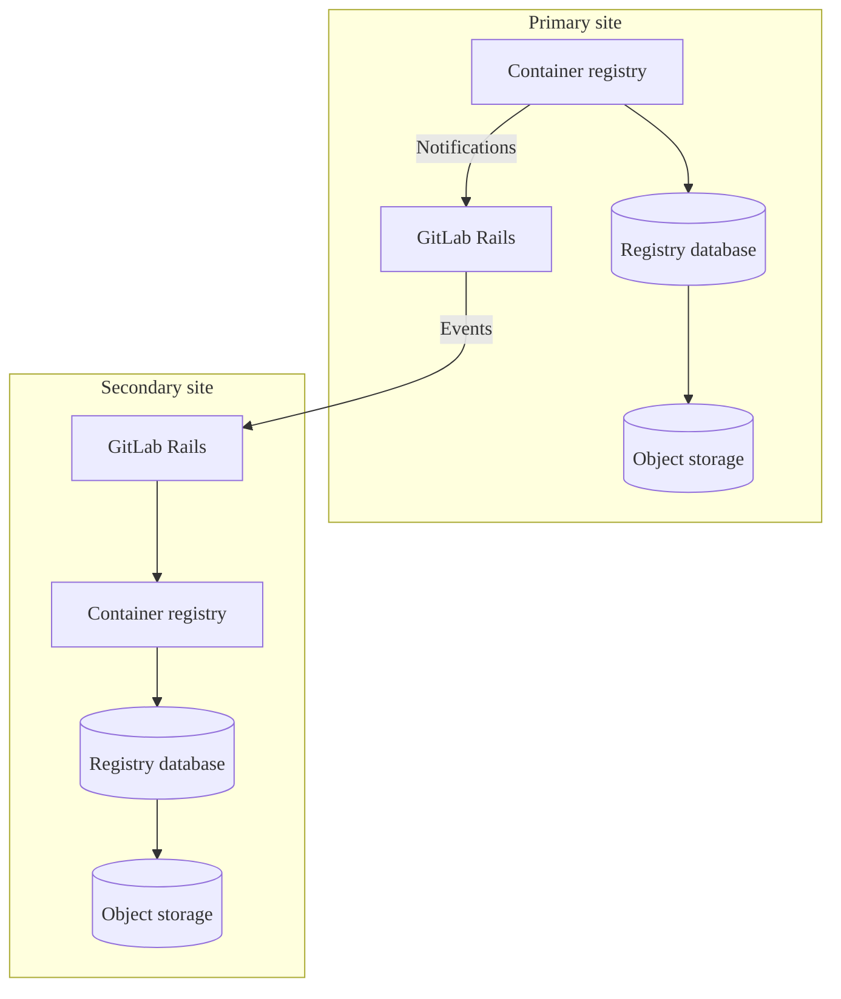



- Niveau : Free, Premium, Ultimate
- Offre : GitLab Self-Managed





- [Généralement disponible](https://gitlab.com/gitlab-org/gitlab/-/issues/423459) dans GitLab 17.3.
- Le mode Prefer pour les nouvelles installations de packages Linux et les installations auto-compilées a été [introduit](https://gitlab.com/gitlab-org/container-registry/-/merge_requests/2849) dans GitLab 19.0. Activé par défaut.



La base de données de métadonnées offre plusieurs [améliorations](#enhancements) au registre de conteneurs qui améliorent les performances et ajoutent de nouvelles fonctionnalités. Le travail sur la release GitLab Self-Managed de la fonctionnalité de base de données de métadonnées du registre est suivi dans l'epic [5521](https://gitlab.com/groups/gitlab-org/-/epics/5521).

Par défaut, le registre de conteneurs utilise le stockage d'objets ou un système de fichiers local pour conserver les métadonnées relatives aux images de conteneurs. Cette méthode de stockage des métadonnées limite l'efficacité de l'accès aux données, en particulier les données couvrant plusieurs images, comme lors de l'affichage des tags. En utilisant une base de données pour stocker ces données, de nombreuses nouvelles fonctionnalités deviennent possibles, notamment la [collecte des déchets en ligne](https://gitlab.com/gitlab-org/container-registry/-/blob/master/docs/spec/gitlab/online-garbage-collection.md) qui supprime automatiquement les anciennes données sans temps d'arrêt.

Cette base de données fonctionne conjointement avec le stockage déjà utilisé par le registre, mais ne remplace pas le stockage d'objets ou un système de fichiers. Vous devez continuer à maintenir une solution de stockage même après avoir effectué une importation de métadonnées vers la base de données de métadonnées.

Pour les installations Helm Charts, consultez [Gérer la base de données de métadonnées du registre de conteneurs](https://docs.gitlab.com/charts/charts/registry/metadata_database/#create-the-database) dans la documentation Helm Charts.

## Améliorations {#enhancements}

L'architecture de la base de données de métadonnées prend en charge les améliorations de performances, les corrections de bugs et les nouvelles fonctionnalités qui ne sont pas disponibles avec le stockage de métadonnées hérité. Ces améliorations comprennent :

- [Collecte des déchets en ligne](../../user/packages/container_registry/delete_container_registry_images.md#garbage-collection) automatique
- [Visibilité de l'utilisation du stockage](../../user/packages/container_registry/reduce_container_registry_storage.md#view-container-registry-usage) pour les dépôts, les projets et les groupes
- [Signature d'images](../../user/packages/container_registry/_index.md#container-image-signatures)
- [Déplacement et renommage des dépôts](../../user/packages/container_registry/_index.md#move-or-rename-container-registry-repositories)
- [Tags protégés](../../user/packages/container_registry/protected_container_tags.md)
- Améliorations des performances pour les [politiques de nettoyage](../../user/packages/container_registry/reduce_container_registry_storage.md#cleanup-policy), permettant un nettoyage réussi des grands dépôts
- Améliorations des performances pour la liste des tags de dépôt
- Suivi et affichage des horodatages de publication des tags (voir [issue 290949](https://gitlab.com/gitlab-org/gitlab/-/issues/290949))
- Tri des tags de dépôt par des attributs supplémentaires au-delà du nom

En raison des contraintes techniques du stockage de métadonnées hérité, les nouvelles fonctionnalités sont uniquement implémentées pour la version de la base de données de métadonnées. Les corrections de bugs non liées à la sécurité peuvent être limitées à la version de la base de données de métadonnées.

## Limitations connues {#known-limitations}

- L'importation de métadonnées pour les registres existants nécessite une période de temps en lecture seule.
- Avant la version 18.3, le schéma régulier du registre et les migrations de base de données post-déploiement doivent être exécutés manuellement lors de la mise à niveau des versions.
- Aucune garantie pour le [zéro temps d'arrêt lors des mises à niveau](../../update/zero_downtime.md) du registre sur les environnements de packages Linux multi-nœuds.
- Lors des importations de métadonnées pour les registres existants, les valeurs d'horodatage `createdAt` et `publishedAt` pour les tags d'image sont définies à la date d'importation. Cela est intentionnel pour garantir la cohérence, car le registre hérité ne collecte pas les dates de publication des tags pour toutes les images. Certaines images ont des dates de build dans leurs métadonnées, mais beaucoup n'en ont pas. Pour plus d'informations, consultez [l'issue 1384](https://gitlab.com/gitlab-org/container-registry/-/issues/1384).

## Prise en charge des fonctionnalités de la base de données de métadonnées {#metadata-database-feature-support}

Vous pouvez importer des métadonnées des registres existants vers la base de données de métadonnées et utiliser la collecte des déchets en ligne.

Certaines fonctionnalités activées par la base de données ne sont disponibles que pour GitLab.com et le provisionnement automatique de la base de données pour la base de données du registre n'est pas disponible. Consultez le tableau de prise en charge des fonctionnalités dans l'[issue de retour](https://gitlab.com/gitlab-org/gitlab/-/issues/423459#supported-feature-status) pour connaître l'état des fonctionnalités liées à la base de données du registre de conteneurs.

## Activer la base de données de métadonnées pour les installations de packages Linux {#enable-the-metadata-database-for-linux-package-installations}

Prérequis :

- GitLab 17.5 est la version minimale requise, mais GitLab 18.3 ou version ultérieure est recommandé en raison des améliorations ajoutées et d'une configuration plus facile.
- Base de données PostgreSQL [dans les exigences de version](../../install/requirements.md#postgresql). Elle doit être accessible depuis le nœud du registre.
- Si vous utilisez une base de données externe, vous devez d'abord configurer la connexion à la base de données externe. Pour plus d'informations, consultez [Utilisation d'une base de données externe](#using-an-external-database).

### Avant de commencer {#before-you-start}

- Une fois la base de données activée, vous devez continuer à l'utiliser. La base de données est désormais la source des métadonnées du registre ; la désactiver après ce point entraîne la perte de visibilité du registre sur toutes les images qui y ont été écrites pendant que la base de données était active.
- La [collecte des déchets hors ligne](container_registry.md#container-registry-garbage-collection) n'est plus nécessaire. La commande de collecte des déchets incluse avec GitLab se fermera en toute sécurité lorsque la base de données est activée, mais les commandes tierces, telles que celle fournie par le registre en amont, supprimeront les données associées aux images taguées.
- Vérifiez que vous n'avez pas automatisé la collecte des déchets hors ligne : en particulier avec une commande tierce.
- Vous pouvez d'abord [réduire le stockage de votre registre](../../user/packages/container_registry/reduce_container_registry_storage.md) pour accélérer le processus.
- Sauvegardez [les données de votre registre de conteneurs](../backup_restore/backup_gitlab.md#container-registry) si possible.
- Configurez les [notifications](container_registry.md#configure-container-registry-notifications) du registre de conteneurs.

### Activer la base de données pour les nouvelles installations {#enable-the-database-for-new-installations}

Pour les installations qui n'ont jamais écrit de données dans le registre de conteneurs, aucune importation n'est requise. Vous devez uniquement activer la base de données avant d'écrire des données dans le registre.

Pour plus d'informations, consultez les instructions pour les [nouvelles installations](container_registry_metadata_database_new_install.md).

### Activer la base de données pour les registres existants {#enable-the-database-for-existing-registries}

Vous pouvez importer vos métadonnées de registre de conteneurs existant en utilisant soit une méthode d'importation en une étape, soit une méthode d'importation en trois étapes. Plusieurs facteurs affectent la durée de l'importation :

- Le nombre d'images taguées dans votre registre.
- La taille de vos données de registre existantes.
- Les spécifications de votre instance PostgreSQL.
- Le nombre d'instances de registre en cours d'exécution.
- La latence réseau entre le registre, PostgreSQL et votre stockage configuré.

Vous n'avez pas besoin d'effectuer les opérations suivantes en préparation avant l'importation :

- Allouer du stockage d'objets ou de l'espace système de fichiers supplémentaire :  L'importation n'effectue aucune écriture significative sur ce stockage.
- Exécuter la collecte des déchets hors ligne :  Bien que non nuisible, la collecte des déchets hors ligne ne raccourcit pas suffisamment l'importation pour récupérer le temps passé à exécuter cette commande.

> [!note]
> L'importation de métadonnées cible uniquement les images taguées. Les manifestes non taguées et non référencés, ainsi que les couches exclusivement référencées par eux, sont laissés derrière et deviennent inaccessibles. Les images non taguées n'ont jamais été visibles via l'interface utilisateur ou l'API GitLab, mais elles peuvent devenir « orphelines » et être laissées derrière dans le backend. Après l'importation vers le nouveau registre, toutes les images sont soumises à la collecte des déchets en ligne continue, qui supprime par défaut tous les manifestes et couches non taguées et non référencés qui restent pendant plus de 24 heures.

### Choisir la bonne méthode d'importation {#choose-the-right-import-method}

Si vous exécutez régulièrement la [collecte des déchets hors ligne](container_registry.md#container-registry-garbage-collection), utilisez la méthode [d'importation en une étape](container_registry_metadata_database_one_step_import.md). Cette méthode devrait prendre un temps similaire et est une opération plus simple par rapport à la méthode d'importation en trois étapes.

Si votre registre est trop volumineux pour exécuter régulièrement la collecte des déchets hors ligne, utilisez la méthode [d'importation en trois étapes](container_registry_metadata_database_three_step_import.md) pour minimiser significativement la durée du mode lecture seule.

Si vous utilisez une base de données externe, assurez-vous de configurer la connexion à la base de données externe avant de procéder avec un chemin de migration.

Pour plus d'informations, consultez [Utilisation d'une base de données externe](#using-an-external-database).

### Restaurer les importations interrompues {#restore-interrupted-imports}



- [Introduit](https://gitlab.com/gitlab-org/container-registry/-/issues/1162) dans GitLab 18.5.



Ignorez les dépôts que vous avez pré-importés au cours des 72 dernières heures pour reprendre les importations interrompues. Les dépôts sont pré-importés soit :

- En effectuant l'étape une du processus d'importation en trois étapes
- En effectuant le processus d'importation en une étape

Pour restaurer les importations interrompues, configurez l'indicateur `--pre-import-skip-recent`. Par défaut à 72 heures.

Par exemple :

```shell
# Skip repositories imported within 6 hours from the start of the import command
--pre-import-skip-recent 6h

# Disable skipping behavior
--pre-import-skip-recent 0
```

Pour plus d'informations sur les unités de durée valides, consultez [les chaînes de durée Go](https://pkg.go.dev/time#ParseDuration).

### Post-importation {#post-import}

Après avoir effectué une importation volumineuse, des centaines de milliers, voire des millions de blobs peuvent être mis en file d'attente pour examen par la collecte des déchets. C'est normal.

Comme les images taguées sont importées avant que les blobs orphelins ne soient inventoriés, le ramasse-miettes examine initialement les blobs qui sont encore référencés par des images taguées. La collecte des déchets supprime ces blobs de la file d'attente, mais ne les supprime pas du stockage.

Le stockage ne diminue qu'une fois que le ramasse-miettes atteint les blobs orphelins. Le stockage du registre peut prendre 48 heures ou plus pour diminuer après une post-importation, car le ramasse-miettes retarde l'examen pour éviter toute interférence avec les blobs d'images.

Pour surveiller et gérer le backlog de collecte des déchets post-importation :

- [Vérifiez l'état de la collecte des déchets en ligne](#check-the-health-of-online-garbage-collection) pour voir la taille et le statut des files d'attente d'examen.
- [Ajustez l'intervalle du worker du ramasse-miettes](#adjust-the-garbage-collector-worker-interval) pour accélérer temporairement le traitement des grands backlogs.

## Mode Prefer {#prefer-mode}



- [Introduit](https://gitlab.com/gitlab-org/omnibus-gitlab/-/work_items/9411) dans GitLab 18.7.
- [Activé par défaut](https://gitlab.com/gitlab-org/container-registry/-/merge_requests/2849) pour les nouvelles installations de packages Linux et les installations auto-compilées dans GitLab 19.0.



Le mode Prefer est une option de configuration pour la base de données de métadonnées qui permet au registre de revenir au stockage de métadonnées hérité lorsqu'un registre existant n'a pas encore été importé vers la base de données.

### Activer le mode Prefer {#enable-prefer-mode}

Pour activer le mode Prefer :

1. Dans `/etc/gitlab/gitlab.rb`, définissez `database.enabled` sur `"prefer"` au lieu de `true` ou `false` :

   ```ruby
   registry['database'] = {
     'enabled' => 'prefer',
     'host' => '<your_database_host>',
     'port' => 5432,
     'user' => '<your_database_user>',
     'password' => '<your_database_password>',
     'dbname' => '<your_database_name>',
   }
   ```

1. Enregistrez le fichier et [reconfigurez GitLab](../restart_gitlab.md).

Après avoir reconfiguré GitLab, le registre évalue quel backend de métadonnées utiliser au démarrage en fonction des fichiers de verrouillage qui suivent les écritures précédentes sur le système de fichiers ou la base de données :

- Le fichier de verrouillage du système de fichiers existe :  Le registre dispose de métadonnées de système de fichiers existantes. Il revient au stockage de métadonnées hérité et enregistre un avertissement. Le registre fonctionne de manière identique à `enabled: false` jusqu'à ce que vous effectuiez une [importation de métadonnées](#enable-the-database-for-existing-registries).
- Le fichier de verrouillage de la base de données existe :  Le registre utilise déjà la base de données. Il se connecte à la base de données normalement, de manière identique à `enabled: true`.
- Aucun fichier de verrouillage n'existe :  Le registre est une nouvelle installation. Il nécessite une base de données configurée et accessible pour démarrer et ne revient pas au stockage hérité.
- Les deux fichiers de verrouillage existent :  Le registre refuse de démarrer. Cela indique une erreur de configuration que vous devez résoudre manuellement.

La décision de repli se produit une seule fois au démarrage et ne change pas pendant que le registre est en cours d'exécution. Il n'y a pas de nouvelle tentative automatique ou de reconnexion à la base de données après un repli. Pour passer du mode système de fichiers au mode base de données après un repli, effectuez l'[importation de métadonnées](#enable-the-database-for-existing-registries) standard et redémarrez le registre.

### Configuration par défaut {#default-configuration}



- Le mode de base de données de métadonnées par défaut a été [remplacé par `prefer`](https://gitlab.com/gitlab-org/container-registry/-/merge_requests/2849) dans GitLab 19.0 pour les nouvelles installations de packages Linux et les installations auto-compilées.



Dans GitLab 19.0 et versions ultérieures, la base de données de métadonnées est activée par défaut en mode Prefer pour les nouvelles installations :

- Installations de packages Linux (Omnibus) : `registry['database']['enabled']` est défini par défaut sur `"prefer"` lorsque le paramètre n'est pas spécifié dans `/etc/gitlab/gitlab.rb`. Pour plus d'informations, consultez l'[issue 9396](https://gitlab.com/gitlab-org/omnibus-gitlab/-/issues/9396).
- Installations auto-compilées : `database.enabled` est défini par défaut sur `"prefer"` lorsque le paramètre n'est pas spécifié dans le fichier de configuration du registre.

Après la mise à niveau, vérifiez quel backend le registre utilise. Pour la procédure, consultez [Vérifier quel backend de métadonnées est actif](#verify-which-metadata-backend-is-active).

#### Nouvelles installations {#new-installations}

Sur une nouvelle installation de GitLab 19.0 ou ultérieure, le registre démarre en mode Prefer. Si une base de données de métadonnées accessible est configurée, le registre l'utilise. Sans base de données accessible, le registre ne parvient pas à démarrer.

Pour conserver une nouvelle installation sur les métadonnées du système de fichiers, définissez le mode de base de données sur `"false"` avant le premier démarrage du registre :

- Pour les installations de packages Linux (Omnibus), dans `/etc/gitlab/gitlab.rb` :

  ```ruby
  registry['database']['enabled'] = "false"
  ```

- Pour les installations auto-compilées, dans `/home/git/gitlab/config/gitlab.yml` :

  ```yaml
  registry:
    database:
      enabled: false
  ```

#### Installations existantes {#existing-installations}

La mise à niveau d'une installation existante vers GitLab 19.0 ou version ultérieure préserve le paramètre `registry['database']['enabled']` actuel. La mise à niveau ne migre pas les métadonnées ni ne change le backend actif.

Une installation existante en mode Prefer avec des métadonnées de système de fichiers continue d'utiliser les métadonnées du système de fichiers après la mise à niveau. Pour passer à la base de données, effectuez une [importation de métadonnées](#enable-the-database-for-existing-registries).

#### Sauvegardes de la base de données de métadonnées {#metadata-database-backups}

Lorsque le registre utilise la base de données de métadonnées, incluez la base de données du registre dans vos sauvegardes. Pour la procédure, consultez [Sauvegarde avec la base de données de métadonnées](#backup-with-metadata-database).

Une installation en mode Prefer avec des métadonnées de système de fichiers existantes reste en repli après les redémarrages. Pendant le repli, le registre ne lit pas et n'écrit pas dans la base de données de métadonnées. Vous n'avez pas besoin de sauvegarder la base de données de métadonnées jusqu'à la fin du repli.

Pour mettre fin au repli, effectuez une [importation de métadonnées](#enable-the-database-for-existing-registries) et redémarrez le registre. Après le redémarrage, le registre utilise la base de données de métadonnées. Incluez-la dans votre routine de sauvegarde.

### Vérifier quel backend de métadonnées est actif {#verify-which-metadata-backend-is-active}

Pour vérifier quel backend de métadonnées votre registre utilise, utilisez l'une des méthodes suivantes.

#### Vérifier l'en-tête de réponse de l'API du registre {#check-the-registry-api-response-header}

1. Envoyez une requête au point de terminaison `/v2/` du registre :

   ```shell
   curl --silent --head "https://registry.example.com/v2/" | grep --ignore-case gitlab-container-registry-database-enabled
   ```

1. Inspectez l'en-tête de réponse `gitlab-container-registry-database-enabled` :

   - Une valeur de `true` signifie que le registre utilise la base de données de métadonnées.
   - Une valeur de `false` signifie qu'il utilise le stockage du système de fichiers hérité.

#### Vérifier les fichiers de verrouillage sur le disque {#check-lockfiles-on-disk}

Pour vérifier les fichiers de verrouillage sur le disque, recherchez ces fichiers dans le backend de stockage configuré à `<rootdirectory>/docker/registry/lockfiles/` :

- `database-in-use` :  Le registre utilise la base de données de métadonnées.
- `filesystem-in-use` :  Le registre utilise le stockage du système de fichiers hérité.

Si les deux fichiers de verrouillage existent, le registre est dans un état invalide et ne démarre pas.

#### Vérifier les journaux du registre {#check-registry-logs}

Le registre enregistre quel backend de métadonnées il sélectionne au démarrage.

Pour vérifier les journaux du registre, recherchez l'un des messages suivants :

- Si le registre revient au stockage hérité (mode Prefer uniquement) :

  ```plaintext
  database prefer mode enabled, but found filesystem metadata: falling back to legacy metadata
  ```

- Si le registre se connecte à la base de données :

  ```plaintext
  using the metadata database
  ```

## Migrations de base de données {#database-migrations}

Le registre de conteneurs prend en charge deux types de migrations :

- Migrations de schéma régulières :  Modifications de la structure de la base de données qui doivent être exécutées avant de déployer le nouveau code d'application, également connues sous le nom de migrations pré-déploiement. Celles-ci doivent être rapides (pas plus de quelques minutes) pour éviter les retards de déploiement.
- Migrations post-déploiement :  Modifications de la structure de la base de données qui peuvent être exécutées pendant que l'application est en cours d'exécution. Utilisées pour les opérations plus longues comme la création d'index sur de grandes tables, en évitant les retards de démarrage et les temps d'arrêt de mise à niveau prolongés.

Par défaut, le registre applique simultanément les migrations de schéma régulières et les migrations post-déploiement. Pour réduire les temps d'arrêt lors des mises à niveau, vous pouvez ignorer les migrations post-déploiement et les appliquer manuellement après le démarrage de l'application.

### Appliquer les migrations de base de données {#apply-database-migrations}





Pour appliquer les migrations de schéma régulières et les migrations post-déploiement avant le démarrage de l'application :

1. Exécuter les migrations de base de données :

   ```shell
   sudo gitlab-ctl registry-database migrate up
   ```

Pour ignorer les migrations post-déploiement :

1. Exécuter uniquement les migrations de schéma régulières :

   ```shell
   sudo gitlab-ctl registry-database migrate up --skip-post-deployment
   ```

   Comme alternative à l'indicateur `--skip-post-deployment`, vous pouvez également définir la variable d'environnement `SKIP_POST_DEPLOYMENT_MIGRATIONS` sur `true` :

   ```shell
   SKIP_POST_DEPLOYMENT_MIGRATIONS=true sudo gitlab-ctl registry-database migrate up
   ```

1. Après avoir démarré l'application, appliquez toutes les migrations post-déploiement en attente :

   ```shell
   sudo gitlab-ctl registry-database migrate up
   ```





Pour appliquer les migrations de schéma régulières et les migrations post-déploiement avant le démarrage de l'application :

1. Exécuter les migrations de base de données :

   ```shell
   sudo -u registry gitlab-ctl registry-database migrate up
   ```

Pour ignorer les migrations post-déploiement :

1. Exécuter uniquement les migrations de schéma régulières :

   ```shell
   sudo -u registry gitlab-ctl registry-database migrate up --skip-post-deployment
   ```

   Comme alternative à l'indicateur `--skip-post-deployment`, vous pouvez également définir la variable d'environnement `SKIP_POST_DEPLOYMENT_MIGRATIONS` sur `true` :

   ```shell
   SKIP_POST_DEPLOYMENT_MIGRATIONS=true sudo -u registry gitlab-ctl registry-database migrate up
   ```

1. Après avoir démarré l'application, appliquez toutes les migrations post-déploiement en attente :

   ```shell
   sudo -u registry gitlab-ctl registry-database migrate up
   ```





> [!note]
> La commande `migrate up` offre des indicateurs supplémentaires qui peuvent être utilisés pour contrôler la façon dont les migrations sont appliquées. Exécutez `sudo gitlab-ctl registry-database migrate up --help` pour plus de détails.

## Surveillance de la collecte des déchets en ligne {#online-garbage-collection-monitoring}

La durée des premières exécutions de la collecte des déchets en ligne après le processus d'importation varie en fonction du nombre d'images importées. Vous devez surveiller l'efficacité et l'état de votre collecte des déchets en ligne pendant cette période.

### Surveiller les performances de la base de données {#monitor-database-performance}

Après avoir effectué une importation, attendez-vous à ce que la base de données connaisse une période de charge élevée pendant que les files d'attente de collecte des déchets se vident. Cette charge élevée est causée par un nombre élevé d'appels de base de données individuels provenant du ramasse-miettes en ligne qui traite les tâches en file d'attente.

Vérifiez régulièrement les journaux PostgreSQL et du registre pour détecter les erreurs ou les avertissements. Dans les journaux du registre, portez une attention particulière aux journaux filtrés par `component=registry.gc.*`.

### Suivre les métriques {#track-metrics}

Utilisez des outils de surveillance comme Prometheus et Grafana pour visualiser et suivre les métriques de collecte des déchets, en vous concentrant sur les métriques avec un préfixe de `registry_gc_*`. Celles-ci comprennent le nombre d'objets marqués pour suppression, les objets supprimés avec succès, les intervalles d'exécution et les durées. Consultez [activer le serveur de débogage du registre](container_registry_troubleshooting.md#enable-the-registry-debug-server) pour savoir comment activer Prometheus.

### Surveiller les files d'attente de tâches {#monitor-task-queues}

Surveillez l'état et le statut des files d'attente de tâches de collecte des déchets pour les blobs et les manifestes.

#### Vérifier l'état de la collecte des déchets en ligne {#check-the-health-of-online-garbage-collection}





La commande suivante affiche des informations relatives à la collecte des déchets en ligne.

```shell
sudo gitlab-ctl registry-database gc-stats
```

Exemple de sortie :

```shell
=== Blob Review Queue ===

Tasks Pending Removal: 42
Tasks ready for GC review (review_after has passed).

┌───────────────────────────────────────────────────────────────────┬─────────────────────┬─────────────────┐
│                              DIGEST                               │    REVIEW AFTER     │      EVENT      │
├───────────────────────────────────────────────────────────────────┼─────────────────────┼─────────────────┤
│ sha256:a3ed95caeb02ffe68cdd9fd84406680ae93d633cb16422d00e8a7c22e  │ 2026-01-16 21:56:13 │ blob_upload     │
│ sha256:b4f5e6d7c8a9b0c1d2e3f4a5b6c7d8e9f0a1b2c3d4e5f6a7b8c9d0e1f2 │ 2026-01-16 19:56:13 │ manifest_delete │
│ sha256:c5d6e7f8a9b0c1d2e3f4a5b6c7d8e9f0a1b2c3d4e5f6a7b8c9d0e1f2a3 │ 2026-01-16 17:56:13 │ layer_delete    │
└───────────────────────────────────────────────────────────────────┴─────────────────────┴─────────────────┘

Long Overdue Tasks: 5
Tasks pending longer than configured delay - may need attention.

┌───────────────────────────────────────────────────────────────────┬─────────────────────┬──────────────┬─────────┐
│                              DIGEST                               │    REVIEW AFTER     │    EVENT     │ OVERDUE │
├───────────────────────────────────────────────────────────────────┼─────────────────────┼──────────────┼─────────┤
│ sha256:d6e7f8a9b0c1d2e3f4a5b6c7d8e9f0a1b2c3d4e5f6a7b8c9d0e1f2a3b4 │ 2026-01-11 23:56:13 │ blob_upload  │ 4d 0h   │
│ sha256:e7f8a9b0c1d2e3f4a5b6c7d8e9f0a1b2c3d4e5f6a7b8c9d0e1f2a3b4c5 │ 2026-01-13 23:56:13 │ layer_delete │ 2d 0h   │
└───────────────────────────────────────────────────────────────────┴─────────────────────┴──────────────┴─────────┘

High Retry Tasks: 2
Tasks with >10 review attempts - may indicate persistent issues.

┌───────────────────────────────────────────────────────────────────┬─────────────────────┬─────────────────┬─────────┐
│                              DIGEST                               │    REVIEW AFTER     │      EVENT      │ RETRIES │
├───────────────────────────────────────────────────────────────────┼─────────────────────┼─────────────────┼─────────┤
│ sha256:f8a9b0c1d2e3f4a5b6c7d8e9f0a1b2c3d4e5f6a7b8c9d0e1f2a3b4c5d6 │ 2026-01-17 00:56:13 │ blob_upload     │ 15      │
│ sha256:a9b0c1d2e3f4a5b6c7d8e9f0a1b2c3d4e5f6a7b8c9d0e1f2a3b4c5d6e7 │ 2026-01-17 01:56:13 │ manifest_delete │ 12      │
└───────────────────────────────────────────────────────────────────┴─────────────────────┴─────────────────┴─────────┘

=== Manifest Review Queue ===

Tasks Pending Removal: 128
Tasks ready for GC review (review_after has passed).

┌───────────────┬─────────────┬─────────────────────┬──────────────────────┐
│ REPOSITORY ID │ MANIFEST ID │    REVIEW AFTER     │        EVENT         │
├───────────────┼─────────────┼─────────────────────┼──────────────────────┤
│ 1001          │ 12345       │ 2026-01-16 22:56:13 │ tag_delete           │
│ 1002          │ 67890       │ 2026-01-16 20:56:13 │ manifest_upload      │
│ 1003          │ 11111       │ 2026-01-16 18:56:13 │ tag_switch           │
│ 2001          │ 22222       │ 2026-01-16 16:56:13 │ manifest_list_delete │
└───────────────┴─────────────┴─────────────────────┴──────────────────────┘

Long Overdue Tasks: 8
Tasks pending longer than configured delay - may need attention.

┌───────────────┬─────────────┬─────────────────────┬─────────────────┬─────────┐
│ REPOSITORY ID │ MANIFEST ID │    REVIEW AFTER     │      EVENT      │ OVERDUE │
├───────────────┼─────────────┼─────────────────────┼─────────────────┼─────────┤
│ 3001          │ 33333       │ 2026-01-12 23:56:13 │ tag_delete      │ 3d 0h   │
│ 3002          │ 44444       │ 2026-01-14 23:56:13 │ manifest_delete │ 1d 0h   │
└───────────────┴─────────────┴─────────────────────┴─────────────────┴─────────┘

High Retry Tasks: 3
Tasks with >10 review attempts - may indicate persistent issues.

┌───────────────┬─────────────┬─────────────────────┬─────────────────┬─────────┐
│ REPOSITORY ID │ MANIFEST ID │    REVIEW AFTER     │      EVENT      │ RETRIES │
├───────────────┼─────────────┼─────────────────────┼─────────────────┼─────────┤
│ 4001          │ 55555       │ 2026-01-17 00:26:13 │ tag_delete      │ 18      │
│ 4002          │ 66666       │ 2026-01-17 00:41:13 │ manifest_upload │ 11      │
└───────────────┴─────────────┴─────────────────────┴─────────────────┴─────────┘
```





### Se connecter à la base de données de métadonnées du registre de conteneurs GitLab {#connect-to-the-gitlab-container-registry-metadata-database}

Utilisez la commande suivante pour vous connecter à la base de données de métadonnées du registre :

```shell
gitlab-psql -d registry
```

### Requêtes pour déterminer l'état des tâches de collecte des déchets en ligne {#queries-to-determine-status-of-online-garbage-collection-tasks}

Les requêtes suivantes renvoient les tâches qui ont été réessayées plus de 10 fois ou qui étaient éligibles à l'examen pendant plus de 24 heures. Le ramasse-miettes en ligne doit prendre en charge un élément pour examen dans les 24 heures avec peu de tentatives échouées. Si des lignes sont renvoyées, examinez l'état de votre ramasse-miettes en ligne.

Pour les manifestes :

```sql
SELECT
  repository_id,
  manifest_id,
  ROUND(
    EXTRACT(
      EPOCH
      FROM
        AGE(NOW(), review_after)
    ) / 3600
  ) AS hours_eligible_for_review,
  review_count as failed_review_attempts,
  event
FROM
  gc_manifest_review_queue
WHERE
  review_after < NOW() - INTERVAL '24 hours'
  OR review_count > 10
LIMIT
  20;
```

Pour les blobs :

```sql
SELECT
  substring(encode(digest, 'hex'), 3) AS digest,
  ROUND(
    EXTRACT(
      EPOCH
      FROM
        AGE(NOW(), review_after)
    ) / 3600
  ) AS hours_eligible_for_review,
  review_count as failed_review_attempts,
  event
FROM
  gc_blob_review_queue
WHERE
  review_after < NOW() - INTERVAL '24 hours'
  OR review_count > 10
LIMIT
  20;
```

#### Requêtes d'information relatives à la collecte des déchets en ligne {#informational-queries-related-to-online-garbage-collection}

Vérifiez le nombre de tâches éligibles à l'examen en exécutant les requêtes suivantes :

```sql
SELECT COUNT(*) FROM gc_blob_review_queue WHERE review_after < NOW();
SELECT COUNT(*) FROM gc_manifest_review_queue WHERE review_after < NOW();
```





En général, il devrait y avoir un nombre relativement faible d'éléments prêts à être examinés, souvent proche de zéro. Cependant, il pourrait y en avoir davantage si :

- Une importation a été démarrée il y a 24 à 48 heures.
- De grandes quantités de tags ont été supprimées ou un dépôt de conteneurs a été supprimé.
- La collecte des déchets en ligne a été désactivée pendant une période prolongée.

S'il y a des tâches avec des nouvelles tentatives ou qui sont en retard depuis longtemps, vérifiez les journaux du registre pour les messages relatifs à la collecte des déchets. Filtrez les entrées par `component="registry.gc.*` et examinez les messages d'erreur.

#### Vérifier avant de dépanner {#check-before-troubleshooting}

##### Tailles des files d'attente GC {#gc-queue-sizes}

La taille non filtrée de `gc_manifest_review_queue` et `gc_blob_review_queue` ne sont pas de bons indicateurs de l'état du ramasse-miettes en ligne. Ces files d'attente reçoivent constamment de nouvelles entrées ; par conséquent, ces files d'attente ne se vident jamais complètement pour un registre actif.

De plus, tous les éléments de ces files d'attente ne seront pas supprimés du stockage. Consultez la spécification de la [collecte des déchets en ligne](https://gitlab.com/gitlab-org/container-registry/-/blob/master/docs/spec/gitlab/online-garbage-collection.md) pour une explication complète de ces files d'attente pour plus de contexte.

##### Beaucoup de tâches prêtes à être examinées {#lots-of-tasks-ready-to-review}

De grandes quantités de tâches éligibles à l'examen ne sont pas nécessairement une source de préoccupation. Le ramasse-miettes peut traiter des éléments causés par un pic d'activité.

##### Certaines tâches sont anciennes {#some-tasks-are-old}

De même, la date `created_at` de ces tâches seule n'est pas un bon indicateur de santé. Lorsqu'un événement ajoute le même blob ou manifeste à la file d'attente, le `review_after` de la tâche existante est mis à jour, ce qui reporte l'examen. Aucune tâche en double n'est créée.

Cela peut se produire un nombre quelconque de fois, donc les tâches créées il y a des mois ne sont pas une source de préoccupation.

### Ajuster l'intervalle du worker du ramasse-miettes {#adjust-the-garbage-collector-worker-interval}

Si le nombre de tâches éligibles à l'examen reste élevé et que vous souhaitez augmenter la fréquence entre les exécutions du worker de blob ou de manifeste de la collecte des déchets, mettez à jour votre configuration d'intervalle de la valeur par défaut (`5s`) à `1s` :

```ruby
registry['gc'] = {
  'blobs' => {
    'interval' => '1s'
  },
  'manifests' => {
    'interval' => '1s'
  }
}
```

Une fois la charge de l'importation effacée, vous devez affiner ces paramètres à long terme pour éviter une charge CPU inutile sur les instances de base de données et de registre. Vous pouvez augmenter progressivement l'intervalle à une valeur qui équilibre les performances et l'utilisation des ressources.

### Valider la cohérence des données {#validate-data-consistency}

Pour garantir la cohérence des données après l'importation, utilisez l'outil [`crane validate`](https://github.com/google/go-containerregistry/blob/main/cmd/crane/doc/crane_validate.md). Cet outil vérifie que toutes les couches d'images et les manifestes de votre registre de conteneurs sont accessibles et correctement liés. En exécutant `crane validate`, vous confirmez que les images de votre registre sont complètes et accessibles, garantissant une importation réussie.

### Examiner les politiques de nettoyage {#review-cleanup-policies}

Si la plupart de vos images sont taguées, la collecte des déchets ne réduira pas significativement l'espace de stockage car elle ne supprime que les images non taguées.

Implémentez des politiques de nettoyage pour supprimer les tags inutiles, ce qui finit par entraîner la suppression des images via la collecte des déchets et la récupération de l'espace de stockage.

## Utilisation d'une base de données externe {#using-an-external-database}

Par défaut, GitLab 18.3 et versions ultérieures préprovisionne une base de données logique au sein de la base de données GitLab principale pour les métadonnées du registre de conteneurs. Cependant, vous pouvez souhaiter utiliser une base de données externe dédiée pour le registre de conteneurs si vous souhaitez [faire évoluer votre registre](container_registry.md#scaling-by-component).

### Étapes {#steps}

- Créez une [base de données externe](../postgresql/external.md#container-registry-metadata-database).

Ensuite, suivez les mêmes étapes pour la base de données par défaut, en substituant vos propres valeurs de base de données. Commencez avec la base de données désactivée, en veillant à activer et désactiver la base de données comme indiqué :

```ruby
registry['database'] = {
  'enabled' => false,
  'host' => '<registry_database_host_placeholder_change_me>',
  'port' => 5432, # Default, but set to the port of your database instance if it differs.
  'user' => '<registry_database_username_placeholder_change_me>',
  'password' => '<registry_database_placeholder_change_me>',
  'dbname' => '<registry_database_name_placeholder_change_me>',
  'sslmode' => 'require', # See the PostgreSQL documentation for additional information https://www.postgresql.org/docs/16/libpq-ssl.html.
  'sslcert' => '</path/to/cert.pem>',
  'sslkey' => '</path/to/private.key>',
  'sslrootcert' => '</path/to/ca.pem>'
}
```

## Sauvegarde avec la base de données de métadonnées {#backup-with-metadata-database}



- Prise en charge des sauvegardes automatiques pour la base de données de métadonnées du registre [introduite](https://gitlab.com/gitlab-org/gitlab/-/work_items/581279) dans GitLab 18.10.



Lorsque la base de données de métadonnées est activée, les sauvegardes doivent inclure à la fois le backend de stockage du registre et la base de données.

La méthode de sauvegarde dépend de votre type de stockage :

- Stockage du système de fichiers local : `gitlab-backup` inclut le registre automatiquement.
- Stockage d'objets :  Vous devez sauvegarder le stockage d'objets séparément.

Sauvegardez le stockage et la base de données aussi proches que possible dans le temps pour garantir un état cohérent du registre. Pour restaurer le registre, vous devez appliquer les deux sauvegardes.

### Sauvegarde automatique {#automatic-backup}

Dans GitLab 18.10 et versions ultérieures, `gitlab-backup create` et `gitlab-backup restore` incluent automatiquement la base de données de métadonnées du registre lorsque la base de données de métadonnées est configurée. Sur les installations Helm chart (Kubernetes), `backup-utility` se comporte de la même manière.

La base de données de métadonnées doit être configurée dans `gitlab.rb` ou dans votre fichier de valeurs Helm.

Aucune configuration supplémentaire n'est requise. Les outils de sauvegarde lisent les paramètres de connexion à la base de données du registre à partir de la configuration existante.

Si vous appelez directement la tâche Rake de sauvegarde, vous devez définir les variables d'environnement suivantes sur le nœud qui exécute la sauvegarde :

| Variable | Obligatoire | Description |
|---|---|---|
| `REGISTRY_DATABASE_HOST` | Oui | L'hôte de la base de données. |
| `REGISTRY_DATABASE_NAME` | Oui | Le nom de la base de données. |
| `REGISTRY_DATABASE_USER` | Oui | L'utilisateur de la base de données. |
| `REGISTRY_DATABASE_PORT` | Non | Le port de la base de données. Par défaut à `5432`. |
| `REGISTRY_DATABASE_PASSWORD` | Non | Le mot de passe de la base de données. |
| `REGISTRY_DATABASE_SSLMODE` | Non | Indique si le mode SSL est requis ou non. Définissez sur `require` ou omettez. |
| `REGISTRY_DATABASE_SSLCERT` | Non | Le chemin vers le certificat client. |
| `REGISTRY_DATABASE_SSLKEY` | Non | Le chemin vers la clé privée du client. |
| `REGISTRY_DATABASE_SSLROOTCERT` | Non | Le chemin vers le certificat CA. |
| `REGISTRY_DATABASE_CONNECT_TIMEOUT` | Non | Le délai d'expiration de la connexion en secondes. |

La tâche Rake de sauvegarde active la sauvegarde de la base de données du registre lorsqu'elle détecte l'un des identifiants suivants :

- `REGISTRY_DATABASE_PASSWORD`
- `REGISTRY_DATABASE_SSLCERT`
- `REGISTRY_DATABASE_SSLKEY`
- `REGISTRY_DATABASE_SSLROOTCERT`

Sans identifiants, la base de données du registre n'est pas incluse dans la sauvegarde. Les mêmes variables d'environnement doivent être définies lors de la restauration.

### Sauvegarde manuelle {#manual-backup}

Si vous utilisez GitLab 18.9 ou version antérieure, ou si vous préférez gérer les sauvegardes de la base de données du registre séparément, utilisez les outils PostgreSQL standard comme `pg_dump` et `pg_restore` pour sauvegarder et restaurer la base de données du registre indépendamment.

### Sauvegarde et restauration Helm chart (Kubernetes) {#helm-chart-kubernetes-backup-and-restore}



- [Introduit](https://gitlab.com/gitlab-org/charts/gitlab/-/work_items/6207) dans GitLab 18.10.



Pour les déploiements Helm chart (Kubernetes), configurez le pod toolbox avec des identifiants de base de données dédiés pour les opérations de sauvegarde et de restauration. Deux utilisateurs PostgreSQL distincts sont nécessaires :

- L'utilisateur de sauvegarde doit avoir des autorisations en lecture seule.
- L'utilisateur de restauration doit avoir des autorisations en écriture.

Configurez un ou les deux utilisateurs, selon les opérations dont vous avez besoin.

Avant de commencer, activez la base de données de métadonnées du registre de conteneurs en définissant `registry.database.enabled: true`.

#### Créer le secret Kubernetes {#create-the-kubernetes-secret}

Vous devez créer manuellement le secret Kubernetes avant le déploiement. Le chart ne génère pas automatiquement ce secret.

Par exemple, pour créer un secret avec les mots de passe de sauvegarde et de restauration :

```shell
kubectl create secret generic my-registry-db-password-secret \
  --from-literal=backupPassword="BACKUP_USER_PASSWORD" \
  --from-literal=restorePassword="RESTORE_USER_PASSWORD"
```

#### Configurer les identifiants de la base de données du registre {#configure-registry-database-credentials}

Ajoutez le YAML requis à votre Helm `values.yaml` pour configurer les utilisateurs de sauvegarde et de restauration. Consultez le tableau suivant pour les définitions des paramètres de configuration.

| Paramètre | Valeur par défaut | Description |
|---|---|---|
| `backupUser` | | Nom d'utilisateur PostgreSQL pour les opérations de sauvegarde. Obligatoire pour activer les sauvegardes de la base de données du registre. |
| `restoreUser` | | Nom d'utilisateur PostgreSQL pour les opérations de restauration. Obligatoire pour activer les restaurations de la base de données du registre. |
| `password.secret` | `<release-name>-toolbox-registry-database-password` | Nom du secret Kubernetes contenant les mots de passe. |
| `password.backupPasswordKey` | `backupPassword` | Clé dans le secret Kubernetes pour le mot de passe de l'utilisateur de sauvegarde. |
| `password.restorePasswordKey` | `restorePassword` | Clé dans le secret Kubernetes pour le mot de passe de l'utilisateur de restauration. |

L'exemple suivant configure à la fois les utilisateurs de sauvegarde et de restauration :

```yaml
gitlab:
  toolbox:
    backups:
      registry:
        database:
          # PostgreSQL username for backing up the registry database
          backupUser: "registry_backup"
          # PostgreSQL username for restoring the registry database
          restoreUser: "registry_restore"
          password:
            # Name of the Kubernetes Secret containing the passwords
            secret: "my-registry-db-password-secret"
            # Key in the Secret for the backup user's password
            backupPasswordKey: "backupPassword"
            # Key in the Secret for the restore user's password
            restorePasswordKey: "restorePassword"
```

Si aucun `backupUser` ou `restoreUser` n'est configuré, la sauvegarde de la base de données du registre est ignorée silencieusement et le pod toolbox fonctionne normalement.

#### Autorisations des utilisateurs PostgreSQL {#postgresql-user-permissions}

L'utilisateur de sauvegarde nécessite un accès en lecture seule pour effectuer un dump de la base de données du registre. L'utilisateur de restauration nécessite des privilèges de superutilisateur pour la restaurer.

Pour les installations de packages Linux, ces utilisateurs et autorisations sont créés automatiquement lorsque `database_backup_username`, `database_backup_password`, `database_restore_username` et `database_restore_password` sont configurés.

Pour les installations auto-compilées ou avec base de données externe, créez les utilisateurs et accordez les autorisations manuellement :

```sql
-- Create the backup user with minimal privileges for pg_dump.
-- The registry database uses both the 'public' and 'partitions' schemas.
CREATE ROLE registry_backup WITH LOGIN PASSWORD 'password'
  NOINHERIT NOCREATEDB NOSUPERUSER NOREPLICATION;

GRANT CONNECT ON DATABASE registry TO registry_backup;

-- Grant read-only access on both schemas
GRANT USAGE ON SCHEMA public TO registry_backup;
GRANT SELECT ON ALL TABLES IN SCHEMA public TO registry_backup;
GRANT SELECT ON ALL SEQUENCES IN SCHEMA public TO registry_backup;
ALTER DEFAULT PRIVILEGES FOR ROLE registry IN SCHEMA public
  GRANT SELECT ON TABLES TO registry_backup;
ALTER DEFAULT PRIVILEGES FOR ROLE registry IN SCHEMA public
  GRANT SELECT ON SEQUENCES TO registry_backup;

GRANT USAGE ON SCHEMA partitions TO registry_backup;
GRANT SELECT ON ALL TABLES IN SCHEMA partitions TO registry_backup;
GRANT SELECT ON ALL SEQUENCES IN SCHEMA partitions TO registry_backup;
ALTER DEFAULT PRIVILEGES FOR ROLE registry IN SCHEMA partitions
  GRANT SELECT ON TABLES TO registry_backup;
ALTER DEFAULT PRIVILEGES FOR ROLE registry IN SCHEMA partitions
  GRANT SELECT ON SEQUENCES TO registry_backup;

-- Create the restore user with superuser privileges.
-- SUPERUSER is required for database restore operations because the
-- restore process must SET ROLE to the registry owner and
-- CREATE TRIGGER on all tables.
CREATE ROLE registry_restore WITH LOGIN PASSWORD 'password' SUPERUSER;
```

#### Workflow du volume d'identifiants {#credential-volume-workflow}

Lorsqu'il est configuré, le chart crée un volume monté sur `/etc/gitlab/registry-db/` dans le déploiement du toolbox et dans le CronJob de sauvegarde. Le volume est en lecture seule et inclut les éléments suivants :

- Paramètres de connexion :  Un ConfigMap créé par le chart du registre contenant l'hôte de la base de données, le port, le nom, le mode SSL et le délai d'expiration de la connexion.
- Noms d'utilisateur de sauvegarde et de restauration :  Un ConfigMap créé par le chart du toolbox avec les `backupUser` et `restoreUser` configurés.
- Mots de passe :  Le secret Kubernetes fourni par l'utilisateur contenant les mots de passe de sauvegarde et de restauration.

Le `backup-utility` dans le pod toolbox lit ces fichiers et inclut la base de données de métadonnées du registre dans les opérations de sauvegarde et de restauration.

Si des fichiers d'identifiants requis sont manquants, le `backup-utility` enregistre un avertissement et continue avec la sauvegarde des autres ressources.

#### Limitation TLS mutuel {#mutual-tls-limitation}

Les chemins de certificats SSL pour l'authentification TLS mutuel avec PostgreSQL ne sont inclus que lorsque SSL est configuré globalement (`global.psql.ssl`). Si SSL est configuré uniquement au niveau du sous-chart du registre (`registry.database.ssl`), ces paramètres ne sont pas transmis au toolbox.

### Considérations Geo {#geo-considerations}

Lors de l'utilisation de [Geo](#database-architecture-with-geo), chaque site maintient sa propre base de données de registre et son propre stockage d'objets. Sauvegardez la base de données du registre et le stockage d'objets sur chaque site indépendamment. Geo ne réplique pas la base de données du registre entre les sites.

## Rétrograder un registre {#downgrade-a-registry}

Pour rétrograder le registre vers une version précédente après la fin de l'importation, vous devez restaurer une sauvegarde de la version souhaitée afin de rétrograder.

## Architecture de base de données avec Geo {#database-architecture-with-geo}

Lors de l'utilisation de GitLab Geo avec le registre de conteneurs, vous devez configurer des piles de base de données et de stockage d'objets distinctes pour le registre sur chaque site. La réplication Geo vers le registre de conteneurs utilise des événements générés à partir des notifications du registre, plutôt que par la réplication de base de données.

### Prérequis {#prerequisites}

Chaque site Geo nécessite un élément distinct, spécifique au site :

1. Instance PostgreSQL pour la base de données du registre de conteneurs.
1. Instance de stockage d'objets pour le registre de conteneurs.
1. Registre de conteneurs configuré pour utiliser ces ressources spécifiques au site.

Ce diagramme illustre le flux de données et l'architecture de base :



Utilisez des instances de base de données distinctes sur chaque site car :

1. La base de données GitLab principale est répliquée sur le site secondaire en lecture seule.
1. Cette réplication ne peut pas être désactivée de manière sélective pour la base de données du registre.
1. Le registre de conteneurs nécessite un accès en écriture à sa base de données sur les deux sites.
1. Les configurations homogènes garantissent la plus grande parité entre les sites Geo.

## Revenir aux métadonnées du stockage d'objets {#revert-to-object-storage-metadata}

Vous pouvez faire revenir votre registre à l'utilisation des métadonnées du stockage d'objets après avoir effectué une importation de métadonnées.

> [!warning]
> Lorsque vous revenez aux métadonnées du stockage d'objets, toutes les images de conteneurs, les tags ou les dépôts ajoutés ou supprimés entre la fin de l'importation et cette opération de retour ne sont pas disponibles.

Pour revenir aux métadonnées du stockage d'objets :

1. Restaurez une [sauvegarde](../backup_restore/backup_gitlab.md#container-registry) effectuée avant la migration.
1. Ajoutez la configuration suivante à votre fichier `/etc/gitlab/gitlab.rb` :

   ```ruby
   registry['database'] = {
     'enabled' => false,
   }
   ```

1. Enregistrez le fichier et [reconfigurez GitLab](../restart_gitlab.md#reconfigure-a-linux-package-installation).

## Dépannage {#troubleshooting}

Pour examiner les erreurs et les solutions de dépannage et les solutions de contournement, consultez [Dépannage de la base de données de métadonnées du registre de conteneurs](container_registry_metadata_database_troubleshooting.md).
