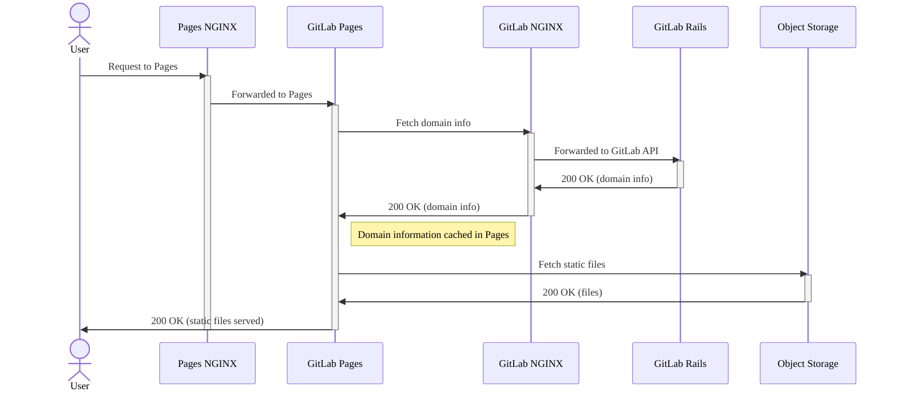
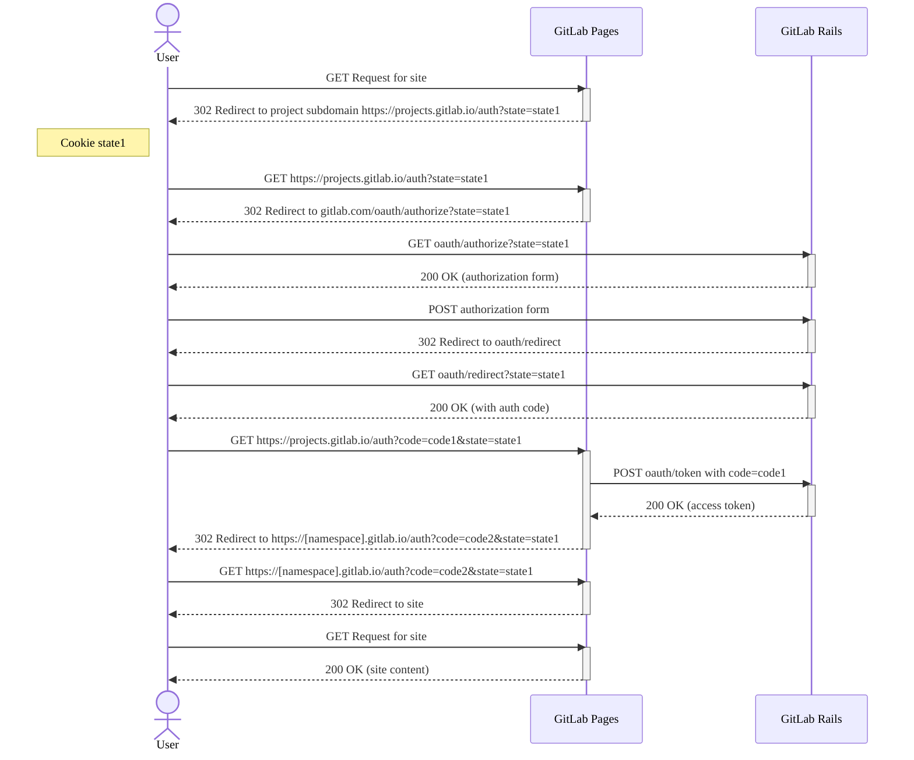



- Niveau : Free, Premium, Ultimate
- Offre : GitLab Self-Managed



Lors de l'administration de GitLab Pages, vous pouvez rencontrer les problèmes suivants.

## Comment consulter les journaux de GitLab Pages {#how-to-see-gitlab-pages-logs}

Vous pouvez consulter les journaux du daemon Pages en exécutant :

```shell
sudo gitlab-ctl tail gitlab-pages
```

Vous pouvez également trouver le fichier journal dans `/var/log/gitlab/gitlab-pages/current`.

Pour plus d'informations, consultez comment [obtenir l'ID de corrélation depuis vos journaux](../logs/tracing_correlation_id.md#getting-the-correlation-id-from-your-logs).

## Débogage de GitLab Pages {#debug-gitlab-pages}

Le diagramme de séquence suivant illustre la façon dont les requêtes GitLab Pages sont traitées. Pour plus d'informations sur la façon dont un site GitLab Pages est déployé et sert du contenu statique depuis le stockage d'objets, consultez la documentation sur l'architecture de GitLab Pages.



### Identifier les journaux d'erreurs {#identify-error-logs}

Vous devez vérifier les journaux dans l'ordre indiqué dans le diagramme de séquence précédent. Le filtrage basé sur votre domaine peut également aider à identifier les journaux pertinents.

Pour commencer à suivre les journaux :

1. Pour les journaux **GitLab Pages NGINX**, exécutez :

   ```shell
   # View GitLab Pages NGINX error logs
   sudo gitlab-ctl tail nginx/gitlab_pages_error.log

   # View GitLab Pages NGINX access logs
   sudo gitlab-ctl tail nginx/gitlab_pages_access.log
   ```

1. Pour les journaux **GitLab Pages**, exécutez :  Commencez par [identifier l'ID de corrélation depuis vos journaux](../logs/tracing_correlation_id.md#getting-the-correlation-id-from-your-logs).

   ```shell
   sudo gitlab-ctl tail gitlab-pages
   ```

1. Pour les journaux **GitLab NGINX**, exécutez :

   ```shell
   # View GitLab NGINX error logs
   sudo gitlab-ctl tail nginx/gitlab_error.log

   # View GitLab NGINX access logs
   sudo gitlab-ctl tail nginx/gitlab_access.log
   ```

1. Pour les journaux **GitLab Rails**, exécutez :  Vous pouvez filtrer ces journaux en fonction de l'`correlation_id` à partir des [journaux GitLab Pages](../logs/tracing_correlation_id.md#getting-the-correlation-id-from-your-logs).

   ```shell
   sudo gitlab-ctl tail gitlab-rails
   ```

## Flux du code d'autorisation {#authorization-code-flow}

Le diagramme de séquence suivant illustre le flux d'authentification OAuth entre l'utilisateur, GitLab Pages et GitLab Rails pour l'accès aux sites Pages protégés.

Pour plus d'informations, consultez [le flux du code d'autorisation OAuth GitLab](../../api/oauth2.md#authorization-code-flow).



## Erreur : `unsupported protocol scheme \"\""` {#error-unsupported-protocol-scheme-}

Si vous voyez l'erreur suivante :

```plaintext
{"error":"failed to connect to internal Pages API: Get \"/api/v4/internal/pages/status\": unsupported protocol scheme \"\"","level":"warning","msg":"attempted to connect to the API","time":"2021-06-23T20:03:30Z"}
```

Cela signifie que vous n'avez pas défini le schéma de protocole HTTP(S) dans les paramètres du serveur Pages. Pour le corriger :

1. Modifiez `/etc/gitlab/gitlab.rb` :

   ```ruby
   gitlab_pages['gitlab_server'] = "https://<your_gitlab_server_public_host_and_port>"
   gitlab_pages['internal_gitlab_server'] = "https://<your_gitlab_server_private_host_and_port>" # optional, gitlab_pages['gitlab_server'] is used as default
   ```

1. Reconfigurez GitLab :

   ```shell
   sudo gitlab-ctl reconfigure
   ```

## Erreur 502 lors de la connexion au proxy GitLab Pages quand le serveur n'écoute pas sur IPv6 {#502-error-when-connecting-to-gitlab-pages-proxy-when-server-does-not-listen-over-ipv6}

Dans certains cas, NGINX peut utiliser par défaut IPv6 pour se connecter au service GitLab Pages, même lorsque le serveur n'écoute pas sur IPv6. Vous pouvez identifier ce problème si vous voyez quelque chose de similaire à l'entrée de journal ci-dessous dans le fichier `gitlab_pages_error.log` :

```plaintext
2020/02/24 16:32:05 [error] 112654#0: *4982804 connect() failed (111: Connection refused) while connecting to upstream, client: 123.123.123.123, server: ~^(?<group>.*)\.pages\.example\.com$, request: "GET /-/group/project/-/jobs/1234/artifacts/artifact.txt HTTP/1.1", upstream: "http://[::1]:8090//-/group/project/-/jobs/1234/artifacts/artifact.txt", host: "group.example.com"
```

Pour résoudre ce problème, définissez une adresse IP et un port explicites pour le paramètre `listen_proxy` de GitLab Pages afin de définir l'adresse explicite sur laquelle le daemon GitLab Pages doit écouter :

```ruby
gitlab_pages['listen_proxy'] = '127.0.0.1:8090'
```

## Erreurs 502 intermittentes ou survenant après quelques jours {#intermittent-502-errors-or-after-a-few-days}

Si vous exécutez Pages sur un système utilisant `systemd` et [`tmpfiles.d`](https://www.freedesktop.org/software/systemd/man/tmpfiles.d.html), vous pouvez rencontrer des erreurs 502 intermittentes en essayant de servir Pages avec une erreur similaire à :

```plaintext
dial tcp: lookup gitlab.example.com on [::1]:53: dial udp [::1]:53: connect: no route to host"
```

GitLab Pages crée un [montage bind](https://man7.org/linux/man-pages/man8/mount.8.html) dans `/tmp/gitlab-pages-*` qui inclut des fichiers tels que `/etc/hosts`. Cependant, `systemd` peut nettoyer le répertoire `/tmp/` régulièrement, ce qui peut entraîner la perte de la configuration DNS.

Pour empêcher `systemd` de nettoyer le contenu lié à Pages :

1. Demandez à `tmpfiles.d` de ne pas supprimer le répertoire `/tmp` de Pages :

   ```shell
   echo 'x /tmp/gitlab-pages-*' >> /etc/tmpfiles.d/gitlab-pages-jail.conf
   ```

1. Redémarrez GitLab Pages :

   ```shell
   sudo gitlab-ctl restart gitlab-pages
   ```

## Impossible d'accéder à GitLab Pages {#unable-to-access-gitlab-pages}

Si vous ne pouvez pas accéder à GitLab Pages (par exemple en recevant des erreurs `502 Bad Gateway` ou une boucle de connexion) et que votre journal Pages affiche l'une de ces erreurs :

- Une erreur de dépassement du délai de contexte :

  ```plaintext
  "error":"retrieval context done: context deadline exceeded","host":"root.docs-cit.otenet.gr","level":"error","msg":"could not fetch domain information from a source"
  ```

- Une erreur de discordance de protocole HTTP/HTTPS :

  ```plaintext
  "error":"Get \"https://gitlab.example.com/api/v4/internal/pages?host=example.com\": http: server gave HTTP response to HTTPS client","level":"error","msg":"could not fetch domain information from a source"
  ```

  Cette erreur se produit lorsqu'un équilibreur de charge ou un proxy inverse termine le TLS avant que la requête n'atteigne GitLab. Pages tente de se connecter en utilisant l'`external_url` HTTPS, mais reçoit une réponse HTTP ordinaire.

Pour résoudre ce problème, configurez `internal_gitlab_server` pour communiquer directement avec l'instance GitLab Rails locale, en contournant l'URL externe :

1. Ajoutez les éléments suivants à `/etc/gitlab/gitlab.rb` :

   ```ruby
   gitlab_pages['internal_gitlab_server'] = 'http://localhost:8080'
   ```

1. Redémarrez GitLab Pages :

   ```shell
   sudo gitlab-ctl restart gitlab-pages
   ```

## Les requêtes GitLab Pages redirigent vers la page de connexion au lieu de charger le contenu Pages {#gitlab-pages-requests-redirect-to-the-sign-in-page-instead-of-loading-pages-content}

Dans certains cas, GitLab Pages semble être correctement configuré, mais les requêtes n'atteignent jamais le daemon Pages. Au lieu de cela, les utilisateurs sont redirigés à plusieurs reprises vers la page de connexion GitLab, même avec les identifiants et les autorisations corrects.

Ce comportement peut se produire si l'instance GitLab principale et GitLab Pages ne font pas partie du même groupe d'écoute NGINX.

Si vous définissez `nginx['listen_addresses']` sur une adresse IP spécifique, vous devez avoir une valeur `pages_nginx['listen_addresses']` correspondante.

Pour résoudre ce problème, assurez-vous que l'instance GitLab principale et GitLab Pages sont configurées avec des valeurs `listen_addresses` identiques afin qu'elles appartiennent au même groupe d'écoute :

1. Modifiez `/etc/gitlab/gitlab.rb` et assurez-vous que l'instance GitLab principale et GitLab Pages ont des valeurs `listen_addresses` correspondantes, par exemple :

   ```ruby
   nginx['listen_addresses']       = ['10.74.12.5']
   pages_nginx['listen_addresses'] = ['10.74.12.5']
   ```

1. Reconfigurez GitLab :

   ```shell
   sudo gitlab-ctl reconfigure
   ```

Les deux composants écoutant sur la même adresse IP, NGINX peut correctement évaluer le `server_name` et router les requêtes vers GitLab Pages au lieu de rediriger vers la page de connexion.

## Échec de la connexion à l'API GitLab interne {#failed-to-connect-to-the-internal-gitlab-api}

Si vous voyez l'erreur suivante :

```plaintext
ERRO[0010] Failed to connect to the internal GitLab API after 0.50s  error="failed to connect to internal Pages API: HTTP status: 401"
```

Si vous [exécutez GitLab Pages sur un serveur séparé](_index.md#running-gitlab-pages-on-a-separate-server), vous devez copier le fichier `/etc/gitlab/gitlab-secrets.json` du **GitLab server** vers le **Pages server**.

D'autres raisons peuvent inclure des problèmes de connectivité réseau entre votre **GitLab server** et votre **Pages server**, comme des configurations de pare-feu ou des ports fermés. Par exemple, s'il y a un délai de connexion dépassé :

```plaintext
error="failed to connect to internal Pages API: Get \"https://gitlab.example.com:3000/api/v4/internal/pages/status\": net/http: request canceled while waiting for connection (Client.Timeout exceeded while awaiting headers)"
```

## Pages ne peut pas communiquer avec une instance de l'API GitLab {#pages-cannot-communicate-with-an-instance-of-the-gitlab-api}

Si vous utilisez la valeur par défaut pour `domain_config_source=auto` et exécutez plusieurs instances de GitLab Pages, vous pouvez voir des réponses d'erreur 502 intermittentes lors du service du contenu Pages. Vous pouvez également voir l'avertissement suivant dans les journaux Pages :

```plaintext
WARN[0010] Pages cannot communicate with an instance of the GitLab API. Please sync your gitlab-secrets.json file https://gitlab.com/gitlab-org/gitlab-pages/-/issues/535#workaround. error="pages endpoint unauthorized"
```

Cela peut se produire si votre fichier `gitlab-secrets.json` n'est pas à jour entre GitLab Rails et GitLab Pages. Suivez les étapes 8 à 10 de [l'exécution de GitLab Pages sur un serveur séparé](_index.md#running-gitlab-pages-on-a-separate-server) dans toutes vos instances GitLab Pages.

## Erreurs 502 intermittentes lors de l'utilisation d'un AWS Network Load Balancer et de GitLab Pages {#intermittent-502-errors-when-using-an-aws-network-load-balancer-and-gitlab-pages}

Les connexions expirent lors de l'utilisation d'un Network Load Balancer avec la préservation de l'IP client activée et [lorsque la requête est renvoyée en boucle vers le serveur source](https://docs.aws.amazon.com/elasticloadbalancing/latest/network/load-balancer-troubleshooting.html#loopback-timeout). Cela peut se produire avec des instances GitLab disposant de plusieurs serveurs exécutant à la fois l'application GitLab principale et GitLab Pages. Cela peut également se produire lorsqu'un seul conteneur exécute à la fois l'application GitLab principale et GitLab Pages.

AWS [recommande d'utiliser un type de cible IP](https://repost.aws/knowledge-center/target-connection-fails-load-balancer) pour résoudre ce problème.

La désactivation de la [préservation de l'IP client](https://docs.aws.amazon.com/elasticloadbalancing/latest/network/load-balancer-target-groups.html#client-ip-preservation) peut résoudre ce problème lorsque l'application GitLab principale et GitLab Pages s'exécutent sur le même hôte ou conteneur.

## Erreur 500 avec `securecookie: failed to generate random iv` et `Failed to save the session` {#500-error-with-securecookie-failed-to-generate-random-iv-and-failed-to-save-the-session}

Ce problème résulte très probablement d'un système d'exploitation obsolète. Le [daemon Pages utilise la bibliothèque `securecookie`](https://gitlab.com/search?group_id=9970&project_id=734943&repository_ref=master&scope=blobs&search=securecookie&snippets=false) pour obtenir des chaînes aléatoires en utilisant [`crypto/rand` en Go](https://pkg.go.dev/crypto/rand#pkg-variables). Cela nécessite que l'appel système `getrandom` ou `/dev/urandom` soit disponible sur le système d'exploitation hôte. La mise à niveau vers un [système d'exploitation officiellement pris en charge](../../install/package/_index.md#supported-platforms) est recommandée.

## La portée demandée est invalide, malformée ou inconnue {#the-requested-scope-is-invalid-malformed-or-unknown}

Ce problème provient des autorisations de l'application OAuth GitLab Pages. Pour le corriger :

1. Dans le coin supérieur droit, sélectionnez **Admin**.
1. Dans la barre latérale gauche, sélectionnez **Applications** > **GitLab Pages**.
1. Modifiez l'application.
1. Sous **Périmètre d'accès**, assurez-vous que la portée `api` est sélectionnée.
1. Enregistrez vos modifications.

Lors de l'exécution d'un [serveur Pages séparé](_index.md#running-gitlab-pages-on-a-separate-server), ce paramètre doit être configuré sur le serveur GitLab principal.

## Solution de contournement si aucune entrée DNS générique ne peut être définie {#workaround-in-case-no-wildcard-dns-entry-can-be-set}

Si le [prérequis](_index.md#prerequisites) DNS générique ne peut pas être satisfait, vous pouvez toujours utiliser GitLab Pages de manière limitée :

1. [Déplacez](../../user/project/working_with_projects.md#transfer-a-project) tous les projets que vous devez utiliser avec Pages dans un seul espace de nommage de groupe, par exemple `pages`.
1. Configurez une [entrée DNS](_index.md#dns-configuration) sans le caractère générique `*.`, par exemple `pages.example.io`.
1. Configurez `pages_external_url http://example.io/` dans votre fichier `gitlab.rb`. Omettez l'espace de nommage du groupe ici, car il est automatiquement ajouté en préfixe par GitLab.

## Le daemon Pages échoue avec des erreurs d'autorisation refusée {#pages-daemon-fails-with-permission-denied-errors}

Si `/tmp` est monté avec `noexec`, le daemon Pages ne parvient pas à démarrer avec une erreur telle que :

```plaintext
{"error":"fork/exec /gitlab-pages: permission denied","level":"fatal","msg":"could not create pages daemon","time":"2021-02-02T21:54:34Z"}
```

Dans ce cas, remplacez `TMPDIR` par un emplacement qui n'est pas monté avec `noexec`. Ajoutez les éléments suivants à `/etc/gitlab/gitlab.rb` :

```ruby
gitlab_pages['env'] = {'TMPDIR' => '<new_tmp_path>'}
```

Une fois ajouté, reconfigurez avec `sudo gitlab-ctl reconfigure` et redémarrez GitLab avec `sudo gitlab-ctl restart`.

## `The redirect URI included is not valid.` lors de l'utilisation du contrôle d'accès Pages {#the-redirect-uri-included-is-not-valid-when-using-pages-access-control}

Vous pouvez voir cette erreur si `pages_external_url` a été mis à jour à un moment donné. Vérifiez les éléments suivants :

1. Vérifiez l'[application OAuth système](../../integration/oauth_provider.md#create-an-instance-wide-application) :

   1. Dans le coin supérieur droit, sélectionnez **Admin**.
   1. Sélectionnez **Applications** puis **Ajouter une nouvelle application**.
   1. Assurez-vous que le **Callback URL/Redirect URI** utilise le protocole (HTTP ou HTTPS) configuré pour `pages_external_url`.
1. Le domaine et les composants de chemin de `Redirect URI` sont valides : ils doivent ressembler à `projects.<pages_external_url>/auth`.

## Erreur 500 `cannot serve from disk` {#500-error-cannot-serve-from-disk}

Si vous obtenez une réponse 500 de Pages et rencontrez une erreur similaire à :

```plaintext
ERRO[0145] cannot serve from disk                        error="gitlab: disk access is disabled via enable-disk=false" project_id=27 source_path="file:///shared/pages/@hashed/67/06/670671cd97404156226e507973f2ab8330d3022ca96e0c93bdbdb320c41adcaf/pages_deployments/14/artifacts.zip" source_type=zip
```

Cela signifie que GitLab Rails demande à GitLab Pages de servir du contenu depuis un emplacement sur le disque, mais GitLab Pages a été configuré pour désactiver l'accès au disque.

Pour activer l'accès au disque :

1. Activez l'accès au disque pour GitLab Pages dans `/etc/gitlab/gitlab.rb` :

   ```ruby
   gitlab_pages['enable_disk'] = true
   ```

1. [Reconfigurez GitLab](../restart_gitlab.md#reconfigure-a-linux-package-installation).

## `httprange: new resource 403` {#httprange-new-resource-403}

Si vous voyez une erreur similaire à :

```plaintext
{"error":"httprange: new resource 403: \"403 Forbidden\"","host":"root.pages.example.com","level":"error","msg":"vfs.Root","path":"/pages1/","time":"2021-06-10T08:45:19Z"}
```

Et que vous exécutez Pages sur le serveur séparé en synchronisant les fichiers via NFS, cela peut signifier que le répertoire Pages partagé est monté sur un chemin différent sur le serveur GitLab principal et le serveur GitLab Pages.

Dans ce cas, il est fortement recommandé de configurer le [stockage d'objets et de migrer toutes les données Pages existantes vers celui-ci](_index.md#object-storage-settings).

Vous pouvez également monter le répertoire partagé GitLab Pages sur le même chemin sur les deux serveurs.

## Le job de déploiement GitLab Pages échoue avec l'erreur `is not a recognized provider` {#gitlab-pages-deploy-job-fails-with-error-is-not-a-recognized-provider}

Si le job **pages** réussit mais que le job **déploiement** donne l'erreur « is not a recognized provider » :


Le message d'erreur `is not a recognized provider` peut provenir du gem `fog` que GitLab utilise pour se connecter aux fournisseurs cloud pour le stockage d'objets.

Pour corriger cela :

1. Vérifiez votre fichier `gitlab.rb`. Si vous avez `gitlab_rails['pages_object_store_enabled']` activé, mais qu'aucun détail de compartiment n'a été configuré, faites l'une des choses suivantes :

   - Configurez le stockage d'objets pour vos déploiements Pages en suivant le guide des [paramètres de connexion compatibles S3](_index.md#s3-compatible-connection-settings).
   - Stockez vos déploiements localement en commentant cette ligne.

1. Enregistrez les modifications apportées à votre fichier `gitlab.rb`, puis [reconfigurez GitLab](../restart_gitlab.md#reconfigure-a-linux-package-installation).

## Erreur 404 `The page you're looking for could not be found` {#404-error-the-page-youre-looking-for-could-not-be-found}

Si vous obtenez une réponse `404 Page Not Found` de GitLab Pages :

1. Vérifiez que `.gitlab-ci.yml` contient le job `pages:`.
1. Vérifiez le pipeline du projet actuel pour confirmer que le job `pages:deploy` est bien exécuté.

Sans le job `pages:deploy`, les mises à jour de votre site GitLab Pages ne sont jamais publiées.

Si vous utilisez un serveur Pages séparé avec `namespace_in_path` activé, consultez [l'erreur 404 quand l'interface utilisateur affiche une URL incorrecte](#404-error-page-not-found-when-pages-ui-shows-incorrect-url).

## Erreur 404 :  Page introuvable quand l'interface utilisateur Pages affiche une URL incorrecte {#404-error-page-not-found-when-pages-ui-shows-incorrect-url}

Si vous avez configuré et activé `namespace_in_path` sur un [serveur GitLab Pages séparé](_index.md#running-gitlab-pages-on-a-separate-server), vous pourriez obtenir une erreur `404 Page not found`.

Cette erreur se produit lorsque le paramètre `namespace_in_path` est mal configuré ou manquant sur le serveur GitLab Pages ou le serveur GitLab principal.

Le [paramètre global](_index.md#global-settings) `namespace_in_path` détermine la structure des URL pour les sites GitLab Pages. Le serveur GitLab et le serveur GitLab Pages doivent avoir des valeurs identiques pour ce paramètre.

Pour résoudre cette erreur :

1. Ouvrez le fichier `/etc/gitlab/gitlab.rb` :

   1. Vérifiez que la configuration de votre serveur GitLab est :

      ```ruby
      gitlab_pages['namespace_in_path'] = true
      ```

   1. Assurez-vous que la configuration de votre serveur GitLab Pages est identique :

      ```ruby
         gitlab_pages['namespace_in_path'] = true
      ```

1. Enregistrez le fichier.
1. [Reconfigurez GitLab](../restart_gitlab.md) sur les deux serveurs pour que les modifications prennent effet.

## Erreur 503 `Client authentication failed due to unknown client` {#503-error-client-authentication-failed-due-to-unknown-client}

Si Pages est une application OAuth enregistrée et que le [contrôle d'accès est activé](../../user/project/pages/pages_access_control.md), cette erreur indique que le jeton d'authentification stocké dans `/etc/gitlab/gitlab-secrets.json` est devenu invalide :

```plaintext
Client authentication failed due to unknown client, no client authentication included,
or unsupported authentication method.
```

Pour résoudre ce problème :

1. Sauvegardez votre fichier de secrets :

   ```shell
   sudo cp /etc/gitlab/gitlab-secrets.json /etc/gitlab/gitlab-secrets.json.$(date +\%Y\%m\%d)
   ```

1. Modifiez `/etc/gitlab/gitlab-secrets.json` et supprimez la section `gitlab_pages`.
1. Reconfigurez GitLab et régénérez le jeton OAuth :

   ```shell
   sudo gitlab-ctl reconfigure
   ```

### Synchronisation des secrets OAuth sur plusieurs nœuds {#multi-node-oauth-secret-synchronization}

Lorsque vous exécutez GitLab Pages sur plusieurs nœuds, les secrets OAuth de Pages doivent être identiques sur tous les nœuds. Si les secrets ne sont pas synchronisés, certains nœuds peuvent rejeter les demandes d'authentification avec la même erreur `Client authentication failed due to unknown client`.

Pour résoudre ce problème :

1. Sauvegardez le fichier de secrets sur tous les nœuds GitLab :

   ```shell
   sudo cp /etc/gitlab/gitlab-secrets.json /etc/gitlab/gitlab-secrets.json.$(date +\%Y\%m\%d)
   ```

1. Sur le premier nœud, dans le fichier `/etc/gitlab/gitlab-secrets.json` :

   1. Supprimez la section `gitlab_pages`.
   1. Enregistrez le fichier.
   1. Reconfigurez GitLab pour régénérer le jeton OAuth :

      ```shell
      sudo gitlab-ctl reconfigure
      ```

   1. Copiez la section `gitlab_pages` mise à jour.

1. Sur tous les autres nœuds, collez la section `gitlab_pages` mise à jour dans les fichiers `gitlab-secrets.json` correspondants et enregistrez.

1. Reconfigurez GitLab afin que le fichier `gitlab-pages-config` soit rempli avec les secrets mis à jour :

   ```shell
   sudo gitlab-ctl reconfigure
   ```

1. Vérifiez que les secrets sont cohérents sur tous les nœuds en comparant la section `gitlab_pages` dans `/etc/gitlab/gitlab-secrets.json` et le contenu de `/var/opt/gitlab/gitlab-pages/gitlab-pages-config` sur chaque nœud.

## Erreur : `Response size over 104857600 bytes` {#error-response-size-over-104857600-bytes}

Si le job **pages** réussit mais que le job **déploiement** échoue, vous pourriez obtenir une erreur indiquant `Response size over 104857600 bytes`.

Cette erreur se produit lorsque le contenu Pages décompressé dépasse la limite de [taille maximale compressée Gzip](../instance_limits.md#maximum-gzip-compressed-size).

Pour résoudre ce problème, augmentez la limite `max_http_decompressed_size`. Utilisez l'une des méthodes suivantes :

- Exécutez la commande suivante dans une [session de console Rails](../operations/rails_console.md#starting-a-rails-console-session) :

  ```ruby
  ApplicationSetting.update(max_http_decompressed_size: 1000)
  ```

- L'[API des paramètres de l'application](../../api/settings.md).
