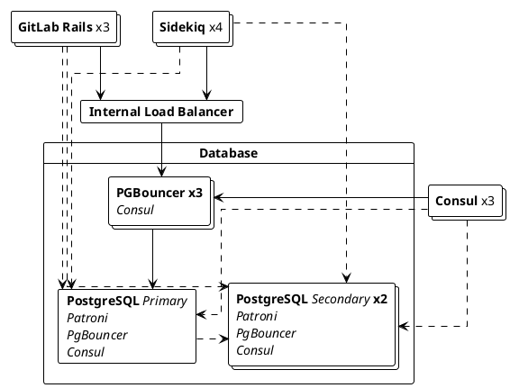



- Niveau : Free, Premium, Ultimate
- Offre : GitLab Self-Managed



Avec la répartition de charge de base de données, les requêtes en lecture seule peuvent être distribuées sur plusieurs nœuds PostgreSQL pour améliorer les performances.

Cette fonctionnalité est fournie nativement dans GitLab Rails et Sidekiq, qui peuvent être configurés pour équilibrer leurs requêtes de lecture de base de données selon une approche round-robin, sans dépendances externes :



## Conditions requises pour activer la répartition de charge de base de données {#requirements-to-enable-database-load-balancing}

Pour activer la répartition de charge de base de données, assurez-vous que :

- La configuration HA PostgreSQL dispose d'un ou plusieurs nœuds secondaires répliquant le primaire.
- Chaque nœud PostgreSQL est connecté avec les mêmes informations d'identification et sur le même port.

Pour les installations avec le package Linux, vous avez également besoin de PgBouncer configuré sur chaque nœud PostgreSQL pour regrouper toutes les connexions à charge équilibrée lors de la [configuration d'une installation multi-nœuds](replication_and_failover.md).

## Configuration de la répartition de charge de base de données {#configuring-database-load-balancing}

La répartition de charge de base de données peut être configurée de deux manières :

- (Recommandé) [Hôtes](#hosts) : une liste d'hôtes PostgreSQL.
- [Découverte de services](#service-discovery) : un enregistrement DNS qui renvoie une liste d'hôtes PostgreSQL.

### Hôtes {#hosts}

<!-- Including the Primary host in Database Load Balancing is now recommended for improved performance - Approved by the Reference Architecture and Database groups. -->

Pour configurer une liste d'hôtes, effectuez ces étapes sur tous les nœuds GitLab Rails et Sidekiq pour chaque environnement que vous souhaitez équilibrer :

1. Modifiez le fichier `/etc/gitlab/gitlab.rb`.
1. Dans `gitlab_rails['db_load_balancing']`, créez le tableau des hôtes de base de données que vous souhaitez équilibrer. Par exemple, sur un environnement avec PostgreSQL s'exécutant sur les hôtes `primary.example.com`, `secondary1.example.com`, `secondary2.example.com` :

   ```ruby
   gitlab_rails['db_load_balancing'] = { 'hosts' => ['primary.example.com', 'secondary1.example.com', 'secondary2.example.com'] }
   ```

   Ces hôtes doivent être accessibles sur le même port configuré avec `gitlab_rails['db_port']`.

1. Enregistrez le fichier et [reconfigurez GitLab](../restart_gitlab.md#reconfigure-a-linux-package-installation).

> [!note]
> L'ajout du primaire à la liste des hôtes est facultatif, mais recommandé. Cela rend le primaire éligible pour les requêtes de lecture à charge équilibrée, améliorant ainsi les performances du système lorsque le primaire a de la capacité disponible pour ces requêtes. Les instances à très fort trafic peuvent ne pas disposer de capacité sur le primaire pour lui permettre de servir de réplique en lecture. Le primaire sera utilisé pour les requêtes d'écriture qu'il soit présent ou non dans cette liste.

### Découverte de services {#service-discovery}

La découverte de services permet à GitLab de récupérer automatiquement une liste d'hôtes PostgreSQL à utiliser. Il vérifie périodiquement un enregistrement DNS `A`, en utilisant les adresses IP renvoyées par cet enregistrement comme adresses des secondaires. Pour que la découverte de services fonctionne, tout ce dont vous avez besoin est un serveur DNS et un enregistrement `A` contenant les adresses IP de vos secondaires.

Lors de l'utilisation d'une installation avec le package Linux, le service [Consul](../consul.md) fourni fonctionne comme un serveur DNS et renvoie les adresses PostgreSQL via l'enregistrement `postgresql-ha.service.consul`. Par exemple :

1. Sur chaque nœud GitLab Rails/Sidekiq, modifiez `/etc/gitlab/gitlab.rb` et ajoutez ce qui suit :

   ```ruby
   gitlab_rails['db_load_balancing'] = { 'discover' => {
       'nameserver' => 'localhost'
       'record' => 'postgresql-ha.service.consul'
       'record_type' => 'A'
       'port' => '8600'
       'interval' => '60'
       'disconnect_timeout' => '120'
     }
   }
   ```

1. Enregistrez le fichier et [reconfigurez GitLab](../restart_gitlab.md#reconfigure-a-linux-package-installation) pour que les modifications prennent effet.

| Option               | Description                                                                                       | Valeur par défaut   |
|----------------------|---------------------------------------------------------------------------------------------------|-----------|
| `nameserver`         | Le serveur de noms à utiliser pour la recherche de l'enregistrement DNS.                                              | localhost |
| `record`             | L'enregistrement à rechercher. Cette option est requise pour que la découverte de services fonctionne.                     |           |
| `record_type`        | Type d'enregistrement facultatif à rechercher. Peut être soit `A` soit `SRV`.                                      | `A`       |
| `port`               | Le port du serveur de noms.                                                                       | 8600      |
| `interval`           | Le délai minimum en secondes entre les vérifications de l'enregistrement DNS.                                      | 60        |
| `disconnect_timeout` | Le délai en secondes après lequel une ancienne connexion est fermée, après la mise à jour de la liste des hôtes. | 120       |
| `use_tcp`            | Recherche des ressources DNS en utilisant TCP au lieu d'UDP                                                     | false     |
| `max_replica_pools`  | Le nombre maximum de répliques auxquelles chaque processus Rails se connecte. Cela est utile si vous exécutez de nombreuses répliques Postgres et de nombreux processus Rails, car sans cette limite, chaque processus Rails se connecte à chaque réplique par défaut. Le comportement par défaut est illimité si cette option n'est pas définie. | nil     |

Si `record_type` est défini sur `SRV`, GitLab continue d'utiliser l'algorithme round-robin et ignore les paramètres `weight` et `priority` dans l'enregistrement. Étant donné que les enregistrements `SRV` renvoient généralement des noms d'hôtes plutôt que des adresses IP, GitLab doit rechercher les adresses IP des noms d'hôtes renvoyés dans la section additionnelle de la réponse `SRV`. Si aucune adresse IP n'est trouvée pour un nom d'hôte, GitLab doit interroger le `nameserver` configuré pour un enregistrement `ANY` pour chaque nom d'hôte concerné, en cherchant des enregistrements `A` ou `AAAA`, et finit par exclure ce nom d'hôte de la rotation s'il ne peut pas résoudre son adresse IP.

La valeur `interval` spécifie le temps minimum entre les vérifications. Si l'enregistrement `A` a un TTL supérieur à cette valeur, la découverte de services respecte ce TTL. Par exemple, si le TTL de l'enregistrement `A` est de 90 secondes, la découverte de services attend au moins 90 secondes avant de vérifier à nouveau l'enregistrement `A`.

Lorsque la liste des hôtes est mise à jour, la fermeture des anciennes connexions peut prendre un certain temps. Le paramètre `disconnect_timeout` peut être utilisé pour imposer une limite supérieure au temps nécessaire pour fermer toutes les anciennes connexions à la base de données.

### Gestion des lectures obsolètes {#handling-stale-reads}



- [Déplacé](https://gitlab.com/gitlab-org/gitlab/-/issues/327902) de GitLab Premium vers GitLab Free dans la version 14.0.



Pour éviter de lire depuis un secondaire obsolète, l'équilibreur de charge vérifie s'il est synchronisé avec le primaire. Si les données sont suffisamment récentes, le secondaire est utilisé, sinon il est ignoré. Pour réduire la surcharge de ces vérifications, nous ne les effectuons qu'à certains intervalles.

Il existe trois options de configuration qui influencent ce comportement :

| Option                       | Description                                                                                                    | Valeur par défaut    |
|------------------------------|----------------------------------------------------------------------------------------------------------------|------------|
| `max_replication_difference` | La quantité de données (en octets) qu'un secondaire est autorisé à accumuler en retard lorsqu'il n'a pas répliqué de données depuis un moment. | 8 Mo       |
| `max_replication_lag_time`   | Le nombre maximum de secondes qu'un secondaire est autorisé à accumuler en retard avant que nous arrêtions de l'utiliser.                    | 60 secondes |
| `replica_check_interval`     | Le nombre minimum de secondes que nous devons attendre avant de vérifier l'état d'un secondaire.                       | 60 secondes |

Les valeurs par défaut devraient être suffisantes pour la plupart des utilisateurs.

Pour configurer ces options avec une liste d'hôtes, utilisez l'exemple suivant :

```ruby
gitlab_rails['db_load_balancing'] = {
  'hosts' => ['primary.example.com', 'secondary1.example.com', 'secondary2.example.com'],
  'max_replication_difference' => 16777216, # 16 MB
  'max_replication_lag_time' => 30,
  'replica_check_interval' => 30
}
```

## Journalisation {#logging}

L'équilibreur de charge enregistre divers événements dans [`database_load_balancing.log`](../logs/_index.md#database_load_balancinglog), tels que

- Lorsqu'un hôte est marqué comme hors ligne
- Lorsqu'un hôte revient en ligne
- Lorsque tous les secondaires sont hors ligne
- Lorsqu'une lecture est réessayée sur un hôte différent en raison d'un conflit de requête

Le journal est structuré avec chaque entrée étant un objet JSON contenant au moins :

- Un champ `event` utile pour le filtrage.
- Un champ `message` lisible par un humain.
- Des métadonnées spécifiques à l'événement. Par exemple, `db_host`
- Des informations contextuelles toujours enregistrées. Par exemple, `severity` et `time`.

Par exemple :

```json
{"severity":"INFO","time":"2019-09-02T12:12:01.728Z","correlation_id":"abcdefg","event":"host_online","message":"Host came back online","db_host":"111.222.333.444","db_port":null,"tag":"rails.database_load_balancing","environment":"production","hostname":"web-example-1","fqdn":"gitlab.example.com","path":null,"params":null}
```

## Détails d'implémentation {#implementation-details}

### Équilibrage des requêtes {#balancing-queries}

Les requêtes `SELECT` en lecture seule sont équilibrées entre tous les hôtes donnés. Tout le reste (y compris les transactions) s'exécute sur le primaire. Les requêtes telles que `SELECT ... FOR UPDATE` sont également exécutées sur le primaire.

### Instructions préparées {#prepared-statements}

Les instructions préparées ne fonctionnent pas bien avec la répartition de charge et sont désactivées automatiquement lorsque la répartition de charge est activée. Cela ne devrait pas avoir d'impact sur les temps de réponse.

### Adhérence au primaire {#primary-sticking}

Après qu'une écriture a été effectuée, GitLab continue d'utiliser le primaire pendant une certaine période, limitée à la portée de l'utilisateur qui a effectué l'écriture. GitLab revient à l'utilisation des secondaires lorsqu'ils ont rattrapé leur retard ou après 30 secondes.

### Gestion du basculement {#failover-handling}

En cas de basculement ou de base de données ne répondant pas, l'équilibreur de charge tente d'utiliser le prochain hôte disponible. Si aucun secondaire n'est disponible, l'opération est effectuée sur le primaire à la place.

Si une erreur de connexion se produit lors de l'écriture de données, l'opération est relancée jusqu'à 3 fois avec un délai exponentiel.

Lors de l'utilisation de la répartition de charge, vous devriez pouvoir redémarrer en toute sécurité un serveur de base de données sans que cela entraîne immédiatement des erreurs présentées aux utilisateurs.

### Guide de développement {#development-guide}

Pour un guide de développement détaillé sur la répartition de charge de base de données, consultez la documentation de développement.
