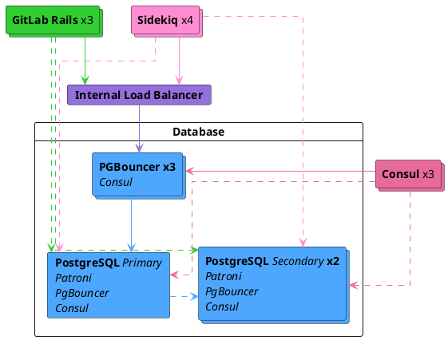



- Niveau :  Premium, Ultimate
- Offre : GitLab Self-Managed



Si vous êtes un utilisateur Free de GitLab Self-Managed, envisagez d'utiliser une solution hébergée dans le cloud. Ce document ne couvre pas les installations compilées manuellement.

Si une configuration avec réplication et basculement n'est pas ce que vous recherchiez, consultez le [document de configuration de la base de données](https://docs.gitlab.com/omnibus/settings/database/) pour les packages Linux.

Il est recommandé de lire ce document entièrement avant de tenter de configurer PostgreSQL avec la réplication et le basculement pour GitLab.

## Mises à niveau du système d'exploitation {#operating-system-upgrades}

Si vous effectuez un basculement vers un système avec un système d'exploitation différent, lisez la [documentation sur la mise à niveau des systèmes d'exploitation pour PostgreSQL](upgrading_os.md). Ne pas tenir compte des modifications locales lors des mises à niveau du système d'exploitation peut entraîner une corruption des données.

## Architecture {#architecture}

La configuration recommandée par le package Linux pour un cluster PostgreSQL avec basculement de réplication nécessite :

- Un minimum de trois nœuds PostgreSQL.
- Un minimum de trois nœuds de serveur Consul.
- Un minimum de trois nœuds PgBouncer qui suivent et gèrent les lectures et écritures de la base de données primaire.
  - Un équilibreur de charge interne (TCP) pour équilibrer les requêtes entre les nœuds PgBouncer.
- [Database Load Balancing](database_load_balancing.md) activé.
  - Un service PgBouncer local configuré sur chaque nœud PostgreSQL. Il est distinct du cluster PgBouncer principal qui suit le primaire.



Vous devez également prendre en compte la topologie réseau sous-jacente, en vous assurant que vous disposez d'une connectivité redondante entre toutes les instances de base de données et GitLab pour éviter que le réseau ne devienne un point de défaillance unique.

### Nœud de base de données {#database-node}

Chaque nœud de base de données exécute quatre services :

- `PostgreSQL` :  La base de données elle-même.
- `Patroni` :  Communique avec les autres services Patroni dans le cluster et gère le basculement en cas de problèmes avec le serveur leader. La procédure de basculement consiste à :
  - Sélectionner un nouveau leader pour le cluster.
  - Promouvoir le nouveau nœud en tant que leader.
  - Ordonner aux serveurs restants de suivre le nouveau nœud leader.
- `PgBouncer` :  Un pooler local pour le nœud. Utilisé pour les requêtes de _lecture_ dans le cadre du [Database Load Balancing](database_load_balancing.md).
- Agent `Consul` :  Pour communiquer avec le cluster Consul qui stocke l'état actuel de Patroni. L'agent surveille le statut de chaque nœud dans le cluster de base de données et suit son état de santé dans une définition de service sur le cluster Consul.

### Nœud de serveur Consul {#consul-server-node}

Le nœud de serveur Consul exécute le service de serveur Consul. Ces nœuds doivent avoir atteint le quorum et élu un leader avant le démarrage du cluster Patroni ; sinon, les nœuds de base de données attendent qu'un tel leader Consul soit élu.

### Nœud PgBouncer {#pgbouncer-node}

Chaque nœud PgBouncer exécute deux services :

- `PgBouncer` :  Le pooler de connexions de base de données lui-même.
- Agent `Consul` :  Surveille le statut de la définition de service PostgreSQL sur le cluster Consul. Si ce statut change, Consul exécute un script qui met à jour la configuration de PgBouncer pour pointer vers le nouveau nœud leader PostgreSQL et recharge le service PgBouncer.

### Flux de connexion {#connection-flow}

Chaque service du package est fourni avec un ensemble de [ports par défaut](../package_information/defaults.md#ports). Vous devrez peut-être créer des règles de pare-feu spécifiques pour les connexions listées ci-dessous :

Il existe plusieurs flux de connexion dans cette configuration :

- [Primaire](#primary)
- [Database Load Balancing](#database-load-balancing)
- [Réplication](#replication)

#### Primaire {#primary}

- Les serveurs d'application se connectent soit directement à PgBouncer via son [port par défaut](../package_information/defaults.md), soit via un équilibreur de charge interne (TCP) configuré qui dessert plusieurs PgBouncers.
- PgBouncer se connecte au [port PostgreSQL par défaut](../package_information/defaults.md) du serveur de base de données primaire.

#### Database Load Balancing {#database-load-balancing}

Pour les requêtes de lecture portant sur des données qui n'ont pas été récemment modifiées et qui sont à jour sur tous les nœuds de base de données :

- Les serveurs d'application se connectent au service PgBouncer local via son [port par défaut](../package_information/defaults.md) sur chaque nœud de base de données selon une approche round-robin.
- Le PgBouncer local se connecte au [port PostgreSQL par défaut](../package_information/defaults.md) du serveur de base de données local.

#### Réplication {#replication}

- Patroni gère activement les processus PostgreSQL en cours d'exécution et leur configuration.
- Les secondaires PostgreSQL se connectent au [port PostgreSQL par défaut](../package_information/defaults.md) des serveurs de base de données primaires
- Les serveurs et agents Consul se connectent entre eux via les [ports par défaut de Consul](../package_information/defaults.md)

## Configuration {#setting-it-up}

### Informations requises {#required-information}

Avant de procéder à la configuration, vous devez collecter toutes les informations nécessaires.

#### Informations réseau {#network-information}

PostgreSQL n'écoute sur aucune interface réseau par défaut. Il doit connaître l'adresse IP sur laquelle écouter pour être accessible aux autres services. De même, l'accès à PostgreSQL est contrôlé en fonction de la source réseau.

C'est pourquoi vous avez besoin de :

- L'adresse IP de l'interface réseau de chaque nœud. Cela peut être défini sur `0.0.0.0` pour écouter sur toutes les interfaces. Cela ne peut pas être défini sur l'adresse de bouclage `127.0.0.1`.
- Adresse réseau. Cela peut être sous forme de sous-réseau (c'est-à-dire `192.168.0.0/255.255.255.0`) ou de routage inter-domaines sans classe (CIDR) (`192.168.0.0/24`).

#### Informations Consul {#consul-information}

Lors de l'utilisation de la configuration par défaut, la configuration minimale requiert :

- `CONSUL_USERNAME`. L'utilisateur par défaut pour les installations de packages Linux est `gitlab-consul`
- `CONSUL_DATABASE_PASSWORD`. Mot de passe pour l'utilisateur de la base de données.
- `CONSUL_PASSWORD_HASH`. Il s'agit d'un hash généré à partir de la paire nom d'utilisateur/mot de passe Consul. Il peut être généré avec :

  ```shell
  sudo gitlab-ctl pg-password-md5 CONSUL_USERNAME
  ```

- `CONSUL_SERVER_NODES`. Les adresses IP ou les enregistrements DNS des nœuds de serveur Consul.

Quelques remarques sur le service lui-même :

- Le service s'exécute sous un compte système, par défaut `gitlab-consul`.
- Si vous utilisez un nom d'utilisateur différent, vous devez le spécifier via la variable `CONSUL_USERNAME`.
- Les mots de passe sont stockés aux emplacements suivants :
  - `/etc/gitlab/gitlab.rb` : haché
  - `/var/opt/gitlab/pgbouncer/pg_auth` : haché
  - `/var/opt/gitlab/consul/.pgpass` : en clair

#### Informations PostgreSQL {#postgresql-information}

Lors de la configuration de PostgreSQL, nous effectuons les opérations suivantes :

- Définir `max_replication_slots` au double du nombre de nœuds de base de données. Patroni utilise un slot supplémentaire par nœud lors de l'initialisation de la réplication.
- Définir `max_wal_senders` à un de plus que le nombre alloué de slots de réplication dans le cluster. Cela empêche la réplication d'utiliser toutes les connexions de base de données disponibles.

Dans ce document, nous supposons 3 nœuds de base de données, ce qui donne la configuration suivante :

```ruby
patroni['postgresql']['max_replication_slots'] = 6
patroni['postgresql']['max_wal_senders'] = 7
```

Comme mentionné précédemment, préparez les sous-réseaux qui ont besoin d'autorisations pour s'authentifier auprès de la base de données. Vous devez également avoir les adresses IP ou les enregistrements DNS des nœuds de serveur Consul à portée de main.

Vous avez besoin des informations de mot de passe suivantes pour l'utilisateur de base de données de l'application :

- `POSTGRESQL_USERNAME`. L'utilisateur par défaut pour les installations de packages Linux est `gitlab`
- `POSTGRESQL_USER_PASSWORD`. Le mot de passe pour l'utilisateur de la base de données
- `POSTGRESQL_PASSWORD_HASH`. Il s'agit d'un hash généré à partir de la paire nom d'utilisateur/mot de passe. Il peut être généré avec :

  ```shell
  sudo gitlab-ctl pg-password-md5 POSTGRESQL_USERNAME
  ```

#### Informations Patroni {#patroni-information}

Vous avez besoin des informations de mot de passe suivantes pour l'API Patroni :

- `PATRONI_API_USERNAME`. Un nom d'utilisateur pour l'authentification de base à l'API
- `PATRONI_API_PASSWORD`. Un mot de passe pour l'authentification de base à l'API

#### Informations PgBouncer {#pgbouncer-information}

Lors de l'utilisation d'une configuration par défaut, la configuration minimale requiert :

- `PGBOUNCER_USERNAME`. L'utilisateur par défaut pour les installations de packages Linux est `pgbouncer`
- `PGBOUNCER_PASSWORD`. Il s'agit d'un mot de passe pour le service PgBouncer.
- `PGBOUNCER_PASSWORD_HASH`. Il s'agit d'un hash généré à partir de la paire nom d'utilisateur/mot de passe PgBouncer. Il peut être généré avec :

  ```shell
  sudo gitlab-ctl pg-password-md5 PGBOUNCER_USERNAME
  ```

- `PGBOUNCER_NODE` est l'adresse IP ou le FQDN du nœud exécutant PgBouncer.

Quelques points à retenir sur le service lui-même :

- Le service s'exécute sous le même compte système que la base de données. Dans le package, il s'agit par défaut de `gitlab-psql`
- Si vous utilisez un compte utilisateur non par défaut pour le service PgBouncer (par défaut `pgbouncer`), vous devez spécifier ce nom d'utilisateur.
- Les mots de passe sont stockés aux emplacements suivants :
  - `/etc/gitlab/gitlab.rb` : haché et en clair
  - `/var/opt/gitlab/pgbouncer/pg_auth` : haché

### Installation du package Linux {#installing-the-linux-package}

Tout d'abord, assurez-vous de [télécharger et installer](https://about.gitlab.com/install/) le package Linux sur chaque nœud.

Assurez-vous d'installer les dépendances nécessaires à partir de l'étape 1 et d'ajouter le dépôt de packages GitLab à partir de l'étape 2. Lors de l'installation du package GitLab, ne fournissez pas la valeur `EXTERNAL_URL`.

### Configuration des nœuds de base de données {#configuring-the-database-nodes}

1. Assurez-vous de [configurer les nœuds Consul](../consul.md).
1. Assurez-vous de collecter [`CONSUL_SERVER_NODES`](#consul-information), [`PGBOUNCER_PASSWORD_HASH`](#pgbouncer-information), [`POSTGRESQL_PASSWORD_HASH`](#postgresql-information), le [nombre de nœuds de base de données](#postgresql-information) et l'[adresse réseau](#network-information) avant d'exécuter l'étape suivante.

#### Configuration du cluster Patroni {#configuring-patroni-cluster}

Vous devez activer Patroni explicitement pour pouvoir l'utiliser (avec `patroni['enable'] = true`).

Tout élément de configuration PostgreSQL qui contrôle la réplication, par exemple `wal_level`, `max_wal_senders`, ou d'autres, est strictement contrôlé par Patroni. Ces configurations remplacent les paramètres d'origine que vous effectuez avec la clé de configuration `postgresql[...]`. Par conséquent, ils sont tous séparés et placés sous `patroni['postgresql'][...]`. Ce comportement est limité à la réplication. Patroni respecte toute autre configuration PostgreSQL effectuée avec la clé de configuration `postgresql[...]`. Par exemple, `max_wal_senders` est par défaut défini sur `5`. Si vous souhaitez modifier cela, vous devez le définir avec la clé de configuration `patroni['postgresql']['max_wal_senders']`.

Voici un exemple :

```ruby
# Disable all components except Patroni, PgBouncer and Consul
roles(['patroni_role', 'pgbouncer_role'])

# PostgreSQL configuration
postgresql['listen_address'] = '0.0.0.0'

# Disable automatic database migrations
gitlab_rails['auto_migrate'] = false

# Configure the Consul agent
consul['services'] = %w(postgresql)

# START user configuration
#  Set the real values as explained in Required Information section
#
# Replace PGBOUNCER_PASSWORD_HASH with a generated md5 value
postgresql['pgbouncer_user_password'] = 'PGBOUNCER_PASSWORD_HASH'
# Replace POSTGRESQL_REPLICATION_PASSWORD_HASH with a generated md5 value
postgresql['sql_replication_password'] = 'POSTGRESQL_REPLICATION_PASSWORD_HASH'
# Replace POSTGRESQL_PASSWORD_HASH with a generated md5 value
postgresql['sql_user_password'] = 'POSTGRESQL_PASSWORD_HASH'

# Replace PATRONI_API_USERNAME with a username for Patroni Rest API calls (use the same username in all nodes)
patroni['username'] = 'PATRONI_API_USERNAME'
# Replace PATRONI_API_PASSWORD with a password for Patroni Rest API calls (use the same password in all nodes)
patroni['password'] = 'PATRONI_API_PASSWORD'

# Sets `max_replication_slots` to double the number of database nodes.
# Patroni uses one extra slot per node when initiating the replication.
patroni['postgresql']['max_replication_slots'] = X

# Set `max_wal_senders` to one more than the number of replication slots in the cluster.
# This is used to prevent replication from using up all of the
# available database connections.
patroni['postgresql']['max_wal_senders'] = X+1

# Replace XXX.XXX.XXX.XXX/YY with Network Addresses for your other patroni nodes
patroni['allowlist'] = %w(XXX.XXX.XXX.XXX/YY 127.0.0.1/32)

# Replace XXX.XXX.XXX.XXX/YY with Network Address
postgresql['trust_auth_cidr_addresses'] = %w(XXX.XXX.XXX.XXX/YY 127.0.0.1/32)

# Local PgBouncer service for Database Load Balancing
pgbouncer['databases'] = {
  gitlabhq_production: {
    host: "127.0.0.1",
    user: "PGBOUNCER_USERNAME",
    password: 'PGBOUNCER_PASSWORD_HASH'
  }
}

# Replace placeholders:
#
# Y.Y.Y.Y consul1.gitlab.example.com Z.Z.Z.Z
# with the addresses gathered for CONSUL_SERVER_NODES
consul['configuration'] = {
  retry_join: %w(Y.Y.Y.Y consul1.gitlab.example.com Z.Z.Z.Z)
}
#
# END user configuration
```

Tous les nœuds de base de données utilisent la même configuration. Le nœud leader n'est pas déterminé par la configuration, et il n'y a aucune configuration supplémentaire ou différente pour les nœuds leader ou réplica.

Une fois la configuration d'un nœud terminée, vous devez [reconfigurer GitLab](../restart_gitlab.md#reconfigure-a-linux-package-installation) sur chaque nœud pour que les modifications prennent effet.

En général, lorsque le cluster Consul est prêt, le premier nœud qui [se reconfigure](../restart_gitlab.md#reconfigure-a-linux-package-installation) devient le leader. Vous n'avez pas besoin de séquencer la reconfiguration des nœuds. Vous pouvez les exécuter en parallèle ou dans n'importe quel ordre. Si vous choisissez un ordre arbitraire, vous n'avez pas de leader prédéterminé.

#### Activer la surveillance {#enable-monitoring}

Si vous activez la surveillance, elle doit être activée sur tous les serveurs de base de données.

1. Créez/modifiez `/etc/gitlab/gitlab.rb` et ajoutez la configuration suivante :

   ```ruby
   # Enable service discovery for Prometheus
   consul['monitoring_service_discovery'] = true

   # Set the network addresses that the exporters must listen on
   node_exporter['listen_address'] = '0.0.0.0:9100'
   postgres_exporter['listen_address'] = '0.0.0.0:9187'
   ```

1. Exécutez `sudo gitlab-ctl reconfigure` pour compiler la configuration.

#### Activer la prise en charge TLS pour l'API Patroni {#enable-tls-support-for-the-patroni-api}

Par défaut, l'[API REST](https://patroni.readthedocs.io/en/latest/rest_api.html#rest-api) de Patroni est servie via HTTP. Vous avez la possibilité d'activer TLS et d'utiliser HTTPS sur le même [port](../package_information/defaults.md).

Pour activer TLS, vous avez besoin de fichiers de certificat et de clé privée au format PEM. Les deux fichiers doivent être lisibles par l'utilisateur PostgreSQL (`gitlab-psql` par défaut, ou celui défini par `postgresql['username']`) :

```ruby
patroni['tls_certificate_file'] = '/path/to/server/certificate.pem'
patroni['tls_key_file'] = '/path/to/server/key.pem'
```

Si la clé privée du serveur est chiffrée, spécifiez le mot de passe pour la déchiffrer :

```ruby
patroni['tls_key_password'] = 'private-key-password' # This is the plain-text password.
```

Si vous utilisez un certificat auto-signé ou une autorité de certification (CA) interne, vous devez soit désactiver la vérification TLS, soit passer le certificat de la CA interne, sinon vous risquez de rencontrer une erreur inattendue lors de l'utilisation des commandes `gitlab-ctl patroni ....`. Le package Linux s'assure que les clients de l'API Patroni respectent cette configuration.

La vérification des certificats TLS est activée par défaut. Pour la désactiver :

```ruby
patroni['tls_verify'] = false
```

Vous pouvez également passer un certificat au format PEM de la CA interne. Là encore, le fichier doit être lisible par l'utilisateur PostgreSQL :

```ruby
patroni['tls_ca_file'] = '/path/to/ca.pem'
```

Lorsque TLS est activé, l'authentification mutuelle du serveur API et du client est possible pour tous les endpoints, dans une mesure qui dépend de l'attribut `patroni['tls_client_mode']` :

- `none` (par défaut) :  L'API ne vérifie aucun certificat client.
- `optional` :  Les certificats clients sont requis pour tous les appels API [non sécurisés](https://patroni.readthedocs.io/en/latest/security.html#protecting-the-rest-api).
- `required` :  Les certificats clients sont requis pour tous les appels API.

Les certificats clients sont vérifiés par rapport au certificat CA spécifié avec l'attribut `patroni['tls_ca_file']`. Par conséquent, cet attribut est requis pour l'authentification TLS mutuelle. Vous devez également spécifier des fichiers de certificat client et de clé privée au format PEM. Les deux fichiers doivent être lisibles par l'utilisateur PostgreSQL :

```ruby
patroni['tls_client_mode'] = 'required'
patroni['tls_ca_file'] = '/path/to/ca.pem'

patroni['tls_client_certificate_file'] = '/path/to/client/certificate.pem'
patroni['tls_client_key_file'] = '/path/to/client/key.pem'
```

Vous pouvez utiliser différents certificats et clés pour le serveur API et le client sur différents nœuds Patroni, à condition qu'ils puissent être vérifiés. Cependant, le certificat CA (`patroni['tls_ca_file']`), la vérification du certificat TLS (`patroni['tls_verify']`) et le mode d'authentification TLS client (`patroni['tls_client_mode']`) doivent chacun avoir la même valeur sur tous les nœuds.

### Configurer les nœuds PgBouncer {#configure-pgbouncer-nodes}

1. Assurez-vous de collecter [`CONSUL_SERVER_NODES`](#consul-information), [`CONSUL_PASSWORD_HASH`](#consul-information) et [`PGBOUNCER_PASSWORD_HASH`](#pgbouncer-information) avant d'exécuter l'étape suivante.
1. Sur chaque nœud, modifiez le fichier de configuration `/etc/gitlab/gitlab.rb` et remplacez les valeurs indiquées dans la section `# START user configuration` comme suit :

   ```ruby
   # Disable all components except PgBouncer and Consul agent
   roles(['pgbouncer_role'])

   # Configure PgBouncer
   pgbouncer['admin_users'] = %w(pgbouncer gitlab-consul)

   # Configure Consul agent
   consul['watchers'] = %w(postgresql)

   # START user configuration
   # Set the real values as explained in Required Information section
   # Replace CONSUL_PASSWORD_HASH with a generated md5 value
   # Replace PGBOUNCER_PASSWORD_HASH with a generated md5 value
   pgbouncer['users'] = {
     'gitlab-consul': {
       password: 'CONSUL_PASSWORD_HASH'
     },
     'pgbouncer': {
       password: 'PGBOUNCER_PASSWORD_HASH'
     }
   }
   # Replace placeholders:
   #
   # Y.Y.Y.Y consul1.gitlab.example.com Z.Z.Z.Z
   # with the addresses gathered for CONSUL_SERVER_NODES
   consul['configuration'] = {
     retry_join: %w(Y.Y.Y.Y consul1.gitlab.example.com Z.Z.Z.Z)
   }
   #
   # END user configuration
   ```

1. Exécutez `gitlab-ctl reconfigure`
1. Créez un fichier `.pgpass` pour que Consul puisse recharger PgBouncer. Saisissez deux fois `PGBOUNCER_PASSWORD` lorsque cela vous est demandé :

   ```shell
   gitlab-ctl write-pgpass --host 127.0.0.1 --database pgbouncer --user pgbouncer --hostuser gitlab-consul
   ```

1. [Activer la surveillance](pgbouncer.md#enable-monitoring)

#### Point de contrôle PgBouncer {#pgbouncer-checkpoint}

1. Assurez-vous que chaque nœud communique avec le nœud leader actuel :

   ```shell
   gitlab-ctl pgb-console # Supply PGBOUNCER_PASSWORD when prompted
   ```

   Si une erreur `psql: ERROR:  Auth failed` apparaît après la saisie du mot de passe, assurez-vous d'avoir préalablement généré les hashes de mots de passe MD5 avec le format correct. Le format correct consiste à concaténer le mot de passe et le nom d'utilisateur : `PASSWORDUSERNAME`. Par exemple, `Sup3rS3cr3tpgbouncer` serait le texte nécessaire pour générer un hash de mot de passe MD5 pour l'utilisateur `pgbouncer`.

1. Une fois l'invite de la console disponible, exécutez les requêtes suivantes :

   ```shell
   show databases ; show clients ;
   ```

   La sortie devrait être similaire à ce qui suit :

   ```plaintext
           name         |  host       | port |      database       | force_user | pool_size | reserve_pool | pool_mode | max_connections | current_connections
   ---------------------+-------------+------+---------------------+------------+-----------+--------------+-----------+-----------------+---------------------
    gitlabhq_production | MASTER_HOST | 5432 | gitlabhq_production |            |        20 |            0 |           |               0 |                   0
    pgbouncer           |             | 6432 | pgbouncer           | pgbouncer  |         2 |            0 | statement |               0 |                   0
   (2 rows)

    type |   user    |      database       |  state  |   addr         | port  | local_addr | local_port |    connect_time     |    request_time     |    ptr    | link | remote_pid | tls
   ------+-----------+---------------------+---------+----------------+-------+------------+------------+---------------------+---------------------+-----------+------+------------+-----
    C    | pgbouncer | pgbouncer           | active  | 127.0.0.1      | 56846 | 127.0.0.1  |       6432 | 2017-08-21 18:09:59 | 2017-08-21 18:10:48 | 0x22b3880 |      |          0 |
   (2 rows)
   ```

#### Configurer l'équilibreur de charge interne {#configure-the-internal-load-balancer}

Si vous exécutez plus d'un nœud PgBouncer comme recommandé, vous devez configurer un équilibreur de charge interne TCP pour servir chacun correctement. Cela peut être accompli avec n'importe quel équilibreur de charge TCP réputé.

À titre d'exemple, voici comment vous pourriez le faire avec [HAProxy](https://www.haproxy.org/) :

```plaintext
global
    log /dev/log local0
    log localhost local1 notice
    log stdout format raw local0

defaults
    log global
    default-server inter 10s fall 3 rise 2
    balance leastconn

frontend internal-pgbouncer-tcp-in
    bind *:6432
    mode tcp
    option tcplog

    default_backend pgbouncer

backend pgbouncer
    mode tcp
    option tcp-check

    server pgbouncer1 <ip>:6432 check
    server pgbouncer2 <ip>:6432 check
    server pgbouncer3 <ip>:6432 check
```

Référez-vous à la documentation de votre équilibreur de charge préféré pour obtenir des conseils supplémentaires.

### Configuration des nœuds d'application {#configuring-the-application-nodes}

Les nœuds d'application exécutent le service `gitlab-rails`. Vous pouvez avoir d'autres attributs définis, mais les suivants doivent être définis.

1. Modifiez `/etc/gitlab/gitlab.rb` :

   ```ruby
   # Disable PostgreSQL on the application node
   postgresql['enable'] = false

   gitlab_rails['db_host'] = 'PGBOUNCER_NODE' or 'INTERNAL_LOAD_BALANCER'
   gitlab_rails['db_port'] = 6432
   gitlab_rails['db_password'] = 'POSTGRESQL_USER_PASSWORD'
   gitlab_rails['auto_migrate'] = false
   gitlab_rails['db_load_balancing'] = { 'hosts' => ['POSTGRESQL_NODE_1', 'POSTGRESQL_NODE_2', 'POSTGRESQL_NODE_3'] }
   ```

1. [Reconfigurez GitLab](../restart_gitlab.md#reconfigure-a-linux-package-installation) pour que les modifications prennent effet.

#### Post-configuration du nœud d'application {#application-node-post-configuration}

Assurez-vous que toutes les migrations ont été exécutées :

```shell
gitlab-rake gitlab:db:configure
```

> [!note]
> Si vous rencontrez une erreur `rake aborted!` indiquant que PgBouncer ne parvient pas à se connecter à PostgreSQL, il se peut que l'adresse IP de votre nœud PgBouncer soit absente de `trust_auth_cidr_addresses` dans `gitlab.rb` sur vos nœuds de base de données. Consultez [l'erreur PgBouncer `ERROR:  pgbouncer cannot connect to server`](replication_and_failover_troubleshooting.md#pgbouncer-error-error-pgbouncer-cannot-connect-to-server) avant de continuer.

### Sauvegardes {#backups}

Ne sauvegardez pas et ne restaurez pas GitLab via une connexion PgBouncer : cela provoque une panne de GitLab.

[En savoir plus à ce sujet et sur la façon de reconfigurer les sauvegardes](../backup_restore/backup_gitlab.md#back-up-and-restore-for-installations-using-pgbouncer).

### Vérifier que GitLab est en cours d'exécution {#ensure-gitlab-is-running}

À ce stade, votre instance GitLab devrait être opérationnelle. Vérifiez que vous pouvez vous connecter, créer des tickets et des merge requests. Pour plus d'informations, consultez [Dépannage de la réplication et du basculement](replication_and_failover_troubleshooting.md).

## Exemple de configuration {#example-configuration}

Cette section décrit plusieurs exemples de configurations entièrement développées.

### Exemple de configuration recommandée {#example-recommended-setup}

Cet exemple utilise trois serveurs Consul, trois serveurs PgBouncer (avec un équilibreur de charge interne associé), trois serveurs PostgreSQL et un nœud d'application.

Dans cette configuration, tous les serveurs partagent la même plage de réseau privé `10.6.0.0/16`. Les serveurs communiquent librement via ces adresses.

Bien que vous puissiez utiliser une configuration réseau différente, il est recommandé de s'assurer qu'elle permet à la réplication synchrone de se produire dans tout le cluster. En règle générale, une latence inférieure à 2 ms garantit des opérations de réplication performantes.

Les [architectures de référence](../reference_architectures/_index.md) de GitLab sont dimensionnées en supposant que les requêtes de base de données de l'application sont partagées par les trois nœuds. Une latence de communication supérieure à 2 ms peut entraîner des verrous de base de données et affecter la capacité du réplica à servir les requêtes en lecture seule en temps opportun.

- `10.6.0.22` :  PgBouncer 2
- `10.6.0.23` :  PgBouncer 3
- `10.6.0.31` :  PostgreSQL 1
- `10.6.0.32` :  PostgreSQL 2
- `10.6.0.33` :  PostgreSQL 3
- `10.6.0.41` :  Application GitLab

Tous les mots de passe sont définis sur `toomanysecrets`. N'utilisez pas ce mot de passe ou les hashes dérivés, et l'`external_url` pour GitLab est `http://gitlab.example.com`.

Après la configuration initiale, en cas de basculement, le nœud leader PostgreSQL bascule vers l'un des secondaires disponibles jusqu'à ce qu'il soit restauré.

#### Exemple de configuration recommandée pour les serveurs Consul {#example-recommended-setup-for-consul-servers}

Sur chaque serveur, modifiez `/etc/gitlab/gitlab.rb` :

```ruby
# Disable all components except Consul
roles(['consul_role'])

consul['configuration'] = {
  server: true,
  retry_join: %w(10.6.0.11 10.6.0.12 10.6.0.13)
}
consul['monitoring_service_discovery'] =  true
```

[Reconfigurez GitLab](../restart_gitlab.md#reconfigure-a-linux-package-installation) pour que les modifications prennent effet.

#### Exemple de configuration recommandée pour les serveurs PgBouncer {#example-recommended-setup-for-pgbouncer-servers}

Sur chaque serveur, modifiez `/etc/gitlab/gitlab.rb` :

```ruby
# Disable all components except Pgbouncer and Consul agent
roles(['pgbouncer_role'])

# Configure PgBouncer
pgbouncer['admin_users'] = %w(pgbouncer gitlab-consul)

pgbouncer['users'] = {
  'gitlab-consul': {
    password: '5e0e3263571e3704ad655076301d6ebe'
  },
  'pgbouncer': {
    password: '771a8625958a529132abe6f1a4acb19c'
  }
}

consul['watchers'] = %w(postgresql)
consul['configuration'] = {
  retry_join: %w(10.6.0.11 10.6.0.12 10.6.0.13)
}
consul['monitoring_service_discovery'] =  true
```

[Reconfigurez GitLab](../restart_gitlab.md#reconfigure-a-linux-package-installation) pour que les modifications prennent effet.

#### Configuration de l'équilibreur de charge interne {#internal-load-balancer-setup}

Un équilibreur de charge interne (TCP) doit ensuite être configuré pour servir chaque nœud PgBouncer (dans cet exemple sur l'IP `10.6.0.20`). Un exemple de la façon de procéder peut être trouvé dans la section [PgBouncer Configure Internal Load Balancer](#configure-the-internal-load-balancer).

#### Exemple de configuration recommandée pour les serveurs PostgreSQL {#example-recommended-setup-for-postgresql-servers}

Sur les nœuds de base de données, modifiez `/etc/gitlab/gitlab.rb` :

```ruby
# Disable all components except Patroni, PgBouncer and Consul
roles(['patroni_role', 'pgbouncer_role'])

# PostgreSQL configuration
postgresql['listen_address'] = '0.0.0.0'
postgresql['hot_standby'] = 'on'
postgresql['wal_level'] = 'replica'

# Disable automatic database migrations
gitlab_rails['auto_migrate'] = false

postgresql['pgbouncer_user_password'] = '771a8625958a529132abe6f1a4acb19c'
postgresql['sql_user_password'] = '450409b85a0223a214b5fb1484f34d0f'
patroni['username'] = 'PATRONI_API_USERNAME'
patroni['password'] = 'PATRONI_API_PASSWORD'
patroni['postgresql']['max_replication_slots'] = 6
patroni['postgresql']['max_wal_senders'] = 7

patroni['allowlist'] = = %w(10.6.0.0/16 127.0.0.1/32)
postgresql['trust_auth_cidr_addresses'] = %w(10.6.0.0/16 127.0.0.1/32)

# Local PgBouncer service for Database Load Balancing
pgbouncer['databases'] = {
  gitlabhq_production: {
    host: "127.0.0.1",
    user: "pgbouncer",
    password: '771a8625958a529132abe6f1a4acb19c'
  }
}

# Configure the Consul agent
consul['services'] = %w(postgresql)
consul['configuration'] = {
  retry_join: %w(10.6.0.11 10.6.0.12 10.6.0.13)
}
consul['monitoring_service_discovery'] =  true
```

[Reconfigurez GitLab](../restart_gitlab.md#reconfigure-a-linux-package-installation) pour que les modifications prennent effet.

#### Étapes manuelles de l'exemple de configuration recommandée {#example-recommended-setup-manual-steps}

Après avoir déployé la configuration, suivez ces étapes :

1. Trouvez le nœud de base de données primaire :

   ```shell
   gitlab-ctl get-postgresql-primary
   ```

1. Sur `10.6.0.41`, notre serveur d'application :

   Définissez le mot de passe PgBouncer de l'utilisateur `gitlab-consul` sur `toomanysecrets` :

   ```shell
   gitlab-ctl write-pgpass --host 127.0.0.1 --database pgbouncer --user pgbouncer --hostuser gitlab-consul
   ```

   Exécutez les migrations de base de données :

   ```shell
   gitlab-rake gitlab:db:configure
   ```

## Patroni {#patroni}

Patroni est une solution opinionée pour la haute disponibilité de PostgreSQL. Il prend le contrôle de PostgreSQL, remplace sa configuration et gère son cycle de vie (démarrage, arrêt, redémarrage). Patroni est la seule option pour le clustering PostgreSQL 12+ et pour la réplication en cascade pour les déploiements Geo.

L'[architecture](#example-recommended-setup-manual-steps) fondamentale ne change pas pour Patroni. Vous n'avez pas besoin de considérations spéciales pour Patroni lors du provisionnement de vos nœuds de base de données. Patroni s'appuie fortement sur Consul pour stocker l'état du cluster et élire un leader. Tout échec dans le cluster Consul et son élection de leader se propage également au cluster Patroni.

Patroni surveille le cluster et gère tout basculement. Lorsque le nœud primaire tombe en panne, il collabore avec Consul pour notifier PgBouncer. En cas d'échec, Patroni gère la transition de l'ancien primaire en réplica et le réintègre automatiquement au cluster.

Avec Patroni, le flux de connexion est légèrement différent. Patroni sur chaque nœud se connecte à l'agent Consul pour rejoindre le cluster. C'est seulement à ce stade qu'il décide si le nœud est le primaire ou un réplica. Sur la base de cette décision, il configure et démarre PostgreSQL avec lequel il communique directement via un socket Unix. Cela signifie que si le cluster Consul n'est pas fonctionnel ou n'a pas de leader, Patroni et par extension PostgreSQL ne démarrent pas. Patroni expose également une API REST accessible via son [port par défaut](../package_information/defaults.md) sur chaque nœud.

### Vérifier le statut de la réplication {#check-replication-status}

Exécutez `gitlab-ctl patroni members` pour interroger Patroni sur un résumé du statut du cluster :

```plaintext
+ Cluster: postgresql-ha (6970678148837286213) ------+---------+---------+----+-----------+
| Member                              | Host         | Role    | State   | TL | Lag in MB |
+-------------------------------------+--------------+---------+---------+----+-----------+
| gitlab-database-1.example.com       | 172.18.0.111 | Replica | running |  5 |         0 |
| gitlab-database-2.example.com       | 172.18.0.112 | Replica | running |  5 |       100 |
| gitlab-database-3.example.com       | 172.18.0.113 | Leader  | running |  5 |           |
+-------------------------------------+--------------+---------+---------+----+-----------+
```

Pour vérifier le statut de la réplication :

```shell
echo -e 'select * from pg_stat_wal_receiver\x\g\x \n select * from pg_stat_replication\x\g\x' | gitlab-psql
```

La même commande peut être exécutée sur les trois serveurs de base de données. Elle retourne toutes les informations disponibles sur la réplication en fonction du rôle que le serveur effectue.

Le leader devrait retourner un enregistrement par réplica :

```sql
-[ RECORD 1 ]----+------------------------------
pid              | 371
usesysid         | 16384
usename          | gitlab_replicator
application_name | gitlab-database-1.example.com
client_addr      | 172.18.0.111
client_hostname  |
client_port      | 42900
backend_start    | 2021-06-14 08:01:59.580341+00
backend_xmin     |
state            | streaming
sent_lsn         | 0/EA13220
write_lsn        | 0/EA13220
flush_lsn        | 0/EA13220
replay_lsn       | 0/EA13220
write_lag        |
flush_lag        |
replay_lag       |
sync_priority    | 0
sync_state       | async
reply_time       | 2021-06-18 19:17:14.915419+00
```

Effectuez une investigation plus approfondie si :

- Il y a des enregistrements manquants ou supplémentaires.
- `reply_time` n'est pas à jour.

Les champs `lsn` concernent les segments de journal d'écriture anticipée (write-ahead-log) qui ont été répliqués. Exécutez ce qui suit sur le leader pour connaître le numéro de séquence de journal (LSN) actuel :

```shell
echo 'SELECT pg_current_wal_lsn();' | gitlab-psql
```

Si un réplica n'est pas synchronisé, `gitlab-ctl patroni members` indique le volume de données manquantes, et les champs `lag` indiquent le temps écoulé.

En savoir plus sur les données retournées par le leader [dans la documentation PostgreSQL](https://www.postgresql.org/docs/16/monitoring-stats.html#PG-STAT-REPLICATION-VIEW), y compris d'autres valeurs pour le champ `state`.

Les réplicas devraient retourner :

```sql
-[ RECORD 1 ]---------+-------------------------------------------------------------------------------------------------
pid                   | 391
status                | streaming
receive_start_lsn     | 0/D000000
receive_start_tli     | 5
received_lsn          | 0/EA13220
received_tli          | 5
last_msg_send_time    | 2021-06-18 19:16:54.807375+00
last_msg_receipt_time | 2021-06-18 19:16:54.807512+00
latest_end_lsn        | 0/EA13220
latest_end_time       | 2021-06-18 19:07:23.844879+00
slot_name             | gitlab-database-1.example.com
sender_host           | 172.18.0.113
sender_port           | 5432
conninfo              | user=gitlab_replicator host=172.18.0.113 port=5432 application_name=gitlab-database-1.example.com
```

En savoir plus sur les données retournées par le réplica [dans la documentation PostgreSQL](https://www.postgresql.org/docs/16/monitoring-stats.html#PG-STAT-WAL-RECEIVER-VIEW).

### Sélectionner la méthode de réplication Patroni appropriée {#selecting-the-appropriate-patroni-replication-method}

[Consultez attentivement la documentation Patroni](https://patroni.readthedocs.io/en/latest/yaml_configuration.html#postgresql) avant d'apporter des modifications, car certaines options comportent un risque de perte de données potentielle si elles ne sont pas pleinement comprises. Le [mode de réplication](https://patroni.readthedocs.io/en/latest/replication_modes.html) configuré détermine la quantité de perte de données tolérable.

> [!warning]
> La réplication n'est pas une stratégie de sauvegarde ! Il n'y a pas de substitut à une solution de sauvegarde bien réfléchie et testée.

Les installations de packages Linux définissent par défaut [`synchronous_commit`](https://www.postgresql.org/docs/16/runtime-config-wal.html#GUC-SYNCHRONOUS-COMMIT) sur `on`.

```ruby
postgresql['synchronous_commit'] = 'on'
gitlab['geo-postgresql']['synchronous_commit'] = 'on'
```

#### Personnaliser le comportement de basculement de Patroni {#customizing-patroni-failover-behavior}

Les installations de packages Linux exposent plusieurs options permettant un meilleur contrôle sur le [processus de restauration de Patroni](#recovering-the-patroni-cluster).

Chaque option est affichée ci-dessous avec sa valeur par défaut dans `/etc/gitlab/gitlab.rb`.

```ruby
patroni['use_pg_rewind'] = true
patroni['remove_data_directory_on_rewind_failure'] = false
patroni['remove_data_directory_on_diverged_timelines'] = false
```

[La documentation upstream est toujours plus à jour](https://patroni.readthedocs.io/en/latest/patroni_configuration.html), mais le tableau ci-dessous devrait fournir un aperçu minimal des fonctionnalités.

| Paramètre                                       | Aperçu |
|-----------------------------------------------|----------|
| `use_pg_rewind`                               | Essayez d'exécuter `pg_rewind` sur l'ancien leader du cluster avant qu'il rejoigne le cluster de base de données. |
| `remove_data_directory_on_rewind_failure`     | Si `pg_rewind` échoue, supprimez le répertoire de données PostgreSQL local et répliquez à nouveau depuis le leader actuel du cluster. |
| `remove_data_directory_on_diverged_timelines` | Si `pg_rewind` ne peut pas être utilisé et que la chronologie de l'ancien leader a divergé de la chronologie actuelle, supprimez le répertoire de données local et répliquez à nouveau depuis le leader actuel du cluster. |

### Autorisation de base de données pour Patroni {#database-authorization-for-patroni}

Patroni utilise un socket Unix pour gérer l'instance PostgreSQL. Par conséquent, une connexion depuis le socket `local` doit être approuvée.

Les réplicas utilisent l'utilisateur de réplication (`gitlab_replicator` par défaut) pour communiquer avec le leader. Pour cet utilisateur, vous pouvez choisir entre l'authentification `trust` et `md5`. Si vous définissez `postgresql['sql_replication_password']`, Patroni utilise l'authentification `md5`, sinon il revient à `trust`.

En fonction de l'authentification que vous choisissez, vous devez spécifier le CIDR du cluster dans les paramètres `postgresql['md5_auth_cidr_addresses']` ou `postgresql['trust_auth_cidr_addresses']`.

### Interaction avec le cluster Patroni {#interacting-with-patroni-cluster}

Vous pouvez utiliser `gitlab-ctl patroni members` pour vérifier le statut des membres du cluster. Pour vérifier le statut de chaque nœud, `gitlab-ctl patroni` fournit deux sous-commandes supplémentaires, `check-leader` et `check-replica`, qui indiquent si un nœud est le primaire ou un réplica.

Lorsque Patroni est activé, il contrôle exclusivement le démarrage, l'arrêt et le redémarrage de PostgreSQL. Cela signifie que pour arrêter PostgreSQL sur un certain nœud, vous devez arrêter Patroni sur le même nœud avec :

```shell
sudo gitlab-ctl stop patroni
```

L'arrêt ou le redémarrage du service Patroni sur le nœud leader déclenche un basculement automatique. Si vous avez besoin que Patroni recharge sa configuration ou redémarre le processus PostgreSQL sans déclencher le basculement, vous devez utiliser les sous-commandes `reload` ou `restart` de `gitlab-ctl patroni` à la place. Ces deux sous-commandes sont des wrappers des mêmes commandes `patronictl`.

### Procédure de basculement manuel pour Patroni {#manual-failover-procedure-for-patroni}

> [!warning]
> Dans GitLab 16.5 et antérieur, les nœuds PgBouncer ne basculent pas automatiquement en même temps que les nœuds Patroni. Les services PgBouncer [doivent être redémarrés manuellement](replication_and_failover_troubleshooting.md#pgbouncer-error-error-pgbouncer-cannot-connect-to-server) pour un basculement réussi.

Bien que Patroni prenne en charge le basculement automatique, vous avez également la possibilité d'effectuer un basculement manuel, où vous disposez de deux options légèrement différentes :

- Basculement (failover) : vous permet d'effectuer un basculement manuel en l'absence de nœuds sains. Vous pouvez effectuer cette action sur n'importe quel nœud PostgreSQL :

  ```shell
  sudo gitlab-ctl patroni failover
  ```

- Basculement planifié (switchover) : ne fonctionne que lorsque le cluster est sain et vous permet de planifier un basculement (qui peut avoir lieu immédiatement). Vous pouvez effectuer cette action sur n'importe quel nœud PostgreSQL :

  ```shell
  sudo gitlab-ctl patroni switchover
  ```

Pour plus de détails sur ce sujet, consultez la [documentation Patroni](https://patroni.readthedocs.io/en/latest/rest_api.html#switchover-and-failover-endpoints).

#### Considérations relatives au site secondaire Geo {#geo-secondary-site-considerations}

Lorsqu'un site secondaire Geo réplique depuis un site primaire qui utilise `Patroni` et `PgBouncer`, la réplication via PgBouncer n'est pas prise en charge. Il existe une demande de fonctionnalité pour ajouter ce support, consultez le [problème #8832](https://gitlab.com/gitlab-org/omnibus-gitlab/-/issues/8832).

Recommandé. Introduisez un équilibreur de charge sur le site primaire pour gérer automatiquement les basculements dans le cluster `Patroni`. Pour plus d'informations, consultez [Étape 2 : Configurer l'équilibreur de charge interne sur le site primaire](../geo/setup/database.md#step-2-configure-the-internal-load-balancer-on-the-primary-site).

##### Gestion du basculement Patroni lors de la réplication directe depuis le nœud leader {#handling-patroni-failover-when-replicating-directly-from-the-leader-node}

Si votre site secondaire est configuré pour répliquer directement depuis le nœud leader dans le cluster `Patroni`, alors un basculement dans le cluster `Patroni` arrêtera la réplication vers le site secondaire, même si le nœud d'origine est réajouté en tant que nœud suiveur.

Dans ce scénario, vous devez manuellement pointer votre site secondaire pour qu'il réplique depuis le nouveau leader après un basculement dans le cluster `Patroni` :

```shell
sudo gitlab-ctl replicate-geo-database --host=<new_leader_ip> --replication-slot=<slot_name>
```

Cette opération resynchronise la base de données de votre site secondaire et peut prendre beaucoup de temps selon la quantité de données à synchroniser. Vous devrez peut-être également exécuter `gitlab-ctl reconfigure` si la réplication ne fonctionne toujours pas après la resynchronisation.

### Récupération du cluster Patroni {#recovering-the-patroni-cluster}

Pour récupérer l'ancien primaire et le réintégrer au cluster en tant que réplica, vous pouvez démarrer Patroni avec :

```shell
sudo gitlab-ctl start patroni
```

Aucune configuration ou intervention supplémentaire n'est nécessaire.

### Procédure de maintenance pour Patroni {#maintenance-procedure-for-patroni}

Avec Patroni activé, vous pouvez effectuer une maintenance planifiée sur vos nœuds. Pour effectuer une maintenance sur un nœud sans Patroni, vous pouvez le mettre en mode maintenance avec :

```shell
sudo gitlab-ctl patroni pause
```

Lorsque Patroni fonctionne en mode suspendu, il ne modifie pas l'état de PostgreSQL. Une fois terminé, vous pouvez reprendre Patroni :

```shell
sudo gitlab-ctl patroni resume
```

Pour plus de détails, consultez la [documentation Patroni sur ce sujet](https://patroni.readthedocs.io/en/latest/pause.html).

### Mise à niveau de la version majeure de PostgreSQL dans un cluster Patroni {#upgrading-postgresql-major-version-in-a-patroni-cluster}

Pour obtenir la liste des versions PostgreSQL incluses et la version par défaut pour chaque release, consultez les [versions PostgreSQL du package Linux](../package_information/postgresql_versions.md).

Voici quelques faits clés à prendre en compte avant de mettre à niveau PostgreSQL :

- Le point principal est que vous devez arrêter le cluster Patroni. Cela signifie que votre déploiement GitLab est indisponible pendant la durée de la mise à niveau de la base de données ou, au moins, aussi longtemps que votre nœud leader est mis à niveau. Cela peut représenter une indisponibilité significative selon la taille de votre base de données.
- La mise à niveau de PostgreSQL crée un nouveau répertoire de données avec de nouvelles données de contrôle. Du point de vue de Patroni, il s'agit d'un nouveau cluster qui doit être initialisé à nouveau. Par conséquent, dans le cadre de la procédure de mise à niveau, l'état du cluster (stocké dans Consul) est effacé. Une fois la mise à niveau terminée, Patroni initialise un nouveau cluster. Cela modifie l'ID de votre cluster.
- Les procédures de mise à niveau du leader et des réplicas ne sont pas les mêmes. C'est pourquoi il est important d'utiliser la bonne procédure sur chaque nœud.
- La mise à niveau d'un nœud réplica supprime le répertoire de données et le resynchronise depuis le leader en utilisant la méthode de réplication configurée (`pg_basebackup` est la seule option disponible). La resynchronisation du réplica avec le leader peut prendre un certain temps, selon la taille de votre base de données.
- Un aperçu de la procédure de mise à niveau est décrit dans [la documentation Patroni](https://patroni.readthedocs.io/en/latest/existing_data.html#major-upgrade-of-postgresql-version). Vous pouvez toujours utiliser `gitlab-ctl pg-upgrade` qui implémente cette procédure avec quelques ajustements.

Compte tenu de ces éléments, vous devez planifier soigneusement votre mise à niveau PostgreSQL :

1. Déterminez quel nœud est le leader et quel nœud est un réplica :

   ```shell
   gitlab-ctl patroni members
   ```

   > [!note]
   > Sur un site secondaire Geo, le nœud leader Patroni est appelé `standby leader`.

1. Arrêtez Patroni uniquement sur les réplicas.

   ```shell
   sudo gitlab-ctl stop patroni
   ```

1. Activez le mode de maintenance sur le nœud d'application :

   ```shell
   sudo gitlab-ctl deploy-page up
   ```

1. Mettez à niveau PostgreSQL sur le nœud leader et assurez-vous que la mise à niveau est terminée avec succès :

   ```shell
   # Default command timeout is 600s, configurable with '--timeout'
   sudo gitlab-ctl pg-upgrade
   ```

   > [!note]
   > `gitlab-ctl pg-upgrade` tente de détecter le rôle du nœud. Si pour une raison quelconque la détection automatique ne fonctionne pas ou si vous pensez qu'elle n'a pas détecté correctement le rôle, vous pouvez utiliser les arguments `--leader` ou `--replica` pour le remplacer manuellement. Utilisez `gitlab-ctl pg-upgrade --help` pour plus de détails sur les options disponibles.

1. Vérifiez le statut du leader et du cluster. Vous pouvez continuer uniquement si vous avez un leader sain :

   ```shell
   gitlab-ctl patroni check-leader

   # OR

   gitlab-ctl patroni members
   ```

1. Vous pouvez maintenant désactiver le mode de maintenance sur le nœud d'application :

   ```shell
   sudo gitlab-ctl deploy-page down
   ```

1. Mettez à niveau PostgreSQL sur les réplicas (vous pouvez le faire en parallèle sur tous) :

   ```shell
   sudo gitlab-ctl pg-upgrade
   ```

1. Assurez-vous que les versions compatibles de `pg_dump` et `pg_restore` sont utilisées sur l'instance GitLab Rails pour éviter les erreurs de discordance de version lors d'une sauvegarde ou d'une restauration. Vous pouvez le faire en spécifiant la version de PostgreSQL dans `/etc/gitlab/gitlab.rb` sur l'instance Rails :

   ```shell
   postgresql['version'] = 16
   ```

Si des problèmes sont rencontrés lors de la mise à niveau des réplicas, [il existe une section de dépannage](replication_and_failover_troubleshooting.md#postgresql-major-version-upgrade-fails-on-a-patroni-replica) qui pourrait être la solution.

> [!note]
> La restauration de la mise à niveau PostgreSQL avec `gitlab-ctl revert-pg-upgrade` a les mêmes considérations que `gitlab-ctl pg-upgrade`. Vous devez suivre la même procédure en arrêtant d'abord les réplicas, puis en restaurant le leader, et enfin en restaurant les réplicas.

### Mise à niveau de PostgreSQL avec une quasi-absence de temps d'arrêt dans un cluster Patroni {#near-zero-downtime-upgrade-of-postgresql-in-a-patroni-cluster}



- Statut :  Expérience



Patroni vous permet d'effectuer une mise à niveau majeure de PostgreSQL sans arrêter le cluster. Cependant, cela nécessite des ressources supplémentaires pour héberger les nouveaux nœuds Patroni avec PostgreSQL mis à niveau. En pratique, avec cette procédure, vous :

- Créez un nouveau cluster Patroni avec une nouvelle version de PostgreSQL.
- Migrez les données depuis le cluster existant.

Cette procédure est non invasive et n'impacte pas votre cluster existant avant de le désactiver. Cependant, elle peut être à la fois chronophage et consommatrice de ressources. Considérez leurs compromis avec la disponibilité.

Les étapes, dans l'ordre :

1. [Provisionner des ressources pour le nouveau cluster](#provision-resources-for-the-new-cluster).
1. [Vérification préliminaire](#preflight-check).
1. [Configurer le leader du nouveau cluster](#configure-the-leader-of-the-new-cluster).
1. [Démarrer le publisher sur le leader existant](#start-publisher-on-the-existing-leader).
1. [Copier les données depuis le cluster existant](#copy-the-data-from-the-existing-cluster).
1. [Répliquer les données depuis le cluster existant](#replicate-data-from-the-existing-cluster).
1. [Agrandir le nouveau cluster](#grow-the-new-cluster).
1. [Basculer l'application vers le nouveau cluster](#switch-the-application-to-use-the-new-cluster).
1. [Nettoyer](#clean-up).

#### Provisionner des ressources pour le nouveau cluster {#provision-resources-for-the-new-cluster}

Vous avez besoin d'un nouvel ensemble de ressources pour les nœuds Patroni. Le nouveau cluster Patroni ne nécessite pas exactement le même nombre de nœuds que le cluster existant. Vous pouvez choisir un nombre différent de nœuds selon vos besoins. Le nouveau cluster utilise le cluster Consul existant (avec un `patroni['scope']` différent) et les nœuds PgBouncer.

Assurez-vous qu'au moins le nœud leader du cluster existant est accessible depuis les nœuds du nouveau cluster.

#### Vérification préliminaire {#preflight-check}

Nous nous appuyons sur la [réplication logique](https://www.postgresql.org/docs/16/logical-replication.html) de PostgreSQL pour prendre en charge les mises à niveau des clusters Patroni avec quasi-absence de temps d'arrêt. Les [exigences de la réplication logique](https://www.postgresql.org/docs/16/logical-replication-restrictions.html) doivent être satisfaites. En particulier, `wal_level` doit être `logical`. Pour vérifier le `wal_level`, exécutez la commande suivante avec `gitlab-psql` sur n'importe quel nœud du cluster existant :

```sql
SHOW wal_level;
```

Par défaut, Patroni définit `wal_level` sur `replica`. Vous devez l'augmenter à `logical`. La modification de `wal_level` nécessite un redémarrage de PostgreSQL, donc cette étape entraîne un court temps d'arrêt (d'où quasi-absence de temps d'arrêt). Pour ce faire sur le nœud leader Patroni :

1. Modifiez `gitlab.rb` en définissant :

   ```ruby
   patroni['postgresql']['wal_level'] = 'logical'
   ```

1. Exécutez `gitlab-ctl reconfigure`. Cela écrit la configuration mais ne redémarre pas le service PostgreSQL.
1. Exécutez `gitlab-ctl patroni restart` pour redémarrer PostgreSQL et appliquer le nouveau `wal_level` sans déclencher de basculement. Pendant la durée du cycle de redémarrage, le leader du cluster est indisponible.
1. Vérifiez la modification en exécutant `SHOW wal_level` avec `gitlab-psql`.

#### Configurer le leader du nouveau cluster {#configure-the-leader-of-the-new-cluster}

Configurez le premier nœud du nouveau cluster. Il devient le leader du nouveau cluster. Vous pouvez utiliser la configuration du cluster existant, si elle est compatible avec la nouvelle version de PostgreSQL. Référez-vous à la documentation sur la [configuration des clusters Patroni](#configuring-patroni-cluster).

En plus de la configuration commune, vous devez appliquer ce qui suit dans `gitlab.rb` pour :

1. Assurez-vous que le nouveau cluster Patroni utilise une portée différente. La portée est utilisée pour espacer les paramètres Patroni dans Consul, permettant d'utiliser le même cluster Consul pour les clusters existant et nouveau.

   ```ruby
   patroni['scope'] = 'postgresql_new-ha'
   ```

1. Assurez-vous que les agents Consul ne mélangent pas les services PostgreSQL offerts par les clusters Patroni existant et nouveau. À cette fin, vous devez utiliser un attribut interne :

   ```ruby
   consul['internal']['postgresql_service_name'] = 'postgresql_new'
   ```

#### Démarrer le publisher sur le leader existant {#start-publisher-on-the-existing-leader}

Sur le leader existant, exécutez cette instruction SQL avec `gitlab-psql` pour démarrer un publisher de réplication logique :

```sql
CREATE PUBLICATION patroni_upgrade FOR ALL TABLES;
```

#### Copier les données depuis le cluster existant {#copy-the-data-from-the-existing-cluster}

Pour exporter la base de données actuelle depuis le cluster existant, exécutez ces commandes sur le leader du nouveau cluster :

1. Facultatif. Copiez les objets de base de données globaux :

   ```shell
   pg_dumpall -h ${EXISTING_CLUSTER_LEADER} -U gitlab-psql -g | gitlab-psql
   ```

   Vous pouvez ignorer les erreurs concernant les objets de base de données existants, tels que les rôles. Ils sont créés lors de la première configuration du nœud.

1. Copiez la base de données actuelle :

   ```shell
   pg_dump -h ${EXISTING_CLUSTER_LEADER} -U gitlab-psql -d gitlabhq_production -s | gitlab-psql
   ```

   Selon la taille de votre base de données, cette commande peut prendre un certain temps.

Les commandes `pg_dump` et `pg_dumpall` se trouvent dans `/opt/gitlab/embedded/bin`. Dans ces commandes, `EXISTING_CLUSTER_LEADER` est l'adresse hôte du nœud leader du cluster existant.

> [!note]
> L'utilisateur `gitlab-psql` doit être en mesure d'authentifier le leader existant depuis le nouveau nœud leader.

#### Répliquer les données depuis le cluster existant {#replicate-data-from-the-existing-cluster}

Après avoir effectué le dump de données initial, vous devez maintenir le nouveau leader synchronisé avec les dernières modifications de votre cluster existant. Sur le nouveau leader, exécutez cette instruction SQL avec `gitlab-psql` pour s'abonner à la publication du leader existant :

```sql
CREATE SUBSCRIPTION patroni_upgrade
  CONNECTION 'host=EXISTING_CLUSTER_LEADER dbname=gitlabhq_production user=gitlab-psql'
  PUBLICATION patroni_upgrade;
```

Dans cette instruction, `EXISTING_CLUSTER_LEADER` est l'adresse hôte du nœud leader du cluster existant. Vous pouvez également utiliser [d'autres paramètres](https://www.postgresql.org/docs/16/libpq-connect.html#LIBPQ-PARAMKEYWORDS) pour modifier la chaîne de connexion. Par exemple, vous pouvez passer le mot de passe d'authentification.

Pour vérifier le statut de la réplication, exécutez ces requêtes :

- `SELECT * FROM pg_replication_slots WHERE slot_name = 'patroni_upgrade'` sur le leader existant (le publisher).
- `SELECT * FROM pg_stat_subscription` sur le nouveau leader (le subscriber).

#### Agrandir le nouveau cluster {#grow-the-new-cluster}

Configurez les autres nœuds du nouveau cluster de la même manière que vous avez [configuré le leader](#configure-the-leader-of-the-new-cluster). Assurez-vous d'utiliser le même `patroni['scope']` et `consul['internal']['postgresql_service_name']`.

Ce qui se passe ici :

- L'application utilise toujours le leader existant comme backend de base de données.
- La réplication logique garantit que le nouveau leader reste synchronisé.
- Lorsque d'autres nœuds sont ajoutés au nouveau cluster, Patroni gère la réplication vers ces nœuds.

Il est conseillé d'attendre que les nœuds réplicas du nouveau cluster soient initialisés et aient rattrapé le retard de réplication.

#### Basculer l'application vers le nouveau cluster {#switch-the-application-to-use-the-new-cluster}

Jusqu'à ce stade, vous pouvez arrêter la procédure de mise à niveau sans perdre de données sur le cluster existant. Lorsque vous basculez le backend de base de données de l'application et le pointez vers le nouveau cluster, l'ancien cluster ne reçoit plus de nouvelles mises à jour. Il prend du retard sur le nouveau cluster. Après ce stade, toute récupération doit être effectuée depuis les nœuds du nouveau cluster.

Pour effectuer le basculement sur tous les nœuds PgBouncer :

1. Modifiez `gitlab.rb` en définissant :

   ```ruby
   consul['watchers'] = %w(postgresql_new)
   consul['internal']['postgresql_service_name'] = 'postgresql_new'
   ```

1. Exécutez `gitlab-ctl reconfigure`.

#### Nettoyage {#clean-up}

Après avoir effectué ces étapes, vous pouvez nettoyer les ressources de l'ancien cluster Patroni. Elles ne sont plus nécessaires. Cependant, avant de supprimer les ressources, supprimez l'abonnement de réplication logique sur le nouveau leader en exécutant `DROP SUBSCRIPTION patroni_upgrade` avec `gitlab-psql`.
