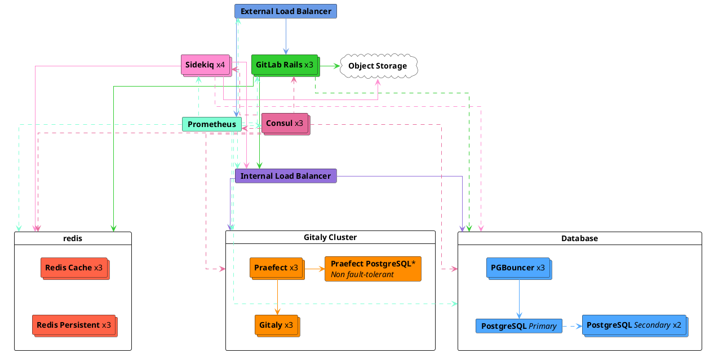
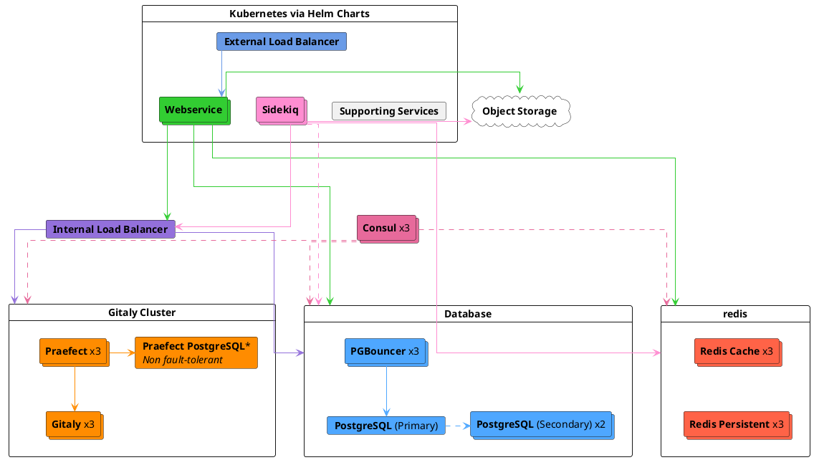



- Niveau :  Premium, Ultimate
- Offre :  GitLab Self-Managed



Cette page décrit l'architecture de référence GitLab conçue pour cibler une charge maximale de 200 requêtes par seconde (RPS), la charge maximale typique jusqu'à 10 000 utilisateurs, à la fois manuels et automatisés, basée sur des données réelles.

Pour une liste complète des architectures de référence, voir [Architectures de référence disponibles](_index.md#available-reference-architectures).

> [!note]
> Avant de déployer cette architecture, il est recommandé de lire d'abord la [documentation principale](_index.md), notamment les sections [Avant de commencer](_index.md#before-you-start) et [Choisir l'architecture à utiliser](_index.md#deciding-which-architecture-to-start-with).

- **Target load** :  API :  200 RPS, Web :  20 RPS, Git (Pull) :  20 RPS, Git (Push) :  4 RPS
- **High Availability** :  Oui ([Praefect](#configure-praefect-postgresql) nécessite une solution PostgreSQL tierce pour la haute disponibilité)
- **Cloud Native Hybrid Alternative** :  [Oui](#cloud-native-hybrid-reference-architecture-with-helm-charts-alternative)
- **Unsure which Reference Architecture to use** ? [Consultez ce guide pour plus d'informations](_index.md#deciding-which-architecture-to-start-with)

| Service                                  | Nœuds | Configuration           | Exemple GCP<sup>1</sup> | Exemple AWS<sup>1</sup> | Exemple Azure<sup>1</sup> |
|------------------------------------------|-------|-------------------------|------------------|----------------|-----------|
| Équilibreur de charge externe<sup>4</sup>       | 1     | 4 vCPU, 3,6 Go de mémoire   | `n1-highcpu-4`   | `c5n.xlarge`   | `F4s v2`  |
| Consul<sup>2</sup>                       | 3     | 2 vCPU, 1,8 Go de mémoire   | `n1-highcpu-2`   | `c5.large`     | `F2s v2`  |
| PostgreSQL<sup>2</sup>                   | 3     | 8 vCPU, 30 Go de mémoire    | `n1-standard-8`  | `m5.2xlarge`   | `D8s v3`  |
| PgBouncer<sup>2</sup>                    | 3     | 2 vCPU, 1,8 Go de mémoire   | `n1-highcpu-2`   | `c5.large`     | `F2s v2`  |
| Équilibreur de charge interne<sup>4</sup>       | 1     | 4 vCPU, 3,6 Go de mémoire   | `n1-highcpu-4`   | `c5n.xlarge`   | `F4s v2`  |
| Redis/Sentinel - Cache<sup>3</sup>       | 3     | 4 vCPU, 15 Go de mémoire    | `n1-standard-4`  | `m5.xlarge`    | `D4s v3`  |
| Redis/Sentinel - Persistant<sup>3</sup>  | 3     | 4 vCPU, 15 Go de mémoire    | `n1-standard-4`  | `m5.xlarge`    | `D4s v3`  |
| Gitaly<sup>6</sup><sup>7</sup>           | 3     | 16 vCPU, 60 Go de mémoire   | `n1-standard-16` | `m5.4xlarge`   | `D16s v3` |
| Praefect<sup>6</sup>                     | 3     | 2 vCPU, 1,8 Go de mémoire   | `n1-highcpu-2`   | `c5.large`     | `F2s v2`  |
| Praefect PostgreSQL<sup>2</sup>          | 1+    | 2 vCPU, 1,8 Go de mémoire   | `n1-highcpu-2`   | `c5.large`     | `F2s v2`  |
| Sidekiq<sup>8</sup>                      | 4     | 4 vCPU, 15 Go de mémoire    | `n1-standard-4`  | `m5.xlarge`    | `D4s v3`  |
| GitLab Rails<sup>8</sup>                 | 3     | 32 vCPU, 28,8 Go de mémoire | `n1-highcpu-32`  | `c5.9xlarge`   | `F32s v2` |
| Nœud de surveillance                          | 1     | 4 vCPU, 3,6 Go de mémoire   | `n1-highcpu-4`   | `c5.xlarge`    | `F4s v2`  |
| Stockage d'objets<sup>5</sup>               | -     | -                       | -                | -              | -         |

**Footnotes** :

<!-- Disable ordered list rule <https://github.com/DavidAnson/markdownlint/blob/main/doc/Rules.md#md029---ordered-list-item-prefix> -->
<!-- markdownlint-disable MD029 -->
1. Des exemples de types de machines sont fournis à titre d'illustration. Ces types sont utilisés dans le cadre de la [validation et des tests](_index.md#validation-and-test-results), mais ne sont pas destinés à être des valeurs par défaut prescriptives. Le passage à d'autres types de machines répondant aux exigences indiquées est pris en charge, y compris les variantes ARM si disponibles. Voir [Types de machines pris en charge](_index.md#supported-machine-types) pour plus d'informations.
2. Peut être exécuté en option sur des solutions PostgreSQL PaaS externes tierces réputées. Voir [Fournir votre propre instance PostgreSQL](#provide-your-own-postgresql-instance) et [Fournisseurs de cloud et services recommandés](_index.md#recommended-cloud-providers-and-services) pour plus d'informations.
3. Peut être exécuté en option sur des solutions Redis PaaS externes tierces réputées. Voir [Fournir vos propres instances Redis](#provide-your-own-redis-instances) et [Fournisseurs de cloud et services recommandés](_index.md#recommended-cloud-providers-and-services) pour plus d'informations.
   - Redis est principalement mono-thread et ne bénéficie pas significativement d'une augmentation du nombre de cœurs CPU. Pour cette taille d'architecture, il est fortement recommandé d'avoir des instances Cache et Persistant séparées comme spécifié pour obtenir des performances optimales.
4. Il est recommandé de l'exécuter avec un équilibreur de charge ou un service tiers réputé (LB PaaS) capable de fournir des capacités de haute disponibilité. Le dimensionnement dépend de l'équilibreur de charge sélectionné et de facteurs supplémentaires tels que la bande passante réseau. Consultez [Équilibreurs de charge](_index.md#load-balancers) pour plus d'informations.
5. Doit être exécuté sur des solutions réputées de fournisseurs cloud ou auto-gérées. Voir [Configurer le stockage d'objets](#configure-the-object-storage) pour plus d'informations.
6. Gitaly Cluster (Praefect) offre les avantages de la tolérance aux pannes, mais s'accompagne d'une complexité supplémentaire en termes de configuration et de gestion. Examinez les [limitations techniques et considérations existantes avant de déployer Gitaly Cluster (Praefect)](../gitaly/praefect/_index.md#before-deploying-gitaly-cluster-praefect). Si vous souhaitez utiliser Gitaly en mode fragmenté, utilisez les mêmes spécifications listées dans le tableau précédent pour `Gitaly`.
7. Les spécifications de Gitaly sont basées sur les centiles élevés des modes d'utilisation et des tailles de dépôt en bon état. Cependant, si vous avez des [monorepos volumineux](_index.md#large-monorepos) (supérieurs à plusieurs gigaoctets) ou des [charges de travail supplémentaires](_index.md#additional-workloads), ceux-ci peuvent avoir un impact significatif sur les performances de Git et de Gitaly, et des ajustements supplémentaires seront probablement nécessaires.
8. Peuvent être placés dans des groupes de mise à l'échelle automatique (ASG) car le composant ne stocke aucune [donnée avec état](_index.md#autoscaling-of-stateful-nodes). Cependant, les [configurations Cloud Native Hybrid](#cloud-native-hybrid-reference-architecture-with-helm-charts-alternative) sont généralement préférées, car certains composants tels que les [migrations](#gitlab-rails-post-configuration) et [Mailroom](../incoming_email.md) ne peuvent être exécutés que sur un seul nœud, ce qui est mieux géré dans Kubernetes.
<!-- markdownlint-enable MD029 -->

> [!note]
> Pour toutes les solutions PaaS impliquant la configuration d'instances, il est recommandé de mettre en œuvre un minimum de trois nœuds dans trois zones de disponibilité différentes afin de s'aligner sur les pratiques d'architecture cloud résiliente.



## Exigences {#requirements}

Avant de continuer, examinez les [exigences](_index.md#requirements) pour les architectures de référence.

## Méthodologie de test {#testing-methodology}

L'architecture de référence 200 RPS / 10 000 utilisateurs est conçue pour s'adapter aux flux de travail les plus courants. GitLab effectue régulièrement des tests de smoke et de performance par rapport aux cibles de débit des points de terminaison suivantes :

| Type de point de terminaison | Débit cible |
| ------------- | ----------------- |
| API           | 200 RPS           |
| Web           | 20 RPS            |
| Git (Pull)    | 20 RPS            |
| Git (Push)    | 4 RPS             |

Ces cibles sont basées sur des données client réelles reflétant les charges environnementales totales pour le nombre d'utilisateurs spécifié, y compris les pipelines CI et autres charges de travail. Cela représente une composition de charge de travail typique. Pour des conseils sur les modèles de charge de travail atypiques, voir [Comprendre la composition RPS](sizing.md#understanding-rps-composition-and-workload-patterns).

Pour plus d'informations sur notre méthodologie de test, consultez la section [résultats de validation et de test](_index.md#validation-and-test-results).

### Considérations de performance {#performance-considerations}

Vous pourriez avoir besoin d'ajustements supplémentaires si votre environnement présente :

- Un débit constamment supérieur aux cibles listées
- [Grands monorepos](_index.md#large-monorepos)
- [Charges de travail supplémentaires](_index.md#additional-workloads) significatives

Dans ces cas, consultez [la mise à l'échelle d'un environnement](_index.md#scaling-an-environment) pour plus d'informations. Si vous pensez que ces considérations peuvent s'appliquer à vous, contactez-nous pour obtenir des conseils supplémentaires si nécessaire.

### Configuration de l'équilibreur de charge {#load-balancer-configuration}

Notre environnement de test utilise :

- HAProxy pour les environnements de packages Linux
- Les équivalents des fournisseurs cloud avec une implémentation de Gateway API ou Ingress pour les Cloud Native Hybrids

## Configurer les composants {#set-up-components}

Pour configurer GitLab et ses composants afin d'accueillir jusqu'à 200 RPS ou 10 000 utilisateurs :

1. [Configurer l'équilibreur de charge externe](#configure-the-external-load-balancer) pour gérer l'équilibrage de charge des nœuds des services d'application GitLab.
1. [Configurer l'équilibreur de charge interne](#configure-the-internal-load-balancer) pour gérer l'équilibrage de charge des connexions internes de l'application GitLab.
1. [Configurer Consul](#configure-consul) pour la découverte de services et la vérification de l'état.
1. [Configurer PostgreSQL](#configure-postgresql), la base de données pour GitLab.
1. [Configurer PgBouncer](#configure-pgbouncer) pour le pooling et la gestion des connexions à la base de données.
1. [Configurer Redis](#configure-redis), qui stocke les données de session, les informations de cache temporaire et les files d'attente de jobs en arrière-plan.
1. [Configurer Gitaly Cluster (Praefect)](#configure-gitaly-cluster-praefect), fournit l'accès aux dépôts Git.
1. [Configurer Sidekiq](#configure-sidekiq) pour le traitement des jobs en arrière-plan.
1. [Configurer l'application principale GitLab Rails](#configure-gitlab-rails) pour exécuter Puma, Workhorse, GitLab Shell et pour servir toutes les requêtes frontend (incluant l'interface utilisateur, l'API et Git via HTTP/SSH).
1. [Configurer Prometheus](#configure-prometheus) pour surveiller votre environnement GitLab.
1. [Configurer le stockage d'objets](#configure-the-object-storage) utilisé pour les objets de données partagés.
1. [Configurer la recherche avancée](#configure-advanced-search) (optionnel) pour une recherche de code plus rapide et plus avancée dans toute votre instance GitLab.

Les serveurs démarrent sur la même plage de réseau privé 10.6.0.0/24 et peuvent se connecter librement les uns aux autres sur ces adresses.

La liste suivante comprend des descriptions de chaque serveur et son IP attribuée :

- `10.6.0.10` :  Équilibreur de charge externe
- `10.6.0.11` :  Consul 1
- `10.6.0.12` :  Consul 2
- `10.6.0.13` :  Consul 3
- `10.6.0.21` :  PostgreSQL principal
- `10.6.0.22` :  PostgreSQL secondaire 1
- `10.6.0.23` :  PostgreSQL secondaire 2
- `10.6.0.31` :  PgBouncer 1
- `10.6.0.32` :  PgBouncer 2
- `10.6.0.33` :  PgBouncer 3
- `10.6.0.40` :  Équilibreur de charge interne
- `10.6.0.51` :  Redis - Cache Principal
- `10.6.0.52` :  Redis - Réplique Cache 1
- `10.6.0.53` :  Redis - Réplique Cache 2
- `10.6.0.61` :  Redis - Persistant Principal
- `10.6.0.62` :  Redis - Réplique Persistante 1
- `10.6.0.63` :  Redis - Réplique Persistante 2
- `10.6.0.91` :  Gitaly 1
- `10.6.0.92` :  Gitaly 2
- `10.6.0.93` :  Gitaly 3
- `10.6.0.131` :  Praefect 1
- `10.6.0.132` :  Praefect 2
- `10.6.0.133` :  Praefect 3
- `10.6.0.141` :  Praefect PostgreSQL 1 (non HA)
- `10.6.0.101` :  Sidekiq 1
- `10.6.0.102` :  Sidekiq 2
- `10.6.0.103` :  Sidekiq 3
- `10.6.0.104` :  Sidekiq 4
- `10.6.0.111` :  Application GitLab 1
- `10.6.0.112` :  Application GitLab 2
- `10.6.0.113` :  Application GitLab 3
- `10.6.0.151` :  Prometheus

## Configurer l'équilibreur de charge externe {#configure-the-external-load-balancer}

Dans une configuration GitLab multi-nœuds, vous aurez besoin d'un équilibreur de charge externe pour acheminer le trafic vers les serveurs d'application.

Les détails concernant l'équilibreur de charge à utiliser ou sa configuration exacte dépassent le cadre de la documentation GitLab, mais consultez [Équilibreurs de charge](_index.md) pour plus d'informations sur les exigences générales. Cette section se concentrera sur les spécificités de ce qu'il faut configurer pour votre équilibreur de charge de choix.

### Vérifications de disponibilité {#readiness-checks}

Assurez-vous que l'équilibreur de charge externe n'achemine que vers des services fonctionnels avec des points de terminaison de surveillance intégrés. Les [vérifications de disponibilité](../monitoring/health_check.md) nécessitent toutes une [configuration supplémentaire](../monitoring/ip_allowlist.md) sur les nœuds vérifiés, sinon l'équilibreur de charge externe ne pourra pas se connecter.

### Ports {#ports}

Les ports de base à utiliser sont indiqués dans le tableau ci-dessous.

| Port LB | Port backend | Protocole                 |
| ------- | ------------ | ------------------------ |
| 80      | 80           | HTTP (*1*)               |
| 443     | 443          | TCP ou HTTPS (*1*) (*2*) |
| 22      | 22           | TCP                      |

- (*1*) :  La prise en charge du [terminal Web](../../ci/environments/_index.md#web-terminals-deprecated) nécessite que votre équilibreur de charge gère correctement les connexions WebSocket. Lors de l'utilisation du proxy HTTP ou HTTPS, cela signifie que votre équilibreur de charge doit être configuré pour transmettre les en-têtes hop-by-hop `Connection` et `Upgrade`. Consultez le guide d'intégration du [terminal Web](../integration/terminal.md) pour plus de détails.
- (*2*) :  Lors de l'utilisation du protocole HTTPS pour le port 443, vous devez ajouter un certificat SSL aux équilibreurs de charge. Si vous souhaitez terminer SSL au niveau du serveur d'application GitLab, utilisez le protocole TCP.

Si vous utilisez GitLab Pages avec la prise en charge des domaines personnalisés, vous aurez besoin de configurations de ports supplémentaires. GitLab Pages nécessite une adresse IP virtuelle distincte. Configurez DNS pour pointer `pages_external_url` depuis `/etc/gitlab/gitlab.rb` vers la nouvelle adresse IP virtuelle. Consultez la [documentation de GitLab Pages](../pages/_index.md) pour plus d'informations.

| Port LB | Port backend  | Protocole  |
| ------- | ------------- | --------- |
| 80      | Variable (*1*)  | HTTP      |
| 443     | Variable (*1*)  | TCP (*2*) |

- (*1*) :  Le port backend pour GitLab Pages dépend des paramètres `gitlab_pages['external_http']` et `gitlab_pages['external_https']`. Consultez la [documentation de GitLab Pages](../pages/_index.md) pour plus de détails.
- (*2*) :  Le port 443 pour GitLab Pages doit toujours utiliser le protocole TCP. Les utilisateurs peuvent configurer des domaines personnalisés avec un SSL personnalisé, ce qui ne serait pas possible si le SSL était terminé au niveau de l'équilibreur de charge.

#### Port SSH alternatif {#alternate-ssh-port}

Certaines organisations ont des politiques contre l'ouverture du port SSH 22. Dans ce cas, il peut être utile de configurer un nom d'hôte SSH alternatif qui permet aux utilisateurs d'utiliser SSH sur le port 443. Un nom d'hôte SSH alternatif nécessitera une nouvelle adresse IP virtuelle par rapport à la configuration GitLab HTTP documentée précédemment.

Configurez DNS pour un nom d'hôte SSH alternatif tel que `altssh.gitlab.example.com`.

| Port LB | Port backend | Protocole |
| ------- | ------------ | -------- |
| 443     | 22           | TCP      |

### SSL {#ssl}

La question suivante est de savoir comment vous allez gérer le SSL dans votre environnement. Il existe plusieurs options différentes :

- [Le nœud d'application termine le SSL](#application-node-terminates-ssl).
- [L'équilibreur de charge termine le SSL sans SSL backend](#load-balancer-terminates-ssl-without-backend-ssl) et la communication n'est pas sécurisée entre l'équilibreur de charge et le nœud d'application.
- [L'équilibreur de charge termine le SSL avec SSL backend](#load-balancer-terminates-ssl-with-backend-ssl) et la communication est sécurisée entre l'équilibreur de charge et le nœud d'application.

#### Le nœud d'application termine le SSL {#application-node-terminates-ssl}

Configurez votre équilibreur de charge pour transmettre les connexions sur le port 443 en tant que protocole `TCP` plutôt que `HTTP(S)`. Cela transmettra la connexion au service NGINX du nœud d'application sans la modifier. NGINX disposera du certificat SSL et écoutera sur le port 443.

Consultez la [documentation HTTPS](https://docs.gitlab.com/omnibus/settings/ssl/) pour plus de détails sur la gestion des certificats SSL et la configuration de NGINX.

#### L'équilibreur de charge termine le SSL sans SSL backend {#load-balancer-terminates-ssl-without-backend-ssl}

Configurez votre équilibreur de charge pour utiliser le protocole `HTTP(S)` plutôt que `TCP`. L'équilibreur de charge sera alors responsable de la gestion des certificats SSL et de la terminaison du SSL.

Étant donné que la communication entre l'équilibreur de charge et GitLab ne sera pas sécurisée, une configuration supplémentaire est nécessaire. Consultez la [documentation SSL proxy](https://docs.gitlab.com/omnibus/settings/ssl/#configure-a-reverse-proxy-or-load-balancer-ssl-termination) pour plus de détails.

#### L'équilibreur de charge termine le SSL avec SSL backend {#load-balancer-terminates-ssl-with-backend-ssl}

Configurez vos équilibreurs de charge pour utiliser le protocole 'HTTP(S)' plutôt que 'TCP'. Les équilibreurs de charge seront responsables de la gestion des certificats SSL que les utilisateurs finaux verront.

Le trafic sera également sécurisé entre les équilibreurs de charge et NGINX dans ce scénario. Il n'est pas nécessaire d'ajouter une configuration pour le SSL proxy car la connexion sera sécurisée de bout en bout. Cependant, une configuration doit être ajoutée à GitLab pour configurer les certificats SSL. Consultez la [documentation HTTPS](https://docs.gitlab.com/omnibus/settings/ssl/) pour plus de détails sur la gestion des certificats SSL et la configuration de NGINX.

<div align="right">
  <a type="button" class="btn btn-default" href="#set-up-components"> Retour à la configuration des composants <i class="fa fa-angle-double-up" aria-hidden="true"></i> </a>
</div>

## Configurer l'équilibreur de charge interne {#configure-the-internal-load-balancer}

Dans une configuration GitLab multi-nœuds, vous aurez besoin d'un équilibreur de charge interne pour acheminer le trafic vers certains composants internes si configurés, tels que les connexions à [PgBouncer](#configure-pgbouncer) et [Gitaly Cluster (Praefect)](#configure-praefect).

Les détails concernant l'équilibreur de charge à utiliser ou sa configuration exacte dépassent le cadre de la documentation GitLab, mais consultez [Équilibreurs de charge](_index.md) pour plus d'informations sur les exigences générales. Cette section se concentrera sur les spécificités de ce qu'il faut configurer pour votre équilibreur de charge de choix.

L'IP suivante sera utilisée comme exemple :

- `10.6.0.40` :  Équilibreur de charge interne

Voici comment vous pourriez le faire avec [HAProxy](https://www.haproxy.org/) :

```plaintext
global
    log /dev/log local0
    log localhost local1 notice
    log stdout format raw local0

defaults
    log global
    default-server inter 10s fall 3 rise 2
    balance leastconn

frontend internal-pgbouncer-tcp-in
    bind *:6432
    mode tcp
    option tcplog

    default_backend pgbouncer

backend pgbouncer
    mode tcp
    option tcp-check

    server pgbouncer1 10.6.0.31:6432 check
    server pgbouncer2 10.6.0.32:6432 check
    server pgbouncer3 10.6.0.33:6432 check

# Praefect load balancing (skip both sections below if using DNS service discovery for Praefect)
# For more information, see https://docs.gitlab.com/administration/gitaly/praefect/configure/#service-discovery
frontend internal-praefect-tcp-in
    bind *:2305
    mode tcp
    option tcplog
    option clitcpka

    default_backend praefect

backend praefect
    mode tcp
    option tcp-check
    option srvtcpka

    server praefect1 10.6.0.131:2305 check
    server praefect2 10.6.0.132:2305 check
    server praefect3 10.6.0.133:2305 check
```

Consultez la documentation de votre équilibreur de charge préféré pour plus d'informations.

<div align="right">
  <a type="button" class="btn btn-default" href="#set-up-components"> Retour à la configuration des composants <i class="fa fa-angle-double-up" aria-hidden="true"></i> </a>
</div>

## Configurer Consul {#configure-consul}

Ensuite, nous configurons les serveurs Consul.

> [!note]
> Consul doit être déployé avec un nombre impair de 3 nœuds ou plus. Cela garantit que les nœuds peuvent voter dans le cadre d'un quorum.

Les IPs suivantes seront utilisées comme exemple :

- `10.6.0.11` :  Consul 1
- `10.6.0.12` :  Consul 2
- `10.6.0.13` :  Consul 3

Pour configurer Consul :

1. Connectez-vous en SSH au serveur qui hébergera Consul.
1. [Téléchargez et installez](../../install/package/_index.md#supported-platforms) le package Linux de votre choix. Veillez à n'ajouter que le référentiel de packages GitLab et à installer GitLab pour votre système d'exploitation choisi. Sélectionnez la même version et le même type (éditions Community ou Enterprise) que votre installation actuelle.
1. Modifiez `/etc/gitlab/gitlab.rb` et ajoutez le contenu :

   ```ruby
   roles(['consul_role'])

   ## Enable service discovery for Prometheus
   consul['monitoring_service_discovery'] =  true

   ## The IPs of the Consul server nodes
   ## You can also use FQDNs and intermix them with IPs
   consul['configuration'] = {
      server: true,
      retry_join: %w(10.6.0.11 10.6.0.12 10.6.0.13),
   }

   # Set the network addresses that the exporters will listen on
   node_exporter['listen_address'] = '0.0.0.0:9100'

   # Prevent database migrations from running on upgrade automatically
   gitlab_rails['auto_migrate'] = false
   ```

1. Copiez le fichier `/etc/gitlab/gitlab-secrets.json` depuis le premier nœud de package Linux que vous avez configuré et ajoutez-le ou remplacez le fichier du même nom sur ce serveur. Si c'est le premier nœud de package Linux que vous configurez, vous pouvez ignorer cette étape.
1. [Reconfigurez GitLab](../restart_gitlab.md#reconfigure-a-linux-package-installation) pour que les modifications prennent effet.
1. Répétez les étapes pour tous les autres nœuds Consul et assurez-vous de configurer les IPs correctes.

Un leader Consul est élu lorsque le provisionnement du troisième serveur Consul est terminé. La consultation des journaux Consul `sudo gitlab-ctl tail consul` affiche `...[INFO] consul: New leader elected: ...`.

Vous pouvez lister les membres Consul actuels (serveur, client) :

```shell
sudo /opt/gitlab/embedded/bin/consul members
```

Vous pouvez vérifier que les services GitLab sont en cours d'exécution :

```shell
sudo gitlab-ctl status
```

La sortie devrait ressembler à ce qui suit :

```plaintext
run: consul: (pid 30074) 76834s; run: log: (pid 29740) 76844s
run: logrotate: (pid 30925) 3041s; run: log: (pid 29649) 76861s
run: node-exporter: (pid 30093) 76833s; run: log: (pid 29663) 76855s
```

<div align="right">
  <a type="button" class="btn btn-default" href="#set-up-components"> Retour à la configuration des composants <i class="fa fa-angle-double-up" aria-hidden="true"></i> </a>
</div>

## Configurer PostgreSQL {#configure-postgresql}

Dans cette section, vous serez guidé dans la configuration d'un cluster PostgreSQL hautement disponible à utiliser avec GitLab.

### Fournir votre propre instance PostgreSQL {#provide-your-own-postgresql-instance}

Au lieu des composants PostgreSQL, PgBouncer et Consul de découverte de services fournis avec le package Linux, vous pouvez utiliser un [service externe tiers pour PostgreSQL](../postgresql/external.md).

Utilisez un fournisseur réputé qui exécute une [version PostgreSQL prise en charge](../../install/requirements.md#postgresql). Ces services sont connus pour bien fonctionner :

- [Google Cloud SQL](https://cloud.google.com/sql/docs/postgres/high-availability#normal).
- [Amazon RDS](https://aws.amazon.com/rds/).

Pour plus d'informations, notamment des conseils sur la haute disponibilité et l'équilibrage de charge de la base de données, voir :

- [Fournisseurs de cloud et services recommandés](_index.md#recommended-cloud-providers-and-services).
- [Bonnes pratiques pour les services de base de données](_index.md#best-practices-for-the-database-services).

Si vous utilisez un service externe tiers :

1. Configurez PostgreSQL conformément au [document sur les exigences de la base de données](../../install/requirements.md#postgresql).
1. Configurez les [utilisateurs et bases de données](../postgresql/external.md) requis.
1. Configurez les serveurs d'application GitLab avec les détails de connexion appropriés en suivant [configurer GitLab Rails](#configure-gitlab-rails).

### PostgreSQL autonome utilisant le package Linux {#standalone-postgresql-using-the-linux-package}

La configuration recommandée du package Linux pour un cluster PostgreSQL avec réplication et basculement nécessite :

- Un minimum de trois nœuds PostgreSQL.
- Un minimum de trois nœuds de serveur Consul.
- Un minimum de trois nœuds PgBouncer qui suivent et gèrent les lectures et écritures de la base de données principale.
  - Un [équilibreur de charge interne](#configure-the-internal-load-balancer) (TCP) pour équilibrer les requêtes entre les nœuds PgBouncer.
- [Équilibrage de charge de la base de données](../postgresql/database_load_balancing.md) activé.

  Un service PgBouncer local à configurer sur chaque nœud PostgreSQL. Ceci est distinct du cluster PgBouncer principal qui suit le nœud principal.

Les IPs suivantes seront utilisées comme exemple :

- `10.6.0.21` :  PostgreSQL principal
- `10.6.0.22` :  PostgreSQL secondaire 1
- `10.6.0.23` :  PostgreSQL secondaire 2

Tout d'abord, assurez-vous d'[installer](../../install/package/_index.md#supported-platforms) le package Linux GitLab **on each node**. Veillez à n'ajouter que le référentiel de packages GitLab et à installer GitLab pour votre système d'exploitation choisi, mais ne fournissez **not** la valeur `EXTERNAL_URL`.

#### Nœuds PostgreSQL {#postgresql-nodes}

1. Connectez-vous en SSH à l'un des nœuds PostgreSQL.
1. Générez un hash de mot de passe pour la paire nom d'utilisateur/mot de passe PostgreSQL. Cela suppose que vous utiliserez le nom d'utilisateur par défaut `gitlab` (recommandé). La commande vous demandera un mot de passe et une confirmation. Utilisez la valeur générée par cette commande à l'étape suivante comme valeur de `<postgresql_password_hash>` :

   ```shell
   sudo gitlab-ctl pg-password-md5 gitlab
   ```

1. Générez un hash de mot de passe pour la paire nom d'utilisateur/mot de passe PgBouncer. Cela suppose que vous utiliserez le nom d'utilisateur par défaut `pgbouncer` (recommandé). La commande vous demandera un mot de passe et une confirmation. Utilisez la valeur générée par cette commande à l'étape suivante comme valeur de `<pgbouncer_password_hash>` :

   ```shell
   sudo gitlab-ctl pg-password-md5 pgbouncer
   ```

1. Générez un hash de mot de passe pour la paire nom d'utilisateur/mot de passe de réplication PostgreSQL. Cela suppose que vous utiliserez le nom d'utilisateur par défaut `gitlab_replicator` (recommandé). La commande vous demandera un mot de passe et une confirmation. Utilisez la valeur générée par cette commande à l'étape suivante comme valeur de `<postgresql_replication_password_hash>` :

   ```shell
   sudo gitlab-ctl pg-password-md5 gitlab_replicator
   ```

1. Générez un hash de mot de passe pour la paire nom d'utilisateur/mot de passe de la base de données Consul. Cela suppose que vous utiliserez le nom d'utilisateur par défaut `gitlab-consul` (recommandé). La commande vous demandera un mot de passe et une confirmation. Utilisez la valeur générée par cette commande à l'étape suivante comme valeur de `<consul_password_hash>` :

   ```shell
   sudo gitlab-ctl pg-password-md5 gitlab-consul
   ```

1. Sur chaque nœud de base de données, modifiez `/etc/gitlab/gitlab.rb` en remplaçant les valeurs indiquées dans la section `# START user configuration` :

   ```ruby
   # Disable all components except Patroni, PgBouncer and Consul
   roles(['patroni_role', 'pgbouncer_role'])

   # PostgreSQL configuration
   postgresql['listen_address'] = '0.0.0.0'

   # Sets `max_replication_slots` to double the number of database nodes.
   # Patroni uses one extra slot per node when initiating the replication.
   patroni['postgresql']['max_replication_slots'] = 6

   # Set `max_wal_senders` to one more than the number of replication slots in the cluster.
   # This is used to prevent replication from using up all of the
   # available database connections.
   patroni['postgresql']['max_wal_senders'] = 7

   # Prevent database migrations from running on upgrade automatically
   gitlab_rails['auto_migrate'] = false

   # Configure the Consul agent
   consul['services'] = %w(postgresql)
   ## Enable service discovery for Prometheus
   consul['monitoring_service_discovery'] =  true

   # START user configuration
   # Please set the real values as explained in Required Information section
   #
   # Replace PGBOUNCER_PASSWORD_HASH with a generated md5 value
   postgresql['pgbouncer_user_password'] = '<pgbouncer_password_hash>'
   # Replace POSTGRESQL_REPLICATION_PASSWORD_HASH with a generated md5 value
   postgresql['sql_replication_password'] = '<postgresql_replication_password_hash>'
   # Replace POSTGRESQL_PASSWORD_HASH with a generated md5 value
   postgresql['sql_user_password'] = '<postgresql_password_hash>'

   # Set up basic authentication for the Patroni API (use the same username/password in all nodes).
   patroni['username'] = '<patroni_api_username>'
   patroni['password'] = '<patroni_api_password>'

   # Replace 10.6.0.0/24 with Network Address
   postgresql['trust_auth_cidr_addresses'] = %w(10.6.0.0/24 127.0.0.1/32)

   # Local PgBouncer service for Database Load Balancing
   pgbouncer['databases'] = {
      gitlabhq_production: {
         host: "127.0.0.1",
         user: "pgbouncer",
         password: '<pgbouncer_password_hash>'
      }
   }

   # Set the network addresses that the exporters will listen on for monitoring
   node_exporter['listen_address'] = '0.0.0.0:9100'
   postgres_exporter['listen_address'] = '0.0.0.0:9187'

   ## The IPs of the Consul server nodes
   ## You can also use FQDNs and intermix them with IPs
   consul['configuration'] = {
      retry_join: %w(10.6.0.11 10.6.0.12 10.6.0.13),
   }
   #
   # END user configuration
   ```

PostgreSQL, avec Patroni gérant son basculement, utilisera par défaut `pg_rewind` pour gérer les conflits. Comme la plupart des méthodes de gestion du basculement, celle-ci présente une faible probabilité d'entraîner une perte de données. Pour plus d'informations, consultez les différentes [méthodes de réplication Patroni](../postgresql/replication_and_failover.md#selecting-the-appropriate-patroni-replication-method).

1. Copiez le fichier `/etc/gitlab/gitlab-secrets.json` depuis le premier nœud de package Linux que vous avez configuré et ajoutez-le ou remplacez le fichier du même nom sur ce serveur. Si c'est le premier nœud de package Linux que vous configurez, vous pouvez ignorer cette étape.
1. [Reconfigurez GitLab](../restart_gitlab.md#reconfigure-a-linux-package-installation) pour que les modifications prennent effet.

Les [options de configuration](https://docs.gitlab.com/omnibus/settings/database/) avancées sont prises en charge et peuvent être ajoutées si nécessaire.

<div align="right">
  <a type="button" class="btn btn-default" href="#set-up-components"> Retour à la configuration des composants <i class="fa fa-angle-double-up" aria-hidden="true"></i> </a>
</div>

#### Post-configuration PostgreSQL {#postgresql-post-configuration}

Connectez-vous en SSH à l'un des nœuds Patroni sur le **primary site** :

1. Vérifiez le statut du leader et du cluster :

   ```shell
   gitlab-ctl patroni members
   ```

   La sortie devrait ressembler à ce qui suit :

   ```plaintext
   | Cluster       | Member                            |  Host     | Role   | State   | TL  | Lag in MB | Pending restart |
   |---------------|-----------------------------------|-----------|--------|---------|-----|-----------|-----------------|
   | postgresql-ha | <PostgreSQL primary hostname>     | 10.6.0.21 | Leader | running | 175 |           | *               |
   | postgresql-ha | <PostgreSQL secondary 1 hostname> | 10.6.0.22 |        | running | 175 | 0         | *               |
   | postgresql-ha | <PostgreSQL secondary 2 hostname> | 10.6.0.23 |        | running | 175 | 0         | *               |
   ```

Si la colonne 'State' pour un nœud ne indique pas "running", consultez la [section de dépannage de la réplication et du basculement PostgreSQL](../postgresql/replication_and_failover_troubleshooting.md#pgbouncer-error-error-pgbouncer-cannot-connect-to-server) avant de continuer.

<div align="right">
  <a type="button" class="btn btn-default" href="#set-up-components"> Retour à la configuration des composants <i class="fa fa-angle-double-up" aria-hidden="true"></i> </a>
</div>

### Configurer PgBouncer {#configure-pgbouncer}

Maintenant que les serveurs PostgreSQL sont tous configurés, configurons PgBouncer pour le suivi et la gestion des lectures/écritures vers la base de données principale.

> [!note]
> PgBouncer est mono-thread et ne bénéficie pas significativement d'une augmentation du nombre de cœurs CPU. Consultez la [documentation sur la mise à l'échelle](_index.md#scaling-an-environment) pour plus d'informations.

Les IPs suivantes seront utilisées comme exemple :

- `10.6.0.31` :  PgBouncer 1
- `10.6.0.32` :  PgBouncer 2
- `10.6.0.33` :  PgBouncer 3

1. Sur chaque nœud PgBouncer, modifiez `/etc/gitlab/gitlab.rb` et remplacez `<consul_password_hash>` et `<pgbouncer_password_hash>` par les hashes de mot de passe que vous avez [configurés précédemment](#postgresql-nodes) :

   ```ruby
   # Disable all components except Pgbouncer and Consul agent
   roles(['pgbouncer_role'])

   # Configure PgBouncer
   pgbouncer['admin_users'] = %w(pgbouncer gitlab-consul)
   pgbouncer['users'] = {
      'gitlab-consul': {
         password: '<consul_password_hash>'
      },
      'pgbouncer': {
         password: '<pgbouncer_password_hash>'
      }
   }

   # Configure Consul agent
   consul['watchers'] = %w(postgresql)
   consul['configuration'] = {
   retry_join: %w(10.6.0.11 10.6.0.12 10.6.0.13)
   }

   # Enable service discovery for Prometheus
   consul['monitoring_service_discovery'] = true

   # Set the network addresses that the exporters will listen on
   node_exporter['listen_address'] = '0.0.0.0:9100'
   ```

1. Copiez le fichier `/etc/gitlab/gitlab-secrets.json` depuis le premier nœud de package Linux que vous avez configuré et ajoutez-le ou remplacez le fichier du même nom sur ce serveur. Si c'est le premier nœud de package Linux que vous configurez, vous pouvez ignorer cette étape.
1. [Reconfigurez GitLab](../restart_gitlab.md#reconfigure-a-linux-package-installation) pour que les modifications prennent effet.

   Si une erreur `execute[generate databases.ini]` se produit, cela est dû à un [problème connu](https://gitlab.com/gitlab-org/omnibus-gitlab/-/issues/4713) existant. Il sera résolu lorsque vous exécuterez un second `reconfigure` après l'étape suivante.
1. Créez un fichier `.pgpass` afin que Consul puisse recharger PgBouncer. Saisissez le mot de passe PgBouncer deux fois lorsque vous y êtes invité :

   ```shell
   gitlab-ctl write-pgpass --host 127.0.0.1 --database pgbouncer --user pgbouncer --hostuser gitlab-consul
   ```

1. [Reconfigurez GitLab](../restart_gitlab.md#reconfigure-a-linux-package-installation) une nouvelle fois pour résoudre les erreurs potentielles des étapes précédentes.
1. Assurez-vous que chaque nœud communique avec le nœud principal actuel :

   ```shell
   gitlab-ctl pgb-console # You will be prompted for PGBOUNCER_PASSWORD
   ```

1. Une fois que l'invite de la console est disponible, exécutez les requêtes suivantes :

   ```shell
   show databases ; show clients ;
   ```

   La sortie devrait ressembler à ce qui suit :

   ```plaintext
           name         |  host       | port |      database       | force_user | pool_size | reserve_pool | pool_mode | max_connections | current_connections
   ---------------------+-------------+------+---------------------+------------+-----------+--------------+-----------+-----------------+---------------------
    gitlabhq_production | MASTER_HOST | 5432 | gitlabhq_production |            |        20 |            0 |           |               0 |                   0
    pgbouncer           |             | 6432 | pgbouncer           | pgbouncer  |         2 |            0 | statement |               0 |                   0
   (2 rows)

    type |   user    |      database       |  state  |   addr         | port  | local_addr | local_port |    connect_time     |    request_time     |    ptr    | link | remote_pid | tls
   ------+-----------+---------------------+---------+----------------+-------+------------+------------+---------------------+---------------------+-----------+------+------------+-----
    C    | pgbouncer | pgbouncer           | active  | 127.0.0.1      | 56846 | 127.0.0.1  |       6432 | 2017-08-21 18:09:59 | 2017-08-21 18:10:48 | 0x22b3880 |      |          0 |
   (2 rows)
   ```

<div align="right">
  <a type="button" class="btn btn-default" href="#set-up-components"> Retour à la configuration des composants <i class="fa fa-angle-double-up" aria-hidden="true"></i> </a>
</div>

## Configurer Redis {#configure-redis}

L'utilisation de [Redis](https://redis.io/) dans un environnement évolutif est possible en utilisant une topologie **Principal** x **Replica** avec un service [Redis Sentinel](https://redis.io/docs/latest/operate/oss_and_stack/management/sentinel/) pour surveiller et démarrer automatiquement la procédure de basculement.

> [!note]
>
> - Les clusters Redis doivent chacun être déployés avec un nombre impair de 3 nœuds ou plus. Cela garantit que Redis Sentinel peut voter dans le cadre d'un quorum. Cela ne s'applique pas lors de la configuration de Redis en externe, par exemple via un service de fournisseur cloud.
> - Redis est principalement mono-thread et ne bénéficie pas significativement d'une augmentation du nombre de cœurs CPU. Pour cette taille d'architecture, il est fortement recommandé d'avoir des instances Cache et Persistant séparées comme spécifié pour obtenir des performances optimales. Consultez la [documentation sur la mise à l'échelle](_index.md#scaling-an-environment) pour plus d'informations.

Redis nécessite une authentification si utilisé avec Sentinel. Consultez la documentation [Redis Security](https://redis.io/docs/latest/operate/rc/security/) pour plus d'informations. Nous recommandons d'utiliser une combinaison d'un mot de passe Redis et de règles de pare-feu strictes pour sécuriser votre service Redis. Nous vous encourageons vivement à lire la documentation [Redis Sentinel](https://redis.io/docs/latest/operate/oss_and_stack/management/sentinel/) avant de configurer Redis avec GitLab afin de bien comprendre la topologie et l'architecture.

Les exigences pour une configuration Redis sont les suivantes :

1. Tous les nœuds Redis doivent pouvoir communiquer entre eux et accepter les connexions entrantes sur les ports Redis (`6379`) et Sentinel (`26379`) (sauf si vous modifiez les ports par défaut).
1. Le serveur qui héberge l'application GitLab doit pouvoir accéder aux nœuds Redis.
1. Protégez les nœuds contre l'accès depuis des réseaux externes (Internet), en utilisant des options telles qu'un pare-feu.

Dans cette section, vous serez guidé dans la configuration de deux clusters Redis externes à utiliser avec GitLab. Les IPs suivantes seront utilisées comme exemple :

- `10.6.0.51` :  Redis - Cache Principal
- `10.6.0.52` :  Redis - Réplique Cache 1
- `10.6.0.53` :  Redis - Réplique Cache 2
- `10.6.0.61` :  Redis - Persistant Principal
- `10.6.0.62` :  Redis - Réplique Persistante 1
- `10.6.0.63` :  Redis - Réplique Persistante 2

### Fournir vos propres instances Redis {#provide-your-own-redis-instances}

Vous pouvez optionnellement utiliser un [service externe tiers pour les instances Redis Cache et Persistance](../redis/replication_and_failover_external.md#redis-as-a-managed-service-in-a-cloud-provider) avec les conseils suivants :

- Un fournisseur ou une solution réputée doit être utilisé pour cela. [Google Memorystore](https://cloud.google.com/memorystore/docs/redis/memorystore-for-redis-overview) et [AWS ElastiCache](https://docs.aws.amazon.com/AmazonElastiCache/latest/red-ug/WhatIs.html) sont connus pour fonctionner.
- Le mode Redis Cluster n'est spécifiquement pas pris en charge, mais Redis Standalone avec haute disponibilité l'est.
- Vous devez définir le [mode d'éviction Redis](../redis/replication_and_failover_external.md#setting-the-eviction-policy) en fonction de votre configuration.

Pour plus d'informations, voir [Fournisseurs de cloud et services recommandés](_index.md#recommended-cloud-providers-and-services).

### Configurer le cluster Redis Cache {#configure-the-redis-cache-cluster}

C'est la section où nous installons et configurons les nouvelles instances Redis Cache.

Les nœuds Redis principal et réplique ont besoin du même mot de passe défini dans `redis['password']`. À tout moment lors d'un basculement, les Sentinels peuvent reconfigurer un nœud et changer son statut de principal à réplique (et vice versa).

#### Configurer le nœud Redis Cache principal {#configure-the-primary-redis-cache-node}

1. Connectez-vous en SSH au serveur Redis **Principal**.
1. [Téléchargez et installez](../../install/package/_index.md#supported-platforms) le package Linux de votre choix. Veillez à n'ajouter que le référentiel de packages GitLab et à installer GitLab pour votre système d'exploitation choisi. Sélectionnez la même version et le même type (éditions Community ou Enterprise) que votre installation actuelle.
1. Modifiez `/etc/gitlab/gitlab.rb` et ajoutez le contenu :

   ```ruby
   # Specify server roles as 'redis_master_role' with sentinel and the Consul agent
   roles ['redis_sentinel_role', 'redis_master_role', 'consul_role']

   # Set IP bind address and Quorum number for Redis Sentinel service
   sentinel['bind'] = '0.0.0.0'
   sentinel['quorum'] = 2

   # IP address pointing to a local IP that the other machines can reach to.
   # You can also set bind to '0.0.0.0' which listen in all interfaces.
   # If you must bind to an external accessible IP, make
   # sure you add extra firewall rules to prevent unauthorized access.
   redis['bind'] = '10.6.0.51'

   # Define a port so Redis can listen for TCP requests which will allow other
   # machines to connect to it.
   redis['port'] = 6379

   ## Port of primary Redis server for Sentinel, uncomment to change to non default. Defaults
   ## to `6379`.
   #redis['master_port'] = 6379

   # Set up password authentication for Redis and replicas (use the same password in all nodes).
   redis['password'] = 'REDIS_PRIMARY_PASSWORD_OF_FIRST_CLUSTER'
   redis['master_password'] = 'REDIS_PRIMARY_PASSWORD_OF_FIRST_CLUSTER'

   ## Must be the same in every Redis node
   redis['master_name'] = 'gitlab-redis-cache'

   ## The IP of this primary Redis node.
   redis['master_ip'] = '10.6.0.51'

   # Set the Redis Cache instance as an LRU
   # 90% of available RAM in MB
   redis['maxmemory'] = '13500mb'
   redis['maxmemory_policy'] = "allkeys-lru"
   redis['maxmemory_samples'] = 5

   ## Enable service discovery for Prometheus
   consul['monitoring_service_discovery'] =  true

   ## The IPs of the Consul server nodes
   ## You can also use FQDNs and intermix them with IPs
   consul['configuration'] = {
      retry_join: %w(10.6.0.11 10.6.0.12 10.6.0.13),
   }

   # Set the network addresses that the exporters will listen on
   node_exporter['listen_address'] = '0.0.0.0:9100'
   redis_exporter['listen_address'] = '0.0.0.0:9121'

   # Prevent database migrations from running on upgrade automatically
   gitlab_rails['auto_migrate'] = false
   ```

1. Copiez le fichier `/etc/gitlab/gitlab-secrets.json` depuis le premier nœud de package Linux que vous avez configuré et ajoutez-le ou remplacez le fichier du même nom sur ce serveur. Si c'est le premier nœud de package Linux que vous configurez, vous pouvez ignorer cette étape.
1. [Reconfigurez GitLab](../restart_gitlab.md#reconfigure-a-linux-package-installation) pour que les modifications prennent effet.

#### Configurer les nœuds Redis Cache répliques {#configure-the-replica-redis-cache-nodes}

1. Connectez-vous en SSH au serveur Redis **replica**.
1. [Téléchargez et installez](../../install/package/_index.md#supported-platforms) le package Linux de votre choix. Veillez à n'ajouter que le référentiel de packages GitLab et à installer GitLab pour votre système d'exploitation choisi. Sélectionnez la même version et le même type (éditions Community ou Enterprise) que votre installation actuelle.
1. Modifiez `/etc/gitlab/gitlab.rb` et ajoutez le même contenu que le nœud principal dans la section précédente en remplaçant `redis_master_node` par `redis_replica_node` :

   ```ruby
   # Specify server roles as 'redis_sentinel_role' and 'redis_replica_role'
   roles ['redis_sentinel_role', 'redis_replica_role', 'consul_role']

   # Set IP bind address and Quorum number for Redis Sentinel service
   sentinel['bind'] = '0.0.0.0'
   sentinel['quorum'] = 2

   # IP address pointing to a local IP that the other machines can reach to.
   # You can also set bind to '0.0.0.0' which listen in all interfaces.
   # If you must bind to an external accessible IP, make
   # sure you add extra firewall rules to prevent unauthorized access.
   redis['bind'] = '10.6.0.52'

   # Define a port so Redis can listen for TCP requests which will allow other
   # machines to connect to it.
   redis['port'] = 6379

   ## Port of primary Redis server for Sentinel, uncomment to change to non default. Defaults
   ## to `6379`.
   #redis['master_port'] = 6379

   # Set up password authentication for Redis and replicas (use the same password in all nodes).
   redis['password'] = 'REDIS_PRIMARY_PASSWORD_OF_FIRST_CLUSTER'
   redis['master_password'] = 'REDIS_PRIMARY_PASSWORD_OF_FIRST_CLUSTER'

   ## Must be the same in every Redis node
   redis['master_name'] = 'gitlab-redis-cache'

   ## The IP of the primary Redis node.
   redis['master_ip'] = '10.6.0.51'

   # Set the Redis Cache instance as an LRU
   # 90% of available RAM in MB
   redis['maxmemory'] = '13500mb'
   redis['maxmemory_policy'] = "allkeys-lru"
   redis['maxmemory_samples'] = 5

   ## Enable service discovery for Prometheus
   consul['monitoring_service_discovery'] =  true

   ## The IPs of the Consul server nodes
   ## You can also use FQDNs and intermix them with IPs
   consul['configuration'] = {
      retry_join: %w(10.6.0.11 10.6.0.12 10.6.0.13),
   }

   # Set the network addresses that the exporters will listen on
   node_exporter['listen_address'] = '0.0.0.0:9100'
   redis_exporter['listen_address'] = '0.0.0.0:9121'

   # Prevent database migrations from running on upgrade automatically
   gitlab_rails['auto_migrate'] = false
   ```

1. Copiez le fichier `/etc/gitlab/gitlab-secrets.json` depuis le premier nœud de package Linux que vous avez configuré et ajoutez-le ou remplacez le fichier du même nom sur ce serveur. Si c'est le premier nœud de package Linux que vous configurez, vous pouvez ignorer cette étape.
1. [Reconfigurez GitLab](../restart_gitlab.md#reconfigure-a-linux-package-installation) pour que les modifications prennent effet.
1. Répétez les étapes pour tous les autres nœuds répliques et assurez-vous de configurer correctement les IPs.

Les [options de configuration](https://docs.gitlab.com/omnibus/settings/redis/) avancées sont prises en charge et peuvent être ajoutées si nécessaire.

<div align="right">
  <a type="button" class="btn btn-default" href="#set-up-components"> Retour à la configuration des composants <i class="fa fa-angle-double-up" aria-hidden="true"></i> </a>
</div>

### Configurer le cluster Redis Persistant {#configure-the-redis-persistent-cluster}

C'est la section où nous installons et configurons les nouvelles instances Redis Persistant.

Les nœuds Redis principal et réplique ont besoin du même mot de passe défini dans `redis['password']`. À tout moment lors d'un basculement, les Sentinels peuvent reconfigurer un nœud et changer son statut de principal à réplique (et vice versa).

#### Configurer le nœud Redis Persistant principal {#configure-the-primary-redis-persistent-node}

1. Connectez-vous en SSH au serveur Redis **Principal**.
1. [Téléchargez et installez](../../install/package/_index.md#supported-platforms) le package Linux de votre choix. Veillez à n'ajouter que le référentiel de packages GitLab et à installer GitLab pour votre système d'exploitation choisi. Sélectionnez la même version et le même type (éditions Community ou Enterprise) que votre installation actuelle.
1. Modifiez `/etc/gitlab/gitlab.rb` et ajoutez le contenu :

   ```ruby
   # Specify server roles as 'redis_master_role' with Sentinel and the Consul agent
   roles ['redis_sentinel_role', 'redis_master_role', 'consul_role']

   # Set IP bind address and Quorum number for Redis Sentinel service
   sentinel['bind'] = '0.0.0.0'
   sentinel['quorum'] = 2

   # IP address pointing to a local IP that the other machines can reach to.
   # You can also set bind to '0.0.0.0' which listen in all interfaces.
   # If you must bind to an external accessible IP, make
   # sure you add extra firewall rules to prevent unauthorized access.
   redis['bind'] = '10.6.0.61'

   # Define a port so Redis can listen for TCP requests which will allow other
   # machines to connect to it.
   redis['port'] = 6379

   ## Port of primary Redis server for Sentinel, uncomment to change to non default. Defaults
   ## to `6379`.
   #redis['master_port'] = 6379

   # Set up password authentication for Redis and replicas (use the same password in all nodes).
   redis['password'] = 'REDIS_PRIMARY_PASSWORD_OF_SECOND_CLUSTER'
   redis['master_password'] = 'REDIS_PRIMARY_PASSWORD_OF_SECOND_CLUSTER'

   ## Must be the same in every Redis node
   redis['master_name'] = 'gitlab-redis-persistent'

   ## The IP of this primary Redis node.
   redis['master_ip'] = '10.6.0.61'

   ## Enable service discovery for Prometheus
   consul['monitoring_service_discovery'] =  true

   ## The IPs of the Consul server nodes
   ## You can also use FQDNs and intermix them with IPs
   consul['configuration'] = {
      retry_join: %w(10.6.0.11 10.6.0.12 10.6.0.13),
   }

   # Set the network addresses that the exporters will listen on
   node_exporter['listen_address'] = '0.0.0.0:9100'
   redis_exporter['listen_address'] = '0.0.0.0:9121'

   # Prevent database migrations from running on upgrade automatically
   gitlab_rails['auto_migrate'] = false
   ```

1. Copiez le fichier `/etc/gitlab/gitlab-secrets.json` depuis le premier nœud de package Linux que vous avez configuré et ajoutez-le ou remplacez le fichier du même nom sur ce serveur. Si c'est le premier nœud de package Linux que vous configurez, vous pouvez ignorer cette étape.
1. [Reconfigurez GitLab](../restart_gitlab.md#reconfigure-a-linux-package-installation) pour que les modifications prennent effet.

#### Configurer les nœuds Redis Persistant répliques {#configure-the-replica-redis-persistent-nodes}

1. Connectez-vous en SSH au serveur Redis Persistant **replica**.
1. [Téléchargez et installez](../../install/package/_index.md#supported-platforms) le package Linux de votre choix. Veillez à n'ajouter que le référentiel de packages GitLab et à installer GitLab pour votre système d'exploitation choisi. Sélectionnez la même version et le même type (éditions Community ou Enterprise) que votre installation actuelle.
1. Modifiez `/etc/gitlab/gitlab.rb` et ajoutez le contenu :

   ```ruby
   # Specify server roles as 'redis_sentinel_role' and 'redis_replica_role'
   roles ['redis_sentinel_role', 'redis_replica_role', 'consul_role']

   # Set IP bind address and Quorum number for Redis Sentinel service
   sentinel['bind'] = '0.0.0.0'
   sentinel['quorum'] = 2

   # IP address pointing to a local IP that the other machines can reach to.
   # You can also set bind to '0.0.0.0' which listen in all interfaces.
   # If you must bind to an external accessible IP, make
   # sure you add extra firewall rules to prevent unauthorized access.
   redis['bind'] = '10.6.0.62'

   # Define a port so Redis can listen for TCP requests which will allow other
   # machines to connect to it.
   redis['port'] = 6379

   ## Port of primary Redis server for Sentinel, uncomment to change to non default. Defaults
   ## to `6379`.
   #redis['master_port'] = 6379

   # The same password for Redis authentication you set up for the primary node.
   redis['password'] = 'REDIS_PRIMARY_PASSWORD_OF_SECOND_CLUSTER'
   redis['master_password'] = 'REDIS_PRIMARY_PASSWORD_OF_SECOND_CLUSTER'

   ## Must be the same in every Redis node
   redis['master_name'] = 'gitlab-redis-persistent'

   # The IP of the primary Redis node.
   redis['master_ip'] = '10.6.0.61'

   ## Enable service discovery for Prometheus
   consul['monitoring_service_discovery'] =  true

   ## The IPs of the Consul server nodes
   ## You can also use FQDNs and intermix them with IPs
   consul['configuration'] = {
      retry_join: %w(10.6.0.11 10.6.0.12 10.6.0.13),
   }

   # Set the network addresses that the exporters will listen on
   node_exporter['listen_address'] = '0.0.0.0:9100'
   redis_exporter['listen_address'] = '0.0.0.0:9121'

   # Prevent database migrations from running on upgrade automatically
   gitlab_rails['auto_migrate'] = false
   ```

1. Copiez le fichier `/etc/gitlab/gitlab-secrets.json` depuis le premier nœud de package Linux que vous avez configuré et ajoutez-le ou remplacez le fichier du même nom sur ce serveur. Si c'est le premier nœud de package Linux que vous configurez, vous pouvez ignorer cette étape.
1. [Reconfigurez GitLab](../restart_gitlab.md#reconfigure-a-linux-package-installation) pour que les modifications prennent effet.
1. Répétez les étapes pour tous les autres nœuds répliques et assurez-vous de configurer correctement les IPs.

Les [options de configuration](https://docs.gitlab.com/omnibus/settings/redis/) avancées sont prises en charge et peuvent être ajoutées si nécessaire.

<div align="right">
  <a type="button" class="btn btn-default" href="#set-up-components"> Retour à la configuration des composants <i class="fa fa-angle-double-up" aria-hidden="true"></i> </a>
</div>

## Configurer Gitaly Cluster (Praefect) {#configure-gitaly-cluster-praefect}

[Gitaly Cluster (Praefect)](../gitaly/praefect/_index.md) est une solution tolérante aux pannes fournie et recommandée par GitLab pour stocker les dépôts Git. Dans cette configuration, chaque dépôt Git est stocké sur chaque nœud Gitaly du cluster, l'un étant désigné comme principal, et le basculement se produit automatiquement si le nœud principal tombe en panne.

> [!warning]
> Les spécifications de Gitaly sont basées sur les centiles élevés des modes d'utilisation et des tailles de dépôt en bon état. Cependant, si vous avez des [monorepos volumineux](_index.md#large-monorepos) (supérieurs à plusieurs gigaoctets) ou des [charges de travail supplémentaires](_index.md#additional-workloads), ceux-ci peuvent avoir un impact significatif sur les performances de l'environnement et des ajustements supplémentaires pourraient être nécessaires. Si vous pensez que cela s'applique à vous, contactez-nous pour obtenir des conseils supplémentaires si nécessaire.

Gitaly Cluster (Praefect) offre les avantages de la tolérance aux pannes, mais s'accompagne d'une complexité supplémentaire en termes de configuration et de gestion. Examinez les [limitations techniques et considérations existantes avant de déployer Gitaly Cluster (Praefect)](../gitaly/praefect/_index.md#before-deploying-gitaly-cluster-praefect).

Pour des conseils sur :

- L'implémentation de Gitaly en mode fragmenté, suivez plutôt la [documentation Gitaly distincte](../gitaly/configure_gitaly.md) au lieu de cette section. Utilisez les mêmes spécifications Gitaly.
- La migration de dépôts existants non gérés par Gitaly Cluster (Praefect), voir [migrer vers Gitaly Cluster (Praefect)](../gitaly/praefect/_index.md#migrate-to-gitaly-cluster-praefect).

La configuration recommandée du cluster comprend les composants suivants :

- 3 nœuds Gitaly :  Stockage répliqué des dépôts Git.
- 3 nœuds Praefect :  Routeur et gestionnaire de transactions pour Gitaly Cluster (Praefect).
- 1 nœud Praefect PostgreSQL :  Serveur de base de données pour Praefect. Une solution tierce est requise pour que les connexions à la base de données Praefect soient hautement disponibles.
- Équilibrage de charge :  Distribution uniforme du trafic vers les nœuds Praefect. Vous pouvez utiliser un [équilibreur de charge TCP](../gitaly/praefect/configure.md#load-balancer) (recommandé pour la plupart des configurations) ou un [DNS de découverte de services](../gitaly/praefect/configure.md#service-discovery) pour des configurations avancées. Pour plus d'informations, voir [équilibrage de charge pour Praefect](#load-balancing-for-praefect).

Cette section explique comment configurer la configuration standard recommandée dans l'ordre. Pour des configurations plus avancées, consultez la [documentation autonome de Gitaly Cluster (Praefect)](../gitaly/praefect/_index.md).

### Équilibrage de charge pour Praefect {#load-balancing-for-praefect}

Vous pouvez distribuer le trafic vers les nœuds Praefect en utilisant soit un équilibreur de charge TCP, soit un DNS de découverte de services. Un équilibreur de charge TCP est recommandé pour la plupart des configurations car il fonctionne dans tous les scénarios de déploiement.

#### Équilibreur de charge TCP {#tcp-load-balancer}

Un équilibreur de charge TCP traditionnel (tel que HAProxy ou AWS ELB) distribue le trafic entre les nœuds Praefect. Cette approche :

- Fonctionne dans toutes les méthodes de déploiement
- Fournit une configuration et une gestion opérationnelle simples
- Prend en charge les configurations TLS et non-TLS
- Peut entraîner une distribution inégale du trafic car les connexions peuvent se concentrer sur certains nœuds
- Peut prendre plus de temps pour rééquilibrer le trafic après le redémarrage d'un nœud

Pour les instructions de configuration, voir [équilibreur de charge](../gitaly/praefect/configure.md#load-balancer).

#### DNS de découverte de services {#service-discovery-dns}

La découverte de services utilise DNS pour récupérer les adresses des nœuds Praefect, permettant aux clients de distribuer les requêtes uniformément entre tous les nœuds disponibles. Cette approche :

- Distribue le trafic uniformément entre tous les nœuds Praefect
- Rééquilibre automatiquement le trafic lorsque des nœuds sont ajoutés ou redémarrés
- Nécessite une infrastructure DNS (telle que Consul, CoreDNS ou similaire)
- Nécessite GitLab 18.9 ou une version ultérieure lors de l'utilisation de TLS
- Disponible uniquement pour les installations de packages Linux (Omnibus)

Pour les instructions de configuration, voir [découverte de services](../gitaly/praefect/configure.md#service-discovery).

### Configurer Praefect PostgreSQL {#configure-praefect-postgresql}

Praefect, le routeur et gestionnaire de transactions pour Gitaly Cluster (Praefect), nécessite son propre serveur de base de données pour stocker les données d'état du cluster.

Si vous souhaitez disposer d'une configuration hautement disponible, Praefect nécessite une base de données PostgreSQL tierce. Une solution intégrée est en cours de [développement](https://gitlab.com/gitlab-org/omnibus-gitlab/-/issues/7292).

#### Praefect non-HA PostgreSQL autonome utilisant le package Linux {#praefect-non-ha-postgresql-standalone-using-the-linux-package}

Les IPs suivantes seront utilisées comme exemple :

- `10.6.0.141` :  Praefect PostgreSQL

Tout d'abord, assurez-vous d'[installer](../../install/package/_index.md#supported-platforms) le package Linux sur le nœud Praefect PostgreSQL. Veillez à n'ajouter que le référentiel de packages GitLab et à installer GitLab pour votre système d'exploitation choisi, mais ne fournissez **not** la valeur `EXTERNAL_URL`.

1. Connectez-vous en SSH au nœud Praefect PostgreSQL.
1. Créez un mot de passe fort à utiliser pour l'utilisateur Praefect PostgreSQL. Notez ce mot de passe en tant que `<praefect_postgresql_password>`.
1. Générez le hachage du mot de passe pour la paire nom d'utilisateur/mot de passe de Praefect PostgreSQL. Cela suppose que vous utiliserez le nom d'utilisateur par défaut `praefect` (recommandé). La commande demande le mot de passe `<praefect_postgresql_password>` et la confirmation. Utilisez la valeur générée par cette commande à l'étape suivante comme valeur de `<praefect_postgresql_password_hash>` :

   ```shell
   sudo gitlab-ctl pg-password-md5 praefect
   ```

1. Modifiez `/etc/gitlab/gitlab.rb` en remplaçant les valeurs indiquées dans la section `# START user configuration` :

   ```ruby
   # Disable all components except PostgreSQL and Consul
   roles(['postgres_role', 'consul_role'])

   # PostgreSQL configuration
   postgresql['listen_address'] = '0.0.0.0'

   # Prevent database migrations from running on upgrade automatically
   gitlab_rails['auto_migrate'] = false

   # Configure the Consul agent
   ## Enable service discovery for Prometheus
   consul['monitoring_service_discovery'] =  true

   # START user configuration
   # Please set the real values as explained in Required Information section
   #
   # Replace PRAEFECT_POSTGRESQL_PASSWORD_HASH with a generated md5 value
   postgresql['sql_user_password'] = "<praefect_postgresql_password_hash>"

   # Replace XXX.XXX.XXX.XXX/YY with Network Address
   postgresql['trust_auth_cidr_addresses'] = %w(10.6.0.0/24 127.0.0.1/32)

   # Set the network addresses that the exporters will listen on for monitoring
   node_exporter['listen_address'] = '0.0.0.0:9100'
   postgres_exporter['listen_address'] = '0.0.0.0:9187'

   ## The IPs of the Consul server nodes
   ## You can also use FQDNs and intermix them with IPs
   consul['configuration'] = {
      retry_join: %w(10.6.0.11 10.6.0.12 10.6.0.13),
   }
   #
   # END user configuration
   ```

1. Copiez le fichier `/etc/gitlab/gitlab-secrets.json` depuis le premier nœud de package Linux que vous avez configuré et ajoutez-le ou remplacez le fichier du même nom sur ce serveur. Si c'est le premier nœud de package Linux que vous configurez, vous pouvez ignorer cette étape.
1. [Reconfigurez GitLab](../restart_gitlab.md#reconfigure-a-linux-package-installation) pour que les modifications prennent effet.
1. Suivez la [post-configuration](#praefect-postgresql-post-configuration).

<div align="right">
  <a type="button" class="btn btn-default" href="#set-up-components"> Retour à la configuration des composants <i class="fa fa-angle-double-up" aria-hidden="true"></i> </a>
</div>

#### Solution Praefect HA PostgreSQL tierce {#praefect-ha-postgresql-third-party-solution}

[Comme indiqué](#configure-praefect-postgresql), une solution PostgreSQL tierce pour la base de données de Praefect est recommandée si vous visez une haute disponibilité complète.

Il existe de nombreuses solutions tierces pour la haute disponibilité PostgreSQL. La solution sélectionnée doit présenter les caractéristiques suivantes pour fonctionner avec Praefect :

- Une IP statique pour toutes les connexions qui ne change pas en cas de basculement.
- La fonctionnalité SQL [`LISTEN`](https://www.postgresql.org/docs/16/sql-listen.html) doit être prise en charge.

> [!note]
> Avec une configuration tierce, il est possible de colocaliser la base de données de Praefect sur le même serveur que la base de données principale de [GitLab](#provide-your-own-postgresql-instance), par commodité, sauf si vous utilisez Geo, où des instances de base de données séparées sont requises pour gérer correctement la réplication. Dans cette configuration, les spécifications de la configuration de base de données principale n'ont pas à être modifiées car l'impact devrait être minimal.

Un fournisseur ou une solution réputée doit être utilisé pour cela. [Google Cloud SQL](https://cloud.google.com/sql/docs/postgres/high-availability#normal) et [Amazon RDS](https://aws.amazon.com/rds/) sont connus pour fonctionner. Cependant, Amazon Aurora est **incompatible** avec l'équilibrage de charge activé par défaut à partir de la version [14.4.0](https://archives.docs.gitlab.com/17.3/ee/update/versions/gitlab_14_changes/#1440).

Consultez [Fournisseurs et services cloud recommandés](_index.md#recommended-cloud-providers-and-services) pour plus d'informations.

Une fois la base de données configurée, suivez la [post-configuration](#praefect-postgresql-post-configuration).

#### Post-configuration de Praefect PostgreSQL {#praefect-postgresql-post-configuration}

Une fois le serveur Praefect PostgreSQL configuré, vous devez configurer l'utilisateur et la base de données que Praefect utilisera.

Nous recommandons de nommer l'utilisateur `praefect` et la base de données `praefect_production`, ces éléments pouvant être configurés de manière standard dans PostgreSQL. Le mot de passe de l'utilisateur est le même que celui que vous avez configuré précédemment en tant que `<praefect_postgresql_password>`.

Voici comment cela fonctionnerait avec une configuration PostgreSQL via le package Linux :

1. Connectez-vous en SSH au nœud Praefect PostgreSQL.
1. Connectez-vous au serveur PostgreSQL avec un accès administratif. L'utilisateur `gitlab-psql` doit être utilisé ici, car il est ajouté par défaut dans le package Linux. La base de données `template1` est utilisée car elle est créée par défaut sur tous les serveurs PostgreSQL.

   ```shell
   /opt/gitlab/embedded/bin/psql -U gitlab-psql -d template1 -h POSTGRESQL_SERVER_ADDRESS
   ```

1. Créez le nouvel utilisateur `praefect`, en remplaçant `<praefect_postgresql_password>` :

   ```shell
   CREATE ROLE praefect WITH LOGIN CREATEDB PASSWORD '<praefect_postgresql_password>';
   ```

1. Reconnectez-vous au serveur PostgreSQL, cette fois-ci en tant qu'utilisateur `praefect` :

   ```shell
   /opt/gitlab/embedded/bin/psql -U praefect -d template1 -h POSTGRESQL_SERVER_ADDRESS
   ```

1. Créez une nouvelle base de données `praefect_production` :

   ```shell
   CREATE DATABASE praefect_production WITH ENCODING=UTF8;
   ```

<div align="right">
  <a type="button" class="btn btn-default" href="#set-up-components"> Retour à la configuration des composants <i class="fa fa-angle-double-up" aria-hidden="true"></i> </a>
</div>

### Configurer Praefect {#configure-praefect}

Praefect est le routeur et le gestionnaire de transactions pour Gitaly Cluster (Praefect) et toutes les connexions à Gitaly le traversent. Cette section explique comment le configurer.

> [!note]
> Consul doit être déployé avec un nombre impair de 3 nœuds ou plus. Cela garantit que les nœuds peuvent voter dans le cadre d'un quorum.

Praefect nécessite plusieurs jetons secrets pour sécuriser les communications au sein du cluster :

- `<praefect_external_token>` :  Utilisé pour les dépôts hébergés sur Gitaly Cluster (Praefect) et accessible uniquement par les clients Gitaly qui portent ce jeton.
- `<praefect_internal_token>` :  Utilisé pour le trafic de réplication au sein de Gitaly Cluster (Praefect). Il est distinct de `praefect_external_token` car les clients Gitaly ne doivent pas pouvoir accéder directement aux nœuds internes de Gitaly Cluster (Praefect), ce qui pourrait entraîner une perte de données.
- `<praefect_postgresql_password>` :  Le mot de passe PostgreSQL de Praefect défini dans la section précédente est également requis dans le cadre de cette configuration.

Les nœuds de Gitaly Cluster (Praefect) sont configurés dans Praefect avec un `virtual storage`. Chaque stockage contient les détails de chaque nœud Gitaly qui compose le cluster. Chaque stockage reçoit également un nom, qui est utilisé dans plusieurs domaines de la configuration. Dans ce guide, le nom du stockage sera `default`. De plus, ce guide est destiné aux nouvelles installations. Si vous mettez à niveau un environnement existant pour utiliser Gitaly Cluster (Praefect), vous devrez peut-être utiliser un nom différent. Reportez-vous à la [documentation de Gitaly Cluster (Praefect)](../gitaly/praefect/configure.md#praefect) pour plus d'informations.

Les IPs suivantes seront utilisées comme exemple :

- `10.6.0.131` :  Praefect 1
- `10.6.0.132` :  Praefect 2
- `10.6.0.133` :  Praefect 3

Pour configurer les nœuds Praefect, sur chacun d'eux :

1. Connectez-vous en SSH au serveur Praefect.
1. [Téléchargez et installez](../../install/package/_index.md#supported-platforms) le package Linux de votre choix. Veillez à n'ajouter que le référentiel de packages GitLab et à installer GitLab pour votre système d'exploitation choisi.
1. Modifiez le fichier `/etc/gitlab/gitlab.rb` pour configurer Praefect :

   > [!note]
   > Vous ne pouvez pas supprimer l'entrée `default` de `virtual_storages` car [GitLab l'exige](../gitaly/configure_gitaly.md#gitlab-requires-a-default-repository-storage).

   <!--
   Updates to example must be made at:

   - <https://gitlab.com/gitlab-org/gitlab/-/blob/master/doc/administration/gitaly/praefect/configure.md#praefect>
   - All reference architecture pages
   -->

   ```ruby
   # Avoid running unnecessary services on the Praefect server
   gitaly['enable'] = false
   postgresql['enable'] = false
   redis['enable'] = false
   nginx['enable'] = false
   puma['enable'] = false
   sidekiq['enable'] = false
   gitlab_workhorse['enable'] = false
   prometheus['enable'] = false
   alertmanager['enable'] = false
   gitlab_exporter['enable'] = false
   gitlab_kas['enable'] = false

   # Praefect Configuration
   praefect['enable'] = true

   # Prevent database migrations from running on upgrade automatically
   praefect['auto_migrate'] = false
   gitlab_rails['auto_migrate'] = false

   # Configure the Consul agent
   consul['enable'] = true
   ## Enable service discovery for Prometheus
   consul['monitoring_service_discovery'] = true

   # START user configuration
   # Please set the real values as explained in Required Information section
   #

   praefect['configuration'] = {
      # ...
      listen_addr: '0.0.0.0:2305',
      auth: {
         # ...
         #
         # Praefect External Token
         # This is needed by clients outside the cluster (like GitLab Shell) to communicate with the Praefect cluster
         token: '<praefect_external_token>',
      },
      # Praefect Database Settings
      database: {
         # ...
         host: '10.6.0.141',
         port: 5432,
         dbname: 'praefect_production',
         user: 'praefect',
         password: '<praefect_postgresql_password>',
      },
      # Praefect Virtual Storage config
      # Name of storage hash must match storage name in gitlab_rails['repositories_storages'] on GitLab
      # server ('praefect') and in gitaly['configuration'][:storage] on Gitaly nodes ('gitaly-1')
      virtual_storage: [
         {
            # ...
            name: 'default',
            node: [
               {
                  storage: 'gitaly-1',
                  address: 'tcp://10.6.0.91:8075',
                  token: '<praefect_internal_token>'
               },
               {
                  storage: 'gitaly-2',
                  address: 'tcp://10.6.0.92:8075',
                  token: '<praefect_internal_token>'
               },
               {
                  storage: 'gitaly-3',
                  address: 'tcp://10.6.0.93:8075',
                  token: '<praefect_internal_token>'
               },
            ],
         },
      ],
      # Set the network address Praefect will listen on for monitoring
      prometheus_listen_addr: '0.0.0.0:9652',
   }

   # Set the network address the node exporter will listen on for monitoring
   node_exporter['listen_address'] = '0.0.0.0:9100'

   ## The IPs of the Consul server nodes
   ## You can also use FQDNs and intermix them with IPs
   consul['configuration'] = {
      retry_join: %w(10.6.0.11 10.6.0.12 10.6.0.13),
   }
   #
   # END user configuration
   ```

1. Copiez le fichier `/etc/gitlab/gitlab-secrets.json` depuis le premier nœud de package Linux que vous avez configuré et ajoutez-le ou remplacez le fichier du même nom sur ce serveur. Si c'est le premier nœud de package Linux que vous configurez, vous pouvez ignorer cette étape.
1. Praefect doit exécuter des migrations de base de données, tout comme l'application GitLab principale. Pour cela, vous devez sélectionner **one Praefect node only to run the migrations**, également appelé le _nœud de déploiement_. Ce nœud doit être configuré en premier, avant les autres, comme suit :

   1. Dans le fichier `/etc/gitlab/gitlab.rb`, modifiez la valeur du paramètre `praefect['auto_migrate']` de `false` à `true`

   1. Pour vous assurer que les migrations de base de données ne sont exécutées que lors de la reconfiguration et non automatiquement lors de la mise à niveau, exécutez :

   ```shell
   sudo touch /etc/gitlab/skip-auto-reconfigure
   ```

   1. [Reconfigurez GitLab](../restart_gitlab.md#reconfigure-a-linux-package-installation) pour que les modifications prennent effet et pour exécuter les migrations de base de données de Praefect.

1. Sur tous les autres nœuds Praefect, [reconfigurez GitLab](../restart_gitlab.md#reconfigure-a-linux-package-installation) pour que les modifications prennent effet.

### Configurer Gitaly {#configure-gitaly}

Les nœuds serveur [Gitaly](../gitaly/_index.md) qui composent le cluster ont des exigences dépendant des données et de la charge.

> [!warning]
> Les spécifications de Gitaly sont basées sur les centiles élevés des modes d'utilisation et des tailles de dépôt en bon état. Cependant, si vous avez des [monorepos volumineux](_index.md#large-monorepos) (supérieurs à plusieurs gigaoctets) ou des [charges de travail supplémentaires](_index.md#additional-workloads), ceux-ci peuvent avoir un impact significatif sur les performances de l'environnement et des ajustements supplémentaires pourraient être nécessaires. Si vous pensez que cela s'applique à vous, contactez-nous pour obtenir des conseils supplémentaires si nécessaire.

Gitaly présente certaines [exigences en matière de disque](../gitaly/_index.md#disk-requirements) pour les stockages Gitaly.

Les serveurs Gitaly ne doivent pas être exposés à l'internet public car le trafic réseau sur Gitaly n'est pas chiffré par défaut. L'utilisation d'un pare-feu est fortement recommandée pour restreindre l'accès au serveur Gitaly. Une autre option consiste à [utiliser TLS](#gitaly-cluster-praefect-tls-support).

Pour configurer Gitaly, tenez compte des points suivants :

- `gitaly['configuration'][:storage]` doit être configuré pour refléter le chemin de stockage du nœud Gitaly spécifique
- `auth_token` doit être identique à `praefect_internal_token`

Les IPs suivantes seront utilisées comme exemple :

- `10.6.0.91` :  Gitaly 1
- `10.6.0.92` :  Gitaly 2
- `10.6.0.93` :  Gitaly 3

Sur chaque nœud :

1. [Téléchargez et installez](../../install/package/_index.md#supported-platforms) le package Linux de votre choix. Veillez à n'ajouter que le référentiel de packages GitLab et à installer GitLab pour votre système d'exploitation choisi, mais ne fournissez **not** la valeur `EXTERNAL_URL`.
1. Modifiez le fichier `/etc/gitlab/gitlab.rb` du nœud serveur Gitaly pour configurer les chemins de stockage, activer l'écouteur réseau et configurer le jeton :

   <!--
   Updates to example must be made at:

   - <https://gitlab.com/gitlab-org/charts/gitlab/blob/master/doc/advanced/external-gitaly/external-omnibus-gitaly.md#configure-linux-package-installation>
   - <https://gitlab.com/gitlab-org/gitlab/-/blob/master/doc/administration/gitaly/configure_gitaly.md#configure-gitaly-server>
   - All reference architecture pages
   -->

   ```ruby
   # https://docs.gitlab.com/omnibus/roles/#gitaly-roles
   roles(["gitaly_role"])

   # Prevent database migrations from running on upgrade automatically
   gitlab_rails['auto_migrate'] = false

   # Configure the gitlab-shell API callback URL. Without this, `git push` will
   # fail. This can be your 'front door' GitLab URL or an internal load
   # balancer.
   gitlab_rails['internal_api_url'] = 'https://gitlab.example.com'

   # Configure the Consul agent
   consul['enable'] = true
   ## Enable service discovery for Prometheus
   consul['monitoring_service_discovery'] = true

   # START user configuration
   # Please set the real values as explained in Required Information section
   #
   ## The IPs of the Consul server nodes
   ## You can also use FQDNs and intermix them with IPs
   consul['configuration'] = {
      retry_join: %w(10.6.0.11 10.6.0.12 10.6.0.13),
   }

   # Set the network address that the node exporter will listen on for monitoring
   node_exporter['listen_address'] = '0.0.0.0:9100'

   gitaly['configuration'] = {
      # Make Gitaly accept connections on all network interfaces. You must use
      # firewalls to restrict access to this address/port.
      # Comment out following line if you only want to support TLS connections
      listen_addr: '0.0.0.0:8075',
      # Set the network address that Gitaly will listen on for monitoring
      prometheus_listen_addr: '0.0.0.0:9236',
      auth: {
         # Gitaly Auth Token
         # Should be the same as praefect_internal_token
         token: '<praefect_internal_token>',
      },
      pack_objects_cache: {
         # Gitaly Pack-objects cache
         # Recommended to be enabled for improved performance but can notably increase disk I/O
         # Refer to https://docs.gitlab.com/administration/gitaly/configure_gitaly/#pack-objects-cache for more info
         enabled: true,
      },
   }

   #
   # END user configuration
   ```

1. Ajoutez ce qui suit à `/etc/gitlab/gitlab.rb` pour chaque serveur respectif :
   - Sur le nœud Gitaly 1 :

     ```ruby
     gitaly['configuration'] = {
        # ...
        storage: [
           {
              name: 'gitaly-1',
              path: '/var/opt/gitlab/git-data/repositories',
           },
        ],
     }
     ```

   - Sur le nœud Gitaly 2 :

     ```ruby
     gitaly['configuration'] = {
        # ...
        storage: [
           {
              name: 'gitaly-2',
              path: '/var/opt/gitlab/git-data/repositories',
           },
        ],
     }
     ```

   - Sur le nœud Gitaly 3 :

     ```ruby
     gitaly['configuration'] = {
        # ...
        storage: [
           {
              name: 'gitaly-3',
              path: '/var/opt/gitlab/git-data/repositories',
           },
        ],
     }
     ```

1. Copiez le fichier `/etc/gitlab/gitlab-secrets.json` depuis le premier nœud de package Linux que vous avez configuré et ajoutez-le ou remplacez le fichier du même nom sur ce serveur. Si c'est le premier nœud de package Linux que vous configurez, vous pouvez ignorer cette étape.
1. Enregistrez le fichier, puis [reconfigurez GitLab](../restart_gitlab.md#reconfigure-a-linux-package-installation).

### Prise en charge de TLS pour Gitaly Cluster (Praefect) {#gitaly-cluster-praefect-tls-support}

Praefect prend en charge le chiffrement TLS. Pour communiquer avec une instance Praefect qui écoute les connexions sécurisées, vous devez :

- Utiliser un schéma d'URL `tls://` dans le `gitaly_address` de l'entrée de stockage correspondante dans la configuration GitLab.
- Fournir vos propres certificats, car ceux-ci ne sont pas fournis automatiquement. Le certificat correspondant à chaque serveur Praefect doit être installé sur ce serveur Praefect.

De plus, le certificat, ou son autorité de certification, doit être installé sur tous les serveurs Gitaly et sur tous les clients Praefect qui communiquent avec lui, en suivant la procédure décrite dans [Configuration de certificats personnalisés GitLab](https://docs.gitlab.com/omnibus/settings/ssl/#install-custom-public-certificates) (et répétée ci-dessous).

Notez les points suivants :

- Le certificat doit spécifier l'adresse que vous utilisez pour accéder au serveur Praefect. Vous devez ajouter le nom d'hôte ou l'adresse IP en tant que Subject Alternative Name dans le certificat.
- Vous pouvez configurer les serveurs Praefect avec à la fois une adresse d'écoute non chiffrée `listen_addr` et une adresse d'écoute chiffrée `tls_listen_addr` en même temps. Cela vous permet d'effectuer une transition progressive du trafic non chiffré vers le trafic chiffré, si nécessaire. Pour désactiver l'écouteur non chiffré, définissez `praefect['configuration'][:listen_addr] = nil`.
- L'équilibreur de charge interne doit être configuré pour gérer les connexions TLS. Configurez l'équilibreur de charge pour prendre en charge le mode passthrough TLS, où l'équilibreur de charge transmet le trafic chiffré au backend sans le terminer. N'utilisez pas un équilibreur de charge en mode passthrough/retour direct au serveur (DSR). L'équilibreur de charge doit activement proxyfier les connexions pour maintenir un équilibrage de charge et une vérification de l'état appropriés.

Pour configurer Praefect avec TLS :

1. Créez des certificats pour les serveurs Praefect.
1. Sur les serveurs Praefect, créez le répertoire `/etc/gitlab/ssl` et copiez-y votre clé et votre certificat :

   ```shell
   sudo mkdir -p /etc/gitlab/ssl
   sudo chmod 755 /etc/gitlab/ssl
   sudo cp key.pem cert.pem /etc/gitlab/ssl/
   sudo chmod 644 key.pem cert.pem
   ```

1. Modifiez `/etc/gitlab/gitlab.rb` et ajoutez :

   ```ruby
   praefect['configuration'] = {
      # ...
      tls_listen_addr: '0.0.0.0:3305',
      tls: {
         # ...
         certificate_path: '/etc/gitlab/ssl/cert.pem',
         key_path: '/etc/gitlab/ssl/key.pem',
      },
   }
   ```

1. Enregistrez le fichier et [reconfigurez](../restart_gitlab.md#reconfigure-a-linux-package-installation).
1. Sur les clients Praefect (y compris chaque serveur Gitaly), copiez les certificats, ou leur autorité de certification, dans `/etc/gitlab/trusted-certs` :

   ```shell
   sudo cp cert.pem /etc/gitlab/trusted-certs/
   ```

1. Sur les clients Praefect (sauf les serveurs Gitaly), modifiez `gitlab_rails['repositories_storages']` dans `/etc/gitlab/gitlab.rb` comme suit :

   ```ruby
   gitlab_rails['repositories_storages'] = {
     "default" => {
       "gitaly_address" => 'tls://LOAD_BALANCER_SERVER_ADDRESS:3305',
       "gitaly_token" => 'PRAEFECT_EXTERNAL_TOKEN'
     }
   }
   ```

1. Enregistrez le fichier et [reconfigurez GitLab](../restart_gitlab.md#reconfigure-a-linux-package-installation).

<div align="right">
  <a type="button" class="btn btn-default" href="#set-up-components"> Retour à la configuration des composants <i class="fa fa-angle-double-up" aria-hidden="true"></i> </a>
</div>

## Configurer Sidekiq {#configure-sidekiq}

Sidekiq nécessite une connexion aux instances [Redis](#configure-redis), [PostgreSQL](#configure-postgresql) et [Gitaly](#configure-gitaly). Il nécessite également une connexion au [stockage d'objets](#configure-the-object-storage) tel que recommandé.

[Étant donné qu'il est recommandé d'utiliser le stockage d'objets](../object_storage.md) plutôt que NFS pour les objets de données, les exemples suivants incluent la configuration du stockage d'objets.

Si vous constatez que le traitement des jobs Sidekiq de l'environnement est lent avec de longues files d'attente, vous pouvez le dimensionner en conséquence. Consultez la [documentation sur la mise à l'échelle](_index.md#scaling-an-environment) pour plus d'informations.

Lors de la configuration de fonctionnalités GitLab supplémentaires telles que Container Registry, SAML ou LDAP, mettez à jour la configuration Sidekiq en plus de la configuration Rails. Reportez-vous à la [documentation externe sur Sidekiq](../sidekiq/_index.md) pour plus d'informations.

Les nœuds Sidekiq suivants sont utilisés à titre d'exemple :

- `10.6.0.101` :  Sidekiq 1
- `10.6.0.102` :  Sidekiq 2
- `10.6.0.103` :  Sidekiq 3
- `10.6.0.104` :  Sidekiq 4

Pour configurer les nœuds Sidekiq, sur chacun d'eux :

1. Connectez-vous en SSH au serveur Sidekiq.
1. Confirmez que vous pouvez accéder aux ports PostgreSQL, Gitaly et Redis :

   ```shell
   telnet <GitLab host> 5432 # PostgreSQL
   telnet <GitLab host> 8075 # Gitaly
   telnet <GitLab host> 6379 # Redis
   ```

1. [Téléchargez et installez](../../install/package/_index.md#supported-platforms) le package Linux de votre choix. Veillez à n'ajouter que le référentiel de packages GitLab et à installer GitLab pour votre système d'exploitation choisi.
1. Créez ou modifiez `/etc/gitlab/gitlab.rb` et utilisez la configuration suivante :

   ```ruby
   # https://docs.gitlab.com/omnibus/roles/#sidekiq-roles
   roles(["sidekiq_role"])

   # External URL
   ## This should match the URL of the external load balancer
   external_url 'https://gitlab.example.com'

   # Redis
   ## Redis connection details
   ## First cluster that will host the cache data
   gitlab_rails['redis_cache_instance'] = 'redis://:<REDIS_PRIMARY_PASSWORD_OF_FIRST_CLUSTER>@gitlab-redis-cache'

   gitlab_rails['redis_cache_sentinels'] = [
     {host: '10.6.0.51', port: 26379},
     {host: '10.6.0.52', port: 26379},
     {host: '10.6.0.53', port: 26379},
   ]

   ## Second cluster that hosts all other persistent data
   redis['master_name'] = 'gitlab-redis-persistent'
   redis['master_password'] = '<REDIS_PRIMARY_PASSWORD_OF_SECOND_CLUSTER>'

   gitlab_rails['redis_sentinels'] = [
     {host: '10.6.0.61', port: 26379},
     {host: '10.6.0.62', port: 26379},
     {host: '10.6.0.63', port: 26379},
   ]

   # Gitaly Cluster
   ## gitlab_rails['repositories_storages'] gets configured for the Praefect virtual storage
   ## TCP load balancer (recommended for most setups):
   gitlab_rails['repositories_storages'] = {
     "default" => {
       "gitaly_address" => "tcp://10.6.0.40:2305", # internal load balancer IP
       "gitaly_token" => '<praefect_external_token>'
     }
   }

   ## Alternatively, use service discovery DNS (requires DNS infrastructure):
   # gitlab_rails['repositories_storages'] = {
   #   "default" => {
   #     "gitaly_address" => "dns:PRAEFECT_SERVICE_DISCOVERY_ADDRESS:2305",
   #     "gitaly_token" => '<praefect_external_token>'
   #   }
   # }

   # PostgreSQL
   gitlab_rails['db_host'] = '10.6.0.40' # internal load balancer IP
   gitlab_rails['db_port'] = 6432
   gitlab_rails['db_password'] = '<postgresql_user_password>'
   gitlab_rails['db_load_balancing'] = { 'hosts' => ['10.6.0.21', '10.6.0.22', '10.6.0.23'] } # PostgreSQL IPs

   ## Prevent database migrations from running on upgrade automatically
   gitlab_rails['auto_migrate'] = false

   # Sidekiq
   sidekiq['listen_address'] = "0.0.0.0"

   ## Set number of Sidekiq queue processes to the same number as available CPUs
   sidekiq['queue_groups'] = ['*'] * 4

   # Monitoring
   consul['enable'] = true
   consul['monitoring_service_discovery'] =  true

   consul['configuration'] = {
      retry_join: %w(10.6.0.11 10.6.0.12 10.6.0.13)
   }

   ## Set the network addresses that the exporters will listen on
   node_exporter['listen_address'] = '0.0.0.0:9100'

   ## Add the monitoring node's IP address to the monitoring whitelist
   gitlab_rails['monitoring_whitelist'] = ['10.6.0.151/32', '127.0.0.0/8']

   # Object Storage
   ## This is an example for configuring Object Storage on GCP
   ## Replace this config with your chosen Object Storage provider as desired
   gitlab_rails['object_store']['enabled'] = true
   gitlab_rails['object_store']['connection'] = {
     'provider' => 'Google',
     'google_project' => '<gcp-project-name>',
     'google_json_key_location' => '<path-to-gcp-service-account-key>'
   }
   gitlab_rails['object_store']['objects']['artifacts']['bucket'] = "<gcp-artifacts-bucket-name>"
   gitlab_rails['object_store']['objects']['external_diffs']['bucket'] = "<gcp-external-diffs-bucket-name>"
   gitlab_rails['object_store']['objects']['lfs']['bucket'] = "<gcp-lfs-bucket-name>"
   gitlab_rails['object_store']['objects']['uploads']['bucket'] = "<gcp-uploads-bucket-name>"
   gitlab_rails['object_store']['objects']['packages']['bucket'] = "<gcp-packages-bucket-name>"
   gitlab_rails['object_store']['objects']['dependency_proxy']['bucket'] = "<gcp-dependency-proxy-bucket-name>"
   gitlab_rails['object_store']['objects']['terraform_state']['bucket'] = "<gcp-terraform-state-bucket-name>"

   gitlab_rails['backup_upload_connection'] = {
     'provider' => 'Google',
     'google_project' => '<gcp-project-name>',
     'google_json_key_location' => '<path-to-gcp-service-account-key>'
   }
   gitlab_rails['backup_upload_remote_directory'] = "<gcp-backups-state-bucket-name>"

   gitlab_rails['ci_secure_files_object_store_enabled'] = true
   gitlab_rails['ci_secure_files_object_store_remote_directory'] = "<gcp-ci_secure_files-bucket-name>"

   gitlab_rails['ci_secure_files_object_store_connection'] = {
      'provider' => 'Google',
      'google_project' => '<gcp-project-name>',
      'google_json_key_location' => '<path-to-gcp-service-account-key>'
   }
   ```

1. Copiez le fichier `/etc/gitlab/gitlab-secrets.json` depuis le premier nœud de package Linux que vous avez configuré et ajoutez-le ou remplacez le fichier du même nom sur ce serveur. Si c'est le premier nœud de package Linux que vous configurez, vous pouvez ignorer cette étape.
1. Pour vous assurer que les migrations de base de données ne sont exécutées que lors de la reconfiguration et non automatiquement lors de la mise à niveau, exécutez :

   ```shell
   sudo touch /etc/gitlab/skip-auto-reconfigure
   ```

   Un seul nœud désigné doit gérer les migrations, comme indiqué dans la section [Post-configuration de GitLab Rails](#gitlab-rails-post-configuration).
1. [Reconfigurez GitLab](../restart_gitlab.md#reconfigure-a-linux-package-installation) pour que les modifications prennent effet.

<div align="right">
  <a type="button" class="btn btn-default" href="#set-up-components"> Retour à la configuration des composants <i class="fa fa-angle-double-up" aria-hidden="true"></i> </a>
</div>

## Configurer GitLab Rails {#configure-gitlab-rails}

Cette section décrit comment configurer le composant application GitLab (Rails).

Rails nécessite des connexions aux instances [Redis](#configure-redis), [PostgreSQL](#configure-postgresql) et [Gitaly](#configure-gitaly). Il nécessite également une connexion au [stockage d'objets](#configure-the-object-storage) tel que recommandé.

> [!note]
> [Étant donné qu'il est recommandé d'utiliser le stockage d'objets](../object_storage.md) plutôt que NFS pour les objets de données, les exemples suivants incluent la configuration du stockage d'objets.

Les IPs suivantes seront utilisées comme exemple :

- `10.6.0.111` :  Application GitLab 1
- `10.6.0.112` :  Application GitLab 2
- `10.6.0.113` :  Application GitLab 3

Sur chaque nœud, effectuez les opérations suivantes :

1. [Téléchargez et installez](../../install/package/_index.md#supported-platforms) le package Linux de votre choix. Veillez à n'ajouter que le référentiel de packages GitLab et à installer GitLab pour votre système d'exploitation choisi.
1. Modifiez `/etc/gitlab/gitlab.rb` et utilisez la configuration suivante. Pour maintenir l'uniformité des liens entre les nœuds, le `external_url` sur le serveur d'application doit pointer vers l'URL externe que les utilisateurs utiliseront pour accéder à GitLab. Il s'agira de l'URL de l'[équilibreur de charge externe](#configure-the-external-load-balancer) qui acheminera le trafic vers le serveur d'application GitLab :

   ```ruby
   external_url 'https://gitlab.example.com'

   # gitlab_rails['repositories_storages'] gets configured for the Praefect virtual storage
   # TCP load balancer (recommended for most setups):
   gitlab_rails['repositories_storages'] = {
     "default" => {
       "gitaly_address" => "tcp://10.6.0.40:2305", # internal load balancer IP
       "gitaly_token" => '<praefect_external_token>'
     }
   }

   # Alternatively, use service discovery DNS (requires DNS infrastructure):
   # gitlab_rails['repositories_storages'] = {
   #   "default" => {
   #     "gitaly_address" => "dns:PRAEFECT_SERVICE_DISCOVERY_ADDRESS:2305",
   #     "gitaly_token" => '<praefect_external_token>'
   #   }
   # }

   ## Disable components that will not be on the GitLab application server
   roles(['application_role'])
   gitaly['enable'] = false
   sidekiq['enable'] = false

   ## PostgreSQL connection details
   # Disable PostgreSQL on the application node
   postgresql['enable'] = false
   gitlab_rails['db_host'] = '10.6.0.20' # internal load balancer IP
   gitlab_rails['db_port'] = 6432
   gitlab_rails['db_password'] = '<postgresql_user_password>'
   gitlab_rails['db_load_balancing'] = { 'hosts' => ['10.6.0.21', '10.6.0.22', '10.6.0.23'] } # PostgreSQL IPs

   # Prevent database migrations from running on upgrade automatically
   gitlab_rails['auto_migrate'] = false

   ## Redis connection details
   ## First cluster that will host the cache data
   gitlab_rails['redis_cache_instance'] = 'redis://:<REDIS_PRIMARY_PASSWORD_OF_FIRST_CLUSTER>@gitlab-redis-cache'

   gitlab_rails['redis_cache_sentinels'] = [
     {host: '10.6.0.51', port: 26379},
     {host: '10.6.0.52', port: 26379},
     {host: '10.6.0.53', port: 26379},
   ]

   ## Second cluster that hosts all other persistent data
   redis['master_name'] = 'gitlab-redis-persistent'
   redis['master_password'] = '<REDIS_PRIMARY_PASSWORD_OF_SECOND_CLUSTER>'

   gitlab_rails['redis_sentinels'] = [
     {host: '10.6.0.61', port: 26379},
     {host: '10.6.0.62', port: 26379},
     {host: '10.6.0.63', port: 26379},
   ]

   # Set the network addresses that the exporters used for monitoring will listen on
   node_exporter['listen_address'] = '0.0.0.0:9100'
   gitlab_workhorse['prometheus_listen_addr'] = '0.0.0.0:9229'
   puma['listen'] = '0.0.0.0'

   # Add the monitoring node's IP address to the monitoring whitelist and allow it to
   # scrape the NGINX metrics
   gitlab_rails['monitoring_whitelist'] = ['10.6.0.151/32', '127.0.0.0/8']
   nginx['status']['options']['allow'] = ['10.6.0.151/32', '127.0.0.0/8']

   #############################
   ###     Object storage    ###
   #############################

   # This is an example for configuring Object Storage on GCP
   # Replace this config with your chosen Object Storage provider as desired
   gitlab_rails['object_store']['enabled'] = true
   gitlab_rails['object_store']['connection'] = {
     'provider' => 'Google',
     'google_project' => '<gcp-project-name>',
     'google_json_key_location' => '<path-to-gcp-service-account-key>'
   }
   gitlab_rails['object_store']['objects']['artifacts']['bucket'] = "<gcp-artifacts-bucket-name>"
   gitlab_rails['object_store']['objects']['external_diffs']['bucket'] = "<gcp-external-diffs-bucket-name>"
   gitlab_rails['object_store']['objects']['lfs']['bucket'] = "<gcp-lfs-bucket-name>"
   gitlab_rails['object_store']['objects']['uploads']['bucket'] = "<gcp-uploads-bucket-name>"
   gitlab_rails['object_store']['objects']['packages']['bucket'] = "<gcp-packages-bucket-name>"
   gitlab_rails['object_store']['objects']['dependency_proxy']['bucket'] = "<gcp-dependency-proxy-bucket-name>"
   gitlab_rails['object_store']['objects']['terraform_state']['bucket'] = "<gcp-terraform-state-bucket-name>"

   gitlab_rails['backup_upload_connection'] = {
     'provider' => 'Google',
     'google_project' => '<gcp-project-name>',
     'google_json_key_location' => '<path-to-gcp-service-account-key>'
   }
   gitlab_rails['backup_upload_remote_directory'] = "<gcp-backups-state-bucket-name>"
   gitlab_rails['ci_secure_files_object_store_enabled'] = true
   gitlab_rails['ci_secure_files_object_store_remote_directory'] = "<gcp-ci_secure_files-bucket-name>"

   gitlab_rails['ci_secure_files_object_store_connection'] = {
      'provider' => 'Google',
      'google_project' => '<gcp-project-name>',
      'google_json_key_location' => '<path-to-gcp-service-account-key>'
   }
   ```

1. Si vous utilisez [Gitaly avec la prise en charge TLS](#gitaly-cluster-praefect-tls-support), assurez-vous que l'entrée `gitlab_rails['repositories_storages']` est configurée avec `tls` au lieu de `tcp` :

   ```ruby
   # TCP load balancer with TLS (recommended for most setups):
   gitlab_rails['repositories_storages'] = {
     "default" => {
       "gitaly_address" => "tls://10.6.0.40:3305", # internal load balancer IP
       "gitaly_token" => '<praefect_external_token>'
     }
   }

   # Alternatively, use service discovery DNS with TLS (requires DNS infrastructure and GitLab 18.9+):
   # gitlab_rails['repositories_storages'] = {
   #   "default" => {
   #     "gitaly_address" => "dns+tls://DNS_SERVER_ADDRESS:53/PRAEFECT_SERVICE_DISCOVERY_ADDRESS:3305",
   #     "gitaly_token" => '<praefect_external_token>'
   #   }
   # }
   ```

   1. Copiez le certificat dans `/etc/gitlab/trusted-certs` :

      ```shell
      sudo cp cert.pem /etc/gitlab/trusted-certs/
      ```

1. Copiez le fichier `/etc/gitlab/gitlab-secrets.json` depuis le premier nœud de package Linux que vous avez configuré et ajoutez-le ou remplacez le fichier du même nom sur ce serveur. Si c'est le premier nœud de package Linux que vous configurez, vous pouvez ignorer cette étape.
1. Copiez les clés hôtes SSH (toutes au format de nom `/etc/ssh/ssh_host_*_key*`) depuis le premier nœud Rails que vous avez configuré et ajoutez-les ou remplacez les fichiers du même nom sur ce serveur. Cela garantit qu'aucune erreur de non-concordance d'hôte n'est générée pour vos utilisateurs lorsqu'ils accèdent aux nœuds Rails équilibrés en charge. S'il s'agit du premier nœud de package Linux que vous configurez, vous pouvez ignorer cette étape.
1. Pour vous assurer que les migrations de base de données ne sont exécutées que lors de la reconfiguration et non automatiquement lors de la mise à niveau, exécutez :

   ```shell
   sudo touch /etc/gitlab/skip-auto-reconfigure
   ```

   Un seul nœud désigné doit gérer les migrations, comme indiqué dans la section [Post-configuration de GitLab Rails](#gitlab-rails-post-configuration).
1. [Reconfigurez GitLab](../restart_gitlab.md#reconfigure-a-linux-package-installation) pour que les modifications prennent effet.
1. [Activez la journalisation incrémentielle](#enable-incremental-logging).
1. Confirmez que le nœud peut se connecter à Gitaly :

   ```shell
   sudo gitlab-rake gitlab:gitaly:check
   ```

   Ensuite, consultez les logs pour voir les requêtes :

   ```shell
   sudo gitlab-ctl tail gitaly
   ```

1. Optionnellement, depuis les serveurs Gitaly, confirmez que Gitaly peut effectuer des callbacks vers l'API interne :
   - Pour GitLab 15.3 et versions ultérieures, exécutez `sudo -u git -- /opt/gitlab/embedded/bin/gitaly check /var/opt/gitlab/gitaly/config.toml`.
   - Pour GitLab 15.2 et versions antérieures, exécutez `sudo -u git -- /opt/gitlab/embedded/bin/gitaly-hooks check /var/opt/gitlab/gitaly/config.toml`.

Lorsque vous spécifiez `https` dans le `external_url`, comme dans l'exemple précédent, GitLab s'attend à ce que les certificats SSL se trouvent dans `/etc/gitlab/ssl/`. Si les certificats ne sont pas présents, NGINX ne démarrera pas. Pour plus d'informations, consultez la [documentation HTTPS](https://docs.gitlab.com/omnibus/settings/ssl/).

### Post-configuration de GitLab Rails {#gitlab-rails-post-configuration}

1. Désignez un nœud d'application pour l'exécution des migrations de base de données lors de l'installation et des mises à jour. Initialisez la base de données GitLab et assurez-vous que toutes les migrations ont été exécutées :

   ```shell
   sudo gitlab-rake gitlab:db:configure
   ```

   Cette opération nécessite de configurer le nœud Rails pour se connecter directement à la base de données primaire, en [contournant PgBouncer](../postgresql/pgbouncer.md#procedure-for-bypassing-pgbouncer). Une fois les migrations terminées, vous devez configurer le nœud pour qu'il passe à nouveau par PgBouncer.
1. [Configurez la recherche rapide des clés SSH autorisées dans la base de données](../operations/fast_ssh_key_lookup.md).

<div align="right">
  <a type="button" class="btn btn-default" href="#set-up-components"> Retour à la configuration des composants <i class="fa fa-angle-double-up" aria-hidden="true"></i> </a>
</div>

## Configurer Prometheus {#configure-prometheus}

Le package Linux peut être utilisé pour configurer un nœud de surveillance autonome exécutant [Prometheus](../monitoring/prometheus/_index.md).

L'IP suivante sera utilisée comme exemple :

- `10.6.0.151` :  Prometheus

Pour configurer le nœud de surveillance :

1. Connectez-vous en SSH au nœud de surveillance.
1. [Téléchargez et installez](../../install/package/_index.md#supported-platforms) le package Linux de votre choix. Veillez à n'ajouter que le référentiel de packages GitLab et à installer GitLab pour votre système d'exploitation choisi.
1. Modifiez `/etc/gitlab/gitlab.rb` et ajoutez le contenu :

   ```ruby
   roles(['monitoring_role', 'consul_role'])

   external_url 'http://gitlab.example.com'

   # Prometheus
   prometheus['listen_address'] = '0.0.0.0:9090'
   prometheus['monitor_kubernetes'] = false

   # Enable service discovery for Prometheus
   consul['monitoring_service_discovery'] =  true
   consul['configuration'] = {
      retry_join: %w(10.6.0.11 10.6.0.12 10.6.0.13)
   }

   # Configure Prometheus to scrape services not covered by discovery
   prometheus['scrape_configs'] = [
      {
         'job_name': 'pgbouncer',
         'static_configs' => [
            'targets' => [
            "10.6.0.31:9188",
            "10.6.0.32:9188",
            "10.6.0.33:9188",
            ],
         ],
      },
      {
         'job_name': 'praefect',
         'static_configs' => [
            'targets' => [
            "10.6.0.131:9652",
            "10.6.0.132:9652",
            "10.6.0.133:9652",
            ],
         ],
      },
   ]

   nginx['enable'] = false
   ```

1. [Reconfigurez GitLab](../restart_gitlab.md#reconfigure-a-linux-package-installation) pour que les modifications prennent effet.

<div align="right">
  <a type="button" class="btn btn-default" href="#set-up-components"> Retour à la configuration des composants <i class="fa fa-angle-double-up" aria-hidden="true"></i> </a>
</div>

## Configurer le stockage d'objets {#configure-the-object-storage}

GitLab prend en charge l'utilisation d'un service de [stockage d'objets](../object_storage.md) pour stocker de nombreux types de données. Il est recommandé de préférer le stockage d'objets à [NFS](../nfs.md) pour les objets de données et, en général, il est plus adapté aux configurations plus grandes car le stockage d'objets est généralement beaucoup plus performant, fiable et évolutif. Consultez [Fournisseurs et services cloud recommandés](_index.md#recommended-cloud-providers-and-services) pour plus d'informations.

Il existe deux façons de spécifier la configuration du stockage d'objets dans GitLab :

- [Formulaire consolidé](../object_storage.md#configure-a-single-storage-connection-for-all-object-types-consolidated-form) :  Un seul identifiant est partagé par tous les types d'objets pris en charge.
- [Formulaire spécifique au stockage](../object_storage.md#configure-each-object-type-to-define-its-own-storage-connection-storage-specific-form) :  Chaque objet définit sa propre [connexion et configuration](../object_storage.md#configure-the-connection-settings) de stockage d'objets.

Le formulaire consolidé est utilisé dans les exemples suivants lorsqu'il est disponible.

L'utilisation de compartiments distincts pour chaque type de données est l'approche recommandée pour GitLab. Cela garantit l'absence de collisions entre les différents types de données stockés par GitLab. Des plans sont en cours pour [permettre l'utilisation d'un compartiment unique](https://gitlab.com/gitlab-org/gitlab/-/issues/292958) à l'avenir.

<div align="right">
  <a type="button" class="btn btn-default" href="#set-up-components"> Retour à la configuration des composants <i class="fa fa-angle-double-up" aria-hidden="true"></i> </a>
</div>

### Activer la journalisation incrémentielle {#enable-incremental-logging}

GitLab Runner renvoie les logs de job par blocs, que le package Linux met en cache temporairement sur le disque dans `/var/opt/gitlab/gitlab-ci/builds` par défaut, même lors de l'utilisation du stockage d'objets consolidé. Avec la configuration par défaut, ce répertoire doit être partagé via NFS sur tous les nœuds GitLab Rails et Sidekiq.

Bien que le partage des logs de job via NFS soit pris en charge, évitez d'utiliser NFS en activant la [journalisation incrémentielle](../cicd/job_logs.md#incremental-logging) (obligatoire lorsqu'aucun nœud NFS n'a été déployé). La journalisation incrémentielle utilise Redis plutôt que l'espace disque pour la mise en cache temporaire des logs de job.

## Configurer la recherche avancée {#configure-advanced-search}

Vous pouvez tirer parti d'Elasticsearch et [activer la recherche avancée](../../integration/advanced_search/elasticsearch.md) pour une recherche de code plus rapide et plus avancée sur l'ensemble de votre instance GitLab.

La conception et les exigences du cluster Elasticsearch dépendent de vos données spécifiques. Pour connaître les meilleures pratiques recommandées sur la configuration de votre cluster Elasticsearch aux côtés de votre instance, lisez comment [choisir la configuration optimale du cluster](../../integration/advanced_search/elasticsearch.md#guidance-on-choosing-optimal-cluster-configuration).

<div align="right">
  <a type="button" class="btn btn-default" href="#set-up-components"> Retour à la configuration des composants <i class="fa fa-angle-double-up" aria-hidden="true"></i> </a>
</div>

## Architecture de référence Cloud Native Hybrid avec Helm Charts (alternative) {#cloud-native-hybrid-reference-architecture-with-helm-charts-alternative}

Une approche alternative consiste à exécuter des composants GitLab spécifiques dans Kubernetes. Les services suivants sont pris en charge :

- GitLab Rails
- Sidekiq
- NGINX
- Toolbox
- Migrations
- Prometheus

Les installations hybrides tirent parti des avantages des déploiements cloud natifs et des déploiements de calcul traditionnels. Ainsi, les composants sans état peuvent bénéficier des avantages de la gestion des charges de travail cloud natives, tandis que les composants avec état sont déployés dans des VM de calcul avec des installations de packages Linux pour bénéficier d'une permanence accrue.

Reportez-vous à la documentation [Configuration avancée](https://docs.gitlab.com/charts/advanced/) des charts Helm pour les instructions de configuration, notamment les conseils sur les secrets GitLab à synchroniser entre Kubernetes et les composants backend.

> [!note]
> Il s'agit d'une configuration **advanced**. L'exécution de services dans Kubernetes est connue pour être complexe. **This setup is only recommended** si vous avez de solides connaissances et une expérience pratique de Kubernetes. Le reste de cette section part de ce postulat.

Pour obtenir des informations sur la disponibilité de Gitaly sur Kubernetes, ses limites et les considérations de déploiement, consultez [Gitaly sur Kubernetes](../gitaly/kubernetes.md).

### Topologie du cluster {#cluster-topology}

Les tableaux et le diagramme suivants décrivent l'environnement hybride en utilisant les mêmes formats que l'environnement typique documenté précédemment.

Les premiers sont les composants qui s'exécutent dans Kubernetes. Ceux-ci s'exécutent dans plusieurs groupes de nœuds, bien que vous puissiez modifier la composition globale selon vos besoins, à condition que les exigences minimales en matière de CPU et de mémoire soient respectées.

| Groupe de nœuds de composant | Totaux cibles du pool de nœuds | Exemple GCP     | Exemple AWS  |
|----------------------|-------------------------|-----------------|--------------|
| Webservice           | 80 vCPU<br/>100 Go de mémoire (requête)<br/>140 Go de mémoire (limite) | 3 x `n1-standard-32` | 3 x `c5.9xlarge` |
| Sidekiq              | 12,6 vCPU<br/>28 Go de mémoire (requête)<br/>56 Go de mémoire (limite) | 4 x `n1-standard-4` | 4 x `m5.xlarge`  |
| Services de support  | 8 vCPU<br/>30 Go de mémoire | 2 x `n1-standard-4` | 2 x `m5.xlarge`   |

- Pour cette configuration, nous [testons](_index.md#validation-and-test-results) régulièrement et recommandons [Google Kubernetes Engine (GKE)](https://cloud.google.com/kubernetes-engine) et [Amazon Elastic Kubernetes Service (EKS)](https://aws.amazon.com/eks/). D'autres services Kubernetes peuvent également fonctionner, mais les résultats peuvent varier.
- Des exemples de types de machines sont fournis à titre d'illustration. Ces types sont utilisés dans le cadre de la [validation et des tests](_index.md#validation-and-test-results), mais ne sont pas destinés à être des valeurs par défaut prescriptives. Le passage à d'autres types de machines répondant aux exigences indiquées est pris en charge. Consultez [Types de machines pris en charge](_index.md#supported-machine-types) pour plus d'informations.
- Les totaux cibles du pool de nœuds pour [Webservice](#webservice) et [Sidekiq](#sidekiq) sont indiqués pour les composants GitLab uniquement. Des ressources supplémentaires sont requises pour les processus système du fournisseur Kubernetes choisi. Les exemples fournis en tiennent compte.
- Le total cible du pool de nœuds [de support](#supporting) est généralement donné pour accueillir plusieurs ressources de support du déploiement GitLab ainsi que tout déploiement supplémentaire que vous pourriez souhaiter effectuer en fonction de vos besoins. Comme pour les autres pools de nœuds, les processus système du fournisseur Kubernetes choisi nécessitent également des ressources. Les exemples fournis en tiennent compte.
- Dans les déploiements en production, il n'est pas obligatoire d'affecter des pods à des nœuds spécifiques. Cependant, il est recommandé de disposer de plusieurs nœuds dans chaque pool répartis sur différentes zones de disponibilité, conformément aux pratiques d'architecture cloud résiliente.
- L'activation de la mise à l'échelle automatique, comme Cluster Autoscaler, est encouragée pour des raisons d'efficacité, mais il est généralement recommandé de cibler un plancher de 75 % pour les pods Webservice et Sidekiq afin d'assurer des performances continues.

Viennent ensuite les composants backend qui s'exécutent sur des VM de calcul statiques utilisant le package Linux (ou des services PaaS externes le cas échéant) :

| Service                                  | Nœuds | Configuration         | Exemple GCP<sup>1</sup> | Exemple AWS<sup>1</sup> |
|------------------------------------------|-------|-----------------------|------------------|--------------|
| Consul<sup>2</sup>                       | 3     | 2 vCPU, 1,8 Go de mémoire | `n1-highcpu-2`   | `c5.large`   |
| PostgreSQL<sup>2</sup>                   | 3     | 8 vCPU, 30 Go de mémoire  | `n1-standard-8`  | `m5.2xlarge` |
| PgBouncer<sup>2</sup>                    | 3     | 2 vCPU, 1,8 Go de mémoire | `n1-highcpu-2`   | `c5.large`   |
| Équilibreur de charge interne<sup>4</sup>       | 1     | 4 vCPU, 3,6 Go de mémoire | `n1-highcpu-4`   | `c5n.xlarge` |
| Redis/Sentinel - Cache<sup>3</sup>       | 3     | 4 vCPU, 15 Go de mémoire  | `n1-standard-4`  | `m5.xlarge`  |
| Redis/Sentinel - Persistant<sup>3</sup>  | 3     | 4 vCPU, 15 Go de mémoire  | `n1-standard-4`  | `m5.xlarge`  |
| Gitaly<sup>6</sup><sup>7</sup>           | 3     | 16 vCPU, 60 Go de mémoire | `n1-standard-16` | `m5.4xlarge` |
| Praefect<sup>6</sup>                     | 3     | 2 vCPU, 1,8 Go de mémoire | `n1-highcpu-2`   | `c5.large`   |
| Praefect PostgreSQL<sup>2</sup>          | 1+    | 2 vCPU, 1,8 Go de mémoire | `n1-highcpu-2`   | `c5.large`   |
| Stockage d'objets<sup>5</sup>               | -     | -                     | -                | -            |

**Footnotes** :

<!-- Disable ordered list rule <https://github.com/DavidAnson/markdownlint/blob/main/doc/Rules.md#md029---ordered-list-item-prefix> -->
<!-- markdownlint-disable MD029 -->
1. Des exemples de types de machines sont fournis à titre d'illustration. Ces types sont utilisés dans le cadre de la [validation et des tests](_index.md#validation-and-test-results), mais ne sont pas destinés à être des valeurs par défaut prescriptives. Le passage à d'autres types de machines répondant aux exigences indiquées est pris en charge, y compris les variantes ARM si disponibles. Consultez [Types de machines pris en charge](_index.md#supported-machine-types) pour plus d'informations.
2. Peut être exécuté en option sur des solutions PostgreSQL PaaS externes tierces réputées. Voir [Fournir votre propre instance PostgreSQL](#provide-your-own-postgresql-instance) et [Fournisseurs de cloud et services recommandés](_index.md#recommended-cloud-providers-and-services) pour plus d'informations.
3. Peut être exécuté en option sur des solutions Redis PaaS externes tierces réputées. Voir [Fournir vos propres instances Redis](#provide-your-own-redis-instances) et [Fournisseurs de cloud et services recommandés](_index.md#recommended-cloud-providers-and-services) pour plus d'informations.
   - Redis est principalement mono-thread et ne bénéficie pas significativement d'une augmentation du nombre de cœurs CPU. Pour cette taille d'architecture, il est fortement recommandé d'avoir des instances Cache et Persistant séparées comme spécifié pour obtenir des performances optimales.
4. Il est recommandé de l'exécuter avec un équilibreur de charge ou un service tiers réputé (LB PaaS) capable de fournir des capacités de haute disponibilité. De plus, le dimensionnement dépend de l'équilibreur de charge sélectionné et de facteurs supplémentaires tels que la bande passante réseau. Consultez [Équilibreurs de charge](_index.md#load-balancers) pour plus d'informations.
5. Doit être exécuté sur des solutions réputées de fournisseurs cloud ou auto-gérées. Voir [Configurer le stockage d'objets](#configure-the-object-storage) pour plus d'informations.
6. Gitaly Cluster (Praefect) offre les avantages de la tolérance aux pannes, mais s'accompagne d'une complexité supplémentaire en termes de configuration et de gestion. Examinez les [limitations techniques et considérations existantes avant de déployer Gitaly Cluster (Praefect)](../gitaly/praefect/_index.md#before-deploying-gitaly-cluster-praefect). Si vous souhaitez utiliser Gitaly en mode fragmenté, utilisez les mêmes spécifications listées dans le tableau précédent pour `Gitaly`.
7. Les spécifications de Gitaly sont basées sur les centiles élevés des modes d'utilisation et des tailles de dépôt en bon état. Cependant, si vous avez des [monorepos volumineux](_index.md#large-monorepos) (supérieurs à plusieurs gigaoctets) ou des [charges de travail supplémentaires](_index.md#additional-workloads), ceux-ci peuvent avoir un impact significatif sur les performances de Git et de Gitaly, et des ajustements supplémentaires seront probablement nécessaires.
<!-- markdownlint-enable MD029 -->

> [!note]
> Pour toutes les solutions PaaS impliquant la configuration d'instances, il est recommandé de mettre en œuvre un minimum de trois nœuds dans trois zones de disponibilité différentes afin de s'aligner sur les pratiques d'architecture cloud résiliente.



### Cibles des composants Kubernetes {#kubernetes-component-targets}

La section suivante détaille les cibles utilisées pour les composants GitLab déployés dans Kubernetes.

#### Webservice {#webservice}

Il est recommandé d'exécuter chaque pod Webservice (Puma et Workhorse) avec la configuration suivante :

- 4 workers Puma
- 4 vCPU
- 5 Go de mémoire (requête)
- 7 Go de mémoire (limite)

Pour 200 RPS ou 10 000 utilisateurs, nous recommandons un nombre total de workers Puma d'environ 80, ce qui implique qu'il est recommandé d'exécuter au moins 20 pods Webservice.

Pour plus d'informations sur l'utilisation des ressources Webservice, consultez la documentation Charts sur les [ressources Webservice](https://docs.gitlab.com/charts/charts/gitlab/webservice/#resources).

##### Gateway API / Ingress {#gateway-api--ingress}

Il est également recommandé de déployer les pods du contrôleur Gateway API ou Ingress sur les nœuds Webservice en tant que DaemonSet. Cela permet aux contrôleurs de se mettre à l'échelle dynamiquement avec les pods Webservice qu'ils servent, tout en tirant parti de la bande passante réseau plus élevée que les types de machines plus importants offrent généralement.

Ce n'est pas une exigence stricte. Les pods du contrôleur Gateway API ou Ingress peuvent être déployés selon les besoins, à condition de disposer de suffisamment de ressources pour gérer le trafic web.

#### Sidekiq {#sidekiq}

Il est recommandé d'exécuter chaque pod Sidekiq avec la configuration suivante :

- 1 worker Sidekiq
- 900m vCPU
- 2 Go de mémoire (requête)
- 4 Go de mémoire (limite)

Comme pour le déploiement standard documenté précédemment, une cible initiale de 14 workers Sidekiq a été utilisée ici. Des workers supplémentaires peuvent être nécessaires en fonction de votre flux de travail spécifique.

Pour plus d'informations sur l'utilisation des ressources Sidekiq, consultez la documentation Charts sur les [ressources Sidekiq](https://docs.gitlab.com/charts/charts/gitlab/sidekiq/#resources).

### Support {#supporting}

Le pool de nœuds de support est conçu pour héberger tous les déploiements de support qui ne sont pas requis dans les pools Webservice et Sidekiq.

Cela inclut divers déploiements liés à l'implémentation du fournisseur cloud et aux déploiements GitLab de support tels que [GitLab Shell](https://docs.gitlab.com/charts/charts/gitlab/gitlab-shell/).

Pour effectuer des déploiements supplémentaires tels que Container Registry, Pages ou Monitoring, déployez-les dans le pool de nœuds de support dans la mesure du possible, et non dans les pools Webservice ou Sidekiq. Le pool de nœuds de support a été conçu pour accueillir plusieurs déploiements supplémentaires. Cependant, si vos déploiements ne tiennent pas dans le pool tel que défini, vous pouvez augmenter le pool de nœuds en conséquence. À l'inverse, si le pool est sur-approvisionné dans votre cas d'utilisation, vous pouvez le réduire en conséquence.

### Exemple de fichier de configuration {#example-config-file}

Un exemple de configuration des charts Helm GitLab ciblant l'architecture de référence 200 RPS ou 10 000 utilisateurs [est disponible dans le projet Charts](https://gitlab.com/gitlab-org/charts/gitlab/-/blob/master/examples/ref/10k.yaml).

<div align="right">
  <a type="button" class="btn btn-default" href="#set-up-components"> Retour à la configuration des composants <i class="fa fa-angle-double-up" aria-hidden="true"></i> </a>
</div>

## Étapes suivantes {#next-steps}

Après avoir suivi ce guide, vous devriez maintenant disposer d'un environnement GitLab récent avec les fonctionnalités principales configurées en conséquence.

Vous souhaiterez peut-être configurer des fonctionnalités optionnelles supplémentaires de GitLab en fonction de vos besoins. Consultez [Étapes après l'installation de GitLab](../../install/next_steps.md) pour plus d'informations.

> [!note]
> Selon votre environnement et vos besoins, des exigences matérielles supplémentaires ou des ajustements peuvent être nécessaires pour configurer des fonctionnalités supplémentaires selon vos souhaits. Reportez-vous aux pages individuelles pour plus d'informations.
