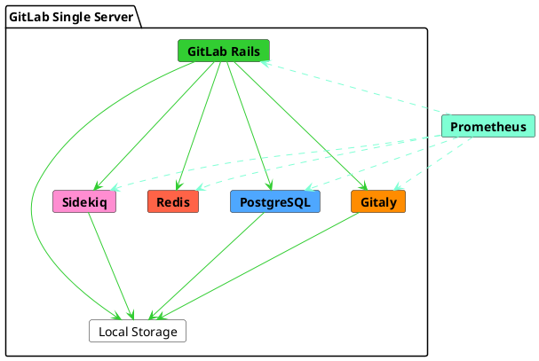



- Niveau :  Free, Premium, Ultimate
- Offre :  GitLab Self-Managed



Cette architecture de référence cible une charge de pointe de 20 requêtes par seconde (RPS). D'après des données réelles, cette charge correspond généralement à jusqu'à 1 000 utilisateurs, incluant les interactions manuelles et automatisées.

Pour une liste complète des architectures de référence, voir [les architectures de référence disponibles](_index.md#available-reference-architectures).

- **Target Load** :  API :  20 RPS, Web :  2 RPS, Git (Pull) :  2 RPS, Git (Push) :  1 RPS
- **High Availability** :  Non. Pour un environnement à haute disponibilité, suivez une [architecture de référence 3K modifiée](3k_users.md#supported-modifications-for-lower-user-counts-ha).
- **Cloud Native Hybrid** :  Non. Pour un environnement cloud native hybrid, vous pouvez suivre une [architecture de référence hybride modifiée](#cloud-native-hybrid-reference-architecture-with-helm-charts).
- **Unsure which Reference Architecture to use** ? Pour plus d'informations, voir [choisir l'architecture avec laquelle commencer](_index.md#deciding-which-architecture-to-start-with).

| Utilisateurs        | Configuration        | Exemple GCP1 | Exemple AWS1 | Exemple Azure1 |
|--------------|----------------------|----------------|--------------|----------|
| Jusqu'à 1 000 ou 20 RPS | 8 vCPU, 16 Go de mémoire | `n1-standard-8`2 | `c5.2xlarge` | `F8s v2` |

**Footnotes** :

<!-- Disable ordered list rule <https://github.com/DavidAnson/markdownlint/blob/main/doc/Rules.md#md029---ordered-list-item-prefix> -->
<!-- markdownlint-disable MD029 -->
1. Les exemples de types de machines sont donnés à titre d'illustration. Ces types sont utilisés dans [la validation et les tests](_index.md#validation-and-test-results) mais ne sont pas destinés à être des valeurs par défaut normatives. Le passage à d'autres types de machines répondant aux exigences listées est pris en charge, y compris les variantes ARM si disponibles. Voir [Types de machines pris en charge](_index.md#supported-machine-types) pour plus d'informations.
2. Pour GCP, le type de machine standard le plus proche et équivalent a été sélectionné pour correspondre à l'exigence recommandée de 8 vCPU et 16 Go de RAM. Un [type de machine personnalisé](https://cloud.google.com/compute/docs/instances/creating-instance-with-custom-machine-type) peut également être utilisé si désiré.
<!-- markdownlint-enable MD029 -->

Le diagramme suivant montre que bien que GitLab puisse être installé sur un seul serveur, il est composé en interne de plusieurs services. Lorsqu'une instance évolue, ces services sont séparés et mis à l'échelle de manière indépendante selon leurs besoins spécifiques.

Dans certains cas, vous pouvez utiliser le PaaS pour certains services. Par exemple, vous pouvez utiliser le stockage d'objets dans le cloud pour certains systèmes de fichiers. Pour des raisons de redondance, certains services deviennent des clusters de nœuds et stockent les mêmes données.

Dans une configuration GitLab mise à l'échelle horizontalement, divers services auxiliaires sont nécessaires pour coordonner les clusters ou découvrir les ressources. Par exemple, PgBouncer pour la gestion des connexions PostgreSQL, ou Consul pour la découverte des points de terminaison Prometheus.

## Prérequis {#requirements}

Avant de continuer, consultez les [prérequis](_index.md#requirements) pour les architectures de référence.

> [!warning]
> Les spécifications du nœud sont basées sur des percentiles élevés des modèles d'utilisation et des tailles de dépôt en bon état. Cependant, si vous avez des [grands monodépôts](_index.md#large-monorepos) (de plusieurs gigaoctets ou plus) ou des [charges de travail supplémentaires](_index.md#additional-workloads), ceux-ci peuvent avoir un impact significatif sur les performances de l'environnement. Si cela s'applique à votre cas, [des ajustements supplémentaires peuvent être nécessaires](_index.md#scaling-an-environment). Consultez la documentation liée et contactez-nous si nécessaire pour obtenir des conseils supplémentaires.

## Méthodologie de test {#testing-methodology}

L'architecture de référence 20 RPS / 1k utilisateurs est conçue pour prendre en charge la plupart des flux de travail courants. GitLab effectue régulièrement des tests de smoke et de performance par rapport aux objectifs de débit des points de terminaison suivants :

| Type de point de terminaison | Débit cible |
| ------------- | ----------------- |
| API           | 20 RPS            |
| Web           | 2 RPS             |
| Git (Pull)    | 2 RPS             |
| Git (Push)    | 1 RPS             |

Ces objectifs sont basés sur des données clients réelles reflétant les charges environnementales totales pour le nombre d'utilisateurs spécifié, y compris les pipelines CI et d'autres charges de travail. Cela représente une composition de charge de travail typique. Pour des conseils sur les modèles de charge de travail atypiques, voir [Comprendre la composition des RPS](sizing.md#understanding-rps-composition-and-workload-patterns).

Pour plus d'informations sur notre méthodologie de test, voir la section [résultats de validation et de test](_index.md#validation-and-test-results).

### Considérations de performance {#performance-considerations}

Des ajustements supplémentaires peuvent être nécessaires si votre environnement présente :

- Un débit constamment supérieur aux objectifs listés
- [Grands monodépôts](_index.md#large-monorepos)
- [Charges de travail supplémentaires](_index.md#additional-workloads) importantes

Dans ces cas, référez-vous à [la mise à l'échelle d'un environnement](_index.md#scaling-an-environment) pour plus d'informations. Si vous pensez que ces considérations peuvent s'appliquer à votre cas, contactez-nous pour obtenir des conseils supplémentaires si nécessaire.

## Instructions d'installation {#setup-instructions}

Pour installer GitLab avec cette architecture de référence par défaut, utilisez les [instructions d'installation](../../install/_index.md) standard.

Vous pouvez également configurer GitLab pour utiliser un [service PostgreSQL externe](../postgresql/external.md) ou un [service de stockage d'objets externe](../object_storage.md). Cela améliore les performances et la fiabilité, mais au prix d'une complexité accrue.

## Configurer la recherche avancée {#configure-advanced-search}



- Niveau :  Premium, Ultimate
- Offre :  GitLab Self-Managed



Vous pouvez utiliser Elasticsearch et [activer la recherche avancée](../../integration/advanced_search/elasticsearch.md) pour une recherche de code plus rapide et plus avancée sur l'ensemble de votre instance GitLab.

La conception et les exigences du cluster Elasticsearch dépendent de vos données. Pour les meilleures pratiques recommandées sur la configuration de votre cluster Elasticsearch aux côtés de votre instance, voir [choisir la configuration de cluster optimale](../../integration/advanced_search/elasticsearch.md#guidance-on-choosing-optimal-cluster-configuration).

## Architecture de référence Cloud Native Hybrid avec Helm Charts {#cloud-native-hybrid-reference-architecture-with-helm-charts}

Dans la configuration d'architecture de référence Cloud Native Hybrid, les composants sans état sélectionnés sont déployés dans Kubernetes à l'aide de nos [Helm Charts](https://docs.gitlab.com/charts/) officiels. Les composants avec état sont déployés dans des VM de calcul avec le package Linux.

La plus petite architecture de référence disponible pour une utilisation dans Kubernetes est le [GitLab Cloud Native Hybrid 2k ou 40 RPS](2k_users.md#cloud-native-hybrid-reference-architecture-with-helm-charts-alternative) (non HA) et le [GitLab Cloud Native Hybrid 3k ou 60 RPS](3k_users.md#cloud-native-hybrid-reference-architecture-with-helm-charts-alternative) (HA).

Pour les environnements qui servent moins d'utilisateurs ou un RPS plus faible, vous pouvez réduire la spécification des nœuds. Selon votre nombre d'utilisateurs, vous pouvez réduire toutes les spécifications de nœuds suggérées selon vos besoins. Cependant, vous ne devez pas descendre en dessous des [exigences générales](../../install/requirements.md).

## Étapes suivantes {#next-steps}

Vous disposez maintenant d'un environnement GitLab tout neuf avec les fonctionnalités principales configurées en conséquence. Vous souhaiterez peut-être configurer des fonctionnalités GitLab supplémentaires et optionnelles en fonction de vos besoins. Voir [Étapes après l'installation de GitLab](../../install/next_steps.md) pour plus d'informations.

> [!note]
> Selon votre environnement et vos besoins, des exigences matérielles supplémentaires ou des ajustements peuvent être nécessaires pour configurer des fonctionnalités supplémentaires. Consultez les pages individuelles pour plus d'informations.
