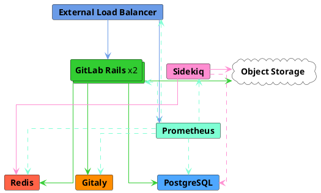
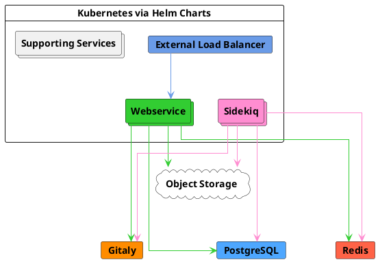



- Niveau :  Free, Premium, Ultimate
- Offre :  GitLab Self-Managed



Cette page décrit l'architecture de référence GitLab conçue pour cibler une charge de pointe de 40 requêtes par seconde (RPS), la charge de pointe typique de jusqu'à 2 000 utilisateurs, manuels et automatisés, basée sur des données réelles.

Pour obtenir la liste complète des architectures de référence, voir [Architectures de référence disponibles](_index.md#available-reference-architectures).

- **Target Load** :  API :  40 RPS, Web :  4 RPS, Git (Pull) :  4 RPS, Git (Push) :  1 RPS
- **High Availability** :  Non. Pour un environnement à haute disponibilité, vous pouvez suivre une [architecture de référence 3K ou 60 RPS](3k_users.md#supported-modifications-for-lower-user-counts-ha) modifiée.
- **Cloud Native Hybrid** :  [Oui](#cloud-native-hybrid-reference-architecture-with-helm-charts-alternative)
- **Unsure which Reference Architecture to use** ? [Consultez ce guide pour plus d'informations](_index.md#deciding-which-architecture-to-start-with).

| Service                            | Nœuds | Configuration          | Exemple GCP<sup>1</sup> | Exemple AWS<sup>1</sup> | Exemple Azure<sup>1</sup> |
|------------------------------------|-------|------------------------|-----------------|--------------|----------|
| Équilibreur de charge externe<sup>4</sup> | 1     | 4 vCPU, 3,6 Go de mémoire  | `n1-highcpu-4`  | `c5n.xlarge` | `F4s v2` |
| PostgreSQL<sup>2</sup>             | 1     | 2 vCPU, 7,5 Go de mémoire  | `n1-standard-2` | `m5.large`   | `D2s v3` |
| Redis<sup>3</sup>                  | 1     | 1 vCPU, 3,75 Go de mémoire | `n1-standard-1` | `m5.large`   | `D2s v3` |
| Gitaly<sup>6</sup>                 | 1     | 4 vCPU, 15 Go de mémoire   | `n1-standard-4` | `m5.xlarge` | `D4s v3` |
| Sidekiq<sup>7</sup>                | 1     | 4 vCPU, 15 Go de mémoire   | `n1-standard-4` | `m5.xlarge`  | `D4s v3` |
| GitLab Rails<sup>7</sup>           | 2     | 8 vCPU, 7,2 Go de mémoire  | `n1-highcpu-8`  | `c5.2xlarge` | `F8s v2` |
| Nœud de surveillance                    | 1     | 2 vCPU, 1,8 Go de mémoire  | `n1-highcpu-2`  | `c5.large`   | `F2s v2` |
| Stockage d'objets<sup>5</sup>         | -     | -                      | -               | -            | -        |

**Footnotes** :

<!-- Disable ordered list rule <https://github.com/DavidAnson/markdownlint/blob/main/doc/Rules.md#md029---ordered-list-item-prefix> -->
<!-- markdownlint-disable MD029 -->
1. Les exemples de types de machines sont fournis à titre d'illustration. Ces types sont utilisés dans [la validation et les tests](_index.md#validation-and-test-results) mais ne sont pas destinés à être des valeurs par défaut prescriptives. Le passage à d'autres types de machines répondant aux exigences listées est pris en charge, y compris les variantes ARM si disponibles. Voir [Types de machines pris en charge](_index.md#supported-machine-types) pour plus d'informations.
2. Peut éventuellement être exécuté sur des solutions PostgreSQL PaaS externes tierces réputées. Voir [Fournir votre propre instance PostgreSQL](#provide-your-own-postgresql-instance) et [Fournisseurs cloud et services recommandés](_index.md#recommended-cloud-providers-and-services) pour plus d'informations.
3. Peut éventuellement être exécuté sur des solutions Redis PaaS externes tierces réputées. Voir [Fournir votre propre instance Redis](#provide-your-own-redis-instance) et [Fournisseurs cloud et services recommandés](_index.md#recommended-cloud-providers-and-services) pour plus d'informations.
4. Il est recommandé de l'exécuter avec un équilibreur de charge ou un service tiers réputé (LB PaaS). Le dimensionnement dépend de l'équilibreur de charge sélectionné et de facteurs supplémentaires tels que la bande passante réseau. Voir [Équilibreurs de charge](_index.md#load-balancers) pour plus d'informations.
5. Doit être exécuté sur des solutions de fournisseur cloud réputées ou auto-gérées. Voir [Configurer le stockage d'objets](#configure-the-object-storage) pour plus d'informations.
6. Les spécifications de Gitaly sont basées sur l'utilisation de dépôts de taille normale en bon état. Cependant, si vous avez de grands monodépôts (supérieurs à plusieurs gigaoctets), cela peut avoir un impact **significantly** sur les performances de Git et de Gitaly, et une augmentation des spécifications sera probablement nécessaire. Référez-vous à [grands monodépôts](_index.md#large-monorepos) pour plus d'informations.
7. Peut être placé dans des groupes de mise à l'échelle automatique (ASG) car le composant ne stocke aucune [donnée avec état](_index.md#autoscaling-of-stateful-nodes). Cependant, les [configurations Cloud Native Hybrid](#cloud-native-hybrid-reference-architecture-with-helm-charts-alternative) sont généralement préférées car certains composants tels que [les migrations](#gitlab-rails-post-configuration) et [Mailroom](../incoming_email.md) ne peuvent être exécutés que sur un seul nœud, ce qui est mieux géré dans Kubernetes.
<!-- markdownlint-enable MD029 -->

> [!note]
> Pour toutes les solutions PaaS impliquant la configuration d'instances, il est recommandé de les déployer sur plusieurs zones de disponibilité à des fins de résilience si souhaité.



## Exigences {#requirements}

Avant de continuer, consultez les [exigences](_index.md#requirements) pour les architectures de référence.

## Méthodologie de test {#testing-methodology}

L'architecture de référence 40 RPS / 2k utilisateurs est conçue pour prendre en charge la plupart des workflows courants. GitLab effectue régulièrement des tests de performance et de vérification par rapport aux objectifs de débit des points de terminaison suivants :

| Type de point de terminaison | Débit cible |
| ------------- | ----------------- |
| API           | 40 RPS            |
| Web           | 4 RPS             |
| Git (Pull)    | 4 RPS             |
| Git (Push)    | 1 RPS             |

Ces cibles sont basées sur des données réelles de clients reflétant les charges environnementales totales pour le nombre d'utilisateurs spécifié, y compris les pipelines CI et autres charges de travail. Cela représente une composition de charge de travail typique. Pour des conseils sur les modèles de charge de travail atypiques, voir [Comprendre la composition RPS](sizing.md#understanding-rps-composition-and-workload-patterns).

Pour plus d'informations sur notre méthodologie de test, consultez la section [résultats de validation et de test](_index.md#validation-and-test-results).

### Considérations de performance {#performance-considerations}

Vous pouvez avoir besoin d'ajustements supplémentaires si votre environnement présente :

- Un débit systématiquement plus élevé que les cibles listées
- [Grands monodépôts](_index.md#large-monorepos)
- [Charges de travail supplémentaires](_index.md#additional-workloads) significatives

Dans ces cas, référez-vous à [la mise à l'échelle d'un environnement](_index.md#scaling-an-environment) pour plus d'informations. Si vous pensez que ces considérations peuvent s'appliquer à vous, contactez-nous pour obtenir des conseils supplémentaires si nécessaire.

### Configuration de l'équilibreur de charge {#load-balancer-configuration}

Notre environnement de test utilise :

- HAProxy pour les environnements de paquets Linux
- Des équivalents de fournisseurs cloud avec une implémentation Gateway API ou Ingress pour les Cloud Native Hybrids

## Configurer les composants {#set-up-components}

Pour configurer GitLab et ses composants afin de prendre en charge jusqu'à 40 RPS ou 2 000 utilisateurs :

1. [Configurer le nœud d'équilibrage de charge externe](#configure-the-external-load-balancer) pour gérer l'équilibrage de charge des nœuds de services d'application GitLab.
1. [Configurer PostgreSQL](#configure-postgresql), la base de données pour GitLab.
1. [Configurer Redis](#configure-redis), qui stocke les données de session, les informations de cache temporaire et les files d'attente de jobs en arrière-plan.
1. [Configurer Gitaly](#configure-gitaly), qui fournit l'accès aux dépôts Git.
1. [Configurer Sidekiq](#configure-sidekiq) pour le traitement des jobs en arrière-plan.
1. [Configurer l'application principale GitLab Rails](#configure-gitlab-rails) pour exécuter Puma, Workhorse, GitLab Shell et pour servir toutes les requêtes frontend (qui incluent l'UI, l'API et Git via HTTP/SSH).
1. [Configurer Prometheus](#configure-prometheus) pour surveiller votre environnement GitLab.
1. [Configurer le stockage d'objets](#configure-the-object-storage) utilisé pour les objets de données partagées.
1. [Configurer la recherche avancée](#configure-advanced-search) (facultatif) pour une recherche de code plus rapide et plus avancée dans toute votre instance GitLab.

## Configurer l'équilibreur de charge externe {#configure-the-external-load-balancer}

Dans une configuration GitLab multi-nœuds, vous aurez besoin d'un équilibreur de charge externe pour acheminer le trafic vers les serveurs d'application.

Les détails concernant l'équilibreur de charge à utiliser ou sa configuration exacte dépassent le cadre de la documentation GitLab, mais référez-vous à [Équilibreurs de charge](_index.md) pour plus d'informations sur les exigences générales. Cette section se concentrera sur les spécificités de ce qu'il faut configurer pour l'équilibreur de charge de votre choix.

### Vérifications de disponibilité {#readiness-checks}

Assurez-vous que l'équilibreur de charge externe n'achemine le trafic que vers les services opérationnels avec des points de terminaison de surveillance intégrés. Les [vérifications de disponibilité](../monitoring/health_check.md) nécessitent toutes une [configuration supplémentaire](../monitoring/ip_allowlist.md) sur les nœuds vérifiés, sinon l'équilibreur de charge externe ne pourra pas se connecter.

### Ports {#ports}

Les ports de base à utiliser sont indiqués dans le tableau ci-dessous.

| Port LB | Port backend | Protocole                 |
| ------- | ------------ | ------------------------ |
| 80      | 80           | HTTP (*1*)               |
| 443     | 443          | TCP ou HTTPS (*1*) (*2*) |
| 22      | 22           | TCP                      |

- (*1*) :  La prise en charge du [terminal web](../../ci/environments/_index.md#web-terminals-deprecated) nécessite que votre équilibreur de charge gère correctement les connexions WebSocket. Lors de l'utilisation du proxy HTTP ou HTTPS, cela signifie que votre équilibreur de charge doit être configuré pour transmettre les en-têtes hop-by-hop `Connection` et `Upgrade`. Consultez le guide d'intégration du [terminal web](../integration/terminal.md) pour plus de détails.
- (*2*) :  Lors de l'utilisation du protocole HTTPS pour le port 443, vous devez ajouter un certificat SSL aux équilibreurs de charge. Si vous souhaitez terminer SSL au niveau du serveur d'application GitLab à la place, utilisez le protocole TCP.

Si vous utilisez GitLab Pages avec la prise en charge des domaines personnalisés, vous aurez besoin de configurations de ports supplémentaires. GitLab Pages nécessite une adresse IP virtuelle séparée. Configurez le DNS pour faire pointer `pages_external_url` depuis `/etc/gitlab/gitlab.rb` vers la nouvelle adresse IP virtuelle. Consultez la [documentation GitLab Pages](../pages/_index.md) pour plus d'informations.

| Port LB | Port backend  | Protocole  |
| ------- | ------------- | --------- |
| 80      | Variable (*1*)  | HTTP      |
| 443     | Variable (*1*)  | TCP (*2*) |

- (*1*) :  Le port backend pour GitLab Pages dépend des paramètres `gitlab_pages['external_http']` et `gitlab_pages['external_https']`. Voir la [documentation GitLab Pages](../pages/_index.md) pour plus de détails.
- (*2*) :  Le port 443 pour GitLab Pages doit toujours utiliser le protocole TCP. Les utilisateurs peuvent configurer des domaines personnalisés avec un SSL personnalisé, ce qui ne serait pas possible si SSL était terminé au niveau de l'équilibreur de charge.

#### Port SSH alternatif {#alternate-ssh-port}

Certaines organisations ont des politiques contre l'ouverture du port SSH 22. Dans ce cas, il peut être utile de configurer un nom d'hôte SSH alternatif qui permet aux utilisateurs d'utiliser SSH sur le port 443. Un nom d'hôte SSH alternatif nécessitera une nouvelle adresse IP virtuelle par rapport à la configuration HTTP GitLab documentée précédemment.

Configurez le DNS pour un nom d'hôte SSH alternatif tel que `altssh.gitlab.example.com`.

| Port LB | Port backend | Protocole |
| ------- | ------------ | -------- |
| 443     | 22           | TCP      |

### SSL {#ssl}

La question suivante est de savoir comment vous allez gérer SSL dans votre environnement. Il existe plusieurs options différentes :

- [Le nœud d'application termine SSL](#application-node-terminates-ssl).
- [L'équilibreur de charge termine SSL sans SSL backend](#load-balancer-terminates-ssl-without-backend-ssl) et la communication n'est pas sécurisée entre l'équilibreur de charge et le nœud d'application.
- [L'équilibreur de charge termine SSL avec SSL backend](#load-balancer-terminates-ssl-with-backend-ssl) et la communication est sécurisée entre l'équilibreur de charge et le nœud d'application.

#### Le nœud d'application termine SSL {#application-node-terminates-ssl}

Configurez votre équilibreur de charge pour transmettre les connexions sur le port 443 en tant que protocole `TCP` plutôt que `HTTP(S)`. Cela transmettra la connexion au service NGINX du nœud d'application sans modification. NGINX disposera du certificat SSL et écoutera sur le port 443.

Consultez la [documentation HTTPS](https://docs.gitlab.com/omnibus/settings/ssl/) pour plus de détails sur la gestion des certificats SSL et la configuration de NGINX.

#### L'équilibreur de charge termine SSL sans SSL backend {#load-balancer-terminates-ssl-without-backend-ssl}

Configurez votre équilibreur de charge pour utiliser le protocole `HTTP(S)` plutôt que `TCP`. L'équilibreur de charge sera alors responsable de la gestion des certificats SSL et de la terminaison SSL.

Étant donné que la communication entre l'équilibreur de charge et GitLab ne sera pas sécurisée, une configuration supplémentaire est nécessaire. Consultez la [documentation SSL proxifié](https://docs.gitlab.com/omnibus/settings/ssl/#configure-a-reverse-proxy-or-load-balancer-ssl-termination) pour plus de détails.

#### L'équilibreur de charge termine SSL avec SSL backend {#load-balancer-terminates-ssl-with-backend-ssl}

Configurez vos équilibreurs de charge pour utiliser le protocole 'HTTP(S)' plutôt que 'TCP'. Les équilibreurs de charge seront responsables de la gestion des certificats SSL que les utilisateurs finaux verront.

Le trafic sera également sécurisé entre les équilibreurs de charge et NGINX dans ce scénario. Il n'est pas nécessaire d'ajouter une configuration pour le SSL proxifié car la connexion sera sécurisée de bout en bout. Cependant, une configuration doit être ajoutée à GitLab pour configurer les certificats SSL. Consultez la [documentation HTTPS](https://docs.gitlab.com/omnibus/settings/ssl/) pour plus de détails sur la gestion des certificats SSL et la configuration de NGINX.

<div align="right">
  <a type="button" class="btn btn-default" href="#set-up-components"> Retour à la configuration des composants <i class="fa fa-angle-double-up" aria-hidden="true"></i> </a>
</div>

## Configurer PostgreSQL {#configure-postgresql}

Dans cette section, vous serez guidé dans la configuration d'une base de données PostgreSQL externe à utiliser avec GitLab.

### Fournir votre propre instance PostgreSQL {#provide-your-own-postgresql-instance}

Au lieu des composants PostgreSQL, PgBouncer et Consul de découverte de services fournis avec le paquet Linux, vous pouvez utiliser un [service externe tiers pour PostgreSQL](../postgresql/external.md).

Utilisez un fournisseur réputé qui exécute une [version PostgreSQL prise en charge](../../install/requirements.md#postgresql). Ces services sont connus pour bien fonctionner :

- [Google Cloud SQL](https://cloud.google.com/sql/docs/postgres/high-availability#normal).
- [Amazon RDS](https://aws.amazon.com/rds/).

Pour plus d'informations, notamment sur la haute disponibilité et l'équilibrage de charge des bases de données, voir :

- [Fournisseurs cloud et services recommandés](_index.md#recommended-cloud-providers-and-services).
- [Bonnes pratiques pour les services de base de données](_index.md#best-practices-for-the-database-services).

Si vous utilisez un service externe tiers :

1. Configurez PostgreSQL conformément au [document sur les exigences de la base de données](../../install/requirements.md#postgresql).
1. Configurez les [utilisateurs et bases de données](../postgresql/external.md) requis.
1. Configurez les serveurs d'application GitLab avec les détails de connexion appropriés en suivant [configurer GitLab Rails](#configure-gitlab-rails).

### PostgreSQL autonome utilisant le paquet Linux {#standalone-postgresql-using-the-linux-package}

1. Connectez-vous en SSH au serveur PostgreSQL.
1. [Téléchargez et installez](../../install/package/_index.md#supported-platforms) le paquet Linux de votre choix. Veillez à n'ajouter que le référentiel de paquets GitLab et à installer GitLab pour le système d'exploitation de votre choix.
1. Générez un hash de mot de passe pour PostgreSQL. Cela suppose que vous utiliserez le nom d'utilisateur par défaut `gitlab` (recommandé). La commande demandera un mot de passe et une confirmation. Utilisez la valeur générée par cette commande à l'étape suivante comme valeur de `POSTGRESQL_PASSWORD_HASH`.

   ```shell
   sudo gitlab-ctl pg-password-md5 gitlab
   ```

1. Modifiez `/etc/gitlab/gitlab.rb` et ajoutez le contenu ci-dessous en mettant à jour les valeurs de remplacement de manière appropriée.

   - `POSTGRESQL_PASSWORD_HASH` - La valeur générée à l'étape précédente
   - `APPLICATION_SERVER_IP_BLOCKS` - Une liste délimitée par des espaces de sous-réseaux IP ou d'adresses IP des serveurs GitLab Rails et Sidekiq qui se connecteront à la base de données. Exemple : `%w(123.123.123.123/32 123.123.123.234/32)`

   ```ruby
   # Disable all components except PostgreSQL related ones
   roles(['postgres_role'])

   # Set the network addresses that the exporters used for monitoring will listen on
   node_exporter['listen_address'] = '0.0.0.0:9100'
   postgres_exporter['listen_address'] = '0.0.0.0:9187'
   postgres_exporter['dbname'] = 'gitlabhq_production'
   postgres_exporter['password'] = 'POSTGRESQL_PASSWORD_HASH'

   # Set the PostgreSQL address and port
   postgresql['listen_address'] = '0.0.0.0'
   postgresql['port'] = 5432

   # Replace POSTGRESQL_PASSWORD_HASH with a generated md5 value
   postgresql['sql_user_password'] = 'POSTGRESQL_PASSWORD_HASH'

   # Replace APPLICATION_SERVER_IP_BLOCK with the CIDR address of the application node
   postgresql['trust_auth_cidr_addresses'] = %w(127.0.0.1/32 APPLICATION_SERVER_IP_BLOCK)

   # Prevent database migrations from running on upgrade automatically
   gitlab_rails['auto_migrate'] = false
   ```

1. Copiez le fichier `/etc/gitlab/gitlab-secrets.json` depuis le premier nœud de paquet Linux que vous avez configuré et ajoutez-le ou remplacez-le par le fichier du même nom sur ce serveur. S'il s'agit du premier paquet Linux que vous configurez, vous pouvez ignorer cette étape.
1. [Reconfigurez GitLab](../restart_gitlab.md#reconfigure-a-linux-package-installation) pour que les modifications prennent effet.
1. Notez l'adresse IP ou le nom d'hôte, le port et le mot de passe en texte clair du nœud PostgreSQL. Ces détails sont nécessaires lors de la configuration du [serveur d'application GitLab](#configure-gitlab-rails) ultérieurement.

Les [options de configuration](https://docs.gitlab.com/omnibus/settings/database/) avancées sont prises en charge et peuvent être ajoutées si nécessaire.

<div align="right">
  <a type="button" class="btn btn-default" href="#set-up-components"> Retour à la configuration des composants <i class="fa fa-angle-double-up" aria-hidden="true"></i> </a>
</div>

## Configurer Redis {#configure-redis}

Dans cette section, vous serez guidé dans la configuration d'une instance Redis externe à utiliser avec GitLab.

> [!note]
> Redis est principalement mono-thread et ne bénéficie pas significativement d'une augmentation des cœurs CPU. Référez-vous à la [documentation sur la mise à l'échelle](_index.md#scaling-an-environment) pour plus d'informations.

### Fournir votre propre instance Redis {#provide-your-own-redis-instance}

Vous pouvez éventuellement utiliser un [service externe tiers pour l'instance Redis](../redis/replication_and_failover_external.md#redis-as-a-managed-service-in-a-cloud-provider) avec les conseils suivants :

- Un fournisseur ou une solution réputé(e) doit être utilisé(e) pour cela. [Google Memorystore](https://cloud.google.com/memorystore/docs/redis/memorystore-for-redis-overview) et [AWS ElastiCache](https://docs.aws.amazon.com/AmazonElastiCache/latest/red-ug/WhatIs.html) sont connus pour fonctionner.
- Le mode Redis Cluster n'est spécifiquement pas pris en charge, mais Redis Standalone avec HA l'est.
- Vous devez définir le [mode d'éviction Redis](../redis/replication_and_failover_external.md#setting-the-eviction-policy) en fonction de votre configuration.

Pour plus d'informations, voir [Fournisseurs cloud et services recommandés](_index.md#recommended-cloud-providers-and-services).

### Redis autonome utilisant le paquet Linux {#standalone-redis-using-the-linux-package}

Le paquet Linux peut être utilisé pour configurer un serveur Redis autonome. Les étapes ci-dessous sont le minimum nécessaire pour configurer un serveur Redis avec le paquet Linux :

1. Connectez-vous en SSH au serveur Redis.
1. [Téléchargez et installez](../../install/package/_index.md#supported-platforms) le paquet Linux de votre choix. Veillez à n'ajouter que le référentiel de paquets GitLab et à installer GitLab pour le système d'exploitation de votre choix.
1. Modifiez `/etc/gitlab/gitlab.rb` et ajoutez le contenu :

   ```ruby
   ## Enable Redis
   roles(["redis_master_role"])

   redis['bind'] = '0.0.0.0'
   redis['port'] = 6379
   redis['password'] = 'SECRET_PASSWORD_HERE'

   # Set the network addresses that the exporters used for monitoring will listen on
   node_exporter['listen_address'] = '0.0.0.0:9100'
   redis_exporter['listen_address'] = '0.0.0.0:9121'

   # Prevent database migrations from running on upgrade automatically
   gitlab_rails['auto_migrate'] = false
   ```

1. Copiez le fichier `/etc/gitlab/gitlab-secrets.json` depuis le premier nœud de paquet Linux que vous avez configuré et ajoutez-le ou remplacez-le par le fichier du même nom sur ce serveur. S'il s'agit du premier nœud de paquet Linux que vous configurez, vous pouvez ignorer cette étape.
1. [Reconfigurez GitLab](../restart_gitlab.md#reconfigure-a-linux-package-installation) pour que les modifications prennent effet.
1. Notez l'adresse IP ou le nom d'hôte, le port et le mot de passe Redis du nœud Redis. Ces informations seront nécessaires lors de la [configuration des serveurs d'application GitLab](#configure-gitlab-rails) ultérieurement.

Les [options de configuration](https://docs.gitlab.com/omnibus/settings/redis/) avancées sont prises en charge et peuvent être ajoutées si nécessaire.

<div align="right">
  <a type="button" class="btn btn-default" href="#set-up-components"> Retour à la configuration des composants <i class="fa fa-angle-double-up" aria-hidden="true"></i> </a>
</div>

## Configurer Gitaly {#configure-gitaly}

Les exigences en matière de nœuds serveur [Gitaly](../gitaly/_index.md) dépendent de la taille des données, notamment du nombre de projets et de la taille de ces projets.

> [!warning]
> Les spécifications de Gitaly sont basées sur des percentiles élevés des modèles d'utilisation et des tailles de dépôts en bon état. Cependant, si vous avez des [grands monodépôts](_index.md#large-monorepos) (supérieurs à plusieurs gigaoctets) ou des [charges de travail supplémentaires](_index.md#additional-workloads), cela peut avoir un impact significatif sur les performances de l'environnement et des ajustements supplémentaires peuvent être nécessaires. Si vous pensez que cela s'applique à vous, contactez-nous pour obtenir des conseils supplémentaires si nécessaire.

Gitaly a certaines [exigences en matière de disque](../gitaly/_index.md#disk-requirements) pour les stockages Gitaly.

Assurez-vous de noter les éléments suivants :

- L'application GitLab Rails partitionne les dépôts en [chemins de stockage de dépôts](../repository_storage_paths.md).
- Un serveur Gitaly peut héberger un ou plusieurs chemins de stockage.
- Un serveur GitLab peut utiliser un ou plusieurs nœuds serveur Gitaly.
- Les adresses Gitaly doivent être spécifiées pour être correctement résolvables par tous les clients Gitaly.
- Les serveurs Gitaly ne doivent pas être exposés à l'internet public car le trafic réseau sur Gitaly est non chiffré par défaut. L'utilisation d'un pare-feu est fortement recommandée pour restreindre l'accès au serveur Gitaly. Une autre option consiste à [utiliser TLS](#gitaly-tls-support).

> [!note]
> Le jeton mentionné tout au long de la documentation Gitaly est un mot de passe arbitraire sélectionné par l'administrateur. Ce jeton est sans rapport avec les jetons créés pour l'API GitLab ou d'autres jetons d'API web similaires.

La procédure suivante décrit comment configurer un seul serveur Gitaly nommé `gitaly1.internal` avec le jeton secret `gitalysecret`. Nous supposons que votre installation GitLab dispose de deux stockages de dépôts : `default` et `storage1`.

Pour configurer le serveur Gitaly, sur le nœud serveur que vous souhaitez utiliser pour Gitaly :

1. [Téléchargez et installez](../../install/package/_index.md#supported-platforms) le paquet Linux de votre choix. Veillez à n'ajouter que le référentiel de paquets GitLab et à installer GitLab pour le système d'exploitation de votre choix, mais ne fournissez **not** la valeur `EXTERNAL_URL`.
1. Modifiez le fichier `/etc/gitlab/gitlab.rb` du nœud serveur Gitaly pour configurer les chemins de stockage, activer l'écouteur réseau et configurer le jeton :

   > [!note]
   > Vous ne pouvez pas supprimer l'entrée `default` de `gitaly['configuration'][:storage]` car [GitLab l'exige](../gitaly/configure_gitaly.md#gitlab-requires-a-default-repository-storage).

   <!--
   Updates to example must be made at:

   - <https://gitlab.com/gitlab-org/charts/gitlab/blob/master/doc/advanced/external-gitaly/external-omnibus-gitaly.md#configure-linux-package-installation>
   - <https://gitlab.com/gitlab-org/gitlab/-/blob/master/doc/administration/gitaly/configure_gitaly.md#configure-gitaly-server>
   - All reference architecture pages
   -->

   ```ruby
   # https://docs.gitlab.com/omnibus/roles/#gitaly-roles
   roles(["gitaly_role"])

   # Prevent database migrations from running on upgrade automatically
   gitlab_rails['auto_migrate'] = false

   # Configure the gitlab-shell API callback URL. Without this, `git push` will
   # fail. This can be your 'front door' GitLab URL or an internal load
   # balancer.
   gitlab_rails['internal_api_url'] = 'https://gitlab.example.com'

   # Set the network addresses that the exporters used for monitoring will listen on
   node_exporter['listen_address'] = '0.0.0.0:9100'

   gitaly['configuration'] = {
      # ...
      #
      # Make Gitaly accept connections on all network interfaces. You must use
      # firewalls to restrict access to this address/port.
      # Comment out following line if you only want to support TLS connections
      listen_addr: '0.0.0.0:8075',
      prometheus_listen_addr: '0.0.0.0:9236',
      # Gitaly Auth Token
      # Should be the same as praefect_internal_token
      auth: {
         # ...
         #
         # Gitaly's authentication token is used to authenticate gRPC requests to Gitaly. This must match
         # the respective value in GitLab Rails application setup.
         token: 'gitalysecret',
      },
      # Gitaly Pack-objects cache
      # Recommended to be enabled for improved performance but can notably increase disk I/O
      # Refer to https://docs.gitlab.com/administration/gitaly/configure_gitaly/#pack-objects-cache for more info
      pack_objects_cache: {
         # ...
         enabled: true,
      },
      storage: [
         {
            name: 'default',
            path: '/var/opt/gitlab/git-data/repositories',
         },
         {
            name: 'storage1',
            path: '/mnt/gitlab/git-data',
         },
      ],
   }
   ```

1. Copiez le fichier `/etc/gitlab/gitlab-secrets.json` depuis le premier nœud de paquet Linux que vous avez configuré et ajoutez-le ou remplacez-le par le fichier du même nom sur ce serveur. S'il s'agit du premier nœud de paquet Linux que vous configurez, vous pouvez ignorer cette étape.
1. [Reconfigurez GitLab](../restart_gitlab.md#reconfigure-a-linux-package-installation) pour que les modifications prennent effet.
1. Confirmez que Gitaly peut effectuer des rappels vers l'API interne :
   - Pour GitLab 15.3 et versions ultérieures, exécutez `sudo -u git -- /opt/gitlab/embedded/bin/gitaly check /var/opt/gitlab/gitaly/config.toml`.
   - Pour GitLab 15.2 et versions antérieures, exécutez `sudo -u git -- /opt/gitlab/embedded/bin/gitaly-hooks check /var/opt/gitlab/gitaly/config.toml`.

### Prise en charge TLS pour Gitaly {#gitaly-tls-support}

Gitaly prend en charge le chiffrement TLS. Pour communiquer avec une instance Gitaly qui écoute les connexions sécurisées, vous devez utiliser le schéma d'URL `tls://` dans le `gitaly_address` de l'entrée de stockage correspondante dans la configuration GitLab.

Vous devez fournir vos propres certificats car cela n'est pas fourni automatiquement. Le certificat, ou son autorité de certification, doit être installé sur tous les nœuds Gitaly (y compris le nœud Gitaly utilisant le certificat) et sur tous les nœuds clients qui communiquent avec lui en suivant la procédure décrite dans [Configuration des certificats personnalisés GitLab](https://docs.gitlab.com/omnibus/settings/ssl/#install-custom-public-certificates).

> [!note]
> Le certificat auto-signé doit spécifier l'adresse que vous utilisez pour accéder au serveur Gitaly. Si vous accédez au serveur Gitaly par un nom d'hôte, ajoutez-le en tant que Subject Alternative Name. Si vous accédez au serveur Gitaly par son adresse IP, vous devez l'ajouter en tant que Subject Alternative Name au certificat.

Il est possible de configurer les serveurs Gitaly avec à la fois une adresse d'écoute non chiffrée (`listen_addr`) et une adresse d'écoute chiffrée (`tls_listen_addr`) en même temps. Cela vous permet d'effectuer une transition progressive du trafic non chiffré vers le trafic chiffré, si nécessaire.

Pour configurer Gitaly avec TLS :

1. Créez le répertoire `/etc/gitlab/ssl` et copiez-y votre clé et votre certificat :

   ```shell
   sudo mkdir -p /etc/gitlab/ssl
   sudo chmod 755 /etc/gitlab/ssl
   sudo cp key.pem cert.pem /etc/gitlab/ssl/
   sudo chmod 644 key.pem cert.pem
   ```

1. Copiez le certificat dans `/etc/gitlab/trusted-certs` afin que Gitaly fasse confiance au certificat lorsqu'il s'appelle lui-même :

   ```shell
   sudo cp /etc/gitlab/ssl/cert.pem /etc/gitlab/trusted-certs/
   ```

1. Modifiez `/etc/gitlab/gitlab.rb` et ajoutez :

   <!-- Updates to following example must also be made at <https://gitlab.com/gitlab-org/charts/gitlab/blob/master/doc/advanced/external-gitaly/external-omnibus-gitaly.md#configure-omnibus-gitlab> -->

   ```ruby
   gitaly['configuration'] = {
      # ...
      tls_listen_addr: '0.0.0.0:9999',
      tls: {
         certificate_path: '/etc/gitlab/ssl/cert.pem',
         key_path: '/etc/gitlab/ssl/key.pem',
      },
   }
   ```

1. Supprimez `gitaly['listen_addr']` pour n'autoriser que les connexions chiffrées.
1. Enregistrez le fichier et [reconfigurez GitLab](../restart_gitlab.md#reconfigure-a-linux-package-installation).

<div align="right">
  <a type="button" class="btn btn-default" href="#set-up-components"> Retour à la configuration des composants <i class="fa fa-angle-double-up" aria-hidden="true"></i> </a>
</div>

## Configurer Sidekiq {#configure-sidekiq}

Sidekiq nécessite une connexion aux instances [Redis](#configure-redis), [PostgreSQL](#configure-postgresql) et [Gitaly](#configure-gitaly). Il nécessite également une connexion au [stockage d'objets](#configure-the-object-storage) comme recommandé.

Si vous constatez que le traitement des jobs Sidekiq de l'environnement est lent avec de longues files d'attente, vous pouvez le mettre à l'échelle en conséquence. Référez-vous à la [documentation sur la mise à l'échelle](_index.md#scaling-an-environment) pour plus d'informations.

Lors de la configuration de fonctionnalités GitLab supplémentaires telles que le registre de conteneurs, SAML ou LDAP, mettez à jour la configuration Sidekiq en plus de la configuration Rails. Référez-vous à la [documentation Sidekiq externe](../sidekiq/_index.md) pour plus d'informations.

Pour configurer le serveur Sidekiq, sur le nœud serveur que vous souhaitez utiliser pour Sidekiq :

1. Connectez-vous en SSH au serveur Sidekiq.
1. Confirmez que vous pouvez accéder aux ports PostgreSQL, Gitaly et Redis :

   ```shell
   telnet <GitLab host> 5432 # PostgreSQL
   telnet <GitLab host> 8075 # Gitaly
   telnet <GitLab host> 6379 # Redis
   ```

1. [Téléchargez et installez](../../install/package/_index.md#supported-platforms) le paquet Linux de votre choix. Veillez à n'ajouter que le référentiel de paquets GitLab et à installer GitLab pour le système d'exploitation de votre choix.
1. Créez ou modifiez `/etc/gitlab/gitlab.rb` et utilisez la configuration suivante :

   ```ruby
   # https://docs.gitlab.com/omnibus/roles/#sidekiq-roles
   roles(["sidekiq_role"])

   # External URL
   external_url 'https://gitlab.example.com'

   ## Redis connection details
   gitlab_rails['redis_port'] = '6379'
   gitlab_rails['redis_host'] = '10.1.0.6' # IP/hostname of Redis server
   gitlab_rails['redis_password'] = 'Redis Password'

   # Gitaly and GitLab use two shared secrets for authentication, one to authenticate gRPC requests
   # to Gitaly, and a second stored in /etc/gitlab/gitlab-secrets.json for authentication callbacks from GitLab-Shell to the GitLab internal API.
   # The following must be the same as their respective values
   # of the Gitaly setup
   gitlab_rails['gitaly_token'] = 'gitalysecret'

   gitlab_rails['repositories_storages'] = {
     'default' => { 'gitaly_address' => 'tcp://gitaly1.internal:8075' },
     'storage1' => { 'gitaly_address' => 'tcp://gitaly1.internal:8075' },
     'storage2' => { 'gitaly_address' => 'tcp://gitaly2.internal:8075' },
   }

   ## PostgreSQL connection details
   gitlab_rails['db_adapter'] = 'postgresql'
   gitlab_rails['db_encoding'] = 'unicode'
   gitlab_rails['db_host'] = '10.1.0.5' # IP/hostname of database server
   gitlab_rails['db_password'] = 'DB password'

   ## Prevent database migrations from running on upgrade automatically
   gitlab_rails['auto_migrate'] = false

   # Sidekiq
   sidekiq['listen_address'] = "0.0.0.0"

   ## Set number of Sidekiq queue processes to the same number as available CPUs
   sidekiq['queue_groups'] = ['*'] * 4

   ## Set the network addresses that the exporters will listen on
   node_exporter['listen_address'] = '0.0.0.0:9100'

   # Object Storage
   ## This is an example for configuring Object Storage on GCP
   ## Replace this config with your chosen Object Storage provider as desired
   gitlab_rails['object_store']['enabled'] = true
   gitlab_rails['object_store']['connection'] = {
     'provider' => 'Google',
     'google_project' => '<gcp-project-name>',
     'google_json_key_location' => '<path-to-gcp-service-account-key>'
   }
   gitlab_rails['object_store']['objects']['artifacts']['bucket'] = "<gcp-artifacts-bucket-name>"
   gitlab_rails['object_store']['objects']['external_diffs']['bucket'] = "<gcp-external-diffs-bucket-name>"
   gitlab_rails['object_store']['objects']['lfs']['bucket'] = "<gcp-lfs-bucket-name>"
   gitlab_rails['object_store']['objects']['uploads']['bucket'] = "<gcp-uploads-bucket-name>"
   gitlab_rails['object_store']['objects']['packages']['bucket'] = "<gcp-packages-bucket-name>"
   gitlab_rails['object_store']['objects']['dependency_proxy']['bucket'] = "<gcp-dependency-proxy-bucket-name>"
   gitlab_rails['object_store']['objects']['terraform_state']['bucket'] = "<gcp-terraform-state-bucket-name>"

   gitlab_rails['backup_upload_connection'] = {
     'provider' => 'Google',
     'google_project' => '<gcp-project-name>',
     'google_json_key_location' => '<path-to-gcp-service-account-key>'
   }
   gitlab_rails['backup_upload_remote_directory'] = "<gcp-backups-state-bucket-name>"
   gitlab_rails['ci_secure_files_object_store_enabled'] = true
   gitlab_rails['ci_secure_files_object_store_remote_directory'] = "<gcp-ci_secure_files-bucket-name>"

   gitlab_rails['ci_secure_files_object_store_connection'] = {
      'provider' => 'Google',
      'google_project' => '<gcp-project-name>',
      'google_json_key_location' => '<path-to-gcp-service-account-key>'
   }
   ```

1. Copiez le fichier `/etc/gitlab/gitlab-secrets.json` depuis le premier nœud de paquet Linux que vous avez configuré et ajoutez-le ou remplacez-le par le fichier du même nom sur ce serveur. S'il s'agit du premier nœud de paquet Linux que vous configurez, vous pouvez ignorer cette étape.
1. Pour vous assurer que les migrations de base de données ne sont exécutées que lors de la reconfiguration et non automatiquement lors de la mise à niveau, exécutez :

   ```shell
   sudo touch /etc/gitlab/skip-auto-reconfigure
   ```

   Un seul nœud désigné doit gérer les migrations comme indiqué dans la section [Post-configuration de GitLab Rails](#gitlab-rails-post-configuration).
1. Enregistrez le fichier et [reconfigurez GitLab](../restart_gitlab.md#reconfigure-a-linux-package-installation).
1. Vérifiez que les services GitLab sont en cours d'exécution :

   ```shell
   sudo gitlab-ctl status
   ```

   La sortie devrait être similaire à la suivante :

   ```plaintext
   run: logrotate: (pid 192292) 2990s; run: log: (pid 26374) 93048s
   run: node-exporter: (pid 26864) 92997s; run: log: (pid 26446) 93036s
   run: sidekiq: (pid 26870) 92996s; run: log: (pid 26391) 93042s
   ```

<div align="right">
  <a type="button" class="btn btn-default" href="#set-up-components"> Retour à la configuration des composants <i class="fa fa-angle-double-up" aria-hidden="true"></i> </a>
</div>

## Configurer GitLab Rails {#configure-gitlab-rails}

Cette section décrit comment configurer le composant d'application GitLab (Rails).

Dans notre architecture, nous exécutons chaque nœud GitLab Rails en utilisant le serveur web Puma, avec son nombre de workers défini à 90 % des CPU disponibles et quatre threads. Pour les nœuds exécutant Rails avec d'autres composants, la valeur des workers doit être réduite en conséquence. Nous avons déterminé qu'une valeur de workers de 50 % permet un bon équilibre, mais cela dépend de la charge de travail.

Sur chaque nœud, effectuez les opérations suivantes :

1. [Téléchargez et installez](../../install/package/_index.md#supported-platforms) le paquet Linux de votre choix. Veillez à n'ajouter que le référentiel de paquets GitLab et à installer GitLab pour le système d'exploitation de votre choix.
1. Créez ou modifiez `/etc/gitlab/gitlab.rb` et utilisez la configuration suivante. Pour maintenir l'uniformité des liens entre les nœuds, le `external_url` sur le serveur d'application doit pointer vers l'URL externe que les utilisateurs utiliseront pour accéder à GitLab. Il s'agirait de l'URL de l'[équilibreur de charge](#configure-the-external-load-balancer) qui acheminera le trafic vers le serveur d'application GitLab :

   ```ruby
   external_url 'https://gitlab.example.com'

   # Gitaly and GitLab use two shared secrets for authentication, one to authenticate gRPC requests
   # to Gitaly, and a second stored in /etc/gitlab/gitlab-secrets.json for authentication callbacks from GitLab-Shell to the GitLab internal API.
   # The following must be the same as their respective values
   # of the Gitaly setup
   gitlab_rails['gitaly_token'] = 'gitalysecret'

   gitlab_rails['repositories_storages'] = {
     'default' => { 'gitaly_address' => 'tcp://gitaly1.internal:8075' },
     'storage1' => { 'gitaly_address' => 'tcp://gitaly1.internal:8075' },
     'storage2' => { 'gitaly_address' => 'tcp://gitaly2.internal:8075' },
   }

   ## Disable components that will not be on the GitLab application server
   roles(['application_role'])
   gitaly['enable'] = false
   sidekiq['enable'] = false

   ## PostgreSQL connection details
   gitlab_rails['db_adapter'] = 'postgresql'
   gitlab_rails['db_encoding'] = 'unicode'
   gitlab_rails['db_host'] = '10.1.0.5' # IP/hostname of database server
   gitlab_rails['db_password'] = 'DB password'

   ## Redis connection details
   gitlab_rails['redis_port'] = '6379'
   gitlab_rails['redis_host'] = '10.1.0.6' # IP/hostname of Redis server
   gitlab_rails['redis_password'] = 'Redis Password'

   # Set the network addresses that the exporters used for monitoring will listen on
   node_exporter['listen_address'] = '0.0.0.0:9100'
   gitlab_workhorse['prometheus_listen_addr'] = '0.0.0.0:9229'
   puma['listen'] = '0.0.0.0'

   # Add the monitoring node's IP address to the monitoring whitelist and allow it to
   # scrape the NGINX metrics. Replace placeholder `monitoring.gitlab.example.com` with
   # the address and/or subnets gathered from the monitoring node
   gitlab_rails['monitoring_whitelist'] = ['<MONITOR NODE IP>/32', '127.0.0.0/8']
   nginx['status']['options']['allow'] = ['<MONITOR NODE IP>/32', '127.0.0.0/8']

   # Object Storage
   # This is an example for configuring Object Storage on GCP
   # Replace this config with your chosen Object Storage provider as desired
   gitlab_rails['object_store']['enabled'] = true
   gitlab_rails['object_store']['connection'] = {
     'provider' => 'Google',
     'google_project' => '<gcp-project-name>',
     'google_json_key_location' => '<path-to-gcp-service-account-key>'
   }
   gitlab_rails['object_store']['objects']['artifacts']['bucket'] = "<gcp-artifacts-bucket-name>"
   gitlab_rails['object_store']['objects']['external_diffs']['bucket'] = "<gcp-external-diffs-bucket-name>"
   gitlab_rails['object_store']['objects']['lfs']['bucket'] = "<gcp-lfs-bucket-name>"
   gitlab_rails['object_store']['objects']['uploads']['bucket'] = "<gcp-uploads-bucket-name>"
   gitlab_rails['object_store']['objects']['packages']['bucket'] = "<gcp-packages-bucket-name>"
   gitlab_rails['object_store']['objects']['dependency_proxy']['bucket'] = "<gcp-dependency-proxy-bucket-name>"
   gitlab_rails['object_store']['objects']['terraform_state']['bucket'] = "<gcp-terraform-state-bucket-name>"

   gitlab_rails['backup_upload_connection'] = {
     'provider' => 'Google',
     'google_project' => '<gcp-project-name>',
     'google_json_key_location' => '<path-to-gcp-service-account-key>'
   }
   gitlab_rails['backup_upload_remote_directory'] = "<gcp-backups-state-bucket-name>"

   gitlab_rails['ci_secure_files_object_store_enabled'] = true
   gitlab_rails['ci_secure_files_object_store_remote_directory'] = "<gcp-ci_secure_files-bucket-name>"

   gitlab_rails['ci_secure_files_object_store_connection'] = {
      'provider' => 'Google',
      'google_project' => '<gcp-project-name>',
      'google_json_key_location' => '<path-to-gcp-service-account-key>'
   }

   ## Uncomment and edit the following options if you have set up NFS
   ##
   ## Prevent GitLab from starting if NFS data mounts are not available
   ##
   #high_availability['mountpoint'] = '/var/opt/gitlab/git-data'
   ##
   ## Ensure UIDs and GIDs match between servers for permissions via NFS
   ##
   #user['uid'] = 9000
   #user['gid'] = 9000
   #web_server['uid'] = 9001
   #web_server['gid'] = 9001
   #registry['uid'] = 9002
   #registry['gid'] = 9002
   ```

1. Si vous utilisez [Gitaly avec la prise en charge TLS](#gitaly-tls-support), assurez-vous que l'entrée `gitlab_rails['repositories_storages']` est configurée avec `tls` au lieu de `tcp` :

   ```ruby
   gitlab_rails['repositories_storages'] = {
     'default' => { 'gitaly_address' => 'tls://gitaly1.internal:9999' },
     'storage1' => { 'gitaly_address' => 'tls://gitaly1.internal:9999' },
     'storage2' => { 'gitaly_address' => 'tls://gitaly2.internal:9999' },
   }
   ```

   1. Copiez le certificat dans `/etc/gitlab/trusted-certs` :

      ```shell
      sudo cp cert.pem /etc/gitlab/trusted-certs/
      ```

1. Copiez le fichier `/etc/gitlab/gitlab-secrets.json` depuis le premier nœud de paquet Linux que vous avez configuré et ajoutez-le ou remplacez-le par le fichier du même nom sur ce serveur. S'il s'agit du premier nœud de paquet Linux que vous configurez, vous pouvez ignorer cette étape.
1. Copiez les clés hôtes SSH (toutes au format de nom `/etc/ssh/ssh_host_*_key*`) depuis le premier nœud Rails que vous avez configuré et ajoutez-les ou remplacez-les par les fichiers du même nom sur ce serveur. Cela garantit que les erreurs de non-correspondance d'hôte ne sont pas générées pour vos utilisateurs lorsqu'ils accèdent aux nœuds Rails avec équilibrage de charge. S'il s'agit du premier nœud de paquet Linux que vous configurez, vous pouvez ignorer cette étape.
1. Pour vous assurer que les migrations de base de données ne sont exécutées que lors de la reconfiguration et non automatiquement lors de la mise à niveau, exécutez :

   ```shell
   sudo touch /etc/gitlab/skip-auto-reconfigure
   ```

   Un seul nœud désigné doit gérer les migrations comme indiqué dans la section [Post-configuration de GitLab Rails](#gitlab-rails-post-configuration).
1. [Reconfigurez GitLab](../restart_gitlab.md#reconfigure-a-linux-package-installation) pour que les modifications prennent effet.
1. [Activez la journalisation incrémentale](#enable-incremental-logging).
1. Exécutez `sudo gitlab-rake gitlab:gitaly:check` pour confirmer que le nœud peut se connecter à Gitaly.
1. Suivez les journaux pour voir les requêtes :

   ```shell
   sudo gitlab-ctl tail gitaly
   ```

Lorsque vous spécifiez `https` dans le `external_url`, comme dans l'exemple précédent, GitLab s'attend à ce que les certificats SSL se trouvent dans `/etc/gitlab/ssl/`. Si les certificats ne sont pas présents, NGINX ne démarrera pas. Pour plus d'informations, consultez la [documentation HTTPS](https://docs.gitlab.com/omnibus/settings/ssl/).

### Post-configuration de GitLab Rails {#gitlab-rails-post-configuration}

1. Désignez un nœud d'application pour exécuter les migrations de base de données lors de l'installation et des mises à jour. Initialisez la base de données GitLab et assurez-vous que toutes les migrations ont été exécutées :

   ```shell
   sudo gitlab-rake gitlab:db:configure
   ```

   Cette opération nécessite de configurer le nœud Rails pour se connecter directement à la base de données principale, [en contournant PgBouncer](../postgresql/pgbouncer.md#procedure-for-bypassing-pgbouncer). Une fois les migrations terminées, vous devez configurer le nœud pour qu'il passe à nouveau par PgBouncer.
1. [Configurez la recherche rapide des clés SSH autorisées dans la base de données](../operations/fast_ssh_key_lookup.md).

<div align="right">
  <a type="button" class="btn btn-default" href="#set-up-components"> Retour à la configuration des composants <i class="fa fa-angle-double-up" aria-hidden="true"></i> </a>
</div>

## Configurer Prometheus {#configure-prometheus}

Le paquet Linux peut être utilisé pour configurer un nœud de surveillance autonome exécutant [Prometheus](../monitoring/prometheus/_index.md) :

1. Connectez-vous en SSH au nœud de surveillance.
1. [Téléchargez et installez](../../install/package/_index.md#supported-platforms) le paquet Linux de votre choix. Veillez à n'ajouter que le référentiel de paquets GitLab et à installer GitLab pour le système d'exploitation de votre choix.
1. Modifiez `/etc/gitlab/gitlab.rb` et ajoutez le contenu :

   ```ruby
   roles(['monitoring_role'])
   nginx['enable'] = false

   external_url 'http://gitlab.example.com'

   # Prometheus
   prometheus['listen_address'] = '0.0.0.0:9090'
   prometheus['monitor_kubernetes'] = false
   ```

1. Prometheus a également besoin de certaines configurations de scraping pour extraire toutes les données des différents nœuds où nous avons configuré des exportateurs. En supposant que les adresses IP de vos nœuds sont :

   ```plaintext
   1.1.1.1: postgres
   1.1.1.2: redis
   1.1.1.3: gitaly1
   1.1.1.4: rails1
   1.1.1.5: rails2
   1.1.1.6: sidekiq
   ```

   Ajoutez ce qui suit à `/etc/gitlab/gitlab.rb` :

   ```ruby
   prometheus['scrape_configs'] = [
     {
        'job_name': 'postgres',
        'static_configs' => [
        'targets' => ['1.1.1.1:9187'],
        ],
     },
     {
        'job_name': 'redis',
        'static_configs' => [
        'targets' => ['1.1.1.2:9121'],
        ],
     },
     {
        'job_name': 'gitaly',
        'static_configs' => [
        'targets' => ['1.1.1.3:9236'],
        ],
     },
     {
        'job_name': 'gitlab-nginx',
        'static_configs' => [
        'targets' => ['1.1.1.4:8060', '1.1.1.5:8060'],
        ],
     },
     {
        'job_name': 'gitlab-workhorse',
        'static_configs' => [
        'targets' => ['1.1.1.4:9229', '1.1.1.5:9229'],
        ],
     },
     {
        'job_name': 'gitlab-rails',
        'metrics_path': '/-/metrics',
        'static_configs' => [
        'targets' => ['1.1.1.4:8080', '1.1.1.5:8080'],
        ],
     },
     {
        'job_name': 'gitlab-sidekiq',
        'static_configs' => [
        'targets' => ['1.1.1.6:8082'],
        ],
     },
     {
        'job_name': 'static-node',
        'static_configs' => [
        'targets' => ['1.1.1.1:9100', '1.1.1.2:9100', '1.1.1.3:9100', '1.1.1.4:9100', '1.1.1.5:9100', '1.1.1.6:9100'],
        ],
     },
   ]
   ```

1. Enregistrez le fichier et [reconfigurez GitLab](../restart_gitlab.md#reconfigure-a-linux-package-installation).

<div align="right">
  <a type="button" class="btn btn-default" href="#set-up-components"> Retour à la configuration des composants <i class="fa fa-angle-double-up" aria-hidden="true"></i> </a>
</div>

## Configurer le stockage d'objets {#configure-the-object-storage}

GitLab prend en charge l'utilisation d'un service de [stockage d'objets](../object_storage.md) pour conserver de nombreux types de données. Il est recommandé par rapport au [NFS](../nfs.md) pour les objets de données et, en général, il est plus adapté aux configurations de grande envergure car le stockage d'objets est généralement beaucoup plus performant, fiable et évolutif. Voir [Fournisseurs cloud et services recommandés](_index.md#recommended-cloud-providers-and-services) pour plus d'informations.

Il existe deux façons de spécifier la configuration du stockage d'objets dans GitLab :

- [Forme consolidée](../object_storage.md#configure-a-single-storage-connection-for-all-object-types-consolidated-form) :  Un seul identifiant est partagé par tous les types d'objets pris en charge.
- [Forme spécifique au stockage](../object_storage.md#configure-each-object-type-to-define-its-own-storage-connection-storage-specific-form) :  Chaque objet définit sa propre [connexion et configuration](../object_storage.md#configure-the-connection-settings) de stockage d'objets.

La forme consolidée est utilisée dans les exemples suivants lorsqu'elle est disponible.

L'utilisation de compartiments séparés pour chaque type de données est l'approche recommandée pour GitLab. Cela garantit qu'il n'y a pas de collisions entre les différents types de données que GitLab stocke. Il est prévu d'[activer l'utilisation d'un seul compartiment](https://gitlab.com/gitlab-org/gitlab/-/issues/292958) à l'avenir.

<div align="right">
  <a type="button" class="btn btn-default" href="#set-up-components"> Retour à la configuration des composants <i class="fa fa-angle-double-up" aria-hidden="true"></i> </a>
</div>

### Activer la journalisation incrémentale {#enable-incremental-logging}

GitLab Runner renvoie les job logs par blocs que le paquet Linux met temporairement en cache sur le disque dans `/var/opt/gitlab/gitlab-ci/builds` par défaut, même lors de l'utilisation du stockage d'objets consolidé. Avec la configuration par défaut, ce répertoire doit être partagé via NFS sur tous les nœuds GitLab Rails et Sidekiq.

Bien que le partage des job logs via NFS soit pris en charge, évitez l'obligation d'utiliser NFS en activant la [journalisation incrémentale](../cicd/job_logs.md#incremental-logging) (requis lorsqu'aucun nœud NFS n'a été déployé). La journalisation incrémentale utilise Redis à la place de l'espace disque pour la mise en cache temporaire des job logs.

## Configurer la recherche avancée {#configure-advanced-search}



- Niveau :  Premium, Ultimate
- Offre :  GitLab Self-Managed



Vous pouvez utiliser Elasticsearch et [activer la recherche avancée](../../integration/advanced_search/elasticsearch.md) pour une recherche de code plus rapide et plus avancée dans toute votre instance GitLab.

La conception et les exigences du cluster Elasticsearch dépendent de vos données spécifiques. Pour les meilleures pratiques recommandées sur la façon de configurer votre cluster Elasticsearch aux côtés de votre instance, lisez comment [choisir la configuration optimale du cluster](../../integration/advanced_search/elasticsearch.md#guidance-on-choosing-optimal-cluster-configuration).

<div align="right">
  <a type="button" class="btn btn-default" href="#set-up-components"> Retour à la configuration des composants <i class="fa fa-angle-double-up" aria-hidden="true"></i> </a>
</div>

## Architecture de référence Cloud Native Hybrid avec Helm Charts (alternative) {#cloud-native-hybrid-reference-architecture-with-helm-charts-alternative}

Une approche alternative consiste à exécuter des composants GitLab spécifiques dans Kubernetes. Les services suivants sont pris en charge :

- GitLab Rails
- Sidekiq
- NGINX
- Toolbox
- Migrations
- Prometheus

Les installations hybrides tirent parti des avantages des déploiements cloud natifs et des déploiements de calcul traditionnels. Ainsi, les composants sans état peuvent bénéficier des avantages de la gestion des charges de travail cloud natives, tandis que les composants avec état sont déployés sur des VMs de calcul avec des installations de paquets Linux pour bénéficier d'une plus grande permanence.

Référez-vous à la documentation de [configuration avancée](https://docs.gitlab.com/charts/advanced/) des charts Helm pour les instructions de configuration, notamment les conseils sur les secrets GitLab à synchroniser entre Kubernetes et les composants backend.

> [!note]
>
> - Il s'agit d'une configuration **advanced**. L'exécution de services dans Kubernetes est bien connue pour être complexe. **This setup is only recommended** si vous avez de solides connaissances et une expérience pratique de Kubernetes. Le reste de cette section suppose que c'est le cas.
> - L'architecture de référence 2 000 n'est pas une configuration à haute disponibilité. Pour atteindre la HA, vous pouvez suivre une [architecture de référence 3K ou 60 RPS](3k_users.md#cloud-native-hybrid-reference-architecture-with-helm-charts-alternative) modifiée.

Pour des informations sur la disponibilité de Gitaly sur Kubernetes, les limitations et les considérations de déploiement, voir [Gitaly sur Kubernetes](../gitaly/kubernetes.md).

### Topologie du cluster {#cluster-topology}

Les tableaux et le diagramme suivants décrivent l'environnement hybride en utilisant les mêmes formats que l'environnement typique documenté précédemment.

En premier lieu se trouvent les composants qui s'exécutent dans Kubernetes. Ils s'exécutent sur plusieurs groupes de nœuds, bien que vous puissiez modifier la composition globale comme souhaité tant que les exigences minimales en matière de CPU et de mémoire sont respectées.

| Groupe de nœuds de composant | Totaux cibles du pool de nœuds | Exemple GCP     | Exemple AWS  |
|----------------------|-------------------------|-----------------|--------------|
| Webservice           | 12 vCPU<br/>15 Go de mémoire (requête)<br/>21 Go de mémoire (limite) | 3 x `n1-standard-8` | 3 x `c5.2xlarge` |
| Sidekiq              | 3,6 vCPU<br/>8 Go de mémoire (requête)<br/>16 Go de mémoire (limite) | 2 x `n1-standard-4` | 2 x `m5.xlarge`  |
| Services de support  | 4 vCPU<br/>15 Go de mémoire | 2 x `n1-standard-2` | 2 x `m5.large`   |

- Pour cette configuration, nous [testons](_index.md#validation-and-test-results) régulièrement et recommandons [Google Kubernetes Engine (GKE)](https://cloud.google.com/kubernetes-engine) et [Amazon Elastic Kubernetes Service (EKS)](https://aws.amazon.com/eks/). D'autres services Kubernetes peuvent également fonctionner, mais les résultats peuvent varier.
- Les exemples de types de machines sont fournis à titre d'illustration. Ces types sont utilisés dans [la validation et les tests](_index.md#validation-and-test-results) mais ne sont pas destinés à être des valeurs par défaut prescriptives. Le passage à d'autres types de machines répondant aux exigences listées est pris en charge. Voir [Types de machines pris en charge](_index.md#supported-machine-types) pour plus d'informations.
- Les totaux cibles du pool de nœuds pour [Webservice](#webservice) et [Sidekiq](#sidekiq) sont donnés pour les composants GitLab uniquement. Des ressources supplémentaires sont requises pour les processus système du fournisseur Kubernetes choisi. Les exemples donnés en tiennent compte.
- Le total cible du pool de nœuds [Supporting](#supporting) est donné de manière générale pour accueillir plusieurs ressources permettant de prendre en charge le déploiement GitLab et tout déploiement supplémentaire que vous pourriez souhaiter effectuer en fonction de vos besoins. Comme pour les autres pools de nœuds, les processus système du fournisseur Kubernetes choisi nécessitent également des ressources. Les exemples donnés en tiennent compte.
- Dans les déploiements en production, il n'est pas nécessaire d'affecter les pods à des nœuds spécifiques. Cependant, il est recommandé d'avoir plusieurs nœuds dans chaque pool répartis sur différentes zones de disponibilité pour s'aligner sur les pratiques d'architecture cloud résiliente.
- L'activation de la mise à l'échelle automatique, telle que Cluster Autoscaler, est encouragée pour des raisons d'efficacité, mais il est généralement recommandé de cibler un plancher de 75 % pour les pods Webservice et Sidekiq afin d'assurer des performances continues.

Ensuite viennent les composants backend qui s'exécutent sur des VMs de calcul statiques utilisant le paquet Linux (ou des services PaaS externes le cas échéant) :

| Service                     | Nœuds | Configuration          | Exemple GCP<sup>1</sup> | Exemple AWS<sup>1</sup> |
|-----------------------------|-------|------------------------|-----------------|-------------|
| PostgreSQL<sup>2</sup>      | 1     | 2 vCPU, 7,5 Go de mémoire  | `n1-standard-2` | `m5.large`  |
| Redis<sup>3</sup>           | 1     | 1 vCPU, 3,75 Go de mémoire | `n1-standard-1` | `m5.large`  |
| Gitaly<sup>5</sup>          | 1     | 4 vCPU, 15 Go de mémoire   | `n1-standard-4` | `m5.xlarge` |
| Stockage d'objets<sup>4</sup>  | -     | -                      | -               | -           |

**Footnotes** :

<!-- Disable ordered list rule <https://github.com/DavidAnson/markdownlint/blob/main/doc/Rules.md#md029---ordered-list-item-prefix> -->
<!-- markdownlint-disable MD029 -->
1. Les exemples de types de machines sont fournis à titre d'illustration. Ces types sont utilisés dans [la validation et les tests](_index.md#validation-and-test-results) mais ne sont pas destinés à être des valeurs par défaut prescriptives. Le passage à d'autres types de machines répondant aux exigences listées est pris en charge, y compris les variantes ARM si disponibles. Voir [Types de machines pris en charge](_index.md#supported-machine-types) pour plus d'informations.
2. Peut éventuellement être exécuté sur des solutions PostgreSQL PaaS externes tierces réputées. Voir [Fournir votre propre instance PostgreSQL](#provide-your-own-postgresql-instance) et [Fournisseurs cloud et services recommandés](_index.md#recommended-cloud-providers-and-services) pour plus d'informations.
3. Peut éventuellement être exécuté sur des solutions Redis PaaS externes tierces réputées. Voir [Fournir votre propre instance Redis](#provide-your-own-redis-instance) et [Fournisseurs cloud et services recommandés](_index.md#recommended-cloud-providers-and-services) pour plus d'informations.
4. Doit être exécuté sur des solutions de fournisseur cloud réputées ou auto-gérées. Voir [Configurer le stockage d'objets](#configure-the-object-storage) pour plus d'informations.
5. Les spécifications de Gitaly sont basées sur l'utilisation de dépôts de taille normale en bon état. Cependant, si vous avez de grands monodépôts (supérieurs à plusieurs gigaoctets), cela peut avoir un impact **significantly** sur les performances de Git et de Gitaly, et une augmentation des spécifications sera probablement nécessaire. Référez-vous à [grands monodépôts](_index.md#large-monorepos) pour plus d'informations.
<!-- markdownlint-enable MD029 -->

> [!note]
> Pour toutes les solutions PaaS impliquant la configuration d'instances, il est recommandé d'implémenter un minimum de trois nœuds dans trois zones de disponibilité différentes pour s'aligner sur les pratiques d'architecture cloud résiliente.



### Cibles des composants Kubernetes {#kubernetes-component-targets}

La section suivante détaille les cibles utilisées pour les composants GitLab déployés dans Kubernetes.

#### Webservice {#webservice}

Chaque pod Webservice (Puma et Workhorse) est recommandé d'être exécuté avec la configuration suivante :

- 4 workers Puma
- 4 vCPU
- 5 Go de mémoire (requête)
- 7 Go de mémoire (limite)

Pour 40 RPS ou 2 000 utilisateurs, nous recommandons un nombre total de workers Puma d'environ 12, il est donc recommandé d'exécuter au moins 3 pods Webservice.

Pour plus d'informations sur l'utilisation des ressources du Webservice, consultez la documentation Charts sur les [ressources Webservice](https://docs.gitlab.com/charts/charts/gitlab/webservice/#resources).

##### Gateway API / Ingress {#gateway-api--ingress}

Il est également recommandé de déployer les pods du contrôleur Gateway API ou Ingress sur les nœuds Webservice en tant que DaemonSet. Cela permet aux contrôleurs de s'adapter dynamiquement aux pods Webservice qu'ils servent, et tire parti de la bande passante réseau plus élevée que les types de machines plus grandes ont généralement.

Ce n'est pas une exigence stricte. Les pods du contrôleur Gateway API ou Ingress peuvent être déployés comme souhaité tant qu'ils disposent de suffisamment de ressources pour gérer le trafic web.

#### Sidekiq {#sidekiq}

Chaque pod Sidekiq est recommandé d'être exécuté avec la configuration suivante :

- 1 worker Sidekiq
- 900m vCPU
- 2 Go de mémoire (requête)
- 4 Go de mémoire (limite)

Similaire au déploiement standard documenté précédemment, une cible initiale de 4 workers Sidekiq a été utilisée ici. Des workers supplémentaires peuvent être nécessaires selon votre workflow spécifique.

Pour plus d'informations sur l'utilisation des ressources Sidekiq, consultez la documentation Charts sur les [ressources Sidekiq](https://docs.gitlab.com/charts/charts/gitlab/sidekiq/#resources).

### Supporting {#supporting}

Le pool de nœuds Supporting est conçu pour héberger tous les déploiements de support qui ne sont pas requis sur les pools Webservice et Sidekiq.

Cela inclut divers déploiements liés à l'implémentation du fournisseur cloud et les déploiements GitLab de support tels que [GitLab Shell](https://docs.gitlab.com/charts/charts/gitlab/gitlab-shell/).

Pour effectuer des déploiements supplémentaires tels que le registre de conteneurs, Pages ou la surveillance, déployez-les dans le pool de nœuds Supporting si possible et non dans les pools Webservice ou Sidekiq. Le pool de nœuds Supporting a été conçu pour accueillir plusieurs déploiements supplémentaires. Cependant, si vos déploiements ne rentrent pas dans le pool tel quel, vous pouvez augmenter le pool de nœuds en conséquence. À l'inverse, si le pool est sur-provisionné pour votre cas d'utilisation, vous pouvez le réduire en conséquence.

### Exemple de fichier de configuration {#example-config-file}

Un exemple de configuration des Helm Charts GitLab pour l'architecture de référence à 40 RPS ou 2 000 utilisateurs [est disponible dans le projet Charts](https://gitlab.com/gitlab-org/charts/gitlab/-/blob/master/examples/ref/2k.yaml).

<div align="right">
  <a type="button" class="btn btn-default" href="#set-up-components"> Retour à la configuration des composants <i class="fa fa-angle-double-up" aria-hidden="true"></i> </a>
</div>

## Étapes suivantes {#next-steps}

Après avoir suivi ce guide, vous devriez maintenant disposer d'un nouvel environnement GitLab avec les fonctionnalités principales configurées en conséquence.

Vous pouvez configurer des fonctionnalités optionnelles supplémentaires de GitLab en fonction de vos besoins. Consultez [les étapes après l'installation de GitLab](../../install/next_steps.md) pour plus d'informations.

> [!note]
> Selon votre environnement et vos besoins, des exigences matérielles supplémentaires ou des ajustements peuvent être nécessaires pour configurer des fonctionnalités supplémentaires selon vos souhaits. Reportez-vous aux pages individuelles pour plus d'informations.
