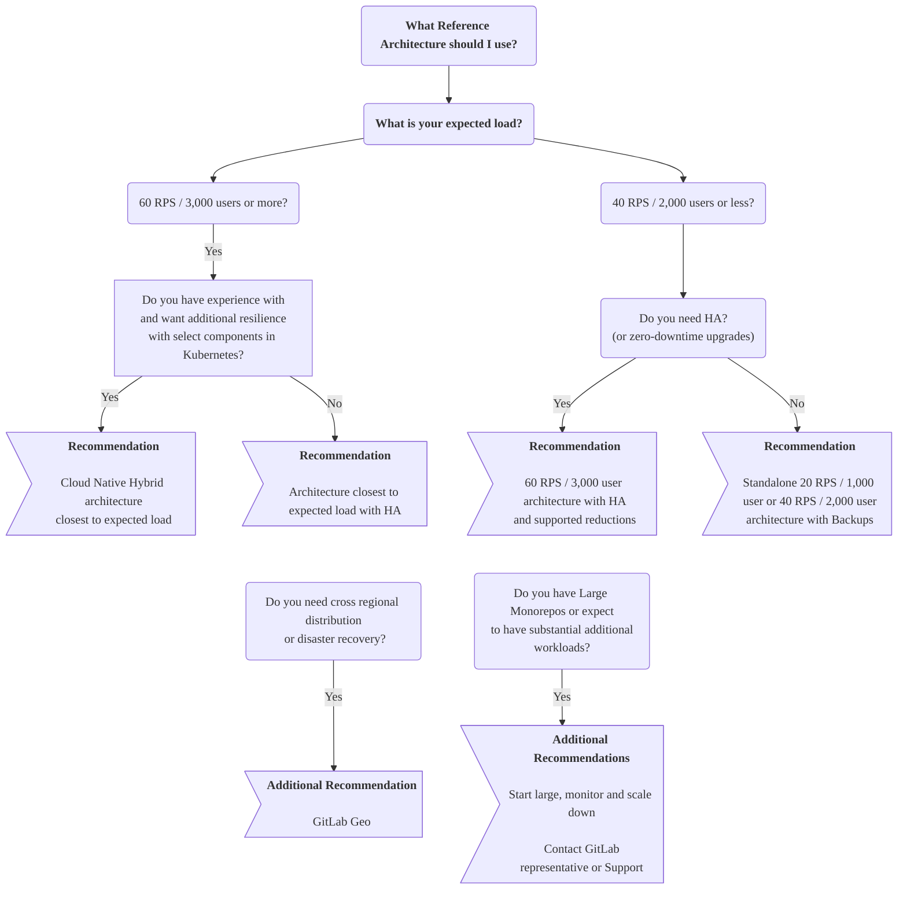



- Niveau :  Free, Premium, Ultimate
- Offre :  GitLab Self-Managed



Les architectures de référence GitLab sont des conceptions d'environnement validées et prêtes pour la production, destinées au déploiement de GitLab à grande échelle. Chaque architecture fournit des spécifications détaillées que vous pouvez utiliser ou adapter en fonction de vos besoins.

## Avant de commencer {#before-you-start}

Commencez par vous demander si GitLab Self-Managed est le bon choix pour vous et vos besoins.

Faire fonctionner une application en production est complexe, et il en va de même pour GitLab. Bien que nous cherchions à rendre cela aussi simple que possible, des complexités générales subsistent en fonction de votre conception. En règle générale, vous devez gérer tous les aspects tels que le matériel, les systèmes d'exploitation, la mise en réseau, le stockage, la sécurité, GitLab lui-même, et bien plus encore. Cela inclut à la fois la configuration initiale de l'environnement et la maintenance à long terme.

Vous devez avoir une connaissance pratique de l'exécution et de la maintenance d'applications en production si vous décidez de suivre cette voie. Si vous n'êtes pas dans cette situation, notre équipe [Professional Services](https://about.gitlab.com/services/#implementation-services) propose des services d'implémentation. Ceux qui souhaitent une solution plus gérée sur le long terme peuvent explorer nos autres offres telles que [GitLab.com](../../subscriptions/manage_seats.md#gitlabcom-billing-and-usage) ou [GitLab Dedicated](../../subscriptions/gitlab_dedicated/_index.md).

Si vous envisagez d'utiliser l'approche GitLab Self-Managed, nous vous encourageons à lire cette page dans son intégralité, en particulier les sections suivantes :

- [Choisir l'architecture de départ](#deciding-which-architecture-to-start-with)
- [Grands monodépôts](#large-monorepos)
- [Charges de travail supplémentaires](#additional-workloads)
- [Surveillance et ajustement de votre environnement](#monitoring)

## Choisir l'architecture de départ {#deciding-which-architecture-to-start-with}

Les architectures de référence sont conçues pour trouver un équilibre entre trois facteurs importants : les performances, la résilience et le coût. Elles fournissent des points de départ validés pour le déploiement de GitLab à grande échelle, basés sur des modèles de charge de travail types. Bien qu'elles facilitent le déploiement initial, la plupart des environnements bénéficient d'un réglage basé sur les modèles d'utilisation réels qui émergent grâce à la [surveillance](#monitoring). Choisir un point de départ approprié est important, mais prévoyez des ajustements en fonction des caractéristiques de votre charge de travail spécifique.

En règle générale, plus vous souhaitez que votre environnement soit performant ou résilient, plus il sera complexe.

Cette section explique les éléments à prendre en compte lors du choix d'une architecture de référence.

### Charge attendue {#expected-load}

La bonne taille d'architecture dépend principalement de la charge de pointe attendue de votre environnement. Les requêtes par seconde (RPS) constituent la mesure principale pour dimensionner une infrastructure GitLab, mais d'autres facteurs peuvent également s'appliquer.

Pour une analyse RPS complète et des décisions de dimensionnement basées sur les données, consultez [le dimensionnement des architectures de référence](sizing.md), qui fournit :

- Des requêtes PromQL détaillées pour extraire les métriques RPS de pointe et soutenues
- L'analyse des modèles de charge de travail et des conseils sur la composition RPS pour identifier les ajustements spécifiques aux composants
- La méthodologie d'évaluation pour les monodépôts, l'utilisation du réseau et la planification de la croissance

Pour une estimation rapide des RPS, certaines options potentielles incluent :

- Les requêtes [Prometheus](../monitoring/prometheus/_index.md#sample-prometheus-queries), telles que :

  ```prometheus
  sum(irate(gitlab_transaction_duration_seconds_count{controller!~'HealthController|MetricsController'}[1m])) by (controller, action)
  ```

- [GitLab RPS Analyzer](https://gitlab.com/gitlab-org/professional-services-automation/tools/utilities/gitlab-rps-analyzer#gitlab-rps-analyzer).
- Autres solutions de surveillance.
- Statistiques de l'équilibreur de charge.

Si vous ne pouvez pas déterminer vos RPS, des équivalents en nombre d'utilisateurs sont fournis pour les architectures Linux package et Cloud Native Hybrid comme méthode de dimensionnement alternative. Ce nombre est mappé sur des valeurs RPS typiques, en tenant compte à la fois de l'utilisation manuelle et automatisée.

## Architectures de référence disponibles {#available-reference-architectures}

Les architectures de référence suivantes sont disponibles en tant que points de départ recommandés pour votre environnement.

> [!note]
> Chaque architecture est conçue pour être [évolutive](#scaling-an-environment). Elles peuvent être ajustées en conséquence en fonction de votre charge de travail, à la hausse ou à la baisse. Par exemple, certains scénarios connus pour être lourds, comme l'utilisation de [grands monodépôts](#large-monorepos) ou de [charges de travail supplémentaires](#additional-workloads) notables.

### Package Linux (Omnibus) {#linux-package-omnibus}

Les architectures de référence basées sur le package Linux déploient tous les composants GitLab sur des machines virtuelles avec le package. Certains composants (PostgreSQL, Redis, stockage d'objets) peuvent éventuellement utiliser des services de fournisseurs cloud.

Les cibles RPS suivantes reflètent la composition typique de la charge de travail. Pour les charges de travail atypiques, voir [Comprendre la composition RPS](sizing.md#understanding-rps-composition-and-workload-patterns).

| Taille                         | RPS API | RPS Web | RPS Git (Pull) | RPS Git (Push) |
|------------------------------|---------|---------|----------------|----------------|
| [1 000 utilisateurs](1k_users.md)   | 20      | 2       | 2              | 1              |
| [2 000 utilisateurs](2k_users.md)   | 40      | 4       | 4              | 1              |
| [3 000 utilisateurs](3k_users.md)   | 60      | 6       | 6              | 1              |
| [5 000 utilisateurs](5k_users.md)   | 100     | 10      | 10             | 2              |
| [10 000 utilisateurs](10k_users.md) | 200     | 20      | 20             | 4              |
| [25 000 utilisateurs](25k_users.md) | 500     | 50      | 50             | 10             |
| [50 000 utilisateurs](50k_users.md) | 1000    | 100     | 100            | 20             |

### Cloud Native Hybrid {#cloud-native-hybrid}

Les architectures de référence Cloud Native Hybrid déploient certains composants sans état (Webservice, Sidekiq) dans Kubernetes à l'aide de Helm Charts, tandis que certains composants restent sur des machines virtuelles ou utilisent des services de fournisseurs cloud (PostgreSQL, Redis, stockage d'objets).

| Taille                                                                                                 | RPS API | RPS Web | RPS Git (Pull) | RPS Git (Push) |
|------------------------------------------------------------------------------------------------------|---------|---------|----------------|----------------|
| [2 000 utilisateurs](2k_users.md#cloud-native-hybrid-reference-architecture-with-helm-charts-alternative)   | 40      | 4       | 4              | 1              |
| [3 000 utilisateurs](3k_users.md#cloud-native-hybrid-reference-architecture-with-helm-charts-alternative)   | 60      | 6       | 6              | 1              |
| [5 000 utilisateurs](5k_users.md#cloud-native-hybrid-reference-architecture-with-helm-charts-alternative)   | 100     | 10      | 10             | 2              |
| [10 000 utilisateurs](10k_users.md#cloud-native-hybrid-reference-architecture-with-helm-charts-alternative) | 200     | 20      | 20             | 4              |
| [25 000 utilisateurs](25k_users.md#cloud-native-hybrid-reference-architecture-with-helm-charts-alternative) | 500     | 50      | 50             | 10             |
| [50 000 utilisateurs](50k_users.md#cloud-native-hybrid-reference-architecture-with-helm-charts-alternative) | 1000    | 100     | 100            | 20             |

### Cloud Native First (Bêta) {#cloud-native-first-beta}



- Niveau :  Free, Premium, Ultimate
- Offre :  GitLab Self-Managed
- Statut :  Bêta



Les architectures Cloud Native First sont notre nouvelle génération d'architectures qui ciblent les méthodes de déploiement modernes avec quatre tailles standardisées (S/M/L/XL) basées sur les caractéristiques de la charge de travail. Ces architectures déploient tous les composants GitLab dans Kubernetes, tandis que PostgreSQL, Redis et le stockage d'objets utilisent des solutions tierces externes, notamment des services gérés ou des options sur site.

Ces architectures offrent une réduction de la charge opérationnelle, un déploiement simplifié et une résilience renforcée grâce à l'orchestration Kubernetes.

| Taille | RPS cible | Caractéristiques de la charge de travail |
|------|------------|--------------------------|
| Small (S) | ≤ 100 RPS | Charge globale légère, non adaptée aux monodépôts actifs |
| Medium (M) | ≤ 200 RPS | Charge modérée, prend en charge les monodépôts peu utilisés |
| Large (L) | ≤ 500 RPS | Charge élevée, gère les monodépôts modérément utilisés |
| Extra Large (XL) | ≤ 1 000 RPS | Charge intensive, conçue pour les monodépôts très utilisés |

Pour plus d'informations, voir [les architectures de référence Cloud Native First](cloud_native_first.md).

### En cas de doute, commencez grand, surveillez, puis réduisez {#if-in-doubt-start-large-monitor-and-then-scale-down}

Si vous n'êtes pas certain de la taille d'environnement requise, envisagez de commencer avec une taille plus grande, de la [surveiller](#monitoring), puis de la [réduire](#scaling-an-environment) en conséquence si les métriques le justifient.

Commencer grand puis réduire est une approche prudente lorsque :

- Vous ne pouvez pas déterminer les RPS
- La charge de l'environnement pourrait être atypiquement plus élevée que prévu
- Vous avez des [grands monodépôts](#large-monorepos) ou des [charges de travail supplémentaires](#additional-workloads) notables

Par exemple, si vous avez 3 000 utilisateurs mais savez également qu'une automatisation est en jeu et augmenterait considérablement la charge concurrente, vous pourriez commencer avec un environnement de classe 100 RPS / 5k utilisateurs, le surveiller, et si les métriques le permettent, réduire tous les composants à la fois, ou un par un.

### Autonome (non-HA) {#standalone-non-ha}

Pour les environnements desservant 2 000 utilisateurs ou moins, il est généralement recommandé de suivre une approche autonome en déployant un environnement non-HA, à nœud unique ou multi-nœuds. Avec cette approche, vous pouvez employer des stratégies telles que les [sauvegardes automatisées](../backup_restore/backup_gitlab.md#configuring-cron-to-make-daily-backups) pour la récupération. Ces stratégies offrent un bon niveau d'objectif de temps de récupération (RTO) ou d'objectif de point de récupération (RPO) tout en évitant les complexités liées à la haute disponibilité.

Avec les configurations autonomes, en particulier les environnements à nœud unique, diverses options sont disponibles pour l'[installation](../../install/_index.md) et la gestion. Les options incluent [la possibilité de déployer directement via certaines places de marché de fournisseurs cloud](https://page.gitlab.com/cloud-partner-marketplaces.html) qui réduisent encore un peu la complexité.

### Haute disponibilité (HA) {#high-availability-ha}

La haute disponibilité garantit que chaque composant de la configuration GitLab peut gérer les défaillances grâce à divers mécanismes. Cependant, y parvenir est complexe, et les environnements requis peuvent être importants.

Pour les environnements desservant 3 000 utilisateurs ou plus, nous recommandons généralement d'utiliser une stratégie HA. À ce niveau, les pannes ont un impact plus important sur un plus grand nombre d'utilisateurs. Toutes les architectures de cette plage intègrent la HA de conception pour cette raison.

#### Avez-vous besoin de la haute disponibilité (HA) ? {#do-you-need-high-availability-ha}

Comme mentionné précédemment, l'obtention de la HA a un coût. Les exigences en matière d'environnement sont importantes car chaque composant doit être multiplié, ce qui entraîne des coûts réels et de maintenance supplémentaires.

Pour beaucoup de nos clients avec moins de 3 000 utilisateurs, nous avons constaté qu'une stratégie de sauvegarde est suffisante, voire préférable. Bien que cela implique un temps de récupération plus lent, cela signifie également que vous avez une architecture beaucoup plus petite et des coûts de maintenance réduits en conséquence.

En règle générale, n'utilisez la HA que dans les scénarios suivants :

- Lorsque vous avez 3 000 utilisateurs ou plus.
- Lorsque l'indisponibilité de GitLab aurait un impact critique sur votre flux de travail.

#### Approche de haute disponibilité (HA) réduite {#scaled-down-high-availability-ha-approach}

Si vous avez toujours besoin de la HA pour un nombre d'utilisateurs moins important, vous pouvez y parvenir avec une [architecture 3K ajustée](3k_users.md#supported-modifications-for-lower-user-counts-ha).

#### Mises à jour sans interruption de service {#zero-downtime-upgrades}

Les [mises à jour sans interruption de service](../../update/zero_downtime.md) sont disponibles pour les environnements standard avec HA (Cloud Native Hybrid n'est [pas pris en charge](https://gitlab.com/groups/gitlab-org/cloud-native/-/epics/52)). Cela permet à un environnement de rester opérationnel pendant une mise à jour. Cependant, ce processus est plus complexe et présente certaines limitations détaillées dans la documentation.

Lors de ce processus, il convient de noter qu'il peut encore y avoir de brefs moments d'indisponibilité lorsque les mécanismes HA entrent en jeu.

Dans la plupart des cas, le temps d'indisponibilité requis pour une mise à jour ne devrait pas être substantiel. N'utilisez cette approche que si c'est une exigence clé pour vous.

### GitLab Geo (Distribution multi-régionale / Reprise après sinistre) {#gitlab-geo-cross-regional-distribution--disaster-recovery}

Avec [GitLab Geo](../geo/_index.md), vous pouvez réaliser des environnements distribués dans différentes régions avec une configuration complète de reprise après sinistre (DR) en place. GitLab Geo nécessite au moins deux environnements séparés :

- Un site principal.
- Un ou plusieurs sites secondaires servant de réplicas.

Si le site principal devient indisponible, vous pouvez basculer vers l'un des sites secondaires.

> [!note]
> N'utilisez cette configuration **advanced and complex** que si la DR est une exigence clé pour votre environnement. Vous devez également prendre des décisions supplémentaires sur la configuration de chaque site. Par exemple, si chaque site secondaire aurait la même architecture que le site principal ou si chaque site est configuré pour la HA.

### Grands monodépôts / Charges de travail supplémentaires {#large-monorepos--additional-workloads}

Les [grands monodépôts](#large-monorepos) ou les [charges de travail supplémentaires](#additional-workloads) significatives peuvent affecter notablement les performances de l'environnement. Des ajustements peuvent être nécessaires selon le contexte.

Pour une analyse complète de ces facteurs, voir [le dimensionnement des architectures de référence](sizing.md), qui fournit :

- Une méthodologie d'évaluation détaillée des impacts des monodépôts sur l'infrastructure.
- Des recommandations de mise à l'échelle spécifiques aux composants pour différents modèles de charge de travail.
- Une analyse de la bande passante réseau pour les scénarios de transfert de données intensif.

Si cette situation vous concerne, contactez votre représentant GitLab ou notre [équipe d'assistance](https://about.gitlab.com/support/) pour obtenir des conseils supplémentaires.

### Services des fournisseurs cloud {#cloud-provider-services}

Pour toutes les stratégies décrites précédemment, vous pouvez exécuter certains composants GitLab sur des services équivalents de fournisseurs cloud, tels que la base de données PostgreSQL ou Redis.

Pour plus d'informations, consultez les [fournisseurs cloud et services recommandés](#recommended-cloud-providers-and-services).

### Arbre de décision {#decision-tree}

Lisez d'abord intégralement les conseils documentés précédemment avant de consulter l'arbre de décision suivant.



> [!note]
> L'arbre de décision ci-dessus reflète les architectures prêtes pour la production. Pour les déploiements entièrement natifs Kubernetes incluant Gitaly, voir [Cloud Native First (Bêta)](cloud_native_first.md), qui est actuellement en version Bêta et n'est pas encore recommandé pour une utilisation en production.

## Prérequis {#requirements}

Avant d'implémenter une architecture de référence, consultez les prérequis et les conseils suivants.

### Types de machines pris en charge {#supported-machine-types}

Les architectures sont conçues pour être flexibles en termes de sélection du type de machine tout en garantissant des performances cohérentes. Bien que nous fournissions des exemples de types de machines spécifiques dans chaque architecture de référence, ceux-ci ne sont pas destinés à être des valeurs par défaut prescriptives.

Vous pouvez utiliser tout type de machine qui correspond ou dépasse les exigences spécifiées pour chaque composant, tels que :

- Les types de machines de nouvelle génération (comme la série `n2` de GCP ou la série `m6` d'AWS)
- Différentes architectures telles que les instances basées sur ARM (comme AWS Graviton)
- Des familles de types de machines alternatives qui correspondent mieux aux caractéristiques spécifiques de votre charge de travail (comme une bande passante réseau plus élevée)

Ces conseils s'appliquent également à tout service de fournisseur cloud tel qu'AWS RDS.

> [!note]
> Les types d'instances « burstables » ne sont pas recommandés en raison de leurs performances incohérentes.

Pour plus de détails sur les types de machines contre lesquels nous effectuons des tests et la manière dont nous les effectuons, consultez [les résultats de validation et de tests](#validation-and-test-results).

### Types de disques pris en charge {#supported-disk-types}

La plupart des types de disques standard devraient fonctionner avec GitLab. Cependant, soyez conscient des points spécifiques suivants :

- Gitaly a certaines [exigences en matière de disque](../gitaly/_index.md#disk-requirements) pour les stockages Gitaly.
- Nous ne recommandons pas l'utilisation de types de disques « burstables » en raison de leurs performances incohérentes.

Les autres types de disques devraient fonctionner avec GitLab. Choisissez en fonction de vos exigences telles que la durabilité ou le coût.

### Infrastructure prise en charge {#supported-infrastructure}

GitLab devrait fonctionner sur la plupart des infrastructures telles que les fournisseurs cloud réputés (AWS, GCP, Azure) et leurs services, ou auto-hébergés (ESXi) qui satisfont à la fois :

- Les spécifications détaillées dans chaque architecture.
- Toutes les exigences de cette section.

Cependant, cela ne garantit pas la compatibilité avec toutes les permutations possibles.

Voir [Fournisseurs cloud et services recommandés](#recommended-cloud-providers-and-services) pour plus d'informations.

### Mise en réseau (haute disponibilité) {#networking-high-availability}

Voici les exigences réseau pour faire fonctionner GitLab en mode haute disponibilité.

#### Latence réseau {#network-latency}

La latence réseau doit être aussi faible que possible pour permettre une réplication synchrone dans l'application GitLab, telle que la réplication de base de données. Généralement, elle devrait être inférieure à 5 ms.

#### Zones de disponibilité (fournisseurs cloud) {#availability-zones-cloud-providers}

Le déploiement sur plusieurs zones de disponibilité est pris en charge et généralement recommandé pour une résilience supplémentaire. Vous devez utiliser un nombre impair de zones pour vous aligner sur les exigences de l'application GitLab, car certains composants utilisent un nombre impair de nœuds pour le vote de quorum.

#### Centres de données (auto-hébergés) {#data-centers-self-hosted}

Le déploiement sur plusieurs centres de données auto-hébergés est possible mais nécessite une réflexion approfondie. Cela nécessite une latence capable de synchronisation entre les centres, des liens réseau redondants robustes pour prévenir les scénarios de split-brain, tous les centres situés dans la même région géographique, et un déploiement sur un nombre impair de centres pour un vote de quorum approprié (comme les [zones de disponibilité](#availability-zones-cloud-providers)).

> [!warning]
> Il peut ne pas être possible pour l'assistance GitLab d'aider avec les problèmes liés à l'infrastructure découlant de déploiements multi-centres de données. Le choix de déployer sur plusieurs centres est généralement à vos propres risques. De plus, il n'est pas pris en charge de déployer un seul [environnement GitLab dans différentes régions](#deploying-one-environment-over-multiple-regions). Les centres de données doivent être dans la même région.

### Grands monodépôts {#large-monorepos}

Les architectures ont été testées avec des dépôts de tailles variées qui respectent les bonnes pratiques.

Cependant, les [grands monodépôts](../../user/project/repository/monorepos/_index.md) (plusieurs gigaoctets ou plus) peuvent avoir un impact significatif sur les performances de Git et, par conséquent, sur l'environnement lui-même. Leur présence et la façon dont ils sont utilisés peuvent exercer une pression considérable sur l'ensemble du système, de Gitaly à l'infrastructure sous-jacente.

Les implications en termes de performances sont largement de nature logicielle. Des ressources matérielles supplémentaires entraînent des rendements décroissants.

> [!warning]
> Si cela vous concerne, nous vous recommandons vivement de suivre la documentation liée et de contacter votre représentant GitLab ou notre [équipe d'assistance](https://about.gitlab.com/support/) pour obtenir des conseils supplémentaires.

Les grands monodépôts ont un coût notable. Si vous avez un tel dépôt, suivez ces conseils pour garantir de bonnes performances et maîtriser les coûts :

- [Optimiser le grand monodépôt](../../user/project/repository/monorepos/_index.md). L'utilisation de fonctionnalités telles que [LFS](../../user/project/repository/monorepos/_index.md#use-git-lfs-for-large-binary-files) pour ne pas stocker les binaires, et d'autres approches pour réduire la taille du dépôt, peut améliorer considérablement les performances et réduire les coûts.
- Selon le monodépôt, des spécifications d'environnement augmentées peuvent être nécessaires pour compenser. Gitaly peut nécessiter des ressources supplémentaires ainsi que Praefect, GitLab Rails et les équilibreurs de charge. Cela dépend du monodépôt lui-même et de son utilisation.
- Lorsque le monodépôt est très volumineux (20 gigaoctets ou plus), des stratégies supplémentaires peuvent être nécessaires, comme des spécifications encore plus augmentées ou, dans certains cas, un backend Gitaly séparé pour le monodépôt uniquement.
- La bande passante réseau et disque est une autre considération potentielle avec les grands monodépôts. Dans les cas très intensifs, une saturation de la bande passante est possible s'il y a un grand nombre de clones simultanés (comme avec CI). [Réduisez les clones complets autant que possible](../../user/project/repository/monorepos/_index.md#reduce-concurrent-clones-in-cicd) dans ce scénario. Dans le cas contraire, des spécifications d'environnement supplémentaires peuvent être nécessaires pour augmenter la bande passante. Cela diffère selon les fournisseurs cloud.

### Charges de travail supplémentaires {#additional-workloads}

Ces architectures ont été [conçues et testées](#validation-and-test-results) pour les configurations GitLab standard basées sur des données réelles.

Cependant, les charges de travail supplémentaires peuvent multiplier l'impact des opérations en déclenchant des actions de suivi. Vous devrez peut-être ajuster les spécifications suggérées pour compenser si vous utilisez :

- Des logiciels de sécurité sur les nœuds.
- Des centaines de jobs CI simultanés pour les [grands dépôts](../../user/project/repository/monorepos/_index.md).
- Des scripts personnalisés qui [s'exécutent à haute fréquence](../logs/log_parsing.md#print-top-api-user-agents).
- Des [intégrations](../../integration/_index.md) dans de nombreux grands projets.
- Des [feature flags](../../operations/feature_flags.md#performance-factors) dans des projets avec de grandes bases d'utilisateurs.
- Des [hooks serveur](../server_hooks.md).
- Des [hooks système](../system_hooks.md).

En général, vous devriez disposer d'une surveillance robuste pour mesurer l'impact de toute charge de travail supplémentaire afin d'informer les changements à effectuer. Contactez votre représentant GitLab ou notre [équipe d'assistance](https://about.gitlab.com/support/) pour obtenir des conseils supplémentaires.

### Équilibreurs de charge {#load-balancers}

Les architectures utilisent jusqu'à deux équilibreurs de charge selon la classe :

- Équilibreur de charge externe - Achemine le trafic vers les composants exposés à l'extérieur, principalement Rails.
- Équilibreur de charge interne - Achemine le trafic vers certains composants internes déployés en mode HA tels que Praefect ou PgBouncer.

Les spécificités concernant l'équilibreur de charge à utiliser, ou sa configuration exacte, dépassent la portée de la documentation GitLab. Les options les plus courantes sont de configurer des équilibreurs de charge sur des nœuds machines ou d'utiliser un service tel que celui proposé par les fournisseurs cloud. Si vous déployez un environnement Cloud Native Hybrid, les charts peuvent gérer la configuration de l'équilibreur de charge externe à l'aide de Kubernetes Ingress.

Chaque classe d'architecture inclut une taille de machine de base recommandée pour un déploiement direct sur des machines. Cependant, elles peuvent nécessiter des ajustements en fonction de facteurs tels que l'équilibreur de charge choisi et la charge de travail attendue. Notez que les machines peuvent avoir des [bandes passantes réseau](#network-bandwidth) variables qui doivent également être prises en compte.

Les sections suivantes fournissent des conseils supplémentaires pour les équilibreurs de charge.

#### Algorithme d'équilibrage {#balancing-algorithm}

Pour assurer une répartition égale des appels vers les nœuds et de bonnes performances, utilisez un algorithme d'équilibrage de charge basé sur les connexions les moins nombreuses ou équivalent dans la mesure du possible.

Nous ne recommandons pas l'utilisation d'algorithmes round-robin car ils sont connus pour ne pas répartir les connexions de manière égale en pratique.

#### Bande passante réseau {#network-bandwidth}

La bande passante réseau totale disponible pour un équilibreur de charge lorsqu'il est déployé sur une machine peut varier considérablement selon les fournisseurs cloud. Certains fournisseurs cloud, comme [AWS](https://docs.aws.amazon.com/AWSEC2/latest/UserGuide/ec2-instance-network-bandwidth.html), peuvent fonctionner sur un système de crédit de burst pour déterminer la bande passante à tout moment.

La bande passante réseau requise pour vos équilibreurs de charge dépend de facteurs tels que la forme des données et la charge de travail. Les tailles de base recommandées pour chaque classe d'architecture ont été sélectionnées sur la base de données réelles. Cependant, dans certains scénarios tels que les clones répétés de [grands monodépôts](#large-monorepos), une utilisation intensive du [registre de conteneurs GitLab](../../user/packages/container_registry/_index.md), de grands artefacts CI, ou toute charge de travail impliquant un transfert fréquent de fichiers volumineux, vous devrez peut-être ajuster les tailles en conséquence.

### Pas de swap {#no-swap}

Le swap n'est pas recommandé dans les architectures de référence. C'est un mécanisme de sécurité qui impacte considérablement les performances. Les architectures sont conçues pour disposer de suffisamment de mémoire dans la plupart des cas afin d'éviter le recours au swap.

### PostgreSQL Praefect {#praefect-postgresql}

[Praefect nécessite son propre serveur de base de données](../gitaly/praefect/configure.md#postgresql). Pour obtenir une HA complète, une solution de base de données PostgreSQL tierce est nécessaire.

Nous espérons proposer une solution intégrée pour ces restrictions à l'avenir. En attendant, un serveur PostgreSQL non-HA peut être configuré à l'aide du package Linux, comme le reflètent les spécifications. Pour plus de détails, consultez les tickets suivants :

- [`omnibus-gitlab#7292`](https://gitlab.com/gitlab-org/omnibus-gitlab/-/issues/7292).
- [`gitaly#3398`](https://gitlab.com/gitlab-org/gitaly/-/issues/3398).

## Fournisseurs cloud et services recommandés {#recommended-cloud-providers-and-services}

> [!note]
> Les listes suivantes ne sont pas exhaustives. D'autres fournisseurs cloud non répertoriés ici peuvent fonctionner avec les mêmes spécifications, mais ils n'ont pas été validés. Pour les services de fournisseurs cloud non répertoriés ici, faites preuve de prudence car chaque implémentation peut être notablement différente. Testez soigneusement avant de les utiliser en production.

Les architectures suivantes sont recommandées pour les fournisseurs cloud suivants sur la base des tests et de l'utilisation réelle :

| Architecture de référence | GCP         | AWS         | Azure                    | Bare Metal  |
|------------------------|-------------|-------------|--------------------------|-------------|
| [Package Linux](#linux-package-omnibus)          |  |  |  <sup>1</sup> |  |
| [Cloud Native Hybrid](#cloud-native-hybrid)    |  |  |                          |             |
| [Cloud Native First](cloud_native_first.md) (Bêta) |  |  |  |  |

De plus, les services de fournisseurs cloud suivants sont recommandés pour être utilisés dans le cadre des architectures :

| Service cloud  | GCP                                                    | AWS                                                | Azure                                                                                                   | Bare Metal               |
|----------------|--------------------------------------------------------|----------------------------------------------------|---------------------------------------------------------------------------------------------------------|--------------------------|
| Stockage d'objets | [Cloud Storage](https://cloud.google.com/storage)      | [S3](https://aws.amazon.com/s3/)                   | [Azure Blob Storage](https://azure.microsoft.com/en-gb/products/storage/blobs)                          | Stockage d'objets compatible S3 |
| Base de données       | [Cloud SQL](https://cloud.google.com/sql) <sup>2</sup> | [RDS](https://aws.amazon.com/rds/)                 | [Azure Database for PostgreSQL Flexible Server](https://azure.microsoft.com/en-gb/products/postgresql/) |                          |
| Redis          | [Memorystore](https://cloud.google.com/memorystore)    | [ElastiCache](https://aws.amazon.com/elasticache/) | [Azure Cache for Redis (Premium)](https://azure.microsoft.com/en-gb/products/cache)                     |                          |

<!-- Disable ordered list rule <https://github.com/DavidAnson/markdownlint/blob/main/doc/Rules.md#md029---ordered-list-item-prefix> -->
<!-- markdownlint-disable MD029 -->
1. Pour garantir de bonnes performances, déployez le [niveau Premium d'Azure Cache for Redis](https://learn.microsoft.com/en-us/azure/azure-cache-for-redis/cache-overview#service-tiers).
2. Pour des performances optimales, en particulier dans les environnements de grande taille (500 RPS / 25k utilisateurs ou plus), utilisez l'[édition Enterprise Plus](https://cloud.google.com/sql/docs/editions-intro) pour GCP Cloud SQL. Vous devrez peut-être ajuster le nombre maximum de connexions au-delà des valeurs par défaut du service, en fonction de votre charge de travail.
<!-- markdownlint-enable MD029 -->

### Bonnes pratiques pour les services de base de données {#best-practices-for-the-database-services}

Au lieu des composants PostgreSQL, PgBouncer et de découverte de service Consul fournis avec le package Linux, vous pouvez utiliser un [service externe tiers pour PostgreSQL](../postgresql/external.md).

Utilisez un fournisseur réputé qui exécute une [version PostgreSQL prise en charge](../../install/requirements.md#postgresql). Ces services sont connus pour bien fonctionner :

- [Google Cloud SQL](https://cloud.google.com/sql/docs/postgres/high-availability#normal).
- [Amazon RDS](https://aws.amazon.com/rds/).

#### Considérations de configuration {#configuration-considerations}

Tenez compte des points suivants lors de l'utilisation de services de base de données externes :

- Pour des performances optimales, activez l'[équilibrage de charge de base de données](../postgresql/database_load_balancing.md) avec des réplicas en lecture. Faites correspondre le nombre de nœuds à ceux utilisés dans les déploiements standard du package Linux. Cette approche est particulièrement importante pour les environnements de grande taille (plus de 200 requêtes par seconde ou 10 000+ utilisateurs).
- Les exigences en matière de nœuds pour la haute disponibilité peuvent varier selon le service et différer des installations du package Linux.
- Pour [GitLab Geo](../geo/_index.md), assurez-vous que le service prend en charge la réplication inter-régions.

#### Gestion des connexions {#connection-management}

Pour une gestion optimale des connexions avec les services de base de données externes :

- Utilisez l'[équilibrage de charge de base de données](../postgresql/database_load_balancing.md) pour distribuer les connexions sur les réplicas en lecture.
- Ajustez la configuration du nombre de connexions PostgreSQL pour la taille et la charge de travail de votre environnement. Surveillez et ajustez en fonction des performances.
- Si un regroupement de connexions supplémentaire est nécessaire, déployez votre propre PgBouncer. D'autres solutions de regroupement tierces peuvent fonctionner mais n'ont pas été validées.

Les services de regroupement des fournisseurs cloud présentent les limitations suivantes et sont soit incompatibles, soit non recommandés :

- [AWS RDS Proxy](https://aws.amazon.com/rds/proxy/) :  Non validé pour une utilisation avec GitLab.
- [Azure Database for PostgreSQL PgBouncer](https://learn.microsoft.com/en-us/azure/postgresql/connectivity/concepts-pgbouncer) :  Architecture mono-thread avec une observabilité limitée. Peut causer des goulots d'étranglement sous une charge élevée.

> [!note]
> Le PgBouncer fourni avec GitLab ne fonctionne qu'avec le PostgreSQL fourni et ne peut pas être utilisé avec des services de base de données externes.

#### Compatibilité des services de base de données {#database-service-compatibility}

Les services de base de données des fournisseurs cloud suivants sont soit incompatibles, soit non recommandés :

- [Amazon Aurora](https://aws.amazon.com/rds/aurora/) est incompatible et non pris en charge. Pour plus de détails, voir [14.4.0](https://archives.docs.gitlab.com/17.3/ee/update/versions/gitlab_14_changes/#1440).
- [Google AlloyDB](https://cloud.google.com/alloydb) et [Amazon RDS Multi-AZ DB cluster](https://docs.aws.amazon.com/AmazonRDS/latest/UserGuide/multi-az-db-clusters-concepts.html) ne sont pas testés et ne sont pas recommandés. Ces deux solutions ne devraient pas fonctionner avec GitLab Geo.
  - [Amazon RDS Multi-AZ DB instance](https://docs.aws.amazon.com/AmazonRDS/latest/UserGuide/Concepts.MultiAZSingleStandby.html) est un produit distinct et est pris en charge.

### Bonnes pratiques pour les services Redis {#best-practices-for-redis-services}

Utilisez un [service Redis externe](../redis/replication_and_failover_external.md#redis-as-a-managed-service-in-a-cloud-provider) qui exécute une version standard, performante et prise en charge. Le service doit prendre en charge :

- Le mode Redis Standalone (Principal x Réplica) - le mode Redis Cluster n'est spécifiquement pas pris en charge
- La haute disponibilité via la réplication
- La possibilité de définir la [politique d'éviction Redis](../redis/replication_and_failover_external.md#setting-the-eviction-policy)

Redis est principalement mono-thread. Pour les environnements ciblant la classe 200 RPS / 10 000 utilisateurs ou plus, séparez les instances en données de cache et données persistantes pour atteindre des performances optimales.

> [!note]
> Les variantes serverless des services Redis ne sont pas prises en charge pour le moment.

### Bonnes pratiques pour le stockage d'objets {#best-practices-for-object-storage}

GitLab a été testé contre [divers fournisseurs de stockage d'objets](../object_storage.md#object-storage-provider-support) qui devraient fonctionner.

Utilisez une solution réputée qui offre une compatibilité S3 complète.

## S'écarter des architectures de référence suggérées {#deviating-from-the-suggested-reference-architectures}

Plus vous vous éloignez des architectures de référence, plus il est difficile d'obtenir de l'aide. À chaque écart, vous introduisez une couche de complexité qui complique le dépannage des problèmes potentiels.

Ces architectures utilisent les packages Linux officiels ou les [Helm Charts](https://docs.gitlab.com/charts/) pour installer et configurer les différents composants. Les composants sont installés sur des machines séparées (virtualisées ou Bare Metal). Les exigences matérielles des machines sont listées dans les colonnes « Configuration » sur les pages d'architecture de référence spécifiques. Les tailles standard de VM équivalentes sont listées dans les colonnes GCP/AWS/Azure de chaque [architecture disponible](#available-reference-architectures).

Vous pouvez exécuter les composants GitLab sur Docker, y compris Docker Compose. Docker est bien pris en charge et fournit des spécifications cohérentes dans tous les environnements. Cependant, c'est toujours une couche supplémentaire et peut ajouter quelques complexités de support. Par exemple, l'impossibilité d'exécuter `strace` dans des conteneurs.

### Conceptions non prises en charge {#unsupported-designs}

Bien que nous essayions d'avoir une bonne gamme de support pour les conceptions d'environnement GitLab, certaines approches ne fonctionnent pas efficacement. Les sections suivantes détaillent ces approches non prises en charge.

#### Composants avec état dans Kubernetes {#stateful-components-in-kubernetes}

[L'exécution de composants avec état dans Kubernetes, tels que Postgres et Redis, n'est pas prise en charge](https://docs.gitlab.com/charts/installation/#configure-the-helm-chart-to-use-external-stateful-data).

Vous pouvez utiliser d'autres services de fournisseurs cloud pris en charge, sauf s'ils sont explicitement indiqués comme non pris en charge.

Les nœuds Gitaly individuels peuvent être déployés sur Kubernetes en [disponibilité limitée](../gitaly/kubernetes.md#timeline). Cela fournit une solution non-HA où chaque dépôt est stocké sur un seul nœud. Pour plus de contexte sur les options de déploiement Gitaly et les limitations, voir [Gitaly sur Kubernetes](../gitaly/kubernetes.md#context).

Pour les architectures de référence qui déploient Gitaly dans Kubernetes dans le cadre d'une configuration entièrement cloud-native, voir [les architectures de référence Cloud Native First (Bêta)](cloud_native_first.md).

#### Mise à l'échelle automatique des nœuds avec état {#autoscaling-of-stateful-nodes}

En règle générale, seuls les composants sans état de GitLab peuvent être exécutés dans des groupes de mise à l'échelle automatique, à savoir GitLab Rails et Sidekiq. Les autres composants qui ont un état, tels que Gitaly, ne sont pas pris en charge de cette façon. Pour plus d'informations, voir le [ticket 2997](https://gitlab.com/gitlab-org/gitaly/-/issues/2997).

Cela s'applique aux composants avec état tels que Postgres et Redis. Vous pouvez utiliser d'autres services de fournisseurs cloud pris en charge, sauf s'ils sont explicitement indiqués comme non pris en charge.

Les [configurations Cloud Native Hybrid](#cloud-native-hybrid) sont généralement préférées aux groupes de mise à l'échelle automatique. Kubernetes gère mieux les composants qui ne peuvent s'exécuter que sur un seul nœud, tels que les migrations de base de données et [Mailroom](../incoming_email.md).

#### Déploiement d'un environnement sur plusieurs régions {#deploying-one-environment-over-multiple-regions}

GitLab ne prend pas en charge le déploiement d'un environnement unique sur plusieurs régions. Ces configurations peuvent entraîner des problèmes importants, tels qu'une latence réseau excessive ou des scénarios de split-brain si la connectivité entre les régions échoue.

Plusieurs composants GitLab effectuent une réplication synchrone ou nécessitent un nombre impair de nœuds pour fonctionner correctement, tels que Consul, Redis Sentinel et Praefect. La distribution de ces composants sur plusieurs régions avec une latence élevée peut avoir un impact grave sur leur fonctionnalité et les performances globales du système.

Cette limitation s'applique à toutes les configurations d'environnement GitLab potentielles, y compris les alternatives Cloud Native Hybrid.

Pour déployer GitLab sur plusieurs centres de données ou régions, nous proposons [GitLab Geo](../geo/_index.md) comme solution complète.

## Validation et résultats des tests {#validation-and-test-results}

GitLab effectue régulièrement des tests de smoke et de performance pour ces architectures afin de s'assurer qu'elles restent conformes.

### Comment nous effectuons les tests {#how-we-perform-the-tests}

Les tests sont effectués à l'aide de charges de travail codées spécifiques dérivées de données client types, en utilisant à la fois le [GitLab Environment Toolkit (GET)](https://gitlab.com/gitlab-org/gitlab-environment-toolkit) pour le déploiement d'environnement avec Terraform et Ansible, et le [GitLab Performance Tool (GPT)](https://gitlab.com/gitlab-org/quality/performance) pour les tests de performance avec k6.

Les tests sont effectués principalement sur GCP et AWS en utilisant leurs offres de calcul standard (série n1 pour GCP, série m5 pour AWS) comme configurations de référence. Ces types de machines ont été sélectionnés comme cible du plus petit dénominateur commun pour assurer une large compatibilité. L'utilisation de types de machines différents ou plus récents qui répondent aux exigences CPU et mémoire est entièrement prise en charge - voir [Types de machines pris en charge](#supported-machine-types) pour plus d'informations. Les architectures devraient fonctionner de manière similaire sur tout matériel répondant aux spécifications, que ce soit sur d'autres fournisseurs cloud ou sur site.

### Cibles de performance {#performance-targets}

Chaque architecture de référence est testée par rapport à des cibles de débit spécifiques basées sur des données client réelles. Pour chaque tranche de 1 000 utilisateurs, nous testons :

- API :  20 RPS
- Web :  2 RPS
- Git (Pull) :  2 RPS
- Git (Push) :  0,4 RPS (arrondi à l'entier le plus proche)

Les cibles RPS listées ont été sélectionnées sur la base de données client réelles des charges environnementales totales correspondant au nombre d'utilisateurs, y compris CI et autres charges de travail.

> [!note]
>
> - Ces ventilations RPS représentent des cibles de test basées sur des modèles de charge de travail types. La composition réelle de votre charge de travail peut varier. Pour des conseils sur l'évaluation de votre composition RPS spécifique et sur le moment où des ajustements sont nécessaires, voir [Comprendre la composition RPS](sizing.md#understanding-rps-composition-and-workload-patterns).
> - La latence réseau entre les composants dans les environnements de test a été observée à moins de 5 ms, mais notez que ce n'est pas prévu comme une exigence stricte.

### Couverture des tests et résultats {#test-coverage-and-results}

Les tests sont conçus pour être efficaces et fournir une bonne couverture pour les cibles des architectures de référence, couvrant les environnements Linux package et Cloud Native. Les environnements et configurations spécifiques testés sont examinés régulièrement pour assurer la meilleure couverture et le meilleur rapport coût/valeur, et peuvent changer au fil du temps.

Nos tests incluent également des variantes prototypes de ces architectures explorées pour une inclusion potentielle future. Les résultats des tests sont disponibles publiquement sur le [wiki des architectures de référence](https://gitlab.com/gitlab-org/reference-architectures/-/wikis/Benchmarks/Latest).

## Maintenance d'un environnement d'architecture de référence {#maintaining-a-reference-architecture-environment}

La maintenance d'un environnement d'architecture de référence est globalement la même que pour tout autre environnement GitLab.

Dans cette section, vous trouverez des liens vers la documentation pour les domaines pertinents et des notes d'architecture spécifiques.

### Mise à l'échelle d'un environnement {#scaling-an-environment}

Les architectures de référence sont conçues comme des points de départ validés basés sur des modèles de charge de travail types, et non comme des configurations finales. La plupart des déploiements en production bénéficient d'ajustements basés sur les modèles d'utilisation réels qui émergent grâce à la surveillance. Les architectures sont évolutives tout au long et vous pouvez les ajuster itérativement au fur et à mesure que les caractéristiques de votre charge de travail deviennent claires. La mise à l'échelle peut être effectuée composant par composant ou en totalité vers la taille d'architecture suivante lorsque les métriques indiquent une pression soutenue sur les ressources.

> [!note]
> Si un composant épuise continuellement ses ressources allouées, contactez notre [équipe d'assistance](https://about.gitlab.com/support/) avant d'effectuer toute mise à l'échelle significative.

#### Quand mettre à l'échelle {#when-to-scale}

La plupart des déploiements bénéficient d'ajustements après observation des modèles de charge de travail réels. Les scénarios courants qui déclenchent une mise à l'échelle incluent :

**Resource sizing adjustments :**

- Augmentation de la capacité Webservice/Rails pour les charges de travail à forte utilisation de l'API, en particulier lorsque le trafic API dépasse 90 % du RPS total (voir [Comprendre la composition RPS](sizing.md#understanding-rps-composition-and-workload-patterns))
- Mise à l'échelle de Gitaly pour les environnements avec de nombreux monodépôts ou lorsque la taille des dépôts dépasse 2 Go (voir [Identifier les ajustements des composants](sizing.md#identify-component-adjustments))
- Ajustement des workers Sidekiq pour un débit CI/CD élevé ou un traitement intensif des jobs en arrière-plan

**Configuration tuning :**

- Définition des nombres de cgroups de dépôt Gitaly en fonction des modèles d'accès simultanés (voir [cgroups Gitaly](../gitaly/cgroups.md))
- Configuration des priorités de file d'attente Sidekiq pour l'optimisation du traitement des jobs (voir [traitement de classes de jobs spécifiques](../sidekiq/processing_specific_job_classes.md))

**Architecture refinements :**

- Ajout de réplicas en lecture PostgreSQL pour les charges de travail à forte lecture
- Division de Sidekiq en pools spécialisés pour différents types de jobs
- Ajustement du nombre d'instances minimum pour les environnements avec des pics de trafic importants

Ces ajustements sont typiques et attendus. Les architectures de référence fournissent la base, mais la surveillance de votre charge de travail spécifique détermine la configuration optimale. Pour une évaluation systématique de votre environnement, voir [le dimensionnement des architectures de référence](sizing.md).

#### Mise à l'échelle pour GitLab Duo Agent Platform {#scaling-for-gitlab-duo-agent-platform}

GitLab Duo Agent Platform introduit des exigences d'infrastructure supplémentaires au-delà des charges de travail GitLab standard. Les flux de travail d'Agent Platform s'exécutent via l'API GitLab Rails, traitent les jobs de manière asynchrone via Sidekiq, et accèdent aux données du dépôt pour le contexte de code et l'analyse.

Impacts sur les composants principaux :

- **Rails (Webservice/Puma)** \- Les requêtes API d'Agent Platform s'ajoutent à la charge de requêtes globale et les connexions WebSocket pour la diffusion des réponses IA sont gérées par Workhorse
- **Sidekiq** \- Les jobs de complétion IA et les mises à jour d'état des flux de travail sont traités comme des jobs en arrière-plan
- **PostgreSQL** \- Les sessions de flux de travail d'agent et les données d'état sont stockées dans la base de données
- **Gitaly** \- Accès aux fichiers du dépôt pour le contexte de code et les opérations de commit pour les modifications générées par l'agent

Pour les environnements planifiant l'adoption d'Agent Platform :

- Déployez la taille d'architecture recommandée en fonction des RPS de votre charge de travail standard
- Surveillez l'utilisation CPU de Rails lors du déploiement initial
- Surveillez l'utilisation CPU de Sidekiq et la profondeur des files d'attente de jobs
- Surveillez PostgreSQL pour les taux de transactions accrus liés à la gestion de l'état des flux de travail
- Surveillez Gitaly pour les modèles d'accès aux fichiers accrus provenant des fonctionnalités d'analyse de code

Pour des exemples de requêtes Prometheus permettant de surveiller ces composants, voir [exemples de requêtes Prometheus](../monitoring/prometheus/_index.md#sample-prometheus-queries).

Si vous observez une pression soutenue sur les ressources, augmentez la capacité en mettant à l'échelle les composants affectés. Dans les déploiements Kubernetes, augmentez les réplicas de pods et la capacité des pools de nœuds. Dans les déploiements de packages Linux, mettez à l'échelle horizontalement en ajoutant des nœuds ou verticalement en augmentant les spécifications des nœuds.

Les besoins en ressources varient en fonction de l'intensité d'utilisation d'Agent Platform et des fonctionnalités spécifiques activées. Les architectures de référence fournissent une capacité de base suffisante pour les modèles d'utilisation typiques d'Agent Platform, en plus des charges de travail GitLab standard.

#### Procédure de mise à l'échelle {#how-to-scale}

Pour la plupart des composants, la mise à l'échelle verticale et horizontale peut être appliquée comme d'habitude. Cependant, avant de procéder, tenez compte des mises en garde suivantes :

- Lors de la mise à l'échelle verticale de Puma ou Sidekiq, le nombre de workers doit être ajusté pour utiliser les spécifications supplémentaires. Les comptes de workers Puma sont généralement ajustés automatiquement, mais Sidekiq peut nécessiter une [configuration manuelle](../sidekiq/extra_sidekiq_processes.md#start-multiple-processes).
- Redis et PgBouncer sont principalement mono-threads. Si ces composants sont confrontés à une saturation du CPU, ils peuvent devoir être mis à l'échelle horizontalement.
- Dans les déploiements de paquets Linux, les composants Consul, Redis Sentinel et Praefect nécessitent un nombre impair de nœuds pour un quorum de vote lorsqu'ils sont déployés en forme HA.
- La mise à l'échelle significative de certains composants peut entraîner des effets en cascade notables qui affectent les performances de l'environnement. Pour plus de conseils, consultez [Effets en cascade de la mise à l'échelle](#scaling-knock-on-effects).

À l'inverse, si vous disposez de métriques robustes montrant que l'environnement est sur-provisionné, vous pouvez réduire la mise à l'échelle. Vous devez adopter une approche itérative lors de la réduction de la mise à l'échelle, afin de vous assurer qu'il n'y a pas de problèmes.

#### Effets en cascade de la mise à l'échelle {#scaling-knock-on-effects}

Dans certains cas, la mise à l'échelle significative d'un composant peut entraîner des effets en cascade sur les composants en aval, impactant les performances. Les architectures sont conçues en tenant compte de l'équilibre pour garantir que les composants qui dépendent les uns des autres sont congruents en termes de spécifications. La mise à l'échelle d'un composant peut notamment entraîner un débit supplémentaire transmis aux autres composants dont il dépend. En conséquence, vous pourriez devoir également mettre à l'échelle ces autres composants dépendants. Pour déterminer cela, surveillez les métriques de saturation de tous les services dépendants avant la mise à l'échelle. Si plusieurs composants interdépendants présentent une saturation, ils doivent être mis à l'échelle ensemble de manière coordonnée plutôt que séquentiellement, afin d'éviter que les goulots d'étranglement ne se déplacent simplement entre les composants.

> [!note]
> Les architectures ont été conçues pour être élastiques afin de s'adapter à la mise à l'échelle d'un composant en amont. Cependant, contactez notre [équipe Support](https://about.gitlab.com/support/) avant d'apporter des modifications significatives à votre environnement, par mesure de précaution.

Les composants suivants peuvent avoir un impact sur d'autres lorsqu'ils ont été mis à l'échelle de manière significative :

- Puma et Sidekiq - Des mises à l'échelle notables des workers Puma ou Sidekiq entraîneront des connexions simultanées plus élevées vers l'équilibreur de charge interne, PostgreSQL (via PgBouncer si présent), Gitaly (via Praefect si présent) et Redis.
  - Redis est principalement mono-thread. Dans certains cas, vous pourriez devoir diviser Redis en instances séparées (par exemple, cache et persistant) si le débit accru provoque une saturation du CPU dans un cluster combiné.
  - PgBouncer est également mono-thread, mais une mise à l'échelle horizontale peut entraîner l'ajout d'un nouveau pool qui, à son tour, peut augmenter le nombre total de connexions à Postgres. Il est fortement recommandé de ne procéder ainsi que si vous avez de l'expérience dans la gestion des connexions Postgres et de demander de l'aide en cas de doute.
- Cluster Gitaly (Praefect)/PostgreSQL - Une mise à l'échelle horizontale notable de nœuds supplémentaires peut avoir un effet néfaste sur le système HA et les performances en raison de l'augmentation des appels de réplication vers le nœud principal.

#### Passage d'une architecture non-HA à une architecture HA {#scaling-from-a-non-ha-to-an-ha-architecture}

Dans la plupart des cas, la mise à l'échelle verticale est uniquement requise pour augmenter les ressources d'un environnement. Cependant, si vous migrez vers un environnement HA, des étapes supplémentaires sont requises pour les composants suivants afin de passer à leurs formes HA.

Pour plus d'informations, consultez la documentation suivante :

- [Redis vers Redis multi-nœuds avec Redis Sentinel](../redis/replication_and_failover.md#switching-from-an-existing-single-machine-installation)
- [Postgres vers Postgres multi-nœuds avec Consul + PgBouncer](../postgresql/moving.md)
- [Gitaly vers le cluster Gitaly (Praefect)](../gitaly/praefect/_index.md#migrate-to-gitaly-cluster-praefect)

### Mises à niveau {#upgrades}

La mise à niveau d'un environnement d'architecture de référence est identique à celle de tout autre environnement GitLab. Pour plus d'informations, consultez [Mettre à niveau GitLab](../../update/_index.md). Les [mises à niveau sans interruption de service](#zero-downtime-upgrades) sont également disponibles.

> [!note]
> Vous devez mettre à niveau une architecture de référence dans le même ordre que celui dans lequel vous l'avez créée.

### Surveillance {#monitoring}

Vous pouvez surveiller votre infrastructure et [GitLab](../monitoring/_index.md) à l'aide de diverses options. Consultez la documentation de la solution de surveillance choisie pour plus d'informations.

> [!note]
> L'application GitLab est fournie avec [Prometheus et divers exportateurs compatibles Prometheus](../monitoring/prometheus/_index.md) qui peuvent être intégrés à votre solution.

## Historique des mises à jour {#update-history}

Vous pouvez consulter un historique complet des modifications [sur le projet GitLab](https://gitlab.com/gitlab-org/gitlab/-/merge_requests?scope=all&state=merged&label_name%5B%5D=Reference%20Architecture&label_name%5B%5D=documentation).
