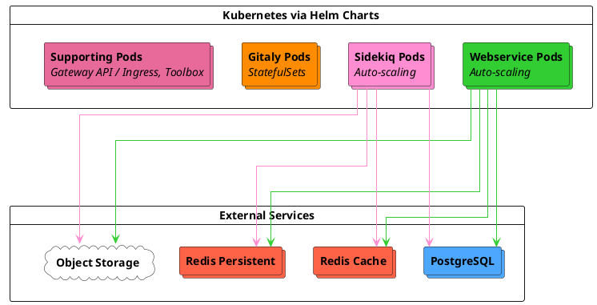



- Niveau :  Free, Premium, Ultimate
- Offre :  GitLab Self-Managed
- Statut :  Bêta



Les architectures de référence Cloud Native First sont conçues pour les modèles de déploiement cloud-native modernes avec quatre tailles standardisées (S/M/L/XL) basées sur les caractéristiques de charge de travail. Ces architectures déploient tous les composants GitLab dans Kubernetes, tandis que PostgreSQL, Redis et le stockage d'objets utilisent des solutions tierces externes, notamment des services gérés ou des options sur site.

> [!note]
> Ces architectures sont en [bêta](../../policy/development_stages_support.md#beta). Nous encourageons les retours d'expérience et continuerons à affiner les spécifications sur la base des données d'utilisation en production.

## Présentation de l'architecture {#architecture-overview}

Les architectures Cloud Native First déploient les composants GitLab dans Kubernetes et des services externes :

**Kubernetes components :**

- **Webservice** \- Gère les requêtes web
- **Sidekiq** \- Traite les jobs en arrière-plan
- **Gitaly** \- Gère les dépôts Git à l'aide de StatefulSets avec des volumes persistants
- **Supporting services** \- Composants Gateway API / Ingress, Toolbox et de surveillance

> [!note]
> Lors du déploiement de Gitaly sur Kubernetes, Gitaly ne prend en charge que les configurations fragmentées (non-cluster). Vous pouvez mettre à niveau Gitaly sans interruption de service grâce aux [nouvelles tentatives client](../settings/gitaly_timeouts.md). Chaque pod Gitaly est un point de défaillance unique pour les dépôts qu'il sert. Gitaly Cluster (Praefect) n'est pas pris en charge sur Kubernetes.
>
> Si vous avez besoin d'une haute disponibilité Gitaly avec basculement automatique, envisagez les [architectures Cloud Native Hybrid](_index.md#cloud-native-hybrid), qui déploient Gitaly Cluster sur des machines virtuelles tout en exécutant des composants sans état dans Kubernetes. Pour les exigences et limitations de Gitaly sur Kubernetes, consultez [Gitaly sur Kubernetes](../gitaly/kubernetes.md#requirements).

**External services :**

- **PostgreSQL** \- Service de base de données géré déployé avec un réplica de secours optionnel pour la haute disponibilité et des réplicas en lecture pour une stabilité et des performances supplémentaires
- **Redis** \- Instances de cache et persistantes séparées, chacune déployée optionnellement avec un réplica de secours pour la haute disponibilité
- **Object Storage** \- Services de stockage d'objets tels que S3, Google Cloud Storage ou Azure Blob Storage pour les artefacts et les packages

Pour les fournisseurs de services gérés recommandés (GCP Cloud SQL, AWS RDS, Azure Database, etc.), consultez les [fournisseurs et services cloud recommandés](_index.md#recommended-cloud-providers-and-services).

## Architectures disponibles {#available-architectures}

Ces architectures sont conçues autour de plages RPS cibles représentant les modèles de charge de travail de production typiques. Les cibles RPS servent de points de départ ; vos besoins en capacité spécifiques dépendent de la composition de la charge de travail et des modèles d'utilisation. Pour des conseils sur la composition RPS et les cas où des ajustements sont nécessaires, consultez [Comprendre la composition RPS](sizing.md#understanding-rps-composition-and-workload-patterns).

| Taille | RPS cible | Charge de travail prévue |
|------|------------|-------------------|
| S | ≤100 | Équipes avec une activité de développement légère et une automatisation minimale |
| M | ≤200 | Organisations avec une vélocité de développement modérée et une utilisation standard du CI/CD |
| L | ≤500 | Grandes équipes avec une activité de développement intense et une automatisation significative |
| XL | ≤1000 | Déploiements d'entreprise avec des charges de travail intensives et des intégrations étendues |

Pour des conseils détaillés sur la détermination de votre charge attendue et la sélection de la taille appropriée, consultez le [guide de dimensionnement des architectures de référence](sizing.md).

## Avantages clés {#key-benefits}

Les architectures Cloud Native First offrent :

- **Self-healing infrastructure** \- Kubernetes redémarre automatiquement les pods défaillants et replanifie les charges de travail sur les nœuds sains
- **Dynamic resource scaling** \- Le Horizontal Pod Autoscaler et le Cluster Autoscaler ajustent la capacité en fonction de la demande réelle
- **Simplified deployment** \- Pas de gestion traditionnelle des VM pour les composants GitLab, tout est orchestré via Kubernetes
- **Reduced operational overhead** \- Les services gérés pour PostgreSQL, Redis et le stockage d'objets éliminent la maintenance des bases de données et des caches
- **Built-in high availability** \- Déploiements multi-zones avec basculement automatique pour tous les composants
- **Improved cost efficiency** \- Les ressources se réduisent lors des périodes de faible demande tout en maintenant la capacité pour les pics

## Prérequis {#requirements}

Avant de déployer une architecture Cloud Native First, assurez-vous de disposer de :

- [Cluster Kubernetes](https://docs.gitlab.com/charts/installation/cloud/) pris en charge et autres [prérequis Charts](https://docs.gitlab.com/charts/installation/tools/) en place
- Instance PostgreSQL externe avec base(s) de données, utilisateur(s) et extension(s) configurés
- Instance(s) Redis externe(s)
- Service de stockage d'objets (S3, Google Cloud Storage, Azure Blob Storage ou autre)

Pour les exigences complètes, notamment la mise en réseau, les types de machines et les services des fournisseurs cloud, consultez les [exigences des architectures de référence](_index.md#requirements).

Pour les exigences spécifiques et les limitations de Gitaly sur Kubernetes, consultez les [exigences de Gitaly sur Kubernetes](../gitaly/kubernetes.md#requirements).

## Small (S) {#small-s}

**Target load :** ≤ 100 RPS | Charge globale légère

**Workload characteristics :**

- **Total RPS range :** ≤ 100 requêtes par seconde
- **Git operations :** Activité légère de push et pull Git
- **Repository size :** Non adapté aux monodépôts utilisés activement
- **CI/CD usage :** Exécution légère de pipelines en parallèle
- **API traffic :** Capacité légère pour les charges de travail automatisées
- **User patterns :** Certaine résilience aux pics d'utilisation

### Composants Kubernetes {#kubernetes-components}

| Composant | Ressources par pod | Pods/Workers minimum | Pods/Workers maximum | Exemple de configuration de nœud |
|-----------|------------------|------------------|------------------|---------------------------|
| Webservice | 2 vCPU, 3 Go (requête), 4 Go (limite) | 12 pods (24 workers) | 18 pods (36 workers) | GCP :  6 × n2-standard-8 AWS :  6 × c6i.2xlarge |
| Sidekiq | 900m vCPU, 2 Go (requête), 4 Go (limite) | 8 workers | 12 workers | GCP :  3 × n2-standard-4 AWS :  3 × m6i.xlarge |
| Gitaly | 7 vCPU, 30 Go (requête et limite) | 3 pods | 3 pods | GCP :  3 × n2-standard-8 AWS :  3 × m6i.2xlarge |
| Support | Variable selon le service | 12 vCPU, 48 Go | 12 vCPU, 48 Go | GCP :  3 × n2-standard-4 AWS :  3 × c6i.xlarge |

### Configuration de mise à l'échelle des pods {#pod-scaling-configuration}

| Composant | Pods min → max | Workers min → max | Ressources par pod | Workers par pod |
|-----------|----------------|-------------------|-------------------|-----------------|
| Webservice | 12 → 18 | 24 → 36 | 2 vCPU, 3 Go (requête), 4 Go (limite) | 2 |
| Sidekiq | 8 → 12 | 8 → 12 | 900m vCPU, 2 Go (requête), 4 Go (limite) | 1 |
| Gitaly | 3 (sans mise à l'échelle automatique) | sans objet | 7 vCPU, 30 Go (requête et limite) | sans objet |

**Gitaly notes :** cgroups Git :  27 Go, tampon :  3 Go. cgroups de dépôt définis à 1. Consultez la [configuration des cgroups Gitaly](#gitaly-cgroups-configuration) pour des conseils d'optimisation.

### Services externes {#external-services}

| Service | Configuration | Équivalent GCP | Équivalent AWS |
|---------|---------------|----------------|----------------|
| PostgreSQL | 8 vCPU, 32 Go | n2-standard-8 | m6i.2xlarge |
| Redis - Cache | 2 vCPU, 8 Go | n2-standard-2 | m6i.large |
| Redis - Persistant | 2 vCPU, 8 Go | n2-standard-2 | m6i.large |
| Stockage d'objets | Service du fournisseur cloud | Google Cloud Storage | Amazon S3 |

## Medium (M) {#medium-m}

**Target load :** ≤ 200 RPS | Charge globale modérée

**Workload characteristics :**

- **Total RPS range :** ≤ 200 requêtes par seconde
- **Git operations :** Activité modérée de push et pull Git
- **Repository size :** Monodépôts peu utilisés pris en charge. Des modificateurs de performance peuvent être requis pour des monodépôts plus grands ou très utilisés
- **CI/CD usage :** Concurrence modérée des pipelines
- **API traffic :** Charges de travail d'automatisation standard prises en charge
- **User patterns :** Bonne résilience aux fluctuations d'utilisation

### Composants Kubernetes {#kubernetes-components-1}

| Composant | Ressources par pod | Pods/Workers minimum | Pods/Workers maximum | Exemple de configuration de nœud |
|-----------|------------------|------------------|------------------|---------------------------|
| Webservice | 2 vCPU, 3 Go (requête), 4 Go (limite) | 28 pods (56 workers) | 42 pods (84 workers) | GCP :  6 × n2-standard-16 AWS :  6 × c6i.4xlarge |
| Sidekiq | 900m vCPU, 2 Go (requête), 4 Go (limite) | 16 workers | 24 workers | GCP :  3 × n2-standard-8 AWS :  3 × m6i.2xlarge |
| Gitaly | 15 vCPU, 62 Go (requête et limite) | 3 pods | 3 pods | GCP :  3 × n2-standard-16 AWS :  3 × m6i.4xlarge |
| Support | Variable selon le service | 12 vCPU, 48 Go | 12 vCPU, 48 Go | GCP :  3 × n2-standard-4 AWS :  3 × c6i.xlarge |

### Configuration de mise à l'échelle des pods {#pod-scaling-configuration-1}

| Composant | Pods min → max | Workers min → max | Ressources par pod | Workers par pod |
|-----------|----------------|-------------------|-------------------|-----------------|
| Webservice | 28 → 42 | 56 → 84 | 2 vCPU, 3 Go (requête), 4 Go (limite) | 2 |
| Sidekiq | 16 → 24 | 16 → 24 | 900m vCPU, 2 Go (requête), 4 Go (limite) | 1 |
| Gitaly | 3 (sans mise à l'échelle automatique) | sans objet | 15 vCPU, 62 Go (requête et limite) | sans objet |

**Gitaly notes :** cgroups Git :  56 Go, tampon :  6 Go. cgroups de dépôt définis à 1. Consultez la [configuration des cgroups Gitaly](#gitaly-cgroups-configuration) pour des conseils d'optimisation.

### Services externes {#external-services-1}

| Service | Configuration | Équivalent GCP | Équivalent AWS |
|---------|---------------|----------------|----------------|
| PostgreSQL | 16 vCPU, 64 Go | n2-standard-16 | m6i.4xlarge |
| Redis - Cache | 2 vCPU, 8 Go | n2-standard-2 | m6i.large |
| Redis - Persistant | 2 vCPU, 8 Go | n2-standard-2 | m6i.large |
| Stockage d'objets | Service du fournisseur cloud | Google Cloud Storage | Amazon S3 |

## Large (L) {#large-l}

**Target load :** ≤ 500 RPS | Charge globale élevée

**Workload characteristics :**

- **Total RPS range :** ≤ 500 requêtes par seconde
- **Git operations :** Activité intense de push et pull Git
- **Repository size :** Monodépôts modérément utilisés pris en charge. Des modificateurs de performance peuvent être requis pour des monodépôts plus grands ou très utilisés
- **CI/CD usage :** Utilisation intensive des pipelines avec une mise à l'échelle Sidekiq appropriée
- **API traffic :** Charges de travail d'automatisation significatives prises en charge
- **User patterns :** Forte résilience aux fluctuations d'utilisation

### Composants Kubernetes {#kubernetes-components-2}

| Composant | Ressources par pod | Pods/Workers minimum | Pods/Workers maximum | Exemple de configuration de nœud |
|-----------|------------------|------------------|------------------|---------------------------|
| Webservice | 2 vCPU, 3 Go (requête), 4 Go (limite) | 56 pods (112 workers) | 84 pods (168 workers) | GCP :  6 × n2-standard-32 AWS :  6 × c6i.8xlarge |
| Sidekiq | 900m vCPU, 2 Go (requête), 4 Go (limite) | 32 workers | 48 workers | GCP :  6 × n2-standard-8 AWS :  6 × m6i.2xlarge |
| Gitaly | 31 vCPU, 126 Go (requête et limite) | 3 pods | 3 pods | GCP :  3 × n2-standard-32 AWS :  3 × m6i.8xlarge |
| Support | Variable selon le service | 12 vCPU, 48 Go | 12 vCPU, 48 Go | GCP :  3 × n2-standard-4 AWS :  3 × c6i.xlarge |

### Configuration de mise à l'échelle des pods {#pod-scaling-configuration-2}

| Composant | Pods min → max | Workers min → max | Ressources par pod | Workers par pod |
|-----------|----------------|-------------------|-------------------|-----------------|
| Webservice | 56 → 84 | 112 → 168 | 2 vCPU, 3 Go (requête), 4 Go (limite) | 2 |
| Sidekiq | 32 → 48 | 32 → 48 | 900m vCPU, 2 Go (requête), 4 Go (limite) | 1 |
| Gitaly | 3 (sans mise à l'échelle automatique) | sans objet | 31 vCPU, 126 Go (requête et limite) | sans objet |

**Gitaly notes :** cgroups Git :  120 Go, tampon :  6 Go. cgroups de dépôt définis à 1. Consultez la [configuration des cgroups Gitaly](#gitaly-cgroups-configuration) pour des conseils d'optimisation.

### Services externes {#external-services-2}

| Service | Configuration | Équivalent GCP | Équivalent AWS |
|---------|---------------|----------------|----------------|
| PostgreSQL | 32 vCPU, 128 Go | n2-standard-32 | m6i.8xlarge |
| Redis - Cache | 2 vCPU, 16 Go | n2-highmem-2 | r6i.large |
| Redis - Persistant | 2 vCPU, 16 Go | n2-highmem-2 | r6i.large |
| Stockage d'objets | Service du fournisseur cloud | Google Cloud Storage | Amazon S3 |

## Extra Large (XL) {#extra-large-xl}

**Target load :** ≤ 1 000 RPS | Charge globale intensive

**Workload characteristics :**

- **Total RPS range :** ≤ 1 000 requêtes par seconde
- **Git operations :** Activité intensive de push et pull Git
- **Repository size :** Monodépôts très utilisés pris en charge. Des modificateurs de performance peuvent être requis pour des monodépôts plus grands ou intensément utilisés
- **CI/CD usage :** Charges de travail CI/CD intensives
- **API traffic :** Trafic d'automatisation et d'intégration intense
- **User patterns :** Conçu pour des modèles d'accès variés

### Composants Kubernetes {#kubernetes-components-3}

| Composant | Ressources par pod | Pods/Workers minimum | Pods/Workers maximum | Exemple de configuration de nœud |
|-----------|------------------|------------------|------------------|---------------------------|
| Webservice | 2 vCPU, 3 Go (requête), 4 Go (limite) | 110 pods (220 workers) | 165 pods (330 workers) | GCP :  6 × n2-standard-64 AWS :  6 × c6i.16xlarge |
| Sidekiq | 900m vCPU, 2 Go (requête), 4 Go (limite) | 64 workers | 96 workers | GCP :  6 × n2-standard-16 AWS :  6 × m6i.4xlarge |
| Gitaly | 63 vCPU, 254 Go (requête et limite) | 3 pods | 3 pods | GCP :  3 × n2-standard-64 AWS :  3 × m6i.16xlarge |
| Support | Variable selon le service | 24 vCPU, 96 Go | 24 vCPU, 96 Go | GCP :  3 × n2-standard-8 AWS :  3 × c6i.2xlarge |

### Configuration de mise à l'échelle des pods {#pod-scaling-configuration-3}

| Composant | Pods min → max | Workers min → max | Ressources par pod | Workers par pod |
|-----------|----------------|-------------------|-------------------|-----------------|
| Webservice | 110 → 165 | 220 → 330 | 2 vCPU, 3 Go (requête), 4 Go (limite) | 2 |
| Sidekiq | 64 → 96 | 64 → 96 | 900m vCPU, 2 Go (requête), 4 Go (limite) | 1 |
| Gitaly | 3 (sans mise à l'échelle automatique) | sans objet | 63 vCPU, 254 Go (requête et limite) | sans objet |

**Gitaly notes :** cgroups Git :  248 Go, tampon :  6 Go. cgroups de dépôt définis à 1. Consultez la [configuration des cgroups Gitaly](#gitaly-cgroups-configuration) pour des conseils d'optimisation.

### Services externes {#external-services-3}

| Service | Configuration | Équivalent GCP | Équivalent AWS |
|---------|---------------|----------------|----------------|
| PostgreSQL | 64 vCPU, 256 Go | n2-standard-64 | m6i.16xlarge |
| Redis - Cache | 2 vCPU, 16 Go | n2-highmem-2 | r6i.large |
| Redis - Persistant | 2 vCPU, 16 Go | n2-highmem-2 | r6i.large |
| Stockage d'objets | Service du fournisseur cloud | Google Cloud Storage | Amazon S3 |

## Informations supplémentaires {#additional-information}

Cette section fournit des conseils supplémentaires pour le déploiement et l'exploitation des architectures Cloud Native First, notamment la sélection du type de machine, les considérations spécifiques aux composants et les stratégies de mise à l'échelle.

### Conseils sur les types de machines {#machine-type-guidance}

Les types de machines indiqués sont des exemples utilisés lors de la validation et des tests. Vous pouvez utiliser :

- Types de machines de nouvelle génération
- Instances basées sur ARM (AWS Graviton)
- Familles de machines différentes répondant ou dépassant les spécifications
- Types de machines personnalisés dimensionnés selon vos besoins spécifiques

N'utilisez pas de types d'instances burstables en raison de performances inconsistantes.

Pour plus d'informations, consultez les [types de machines pris en charge](_index.md#supported-machine-types).

### Considérations relatives à Gitaly {#gitaly-considerations}

Gitaly dans Kubernetes avec les architectures Cloud Native First utilise des StatefulSets avec les spécifications suivantes :

- **Exclusive node placement** \- Les pods Gitaly sont déployés sur des nœuds dédiés pour éviter les problèmes de voisinage bruyant.
- **Resource allocation** \- Les requêtes et limites des pods sont définies à la capacité du nœud moins la surcharge (2 Go de mémoire, 1 vCPU réservé pour les processus système Kubernetes).
- **Git cgroups memory** \- Allouée avec un tampon de 10 % par défaut, plafonnée à 6 Go maximum pour les pods plus grands. Par exemple, Small alloue 27 Go aux cgroups Git avec un tampon de 3 Go, tandis que Medium et les tailles supérieures utilisent le plafond de 6 Go (56 Go de cgroups avec 6 Go de tampon pour Medium).

**Gitaly deployment mode :**

De par sa conception, Gitaly (non-Cluster) sur Kubernetes est un service à point de défaillance unique pour les dépôts stockés sur chaque pod. Les données sont sourcées et servies depuis une seule instance par pod. Chaque pod Gitaly gère son propre ensemble de dépôts, assurant une mise à l'échelle horizontale du stockage Git via la distribution des dépôts.

Gitaly Cluster (Praefect) n'est pas pris en charge dans les architectures Cloud Native First. Pour le contexte sur les limitations du déploiement Gitaly dans Kubernetes, consultez [Gitaly sur Kubernetes](../gitaly/kubernetes.md).

**Repository distribution :**

Avec plusieurs stockages Gitaly configurés (par exemple `default`, `storage1`, `storage2`), GitLab crée par défaut tous les nouveaux dépôts sur le stockage `default`. Pour distribuer les dépôts sur tous les pods Gitaly, configurez les poids de stockage pour équilibrer la charge.

Pour des conseils sur la configuration des poids de stockage des dépôts, consultez [configurer où les nouveaux dépôts sont stockés](../repository_storage_paths.md#configure-where-new-repositories-are-stored).

#### Configuration des cgroups Gitaly {#gitaly-cgroups-configuration}

Gitaly utilise les [cgroups](../gitaly/cgroups.md) pour se protéger contre l'épuisement des ressources dû aux opérations Git individuelles. La configuration par défaut définit le nombre de cgroups de dépôt à 1, ce qui constitue un point de départ permettant à n'importe quel dépôt individuel d'utiliser toutes les ressources du pod via la sursouscription.

Cependant, cette configuration peut ne pas être optimale pour toutes les charges de travail. Pour les environnements avec de nombreux dépôts actifs ou des exigences spécifiques d'isolation des ressources, vous devez ajuster la configuration des cgroups en fonction des modèles d'utilisation observés. Cela inclut l'ajustement du nombre de cgroups de dépôt et des allocations de mémoire.

Pour des conseils détaillés sur la mesure, l'optimisation et la configuration des cgroups Gitaly, consultez [cgroups Gitaly](../gitaly/cgroups.md).

Pour les grands monodépôts (de plus de 2 Go) ou les charges de travail Git intensives, des ajustements supplémentaires de Gitaly peuvent être nécessaires. Consultez le [guide de dimensionnement des architectures de référence](sizing.md) pour des conseils détaillés.

### Notes sur les services externes {#external-service-notes}

- PostgreSQL peut être déployé avec un réplica de secours pour la haute disponibilité. Des réplicas en lecture peuvent être ajoutés pour une stabilité et des performances supplémentaires. Les environnements plus grands (L, XL) bénéficient davantage des réplicas en lecture pour distribuer la charge de la base de données.
- Les instances Redis peuvent être déployées avec un réplica en veille pour la haute disponibilité. Sur GCP, les instances Memorystore sont configurées uniquement par la mémoire. Les spécifications des machines sont indiquées à titre de référence.
- Pour tous les services de fournisseur cloud impliquant la configuration d'instances, il est recommandé de mettre en œuvre un minimum de trois nœuds dans trois zones de disponibilité différentes afin d'être conforme aux pratiques d'architecture cloud résiliente.

### Mise à l'échelle automatique et nombre minimum de pods {#autoscaling-and-minimum-pod-counts}

Toutes les architectures utilisent Kubernetes Horizontal Pod Autoscaler (HPA) et Cluster Autoscaler pour gérer la capacité :

- **Webservice** \- Mise à l'échelle basée sur l'utilisation du CPU avec des nombres minimum de pods conservateurs
- **Sidekiq** \- Mise à l'échelle basée sur l'utilisation du CPU
- **Cluster Autoscaler** \- Provisionne et supprime automatiquement les nœuds en fonction des demandes de ressources des pods

Les nombres minimum de pods sont fixés à environ 2/3 du maximum pour équilibrer l'efficacité des coûts et la fiabilité des performances, sur la base de tests internes visant à atteindre les objectifs suivants :

- Mise à l'échelle réactive lors des augmentations de la demande
- Capacité suffisante lors des défaillances de nœuds ou des mises à niveau
- Optimisation des coûts durant les périodes de faible demande

Si vous avez des modèles de charge bien compris, vous pouvez ajuster les minimums en fonction de vos besoins :

- **Increase minimums** pour les environnements avec des pics de trafic importants ou des SLA de performance stricts
- **Decrease minimums** lorsque la surveillance indique une charge soutenue constamment inférieure aux valeurs par défaut

### Mise à l'échelle avancée {#advanced-scaling}

Les architectures Cloud Native First sont conçues pour évoluer au-delà de leurs spécifications de base. Vous pourriez avoir besoin d'ajuster la capacité si votre environnement présente :

- Un débit constamment supérieur aux cibles RPS répertoriées
- Une composition de charge de travail atypique (voir [Comprendre la composition RPS](sizing.md#understanding-rps-composition-and-workload-patterns))
- Des monodépôts volumineux (de plus de 2 Go)
- Des charges de travail supplémentaires importantes
- Une utilisation intensive de GitLab Duo Agent Platform

Les stratégies de mise à l'échelle diffèrent selon le type de composant.

#### Mise à l'échelle horizontale (Webservice et Sidekiq) {#horizontal-scaling-webservice-and-sidekiq}

Pour augmenter la capacité, effectuez une mise à l'échelle horizontale en ajustant le nombre maximum de réplicas et la capacité du pool de nœuds :

- **Webservice** \- Augmentez `maxReplicas` dans les valeurs Helm et ajoutez les nœuds correspondants au pool de nœuds Webservice
- **Sidekiq** \- Augmentez `maxReplicas` pour gérer un débit de jobs plus élevé et ajoutez des nœuds au pool de nœuds Sidekiq

La mise à l'échelle horizontale est l'approche recommandée pour ces composants sans état.

#### Mise à l'échelle verticale (PostgreSQL, Redis, Gitaly) {#vertical-scaling-postgresql-redis-gitaly}

Pour les composants avec état, augmentez les spécifications des instances ou des pods :

- **PostgreSQL and Redis** \- Passez à des types d'instances plus grandes via votre fournisseur de services gérés.
- **Gitaly** \- Augmentez les spécifications CPU et mémoire par pod. Cela nécessite des types de nœuds plus grands dans le pool de nœuds Gitaly et des ajustements correspondants à l'allocation de mémoire des cgroups Git.

#### Optimisation de la file d'attente Sidekiq {#sidekiq-queue-optimization}

Par défaut, Sidekiq traite tous les types de jobs dans une seule file d'attente. Pour les environnements avec des modèles de charge de travail variés, vous pouvez configurer des files d'attente distinctes en fonction des caractéristiques des jobs :

- **High-urgency queues** \- Pour les jobs urgents comme le traitement des pipelines CI et la livraison de webhooks
- **CPU-bound queues** \- Pour les jobs à forte intensité de calcul avec des paramètres de simultanéité ajustés
- **Default queue** \- Pour le traitement standard en arrière-plan

La séparation des files d'attente peut améliorer la fiabilité du traitement des jobs et empêcher les jobs à faible priorité de bloquer les opérations urgentes, en particulier dans les environnements plus grands (L, XL) avec des charges de travail d'automatisation importantes.

Pour plus d'informations sur la configuration des files d'attente Sidekiq, consultez [le traitement de classes de jobs spécifiques](../sidekiq/processing_specific_job_classes.md).

#### Mise à l'échelle pour GitLab Duo Agent Platform {#scaling-for-gitlab-duo-agent-platform}

GitLab Duo Agent Platform introduit des exigences d'infrastructure supplémentaires au-delà des charges de travail GitLab standard. Pour des conseils détaillés sur la surveillance et la mise à l'échelle pour l'adoption d'Agent Platform, consultez [Mise à l'échelle pour GitLab Duo Agent Platform](_index.md#scaling-for-gitlab-duo-agent-platform).

#### Considérations de mise à l'échelle {#scaling-considerations}

Lors de la mise à l'échelle significative d'un composant :

- Surveillez les composants dépendants pour détecter la saturation des ressources. Une charge accrue sur Webservice ou Sidekiq peut avoir un impact sur PostgreSQL et Gitaly.
- Testez d'abord les modifications de mise à l'échelle dans des environnements hors production.
- Mettez à l'échelle les composants interdépendants ensemble pour éviter de déplacer les goulots d'étranglement entre les services.

Pour des conseils complets sur la mise à l'échelle, consultez [la mise à l'échelle d'un environnement](_index.md#scaling-an-environment).

## Déploiement {#deployment}

Les architectures Cloud Native First peuvent être déployées à l'aide de charts Helm et de fournisseurs de services externes directement ou via le GitLab Environment Toolkit.

### GitLab Environment Toolkit {#gitlab-environment-toolkit}

Le [GitLab Environment Toolkit](https://gitlab.com/gitlab-org/gitlab-environment-toolkit) fournit un déploiement automatisé avec :

- Infrastructure as Code (Terraform) pour les ressources cloud
- Configuration automatisée des charts Helm
- Paramètres pré-validés pour chaque taille d'architecture
- Mises à niveau et maintenance simplifiées

Pour les instructions de déploiement, consultez la [documentation du GitLab Environment Toolkit](https://gitlab.com/gitlab-org/gitlab-environment-toolkit/-/blob/main/README.md).

### Déploiement manuel {#manual-deployment}

Prérequis pour le déploiement manuel :

- PostgreSQL externe avec les bases de données, utilisateurs et permissions requis configurés
- Instances Redis externes configurées et accessibles
- Compartiments Object Storage créés
- Secrets Kubernetes créés pour l'authentification selon les besoins (mot de passe PostgreSQL, mots de passe Redis, informations d'identification Object Storage, secrets GitLab)

Pour les prérequis détaillés et la configuration des secrets, consultez [les prérequis du chart GitLab](https://docs.gitlab.com/charts/installation/tools/) et [configurer les secrets](https://docs.gitlab.com/charts/installation/secrets/).

Pour le déploiement manuel à l'aide de charts Helm :

1. Configurez les services externes requis et les secrets comme décrit dans les prérequis
1. Configurez un cluster Kubernetes avec les pools de nœuds et l'autoscaler appropriés
1. Appliquez la configuration des valeurs Helm indiquée dans la section [Configuration du chart Helm](#helm-chart-configurations)
1. Déployez GitLab à l'aide de `helm install`

Pour les étapes détaillées du déploiement manuel, consultez [l'installation de GitLab sur Kubernetes](https://docs.gitlab.com/charts/installation/).

## Configurations du chart Helm {#helm-chart-configurations}

Pour des exemples complets de configuration du chart Helm et des conseils détaillés sur le déploiement, consultez le [dépôt GitLab Charts](https://gitlab.com/gitlab-org/charts/gitlab/-/tree/master/examples/ref).

Principaux domaines de configuration pour les architectures Cloud Native First :

- **Resource specifications** \- Les limites de CPU et de mémoire des pods correspondent aux spécifications de chaque taille d'architecture ci-dessus
- **Autoscaling** \- Les configurations HPA fixent le nombre minimum de pods à 2/3 du maximum avec des cibles de mise à l'échelle basées sur le CPU
- **Node placement** \- Les sélecteurs de nœuds garantissent que les charges de travail sont déployées dans les pools de nœuds appropriés (par exemple : `webservice`, `sidekiq`, `gitaly`, `support`)
- **External services** \- Détails de connexion pour PostgreSQL, Redis et Object Storage
- **Gitaly** \- Configuration StatefulSet avec cgroups, persistance et distribution du stockage

Pour les nombres de réplicas et les valeurs de ressources spécifiques à chaque architecture, référez-vous aux spécifications dans chaque section de taille ci-dessus.

> [!note]
> Les architectures Cloud Native First sont en version bêta. Des exemples spécifiques de configuration du chart Helm seront ajoutés au dépôt Charts au fur et à mesure que la fonctionnalité progresse vers la disponibilité générale. Utilisez les spécifications de chaque section de taille d'architecture ci-dessus pour construire votre configuration de valeurs Helm.

## Étapes suivantes {#next-steps}

Après le déploiement, les environnements nécessitent généralement une surveillance et un réglage pour correspondre aux modèles de charge de travail réels.

### Surveiller et valider {#monitor-and-validate}

1. **Monitor resource utilization** \- Suivez l'utilisation du CPU, de la mémoire et la profondeur des files d'attente pour tous les composants à l'aide de [Prometheus](../monitoring/prometheus/_index.md)
1. **Validate RPS assumptions** \- Comparez votre [décomposition RPS](sizing.md#extract-peak-traffic-metrics) réelle à la composition supposée 80/10/10
1. **Identify potential adjustments** \- Recherchez les composants constamment au-dessus de 70 % d'utilisation
1. **Review Gitaly cgroups** \- Envisagez d'ajuster [les nombres de cgroups de dépôts](../gitaly/cgroups.md) en fonction de vos modèles d'accès aux dépôts

### Ajuster si nécessaire {#adjust-as-needed}

Les architectures de référence sont des points de départ. De nombreux environnements bénéficient d'ajustements basés sur :

- **Actual workload composition** \- Si votre répartition API/Web/Git diffère significativement des modèles typiques, consultez [Comprendre la composition RPS](sizing.md#understanding-rps-composition-and-workload-patterns)
- **Repository characteristics** \- Les tailles de monodépôts, la fréquence de clonage et les modèles d'accès peuvent nécessiter [des ajustements spécifiques aux composants](sizing.md#identify-component-adjustments)
- **Growth patterns** \- Augmentation du nombre d'utilisateurs, expansion CI/CD ou mise à l'échelle de l'automatisation

Consultez [Mise à l'échelle avancée](#advanced-scaling) pour des conseils d'ajustement spécifiques aux composants.

### Configurer les fonctionnalités optionnelles {#configure-optional-features}

Vous pouvez configurer des fonctionnalités optionnelles supplémentaires de GitLab selon vos besoins. Consultez [les étapes après l'installation de GitLab](../../install/next_steps.md) pour plus d'informations.

> [!note]
> Une capacité supplémentaire peut être requise pour les fonctionnalités optionnelles. Consultez la documentation spécifique à la fonctionnalité pour connaître les exigences.
