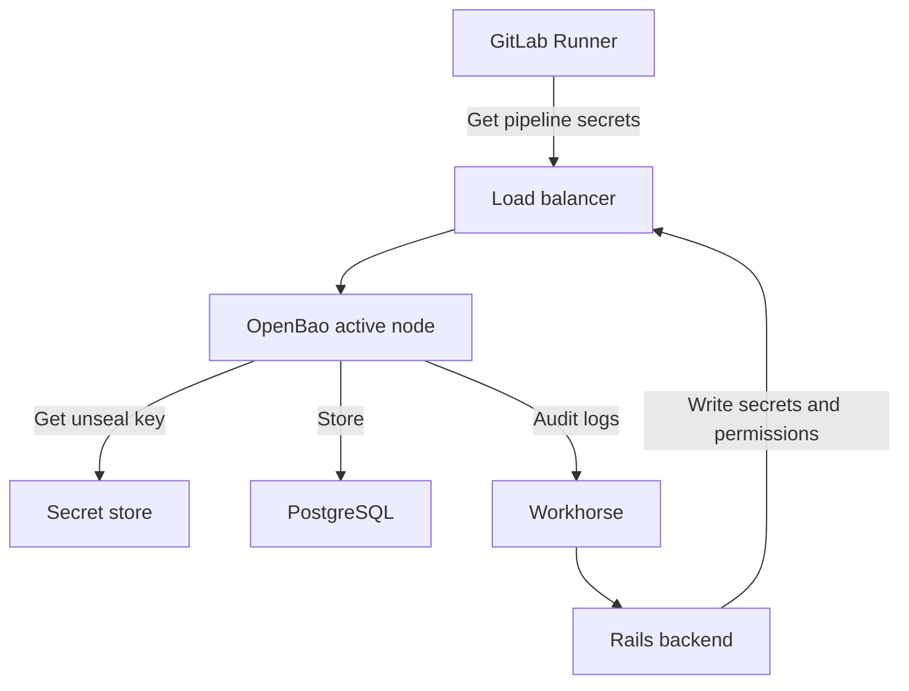



- Niveau :  Premium, Ultimate
- Offre :  GitLab Self-Managed
- Statut :  Bêta





- [Introduit](https://gitlab.com/groups/gitlab-org/-/work_items/16319) dans GitLab 18.8 en tant qu'expérience, rendu disponible pour certains testeurs initiaux dans une [bêta](../../policy/development_stages_support.md#beta) fermée dans GitLab 18.8.
- Bêta publique [introduite](https://gitlab.com/groups/gitlab-org/-/work_items/21731) dans GitLab 19.0.



Le [GitLab Secrets Manager](../../ci/secrets/secrets_manager/_index.md) utilise [OpenBao](https://openbao.org/), une solution open source de gestion des secrets. OpenBao assure le stockage sécurisé, le contrôle d'accès et la gestion du cycle de vie des secrets utilisés dans votre instance GitLab.

Les jobs GitLab CI/CD utilisant des secrets provenant du GitLab Secrets Manager doivent utiliser [GitLab Runner](https://docs.gitlab.com/runner/#gitlab-runner-versions) 19.0 ou une version ultérieure.

## Architecture d'OpenBao {#openbao-architecture}

OpenBao s'intègre à GitLab en tant que composant optionnel fonctionnant en parallèle aux services GitLab existants.

- Le backend Rails et les runners se connectent à l'API OpenBao via un équilibreur de charge.
- OpenBao stocke les données dans PostgreSQL. Le chart Helm configure OpenBao pour utiliser une base de données logique séparée sur la même instance PostgreSQL. Configurez la connexion en utilisant `global.openbao.psql` dans le chart Helm.
- OpenBao obtient la clé de déscellement depuis un magasin de secrets.
- OpenBao lit la clé de déscellement depuis un secret Kubernetes monté par le chart Helm.
- OpenBao publie les journaux d'audit vers le backend Rails lorsque les journaux d'audit sont activés.



OpenBao fonctionne avec un seul nœud actif qui traite toutes les requêtes, et optionnellement plusieurs nœuds en veille qui prennent le relais si le nœud actif tombe en panne.

## Installer OpenBao {#install-openbao}

Prérequis :

- Accès administrateur.
- GitLab 19.0 ou version ultérieure.
- Un cluster Kubernetes.
- Pour les déploiements Cloud Native GitLab, une instance PostgreSQL externe (non Omnibus). L'instance PostgreSQL externe est requise par le chart Helm GitLab pour les déploiements Cloud Native, et non par OpenBao spécifiquement. OpenBao utilise une base de données logique séparée sur cette instance.

Choisissez la méthode d'installation en fonction de votre déploiement GitLab :

- **Cloud Native GitLab** :  Utilisez cette méthode si vous déployez GitLab sur Kubernetes. Pour plus d'informations, consultez la [documentation du chart Helm OpenBao](https://docs.gitlab.com/charts/charts/openbao/).
- **Linux package** :  Utilisez cette méthode si vous déployez GitLab avec le package Linux, sur un seul nœud ou sur plusieurs nœuds. Pour plus d'informations, consultez [installer OpenBao pour une instance du package Linux](linux_package_integration.md).

Après l'installation, vérifiez qu'OpenBao fonctionne en suivant la [documentation utilisateur du GitLab Secrets Manager](../../ci/secrets/secrets_manager/_index.md).

## Recommandations de dimensionnement {#sizing-recommendations}

Les besoins en ressources d'OpenBao dépendent de la taille de votre instance GitLab et des modèles d'utilisation des secrets.

Ces recommandations sont des points de départ validés. Surveillez votre déploiement et ajustez les ressources en fonction des modèles d'utilisation réels. Vos besoins varieront en fonction du nombre de jobs CI/CD qui récupèrent des secrets, et du nombre de groupes et de projets avec le Secrets Manager activé.

### Ressources des pods {#pod-resources}

OpenBao fonctionne avec un seul nœud actif qui traite toutes les requêtes. Les réplicas supplémentaires assurent uniquement le basculement pour la haute disponibilité. Les nœuds en veille ne servent pas le trafic en lecture car OpenBao ne prend pas en charge la scalabilité horizontale en lecture (HRS) lorsqu'il est connecté à une base de données PostgreSQL.

| Récupérations de secrets/s | Demande CPU | Demande de mémoire | Réplicas |
|------------------|-------------|----------------|----------|
| Jusqu'à 3          | 500m        | 2 Go           | 2        |
| Jusqu'à 6          | 500 m        | 3 Go           | 2        |
| Jusqu'à 12         | 500 m        | 4 Go           | 2        |
| Jusqu'à 30         | 500 m        | 9 Go           | 2        |
| Jusqu'à 60         | 1 000 m      | 16 Go          | 2        |
| Jusqu'à 150        | 2 000 m      | 31 Go          | 2        |

#### Estimer votre taux de récupération de secrets {#estimate-your-secret-fetch-rate}

Pour déterminer quelle ligne s'applique, estimez vos récupérations de secrets par seconde :

```plaintext
fetches/s = Git Pull RPS × adoption rate × 3
```

Où :

- `Git Pull RPS` est le débit de tirage Git (Git pull) maximal de votre instance GitLab. Vous pouvez le mesurer depuis la surveillance de votre environnement existant, consultez [Extraire les métriques de trafic maximal](../reference_architectures/sizing.md#extract-peak-traffic-metrics).
- `adoption rate` est la fraction des jobs CI/CD qui utilisent le Secrets Manager (par exemple, 0,05 pour 5 %, 0,20 pour 20 %, ou 0,50 pour 50 %).
- `3` est le nombre moyen supposé de secrets récupérés par job utilisant le Secrets Manager.

Sélectionnez la ligne où **Secret fetches/s** atteint ou dépasse légèrement votre résultat. Par exemple, un déploiement avec 20 Git pull RPS mesurés à 20 % d'adoption : `20 × 0.20 × 3 = 12 fetches/s`. Utilisez au moins la ligne **Up to 12**.

Après le déploiement, vérifiez vos estimations par rapport à l'utilisation réelle. Utilisez les [requêtes de surveillance](#monitor-your-openbao-deployment) pour mesurer l'utilisation des ressources et passez à la ligne suivante lorsque les seuils sont dépassés.

### Calcul des ressources {#how-resources-are-calculated}

Le **CPU** est déterminé par la fréquence à laquelle les jobs CI/CD récupèrent des secrets. Les opérations d'écriture de secrets (création ou mise à jour de secrets) sont rares par rapport au volume de pipeline et contribuent de manière négligeable à la charge CPU. Le tableau utilise le taux de clonage Git (Git Pull RPS) comme indicateur du taux de jobs CI, car chaque job CI/CD commence par un clonage Git. Pour la formule, consultez [Estimer votre taux de récupération de secrets](#estimate-your-secret-fetch-rate). Définissez la limite CPU à deux fois la demande CPU. Cela offre une marge de montée en charge pour les pics de démarrage et de provisionnement sans sur-réserver sur le nœud en régime permanent.

La **Mémoire** est déterminée par le nombre d'espaces de nommage OpenBao, ce qui correspond au nombre de groupes et de projets GitLab avec le Secrets Manager activé. Allouez environ 5 Mo par espace de nommage, plus une marge de sécurité de 1 Go, avec un minimum de 2 Go. Définissez la limite de mémoire égale à la demande de mémoire (classe QoS Guaranteed). OpenBao plante immédiatement lorsqu'il dépasse sa limite de mémoire, sans dégradation progressive.

Les **Replicas** assurent uniquement le basculement pour la haute disponibilité. Utilisez 2 réplicas pour tous les déploiements. OpenBao ne prend pas en charge la scalabilité horizontale en lecture (HRS) avec le backend de stockage PostgreSQL, donc les réplicas supplémentaires n'apportent aucun avantage en termes de débit.

### Ressources de base de données {#database-resources}

OpenBao stocke ses données dans une base de données PostgreSQL séparée. Vous pouvez la coloquer sur le même serveur PostgreSQL que les bases de données GitLab. Aucune capacité de calcul de base de données supplémentaire au-delà des [recommandations PostgreSQL de l'architecture de référence](../reference_architectures/_index.md) n'est requise.

#### Pool de connexions à la base de données {#database-connection-pool}

Le chart Helm OpenBao configure ces valeurs par défaut du pool de connexions PostgreSQL :

| Paramètre                                              | Valeur par défaut |
|------------------------------------------------------|---------------|
| `config.storage.postgresql.maxParallel`              | 5             |
| `config.storage.postgresql.maxIdleConnections`       | 2             |

N'augmentez pas ces valeurs sauf si vous observez un temps d'attente de connexion à la base de données dans votre surveillance.

#### Stockage de la base de données {#database-storage}

Les besoins en stockage de la base de données dépendent principalement du nombre total de secrets. Chaque secret, y compris ses métadonnées et ses versions stockées, nécessite environ 13 Ko de stockage.

| Total des secrets  | Stockage estimé |
|----------------|-------------------|
| 10 000         | ~130 Mo           |
| 50 000         | ~650 Mo           |
| 100 000        | ~1,3 Go           |
| 200 000        | ~2,6 Go           |

La croissance du stockage est négligeable pour tous les niveaux d'architecture de référence. Allouer 5 à 10 Go de stockage de base de données offre une marge confortable.

## Surveiller votre déploiement OpenBao {#monitor-your-openbao-deployment}

Utilisez les requêtes suivantes pour vérifier que votre déploiement est correctement dimensionné et pour détecter quand une mise à l'échelle est nécessaire.

### Utilisation du CPU {#cpu-utilization}

Pour mesurer l'utilisation du CPU par OpenBao :

```prometheus
sum(rate(container_cpu_usage_seconds_total{container="openbao-server"}[5m]))
```

Le résultat est exprimé en cœurs CPU. Multipliez par 1 000 pour convertir en millicœurs afin de comparer avec les valeurs de demande CPU dans le tableau de dimensionnement. Si l'utilisation du CPU dépasse constamment 50 % de la demande CPU, envisagez de passer à la ligne suivante dans le tableau de dimensionnement.

### Utilisation de la mémoire {#memory-utilization}

Pour mesurer l'utilisation de la mémoire par OpenBao :

```prometheus
sum(container_memory_working_set_bytes{container="openbao-server"})
```

Le résultat est exprimé en octets. La mémoire augmente à mesure que les groupes et les projets activent le Secrets Manager, d'environ 5 Mo par espace de nommage. Après un redémarrage, la mémoire se stabilise à mesure qu'OpenBao charge les métadonnées des paces de nommage depuis la base de données.

Pour calculer la demande de mémoire correcte, comptez les groupes et les projets avec le Secrets Manager activé et multipliez par 5 Mo, puis ajoutez 1 Go. Mettez à jour les ressources de votre pod si le résultat dépasse votre demande de mémoire actuelle. Si la mémoire affiche une tendance à la hausse soutenue sans provisionnement actif, recherchez des problèmes potentiels.

### Limitation du CPU {#cpu-throttling}

Pour détecter la limitation du CPU pouvant affecter la latence :

```prometheus
sum(rate(container_cpu_cfs_throttled_periods_total{container="openbao-server"}[5m]))
/
sum(rate(container_cpu_cfs_periods_total{container="openbao-server"}[5m]))
```

Un ratio de limitation supérieur à 0,25 (25 %) indique que la limite CPU est trop faible pour la charge de travail actuelle. Lorsqu'OpenBao est limité, les goroutines en attente de temps CPU entraînent une latence accrue lors de la récupération des secrets.

### Points de terminaison de vérification de l'état {#health-check-endpoints}

OpenBao fournit des points de terminaison de vérification de l'état pour la surveillance :

- `<your-openbao-url>/v1/sys/health` :  Renvoie l'état de santé d'OpenBao
- `<your-openbao-url>/v1/sys/seal-status` :  Renvoie l'état de scellement

Vous pouvez intégrer ces points de terminaison à votre système de surveillance.

## Sauvegarde et restauration {#backup-and-restore}

OpenBao stocke les données dans une base de données logique séparée sur PostgreSQL. Sauvegardez cette base de données en même temps que votre sauvegarde GitLab habituelle pour vous assurer que les secrets peuvent être restaurés après une défaillance.

Pour les procédures détaillées de sauvegarde et de restauration spécifiques à OpenBao, consultez la [documentation de sauvegarde OpenBao](https://docs.gitlab.com/charts/charts/openbao/#back-up-openbao).

## Gestion des clés de récupération {#recovery-key-management}

Pour des informations sur la gestion de la clé de récupération OpenBao, notamment le stockage, la consultation et son utilisation pour générer un jeton root, consultez la [gestion des clés de récupération](recovery_key.md).

## Haute disponibilité {#high-availability}

OpenBao utilise une architecture à nœud actif unique. Un nœud traite toutes les requêtes, et les nœuds en veille assurent un basculement automatique si le nœud actif tombe en panne.

### Basculement {#failover}

Les nœuds en veille chargent toutes les métadonnées des paces de nommage au démarrage, de sorte que la promotion vers le statut actif ne nécessite aucune initialisation supplémentaire. Le nombre d'espaces de nommage n'affecte pas le temps de basculement.

Pour les déploiements en production :

- Exécutez au moins deux réplicas OpenBao pour la redondance.
- Utilisez un backend PostgreSQL hautement disponible.
- Implémentez la surveillance et les alertes à l'aide des [requêtes de surveillance](#monitor-your-openbao-deployment).

### Temps d'arrêt lors d'une mise à niveau {#upgrade-downtime}

OpenBao ne prend pas en charge les mises à niveau sans interruption de service. Lors d'une mise à niveau, OpenBao initialise chaque space de nommage de manière séquentielle au démarrage. Chaque groupe ou projet avec le Secrets Manager activé compte comme un espace de nommage.

Pour effectuer la mise à niveau, cela prend environ 11 secondes pour 1 000 espaces de nommage, plus une base de 5 secondes.

Lorsqu'OpenBao implémentera le chargement des paces de nommage à la demande, le temps d'arrêt lors des mises à niveau sera considérablement réduit. Pour plus d'informations, consultez [l'issue 595721](https://gitlab.com/gitlab-org/gitlab/-/work_items/595721).

## Déploiement Geo {#geo-deployment}

OpenBao prend en charge les déploiements [Geo](../geo/_index.md). OpenBao est déployé sur les sites Geo primaire et secondaire, mais seul le site primaire exécute un nœud OpenBao actif.

### Comportement d'OpenBao dans Geo {#openbao-behavior-in-geo}

Sur le site primaire, OpenBao s'exécute en tant que nœud actif connecté à une base de données PostgreSQL accessible en écriture. Sur le site secondaire, OpenBao s'exécute en mode veille, connecté à un réplica de lecture PostgreSQL.

La réplication en streaming PostgreSQL transporte automatiquement toutes les données OpenBao (secrets, politiques, configuration d'authentification) du site primaire vers le site secondaire.

Les deux instances GitLab (primaire et secondaire) se connectent à l'URL OpenBao primaire. Le déploiement OpenBao secondaire reste en veille, et est promu au statut actif lorsque la base de données PostgreSQL secondaire devient accessible en écriture lors d'un [basculement Geo](../geo/disaster_recovery/_index.md#step-4-optional-promote-the-openbao-ha-cluster).

Sur le site secondaire, OpenBao enregistre les erreurs `failed to acquire lock` et `cannot execute INSERT in a read-only transaction`. Ces erreurs sont attendues. OpenBao ne peut pas acquérir le verrou de leader HA sur une base de données en lecture seule.

### Installer OpenBao sur un site secondaire {#install-openbao-on-a-secondary-site}

Prérequis :

- Geo doit être configuré. Pour plus d'informations, consultez [Configurer Geo](../geo/setup/_index.md).
- OpenBao doit être installé et opérationnel sur le site primaire avant de le déployer sur le site secondaire. Pour plus d'informations, consultez [Installer OpenBao](#install-openbao).

1. L'OpenBao secondaire doit utiliser la même clé de déscellement que le primaire pour déchiffrer les données répliquées. Copiez le secret Kubernetes `gitlab-openbao-unseal` depuis le cluster primaire vers le cluster secondaire :

   ```shell
   kubectl --namespace gitlab get secret gitlab-openbao-unseal -o yaml
   ```

   Appliquez le secret exporté au cluster secondaire. Pour plus d'informations, consultez [Sauvegarder les secrets](https://docs.gitlab.com/charts/backup-restore/backup/#back-up-the-secrets).

1. Si vous prévoyez de mettre à jour l'enregistrement DNS du domaine primaire pour pointer vers le site secondaire lors du basculement, vous pouvez configurer OpenBao en conséquence à l'avance. Configurez le chart Helm et définissez `url` et `jwt_audience` sur l'URL OpenBao primaire :

   ```yaml
   global:
     openbao:
       enabled: true
       url: https://openbao.<primary-domain>
       jwt_audience: https://openbao.<primary-domain>
   ```

   Pour plus d'informations sur les options de configuration du chart, consultez [Configuration Geo](https://docs.gitlab.com/charts/charts/openbao/#geo-configuration).

1. Déployez le chart Helm GitLab sur le site secondaire. Les pods OpenBao démarrent et restent en mode veille. C'est le comportement attendu.

1. Sur le cluster secondaire, vérifiez que les pods OpenBao sont en cours d'exécution :

   ```shell
   kubectl --namespace gitlab get pods -l app=openbao
   ```

   Tous les pods doivent être à l'état `Running`. Les pods secondaires n'ont pas le label `openbao-active: "true"`. C'est le comportement attendu.

1. Confirmez que le service actif n'a aucun point de terminaison sur le cluster secondaire :

   ```shell
   kubectl --namespace gitlab get endpoints gitlab-openbao-active
   ```

   Zéro point de terminaison sur le secondaire est attendu.

1. Testez le Secrets Manager en exécutant un pipeline CI qui utilise une [variable Secrets Manager](../../ci/secrets/secrets_manager/_index.md) sur le site secondaire.

## Dépannage {#troubleshooting}

Lorsque vous travaillez avec le Secrets Manager, vous pouvez rencontrer les problèmes suivants.

### Dépanner les déploiements Geo {#troubleshoot-geo-deployments}

| Symptôme | Cause | Résolution |
|---------|-------|------------|
| `cipher: message authentication failed` ou `unknown key ID` dans les journaux OpenBao secondaires | Discordance de clé de déscellement entre le primaire et le secondaire | Copiez `gitlab-openbao-unseal` depuis le cluster primaire vers le cluster secondaire et redémarrez les pods OpenBao. |
| `failed to acquire lock` dans les journaux OpenBao secondaires | OpenBao en veille sur une base de données en lecture seule | Comportement attendu. Aucune action requise. |
| `cannot execute INSERT in a read-only transaction` dans les journaux OpenBao secondaires | OpenBao tentant une élection de leader sur un réplica de lecture | Comportement attendu. Aucune action requise. |
| Échec de l'authentification JWT après un basculement Geo | `jwt_audience` ne correspond pas à `boundAudiences` dans OpenBao | Définissez `jwt_audience` sur l'URL OpenBao primaire sur les deux sites. |

### Diagnostiquer les opérations de secrets lentes {#diagnose-slow-secret-operations}

Utilisez cette section lorsque les jobs CI/CD sont lents à récupérer des secrets ou que les opérations sur les secrets expirent.

#### Confirmer que la latence est élevée {#confirm-latency-is-elevated}

Utilisez la requête suivante pour mesurer la latence moyenne des requêtes en millisecondes. La requête fonctionne à n'importe quel niveau de trafic, y compris les déploiements à faible trafic :

```prometheus
rate(openbao_core_handle_request_sum[5m])
/
rate(openbao_core_handle_request_count[5m])
```

Dans des conditions de charge normales, la latence moyenne pour tous les types de requêtes est généralement de 3 à 7 ms. Analysez si la latence moyenne dépasse constamment 20 ms.

Lorsqu'OpenBao traite activement des requêtes, utilisez la requête suivante pour la latence P99 :

```prometheus
openbao_core_handle_request{quantile="0.99"}
```

Le P99 normal est inférieur à 10 ms. Cette requête renvoie `NaN` lorsqu'OpenBao est inactif car la fenêtre de résumé ne contient aucune observation récente. Utilisez la requête basée sur le taux dans ce cas.

#### Identifier les problèmes potentiels {#identify-potential-issues}

| Problème potentiel             | Élément à vérifier                   | Requête                                                                       | Seuil           | Action                                                             |
|-----------------------------|---------------------------------|-----------------------------------------------------------------------------|---------------------|--------------------------------------------------------------------|
| Limite CPU trop faible           | Ratio de limitation CFS              | [Requête de limitation CPU](#cpu-throttling)                                     | > 25 %               | Augmenter la limite CPU                                                 |
| La demande dépasse la capacité CPU | Utilisation du CPU                 | [Requête d'utilisation CPU](#cpu-utilization)                                   | > 50 % de la demande    | Passer à la ligne suivante dans le [tableau de dimensionnement](#pod-resources)        |
| Pic de requêtes               | Requêtes en cours              | `openbao_core_in_flight_requests`                                           | Soutenu au-dessus de 5   | Transitoire. Surveiller les récurrences.                                 |
| Goulot d'étranglement PostgreSQL       | Latence moyenne de lecture PostgreSQL | `rate(openbao_postgres_get_sum[5m]) / rate(openbao_postgres_get_count[5m])` | > 5 ms              | Vérifier les ressources PostgreSQL et le pool de connexions                     |
| Pression mémoire             | Utilisation de la mémoire              | [Requête d'utilisation de la mémoire](#memory-utilization)                             | Proche de la demande de mémoire | Augmenter la mémoire en utilisant la [formule de l'espace de nommage](#memory-utilization) |

Si la latence PostgreSQL est élevée, vérifiez si le pool de connexions est saturé. Si toutes les connexions sont occupées, les requêtes supplémentaires sont mises en file d'attente et entraînent une latence. Pour la configuration du pool de connexions, consultez [Ressources de base de données](#database-resources). Vérifiez le nombre de connexions dans votre surveillance PostgreSQL ou dans les journaux OpenBao.
