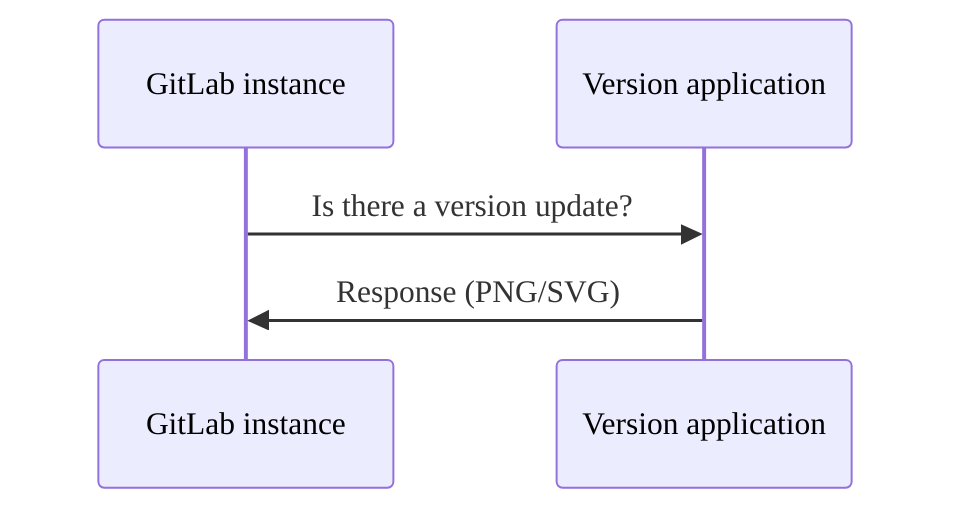



- Niveau :  Free, Premium, Ultimate
- Offre :  GitLab Self-Managed



GitLab Inc. collecte périodiquement des informations sur votre instance afin d'effectuer diverses actions.

Pour les instances GitLab Self-Managed gratuites, toutes les statistiques d'utilisation sont [opt-out](#enable-or-disable-service-ping).

## Service Ping {#service-ping}

Service Ping est un processus qui collecte et envoie une charge utile hebdomadaire à GitLab Inc. Lorsque Service Ping est activé, GitLab collecte des données à partir d'autres instances et active certaines [fonctionnalités d'analyse au niveau de l'instance](../../user/analytics/_index.md) qui dépendent de Service Ping.

### Pourquoi activer Service Ping ? {#why-enable-service-ping}

L'objectif principal de Service Ping est de contribuer à l'amélioration de GitLab. Nous collectons des données sur la façon dont GitLab est utilisé afin de comprendre l'adoption et l'utilisation des fonctionnalités ou des étapes. Ces données donnent un aperçu de la valeur ajoutée de GitLab et aident notre équipe à comprendre les raisons pour lesquelles les gens utilisent GitLab. Grâce à ces connaissances, nous sommes en mesure de prendre de meilleures décisions en matière de produit.

L'activation de Service Ping présente plusieurs autres avantages :

- Analysez les activités des utilisateurs au fil du temps de votre installation GitLab.
- Un [score DevOps](../analytics/devops_adoption.md) pour vous donner une vue d'ensemble de l'adoption du DevOps simultané par l'ensemble de votre instance, de la planification à la surveillance.
- Un support plus proactif grâce aux Customer Success Managers (CSM) qui peuvent utiliser les données collectées.
- Des conseils et des recommandations sur la façon de tirer le meilleur parti de votre investissement dans GitLab.
- Des rapports montrant comment vous vous comparez à d'autres organisations similaires (anonymisées), avec des conseils et des recommandations spécifiques sur la façon d'améliorer vos processus DevOps.
- Participation à notre [Programme de fonctionnalités d'inscription](#registration-features-program) pour recevoir des fonctionnalités payantes gratuitement.

### Paramètres de Service Ping {#service-ping-settings}

GitLab fournit trois paramètres liés à Service Ping :

- **Enable Service Ping** :  Contrôle si les données Service Ping sont envoyées à GitLab.
- **Activer la génération de ping de service** :  Contrôle si les données Service Ping sont générées sur votre instance.
- **Include optional data in Service Ping** :  Contrôle si les métriques optionnelles sont incluses dans les données Service Ping.

Ces trois paramètres interagissent de la manière suivante :

- Lorsque **Service Ping** est activé, **Service Ping Generation** est automatiquement activé et ne peut pas être désactivé.
- Lorsque **Service Ping** est désactivé, vous pouvez contrôler indépendamment **Service Ping Generation**.
- **Include optional data in Service Ping** est disponible uniquement lorsque **Service Ping** ou **Service Ping Generation** est activé.

## Programme de fonctionnalités d'inscription {#registration-features-program}

Dans les versions 14.1 et ultérieures de GitLab, les clients GitLab Free disposant d'une instance GitLab Self-Managed exécutant GitLab Enterprise Edition peuvent bénéficier de fonctionnalités payantes en [activant les fonctionnalités d'inscription](#enable-registration-features) et en nous envoyant des données d'activité via Service Ping. Les fonctionnalités introduites ici ne suppriment pas la fonctionnalité de son niveau payant. Les instances sur un niveau payant sont soumises à la [politique sur les données d'utilisation du produit](https://handbook.gitlab.com/handbook/legal/privacy/customer-product-usage-information/) gérée par [Cloud Licensing](https://about.gitlab.com/pricing/licensing-faq/cloud-licensing/).

### Fonctionnalités disponibles {#available-features}

Le tableau suivant présente :

- Les fonctionnalités disponibles avec le Programme de fonctionnalités d'inscription
- La version de GitLab à partir de laquelle les fonctionnalités sont disponibles

| Fonctionnalité | Disponible dans |
| ------ | ------ |
| [Email from GitLab](../email_from_gitlab.md)       |   GitLab 14.1 et versions ultérieures     |
| [Limite de taille du dépôt](account_and_limit_settings.md#repository-size-limit) | GitLab 14.4 et versions ultérieures |
| [Restriction d'accès au groupe par adresse IP](../../user/group/access_and_permissions.md#restrict-group-access-by-ip-address) | GitLab 14.4 et versions ultérieures |
| [Afficher l'historique des modifications de description](../../user/discussions/_index.md#view-description-change-history) | GitLab 16.0 et versions ultérieures |
| [Mode maintenance](../maintenance_mode/_index.md) | GitLab 16.0 et versions ultérieures |
| [Tableaux des tickets configurables](../../user/project/issue_board.md#configurable-issue-boards) | GitLab 16.0 et versions ultérieures |
| [Test fuzz guidé par la couverture](../../user/application_security/coverage_fuzzing/_index.md) | GitLab 16.0 et versions ultérieures |
| [Modifier les exigences de complexité du mot de passe](sign_up_restrictions.md#modify-password-complexity-requirements) | GitLab 16.0 et versions ultérieures |
| [Wikis de groupe](../../user/project/wiki/group.md) | GitLab 16.5 et versions ultérieures |
| [Analyse des tickets](../../user/group/issues_analytics/_index.md) | GitLab 16.5 et versions ultérieures |
| [Texte personnalisé dans les e-mails](email.md#custom-additional-text) | GitLab 16.5 et versions ultérieures |
| [Analyse des contributions](../../user/group/contribution_analytics/_index.md) | GitLab 16.5 et versions ultérieures |
| [Modèles de fichiers de groupe](../../user/group/manage.md#group-file-templates) | GitLab 16.6 et versions ultérieures |
| [Webhooks de groupe](../../user/project/integrations/webhooks.md#group-webhooks) | GitLab 16.6 et versions ultérieures |
| [Minuteur de compte à rebours du contrat de niveau de service](../../operations/incident_management/incidents.md#service-level-agreement-countdown-timer) | GitLab 16.6 et versions ultérieures |
| [Verrouiller l'appartenance au projet pour le groupe](../../user/group/access_and_permissions.md#prevent-members-from-being-added-to-projects-in-a-group) | GitLab 16.6 et versions ultérieures |
| [Rapport sur les utilisateurs et les autorisations](../admin_area.md#user-permission-export) | GitLab 16.6 et versions ultérieures |
| [Recherche avancée](../../user/search/advanced_search.md) | GitLab 16.6 et versions ultérieures |
| [Adoption DevOps](../../user/group/devops_adoption/_index.md) | GitLab 16.6 et versions ultérieures |
| [Pipelines inter-projets avec dépendances d'artefacts](../../ci/yaml/_index.md#needsproject) | GitLab 16.7 et versions ultérieures |
| [Tickets liés aux feature flags](../../operations/feature_flags.md#feature-flag-related-issues) | GitLab 16.7 et versions ultérieures |
| [Pipelines de résultats fusionnés](../../ci/pipelines/merged_results_pipelines.md) | GitLab 16.7 et versions ultérieures |
| [CI/CD pour les dépôts externes](../../ci/ci_cd_for_external_repos/_index.md) | GitLab 16.7 et versions ultérieures |
| [CI/CD pour GitHub](../../ci/ci_cd_for_external_repos/github_integration.md) | GitLab 16.7 et versions ultérieures |

### Activer les fonctionnalités d'inscription {#enable-registration-features}

1. Connectez-vous en tant qu'utilisateur disposant d'un accès administrateur.
1. Dans le coin supérieur droit, sélectionnez **Admin**.
1. Dans la barre latérale gauche, sélectionnez **Paramètres** > **Statistiques et rapports**.
1. Développez la section **Statistiques d'utilisation**.
1. Si elle n'est pas activée, cochez la case **Enable Service Ping**.
1. Cochez la case **Activer les fonctionnalités d'inscription**.
1. Sélectionnez **Sauvegarder les modifications**.

## Vérification de version {#version-check}

Si elle est activée, la vérification de version vous informe de la disponibilité d'une nouvelle version et de son importance via un statut. Le statut s'affiche sur les pages d'aide (`/help`) pour tous les utilisateurs authentifiés, et sur les pages de la zone **Admin**. Les statuts sont :

- Vert :  Vous utilisez la dernière version de GitLab.
- Orange :  Une version mise à jour de GitLab est disponible.
- Rouge :  La version de GitLab que vous utilisez est vulnérable. Vous devez installer la dernière version avec les correctifs de sécurité dès que possible.


### Activer ou désactiver la vérification de version {#enable-or-disable-version-check}

Prérequis :

- Accès administrateur.

1. Dans le coin supérieur droit, sélectionnez **Admin**.
1. Dans la barre latérale gauche, sélectionnez **Paramètres** > **Statistiques et rapports**.
1. Développez **Statistiques d'utilisation**.
1. Cochez ou décochez la case **Activer le contrôle de version**.
1. Sélectionnez **Sauvegarder les modifications**.

### Exemple de flux de requêtes {#request-flow-example}

L'exemple suivant montre un flux de requête/réponse basique entre votre instance et l'application GitLab Version :



## Configurer votre réseau {#configure-your-network}

Pour envoyer des statistiques d'utilisation à GitLab Inc., vous devez autoriser le trafic réseau de votre instance GitLab vers l'hôte `version.gitlab.com` sur le port `443`.

Si votre instance GitLab est derrière un proxy, définissez les [variables de configuration du proxy](https://docs.gitlab.com/omnibus/settings/environment-variables/) appropriées.

## Activer ou désactiver Service Ping {#enable-or-disable-service-ping}

> [!note]
> La possibilité de désactiver complètement Service Ping dépend du niveau de l'instance et de la licence spécifique. Les paramètres de Service Ping contrôlent uniquement si les données sont partagées avec GitLab ou limitées à un usage interne par l'instance. Même si vous désactivez Service Ping, le job en arrière-plan `gitlab_service_ping_worker` génère toujours périodiquement une charge utile Service Ping pour votre instance. La charge utile est disponible dans la section d'administration [Statistiques et rapports](#manually-upload-service-ping-payload).

### Via l'interface utilisateur {#through-the-ui}

Prérequis :

- Accès administrateur.

Pour activer ou désactiver Service Ping :

1. Dans le coin supérieur droit, sélectionnez **Admin**.
1. Dans la barre latérale gauche, sélectionnez **Paramètres** > **Statistiques et rapports**.
1. Développez **Statistiques d'utilisation**.
1. Cochez ou décochez la case **Enable Service Ping**.
1. Sélectionnez **Sauvegarder les modifications**.

### Via le fichier de configuration {#through-the-configuration-file}

Pour désactiver Service Ping et empêcher sa configuration future via la zone **Admin**.





1. Modifiez `/etc/gitlab/gitlab.rb` :

   ```ruby
   gitlab_rails['usage_ping_enabled'] = false
   ```

1. Reconfigurez GitLab :

   ```shell
   sudo gitlab-ctl reconfigure
   ```





1. Modifiez `/home/git/gitlab/config/gitlab.yml` :

   ```yaml
   production: &base
     # ...
     gitlab:
       # ...
       usage_ping_enabled: false
   ```

1. Redémarrez GitLab :

   ```shell
   sudo service gitlab restart
   ```





## Activer ou désactiver la génération de Service Ping {#enable-or-disable-service-ping-generation}

La génération de Service Ping contrôle si les données Service Ping sont automatiquement générées sur votre instance. Lorsqu'elle est activée, GitLab génère périodiquement des charges utiles Service Ping contenant des statistiques d'utilisation. Ce paramètre fonctionne indépendamment du partage des données avec GitLab.

### Via l'interface utilisateur {#through-the-ui-1}

Prérequis :

- Accès administrateur.

Pour activer ou désactiver la génération de Service Ping :

1. Dans le coin supérieur droit, sélectionnez **Admin**.
1. Dans la barre latérale gauche, sélectionnez **Paramètres** > **Statistiques et rapports**.
1. Développez **Statistiques d'utilisation**.
1. Cochez ou décochez la case **Activer la génération de ping de service**.
   - Si **Enable Service Ping** est coché, ce paramètre est automatiquement activé et désactivé de toute interaction.
   - Si **Enable Service Ping** est décoché, vous pouvez contrôler ce paramètre indépendamment.
1. Sélectionnez **Sauvegarder les modifications**.

### Via le fichier de configuration {#through-the-configuration-file-1}

Pour contrôler la génération de Service Ping via la configuration :





1. Modifiez `/etc/gitlab/gitlab.rb` :

   ```ruby
   gitlab_rails['usage_ping_enabled'] = false
   gitlab_rails['usage_ping_generation_enabled'] = false
   ```

1. Reconfigurez GitLab :

   ```shell
   sudo gitlab-ctl reconfigure
   ```





1. Modifiez `/home/git/gitlab/config/gitlab.yml` :

   ```yaml
   production: &base
     # ...
     gitlab:
       # ...
       usage_ping_enabled: false
       usage_ping_generation_enabled: false
   ```

1. Redémarrez GitLab :

   ```shell
   sudo service gitlab restart
   ```





## Activer ou désactiver les données optionnelles dans Service Ping {#enable-or-disable-optional-data-in-service-ping}

GitLab fait la distinction entre les données collectées opérationnelles et optionnelles.

> [!note]
> L'option **Include optional data in Service Ping** est disponible uniquement si **Enable Service Ping** ou **Activer la génération de ping de service** est activé. Si les deux paramètres sont désactivés, cette option est automatiquement désactivée.

### Via l'interface utilisateur {#through-the-ui-2}

Prérequis :

- Accès administrateur.

Pour activer ou désactiver les données optionnelles dans Service Ping :

1. Dans le coin supérieur droit, sélectionnez **Admin**.
1. Accédez à **Paramètres** > **Metrics and Profiling**.
1. Développez la section **Usage Statistics**.
1. Assurez-vous que la case **Enable Service Ping** ou **Activer la génération de ping de service** est cochée.
1. Pour activer les données optionnelles, cochez la case **Include optional data in Service Ping**. Pour la désactiver, décochez la case.
1. Sélectionnez **Enregistrer les modifications**.

### Via le fichier de configuration {#through-the-configuration-file-2}





1. Modifiez `/etc/gitlab/gitlab.rb` :

   ```ruby
   gitlab_rails['include_optional_metrics_in_service_ping'] = false
   ```

1. Reconfigurez GitLab :

   ```shell
   sudo gitlab-ctl reconfigure
   ```





1. Modifiez `/home/git/gitlab/config/gitlab.yml` :

   ```yaml
   production: &base
     # ...
     gitlab:
       # ...
       include_optional_metrics_in_service_ping: false
   ```

1. Redémarrez GitLab :

   ```shell
   sudo service gitlab restart
   ```





## Accéder à la charge utile de Service Ping {#access-the-service-ping-payload}

Vous pouvez accéder à la charge utile JSON exacte envoyée à GitLab Inc. dans la zone **Admin** ou via l'API.

### Dans l'interface utilisateur {#in-the-ui}

1. Connectez-vous en tant qu'utilisateur disposant d'un accès administrateur.
1. Dans le coin supérieur droit, sélectionnez **Admin**.
1. Dans la barre latérale gauche, sélectionnez **Paramètres** > **Statistiques et rapports**.
1. Développez **Statistiques d'utilisation**.
1. Sélectionnez **Aperçu de la charge utile**.

### Via l'API {#through-the-api}

Consultez la [documentation de l'API Service Ping](../../api/usage_data.md).

## Téléverser manuellement la charge utile de Service Ping {#manually-upload-service-ping-payload}

Vous pouvez téléverser la charge utile Service Ping vers GitLab même si votre instance ne dispose pas d'un accès Internet, ou si le job cron de Service Ping n'est pas activé.

Pour téléverser la charge utile manuellement :

1. Connectez-vous en tant qu'utilisateur disposant d'un accès administrateur.
1. Dans le coin supérieur droit, sélectionnez **Admin**.
1. Dans la barre latérale gauche, sélectionnez **Paramètres** > **Statistiques et rapports**.
1. Développez **Statistiques d'utilisation**.
1. Sélectionnez **Télécharger la charge utile**.
1. Enregistrez le fichier JSON.
1. Visitez le [centre de données d'utilisation du service](https://version.gitlab.com/usage_data/new).
1. Sélectionnez **Choisir un fichier**, puis sélectionnez le fichier JSON contenant la charge utile téléchargée.
1. Sélectionnez **Téléversement**.

Le fichier téléversé est chiffré et envoyé via le protocole HTTPS sécurisé. HTTPS crée un canal de communication sécurisé entre le navigateur Web et le serveur, et protège les données transmises contre les attaques de type « man-in-the-middle ».

En cas de problème lors du téléversement manuel :

1. Ouvrez un ticket confidentiel dans le [fork de sécurité du projet d'application de version](https://gitlab.com/gitlab-org/security/version.gitlab.com).
1. Joignez la charge utile JSON si possible.
1. Identifiez `@gitlab-org/analytics-section/analytics-instrumentation` qui traitera le ticket confidentiel.
