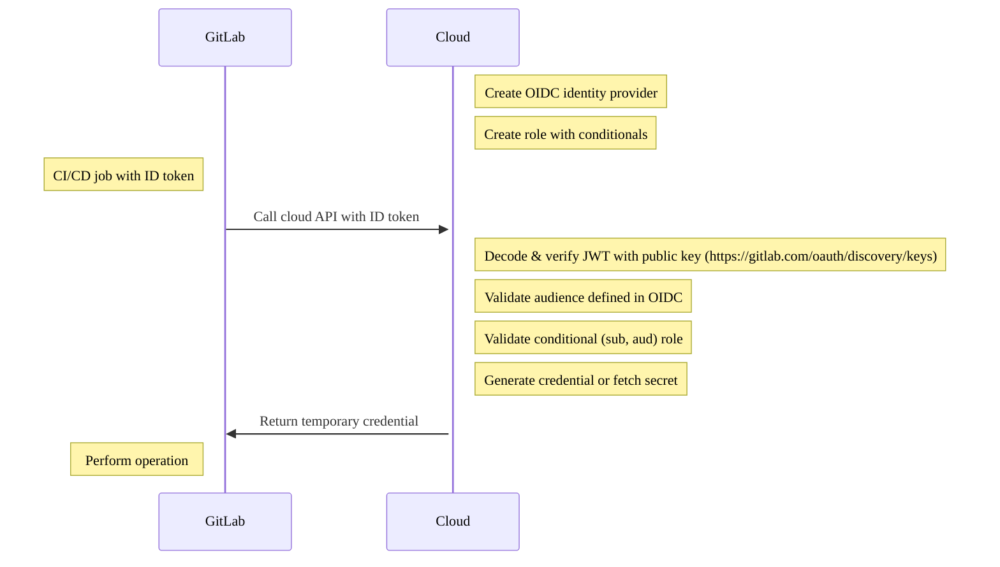



- Édition : Gratuite, GitLab Premium, GitLab Ultimate
- Offre : GitLab.com, GitLab Self-Managed, GitLab Dedicated





- [Les jetons d'ID](../secrets/id_token_authentication.md) pour prendre en charge tout fournisseur OIDC, y compris HashiCorp Vault, [introduits](https://gitlab.com/gitlab-org/gitlab/-/issues/356986) dans GitLab 15.7.



> [!warning]
> `CI_JOB_JWT` et `CI_JOB_JWT_V2` ont été [dépréciés dans GitLab 15.9](../../update/deprecations.md#old-versions-of-json-web-tokens-are-deprecated) et leur suppression est prévue dans GitLab 17.0. Utilisez plutôt les [jetons d'ID](../secrets/id_token_authentication.md).

GitLab CI/CD prend en charge [OpenID Connect (OIDC)](https://openid.net/developers/how-connect-works/) pour donner à vos jobs de build et de déploiement l'accès aux identifiants et services cloud. Historiquement, les équipes stockaient les secrets dans des projets ou appliquaient des permissions sur l'instance GitLab Runner pour builder et déployer. Les [jetons d'ID](../secrets/id_token_authentication.md) compatibles OIDC sont configurables dans le job CI/CD, ce qui vous permet d'adopter une approche de sécurité scalable et à moindre privilège.

Dans GitLab 15.6 et versions antérieures, vous devez utiliser `CI_JOB_JWT_V2` à la place d'un jeton d'ID, mais celui-ci n'est pas personnalisable.

## Prérequis {#prerequisites}

- Compte sur GitLab.
- Accès à un fournisseur cloud prenant en charge OIDC pour configurer l'autorisation et créer des rôles.

Les jetons d'ID prennent en charge les fournisseurs cloud avec OIDC, notamment :

- AWS
- Azure
- GCP
- HashiCorp Vault

> [!note]
> La configuration d'OIDC permet l'accès par jeton JWT aux environnements cibles pour tous les pipelines. Lorsque vous configurez OIDC pour un pipeline, vous devez effectuer une révision de la sécurité de la chaîne d'approvisionnement logicielle pour le pipeline, en vous concentrant sur les accès supplémentaires. Pour plus d'informations sur les attaques de la chaîne d'approvisionnement, consultez [How a DevOps Platform helps protect against supply chain attacks](https://about.gitlab.com/blog/devops-platform-supply-chain-attacks/).

## Cas d'utilisation {#use-cases}

- Supprime la nécessité de stocker des secrets dans votre groupe ou projet GitLab. Des identifiants temporaires peuvent être récupérés auprès de votre fournisseur cloud via OIDC.
- Fournit un accès temporaire aux ressources cloud avec des conditions GitLab granulaires, notamment un groupe, un projet, une branche ou un tag.
- Vous permet de définir une séparation des tâches dans le job CI/CD avec un accès conditionnel aux environnements. Historiquement, les applications pouvaient être déployées avec un GitLab Runner désigné n'ayant accès qu'aux environnements de staging ou de production. Cela entraînait une prolifération des Runners, chaque machine disposant de permissions dédiées.
- Permet aux runners d'instance d'accéder de manière sécurisée à plusieurs comptes cloud. L'accès est déterminé par le jeton JWT, qui est spécifique à l'utilisateur exécutant le pipeline.
- Supprime la nécessité de créer une logique de rotation des secrets en récupérant par défaut des identifiants temporaires.

## Authentification par jeton d'ID pour les services cloud {#id-token-authentication-for-cloud-services}

Chaque job peut être configuré avec des jetons d'ID, qui sont fournis en tant que variable CI/CD contenant le [contenu du jeton](../secrets/id_token_authentication.md#token-payload). Ces JWT peuvent être utilisés pour s'authentifier auprès du fournisseur cloud compatible OIDC, tel qu'AWS, Azure, GCP ou Vault.

### Workflow d'autorisation {#authorization-workflow}



1. Créez un fournisseur d'identité OIDC dans le cloud (par exemple, AWS, Azure, GCP, Vault).
1. Créez un rôle conditionnel dans le service cloud qui filtre par groupe, projet, branche ou tag.
1. Le job CI/CD inclut un jeton d'ID qui est un jeton JWT. Vous pouvez utiliser ce jeton pour l'autorisation avec votre API cloud.
1. Le cloud vérifie le jeton, valide le rôle conditionnel à partir du contenu et retourne un identifiant temporaire.

## Configurer un rôle conditionnel avec des claims OIDC {#configure-a-conditional-role-with-oidc-claims}

Lorsque vous configurez un rôle conditionnel, incluez des identifiants stables et uniques tels que `namespace_id` ou `project_id` aux côtés des claims basés sur le chemin comme `sub` lorsque le fournisseur cloud les prend en charge. Ces identifiants sont indépendants des chemins, de sorte que les politiques de confiance qui y font référence ne sont pas affectées par les modifications de chemins, telles que les renommages de groupes ou de projets.

La prise en charge de ces clés de condition varie selon le fournisseur cloud et l'offre GitLab. Par exemple, AWS prend en charge `namespace_id` et `project_id` uniquement pour le fournisseur d'identité OIDC `gitlab.com`. Pour un exemple de fournisseur, consultez [Configurer OpenID Connect dans AWS](aws/_index.md#configure-a-role-and-trust).

Pour configurer la confiance entre GitLab et OIDC, vous devez créer un rôle conditionnel dans le fournisseur cloud qui vérifie le JWT. La condition est validée par rapport au JWT pour établir une confiance portant spécifiquement sur deux claims : l'audience et le sujet.

- Audience ou `aud` : Configuré dans le cadre du jeton d'ID :

  ```yaml
  job_needing_oidc_auth:
    id_tokens:
      OIDC_TOKEN:
        aud: https://oidc.provider.com
    script:
      - echo $OIDC_TOKEN
  ```

- Sujet ou `sub` : Une concaténation de métadonnées décrivant le workflow GitLab CI/CD incluant le groupe, le projet, la branche et le tag. Le champ `sub` est au format suivant :
  - `project_path:{group}/{project}:ref_type:{type}:ref:{branch_name}`

| Type de filtre                                        | Exemple |
|----------------------------------------------------|---------|
| Filtrer sur n'importe quelle branche                               | Caractère générique pris en charge. `project_path:mygroup/myproject:ref_type:branch:ref:*` |
| Filtrer sur un projet spécifique, branche principale            | `project_path:mygroup/myproject:ref_type:branch:ref:main` |
| Filtrer sur tous les projets d'un groupe               | Caractère générique pris en charge. `project_path:mygroup/*:ref_type:branch:ref:main` |
| Filtrer sur un tag Git                                | Caractère générique pris en charge. `project_path:mygroup/*:ref_type:tag:ref:1.0` |

## Autorisation OIDC avec votre fournisseur cloud {#oidc-authorization-with-your-cloud-provider}

Pour vous connecter à votre fournisseur cloud, consultez les tutoriels suivants :

- [Configurer OpenID Connect dans AWS](aws/_index.md)
- [Configurer OpenID Connect dans Azure](azure/_index.md)
- [Configurer OpenID Connect dans Google Cloud](google_cloud/_index.md)
