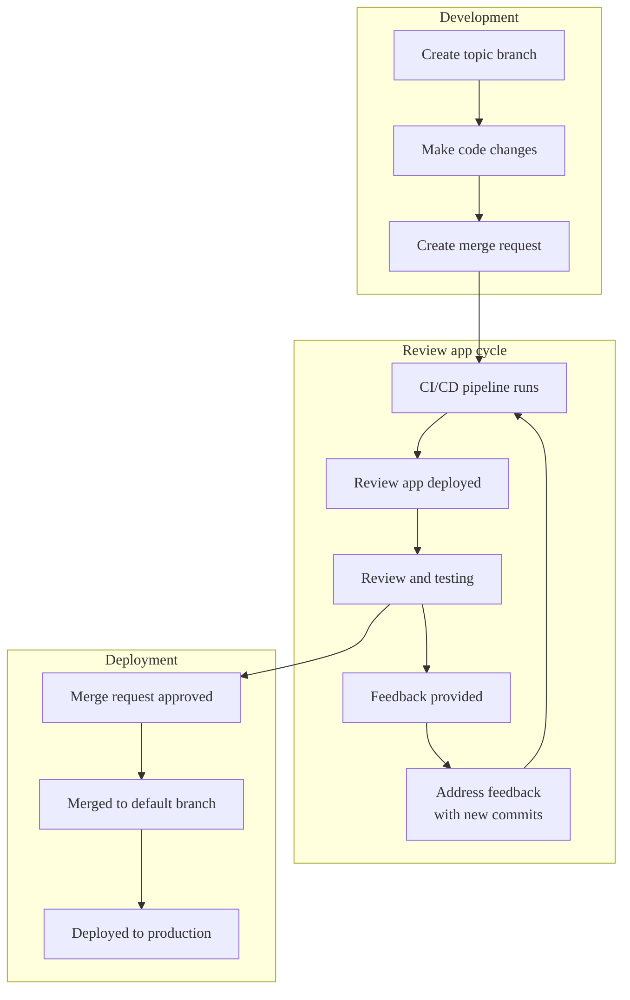



- Édition : Gratuite, GitLab Premium, GitLab Ultimate
- Offre : GitLab.com, GitLab Self-Managed, GitLab Dedicated



Les environnements éphémères sont des environnements de test temporaires qui sont créés automatiquement pour chaque branche ou merge request. Vous pouvez prévisualiser et valider les modifications sans avoir à configurer un environnement de développement local.

Basés sur les [environnements dynamiques](../environments/_index.md#create-a-dynamic-environment), les environnements éphémères fournissent un environnement unique pour chaque branche ou merge request.


Ces environnements contribuent à rationaliser le workflow de développement en :

- Éliminant la nécessité d'une configuration locale pour tester les modifications.
- Fournissant des environnements cohérents à tous les membres de l'équipe.
- Permettant aux parties prenantes de prévisualiser les modifications via une URL.
- Facilitant des cycles de retour d'information plus rapides avant que les modifications n'atteignent la production.

> [!note]
> Si vous disposez d'un cluster Kubernetes, vous pouvez configurer les environnements éphémères automatiquement à l'aide de [Auto DevOps](../../topics/autodevops/_index.md).

## Workflow d'un environnement éphémère {#review-app-workflow}

Un workflow d'environnement éphémère pourrait ressembler à :



## Configurer les environnements éphémères {#configure-review-apps}

Configurez les environnements éphémères lorsque vous souhaitez fournir un environnement de prévisualisation de votre application pour chaque branche ou merge request.

Prérequis :

- Vous devez disposer du rôle Developer, Maintainer ou Owner pour le projet.
- Vous devez avoir des pipelines CI/CD disponibles dans le projet.
- Vous devez configurer l'infrastructure pour héberger et déployer les environnements éphémères.

Pour configurer les environnements éphémères dans votre projet :

1. Dans la barre supérieure, sélectionnez **Rechercher ou aller à** et trouvez votre projet.
1. Dans la barre latérale gauche, sélectionnez **Version** > **Éditeur de pipeline**.
1. Dans votre fichier `.gitlab-ci.yml`, ajoutez un job qui crée un [environnement dynamique](../environments/_index.md#create-a-dynamic-environment). Vous pouvez utiliser une [variable CI/CD prédéfinie](../variables/predefined_variables.md) pour différencier chaque environnement. Par exemple, en utilisant la variable CI/CD prédéfinie `CI_COMMIT_REF_SLUG` :

   ```yaml
   review_app:
     stage: deploy
     script:
       - echo "Deploy to review app environment"
       # Add your deployment commands here
     environment:
       name: review/$CI_COMMIT_REF_SLUG
       url: https://$CI_COMMIT_REF_SLUG.example.com
     rules:
       - if: $CI_COMMIT_BRANCH && $CI_COMMIT_BRANCH != $CI_DEFAULT_BRANCH
   ```

1. facultatif. Ajoutez `when: manual` au job pour ne déployer les environnements éphémères que manuellement.
1. facultatif. Ajoutez un job pour [arrêter l'environnement éphémère](#stop-review-apps) lorsqu'il n'est plus nécessaire.
1. Saisissez un message de commit et sélectionnez **Valider les modifications**.

### Utiliser le modèle d'environnements éphémères {#use-the-review-apps-template}

GitLab fournit un modèle intégré configuré par défaut pour les pipelines de merge request.

Pour utiliser et personnaliser ce modèle :

1. Dans la barre supérieure, sélectionnez **Rechercher ou aller à** et trouvez votre projet.
1. Dans la barre latérale gauche, sélectionnez **Opération** > **Environnements**.
1. Sélectionnez **Activer les applications de revue**.
1. Dans la boîte de dialogue **Activer les applications de revue** qui apparaît, copiez le modèle YAML :

   ```yaml
   deploy_review:
     stage: deploy
     script:
       - echo "Add script here that deploys the code to your infrastructure"
     environment:
       name: review/$CI_COMMIT_REF_NAME
       url: https://$CI_ENVIRONMENT_SLUG.example.com
     rules:
       - if: $CI_PIPELINE_SOURCE == "merge_request_event"
   ```

1. Sélectionnez **Version** > **Éditeur de pipeline**.
1. Collez le modèle dans votre fichier `.gitlab-ci.yml`.
1. Personnalisez le modèle en fonction de vos besoins de déploiement :

   - Modifiez le script de déploiement et l'URL de l'environnement pour qu'ils fonctionnent avec votre infrastructure.
   - Ajustez [la section des règles](../jobs/job_rules.md) si vous souhaitez déployer des environnements éphémères pour des branches même sans merge request.

   Par exemple, pour un déploiement sur Heroku :

   ```yaml
   deploy_review:
     stage: deploy
     image: ruby:latest
     script:
       - apt-get update -qy
       - apt-get install -y ruby-dev
       - gem install dpl
       - dpl --provider=heroku --app=$HEROKU_APP_NAME --api-key=$HEROKU_API_KEY
     environment:
       name: review/$CI_COMMIT_REF_NAME
       url: https://$HEROKU_APP_NAME.herokuapp.com
       on_stop: stop_review_app
     rules:
       - if: $CI_PIPELINE_SOURCE == "merge_request_event"
   ```

   Cette configuration met en place un déploiement automatisé sur Heroku chaque fois qu'un pipeline s'exécute pour une merge request. Elle utilise l'outil de déploiement Ruby `dpl` pour gérer le processus et crée un environnement éphémère dynamique accessible via l'URL spécifiée.

1. Saisissez un message de commit et sélectionnez **Valider les modifications**.

### Arrêter les environnements éphémères {#stop-review-apps}

Vous pouvez configurer vos environnements éphémères pour qu'ils soient arrêtés manuellement ou automatiquement afin de préserver les ressources.

Pour plus d'informations sur l'arrêt des environnements pour les environnements éphémères, consultez [Arrêt d'un environnement](../environments/_index.md#stopping-an-environment).

#### Arrêt automatique des environnements éphémères lors de la fusion {#auto-stop-review-apps-on-merge}

Pour configurer les environnements éphémères afin qu'ils s'arrêtent automatiquement lorsque la merge request associée est fusionnée ou que la branche est supprimée :

1. Ajoutez le mot-clé [`on_stop`](../yaml/_index.md#environmenton_stop) à votre job de déploiement.
1. Créez un job d'arrêt avec [`environment:action: stop`](../yaml/_index.md#environmentaction).
1. facultatif. Ajoutez [`when: manual`](../yaml/_index.md#when) au job d'arrêt pour permettre d'arrêter manuellement l'environnement éphémère à tout moment.

Par exemple :

```yaml
# In your .gitlab-ci.yml file
deploy_review:
  # Other configuration...
  environment:
    name: review/${CI_COMMIT_REF_NAME}
    url: https://${CI_ENVIRONMENT_SLUG}.example.com
    on_stop: stop_review_app  # References the stop_review_app job

stop_review_app:
  stage: deploy
  script:
    - echo "Stop review app"
    # Add your cleanup commands here
  environment:
    name: review/${CI_COMMIT_REF_NAME}
    action: stop
  when: manual  # Makes this job manually triggerable
  rules:
    - if: $CI_PIPELINE_SOURCE == "merge_request_event"
```

#### Arrêt automatique basé sur le temps {#time-based-automatic-stop}

Pour configurer les environnements éphémères afin qu'ils s'arrêtent automatiquement après une période de temps, ajoutez le mot-clé [`auto_stop_in`](../yaml/_index.md#environmentauto_stop_in) à votre job de déploiement :

```yaml
# In your .gitlab-ci.yml file
review_app:
  script: deploy-review-app
  environment:
    name: review/$CI_COMMIT_REF_SLUG
    auto_stop_in: 1 week  # Stops after one week of inactivity
  rules:
    - if: $CI_MERGE_REQUEST_ID
```

## Afficher les environnements éphémères {#view-review-apps}

Pour déployer et accéder aux environnements éphémères :

1. Accédez à votre merge request.
1. facultatif. Si le job d'environnement éphémère est manuel, sélectionnez **Exécution** () pour démarrer le déploiement.
1. Une fois le pipeline terminé, sélectionnez **Voir l'application** pour ouvrir l'environnement éphémère dans votre navigateur.

## Exemples d'implémentations {#example-implementations}

Ces projets illustrent différentes implémentations d'environnements éphémères :

| Projet                                                                                 | Fichier de configuration |
| --------------------------------------------------------------------------------------- | ------------------ |
| [NGINX](https://gitlab.com/gitlab-examples/review-apps-nginx)                           | [`.gitlab-ci.yml`](https://gitlab.com/gitlab-examples/review-apps-nginx/-/blob/b9c1f6a8a7a0dfd9c8784cbf233c0a7b6a28ff27/.gitlab-ci.yml#L20) |
| [OpenShift](https://gitlab.com/gitlab-examples/review-apps-openshift)                   | [`.gitlab-ci.yml`](https://gitlab.com/gitlab-examples/review-apps-openshift/-/blob/82ebd572334793deef2d5ddc379f38942f3488be/.gitlab-ci.yml#L42) |
| [HashiCorp Nomad](https://gitlab.com/gitlab-examples/review-apps-nomad)                 | [`.gitlab-ci.yml`](https://gitlab.com/gitlab-examples/review-apps-nomad/-/blob/ca372c778be7aaed5e82d3be24e98c3f10a465af/.gitlab-ci.yml#L110) |
| [Documentation GitLab](https://gitlab.com/gitlab-org/technical-writing/docs-gitlab-com) | [`build.gitlab-ci.yml`](https://gitlab.com/gitlab-org/technical-writing/docs-gitlab-com/-/blob/bdbf11814428a06e82d7b712c72b5cb53c750f29/.gitlab/ci/build.gitlab-ci.yml#L73-76) |
| [`https://about.gitlab.com/`](https://gitlab.com/gitlab-com/www-gitlab-com/)            | [`.gitlab-ci.yml`](https://gitlab.com/gitlab-com/www-gitlab-com/-/blob/6ffcdc3cb9af2abed490cbe5b7417df3e83cd76c/.gitlab-ci.yml#L332) |
| [GitLab Insights](https://gitlab.com/gitlab-org/gitlab-insights/)                       | [`.gitlab-ci.yml`](https://gitlab.com/gitlab-org/gitlab-insights/-/blob/9e63f44ac2a5a4defc965d0d61d411a768e20546/.gitlab-ci.yml#L234) |

Autres exemples d'environnements éphémères :

- <i class="fa-youtube-play" aria-hidden="true"></i> [Cloud Native Development with GitLab](https://www.youtube.com/watch?v=jfIyQEwrocw).
- [Environnements éphémères pour Android](https://about.gitlab.com/blog/how-to-create-review-apps-for-android-with-gitlab-fastlane-and-appetize-dot-io/).

## Cartes de routes {#route-maps}

Les cartes de routes vous permettent de naviguer directement depuis les fichiers sources vers leurs pages publiques correspondantes dans l'environnement éphémère. Cette fonctionnalité facilite la prévisualisation de modifications spécifiques dans vos merge requests.

Lorsqu'elles sont configurées, les cartes de routes ajoutent des liens contextuels vous permettant d'afficher la version de l'environnement éphémère des fichiers correspondant à vos modèles de correspondance. Ces liens apparaissent dans :

- Le widget de merge request.
- Les vues de commit et de fichier.

### Configurer les cartes de routes {#configure-route-maps}

Pour configurer les cartes de routes :

1. Créez un fichier dans votre dépôt à l'emplacement `.gitlab/route-map.yml`.
1. Définissez des correspondances entre les chemins sources (dans votre dépôt) et les chemins publics (sur votre infrastructure d'environnement éphémère ou votre site web).

La carte de routes est un tableau YAML dans lequel chaque entrée fait correspondre un chemin `source` à un chemin `public`.

Chaque correspondance dans la carte de routes suit ce format :

```yaml
- source: 'path/to/source/file'  # Source file in repository
  public: 'path/to/public/page'  # Public page on the website
```

Vous pouvez utiliser deux types de correspondance :

- Correspondance exacte : Littéraux de chaîne entre guillemets simples
- Correspondance par motif : Expressions régulières entre barres obliques

Pour la correspondance par motif avec des expressions régulières :

- L'expression régulière doit correspondre à l'intégralité du chemin source (les ancres `^` et `$` sont implicites).
- Vous pouvez utiliser des groupes de capture `()` qui peuvent être référencés dans le chemin `public`.
- Référencez les groupes de capture à l'aide des expressions `\N` dans l'ordre d'occurrence (`\1`, `\2`, etc.).
- Échappez les barres obliques (`/`) en `\/` et les points (`.`) en `\.`.

GitLab évalue les correspondances dans l'ordre de définition. La première expression `source` qui correspond détermine le chemin `public`.

### Exemple de carte de routes {#example-route-map}

L'exemple suivant montre une carte de routes pour [Middleman](https://middlemanapp.com), un générateur de sites statiques utilisé pour le [site web de GitLab](https://about.gitlab.com) :

```yaml
# Team data
- source: 'data/team.yml'  # data/team.yml
  public: 'team/'  # team/

# Blogposts
- source: /source\/posts\/([0-9]{4})-([0-9]{2})-([0-9]{2})-(.+?)\..*/  # source/posts/2017-01-30-around-the-world-in-6-releases.html.md.erb
  public: '\1/\2/\3/\4/'  # 2017/01/30/around-the-world-in-6-releases/

# HTML files
- source: /source\/(.+?\.html).*/  # source/index.html.haml
  public: '\1'  # index.html

# Other files
- source: /source\/(.*)/  # source/images/blogimages/around-the-world-in-6-releases-cover.png
  public: '\1'  # images/blogimages/around-the-world-in-6-releases-cover.png
```

Dans cet exemple :

- Les correspondances sont évaluées dans l'ordre.
- La troisième correspondance garantit que `source/index.html.haml` correspond à `/source\/(.+?\.html).*/` plutôt qu'à l'expression générique `/source\/(.*)/`. Cela produit un chemin public de `index.html` au lieu de `index.html.haml`.

### Afficher les pages mappées {#view-mapped-pages}

Utilisez les cartes de routes pour naviguer directement depuis les fichiers sources vers leurs pages correspondantes dans votre environnement éphémère.

Prérequis :

- Vous devez avoir configuré les cartes de routes dans `.gitlab/route-map.yml`.
- Un environnement éphémère doit être déployé pour votre branche ou merge request.

Pour afficher les pages mappées depuis le widget de merge request :

1. Dans le widget de merge request, sélectionnez **Voir l'application**. La liste déroulante affiche jusqu'à 5 pages mappées (avec filtrage si davantage sont disponibles).


Pour afficher une page mappée depuis un fichier :

1. Accédez à un fichier correspondant à votre carte de routes en utilisant l'une de ces méthodes :
   - Depuis une merge request : Dans l'onglet **Modifications**, sélectionnez **View file @ [commit]**.
   - Depuis une page de commit : Sélectionnez le nom du fichier.
   - Depuis une comparaison : Lors de la comparaison de révisions, sélectionnez le nom du fichier.
1. Sur la page du fichier, sélectionnez **View on [environment-name]** () dans le coin supérieur droit.

Pour afficher les pages mappées depuis un commit :

1. Accédez à un commit associé à un déploiement d'environnement éphémère :
   - Pour les pipelines de branche : Dans la barre latérale gauche, sélectionnez **Code** > **Validation** et sélectionnez un commit avec un badge de pipeline.
   - Pour les pipelines de merge request : Dans votre merge request, sélectionnez l'onglet **Validation** et sélectionnez un commit.
   - Pour les pipelines de résultats fusionnés : Dans votre merge request, sélectionnez l'onglet **Pipelines** et sélectionnez le commit du pipeline.
1. Sélectionnez l'icône de l'environnement éphémère () à côté d'un nom de fichier correspondant à votre carte de routes. L'icône ouvre la page correspondante dans votre environnement éphémère.

> [!note]
> Les pipelines de résultats fusionnés créent un commit interne qui fusionne votre branche avec la branche cible. Pour accéder aux liens des environnements éphémères pour ces pipelines, utilisez le commit de l'onglet **Pipelines**, et non celui de l'onglet **Validation**.
