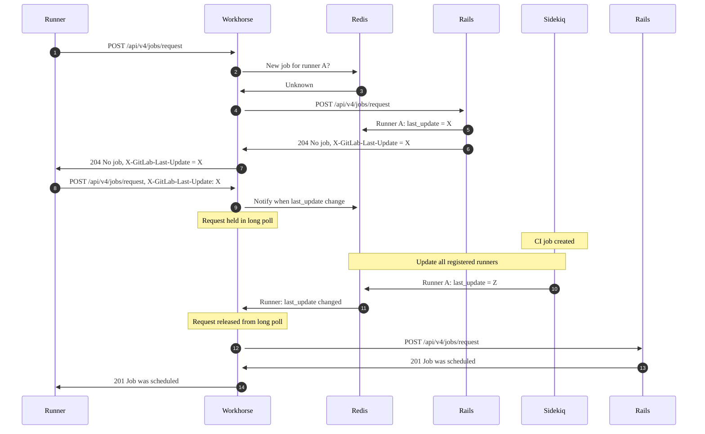



- Édition : Gratuite, GitLab Premium, GitLab Ultimate
- Offre : GitLab.com, GitLab Self-Managed, GitLab Dedicated



Par défaut, un GitLab Runner interroge périodiquement une instance GitLab pour obtenir de nouveaux jobs CI/CD. L'intervalle d'interrogation réel [dépend de `check_interval` et du nombre de runners configurés dans le fichier de configuration du runner](https://docs.gitlab.com/runner/configuration/advanced-configuration/#how-check_interval-works).

Sur un serveur qui gère de nombreux runners, cette interrogation peut entraîner les problèmes de performance suivants :

- Des temps de mise en file d'attente plus longs.
- Une utilisation plus élevée du CPU sur l'instance GitLab.

Pour atténuer ces problèmes, vous devez activer le long polling.

Prérequis :

- Vous devez être un administrateur.

## Activer le long polling {#enable-long-polling}

Vous pouvez configurer une instance GitLab pour maintenir les demandes de jobs des runners dans un long poll jusqu'à ce qu'un nouveau job soit prêt.

Pour ce faire, activez le long polling en configurant la durée de long polling de GitLab Workhorse (`apiCiLongPollingDuration`) :





1. Modifiez `/etc/gitlab/gitlab.rb` :

   ```ruby
   gitlab_workhorse['api_ci_long_polling_duration'] = "50s"
   ```

1. Enregistrez le fichier et reconfigurez GitLab :

   ```shell
   sudo gitlab-ctl reconfigure
   ```





Activez le long polling avec le paramètre `gitlab.webservice.workhorse.extraArgs`.

1. Exportez les valeurs Helm :

   ```shell
   helm get values gitlab > gitlab_values.yaml
   ```

1. Modifiez `gitlab_values.yaml` :

   ```yaml
   gitlab:
     webservice:
       workhorse:
         extraArgs: "-apiCiLongPollingDuration 50s"
   ```

1. Enregistrez le fichier et appliquez les nouvelles valeurs :

   ```shell
   helm upgrade -f gitlab_values.yaml gitlab gitlab/gitlab
   ```





1. Modifiez `docker-compose.yml` :

   ```yaml
   version: "3.6"
   services:
     gitlab:
       image: 'gitlab/gitlab-ee:latest'
       restart: always
       hostname: 'gitlab.example.com'
       environment:
         GITLAB_OMNIBUS_CONFIG: |
           gitlab_workhorse['api_ci_long_polling_duration'] = "50s"
   ```

1. Enregistrez le fichier et redémarrez GitLab :

   ```shell
   docker compose up -d
   ```





## Métriques {#metrics}

Lorsque le long polling est activé, GitLab Workhorse s'abonne aux canaux Redis PubSub et attend les notifications. Une demande de job est libérée d'un long poll lorsque la clé de son runner est modifiée, ou lorsque `apiCiLongPollingDuration` a été atteint. Il existe un certain nombre de métriques Prometheus que vous pouvez surveiller :

| Métrique | Type | Description | Labels |
| -----  | ---- | ----------- | ------ |
| `gitlab_workhorse_keywatcher_keywatchers` | Gauge | Le nombre de clés surveillées par GitLab Workhorse | |
| `gitlab_workhorse_keywatcher_redis_subscriptions` | Gauge | Le nombre d'abonnements Redis PubSub | |
| `gitlab_workhorse_keywatcher_total_messages` | Counter | Nombre total de messages reçus par GitLab Workhorse sur les canaux PubSub | |
| `gitlab_workhorse_keywatcher_actions_total` | Counter | Comptage des différentes actions du surveillant de clés | `action` |
| `gitlab_workhorse_keywatcher_received_bytes_total` | Counter | Total des octets reçus sur les canaux PubSub | |

Vous pouvez consulter un [exemple de la façon dont un utilisateur a découvert un problème de long polling grâce à ces métriques](https://gitlab.com/gitlab-org/omnibus-gitlab/-/issues/8329).

## Workflow de long polling {#long-polling-workflow}

Le diagramme illustre comment un runner unique obtient un job avec le long polling activé :



À l'étape 1, lorsqu'un runner demande un nouveau job, il émet une requête `POST` (`/api/v4/jobs/request`) vers le serveur GitLab, où elle est d'abord traitée par Workhorse.

Workhorse lit le token du runner et la valeur depuis l'en-tête HTTP `X-GitLab-Last-Update`, construit une clé et s'abonne à un canal Redis PubSub avec cette clé. Si aucune valeur n'existe pour la clé, Workhorse transfère immédiatement la requête à Rails (étapes 3 et 4).

Rails vérifie la file d'attente des jobs. Si aucun job n'est disponible pour le runner, Rails renvoie une réponse `204 No job` avec un token `last_update` au runner (étapes 5 à 7).

Le runner utilise ce token `last_update` et émet une autre demande de job, en renseignant l'en-tête HTTP `X-GitLab-Last-Update` avec ce token. Cette fois, Workhorse vérifie si le token `last_update` du runner a changé. Si ce n'est pas le cas, Workhorse conserve la requête pendant une durée maximale spécifiée par `apiCiLongPollingDuration`.

Si un utilisateur déclenche un nouveau pipeline ou job, une tâche en arrière-plan dans Sidekiq met à jour la valeur `last_update` pour tous les runners disponibles pour le job. Les runners peuvent être enregistrés pour le projet, le groupe et/ou l'instance.

Ce « tick » aux étapes 10 et 11 libère la demande de job de la file d'attente du long poll de Workhorse, et la requête est envoyée à Rails (étape 12). Rails recherche un job disponible et assigne le runner à ce job (étapes 13 et 14).

Grâce au long polling, le runner est notifié immédiatement après qu'un nouveau job est disponible. Cela permet non seulement de réduire le temps de mise en file d'attente des jobs, mais aussi de réduire la charge du serveur, car les demandes de jobs n'atteignent Rails que lorsqu'il y a un nouveau travail.

## Dépannage {#troubleshooting}

Lorsque vous utilisez le long polling, vous pouvez rencontrer les problèmes suivants.

### Récupération lente des jobs {#slow-job-pickup}

Le long polling n'est pas activé par défaut, car dans certaines configurations de runner, le runner ne récupère pas les jobs en temps opportun. Voir [l'issue 27709](https://gitlab.com/gitlab-org/gitlab-runner/-/issues/27709).

Cela peut se produire si le paramètre `concurrent` dans le fichier `config.toml` du runner est défini sur une valeur inférieure au nombre de runners définis. Pour résoudre ce problème, assurez-vous que la valeur de `concurrent` est égale ou supérieure au nombre de runners.

Par exemple, si vous avez trois entrées `[[runners]]` dans `config.toml`, assurez-vous que `concurrent` est défini sur au moins 3.

Lorsque le long polling est activé, le runner :

1. Lance `concurrent` Goroutines.
1. Attend le retour des Goroutines après le long polling.
1. Exécute un autre lot de requêtes.

Par exemple, considérez le cas où un seul `config.toml` a configuré :

- 3 runners pour le projet A.
- 1 runner pour le projet B.
- `concurrent` défini sur 3.

Dans cet exemple, un runner lance des Goroutines pour les 3 premiers projets. Dans le pire des cas, le runner attend la durée complète du long poll pour le projet A avant de procéder à la demande d'un job pour le projet B.
