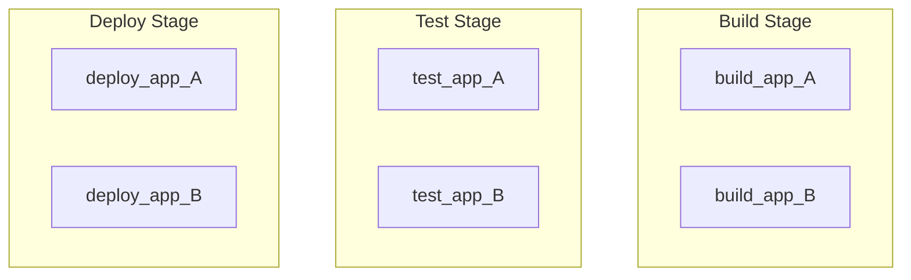
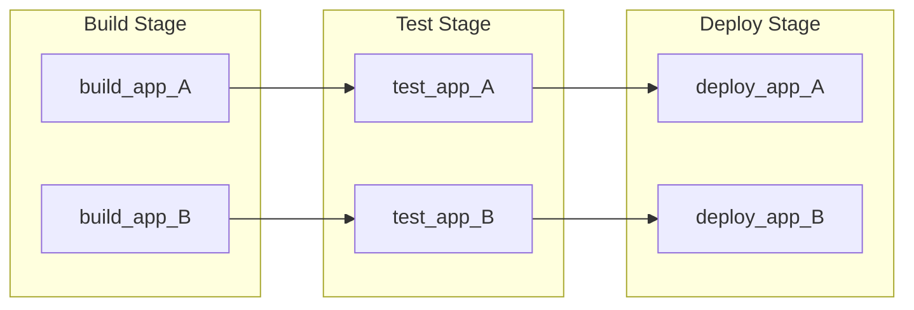
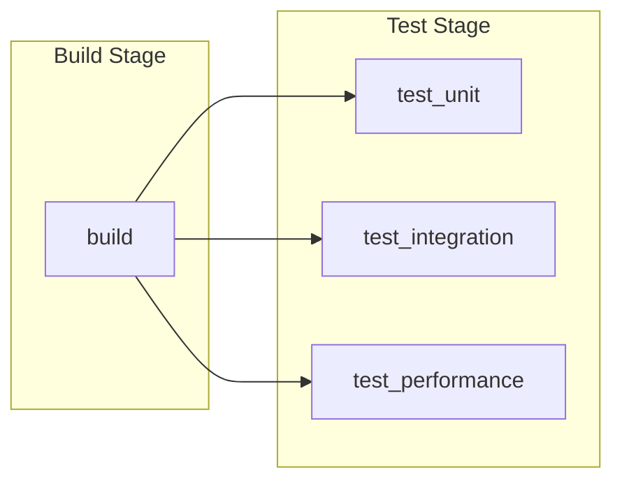
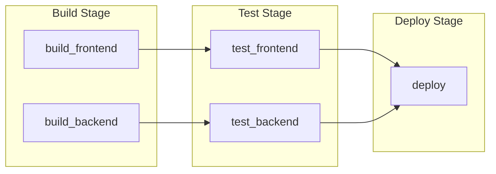
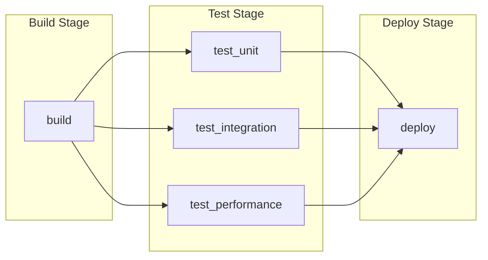
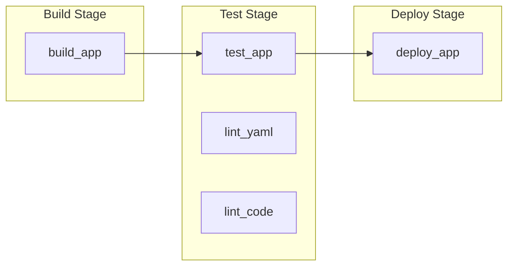
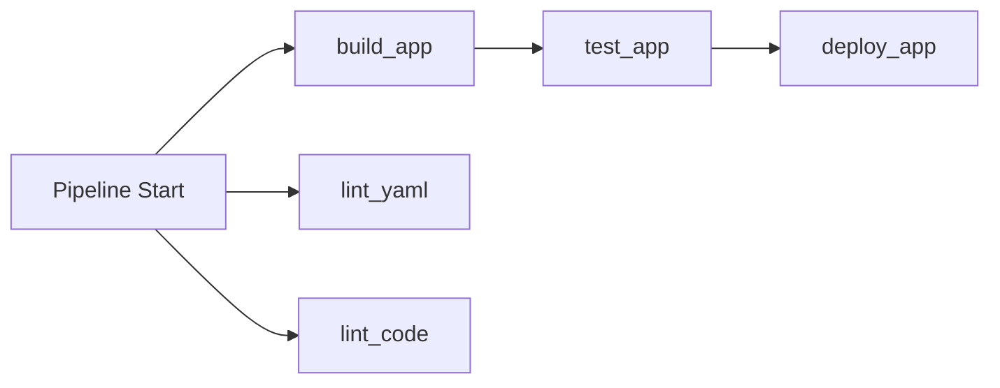



- Édition : Gratuite, GitLab Premium, GitLab Ultimate
- Offre : GitLab.com, GitLab Self-Managed, GitLab Dedicated



Utilisez le mot-clé [`needs`](_index.md#needs) pour spécifier les dépendances de job dans votre pipeline. Les jobs démarrent dès que leurs dépendances sont terminées, sans attendre que les étapes du pipeline soient complètes. Cela vous permet d'exécuter les jobs plus tôt et d'éviter les attentes inutiles.

Cas d'utilisation :

- Monorepos : Compilez et testez des services indépendants en parallèle sur des chemins d'exécution distincts.
- Compilations multi-plateformes : Compilez pour différentes plateformes sans attendre que toutes les compilations soient terminées.
- Retour d'information plus rapide : Obtenez les résultats des tests et les erreurs plus tôt.

> [!note]
> Les mots-clés `needs: project` et `needs: pipeline` ne sont pas utilisés pour spécifier les dépendances de job. Utilisez [`needs: project`](_index.md#needsproject) pour récupérer des artefacts depuis d'autres pipelines. Utilisez [`needs: pipeline`](_index.md#needspipeline) pour reproduire le statut du pipeline depuis un pipeline upstream.

## Fonctionnement de `needs` {#how-needs-works}

Par défaut, les jobs s'exécutent par étapes. Tous les jobs d'une étape doivent se terminer avec succès avant que tout job d'une étape ultérieure puisse démarrer. Par exemple, avec les étapes par défaut `build`, `test` et `deploy`, tous les jobs de `build` doivent s'exécuter et se terminer avant que tout job de `test` puisse démarrer.

Avec `needs`, vous listez les jobs spécifiques dont dépend un job. Le job démarre immédiatement après la fin de ces dépendances, même si d'autres jobs des étapes précédentes sont encore en cours d'exécution. Cela crée un pipeline avec une structure de type [graphe acyclique orienté (DAG)](https://en.wikipedia.org/wiki/Directed_acyclic_graph).

Vous pouvez combiner des jobs organisés en étapes et des jobs avec des dépendances `needs` dans le même pipeline.

De plus, vous pouvez utiliser `needs: []` pour définir un job qui s'exécute immédiatement sans attendre la fin des jobs ou des étapes précédents. Il est courant d'exécuter immédiatement des jobs de lint ou des analyseurs lorsqu'ils peuvent s'exécuter sur le code source et ne dépendent pas des résultats de compilation.

## `needs` comparé aux jobs organisés en étapes {#needs-compared-to-staged-jobs}

Pour illustrer les avantages de `needs`, nous pouvons comparer deux pipelines comportant six jobs.

Ce pipeline comporte six jobs organisés en étapes. Sans `needs`, tous les jobs d'une étape doivent se terminer avant que l'étape suivante démarre, même si certains jobs sont indépendants :



```yaml
stages:
  - build
  - test
  - deploy

build_app_A:
  stage: build
  script: echo "Building A..."

build_app_B:
  stage: build
  script: echo "Building B..."

test_app_A:
  stage: test
  script: echo "Testing A..."

test_app_B:
  stage: test
  script: echo "Testing B..."

deploy_app_A:
  stage: deploy
  script: echo "Deploying A..."

deploy_app_B:
  stage: deploy
  script: echo "Deploying B..."
```

Dans cet exemple, aucun job de test ou de déploiement ne s'exécute tant que tous les jobs de l'étape `build` ne sont pas terminés. Si les jobs B prennent beaucoup de temps à s'exécuter, les jobs de test et de déploiement A pourraient être retardés en attendant que les jobs B se terminent.

Avec `needs`, vous pouvez définir deux chemins d'exécution indépendants. Chaque job ne dépend que des jobs dont il a réellement besoin, ce qui permet une exécution parallèle sur les deux chemins :



```yaml
stages:
  - build
  - test
  - deploy

build_app_A:
  stage: build
  script: echo "Building A..."

build_app_B:
  stage: build
  script: echo "Building B..."

test_app_A:
  stage: test
  needs: ["build_app_A"]
  script: echo "Testing A..."

test_app_B:
  stage: test
  needs: ["build_app_B"]
  script: echo "Testing B..."

deploy_app_A:
  stage: deploy
  needs: ["test_app_A"]
  script: echo "Deploying A..."

deploy_app_B:
  stage: deploy
  needs: ["test_app_B"]
  script: echo "Deploying B..."
```

Dans cet exemple, `test_app_A` s'exécute dès que `build_app_A` se termine avec succès, même si `build_app_B` est encore en cours d'exécution. De même, `deploy_app_A` pourrait s'exécuter et effectuer le déploiement avant que `build_app_B` ne se termine.

### Afficher les dépendances entre les jobs {#view-dependencies-between-jobs}

Vous pouvez afficher les dépendances entre les jobs sur le graphe de pipeline.

Pour activer cette vue, depuis la page de détails du pipeline :

- Sélectionnez **Dépendances des jobs**.
- facultatif. Activez/désactivez **Afficher les dépendances** pour afficher les lignes indiquant quels jobs sont liés entre eux.


## Exemples de `needs` {#needs-examples}

Utilisez `needs` pour créer des dépendances entre les jobs et réduire le temps d'attente des jobs avant leur démarrage. Les schémas peuvent inclure des dépendances de type fan-out, fan-in et en losange.

### Fan-out {#fan-out}

Pour créer un graphe de dépendances de jobs en fan-out, configurez plusieurs jobs pour qu'ils dépendent d'un seul job.

Par exemple :



```yaml
stages:
  - build
  - test

build:
  stage: build
  script: echo "Building..."

test_unit:
  stage: test
  needs: ["build"]
  script: echo "Unit tests..."

test_integration:
  stage: test
  needs: ["build"]
  script: echo "Integration tests..."

test_performance:
  stage: test
  needs: ["build"]
  script: echo "Performance tests..."
```

### Fan-in {#fan-in}

Pour créer un graphe de dépendances en fan-in, configurez un job pour qu'il attende la fin de plusieurs jobs.

Par exemple :



```yaml
stages:
  - build
  - test
  - deploy

build_frontend:
  stage: build
  script: echo "Building frontend..."

build_backend:
  stage: build
  script: echo "Building backend..."

test_frontend:
  stage: test
  needs: ["build_frontend"]
  script: echo "Testing frontend..."

test_backend:
  stage: test
  needs: ["build_backend"]
  script: echo "Testing backend..."

deploy:
  stage: deploy
  needs: ["test_frontend", "test_backend"]
  script: echo "Deploying..."
```

### Dépendance en losange {#diamond-dependency}

Pour créer un graphe de dépendances en losange, combinez fan-out et fan-in. Un job se divise en plusieurs jobs (fan-out), qui convergent ensuite vers un seul job (fan-in). Par exemple :



```yaml
stages:
  - build
  - test
  - deploy

build:
  stage: build
  script: echo "Building..."

test_unit:
  stage: test
  needs: ["build"]
  script: echo "Unit tests..."

test_integration:
  stage: test
  needs: ["build"]
  script: echo "Integration tests..."

test_performance:
  stage: test
  needs: ["build"]
  script: echo "Performance tests..."

deploy:
  stage: deploy
  needs: ["test_unit", "test_integration", "test_performance"]
  script: echo "Deploying..."
```

### Démarrage immédiat {#immediate-start}

Utilisez `needs: []` pour définir un job qui démarre immédiatement à la création du pipeline, sans attendre les autres jobs ou étapes. Utilisez cette option pour les outils de lint ou d'analyse qui peuvent s'exécuter immédiatement mais doivent apparaître dans une étape ultérieure, comme `test`.

Par exemple :

```yaml
stages:
  - build
  - test
  - deploy

build_app:
  stage: build
  script: echo "Building app..."

test_app:
  stage: test
  script: echo "Testing app..."

lint_yaml:
  stage: test
  needs: []
  script: echo "Linting YAML..."

lint_code:
  stage: test
  needs: []
  script: echo "Linting code..."

deploy_app:
  stage: deploy
  script: echo "Deploying app..."
```

Dans cet exemple, `lint_yaml` et `lint_code` démarrent immédiatement avec `needs: []`, sans attendre `build_app` ni la fin de l'étape `test`. `deploy_app` n'utilise pas `needs`, il attend donc que tous les jobs des étapes précédentes soient terminés avant de démarrer.

La vue du pipeline affiche les jobs regroupés par étapes :



Les jobs démarrent le plus tôt possible :



## Pipelines sans étapes {#stageless-pipelines}

Vous pouvez omettre les mots-clés `stage` et `stages`, et utiliser uniquement `needs` pour définir l'ordre des jobs. Tous les jobs sans mot-clé `stage` s'exécutent dans l'étape `test` par défaut :

```yaml
compile:
  script: echo "Compiling..."

unit_tests:
  needs: ["compile"]
  script: echo "Running unit tests..."

integration_tests:
  needs: ["compile"]
  script: echo "Running integration tests..."

package:
  needs: ["unit_tests", "integration_tests"]
  script: echo "Packaging..."
```

Pour afficher la structure de ce pipeline, [sélectionnez **Dépendances des jobs**](#view-dependencies-between-jobs) depuis la page de détails du pipeline. Si vous utilisez la vue par défaut, tous les jobs sont regroupés dans l'étape `test`.

## Dépendances optionnelles {#optional-dependencies}

Utilisez `optional: true` dans `needs` pour dépendre d'un job uniquement s'il existe dans le pipeline. Utilisez cette option pour gérer les jobs qui peuvent ou non s'exécuter lors de la combinaison de `needs` avec [`rules`](_index.md#rules).

Par exemple :

```yaml
stages:
  - build
  - test
  - deploy

build:
  stage: build
  script: echo "Building..."

test:
  stage: test
  needs: ["build"]
  script: echo "Testing..."

test_optional:
  stage: test
  rules:
    - if: $RUN_OPTIONAL_TESTS == "true"
  script: echo "Optional tests..."

deploy:
  stage: deploy
  needs:
    - job: "test"
    - job: "test_optional"
      optional: true
  script: echo "Deploying..."
```

Dans cet exemple :

- `deploy` dépend de :
  - `test`, qui existe toujours dans le pipeline.
  - `test_optional`, qui n'existe dans le pipeline que lorsque `RUN_OPTIONAL_TESTS` est `true`.
- Lorsque `RUN_OPTIONAL_TESTS` vaut :
  - `false`, alors `test_optional` n'existe pas dans le pipeline et `deploy` s'exécute après la fin de `test`.
  - `true`, alors `test_optional` existe dans le pipeline et `deploy` attend la fin de `test` et de `test_optional`.

Sans `optional: true`, la création du pipeline échoue car le job `deploy` attend `test_optional`, mais celui-ci n'existe pas dans le pipeline.

## Combiner `needs` avec `parallel:matrix` {#combine-needs-with-parallelmatrix}

Le mot-clé `needs` fonctionne avec `parallel:matrix` pour [définir des dépendances pointant vers des jobs parallélisés](../jobs/job_control.md#specify-needs-between-parallelized-jobs).

## Dépannage {#troubleshooting}

### Erreur : `'job' does not exist in the pipeline` {#error-job-does-not-exist-in-the-pipeline}

Lorsque vous combinez `needs` avec `rules`, votre pipeline peut échouer à la création et afficher cette erreur :

```plaintext
'unit_tests' job needs 'compile' job, but 'compile' does not exist in the pipeline.
This might be because of the only, except, or rules keywords. To need a job that
sometimes does not exist in the pipeline, use needs:optional.
```

Cette erreur est causée par un job dont l'attribut `needs` pointe vers un autre job qui n'existe pas dans le pipeline. Pour résoudre ce problème, vous devez soit :

- Ajouter [`optional: true`](#optional-dependencies) à la dépendance du job afin que le job requis soit ignoré lorsqu'il n'existe pas dans le pipeline.
- Mettre à jour la configuration `rules` du job requis pour s'assurer qu'il s'exécute toujours lorsque nécessaire.

Par exemple :

```yaml
#
# Method 1: Job with rules that may not exist
#
compile:
  stage: build
  rules:
    - if: $COMPILE == "true"
  script: echo "Compiling..."

unit_tests:
  stage: test
  needs:
    - job: "compile"        # If $COMPILE == "false", the `compile` job is not added
      optional: true        # to the pipeline and this needs is ignored.
  script: echo "Running unit tests..."

#
# Method 2: Job with rules that always matches the dependent job
#
build:
  stage: build
  rules:
    - if: $BUILD == "true"
  script: echo "Building..."

test:
  stage: test
  rules:                    # Both jobs have identical `rules`, and will always exist
    - if: $BUILD == "true"  # in the pipeline together.
  needs: ["build"]
  script: echo "Testing..."
```
