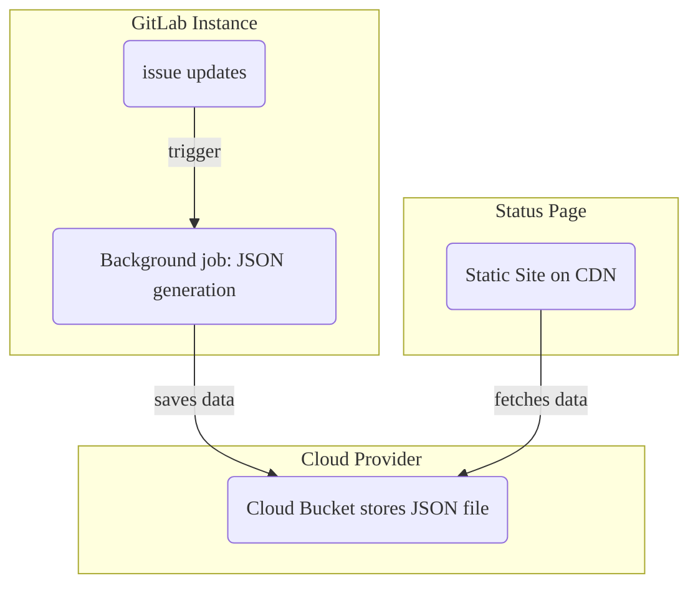



- Édition : GitLab Ultimate
- Offre : GitLab.com, GitLab Self-Managed, GitLab Dedicated



Avec une page d'état GitLab, vous pouvez créer et déployer un site web statique pour communiquer efficacement avec les utilisateurs lors d'un incident. La page d'accueil de la page d'état affiche un aperçu des incidents récents :

La sélection d'un incident affiche une page de détails contenant plus d'informations sur un incident particulier :

- Le statut de l'incident, y compris la date de sa dernière mise à jour.
- Le titre de l'incident, y compris les éventuels emojis.
- La description de l'incident, y compris les emojis.
- Toutes les pièces jointes fournies dans la description de l'incident, ou les commentaires avec une extension d'image valide.
- Une liste chronologique des mises à jour de l'incident.

## Configurer une page d'état {#set-up-a-status-page}

Pour configurer une page d'état GitLab, vous devez :

1. [Configurer GitLab](#configure-gitlab-with-cloud-provider-information) avec les informations de votre fournisseur cloud.
1. [Configurer votre compte AWS](#configure-your-aws-account).
1. [Créer un projet de page d'état](#create-a-status-page-project) sur GitLab.
1. [Synchroniser les incidents avec la page d'état](#sync-incidents-to-the-status-page).

### Configurer GitLab avec les informations du fournisseur cloud {#configure-gitlab-with-cloud-provider-information}

Seul AWS S3 est pris en charge comme cible de déploiement.

Prérequis :

- Vous devez disposer du rôle Chargé de maintenance ou Propriétaire.

Pour fournir à GitLab les informations de compte AWS nécessaires pour envoyer du contenu vers votre page d'état :

1. Dans la barre supérieure, sélectionnez **Rechercher ou aller à** et trouvez votre projet.
1. Dans la barre latérale gauche, sélectionnez **Paramètres** > **Supervision**.
1. Développez **Page d'état**.
1. Cochez la case **Actif**.
1. Dans le champ **URL de la page d'état**, indiquez l'URL de votre page d'état externe.
1. Dans le champ **Nom du compartiment S3**, saisissez le nom de votre compartiment S3. Pour plus d'informations, consultez la [documentation sur la configuration des compartiments](https://docs.aws.amazon.com/AmazonS3/latest/dev/HostingWebsiteOnS3Setup.html).
1. Dans le champ **Région AWS**, saisissez la région de votre compartiment. Pour plus d'informations, consultez la [documentation AWS](https://github.com/aws/aws-sdk-ruby#configuration).
1. Saisissez votre **ID de la clé d'accès AWS** et votre **Clé d'accès secrète AWS**.
1. Sélectionnez **Sauvegarder les modifications**.

### Configurer votre compte AWS {#configure-your-aws-account}

1. Dans votre compte AWS, créez deux nouvelles stratégies IAM en utilisant les fichiers suivants comme exemples :
   - [Créer un compartiment](https://gitlab.com/gitlab-org/status-page/-/blob/master/deploy/etc/s3_create_policy.json).
   - [Mettre à jour le contenu du compartiment](https://gitlab.com/gitlab-org/status-page/-/blob/master/deploy/etc/s3_update_bucket_policy.json) (N'oubliez pas de remplacer `S3_BUCKET_NAME` par le nom de votre compartiment).
1. Créez une nouvelle clé d'accès AWS avec les stratégies d'autorisations créées à la première étape.

### Créer un projet de page d'état {#create-a-status-page-project}

Après avoir configuré votre compte AWS, vous devez ajouter le projet de page d'état et configurer les variables CI/CD nécessaires pour déployer la page d'état sur AWS S3 :

1. Dupliquez le projet [Status Page](https://gitlab.com/gitlab-org/status-page). Vous pouvez le faire via la [mise en miroir du dépôt](https://gitlab.com/gitlab-org/status-page#repository-mirroring), ce qui vous garantit d'obtenir les fonctionnalités les plus récentes de la page d'état.
1. Dans la barre latérale gauche, sélectionnez **Paramètres** > **CI/CD**.
1. Développez **Variables**.
1. Ajoutez les variables suivantes depuis votre console Amazon :
   - `S3_BUCKET_NAME` - Le nom du compartiment Amazon S3. Si aucun compartiment portant le nom indiqué n'existe, la première exécution du pipeline en crée un et le configure pour l'[hébergement de site web statique](https://docs.aws.amazon.com/AmazonS3/latest/dev/HostingWebsiteOnS3Setup.html).

   - `AWS_DEFAULT_REGION` - La région AWS.
   - `AWS_ACCESS_KEY_ID` - L'ID de clé d'accès AWS.
   - `AWS_SECRET_ACCESS_KEY` - Le secret AWS.
1. Dans la barre latérale gauche, sélectionnez **Version** > **Pipelines**.
1. Pour déployer la page d'état sur S3, sélectionnez **Nouveau pipeline**.

> [!warning]
> Envisagez de limiter les personnes pouvant accéder aux tickets de ce projet, car tout utilisateur pouvant consulter l'incident peut potentiellement [publier des commentaires sur votre page d'état GitLab](#publish-comments-on-incidents).

### Synchroniser les incidents avec la page d'état {#sync-incidents-to-the-status-page}

Après avoir créé les variables CI/CD, configurez le projet que vous souhaitez utiliser pour les incidents :

1. Dans la barre supérieure, sélectionnez **Rechercher ou aller à** et trouvez votre projet.
1. Dans la barre latérale gauche, sélectionnez **Paramètres** > **Supervision**.
1. Développez **Page d'état**.
1. Renseignez les identifiants de votre fournisseur cloud et assurez-vous de cocher la case **Actif**.
1. Sélectionnez **Sauvegarder les modifications**.

## Utilisation de votre page d'état GitLab {#how-to-use-your-gitlab-status-page}

Après avoir configuré votre instance GitLab, les mises à jour pertinentes déclenchent un job en arrière-plan qui envoie des données au format JSON concernant l'incident vers votre fournisseur cloud externe. Votre site web de page d'état récupère périodiquement ces données au format JSON. Il les formate et les affiche aux utilisateurs, fournissant des informations sur les incidents en cours sans effort supplémentaire de la part de votre équipe :

### Publier un incident {#publish-an-incident}

Pour publier un incident :

1. Créez un incident dans le projet pour lequel vous avez activé les paramètres de la page d'état GitLab.
1. Un [propriétaire de projet ou de groupe](../../user/permissions.md) doit utiliser la [action rapide `/publish`](../../user/project/quick_actions.md#publish) pour publier l'incident sur la page d'état GitLab. Les [incidents confidentiels](../../user/project/issues/confidential_issues.md) ne peuvent pas être publiés.

Un traitement en arrière-plan publie l'incident sur la page d'état en utilisant les identifiants que vous avez fournis lors de la configuration. Dans le cadre de la publication, GitLab :

- Anonymise les mentions d'utilisateurs et de groupes avec `Incident Responder`.
- Supprime les titres des [références GitLab](../../user/markdown.md#gitlab-specific-references) non publiques.
- Publie tous les fichiers joints aux descriptions d'incidents, jusqu'à 5 000 par incident.

Après la publication, vous pouvez accéder à la page de détails de l'incident en sélectionnant le bouton **Publication effectuée sur la page d'état** affiché sous le titre de l'incident.

### Mettre à jour un incident {#update-an-incident}

Pour publier une mise à jour de l'incident, mettez à jour la description de l'incident.

> [!warning]
> Lorsque des incidents référencés sont modifiés (titre ou confidentialité, par exemple), l'incident dans lequel ils étaient référencés n'est pas mis à jour.

### Publier des commentaires sur les incidents {#publish-comments-on-incidents}

Pour publier des commentaires sur l'incident de la page d'état :

- Créez un commentaire sur l'incident.
- Lorsque vous êtes prêt à publier le commentaire, marquez-le pour publication en ajoutant une [réaction emoji](../../user/emoji_reactions.md) de microphone (`:microphone:` 🎤) au commentaire.
- Tous les fichiers joints au commentaire (jusqu'à 5 000 par incident) sont également publiés.

> [!warning]
> Toute personne ayant accès à l'incident peut ajouter une réaction emoji à un commentaire. Envisagez donc de limiter l'accès aux tickets aux membres de l'équipe uniquement.

### Mettre à jour le statut de l'incident {#update-the-incident-status}

Pour faire passer le statut de l'incident de `open` à `closed`, fermez l'incident dans GitLab. La fermeture de l'incident déclenche un traitement en arrière-plan pour mettre à jour le site web de la page d'état GitLab.

Si vous [rendez un incident publié confidentiel](../../user/project/issues/confidential_issues.md#make-an-issue-confidential), GitLab le dépublie de votre site web de page d'état GitLab.
