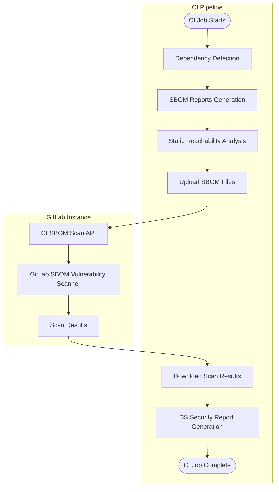



- Niveau : Ultimate
- Offre : GitLab.com, GitLab Self-Managed, GitLab Dedicated





- [Introduit](https://gitlab.com/groups/gitlab-org/-/work_items/8026) dans GitLab 17.4 en tant qu'[expérience](../../../../policy/development_stages_support.md#experiment) pour la branche par défaut uniquement [avec un feature flag](../../../../administration/feature_flags/_index.md) nommé `dependency_scanning_using_sbom_reports`. Désactivé par défaut.
- [Activé sur GitLab Self-Managed](https://gitlab.com/gitlab-org/gitlab/-/issues/395692) dans GitLab 17.5.
- [Modifié](https://gitlab.com/groups/gitlab-org/-/work_items/15960) du statut d'expérience à bêta avec la prise en charge de toutes les branches et [activé par défaut avec les derniers modèles CI/CD d'analyse des dépendances](https://gitlab.com/gitlab-org/gitlab/-/issues/519597) pour Cargo, Conda, Cocoapods et Swift dans GitLab 17.9.
- Feature flag `dependency_scanning_using_sbom_reports` supprimé dans GitLab 17.10.
- [Modifié](https://gitlab.com/groups/gitlab-org/-/work_items/15960) du statut bêta à disponibilité limitée pour GitLab.com uniquement avec un nouveau [modèle CI/CD d'analyse des dépendances V2](https://gitlab.com/gitlab-org/gitlab/-/merge_requests/201175/) dans GitLab 18.5 [avec un feature flag](../../../../administration/feature_flags/_index.md) nommé `dependency_scanning_sbom_scan_api`. Désactivé par défaut.
- Feature flag `dependency_scanning_using_sbom_reports` [activé par défaut](https://gitlab.com/gitlab-org/gitlab/-/work_items/551861) dans GitLab 18.10.
- [Généralement disponible](https://gitlab.com/groups/gitlab-org/-/work_items/20456) dans GitLab 19.0.



L'analyse des dépendances à l'aide du CycloneDX Software Bill of Materials (SBOM) analyse les dépendances de votre application à la recherche de vulnérabilités connues. Toutes les dépendances sont analysées, [y compris les dépendances transitives](../_index.md).

L'analyse des dépendances est souvent considérée comme faisant partie de l'analyse de la composition logicielle (SCA). La SCA peut inclure des aspects d'inspection des éléments utilisés par votre code. Ces éléments comprennent généralement des dépendances applicatives et système presque toujours importées de sources externes, plutôt que provenant d'éléments que vous avez écrits vous-même.

L'analyse des dépendances peut s'exécuter pendant la phase de développement du cycle de vie de votre application. En utilisant le nouvel analyseur d'analyse des dépendances dans les pipelines CI/CD, les dépendances du projet sont détectées et signalées dans les rapports SBOM CycloneDX. Les résultats de sécurité sont identifiés et comparés entre les branches source et cible. Les résultats et leur gravité sont listés dans la merge request, vous permettant de traiter proactivement le risque pour votre application, avant que la modification du code soit commitée. Les résultats de sécurité pour les composants SBOM signalés sont également identifiés par [l'analyse continue des vulnérabilités](../../continuous_vulnerability_scanning/_index.md) lorsque de nouveaux avis de sécurité sont publiés, indépendamment des pipelines CI/CD.

GitLab propose à la fois l'analyse des dépendances et le [scan de conteneurs](../../container_scanning/_index.md) pour assurer la couverture de tous ces types de dépendances. Pour couvrir autant que possible votre zone de risque, nous vous encourageons à utiliser tous nos scanners de sécurité. Pour une comparaison de ces fonctionnalités, consultez [Comparaison de l'analyse des dépendances et du scan de conteneurs](../../comparison_dependency_and_container_scanning.md).

Partagez vos commentaires sur le nouvel analyseur d'analyse des dépendances dans ce [ticket de feedback](https://gitlab.com/gitlab-org/gitlab/-/issues/523458).

## Activer l'analyse des dépendances {#turn-on-dependency-scanning}

Activez l'analyse des dépendances pour votre projet.

### Prérequis {#prerequisites}

Prérequis pour toutes les instances GitLab :

- Le rôle Developer, Maintainer ou Owner pour le projet.
- Un [fichier de verrouillage ou un export de graphe de dépendances pris en charge](#supported-languages-and-files), soit commité dans le dépôt, soit créé dans le pipeline CI/CD et transmis en tant qu'artefact au job `dependency-scanning`. Alternativement, la [résolution des dépendances](#dependency-resolution) peut générer les fichiers requis pour les écosystèmes pris en charge, ou un [fichier manifeste](#manifest-fallback) peut être utilisé comme option de repli.
- Pour les runners auto-gérés, GitLab Runner avec l'exécuteur [`docker`](https://docs.gitlab.com/runner/executors/docker/) ou [`kubernetes`](https://docs.gitlab.com/runner/install/kubernetes/).
- Pour les runners hébergés sur GitLab.com, cette configuration est activée par défaut.

Pour GitLab Self-Managed uniquement, les [métadonnées de package](../../../../administration/settings/security_and_compliance.md#choose-package-registry-metadata-to-sync) pour tous les types PURL à analyser doivent être synchronisées dans l'instance GitLab. Si ces données ne sont pas disponibles dans l'instance GitLab, l'analyse des dépendances ne peut pas identifier les vulnérabilités.

### Mettre à jour la configuration du pipeline du projet {#update-project-pipeline-configuration}

Pour activer l'analyse des dépendances, vous devez ajouter le modèle d'analyse des dépendances à la configuration du pipeline du projet.

Par défaut, le modèle `Dependency-Scanning.v2.gitlab-ci.yml` exécute le job d'analyse des dépendances dans les pipelines de merge request. Si votre projet n'utilise pas les pipelines de merge request pour d'autres jobs, cela entraîne l'apparition uniquement du job d'analyse des dépendances dans le pipeline de merge request, tandis que tous les autres jobs s'exécutent dans un pipeline de branche séparé. Pour désactiver ce comportement, consultez [Désactiver les pipelines MR pour l'analyse des dépendances](#disable-merge-request-pipelines-for-dependency-scanning).

Pour activer l'analyse des dépendances via l'interface utilisateur de GitLab :

1. Dans la barre supérieure, sélectionnez **Rechercher ou aller à** et trouvez votre projet.
1. Dans la barre latérale gauche, sélectionnez **Code** > **Dépôt**.
1. Sélectionnez le fichier `.gitlab-ci.yml`.
1. Sélectionnez **Éditer** > **Modifier le fichier unique**.
1. Ajoutez le modèle CI/CD `Dependency-Scanning.v2` :

   ```yaml
   include:
     - template: Jobs/Dependency-Scanning.v2.gitlab-ci.yml
   ```

1. Sélectionnez **Valider les modifications**.

## Images de conteneur disponibles {#available-container-images}

Cette fonctionnalité repose sur des images de conteneur pour exécuter des jobs CI. Les définitions de jobs CI par défaut référencent ces images par leur tag de version majeure (par exemple, `dependency-scanning:2`), de sorte que vous recevez automatiquement les mises à jour de correctifs et mineures sans modifier votre configuration CI/CD.

### Politique de maintenance {#maintenance-policy}

GitLab suit la [politique de release et de maintenance](../../../../policy/maintenance.md), pour fournir des corrections de bogues pour la release stable actuelle et des correctifs de sécurité pour les deux releases mensuelles précédentes.

Les jobs CI/CD référencent les images par leur tag de version majeure (par exemple, `dependency-scanning:2`), de sorte que les correctifs sont automatiquement disponibles pour toutes les versions de GitLab compatibles avec cette version majeure d'image.

Cela s'applique aux images listées ci-dessous. Les images précédentes ne sont pas couvertes par cette politique.

### Images actuelles {#current-images}

| Job CI/CD                               | Image de production                                                                                        | Version de GitLab |
| --------------------------------------- | ------------------------------------------------------------------------------------------------------- | -------------- |
| `dependency-scanning`                   | `registry.gitlab.com/security-products/dependency-scanning:2`                                           | `19.x`         |
| `dependency-scanning:maven-resolution`  | `registry.gitlab.com/security-products/dependency-resolution/ubi9/openjdk-21:1`                         | `18.x`, `19.x` |
| `dependency-scanning:gradle-resolution` | `registry.gitlab.com/security-products/dependency-resolution/ubi9/openjdk-17-with-gradle-8:1`           | `19.x`         |
| `dependency-scanning:python-resolution` | `registry.gitlab.com/security-products/dependency-resolution/ubi9/python-312-minimal-with-piptools-7:9` | `18.x`,`19.x`  |

Les images actuelles sont régulièrement reconstruites pour intégrer les correctifs en amont des fournisseurs d'images de base.

### Images précédentes {#previous-images}

Ces images sont dépréciées et ne reçoivent plus de corrections de bogues ni de nouvelles fonctionnalités. Elles restent disponibles dans le registre de conteneurs et continuent de fonctionner avec leur version de GitLab correspondante. L'utilisation d'une image dépréciée avec une version plus récente de GitLab n'est pas prise en charge et peut produire des résultats inattendus.

| Job CI/CD             | Image de production                                              | Version de GitLab | Déprécié dans |
| --------------------- | ------------------------------------------------------------- | -------------- | ------------- |
| `dependency-scanning` | `registry.gitlab.com/security-products/dependency-scanning:1` | `18.x`         | `19.0`        |
| `dependency-scanning` | `registry.gitlab.com/security-products/dependency-scanning:0` | `18.x`         | `19.0`        |

### Conformité FIPS {#fips-compliance}

L'image de l'analyseur d'analyse des dépendances et toutes les [images de résolution des dépendances](#dependency-resolution) sont basées sur [Red Hat UBI](https://www.redhat.com/en/blog/introducing-red-hat-universal-base-image) qui utilise un module cryptographique validé FIPS 140. Aucune configuration supplémentaire n'est requise pour les environnements FIPS activés.

## Comprendre les résultats {#understanding-the-results}

Les sorties de l'analyseur d'analyse des dépendances :

- Un SBOM CycloneDX pour chaque fichier de verrouillage ou export de graphe de dépendances pris en charge détecté.
- Un rapport d'analyse des dépendances unique pour tous les documents SBOM analysés (GitLab.com et GitLab Self-Managed uniquement).

> [!note]
> Si l'analyseur ne trouve aucun [fichier pris en charge](#supported-languages-and-files), le job d'analyse des dépendances se termine avec succès et imprime un avertissement dans le job log CI/CD. Aucun SBOM CycloneDX ni rapport d'analyse des dépendances n'est généré dans ce cas.

### CycloneDX Software Bill of Materials {#cyclonedx-software-bill-of-materials}

L'analyseur d'analyse des dépendances génère un [CycloneDX](https://cyclonedx.org/) Software Bill of Materials (SBOM) pour chaque répertoire où un fichier de verrouillage, un graphe de dépendances ou un fichier manifeste pris en charge est détecté. Les SBOMs CycloneDX sont créés en tant qu'artefacts de job.

Les SBOMs CycloneDX sont :

- Nommés `gl-sbom-<package-type>-<package-manager>.cdx.json`.
- Disponibles en tant qu'artefacts de job du job d'analyse des dépendances.
- Téléversés en tant que rapports `cyclonedx`.
- Enregistrés dans le même répertoire que les fichiers de verrouillage ou de graphe de dépendances détectés.

Par exemple, si votre projet a la structure suivante :

```plaintext
.
├── ruby-project/
│   └── Gemfile.lock
├── ruby-project-2/
│   └── Gemfile.lock
└── php-project/
    └── composer.lock
```

Les SBOMs CycloneDX suivants sont créés en tant qu'artefacts de job :

```plaintext
.
├── ruby-project/
│   ├── Gemfile.lock
│   └── gl-sbom-gem-bundler.cdx.json
├── ruby-project-2/
│   ├── Gemfile.lock
│   └── gl-sbom-gem-bundler.cdx.json
└── php-project/
    ├── composer.lock
    └── gl-sbom-packagist-composer.cdx.json
```

### Rapport d'analyse des dépendances {#dependency-scanning-report}



- Offre : GitLab.com, GitLab Self-Managed



L'analyseur d'analyse des dépendances génère un rapport d'analyse des dépendances qui documente toutes les vulnérabilités identifiées dans les dépendances identifiées dans les fichiers SBOM CycloneDX.

Le rapport d'analyse des dépendances est :

- Nommés `gl-dependency-scanning-report.json`.
- Disponible en tant qu'artefact de job du job d'analyse des dépendances.
- Téléversé en tant que rapport `dependency_scanning`.
- Enregistré dans le répertoire racine du projet.

## Optimisation {#optimization}

Pour optimiser l'analyse des dépendances avec SBOM, utilisez l'une des méthodes suivantes :

- Exclure des chemins
- Limiter l'analyse à une profondeur de répertoire maximale

### Exclure des chemins {#exclude-paths}

Excluez des chemins pour optimiser les performances d'analyse et vous concentrer sur le contenu pertinent du dépôt.

Listez les chemins exclus dans le fichier `.gitlab-ci.yml` :

- Si vous utilisez le modèle d'analyse des dépendances, utilisez la variable CI/CD `DS_EXCLUDED_PATHS`.
- Si vous utilisez le composant CI/CD d'analyse des dépendances, utilisez le spec input `excluded_paths`.

#### Modèles d'exclusion {#exclusion-patterns}

Les modèles d'exclusion suivent ces règles :

- Les modèles sans barres obliques correspondent aux noms de fichiers ou de répertoires à n'importe quelle profondeur dans le projet (exemple : `test` correspond à `./test`, `src/test`).
- Les modèles avec barres obliques utilisent la correspondance de répertoire parent - ils correspondent aux chemins qui commencent par le modèle (exemple : `a/b` correspond à `a/b` et `a/b/c`, mais pas à `c/a/b`).
- Les caractères génériques glob standard sont pris en charge (exemple : `a/**/b` correspond à `a/b`, `a/x/b`, `a/x/y/b`).
- Les barres obliques initiales et finales sont ignorées (exemple : `/build` et `build/` fonctionnent de la même manière que `build`).

### Limiter l'analyse à une profondeur de répertoire maximale {#limit-scanning-to-a-maximum-directory-depth}

Limitez l'analyse à une profondeur de répertoire maximale pour optimiser les performances d'analyse et réduire le nombre de fichiers analysés.

Le répertoire racine est compté comme profondeur `1`, et chaque sous-répertoire incrémente la profondeur de 1. La profondeur par défaut est `2`. Une valeur de `-1` analyse tous les répertoires quelle que soit la profondeur.

Pour spécifier la profondeur maximale dans le fichier `.gitlab-ci.yml` :

- Si vous utilisez le modèle d'analyse des dépendances, utilisez la variable CI/CD `DS_MAX_DEPTH`.
- Si vous utilisez le composant CI/CD d'analyse des dépendances, utilisez le spec input `max_scan_depth`.

Dans l'exemple suivant, avec `DS_MAX_DEPTH` défini à `3`, les sous-répertoires du répertoire `common` ne sont pas analysés.

```plaintext
timer
├── integration
│   ├── doc
│   └── modules
└── source
    ├── common
    │   ├── cplusplus
    │   └── go
    ├── linux
    ├── macos
    └── windows
```

## Déploiement {#roll-out}

Après avoir validé les résultats de l'analyse des dépendances avec SBOM pour un seul projet, vous pouvez étendre sa mise en œuvre à plusieurs projets et groupes. Pour plus de détails, consultez [Appliquer l'analyse à plusieurs projets](#enforce-scanning-on-multiple-projects).

Si vous avez des exigences particulières, l'analyse des dépendances avec SBOM peut être exécutée dans des [environnements hors ligne](#offline-environment).

## Types de packages pris en charge {#supported-package-types}

Pour que l'analyse de sécurité soit efficace, les composants listés dans votre rapport SBOM doivent avoir des entrées correspondantes dans la [base de données d'avis GitLab](../../gitlab_advisory_database/_index.md).

Le scanner de vulnérabilités SBOM de GitLab peut signaler des vulnérabilités d'analyse des dépendances pour les composants avec les [types PURL](https://github.com/package-url/purl-spec/blob/346589846130317464b677bc4eab30bf5040183a/PURL-TYPES.rst) suivants :

- `cargo`
- `composer`
- `conan`
- `gem`
- `golang`
- `maven`
- `npm`
- `nuget`
- `pypi`
- `swift`

## Langages et fichiers pris en charge {#supported-languages-and-files}

| Langage                  | Gestionnaire de packages | Fichier(s)                                         | Description                                                                                                                                                                           | Prise en charge de l'export de graphe de dépendances | Prise en charge de l'accessibilité statique |
| ------------------------- | --------------- | ----------------------------------------------- | ------------------------------------------------------------------------------------------------------------------------------------------------------------------------------------- | ------------------------------- | --------------------------- |
| C#                        | NuGet           | `packages.lock.json`                            | Fichiers de verrouillage générés par `nuget`.                                                                                                                                                       |                      |                   |
| C/C++                     | Conan           | `conan.lock`                                    | Fichiers de verrouillage générés par `conan`.                                                                                                                                                       |                      |                   |
| C/C++/Fortran/Go/Python/R | Conda           | `conda-lock.yml`                                | Fichiers d'environnement générés par `conda-lock`.                                                                                                                                          |                       |                   |
| Dart                      | pub             | `pubspec.lock`, `pub.graph.json`                | Fichiers de verrouillage générés par `pub`. Export de graphe de dépendances dérivé de `dart pub deps --json > pub.graph.json`.                                                                           |                      |                   |
| Go                        | go              | `go.mod`, `go.graph`                            | Fichiers de module générés par la chaîne d'outils standard `go`. Export de graphe de dépendances dérivé de `go mod graph > go.graph`.                                                                |                      |                   |
| Java                      | ivy             | `ivy-report.xml`                                | Exports de graphe de dépendances générés par la tâche Apache Ant `report`.                                                                                                                   |                       |                  |
| Java                      | Maven           | `maven.graph.json`                              | Exports de graphe de dépendances générés par `mvn dependency:tree -DoutputType=json`.                                                                                                        |                      |                  |
| Java                      | Maven           | `pom.xml`                                       | Fichiers manifeste Maven utilisés par la [résolution des dépendances](#dependency-resolution) , ou comme [repli de manifeste](#manifest-fallback) lorsqu'aucun export de graphe de dépendances n'est disponible.           |                       |                  |
| Java/Kotlin               | Gradle          | `gradle.graph.txt`                              | Exports de graphe de dépendances générés par `./gradlew dependencies`.                                                                                                                       |                      |                  |
| Java/Kotlin               | Gradle          | `dependencies.lock`, `dependencies.direct.lock` | Fichiers de verrouillage générés par [gradle-dependency-lock-plugin](https://github.com/nebula-plugins/gradle-dependency-lock-plugin).                                                              |                      |                  |
| Java/Kotlin               | Gradle          | `gradle.lockfile`                               | Fichiers de verrouillage générés par `gradle dependencies --write-locks`.                                                                                                                           |                       |                  |
| Java/Kotlin               | Gradle          | `gradle-html-dependency-report.js`              | Exports de graphe de dépendances générés par la tâche [htmlDependencyReport](https://docs.gradle.org/current/dsl/org.gradle.api.tasks.diagnostics.DependencyReportTask.html).                |                      |                  |
| Java/Kotlin               | Gradle          | `build.gradle`, `build.gradle.kts`              | Fichiers de build Gradle utilisés par la [résolution des dépendances](#dependency-resolution) , ou comme [repli de manifeste](#manifest-fallback) lorsqu'aucun fichier de verrouillage ou export de graphe de dépendances n'est disponible. |                       |                  |
| JavaScript/TypeScript     | npm             | `package-lock.json`, `npm-shrinkwrap.json`      | Fichiers de verrouillage générés par `npm` v5 ou ultérieur (les versions antérieures, qui ne génèrent pas d'attribut `lockfileVersion`, ne sont pas prises en charge).                                                  |                      |                  |
| JavaScript/TypeScript     | pnpm            | `pnpm-lock.yaml`                                | Fichiers de verrouillage générés par `pnpm`.                                                                                                                                                        |                      |                  |
| JavaScript/TypeScript     | yarn            | `yarn.lock`                                     | Fichiers de verrouillage générés par `yarn`.                                                                                                                                                        |                      |                  |
| Objective-C               | CocoaPods       | `Podfile.lock`                                  | Fichiers de verrouillage générés par `cocoapods`.                                                                                                                                                   |                       |                   |
| PHP                       | composer        | `composer.lock`                                 | Fichiers de verrouillage générés par `composer`.                                                                                                                                                    |                      |                   |
| Python                    | pip             | `pipdeptree.json`                               | Exports de graphe de dépendances générés par `pipdeptree --json`.                                                                                                                            |                      |                  |
| Python                    | pip             | `requirements.txt` (fichier de verrouillage)                   | Fichiers de verrouillage générés par `pip-compile`.                                                                                                                                                 |                      |                  |
| Python                    | pip             | `requirements.txt`                              | Fichiers manifeste utilisés par la [résolution des dépendances](#dependency-resolution) , ou comme [repli de manifeste](#manifest-fallback) lorsqu'aucun fichier de verrouillage ou export de graphe de dépendances n'est disponible.     |                       |                   |
| Python                    | pipenv          | `Pipfile.lock`                                  | Fichiers de verrouillage générés par `pipenv`.                                                                                                                                                      |                       |                   |
| Python                    | pipenv          | `pipenv.graph.json`                             | Exports de graphe de dépendances générés par `pipenv graph --json-tree >pipenv.graph.json`.                                                                                                  |                      |                  |
| Python                    | poetry          | `poetry.lock`                                   | Fichiers de verrouillage générés par `poetry` v1 ou v2.                                                                                                                                             |                      |                  |
| Python                    | uv <sup>1</sup>  | `uv.lock`                                       | Fichiers de verrouillage générés par `uv`.                                                                                                                                                          |                      |                  |
| Ruby                      | bundler         | `Gemfile.lock`, `gems.locked`                   | Fichiers de verrouillage générés par `bundler`.                                                                                                                                                     |                      |                   |
| Rust                      | cargo           | `Cargo.lock`                                    | Fichiers de verrouillage générés par `cargo`.                                                                                                                                                       |                      |                   |
| Scala                     | sbt             | `dependencies-compile.dot`                      | Exports de graphe de dépendances générés par `sbt dependencyDot`.                                                                                                                            |                      |                   |
| Swift                     | swift           | `Package.resolved`                              | Fichiers de verrouillage générés par `swift`.                                                                                                                                                       |                       |                   |

**Notes de bas de page** :

1. Si un fichier de verrouillage contient plusieurs entrées pour le même package avec des marqueurs d'environnement différents (par exemple, numpy==2.2.6 pour Python <3.11 et numpy==2.4.1 pour Python ≥3.11), seule la première entrée est analysée et signalée.

### Informations de hachage des packages {#package-hash-information}

Les SBOMs d'analyse des dépendances incluent des informations de hachage des packages lorsqu'elles sont disponibles. Ces informations sont fournies uniquement pour les packages NuGet. Les hachages de packages apparaissent aux emplacements suivants dans le SBOM, vous permettant de vérifier l'intégrité et l'authenticité des packages :

- Champ de hachages dédié
- Qualificateurs PURL

Par exemple :

```json
{
  "name": "Iesi.Collections",
  "version": "4.0.4",
  "purl": "pkg:nuget/Iesi.Collections@4.0.4?sha512=8e579b4a3bf66bb6a661f297114b0f0d27f6622f6bd3f164bef4fa0f2ede865ef3f1dbbe7531aa283bbe7d86e713e5ae233fefde9ad89b58e90658ccad8d69f9",
  "hashes": [
    {
      "alg": "SHA-512",
      "content": "8e579b4a3bf66bb6a661f297114b0f0d27f6622f6bd3f164bef4fa0f2ede865ef3f1dbbe7531aa283bbe7d86e713e5ae233fefde9ad89b58e90658ccad8d69f9"
    }
  ],
  "type": "library",
  "bom-ref": "pkg:nuget/Iesi.Collections@4.0.4?sha512=8e579b4a3bf66bb6a661f297114b0f0d27f6622f6bd3f164bef4fa0f2ede865ef3f1dbbe7531aa283bbe7d86e713e5ae233fefde9ad89b58e90658ccad8d69f9"
}
```

## Personnalisation du comportement de l'analyseur {#customizing-analyzer-behavior}

La manière de personnaliser l'analyseur varie selon la solution d'activation.

> [!warning]
> Testez toutes les personnalisations des analyseurs GitLab dans une merge request avant de fusionner ces modifications dans la branche par défaut. Ne pas le faire peut donner des résultats inattendus, y compris un grand nombre de faux positifs.

### Personnalisation du comportement avec le modèle CI/CD {#customizing-behavior-with-the-cicd-template}

#### Spec inputs disponibles {#available-spec-inputs}

Les spec inputs suivants peuvent être utilisés en combinaison avec le modèle `Dependency-Scanning.v2.gitlab-ci.yml`.

| Spec Input                                  | Type    | Valeur par défaut                                                                                                   | Description                                                                                                                                                                                                                                                           |
| ------------------------------------------- | ------- | --------------------------------------------------------------------------------------------------------- | --------------------------------------------------------------------------------------------------------------------------------------------------------------------------------------------------------------------------------------------------------------------- |
| `job_name`                                  | string  | `"dependency-scanning"`                                                                                   | Le nom du job d'analyse des dépendances.                                                                                                                                                                                                                              |
| `stage`                                     | string  | `test`                                                                                                    | L'étape du job d'analyse des dépendances.                                                                                                                                                                                                                             |
| `allow_failure`                             | boolean | `true`                                                                                                    | Indique si l'échec du job d'analyse des dépendances doit faire échouer le pipeline.                                                                                                                                                                                                 |
| `analyzer_image_prefix`                     | string  | `"$CI_TEMPLATE_REGISTRY_HOST/security-products"`                                                          | Le préfixe d'URL de registre pointant vers le dépôt de l'analyseur.                                                                                                                                                                                                   |
| `analyzer_image_name`                       | string  | `"dependency-scanning"`                                                                                   | Le dépôt de l'image de l'analyseur utilisé par le job dependency-scanning.                                                                                                                                                                                             |
| `analyzer_image_version`                    | string  | `"2"`                                                                                                     | La version de l'image de l'analyseur utilisée par le job dependency-scanning.                                                                                                                                                                                                |
| `additional_ca_cert_bundle`                 | string  |                                                                                                           | Bundle de certificats CA à approuver. Le bundle CA fourni ici est ajouté aux certificats du système et également utilisé par d'autres outils pendant le processus d'analyse. Pour plus de détails, consultez [Autorité de certification TLS personnalisée](#custom-tls-certificate-authority).              |
| `pip_manifest_file_name_pattern`            | string  |                                                                                                           | Modèle de nom de fichier manifeste pip personnalisé à utiliser pour la résolution des dépendances et l'analyse de manifeste. Le modèle doit correspondre aux noms de fichiers uniquement, pas aux chemins de répertoires. Consultez la [bibliothèque doublestar](https://www.github.com/bmatcuk/doublestar/tree/v1#patterns) pour les détails de syntaxe. |
| `pipcompile_lockfile_file_name_pattern`     | string  |                                                                                                           | Modèle de nom de fichier de verrouillage pip-compile personnalisé à utiliser lors de l'analyse. Le modèle doit correspondre aux noms de fichiers uniquement, pas aux chemins de répertoires. Consultez la [bibliothèque doublestar](https://www.github.com/bmatcuk/doublestar/tree/v1#patterns) pour les détails de syntaxe.                          |
| `pipcompile_requirements_file_name_pattern` | string  |                                                                                                           | [Déprécié](https://gitlab.com/gitlab-org/gitlab/-/work_items/598796) dans GitLab 19.0 : utilisez `pipcompile_lockfile_file_name_pattern` à la place.                                                                                                                           |
| `max_scan_depth`                            | number  | `2`                                                                                                       | Définit le nombre de niveaux de répertoires que l'analyseur doit rechercher pour les fichiers pris en charge. Une valeur de -1 signifie que l'analyseur recherchera tous les répertoires quelle que soit la profondeur.                                                                                                       |
| `excluded_paths`                            | string  | `"**/spec,**/test,**/tests,**/tmp"`                                                                       | Une liste de chemins séparés par des virgules (globs pris en charge) à exclure de l'analyse.                                                                                                                                                                                           |
| `include_dev_dependencies`                  | boolean | `true`                                                                                                    | Inclure les dépendances de développement/test lors de l'analyse d'un fichier pris en charge.                                                                                                                                                                                                 |
| `enable_static_reachability`                | boolean | `false`                                                                                                   | Activer l'[accessibilité statique](../static_reachability.md).                                                                                                                                                                                                              |
| `enable_manifest_fallback`                  | boolean | `true`                                                                                                    | Activer le [repli de manifeste](#manifest-fallback).                                                                                                                                                                                                                       |
| `analyzer_log_level`                        | string  | `"info"`                                                                                                  | Niveau de journalisation pour l'analyse des dépendances. Les options sont : fatal, error, warn, info, debug.                                                                                                                                                                               |
| `enable_vulnerability_scan`                 | boolean | `true`                                                                                                    | Activer l'analyse de vulnérabilités des SBOMs générés                                                                                                                                                                                                                  |
| `api_timeout`                               | number  | `10`                                                                                                      | Délai d'expiration de la requête API SBOM d'analyse des dépendances en secondes.                                                                                                                                                                                                              |
| `api_scan_download_delay`                   | number  | `3`                                                                                                       | Délai initial en secondes avant le téléchargement des résultats d'analyse de l'API SBOM d'analyse des dépendances.                                                                                                                                                                                |
| `resolution_jobs_stage`                     | string  | `.pre`                                                                                                    | L'étape pour les jobs de résolution des dépendances.                                                                                                                                                                                                                         |
| `resolution_jobs_allow_failure`             | boolean | `true`                                                                                                    | Lorsque la valeur est `true`, un job de résolution en échec ne fait pas échouer le pipeline. Lorsque la valeur est `false`, un échec de résolution bloque le pipeline.                                                                                                                                              |
| `disabled_resolution_jobs`                  | string  | `""`                                                                                                      | Liste de jobs de résolution à désactiver, séparés par des virgules (par exemple, `"maven, python"`). Par défaut, tous les jobs de résolution disponibles sont activés. Les valeurs possibles sont : `maven`,`gradle`,`python`. Consultez [la résolution des dépendances](#dependency-resolution)                       |
| `maven_resolution_job_name`                 | string  | `"dependency-scanning:maven-resolution"`                                                                  | Le nom du job pour la résolution des dépendances Maven.                                                                                                                                                                                                                  |
| `maven_resolution_image`                    | string  | `"registry.gitlab.com/security-products/dependency-resolution/ubi9/openjdk-21:1"`                         | L'image utilisée par le job de résolution des dépendances Maven.                                                                                                                                                                                                                |
| `maven_dependency_plugin_version`           | string  | `"3.7.0"`                                                                                                 | La version de `maven-dependency-plugin` utilisée lors de la résolution des dépendances Maven. Doit être `3.7.0` ou ultérieur.                                                                                                                                                           |
| `python_resolution_job_name`                | string  | `"dependency-scanning:python-resolution"`                                                                 | Le nom du job pour la résolution des dépendances Python.                                                                                                                                                                                                                 |
| `python_resolution_image`                   | string  | `"registry.gitlab.com/security-products/dependency-resolution/ubi9/python-312-minimal-with-piptools-7:9"` | L'image utilisée par le job de résolution des dépendances Python.                                                                                                                                                                                                               |
| `gradle_resolution_job_name`                | string  | `"dependency-scanning:gradle-resolution"`                                                                 | Le nom du job pour la résolution des dépendances Gradle.                                                                                                                                                                                                                 |
| `gradle_resolution_image`                   | string  | `"registry.gitlab.com/security-products/dependency-resolution/ubi9/openjdk-17-with-gradle-8:1"`           | L'image utilisée par le job de résolution des dépendances Gradle.                                                                                                                                                                                                               |

#### Variables CI/CD disponibles {#available-cicd-variables}

Ces variables peuvent remplacer les spec inputs et sont également compatibles avec le modèle bêta `latest`.

| Variables CI/CD                                | Description                                                                                                                                                                                                                                                                                                                                                                                                                                                                                                                                                                                      |
| ---------------------------------------------- | ------------------------------------------------------------------------------------------------------------------------------------------------------------------------------------------------------------------------------------------------------------------------------------------------------------------------------------------------------------------------------------------------------------------------------------------------------------------------------------------------------------------------------------------------------------------------------------------------ |
| `AST_ENABLE_MR_PIPELINES`                      | Contrôler si le job d'analyse des dépendances s'exécute dans le pipeline MR ou dans le pipeline de branche. Par défaut : `"true"`. Si votre projet n'utilise pas les pipelines MR, désactivez cette option pour éviter les pipelines en double.                                                                                                                                                                                                                                                                                                                                                                                                                  |
| `ADDITIONAL_CA_CERT_BUNDLE`                    | Bundle de certificats CA à approuver. Le bundle CA fourni ici est ajouté aux certificats du système et également utilisé par d'autres outils pendant le processus d'analyse. Pour plus de détails, consultez [Autorité de certification TLS personnalisée](#custom-tls-certificate-authority).                                                                                                                                                                                                                                                                                                                                         |
| `ANALYZER_ARTIFACT_DIR`                        | Répertoire où les rapports CycloneDX (SBOMs) sont enregistrés. Par défaut `${CI_PROJECT_DIR}/sca-artifacts`.                                                                                                                                                                                                                                                                                                                                                                                                                                                                                                  |
| `DEPENDENCY_SCANNING_DISABLED`                 | Lorsque la valeur est définie sur `"true"` ou `"1"`, désactive tous les jobs d'analyse des dépendances. Par défaut : non défini.                                                                                                                                                                                                                                                                                                                                                                                                                                                                                                          |
| `DS_EXCLUDED_ANALYZERS`                        | Spécifier les analyseurs (par nom) à exclure de l'analyse des dépendances.                                                                                                                                                                                                                                                                                                                                                                                                                                                                                                                             |
| `DS_EXCLUDED_PATHS`                            | Exclure les fichiers et répertoires de l'analyse en fonction des chemins. Une liste de modèles séparés par des virgules. Les modèles peuvent être des globs (voir [`doublestar.Match`](https://pkg.go.dev/github.com/bmatcuk/doublestar/v4@v4.0.2#Match) pour les modèles pris en charge), ou des chemins de fichiers ou de dossiers (par exemple, `doc,spec`). Consultez [Modèles d'exclusion](#exclusion-patterns) pour les règles de correspondance. Il s'agit d'un pré-filtre appliqué avant l'exécution de l'analyse. S'applique à la fois pour la détection des dépendances et l'accessibilité statique. Par défaut : `"**/spec,**/test,**/tests,**/tmp,**/node_modules,**/.bundle,**/vendor,**/.git"`. |
| `DS_MAX_DEPTH`                                 | Définit le nombre de niveaux de répertoires en profondeur que l'analyseur doit rechercher pour les fichiers pris en charge à analyser. Une valeur de `-1` analyse tous les répertoires quelle que soit la profondeur. Par défaut : `2`.                                                                                                                                                                                                                                                                                                                                                                                                                     |
| `DS_INCLUDE_DEV_DEPENDENCIES`                  | Lorsque la valeur est définie sur `"false"`, les dépendances de développement ne sont pas signalées. Seuls les projets utilisant Composer, Conda, Gradle, Maven, npm, pnpm, Pipenv, Poetry ou uv sont pris en charge. Par défaut : `"true"`                                                                                                                                                                                                                                                                                                                                                                                                          |
| `DS_PIP_MANIFEST_FILE_NAME_PATTERN`            | Définit quels fichiers manifeste pip traiter pour la résolution des dépendances et l'analyse de manifeste, en utilisant la correspondance de modèle glob (par exemple, `custom-requirements.txt` ou `*-requirements.txt`). Le modèle doit correspondre aux noms de fichiers uniquement, pas aux chemins de répertoires. Consultez la [documentation des modèles glob](https://github.com/bmatcuk/doublestar/tree/v1?tab=readme-ov-file#patterns) pour les détails de syntaxe.                                                                                                                                                                                                         |
| `PIP_REQUIREMENTS_FILE`                        | [Déprécié](https://gitlab.com/gitlab-org/gitlab/-/work_items/588580) dans GitLab 19.0 : utilisez `DS_PIP_MANIFEST_FILE_NAME_PATTERN` à la place.                                                                                                                                                                                                                                                                                                                                                                                                                                                          |
| `DS_PIPCOMPILE_LOCKFILE_FILE_NAME_PATTERN`     | Définit quels fichiers de verrouillage pip-compile traiter en utilisant la correspondance de modèle glob (par exemple, `requirements*.txt` ou `*-requirements.txt`). Le modèle doit correspondre aux noms de fichiers uniquement, pas aux chemins de répertoires. Consultez la [documentation des modèles glob](https://github.com/bmatcuk/doublestar/tree/v1?tab=readme-ov-file#patterns) pour les détails de syntaxe.                                                                                                                                                                                                                                                             |
| `DS_PIPCOMPILE_REQUIREMENTS_FILE_NAME_PATTERN` | [Déprécié](https://gitlab.com/gitlab-org/gitlab/-/work_items/598796) dans GitLab 19.0 : utilisez `DS_PIPCOMPILE_LOCKFILE_FILE_NAME_PATTERN` à la place.                                                                                                                                                                                                                                                                                                                                                                                                                                                   |
| `SECURE_ANALYZERS_PREFIX`                      | Remplacer le nom du registre Docker fournissant les images officielles par défaut (proxy).                                                                                                                                                                                                                                                                                                                                                                                                                                                                                                          |
| `DS_FF_LINK_COMPONENTS_TO_GIT_FILES`           | Lier les composants dans la liste des dépendances aux fichiers commités dans le dépôt plutôt qu'aux fichiers de verrouillage et aux fichiers de graphe générés dynamiquement dans un pipeline CI/CD. Cela garantit que tous les composants sont liés à un fichier source dans le dépôt. Par défaut : `"false"`.                                                                                                                                                                                                                                                                                                                                      |
| `SEARCH_IGNORE_HIDDEN_DIRS`                    | Ignorer les répertoires cachés. Fonctionne à la fois pour l'analyse des dépendances et l'accessibilité statique. Par défaut : `"true"`.                                                                                                                                                                                                                                                                                                                                                                                                                                                                                        |
| `DS_STATIC_REACHABILITY_ENABLED`               | Active l'[accessibilité statique](../static_reachability.md). Par défaut : `"false"`.                                                                                                                                                                                                                                                                                                                                                                                                                                                                                                                    |
| `DS_ENABLE_VULNERABILITY_SCAN`                 | Activer l'analyse de vulnérabilités des fichiers SBOM générés. Génère un [rapport d'analyse des dépendances](#dependency-scanning-report). Par défaut : `"true"`.                                                                                                                                                                                                                                                                                                                                                                                                                                                 |
| `DS_API_TIMEOUT`                               | Délai d'expiration de la requête API SBOM d'analyse des dépendances en secondes (minimum : `5`, maximum : `300`) Par défaut : `10`                                                                                                                                                                                                                                                                                                                                                                                                                                                                                             |
| `DS_API_SCAN_DOWNLOAD_DELAY`                   | Délai initial en secondes avant le téléchargement des résultats d'analyse (minimum :  1, maximum :  120) Par défaut : `3`                                                                                                                                                                                                                                                                                                                                                                                                                                                                                                 |
| `DS_ENABLE_MANIFEST_FALLBACK`                  | Activer le repli de manifeste lorsqu'aucun fichier de verrouillage ou export de graphe de dépendances n'est disponible. Consultez [Repli de manifeste](#manifest-fallback). Par défaut : `"true"`.                                                                                                                                                                                                                                                                                                                                                                                                                                               |
| `DS_SKIP_IF_NO_SUPPORTED_FILES`                | Lorsque la valeur est définie sur `"true"`, ignore le job d'analyse des dépendances si aucun [fichier pris en charge](#supported-languages-and-files) n'est détecté dans le projet. Pour plus de détails, consultez [ignorer le job lorsqu'aucun fichier pris en charge n'est présent](#skip-the-job-when-no-supported-file-is-present). Par défaut : `"false"`.                                                                                                                                                                                                                                                                                                                            |
| `SECURE_LOG_LEVEL`                             | Niveau de journalisation. Par défaut : `"info"`.                                                                                                                                                                                                                                                                                                                                                                                                                                                                                                                                                                    |
| `DS_DISABLED_RESOLUTION_JOBS`                  | Liste de jobs de résolution à désactiver, séparés par des virgules (par exemple, `"maven, python"`). Par défaut, tous les jobs de résolution disponibles sont activés. Les valeurs possibles sont : `maven`,`gradle`,`python`.                                                                                                                                                                                                                                                                                                                                                                                                      |
| `DS_MAVEN_RESOLUTION_IMAGE`                    | L'image utilisée par le job de résolution des dépendances Maven.                                                                                                                                                                                                                                                                                                                                                                                                                                                                                                                                           |
| `DS_MAVEN_DEPENDENCY_PLUGIN_VERSION`           | La version de `maven-dependency-plugin` utilisée lors de la résolution des dépendances Maven. Doit être `3.7.0` ou ultérieur. Par défaut : `3.7.0`.                                                                                                                                                                                                                                                                                                                                                                                                                                                                    |
| `DS_PYTHON_RESOLUTION_IMAGE`                   | L'image utilisée par le job de résolution des dépendances Python.                                                                                                                                                                                                                                                                                                                                                                                                                                                                                                                                          |
| `DS_GRADLE_RESOLUTION_IMAGE`                   | L'image utilisée par le job de résolution des dépendances Gradle.                                                                                                                                                                                                                                                                                                                                                                                                                                                                                                                                          |

### Désactiver les pipelines de merge request pour l'analyse des dépendances {#disable-merge-request-pipelines-for-dependency-scanning}

Par défaut, le modèle `Dependency-Scanning.v2.gitlab-ci.yml` exécute le job d'analyse des dépendances dans les pipelines de merge request. Si votre projet n'utilise pas les pipelines de merge request pour d'autres jobs, cela peut entraîner l'exécution de deux pipelines pour chaque merge request, avec d'autres jobs s'exécutant dans un pipeline de branche séparé. Pour désactiver ce comportement, définissez le spec input `enable_mr_pipelines: false` ou la variable CI/CD `AST_ENABLE_MR_PIPELINES: "false"`.

### Ignorer le job lorsqu'aucun fichier pris en charge n'est présent {#skip-the-job-when-no-supported-file-is-present}

Par défaut, le job d'analyse des dépendances s'exécute dans chaque pipeline qui inclut le modèle, même lorsque le projet ne contient pas de [fichier pris en charge](#supported-languages-and-files). Pour ignorer le job lorsqu'aucun fichier pris en charge n'est détecté, définissez `DS_SKIP_IF_NO_SUPPORTED_FILES` sur `"true"` :

```yaml
include:
  - template: Jobs/Dependency-Scanning.v2.gitlab-ci.yml

variables:
  DS_SKIP_IF_NO_SUPPORTED_FILES: "true"
```

Lorsque la variable est définie, le job d'analyse des dépendances s'exécute uniquement si le projet contient au moins un fichier dans la [liste des fichiers pris en charge](#supported-languages-and-files), ou si un modèle personnalisé est défini avec `DS_PIPCOMPILE_LOCKFILE_FILE_NAME_PATTERN`, `DS_PIP_MANIFEST_FILE_NAME_PATTERN`, ou `PIP_REQUIREMENTS_FILE` (déprécié).

### Autorité de certification TLS personnalisée {#custom-tls-certificate-authority}

L'analyse des dépendances permet l'utilisation de certificats TLS personnalisés pour les connexions SSL/TLS à la place de ceux fournis par défaut avec l'image de conteneur de l'analyseur.

#### Utiliser une autorité de certification TLS personnalisée {#using-a-custom-tls-certificate-authority}

Pour utiliser une autorité de certification TLS personnalisée, assignez la [représentation textuelle du certificat à clé publique X.509 PEM](https://www.rfc-editor.org/rfc/rfc7468#section-5.1) à la variable CI/CD `ADDITIONAL_CA_CERT_BUNDLE`.

Par exemple, pour configurer le certificat dans le fichier `.gitlab-ci.yml` :

```yaml
variables:
  ADDITIONAL_CA_CERT_BUNDLE: |
      -----BEGIN CERTIFICATE-----
      MIIGqTCCBJGgAwIBAgIQI7AVxxVwg2kch4d56XNdDjANBgkqhkiG9w0BAQsFADCB
      ...
      jWgmPqF3vUbZE0EyScetPJquRFRKIesyJuBFMAs=
      -----END CERTIFICATE-----
```

## Résolution des dépendances {#dependency-resolution}



- [Introduit](https://gitlab.com/groups/gitlab-org/-/work_items/20461) pour Maven et Python dans GitLab 18.11, désactivé par défaut.
- [Ajout](https://gitlab.com/gitlab-org/gitlab/-/work_items/590734) de la prise en charge de Gradle. Activé par défaut pour tous les projets pris en charge dans GitLab 19.0.



Lorsqu'un projet ne dispose pas d'un fichier de verrouillage ou d'un export de graphe de dépendances pris en charge commité dans son dépôt, la résolution des dépendances peut générer automatiquement les fichiers requis avant l'exécution de l'analyse.

La résolution des dépendances se déclenche automatiquement lorsque des fichiers manifeste pris en charge sont détectés dans votre projet. Les jobs de résolution s'exécutent à l'étape `.pre` en utilisant des images d'écosystème minimales (par exemple, `ubi9/openjdk-21`) pour générer nativement des fichiers de verrouillage ou des exports de graphe de dépendances. Ces jobs préservent tous les fichiers de verrouillage ou exports de graphe existants, en les créant uniquement lorsqu'ils sont absents. Les artefacts générés sont ensuite consommés par le job `dependency-scanning` à l'étape `test`. Vous pouvez remplacer les images par défaut par des alternatives équivalentes (telles que `eclipse-temurin:jdk-21`) ou des images personnalisées contenant les outils de build nécessaires.

Les écosystèmes suivants prennent en charge la résolution des dépendances :

| Langage    | Gestionnaire de packages | Fichiers manifeste détectés                                                                                                           | Commande de résolution    | Artefact de sortie       |
| ----------- | --------------- | --------------------------------------------------------------------------------------------------------------------------------- | --------------------- | --------------------- |
| Java        | Maven           | `pom.xml`                                                                                                                         | `mvn dependency:tree` | `maven.graph.json`    |
| Java/Kotlin | Gradle          | `build.gradle`, `build.gradle.kts`                                                                                                | `gradle dependencies` | `gradle.graph.txt`    |
| Python      | pip, setuptools | `requirements.txt`, `requirements.in`, `requirements.pip`, `requires.txt`, `setup.py`, `setup.cfg`, `pyproject.toml` (non-Poetry) | `pip-compile`         | `pipcompile.lock.txt` |

### Personnalisation de la résolution des dépendances {#customizing-dependency-resolution}

Pour toutes les options disponibles, consultez [les spec inputs disponibles](#available-spec-inputs) et [les variables CI/CD disponibles](#available-cicd-variables).

#### Utiliser une image de résolution des dépendances personnalisée {#use-a-custom-dependency-resolution-image}

Pour utiliser votre propre image, vous pouvez définir les inputs suivants :

- `maven_resolution_image`
- `gradle_resolution_image`
- `python_resolution_image`

Par exemple, pour utiliser une image personnalisée pour la résolution maven :

```yaml
include:
  - template: Jobs/Dependency-Scanning.v2.gitlab-ci.yml
    inputs:
      maven_resolution_image: "registry.gitlab.mycorp.com/eclipse-temurin:jdk-21"
```

Vous pouvez également définir les variables CI/CD suivantes :

- `DS_MAVEN_RESOLUTION_IMAGE`
- `DS_GRADLE_RESOLUTION_IMAGE`
- `DS_PYTHON_RESOLUTION_IMAGE`

#### Désactiver la résolution des dépendances {#disable-dependency-resolution}

Pour désactiver la résolution des dépendances pour un écosystème spécifique, utilisez la variable CI/CD `DS_DISABLED_RESOLUTION_JOBS` ou l'input `disabled_resolution_jobs`. Les valeurs possibles sont : `maven`,`gradle`,`python`.

Par exemple, pour désactiver la résolution des dépendances pour maven :

```yaml
variables:
  DS_DISABLED_RESOLUTION_JOBS: "maven"

include:
  - template: Jobs/Dependency-Scanning.v2.gitlab-ci.yml
```

### Considérations de sécurité pour la résolution des dépendances {#security-considerations-for-dependency-resolution}

Les jobs de résolution des dépendances exécutent des outils de build natifs à l'écosystème (`mvn`, `gradle`, `pip-compile`) dans le conteneur du job CI/CD. Ces outils respectent nativement les variables d'environnement et les fichiers de configuration qui peuvent charger des extensions ou exécuter du code arbitraire au démarrage, notamment :

- Maven : `MAVEN_ARGS`, `MAVEN_CLI_OPTS` (ancien), `MAVEN_OPTS`, `JAVA_TOOL_OPTIONS`, tout `settings.xml` référencé via `-s` ou `--settings`, et `<extensions>` déclaré dans `pom.xml` ou `settings.xml`.
- Gradle : `GRADLE_OPTS`, `JAVA_TOOL_OPTIONS`, `--init-script`, et le code Groovy ou Kotlin de niveau supérieur dans `build.gradle` ou `build.gradle.kts`.
- Python : `PIP_INDEX_URL`, `PIP_EXTRA_INDEX_URL`, `setup.py`, et les hooks d'installation de fichiers de verrouillage.

Toute personne pouvant définir ces variables CI/CD ou modifier les fichiers de build du projet peut provoquer l'exécution de code arbitraire dans le job de résolution. Le job de résolution s'exécute avec `CI_JOB_TOKEN`, accède aux variables CI/CD masquées dans la portée, et peut lire ou écrire dans le dépôt du projet pendant toute la durée du job.

Cette propriété est inhérente aux outils de build natifs à l'écosystème, et n'est pas spécifique à l'analyse des dépendances. Traitez le job de résolution comme un contexte d'exécution sensible.

Contrôles recommandés :

- Restreindre les personnes pouvant définir ou remplacer les variables listées précédemment. Utilisez des [variables CI/CD protégées](../../../../ci/variables/_index.md#for-a-project) limitées aux branches et tags protégés. Ne les définissez pas dans les blocs `.gitlab-ci.yml` `variables:` que tout développeur peut modifier.
- Auditez toutes les utilisations de `MAVEN_ARGS`, `MAVEN_CLI_OPTS`, `GRADLE_OPTS`, `--init-script`, `settings.xml` personnalisé et `<extensions>` dans `pom.xml` dans le cadre de votre processus standard de revue de code.
- Lorsque vous utilisez des [politiques d'exécution de scan](../../policies/scan_execution_policies.md) pour appliquer l'analyse des dépendances, les `variables:` rédigés par les développeurs du projet cible sont transmis au job de résolution injecté. Examinez quelles variables votre framework de politique transmet, et annulez ou remplacez les variables d'outils de build dans la politique.
- Si le build de votre projet s'exécute dans un job CI/CD que vous contrôlez et approuvez (comme une étape `build` qui exécute `mvn package`), générez le fichier de verrouillage ou l'export de graphe de dépendances dans ce même job et désactivez le job de résolution fourni par GitLab avec `DS_DISABLED_RESOLUTION_JOBS`. Cette approche ne réduit pas le risque lié à l'exécution des outils de build, mais elle limite les contextes de jobs sensibles à un seul.
- Utilisez une [image de résolution personnalisée](#use-a-custom-dependency-resolution-image) épinglée par digest si vous avez besoin de garantir une chaîne d'outils connue.

### Limitations de la résolution des dépendances {#dependency-resolution-limitations}

La résolution des dépendances exécute des outils de build natifs à l'écosystème dans des images vanilla ou personnalisées avec une version d'exécution fixe unique et un outil de build par écosystème.

Le succès de la résolution dépend de la compatibilité du projet avec cet environnement, de sa capacité à atteindre les registres de packages et de l'absence d'exigences au moment du build qui dépassent la collecte des dépendances.

Les projets qui échouent avec l'environnement par défaut peuvent remplacer l'image du job de résolution pertinente pour en fournir une compatible avec toutes les dépendances requises.

Même lorsqu'il est compatible, l'environnement de résolution peut ne pas correspondre à la version d'exécution exacte ou à d'autres exigences avec lesquelles un projet a été construit. Par conséquent, le graphe de dépendances généré peut ne pas refléter l'ensemble exact des dépendances qui seraient résolues dans l'environnement de build réel du projet. Les différences peuvent provenir de la version d'exécution fixe, des marqueurs d'environnement non résolus, des dépendances spécifiques à la plateforme, ou des groupes de dépendances conditionnels qui dépendent du contexte au moment du build, non disponible dans le job de résolution.

Pour des résultats les plus précis possibles, fournissez un fichier de verrouillage ou un export de graphe de dépendances généré dans votre propre environnement de build. Pour les projets avec des builds hautement personnalisés qui ne sont pas adéquatement couverts par les workflows de résolution des dépendances, vous devez fournir un fichier de verrouillage ou un export de graphe de dépendances généré dans votre propre environnement de build, comme décrit dans [Créer un fichier de verrouillage ou un export de graphe de dépendances manuellement](#create-lockfile-or-dependency-graph-export-manually).

#### Problèmes connus de la résolution Maven {#maven-resolution-known-issues}

Environnement par défaut : Java 21, Maven 3.9

Les limitations suivantes s'appliquent aux projets Maven :

- Plugin Maven enforcer : Les projets utilisant des règles de version Java strictes dans le plugin Maven Enforcer peuvent échouer. La commande de résolution passe `-Denforcer.skip=true` pour atténuer ce problème, mais toutes les règles d'application ne sont pas ignorées.
- Activation basée sur les profils : Les projets utilisant des modules conditionnels activés par la version JDK (par exemple, ZXing, Dubbo) pourraient produire un graphe de dépendances différent de celui obtenu lors de la compilation avec la version Java initialement ciblée.
- Plugins dans les premières phases du cycle de vie : Les plugins liés aux phases de validation ou d'initialisation incompatibles avec la version Java de l'image de résolution peuvent entraîner des échecs.

#### Problèmes connus de la résolution Gradle {#gradle-resolution-known-issues}

Environnement par défaut : Java 17, Gradle 8

Le job de résolution exécute `./gradlew dependencies` lorsqu'un wrapper Gradle est présent, ou `gradle dependencies` sinon. Pour les projets multi-modules, chaque sous-projet est résolu individuellement en utilisant `:<subproject>:dependencies`. Le job écrit la sortie dans `gradle.graph.txt` dans le répertoire de projet correspondant.

Les limitations suivantes s'appliquent aux projets Gradle :

- Exigence de wrapper : Lorsqu'un wrapper Gradle (`gradlew`) est présent, il doit référencer un `gradle-wrapper.jar` valide. Si aucun wrapper n'est présent, le job utilise le système `gradle`.
- Compatibilité des plugins et des versions : Les projets nécessitant des plugins Gradle spécifiques, des chaînes d'outils personnalisées ou des versions Java autres que Java 17 peuvent échouer. Remplacez l'image de résolution (`spec:inputs:gradle_resolution_image`) par une image contenant l'environnement de build requis.

#### Problèmes connus de la résolution Python {#python-resolution-known-issues}

Environnement par défaut : Python 3.12, pip-tools 7

Les limitations suivantes s'appliquent aux projets Python :

- Pipfile non pris en charge : Les projets Pipfile (sans fichier `Pipfile.lock`) ne sont pas pris en charge. Le job de résolution Python ne sera pas déclenché par la présence du fichier `Pipfile` dans le dépôt.
- Dépendances Git/VCS : Les dépendances spécifiées en tant qu'URLs Git ou VCS (`git+https://...`) ne peuvent pas être résolues. La commande de résolution échouera pour ce fichier manifeste spécifique mais continuera à traiter les autres, le cas échéant.
- Installations locales/modifiables : Les entrées utilisant `-e .`, `file:`, ou des références de chemins locaux sont supprimées avant la résolution et un avertissement est émis. Ces packages n'apparaissent pas dans la sortie.
- `setup.py` avec `install_requires` dynamique : lorsque `install_requires` lit depuis un fichier à l'exécution, un avertissement est émis et `pip-compile` tentera la résolution mais pourrait échouer.
- `pyproject.toml` sans table `[project]` : Un `pyproject.toml` contenant uniquement la configuration du système de build est ignoré et un avertissement est émis.
- Portée de `DS_INCLUDE_DEV_DEPENDENCIES` : L'inclusion des dépendances de développement est implémentée uniquement pour `pyproject.toml` avec `[dependency-groups]`.

## Créer un fichier de verrouillage ou un export de graphe de dépendances manuellement {#create-lockfile-or-dependency-graph-export-manually}

Si votre projet ne dispose pas d'un [fichier de verrouillage](../../terminology/_index.md#lockfile) ou d'un [export de graphe de dépendances](../../terminology/_index.md#dependency-graph-export) pris en charge commité dans son dépôt et que la résolution des dépendances ne le prend pas en charge, vous devez en fournir un.

Pour les projets avec des builds complexes, des étapes de build personnalisées, des registres privés ou des exigences d'environnement spécifiques, envisagez de créer le fichier de verrouillage ou l'export de graphe de dépendances manuellement. Générer le fichier dans le cadre de votre processus de build existant est souvent plus rapide et plus simple que de configurer la [résolution des dépendances](#dependency-resolution) pour répliquer cet environnement. La création manuelle de fichiers produit également des résultats plus précis. Le fichier reflète les versions exactes des dépendances de votre propre build, y compris les dépendances transitives et les résolutions spécifiques à la plateforme.

Les exemples ci-dessous montrent comment créer un fichier pris en charge par l'analyseur GitLab pour les langages et gestionnaires de packages populaires. Consultez également la liste complète des [langages et fichiers pris en charge](#supported-languages-and-files).

### Go {#go}

Cette méthode utilise la [commande `go mod graph`](https://go.dev/ref/mod#go-mod-graph) de la chaîne d'outils Go pour produire un fichier `go.graph` contenant toutes les informations dont l'analyseur a besoin, y compris les dépendances directes et transitives. Sans ce fichier, l'analyseur extrait les composants de `go.mod` uniquement, mais les informations de [chemin de dépendance](../../dependency_list/_index.md#dependency-paths) ne sont pas disponibles, et des faux positifs peuvent survenir si plusieurs versions du même module existent.

Pour activer l'analyseur sur un projet Go :

1. Ajoutez le modèle CI/CD `Dependency-Scanning.v2`.
1. Ajoutez la commande `go mod graph` au job de build existant de votre projet, ou créez un job dédié si aucun job de build n'existe. Ce job doit s'exécuter avant le job `dependency-scanning` afin que l'artefact soit disponible au démarrage de l'analyse.
1. Déclarez `go.graph` en tant qu'artefact de job.

Ajouter la commande à un job de build existant est plus rapide que de l'exécuter dans un job séparé, car elle réutilise le cache de modules du build.

Par exemple :

```yaml
stages:
  - build
  - test

include:
  - template: Jobs/Dependency-Scanning.v2.gitlab-ci.yml

build:
  # Running in the build stage ensures that the dependency-scanning job
  # receives the go.graph artifact.
  stage: build
  image: "golang:latest"
  script:
    # Your regular build script
    - go mod tidy
    - go build ./...
    # New instruction to generate the dependency graph
    - go mod graph > go.graph
  # Make the artifact available to the dependency-scanning job.
  artifacts:
    paths:
      - "**/go.graph"
```

### Gradle {#gradle}

Pour les projets Gradle, utilisez l'une des méthodes suivantes pour créer un export de graphe de dépendances.

- Tâches Gradle `dependencies`
- Plugin Nebula Gradle Dependency Lock
- Gradle `HtmlDependencyReportTask`

#### Tâche dependencies de Gradle {#gradle-dependencies-task}

Cette méthode utilise la même tâche `gradle dependencies` qui alimente la [résolution automatique des dépendances](#dependency-resolution). Il s'agit de l'approche recommandée car elle produit un seul fichier `gradle.graph.txt` avec toutes les informations dont l'analyseur a besoin, y compris les dépendances directes et transitives et les informations de graphe pour activer les [chemins de dépendances](../../dependency_list/_index.md#dependency-paths).

Pour activer l'analyseur sur un projet Gradle :

1. Ajoutez le modèle CI/CD `Dependency-Scanning.v2`.
1. Ajoutez la commande `gradle dependencies` au job de build existant de votre projet, ou créez un job dédié si aucun job de build n'existe. Ce job doit s'exécuter avant le job `dependency-scanning` afin que l'artefact soit disponible au démarrage de l'analyse.
1. Déclarez `gradle.graph.txt` en tant qu'artefact de job.
1. Désactivez la résolution automatique des dépendances en ajoutant `gradle` à la variable CI/CD `DS_DISABLED_RESOLUTION_JOBS` ou à la valeur d'entrée `disabled_resolution_jobs`.

L'ajout de la commande à un job de build existant est plus rapide que de l'exécuter dans un job séparé, car elle réutilise le daemon Gradle, le cache et la configuration résolue du build.

Par exemple :

```yaml
stages:
  - build
  - test

image: gradle:8.0-jdk11

include:
  - template: Jobs/Dependency-Scanning.v2.gitlab-ci.yml

build:
  # Running in the build stage ensures that the dependency-scanning job
  # receives the gradle.graph.txt artifact.
  stage: build
  script:
    # Your regular build script
    - ./gradlew build
    # New instruction to generate the dependency graph
    - ./gradlew dependencies > gradle.graph.txt
  # Make the artifact available to the dependency-scanning job.
  artifacts:
    paths:
      - "**/gradle.graph.txt"
```

#### Plugin de verrouillage des dépendances {#dependency-lock-plugin}

Cette méthode utilise le [gradle-dependency-lock-plugin](https://github.com/nebula-plugins/gradle-dependency-lock-plugin) pour générer deux fichiers de verrouillage : `dependencies.lock` (dépendances directes et transitives) et `dependencies.direct.lock` (dépendance directe uniquement). L'analyseur utilise les deux fichiers pour distinguer les dépendances directes des dépendances transitives dans le graphe de dépendances.

Pour activer l'analyseur sur un projet Gradle :

1. Ajoutez le modèle CI/CD `Dependency-Scanning.v2`.
1. Appliquez le [gradle-dependency-lock-plugin](https://github.com/nebula-plugins/gradle-dependency-lock-plugin/wiki/Usage#example) à votre projet, soit en modifiant `build.gradle` ou `build.gradle.kts`, soit en utilisant un script `init`.
1. Ajoutez les commandes `generateLock saveLock` au job de build existant de votre projet, ou créez un job dédié si aucun job de build n'existe. Ce job doit s'exécuter avant le job `dependency-scanning` afin que les artefacts soient disponibles au démarrage de l'analyse.
1. Déclarez `dependencies.lock` et `dependencies.direct.lock` comme artefacts de job.
1. Désactivez la résolution automatique des dépendances en ajoutant `gradle` à la variable CI/CD `DS_DISABLED_RESOLUTION_JOBS` ou à la valeur d'entrée `disabled_resolution_jobs`.

Par exemple :

```yaml
stages:
  - build
  - test

image: gradle:8.0-jdk11

include:
  - template: Jobs/Dependency-Scanning.v2.gitlab-ci.yml

generate nebula lockfile:
  # Running in the build stage ensures that the dependency-scanning job
  # receives the scannable artifacts.
  stage: build
  script:
    - |
      cat << EOF > nebula.gradle
      initscript {
          repositories {
            mavenCentral()
          }
          dependencies {
              classpath 'com.netflix.nebula:gradle-dependency-lock-plugin:12.7.1'
          }
      }

      allprojects {
          apply plugin: nebula.plugin.dependencylock.DependencyLockPlugin
      }
      EOF
      ./gradlew --init-script nebula.gradle -PdependencyLock.includeTransitives=true -PdependencyLock.lockFile=dependencies.lock generateLock saveLock
      ./gradlew --init-script nebula.gradle -PdependencyLock.includeTransitives=false -PdependencyLock.lockFile=dependencies.direct.lock generateLock saveLock
      # generateLock saves the lockfile in the build/ directory of a project
      # and saveLock copies it into the root of a project. To avoid duplicates
      # and get an accurate location of the dependency, use find to remove the
      # lockfiles in the build/ directory only.
  after_script:
    - find . -path '*/build/dependencies*.lock' -print -delete
  # Make the artifacts available to the dependency-scanning job.
  artifacts:
    paths:
      - '**/dependencies*.lock'
```

#### `HtmlDependencyReportTask` {#htmldependencyreporttask}

Cette méthode utilise [`HtmlDependencyReportTask`](https://docs.gradle.org/current/dsl/org.gradle.api.reporting.dependencies.HtmlDependencyReportTask.html) pour produire un fichier `gradle-html-dependency-report.js`, qui contient les dépendances directes et transitives. Elle est testée avec les versions 4 à 8 de `gradle`.

Pour activer l'analyseur sur un projet Gradle :

1. Ajoutez le modèle CI/CD `Dependency-Scanning.v2`.
1. Ajoutez la commande `gradle htmlDependencyReport` au job de build existant de votre projet, ou créez un job dédié si aucun job de build n'existe. Ce job doit s'exécuter avant le job `dependency-scanning` afin que l'artefact soit disponible au démarrage de l'analyse.
1. Déclarez `gradle-html-dependency-report.js` en tant qu'artefact de job.
1. Désactivez la résolution automatique des dépendances en ajoutant `gradle` à la variable CI/CD `DS_DISABLED_RESOLUTION_JOBS` ou à la valeur d'entrée `disabled_resolution_jobs`.

Par exemple :

```yaml
stages:
  - build
  - test

# Define the image that contains Java and Gradle
image: gradle:8.0-jdk11

include:
  - template: Jobs/Dependency-Scanning.v2.gitlab-ci.yml

build:
  stage: build
  script:
    - gradle --init-script report.gradle htmlDependencyReport
  # The gradle task writes the dependency report as a javascript file under
  # build/reports/project/dependencies. Because the file has an un-standardized
  # name, the after_script finds and renames the file to
  # `gradle-html-dependency-report.js` copying it to the  same directory as
  # `build.gradle`
  after_script:
    - |
      reports_dir=build/reports/project/dependencies
      while IFS= read -r -d '' src; do
        dest="${src%%/$reports_dir/*}/gradle-html-dependency-report.js"
        cp $src $dest
      done < <(find . -type f -path "*/${reports_dir}/*.js" -not -path "*/${reports_dir}/js/*" -print0)
  # Make the artifact available to the dependency-scanning job.
  artifacts:
    paths:
      - "**/gradle-html-dependency-report.js"
```

La commande ci-dessus utilise le fichier `report.gradle` et peut être fournie via `--init-script` ou son contenu peut être ajouté directement à `build.gradle` :

```kotlin
allprojects {
    apply plugin: 'project-report'
}
```

> [!note]
> Le rapport de dépendances peut indiquer que les dépendances de certaines configurations ont `FAILED` lors de la résolution. Dans ce cas, l'analyse des dépendances enregistre un avertissement mais ne fait pas échouer le job. Si vous préférez que le pipeline échoue en cas d'échecs de résolution signalés, ajoutez les étapes supplémentaires suivantes à l'exemple `build` ci-dessus.

```shell
while IFS= read -r -d '' file; do
  grep --quiet -E '"resolvable":\s*"FAILED' $file && echo "Dependency report has dependencies with FAILED resolution status" && exit 1
done < <(find . -type f -path "*/gradle-html-dependency-report.js -print0)
```

### Maven {#maven}

Cette méthode utilise la même commande `mvn dependency:tree` qui alimente la [résolution automatique des dépendances](#dependency-resolution). Elle produit un fichier `maven.graph.json` unique contenant toutes les informations nécessaires à l'analyseur, notamment les dépendances directes et transitives, ainsi que les informations de graphe pour activer le [chemin de dépendance](../../dependency_list/_index.md#dependency-paths).

Pour activer l'analyseur sur un projet Maven :

1. Ajoutez le modèle CI/CD `Dependency-Scanning.v2`.
1. Ajoutez la commande `mvn dependency:tree` (en utilisant la version `3.7.0` ou ultérieure de `maven-dependency-plugin`) au job de build existant de votre projet, ou créez un job dédié si aucun job de build n'existe. Ce job doit s'exécuter avant le job `dependency-scanning` afin que l'artefact soit disponible au démarrage de l'analyse.
1. Déclarez `maven.graph.json` en tant qu'artefact de job.
1. Désactivez la résolution automatique des dépendances en ajoutant `maven` à la variable CI/CD `DS_DISABLED_RESOLUTION_JOBS` ou à la valeur d'entrée `disabled_resolution_jobs`.

L'ajout de la commande à un job de build existant est plus rapide que de l'exécuter dans un job séparé, car elle réutilise la session Maven et la configuration résolue du build.

Par exemple :

```yaml
stages:
  - build
  - test

image: maven:3.9.9-eclipse-temurin-21

include:
  - template: Jobs/Dependency-Scanning.v2.gitlab-ci.yml

build:
  # Running in the build stage ensures that the dependency-scanning job
  # receives the maven.graph.json artifacts.
  stage: build
  script:
    # Your regular build script
    - mvn install
    # New instruction to generate the dependency graph
    - mvn org.apache.maven.plugins:maven-dependency-plugin:3.8.1:tree -DoutputType=json -DoutputFile=maven.graph.json
  # Make the artifact available to the dependency-scanning job.
  artifacts:
    paths:
      - "**/*.jar"
      - "**/maven.graph.json"
```

### pip {#pip}

Pour les projets pip, utilisez l'une des méthodes suivantes pour créer un export de graphe de dépendances :

- `pip-compile`
- `pipdeptree`

#### `pip-compile` {#pip-compile}

Cette méthode utilise la commande [`pip-compile`](https://pip-tools.readthedocs.io/en/latest/cli/pip-compile/) qui alimente la [résolution automatique des dépendances](#dependency-resolution). Elle génère un fichier de verrouillage `requirements.txt` avec toutes les informations dont l'analyseur a besoin, notamment les dépendances directes et transitives, ainsi que les informations de graphe pour activer les [chemins de dépendance](../../dependency_list/_index.md#dependency-paths).

Pour activer l'analyseur sur un projet pip :

1. Ajoutez le modèle CI/CD `Dependency-Scanning.v2`.
1. Ajoutez la commande `pip-compile` au job de build existant de votre projet, ou créez un job dédié si aucun job de build n'existe. Ce job doit s'exécuter avant le job `dependency-scanning` afin que l'artefact soit disponible au démarrage de l'analyse.
1. Déclarez `requirements.txt` en tant qu'artefact de job.
1. Désactivez la résolution automatique des dépendances en ajoutant `python` à la variable CI/CD `DS_DISABLED_RESOLUTION_JOBS` ou à la valeur d'entrée `disabled_resolution_jobs`.

L'ajout de la commande à un job de build existant est plus rapide que de l'exécuter dans un job séparé, car elle réutilise les dépendances installées lors du build.

Par exemple :

```yaml
stages:
  - build
  - test

include:
  - template: Jobs/Dependency-Scanning.v2.gitlab-ci.yml

build:
  # Running in the build stage ensures that the dependency-scanning job
  # receives the requirements.txt artifact.
  stage: build
  image: "python:latest"
  script:
    # Your regular build script
    - pip install pip-tools
    # New instruction to generate the dependency lockfile
    - pip-compile requirements.in
  # Make the artifact available to the dependency-scanning job.
  artifacts:
    paths:
      - "**/requirements.txt"
```

#### `pipdeptree` {#pipdeptree}

Cette méthode utilise [`pipdeptree --json`](https://pypi.org/project/pipdeptree/) pour produire un fichier `pipdeptree.json` contenant toutes les informations dont l'analyseur a besoin, notamment les dépendances directes et transitives, ainsi que les informations de graphe pour activer les [chemins de dépendance](../../dependency_list/_index.md#dependency-paths).

Pour activer l'analyseur sur un projet pip :

1. Ajoutez le modèle CI/CD `Dependency-Scanning.v2`.
1. Ajoutez la commande `pipdeptree --json` au job de build existant de votre projet, ou créez un job dédié si aucun job de build n'existe. Ce job doit s'exécuter avant le job `dependency-scanning` afin que l'artefact soit disponible au démarrage de l'analyse.
1. Déclarez `pipdeptree.json` en tant qu'artefact de job.
1. Désactivez la résolution automatique des dépendances en ajoutant `python` à la variable CI/CD `DS_DISABLED_RESOLUTION_JOBS` ou à la valeur d'entrée `disabled_resolution_jobs`.

L'ajout de la commande à un job de build existant est plus rapide que de l'exécuter dans un job séparé, car elle réutilise les dépendances installées lors du build.

Par exemple :

```yaml
stages:
  - build
  - test

include:
  - template: Jobs/Dependency-Scanning.v2.gitlab-ci.yml

build:
  # Running in the build stage ensures that the dependency-scanning job
  # receives the pipdeptree.json artifact.
  stage: build
  image: "python:latest"
  script:
    # Your regular build script
    - pip install -r requirements.txt
    # New instructions to generate the dependency graph.
    # Exclude pipdeptree itself to avoid false positives.
    - pip install pipdeptree
    - pipdeptree -e pipdeptree --json > pipdeptree.json
  # Make the artifact available to the dependency-scanning job.
  artifacts:
    paths:
      - "**/pipdeptree.json"
```

En raison d'un [problème connu](https://github.com/tox-dev/pipdeptree/issues/107), `pipdeptree` ne marque pas les [dépendances optionnelles](https://setuptools.pypa.io/en/latest/userguide/dependency_management.html#optional-dependencies) comme dépendances du package parent. Par conséquent, l'analyse des dépendances les marque comme dépendances directes du projet, plutôt que comme dépendances transitives.

### Pipenv {#pipenv}

Cette méthode utilise la commande [`pipenv graph`](https://pipenv.pypa.io/en/latest/cli.html#graph) pour produire un fichier `pipenv.graph.json` contenant les informations dont l'analyseur a besoin, notamment les dépendances directes et transitives. Sans ce fichier, l'analyseur extrait les composants uniquement depuis `Pipfile.lock`, mais les informations de [chemin de dépendance](../../dependency_list/_index.md#dependency-paths) ne sont pas disponibles.

Pour activer l'analyseur sur un projet Pipenv :

1. Ajoutez le modèle CI/CD `Dependency-Scanning.v2`.
1. Ajoutez la commande `pipenv graph --json-tree` au job de build existant de votre projet, ou créez un job dédié si aucun job de build n'existe. Ce job doit s'exécuter avant le job `dependency-scanning` afin que l'artefact soit disponible au démarrage de l'analyse.
1. Déclarez `pipenv.graph.json` en tant qu'artefact de job.

L'ajout de la commande à un job de build existant est plus rapide que de l'exécuter dans un job séparé, car elle réutilise les dépendances installées lors du build.

Par exemple :

```yaml
stages:
  - build
  - test

include:
  - template: Jobs/Dependency-Scanning.v2.gitlab-ci.yml

build:
  # Running in the build stage ensures that the dependency-scanning job
  # receives the pipenv.graph.json artifact.
  stage: build
  image: "python:3.12"
  script:
    # Your regular build script
    - pip install pipenv
    - pipenv install
    # New instruction to generate the dependency graph
    - pipenv graph --json-tree > pipenv.graph.json
  # Make the artifact available to the dependency-scanning job.
  artifacts:
    paths:
      - "**/pipenv.graph.json"
```

### `sbt` {#sbt}

Cette méthode utilise le plugin [`sbt-dependency-graph`](https://github.com/sbt/sbt-dependency-graph/blob/master/README.md#usage-instructions) pour générer un fichier `dependencies-compile.dot` contenant toutes les informations dont l'analyseur a besoin, notamment les dépendances directes et transitives.

Pour activer l'analyseur sur un projet `sbt` :

1. Ajoutez le modèle CI/CD `Dependency-Scanning.v2`.
1. Modifiez `plugins.sbt` pour ajouter le plugin [`sbt-dependency-graph`](https://github.com/sbt/sbt-dependency-graph/blob/master/README.md#usage-instructions).
1. Ajoutez la commande `sbt dependencyDot` au job de build existant de votre projet, ou créez un job dédié si aucun job de build n'existe. Ce job doit s'exécuter avant le job `dependency-scanning` afin que l'artefact soit disponible au démarrage de l'analyse.
1. Déclarez `dependencies-compile.dot` en tant qu'artefact de job.

L'ajout de la commande à un job de build existant est plus rapide que de l'exécuter dans un job séparé, car elle réutilise la session sbt et la configuration résolue du build.

Par exemple :

```yaml
stages:
  - build
  - test

include:
  - template: Jobs/Dependency-Scanning.v2.gitlab-ci.yml

build:
  # Running in the build stage ensures that the dependency-scanning job
  # receives the dependencies-compile.dot artifact.
  stage: build
  image: "sbtscala/scala-sbt:eclipse-temurin-17.0.13_11_1.10.7_3.6.3"
  script:
    # Your regular build script
    - sbt compile
    # New instruction to generate the dependency graph
    - sbt dependencyDot
  # Make the artifact available to the dependency-scanning job.
  artifacts:
    paths:
      - "**/dependencies-compile.dot"
```

## Fallback sur le manifeste {#manifest-fallback}



- [Introduit](https://gitlab.com/gitlab-org/gitlab/-/work_items/585886) dans GitLab 18.9. Seuls les fichiers manifeste Maven sont pris en charge ; désactivé par défaut.
- [Mis à jour](https://gitlab.com/gitlab-org/gitlab/-/work_items/586921) dans GitLab 18.9. Prise en charge du fichier requirements Python ajoutée ; désactivée par défaut.
- [Mis à jour](https://gitlab.com/gitlab-org/gitlab/-/work_items/588788) dans GitLab 18.10. Prise en charge des fichiers manifeste Gradle ajoutée ; désactivée par défaut.
- Activé par défaut dans GitLab 19.0



Lorsqu'un fichier de verrouillage ou un export de graphe de dépendances pris en charge n'est pas disponible, l'analyseur d'analyse des dépendances peut extraire les dépendances à partir de fichiers manifeste pris en charge en tant que solution de secours.

Les fichiers manifeste suivants sont pris en charge :

| Langage | Gestionnaire de packages | Fichier manifeste                      |
| -------- | --------------- | ---------------------------------- |
| Java     | Maven           | `pom.xml`                          |
| Python   | pip             | `requirements.txt`                 |
| Java     | Gradle          | `build.gradle`, `build.gradle.kts` |

> [!warning]
>
> Le fallback sur le manifeste offre une précision réduite par rapport à l'analyse des fichiers de verrouillage :
>
> - Pas de dépendances transitives : Seules les dépendances directes sont détectées.
> - Les versions résolues exactes ne peuvent pas toujours être déterminées.

### Désactiver le fallback sur le manifeste {#disable-manifest-fallback}

Pour désactiver le fallback sur le manifeste, utilisez la variable CI/CD `DS_ENABLE_MANIFEST_FALLBACK` ou l'entrée `enable_manifest_fallback`.

```yaml
variables:
  DS_ENABLE_MANIFEST_FALLBACK: "false"

include:
  - template: Jobs/Dependency-Scanning.v2.gitlab-ci.yml
```

## Fonctionnement de l'analyse d'une application {#how-it-scans-an-application}

La fonctionnalité d'analyse des dépendances utilisant SBOM repose sur une approche d'analyse des dépendances décomposée qui sépare la détection des dépendances des autres analyses, comme l'accessibilité statique ou l'analyse des vulnérabilités.

Cette séparation des préoccupations et la modularité de cette architecture permettent de mieux accompagner les clients grâce à l'extension de la prise en charge des langages, une intégration et une expérience plus étroites au sein de la plateforme GitLab, et une évolution vers des types de rapports conformes aux standards du secteur.

Lorsque la [résolution des dépendances](#dependency-resolution) est activée, les jobs de résolution s'exécutent à l'étape `.pre` avant le job `dependency-scanning`. Ces jobs génèrent des fichiers de verrouillage ou des exports de graphes de dépendances en tant qu'artefacts, que le job `dependency-scanning` consomme ensuite.

Le flux global de l'analyse des dépendances est illustré ci-dessous



Dans la phase de détection des dépendances, l'analyseur analyse les fichiers de verrouillage disponibles pour construire un inventaire complet des dépendances de votre projet et de leurs relations (graphe de dépendances). Cet inventaire est capturé dans un document CycloneDX SBOM (Software Bill of Materials).

Dans la phase d'accessibilité statique, l'analyseur analyse les fichiers sources pour identifier quels composants SBOM sont activement utilisés et les marque en conséquence dans le fichier SBOM. Cela permet aux utilisateurs de prioriser les vulnérabilités en fonction de l'accessibilité du composant vulnérable. Pour plus d'informations, consultez la [page d'accessibilité statique](../static_reachability.md).

Les documents SBOM sont temporairement téléversés vers l'instance GitLab via l'API SBOM d'analyse des dépendances. Le moteur du scanner de vulnérabilités SBOM de GitLab compare les composants SBOM aux avis de sécurité pour générer une liste de résultats qui est renvoyée à l'analyseur pour être incluse dans le rapport d'analyse des dépendances.

L'API utilise le `CI_JOB_TOKEN` par défaut pour l'authentification. Remplacer la valeur `CI_JOB_TOKEN` par un jeton différent peut entraîner des réponses 403 - Forbidden de la part de l'API.

Les utilisateurs peuvent configurer le client analyseur qui communique avec l'API SBOM d'analyse des dépendances en utilisant :

- `vulnerability_scan_api_timeout` ou `DS_API_TIMEOUT`
- `vulnerability_scan_api_download_delay` ou `DS_API_SCAN_DOWNLOAD_DELAY`

Pour plus d'informations, voir [les entrées de spec disponibles](#available-spec-inputs) et [les variables CI/CD disponibles](#available-cicd-variables).

Les rapports générés sont téléversés vers l'instance GitLab à la fin du job CI et sont généralement traités après la fin du pipeline.

Les rapports SBOM sont utilisés pour prendre en charge d'autres fonctionnalités basées sur les SBOM, comme la [liste des dépendances](../../dependency_list/_index.md) , l'[analyse des licences](../../../compliance/license_scanning_of_cyclonedx_files/_index.md) ou l'[analyse continue des vulnérabilités](../../continuous_vulnerability_scanning/_index.md).

Le rapport d'analyse des dépendances suit le processus générique des [résultats d'analyse de sécurité](../../detect/security_scanning_results.md)

- Si le rapport d'analyse des dépendances est déclaré par un job CI/CD sur la branche par défaut : des vulnérabilités sont créées et peuvent être consultées dans le [rapport de vulnérabilités](../../vulnerability_report/_index.md).
- Si le rapport d'analyse des dépendances est déclaré par un job CI/CD sur une branche non par défaut : des résultats de sécurité sont créés et peuvent être consultés dans l'[onglet sécurité de la vue pipeline](../../detect/security_scanning_results.md) et le widget de sécurité des MR.

## Environnement hors ligne {#offline-environment}



- Niveau : Ultimate
- Offre : GitLab Self-Managed



Pour les instances dans un environnement avec un accès limité, restreint ou intermittent aux ressources externes via Internet, vous devez effectuer certains ajustements pour exécuter les jobs d'analyse des dépendances avec succès. Pour plus d'informations, voir [les environnements hors ligne](../../offline_deployments/_index.md).

### Prérequis {#requirements}

Pour exécuter l'analyse des dépendances dans un environnement hors ligne, vous devez disposer de :

- Un GitLab Runner avec l'exécuteur `docker` ou `kubernetes`.
- Des copies locales des images de l'analyseur d'analyse des dépendances.
- L'accès à la [base de données de métadonnées des packages](../../../../topics/offline/quick_start_guide.md#enabling-the-package-metadata-database). Requis pour disposer des données de licence et d'avis de sécurité pour vos dépendances.

### Copies locales des images d'analyseur {#local-copies-of-analyzer-images}

Pour utiliser l'analyseur d'analyse des dépendances :

1. Importez les [images actuelles](#current-images) depuis `registry.gitlab.com` dans votre [registre de conteneurs Docker local](../../../packages/container_registry/_index.md). Le processus d'importation des images Docker dans un registre de conteneurs Docker hors ligne local dépend de **votre politique de sécurité réseau**. Consultez votre service informatique pour trouver un processus accepté et approuvé par lequel les ressources externes peuvent être importées ou accessibles temporairement. Ces images sont régulièrement mises à jour avec de nouvelles fonctionnalités, des correctifs de bogues et des patchs, et vous pouvez souhaiter les télécharger régulièrement. Si votre instance hors ligne a accès au registre GitLab, vous pouvez utiliser le [template Security-Binaries](../../offline_deployments/_index.md#using-the-official-gitlab-template) pour télécharger la dernière image de l'analyseur d'analyse des dépendances.

1. Configurez GitLab CI/CD pour utiliser les analyseurs locaux.

   Définissez la valeur de la variable CI/CD `SECURE_ANALYZERS_PREFIX` ou de l'entrée de spec `analyzer_image_prefix` sur votre registre de conteneurs Docker local — dans cet exemple, `docker-registry.example.com`.

   ```yaml
   include:
     - template: Jobs/Dependency-Scanning.v2.gitlab-ci.yml

   variables:
     SECURE_ANALYZERS_PREFIX: "docker-registry.example.com/analyzers"
   ```

## Appliquer l'analyse sur plusieurs projets {#enforce-scanning-on-multiple-projects}

Appliquez l'analyse des dépendances sur plusieurs projets en utilisant une politique de sécurité. L'analyse des dépendances nécessite un artefact analysable, soit un fichier de verrouillage, soit un export de graphe de dépendances. Le fait que l'artefact analysable soit ou non commis dans le dépôt du projet détermine le choix de la politique.

- Si l'artefact analysable est commis dans le dépôt, utilisez une [politique d'exécution de scan](../../policies/scan_execution_policies.md).

  Pour les projets dont les artefacts analysables sont commis dans leurs dépôts, ou pris en charge par la [résolution des dépendances](#dependency-resolution), une politique d'exécution de scan constitue le moyen le plus direct d'appliquer l'analyse des dépendances.

- Si l'artefact analysable n'est pas commis dans le dépôt et n'est pas pris en charge par la [résolution des dépendances](#dependency-resolution), utilisez une [politique d'exécution de pipeline](../../policies/pipeline_execution_policies.md).

  Pour les projets dont les artefacts analysables ne sont pas commis dans leurs dépôts, vous devez utiliser une politique d'exécution de pipeline. La politique doit définir un job CI/CD personnalisé pour générer des artefacts analysables avant d'invoquer l'analyse des dépendances.

  La politique d'exécution de pipeline doit :

  - Générer des fichiers de verrouillage ou des exports de graphes de dépendances dans le cadre du pipeline CI/CD.
  - Personnaliser le processus de détection des dépendances en fonction des exigences spécifiques de votre projet.
  - Implémenter les instructions spécifiques au langage pour les outils de build tels que Gradle et Maven.

L'exemple suivant utilise le plugin Gradle `nebula` pour générer des fichiers de verrouillage. Pour les autres langages, voir [Créer un fichier de verrouillage ou un export de graphe de dépendances manuellement](#create-lockfile-or-dependency-graph-export-manually).

### Exemple : Politique d'exécution de pipeline pour un projet Gradle {#example-pipeline-execution-policy-for-a-gradle-project}

Pour un projet Gradle sans artefact analysable commis dans le dépôt, vous devez définir une étape de génération d'artefact dans la politique d'exécution de pipeline. L'exemple suivant utilise le plugin `nebula`.

1. Dans le projet de politique de sécurité dédié, créez ou mettez à jour le fichier de politique principal (par exemple, `policy.yml`) :

   ```yaml
   pipeline_execution_policy:
   - name: Enforce Gradle dependency scanning with SBOM
     description: Generate dependency artifact and run dependency scanning.
     enabled: true
     pipeline_config_strategy: inject_policy
     content:
       include:
         - project: $SECURITY_POLICIES_PROJECT
           file: "dependency-scanning.yml"
   ```

1. Ajoutez le fichier de politique `dependency-scanning.yml` :

   ```yaml
   stages:
     - build
     - test

   include:
     - template: Jobs/Dependency-Scanning.v2.gitlab-ci.yml

   generate nebula lockfile:
     image: openjdk:11-jdk
     stage: build
     script:
       - |
         cat << EOF > nebula.gradle
         initscript {
             repositories {
               mavenCentral()
             }
             dependencies {
                 classpath 'com.netflix.nebula:gradle-dependency-lock-plugin:12.7.1'
             }
         }

         allprojects {
             apply plugin: nebula.plugin.dependencylock.DependencyLockPlugin
         }
         EOF
         ./gradlew --init-script nebula.gradle -PdependencyLock.includeTransitives=true -PdependencyLock.lockFile=dependencies.lock generateLock saveLock
         ./gradlew --init-script nebula.gradle -PdependencyLock.includeTransitives=false -PdependencyLock.lockFile=dependencies.direct.lock generateLock saveLock
     after_script:
       - find . -path '*/build/dependencies.lock' -print -delete
     artifacts:
       paths:
         - '**/dependencies.lock'
         - '**/dependencies.direct.lock'
   ```

Cette approche garantit que :

1. Une exécution de pipeline dans le projet Gradle génère les artefacts analysables.
1. L'analyse des dépendances est appliquée et a accès aux artefacts analysables.
1. Tous les projets dans la portée de la politique suivent de manière cohérente la même approche d'analyse des dépendances.
1. Les modifications de configuration peuvent être gérées de manière centralisée et appliquées à plusieurs projets.

## Autres façons d'activer la nouvelle fonctionnalité d'analyse des dépendances {#other-ways-of-enabling-the-new-dependency-scanning-feature}

Nous vous recommandons vivement d'activer la fonctionnalité d'analyse des dépendances en utilisant le template `v2`. Si cela n'est pas possible, vous pouvez choisir l'une des façons suivantes :

### Utiliser le template `latest` {#using-the-latest-template}

> [!warning]
> Le template `latest` n'est pas considéré comme stable et peut inclure des changements non rétrocompatibles. Voir [les éditions de template](../../detect/security_configuration.md#template-editions).

Utilisez le template CI/CD d'analyse des dépendances `latest` `Dependency-Scanning.latest.gitlab-ci.yml` pour activer un analyseur fourni par GitLab.

- L'analyseur Gemnasium (déprécié) est utilisé par défaut.
- Pour activer le nouvel analyseur d'analyse des dépendances, définissez la variable CI/CD `DS_ENFORCE_NEW_ANALYZER` sur `true`.
- Un [fichier de verrouillage ou un export de graphe de dépendances créé manuellement](#create-lockfile-or-dependency-graph-export-manually), ou un [fichier déclencheur](#trigger-files-for-the-latest-template) doit exister dans le dépôt pour créer le job `dependency-scanning` dans les pipelines.

  ```yaml
  include:
    - template: Jobs/Dependency-Scanning.latest.gitlab-ci.yml

  variables:
    DS_ENFORCE_NEW_ANALYZER: 'true'
  ```

Vous pouvez également activer la fonctionnalité en utilisant les [politiques d'exécution de scan](../../policies/scan_execution_policies.md) avec le template `latest` et appliquer le nouvel analyseur d'analyse des dépendances en définissant la variable CI/CD `DS_ENFORCE_NEW_ANALYZER` sur `true`.

Si vous souhaitez personnaliser le comportement de l'analyseur, utilisez les [variables CI/CD disponibles](#available-cicd-variables)

#### Fichiers déclencheurs pour le template `latest` {#trigger-files-for-the-latest-template}

Les fichiers déclencheurs créent un job CI/CD `dependency-scanning` lors de l'utilisation du [template CI/CD d'analyse des dépendances le plus récent](https://gitlab.com/gitlab-org/gitlab/-/blob/master/lib/gitlab/ci/templates/Jobs/Dependency-Scanning.latest.gitlab-ci.yml). L'analyseur n'analyse pas ces fichiers. Votre projet peut être pris en charge si vous utilisez un fichier déclencheur pour [créer un fichier de verrouillage ou un export de graphe de dépendances manuellement](#create-lockfile-or-dependency-graph-export-manually).

| Langage        | Fichiers                                                     |
| --------------- | --------------------------------------------------------- |
| C#/Visual Basic | `*.csproj`, `*.vbproj`                                    |
| Java            | `pom.xml`                                                 |
| Java/Kotlin     | `build.gradle`, `build.gradle.kts`                        |
| Python          | `requirements.pip`, `Pipfile`, `requires.txt`, `setup.py` |
| Scala           | `build.sbt`                                               |

### Utiliser le composant CI/CD d'analyse des dépendances {#using-the-dependency-scanning-cicd-component}



- Introduit en version [bêta](../../../../policy/development_stages_support.md#beta) dans GitLab 17.5. [Composant CI/CD d'analyse des dépendances](https://gitlab.com/explore/catalog/components/dependency-scanning) version [`0.4.0`](https://gitlab.com/components/dependency-scanning/-/tags/0.4.0).
- [Disponible en version générale](https://gitlab.com/gitlab-org/gitlab/-/issues/578686) dans GitLab 18.8. [Composant CI/CD d'analyse des dépendances](https://gitlab.com/explore/catalog/components/dependency-scanning) version [`1.0.0`](https://gitlab.com/components/dependency-scanning/-/tags/1.0.0).



Utilisez le [composant CI/CD d'analyse des dépendances](https://gitlab.com/explore/catalog/components/dependency-scanning) pour activer le nouvel analyseur d'analyse des dépendances. Avant de choisir cette approche, consultez les [limitations](../../../../ci/components/_index.md#use-a-gitlabcom-component-on-gitlab-self-managed) actuelles pour GitLab Self-Managed.

  ```yaml
  include:
    - component: $CI_SERVER_FQDN/components/dependency-scanning/main@1
  ```

Vous devez également [créer un fichier de verrouillage ou un export de graphe de dépendances manuellement](#create-lockfile-or-dependency-graph-export-manually).

Lors de l'utilisation du composant CI/CD d'analyse des dépendances, l'analyseur peut être personnalisé en configurant les [entrées](https://gitlab.com/explore/catalog/components/dependency-scanning).

### Apporter votre propre SBOM {#bringing-your-own-sbom}

> [!warning]
> La prise en charge des SBOM tiers est techniquement possible, mais très susceptible d'évoluer pendant que nous finalisons la prise en charge officielle avec cet [epic](https://www.gitlab.com/groups/gitlab-org/-/epics/14760).

Utilisez votre propre document CycloneDX SBOM généré avec un générateur de SBOM CycloneDX tiers ou un outil personnalisé comme [rapport d'artefact CI/CD](../../../../ci/yaml/artifacts_reports.md#artifactsreportscyclonedx) dans un job CI personnalisé.

Pour activer l'analyse des dépendances à l'aide de SBOM, le document CycloneDX SBOM fourni doit :

- Être conforme à [la spécification CycloneDX](https://github.com/CycloneDX/specification) version `1.4`, `1.5` ou `1.6`. Validateur en ligne disponible sur [CycloneDX Web Tool](https://cyclonedx.github.io/cyclonedx-web-tool/validate).
- Être conforme à [la taxonomie des propriétés CycloneDX de GitLab](../../../../development/sec/cyclonedx_property_taxonomy.md).
- Être téléversé comme [rapport d'artefact CI/CD](../../../../ci/yaml/artifacts_reports.md#artifactsreportscyclonedx) depuis un job CI réussi.
