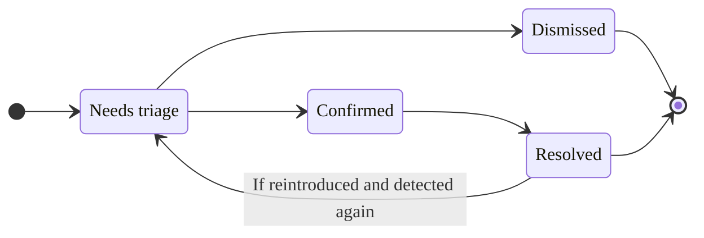



- Édition : GitLab Ultimate
- Offre : GitLab.com, GitLab Self-Managed, GitLab Dedicated



Chaque vulnérabilité dans un projet possède une page de vulnérabilité contenant les détails de la vulnérabilité, notamment :

- Description
- Date de détection
- Statut actuel
- Actions disponibles
- Tickets liés
- Journal des actions
- Emplacement
- Gravité

Pour les vulnérabilités figurant dans le catalogue [Common Vulnerabilities and Exposures (CVE)](https://www.cve.org/), ces détails incluent également :

- Score CVSS
- [Score EPSS](risk_assessment_data.md#epss)
- [Statut KEV](risk_assessment_data.md#kev)
- [Statut d'accessibilité](../dependency_scanning/static_reachability.md) (Disponibilité limitée)

Pour plus de détails sur ces données supplémentaires, voir [les données d'évaluation des risques de vulnérabilité](risk_assessment_data.md).

Si le scanner a déterminé que la vulnérabilité est un faux positif, un message d'alerte est inclus en haut de la page de la vulnérabilité.

Pour les vulnérabilités détectées par SAST, GitLab Duo peut les analyser automatiquement et générer une merge request avec des corrections de code adaptées au contexte. Pour plus d'informations, voir [Agentic SAST vulnerability resolution](agentic_vulnerability_resolution.md).

## Secret false positive detection {#secret-false-positive-detection}



- Édition : GitLab Ultimate
- Module complémentaire : GitLab Duo Core, Pro ou Enterprise
- Offre : GitLab.com, GitLab Self-Managed, GitLab Dedicated
- Statut :  version bêta





- Introduit dans l'[epic 17885](https://gitlab.com/groups/gitlab-org/-/work_items/20152) dans GitLab 18.10 en tant que fonctionnalité en [version bêta](../../../policy/development_stages_support.md#beta) avec un [feature flag](../../../administration/feature_flags/_index.md) nommé `duo_secret_detection_false_positive`. [Activé sur GitLab.com, GitLab Self-Managed et GitLab Dedicated](https://gitlab.com/gitlab-org/gitlab/-/merge_requests/227074).



GitLab Duo analyse automatiquement les résultats de détection des secrets pour identifier les faux positifs potentiels. Rejeter les faux positifs réduit le bruit dans votre rapport de vulnérabilités en signalant les résultats qui ne constituent probablement pas des risques de sécurité réels.

Pour chaque vulnérabilité analysée, GitLab Duo fournit les informations suivantes :

- Un score de confiance indiquant la probabilité que l'évaluation soit correcte.
- Une explication des raisons pour lesquelles le résultat pourrait ou non être correct.
- Des indicateurs visuels signalant qu'une vulnérabilité a été identifiée comme un faux positif potentiel dans le rapport de vulnérabilités.

Pour plus d'informations, voir [Secret false positive detection](secret_false_positive_detection.md).

## Vulnerability Resolution {#vulnerability-resolution}



- Édition : GitLab Ultimate
- Module complémentaire : GitLab Duo Enterprise, GitLab Duo with Amazon Q
- Offre : GitLab.com, GitLab Self-Managed, GitLab Dedicated





- [LLM par défaut](../../gitlab_duo/model_selection.md#default-models)
- LLM pour Amazon Q :  Amazon Q Developer
- Disponible sur [GitLab Duo avec des modèles auto-hébergés](../../../administration/gitlab_duo_self_hosted/_index.md)





- [Introduit](https://gitlab.com/groups/gitlab-org/-/epics/10779) dans GitLab 16.7 en tant que [version expérimentale](../../../policy/development_stages_support.md#experiment) sur GitLab.com.
- Passé en version bêta dans GitLab 17.3.
- Modifié pour nécessiter le module complémentaire GitLab Duo dans GitLab 17.6 et les versions ultérieures.



Utilisez GitLab Duo Vulnerability resolution pour créer automatiquement une merge request qui résout la vulnérabilité. Par défaut, il est propulsé par le modèle [`claude-3.5-sonnet`](https://console.cloud.google.com/vertex-ai/publishers/anthropic/model-garden/claude-3-5-sonnet) d'Anthropic.

GitLab ne peut pas garantir que le grand modèle de langage produit des résultats corrects. Vous devez toujours examiner la modification proposée avant de la fusionner. Lors de la révision, vérifiez que :

- Les fonctionnalités existantes de votre application sont préservées.
- La vulnérabilité est résolue conformément aux standards de votre organisation.

<i class="fa-youtube-play" aria-hidden="true"></i> [Regarder un aperçu](https://www.youtube.com/watch?v=VJmsw_C125E&list=PLFGfElNsQthZGazU1ZdfDpegu0HflunXW)

Prérequis :

- Vous devez disposer de l'édition d'abonnement GitLab Ultimate et de GitLab Duo Enterprise.
- Vous devez être membre du projet.
- La vulnérabilité doit être un résultat SAST provenant d'un analyseur pris en charge :
  - Tout [analyseur pris en charge par GitLab](../sast/analyzers.md).
  - Un scanner SAST tiers correctement intégré qui signale l'emplacement de la vulnérabilité et un identifiant CWE pour chaque vulnérabilité.
- La vulnérabilité doit être d'un [type pris en charge](#supported-vulnerabilities-for-vulnerability-resolution).

Apprenez-en davantage sur [comment activer toutes les fonctionnalités GitLab Duo](../../gitlab_duo/turn_on_off.md).

Pour résoudre la vulnérabilité :

1. Dans la barre supérieure, sélectionnez **Rechercher ou aller à** et accédez à votre projet.
1. Dans la barre latérale gauche, sélectionnez **Sécurisation** > **Rapport de vulnérabilités**.
1. facultatif. Pour supprimer les filtres par défaut, sélectionnez **Effacer** ().
1. Au-dessus de la liste des vulnérabilités, sélectionnez la barre de filtre.
1. Dans la liste déroulante qui apparaît, sélectionnez **Activité**, puis sélectionnez **Résolution de vulnérabilités disponible** dans la catégorie **GitLab Duo (AI)**.
1. Cliquez en dehors du champ de filtre. Les totaux de gravité des vulnérabilités et la liste des vulnérabilités correspondantes sont mis à jour.
1. Sélectionnez la vulnérabilité SAST que vous souhaitez résoudre.
   - Une icône bleue s'affiche à côté des vulnérabilités qui prennent en charge la Vulnerability Resolution.
1. Dans le coin supérieur droit, sélectionnez **Résoudre grâce à l'IA**. Si ce projet est un projet public, sachez que la création d'une MR exposera publiquement la vulnérabilité et la résolution proposée. Pour créer la MR de manière privée, [créez une duplication privée](../../project/merge_requests/confidential.md) et répétez ce processus.
1. Ajoutez un commit supplémentaire à la MR. Cela force l'exécution d'un nouveau pipeline.
1. Une fois le pipeline terminé, sur l'[onglet de sécurité du pipeline](../detect/security_scanning_results.md), confirmez que la vulnérabilité n'apparaît plus.
1. Dans le rapport de vulnérabilités, [mettez à jour manuellement la vulnérabilité](../vulnerability_report/_index.md#change-status-of-vulnerabilities).

Une merge request contenant les suggestions de correction par l'IA est ouverte. Examinez les modifications suggérées, puis traitez la merge request selon votre workflow standard.

Donnez votre avis sur cette fonctionnalité dans le [ticket 476553](https://gitlab.com/gitlab-org/gitlab/-/issues/476553).

### Vulnérabilités prises en charge pour Vulnerability Resolution {#supported-vulnerabilities-for-vulnerability-resolution}

Pour garantir que les résolutions suggérées sont de haute qualité, Vulnerability Resolution est disponible pour un ensemble spécifique de vulnérabilités. Le système décide de proposer ou non la Vulnerability Resolution en fonction de l'identifiant Common Weakness Enumeration (CWE) de la vulnérabilité.

L'ensemble actuel de vulnérabilités est sélectionné sur la base de tests effectués par des systèmes automatisés et des experts en sécurité. GitLab travaille activement à étendre la couverture à davantage de types de vulnérabilités.

<details><summary style="color:#5943b6; margin-top: 1em;"><a>Voir la liste complète des CWE pris en charge pour Vulnerability Resolution</a></summary>

<ul>
  <li>CWE-23 : Relative Path Traversal</li>
  <li>CWE-73 : External Control of File Name or Path</li>
  <li>CWE-78 : Improper Neutralization of Special Elements used in an OS Command ('OS Command Injection')</li>
  <li>CWE-80 : Improper Neutralization of Script-Related HTML Tags in a Web Page (Basic XSS)</li>
  <li>CWE-89 : Improper Neutralization of Special Elements used in an SQL Command ('SQL Injection')</li>
  <li>CWE-116 : Improper Encoding or Escaping of Output</li>
  <li>CWE-118 : Incorrect Access of Indexable Resource ('Range Error')</li>
  <li>CWE-119 : Improper Restriction of Operations within the Bounds of a Memory Buffer</li>
  <li>CWE-120 : Buffer Copy without Checking Size of Input ('Classic Buffer Overflow')</li>
  <li>CWE-126 : Buffer Over-read</li>
  <li>CWE-190 : Integer Overflow or Wraparound</li>
  <li>CWE-200 : Exposure of Sensitive Information to an Unauthorized Actor</li>
  <li>CWE-208 : Observable Timing Discrepancy</li>
  <li>CWE-209 : Generation of Error Message Containing Sensitive Information</li>
  <li>CWE-272 : Least Privilege Violation</li>
  <li>CWE-287 : Improper Authentication</li>
  <li>CWE-295 : Improper Certificate Validation</li>
  <li>CWE-297 : Improper Validation of Certificate with Host Mismatch</li>
  <li>CWE-305 : Authentication Bypass by Primary Weakness</li>
  <li>CWE-310 : Cryptographic Issues</li>
  <li>CWE-311 : Missing Encryption of Sensitive Data</li>
  <li>CWE-323 : Reusing a Nonce, Key Pair in Encryption</li>
  <li>CWE-327 : Use of a Broken or Risky Cryptographic Algorithm</li>
  <li>CWE-328 : Use of Weak Hash</li>
  <li>CWE-330 : Use of Insufficiently Random Values</li>
  <li>CWE-338 : Use of Cryptographically Weak Pseudo-Random Number Generator (PRNG)</li>
  <li>CWE-345 : Insufficient Verification of Data Authenticity</li>
  <li>CWE-346 : Origin Validation Error</li>
  <li>CWE-352 : Cross-Site Request Forgery</li>
  <li>CWE-362 : Concurrent Execution using Shared Resource with Improper Synchronization ('Race Condition')</li>
  <li>CWE-369 : Divide By Zero</li>
  <li>CWE-377 : Insecure Temporary File</li>
  <li>CWE-378 : Creation of Temporary File With Insecure Permissions</li>
  <li>CWE-400 : Uncontrolled Resource Consumption</li>
  <li>CWE-489 : Active Debug Code</li>
  <li>CWE-521 : Weak Password Requirements</li>
  <li>CWE-539 : Use of Persistent Cookies Containing Sensitive Information</li>
  <li>CWE-599 : Missing Validation of OpenSSL Certificate</li>
  <li>CWE-611 : Improper Restriction of XML External Entity Reference</li>
  <li>CWE-676 : Use of potentially dangerous function</li>
  <li>CWE-704 : Incorrect Type Conversion or Cast</li>
  <li>CWE-754 : Improper Check for Unusual or Exceptional Conditions</li>
  <li>CWE-770 : Allocation of Resources Without Limits or Throttling</li>
  <li>CWE-1004 : Sensitive Cookie Without 'HttpOnly' Flag</li>
  <li>CWE-1275 : Sensitive Cookie with Improper SameSite Attribute</li>
</ul>
</details>

### Dépannage {#troubleshooting}

Vulnerability Resolution ne peut parfois pas générer de correctif suggéré. Les causes courantes sont les suivantes :

- Faux positif détecté :
  - Avant de proposer un correctif, le modèle d'IA évalue si la vulnérabilité est valide. Il peut estimer que la vulnérabilité n'est pas une vraie vulnérabilité ou ne vaut pas la peine d'être corrigée.
  - Cela peut se produire si la vulnérabilité se trouve dans du code de test. Votre organisation peut toujours choisir de corriger les vulnérabilités même si elles se trouvent dans du code de test, mais les modèles les évaluent parfois comme des faux positifs.
  - Si vous estimez que la vulnérabilité est un faux positif ou ne vaut pas la peine d'être corrigée, vous devez [rejeter la vulnérabilité](#vulnerability-status-values) et [sélectionner une raison correspondante](#vulnerability-dismissal-reasons).
    - Pour personnaliser votre configuration SAST ou signaler un problème avec une règle GitLab SAST, voir [les règles SAST](../sast/rules.md).
- Erreur temporaire ou inattendue :
  - Le message d'erreur peut indiquer que `an unexpected error has occurred`, `the upstream AI provider request timed out`, `something went wrong`, ou une cause similaire.
  - Ces erreurs peuvent être causées par des problèmes temporaires avec le fournisseur d'IA ou avec GitLab Duo.
  - Une nouvelle demande peut aboutir, vous pouvez donc essayer de résoudre à nouveau la vulnérabilité.
  - Si vous continuez à voir ces erreurs, contactez GitLab pour obtenir de l'aide.

### Données partagées avec des API d'IA tierces pour Vulnerability Resolution {#data-shared-with-third-party-ai-apis-for-vulnerability-resolution}

Les données suivantes sont partagées avec des API d'IA tierces :

- Nom de la vulnérabilité
- Description de la vulnérabilité
- Identifiants (CWE, OWASP)
- Fichier entier contenant les lignes de code vulnérables
- Lignes de code vulnérables (numéros de ligne)

## Vulnerability Resolution dans une merge request {#vulnerability-resolution-in-a-merge-request}



- Édition : GitLab Ultimate
- Module complémentaire : GitLab Duo Enterprise
- Offre : GitLab.com, GitLab Self-Managed, GitLab Dedicated





- [Introduit](https://gitlab.com/groups/gitlab-org/-/epics/14862) dans GitLab 17.6.
- [Activé par défaut](https://gitlab.com/gitlab-org/gitlab/-/merge_requests/175150) dans GitLab 17.7.
- [Généralement disponible](https://gitlab.com/gitlab-org/gitlab/-/merge_requests/185452) dans GitLab 17.11. L'indicateur de fonctionnalité `resolve_vulnerability_in_mr` a été supprimé.



Utilisez GitLab Duo Vulnerability resolution pour créer automatiquement un commentaire de suggestion de merge request qui résout le résultat de la vulnérabilité. Par défaut, il est propulsé par le modèle [`claude-3.5-sonnet`](https://console.cloud.google.com/vertex-ai/publishers/anthropic/model-garden/claude-3-5-sonnet) d'Anthropic.

Pour résoudre le résultat de la vulnérabilité :

1. Dans la barre supérieure, sélectionnez **Rechercher ou aller à** et accédez à votre projet.
1. Dans la barre latérale gauche, sélectionnez **Code** > **Requêtes de fusion**.
1. Sélectionnez une merge request.
   - Les résultats de vulnérabilité pris en charge par Vulnerability Resolution sont indiqués par l'icône IA tanuki ().
1. Sélectionnez les résultats pris en charge pour ouvrir la boîte de dialogue de résultat de sécurité.
1. Dans le coin inférieur droit, sélectionnez **Résoudre grâce à l'IA**.

Un commentaire contenant les suggestions de correction par l'IA est ouvert dans la merge request. Examinez les modifications suggérées, puis appliquez la suggestion de merge request selon votre workflow standard.

Donnez votre avis sur cette fonctionnalité dans le [ticket 476553](https://gitlab.com/gitlab-org/gitlab/-/issues/476553).

### Dépannage {#troubleshooting-1}

Vulnerability Resolution dans une merge request ne peut parfois pas générer de correctif suggéré. Les causes courantes sont les suivantes :

- Faux positif détecté :
  - Avant de proposer un correctif, le modèle d'IA évalue si la vulnérabilité est valide. Il peut estimer que la vulnérabilité n'est pas une vraie vulnérabilité ou ne vaut pas la peine d'être corrigée.
  - Cela peut se produire si la vulnérabilité se trouve dans du code de test. Votre organisation peut toujours choisir de corriger les vulnérabilités même si elles se trouvent dans du code de test, mais les modèles les évaluent parfois comme des faux positifs.
  - Si vous estimez que la vulnérabilité est un faux positif ou ne vaut pas la peine d'être corrigée, vous devez [rejeter la vulnérabilité](#vulnerability-status-values) et [sélectionner une raison correspondante](#vulnerability-dismissal-reasons).
    - Pour personnaliser votre configuration SAST ou signaler un problème avec une règle GitLab SAST, voir [les règles SAST](../sast/rules.md).
- Erreur temporaire ou inattendue :
  - Le message d'erreur peut indiquer que `an unexpected error has occurred`, `the upstream AI provider request timed out`, `something went wrong`, ou une cause similaire.
  - Ces erreurs peuvent être causées par des problèmes temporaires avec le fournisseur d'IA ou avec GitLab Duo.
  - Une nouvelle demande peut aboutir, vous pouvez donc essayer de résoudre à nouveau la vulnérabilité.
  - Si vous continuez à voir ces erreurs, contactez GitLab pour obtenir de l'aide.
- Erreur `Resolution target could not be found in the merge request, unable to create suggestion` :
  - Cette erreur peut se produire lorsque la branche cible n'a pas exécuté un pipeline de scan de sécurité complet. Consultez la [documentation sur les merge requests](../detect/security_scanning_results.md).

## Flux de code de la vulnérabilité {#vulnerability-code-flow}



- Édition : GitLab Ultimate
- Offre : GitLab.com, GitLab Self-Managed, GitLab Dedicated



Pour certains types de vulnérabilités, GitLab Advanced SAST fournit des informations sur le [flux de code](../sast/gitlab_advanced_sast.md#code-flow). Le flux de code d'une vulnérabilité est le chemin que les données empruntent depuis l'entrée utilisateur (source) jusqu'à la ligne de code vulnérable (sink), en passant par toutes les affectations, manipulations et opérations de nettoyage.

Pour plus de détails sur la façon d'afficher le flux de code d'une vulnérabilité, voir [le flux de code de la vulnérabilité](../sast/gitlab_advanced_sast.md#code-flow).


## Valeurs de statut des vulnérabilités {#vulnerability-status-values}

Le statut d'une vulnérabilité peut être :

- **Nécessite un classement** : L'état par défaut d'une vulnérabilité nouvellement découverte.
- **Confirmée** : Un utilisateur a examiné cette vulnérabilité et l'a confirmée comme étant exacte.
- **Rejetée** : Un utilisateur a évalué cette vulnérabilité et [l'a rejetée](#vulnerability-dismissal-reasons). Les vulnérabilités rejetées sont ignorées si elles sont détectées lors de scans ultérieurs.
- **Résolue** : La vulnérabilité a été corrigée ou n'est plus présente. Si une vulnérabilité résolue est réintroduite et à nouveau détectée, son enregistrement est rétabli et son statut est défini sur **Nécessite un classement**.

Une vulnérabilité suit généralement le cycle de vie suivant :



## La vulnérabilité n'est plus détectée {#vulnerability-is-no-longer-detected}



- Un lien vers le commit qui a résolu la vulnérabilité a été [introduit](https://gitlab.com/gitlab-org/gitlab/-/issues/372799) et rendu [généralement disponible sur GitLab Self-Managed et GitLab Dedicated](https://gitlab.com/gitlab-org/gitlab/-/merge_requests/178748) dans GitLab 17.9. L'indicateur de fonctionnalité `vulnerability_representation_information` a été supprimé.



Une vulnérabilité peut ne plus être détectée en raison de modifications apportées délibérément pour la corriger ou comme effet secondaire d'autres changements. Lorsqu'un scan de sécurité s'exécute et qu'une vulnérabilité n'est plus détectée dans la branche par défaut, le scanner ajoute **N'est plus détectée** au journal d'activité de l'enregistrement, mais le statut de l'enregistrement ne change pas. Vous devez plutôt vérifier et confirmer que la vulnérabilité a été résolue et, le cas échéant, [modifier manuellement son statut en **Résolue**](#change-the-status-of-a-vulnerability). Vous pouvez également utiliser une [politique de gestion des vulnérabilités](../policies/vulnerability_management_policy.md) pour modifier automatiquement le statut des vulnérabilités correspondant à des critères spécifiques en **Résolue**.

Vous pouvez trouver un lien vers le commit qui a résolu la vulnérabilité en haut ou en bas de la page de la vulnérabilité.

## Raisons de rejet des vulnérabilités {#vulnerability-dismissal-reasons}



- [Introduit](https://gitlab.com/groups/gitlab-org/-/epics/4942) dans GitLab 15.11 [avec un flag](../../../administration/feature_flags/_index.md) nommé `dismissal_reason`.
- [Activé sur GitLab Self-Managed et GitLab Dedicated](https://gitlab.com/gitlab-org/gitlab/-/issues/393005) dans GitLab 16.0.
- [Généralement disponible](https://gitlab.com/gitlab-org/gitlab/-/merge_requests/124397) dans GitLab 16.2. L'indicateur de fonctionnalité `dismissal_reason` a été supprimé.



Lorsque vous rejetez une vulnérabilité, vous devez choisir l'une des raisons suivantes :

- **Risque acceptable** : La vulnérabilité est connue et n'a pas été corrigée ni atténuée, mais est considérée comme un risque commercial acceptable.
- **Faux positif** : Une erreur de rapport dans laquelle un résultat de test indique incorrectement la présence d'une vulnérabilité dans un système alors que la vulnérabilité n'est pas présente.
- **Contrôle d'atténuation** : Le risque de la vulnérabilité est atténué par un contrôle de gestion, opérationnel ou technique (c'est-à-dire une mesure de protection ou une contre-mesure) employé par une organisation qui fournit une protection équivalente ou comparable pour un système d'information.
- **Utilisation pour des tests** : Le résultat n'est pas une vulnérabilité car il fait partie d'un test ou constitue des données de test.
- **Non applicable** : La vulnérabilité est connue et n'a pas été corrigée ni atténuée, mais est considérée comme se trouvant dans une partie de l'application qui ne sera pas mise à jour.

## Modifier le statut d'une vulnérabilité {#change-the-status-of-a-vulnerability}



- L'autorisation permettant aux utilisateurs disposant du rôle `Developer` de modifier le statut d'une vulnérabilité (`admin_vulnerability`) a été [dépréciée](https://gitlab.com/gitlab-org/gitlab/-/issues/424133) dans GitLab 16.4 et [supprimée](https://gitlab.com/gitlab-org/gitlab/-/issues/412693) dans GitLab 17.0.
- La zone de texte **Commentaire** a été [ajoutée](https://gitlab.com/gitlab-org/gitlab/-/issues/451480) dans GitLab 17.9.



Prérequis :

- Vous devez disposer du rôle Responsable sécurité, Maintainer ou Owner pour le projet, ou d'un rôle personnalisé avec la permission `admin_vulnerability`.

Pour modifier le statut d'une vulnérabilité depuis sa page de vulnérabilité :

1. Dans la barre supérieure, sélectionnez **Rechercher ou aller à** et accédez à votre projet.
1. Dans la barre latérale gauche, sélectionnez **Sécurisation** > **Rapport de vulnérabilités**.
1. Sélectionnez la description de la vulnérabilité.
1. Sélectionnez **Modifier le statut**.
1. Dans la liste déroulante **Statut**, sélectionnez un statut ou une [raison de rejet](#vulnerability-dismissal-reasons) lorsque vous souhaitez changer le statut de la vulnérabilité en **Rejetée**.
1. Dans la zone de texte **Commentaire**, saisissez un commentaire avec plus de détails sur les raisons du rejet. Lorsque vous appliquez le statut **Rejetée**, un commentaire est requis.

Les détails du changement de statut, notamment qui a effectué le changement et quand, sont enregistrés dans le journal des actions de la vulnérabilité.

## Créer un ticket GitLab pour une vulnérabilité {#create-a-gitlab-issue-for-a-vulnerability}

Vous pouvez créer un ticket GitLab pour suivre toute action entreprise pour résoudre ou atténuer une vulnérabilité. Pour créer un ticket GitLab pour une vulnérabilité :

1. Dans la barre supérieure, sélectionnez **Rechercher ou aller à** et accédez à votre projet.
1. Dans la barre latérale gauche, sélectionnez **Sécurisation** > **Rapport de vulnérabilités**.
1. Sélectionnez la description de la vulnérabilité.
1. Sélectionnez **Créer un ticket**.

Le ticket est créé dans le projet GitLab avec les informations du rapport de vulnérabilités.

Pour créer un ticket Jira, voir [Créer un ticket Jira pour une vulnérabilité](../../../integration/jira/configure.md#create-a-jira-issue-for-a-vulnerability).

## Lier une vulnérabilité aux tickets GitLab et Jira {#linking-a-vulnerability-to-gitlab-and-jira-issues}

Vous pouvez lier une vulnérabilité à un ou plusieurs tickets [GitLab](#create-a-gitlab-issue-for-a-vulnerability) ou [Jira](../../../integration/jira/configure.md#create-a-jira-issue-for-a-vulnerability) existants. Une seule fonctionnalité de liaison est disponible à la fois. L'ajout d'un lien permet de suivre le ticket qui résout ou atténue une vulnérabilité.

### Lier une vulnérabilité à des tickets GitLab existants {#link-a-vulnerability-to-existing-gitlab-issues}

Prérequis :

- L'[intégration des tickets Jira](../../../integration/jira/configure.md) ne doit pas être activée.

Pour lier une vulnérabilité à des tickets GitLab existants :

1. Dans la barre supérieure, sélectionnez **Rechercher ou aller à** et accédez à votre projet.
1. Dans la barre latérale gauche, sélectionnez **Sécurisation** > **Rapport de vulnérabilités**.
1. Sélectionnez la description de la vulnérabilité.
1. Dans la section **Linked issues**, sélectionnez l'icône plus ().
1. Pour chaque ticket à lier, vous pouvez :
   - Coller un lien vers le ticket.
   - Saisir l'identifiant du ticket (précédé d'un dièse `#`).
1. Sélectionnez **Ajouter**.

Les tickets GitLab sélectionnés sont ajoutés à la section **Éléments liés** et le compteur de tickets liés est mis à jour.

Les tickets GitLab liés à une vulnérabilité sont affichés dans le rapport de vulnérabilités et sur la page de la vulnérabilité.

Soyez conscient des conditions suivantes entre une vulnérabilité et un ticket GitLab lié :

- La page de la vulnérabilité affiche les tickets associés, mais la page du ticket n'affiche pas la vulnérabilité à laquelle elle est liée.
- Un ticket ne peut être lié qu'à une seule vulnérabilité à la fois.
- Les tickets peuvent être liés entre groupes et projets.

### Lier une vulnérabilité à des tickets Jira existants {#link-a-vulnerability-to-existing-jira-issues}

Prérequis :

- Vérifiez que l'intégration des tickets Jira est [configurée](../../../integration/jira/configure.md#configure-the-integration) et que la case **Créer des tickets Jira pour les vulnérabilités** est cochée.

Pour lier une vulnérabilité à des tickets Jira existants, ajoutez la ligne suivante à la description du ticket Jira :

```plaintext
/-/security/vulnerabilities/<id>
```

`<id>` correspond à tout [identifiant de vulnérabilité](../../../api/vulnerabilities.md#retrieve-a-vulnerability). Vous pouvez ajouter plusieurs lignes avec des identifiants différents à une même description.

Les tickets Jira dont la description est appropriée sont ajoutés à la section **Tickets Jira associés** et le compteur de tickets liés est mis à jour.

Les tickets Jira liés à une vulnérabilité s'affichent uniquement sur la page de la vulnérabilité.

Soyez conscient des conditions suivantes entre une vulnérabilité et un ticket Jira lié :

- La page de la vulnérabilité et la page du ticket affichent la vulnérabilité à laquelle elles sont liées.
- Un ticket peut être lié à une ou plusieurs vulnérabilités en même temps.

## Résoudre une vulnérabilité {#resolve-a-vulnerability}

Pour certaines vulnérabilités, une solution est déjà connue mais doit être implémentée manuellement. Le champ **Solution** de la page de vulnérabilité est fourni par l'outil de scan de sécurité qui a signalé le résultat de sécurité, ou saisi lors de la [création manuelle d'une vulnérabilité](../vulnerability_report/_index.md#manually-add-a-vulnerability). Les outils GitLab utilisent les informations de la [base de données des avis GitLab](../gitlab_advisory_database/_index.md).

De plus, certains outils peuvent inclure un correctif logiciel pour appliquer la solution suggérée. Dans ces cas, la page d'une vulnérabilité inclut une option **Résoudre avec une requête de fusion**.

Les scanners suivants sont pris en charge par cette fonctionnalité :

- [Analyse des dépendances](../dependency_scanning/_index.md). La création automatique de correctifs est uniquement disponible pour les projets Node.js gérés avec `yarn`. La création automatique de correctifs est uniquement prise en charge lorsque le [mode FIPS](../../../development/fips_gitlab.md#enable-fips-mode) est désactivé.

- [Scan de conteneur](../container_scanning/_index.md).

Pour résoudre une vulnérabilité, vous pouvez soit :

- [Résoudre une vulnérabilité avec une merge request](#resolve-a-vulnerability-with-a-merge-request).
- [Résoudre une vulnérabilité manuellement](#resolve-a-vulnerability-manually).

### Résoudre une vulnérabilité avec une merge request {#resolve-a-vulnerability-with-a-merge-request}

Pour résoudre la vulnérabilité avec une merge request :

1. Dans la barre supérieure, sélectionnez **Rechercher ou aller à** et accédez à votre projet.
1. Dans la barre latérale gauche, sélectionnez **Sécurisation** > **Rapport de vulnérabilités**.
1. Sélectionnez la description de la vulnérabilité.
1. Dans la liste déroulante **Résoudre avec une requête de fusion**, sélectionnez **Résoudre avec une requête de fusion**.

Une merge request est créée, qui applique le correctif nécessaire pour résoudre la vulnérabilité. Traitez la merge request selon votre workflow standard.

### Résoudre une vulnérabilité manuellement {#resolve-a-vulnerability-manually}

Pour appliquer manuellement le correctif généré par GitLab pour une vulnérabilité :

1. Dans la barre supérieure, sélectionnez **Rechercher ou aller à** et accédez à votre projet.
1. Dans la barre latérale gauche, sélectionnez **Sécurisation** > **Rapport de vulnérabilités**.
1. Sélectionnez la description de la vulnérabilité.
1. Dans la liste déroulante **Résoudre avec une requête de fusion**, sélectionnez **Télécharger le correctif pour résoudre**.
1. Vérifiez que votre projet local a le même commit extrait que celui utilisé pour générer le correctif.
1. Exécutez `git apply remediation.patch`.
1. Vérifiez et commitez les modifications dans votre branche.
1. Créez une merge request pour appliquer les modifications à votre branche principale.
1. Traitez la merge request selon votre workflow standard.

## Activer la formation à la sécurité pour les vulnérabilités {#enable-security-training-for-vulnerabilities}

> [!note]
> La formation à la sécurité n'est pas accessible dans un environnement hors ligne, c'est-à-dire des ordinateurs isolés du réseau Internet public à des fins de sécurité. Plus précisément, le serveur GitLab doit pouvoir interroger les points de terminaison d'API de tout fournisseur de formation que vous choisissez d'activer. Certains fournisseurs de formation tiers peuvent vous demander de créer un compte gratuit. Créez un compte en vous rendant sur l'un des sites suivants : [Secure Code Warrior](https://www.securecodewarrior.com/), [Kontra](https://application.security/) ou [SecureFlag](https://www.secureflag.com/index.html). GitLab n'envoie aucune information utilisateur à ces fournisseurs tiers ; GitLab envoie uniquement l'identifiant CWE ou OWASP et le nom du langage de l'extension de fichier.

La formation à la sécurité aide vos équipes de développement à apprendre à corriger les vulnérabilités. Les équipes de développement peuvent consulter la formation à la sécurité auprès de fournisseurs éducatifs sélectionnés, pertinente par rapport à la vulnérabilité détectée.

Pour activer la formation à la sécurité pour les vulnérabilités dans votre projet :

1. Dans la barre supérieure, sélectionnez **Rechercher ou aller à** et accédez à votre projet.
1. Dans la barre latérale gauche, sélectionnez **Sécurisation** > **Configuration de la sécurité**.
1. Dans la barre d'onglets, sélectionnez **Gestion des vulnérabilités**.
1. Pour activer un fournisseur de formation à la sécurité, activez le bouton.

Chaque intégration soumet l'identifiant de vulnérabilité, par exemple CWE ou OWASP, ainsi que le langage au fournisseur de formation à la sécurité. Le lien résultant vers la formation du fournisseur est ce qui apparaît dans une vulnérabilité GitLab.

## Afficher la formation à la sécurité pour une vulnérabilité {#view-security-training-for-a-vulnerability}

La page de vulnérabilité peut inclure un lien de formation pertinent pour la vulnérabilité détectée si la formation à la sécurité est activée. La disponibilité de la formation dépend du fait que le fournisseur de formation activé dispose d'un contenu correspondant à la vulnérabilité particulière. Le contenu de formation est demandé sur la base des identifiants de vulnérabilité. L'identifiant attribué à une vulnérabilité varie d'une vulnérabilité à l'autre et le contenu de formation disponible varie selon les fournisseurs. Certaines vulnérabilités n'affichent pas de contenu de formation. Les vulnérabilités avec un CWE sont les plus susceptibles de renvoyer un résultat de formation.

Pour afficher la formation à la sécurité pour une vulnérabilité :

1. Dans la barre supérieure, sélectionnez **Rechercher ou aller à** et accédez à votre projet.
1. Dans la barre latérale gauche, sélectionnez **Sécurisation** > **Rapport de vulnérabilités**.
1. Sélectionnez la vulnérabilité pour laquelle vous souhaitez afficher la formation à la sécurité.
1. Sélectionnez **Voir la formation**.

## Afficher l'emplacement d'une vulnérabilité dans les dépendances transitives {#view-the-location-of-a-vulnerability-in-transitive-dependencies}



- Option d'affichage des chemins de dépendance [introduite](https://gitlab.com/gitlab-org/gitlab/-/issues/519965) dans GitLab 17.11 [avec un flag](../../../administration/feature_flags/_index.md) nommé `dependency_paths`. Désactivée par défaut. Désactivée par défaut.
- Option d'affichage des chemins de dépendance [généralement disponible](https://gitlab.com/gitlab-org/gitlab/-/merge_requests/197224) dans GitLab 18.2. Feature flag `dependency_paths` activé par défaut.



> [!flag]
> La disponibilité de cette fonctionnalité est contrôlée par un feature flag. Pour plus d'informations, consultez l'historique.

Lors de la gestion des vulnérabilités trouvées dans les dépendances dans les détails de la vulnérabilité, sous **Emplacement**, vous pouvez afficher :

- L'emplacement de la dépendance directe où la vulnérabilité a été trouvée.
- Si disponible, le numéro de ligne spécifique où la vulnérabilité se produit.

Si la vulnérabilité se produit dans une ou plusieurs dépendances transitives, connaître uniquement la dépendance directe peut ne pas être suffisant. Les dépendances transitives sont des dépendances indirectes qui ont une dépendance directe comme ancêtre.

Si des dépendances transitives existent, vous pouvez afficher les chemins vers toutes les dépendances, y compris les dépendances transitives qui contiennent la vulnérabilité.

- Sur la page des détails de la vulnérabilité, sous **Emplacement**, sélectionnez **Afficher les chemins de dépendance**. Si **Afficher les chemins de dépendance** n'apparaît pas, cela signifie qu'il n'y a pas de dépendances transitives.
