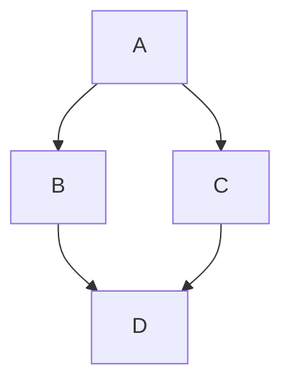
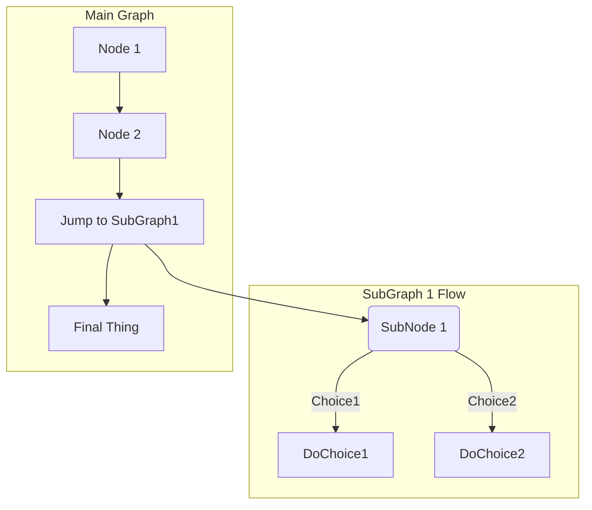



- Édition : Gratuite, GitLab Premium, GitLab Ultimate
- Offre : GitLab.com, GitLab Self-Managed, GitLab Dedicated



GitLab Flavored Markdown (GLFM) est un puissant langage de balisage qui met en forme le texte dans l'interface utilisateur de GitLab. GLFM :

- Crée du contenu enrichi avec prise en charge du code, des diagrammes, des équations mathématiques et des contenus multimédias.
- Relie les tickets, les merge requests et d'autres contenus GitLab par des références croisées.
- Organise les informations avec des listes de tâches, des tableaux et des sections réductibles.
- Prend en charge la coloration syntaxique pour plus de 100 langages de programmation.
- Garantit l'accessibilité grâce à des structures de titres sémantiques et des descriptions d'images.

Lorsque vous saisissez du texte dans l'interface utilisateur GitLab, GitLab suppose que le texte est en GitLab Flavored Markdown.

Vous pouvez utiliser GitLab Flavored Markdown dans :

- Commentaires
- Tickets
- Epics
- Merge requests
- Jalons
- Snippets (le snippet doit être nommé avec une extension `.md`)
- Pages wiki
- Documents Markdown dans les dépôts
- Releases

Vous pouvez également utiliser d'autres fichiers en texte enrichi dans GitLab. Vous devrez peut-être installer une dépendance pour ce faire. Pour plus d'informations, consultez le [projet gem `gitlab-markup`](https://gitlab.com/gitlab-org/gitlab-markup).

> [!note]
> Cette spécification Markdown est valide pour GitLab uniquement. Nous faisons de notre mieux pour restituer fidèlement le Markdown ici, cependant le [site de documentation GitLab](https://docs.gitlab.com) et le [manuel GitLab](https://handbook.gitlab.com) utilisent un moteur de rendu Markdown différent.

Pour voir des exemples précis de la façon dont GitLab restitue ces exemples :

1. Copiez l'exemple Markdown brut pertinent (pas la version rendue de l'exemple).
1. Collez le Markdown quelque part dans GitLab qui prend en charge les aperçus Markdown, par exemple dans les commentaires ou descriptions de tickets ou de merge requests, ou dans un nouveau fichier Markdown.
1. Sélectionnez **Aperçu** pour voir le Markdown rendu par GitLab.

## Différences avec le Markdown standard {#differences-with-standard-markdown}

<!--
Use this topic to list features that are not present in standard Markdown.
Don't repeat this information in each individual topic, unless there's a specific
reason, like in "Newlines".
-->

GitLab Flavored Markdown comprend les éléments suivants :

- Fonctionnalités Markdown de base, basées sur la [spécification CommonMark](https://spec.commonmark.org/current/).
- Extensions de [GitHub Flavored Markdown](https://github.github.com/gfm/).
- Extensions créées spécifiquement pour GitLab.

Toute la mise en forme Markdown standard devrait fonctionner comme prévu dans GitLab. Certaines fonctionnalités standard sont étendues avec des fonctionnalités supplémentaires, sans affecter l'utilisation standard.

Les fonctionnalités suivantes ne se trouvent pas dans le Markdown standard :

- [Alertes](#alerts)
- [Puces de couleur écrites en `HEX`, `RGB` ou `HSL`](#colors)
- [Listes de descriptions](#description-lists)
- [Diagrammes et organigrammes](#diagrams-and-flowcharts)
- [Emoji](#emoji)
- [Notes de bas de page](#footnotes)
- [En-tête de document](#front-matter)
- [Références spécifiques à GitLab](#gitlab-specific-references) (Non prises en charge dans les fichiers snippet Markdown.)
- [Inclusions](#includes)
- [Espaces réservés](#placeholders)
- [Diffs inline](#inline-diff)
- [Équations mathématiques et symboles écrits en LaTeX](#math-equations)
- [Texte barré](#emphasis)
- [Table des matières](#table-of-contents)
- [Tableaux](#tables)
- [Listes de tâches](#task-lists)
- [Markdown spécifique aux wikis](project/wiki/markdown.md)

Les fonctionnalités suivantes sont étendues par rapport au Markdown standard :

| Markdown standard                     | Markdown étendu dans GitLab |
|---------------------------------------|-----------------------------|
| [Citations](#blockquotes)           | [Citations multilignes](#multiline-blockquote) |
| [Blocs de code](#code-spans-and-blocks) | [Code coloré et coloration syntaxique](#syntax-highlighting) |
| [Titres](#headings)                 | [IDs de titres avec liens](#heading-ids-and-links) |
| [Images](#images)                     | [Vidéos intégrées](#videos) et [audio](#audio) |
| [Liens](#links)                       | [Liaison automatique des URL](#url-auto-linking) |

## Markdown et accessibilité {#markdown-and-accessibility}

Lorsque vous utilisez GitLab Flavored Markdown, vous créez du contenu numérique. Ce contenu doit être aussi accessible que possible pour votre audience. La liste suivante n'est pas exhaustive, mais elle fournit des conseils pour certains styles GitLab Flavored Markdown auxquels il faut prêter une attention particulière :

### Titres accessibles {#accessible-headings}

Utilisez la mise en forme des titres pour créer une structure de titres logique. La structure des titres sur une page doit avoir du sens, comme une bonne table des matières. Veillez à ce qu'il n'y ait qu'un seul élément `h1` sur une page, que les niveaux de titre ne soient pas sautés et qu'ils soient correctement imbriqués.

### Tableaux accessibles {#accessible-tables}

Pour que les tableaux restent accessibles et lisibles, ils ne doivent pas avoir de cellules vides. S'il n'y a pas de valeur autrement significative pour une cellule, envisagez de saisir **N/A** pour « non applicable » ou **Aucun**.

### Images et vidéos accessibles {#accessible-images-and-videos}

Décrivez l'image ou la vidéo dans le `[alt text]`. Rendez la description précise, concise et unique. N'utilisez pas `image of` ou `video of` dans la description. Pour plus d'informations, voir [WebAim Alternative Text](https://webaim.org/techniques/alttext/).

## Titres des éléments de travail et des merge requests {#work-item-and-merge-request-titles}



- Prise en charge complète de GitLab Flavored Markdown [introduite](https://gitlab.com/gitlab-org/gitlab/-/merge_requests/184070) dans GitLab 18.0.
- Prise en charge complète de GitLab Flavored Markdown [supprimée](https://gitlab.com/gitlab-org/gitlab/-/merge_requests/224839) dans GitLab 18.11.



Les titres des tickets, des merge requests, des epics et des autres éléments de travail ne prennent pas en charge le GitLab Flavored Markdown complet. Les titres prennent uniquement en charge :

- Les emoji (codes courts `:emoji:` et emoji personnalisés)
- Les URL auto-liées
- Les [références spécifiques à GitLab](#gitlab-specific-references) comme `#123`, `@user` et `!456`

La syntaxe Markdown standard telle que le gras, l'italique, le code en ligne, les liens, les titres, les listes et toute autre mise en forme au niveau bloc n'est pas traitée dans les titres. Par exemple, le titre `` **Merge request title** `` n'est pas affiché en gras et s'affiche avec les astérisques.

## Titres {#headings}

Créez des titres de niveau 1 à 6 en utilisant `#`.

```markdown
# H1
## H2
### H3
#### H4
##### H5
###### H6
```

Alternativement, pour H1 et H2, utilisez un style souligné :

```markdown
Alt-H1
======

Alt-H2
------
```

### IDs et liens de titres {#heading-ids-and-links}



- La génération des liens de titres a [changé](https://gitlab.com/gitlab-org/gitlab/-/issues/440733) dans GitLab 17.0.



Tous les titres rendus en Markdown reçoivent automatiquement des IDs qui peuvent être liés, sauf dans les commentaires.

Au survol, un lien vers ces IDs devient visible pour faciliter la copie du lien vers le titre afin de l'utiliser ailleurs.

Les IDs sont générés à partir du contenu du titre selon les règles suivantes :

1. Tout le texte est converti en minuscules.
1. Tout le texte non verbal (comme la ponctuation ou le HTML) est supprimé.
1. Tous les espaces sont convertis en tirets.
1. Deux tirets ou plus consécutifs sont convertis en un seul.
1. Si un titre avec le même ID a déjà été généré, un numéro incrémentiel unique est ajouté, en commençant à 1.

Exemple :

<!--
Translation note: DO NOT TRANSLATE this example. The example must stay untranslated
to stay in sync with the example link IDs.
-->

```markdown
# This heading has spaces in it
## This heading has a :thumbsup: in it
# This heading has Unicode in it: 한글
## This heading has spaces in it
### This heading has spaces in it
## This heading has 3.5 in it (and parentheses)
## This heading has multiple spaces and --- hyphens
```

Génèrerait les IDs de liens suivants :

1. `this-heading-has-spaces-in-it`
1. `this-heading-has-a-thumbsup-in-it`
1. `this-heading-has-unicode-in-it-한글`
1. `this-heading-has-spaces-in-it-1`
1. `this-heading-has-spaces-in-it-2`
1. `this-heading-has-35-in-it-and-parentheses`
1. `this-heading-has--multiple-spaces-and-----hyphens`

## Sauts de ligne {#line-breaks}

Un saut de ligne est inséré (un nouveau paragraphe commence) si le texte précédent se termine par deux nouvelles lignes. Par exemple, lorsque vous appuyez deux fois de suite sur <kbd>Entrée</kbd>. Si vous n'utilisez qu'une seule nouvelle ligne (appuyez une fois sur <kbd>Entrée</kbd>), la phrase suivante reste dans le même paragraphe. Utilisez cette approche si vous souhaitez éviter que les longues lignes ne se coupent et les garder modifiables :

```markdown
Voici une ligne pour commencer.

Cette ligne plus longue est séparée de celle ci-dessus par deux nouvelles lignes, donc c'est un *paragraphe distinct*.

Cette ligne est également un paragraphe distinct, mais...
Ces lignes ne sont séparées que par des nouvelles lignes simples,
donc elles *ne se coupent pas* et suivent simplement les lignes précédentes
dans le *même paragraphe*.
```

Lorsqu'il est affiché, l'exemple ressemble à :

> Voici une ligne pour commencer.
>
> Cette ligne plus longue est séparée de celle ci-dessus par deux nouvelles lignes, donc c'est un *paragraphe distinct*.
>
> Cette ligne est également un paragraphe distinct, mais... Ces lignes ne sont séparées que par des nouvelles lignes simples, donc elles *ne se coupent pas* et suivent simplement les lignes précédentes dans le *même paragraphe*.

### Nouvelles lignes {#newlines}

Un paragraphe est composé d'une ou plusieurs lignes de texte consécutives, séparées par une ou plusieurs lignes vides (deux nouvelles lignes à la fin du premier paragraphe), comme expliqué dans [les sauts de ligne](#line-breaks).

Vous souhaitez plus de contrôle sur les sauts de ligne ou les retours doux ? Ajoutez un saut de ligne unique en terminant une ligne par une barre oblique inversée, ou deux espaces ou plus. Deux nouvelles lignes consécutives créent un nouveau paragraphe, avec une ligne vide entre les deux :

```markdown
Premier paragraphe.
Une autre ligne dans le même paragraphe.
Une troisième ligne dans le même paragraphe, mais cette fois se terminant par deux espaces.
Une nouvelle ligne directement sous le premier paragraphe.

Deuxième paragraphe.
Une autre ligne, cette fois se terminant par une barre oblique inversée.\
Une nouvelle ligne due à la barre oblique inversée précédente.
```

Lorsqu'il est affiché, l'exemple ressemble à :

> Premier paragraphe. Une autre ligne dans le même paragraphe. Une troisième ligne dans le même paragraphe, mais cette fois se terminant par deux espaces.<br>
> Une nouvelle ligne directement sous le premier paragraphe.
>
> Deuxième paragraphe. Une autre ligne, cette fois se terminant par une barre oblique inversée.\
> Une nouvelle ligne due à la barre oblique inversée précédente.

Cette syntaxe adhère à la spécification Markdown pour la gestion des [paragraphes et des sauts de ligne](https://spec.commonmark.org/current/).

## Emphase {#emphasis}

Vous pouvez mettre le texte en emphase de plusieurs façons. Utilisez l'italique, le gras, le texte barré, ou combinez ces styles d'emphase.

Exemples :

```markdown
Emphase, ou italique, avec *astérisques* ou _tirets bas_.

Emphase forte, ou gras, avec double **astérisques** ou __tirets bas__.

Emphase combinée avec **astérisques et _tirets bas_**.

Texte barré avec double tildes. ~~Effacer ceci.~~
```

Lorsqu'il est affiché, l'exemple ressemble à :

> Emphase, ou italique, avec *astérisques* ou _tirets bas_.
>
> Emphase forte, ou gras, avec double **astérisques** ou **tirets bas**.
>
> Emphase combinée avec **astérisques et _tirets bas_**.
>
> Texte barré avec double tildes. ~~Effacer ceci.~~

### Emphase en milieu de mot {#mid-word-emphasis}

Évitez de mettre en italique une partie d'un mot, surtout lorsque vous travaillez avec du code et des noms qui comportent souvent plusieurs tirets bas.

GitLab Flavored Markdown ignore les soulignements multiples dans les mots, pour permettre un meilleur rendu des documents Markdown traitant du code :

<!--
Translation note: DO NOT TRANSLATE these examples or the rendered versions.
The mid-word emphasis examples do not work in all languages and must stay in English to render correctly.
-->

```markdown
perform_complicated_task

do_this_and_do_that_and_another_thing

but_emphasis is_desired _here_
```

Lorsqu'il est affiché, l'exemple ressemble à :

<!-- vale gitlab_base.Spelling = NO -->

> perform_complicated_task
>
> do_this_and_do_that_and_another_thing
>
> but_emphasis is_desired _here_

<!-- vale gitlab_base.Spelling = YES -->

Si vous souhaitez mettre en emphase uniquement une partie d'un mot, cela peut encore être fait avec des astérisques :

```markdown
perform*complicated*task

do*this*and*do*that*and*another thing
```

Lorsqu'il est affiché, l'exemple ressemble à :

> perform*complicated*task
>
> do*this*and*do*that*and*another thing

### Diff inline {#inline-diff}

Avec les balises de diff inline, vous pouvez afficher `{+ additions +}` ou `[- deletions -]`.

Les balises encadrantes peuvent être des accolades ou des crochets :

<!--
Translation note: DO NOT TRANSLATE this example. The example must stay untranslated
to stay in sync with the image.
-->

```markdown
- {+ addition 1 +}
- [+ addition 2 +]
- {- deletion 3 -}
- [- deletion 4 -]
```


---

Cependant, vous ne pouvez pas mélanger les balises encadrantes :

```markdown
- {+ addition +]
- [+ addition +}
- {- deletion -]
- [- deletion -}
```

La mise en évidence des diffs ne fonctionne pas avec `` `inline code` ``. Si votre texte contient des backticks (accents graves) (`` ` ``), [échappez](#escape-characters) chaque backtick (accent grave) avec une barre oblique inversée ` \ ` :

<!--
Translation note: DO NOT TRANSLATE this example. The example must stay untranslated
to stay in sync with the image.
-->

```markdown
- {+ Just regular text +}
- {+ Text with `backticks` inside +}
- {+ Text with escaped \`backticks\` inside +}
```


### Règle horizontale {#horizontal-rule}

Créez une règle horizontale en utilisant trois tirets, astérisques ou tirets bas ou plus :

```markdown
---

***

___
```

Lors du rendu, toutes les règles horizontales ressemblent à :

---

## Listes {#lists}

Vous pouvez créer des listes ordonnées et non ordonnées.

Pour une liste ordonnée, ajoutez le numéro par lequel vous souhaitez que la liste commence, comme `1.`, suivi d'un espace, au début de chaque ligne. Après le premier numéro, peu importe quel numéro vous utilisez. Les listes ordonnées sont numérotées automatiquement par ordre vertical, donc répéter `1.` pour tous les éléments de la même liste est courant. Si vous commencez par un numéro autre que `1.`, il l'utilise comme premier numéro et compte à partir de là.

Exemples :

```markdown
1. Premier élément de liste ordonnée
2. Un autre élément
   - Sous-liste non ordonnée.
1. Les numéros réels n'ont pas d'importance, il faut juste que ce soit un numéro
   1. Sous-liste ordonnée
   1. Élément suivant de la sous-liste ordonnée
4. Et un autre élément.
```

<!--
The "2." and "4." in the previous example are changed to "1." in the following example,
to match the style standards on <https://docs.gitlab.com>.
See <https://docs.gitlab.com/development/documentation/styleguide/#lists>.
-->

Lorsqu'il est affiché, l'exemple ressemble à :

> 1. Premier élément de liste ordonnée
> 1. Un autre élément
>    - Sous-liste non ordonnée.
> 1. Les numéros réels n'ont pas d'importance, il faut juste que ce soit un numéro
>    1. Sous-liste ordonnée
>    1. Élément suivant de la sous-liste ordonnée
> 1. Et un autre élément.

Pour une liste non ordonnée, ajoutez un `-`, `*` ou `+`, suivi d'un espace, au début de chaque ligne. Ne mélangez pas les caractères dans la même liste.

```markdown
Les listes non ordonnées peuvent :

- utiliser
- des moins

Elles peuvent aussi :

* utiliser
* des astérisques

Elles peuvent même :

+ utiliser
+ des plus
```

<!--
The "*" and "+" in the previous example are changed to "-" in the following example,
to match the style standards on <https://docs.gitlab.com>.
See <https://docs.gitlab.com/development/documentation/styleguide/#lists>.
-->

Lorsqu'il est affiché, l'exemple ressemble à :

> Les listes non ordonnées peuvent :
>
> - utiliser
> - des moins
>
> Elles peuvent aussi :
>
> - utiliser
> - des astérisques
>
> Elles peuvent même :
>
> - utiliser
> - des plus

---

Si un élément de liste contient plusieurs paragraphes, chaque paragraphe suivant doit être indenté au même niveau que le début du texte de l'élément de liste.

Exemple :

```markdown
1. Premier élément de liste ordonnée

   Deuxième paragraphe du premier élément.

1. Un autre élément
```

Lorsqu'il est affiché, l'exemple ressemble à :

> 1. Premier élément de liste ordonnée
>
>    Deuxième paragraphe du premier élément.
>
> 1. Un autre élément

Si le paragraphe du premier élément n'est pas indenté avec le bon nombre d'espaces, le paragraphe apparaît en dehors de la liste. Utilisez le bon nombre d'espaces pour indenter correctement sous l'élément de liste. Par exemple :

```markdown
1. Premier élément de liste ordonnée

  (Paragraphe mal aligné du premier élément.)

1. Un autre élément
```

Lorsqu'il est affiché, l'exemple ressemble à :

<!-- markdownlint-disable MD027 -->

> 1. Premier élément de liste ordonnée
>
>   (Paragraphe mal aligné du premier élément.)
>
> 1. Un autre élément

<!-- markdownlint-enable MD027 -->

---

Les listes ordonnées qui sont le premier sous-élément d'un élément de liste non ordonnée doivent avoir une ligne vide précédente si elles ne commencent pas par `1.`.

Par exemple, avec une ligne vide :

```markdown
- Élément de liste non ordonnée 

  5. Premier élément de liste ordonnée
```

Lorsqu'il est affiché, l'exemple ressemble à :

<!-- markdownlint-disable MD029 -->

> - Élément de liste non ordonnée 
>
>   5. Premier élément de liste ordonnée

<!-- markdownlint-disable MD029 -->

Si la ligne vide est manquante, le deuxième élément de liste est rendu comme une partie du premier :

```markdown
- Élément de liste non ordonnée
  5. Premier élément de liste ordonnée
```

Lorsqu'il est affiché, l'exemple ressemble à :

> - Élément de liste non ordonnée
>   5. Premier élément de liste ordonnée

---

CommonMark ignore les lignes vides entre les éléments de listes ordonnées et non ordonnées, et les considère comme faisant partie d'une seule liste. Les éléments sont rendus sous forme de liste [lâche](https://spec.commonmark.org/0.30/#loose). Chaque élément de liste est encapsulé dans une balise de paragraphe et a donc un espacement et des marges de paragraphe. Cela donne à la liste l'apparence d'un espacement supplémentaire entre chaque élément.

Par exemple :

```markdown
- Premier élément de liste
- Second élément de liste

- Une liste différente
```

Lorsqu'il est affiché, l'exemple ressemble à :

> - Premier élément de liste
> - Second élément de liste
>
> - Une liste différente

CommonMark ignore la ligne vide et restitue ceci comme une seule liste avec un espacement de paragraphe.

### Listes de descriptions {#description-lists}



- Les listes de descriptions ont été [introduites](https://gitlab.com/gitlab-org/gitlab/-/issues/26314) dans GitLab 17.7.



Une liste de descriptions est une liste de termes avec les descriptions correspondantes. Chaque terme peut avoir plusieurs descriptions. En HTML, cela est représenté avec les balises `<dl>`, `<dt>` et `<dd>`.

Pour créer une liste de descriptions, placez le terme sur une ligne, avec la description sur la ligne suivante commençant par un deux-points.

```markdown
Fruits
: pomme
: orange

Légumes
: brocoli
: kale
: épinard
```

Vous pouvez également avoir une ligne vide entre le terme et la description.

```markdown
Fruits

: pomme

: orange
```

> [!note]
> L'éditeur de texte enrichi ne prend pas en charge l'insertion de nouvelles listes de descriptions. Pour insérer une nouvelle liste de descriptions, utilisez l'éditeur de texte brut. Pour plus d'informations, voir [le ticket 535956](https://gitlab.com/gitlab-org/gitlab/-/issues/535956).

### Listes de tâches {#task-lists}

Vous pouvez ajouter des listes de tâches partout où Markdown est pris en charge.

- Dans les tickets, les merge requests, les epics et les commentaires, vous pouvez cocher les cases.
- Dans tous les autres endroits, vous ne pouvez pas cocher les cases. Vous devez modifier le Markdown manuellement en ajoutant ou supprimant un `x` dans les crochets.

En plus de complète et incomplète, les tâches peuvent aussi être **inapplicables**. Cocher une case non applicable dans un ticket, une merge request, un epic ou un commentaire n'a aucun effet.

Pour créer une liste de tâches, suivez le format d'une liste ordonnée ou non ordonnée :

<!--
Translation note: DO NOT TRANSLATE this example. The example must stay untranslated
to stay in sync with the image.
-->

```markdown
- [x] Completed task
- [~] Inapplicable task
- [ ] Incomplete task
  - [x] Sub-task 1
  - [~] Sub-task 2
  - [ ] Sub-task 3

1. [x] Completed task
1. [~] Inapplicable task
1. [ ] Incomplete task
   1. [x] Sub-task 1
   1. [~] Sub-task 2
   1. [ ] Sub-task 3
```


Vous pouvez également ajouter des listes de tâches aux [cellules de tableau](#task-lists-in-tables).

## Liens {#links}

Vous pouvez créer des liens de plusieurs façons :

```markdown
- Cette ligne montre un [lien de style inline](https://www.google.com)
- Cette ligne montre un [lien vers un fichier du dépôt dans le même répertoire](permissions.md)
- Cette ligne montre un [lien relatif vers un fichier un répertoire plus haut](../_index.md)
- Cette ligne montre un [lien qui a aussi un texte de titre](https://www.google.com "This link takes you to Google!")
```

Lors du rendu, les exemples ressemblent à :

> - Cette ligne montre un [lien de style inline](https://www.google.com)
> - Cette ligne montre un [lien vers un fichier du dépôt dans le même répertoire](permissions.md)
> - Cette ligne montre un [lien relatif vers un fichier un répertoire plus haut](../_index.md)
> - Cette ligne montre un [lien qui a aussi un texte de titre](https://www.google.com "Ce lien vous amène à Google !")

Vous ne pouvez pas utiliser de liens relatifs pour référencer des fichiers de projet dans une page wiki, ni une page wiki dans un fichier de projet. Cette limitation existe parce que les wikis sont toujours dans des dépôts Git séparés dans GitLab. Par exemple, `[I'm a reference-style link](style)` pointe vers `wikis/style` uniquement lorsque le lien se trouve dans un fichier Markdown de wiki. Pour plus d'informations, voir [Markdown spécifique aux wikis](project/wiki/markdown.md).

Utilisez des ancres d'ID de titre pour créer un lien vers une section spécifique d'une page :

```markdown
- Cette ligne renvoie vers [une section sur une autre page Markdown, en utilisant un `#` et l'ID de titre](permissions.md#project-permissions)
- Cette ligne renvoie vers [une section différente sur la même page, en utilisant un `#` et l'ID de titre](#heading-ids-and-links)
```

Lors du rendu, les exemples ressemblent à :

> - Cette ligne renvoie vers [une section sur une autre page Markdown, en utilisant un `#` et l'ID de titre](permissions.md#project-permissions)
> - Cette ligne renvoie vers [une section différente sur la même page, en utilisant un `#` et l'ID de titre](#heading-ids-and-links)

Utilisation des références de liens :

<!--
The following codeblock uses extra spaces to avoid the Vale ReferenceLinks test.
Do not remove the two-space nesting.
-->

  ```markdown
  - Cette ligne est un [lien de style référence, voir ci-dessous][Arbitrary case-insensitive reference text]
  - Vous pouvez [utiliser des numéros pour les définitions de liens de style référence, voir ci-dessous][1]
  - Ou laissez-le vide et utilisez le [texte du lien lui-même][], voir ci-dessous

  Un peu de texte pour montrer que les liens de référence peuvent suivre plus tard.

  [arbitrary case-insensitive reference text]: https://www.mozilla.org/en-US/
  [1]: https://slashdot.org
  [link text itself]: https://about.gitlab.com/
  ```

<!--
The example below uses in-line links to pass the Vale ReferenceLinks test.
Do not change to reference style links.
-->

Lorsqu'il est affiché, l'exemple ressemble à :

> - Cette ligne est un [lien de style référence, voir ci-dessous](https://www.mozilla.org/en-US/)
> - Vous pouvez [utiliser des numéros pour les définitions de liens de style référence, voir ci-dessous](https://slashdot.org)
> - Ou laissez-le vide et utilisez le [texte du lien lui-même](https://about.gitlab.com/), voir ci-dessous
>
> Un peu de texte pour montrer que les liens de référence peuvent suivre plus tard.

### Liaison automatique des URL {#url-auto-linking}

Presque toute URL que vous placez dans votre texte est automatiquement liée :

```markdown
- https://www.google.com
- https://www.google.com
- ftp://ftp.us.debian.org/debian/
- smb://foo/bar/baz
- irc://irc.freenode.net/
- http://localhost:3000
```

Lorsqu'il est affiché, l'exemple ressemble à :

> - <https://www.google.com>
> - <https://www.google.com>
> - <ftp://ftp.us.debian.org/debian/>
> - <a href="smb://foo/bar/baz/">smb://foo/bar/baz</a>
> - <a href="irc://irc.freenode.net">irc://irc.freenode.net</a>
> - <http://localhost:3000>

## Références spécifiques à GitLab {#gitlab-specific-references}



- La saisie semi-automatique pour les pages wiki a été [introduite](https://gitlab.com/gitlab-org/gitlab/-/issues/442229) dans GitLab 16.11.
- L'option de référencer des labels à partir de groupes a été [introduite](https://gitlab.com/gitlab-org/gitlab/-/issues/455120) dans GitLab 17.1.
- Option de référencer des tickets, des epics et des éléments de travail avec la syntaxe `[work_item:123]` :
  - [Introduite](https://gitlab.com/gitlab-org/gitlab/-/issues/352861) dans GitLab 18.1 [avec un indicateur](../administration/feature_flags/_index.md) nommé `extensible_reference_filters`. Désactivé par défaut.
  - [Généralement disponible](https://gitlab.com/gitlab-org/gitlab/-/merge_requests/197052) dans GitLab 18.2. L'indicateur de fonctionnalité `extensible_reference_filters` a été supprimé.
- Option de référencer des epics avec la syntaxe `[epic:123]` [introduite](https://gitlab.com/gitlab-org/gitlab/-/issues/352864) dans GitLab 18.4.



GitLab Flavored Markdown restitue les références spécifiques à GitLab. Par exemple, vous pouvez référencer un ticket, un commit, un membre de l'équipe, ou même toute une équipe de projet. GitLab Flavored Markdown transforme cette référence en lien afin que vous puissiez naviguer entre eux. Toutes les références aux projets doivent utiliser le **slug du projet** plutôt que le nom du projet.

De plus, GitLab Flavored Markdown reconnaît certaines références inter-projets et dispose également d'une version abrégée pour référencer d'autres projets du même espace de nommage.

> [!note]
> Les références spécifiques à GitLab ne sont pas prises en charge dans les fichiers snippet Markdown.

GitLab Flavored Markdown reconnaît les éléments suivants :

| Références                                                                           | Entrée                                                 | Référence inter-projets                        | Raccourci dans le même espace de nommage |
|--------------------------------------------------------------------------------------|-------------------------------------------------------|------------------------------------------------|------------------------------------|
| Utilisateur spécifique                                                                        | `@user_name`                                          |                                                |                                    |
| Groupe spécifique                                                                       | `@group_name`                                         |                                                |                                    |
| Toute l'équipe                                                                          | [`@all`](discussions/_index.md#mentioning-all-members) |                                               |                                    |
| Projet                                                                              | `namespace/project>`                                  |                                                |                                    |
| Ticket                                                                                | ``#123``, `GL-123` ou `[issue:123]`                  | `namespace/project#123` ou `[issue:namespace/project/123]` | `project#123` ou `[issue:project/123]` |
| [Élément de travail](work_items/_index.md)                                                    | `[work_item:123]`                                     | `[work_item:namespace/project/123]`            | `[work_item:project/123]`          |
| Merge request                                                                        | `!123`                                                | `namespace/project!123`                        | `project!123`                      |
| Snippet                                                                              | `$123`                                                | `namespace/project$123`                        | `project$123`                      |
| [Epic](group/epics/_index.md)                                                        | `#123`, `&123`, `[work_item:123]` ou `[epic:123]`    | `group1/subgroup#123`, `group1/subgroup&123`, `[work_item:group1/subgroup/123]` ou `[epic:group1/subgroup/123]` |  |
| [Itération](group/iterations/_index.md)                                              | `*iteration:"iteration title"`                        |                                                |                                    |
| [Cadence d'itération](group/iterations/_index.md) par ID<sup>1</sup>                    | `[cadence:123]`                                       |                                                |                                    |
| [Cadence d'itération](group/iterations/_index.md) par titre (un mot)<sup>1</sup>      | `[cadence:plan]`                                      |                                                |                                    |
| [Cadence d'itération](group/iterations/_index.md) par titre (plusieurs mots)<sup>1</sup> | `[cadence:"plan a"]`                                 |                                                |                                    |
| [Vulnérabilité](application_security/vulnerabilities/_index.md)                       | `[vulnerability:123]`                                | `[vulnerability:namespace/project/123]`        | `[vulnerability:project/123]`      |
| Feature flag                                                                         | `[feature_flag:123]`                                  | `[feature_flag:namespace/project/123]`         | `[feature_flag:project/123]`       |
| Label par ID <sup>2</sup>                                                             | `~123`                                                | `namespace/project~123`                        | `project~123`                      |
| Label par nom (un mot) <sup>2</sup>                                                | `~bug`                                                | `namespace/project~bug`                        | `project~bug`                      |
| Label par nom (plusieurs mots) <sup>2</sup>                                          | `~"feature request"`                                  | `namespace/project~"feature request"`          | `project~"feature request"`        |
| Label par nom (à portée) <sup>2</sup>                                                  | `~"priority::high"`                                   | `namespace/project~"priority::high"`           | `project~"priority::high"`         |
| Jalon de projet par ID <sup>2</sup>                                                 | `%123`                                                | `namespace/project%123`                        | `project%123`                      |
| Jalon par nom (un mot) <sup>2</sup>                                            | `%v1.23`                                              | `namespace/project%v1.23`                      | `project%v1.23`                    |
| Jalon par nom (plusieurs mots) <sup>2</sup>                                      | `%"release candidate"`                                | `namespace/project%"release candidate"`        | `project%"release candidate"`      |
| Commit (spécifique)                                                                    | `9ba12248`                                            | `namespace/project@9ba12248`                   | `project@9ba12248`                 |
| Comparaison de plage de commits                                                              | `9ba12248...b19a04f5`                                 | `namespace/project@9ba12248...b19a04f5`        | `project@9ba12248...b19a04f5`      |
| Référence à un fichier du dépôt                                                            | `[README](doc/README.md)`                             |                                                |                                    |
| Référence à un fichier du dépôt (ligne spécifique)                                            | `[README](doc/README.md#L13)`                         |                                                |                                    |
| [Alerte](../operations/incident_management/alerts.md)                                 | `^alert#123`                                          | `namespace/project^alert#123`                  | `project^alert#123`                |
| [Contact](crm/_index.md#contacts)                                                    | `[contact:test@example.com]`                          |                                                |                                    |
| [Page wiki](project/wiki/_index.md) (si le slug de la page est identique au titre)      | `[[Home]]` ou `[wiki_page:Home]`                      | `[wiki_page:namespace/project:Home]` ou `[wiki_page:group1/subgroup:Home]` |        |
| [Page wiki](project/wiki/_index.md) (si le slug de la page est différent du titre)   | `[[How to use GitLab\|how-to-use-gitlab]]`            |                                                |                                    |

**Notes de bas de page** :

1. [Introduite](https://gitlab.com/gitlab-org/gitlab/-/issues/384885) dans GitLab 16.9. Les références de cadence d'itération sont toujours rendues suivant le format `[cadence:<ID>]`. Par exemple, la référence textuelle `[cadence:"plan"]` est rendue sous la forme `[cadence:1]` si l'ID de la cadence d'itération référencée est `1`.
1. Pour les labels ou les jalons, ajoutez un `/` avant `namespace/project` pour spécifier le label ou le jalon exact, éliminant toute ambiguïté possible.

Par exemple, référencer un ticket en utilisant `#123` formate la sortie sous forme de lien vers le ticket numéro 123 avec le texte `#123`. De même, un lien vers le ticket numéro 123 est reconnu et mis en forme avec le texte `#123`. Si vous ne souhaitez pas que `#123` renvoie vers un ticket, ajoutez une barre oblique inversée en début `\#123`.

En plus de cela, les liens vers certains objets sont également reconnus et mis en forme. Par exemple :

- Commentaires sur les tickets : `"https://gitlab.com/gitlab-org/gitlab/-/issues/1234#note_101075757"`, rendu sous la forme `#1234 (comment 101075757)`
- L'onglet designs des tickets : `"https://gitlab.com/gitlab-org/gitlab/-/issues/1234/designs"`, rendu sous la forme `#1234 (designs)`.
- Liens vers des designs individuels : `"https://gitlab.com/gitlab-org/gitlab/-/issues/1234/designs/layout.png"`, rendu sous la forme `#1234[layout.png]`.

### Afficher le titre de l'élément {#show-item-title}



- Prise en charge des éléments de travail (tâches, objectifs et résultats clés) [introduite](https://gitlab.com/gitlab-org/gitlab/-/issues/390854) dans GitLab 16.0.
- Prise en charge des epics introduite dans GitLab 17.7, avec l'indicateur nommé `work_item_epics`, activé par défaut.
- Généralement disponible pour les epics dans GitLab 18.1. L'indicateur de fonctionnalité `work_item_epics` a été supprimé.



Pour inclure le titre dans le lien rendu d'un ticket, d'une tâche, d'un objectif, d'un résultat clé, d'une merge request ou d'un epic :

- Ajoutez un signe plus (`+`) à la fin de la référence.

Par exemple, une référence comme `#123+` est rendue sous la forme `The issue title (#123)`.

Les références d'URL comme `https://gitlab.com/gitlab-org/gitlab/-/issues/1234+` sont également développées.

### Afficher le résumé de l'élément {#show-item-summary}



- Prise en charge des éléments de travail (tâches, objectifs et résultats clés) [introduite](https://gitlab.com/gitlab-org/gitlab/-/issues/390854) dans GitLab 16.0.
- Prise en charge des epics introduite dans GitLab 17.7, avec l'indicateur nommé `work_item_epics`, activé par défaut.
- Généralement disponible pour les epics dans GitLab 18.1. L'indicateur de fonctionnalité `work_item_epics` a été supprimé.



Pour inclure un résumé étendu dans le lien rendu d'un epic, d'un ticket, d'une tâche, d'un objectif, d'un résultat clé ou d'une merge request :

- Ajoutez un `+s` à la fin de la référence.

Le résumé inclut des informations sur les **personnes assignées**, le **jalon** et l'**indicateur de progression**, selon le type d'élément de travail, de l'élément référencé.

Par exemple, une référence comme `#123+s` est rendue sous la forme `The issue title (#123) • First Assignee, Second Assignee+ • v15.10 • Needs attention`.

Les références d'URL comme `https://gitlab.com/gitlab-org/gitlab/-/issues/1234+s` sont également développées.

Pour mettre à jour les références rendues si la personne assignée, le jalon ou le statut de santé a changé :

- Actualisez la page.

### Aperçu de commentaire au survol {#comment-preview-on-hover}



- [Introduit](https://gitlab.com/gitlab-org/gitlab/-/issues/29663) dans GitLab 17.3 [avec un indicateur](../administration/feature_flags/_index.md) nommé `comment_tooltips`. Désactivé par défaut.
- Indicateur de fonctionnalité supprimé dans GitLab 17.6



Survoler un lien vers un commentaire affiche l'auteur et la première ligne du commentaire.

### Intégrer des tableaux de bord Observability {#embed-observability-dashboards}

Vous pouvez intégrer des descriptions et des commentaires de tableaux de bord GitLab Observability UI, par exemple dans des epics, des tickets et des MR.

Pour intégrer une URL de tableau de bord Observability :

1. Dans GitLab Observability UI, copiez l'URL dans la barre d'adresse.
1. Collez votre lien dans un commentaire ou une description. GitLab Flavored Markdown reconnaît l'URL et affiche la source.

## Tableaux {#tables}

Lors de la création de tableaux :

- La première ligne contient les en-têtes, séparés par des caractères de barre verticale (`|`).
- La deuxième ligne sépare les en-têtes des cellules.
  - Les cellules ne peuvent contenir que des espaces vides, des tirets et (optionnellement) des deux-points pour l'alignement horizontal.
  - Chaque cellule doit contenir au moins un tiret, mais l'ajout de tirets supplémentaires dans une cellule ne modifie pas le rendu de la cellule.
  - Tout contenu autre que des tirets, des espaces ou des deux-points n'est pas autorisé.
- La troisième ligne, et toutes les lignes suivantes, contiennent les valeurs des cellules.
  - Vous **ne pouvez pas** avoir des cellules séparées sur plusieurs lignes dans le Markdown, elles doivent être conservées sur des lignes uniques, mais elles peuvent être très longues. Vous pouvez également inclure des balises HTML `<br>` pour forcer les retours à la ligne si nécessaire.
  - Les tailles des cellules **n'ont pas** à correspondre les unes aux autres. Elles sont flexibles, mais doivent être séparées par des barres verticales (`|`).
  - Vous **pouvez** avoir des cellules vides.
- Les largeurs des colonnes sont calculées dynamiquement en fonction du contenu des cellules.
- Pour utiliser le caractère barre verticale (`|`) dans le texte et non comme délimiteur de tableau, vous devez l'[échapper](#escape-characters) avec une barre oblique inversée (`\|`).

Exemple :

```markdown
| Titre 1 | Titre 2 | Titre 3 |
| ---      | ------   | -------- |
| Cellule 1 | Cellule 2 | Cellule 3 |
| Cellule 4 | Cellule 5 est plus longue | Cellule 6 est bien plus longue que les autres, mais ce n'est pas grave. Le texte est renvoyé à la ligne lorsque la cellule est trop large pour l'affichage de l'écran. |
| Cellule 7 | | Cellule 9 |
```

Lorsqu'il est affiché, l'exemple ressemble à :

> | Titre 1 | Titre 2 | Titre 3 |
> | ---      | ------   | -------- |
> | Cellule 1   | Cellule 2   | Cellule 3   |
> | Cellule 4 | Cellule 5 est plus longue | Cellule 6 est bien plus longue que les autres, mais ce n'est pas grave. Le texte est renvoyé à la ligne lorsque la cellule est trop large pour l'affichage de l'écran. |
> | Cellule 7   |          | Cellule 9   |

### Alignement {#alignment}

De plus, vous pouvez choisir l'alignement du texte dans les colonnes en ajoutant des deux-points (`:`) sur les côtés des lignes de « tirets » dans la deuxième ligne. Cela affecte chaque cellule de la colonne :

```markdown
| Aligné à gauche | Centré | Aligné à droite |
| :----------- | :------: | ------------: |
| Cellule 1 | Cellule 2 | Cellule 3 |
| Cellule 4 | Cellule 5 | Cellule 6 |
```

Lorsqu'il est affiché, l'exemple ressemble à :

> | Aligné à gauche | Centré | Aligné à droite |
> | :----------- | :------: | ------------: |
> | Cellule 1       | Cellule 2   | Cellule 3        |
> | Cellule 4       | Cellule 5   | Cellule 6        |

Dans GitLab, les en-têtes de tableau sont toujours alignés à gauche dans Chrome et Firefox, et centrés dans Safari. Pour plus d'informations, voir [les tableaux](#tables).

### Cellules sur plusieurs lignes {#cells-with-multiple-lines}

Vous pouvez utiliser le formatage HTML pour ajuster le rendu des tableaux. Par exemple, vous pouvez utiliser des balises `<br>` pour forcer une cellule à avoir plusieurs lignes :

```markdown
| Nom | Détails |
| ----- | ------- |
| Élément1 | Ce texte est sur une ligne |
| Élément2 | Cet élément a :- Plusieurs éléments- Que nous souhaitons afficher séparément |
```

Lorsqu'il est affiché, l'exemple ressemble à :

> | Nom  | Détails |
> | ----- | ------- |
> | Élément1 | Ce texte est sur une ligne |
> | Élément2 | Cet élément a:<br>\- Plusieurs éléments<br>\- Que nous souhaitons afficher séparément |

### Listes de tâches dans les tableaux {#task-lists-in-tables}



- La syntaxe Markdown native pour les éléments de tâche dans les cellules de tableau [introduite](https://gitlab.com/gitlab-org/gitlab/-/merge_requests/219037) dans GitLab 18.9.



Vous pouvez ajouter une case à cocher d'élément de tâche dans une cellule de tableau Markdown. La case à cocher doit être le seul contenu de la cellule :

```markdown
| Terminée | Tâche |
| -------- | ----------------------- |
| [x] | Refactoriser le backend |
| [ ] | Refactoriser le frontend |
| [~] | Tâche non applicable |
```

Lorsqu'il est affiché, l'exemple ressemble à :


Pour ajouter plusieurs éléments de tâche dans une seule cellule, ou des éléments de tâche avec du texte supplémentaire, utilisez un tableau HTML avec du Markdown dans les cellules :

```html
<table>
<thead>
<tr><th>Titre 1</th><th>Titre 2</th></tr>
</thead>
<tbody>
<tr>
<td>Cellule 1</td>
<td>Cellule 2</td>
</tr>
<tr>
<td>Cellule 3</td>
<td>

- [ ] Tâche une
- [ ] Tâche deux

</td>
</tr>
</tbody>
</table>
```

Vous pouvez également [créer un tableau dans l'éditeur de texte enrichi](rich_text_editor.md#tables) et y insérer une liste de tâches.

### Copier-coller depuis un tableur {#copy-and-paste-from-a-spreadsheet}

Si vous travaillez dans un logiciel de tableur (par exemple, Microsoft Excel, Google Sheets ou Apple Numbers), GitLab crée un tableau Markdown lorsque vous copiez et collez depuis un tableur. Par exemple, supposons que vous ayez le tableur suivant :


Sélectionnez les cellules et copiez-les dans votre presse-papiers. Ouvrez une entrée Markdown GitLab et collez le tableur :


### Tableaux JSON {#json-tables}



- Rendu Markdown [introduit](https://gitlab.com/gitlab-org/gitlab/-/issues/375177) dans GitLab 17.9.



Pour afficher des tableaux avec des blocs de code JSON, utilisez la syntaxe suivante :

````markdown
```json:table
{}
```
````

Regardez la vidéo de présentation suivante de cette fonctionnalité :

<div class="video-fallback">
  Voir la vidéo : <a href="https://www.youtube.com/watch?v=12yWKw1AdKY">Démo : JSON Tables in Markdown</a>.
</div>
<figure class="video-container">
  <iframe src="https://www.youtube-nocookie.com/embed/12yWKw1AdKY" frameborder="0" allowfullscreen> </iframe>
</figure>

> [!note]
> Les administrateurs peuvent activer le rendu des iframes dans Markdown et configurer les hôtes `src` d'iframe autorisés pour une instance. Vous pouvez gérer ces paramètres avec l'[API des paramètres d'application](../api/settings.md#available-settings) en utilisant :
>
> - `iframe_rendering_enabled`
> - `iframe_rendering_allowlist`
> - `iframe_rendering_allowlist_raw`.

L'attribut `items` est une liste d'objets représentant les points de données.

````markdown
```json:table
{
    "items" : [
      {"a":  "11", "b":  "22", "c":  "33"}
    ]
}
```
````

Pour spécifier les libellés du tableau, utilisez l'attribut `fields`.

````markdown
```json:table
{
    "fields" : ["a", "b", "c"],
    "items" : [
      {"a":  "11", "b":  "22", "c":  "33"}
    ]
}
```
````

Tous les éléments de `items` n'ont pas forcément de valeurs correspondantes dans `fields`.

````markdown
```json:table
{
    "fields" : ["a", "b", "c"],
    "items" : [
      {"a":  "11", "b":  "22", "c":  "33"},
      {"a":  "211", "c":  "233"}
    ]
}
```
````

Lorsque `fields` n'est pas explicitement spécifié, les libellés sont extraits du premier élément de `items`.

````markdown
```json:table
{
    "items" : [
      {"a":  "11", "b":  "22", "c":  "33"},
      {"a":  "211", "c":  "233"}
    ]
}
```
````

Vous pouvez spécifier des libellés personnalisés pour `fields`.

````markdown
```json:table
{
    "fields" : [
        {"key": "a", "label":  "AA"},
        {"key": "b", "label":  "BB"},
        {"key": "c", "label":  "CC"}
    ],
    "items" : [
      {"a":  "11", "b":  "22", "c":  "33"},
      {"a":  "211", "b":  "222", "c":  "233"}
    ]
}
```
````

Vous pouvez activer le tri pour des éléments individuels de `fields`.

````markdown
```json:table
{
    "fields" : [
        {"key": "a", "label":  "AA", "sortable": true},
        {"key": "b", "label":  "BB"},
        {"key": "c", "label":  "CC"}
    ],
    "items" : [
      {"a":  "11", "b":  "22", "c":  "33"},
      {"a":  "211", "b":  "222", "c":  "233"}
    ]
}
```
````

Vous pouvez utiliser l'attribut `filter` pour afficher un tableau avec du contenu filtré dynamiquement en fonction de la saisie de l'utilisateur.

````markdown
```json:table
{
    "fields" : [
        {"key": "a", "label":  "AA"},
        {"key": "b", "label":  "BB"},
        {"key": "c", "label":  "CC"}
    ],
    "items" : [
      {"a":  "11", "b":  "22", "c":  "33"},
      {"a":  "211", "b":  "222", "c":  "233"}
    ],
    "filter" : true
}
```
````

Vous pouvez utiliser l'attribut `markdown` pour autoriser le Markdown GitLab Flavored dans les éléments et la légende, y compris les références GitLab. Les champs ne prennent pas en charge le Markdown.

````markdown
```json:table
{
    "fields" : [
        {"key": "a", "label":  "AA"},
        {"key": "b", "label":  "BB"},
        {"key": "c", "label":  "CC"}
    ],
    "items" : [
      {"a":  "11", "b": "**22**", "c":  "33"},
      {"a": "#1", "b":  "222", "c":  "233"}
    ],
    "markdown" : true
}
```
````

Par défaut, chaque tableau JSON a la légende `Generated with JSON data`. Vous pouvez remplacer cette légende en spécifiant l'attribut `caption`.

````markdown
```json:table
{
    "items" : [
      {"a":  "11", "b":  "22", "c":  "33"}
    ],
    "caption" :  "Custom caption"
}
```
````

Si le JSON est invalide, une erreur se produit.

````markdown
```json:table
{
    "items" : [
      {"a":  "11", "b":  "22", "c":  "33"}
    ],
}
```
````

## Multimédia {#multimedia}

Intégrez des images, des vidéos et des fichiers audio. Vous pouvez ajouter des éléments multimédias en utilisant la syntaxe Markdown pour lier des fichiers, définir des dimensions et les afficher en ligne. Les options de mise en forme vous permettent de personnaliser les titres, de spécifier la largeur et la hauteur, et de contrôler l'apparence des médias dans le rendu.

### Images {#images}



- Ouverture des images dans une superposition [introduite](https://gitlab.com/gitlab-org/gitlab/-/issues/377398) dans GitLab 18.6.
- Bascule du damier de transparence [introduite](https://gitlab.com/gitlab-org/gitlab/-/merge_requests/224872) dans GitLab 18.10.



Intégrez des images à l'aide de [liens](#links) inline ou de référence, précédés d'un `!`. Par exemple :

<!--
DO NOT change the name of `markdown_logo_v17_11.png`. This file is used for a test in
spec/controllers/help_controller_spec.rb.
-->

```markdown

```

> 

Dans les liens d'image :

- Le texte entre crochets (`[ ]`) devient le texte alternatif de l'image.
- Le texte entre guillemets doubles après le chemin du lien de l'image devient le texte du titre. Pour voir le texte du titre, survolez l'image.

Pour plus d'informations, voir [les images et vidéos accessibles](#accessible-images-and-videos).

Lorsqu'une image est sélectionnée, elle s'ouvre dans une superposition.

Si une image comporte des zones transparentes, survolez-la et sélectionnez **Activer/désactiver le damier de transparence** pour afficher un arrière-plan en damier. Le damier rend les zones transparentes visibles quel que soit le thème. **Activer/désactiver le damier de transparence** apparaît sur les images PNG, WebP et GIF si au moins 5 % de leurs pixels ont un certain degré de transparence (ne sont pas entièrement opaques). Les images ayant moins de 5 % de pixels transparents n'affichent pas la bascule.

### Vidéos {#videos}

Les balises d'image qui renvoient à des fichiers avec une extension vidéo sont automatiquement converties en lecteur vidéo. Les extensions vidéo valides sont `.mp4`, `.m4v`, `.mov`, `.webm` et `.ogv` :

Voici un exemple de vidéo :

```markdown

```

Cet exemple ne fonctionne que lorsqu'il est [rendu dans GitLab](https://gitlab.com/gitlab-org/gitlab/-/blob/master/doc/user/markdown.md#videos) :

> 

### Modifier les dimensions d'une image ou d'une vidéo {#change-image-or-video-dimensions}

Vous pouvez contrôler la largeur et la hauteur d'une image ou d'une vidéo en faisant suivre l'image d'une liste d'attributs. La valeur doit être un entier avec une unité `px` (par défaut) ou `%`.

Par exemple :

```markdown
{width=100 height=100px}

{width=75%}
```

Cet exemple ne fonctionne que lorsqu'il est [rendu dans GitLab](https://gitlab.com/gitlab-org/gitlab/-/blob/master/doc/user/markdown.md#change-image-or-video-dimensions) :

> {width=100 height=100px}

Vous pouvez également utiliser la balise HTML `img` au lieu du Markdown et définir ses paramètres `height` et `width`.

Lorsque vous collez une image PNG en haute résolution dans une zone de texte Markdown [dans GitLab 17.1 et versions ultérieures](https://gitlab.com/gitlab-org/gitlab/-/issues/419913), les dimensions sont toujours ajoutées. Les dimensions sont automatiquement ajustées pour s'adapter aux affichages Retina (et autres affichages haute résolution). Par exemple, une image à 144 ppp est redimensionnée à 50 % de ses dimensions, tandis qu'une image à 96 ppp est redimensionnée à 75 % de ses dimensions.

Lorsqu'elle est sélectionnée, les images s'ouvrent dans une superposition mise à l'échelle à 100 % ou à la plus grande taille tenant dans la fenêtre.

### Audio {#audio}

Comme pour les vidéos, les balises de lien pour les fichiers avec une extension audio sont automatiquement converties en lecteur audio. Les extensions audio valides sont `.mp3`, `.oga`, `.ogg`, `.spx` et `.wav` :

Voici un exemple de clip audio :

```markdown

```

Cet exemple ne fonctionne que lorsqu'il est [rendu dans GitLab](https://gitlab.com/gitlab-org/gitlab/-/blob/master/doc/user/markdown.md#audio) :

> 

## Citations en bloc {#blockquotes}

Utilisez une citation en bloc pour mettre en évidence des informations, comme une note de côté. Elle est générée en commençant les lignes de la citation en bloc par `>` :

```markdown
> Les citations en bloc vous aident à émuler le texte de réponse.
> Cette ligne fait partie de la même citation.

Saut de citation.

> Cette très longue ligne est toujours correctement citée lorsqu'elle se termine à la ligne. Continuez à écrire pour vous assurer que cette ligne est suffisamment longue pour aller à la ligne pour tout le monde. Vous pouvez également *utiliser* **le Markdown** dans une citation en bloc.
```

Lorsqu'il est affiché, l'exemple ressemble à :

> > Les citations en bloc vous aident à émuler le texte de réponse. Cette ligne fait partie de la même citation.
>
> Saut de citation.
>
> > Cette très longue ligne est toujours correctement citée lorsqu'elle se termine à la ligne. Continuez à écrire pour vous assurer que cette ligne est suffisamment longue pour aller à la ligne pour tout le monde. Vous pouvez également *utiliser* le **Markdown** dans une citation en bloc.

### Citation en bloc multiligne {#multiline-blockquote}

Créez des citations en bloc multiligne délimitées par `>>>` :

```markdown
>>>
Si vous collez un message provenant d'ailleurs

qui s'étend sur plusieurs lignes,

vous pouvez le citer sans avoir à ajouter manuellement `>` au début de chaque ligne !
>>>
```

> Si vous collez un message provenant d'ailleurs
>
> qui s'étend sur plusieurs lignes,
>
> vous pouvez le citer sans avoir à ajouter manuellement `>` au début de chaque ligne !

## Blocs de code et code en ligne {#code-spans-and-blocks}

Mettez en évidence tout ce qui doit être affiché comme du code et non comme du texte standard.

Le code en ligne est formaté avec des backticks (accents graves) simples `` ` `` :

```markdown
Le `code` inline possède des `back-ticks` autour de lui.
```

Lorsqu'il est affiché, l'exemple ressemble à :

> Le code `code` inline possède des `back-ticks` autour de lui.

Pour un effet similaire avec un exemple de code plus grand, vous pouvez utiliser un bloc de code. Pour créer un bloc de code :

- Délimitez un bloc de code entier avec des triples backticks (accents graves) (```` ``` ````). Vous pouvez utiliser plus de trois backticks (accents graves), à condition que le jeu d'ouverture et le jeu de fermeture aient le même nombre.
- Délimitez un bloc de code entier avec des triples tildes (`~~~`).
- Indentez-le de quatre espaces ou plus.

Par exemple :

````markdown
Bloc de code Python : 

```python
def function(): 
    #L'indentation fonctionne parfaitement dans le bloc de code délimité
    s = "code Python"
    print s
```

Bloc de code Markdown avec 4 espaces : 

    Utiliser 4 espaces
    revient à utiliser
    des délimiteurs de 3 backticks (accents graves).

Bloc de code JavaScript avec des tildes : 

~~~javascript
var s = "syntaxe JavaScript avec coloration";
alert(s);
~~~
````

Les trois exemples précédents sont rendus comme suit :

> Bloc de code Python : 
>
> ```python
> def function(): 
> #L'indentation fonctionne parfaitement dans le bloc de code délimité
> s = "code Python"
> print s
> ```
>
> Bloc de code Markdown avec 4 espaces : 
>
> ```plaintext
> Utiliser 4 espaces
> revient à utiliser
> des délimiteurs de 3 backticks (accents graves).
> ```
>
> Bloc de code JavaScript avec des tildes : 
>
> ```javascript
> var s = "Syntaxe JavaScript avec coloration";
> alert(s);
> ```

### Coloration syntaxique {#syntax-highlighting}

GitLab utilise la [bibliothèque Rouge Ruby](https://github.com/rouge-ruby/rouge) pour une coloration syntaxique plus colorée dans les blocs de code. Pour obtenir une liste des langages pris en charge, consultez le [wiki du projet Rouge](https://github.com/rouge-ruby/rouge/wiki/List-of-supported-languages-and-lexers). La coloration syntaxique n'est prise en charge que dans les blocs de code, vous ne pouvez donc pas mettre en évidence du code en ligne.

Pour délimiter un bloc de code et lui appliquer la coloration syntaxique, ajoutez le langage du code à la déclaration d'ouverture du code, après les trois backticks (accents graves) (```` ``` ````) ou les trois tildes (`~~~`).

Les blocs de code qui utilisent `plaintext` ou qui n'ont pas de langage de code spécifié n'ont pas de coloration syntaxique :

````plaintext
```
Aucun langage indiqué, donc **aucune** coloration syntaxique.
s = "Aucune coloration n'est appliquée à cette ligne."
Mais ajoutons quand même une balise <b>HTML</b>.
```
````

Lorsqu'il est affiché, l'exemple ressemble à :

> ```plaintext
> Aucun langage indiqué, donc **aucune** coloration syntaxique.
> s = "Aucune coloration n'est appliquée à cette ligne."
> Mais ajoutons quand même une balise <b>HTML</b>.
> ```

## Diagrammes et organigrammes {#diagrams-and-flowcharts}

Vous pouvez générer des diagrammes à partir de texte en utilisant :

- [Mermaid](https://mermaidjs.github.io/)
- [PlantUML](https://plantuml.com)
- [Kroki](https://kroki.io) pour créer une grande variété de diagrammes.

Dans les wikis, vous pouvez également ajouter et modifier des diagrammes créés avec l'[éditeur diagrams.net](project/wiki/markdown.md#diagramsnet-editor).

### Mermaid {#mermaid}



- Prise en charge des diagrammes Entité-Relation et des cartes mentales [introduite](https://gitlab.com/gitlab-org/gitlab/-/issues/384386) dans GitLab 16.0.



Visitez la [page officielle](https://mermaidjs.github.io/) pour plus de détails. L'[éditeur Mermaid Live](https://mermaid-js.github.io/mermaid-live-editor/) vous aide à apprendre Mermaid et à déboguer les problèmes dans votre code Mermaid. Utilisez-le pour identifier et résoudre les problèmes dans vos diagrammes.

GitLab.com prend en charge Mermaid version 10.

Pour générer un diagramme ou un organigramme, écrivez votre texte dans le bloc `mermaid` :

````markdown

````

> [!note]
> Sur GitLab Self-Managed, si vous avez configuré un en-tête `Cross-Origin-Resource-Policy` avec `same-site` ou `same-origin`, les diagrammes Mermaid échouent silencieusement à s'afficher. Pour résoudre ce problème, utilisez plutôt `cross-origin`. Pour plus d'informations, voir [l'en-tête `Cross-Origin-Resource-Policy` et les diagrammes Mermaid](https://docs.gitlab.com/omnibus/settings/nginx/#cross-origin-resource-policy-header-and-mermaid-diagrams).

Lorsqu'il est affiché, l'exemple ressemble à :


Vous pouvez également inclure des sous-graphes :

````markdown

````

Lorsqu'il est affiché, l'exemple ressemble à :


### PlantUML {#plantuml}

L'intégration PlantUML est activée sur GitLab.com. Pour rendre PlantUML disponible dans l'installation GitLab Self-Managed de GitLab, un administrateur GitLab [doit l'activer](../administration/integration/plantuml.md).

Après avoir activé PlantUML, les délimiteurs de diagramme `@startuml`/`@enduml` ne sont pas obligatoires, car ils sont remplacés par le bloc `plantuml`. Par exemple :

````markdown
```plantuml
Bob -> Alice : hello
Alice -> Bob : bonjour
```
````

Vous pouvez inclure ou intégrer un diagramme PlantUML à partir de fichiers séparés dans le dépôt en utilisant la directive `::include`. Pour plus d'informations, voir [inclure des fichiers de diagramme](../administration/integration/plantuml.md#include-diagram-files).

### Kroki {#kroki}

Pour rendre Kroki disponible dans GitLab, un administrateur GitLab doit l'activer. Pour plus d'informations, voir la page d'[intégration Kroki](../administration/integration/kroki.md).

## Équations mathématiques {#math-equations}

Les formules mathématiques écrites en syntaxe LaTeX sont rendues avec [KaTeX](https://github.com/KaTeX/KaTeX). _KaTeX ne prend en charge qu'un [sous-ensemble](https://katex.org/docs/supported.html) de LaTeX._ Cette syntaxe fonctionne également dans les wikis AsciiDoc et les fichiers utilisant `:stem: latexmath`. Pour plus d'informations, consultez le [manuel utilisateur d'Asciidoctor](https://asciidoctor.org/docs/user-manual/#activating-stem-support).

Pour prévenir toute activité malveillante, GitLab n'affiche que les 50 premières instances de mathématiques en ligne. Vous pouvez désactiver cette limite [pour un groupe](../api/graphql/reference/_index.md#mutationgroupupdate) ou pour l'ensemble de [l'instance GitLab Self-Managed](../administration/instance_limits.md#math-rendering-limits).

Le nombre de blocs mathématiques est également limité en fonction du temps de rendu. Si la limite est dépassée, GitLab affiche les instances mathématiques excédentaires sous forme de texte. Les fichiers wiki et de dépôt ne sont pas soumis à ces limites.

Les formules mathématiques écrites entre des signes dollar et des backticks (accents graves) (``` $`...`$ ```) ou entre des signes dollar simples (`$...$`) sont affichées en ligne avec le texte.

Les formules mathématiques écrites entre des signes dollar doubles (`$$...$$`) ou dans un [bloc de code](#code-spans-and-blocks) dont le langage est déclaré comme `math` sont affichées sur une ligne séparée :

<!--
Translation note: DO NOT TRANSLATE this example. The example must stay untranslated
to stay in sync with the image.
-->

`````markdown
This math is inline: $`a^2+b^2=c^2`$.

This math is on a separate line using a ` ```math ` block: 

```math
a^2+b^2=c^2
```

This math is on a separate line using inline `$$`: $$a^2+b^2=c^2$$

This math is on a separate line using a `$$...$$` block:

$$
a^2+b^2=c^2
$$
`````

Lorsqu'il est affiché, l'exemple ressemble à :


> [!note]
> L'éditeur de texte enrichi ne prend pas en charge l'insertion de nouveaux blocs mathématiques. Pour insérer un nouveau bloc mathématique, utilisez l'éditeur de texte brut. Pour plus d'informations, consultez [l'issue 366527](https://gitlab.com/gitlab-org/gitlab/-/issues/366527).

## Table des matières {#table-of-contents}

Une table des matières est une liste non ordonnée qui renvoie aux sous-titres du document. Vous pouvez ajouter une table des matières aux tickets, aux merge requests et aux epics, mais pas aux notes ou aux commentaires.

Ajoutez l'une de ces balises sur sa propre ligne dans le champ **description** de l'un des types de contenu pris en charge :

<!--
Tags for the table of contents are presented in a code block to work around a Markdown bug.
Do not change the code block back to single backticks.
For more information, see <https://gitlab.com/gitlab-org/gitlab/-/issues/359077>.
-->

```markdown
[[_TOC_]]
ou
[TOC]
```

- Fichiers Markdown
- Pages wiki
- Tickets
- Merge requests
- Epics

> [!note]
> Une table des matières s'affiche également lorsque vous utilisez le code TOC entre crochets simples, qu'il soit ou non sur sa propre ligne. Ce comportement est involontaire. Pour plus d'informations, consultez [l'issue 359077](https://gitlab.com/gitlab-org/gitlab/-/issues/359077).

<!--
Translation note: DO NOT TRANSLATE this example. The example must stay untranslated
to stay in sync with the image.
-->

```markdown
Voici une phrase d'introduction pour ma page wiki.

[[_TOC_]]

## My first heading

First section content.

## My second heading

Second section content.
```


## Alertes {#alerts}



- [Introduit](https://gitlab.com/gitlab-org/gitlab/-/issues/24482) dans GitLab 17.10.



Les alertes peuvent être utilisées pour mettre en évidence ou attirer l'attention sur quelque chose. La syntaxe des alertes utilise la syntaxe des citations Markdown suivie du type d'alerte. Vous pouvez utiliser des alertes dans n'importe quelle zone de texte prenant en charge Markdown.

Vous pouvez utiliser les types d'alertes suivants :

<!--
Translation note: DO NOT TRANSLATE any examples in this section. The examples must stay untranslated
to stay in sync with the image.
-->

- Remarque : informations que les utilisateurs doivent prendre en compte, même lors d'une lecture rapide :

  ```markdown
  > [!note]
  > The following information is useful.
  ```

- Astuce : informations facultatives pour aider l'utilisateur à mieux réussir :

  ```markdown
  > [!tip]
  > Tip of the day.
  ```

- Important : informations cruciales nécessaires pour que les utilisateurs réussissent :

  ```markdown
  > [!important]
  > This is something important you should know.
  ```

- Prudence : conséquences négatives potentielles d'une action :

  ```markdown
  > [!caution]
  > You need to be very careful about the following.
  ```

- Attention : risques potentiels critiques :

  ```markdown
  > [!warning]
  > The following would be dangerous.
  ```

Le titre affiché pour une alerte correspond par défaut au nom de l'alerte. Par exemple, l'alerte `> [!warning]` a pour titre `Warning`.

Pour remplacer le titre d'un bloc d'alerte, saisissez n'importe quel texte sur la même ligne. Par exemple, pour utiliser la couleur d'avertissement mais avoir `Data deletion` comme titre :

```markdown
> [!warning]
> Data deletion
> The following instructions will make your data unrecoverable.
```

Les [citations multilignes](#multiline-blockquote) prennent également en charge la syntaxe des alertes. Cela vous permet d'encapsuler des textes longs et plus complexes dans une alerte.

```markdown
>>> [!note] Things to consider
You should consider the following ramifications:

1. consideration 1
1. consideration 2
>>>
```

Les alertes s'affichent comme suit :


## Couleurs {#colors}

Markdown ne prend pas en charge la modification de la couleur du texte.

Vous pouvez écrire un code couleur dans les formats : `HEX`, `RGB` ou `HSL`.

- `HEX` : `` `#RGB[A]` `` ou `` `#RRGGBB[AA]` ``
- `RGB` : `` `RGB[A](R, G, B[, A])` ``
- `HSL` : `` `HSL[A](H, S, L[, A])` ``

Les couleurs nommées ne sont pas prises en charge.

Dans l'application GitLab (mais pas dans la documentation GitLab), les codes couleur entre backticks (accents graves) affichent une puce de couleur à côté du code couleur. Par exemple :

```markdown
- `#F00`
- `#F00A`
- `#FF0000`
- `#FF0000AA`
- `RGB(0,255,0)`
- `RGB(0%,100%,0%)`
- `RGBA(0,255,0,0.3)`
- `HSL(540,70%,50%)`
- `HSLA(540,70%,50%,0.3)`
```

Cet exemple ne fonctionne que lorsqu'il est [rendu dans GitLab](https://gitlab.com/gitlab-org/gitlab/-/blob/master/doc/user/markdown.md#colors) :

- `#F00`
- `#F00A`
- `#FF0000`
- `#FF0000AA`
- `RGB(0,255,0)`
- `RGB(0%,100%,0%)`
- `RGBA(0,255,0,0.3)`
- `HSL(540,70%,50%)`
- `HSLA(540,70%,50%,0.3)`

### Échapper les codes couleur {#escape-color-codes}



- [Introduit](https://gitlab.com/gitlab-org/gitlab/-/issues/359069) dans GitLab 18.3.



Pour afficher un code couleur comme code inline sans générer de puce de couleur, préfixez-le avec une barre oblique inversée (`` \ ``).

Par exemple :

- `\#FF0000`
- `\RGB(255,0,0)`
- `\HSL(0,100%,50%)`

Dans tous les cas, la barre oblique inversée est supprimée et aucune puce de couleur n'est affichée dans la sortie.

À utiliser lorsque vous souhaitez inclure des valeurs telles que des numéros de tickets dans du code inline sans déclencher accidentellement une puce de couleur.

## Emoji {#emoji}

Vous pouvez utiliser des emoji partout où GitLab Flavored Markdown est pris en charge. Par exemple :

```markdown
Parfois, nous avons envie de faire le :monkey: et d'ajouter un peu de :star2: à ses
:speech_balloon:. Bonne nouvelle, nous avons un cadeau pour vous : les emoji !
Vous pouvez les utiliser pour signaler un :bug: ou prévenir les correctifs :speak_no_evil:.
Et si quelqu'un améliore votre code vraiment :snail:, envoyez-lui un :birthday:.
Les gens vous :heart: pour ça.
Si c'est nouveau pour vous, n'ayez pas :fearful:. Vous pouvez rejoindre la :family: des emoji.
Consultez l'un des codes pris en charge.
```

Lorsqu'il est affiché, l'exemple ressemble à :

> Parfois, nous avons envie de faire le  et d'ajouter un peu de  à ses . Bonne nouvelle, nous avons un cadeau pour vous : les emoji !
>
> Vous pouvez les utiliser pour signaler un  ou prévenir les correctifs . Et si quelqu'un améliore votre code vraiment , envoyez-lui un . Les gens vous  pour ça.
>
> Si c'est nouveau pour vous, n'ayez pas . Vous pouvez rejoindre la  des emoji. Consultez l'un des codes pris en charge.

Pour plus d'informations, consultez le [tableau de référence des emoji](https://www.webfx.com/tools/emoji-cheat-sheet/) pour une liste de tous les codes emoji pris en charge.

### Emoji et votre système d'exploitation {#emoji-and-your-operating-system}

L'exemple d'emoji précédent utilise des images codées en dur. Les emoji affichés dans GitLab peuvent varier selon le système d'exploitation et le navigateur utilisés.

La plupart des emoji sont nativement pris en charge sur macOS, Windows, iOS et Android, et reviennent à des emoji basés sur des images en l'absence de prise en charge.

<!-- vale gitlab_base.Spelling = NO -->

Sur Linux, vous pouvez télécharger [Noto Color Emoji](https://github.com/googlefonts/noto-emoji) pour bénéficier d'une prise en charge complète des emoji natifs. Ubuntu 22.04 (comme de nombreuses distributions Linux modernes) a cette police installée par défaut.

<!-- vale gitlab_base.Spelling = YES -->

Pour plus d'informations sur l'ajout d'emoji personnalisés, consultez [emoji personnalisés](emoji_reactions.md#custom-emoji).

## Front matter {#front-matter}

Le front matter est un ensemble de métadonnées inclus au début d'un document Markdown, avant le contenu. Ces données peuvent être utilisées par des générateurs de sites statiques tels que [Jekyll](https://jekyllrb.com/docs/front-matter/), [Hugo](https://gohugo.io/content-management/front-matter/) et de nombreuses autres applications.

Lorsque vous consultez un fichier Markdown affiché par GitLab, le front matter est affiché tel quel, dans un encadré en haut du document. Le contenu HTML s'affiche après le front matter. Pour voir un exemple, vous pouvez basculer entre la version source et la version affichée d'un [fichier de documentation GitLab](https://gitlab.com/gitlab-org/gitlab/-/blob/master/doc/_index.md).

Dans GitLab, le front matter n'est utilisé que dans les fichiers Markdown et les pages wiki, et non dans les autres endroits où la mise en forme Markdown est prise en charge. Il doit se trouver tout en haut du document et être encadré par des délimiteurs.

Les délimiteurs suivants sont pris en charge :

- YAML (`---`) :

  ```yaml
  ---
  title: "À propos du Front Matter"
  example:
    language: yaml
  ---
  ```

- TOML (`+++`) :

  ```toml
  +++
  title = "À propos du Front Matter"
  [example]
  language = "toml"
  +++
  ```

- JSON (`;;;`) :

  ```json
  ;;;
  {
    "title": "À propos du Front Matter",
    "example": {
      "language": "json"
    }
  }
  ;;;
  ```

D'autres langages sont pris en charge en ajoutant un spécificateur à l'un des délimiteurs existants. Par exemple :

```php
---php
$title = "About Front Matter";
$example = array(
  'language' => "php",
);
---
```

## Includes {#includes}



- [Introduit](https://gitlab.com/gitlab-org/gitlab/-/issues/195798) dans GitLab 17.7.



Utilisez les includes, ou directives d'inclusion, pour ajouter le contenu d'un document à l'intérieur d'un autre document.

Par exemple, un livre peut être divisé en plusieurs chapitres, puis chaque chapitre peut être inclus dans le document principal du livre :

```markdown
::include{file=chapter1.md}

::include{file=chapter2.md}
```

Dans GitLab, les directives d'inclusion ne sont utilisées que dans les fichiers Markdown et les pages wiki, et non dans les autres endroits où la mise en forme Markdown est prise en charge.

Utilisez une directive d'inclusion dans un fichier Markdown :

```markdown
::include{file=example_file.md}
```

Utilisez une directive d'inclusion dans une page wiki :

```markdown
::include{file=example_page.md}
```

Chaque `::include` doit commencer au début d'une ligne et spécifie un fichier ou une URL pour `file=`. Le contenu du fichier spécifié (ou de l'URL) est inclus à la position de `::include` et traité avec le Markdown restant.

Les directives d'inclusion à l'intérieur du fichier inclus sont ignorées. Par exemple, si `file1` inclut `file2`, et que `file2` inclut `file3`, lorsque `file1` est traité, il ne contient pas le contenu de `file3`.

### Limites des includes {#include-limits}

Pour garantir de bonnes performances système et prévenir les problèmes causés par des documents malveillants, GitLab applique une limite maximale sur le nombre de directives d'inclusion traitées dans un document. Par défaut, un document peut comporter jusqu'à 32 directives d'inclusion.

Pour personnaliser le nombre de directives d'inclusion traitées, les administrateurs peuvent modifier le paramètre d'application `asciidoc_max_includes` via l'[API des paramètres d'application](../api/settings.md#available-settings).

### Utiliser des includes depuis des URL externes {#use-includes-from-external-urls}

Pour utiliser des includes depuis des pages wiki distinctes ou des URL externes, les administrateurs peuvent activer le [paramètre d'application](../administration/wikis/_index.md#allow-uri-includes-for-asciidoc) `wiki_asciidoc_allow_uri_includes`.

```markdown
<!-- définir le paramètre d'application wiki_asciidoc_allow_uri_includes sur true pour autoriser la lecture de contenu depuis une URI -->
::include{file=https://example.org/installation.md}
```

### Utiliser des includes dans des blocs de code {#use-includes-in-code-blocks}

Vous pouvez utiliser la directive `::include` dans des blocs de code pour ajouter du contenu à partir de fichiers de votre dépôt. Par exemple, si votre dépôt contient un fichier `javascript_code.js` :

```javascript
var s = "Syntaxe JavaScript avec coloration";
alert(s);
```

Vous pouvez l'inclure dans votre fichier Markdown :

````markdown
Notre script contient :

```javascript
::include{file=javascript_code.js}
```
````

Lorsqu'il est affiché, l'exemple ressemble à :

> Notre script contient :
>
> ```javascript
> var s = "Syntaxe JavaScript avec coloration";
> alert(s);
> ```

## Espaces réservés {#placeholders}



- [Introduit](https://gitlab.com/gitlab-org/gitlab/-/issues/14389) dans GitLab 18.2 [avec un indicateur](../administration/feature_flags/_index.md) nommé `markdown_placeholders`. Désactivé par défaut.



> [!flag]
> La disponibilité de cette fonctionnalité est contrôlée par un feature flag. Pour plus d'informations, consultez l'historique. Cette fonctionnalité est disponible pour les tests, mais pas encore prête pour une utilisation en production.

Les espaces réservés peuvent être utilisés pour afficher certains types de données variables, tels que le titre ou le dernier tag d'un projet. Ils sont renseignés à chaque fois que le Markdown est affiché.

La syntaxe est `%{PLACEHOLDER}`.

| Espace réservé               | Exemple de valeur       | Description |
|---------------------------|---------------------|-------------|
| `%{gitlab_server}`        | `gitlab.com`        | Serveur d'un projet |
| `%{gitlab_pages_domain}`  | `pages.gitlab.com`  | Domaine hébergeant GitLab Pages |
| `%{project_path}`         | `gitlab-org/gitlab` | Chemin d'un projet incluant les groupes parents |
| `%{project_name}`         | `gitlab`            | Nom d'un projet |
| `%{project_id}`           | `278964`            | ID de base de données associé à un projet |
| `%{project_namespace}`    | `gitlab-org`        | Espace de nommage de projet d'un projet |
| `%{project_title}`        | `GitLab`            | Titre d'un projet |
| `%{group_name}`           | `gitlab-org`        | Groupe d'un projet |
| `%{default_branch}`       | `main`              | Nom de la branche par défaut configurée pour le dépôt d'un projet |
| `%{current_ref}`          | `feature-branch`    | Référence actuelle (branche, tag ou SHA de commit) en cours de consultation |
| `%{commit_sha}`           | `ad10e011ce65492322037633ebc054efde37b143` | ID du commit le plus récent sur la branche par défaut du dépôt d'un projet |
| `%{latest_tag}`           | `v17.10.7-ee`       | Dernier tag ajouté au dépôt du projet |

## Caractères d'échappement {#escape-characters}

Markdown réserve les caractères ASCII suivants pour mettre en forme la page :

```plaintext
! " # $ % & ' ( ) * + , - . / : ; < = > ? @ [ \ ] ^ _ ` { | } ~
```

Pour utiliser l'un de ces caractères réservés dans votre texte, ajoutez le caractère barre oblique inversée (` \ `) immédiatement avant le caractère réservé. Lorsque vous placez la barre oblique inversée avant un caractère réservé, l'analyseur Markdown omet la barre oblique inversée et traite le caractère réservé comme du texte ordinaire.

Exemples :

```plaintext
\# Ceci n'est pas un titre

| Plat  | Aimez-vous ce plat ? (entourez) |
|-------|---------------------------------|
| Pizza | Oui \| Non |

\**Pas du texte en gras, juste du texte en italique placé entre des astérisques*\*
```

Lorsqu'il est affiché, l'exemple ressemble à :

> \# Ceci n'est pas un titre
>
> | Plat  | Aimez-vous ce plat ? (entourez) |
> |-------|---------------------------------|
> | Pizza | Oui \| Non                       |
>
> \**Pas du texte en gras, juste du texte en italique placé entre des astérisques*\*

Une barre oblique inversée n'échappe pas toujours le caractère qui la suit. La barre oblique inversée apparaît comme du texte ordinaire dans les cas suivants :

- Lorsque la barre oblique inversée apparaît avant un caractère non réservé, tel que `A`, `3` ou un espace.
- Lorsque la barre oblique inversée apparaît à l'intérieur de ces éléments Markdown :
  - Liens automatiques
  - HTML inline, tel que `<kbd>`
  - Blocs de code
  - Code en ligne

Dans ces cas, vous devrez peut-être utiliser l'entité HTML équivalente, telle que `&#93;` pour `]`.

### Utiliser des backticks (accents graves) supplémentaires {#use-additional-backticks}

Le conseil précédent ne s'applique pas aux blocs de code ni au code en ligne, où le contenu littéral est toujours affiché. À la place, utilisez des backticks (accents graves) supplémentaires pour imbriquer le code.

Si vous devez inclure trois backticks (accents graves) dans un bloc de code, utilisez un nombre plus élevé de backticks (accents graves) pour créer le bloc de code :

`````markdown
Pour créer un bloc de code en Markdown, utilisez trois backticks (accents graves) correspondants ou plus :

````markdown
```
code
```
````
`````

Lorsqu'il est affiché, l'exemple ressemble à :

> Pour créer un bloc de code en Markdown, utilisez trois backticks (accents graves) correspondants ou plus :
>
> ````markdown
> ```
> code
> ```
> ````

Pour inclure un ou plusieurs backticks (accents graves) dans un code en ligne, utilisez un nombre plus élevé de backticks (accents graves) correspondants pour créer le code en ligne. Si le contenu commence et se termine par un espace, ces espaces sont également supprimés :

```markdown
Pour créer un code en ligne en Markdown, utilisez des backticks (accents graves) correspondants : `` `hello, world` ``
```

Lorsqu'il est affiché, l'exemple ressemble à :

> Pour créer un code en ligne en Markdown, utilisez des backticks (accents graves) correspondants : `` `hello, world` ``

### Utiliser la barre oblique inversée avec des backticks (accents graves) {#use-backslash-with-backticks}

Lorsque le caractère barre oblique inversée (` \ `) se trouve à la fin d'un exemple de code en ligne, la barre oblique inversée peut échapper le dernier backtick (accent grave). Dans ce cas, ajoutez des espaces supplémentaires autour du code en ligne, par exemple :

```markdown
Utilisez la barre oblique inversée ` \ ` pour échapper le code en ligne qui se termine par ` backslash\ `.
```

Lorsqu'il est affiché, l'exemple ressemble à :

> Utilisez la barre oblique inversée ` \ ` pour échapper le code en ligne qui se termine par ` backslash\ `.

## Notes de bas de page {#footnotes}

Les notes de bas de page ajoutent un lien vers une note affichée à la fin d'un fichier Markdown.

Pour créer une note de bas de page, vous avez besoin à la fois d'une balise de référence et d'une ligne distincte (n'importe où dans le fichier) avec le contenu de la note.

Quel que soit le nom des balises, l'ordre relatif des balises de référence détermine la numérotation affichée.

Quel que soit l'endroit où vous placez la note, elle est toujours affichée en bas du fichier affiché.

> [!note]
> L'éditeur de texte enrichi ne prend pas en charge l'insertion de nouvelles notes de bas de page. Pour insérer une nouvelle note de bas de page, utilisez l'éditeur de texte brut. Pour plus d'informations, consultez [l'issue 365265](https://gitlab.com/gitlab-org/gitlab/-/issues/365265).

Par exemple :

- Référencer des notes de bas de page :

  ```markdown
  Une balise de référence de note de bas de page ressemble à ceci :[^1]

  Cette balise de référence est un mélange de lettres et de chiffres. [^footnote-42]
  ```

- Définir des notes de bas de page dans une autre partie du fichier :

  ```markdown
  [^1]:  Ce texte se trouve dans une note de bas de page.
  [^footnote-42]:  Ce texte est une autre note de bas de page.
  ```

Lorsqu'elles sont affichées, les notes de bas de page ressemblent à :

> Une balise de référence de note de bas de page ressemble à ceci :[^1]
>
> Cette balise de référence est un mélange de lettres et de chiffres.[^footnote-42]
>
> [^1]:  Ce texte se trouve dans une note de bas de page.
>
> [^footnote-42]:  Ce texte est une autre note de bas de page.

## HTML en ligne {#inline-html}

Vous pouvez également utiliser du HTML brut dans votre Markdown, et cela fonctionne généralement assez bien.

Consultez la documentation de la classe [SanitizationFilter](https://github.com/gjtorikian/html-pipeline/blob/v2.12.3/lib/html/pipeline/sanitization_filter.rb#L42) de `HTML::Pipeline` pour la liste des balises et attributs HTML autorisés. En plus de la liste d'autorisation `SanitizationFilter` par défaut, GitLab autorise les éléments `span`, `abbr`, `details` et `summary`. `rel="license"` est autorisé sur les liens pour prendre en charge le [microformat Rel-License](https://microformats.org/wiki/rel-license) et l'attribution de licence.

```html
<dl>
  <dt>Liste de définitions</dt>
  <dd>C'est quelque chose que les gens utilisent parfois.</dd>

  <dt>Markdown dans du HTML</dt>
  <dd>Ne fonctionne *pas* **très** bien. Les balises HTML <em>fonctionnent</em> <b>bien</b>, dans la plupart des cas.</dd>
</dl>
```

Lorsqu'il est affiché, l'exemple ressemble à :

> <dl>
>   <dt>Liste de définitions</dt>
>   <dd>C'est quelque chose que les gens utilisent parfois.</dd>
>
>   <dt>Markdown dans du HTML</dt>
>   <dd>Ne fonctionne *pas* **très** bien. Les balises HTML <em>fonctionnent</em> <b>bien</b>, dans la plupart des cas.</dd>
> </dl>

Il est toujours possible d'utiliser Markdown dans des balises HTML, mais uniquement si les lignes contenant du Markdown sont séparées sur leurs propres lignes :

```html
<dl>
  <dt>Markdown dans du HTML</dt>
  <dd>

  Ne fonctionne *pas* **très** bien. Les balises HTML fonctionnent, dans la plupart des cas.

  </dd>
</dl>
```

Lorsqu'il est affiché, l'exemple ressemble à :

<!--
The example below uses HTML to force correct rendering on docs.gitlab.com,
Markdown is fine in GitLab.
-->

<!-- markdownlint-disable MD027 -->

> <dl>
>   <dt>Markdown dans du HTML</dt>
>
>   Ne fonctionne <em>pas</em> <b>très</b> bien. Les balises HTML fonctionnent, dans la plupart des cas.
>
>   </dd>
> </dl>

<!-- markdownlint-enable MD027 -->

### Section repliable {#collapsible-section}

Le contenu peut être réduit à l'aide des balises HTML [`<details>`](https://developer.mozilla.org/en-US/docs/Web/HTML/Element/details) et [`<summary>`](https://developer.mozilla.org/en-US/docs/Web/HTML/Element/summary). Par exemple, réduisez un long fichier journal pour qu'il occupe moins d'espace à l'écran.

```html
<details>
<summary>Cliquer pour développer</summary>

Ces détails <em>restent</em> <strong>cachés</strong> jusqu'à ce qu'ils soient développés.

<pre><code>COLLER LES LOGS ICI</code></pre>

</details>
```

Lorsqu'il est affiché, l'exemple ressemble à :

> <details>
> <summary>Cliquer pour développer</summary>
>
> Ces détails <em>restent</em> <strong>cachés</strong> jusqu'à ce qu'ils soient développés.
>
> <pre><code>COLLER LES LOGS ICI</code></pre>
>
> </details>

---

Le Markdown à l'intérieur de ces balises est également pris en charge.

N'oubliez pas de laisser une ligne vide avant et après toute section Markdown, comme indiqué dans l'exemple :

````html
<details>
<summary>

Cliquer pour _développer._

</summary>

Ces détails _restent_ **cachés** jusqu'à ce qu'ils soient développés.

```
COLLER LES LOGS ICI
```

</details>
````

<!--
The example below uses HTML to force correct rendering on docs.gitlab.com, Markdown
works correctly in GitLab.
-->

Lorsqu'il est affiché, l'exemple ressemble à :

> <details>
> <summary>Cliquer pour <em>développer.</em></summary>
>
> Ces détails <em>restent</em> <b>cachés</b> jusqu'à ce qu'ils soient développés.
>
> <pre><code>COLLER LES LOGS ICI</code></pre>
>
> </details>

### Balise HTML de clavier {#keyboard-html-tag}

L'élément `<kbd>` est utilisé pour identifier le texte qui représente une saisie au clavier de l'utilisateur. Le texte entouré de balises `<kbd>` est généralement affiché dans la police monospace par défaut du navigateur.

```html
Appuyez sur Entrée pour aller à la page suivante.
```

Lorsqu'il est affiché, l'exemple ressemble à :

> Appuyez sur <kbd>Entrée</kbd> pour aller à la page suivante.

### Exposants et indices {#superscripts-and-subscripts}

GitLab Flavored Markdown ne prend pas en charge la syntaxe d'exposant Redcarpet ( `x^2` ). Pour les exposants et les indices, utilisez la syntaxe HTML standard :

```html
La formule de l'eau est H<sub>2</sub>O,
tandis que l'équation de la théorie de la relativité est E = mc<sup>2</sup>.
```

<!-- vale gitlab_base.Spelling = NO -->

Lorsqu'il est affiché, l'exemple ressemble à :

> La formule de l'eau est H<sub>2</sub>O, tandis que l'équation de la théorie de la relativité est E = mc<sup>2</sup>.

<!-- vale gitlab_base.Spelling = YES -->

GitLab Flavored Markdown ne prend pas en charge la syntaxe d'exposant Redcarpet ( `x^2` ).

### Commentaires HTML {#html-comments}

Vous pouvez utiliser des commentaires HTML dans GitLab Flavored Markdown pour ajouter des notes ou des explications qui ne sont pas visibles dans la sortie affichée.

Utilisez les commentaires HTML pour :

- Ajouter des notes pour d'autres contributeurs.
- Masquer temporairement du contenu sans le supprimer.
- Fournir du contexte ou des explications qui ne doivent pas apparaître dans le document final.
- Ajouter des métadonnées ou des instructions de traitement.

Lorsque vous utilisez des commentaires HTML, vous devez :

- Les utiliser avec parcimonie pour éviter d'encombrer la source.
- Les garder concis et pertinents.
- Les utiliser pour des notes temporaires plutôt que pour une documentation permanente.
- Éviter d'inclure des informations sensibles ou confidentielles. Les commentaires HTML sont visibles par toute personne pouvant consulter la source Markdown.

Les commentaires HTML utilisent la syntaxe HTML standard `<!-- comment text -->` et peuvent s'étendre sur une ou plusieurs lignes :

```html
<!-- This is a single-line comment -->

<!--
This is a multi-line comment
that spans several lines
and won't be visible in the rendered output
-->

Ce texte est visible.
<!-- This comment between paragraphs is hidden -->
Ce texte est également visible.
```

Lorsqu'il est affiché, seul le texte visible apparaît :

> Ce texte est visible.
>
> Ce texte est également visible.

#### Commentaires dans les blocs de code {#comments-in-code-blocks}

Les commentaires HTML à l'intérieur des blocs de code sont traités comme du texte littéral et sont affichés :

````markdown
```html
<!-- This comment will be visible in the code block -->
Content
```
````
