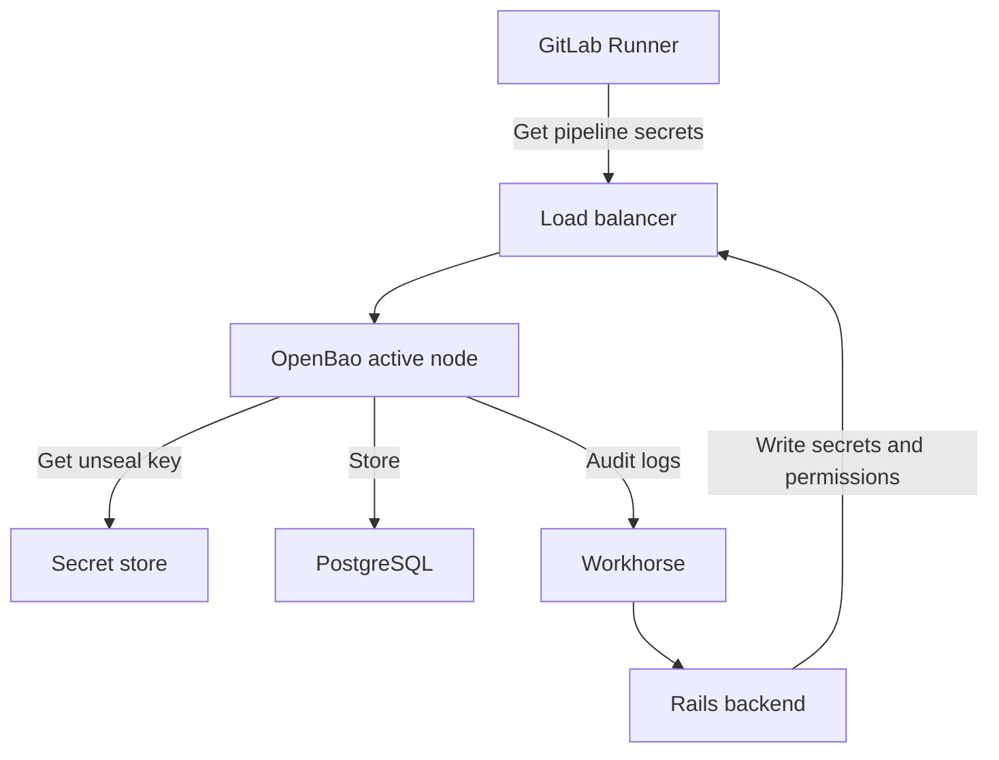



- プラン: Premium、Ultimate
- 提供形態: GitLab Self-Managed
- ステータス: ベータ版





- GitLab 18.8で[導入](https://gitlab.com/groups/gitlab-org/-/work_items/16319)され、実験として、GitLab 18.8で一部の初期テスター向けにクローズド[ベータ](../../policy/development_stages_support.md#beta)が提供されました。
- GitLab 19.0でクローズドベータ版からパブリックベータ版へ[変更](https://gitlab.com/groups/gitlab-org/-/work_items/21731)されました。



The [GitLabシークレットマネージャー](../../ci/secrets/secrets_manager/_index.md)は、[OpenBao](https://openbao.org/)（オープンソースのシークレット管理ソリューション）を使用します。OpenBaoは、GitLabのインスタンスで使用されるシークレットに対して、安全なストレージ、アクセス制御、およびライフサイクル管理を提供します。

GitLab CI/CDジョブで、GitLabシークレットマネージャーのシークレットを使用する場合は、[GitLab Runner](https://docs.gitlab.com/runner/#gitlab-runner-versions) 19.0以降を使用する必要があります。

## OpenBaoアーキテクチャ {#openbao-architecture}

OpenBaoは、既存のGitLabサービスと並行して動作するオプションコンポーネントとして、GitLabと統合されます。

- RailsバックエンドとRunnerは、ロードバランサーを介してOpenBao APIに接続します。
- OpenBaoはPostgreSQLにデータを保存します。Helmチャートは、OpenBaoが同じPostgreSQLインスタンス上の別個の論理データベースを使用するように設定します。Helmチャートの`global.openbao.psql`を使用して接続を設定します。
- OpenBaoはシークレットストアからアンシールキーを取得します。
- OpenBaoは、HelmチャートによってマウントされたKubernetesシークレットからアンシールキーを読み取ります。
- OpenBaoは、監査ログが有効な場合にRailsバックエンドに監査ログを送信します。



OpenBaoは、すべてのリクエストを処理する単一ノードで実行され、アクティブノードが失敗した場合は、オプションで複数のスタンバイノードが引き継ぎます。

## OpenBaoをインストールする {#install-openbao}

前提条件: 

- 管理者アクセス権。
- GitLab 19.0以降。
- Kubernetesクラスター。
- クラウドネイティブGitLabデプロイの場合、外部（Omnibus以外）のPostgreSQLインスタンス。外部のPostgreSQLインスタンスは、クラウドネイティブデプロイ用のGitLab Helmチャートで必要とされ、OpenBao固有のものではありません。OpenBaoは、そのインスタンス上で個別の論理データベースを使用します。

GitLabデプロイに基づいて、インストール方法を選択してください:

- **Cloud Native GitLab**: GitLabをKubernetesにデプロイする場合にこれを使用します。詳細については、[OpenBao Helmチャートドキュメント](https://docs.gitlab.com/charts/charts/openbao/)を参照してください。
- **Linux package**: GitLabをLinuxパッケージで単一ノードまたは複数のノードにデプロイする場合にこれを使用します。詳細については、[LinuxパッケージインスタンスへのOpenBaoのインストール](linux_package_integration.md)を参照してください。

インストール後、[GitLabシークレットマネージャー](../../ci/secrets/secrets_manager/_index.md)のユーザードキュメントに従ってOpenBaoが機能していることを確認してください。

## サイジングの推奨事項 {#sizing-recommendations}

OpenBaoのリソース要件は、GitLabインスタンスのサイズとシークレットの使用パターンによって異なります。

これらの推奨事項は、検証済みの開始点です。デプロイをモニタリングし、実際の使用パターンに基づいてリソースを調整してください。要件は、シークレットをフェッチするCI/CDジョブの数、およびシークレットマネージャーが有効になっているグループとプロジェクトの数によって異なります。

### ポッドのリソース {#pod-resources}

OpenBaoは、すべてのリクエストを処理する単一ノードで実行されます。追加のレプリカは、高可用性のフェイルオーバーのみを提供します。OpenBaoはPostgreSQLデータベースに接続されている場合、水平リードスケーラビリティ（HRS）をサポートしないため、スタンバイノードはリードトラフィックを処理しません。

| シークレットフェッチ/秒 | CPUリクエスト | メモリリクエスト | レプリカ |
|------------------|-------------|----------------|----------|
| 3まで          | 500m        | 2 GB           | 2        |
| 6まで          | 500m        | 3 GB           | 2        |
| 12まで         | 500m        | 4 GB           | 2        |
| 30まで         | 500m        | 9 GB           | 2        |
| 60まで         | 1,000m      | 16 GB          | 2        |
| 150まで        | 2,000m      | 31 GB          | 2        |

#### シークレットフェッチレートの推定 {#estimate-your-secret-fetch-rate}

適用される行を判断するには、1秒あたりのシークレットフェッチ数を推定します:

```plaintext
fetches/s = Git Pull RPS × adoption rate × 3
```

各項目の説明は以下のとおりです: 

- `Git Pull RPS`は、GitLabインスタンスのピークGitプルスループットです。これは、既存の環境モニタリングから測定できます。[ピークトラフィックメトリクスの抽出](../reference_architectures/sizing.md#extract-peak-traffic-metrics)を参照してください。
- `adoption rate`は、シークレットマネージャーを使用するCI/CDジョブの割合（たとえば、5％の場合は0.05、20％の場合は0.20、50％の場合は0.50）です。
- `3`は、シークレットマネージャーを使用するジョブごとにフェッチされるシークレットの想定平均数です。

Select the row where **Secret fetches/s**が結果を満たすか、わずかに超える行を選択します。たとえば、20%の採用率で20 GitプルRPSを測定したデプロイの場合: `20 × 0.20 × 3 = 12 fetches/s`。Use at least the **Up to 12** row。

デプロイ後、推定値を実際の使用量と比較して検証します。[モニタリングクエリ](#monitor-your-openbao-deployment)を使用してリソース使用量を測定し、しきい値を超えた場合は次の行にスケールすることで、リソースを増やしてください。

### リソースの計算方法 {#how-resources-are-calculated}

**CPU**は、CI/CDジョブがシークレットをフェッチする頻度によって決定されます。シークレット書き込み操作（シークレットの作成または更新）は、パイプラインのボリュームに比べて頻度が低く、CPU負荷にはほとんど影響しません。この表では、各CI/CDジョブがGitクローンから始まるため、Gitクローンレート（Git Pull RPS）をCIジョブレートのプロキシとして使用します。式の詳細については、[シークレットフェッチレートの推定](#estimate-your-secret-fetch-rate)を参照してください。CPU制限をCPUリクエストの2倍に設定します。これにより、起動時とプロビジョニング時の急増に対するバーストヘッドルームが提供され、安定状態でのノードの過剰な予約を防ぎます。

**メモリ**はOpenBaoネームスペースの数によって決定され、これはシークレットマネージャーが有効になっているGitLabグループとプロジェクトの数に対応します。1ネームスペースあたり約5 MB、さらに1 GBの安全マージン（最低2 GB）を割り当てます。メモリ制限をメモリリクエスト（保証されたQoSクラス）と等しく設定します。OpenBaoは、メモリ制限を超えると、正常な低下なしにすぐにクラッシュします。

**Replicas**は、高可用性のフェイルオーバーのみを提供します。すべてのデプロイに2つのレプリカを使用します。OpenBaoはPostgreSQLストレージバックエンドでの水平リードスケーラビリティ（HRS）をサポートしないため、追加のレプリカはスループットのメリットを提供しません。

### データベースリソース {#database-resources}

OpenBaoは、PostgreSQL上の独立した論理データベースにデータを保存します。GitLabデータベースと同じPostgreSQLサーバーに配置できます。[リファレンスアーキテクチャのPostgreSQL推奨事項](../reference_architectures/_index.md)を超える追加のデータベースコンピューティング能力は必要ありません。

#### データベース接続プール {#database-connection-pool}

OpenBao Helmチャートは、これらのPostgreSQL接続プールデフォルト値を設定します:

| 設定                                              | デフォルト値 |
|------------------------------------------------------|---------------|
| `config.storage.postgresql.maxParallel`              | 5             |
| `config.storage.postgresql.maxIdleConnections`       | 2             |

モニタリングでデータベース接続の待機時間が観測されない限り、これらの値を増やさないでください。

#### データベースストレージ {#database-storage}

データベースストレージの要件は、主にシークレットの総数に依存します。そのメタデータと保存されたバージョンを含む各シークレットは、約13 KBのストレージを必要とします。

| 総シークレット数  | 推定ストレージ |
|----------------|-------------------|
| 10,000         | ~130 MB           |
| 50,000         | ~650 MB           |
| 100,000        | ~1.3 GB           |
| 200,000        | ~2.6 GB           |

すべてのリファレンスアーキテクチャの階層で、ストレージの増加は無視できます。5〜10 GBのデータベースストレージを割り当てることで、十分なヘッドルームが確保されます。

## GitLabシークレットマネージャーを有効にする {#enable-gitlab-secrets-manager}



- GitLab 19.0で[導入](https://gitlab.com/gitlab-org/gitlab/-/merge_requests/235502)されました



シークレットマネージャーがインスタンスで有効になっている場合、特定の[グループとプロジェクト](../../ci/secrets/secrets_manager/_index.md#enable-gitlab-secrets-manager)でそれを有効にできます。

前提条件: 

- 管理者アクセス権。
- OpenBaoがインストールされ、設定されている必要があります。

シークレットマネージャーをインスタンスに対して有効にするには:

1. 右上隅で、**管理者**を選択します。
1. 左側のサイドバーで、**設定** > **一般**を選択します。
1. **GitLabシークレットマネージャー**を展開する。
1. **Secrets Manager**切替をオンにします。

## OpenBaoのデプロイをモニタリングする {#monitor-your-openbao-deployment}

次のクエリを使用して、デプロイが適切にサイジングされていることを確認し、スケーリングが必要な時期を検出してください。

### CPU使用率 {#cpu-utilization}

OpenBao CPU使用量を測定するには:

```prometheus
sum(rate(container_cpu_usage_seconds_total{container="openbao-server"}[5m]))
```

結果はCPUコア単位です。サイジング表のCPUリクエスト値と比較するために、1,000を掛けてミリコアに変換します。CPU使用率がCPUリクエストの50％を常に超える場合は、サイジング表の次の行にスケールすることを検討してください。

### メモリ使用率 {#memory-utilization}

OpenBaoメモリ使用量を測定するには:

```prometheus
sum(container_memory_working_set_bytes{container="openbao-server"})
```

結果はバイト単位です。メモリは、グループとプロジェクトがシークレットマネージャーを有効にすると、1ネームスペースあたり約5 MBずつ増加します。再起動後、OpenBaoがデータベースからネームスペースのメタデータを読み込むと、メモリは安定します。

正しいメモリリクエストを計算するには、シークレットマネージャーが有効になっているグループとプロジェクトを数え、5 MBを掛けてから1 GBを追加します。結果が現在のメモリリクエストを超える場合は、ポッドのリソースを更新してください。メモリがアクティブなプロビジョニングなしに持続的な上昇傾向を示す場合、潜在的な問題について調査してください。

### CPUスロットリング {#cpu-throttling}

レイテンシーに影響を与える可能性のあるCPUスロットリングを検出するには:

```prometheus
sum(rate(container_cpu_cfs_throttled_periods_total{container="openbao-server"}[5m]))
/
sum(rate(container_cpu_cfs_periods_total{container="openbao-server"}[5m]))
```

スロットル比率が0.25（25％）を超える場合、現在のワークロードに対してCPU制限が低すぎることを示します。OpenBaoがスロットルされると、CPU時間を待機しているgoroutineがシークレットフェッチレイテンシーの増加を引き起こします。

### ヘルスチェックエンドポイント {#health-check-endpoints}

OpenBaoは、モニタリング用のヘルスチェックエンドポイントを提供します:

- `<your-openbao-url>/v1/sys/health`: OpenBaoのヘルスステータスを返します。
- `<your-openbao-url>/v1/sys/seal-status`: シールステータスを返します。

これらのエンドポイントをモニタリングシステムと統合できます。

## バックアップと復元 {#backup-and-restore}

OpenBaoは、PostgreSQL上の独立した論理データベースにデータを保存します。シークレットが復元されることを確実にするため、このデータベースを通常のGitLabバックアップと共にバックアップしてください。

OpenBao固有の詳細なバックアップおよび復元手順については、[OpenBaoバックアップドキュメント](https://docs.gitlab.com/charts/charts/openbao/#back-up-openbao)を参照してください。

## リカバリーキー管理 {#recovery-key-management}

OpenBaoのリカバリーキーの管理に関する情報（保存、表示、ルートトークン生成への使用を含む）については、[リカバリーキー管理](recovery_key.md)を参照してください。

## 高可用性 {#high-availability}

OpenBaoは単一ノードのアクティブノードアーキテクチャを使用します。1つのノードがすべてのリクエストを処理し、アクティブノードが失敗した場合は、スタンバイノードが自動フェイルオーバーを提供します。

### フェイルオーバー {#failover}

スタンバイノードは起動時にすべてのネームスペースメタデータを読み込むため、アクティブへのプロモーションに追加の初期化は必要ありません。ネームスペースの数はフェイルオーバー時間に影響しません。

本番環境デプロイの場合:

- 冗長性のために少なくとも2つのOpenBaoレプリカを実行します。
- 高可用性のPostgreSQLバックエンドを使用します。
- [モニタリングクエリ](#monitor-your-openbao-deployment)を使用してモニタリングとアラートを実装します。

### アップグレード時のダウンタイム {#upgrade-downtime}

OpenBaoはゼロダウンタイムのアップグレードをサポートしていません。アップグレード中、OpenBaoは起動時に各ネームスペースを順次初期化します。シークレットマネージャーが有効になっているすべてのグループまたはプロジェクトは1つのネームスペースとしてカウントされます。

アップグレードには、1,000ネームスペースあたり約11秒と、ベースラインとして5秒かかります。

OpenBaoがオンデマンドのネームスペース読み込みを実装すると、アップグレードのダウンタイムは大幅に短縮されます。詳細については、[イシュー595721](https://gitlab.com/gitlab-org/gitlab/-/work_items/595721)を参照してください。

## Geoデプロイ {#geo-deployment}

OpenBaoは[Geo](../geo/_index.md)デプロイをサポートしています。OpenBaoはプライマリとセカンダリ両方のGeoサイトにデプロイされますが、プライマリサイトのみがアクティブなOpenBaoノードを実行します。

### GeoにおけるOpenBaoの動作 {#openbao-behavior-in-geo}

プライマリサイトでは、OpenBaoは書き込み可能なPostgreSQLデータベースに接続されたアクティブノードとして実行されます。セカンダリサイトでは、OpenBaoはPostgreSQLリードレプリカに接続されたスタンバイモードで実行されます。

PostgreSQLストリーミングレプリケーションは、すべてのOpenBaoデータ（シークレット、ポリシー、認証設定）をプライマリからセカンダリサイトに自動的に転送します。

両方のGitLabインスタンス（プライマリとセカンダリ）は、プライマリOpenBao URLに接続します。セカンダリOpenBaoデプロイはスタンバイのままとなり、セカンダリPostgreSQLデータベースが[Geo](../geo/disaster_recovery/_index.md#step-4-optional-promote-the-openbao-ha-cluster)フェイルオーバー中に書き込み可能になると、アクティブにプロモートされます。

セカンダリサイトでは、OpenBaoは`failed to acquire lock`および`cannot execute INSERT in a read-only transaction`エラーをログに記録します。これらのエラーは想定される動作です。OpenBaoは読み取り専用データベースでHAリーダーロックを取得できません。

### セカンダリサイトにOpenBaoをインストールする {#install-openbao-on-a-secondary-site}

前提条件: 

- Geoが設定されている必要があります。詳細については、[Geo](../geo/setup/_index.md)の設定を参照してください。
- OpenBaoは、セカンダリにデプロイする前に、プライマリサイトにインストールされ、動作している必要があります。詳細については、[OpenBaoのインストール](#install-openbao)を参照してください。

1. セカンダリOpenBaoは、レプリケートされたデータを復号化するために、プライマリと同じアンシールキーを使用する必要があります。プライマリクラスターからセカンダリクラスターへ`gitlab-openbao-unseal` Kubernetesシークレットをコピーします:

   ```shell
   kubectl --namespace gitlab get secret gitlab-openbao-unseal -o yaml
   ```

   エクスポートされたシークレットをセカンダリクラスターに適用します。詳細については、[シークレットをバックアップする](https://docs.gitlab.com/charts/backup-restore/backup/#back-up-the-secrets)を参照してください。

1. DNSレコードを更新して、フェイルオーバー中にプライマリドメインがセカンダリサイトを指すように計画している場合、事前にOpenBaoを適切に設定することをお勧めします。Helmチャートを設定し、`url`と`jwt_audience`をプライマリOpenBao URLに設定します:

   ```yaml
   global:
     openbao:
       enabled: true
       url: https://openbao.<primary-domain>
       jwt_audience: https://openbao.<primary-domain>
   ```

   チャート設定オプションの詳細については、[Geo](https://docs.gitlab.com/charts/charts/openbao/#geo-configuration)設定を参照してください。

1. セカンダリサイトにGitLab Helmチャートをデプロイします。OpenBaoポッドが起動し、スタンバイモードのままになります。これは想定される動作です。

1. セカンダリクラスターでOpenBaoポッドが実行されていることを確認します:

   ```shell
   kubectl --namespace gitlab get pods -l app=openbao
   ```

   すべてのポッドが`Running`状態である必要があります。セカンダリポッドには`openbao-active: "true"`ラベルがありません。これは想定される動作です。

1. アクティブサービスにセカンダリクラスター上のエンドポイントがないことを確認します:

   ```shell
   kubectl --namespace gitlab get endpoints gitlab-openbao-active
   ```

   セカンダリにエンドポイントがないことは想定される動作です。

1. CIパイプラインを実行してシークレットマネージャーをテストし、セカンダリサイトで[シークレットマネージャー変数](../../ci/secrets/secrets_manager/_index.md)を使用します。

## トラブルシューティング {#troubleshooting}

シークレットマネージャーを使用する際に、次の問題が発生する可能性があります。

### Geoデプロイのトラブルシューティングを行う {#troubleshoot-geo-deployments}

| 症状 | 原因 | 解決策 |
|---------|-------|------------|
| セカンダリOpenBaoログでの`cipher: message authentication failed`または`unknown key ID` | プライマリとセカンダリ間のアンシールキーの不一致 | プライマリクラスターからセカンダリクラスターへ`gitlab-openbao-unseal`をコピーし、OpenBaoポッドを再起動します。 |
| セカンダリOpenBaoログでの`failed to acquire lock` | 読み取り専用データベースでのOpenBaoスタンバイ | 期待される動作。アクションは不要です。 |
| セカンダリOpenBaoログでの`cannot execute INSERT in a read-only transaction` | OpenBaoがリードレプリカでリーダー選出を試行しています | 期待される動作。アクションは不要です。 |
| Geoフェイルオーバー後、JWT認証が失敗します | OpenBaoで`jwt_audience`が`boundAudiences`と一致しません | 両方のサイトで`jwt_audience`をプライマリOpenBao URLに設定します。 |

### 遅いシークレット操作の診断 {#diagnose-slow-secret-operations}

CI/CDジョブがシークレットのフェッチに時間がかかったり、シークレット操作がタイムアウトしたりする場合に、このセクションを使用してください。

#### レイテンシーが上昇していることを確認する {#confirm-latency-is-elevated}

次のクエリを使用して、平均要求レイテンシーをミリ秒単位で測定します。このクエリは、低トラフィックデプロイを含む、あらゆるトラフィックレベルで機能します:

```prometheus
rate(openbao_core_handle_request_sum[5m])
/
rate(openbao_core_handle_request_count[5m])
```

通常の負荷では、すべてのリクエストタイプにおける平均レイテンシーは通常3〜7ミリ秒です。平均レイテンシーが継続的に20ミリ秒を超える場合は、調査してください。

OpenBaoがリクエストをアクティブに処理している場合は、P99レイテンシーに次のクエリを使用します:

```prometheus
openbao_core_handle_request{quantile="0.99"}
```

通常のP99は10ミリ秒未満です。概要ウィンドウに最近の観測値がないため、OpenBaoがアイドル状態のとき、このクエリは`NaN`を返します。その場合はレートベースのクエリを使用してください。

#### 潜在的な問題を特定する {#identify-potential-issues}

| 潜在的な問題             | 確認事項                   | クエリ                                                                       | しきい値           | アクション                                                             |
|-----------------------------|---------------------------------|-----------------------------------------------------------------------------|---------------------|--------------------------------------------------------------------|
| CPU制限が低すぎる           | CFSスロットル比率              | [CPU throttling query](#cpu-throttling)                                     | 25％超               | CPU制限を増やす                                                 |
| 需要がCPU容量を超える | CPU使用率                 | [CPU utilization query](#cpu-utilization)                                   | リクエストの50％超    | [sizing table](#pod-resources)の次の行にスケールする        |
| リクエストの急増               | 処理中のリクエスト              | `openbao_core_in_flight_requests`                                           | 5を超えて持続   | 一時的な。再発を監視する。                                 |
| PostgreSQLのボトルネック       | 平均PostgreSQLリードレイテンシー | `rate(openbao_postgres_get_sum[5m]) / rate(openbao_postgres_get_count[5m])` | > 5ミリ秒              | PostgreSQLのリソースと接続プールを確認する                     |
| メモリの負荷             | メモリ使用率              | [Memory utilization query](#memory-utilization)                             | メモリリクエストに近い | [namespace formula](#memory-utilization)を使用してメモリを増やす |

PostgreSQLのレイテンシーが高い場合は、接続プールが飽和状態にあるかどうかを確認してください。すべての接続がビジー状態の場合、追加のリクエストがキューに入れられ、レイテンシーを引き起こします。接続プール設定については、[Database resources](#database-resources)を参照してください。PostgreSQLモニタリングまたはOpenBaoログで接続数を確認します。
