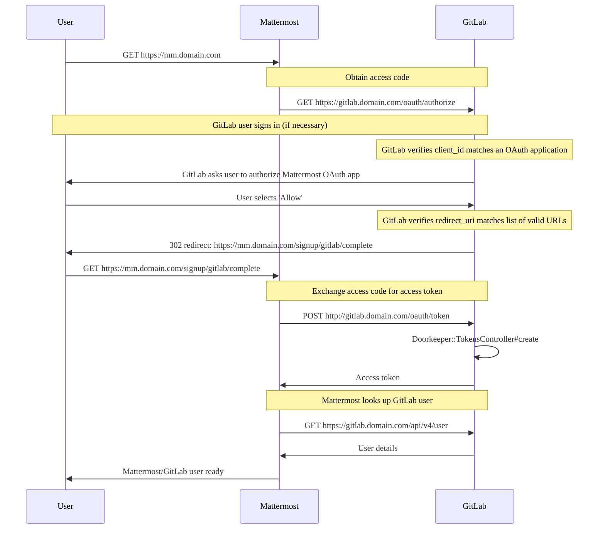



- 提供形態: GitLab Self-Managed



GitLabサーバー上で[GitLab Mattermost](https://gitlab.com/gitlab-org/gitlab-mattermost)サービスを実行できます。Mattermostは、GitLabが提供する単一アプリケーションの一部ではありません。[MattermostとGitLab](https://mattermost.com/solutions/mattermost-gitlab/)の間には優れたインテグレーションがあり、弊社のLinuxパッケージでインストールできます。**ただし、Mattermostは別会社が提供する別のアプリケーションです。**。GitLabサポートは、GitLabとのインテグレーション以外のMattermost固有の質問には対応できません。Mattermost自体に関するヘルプが必要な場合は、[コミュニティサポートリソース](#community-support-resources)を参照してください。

## 前提条件 {#prerequisites}

GitLab Mattermostの各リリースは、Linux用のAMD 64チップセットでコンパイルされ、手動でテストされています。ARMチップセットおよびRaspberry Piのようなオペレーティングシステムはサポートされていません。

## はじめに {#getting-started}

GitLab Mattermostは独自の仮想ホストで実行されることを想定しています。あなたのDNSの設定で、同じマシンを指す2つのエントリーが必要です。例えば、`gitlab.example.com`と`mattermost.example.com`。

GitLab Mattermostはデフォルトで無効になっています。有効にするには、次の手順に従います。

1. `/etc/gitlab/gitlab.rb`を編集し、Mattermostの外部URLを追加します:

   ```ruby
   mattermost_external_url 'https://mattermost.example.com'
   ```

1. GitLabを再設定します:

   ```shell
   sudo gitlab-ctl reconfigure
   ```

1. GitLab Mattermostが`https://mattermost.example.com`で到達可能であり、GitLabへの接続が認可されていることを確認します。MattermostをGitLabで認可すると、ユーザーはGitLabをSSOプロバイダーとして使用できます。

アプリケーションが同じサーバーで実行されている場合、LinuxパッケージはGitLab MattermostをGitLabで自動的に認可しようとします。

自動認可には、GitLabデータベースへのアクセスが必要です。GitLabデータベースが利用できない場合、[MattermostをGitLabで認可する](#authorize-gitlab-mattermost)セクションに記載されているプロセスを使用して、GitLab Mattermostへのアクセスを手動で認可する必要があります。

## Mattermostの設定 {#configuring-mattermost}

MattermostはMattermostシステムコンソールを使用して設定できます。Mattermostの設定の広範なリストと、それらをどこで設定できるかについては、[Mattermostのドキュメント](https://docs.mattermost.com/administration/config-settings.html)で入手できます。

システムコンソールの使用が推奨されますが、以下のいずれかのオプションを使用してMattermostを設定することもできます:

1. Mattermostの設定を`/var/opt/gitlab/mattermost/config.json`を通して直接編集します。
1. Mattermostを実行するために使用される環境変数を、`gitlab.rb`内の`mattermost['env']`設定を変更して指定します。このように設定された設定は、システムコンソールから無効になり、Mattermostを再起動せずに変更することはできません。

## HTTPSでGitLab Mattermostを実行する {#running-gitlab-mattermost-with-https}

SSL証明書とSSL証明書キーを`/etc/gitlab/ssl`内に配置します。そのディレクトリが存在しない場合は、作成してください:

```shell
sudo mkdir -p /etc/gitlab/ssl
sudo chmod 755 /etc/gitlab/ssl
sudo cp mattermost.gitlab.example.key mattermost.gitlab.example.crt /etc/gitlab/ssl/
```

`/etc/gitlab/gitlab.rb`で、次のように設定します。

```ruby
mattermost_external_url 'https://mattermost.gitlab.example'
mattermost_nginx['redirect_http_to_https'] = true
```

証明書とキーに`mattermost.gitlab.example.crt`と`mattermost.gitlab.example.key`という名前を付けていない場合は、以下の完全なパスも追加する必要があります:

```ruby
mattermost_nginx['ssl_certificate'] = "/etc/gitlab/ssl/mattermost-nginx.crt"
mattermost_nginx['ssl_certificate_key'] = "/etc/gitlab/ssl/mattermost-nginx.key"
```

ここで`mattermost-nginx.crt`はSSL証明書、`mattermost-nginx.key`はSSLキーです。

設定が完了したら、`sudo gitlab-ctl reconfigure`を実行して変更を適用します。

## 外部PostgreSQLサービスでGitLab Mattermostを実行する {#running-gitlab-mattermost-with-an-external-postgresql-service}

デフォルトでは、MattermostはLinuxパッケージにバンドルされているPostgreSQLサービスを使用します。外部PostgreSQLサービスでMattermostを使用する場合は、独自の特定の設定が必要です。既存の[GitLabが使用する外部PostgreSQL接続設定](../../administration/postgresql/external.md)は、Mattermostに自動的に継承されません。

1. `/etc/gitlab/gitlab.rb`を編集し、以下の設定を指定します:

   ```ruby
   mattermost['sql_driver_name'] = 'postgres'
   mattermost['sql_data_source'] = "user=gitlab_mattermost host=<hostname-of-postgresql-service> port=5432 sslmode=required dbname=<mattermost_production> password=<user-password>"
   ```

1. `user`の値と、`mattermost['sql_data_source']`で定義した`password`の値に一致するPostgreSQLユーザーを作成します。
1. 使用された`dbname`の値に一致するPostgreSQLデータベースを作成します。
1. `user`が、`dbname`で作成されたデータベースに対する権限を持っていることを確認します。
1. GitLabを再設定し、Mattermostを再起動して変更を適用します:

   ```shell
   sudo gitlab-ctl reconfigure && sudo gitlab-ctl restart mattermost
   ```

## 独自のサーバーでGitLab Mattermostを実行する {#running-gitlab-mattermost-on-its-own-server}

GitLabとGitLab Mattermostを2つの異なるサーバーで実行している場合でも、GitLabサービスはGitLab Mattermostサーバー上にセットアップされます。ただし、GitLabサービスはユーザーリクエストを受け入れたり、システムリソースを消費したりすることはありません。GitLab Mattermostサーバーで以下の設定と設定の詳細を使用することで、LinuxパッケージにバンドルされているGitLabサービスを効果的に無効にできます。

```ruby
mattermost_external_url 'http://mattermost.example.com'

# Shut down GitLab services on the Mattermost server
alertmanager['enable'] = false
gitlab_exporter['enable'] = false
gitlab_kas['enable'] = false
gitlab_rails['enable'] = false
grafana['enable'] = false
letsencrypt['enable'] = false
node_exporter['enable'] = false
postgres_exporter['enable'] = false
prometheus['enable'] = false
redis_exporter['enable'] = false
redis['enable'] = false
```

次に、[GitLab Mattermostを認可する](#authorize-gitlab-mattermost)セクションの適切な手順に従います。最後に、GitLabとのインテグレーションを有効にするには、GitLabサーバーで以下を追加します:

```ruby
gitlab_rails['mattermost_host'] = "https://mattermost.example.com"
```

デフォルトでは、GitLab MattermostはすべてのユーザーにGitLabでのサインアップを要求し、メールによるアカウント作成オプションを無効にします。Mattermostの[GitLab SSOに関するドキュメント](https://docs.mattermost.com/deployment/sso-gitlab.html)を参照してください。

## 手動でGitLab MattermostをGitLabで再認可する {#manually-reauthorizing-gitlab-mattermost-with-gitlab}

### GitLab Mattermostを再認可する {#reauthorize-gitlab-mattermost}

GitLab Mattermostを再認可するには、まず既存の認可を失効する必要があります。これは、GitLabの**設定** > **アプリケーション**エリアで行うことができます。次に、以下のセクションの手順に従って認可を完了します。

### GitLab Mattermostを認可する {#authorize-gitlab-mattermost}

GitLabで**設定** > **アプリケーション**エリアに移動します。新しいアプリケーションを作成し、**Redirect URI**には以下を使用します（HTTPSを使用する場合は`http`を`https`に置き換えます）:

```plaintext
http://mattermost.example.com/signup/gitlab/complete
http://mattermost.example.com/login/gitlab/complete
```

**信用済み**と**非公開**の設定を選択していることを確認してください。**スコープ**で`read_user`を選択します。次に、**アプリケーションを保存**を選択します。

アプリケーションが作成されると、`Application ID`と`Secret`が提供されます。その他に必要な情報は、GitLabインスタンスのURLです。GitLab Mattermostを実行しているサーバーに戻り、以前に受け取った値を使用して、`/etc/gitlab/gitlab.rb`設定ファイルを次のように編集します:

```ruby
mattermost['gitlab_enable'] = true
mattermost['gitlab_id'] = "12345656"
mattermost['gitlab_secret'] = "123456789"
mattermost['gitlab_scope'] = "read_user"
mattermost['gitlab_auth_endpoint'] = "http://gitlab.example.com/oauth/authorize"
mattermost['gitlab_token_endpoint'] = "http://gitlab.example.com/oauth/token"
mattermost['gitlab_user_api_endpoint'] = "http://gitlab.example.com/api/v4/user"
```

変更を保存し、`sudo gitlab-ctl reconfigure`を実行します。エラーがなければ、GitLabとGitLab Mattermostは正しく設定されているはずです。

## ユーザーおよびグループの数値識別子を指定する {#specify-numeric-user-and-group-identifiers}

Linuxパッケージはユーザーとグループ`mattermost`を作成します。これらのユーザーの数値識別子は、`/etc/gitlab/gitlab.rb`で次のように指定できます:

```ruby
mattermost['uid'] = 1234
mattermost['gid'] = 1234
```

変更を適用するには`sudo gitlab-ctl reconfigure`を実行します。

## カスタム環境変数を設定する {#setting-custom-environment-variables}

必要に応じて、`/etc/gitlab/gitlab.rb`を介してMattermostで使用されるカスタム環境変数を設定できます。これは、Mattermostサーバーが企業インターネットプロキシの背後で運用されている場合に役立ちます。`/etc/gitlab/gitlab.rb`で、`mattermost['env']`にハッシュ値を指定します。例: 

```ruby
mattermost['env'] = {"HTTP_PROXY" => "my_proxy", "HTTPS_PROXY" => "my_proxy", "NO_PROXY" => "my_no_proxy"}
```

変更を適用するには`sudo gitlab-ctl reconfigure`を実行します。

## PostgreSQLのバンドルされたデータベースに接続する {#connecting-to-the-bundled-postgresql-database}

バンドルされたPostgreSQLデータベースに接続する必要があり、デフォルトのLinuxパッケージデータベース設定を使用している場合は、PostgreSQLスーパーユーザーとして接続できます:

```shell
sudo gitlab-psql -d mattermost_production
```

## GitLab Mattermostをバックアップする {#back-up-gitlab-mattermost}

GitLab Mattermostは、通常の[Linuxパッケージバックアップ](../../administration/backup_restore/_index.md) Rakeタスクには含まれません。

一般的なMattermostの[バックアップと災害リカバリー](https://docs.mattermost.com/deploy/backup-disaster-recovery.html)に関するドキュメントは、バックアップが必要なもののガイドとして使用できます。

### バンドルされたPostgreSQLデータベースをバックアップする {#back-up-the-bundled-postgresql-database}

バンドルされたPostgreSQLデータベースをバックアップする必要があり、デフォルトのLinuxパッケージデータベース設定を使用している場合は、このコマンドを使用してバックアップできます:

```shell
sudo -i -u gitlab-psql -- /opt/gitlab/embedded/bin/pg_dump -h /var/opt/gitlab/postgresql mattermost_production | gzip > mattermost_dbdump_$(date --rfc-3339=date).sql.gz
```

### `data`ディレクトリと`config.json`をバックアップする {#back-up-the-data-directory-and-configjson}

Mattermostには`data`ディレクトリと`config.json`ファイルがあり、これらもバックアップする必要があります:

```shell
sudo tar -zcvf mattermost_data_$(date --rfc-3339=date).gz -C /var/opt/gitlab/mattermost data config.json
```

## GitLab Mattermostを復元する {#restore-gitlab-mattermost}

以前に[GitLab Mattermostのバックアップを作成](#back-up-gitlab-mattermost)した場合は、以下のコマンドを実行して復元することができます:

```shell
# Stop Mattermost so we don't have any open database connections
sudo gitlab-ctl stop mattermost

# Drop the Mattermost database
sudo -u gitlab-psql /opt/gitlab/embedded/bin/dropdb -U gitlab-psql -h /var/opt/gitlab/postgresql -p 5432 mattermost_production

# Create the Mattermost database
sudo -u gitlab-psql /opt/gitlab/embedded/bin/createdb -U gitlab-psql -h /var/opt/gitlab/postgresql -p 5432 mattermost_production

# Perform the database restore
# Replace /tmp/mattermost_dbdump_2021-08-05.sql.gz with your backup
sudo -u mattermost sh -c "zcat /tmp/mattermost_dbdump_2021-08-05.sql.gz | /opt/gitlab/embedded/bin/psql -U gitlab_mattermost -h /var/opt/gitlab/postgresql -p 5432 mattermost_production"

# Restore the data directory and config.json
# Replace /tmp/mattermost_data_2021-08-09.gz with your backup
sudo tar -xzvf /tmp/mattermost_data_2021-08-09.gz -C /var/opt/gitlab/mattermost

# Fix permissions if required
sudo chown -R mattermost:mattermost /var/opt/gitlab/mattermost/data
sudo chown mattermost:mattermost /var/opt/gitlab/mattermost/config.json

# Start Mattermost
sudo gitlab-ctl start mattermost
```

## Mattermostコマンドラインツール（CLI） {#mattermost-command-line-tool-cli}

[`mmctl`](https://docs.mattermost.com/manage/mmctl-command-line-tool.html)は、Mattermostサーバー用のCLIツールで、ローカルにインストールされ、Mattermost APIを使用しますが、リモートでも使用できます。ローカル接続用にMattermostを設定するか、ローカルログイン認証情報を使用して管理者として認証する必要があります（GitLab SSOを介さない）。実行可能ファイルは`/opt/gitlab/embedded/bin/mmctl`にあります。

### ローカル接続を介して`mmctl`を使用する {#use-mmctl-through-a-local-connection}

ローカル接続の場合、`mmctl`バイナリとMattermostは同じサーバーから実行する必要があります。ローカルソケットを有効にするには:

1. `/var/opt/gitlab/mattermost/config.json`を編集し、以下の行を追加します:

   ```json
   {
       "ServiceSettings": {
          ...
           "EnableLocalMode": true,
           "LocalModeSocketLocation": "/var/tmp/mattermost_local.socket",
           ...
       }
   }
   ```

1. Mattermostを再起動します:

   ```shell
   sudo gitlab-ctl restart mattermost
   ```

その後、`sudo /opt/gitlab/embedded/bin/mmctl --local`を使用してMattermostインスタンスで`mmctl`コマンドを実行できます。

例えば、ユーザーのリストを表示するには:

```shell
$ sudo /opt/gitlab/embedded/bin/mmctl --local user list

13dzo5bmg7fu8rdox347hbfxde: appsbot (appsbot@localhost)
tbnkwjdug3dejcoddboo4yuomr: boards (boards@localhost)
wd3g5zpepjgbfjgpdjaas7yj6a: feedbackbot (feedbackbot@localhost)
8d3zzgpurp85zgf1q88pef73eo: playbooks (playbooks@localhost)
There are 4 users on local instance
```

### リモート接続を介して`mmctl`を使用する {#use-mmctl-through-a-remote-connection}

リモート接続またはソケットが使用できないローカル接続の場合は、SSO以外のユーザーを作成し、そのユーザーに管理者権限を付与します。これらの認証情報は、`mmctl`を認証するために使用できます:

```shell
$ /opt/gitlab/embedded/bin/mmctl auth login http://mattermost.example.com

Connection name: test
Username: local-user
Password:
 credentials for "test": "local-user@http://mattermost.example.com" stored
```

## GitLabとMattermostのインテグレーションを設定する {#configuring-gitlab-and-mattermost-integrations}

プラグインを使用して、Mattermostでイシュー、マージリクエスト、プルリクエストに関する通知、およびマージリクエストのレビュー、未読メッセージ、タスクの割り当てに関する個人の通知を受信するように登録できます。イシューの作成や表示、またはデプロイをトリガーするなどのアクションを実行するためにスラッシュコマンドを使用したい場合は、GitLab [Mattermostスラッシュコマンド](../../user/project/integrations/mattermost_slash_commands.md)を使用してください。

このプラグインとスラッシュコマンドは、組み合わせて使用することも、個別に使用することもできます。

## メール通知 {#email-notifications}

### GitLab Mattermost用のSMTPを設定する {#setting-up-smtp-for-gitlab-mattermost}

これらの設定は、システム管理者によってMattermostシステムコンソールを通じて設定されます。**System Console**の**環境** > **SMTP**タブで、SMTPプロバイダーから提供されたSMTP認証情報、または`127.0.0.1`とポート`25`を入力して`sendmail`を使用できます。必要な特定の設定に関する詳細は、[Mattermostのドキュメント](https://docs.mattermost.com/install/smtp-email-setup.html)で確認できます。

これらの設定は`/var/opt/gitlab/mattermost/config.json`でも設定できます。

### メールバッチ処理 {#email-batching}

この機能を有効にすると、ユーザーはメール通知を受信する頻度を制御できます。

Mattermost **System Console**で、**環境** > **SMTP**タブに移動し、**Enable Email Batching**設定を**true**に設定することで、メールバッチ処理を有効にできます。

この設定は`/var/opt/gitlab/mattermost/config.json`でも設定できます。

## GitLab Mattermostのアップグレード {#upgrading-gitlab-mattermost}

> [!note]
> Mattermostのバージョンをアップグレードする際には、Mattermostの[重要なアップグレードノート](https://docs.mattermost.com/administration/important-upgrade-notes.html)を確認して、実行する必要がある変更や移行に対処することが不可欠です。

GitLab Mattermostは、通常のLinuxパッケージの更新プロセスを通じてアップグレードできます。以前のGitLabバージョンをアップグレードする場合、Mattermostの設定がGitLabの外部で変更されていない場合にのみ、更新プロセスを使用できます。つまり、Mattermost `config.json`ファイルへの変更が、直接または変更を`config.json`に保存するMattermost **System Console**を介して行われていないことを意味します。

`gitlab.rb`を使用してMattermostを設定した場合のみ、Linuxパッケージを使用してGitLabをアップグレードし、その後`gitlab-ctl reconfigure`を実行してGitLab Mattermostを最新バージョンにアップグレードできます。

そうでない場合は、2つのオプションがあります:

1. `config.json`に対して行われた変更で[`gitlab.rb`](https://gitlab.com/gitlab-org/omnibus-gitlab/-/blob/b350e3cd5b06a94adb463ece4d41b9f3df6ab282/files/gitlab-config-template/gitlab.rb.template#L549)を更新します。`config.json`のすべての設定が`gitlab.rb`で利用できるわけではないため、いくつかのパラメータを追加する必要があるかもしれません。完了すると、LinuxパッケージはGitLab Mattermostをあるバージョンから次のバージョンにアップグレードできるようになります。
1. Linuxパッケージによって制御されるディレクトリの外部にMattermostを移行することで、独立して管理およびアップグレードできるようにします。[Mattermost移行ガイド](https://docs.mattermost.com/administration/migrating.html)に従って、Mattermostの設定とデータをLinuxパッケージから独立した別のディレクトリまたはサーバーに移動してください。

アップグレードに関する通知と古いバージョンに関する特別な考慮事項の完全なリストについては、[Mattermostのドキュメント](https://docs.mattermost.com/administration/important-upgrade-notes.html)を参照してください。

### Linuxパッケージに同梱されているGitLab Mattermostのバージョンとエディション（非推奨） {#gitlab-mattermost-versions-and-edition-shipped-with-the-linux-package-deprecated}

> [!warning]
> LinuxパッケージへのMattermostのバンドルは、GitLab 18.9で[非推奨](../../update/deprecations.md#mattermost-bundled-with-linux-package)となり、19.0で削除される予定です。GitLab 19.0にアップグレードする前に、[Mattermostスタンドアロンへの移行](https://docs.mattermost.com/administration-guide/onboard/migrate-gitlab-omnibus.html)を参照してください。

以下の表は、GitLab 15.0以降のMattermostバージョンの変更点を示しています:

| 最初のGitLabバージョン | Mattermostバージョン |
|:---------------|:-------------------|
| 18.6           | 10.11              |
| 18.3           | 10.10              |
| 18.2           | 10.9               |
| 18.1           | 10.8               |
| 18.0           | 10.7               |
| 17.11          | 10.6               |
| 17.9           | 10.4               |
| 17.7           | 10.2               |
| 17.6           | 10.1               |
| 17.5           | 10.0               |
| 17.4           | 9.11               |
| 17.3           | 9.10               |
| 17.2           | 9.9                |
| 17.1           | 9.8                |
| 17.0           | 9.7                |
| 16.11          | 9.6                |
| 16.10          | 9.5                |
| 16.9           | 9.4                |
| 16.7           | 9.3                |
| 16.6           | 9.1                |
| 16.5           | 9.0                |
| 16.4           | 8.1                |
| 16.3           | 8.0                |
| 16.0           | 7.10               |
| 15.11          | 7.9                |
| 15.10          | 7.8                |
| 15.9           | 7.7                |
| 15.7           | 7.5                |
| 15.6           | 7.4                |
| 15.5           | 7.3                |
| 15.4           | 7.2                |
| 15.3           | 7.1                |
| 15.2           | 7.0                |
| 15.1           | 6.7                |
| 15.0           | 6.6                |

> [!note]
> Mattermostのアップグレードノートは、PostgreSQLデータベースとMySQLデータベースを比較した場合の異なる影響に言及しています。Linuxパッケージに同梱されているGitLab MattermostはPostgreSQLデータベースを使用します。

Linuxパッケージには[Mattermost Team Edition](https://docs.mattermost.com/about/editions-and-offerings.html#mattermost-team-edition)がバンドルされており、これはFreeのオープンソースエディションであり、商用機能は含まれていません。[Mattermost Enterprise Edition](https://docs.mattermost.com/about/editions-and-offerings.html#mattermost-enterprise-edition)にアップグレードするには、Mattermostの[アップグレードに関するドキュメント](https://docs.mattermost.com/install/enterprise-install-upgrade.html#upgrading-to-enterprise-edition-in-gitlab-omnibus)を参照してください。

## OAuth 2.0シーケンス図 {#oauth-20-sequence-diagram}

以下の画像は、GitLabがMattermostのOAuth 2.0プロバイダーとして機能する方法を示すシーケンス図です。これをインテグレーションの動作に関するエラーのトラブルシューティングを行うために使用できます:



## コミュニティサポートリソース {#community-support-resources}

あなたのGitLab Mattermostデプロイに関するヘルプとサポートについては、以下を参照してください:

- [Mattermostイシューのトラブルシューティング](https://docs.mattermost.com/install/troubleshooting.html)。
- [Mattermostフォーラム](https://forum.mattermost.com/search?q=gitlab)。
