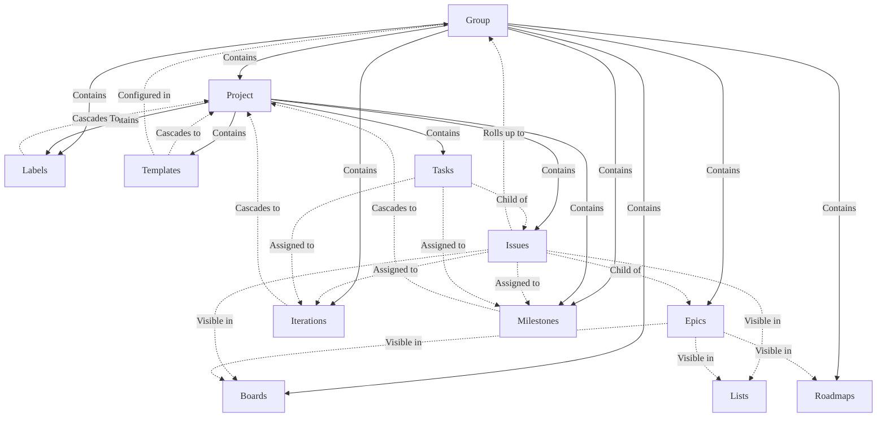
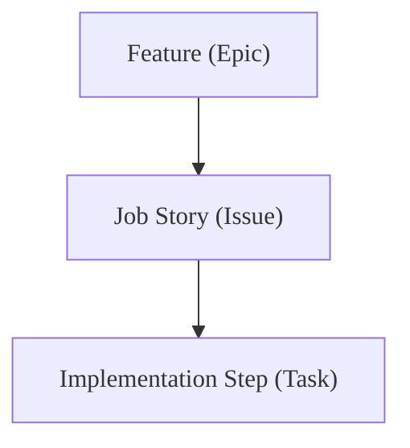
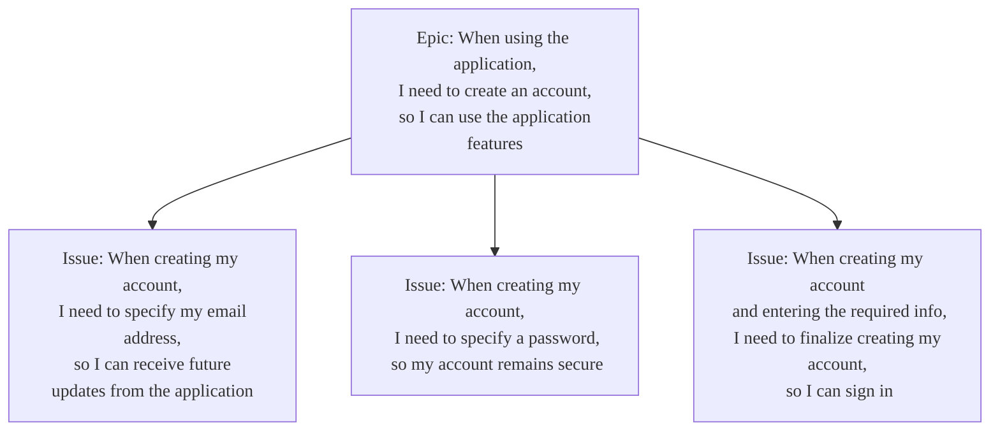
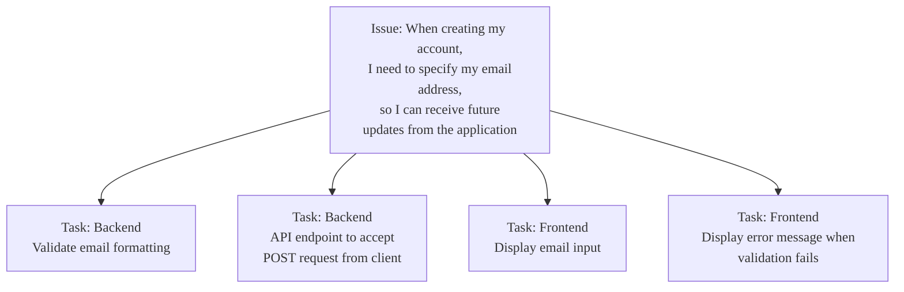



- プラン: Premium、Ultimate
- 提供形態: GitLab.com、GitLab Self-Managed、GitLab Dedicated



<!-- vale gitlab_base.FutureTense = NO -->

このチュートリアルでは、アジャイルプランニングとGitLabの追跡機能を使用して、主要なScrumセレモニーとワークフローを容易にするための段階的なガイダンスを提供します。グループ、プロジェクト、ボード、その他の機能を意図的に設定することで、チームは強化された透明性、コラボレーション、およびデリバリーケイデンスを実現できます。

Martin Fowlerの[Agile Fluency Model](https://martinfowler.com/articles/agileFluency.html)によると、[Scrum](https://scrumguides.org/scrum-guide.html)を実践するチームは次のとおりです:

> ...スポンサー、顧客、およびユーザーがソフトウェアから得られるメリットを考慮して、考え、計画します。

彼らは、進捗状況を毎月実証し、プロセスと作業習慣の改善を定期的に検討することで、より多くのビジネスおよび顧客価値を提供することにより、これを達成します。

このチュートリアルでは、次のトピックについて説明します:

- [グループとプロジェクトのセットアップ](#setting-up-your-groups-and-projects)
- [機能バックログの管理](#managing-your-feature-backlog)
- [ストーリーバックログの管理](#managing-your-story-backlog)
- [スプリントの進捗を追跡する](#tracking-sprint-progress)

## グループとプロジェクトのセットアップ {#setting-up-your-groups-and-projects}

GitLabでScrumの実践を容易にするには、まずグループとプロジェクトの基本的な構造をセットアップする必要があります。グループを使用して、そのグループの下にネストされたプロジェクトに継承できるボードとラベルを作成します。プロジェクトには、各スプリントの実際の作業アイテムを構成するイシューとタスクが含まれます。

### GitLabにおける継承モデルの理解 {#understanding-the-inheritance-model-in-gitlab}

GitLabには、グループがプロジェクトを含む階層構造があります。グループレベルで適用された設定と構成は、子プロジェクトにカスケードダウンされるため、複数のプロジェクト間でラベル、ボード、およびイテレーションを標準化することができます:



- グループには、1つ以上のプロジェクト、エピック、ボード、ラベル、およびイテレーションが含まれます。グループのユーザーメンバーシップは、グループのプロジェクトにカスケードダウンされます。
- グループまたはプロジェクトでボードとラベルを作成できます。このチュートリアルでは、単一グループ内の多くのプロジェクトで標準化された計画ワークフローとレポートを容易にするために、グループ内にこれらを作成する必要があります。
- プロジェクトにカスケードダウンする任意のオブジェクトは、そのプロジェクトのイシューに関連付けることができます。たとえば、グループからラベルをイシューに適用できます。

### グループの作成 {#create-your-group}

Scrumアクティビティ専用のグループを作成します。これは、プロジェクト間で標準化する必要があるボードやラベルなどのプロジェクトや設定の親コンテナになります。

このグループは、典型的なScrumケイデンス中のさまざまなアクティビティの主要な場所になります。これには、ボード、フィーチャー（エピック）、ストーリー（イシュー）のロールアップ、およびラベルが含まれます。

グループを作成するには:

1. 右上隅で、**新規作成** () と**新しいグループ**を選択します。
1. **グループを作成**を選択します。
1. **グループ名**テキストボックスに、グループの名前を入力します。グループ名として使用できない単語のリストについては、[予約済みの名前](../../user/reserved_names.md)を参照してください。
1. **グループURL**テキストボックスに、[ネームスペース](../../user/namespace/_index.md)に使用するグループのパスを入力します。
1. グループの[**表示レベル**](../../user/public_access.md)を選択します。
1. オプション。GitLabエクスペリエンスをパーソナライズするには:
   - **ロール**ドロップダウンリストから、あなたのロールを選択します。
   - **だれがこのグループを使用しますか？** で、オプションを選択します。
   - **このグループを何に使う予定ですか？** ドロップダウンリストから、オプションを選択します。
1. オプション。グループにメンバーを招待するには、**メール1**テキストボックスに、招待するユーザーのメールアドレスを入力します。他のユーザーを招待するには、**他のメンバーを招待**を選択し、ユーザーのメールアドレスを入力します。
1. **グループを作成**を選択します。

### プロジェクトの作成 {#create-your-projects}

作成したグループ内に、1つ以上のプロジェクトを作成します。あなたのプロジェクトには、親グループにロールアップするストーリーが含まれます。

空のプロジェクトを作成するには: 

1. 右上隅で、**新規作成**（）と**新規プロジェクト/リポジトリ**を選択します。
1. **空のプロジェクトの作成**を選択します。
1. プロジェクトの詳細を入力します。
   - **プロジェクト名**フィールドに、プロジェクトの名前を入力します。[プロジェクト名の制限](../../user/reserved_names.md)を参照してください。
   - **プロジェクトslug**フィールドに、プロジェクトへのパスを入力します。GitLabインスタンスは、このslugをプロジェクトへのURLパスとして使用します。slugを変更するには、最初にプロジェクト名を入力し、次にslugを変更します。
   - ユーザーのプロジェクトの[表示およびアクセス権限](../../user/public_access.md)を変更するには、**表示レベル**を変更します。
   - Gitリポジトリが初期化され、デフォルトのブランチを持ち、クローンできるようにReadmeファイルを作成するには、**リポジトリを初期化しREADMEファイルを生成する**を選択します。
1. **プロジェクトを作成**を選択します。

### 異なるScrumライフサイクルフェーズをサポートするスコープ付きラベルを作成する {#create-scoped-labels-to-support-different-phases-of-the-scrum-lifecycle}

次に、作成したグループで、イシューを分類するためのラベルを作成します。

これに最適なツールは[スコープ付きラベル](../../user/project/labels.md#scoped-labels)で、これを使用して相互に排他的な属性を設定できます。

スコープ付きラベルの名前にあるダブルコロン (`::`) は、同じスコープの2つのラベルが同時に使用されるのを防ぎます。たとえば、`status::in progress`ラベルを既に`status::ready`があるイシューに追加すると、以前のラベルが削除されます。

各ラベルを作成するには:

1. 上部のバーで、**検索または移動先**を選択して、グループを見つけます。
1. 左サイドバーで、**管理** > **ラベル**を選択します。
1. **新しいラベル**を選択します。
1. **タイトル**フィールドに、ラベルの名前を入力します。`priority::now`で始まる。
1. オプション。使用可能な色から選択するか、**背景色**フィールドに特定の色を表す16進数のカラー値を入力して、色を選択します。
1. **ラベル**を作成を選択します。

必要なすべてのラベルを作成するために、これらの手順を繰り返します:

- **優先順位**: これらは、フィーチャーレベルのリリース優先順位を容易にするために、エピックボードで使用されます。
  - `priority::now`
  - `priority::next`
  - `priority::later`
- **ステータス**: これらのラベルは、イシューボード上で、ストーリーが全体的な開発ライフサイクルのどの段階にあるかを理解するために使用します。
  - `status::triage`
  - `status::refine`
  - `status::ready`
  - `status::in progress`
  - `status::in review`
  - `status::acceptance`
  - `status::done`
- **タイプ**: これらのラベルを使用して、単一のイテレーションに通常取り込まれるさまざまな種類の作業を表します:
  - `type::story`
  - `type::bug`
  - `type::maintenance`

### イテレーションケイデンスを作成する {#create-an-iteration-cadence}

GitLabでは、スプリントはイテレーションと呼ばれます。イテレーションケイデンスには、イシューの計画とレポート作成のための個別の連続したイテレーションタイムボックスが含まれます。ラベルと同様に、イテレーションはグループ、サブグループ、およびプロジェクトの階層にカスケードダウンされます。そのため、作成したグループにイテレーションケイデンスを作成します。

前提条件: 

- グループに対してレポーター、デベロッパー、メンテナー、またはオーナーのロールを持っている必要があります。

イテレーションケイデンスを作成するには:

1. 上部のバーで、**検索または移動先**を選択して、グループを見つけます。
1. 左サイドバーで、**Plan** > **イテレーション**を選択します。
1. **新しいイテレーションケイデンス**を選択します。
1. イテレーションケイデンスのタイトルと説明を入力します。
1. **自動スケジュールを有効にする**チェックボックスが選択されていることを確認します。
1. 自動スケジュールを使用するには、必須フィールドに入力します。
   - イテレーションケイデンスの自動開始日を選択します。イテレーションは、開始日の曜日と同じ曜日に開始するようにスケジュールされます。
   - **期間**ドロップダウンリストから、**2**を選択します。
   - **今後のイテレーション**ドロップダウンリストから、**4**を選択します。
   - **ロールオーバーを有効にする**チェックボックスを選択します。
1. **ケイデンスを作成**を選択します。ケイデンスリストのページが開きます。

このようにイテレーションケイデンスを設定すると、次のようになります:

- 各スプリントは2週間の長さです。
- GitLabは将来的に4つのスプリントを自動的に作成します。
- 1つのスプリントの未完了のイシューは、現在のスプリントがクローズされると、自動的に次のスプリントに再割り当てられます。

**自動スケジュール**を無効にし、[イテレーションを手動で作成および管理する](../../user/group/iterations/_index.md#create-an-iteration-manually) in yourケイデンス.

## 機能バックログの管理 {#managing-your-feature-backlog}

フィーチャーバックログは、エピックの形式でアイデアと目的の機能をキャプチャします。このバックログを改良するにつれて、エピックは今後のスプリントへのフローのために優先順位付けされます。このセクションでは、バックログ管理を容易にするエピックボードの作成と、最初のフィーチャーエピックの作成について説明します。

### 作業の構造を決定する {#decide-on-a-way-to-structure-your-work}

GitLabは、さまざまな種類のバックログ管理をサポートするように拡張可能です。このチュートリアルでは、成果物を次のように構造化します:



- エピックは、チームが単一のイテレーションで提供できる機能を表現します。
- 各エピックには多くの[Job Story](https://medium.com/@umang.soni/moving-from-user-role-based-approach-to-problem-statement-based-approach-for-product-development-18b2d2395e5)が含まれます。
  - ストーリーは、具体的な顧客価値を提供し、明確な受け入れ基準を含み、個人が1〜2日で完了できるほど小さいものであるべきです。
  - チームとして1スプリントあたり4〜10個のストーリーを完了できる必要があります。
- 機能を分割する戦略は多数ありますが、優れた戦略の1つは、ユーザーが目標を達成するために必要な個別の独立したストーリーに、[垂直に分割する](https://www.agilerant.info/vertical-slicing-to-boost-software-value/)ことです。

  顧客に単一のストーリーを出荷できない場合でも、チームは本番環境またはステージング環境で機能フラグを使用することで、各ストーリーをテストし、操作できるはずです。これは、ストーリーの進捗状況に対するステークホルダーへの可視性を提供するだけでなく、より複雑な機能をアプローチしやすい開発目標に分解するためのメカニズムでもあります。
- ストーリーの複雑さによっては、ストーリーを完了するために開発者が実行する必要がある個別の実装ステップにタスクを使用してストーリーを分割できます。

時間軸の観点から、作業アイテムのサイズ設定とスコープ設定には以下のガイドラインを目標とします:

- 一つの**feature**は単一のイテレーションで完了できます。
- 一つの**story**は数日で完了できます。
- 一つの**タスク**は数時間から1日で完了できます。

#### 例: 機能の垂直分割 {#example-vertically-slicing-a-feature}

エンドユーザーのジャーニーに基づいて、機能を垂直にスライスされたジョブストーリーに分解する例を次に示します:



アプリケーションの未変更のアカウント作成機能を、3つの個別のストーリーに分解しました:

1. メールアドレスの入力。
1. パスワードの入力。
1. アカウント作成を実行するためのボタンを選択。

機能をストーリーに分解した後、ストーリーを個別の実装ステップにさらに分解できます:



### リリース計画ボードのセットアップ {#set-up-a-release-planning-board}

成果物の構造を定義しました。次のステップは、フィーチャーバックログを開発および維持するために使用するエピックボードを作成することです。

新しいエピックボードを作成するには:

1. 上部のバーで、**検索または移動先**を選択して、グループを見つけます。
1. 左サイドバーで、**Plan** > **エピックボード**を選択します。
1. 左上隅で、現在のボード名を含むドロップダウンリストを選択します。
1. **新しいボードを作成**を選択します。
1. 新しいボードのタイトルとして`Release Planning`を入力します。
1. **ボードを作成する**を選択します。

次に、[リストを作成します](../../user/group/epics/epic_boards.md#create-a-new-list)。対象は`priority::later`、`priority::next`、および`priority::now`ラベルです。

新しいリストを作成するには:

1. ボードの右上隅で、**Create list**を選択します。
1. **新しいリスト**列で、**ラベルを選択**ドロップダウンリストを展開し、リストスコープとして使用するラベルを選択します。
1. **ボードに追加**を選択します。

これらのリストを使用して、ボード内で機能を左から右に移動させます。

リリースプランボードの各リストを使用して、次の時間軸を表します:

- **オープン**: 優先順位付けの準備がまだできていない機能。
- **Later**: 後続のリリースに優先順位付けされる機能。
- **Next**: 次のリリースのために暫定的に計画されている機能。
- **Now**: 現在のリリースのために優先順位付けされた機能。
- **クローズ**: 完了またはキャンセルされた機能。

### 最初のエピックの作成 {#create-your-first-epic}

次に、`priority::now`リストに新しいエピックを作成します:

1. **`priority::now`**リストの上部にある**新しいエピック** () アイコンを選択します。
1. 新しいエピックのタイトルを入力します:

   ```plaintext
   When using the application, I need to create an account, so that I can use the application features.
   ```

1. **エピックを作成**を選択します。

このステップを完了すると、ボードは次のようになります:


これで、**Release Planning**ボードを使用して、バックログを迅速に構築できます。

多くの機能をスタブとして作成し、**Now**、**Next**、**Later**リストに優先順位を付けます。次に、各ストーリーをストーリーとタスクにさらに分解するために時間を費やします。

リスト内またはリスト間でフィーチャーエピックを並べ替えるには、エピックカードをドラッグします。また、リストの[カードを上または下に移動](../../user/group/epics/epic_boards.md#move-an-epic-to-the-start-of-the-list)することもできます。

## ストーリーバックログの管理 {#managing-your-story-backlog}

エピックとして定義された機能がある場合、次のステップは、それらの機能をイシューとして粒度の高い垂直なスライスに分解することです。その後、専用のバックログボードで、これらのイシューを複数のイテレーションにわたって洗練し、順序付けします。

### 機能をストーリーに分割する {#break-down-features-into-stories}

効率的なスプリントプランニングミーティングを行うために、機能を垂直にスライスされたストーリーに事前に分解します。前のステップでは、最初のフィーチャーを作成しました。それをストーリーに分解してみましょう。

最初のストーリーを作成するには:

1. 上部のバーで、**検索または移動先**を選択して、グループを見つけます。
1. 左サイドバーで、**Plan** > **エピックボード**を選択します。
1. 左上隅で、現在のボード名が表示されているドロップダウンリストに**Release Planning**が表示されていることを確認します。そうでない場合は、ドロップダウンリストからそのボードを選択します。
1. エピックカードのタイトルをクリックして、エピックを開きます。
1. **Child issues and epics**セクションで、**追加** > **Add a new issue**を選択します。
1. イシューの次のタイトルを入力します:

   ```plaintext
   When creating my account, I need to specify my email address so that I can receive future updates from the application
   ```

1. **プロジェクト**ドロップダウンリストから、イシューを作成したいプロジェクトを選択します。
1. **イシューを作成**を選択します。
1. 他の2つの垂直スライスについてもこのプロセスを繰り返します:

   ```plaintext
   When creating my account, I need to specify a password so that my account remains secure
   ```

   ```plaintext
   When creating my account and entering the required information, I need to finalize creating my account so that I can sign in
   ```

### ストーリーバックログの洗練 {#refine-your-story-backlog}

前のステップでは、機能を完了するために必要なユーザーストーリーに機能を分解しました。次に、ストーリーバックログを管理および洗練するための標準的な場所として機能するイシューボードをセットアップします。

グループで、**Backlog**というタイトルの新しいイシューボードを作成します。このボードを使用して、ストーリーを今後のスプリント（イテレーション）に順序付けし、スケジュールします:

1. 上部のバーで、**検索または移動先**を選択して、グループを見つけます。
1. 左サイドバーで、**Plan** > **イシューボード**を選択します。
1. 左上隅で、現在のボード名を含むドロップダウンリストを選択します。
1. **新しいボードを作成**を選択します。
1. 新しいボードのタイトルとして`Backlog`を入力します。
1. **ボードを作成する**を選択します。

ボードを作成したら、今後の各イテレーション用に新しいリストを作成します:

1. イシューボードページの右上隅で、**Create list**を選択します。
1. 表示される列で、**スコープ**の下にある**イテレーション**を選択します。
1. **値**ドロップダウンリストから、いずれかのイテレーションを選択します。
1. **ボードに追加**を選択します。
1. 他の今後のイテレーションについても前の手順を繰り返します。

次に、イテレーションが終了したら、[完了したイテレーションリストを削除](../../user/project/issue_board.md#remove-a-list)し、ケイデンス設定に基づいて自動的に作成された新しい将来のイテレーションの新しいリストを追加する必要があります。

この時点では、ストーリーは見積もられておらず、タスクに洗練されていません。それらを洗練するためにマークします:

1. ボード内の[各イシューのカードを選択](../../user/project/issue_board.md#edit-an-issue)し、`status::refine`ラベルを適用します:
   1. サイドバーの**ラベル**セクションで、**編集**を選択します。
   1. **ラベルを選択**リストから、`status::refine`ラベルを選択します。
   1. ラベルセクション以外の領域を選択します。
1. 3つのストーリーを目的の今後のスプリントにドラッグし、ストーリーを対応するスプリントタイムボックスに割り当てます。

このチュートリアルを終える頃には、**Backlog**ボードは次のようになります:


実際には、このボードを使用して、多くのストーリーを今後のイテレーションに順序付けします。バックログが増大し、複数の機能にまたがる多数のストーリーがある場合、対応する機能エピックに関連するストーリーを表示できるように[**Group by epic**](../../user/project/issue_board.md#group-issues-in-swimlanes)を有効にすると便利です。ストーリーがグループ化されている場合、それらを今後のスプリントに順序付けるのが容易になります。

### スプリントプランニングセレモニー {#sprint-planning-ceremony}

バックログの準備ができたら、今後のスプリントを計画する時です。GitLabでスプリントプランニングミーティングを容易にするために、同期および非同期の方法を使用できます。

#### 同期的な計画 {#synchronous-planning}

スプリントプランニングセレモニーの時間になったら、チームとともに**Backlog**ボードを立ち上げ、各ストーリーに取り組みます。現在のスプリントの最終日に、次のスプリントの計画を開始する必要があります。各イシューを議論する際に:

- 受け入れ基準をレビューし、協力して作業します。チェックリストやリスト項目を使用することで、これをイシューの説明に記録できます。
- 各実装ステップについて、[ストーリーをタスクにさらに分割](../../user/tasks.md#create-a-task)します。
- イシューのストーリーポイントの労力または複雑さを見積もり、この値をイシューの**ウェイト**フィールドに設定します。
- チームがイシューのスコープに満足し、ストーリーポイント値に同意したら、`status::ready`ラベルをイシューに適用します:

  1. サイドバーの**ラベル**セクションで、**編集**を選択します。
  1. **ラベルを選択**リストから、`status::ready`ラベルを選択します。
  1. ラベルセクション以外の領域を選択します。

今後のイテレーション内のすべてのイシューを完了したら、スプリントプランニングは終了です。

チームの開発速度をスプリントコミットメントに組み込むことを忘れないでください。各イテレーションリストの上部で、各スプリントに割り当てられたストーリーポイント（ウェイト）の合計数を見つけることができます。また、前のスプリントからロールオーバーする可能性のあるストーリーポイントを確認することも重要です。

#### 非同期プランニング {#asynchronous-planning}

同期ミーティングを開催する代わりに、イシューを使用してスプリントプランニングを実行します。

非同期スプリントプランニングの性質上、現在のスプリントの終了の数日前にこれを開始する必要があります。すべてのチームメンバーに、コントリビュートすると協力する適切な時間を提供します。

1. **Backlog**イシューボードを開きます:
   1. 上部のバーで、**検索または移動先**を選択して、グループを見つけます。
   1. **計画** > **イシューボード**を選択します。
   1. 左上隅で、現在のボード名を含むドロップダウンリストを選択します。
   1. **Backlog**を選択します。
1. 今後のスプリントのリストで、**イシューの新規作成** () を選択します。
1. イシューのタイトルとして`Release Planning`を入力します。
1. **イシューを作成**を選択します。
1. イシューを開き、今後のスプリントに割り当てられた各ストーリーのディスカッションスレッドを作成します。

   イシューURLに`+`を追加すると、タイトルが自動的に展開されます。イシューURLに`+s`を追加すると、タイトル、マイルストーン、およびアサインされたユーザーが自動的に展開されます。これらのスレッドには、チェックボックスを作成するための以下のテンプレートを使用できます:

   ```markdown
   ## https://gitlab.example.com/my-group/application-b/-/issues/5+

   - [ ] Acceptance criteria defined
   - [ ] Weight set
   - [ ] Implementation steps (tasks) created
   ```

   例: 

   
1. すべてのストーリーにスレッドができたら、イシューの説明を編集し、[各チームメンバーにメンション](../../user/discussions/_index.md#mentions)します。チームメンバーにメンションすると、それぞれの[To-Doリスト](../../user/todos.md)にTo-Do項目が自動的に作成されます。
1. その後、非同期で、今後のスプリントが開始する前に、チームメンバーは次のことを行う必要があります:

   - 各イシューを議論し、質問を投げかけ、協力して計画された各イシューの受け入れ基準を合わせます。
   - ストーリーポイント（ウェイト）がどうあるべきかについて投票するために、`:one:`、`:two:`、および`:three:`のようなリアクション絵文字を使用します。チームメンバーが異なるストーリーポイント値を設定した場合、コンセンサスが得られるまでさらに議論する絶好の機会です。また、さまざまなリアクションすべてを平均して、ストーリーポイントが何になるかを合わせることもできます。
   - 垂直スライス（イシュー）を実装ステップ（タスク）に分解します。

1. 各ストーリーのディスカッションが終了したら、受け入れ基準への変更でイシューを更新し、**ウェイト**フィールドにストーリーポイント値を設定します。
1. ストーリーが更新されたら、`status::ready`ラベルを各イシューに追加します。
1. 次に、その垂直スライスの計画が完了したことを示すために、計画イシュー内の[各ディスカッションスレッドを解決](../../user/discussions/_index.md#resolve-a-thread)します。

## スプリントの進捗を追跡する {#tracking-sprint-progress}

スプリント中の作業を視覚化および管理するために、チームは現在のスプリントのスコープを表す専用のイシューボードを作成できます。このボードは、チームの進捗状況と潜在的なブロッカーに対する透明性を提供します。チームは、バーンダウンチャートを通じて追加の可視性のためにイテレーション分析を使用することもできます。

### 現在のスプリントのボードを作成する {#create-a-board-for-your-current-sprint}

グループで、**Current Sprint**というタイトルの新しいイシューボードを作成します:

1. 上部のバーで、**検索または移動先**を選択して、グループを見つけます。
1. 左サイドバーで、**Plan** > **イシューボード**を選択します。
1. 左上隅で、現在のボード名を含むドロップダウンリストを選択します。
1. **新しいボードを作成**を選択します。
1. 新しいボードのタイトルとして`Current Sprint`を入力します。
1. **スコープ**の横にある**展開**を選択します。
1. **イテレーション**の横にある**編集**を選択します。
1. あなたのイテレーションケイデンスの下にある**現在**を選択します。
1. **ボードを作成する**を選択します。

ボードは、現在のイテレーションに割り当てられたイシューのみを表示するようにフィルタリングされます。それを使用して、アクティブなスプリントでのチームの進捗状況を視覚化します。

次に、すべてのステータスのラベルリストを作成します:

1. イシューボードページの右上隅で、**Create list**を選択します。
1. 表示される列で、**スコープ**の下にある**ラベル**を選択します。
1. **値**ドロップダウンリストから、いずれかのラベルを選択します:

   - `status::refine`: イシューは、開発される前にさらなる洗練が必要です。
   - `status::ready`: イシューは開発の準備ができています。
   - `status::in progress`: イシューは開発中です。
   - `status::review`: イシューの対応するMRはコードレビュー中です。
   - `status::acceptance`: イシューは、ステークホルダーの受け入れとQAテストの準備ができています。
   - `status::done`: イシューの受け入れ基準が満たされました。

1. **ボードに追加**を選択します。
1. 他のラベルについても前の手順を繰り返します。

次に、スプリントが進むにつれて、イシューを異なるリストにドラッグして、それらの`status::`ラベルを変更します。

### スプリントのバーンダウンチャートとバーンアップチャートを表示する {#view-burndown-and-burnup-charts-for-your-sprint}

スプリント中にイテレーションレポートをレビューすることは役立ちます。イテレーションレポートは、進捗状況のメトリクスとバーンダウンチャートおよびバーンアップチャートを提供します。

イテレーションレポートを表示するには:

1. 上部のバーで、**検索または移動先**を選択して、グループを見つけます。
1. 左サイドバーで、**Plan** > **イテレーション**を選択し、イテレーションケイデンスを選択します。
1. イテレーションを選択します。
