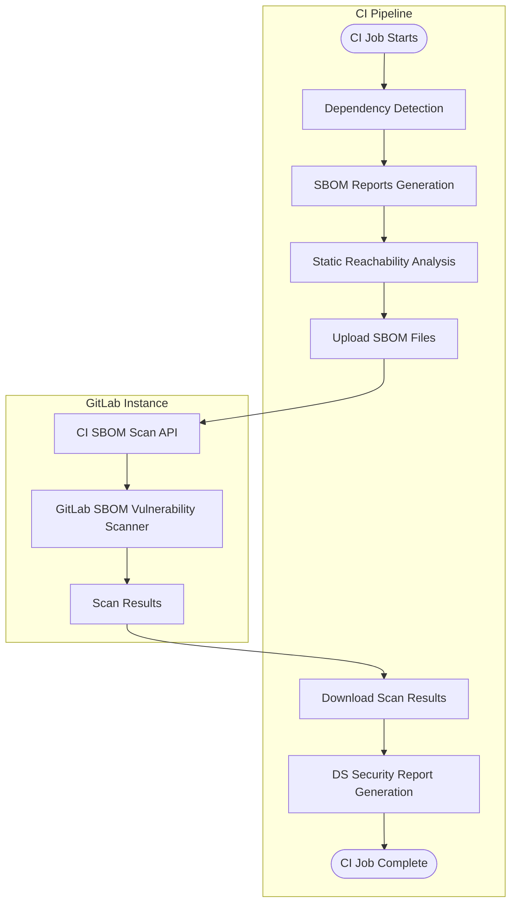



- プラン: Ultimate
- 提供形態: GitLab.com、GitLab Self-Managed、GitLab Dedicated





- GitLab 17.4で[導入](https://gitlab.com/groups/gitlab-org/-/work_items/8026)され、デフォルトブランチのみの[実験](../../../../policy/development_stages_support.md#experiment)として、[機能フラグ](../../../../administration/feature_flags/_index.md) `dependency_scanning_using_sbom_reports`という名前で提供。デフォルトでは無効になっています。
- GitLab 17.5で[GitLab Self-Managedで有効化](https://gitlab.com/gitlab-org/gitlab/-/issues/395692)。
- GitLab 17.9で[変更](https://gitlab.com/groups/gitlab-org/-/work_items/15960)され、実験からベータになり、すべてのブランチがサポートされ、Cargo、Conda、Cocoapods、Swift向けの最新の依存関係スキャンCI/CDテンプレートで[デフォルトで有効になりました](https://gitlab.com/gitlab-org/gitlab/-/issues/519597)。
- 機能フラグ`dependency_scanning_using_sbom_reports`はGitLab 17.10で削除されました。
- GitLab 18.5で[変更](https://gitlab.com/groups/gitlab-org/-/work_items/15960)され、ベータからGitLab.comのみの利用制限付きになり、新しい[V2 CI/CD依存関係スキャンテンプレート](https://gitlab.com/gitlab-org/gitlab/-/merge_requests/201175/)とともに、[機能フラグ](../../../../administration/feature_flags/_index.md) `dependency_scanning_sbom_scan_api`という名前で提供。デフォルトでは無効になっています。
- GitLab 18.10で機能フラグ`dependency_scanning_using_sbom_reports`が[デフォルトで有効](https://gitlab.com/gitlab-org/gitlab/-/work_items/551861)になりました。
- GitLab 19.0で[一般提供](https://gitlab.com/groups/gitlab-org/-/work_items/20456)されます。



CycloneDXソフトウェア部品表（SBOM）を使用した依存関係スキャンでは、既知の脆弱性についてアプリケーションの依存関係が分析されます。すべての依存関係（[推移的な依存関係を含む](../_index.md)）がスキャンされます。

依存関係スキャンは、多くの場合、ソフトウェアコンポジション解析（SCA）の一部と見なされます。SCAには、コードで使用するアイテムの検査の側面が含まれる場合があります。これらのアイテムには通常、アプリケーションやシステムの依存関係が含まれており、ほとんどの場合、これらはユーザーが記述したアイテムからではなく外部ソースからインポートされます。

依存関係スキャンは、アプリケーションのライフサイクルの開発フェーズで実行できます。新しい依存関係スキャンアナライザーをCI/CDパイプラインで使用すると、プロジェクトの依存関係が検出され、CycloneDX SBOMレポートとして報告されます。セキュリティの検出結果は、ソースブランチとターゲットブランチの間で特定され、比較されます。コードの変更がコミットされる前に、アプリケーションに対するリスクにプロアクティブに対処できるように、検出結果とその重大度がマージリクエストにリストされます。報告されたSBOMコンポーネントのセキュリティアドバイザリーは、新しいセキュリティアドバイザリーが公開されると、CI/CDパイプラインとは無関係に、[継続的脆弱性スキャン](../../continuous_vulnerability_scanning/_index.md)によっても識別されます。

GitLabは、これらのすべての依存関係タイプを確実に網羅するために、依存関係スキャンと[コンテナスキャン](../../container_scanning/_index.md)の両方を提供しています。リスク領域をできるだけ広くカバーするために、すべてのセキュリティスキャナーを使用することをおすすめします。これらの機能の比較については、[依存関係スキャンとコンテナスキャンの比較](../../comparison_dependency_and_container_scanning.md)を参照してください。

この[フィードバックイシュー](https://gitlab.com/gitlab-org/gitlab/-/issues/523458)で、新しい依存関係スキャンアナライザーに関するご意見をお聞かせください。

## 依存関係スキャンを有効にする {#turn-on-dependency-scanning}

プロジェクトの依存関係スキャンを有効にします。

### 前提条件 {#prerequisites}

すべてのGitLabインスタンスの前提条件:

- プロジェクトのデベロッパー、メンテナー、またはオーナーロール。
- [サポートされているロックファイルまたは依存関係グラフのエクスポート](#supported-languages-and-files)が、リポジトリにコミットされるか、CI/CDパイプラインで作成されてアーティファクトとして`dependency-scanning`ジョブに渡される必要があります。あるいは、[依存関係の解決](#dependency-resolution)によって、サポートされているエコシステムに必要なファイルを生成できるか、[マニフェストファイル](#manifest-fallback)をフォールバックオプションとして使用できます。
- セルフマネージドGitLab Runnerの場合は、[`docker`](https://docs.gitlab.com/runner/executors/docker/)または[`kubernetes`](https://docs.gitlab.com/runner/install/kubernetes/) executorを使用するGitLab Runner。
- GitLab.comでホストされているRunnerの場合、この設定はデフォルトで有効になっています。

GitLab Self-Managedの場合のみ、スキャンされるすべてのPURLタイプの[パッケージメタデータ](../../../../administration/settings/security_and_compliance.md#choose-package-registry-metadata-to-sync)をGitLabインスタンスで同期する必要があります。このデータがGitLabインスタンスで使用できない場合、依存関係スキャンは脆弱性を特定できません。

### プロジェクトのパイプライン構成を更新 {#update-project-pipeline-configuration}

依存関係スキャンを有効にするには、依存関係スキャンテンプレートをプロジェクトのパイプライン構成に追加する必要があります。

デフォルトでは、`Dependency-Scanning.v2.gitlab-ci.yml`テンプレートはマージリクエストパイプラインで依存関係スキャンジョブを実行します。プロジェクトが他のジョブにマージリクエストパイプラインを使用しない場合、マージリクエストパイプラインには依存関係スキャンジョブのみが表示され、他のすべてのジョブは個別のブランチパイプラインで実行されます。この動作を無効にするには、[マージリクエストパイプラインの依存関係スキャンを無効にする](#disable-merge-request-pipelines-for-dependency-scanning)を参照してください。

GitLab UIを介して依存関係スキャンを有効にするには:

1. 上部のバーで、**検索または移動先**を選択して、プロジェクトを見つけます。
1. 左側のサイドバーで、**コード** > **リポジトリ**を選択します。
1. `.gitlab-ci.yml`ファイルを選択します。
1. **編集** > **単一のファイルを編集**を選択します。
1. `Dependency-Scanning.v2` CI/CDテンプレートを追加します:

   ```yaml
   include:
     - template: Jobs/Dependency-Scanning.v2.gitlab-ci.yml
   ```

1. **変更をコミットする**を選択します。

## 利用可能なコンテナイメージ {#available-container-images}

この機能は、CIジョブを実行するためにコンテナイメージに依存しています。デフォルトのCIジョブ定義は、これらのイメージをメジャーバージョンタグ (`dependency-scanning:2`など) で参照するため、CI/CD設定を変更することなく、パッチおよびマイナーアップデートが自動的に適用されます。

### メンテナンスポリシー {#maintenance-policy}

GitLabは、現在の安定リリースのバグ修正と、過去2か月のリリースのセキュリティ修正を提供するために、[リリースおよびメンテナンスポリシー](../../../../policy/maintenance.md)に従います。

CI/CDジョブはメジャーバージョンタグ (`dependency-scanning:2`など) でイメージを参照するため、そのメジャーイメージバージョンと互換性のあるすべてのGitLabバージョンで修正が自動的に利用可能です。

これは、以下にリストされているイメージに適用されます。以前のイメージはこのポリシーの対象ではありません。

### 現在のイメージ {#current-images}

| CI/CDジョブ                               | 本番環境イメージ                                                                                        | GitLabのバージョン |
| --------------------------------------- | ------------------------------------------------------------------------------------------------------- | -------------- |
| `dependency-scanning`                   | `registry.gitlab.com/security-products/dependency-scanning:2`                                           | `19.x`         |
| `dependency-scanning:maven-resolution`  | `registry.gitlab.com/security-products/dependency-resolution/ubi9/openjdk-21:1`                         | `18.x`、`19.x` |
| `dependency-scanning:gradle-resolution` | `registry.gitlab.com/security-products/dependency-resolution/ubi9/openjdk-17-with-gradle-8:1`           | `19.x`         |
| `dependency-scanning:python-resolution` | `registry.gitlab.com/security-products/dependency-resolution/ubi9/python-312-minimal-with-piptools-7:9` | `18.x`,`19.x`  |

現在のイメージは、ベースイメージベンダーからのアップストリームパッチを組み込むために定期的に再構築されます。

### 以前のイメージ {#previous-images}

これらのイメージは非推奨であり、バグ修正や新機能は今後提供されません。これらはコンテナレジストリで引き続き利用可能であり、対応するGitLabバージョンで動作し続けます。非推奨のイメージを新しいGitLabバージョンで使用することはサポートされておらず、予期せぬ結果を生じる可能性があります。

| CI/CDジョブ             | 本番環境イメージ                                              | GitLabのバージョン | 非推奨となったバージョン |
| --------------------- | ------------------------------------------------------------- | -------------- | ------------- |
| `dependency-scanning` | `registry.gitlab.com/security-products/dependency-scanning:1` | `18.x`         | `19.0`        |
| `dependency-scanning` | `registry.gitlab.com/security-products/dependency-scanning:0` | `18.x`         | `19.0`        |

### FIPSコンプライアンス {#fips-compliance}

依存関係スキャンアナライザーイメージおよびすべての[依存関係解決イメージ](#dependency-resolution)は、FIPS 140で検証された暗号学的モジュールを使用する[Red Hat UBI](https://www.redhat.com/en/blog/introducing-red-hat-universal-base-image)に基づいています。FIPS対応環境では追加の設定は必要ありません。

## 結果について理解する {#understanding-the-results}

依存関係スキャンアナライザーの出力内容:

- 検出されたサポート対象のロックファイルまたは依存関係グラフエクスポートごとに、CycloneDX SBOMが作成されます。
- スキャンされたすべてのSBOMドキュメントに対する単一の依存関係スキャンレポート（GitLab.comおよびGitLab Self-Managedのみ）。

> [!note]
アナライザーが[サポートされているファイル](#supported-languages-and-files)を見つけられなかった場合でも、依存関係スキャンジョブは正常に完了し、CI/CDジョブログに警告が出力されます。この場合、CycloneDX SBOMまたは依存関係スキャンレポートは生成されません。

### CycloneDXソフトウェア部品表 {#cyclonedx-software-bill-of-materials}

The依存関係スキャンアナライザーは、サポートされているロックファイル、依存関係グラフ、またはマニフェストファイルが検出されたディレクトリごとに、[CycloneDX](https://cyclonedx.org/)ソフトウェア部品表 (SBOM) を出力します。CycloneDX SBOMは、ジョブアーティファクトとして作成されます。

CycloneDX SBOMの仕様は次のとおりです:

- `gl-sbom-<package-type>-<package-manager>.cdx.json`という名前が付けられます。
- 依存関係スキャンジョブのジョブアーティファクトとして利用できます。
- `cyclonedx`レポートとしてアップロードされます。
- 検出されたロックファイルまたは依存関係グラフファイルと同じディレクトリに保存されます。

たとえば、プロジェクトに次の構造がある場合:

```plaintext
.
├── ruby-project/
│   └── Gemfile.lock
├── ruby-project-2/
│   └── Gemfile.lock
└── php-project/
    └── composer.lock
```

次のCycloneDX SBOMは、ジョブアーティファクトとして作成されます:

```plaintext
.
├── ruby-project/
│   ├── Gemfile.lock
│   └── gl-sbom-gem-bundler.cdx.json
├── ruby-project-2/
│   ├── Gemfile.lock
│   └── gl-sbom-gem-bundler.cdx.json
└── php-project/
    ├── composer.lock
    └── gl-sbom-packagist-composer.cdx.json
```

### 依存関係スキャンレポート {#dependency-scanning-report}



- 提供形態: GitLab.com、GitLab Self-Managed



依存関係スキャンアナライザーは、CycloneDX SBOMファイルで特定された依存関係で特定されたすべての脆弱性をドキュメント化する依存関係スキャンレポートを生成します。

依存関係スキャンレポート:

- `gl-dependency-scanning-report.json`という名前が付けられます。
- 依存関係スキャンジョブのジョブアーティファクトとして使用できます。
- `dependency_scanning`レポートとしてアップロードされます。
- プロジェクトのルートディレクトリに保存されます。

## 最適化 {#optimization}

SBOMを使用した依存関係スキャンを最適化するには、次のいずれかの方法を使用します:

- パスを除外する
- スキャンを最大のディレクトリ深度に制限する

### パスを除外する {#exclude-paths}

スキャンパフォーマンスを最適化し、関連するリポジトリコンテンツに焦点を当てるには、パスを除外します。

`.gitlab-ci.yml`ファイルに、除外されたパスを一覧表示します:

- 依存関係スキャンテンプレートを使用している場合は、`DS_EXCLUDED_PATHS` CI/CD変数を使用します。
- 依存関係スキャンCI/CDコンポーネントを使用している場合は、`excluded_paths`仕様入力を使用します。

#### 除外パターン {#exclusion-patterns}

除外パターンは、次のルールに従います:

- スラッシュのないパターンは、プロジェクト内の任意の深度でファイル名またはディレクトリ名と一致します（例: `test`は`./test`、`src/test`と一致します）。
- スラッシュ（/）を含むパターンは、親ディレクトリ単位でのマッチングが行われます。つまり、そのパターンで始まるパスに一致します（例: `a/b`は`a/b`と`a/b/c`には一致しますが、`c/a/b`には一致しません）。
- 標準のglobワイルドカードがサポートされています（例: `a/**/b`は`a/b`、`a/x/b`、`a/x/y/b`と一致します）。
- 先頭と末尾のスラッシュは無視されます（例: `/build`と`build/`は`build`と同じように動作します）。

### スキャンを最大のディレクトリ深度に制限する {#limit-scanning-to-a-maximum-directory-depth}

スキャンパフォーマンスを最適化し、分析するファイルの数を減らすために、スキャンを最大のディレクトリ深度に制限します。

ルートディレクトリは深度`1`としてカウントされ、各サブディレクトリは深度を1ずつ増やします。デフォルトの深度は`2`です。値が`-1`の場合、深さに関係なくすべてのディレクトリをスキャンします。

`.gitlab-ci.yml`ファイルで最大の深度を指定するには、以下を行います:

- 依存関係スキャンテンプレートを使用している場合は、`DS_MAX_DEPTH` CI/CD変数を使用します。
- 依存関係スキャンCI/CDコンポーネントを使用している場合は、`max_scan_depth`仕様入力を使用します。

次の例では、`DS_MAX_DEPTH`が`3`に設定されている場合、`common`ディレクトリのサブディレクトリはスキャンされません。

```plaintext
timer
├── integration
│   ├── doc
│   └── modules
└── source
    ├── common
    │   ├── cplusplus
    │   └── go
    ├── linux
    ├── macos
    └── windows
```

## ロールアウトする {#roll-out}

単一のプロジェクトでSBOMの結果を使用した依存関係スキャンに自信がある場合は、その実装を複数のプロジェクトとグループに拡張できます。詳細については、[複数のプロジェクトでスキャンを強制する](#enforce-scanning-on-multiple-projects)を参照してください。

固有の要件がある場合、SBOMを使用した依存関係スキャンは[オフライン環境](#offline-environment)で実行できます。

## サポートされているパッケージタイプ {#supported-package-types}

セキュリティポリシー分析を効果的にするには、SBOMレポートにリストされているコンポーネントに、[GitLab Advisory Database](../../gitlab_advisory_database/_index.md)に対応するエントリが含まれている必要があります。

GitLab SBOM脆弱性スキャナーは、次の[PURLタイプ](https://github.com/package-url/purl-spec/blob/346589846130317464b677bc4eab30bf5040183a/PURL-TYPES.rst)のコンポーネントについて、依存関係スキャンの脆弱性を報告できます:

- `cargo`
- `composer`
- `conan`
- `gem`
- `golang`
- `maven`
- `npm`
- `nuget`
- `pypi`
- `swift`

## サポートされている言語とファイル {#supported-languages-and-files}

| 言語                  | パッケージマネージャー | ファイル                                         | 説明                                                                                                                                                                           | 依存関係グラフエクスポートのサポート | 静的到達可能性のサポート |
| ------------------------- | --------------- | ----------------------------------------------- | ------------------------------------------------------------------------------------------------------------------------------------------------------------------------------------- | ------------------------------- | --------------------------- |
| C#                        | NuGet           | `packages.lock.json`                            | `nuget`によって生成されたロックファイル。                                                                                                                                                       |                      |                   |
| C/C++                     | Conan           | `conan.lock`                                    | `conan`によって生成されたロックファイル。                                                                                                                                                       |                      |                   |
| C/C++/Fortran/Go/Python/R | Conda           | `conda-lock.yml`                                | `conda-lock`によって生成された環境ファイル。                                                                                                                                          |                       |                   |
| Dart                      | pub             | `pubspec.lock`、`pub.graph.json`                | `pub`によって生成されたロックファイル。`dart pub deps --json > pub.graph.json`から派生した依存関係グラフエクスポート。                                                                           |                      |                   |
| Go                        | Go              | `go.mod`、`go.graph`                            | 標準の`go`ツールチェーンによって生成されたモジュールファイル。`go mod graph > go.graph`から派生した依存関係グラフエクスポート。                                                                |                      |                   |
| Java                      | ivy             | `ivy-report.xml`                                | `report` Apache Antタスクによって生成された依存関係グラフエクスポート。                                                                                                                   |                       |                  |
| Java                      | Maven           | `maven.graph.json`                              | `mvn dependency:tree -DoutputType=json`によって生成された依存関係グラフエクスポート。                                                                                                        |                      |                  |
| Java                      | Maven           | `pom.xml`                                       | [依存関係解決](#dependency-resolution)によって使用されるMavenマニフェストファイル、または依存関係グラフエクスポートが利用できない場合の[マニフェストフォールバック](#manifest-fallback)として使用されます。           |                       |                  |
| Java/Kotlin               | Gradle          | `gradle.graph.txt`                              | `./gradlew dependencies`によって生成された依存関係グラフエクスポート。                                                                                                                       |                      |                  |
| Java/Kotlin               | Gradle          | `dependencies.lock`、`dependencies.direct.lock` | [gradle-dependency-lock-plugin](https://github.com/nebula-plugins/gradle-dependency-lock-plugin)によって生成されたロックファイル。                                                              |                      |                  |
| Java/Kotlin               | Gradle          | `gradle.lockfile`                               | `gradle dependencies --write-locks`によって生成されたロックファイル。                                                                                                                           |                       |                  |
| Java/Kotlin               | Gradle          | `gradle-html-dependency-report.js`              | [htmlDependencyReport](https://docs.gradle.org/current/dsl/org.gradle.api.tasks.diagnostics.DependencyReportTask.html)タスクによって生成された依存関係グラフのエクスポート。                |                      |                  |
| Java/Kotlin               | Gradle          | `build.gradle`、`build.gradle.kts`              | [依存関係解決](#dependency-resolution)によって使用されるGradleビルドファイル、またはロックファイルや依存関係グラフエクスポートが利用できない場合の[マニフェストフォールバック](#manifest-fallback)として使用されます。 |                       |                  |
| JavaScript/TypeScript     | npm             | `package-lock.json`、`npm-shrinkwrap.json`      | `npm` v5以降によって生成されたロックファイル（属性`lockfileVersion`を生成しない以前のバージョンはサポートされていません）。                                                  |                      |                  |
| JavaScript/TypeScript     | pnpm            | `pnpm-lock.yaml`                                | `pnpm`によって生成されたロックファイル。                                                                                                                                                        |                      |                  |
| JavaScript/TypeScript     | yarn            | `yarn.lock`                                     | `yarn`によって生成されたロックファイル。                                                                                                                                                        |                      |                  |
| Objective-C               | CocoaPods       | `Podfile.lock`                                  | `cocoapods`によって生成されたロックファイル。                                                                                                                                                   |                       |                   |
| PHP                       | composer        | `composer.lock`                                 | `composer`によって生成されたロックファイル。                                                                                                                                                    |                      |                   |
| Python                    | pip             | `pipdeptree.json`                               | `pipdeptree --json`によって生成された依存関係グラフエクスポート。                                                                                                                            |                      |                  |
| Python                    | pip             | `requirements.txt`（ロックファイル）                   | `pip-compile`によって生成されたロックファイル。                                                                                                                                                 |                      |                  |
| Python                    | pip             | `requirements.txt`                              | [依存関係解決](#dependency-resolution)によって使用されるマニフェストファイル、またはロックファイルや依存関係グラフエクスポートが利用できない場合の[マニフェストフォールバック](#manifest-fallback)として使用されます。     |                       |                   |
| Python                    | pipenv          | `Pipfile.lock`                                  | `pipenv`によって生成されたロックファイル。                                                                                                                                                      |                       |                   |
| Python                    | pipenv          | `pipenv.graph.json`                             | `pipenv graph --json-tree >pipenv.graph.json`によって生成された依存関係グラフエクスポート。                                                                                                  |                      |                  |
| Python                    | poetry          | `poetry.lock`                                   | `poetry` v1またはv2によって生成されたロックファイル。                                                                                                                                             |                      |                  |
| Python                    | uv <sup>1</sup>  | `uv.lock`                                       | `uv`によって生成されたロックファイル。                                                                                                                                                          |                      |                  |
| Ruby                      | bundler         | `Gemfile.lock`、`gems.locked`                   | `bundler`によって生成されたロックファイル。                                                                                                                                                     |                      |                   |
| Rust                      | cargo           | `Cargo.lock`                                    | `cargo`によって生成されたロックファイル。                                                                                                                                                       |                      |                   |
| Scala                     | sbt             | `dependencies-compile.dot`                      | `sbt dependencyDot`によって生成された依存関係グラフエクスポート。                                                                                                                            |                      |                   |
| Swift                     | swift           | `Package.resolved`                              | `swift`によって生成されたロックファイル。                                                                                                                                                       |                       |                   |

**脚注**: 

1. ロックファイルに、異なる環境マーカーを持つ同じパッケージの複数のエントリ（例: Python <3.11の場合はnumpy==2.2.6、Python ≥3.11の場合はnumpy==2.4.1）が含まれている場合、最初のエントリのみが解析され、レポートされます。

### パッケージハッシュ情報 {#package-hash-information}

依存関係スキャンSBOMには、利用可能な場合にパッケージハッシュ情報が含まれます。この情報は、NuGetパッケージにのみ提供されます。パッケージの整合性と信頼性を検証できるように、SBOM内の次の場所にパッケージハッシュが表示されます:

- 専用ハッシュフィールド
- PURL修飾子

例: 

```json
{
  "name": "Iesi.Collections",
  "version": "4.0.4",
  "purl": "pkg:nuget/Iesi.Collections@4.0.4?sha512=8e579b4a3bf66bb6a661f297114b0f0d27f6622f6bd3f164bef4fa0f2ede865ef3f1dbbe7531aa283bbe7d86e713e5ae233fefde9ad89b58e90658ccad8d69f9",
  "hashes": [
    {
      "alg": "SHA-512",
      "content": "8e579b4a3bf66bb6a661f297114b0f0d27f6622f6bd3f164bef4fa0f2ede865ef3f1dbbe7531aa283bbe7d86e713e5ae233fefde9ad89b58e90658ccad8d69f9"
    }
  ],
  "type": "library",
  "bom-ref": "pkg:nuget/Iesi.Collections@4.0.4?sha512=8e579b4a3bf66bb6a661f297114b0f0d27f6622f6bd3f164bef4fa0f2ede865ef3f1dbbe7531aa283bbe7d86e713e5ae233fefde9ad89b58e90658ccad8d69f9"
}
```

## アナライザーの動作をカスタマイズする {#customizing-analyzer-behavior}

アナライザーの動作のカスタマイズ方法は、イネーブルメントソリューションによって異なります。

> [!warning]
GitLabアナライザーのすべてのカスタマイズは、変更をデフォルトブランチにマージする前にマージリクエストでテストしてください。そうしないと、誤検出が多数発生するなど、予期しない結果が生じる可能性があります。

### CI/CDテンプレートを使用した動作のカスタマイズ {#customizing-behavior-with-the-cicd-template}

#### 利用可能なspec入力 {#available-spec-inputs}

次のspec入力は、`Dependency-Scanning.v2.gitlab-ci.yml`テンプレートと組み合わせて使用できます。

| Spec入力                                  | 種類    | デフォルト                                                                                                   | 説明                                                                                                                                                                                                                                                           |
| ------------------------------------------- | ------- | --------------------------------------------------------------------------------------------------------- | --------------------------------------------------------------------------------------------------------------------------------------------------------------------------------------------------------------------------------------------------------------------- |
| `job_name`                                  | 文字列  | `"dependency-scanning"`                                                                                   | 依存関係スキャンジョブの名前。                                                                                                                                                                                                                              |
| `stage`                                     | 文字列  | `test`                                                                                                    | 依存関係スキャンジョブのステージ。                                                                                                                                                                                                                             |
| `allow_failure`                             | ブール値 | `true`                                                                                                    | 依存関係スキャンジョブの失敗がパイプラインを失敗させるかどうか。                                                                                                                                                                                                 |
| `analyzer_image_prefix`                     | 文字列  | `"$CI_TEMPLATE_REGISTRY_HOST/security-products"`                                                          | アナライザーのリポジトリを指すレジストリURLプレフィックス。                                                                                                                                                                                                   |
| `analyzer_image_name`                       | 文字列  | `"dependency-scanning"`                                                                                   | 依存関係スキャンジョブで使用されるアナライザーイメージのリポジトリ。                                                                                                                                                                                             |
| `analyzer_image_version`                    | 文字列  | `"2"`                                                                                                     | 依存関係スキャンジョブで使用されるアナライザーイメージのバージョン。                                                                                                                                                                                                |
| `additional_ca_cert_bundle`                 | 文字列  |                                                                                                           | 信頼するCA証明書バンドル。ここに示されているCAバンドルは、システムの証明書に追加され、スキャンプロセス中に他のツールでも使用されます。詳細については、[カスタムTLS認証局](#custom-tls-certificate-authority)を参照してください。              |
| `pip_manifest_file_name_pattern`            | 文字列  |                                                                                                           | 依存関係解決およびマニフェストスキャンに使用するカスタムpipマニフェストファイル名パターン。このパターンは、ディレクトリパスではなく、ファイル名のみと一致する必要があります。構文の詳細は、[doublestarライブラリ](https://www.github.com/bmatcuk/doublestar/tree/v1#patterns)を参照してください。 |
| `pipcompile_lockfile_file_name_pattern`     | 文字列  |                                                                                                           | pip-compileロックファイルのファイル名パターンをカスタマイズして、分析時に使用します。このパターンは、ディレクトリパスではなく、ファイル名のみと一致する必要があります。構文の詳細は、[doublestarライブラリ](https://www.github.com/bmatcuk/doublestar/tree/v1#patterns)を参照してください。                          |
| `pipcompile_requirements_file_name_pattern` | 文字列  |                                                                                                           | GitLab 19.0で[非推奨](https://gitlab.com/gitlab-org/gitlab/-/work_items/598796)になりました: 代わりに`pipcompile_lockfile_file_name_pattern`を使用してください。                                                                                                                           |
| `max_scan_depth`                            | 数値  | `2`                                                                                                       | サポートされているファイルを検索するためにアナライザーが検索するディレクトリレベル数を定義します。値 -1は、アナライザーが深さに関係なくすべてのディレクトリを検索することを意味します。                                                                                                       |
| `excluded_paths`                            | 文字列  | `"**/spec,**/test,**/tests,**/tmp"`                                                                       | スキャンから除外するパスのカンマ区切りリスト（globがサポートされています）。                                                                                                                                                                                           |
| `include_dev_dependencies`                  | ブール値 | `true`                                                                                                    | サポートされているファイルをスキャンするときに、開発/テスト依存関係を含めます。                                                                                                                                                                                                 |
| `enable_static_reachability`                | ブール値 | `false`                                                                                                   | [静的到達可能性](../static_reachability.md)を有効にします。                                                                                                                                                                                                              |
| `enable_manifest_fallback`                  | ブール値 | `true`                                                                                                    | [マニフェストフォールバック](#manifest-fallback)を有効にします。                                                                                                                                                                                                                       |
| `analyzer_log_level`                        | 文字列  | `"info"`                                                                                                  | 依存関係スキャンのログレベル。オプションは、致命的、エラー、警告、情報、デバッグです。                                                                                                                                                                               |
| `enable_vulnerability_scan`                 | ブール値 | `true`                                                                                                    | 生成されたSBOMの脆弱性分析を有効にします                                                                                                                                                                                                                  |
| `api_timeout`                               | 数値  | `10`                                                                                                      | 依存関係スキャンSBOM APIリクエストのタイムアウト（秒単位）。                                                                                                                                                                                                              |
| `api_scan_download_delay`                   | 数値  | `3`                                                                                                       | スキャン結果のダウンロード前の依存関係スキャンSBOM APIの初期遅延（秒単位）。                                                                                                                                                                                |
| `resolution_jobs_stage`                     | 文字列  | `.pre`                                                                                                    | 依存関係解決ジョブのパイプラインステージ。                                                                                                                                                                                                                         |
| `resolution_jobs_allow_failure`             | ブール値 | `true`                                                                                                    | `true`の場合、失敗した解決ジョブはパイプラインを失敗させません。`false`の場合、解決の失敗はパイプラインをブロックします。                                                                                                                                              |
| `disabled_resolution_jobs`                  | 文字列  | `""`                                                                                                      | 無効にする解決ジョブのコンマ区切りリスト（例: `"maven, python"`）。デフォルトでは、利用可能なすべての解決ジョブが有効になります。指定可能な値は`maven`、`gradle`、`python`です。[依存関係解決](#dependency-resolution)を参照                       |
| `maven_resolution_job_name`                 | 文字列  | `"dependency-scanning:maven-resolution"`                                                                  | Maven依存関係解決のためのジョブ名。                                                                                                                                                                                                                  |
| `maven_resolution_image`                    | 文字列  | `"registry.gitlab.com/security-products/dependency-resolution/ubi9/openjdk-21:1"`                         | Maven依存関係解決ジョブで使用されるイメージ。                                                                                                                                                                                                                |
| `maven_dependency_plugin_version`           | 文字列  | `"3.7.0"`                                                                                                 | Maven依存関係解決中に使用される`maven-dependency-plugin`のバージョン。`3.7.0`以降である必要があります。                                                                                                                                                           |
| `python_resolution_job_name`                | 文字列  | `"dependency-scanning:python-resolution"`                                                                 | Python依存関係解決のためのジョブ名。                                                                                                                                                                                                                 |
| `python_resolution_image`                   | 文字列  | `"registry.gitlab.com/security-products/dependency-resolution/ubi9/python-312-minimal-with-piptools-7:9"` | Python依存関係解決ジョブで使用されるイメージ。                                                                                                                                                                                                               |
| `gradle_resolution_job_name`                | 文字列  | `"dependency-scanning:gradle-resolution"`                                                                 | Gradle依存関係解決のためのジョブ名。                                                                                                                                                                                                                 |
| `gradle_resolution_image`                   | 文字列  | `"registry.gitlab.com/security-products/dependency-resolution/ubi9/openjdk-17-with-gradle-8:1"`           | Gradle依存関係解決ジョブで使用されるイメージ。                                                                                                                                                                                                               |

#### 利用可能なCI/CD変数 {#available-cicd-variables}

これらの変数はspec入力を置き換えることができ、ベータ`latest`テンプレートとも互換性があります。

| CI/CD変数                                | 説明                                                                                                                                                                                                                                                                                                                                                                                                                                                                                                                                                                                      |
| ---------------------------------------------- | ------------------------------------------------------------------------------------------------------------------------------------------------------------------------------------------------------------------------------------------------------------------------------------------------------------------------------------------------------------------------------------------------------------------------------------------------------------------------------------------------------------------------------------------------------------------------------------------------ |
| `AST_ENABLE_MR_PIPELINES`                      | 依存関係スキャンジョブをMRまたはブランチパイプラインで実行するかどうかを制御します。デフォルトは`"true"`です。プロジェクトがマージリクエストパイプラインを使用しない場合は、重複するパイプラインを避けるためにこれを無効にしてください。                                                                                                                                                                                                                                                                                                                                                                                                                  |
| `ADDITIONAL_CA_CERT_BUNDLE`                    | 信頼するCA証明書バンドル。ここに示されているCAバンドルは、システムの証明書に追加され、スキャンプロセス中に他のツールでも使用されます。詳細については、[カスタムTLS認証局](#custom-tls-certificate-authority)を参照してください。                                                                                                                                                                                                                                                                                                                                         |
| `ANALYZER_ARTIFACT_DIR`                        | CycloneDXレポート（SBOM）が保存されるディレクトリ。デフォルトは`${CI_PROJECT_DIR}/sca-artifacts`です。                                                                                                                                                                                                                                                                                                                                                                                                                                                                                                  |
| `DEPENDENCY_SCANNING_DISABLED`                 | `"true"`または`"1"`に設定すると、すべての依存関係スキャンジョブが無効になります。デフォルト: 未設定。                                                                                                                                                                                                                                                                                                                                                                                                                                                                                                          |
| `DS_EXCLUDED_ANALYZERS`                        | 依存関係スキャンから除外するアナライザーを（名前で）指定します。                                                                                                                                                                                                                                                                                                                                                                                                                                                                                                                             |
| `DS_EXCLUDED_PATHS`                            | パスに基づいて、スキャンからファイルとディレクトリを除外します。カンマ区切りのパターンリストを指定します。パターンには、glob（サポートされているパターンについては[`doublestar.Match`](https://pkg.go.dev/github.com/bmatcuk/doublestar/v4@v4.0.2#Match)を参照）、またはファイルパスやフォルダーパス（`doc,spec`など）を使用できます。一致ルールの詳細については、[除外パターン](#exclusion-patterns)を参照してください。これは、スキャンが実行される前に適用されるプリフィルターです。依存関係検出と静的到達可能性の両方に適用されます。デフォルトは`"**/spec,**/test,**/tests,**/tmp,**/node_modules,**/.bundle,**/vendor,**/.git"`です。 |
| `DS_MAX_DEPTH`                                 | アナライザーがスキャン対象のサポートされているファイルを検索するディレクトリ階層の深さを定義します。値が`-1`の場合、深さに関係なくすべてのディレクトリをスキャンします。デフォルトは`2`です。                                                                                                                                                                                                                                                                                                                                                                                                                     |
| `DS_INCLUDE_DEV_DEPENDENCIES`                  | `"false"`に設定すると、開発依存関係はレポートされません。Composer、Conda、Gradle、Maven、NPM、pnpm、Pipenv、Poetry、またはuvを使用するプロジェクトのみがサポートされています。デフォルトは`"true"`です。                                                                                                                                                                                                                                                                                                                                                                                                          |
| `DS_PIP_MANIFEST_FILE_NAME_PATTERN`            | globパターンマッチング（たとえば、`custom-requirements.txt`または`*-requirements.txt`）を使用して、依存関係解決とマニフェストスキャンで処理するpipマニフェストファイルを定義します。このパターンは、ディレクトリパスではなく、ファイル名のみと一致する必要があります。構文の詳細については、[globパターンドキュメント](https://github.com/bmatcuk/doublestar/tree/v1?tab=readme-ov-file#patterns)を参照してください。                                                                                                                                                                                                         |
| `PIP_REQUIREMENTS_FILE`                        | GitLab 19.0で[非推奨](https://gitlab.com/gitlab-org/gitlab/-/work_items/588580)になりました: 代わりに`DS_PIP_MANIFEST_FILE_NAME_PATTERN`を使用してください。                                                                                                                                                                                                                                                                                                                                                                                                                                                          |
| `DS_PIPCOMPILE_LOCKFILE_FILE_NAME_PATTERN`     | globパターンマッチング（たとえば、`requirements*.txt`または`*-requirements.txt`）を使用して、pip-compileロックファイルの処理対象を定義します。このパターンは、ディレクトリパスではなく、ファイル名のみと一致する必要があります。構文の詳細については、[globパターンドキュメント](https://github.com/bmatcuk/doublestar/tree/v1?tab=readme-ov-file#patterns)を参照してください。                                                                                                                                                                                                                                                             |
| `DS_PIPCOMPILE_REQUIREMENTS_FILE_NAME_PATTERN` | GitLab 19.0で[非推奨](https://gitlab.com/gitlab-org/gitlab/-/work_items/598796)になりました: 代わりに`DS_PIPCOMPILE_LOCKFILE_FILE_NAME_PATTERN`を使用してください。                                                                                                                                                                                                                                                                                                                                                                                                                                                   |
| `SECURE_ANALYZERS_PREFIX`                      | 公式のデフォルトイメージを提供するDockerレジストリ（プロキシ）の名前をオーバーライドします。                                                                                                                                                                                                                                                                                                                                                                                                                                                                                                          |
| `DS_FF_LINK_COMPONENTS_TO_GIT_FILES`           | 依存関係リストのコンポーネントを、ロックファイルやCI/CDパイプラインで動的に生成されたグラフファイルではなく、リポジトリにコミットされたファイルにリンクします。これにより、すべてのコンポーネントがリポジトリ内のソースファイルにリンクされます。デフォルトは`"false"`です。                                                                                                                                                                                                                                                                                                                                      |
| `SEARCH_IGNORE_HIDDEN_DIRS`                    | 非表示のディレクトリを無視します。依存関係スキャンと静的到達可能性の両方で機能します。デフォルトは`"true"`です。                                                                                                                                                                                                                                                                                                                                                                                                                                                                                        |
| `DS_STATIC_REACHABILITY_ENABLED`               | [静的到達可能性](../static_reachability.md)を有効にします。デフォルトは`"false"`です。                                                                                                                                                                                                                                                                                                                                                                                                                                                                                                                    |
| `DS_ENABLE_VULNERABILITY_SCAN`                 | 生成されたSBOMファイルの脆弱性スキャンを有効にします。[依存関係スキャンレポート](#dependency-scanning-report)を生成します。デフォルトは`"true"`です。                                                                                                                                                                                                                                                                                                                                                                                                                                                 |
| `DS_API_TIMEOUT`                               | 依存関係スキャンSBOM APIリクエストのタイムアウト（秒単位）（最小値: `5`、最大値: `300`）デフォルト: `10`                                                                                                                                                                                                                                                                                                                                                                                                                                                                                             |
| `DS_API_SCAN_DOWNLOAD_DELAY`                   | スキャン結果のダウンロード前の初期遅延（秒単位）（最小値: 1、最大値: 120）デフォルト: `3`                                                                                                                                                                                                                                                                                                                                                                                                                                                                                                 |
| `DS_ENABLE_MANIFEST_FALLBACK`                  | ロックファイルまたは依存関係グラフエクスポートが利用できない場合に、マニフェストフォールバックを有効にします。[マニフェストフォールバック](#manifest-fallback)を参照してください。デフォルトは`"true"`です。                                                                                                                                                                                                                                                                                                                                                                                                                                               |
| `DS_SKIP_IF_NO_SUPPORTED_FILES`                | `"true"`に設定すると、プロジェクトで[サポートされているファイル](#supported-languages-and-files)が検出されない場合、依存関係スキャンジョブをスキップします。詳細については、[サポートされているファイルが存在しない場合にジョブをスキップ](#skip-the-job-when-no-supported-file-is-present)を参照してください。デフォルトは`"false"`です。                                                                                                                                                                                                                                                                                                                            |
| `SECURE_LOG_LEVEL`                             | ログレベル。デフォルトは`"info"`です。                                                                                                                                                                                                                                                                                                                                                                                                                                                                                                                                                                    |
| `DS_DISABLED_RESOLUTION_JOBS`                  | 無効にする解決ジョブのコンマ区切りリスト（例: `"maven, python"`）。デフォルトでは、利用可能なすべての解決ジョブが有効になります。指定可能な値は`maven`、`gradle`、`python`です。                                                                                                                                                                                                                                                                                                                                                                                                      |
| `DS_MAVEN_RESOLUTION_IMAGE`                    | Maven依存関係解決ジョブで使用されるイメージ。                                                                                                                                                                                                                                                                                                                                                                                                                                                                                                                                           |
| `DS_MAVEN_DEPENDENCY_PLUGIN_VERSION`           | Maven依存関係解決中に使用される`maven-dependency-plugin`のバージョン。`3.7.0`以降である必要があります。デフォルトは`3.7.0`です。                                                                                                                                                                                                                                                                                                                                                                                                                                                                    |
| `DS_PYTHON_RESOLUTION_IMAGE`                   | Python依存関係解決ジョブで使用されるイメージ。                                                                                                                                                                                                                                                                                                                                                                                                                                                                                                                                          |
| `DS_GRADLE_RESOLUTION_IMAGE`                   | Gradle依存関係解決ジョブで使用されるイメージ。                                                                                                                                                                                                                                                                                                                                                                                                                                                                                                                                          |

### マージリクエストパイプラインの依存関係スキャンを無効にする {#disable-merge-request-pipelines-for-dependency-scanning}

デフォルトでは、`Dependency-Scanning.v2.gitlab-ci.yml`テンプレートはマージリクエストパイプラインで依存関係スキャンジョブを実行します。プロジェクトが他のジョブにマージリクエストパイプラインを使用しない場合、各マージリクエストに対して2つのパイプラインが実行され、他のジョブは個別のブランチパイプラインで実行される可能性があります。この動作を無効にするには、仕様入力`enable_mr_pipelines: false`またはCI/CD変数`AST_ENABLE_MR_PIPELINES: "false"`を設定します。

### サポートされているファイルが存在しない場合にジョブをスキップする {#skip-the-job-when-no-supported-file-is-present}

デフォルトでは、プロジェクトに[サポートされているファイル](#supported-languages-and-files)が含まれていない場合でも、テンプレートを含むすべてのパイプラインで依存関係スキャンジョブが実行されます。サポートされているファイルが検出されない場合にジョブをスキップするには、`DS_SKIP_IF_NO_SUPPORTED_FILES`を`"true"`に設定します:

```yaml
include:
  - template: Jobs/Dependency-Scanning.v2.gitlab-ci.yml

variables:
  DS_SKIP_IF_NO_SUPPORTED_FILES: "true"
```

変数が設定されている場合、依存関係スキャンジョブは、プロジェクトに[サポートされているファイルリスト](#supported-languages-and-files)のファイルが少なくとも1つ含まれている場合、または`DS_PIPCOMPILE_LOCKFILE_FILE_NAME_PATTERN`、`DS_PIP_MANIFEST_FILE_NAME_PATTERN`、あるいは`PIP_REQUIREMENTS_FILE`（非推奨）でカスタムパターンが設定されている場合にのみ実行されます。

### カスタムTLS認証局 {#custom-tls-certificate-authority}

依存関係スキャンでは、アナライザーコンテナイメージに付属するデフォルトの代わりに、カスタムTLS証明書をSSL/TLS接続に使用できます。

#### カスタムTLS認証局を使用する {#using-a-custom-tls-certificate-authority}

カスタムTLS認証局を使用するには、CI/CD変数`ADDITIONAL_CA_CERT_BUNDLE`に[X.509 PEM公開キー証明書のテキスト表現](https://www.rfc-editor.org/rfc/rfc7468#section-5.1)を割り当てます。

たとえば、`.gitlab-ci.yml`ファイルで証明書を設定するには、次のようにします:

```yaml
variables:
  ADDITIONAL_CA_CERT_BUNDLE: |
      -----BEGIN CERTIFICATE-----
      MIIGqTCCBJGgAwIBAgIQI7AVxxVwg2kch4d56XNdDjANBgkqhkiG9w0BAQsFADCB
      ...
      jWgmPqF3vUbZE0EyScetPJquRFRKIesyJuBFMAs=
      -----END CERTIFICATE-----
```

## 依存関係の解決 {#dependency-resolution}



- GitLab 18.11でMavenとPython向けに[導入](https://gitlab.com/groups/gitlab-org/-/work_items/20461)されました。デフォルトでは無効です。
- Gradleのサポートを[追加](https://gitlab.com/gitlab-org/gitlab/-/work_items/590734)しました。GitLab 19.0のすべてのサポート対象プロジェクトでデフォルトで有効になりました。



リポジトリにコミットされたサポート対象のロックファイルまたは依存関係グラフエクスポートがないプロジェクトの場合、依存関係解決はスキャン実行前に必要なファイルを自動的に生成できます。

サポートされているマニフェストファイルがプロジェクトで検出されると、依存関係解決が自動的にトリガーされます。解決ジョブは、最小限のエコシステムイメージ（例: `ubi9/openjdk-21`）を使用して`.pre`パイプラインステージで実行され、ロックファイルまたは依存関係グラフエクスポートをネイティブに生成します。これらのジョブは既存のロックファイルまたはグラフエクスポートを保持し、存在しない場合にのみ作成します。生成されたアーティファクトは、その後、`test`パイプラインステージの`dependency-scanning`ジョブによって消費されます。デフォルトのイメージを同等の代替（例: `eclipse-temurin:jdk-21`）または必要なビルドツールを含むカスタムイメージに置き換えることができます。

以下のエコシステムが依存関係解決をサポートしています:

| 言語    | パッケージマネージャー | 検出されたマニフェストファイル                                                                                                           | 解決コマンド    | 出力アーティファクト       |
| ----------- | --------------- | --------------------------------------------------------------------------------------------------------------------------------- | --------------------- | --------------------- |
| Java        | Maven           | `pom.xml`                                                                                                                         | `mvn dependency:tree` | `maven.graph.json`    |
| Java/Kotlin | Gradle          | `build.gradle`、`build.gradle.kts`                                                                                                | `gradle dependencies` | `gradle.graph.txt`    |
| Python      | Pip, setuptools | `requirements.txt`, `requirements.in`, `requirements.pip`, `requires.txt`, `setup.py`, `setup.cfg`, `pyproject.toml` (非Poetry) | `pip-compile`         | `pipcompile.lock.txt` |

### 依存関係解決のカスタマイズ {#customizing-dependency-resolution}

利用可能なすべてのオプションについては、[利用可能なspecインプット](#available-spec-inputs)および[利用可能なCI/CD変数](#available-cicd-variables)を参照してください。

#### カスタムの依存関係解決イメージを使用する {#use-a-custom-dependency-resolution-image}

独自のイメージを使用するには、以下の入力を設定できます:

- `maven_resolution_image`
- `gradle_resolution_image`
- `python_resolution_image`

たとえば、Mavenの解決にカスタムイメージを使用する場合:

```yaml
include:
  - template: Jobs/Dependency-Scanning.v2.gitlab-ci.yml
    inputs:
      maven_resolution_image: "registry.gitlab.mycorp.com/eclipse-temurin:jdk-21"
```

あるいは、以下のCI/CD変数を設定できます:

- `DS_MAVEN_RESOLUTION_IMAGE`
- `DS_GRADLE_RESOLUTION_IMAGE`
- `DS_PYTHON_RESOLUTION_IMAGE`

#### 依存関係解決を無効にする {#disable-dependency-resolution}

特定のエコシステムにおける依存関係解決を無効にするには、CI/CD変数`DS_DISABLED_RESOLUTION_JOBS`または入力`disabled_resolution_jobs`を使用します。指定可能な値は`maven`、`gradle`、`python`です。

たとえば、Mavenの依存関係解決を無効にする場合:

```yaml
variables:
  DS_DISABLED_RESOLUTION_JOBS: "maven"

include:
  - template: Jobs/Dependency-Scanning.v2.gitlab-ci.yml
```

### 依存関係解決のセキュリティに関する考慮事項 {#security-considerations-for-dependency-resolution}

依存関係解決ジョブは、CI/CDコンテナ内でエコシステムネイティブのビルドツール (`mvn`, `gradle`, `pip-compile`) を実行します。これらのツールは、環境変数や設定ファイルをネイティブに尊重し、起動時に拡張機能を読み込むか任意のコードを実行できます。これには以下が含まれます:

- Maven: `MAVEN_ARGS`, `MAVEN_CLI_OPTS` (レガシー), `MAVEN_OPTS`, `JAVA_TOOL_OPTIONS`, `-s`または`--settings`を介して参照される任意の`settings.xml`、および`pom.xml`または`settings.xml`で宣言された`<extensions>`。
- Gradle: `GRADLE_OPTS`, `JAVA_TOOL_OPTIONS`, `--init-script`、および`build.gradle`または`build.gradle.kts`内のトップレベルのGroovyまたはKotlinコード。
- Python: `PIP_INDEX_URL`, `PIP_EXTRA_INDEX_URL`, `setup.py`、およびロックファイルインストールフック。

これらのCI/CD変数を設定したり、プロジェクトのビルドファイルを変更できるユーザーは、解決ジョブで任意のコードを実行させることができます。解決ジョブは`CI_JOB_TOKEN`で実行され、スコープ内のマスクされたCI/CD変数にアクセスし、ジョブの期間中、プロジェクトリポジトリへの読み取りまたは書き込みを行います。

このプロパティはエコシステムネイティブのビルドツールに固有のものであり、依存関係スキャンに特有のものではありません。解決ジョブを機密性の高い実行コンテキストとして扱います。

推奨される制御:

- 以前にリストされた変数を定義またはオーバーライドできるユーザーを制限します。保護ブランチおよびタグにスコープ設定された[保護CI/CD変数](../../../../ci/variables/_index.md#for-a-project)を使用します。開発者が編集できる`.gitlab-ci.yml` `variables:`ブロックには設定しないでください。
- `MAVEN_ARGS`, `MAVEN_CLI_OPTS`, `GRADLE_OPTS`, `--init-script`, カスタム`settings.xml`, および`<extensions>`の`pom.xml`における使用状況を、標準のコードレビュープロセスの一部として監査します。
- [スキャン実行ポリシー](../../policies/scan_execution_policies.md)を使用して依存関係スキャンを適用する場合、ターゲットプロジェクトからの開発者が作成した`variables:`は、挿入された解決ジョブに流れます。ポリシーフレームワークが転送する変数を確認し、ポリシー内のビルドツール変数の設定を解除またはオーバーライドします。
- プロジェクトのビルドが管理および信頼できるCI/CDジョブ（`build`ステージで`mvn package`を実行するようなジョブ）で実行される場合、その同じジョブでロックファイルまたは依存関係グラフエクスポートを生成し、GitLabが提供する解決ジョブを`DS_DISABLED_RESOLUTION_JOBS`で無効にします。このアプローチはビルドツールの実行リスクを軽減するものではありませんが、機密性の高いジョブのコンテキストを1つに限定します。
- 既知のツールチェーンを保証する必要がある場合は、ダイジェストで固定された[カスタム解決イメージ](#use-a-custom-dependency-resolution-image)を使用します。

### 依存関係解決の制限 {#dependency-resolution-limitations}

依存関係解決は、エコシステムネイティブのビルドツールを、バニライメージまたはカスタムイメージ内で、エコシステムごとに単一の固定ランタイムバージョンとビルドツールで実行します。

解決の成功は、プロジェクトがこの環境と互換性があるか、パッケージレジストリに到達できるか、および依存関係収集を超えるビルド時の要件がないかに依存します。

デフォルト環境で失敗するプロジェクトは、関連する解決ジョブイメージをオーバーライドして、必要なすべての依存関係と互換性のあるものを提供できます。

互換性がある場合でも、解決環境は、プロジェクトがビルドされた正確なランタイムバージョンやその他の要件と一致しない場合があります。したがって、生成された依存関係グラフは、プロジェクトの実際のビルド環境で解決されるであろう正確な依存関係のセットを反映しない場合があります。相違は、固定されたランタイムバージョン、未解決の環境マーカー、プラットフォーム固有の依存関係、または解決ジョブで利用できないビルド時のコンテキストに依存する条件付き依存関係グループから生じる可能性があります。

最も正確な結果を得るには、独自のビルド環境で生成されたロックファイルまたは依存関係グラフエクスポートを提供してください。依存関係解決ワークフローで適切にカバーされていない高度にカスタマイズされたビルドを持つプロジェクトの場合、[手動でロックファイルまたは依存関係グラフエクスポートを作成する](#create-lockfile-or-dependency-graph-export-manually)で説明されているように、独自のビルド環境で生成されたロックファイルまたは依存関係グラフエクスポートを提供する必要があります。

#### Maven解決の既知のイシュー {#maven-resolution-known-issues}

デフォルト環境: Java 21, Maven 3.9

Mavenプロジェクトには以下の制限が適用されます:

- Maven enforcerプラグイン: Maven Enforcerプラグインで厳格なJavaバージョンルールを使用するプロジェクトは、失敗する可能性があります。この問題を軽減するために解決コマンドは`-Denforcer.skip=true`を渡しますが、すべてのenforcerルールがスキップされるわけではありません。
- プロファイルベースのアクティベーション: JDKバージョンによってアクティベートされる条件付きモジュールを使用するプロジェクト（例: ZXing、Dubbo）は、元々ターゲットとされたJavaバージョンでビルドされた場合とは異なる依存関係グラフを生成する可能性があります。
- 初期ライフサイクルフェーズのプラグイン: 解決イメージのJavaバージョンと互換性のない検証または初期化フェーズにバインドされたプラグインは、失敗を引き起こす可能性があります。

#### Gradle解決の既知のイシュー {#gradle-resolution-known-issues}

デフォルト環境: Java 17, Gradle 8

ジョブは、Gradleラッパーが存在する場合は`./gradlew dependencies`を、それ以外の場合は`gradle dependencies`を実行します。マルチモジュールプロジェクトの場合、各サブプロジェクトは`:<subproject>:dependencies`を使用して個別に解決されます。ジョブは、対応するプロジェクトディレクトリ内の`gradle.graph.txt`に出力を書き込みます。

Gradleプロジェクトには以下の制限が適用されます:

- ラッパーの要件: Gradleラッパー (`gradlew`) が存在する場合、有効な`gradle-wrapper.jar`を参照する必要があります。ラッパーが存在しない場合、ジョブはシステム`gradle`を使用します。
- プラグインとバージョンの互換性: 特定のGradleプラグイン、カスタムツールチェーン、またはJava 17以外のJavaバージョンを必要とするプロジェクトは失敗する可能性があります。解決イメージ (`spec:inputs:gradle_resolution_image`) を、必要なビルド環境を含むイメージでオーバーライドします。

#### Python解決の既知のイシュー {#python-resolution-known-issues}

デフォルト環境: Python 3.12, pip-tools 7

Pythonプロジェクトには以下の制限が適用されます:

- Pipfileはサポートされていません: Pipfileプロジェクト（`Pipfile.lock`ファイルなし）はサポートされていません。リポジトリに`Pipfile`ファイルが存在しても、Pythonの解決ジョブはトリガーされません。
- Git/VCS依存関係: GitまたはVCSのURL（`git+https://...`）として指定された依存関係は解決できません。この特定のマニフェストファイルに対しては解決コマンドは失敗しますが、他のファイルがあれば処理を続行します。
- ローカル/編集可能なインストール: `-e .`、`file:`、またはローカルパス参照を使用するエントリは、解決前に除去され、警告が発行されます。それらのパッケージは出力に表示されません。
- 動的`install_requires`を持つ`setup.py`: `install_requires`がランタイム時にファイルから読み取りを行うと、警告が発行され、`pip-compile`は解決を試みますが失敗する可能性があります。
- `[project]`テーブルのない`pyproject.toml`: ビルドシステム設定のみを含む`pyproject.toml`はスキップされ、警告が発行されます。
- `DS_INCLUDE_DEV_DEPENDENCIES`スコープ: `[dependency-groups]`を持つ`pyproject.toml`に対してのみ、開発依存関係のインクルージョンが実装されています。

## ロックファイルまたは依存関係グラフエクスポートを手動で作成する {#create-lockfile-or-dependency-graph-export-manually}

お使いのプロジェクトが、リポジトリにコミットされたサポート対象の[ロックファイル](../../terminology/_index.md#lockfile)または[依存関係グラフエクスポート](../../terminology/_index.md#dependency-graph-export)を持たず、かつ依存関係解決がそれをサポートしていない場合、いずれかを提供する必要があります。

複雑なビルド、カスタムビルドステップ、プライベートレジストリ、または特定の環境要件を持つプロジェクトでは、ロックファイルまたは依存関係グラフエクスポートを手動で作成することを検討してください。既存のビルドプロセスの一部としてファイルを生成することは、その環境を[依存関係解決](#dependency-resolution)にレプリケートするよう設定するよりも、多くの場合高速で簡単です。手動でのファイル作成は、より正確な結果も生成します。このファイルは、推移的な依存関係やプラットフォーム固有の解決策を含め、独自のビルドからの正確な依存関係バージョンを反映しています。

以下の例は、一般的な言語およびパッケージマネージャーでGitLabアナライザーによってサポートされているファイルを作成する方法を示しています。[サポートされている言語とファイル](#supported-languages-and-files)の完全なリストも参照してください。

### Go {#go}

この方法は、Goツールチェーンの[`go mod graph`コマンド](https://go.dev/ref/mod#go-mod-graph)を使用して、アナライザーが必要とするすべての情報（直接の依存関係や推移的な依存関係を含む）を含む`go.graph`ファイルを生成します。このファイルがない場合、アナライザーは`go.mod`のみからコンポーネントを抽出しますが、[依存関係パス](../../dependency_list/_index.md#dependency-paths)情報は利用できず、同じモジュールの複数のバージョンが存在する場合に誤検出が発生する可能性があります。

Goプロジェクトでアナライザーを有効にするには:

1. `Dependency-Scanning.v2` CI/CDテンプレートを追加します。
1. プロジェクトの既存のビルドジョブに`go mod graph`コマンドを追加するか、ビルドジョブが存在しない場合は専用のジョブを作成します。このジョブは、スキャン開始時にアーティファクトが利用可能になるように、`dependency-scanning`ジョブの前に実行する必要があります。
1. `go.graph`をジョブアーティファクトとして宣言します。

コマンドを既存のビルドジョブに追加することは、ビルドからのモジュールキャッシュを再利用するため、別のジョブで実行するよりも高速です。

例: 

```yaml
stages:
  - build
  - test

include:
  - template: Jobs/Dependency-Scanning.v2.gitlab-ci.yml

build:
  # Running in the build stage ensures that the dependency-scanning job
  # receives the go.graph artifact.
  stage: build
  image: "golang:latest"
  script:
    # Your regular build script
    - go mod tidy
    - go build ./...
    # New instruction to generate the dependency graph
    - go mod graph > go.graph
  # Make the artifact available to the dependency-scanning job.
  artifacts:
    paths:
      - "**/go.graph"
```

### Gradle {#gradle}

Gradleプロジェクトの場合、依存関係グラフエクスポートを作成するには以下のいずれかの方法を使用してください。

- Gradle `dependencies`タスク
- Nebula Gradle Dependency Lockプラグイン
- Gradle `HtmlDependencyReportTask`

#### Gradle依存関係タスク {#gradle-dependencies-task}

この方法は、自動[依存関係解決](#dependency-resolution)を駆動する同じ`gradle dependencies`タスクを使用します。これは、アナライザーが必要とするすべての情報（直接の依存関係や推移的な依存関係、[依存関係パス](../../dependency_list/_index.md#dependency-paths)を有効にするためのグラフ情報を含む）を含む単一の`gradle.graph.txt`ファイルを生成するため、推奨されるアプローチです。

Gradleプロジェクトでアナライザーを有効にするには、以下の手順に従います:

1. `Dependency-Scanning.v2` CI/CDテンプレートを追加します。
1. プロジェクトの既存のビルドジョブに`gradle dependencies`コマンドを追加するか、ビルドジョブが存在しない場合は専用のジョブを作成します。このジョブは、スキャン開始時にアーティファクトが利用可能になるように、`dependency-scanning`ジョブの前に実行する必要があります。
1. `gradle.graph.txt`をジョブアーティファクトとして宣言します。
1. 自動依存関係解決を無効にするには、`gradle`を`DS_DISABLED_RESOLUTION_JOBS` CI/CD変数または`disabled_resolution_jobs`入力値に追加します。

コマンドを既存のビルドジョブに追加することは、ビルドからのGradleデーモン、キャッシュ、および解決済み設定を再利用するため、別のジョブで実行するよりも高速です。

例: 

```yaml
stages:
  - build
  - test

image: gradle:8.0-jdk11

include:
  - template: Jobs/Dependency-Scanning.v2.gitlab-ci.yml

build:
  # Running in the build stage ensures that the dependency-scanning job
  # receives the gradle.graph.txt artifact.
  stage: build
  script:
    # Your regular build script
    - ./gradlew build
    # New instruction to generate the dependency graph
    - ./gradlew dependencies > gradle.graph.txt
  # Make the artifact available to the dependency-scanning job.
  artifacts:
    paths:
      - "**/gradle.graph.txt"
```

#### 依存関係ロックプラグイン {#dependency-lock-plugin}

この方法は、[gradle-dependency-lock-plugin](https://github.com/nebula-plugins/gradle-dependency-lock-plugin)を使用して2つのロックファイルを生成します: `dependencies.lock`（直接の依存関係と推移的な依存関係）と`dependencies.direct.lock`（直接の依存関係のみ）。アナライザーは両方のファイルを使用して、依存関係グラフ内で直接の依存関係と推移的な依存関係を区別します。

Gradleプロジェクトでアナライザーを有効にするには、以下の手順に従います:

1. `Dependency-Scanning.v2` CI/CDテンプレートを追加します。
1. [gradle-dependency-lock-plugin](https://github.com/nebula-plugins/gradle-dependency-lock-plugin/wiki/Usage#example)をプロジェクトに適用します。これは、`build.gradle`または`build.gradle.kts`を編集するか、`init`スクリプトを使用することで行えます。
1. プロジェクトの既存のビルドジョブに`generateLock saveLock`コマンドを追加するか、ビルドジョブが存在しない場合は専用のジョブを作成します。このジョブは、スキャン開始時にアーティファクトが利用可能になるように、`dependency-scanning`ジョブの前に実行する必要があります。
1. `dependencies.lock`と`dependencies.direct.lock`をジョブアーティファクトとして宣言します。
1. 自動依存関係解決を無効にするには、`gradle`を`DS_DISABLED_RESOLUTION_JOBS` CI/CD変数または`disabled_resolution_jobs`入力値に追加します。

例: 

```yaml
stages:
  - build
  - test

image: gradle:8.0-jdk11

include:
  - template: Jobs/Dependency-Scanning.v2.gitlab-ci.yml

generate nebula lockfile:
  # Running in the build stage ensures that the dependency-scanning job
  # receives the scannable artifacts.
  stage: build
  script:
    - |
      cat << EOF > nebula.gradle
      initscript {
          repositories {
            mavenCentral()
          }
          dependencies {
              classpath 'com.netflix.nebula:gradle-dependency-lock-plugin:12.7.1'
          }
      }

      allprojects {
          apply plugin: nebula.plugin.dependencylock.DependencyLockPlugin
      }
      EOF
      ./gradlew --init-script nebula.gradle -PdependencyLock.includeTransitives=true -PdependencyLock.lockFile=dependencies.lock generateLock saveLock
      ./gradlew --init-script nebula.gradle -PdependencyLock.includeTransitives=false -PdependencyLock.lockFile=dependencies.direct.lock generateLock saveLock
      # generateLock saves the lockfile in the build/ directory of a project
      # and saveLock copies it into the root of a project. To avoid duplicates
      # and get an accurate location of the dependency, use find to remove the
      # lockfiles in the build/ directory only.
  after_script:
    - find . -path '*/build/dependencies*.lock' -print -delete
  # Make the artifacts available to the dependency-scanning job.
  artifacts:
    paths:
      - '**/dependencies*.lock'
```

#### `HtmlDependencyReportTask` {#htmldependencyreporttask}

この方法は、[`HtmlDependencyReportTask`](https://docs.gradle.org/current/dsl/org.gradle.api.reporting.dependencies.HtmlDependencyReportTask.html)を使用して、直接の依存関係と推移的な依存関係を含む`gradle-html-dependency-report.js`ファイルを生成します。`gradle`バージョン4から8でテストされています。

Gradleプロジェクトでアナライザーを有効にするには、以下の手順に従います:

1. `Dependency-Scanning.v2` CI/CDテンプレートを追加します。
1. プロジェクトの既存のビルドジョブに`gradle htmlDependencyReport`コマンドを追加するか、ビルドジョブが存在しない場合は専用のジョブを作成します。このジョブは、スキャン開始時にアーティファクトが利用可能になるように、`dependency-scanning`ジョブの前に実行する必要があります。
1. `gradle-html-dependency-report.js`をジョブアーティファクトとして宣言します。
1. 自動依存関係解決を無効にするには、`gradle`を`DS_DISABLED_RESOLUTION_JOBS` CI/CD変数または`disabled_resolution_jobs`入力値に追加します。

例: 

```yaml
stages:
  - build
  - test

# Define the image that contains Java and Gradle
image: gradle:8.0-jdk11

include:
  - template: Jobs/Dependency-Scanning.v2.gitlab-ci.yml

build:
  stage: build
  script:
    - gradle --init-script report.gradle htmlDependencyReport
  # The gradle task writes the dependency report as a javascript file under
  # build/reports/project/dependencies. Because the file has an un-standardized
  # name, the after_script finds and renames the file to
  # `gradle-html-dependency-report.js` copying it to the  same directory as
  # `build.gradle`
  after_script:
    - |
      reports_dir=build/reports/project/dependencies
      while IFS= read -r -d '' src; do
        dest="${src%%/$reports_dir/*}/gradle-html-dependency-report.js"
        cp $src $dest
      done < <(find . -type f -path "*/${reports_dir}/*.js" -not -path "*/${reports_dir}/js/*" -print0)
  # Make the artifact available to the dependency-scanning job.
  artifacts:
    paths:
      - "**/gradle-html-dependency-report.js"
```

上記のコマンドは`report.gradle`ファイルを使用し、`--init-script`を介して提供するか、そのコンテンツを`build.gradle`に直接追加できます:

```kotlin
allprojects {
    apply plugin: 'project-report'
}
```

> [!note]
依存関係レポートには、一部の構成の依存関係が`FAILED`に解決される可能性があることが示されます。この場合、依存関係スキャンは警告をログに記録しますが、ジョブは失敗しません。解決の失敗が報告された場合にパイプラインを失敗させたい場合は、上記の`build`の例に次の追加手順を追加します。

```shell
while IFS= read -r -d '' file; do
  grep --quiet -E '"resolvable":\s*"FAILED' $file && echo "Dependency report has dependencies with FAILED resolution status" && exit 1
done < <(find . -type f -path "*/gradle-html-dependency-report.js -print0)
```

### Maven {#maven}

この方法は、自動[依存関係解決](#dependency-resolution)を駆動する同じ`mvn dependency:tree`コマンドを使用します。これは、アナライザーが必要とするすべての情報（直接の依存関係や推移的な依存関係、[依存関係パス](../../dependency_list/_index.md#dependency-paths)を有効にするためのグラフ情報を含む）を含む単一の`maven.graph.json`ファイルを生成します。

Mavenプロジェクトでアナライザーを有効にするには:

1. `Dependency-Scanning.v2` CI/CDテンプレートを追加します。
1. プロジェクトの既存のビルドジョブに`mvn dependency:tree`コマンド（`maven-dependency-plugin`バージョン`3.7.0`以降を使用）を追加するか、ビルドジョブが存在しない場合は専用のジョブを作成します。このジョブは、スキャン開始時にアーティファクトが利用可能になるように、`dependency-scanning`ジョブの前に実行する必要があります。
1. `maven.graph.json`をジョブアーティファクトとして宣言します。
1. 自動依存関係解決を無効にするには、`maven`を`DS_DISABLED_RESOLUTION_JOBS` CI/CD変数または`disabled_resolution_jobs`入力値に追加します。

コマンドを既存のビルドジョブに追加することは、ビルドからのMavenセッションおよび解決済み設定を再利用するため、別のジョブで実行するよりも高速です。

例: 

```yaml
stages:
  - build
  - test

image: maven:3.9.9-eclipse-temurin-21

include:
  - template: Jobs/Dependency-Scanning.v2.gitlab-ci.yml

build:
  # Running in the build stage ensures that the dependency-scanning job
  # receives the maven.graph.json artifacts.
  stage: build
  script:
    # Your regular build script
    - mvn install
    # New instruction to generate the dependency graph
    - mvn org.apache.maven.plugins:maven-dependency-plugin:3.8.1:tree -DoutputType=json -DoutputFile=maven.graph.json
  # Make the artifact available to the dependency-scanning job.
  artifacts:
    paths:
      - "**/*.jar"
      - "**/maven.graph.json"
```

### pip {#pip}

pipプロジェクトの場合、依存関係グラフエクスポートを作成するには、以下のいずれかの方法を使用します:

- `pip-compile`
- `pipdeptree`

#### `pip-compile` {#pip-compile}

この方法は、自動[依存関係解決](#dependency-resolution)を駆動する[`pip-compile`コマンド](https://pip-tools.readthedocs.io/en/latest/cli/pip-compile/)を使用します。これは、アナライザーが必要とするすべての情報（直接の依存関係や推移的な依存関係、[依存関係パス](../../dependency_list/_index.md#dependency-paths)を有効にするためのグラフ情報を含む）を含む`requirements.txt`ロックファイルを生成します。

pipプロジェクトでアナライザーを有効にするには:

1. `Dependency-Scanning.v2` CI/CDテンプレートを追加します。
1. プロジェクトの既存のビルドジョブに`pip-compile`コマンドを追加するか、ビルドジョブが存在しない場合は専用のジョブを作成します。このジョブは、スキャン開始時にアーティファクトが利用可能になるように、`dependency-scanning`ジョブの前に実行する必要があります。
1. `requirements.txt`をジョブアーティファクトとして宣言します。
1. 自動依存関係解決を無効にするには、`python`を`DS_DISABLED_RESOLUTION_JOBS` CI/CD変数または`disabled_resolution_jobs`入力値に追加します。

コマンドを既存のビルドジョブに追加することは、ビルドからのインストール済み依存関係を再利用するため、別のジョブで実行するよりも高速です。

例: 

```yaml
stages:
  - build
  - test

include:
  - template: Jobs/Dependency-Scanning.v2.gitlab-ci.yml

build:
  # Running in the build stage ensures that the dependency-scanning job
  # receives the requirements.txt artifact.
  stage: build
  image: "python:latest"
  script:
    # Your regular build script
    - pip install pip-tools
    # New instruction to generate the dependency lockfile
    - pip-compile requirements.in
  # Make the artifact available to the dependency-scanning job.
  artifacts:
    paths:
      - "**/requirements.txt"
```

#### `pipdeptree` {#pipdeptree}

この方法は、[`pipdeptree --json`](https://pypi.org/project/pipdeptree/)を使用して、アナライザーが必要とするすべての情報（直接の依存関係や推移的な依存関係、[依存関係パス](../../dependency_list/_index.md#dependency-paths)を有効にするためのグラフ情報を含む）を含む`pipdeptree.json`ファイルを生成します。

pipプロジェクトでアナライザーを有効にするには:

1. `Dependency-Scanning.v2` CI/CDテンプレートを追加します。
1. プロジェクトの既存のビルドジョブに`pipdeptree --json`コマンドを追加するか、ビルドジョブが存在しない場合は専用のジョブを作成します。このジョブは、スキャン開始時にアーティファクトが利用可能になるように、`dependency-scanning`ジョブの前に実行する必要があります。
1. `pipdeptree.json`をジョブアーティファクトとして宣言します。
1. 自動依存関係解決を無効にするには、`python`を`DS_DISABLED_RESOLUTION_JOBS` CI/CD変数または`disabled_resolution_jobs`入力値に追加します。

コマンドを既存のビルドジョブに追加することは、ビルドからのインストール済み依存関係を再利用するため、別のジョブで実行するよりも高速です。

例: 

```yaml
stages:
  - build
  - test

include:
  - template: Jobs/Dependency-Scanning.v2.gitlab-ci.yml

build:
  # Running in the build stage ensures that the dependency-scanning job
  # receives the pipdeptree.json artifact.
  stage: build
  image: "python:latest"
  script:
    # Your regular build script
    - pip install -r requirements.txt
    # New instructions to generate the dependency graph.
    # Exclude pipdeptree itself to avoid false positives.
    - pip install pipdeptree
    - pipdeptree -e pipdeptree --json > pipdeptree.json
  # Make the artifact available to the dependency-scanning job.
  artifacts:
    paths:
      - "**/pipdeptree.json"
```

[既知の問題](https://github.com/tox-dev/pipdeptree/issues/107)により、`pipdeptree`は[オプションの依存関係](https://setuptools.pypa.io/en/latest/userguide/dependency_management.html#optional-dependencies)を親パッケージの依存関係としてマークしません。その結果、依存関係スキャンは、それらを推移的な依存関係としてではなく、プロジェクトの直接的な依存関係としてマークします。

### Pipenv {#pipenv}

この方法は、[`pipenv graph`コマンド](https://pipenv.pypa.io/en/latest/cli.html#graph)を使用して、アナライザーが必要とする情報（直接の依存関係や推移的な依存関係を含む）を含む`pipenv.graph.json`ファイルを生成します。このファイルがない場合、アナライザーは`Pipfile.lock`のみからコンポーネントを抽出しますが、[依存関係パス](../../dependency_list/_index.md#dependency-paths)情報は利用できません。

Pipenvプロジェクトでアナライザーを有効にするには:

1. `Dependency-Scanning.v2` CI/CDテンプレートを追加します。
1. プロジェクトの既存のビルドジョブに`pipenv graph --json-tree`コマンドを追加するか、ビルドジョブが存在しない場合は専用のジョブを作成します。このジョブは、スキャン開始時にアーティファクトが利用可能になるように、`dependency-scanning`ジョブの前に実行する必要があります。
1. `pipenv.graph.json`をジョブアーティファクトとして宣言します。

コマンドを既存のビルドジョブに追加することは、ビルドからのインストール済み依存関係を再利用するため、別のジョブで実行するよりも高速です。

例: 

```yaml
stages:
  - build
  - test

include:
  - template: Jobs/Dependency-Scanning.v2.gitlab-ci.yml

build:
  # Running in the build stage ensures that the dependency-scanning job
  # receives the pipenv.graph.json artifact.
  stage: build
  image: "python:3.12"
  script:
    # Your regular build script
    - pip install pipenv
    - pipenv install
    # New instruction to generate the dependency graph
    - pipenv graph --json-tree > pipenv.graph.json
  # Make the artifact available to the dependency-scanning job.
  artifacts:
    paths:
      - "**/pipenv.graph.json"
```

### `sbt` {#sbt}

この方法は、[`sbt-dependency-graph`](https://github.com/sbt/sbt-dependency-graph/blob/master/README.md#usage-instructions)プラグインを使用して、アナライザーが必要とするすべての情報（直接の依存関係や推移的な依存関係を含む）を含む`dependencies-compile.dot`ファイルを生成します。

`sbt`プロジェクトでアナライザーを有効にするには:

1. `Dependency-Scanning.v2` CI/CDテンプレートを追加します。
1. [`sbt-dependency-graph`](https://github.com/sbt/sbt-dependency-graph/blob/master/README.md#usage-instructions)プラグインを追加するために`plugins.sbt`を編集します。
1. プロジェクトの既存のビルドジョブに`sbt dependencyDot`コマンドを追加するか、ビルドジョブが存在しない場合は専用のジョブを作成します。このジョブは、スキャン開始時にアーティファクトが利用可能になるように、`dependency-scanning`ジョブの前に実行する必要があります。
1. `dependencies-compile.dot`をジョブアーティファクトとして宣言します。

コマンドを既存のビルドジョブに追加することは、ビルドからのsbtセッションおよび解決済み設定を再利用するため、別のジョブで実行するよりも高速です。

例: 

```yaml
stages:
  - build
  - test

include:
  - template: Jobs/Dependency-Scanning.v2.gitlab-ci.yml

build:
  # Running in the build stage ensures that the dependency-scanning job
  # receives the dependencies-compile.dot artifact.
  stage: build
  image: "sbtscala/scala-sbt:eclipse-temurin-17.0.13_11_1.10.7_3.6.3"
  script:
    # Your regular build script
    - sbt compile
    # New instruction to generate the dependency graph
    - sbt dependencyDot
  # Make the artifact available to the dependency-scanning job.
  artifacts:
    paths:
      - "**/dependencies-compile.dot"
```

## マニフェストフォールバック {#manifest-fallback}



- GitLab 18.9で[導入](https://gitlab.com/gitlab-org/gitlab/-/work_items/585886)されました。Mavenマニフェストファイルのみサポートされており、デフォルトで無効になっています。
- GitLab 18.9で[更新](https://gitlab.com/gitlab-org/gitlab/-/work_items/586921)されました。Pythonの要件ファイルが追加され、デフォルトで無効になりました。
- GitLab 18.10で[更新](https://gitlab.com/gitlab-org/gitlab/-/work_items/588788)されました。Gradleマニフェストファイルのサポートが追加され、デフォルトで無効になりました。
- GitLab 19.0でデフォルトで有効になりました



サポートされているロックファイルまたは依存関係グラフエクスポートが利用できない場合、依存関係スキャンアナライザーは、サポートされているマニフェストファイルから依存関係をフォールバックとして抽出できます。

次のマニフェストファイルがサポートされています:

| 言語 | パッケージマネージャー | マニフェストファイル                      |
| -------- | --------------- | ---------------------------------- |
| Java     | Maven           | `pom.xml`                          |
| Python   | pip             | `requirements.txt`                 |
| Java     | Gradle          | `build.gradle`、`build.gradle.kts` |

> [!warning]
>
> ロックファイルスキャンと比較して、マニフェストフォールバックは精度が低下しています:
>
> - 推移的な依存関係はありません: 直接的な依存関係のみが検出されます。
> - 解決済みの正確なバージョンを常に特定できるとは限りません。

### マニフェストフォールバックを無効にする {#disable-manifest-fallback}

マニフェストフォールバックを無効にするには、`DS_ENABLE_MANIFEST_FALLBACK` CI/CD変数または`enable_manifest_fallback`入力を使用します。

```yaml
variables:
  DS_ENABLE_MANIFEST_FALLBACK: "false"

include:
  - template: Jobs/Dependency-Scanning.v2.gitlab-ci.yml
```

## アプリケーションのスキャン方法 {#how-it-scans-an-application}

SBOMを使用した依存関係スキャン機能は、静的到達可能性や脆弱性スキャンなどの他の分析から依存関係検出を分離する、分解された依存関係分析アプローチに依存しています。

この関心の分離とアーキテクチャのモジュール化により、対応言語の拡充、GitLabプラットフォーム内でのより緊密なインテグレーションとユーザー体験の向上、そして業界標準のレポート形式への移行を通じて、お客様へのサポートをより強化できます。

When [依存関係解決](#dependency-resolution)が有効になっている場合、解決ジョブは`dependency-scanning`ジョブの前に`.pre`パイプラインステージで実行されます。これらのジョブは、ロックファイルまたは依存関係グラフエクスポートをアーティファクトとして生成し、それを`dependency-scanning`ジョブが消費します。

依存関係スキャンの全体的なフローを以下に示します。



依存関係検出フェーズでは、アナライザーが利用可能なロックファイルを解析し、プロジェクトの依存関係とそれらの関係（依存関係グラフ）の包括的なインベントリをビルドします。このインベントリは、CycloneDX SBOM（ソフトウェア部品表）ドキュメントにキャプチャされます。

静的到達可能性フェーズでは、アナライザーはソースファイルを解析して、アクティブに使用されているSBOMコンポーネントを特定し、それに応じてSBOMファイルでマークします。これにより、ユーザーは、脆弱なコンポーネントが到達可能かどうかに基づいて、脆弱性の優先順位を付けることができます。詳細については、[静的到達可能性ページ](../static_reachability.md)を参照してください。

SBOMドキュメントは、依存関係スキャンSBOM APIを介してGitLabインスタンスに一時的にアップロードされます。GitLab SBOM脆弱性スキャナーエンジンは、SBOMコンポーネントをアドバイザリと照合して、依存関係スキャンレポートに含めるためにアナライザーに返される所見のリストを生成します。

APIは、認証にデフォルトの`CI_JOB_TOKEN`を使用します。`CI_JOB_TOKEN`の値を別のトークンで上書きすると、APIから403（Forbidden）エラーが返される可能性があります。

ユーザーは、次を使用して依存関係スキャンSBOM APIと通信するアナライザークライアントを構成できます:

- `vulnerability_scan_api_timeout`または`DS_API_TIMEOUT`
- `vulnerability_scan_api_download_delay`または`DS_API_SCAN_DOWNLOAD_DELAY`

詳細については、[利用可能なspec入力](#available-spec-inputs)および[利用可能なCI/CD変数](#available-cicd-variables)を参照してください。

生成されたレポートは、 CIジョブの完了時、通常はパイプライン完了後にGitLabインスタンスにアップロードされ、処理されます。

SBOMレポートは、[依存関係リスト](../../dependency_list/_index.md) 、[ライセンススキャン](../../../compliance/license_scanning_of_cyclonedx_files/_index.md) 、[継続的な脆弱性スキャン](../../continuous_vulnerability_scanning/_index.md)など、他のSBOMベースの機能をサポートするために使用されます。

依存関係スキャンレポートは、[セキュリティスキャン結果](../../detect/security_scanning_results.md)の一般的なプロセスに従います。

- 依存関係スキャンレポートがデフォルトブランチのCI/CDジョブによって宣言されている場合: 脆弱性が作成され、[脆弱性レポート](../../vulnerability_report/_index.md)に表示されます。
- 依存関係スキャンレポートがデフォルト以外のブランチのCI/CDジョブによって宣言されている場合: セキュリティ所見が作成され、[パイプラインビューのセキュリティタブ](../../detect/security_scanning_results.md)とMRセキュリティウィジェットに表示されます。

## オフライン環境 {#offline-environment}



- プラン: Ultimate
- 提供形態: GitLab Self-Managed



インターネット経由での外部リソースへのアクセスが制限、制限、または断続的な環境のインスタンスでは、依存関係スキャンジョブを正常に実行するためにいくつかの調整を行う必要があります。詳細については、[オフライン環境](../../offline_deployments/_index.md)を参照してください。

### 要件 {#requirements}

オフライン環境で依存関係スキャンを実行するには、以下が必要です:

- `docker`または`kubernetes`のexecutorを備えたGitLab Runner
- 依存関係スキャンアナライザーイメージのローカルコピー
- [パッケージメタデータデータベース](../../../../topics/offline/quick_start_guide.md#enabling-the-package-metadata-database)へのアクセス依存関係のライセンスとアドバイザリデータを取得する必要があります。

### アナライザーイメージのローカルコピー {#local-copies-of-analyzer-images}

依存関係スキャンアナライザーを使用するには、以下の手順に従います:

1. `registry.gitlab.com`から[現在のイメージ](#current-images)を[ローカルDockerコンテナレジストリ](../../../packages/container_registry/_index.md)にインポートします。DockerイメージをローカルのオフラインDockerレジストリにインポートするプロセスは、**ネットワークのセキュリティポリシー**によって異なります。IT部門に相談して、外部リソースをインポートまたは一時的にアクセスするための承認済みプロセスを確認してください。これらのイメージは新機能、バグ修正、パッチで定期的に更新されるため、定期的にダウンロードすることをお勧めします。オフラインインスタンスがGitLabレジストリにアクセスできる場合は、[Security-Binariesテンプレート](../../offline_deployments/_index.md#using-the-official-gitlab-template)を使用して、最新の依存関係スキャンアナライザーイメージをダウンロードできます。

1. ローカルアナライザーを使用するようにGitLab CI/CDを設定します。

   CI/CD変数`SECURE_ANALYZERS_PREFIX`または`analyzer_image_prefix` spec入力の値をローカルDockerレジストリに設定します（この例では、`docker-registry.example.com`）。

   ```yaml
   include:
     - template: Jobs/Dependency-Scanning.v2.gitlab-ci.yml

   variables:
     SECURE_ANALYZERS_PREFIX: "docker-registry.example.com/analyzers"
   ```

## 複数のプロジェクトでのスキャンの強制 {#enforce-scanning-on-multiple-projects}

セキュリティポリシーを使用して、複数のプロジェクトで依存関係スキャンを強制します。依存関係スキャンには、ロックファイルまたは依存関係グラフエクスポートのいずれかのスキャン可能なアーティファクトが必要です。スキャン可能なアーティファクトがプロジェクトのリポジトリにコミットされているかどうかによって、ポリシーの選択が決まります。

- スキャン可能なアーティファクトがリポジトリにコミットされている場合は、[スキャン実行ポリシー](../../policies/scan_execution_policies.md)を使用します。

  リポジトリにコミットされたスキャン可能なアーティファクトがあるプロジェクト、または[依存関係解決](#dependency-resolution)によってサポートされているプロジェクトの場合、スキャン実行ポリシーは依存関係スキャンを強制する最も直接的な方法を提供します。

- スキャン可能なアーティファクトがリポジトリにコミットされておらず、[依存関係解決](#dependency-resolution)によってサポートされていない場合は、[パイプライン実行ポリシー](../../policies/pipeline_execution_policies.md)を使用してください。

  スキャン可能なアーティファクトがリポジトリにコミットされていないプロジェクトの場合は、パイプライン実行ポリシーを使用する必要があります。このポリシーでは、依存関係スキャンを呼び出す前に、スキャン可能なアーティファクトを生成するためのカスタムCI/CDジョブを定義する必要があります。

  パイプライン実行ポリシーは、次のことを行う必要があります:

  - CI/CDパイプラインの一部としてロックファイルまたは依存関係グラフエクスポートを生成します。
  - 特定のプロジェクト要件に合わせて依存関係検出プロセスをカスタマイズします。
  - GradleやMavenなどのビルドツールに関する言語固有の指示を実装します。

次の例では、Gradle `nebula`プラグインを使用してロックファイルを生成します。その他の言語については、[ロックファイルまたは依存関係グラフエクスポートを手動で作成する](#create-lockfile-or-dependency-graph-export-manually)を参照してください。

### 例: Gradleプロジェクトのパイプライン実行ポリシー {#example-pipeline-execution-policy-for-a-gradle-project}

リポジトリにコミットされたスキャン可能なアーティファクトがないGradleプロジェクトの場合は、パイプライン実行ポリシーでアーティファクト生成ステップを定義する必要があります。次の例では、`nebula`プラグインを使用しています。

1. 専用のセキュリティポリシープロジェクトで、メインポリシーファイル（例: `policy.yml`）を作成または更新します:

   ```yaml
   pipeline_execution_policy:
   - name: Enforce Gradle dependency scanning with SBOM
     description: Generate dependency artifact and run dependency scanning.
     enabled: true
     pipeline_config_strategy: inject_policy
     content:
       include:
         - project: $SECURITY_POLICIES_PROJECT
           file: "dependency-scanning.yml"
   ```

1. `dependency-scanning.yml`ポリシーファイルを追加します:

   ```yaml
   stages:
     - build
     - test

   include:
     - template: Jobs/Dependency-Scanning.v2.gitlab-ci.yml

   generate nebula lockfile:
     image: openjdk:11-jdk
     stage: build
     script:
       - |
         cat << EOF > nebula.gradle
         initscript {
             repositories {
               mavenCentral()
             }
             dependencies {
                 classpath 'com.netflix.nebula:gradle-dependency-lock-plugin:12.7.1'
             }
         }

         allprojects {
             apply plugin: nebula.plugin.dependencylock.DependencyLockPlugin
         }
         EOF
         ./gradlew --init-script nebula.gradle -PdependencyLock.includeTransitives=true -PdependencyLock.lockFile=dependencies.lock generateLock saveLock
         ./gradlew --init-script nebula.gradle -PdependencyLock.includeTransitives=false -PdependencyLock.lockFile=dependencies.direct.lock generateLock saveLock
     after_script:
       - find . -path '*/build/dependencies.lock' -print -delete
     artifacts:
       paths:
         - '**/dependencies.lock'
         - '**/dependencies.direct.lock'
   ```

このアプローチにより、次のことが保証されます:

1. Gradleプロジェクトで実行されるパイプラインによって、スキャン可能なアーティファクトが生成されること
1. 依存関係スキャンが確実に適用され、スキャン可能なアーティファクトへアクセスできること
1. ポリシーの適用範囲内にあるすべてのプロジェクトで、同一の依存関係スキャン方式が一貫して使用されること
1. 設定変更を一元管理し、複数のプロジェクトに横断的に適用できること

## 新しい依存関係スキャン機能を有効にするその他の方法 {#other-ways-of-enabling-the-new-dependency-scanning-feature}

`v2`テンプレートを使用して、依存関係スキャン機能を有効にすることを強くお勧めします。これが不可能な場合は、次のいずれかの方法を選択できます:

### `latest`テンプレートの使用 {#using-the-latest-template}

> [!warning]
`latest`テンプレートは安定版とは見なされず、破壊的な変更が含まれる可能性があります。詳しくは[テンプレートエディション](../../detect/security_configuration.md#template-editions)を参照してください。

`latest`依存関係スキャンCI/CDテンプレート`Dependency-Scanning.latest.gitlab-ci.yml`を使用して、GitLab提供のアナライザーを有効にします。

- （非推奨の）Gemnasiumアナライザーがデフォルトで使用されます。
- 新しい依存関係スキャンアナライザーを有効にするには、CI/CD変数`DS_ENFORCE_NEW_ANALYZER`を`true`に設定します。
- [サポートされているロックファイル、手動での依存関係グラフエクスポート](#create-lockfile-or-dependency-graph-export-manually) 、または[トリガーファイル](#trigger-files-for-the-latest-template)がリポジトリに存在して、パイプラインで`dependency-scanning`ジョブを作成する必要があります。

  ```yaml
  include:
    - template: Jobs/Dependency-Scanning.latest.gitlab-ci.yml

  variables:
    DS_ENFORCE_NEW_ANALYZER: 'true'
  ```

または、`latest`テンプレートで[スキャン実行ポリシー](../../policies/scan_execution_policies.md)を使用して機能を有効にし、CI/CD変数`DS_ENFORCE_NEW_ANALYZER`を`true`に設定して、新しい依存関係スキャンアナライザーを適用できます。

アナライザーの動作をカスタマイズする場合は、[使用可能なCI/CD変数](#available-cicd-variables)を使用してください。

#### `latest`テンプレートのトリガーファイル {#trigger-files-for-the-latest-template}

トリガーファイルは、[最新の依存関係スキャンCI/CDテンプレート](https://gitlab.com/gitlab-org/gitlab/-/blob/master/lib/gitlab/ci/templates/Jobs/Dependency-Scanning.latest.gitlab-ci.yml)を使用するときに、`dependency-scanning` CI/CDジョブを作成します。アナライザーはこれらのファイルをスキャンしません。トリガーファイルを使用して[手動でロックファイルまたは依存関係グラフエクスポートを作成する](#create-lockfile-or-dependency-graph-export-manually)場合、お使いのプロジェクトはサポートされます。

| 言語        | ファイル                                                     |
| --------------- | --------------------------------------------------------- |
| C#/Visual Basic | `*.csproj`、`*.vbproj`                                    |
| Java            | `pom.xml`                                                 |
| Java/Kotlin     | `build.gradle`、`build.gradle.kts`                        |
| Python          | `requirements.pip`、`Pipfile`、`requires.txt`、`setup.py` |
| Scala           | `build.sbt`                                               |

### 依存関係スキャンCI/CDコンポーネントの使用 {#using-the-dependency-scanning-cicd-component}



- GitLab 17.5で[ベータ版](../../../../policy/development_stages_support.md#beta)として導入されました。[依存関係スキャンCI/CDコンポーネント](https://gitlab.com/explore/catalog/components/dependency-scanning)バージョン[`0.4.0`](https://gitlab.com/components/dependency-scanning/-/tags/0.4.0)。
- GitLab 18.8で[一般提供](https://gitlab.com/gitlab-org/gitlab/-/issues/578686)になりました。[依存関係スキャンCI/CDコンポーネント](https://gitlab.com/explore/catalog/components/dependency-scanning)バージョン[`1.0.0`](https://gitlab.com/components/dependency-scanning/-/tags/1.0.0)。



[依存関係スキャンCI/CDコンポーネント](https://gitlab.com/explore/catalog/components/dependency-scanning)を使用して、新しい依存関係スキャンアナライザーを有効にします。このアプローチを選択する前に、GitLab Self-Managedインスタンスの現在の[制限事項](../../../../ci/components/_index.md#use-a-gitlabcom-component-on-gitlab-self-managed)を確認してください。

  ```yaml
  include:
    - component: $CI_SERVER_FQDN/components/dependency-scanning/main@1
  ```

また、[手動でロックファイルまたは依存関係グラフエクスポートを作成する](#create-lockfile-or-dependency-graph-export-manually)必要があります。

依存関係スキャンCI/CDコンポーネントを使用する場合、アナライザーは[入力](https://gitlab.com/explore/catalog/components/dependency-scanning)を構成することでカスタマイズできます。

### 独自のSBOMの持ち込み {#bringing-your-own-sbom}

> [!warning]
サードパーティのSBOMサポートは技術的には可能ですが、この[エピック](https://www.gitlab.com/groups/gitlab-org/-/epics/14760)で正式なサポートが完了するにつれて大幅に変更される可能性があります。

カスタムCIジョブで、サードパーティ製のCycloneDX SBOMジェネレーターまたはカスタムツールで生成された独自のCycloneDX SBOMドキュメントを[CI/CDアーティファクトレポート](../../../../ci/yaml/artifacts_reports.md#artifactsreportscyclonedx)として使用します。

依存関係スキャンをSBOMを使用してアクティブ化するには、提供されているCycloneDX SBOMドキュメントが以下を満たしている必要があります:

- [CycloneDX仕様](https://github.com/CycloneDX/specification)バージョン`1.4`、`1.5`、または`1.6`に準拠している。[CycloneDX Web Tool](https://cyclonedx.github.io/cyclonedx-web-tool/validate)でオンラインバリデーターを利用できます。
- [GitLab CycloneDXプロパティ分類](../../../../development/sec/cyclonedx_property_taxonomy.md)に準拠している。
- 成功したCIジョブから[CI/CDアーティファクトレポート](../../../../ci/yaml/artifacts_reports.md#artifactsreportscyclonedx)としてアップロードされる。
