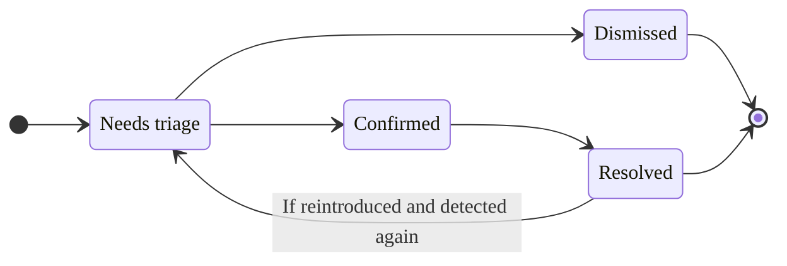



- プラン: Ultimate
- 提供形態: GitLab.com、GitLab Self-Managed、GitLab Dedicated



プロジェクト内の各脆弱性には、脆弱性の詳細を含むページがあります:

- 説明
- 検出された時期
- 現在のステータス
- 利用可能なアクション
- リンクされたイシュー
- アクションログ
- 場所
- 重大度

共通脆弱性識別子（[CVE](https://www.cve.org/)）カタログの脆弱性の場合、これらの詳細には以下も含まれます:

- CVSSスコア
- [EPSSスコア](risk_assessment_data.md#epss)
- [KEVステータス](risk_assessment_data.md#kev)
- [到達可能性ステータス](../dependency_scanning/static_reachability.md)（限定提供）

この追加データの詳細については、[脆弱性リスク評価データ](risk_assessment_data.md)を参照してください。

スキャナーが脆弱性を誤検出と判断した場合、脆弱性のページの上部にアラートメッセージが表示されます。

SASTによって検出された脆弱性の場合、GitLab Duoはそれらを自動的に分析し、コンテキスト認識型コードの修正を含むマージリクエストを生成できます。詳細については、[エージェント型SAST脆弱性の修正](agentic_vulnerability_resolution.md)を参照してください。

## シークレット誤検出判定 {#secret-false-positive-detection}



- プラン: Ultimate
- アドオン: GitLab Duo Core、Pro、またはEnterprise
- 提供形態: GitLab.com、GitLab Self-Managed、GitLab Dedicated
- ステータス: ベータ版





- GitLab 18.10の[エピック17885](https://gitlab.com/groups/gitlab-org/-/work_items/20152)で、`duo_secret_detection_false_positive`[機能フラグ](../../../administration/feature_flags/_index.md)とともに[ベータ](../../../policy/development_stages_support.md#beta)機能として導入されました。[GitLab.com、GitLab Self-Managed、およびGitLab Dedicatedで有効になりました。](https://gitlab.com/gitlab-org/gitlab/-/merge_requests/227074)



GitLab Duoは、シークレット検出の検出結果を自動的に分析し、潜在的な誤検出を特定します。誤検出を無視することで、実際のセキュリティリスクではない可能性のある検出結果にフラグを立てて、脆弱性レポート内のノイズを減らします。

分析された各脆弱性について、GitLab Duoは次の情報を提供します:

- 評価が正しい可能性を示す信頼度スコア。
- 検出結果が正しい可能性がある、または正しくない可能性がある理由の説明。
- 潜在的な誤検出として脆弱性が特定されたことを脆弱性レポートに示す視覚的インジケーター。

詳細については、[シークレット誤検出判定](secret_false_positive_detection.md)を参照してください。

## 脆弱性の修正 {#vulnerability-resolution}



- プラン: Ultimate
- アドオン: GitLab Duo Enterprise、GitLab Duo with Amazon Q
- 提供形態: GitLab.com、GitLab Self-Managed、GitLab Dedicated





- [デフォルトLLM](../../gitlab_duo/model_selection.md#default-models)
- Amazon QのLLM: Amazon Q Developer
- [セルフホストモデル対応のGitLab Duo](../../../administration/gitlab_duo_self_hosted/_index.md)で利用できます





- GitLab 16.7のGitLab.comで[実験的機能](../../../policy/development_stages_support.md#experiment)として[導入](https://gitlab.com/groups/gitlab-org/-/epics/10779)されました。
- GitLab 17.3でベータ版に変更されました。
- GitLab 17.6以降、GitLab Duoアドオンが必須になりました。



GitLab Duo脆弱性の修正を使用して、脆弱性を解決するマージリクエストを自動的に作成します。デフォルトでは、Anthropic [`claude-3.5-sonnet`](https://console.cloud.google.com/vertex-ai/publishers/anthropic/model-garden/claude-3-5-sonnet)モデルを基盤としています。

GitLabは、大規模言語モデルが正しい結果を生成することを保証できません。提案された変更をマージする前に、必ずレビューする必要があります。レビューする際は、以下を確認してください:

- アプリケーションの既存の機能が維持されていること。
- その脆弱性が、組織の標準に従って解決されていること。

<i class="fa-youtube-play" aria-hidden="true"></i> [概要を見る](https://www.youtube.com/watch?v=VJmsw_C125E&list=PLFGfElNsQthZGazU1ZdfDpegu0HflunXW)

前提条件: 

- GitLab UltimateサブスクリプションプランとGitLab Duo Enterpriseが必要です。
- プロジェクトのメンバーである必要があります。
- 脆弱性は、サポートされているアナライザーからのSAST検出結果である必要があります:
  - [GitLabがサポートする任意のアナライザー](../sast/analyzers.md)。
  - 脆弱性ごとに脆弱性の場所とCWE識別子を報告する、適切に統合されたサードパーティのSASTスキャナー。
- 脆弱性は、[サポートされているタイプ](#supported-vulnerabilities-for-vulnerability-resolution)である必要があります。

[すべてのGitLab Duo機能を有効にする方法](../../gitlab_duo/turn_on_off.md)の詳細をご覧ください。

この脆弱性を解決するには:

1. 上部のバーで、**検索または移動先**を選択して、プロジェクトを見つけます。
1. 左側のサイドバーで、**セキュリティ** > **脆弱性レポート**を選択します。
1. オプション。デフォルトのフィルターを削除するには、**クリア**（）を選択します。
1. 脆弱性のリストの上にある、フィルターバーを選択します。
1. 表示されるドロップダウンリストで、**アクティビティ**を選択し、**GitLab Duo（AI）**カテゴリの**脆弱性の修正は利用可能**を選択します。
1. フィルターフィールドの外側を選択します。脆弱性の重大度の合計と、一致する脆弱性のリストが更新されます。
1. 解決するSAST脆弱性を選択します。
   - 青色のアイコンは、脆弱性の修正の対象となる脆弱性の横に表示されます。
1. 右上隅で、**AIを使用して解決する**を選択します。このプロジェクトが公開プロジェクトである場合は、MRを作成すると、脆弱性と提供された解決策が公開されることに注意してください。MRを非公開で作成するには、[非公開フォークを作成](../../project/merge_requests/confidential.md)し、このプロセスを繰り返します。
1. MRにコミットをもう1つ追加します。これにより、新しいパイプラインが強制的に実行されます。
1. パイプラインが完了したら、[パイプラインのセキュリティタブ](../detect/security_scanning_results.md)で、脆弱性が表示されなくなったことを確認します。
1. 脆弱性レポートで、[脆弱性を手動で更新](../vulnerability_report/_index.md#change-status-of-vulnerabilities)します。

AIによる修正の提案を含むマージリクエストが開きます。提案された変更をレビューし、標準のワークフローに従ってマージリクエストを処理します。

[イシュー476553](https://gitlab.com/gitlab-org/gitlab/-/issues/476553)で、この機能に関するフィードバックをお寄せください。

### 脆弱性の修正でサポートされている脆弱性 {#supported-vulnerabilities-for-vulnerability-resolution}

提案される解決策の品質を確保するため、脆弱性の修正は特定の脆弱性に限定して提供されています。脆弱性の修正を提供するかどうかは、当該脆弱性のCommon Weakness Enumeration（CWE）識別子に基づいてシステムが判断します。

現在の脆弱性セットは、自動システムとセキュリティ専門家によるテストに基づいて選択されます。GitLabは、より多くの種類の脆弱性にカバレッジを拡大するために積極的に取り組んでいます。

<details><summary style="color:#5943b6; margin-top: 1em;"><a>脆弱性の修正でサポートされているCWEの完全なリストを表示する</a></summary>

<ul>
  <li>CWE-23: 相対パストラバーサル</li>
  <li>CWE-73: ファイル名またはパスの外部制御</li>
  <li>CWE-78: OSコマンドで使用される特殊要素の不適切な無害化（「OSコマンドインジェクション」）</li>
  <li>CWE-80: Webページのスクリプト関連HTMLタグの不適切な無害化（基本XSS）</li>
  <li>CWE-89: SQLコマンドで使用される特殊要素の不適切な無害化（「SQLインジェクション」）</li>
  <li>CWE-116: 出力の不適切なエンコードまたはエスケープ</li>
  <li>CWE-118: インデックス可能なリソースの不正なアクセス（「範囲エラー」）</li>
  <li>CWE-119: メモリバッファの範囲内における操作の不適切な制限</li>
  <li>CWE-120: 入力サイズのチェックなしのバッファコピー（「従来型バッファオーバーフロー」）</li>
  <li>CWE-126: バッファオーバーリード</li>
  <li>CWE-190: 整数のオーバーフローまたはラップアラウンド</li>
  <li>CWE-200: 権限のないアクターへの機密情報の公開</li>
  <li>CWE-208: 観測可能なタイミングのずれ</li>
  <li>CWE-209: 機密情報を含むエラーメッセージの生成</li>
  <li>CWE-272: 最小権限の原則の違反</li>
  <li>CWE-287: 不適切な認証</li>
  <li>CWE-295: 証明書の不適切な検証</li>
  <li>CWE-297: ホストの不一致を伴う証明書の不適切な検証</li>
  <li>CWE-305: 根本の脆弱性による認証回避</li>
  <li>CWE-310: 暗号学的な問題</li>
  <li>CWE-311: 機密情報の暗号化の欠落</li>
  <li>CWE-323: 暗号化におけるノンスやキーペアの再利用</li>
  <li>CWE-327: 破損した、または危険な暗号アルゴリズムの使用</li>
  <li>CWE-328: 脆弱なハッシュの使用</li>
  <li>CWE-330: 不十分にランダムな値の使用</li>
  <li>CWE-338: 暗号学的に脆弱な擬似乱数ジェネレーター（PRNG）の使用</li>
  <li>CWE-345: データ真正性の不十分な検証</li>
  <li>CWE-346: オリジン検証エラー</li>
  <li>CWE-352: クロスサイトリクエストフォージェリ</li>
  <li>CWE-362: 不適切な同期を伴う共有リソースを使用した同時実行（「競合状態」）</li>
  <li>CWE-369: ゼロ除算</li>
  <li>CWE-377: 脆弱な一時ファイル</li>
  <li>CWE-378: 脆弱な権限を持つ一時ファイルの作成</li>
  <li>CWE-400: 制御されていないリソース消費</li>
  <li>CWE-489: アクティブなデバッグコード</li>
  <li>CWE-521: 脆弱なパスワード要件</li>
  <li>CWE-539: 機密情報を含む永続的なCookieの使用</li>
  <li>CWE-599: OpenSSL証明書の検証の欠落</li>
  <li>CWE-611: XML外部エンティティ参照の不適切な制限</li>
  <li>CWE-676: 潜在的に危険な関数の使用</li>
  <li>CWE-704: 不正な型変換またはキャスト</li>
  <li>CWE-754: 異常または例外的な条件の不適切なチェック</li>
  <li>CWE-770: 制限またはスロットリングなしのリソースの割り当て</li>
  <li>CWE-1004: 「HttpOnly」フラグのない機密Cookie</li>
  <li>CWE-1275: 不適切なSameSite属性を持つ機密Cookie</li>
</ul>
</details>

### トラブルシューティング {#troubleshooting}

脆弱性の修正では、提案された修正を生成できない場合があります。一般的な原因は次のとおりです:

- 誤検出と判定された: 
  - 修正を提案する前に、AIモデルはその脆弱性が有効かどうかを評価します。その脆弱性が真の脆弱性ではない、または修正する価値がないと判定する場合があります。
  - これは、脆弱性がテストコード内で発生している場合に起こることがあります。テストコード内であっても脆弱性を修正する方針を取る組織もありますが、モデルによってはそれらを誤検出と判定する場合があります。
  - その脆弱性が誤検出である、または修正する価値がないことに同意する場合は、[脆弱性を却下](#vulnerability-status-values)して、[該当する理由を選択](#vulnerability-dismissal-reasons)する必要があります。
    - SAST設定をカスタマイズする、またはGitLab SASTルールに関する問題を報告するには、[SASTルール](../sast/rules.md)を参照してください。
- 一時的または予期しないエラー: 
  - エラーメッセージには、`an unexpected error has occurred`、`the upstream AI provider request timed out`、`something went wrong`、または同様の原因が記載されている場合があります。
  - これらのエラーは、AIプロバイダーまたはGitLab Duoの一時的な問題が原因である可能性があります。
  - 新しいリクエストが成功する可能性があるため、脆弱性の解決をもう一度試すことができます。
  - これらのエラーが引き続き表示される場合は、GitLabにお問い合わせください。

### 脆弱性の修正のためにサードパーティのAI APIと共有されるデータ {#data-shared-with-third-party-ai-apis-for-vulnerability-resolution}

次のデータは、サードパーティのAI APIと共有されます:

- 脆弱性名
- 脆弱性の説明
- 識別子（CWE、OWASP）
- 脆弱なコード行を含むファイル全体
- 脆弱なコード行（行番号）

## 脆弱性の修正がマージリクエストに含まれる場合 {#vulnerability-resolution-in-a-merge-request}



- プラン: Ultimate
- アドオン: GitLab Duo Enterprise
- 提供形態: GitLab.com、GitLab Self-Managed、GitLab Dedicated





- GitLab 17.6で[導入](https://gitlab.com/groups/gitlab-org/-/epics/14862)されました。
- GitLab 17.7で[デフォルトで有効](https://gitlab.com/gitlab-org/gitlab/-/merge_requests/175150)になりました。
- GitLab 17.11で[一般提供](https://gitlab.com/gitlab-org/gitlab/-/merge_requests/185452)になりました。機能フラグ`resolve_vulnerability_in_mr`は削除されました。



GitLab Duo脆弱性の修正を使用して、検出された脆弱性を解決するマージリクエストの提案コメントを自動的に作成します。デフォルトでは、Anthropic [`claude-3.5-sonnet`](https://console.cloud.google.com/vertex-ai/publishers/anthropic/model-garden/claude-3-5-sonnet)モデルを基盤としています。

検出された脆弱性を解決するには:

1. 上部のバーで、**検索または移動先**を選択して、プロジェクトを見つけます。
1. 左側のサイドバーで、**コード** > **マージリクエスト**を選択します。
1. マージリクエストを選択します。
   - 脆弱性の修正で対応可能な脆弱性の検出結果は、タヌキAIアイコン（）で示されます。
1. 対応可能な検出結果を選択して、セキュリティ検出結果ダイアログを開きます。
1. 右下隅で、**AIを使用して解決する**を選択します。

AIによる修正の提案を含むコメントがマージリクエストで開きます。提案された変更をレビューし、標準のワークフローに従ってマージリクエストの提案を適用します。

[イシュー476553](https://gitlab.com/gitlab-org/gitlab/-/issues/476553)で、この機能に関するフィードバックをお寄せください。

### トラブルシューティング {#troubleshooting-1}

マージリクエストでの脆弱性の修正が、提案された修正を生成できない場合があります。一般的な原因は次のとおりです:

- 誤検出と判定された: 
  - 修正を提案する前に、AIモデルはその脆弱性が有効かどうかを評価します。その脆弱性が真の脆弱性ではない、または修正する価値がないと判定する場合があります。
  - これは、脆弱性がテストコード内で発生している場合に起こることがあります。テストコード内であっても脆弱性を修正する方針を取る組織もありますが、モデルによってはそれらを誤検出と判定する場合があります。
  - その脆弱性が誤検出である、または修正する価値がないことに同意する場合は、[脆弱性を却下](#vulnerability-status-values)して、[該当する理由を選択](#vulnerability-dismissal-reasons)する必要があります。
    - SAST設定をカスタマイズする、またはGitLab SASTルールに関する問題を報告するには、[SASTルール](../sast/rules.md)を参照してください。
- 一時的または予期しないエラー: 
  - エラーメッセージには、`an unexpected error has occurred`、`the upstream AI provider request timed out`、`something went wrong`、または同様の原因が記載されている場合があります。
  - これらのエラーは、AIプロバイダーまたはGitLab Duoの一時的な問題が原因である可能性があります。
  - 新しいリクエストが成功する可能性があるため、脆弱性の解決をもう一度試すことができます。
  - これらのエラーが引き続き表示される場合は、GitLabにお問い合わせください。
- `Resolution target could not be found in the merge request, unable to create suggestion`エラー:
  - このエラーは、ターゲットブランチで完全なセキュリティスキャンパイプラインが実行されていない場合に発生することがあります。[マージリクエストドキュメント](../detect/security_scanning_results.md)を参照してください。

## 脆弱性コードフロー {#vulnerability-code-flow}



- プラン: Ultimate
- 提供形態: GitLab.com、GitLab Self-Managed、GitLab Dedicated



特定の種類の脆弱性については、GitLab高度なSASTが[コードフロー](../sast/gitlab_advanced_sast.md#code-flow)情報を提供します。脆弱性のコードフローとは、データが、すべての割り当て、操作、サニタイズを通じて、ユーザー入力（ソース）から脆弱なコード行（シンク）に至るまでの間でたどるパスです。

脆弱性のコードフローの表示方法の詳細については、[脆弱性コードフロー](../sast/gitlab_advanced_sast.md#code-flow)を参照してください。


## 脆弱性ステータス値 {#vulnerability-status-values}

脆弱性のステータスは次のとおりです:

- **トリアージが必要**: 新しく検出された脆弱性のデフォルトの状態。
- **確認済み**: ユーザーがこの脆弱性を確認し、正確であることを承認しました。
- **却下**: ユーザーがこの脆弱性を評価し、[無視しました](#vulnerability-dismissal-reasons)。却下された脆弱性は、その後のスキャンで検出されても無視されます。
- **解決済み**: この脆弱性は修正されたか、もはや存在しません。解決済みの脆弱性が再導入され、再び検出された場合、その記録は復活し、ステータスは**トリアージが必要**に設定されます。

脆弱性は通常、次のライフサイクルを経ます:



## 脆弱性が検出されませんでした {#vulnerability-is-no-longer-detected}



- 解決する脆弱性へのコミットへのリンクが[導入](https://gitlab.com/gitlab-org/gitlab/-/issues/372799)され、GitLab 17.9で[GitLab Self-ManagedおよびGitLab Dedicatedで一般提供](https://gitlab.com/gitlab-org/gitlab/-/merge_requests/178748)されました。機能フラグ`vulnerability_representation_information`は削除されました。



脆弱性は、意図的に修正するために行われた変更、またはその他の変更の副次的な影響により、検出されなくなる場合があります。セキュリティスキャンが実行され、デフォルトブランチで脆弱性が検出されなくなった場合、スキャナーは記録のアクティビティログに**検出されませんでした**を追加しますが、記録のステータスは変更されません。代わりに、脆弱性が解決されたことを確認し、その場合は、[手動でそのステータスを**解決済み**に変更](#change-the-status-of-a-vulnerability)する必要があります。また、[脆弱性管理ポリシー](../policies/vulnerability_management_policy.md)を使用して、特定の条件に一致する脆弱性のステータスを自動的に**解決済み**に変更することもできます。

解決された脆弱性へのコミットへのリンクは、脆弱性ページの上部または下部で見つけることができます。

## 脆弱性の却下理由 {#vulnerability-dismissal-reasons}



- GitLab 15.11で`dismissal_reason`[フラグ](../../../administration/feature_flags/_index.md)とともに[導入](https://gitlab.com/groups/gitlab-org/-/epics/4942)されました。
- GitLab 16.0で[GitLab Self-ManagedおよびGitLab Dedicatedで有効](https://gitlab.com/gitlab-org/gitlab/-/issues/393005)になりました。
- GitLab 16.2で[一般提供](https://gitlab.com/gitlab-org/gitlab/-/merge_requests/124397)になりました。機能フラグ`dismissal_reason`は削除されました。



脆弱性を無視する際は、次のいずれかの理由を選択する必要があります:

- **許容可能なリスク**: 脆弱性は既知であり、修正も軽減もされていませんが、許容できるビジネスリスクと見なされます。
- **誤検出**: 実際には脆弱性が存在しないのに、誤ってシステムに脆弱性が存在するというテスト結果を示すレポートのエラー。
- **影響の軽減制御**: 脆弱性のリスクは、情報システムに対して同等または比較可能な保護を提供する組織が採用する、管理、運用、または技術的な制御（つまり、保護策または対抗策）によって軽減されます。
- **テストでの使用**: 検出結果はテストの一部またはテストデータであるため、脆弱性ではありません。
- **該当するものがありません**: 脆弱性は既知であり、修正も軽減もされていませんが、更新されないアプリケーションの一部に含まれていると見なされています。

## 脆弱性のステータスの変更 {#change-the-status-of-a-vulnerability}



- `Developer`ロールを持つユーザーが脆弱性のステータス（`admin_vulnerability`）を変更する権限は、GitLab 16.4で[非推奨](https://gitlab.com/gitlab-org/gitlab/-/issues/424133)となり、GitLab 17.0で[削除](https://gitlab.com/gitlab-org/gitlab/-/issues/412693)されました。
- **コメント**テキストボックスはGitLab 17.9で[追加](https://gitlab.com/gitlab-org/gitlab/-/issues/451480)されました。



前提条件: 

- プロジェクトのセキュリティマネージャー、メンテナー、またはオーナーのロール、あるいは`admin_vulnerability`権限を持つカスタムロールが必要です。

脆弱性ページから脆弱性のステータスを変更するには:

1. 上部のバーで、**検索または移動先**を選択して、プロジェクトを見つけます。
1. 左側のサイドバーで、**セキュリティ** > **脆弱性レポート**を選択します。
1. 脆弱性の説明を選択します。
1. **ステータスを変更**を選択します。
1. **ステータス**ドロップダウンリストから、脆弱性のステータスを**却下**に変更したい場合は、ステータスまたは[却下理由](#vulnerability-dismissal-reasons)を選択します。
1. **コメント**テキストボックスに、却下の理由に関する詳細を記述します。**却下**のステータスを適用する場合、コメントが必要です。

変更者と変更時期を含むステータス変更の詳細は、脆弱性のアクションログに記録されます。

## 脆弱性のGitLabイシューを作成 {#create-a-gitlab-issue-for-a-vulnerability}

脆弱性を解決する、または軽減するために実行されたアクションを追跡するGitLabイシューを作成できます。脆弱性のGitLabイシューを作成するには:

1. 上部のバーで、**検索または移動先**を選択して、プロジェクトを見つけます。
1. 左側のサイドバーで、**セキュリティ** > **脆弱性レポート**を選択します。
1. 脆弱性の説明を選択します。
1. **イシューを作成**を選択します。

このイシューは、脆弱性レポートからの情報と共にGitLabプロジェクトに作成されます。

Jiraイシューを作成するには、[脆弱性のJiraイシューを作成](../../../integration/jira/configure.md#create-a-jira-issue-for-a-vulnerability)を参照してください。

## 脆弱性をGitLabおよびJiraイシューにリンクする {#linking-a-vulnerability-to-gitlab-and-jira-issues}

脆弱性を、1つまたは複数の既存の[GitLab](#create-a-gitlab-issue-for-a-vulnerability)または[Jira](../../../integration/jira/configure.md#create-a-jira-issue-for-a-vulnerability)イシューにリンクできます。一度に利用できるリンク機能は1つだけです。リンクを追加すると、脆弱性を解決するまたは軽減するイシューを追跡するのに役立ちます。

### 脆弱性を既存のGitLabイシューにリンクする {#link-a-vulnerability-to-existing-gitlab-issues}

前提条件: 

- [Jiraイシューのインテグレーション](../../../integration/jira/configure.md)が有効になっていてはいけません。

脆弱性を既存のGitLabイシューにリンクするには:

1. 上部のバーで、**検索または移動先**を選択して、プロジェクトを見つけます。
1. 左側のサイドバーで、**セキュリティ** > **脆弱性レポート**を選択します。
1. 脆弱性の説明を選択します。
1. **Linked issues**セクションで、プラスアイコン（）を選択します。
1. リンクする各イシューについて、次のいずれかを実行します:
   - イシューへのリンクを貼り付けます。
   - イシューのID（ハッシュ`#`で始まる）を入力します。
1. **追加**を選択します。

選択したGitLabイシューが**リンクされたアイテム**セクションに追加され、リンクされたイシューのカウンターが更新されます。

脆弱性にリンクされたGitLabイシューは、脆弱性レポートおよび脆弱性のページに表示されます。

脆弱性とリンクされたGitLabイシュー間の次の条件に注意してください:

- 脆弱性ページには関連するイシューが表示されますが、イシューページには関連する脆弱性は表示されません。
- 1つのイシューは一度に1つの脆弱性にのみ関連付けることができます。
- イシューはグループおよびプロジェクト間でリンクできます。

### 脆弱性を既存のJiraイシューにリンクする {#link-a-vulnerability-to-existing-jira-issues}

前提条件: 

- Jiraイシューのインテグレーションが[設定](../../../integration/jira/configure.md#configure-the-integration)され、**脆弱性のJiraイシューを作成する**チェックボックスがオンになっていることを確認してください。

脆弱性を既存のJiraイシューにリンクするには、Jiraイシューの説明に次の行を追加します:

```plaintext
/-/security/vulnerabilities/<id>
```

`<id>`は任意の[脆弱性ID](../../../api/vulnerabilities.md#retrieve-a-vulnerability)です。異なるIDを持つ複数の行を1つの説明に追加できます。

適切な説明が記載されたJiraイシューは、**関連するJiraイシュー**セクションに追加され、リンクされたイシューカウンターが更新されます。

脆弱性にリンクされたJiraイシューは、脆弱性ページにのみ表示されます。

脆弱性とリンクされたJiraイシュー間の次の条件に注意してください:

- 脆弱性ページとイシューページには、関連する脆弱性が表示されます。
- 1つのイシューは、一度に1つ以上の脆弱性に関連付けることができます。

## 脆弱性を解決する {#resolve-a-vulnerability}

一部の脆弱性については、解決策はすでに知られていますが、手動で実装する必要があります。脆弱性ページの**解決策**フィールドは、セキュリティスキャンツールによって報告されたセキュリティ検出結果によって提供されるか、[脆弱性の手動作成](../vulnerability_report/_index.md#manually-add-a-vulnerability)中に入力されます。GitLabツールは、[GitLabアドバイザリデータベース](../gitlab_advisory_database/_index.md)からの情報を利用します。

さらに、一部のツールには、提案された解決策を適用するためのソフトウェアパッチが含まれている場合があります。そのような場合、脆弱性のページには**マージリクエストで解決**オプションが含まれています。

この機能は以下のスキャナーをサポートしています:

- [依存関係スキャン](../dependency_scanning/_index.md)。自動パッチ作成は、`yarn`で管理されているNode.jsプロジェクトでのみ利用可能です。自動パッチ作成は、[FIPSモード](../../../development/fips_gitlab.md#enable-fips-mode)が無効になっている場合にのみサポートされます。

- [コンテナスキャン](../container_scanning/_index.md)。

脆弱性を解決するには、次のいずれかの方法があります:

- [マージリクエストで脆弱性を解決する](#resolve-a-vulnerability-with-a-merge-request)。
- [手動で脆弱性を解決する](#resolve-a-vulnerability-manually)。

### マージリクエストで脆弱性を解決する {#resolve-a-vulnerability-with-a-merge-request}

マージリクエストで脆弱性を解決するには:

1. 上部のバーで、**検索または移動先**を選択して、プロジェクトを見つけます。
1. 左側のサイドバーで、**セキュリティ** > **脆弱性レポート**を選択します。
1. 脆弱性の説明を選択します。
1. **マージリクエストで解決**ドロップダウンリストから、**マージリクエストで解決**を選択します。

脆弱性を解決するために必要なパッチを適用するマージリクエストが作成されます。標準ワークフローに従ってマージリクエストを処理します。

### 手動で脆弱性を解決する {#resolve-a-vulnerability-manually}

GitLabが生成した脆弱性用のパッチを手動で適用するには:

1. 上部のバーで、**検索または移動先**を選択して、プロジェクトを見つけます。
1. 左側のサイドバーで、**セキュリティ** > **脆弱性レポート**を選択します。
1. 脆弱性の説明を選択します。
1. **マージリクエストで解決**ドロップダウンリストから、**解決するためのパッチのダウンロード**を選択します。
1. ローカルプロジェクトに、パッチを生成するために使用されたものと同じコミットがチェックアウトされていることを確認します。
1. `git apply remediation.patch`を実行します。
1. 変更を検証し、ブランチにコミットします。
1. 変更をmainブランチに適用するためのマージリクエストを作成します。
1. 標準ワークフローに従ってマージリクエストを処理します。

## 脆弱性のセキュリティトレーニングを有効にする {#enable-security-training-for-vulnerabilities}

> [!note]
> セキュリティトレーニングは、オフライン環境、つまりセキュリティ対策としてパブリックインターネットから隔離されたコンピューターではアクセスできません。具体的には、GitLabサーバーは、有効にすることを選択したトレーニングプロバイダーのAPIエンドポイントをクエリする機能が必要です。一部のサードパーティトレーニングベンダーでは、無料アカウントへのサインアップが必要になる場合があります。いずれかの[Secure Code Warrior](https://www.securecodewarrior.com/)、[Kontra](https://application.security/)、または[SecureFlag](https://www.secureflag.com/index.html)にアクセスしてアカウントにサインアップしてください。GitLabはユーザー情報をこれらのサードパーティベンダーに送信しません。GitLabはCWEまたはOWASPの識別子とファイル拡張子の言語名を送信します。

セキュリティトレーニングは、開発者が脆弱性を修正する方法を学ぶのに役立ちます。開発者は、検出された脆弱性に関連する、選択された教育プロバイダーからのセキュリティトレーニングを表示できます。

プロジェクトで脆弱性のセキュリティトレーニングを有効にするには:

1. 上部のバーで、**検索または移動先**を選択して、プロジェクトを見つけます。
1. 左側のサイドバーで、**セキュリティ** > **セキュリティ設定**を選択します。
1. タブバーで、**脆弱性管理**を選択します。
1. セキュリティトレーニングプロバイダーを有効にするには、切替をオンにします。

各インテグレーションは、脆弱性識別子（例: CWEまたはOWASP）と言語をセキュリティトレーニングベンダーに送信します。ベンダートレーニングへの結果のリンクは、GitLab脆弱性に表示されるものです。

## 脆弱性のセキュリティトレーニングを表示する {#view-security-training-for-a-vulnerability}

セキュリティトレーニングが有効になっている場合、脆弱性ページには、検出された脆弱性に関連するトレーニングリンクが含まれる場合があります。トレーニングの利用可能性は、有効なトレーニングベンダーが特定の脆弱性に一致するコンテンツを持っているかどうかによって異なります。トレーニングコンテンツは、脆弱性識別子に基づいてリクエストされます。脆弱性に与えられる識別子は脆弱性ごとに異なり、利用可能なトレーニングコンテンツはベンダーによって異なります。一部の脆弱性ではトレーニングコンテンツが表示されません。CWEを持つ脆弱性は、トレーニング結果を返す可能性が最も高くなります。

脆弱性のセキュリティトレーニングを表示するには:

1. 上部のバーで、**検索または移動先**を選択して、プロジェクトを見つけます。
1. 左側のサイドバーで、**セキュリティ** > **脆弱性レポート**を選択します。
1. セキュリティトレーニングを表示したい脆弱性を選択します。
1. **トレーニングを表示**を選択します。

## 脆弱性のロケーションを推移的依存関係で表示する {#view-the-location-of-a-vulnerability-in-transitive-dependencies}



- 依存パス表示オプションがGitLab 17.11で[導入](https://gitlab.com/gitlab-org/gitlab/-/issues/519965)され、`dependency_paths`という名前の[フラグ付き](../../../administration/feature_flags/_index.md)で提供されました。デフォルトでは無効になっています。
- 依存パス表示オプションはGitLab 18.2で[一般提供](https://gitlab.com/gitlab-org/gitlab/-/merge_requests/197224)されました。機能フラグ`dependency_paths`はデフォルトで有効です。



> [!flag]
> この機能の利用可否は、機能フラグによって制御されます。詳細については、履歴を参照してください。

脆弱性の詳細で依存関係に見つかった脆弱性を管理する場合、**ロケーション**の下で以下を表示できます:

- 脆弱性が見つかった直接の依存関係のロケーション。
- 利用可能な場合、脆弱性が発生する特定の行番号。

脆弱性が1つ以上の推移的依存関係で発生する場合、直接の依存関係だけを知っていても十分ではない場合があります。推移的依存関係は、直接の依存関係を祖先として持つ間接的な依存関係です。

推移的依存関係が存在する場合、脆弱性を含む推移的依存関係を含むすべての依存関係へのパスを表示できます。

- 脆弱性の詳細ページで、**ロケーション**の下にある**依存関係パスを表示**を選択します。**依存関係パスを表示**が表示されない場合、推移的依存関係はありません。
