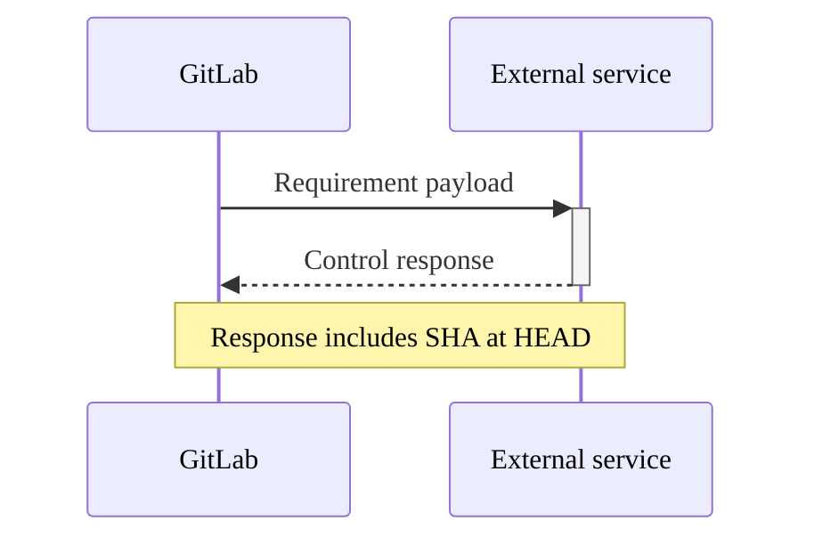



- プラン: Premium、Ultimate
- 提供形態: GitLab.com、GitLab Self-Managed、GitLab Dedicated



プロジェクトに特定のコンプライアンスフレームワーク要件があるか、追加の監視が必要であることを識別するためのラベルであるコンプライアンスフレームワークを作成できます。

Ultimateプランでは、コンプライアンスフレームワークは、適用されるプロジェクトに[コンプライアンスパイプライン設定](../compliance_pipelines.md)と[セキュリティポリシー](../../application_security/policies/enforcement/_index.md#scope)を任意で適用できます。

コンプライアンスフレームワークはトップレベルグループで作成されます。プロジェクトが既存のトップレベルグループの外部に移動された場合、そのフレームワークは削除されます。

各プロジェクトに最大20個のコンプライアンスフレームワークを適用できます。

クリックしてデモを見るには、[カスタムコンプライアンスフレームワーク](https://gitlab.navattic.com/custom-compliance)を参照してください。
<!-- Demo published on 2025-10-09 -->

## 前提条件 {#prerequisites}

- コンプライアンスフレームワークを作成、編集、削除するには、ユーザーは次のいずれかの権限が必要です:
  - トップレベルグループに対するオーナーまたはセキュリティマネージャーのロール。
  - [カスタムロール](../../custom_roles/_index.md)または`admin_compliance_framework`[カスタム権限](../../custom_roles/abilities.md#compliance-management)が割り当てられていること。
- プロジェクトにコンプライアンスフレームワークを追加または削除するには、プロジェクトが属するグループにコンプライアンスフレームワークが必要です。

## テンプレートからコンプライアンスフレームワークを作成する {#create-a-compliance-framework-from-a-template}



- プラン: Ultimate
- 提供形態: GitLab.com、GitLab Self-Managed、GitLab Dedicated





- GitLab 19.0で[導入され](https://gitlab.com/groups/gitlab-org/-/work_items/16808)、`compliance_framework_templates`という名前の[フラグで](../../../administration/feature_flags/_index.md)。デフォルトでは無効になっています。



> [!flag]
> この機能の利用可否は、機能フラグによって制御されます。詳細については、履歴を参照してください。

一からコンプライアンスフレームワークをビルドする代わりに、事前に定義されたすぐに使える（OOTB）テンプレートから作成できます。テンプレートには、一般的なコンプライアンス標準に準拠した事前設定済みの要件とコントロールが含まれているため、手動設定なしで迅速に開始できます。

次のテンプレートが利用可能です:

| テンプレート | 説明 |
|----------|-------------|
| CIS CSC v8.1 | Center for Internet Security Controls v8.1フレームワーク。基礎的、基礎的、および組織的なセキュリティコントロールをカバーします。 |
| CSA CCM v4 | Cloud Security Alliance Cloud Controls Matrix v4フレームワークは、クラウドセキュリティ保証のためのものです。 |
| Cyber Essentials | 英国政府が支援するCyber Essentialsスキームで、5つの主要な技術的コントロールをカバーします。 |
| DORA | 金融セクターのICTリスク管理のためのDigital Operational Resilience Actフレームワーク。 |
| FedRAMP High | 米国連邦クラウドサービス向けのFedRAMP Highベースライン。 |
| FedRAMP Low | 米国連邦クラウドサービス向けのFedRAMP Lowベースライン。 |
| FedRAMP Moderate | 米国連邦クラウドサービス向けのFedRAMP Moderateベースライン。 |
| IRAP Official | Australian Information Security Registered Assessors Program Official分類フレームワーク。 |
| IRAP Protected | Australian Information Security Registered Assessors Program Protected分類フレームワーク。 |
| IRAP Secret | Australian Information Security Registered Assessors Program Secret分類フレームワーク。 |
| IRAP Top Secret | Australian Information Security Registered Assessors Program Top Secret分類フレームワーク。 |
| ISMAP | 日本の情報システムセキュリティ管理評価プログラムフレームワーク。 |
| ISO 27001:2022 | 情報セキュリティ管理システムのための国際標準。 |
| NIS 2 | EUネットワーク情報セキュリティ指令2フレームワークは、重要インフラストラクチャのためのものです。 |
| NIST 800-171 Rev. 3 CMMC | NIST SP 800-171リビジョン3サイバーセキュリティ成熟度モデル認証フレームワーク。 |
| NIST SP 800-218 | NIST Secure Software Development Framework (SSDF) v1.1。 |
| NIST 800-53 Revision 5 | NIST SP 800-53 Rev. 5情報システム向けセキュリティおよびプライバシーコントロール。 |
| SOC 2 | システムおよび組織管理2フレームワークは、COSO原則にマッピングされた要件を持ち、脆弱性スキャン、アクセス制御、および変更管理をカバーします。 |
| TISAX | 自動車産業の情報セキュリティ要件のためのTrusted Information Security Assessment Exchangeフレームワーク。 |

### UIを使用してテンプレートからフレームワークを作成 {#create-a-framework-from-a-template-by-using-the-ui}

テンプレートからコンプライアンスフレームワークを作成するには:

1. 上部のバーで、**検索または移動先**を選択して、グループを見つけます。
1. 左のサイドバーで、**セキュリティ** > **コンプライアンスセンター**を選択します。
1. ページで、**フレームワーク**タブを選択します。
1. **新規フレームワーク**を選択します。
1. **テンプレートから作成**を選択します。
1. 利用可能なテンプレートを参照し、要件とコントロールをプレビューするために1つを選択します。
1. （オプション）オプション。**名前**、**説明**、または**色**を上書きして、フレームワークをカスタマイズします。
1. （オプション）オプション。これをグループのデフォルトフレームワークにするには、**デフォルトとして設定**を選択します。
1. **フレームワークの作成**を選択します。

フレームワークは、テンプレートから自動入力されたすべての要件とコントロールで作成されます。その後、必要に応じてフレームワークを編集し、要件を追加、削除、または変更できます。

APIベースの作成については、[テンプレートからコンプライアンスフレームワークを作成する](../../../api/graphql/compliance_frameworks.md#create-a-compliance-framework-from-a-template)を参照してください。

## コンプライアンスフレームワークをインポート {#import-a-compliance-framework}



- GitLab 17.11で[導入](https://gitlab.com/groups/gitlab-org/-/epics/16499)されました。



この機能により、共有またはバックアップされたコンプライアンスフレームワークを使用できます。JSONファイルは、既存のコンプライアンスフレームワークと同じ名前であってはなりません。

JSONテンプレートのライブラリは、[コンプライアンス遵守テンプレート](https://gitlab.com/gitlab-org/software-supply-chain-security/compliance/engineering/compliance-adherence-templates)プロジェクトから入手できます。これらの事前定義されたテンプレートは、完全なフレームワークを提供します。手動設定は不要で、迅速に開始できます。

### 事前定義されたコンプライアンスフレームワークをインポート {#import-a-predefined-compliance-framework}

事前にビルドされたコンプライアンスフレームワークをインポートするには:

1. [コンプライアンス遵守テンプレート](https://gitlab.com/gitlab-org/software-supply-chain-security/compliance/engineering/compliance-adherence-templates)プロジェクトに移動します。
1. 利用可能なフレームワークテンプレートを参照し、ご使用のフレームワーク用のJSONファイルをダウンロードします。
1. 上部のバーで、**検索または移動先**を選択して、グループを見つけます。
1. 左のサイドバーで、**セキュリティ** > **コンプライアンスセンター**を選択します。
1. ページで、**フレームワーク**タブを選択します。
1. **新規フレームワーク**を選択します。
1. **フレームワークのインポート**を選択します。
1. 表示されるダイアログで、ローカルシステムからJSONファイルを選択します。
1. インポートが成功すると、新しいコンプライアンスフレームワークがリストに表示されます。

フレームワークをプロジェクトに適用する準備ができました。[プロジェクトにコンプライアンスフレームワークを適用する](#apply-a-compliance-framework-to-a-project)を参照してください。

### JSONファイルからコンプライアンスフレームワークをインポート {#import-a-compliance-framework-from-a-json-file}

JSONテンプレートを使用してコンプライアンスフレームワークをインポートするには:

1. 上部のバーで、**検索または移動先**を選択して、グループを見つけます。
1. 左のサイドバーで、**セキュリティ** > **コンプライアンスセンター**を選択します。
1. ページで、**フレームワーク**タブを選択します。
1. **新規フレームワーク**を選択します。
1. **フレームワークのインポート**を選択します。
1. 表示されるダイアログで、ローカルシステムからJSONファイルを選択します。

インポートが成功すると、新しいコンプライアンスフレームワークがリストに表示されます。エラーがあれば修正のために表示されます。

## コンプライアンスフレームワークを作成、編集、または削除 {#create-edit-or-delete-a-compliance-framework}

コンプライアンスフレームワークレポートまたはコンプライアンスプロジェクトレポートのいずれかを使用して、コンプライアンスフレームワークを作成、編集、または削除できます。

コンプライアンスフレームワークレポートの使用方法の詳細については、以下を参照してください:

- [新しいコンプライアンスフレームワークを作成](../compliance_center/compliance_frameworks_report.md#create-a-new-compliance-framework)。
- [コンプライアンスフレームワークを編集](../compliance_center/compliance_frameworks_report.md#edit-a-compliance-framework)。
- [コンプライアンスフレームワークを削除](../compliance_center/compliance_frameworks_report.md#delete-a-compliance-framework)。

コンプライアンスプロジェクトレポートの使用方法の詳細については、以下を参照してください:

- [新しいコンプライアンスフレームワークを作成](../compliance_center/compliance_projects_report.md#create-a-new-compliance-framework)。
- [コンプライアンスフレームワークを編集](../compliance_center/compliance_projects_report.md#edit-a-compliance-framework)。
- [コンプライアンスフレームワークを削除](../compliance_center/compliance_projects_report.md#delete-a-compliance-framework)。サブグループおよびプロジェクトは、トップレベルグループで作成されたすべてのコンプライアンスフレームワークにアクセスできます。ただし、サブグループまたはプロジェクトを使用してコンプライアンスフレームワークを作成、編集、または削除することはできません。プロジェクトのオーナーは、プロジェクトに適用するフレームワークを選択できます。

## プロジェクトにコンプライアンスフレームワークを適用 {#apply-a-compliance-framework-to-a-project}



- 複数のコンプライアンスフレームワークの適用はGitLab 17.3で[導入](https://gitlab.com/groups/gitlab-org/-/epics/13294)されました。
- コンプライアンスフレームワークを介してプロジェクトにコンプライアンスフレームワークを適用する機能はGitLab 17.11で[導入](https://gitlab.com/groups/gitlab-org/-/epics/16747)されました。



複数のコンプライアンスフレームワークをプロジェクトに適用できますが、個人のネームスペース内のプロジェクトにはコンプライアンスフレームワークを適用できません。

プロジェクトにコンプライアンスフレームワークを適用するには、[コンプライアンスプロジェクトレポート](../compliance_center/compliance_projects_report.md#apply-a-compliance-framework-to-projects-in-a-group)を介してコンプライアンスフレームワークを適用します。

[GraphQL API](../../../api/graphql/reference/_index.md#mutationprojectupdatecomplianceframeworks)を使用して、1つまたは複数のコンプライアンスフレームワークをプロジェクトに適用できます。

GraphQLでサブグループにコンプライアンスフレームワークを作成する場合、ユーザーが正しい権限を持っていると、フレームワークはルート祖先に作成されます。GitLab UIは、この動作を推奨しないために読み取り専用のビューを表示します。

コンプライアンスフレームワークを介してプロジェクトにコンプライアンスフレームワークを適用するには:

1. 上部のバーで、**検索または移動先**を選択して、グループを見つけます。
1. 左のサイドバーで、**セキュリティ** > **コンプライアンスセンター**を選択します。
1. ページで、**プロジェクト**タブを選択します。
1. コンプライアンスフレームワークにカーソルを合わせ、**Edit Framework**タブを選択します。
1. **プロジェクト**セクションを選択します。
1. リストからプロジェクトを選択します。
1. **Update Framework**を選択します。

## デフォルトのコンプライアンスフレームワーク {#default-compliance-frameworks}



- GitLab 15.6で[導入](https://gitlab.com/gitlab-org/gitlab/-/issues/375036)されました。



グループのオーナーは、デフォルトのコンプライアンスフレームワークを設定できます。デフォルトフレームワークは、そのグループで作成されたすべての新規およびインポートされたプロジェクトに適用されます。既存のプロジェクトに適用されているフレームワークには影響しません。デフォルトフレームワークは削除できません。

デフォルトに設定されているコンプライアンスフレームワークには、`default`ラベルが付いています。

### コンプライアンスセンターを使用してデフォルトを設定および削除 {#set-and-remove-a-default-by-using-the-compliance-center}

[コンプライアンスプロジェクトレポート](../compliance_center/compliance_projects_report.md)からデフォルトとして設定（またはデフォルトを削除）するには:

1. 上部のバーで、**検索または移動先**を選択して、グループを見つけます。
1. 左のサイドバーで、**セキュリティ** > **コンプライアンスセンター**を選択します。
1. ページで、**プロジェクト**タブを選択します。
1. コンプライアンスフレームワークにカーソルを合わせ、**Edit Framework**タブを選択します。
1. **デフォルトとして設定**を選択します。
1. **変更を保存**を選択します。

[コンプライアンスフレームワークレポート](../compliance_center/compliance_frameworks_report.md)からデフォルトとして設定（またはデフォルトを削除）するには:

1. 上部のバーで、**検索または移動先**を選択して、グループを見つけます。
1. 左のサイドバーで、**セキュリティ** > **コンプライアンスセンター**を選択します。
1. ページで、**フレームワーク**タブを選択します。
1. コンプライアンスフレームワークにカーソルを合わせ、**Edit Framework**タブを選択します。
1. **デフォルトとして設定**を選択します。
1. **変更を保存**を選択します。

## プロジェクトからコンプライアンスフレームワークを削除 {#remove-a-compliance-framework-from-a-project}

グループ内の1つまたは複数のプロジェクトからコンプライアンスフレームワークを削除するには、[コンプライアンスプロジェクトレポート](../compliance_center/compliance_projects_report.md#remove-a-compliance-framework-from-projects-in-a-group)を介してコンプライアンスフレームワークを削除します。

## コンプライアンスフレームワークをJSONファイルとしてエクスポート {#export-a-compliance-framework-as-a-json-file}



- GitLab 17.11で[導入](https://gitlab.com/groups/gitlab-org/-/epics/16499)されました。



この機能により、コンプライアンスフレームワークを共有およびバックアップできます。

コンプライアンスセンターからコンプライアンスフレームワークをエクスポートするには:

1. 上部のバーで、**検索または移動先**を選択して、グループを見つけます。
1. 左のサイドバーで、**セキュリティ** > **コンプライアンスセンター**を選択します。
1. ページで、**フレームワーク**タブを選択します。
1. エクスポートしたいコンプライアンスフレームワークを見つけます。
1. 縦方向の省略記号 () を選択します。
1. **Export as JSON file**を選択します。

JSONファイルはローカルシステムにダウンロードされます。

### JSONテンプレートの構造とスキーマ {#json-template-structure-and-schema}

コンプライアンスフレームワークのJSONテンプレートは、フレームワークのメタデータ、要件、および関連するコントロールを定義する特定のスキーマ構造に従います。この構造を理解することで、組織の特定のコンプライアンスニーズを満たすためのカスタムテンプレートを作成したり、既存のテンプレートを修正したりするのに役立ちます。

#### フレームワークプロパティ {#framework-properties}

各JSONテンプレートには、次のトップレベルプロパティが含まれています:

| プロパティ | タイプ | 必須 | 説明 |
|----------|------|----------|-------------|
| `name` | 文字列 | はい | コンプライアンスフレームワークの表示名。 |
| `description` | 文字列 | はい | フレームワークの目的の詳細な説明。 |
| `color` | 文字列 | はい | フレームワークの16進数色コード（例: `#1f75cb`）。 |
| `requirements` | 配列 | いいえ | コンプライアンスコントロールを定義する要件オブジェクトの配列。 |

#### 要件の構造 {#requirements-structure}

`requirements`配列内の各要件には、以下が含まれます:

| プロパティ | タイプ | 必須 | 説明 |
|----------|------|----------|-------------|
| `name` | 文字列 | はい | コンプライアンス要件の名前。 |
| `description` | 文字列 | はい | 要件が強制する内容の詳細な説明。 |
| `controls` | 配列 | はい | 要件を実装するコントロールオブジェクトの配列。 |

#### コントロール構造 {#control-structure}

`controls`配列内の各コントロールは、特定のチェックを定義します:

| プロパティ | タイプ | 必須 | 説明 |
|----------|------|----------|-------------|
| `name` | 文字列 | はい | GitLabコントロールID（例: `scanner_sast_running`）。 |
| `control_type` | 文字列 | はい | GitLabコントロールでは常に`"internal"`。 |
| `expression` | オブジェクト | はい | コントロールの評価ロジックを定義します。 |

#### 式オブジェクト {#expression-object}

`expression`オブジェクトは、コントロールがどのように評価されるかを定義します:

| プロパティ | タイプ | 必須 | 説明 |
|----------|------|----------|-------------|
| `field` | 文字列 | はい | 評価するフィールド名（コントロール名と一致）。 |
| `operator` | 文字列 | はい | 比較演算子（`=`, `>=`, `<=`, `>`, `<`）。 |
| `value` | 混合 | はい | 予期される値（ブール値、数値、または文字列）。 |

#### JSONテンプレート構造の例 {#example-json-template-structure}

以下は、完全な構造を示す簡略化された例です:

```json
{
  "name": "Example Compliance Framework",
  "description": "Example framework demonstrating JSON structure",
  "color": "#1f75cb",
  "requirements": [
    {
      "name": "Security Scanning Requirement",
      "description": "Ensure security scanning is enabled for all projects",
      "controls": [
        {
          "name": "scanner_sast_running",
          "control_type": "internal",
          "expression": {
            "field": "scanner_sast_running",
            "operator": "=",
            "value": true
          }
        },
        {
          "name": "minimum_approvals_required_2",
          "control_type": "internal",
          "expression": {
            "field": "minimum_approvals_required",
            "operator": ">=",
            "value": 2
          }
        }
      ]
    }
  ]
}
```

## 要件 {#requirements}



- プラン: Ultimate
- 提供形態: GitLab.com、GitLab Self-Managed、GitLab Dedicated





- GitLab 17.11で`enable_standards_adherence_dashboard_v2`[フラグ](../../../administration/feature_flags/_index.md)とともに[導入](https://gitlab.com/gitlab-org/gitlab/-/merge_requests/186525)されました。デフォルトでは有効になっています。
- GitLab 18.3で[一般提供](https://gitlab.com/gitlab-org/gitlab/-/issues/535563)になりました。機能フラグ`enable_standards_adherence_dashboard_v2`は削除されました。



GitLab Ultimateでは、コンプライアンスフレームワークに特定の**requirements**を定義できます。要件は1つまたは複数のコントロールで構成されており、フレームワークが割り当てられたプロジェクトの設定または動作に対するチェックです。各要件には最大5つのコントロールがあります。

各コントロールには、GitLabがスケジュールされたスキャンまたはトリガーされたスキャン中にプロジェクトの順守状況を評価するために使用するロジックが含まれています。順守状況がどのように追跡されるかの詳細については、[コンプライアンスステータスレポート](../compliance_center/compliance_status_report.md)を参照してください。

フレームワーク要件には、GitLabコンプライアンスコントロールまたは外部コントロールを使用できます。

### GitLabコンプライアンスコントロール {#gitlab-compliance-controls}



- GitLab 18.7以降では、[セキュリティスキャナーコントロールは、パイプラインの成功を必要としなくなりました](https://gitlab.com/gitlab-org/gitlab/-/work_items/579849)。



GitLabコンプライアンスコントロールは、GitLabコンプライアンスフレームワークで使用できます。コントロールは、コンプライアンスフレームワークに割り当てられたプロジェクトの設定または動作に対するチェックです。

GitLabコンプライアンスコントロールを組み合わせて、[コンプライアンス標準](compliance_standards.md)を満たすのに役立てることができます。

> [!note]
> 実行中のスキャナーをチェックするセキュリティスキャナーコントロールは、[子パイプライン](../../../ci/pipelines/downstream_pipelines.md#parent-child-pipelines)で設定されたスキャナーを検出するのに失敗します。これらのコントロールがパスするには、親パイプラインでセキュリティスキャナーを設定する必要があります。詳細については、[イシュー595632](https://gitlab.com/gitlab-org/gitlab/-/work_items/595632)を参照してください。

<!-- Updates to control names must be reflected also in compliance_standards.md -->

| コントロール名                                             | コントロールID                                                 | 説明 |
|:---------------------------------------------------------|:-----------------------------------------------------------|:------------|
| APIセキュリティ実行中                                     | `scanner_api_security_running`                             | プロジェクトのデフォルトブランチパイプラインで[APIセキュリティスキャン](../../application_security/api_security/_index.md)が設定され、実行されていることを保証します。 |
| 少なくとも1つの承認                                    | `minimum_approvals_required_1`                             | マージリクエストがマージされる前に[少なくとも1つの承認を必要と](../../project/merge_requests/approvals/_index.md)することを保証します。 |
| 少なくとも2つの承認                                   | `minimum_approvals_required_2`                             | マージリクエストがマージされる前に[少なくとも2つの承認を必要と](../../project/merge_requests/approvals/_index.md)することを保証します。 |
| 認証SSOが有効                                         | `auth_sso_enabled`                                         | プロジェクトで[シングルサインオン（SSO）認証が有効になっていることを保証します。](../../group/saml_sso/_index.md) |
| 作成者が承認したマージリクエストは禁止されています               | `merge_request_prevent_author_approval`                    | マージリクエストの作成者が[自身の変更を承認できない](../../project/merge_requests/approvals/_index.md)ことを保証します。 |
| ブランチ削除無効                                 | `branch_deletion_disabled`                                 | [ブランチを削除できない](../../project/repository/branches/protected.md)ことを保証します。 |
| CI/CDジョブトークンスコープが有効                            | `cicd_job_token_scope_enabled`                             | [CI/CDジョブトークン](../../../ci/jobs/ci_job_token.md)のスコープ制限が有効になっていることを保証します。 |
| コードオーナーが必要なコード変更                         | `code_changes_requires_code_owners`                        | コード変更には、[コードオーナー](../../project/codeowners/_index.md)からの承認が必要であることを保証します。 |
| コードオーナー承認が必要                             | `code_owner_approval_required`                             | [コードオーナーファイル](../../project/codeowners/_index.md)が設定されていることを保証します。 |
| コード品質実行中                                     | `scanner_code_quality_running`                             | プロジェクトのデフォルトブランチパイプラインで[コード品質スキャン](../../../ci/testing/code_quality.md)が設定され、実行されていることを保証します。 |
| コミッターが承認したマージリクエストは禁止されています           | `merge_request_prevent_committers_approval`                | マージリクエストにコミットしたユーザーが[それを承認できない](../../project/merge_requests/approvals/_index.md)ことを保証します。 |
| コンテナスキャン実行中                               | `scanner_container_scanning_running`                       | プロジェクトのデフォルトブランチパイプラインで[コンテナスキャン](../../application_security/container_scanning/_index.md)が設定され、実行されていることを保証します。 |
| DAST実行中                                             | `scanner_dast_running`                                     | プロジェクトのデフォルトブランチパイプラインで[動的アプリケーションセキュリティテスト（DAST）](../../application_security/dast/_index.md)が設定され、実行されていることを保証します。 |
| デフォルトブランチが保護されています                                 | `default_branch_protected`                                 | デフォルトブランチで[保護ルール](../../project/repository/branches/protected.md)が有効になっていることを保証します。 |
| ダイレクトプッシュから保護されたデフォルトブランチ                | `default_branch_protected_from_direct_push`                | [デフォルトブランチへの直接プッシュを禁止](../../project/repository/branches/protected.md)します。 |
| デフォルトブランチユーザーはマージ可能                           | `default_branch_users_can_merge`                           | ユーザーが[デフォルトブランチに変更をマージできるかどうか](../../project/repository/branches/protected.md)を制御します。 |
| デフォルトブランチユーザーはプッシュ可能                            | `default_branch_users_can_push`                            | ユーザーが[デフォルトブランチに直接プッシュできるかどうか](../../project/repository/branches/protected.md)を制御します。 |
| 依存関係スキャン実行中                              | `scanner_dep_scanning_running`                             | プロジェクトのデフォルトブランチパイプラインで[依存関係スキャン](../../application_security/dependency_scanning/_index.md)が設定され、実行されていることを保証します。**注**: GitLab Self-Managedインスタンス（18.4以降）では、[SBOMベースの依存関係スキャン](../../application_security/dependency_scanning/dependency_scanning_sbom/_index.md)を使用する場合、アーティファクトの差違によりこのコントロールが失敗する可能性があります。[互換性の考慮事項](../../application_security/dependency_scanning/dependency_scanning_sbom/troubleshooting_ds_sbom_analyzer.md#compliance-framework-compatibility)を参照してください。 |
| 1つのリポジトリにつき2人の管理者を確保                 | `ensure_2_admins_per_repo`                                 | 各プロジェクトに[少なくとも2人のオーナー](../../project/members/_index.md)が割り当てられていることを保証します。 |
| エラー追跡が有効                                   | `error_tracking_enabled`                                   | プロジェクトで[エラー追跡](../../../operations/error_tracking.md)が有効になっていることを保証します。 |
| 強制プッシュが無効                                      | `force_push_disabled`                                      | リポジトリへの[強制プッシュ](../../project/repository/branches/protected.md)を防ぎます。 |
| プロジェクトのフォークが存在する                              | `has_forks`                                                | プロジェクトが[フォークした](../../project/repository/forking_workflow.md)ことを保証します |
| GitLabライセンスレベルUltimate                            | `gitlab_license_level_ultimate`                            | GitLabインスタンスが[Ultimateライセンス](https://about.gitlab.com/pricing/feature-comparison/)を使用していることを保証します。 |
| 有効なCI/CD設定がある                            | `has_valid_ci_config`                                      | プロジェクトに[有効なCI/CD設定](../../../ci/yaml/_index.md)があることを保証します。 |
| IaCスキャン実行中                                     | `scanner_iac_running`                                      | プロジェクトのデフォルトブランチパイプラインで[Infrastructure as Code（IaC）スキャン](../../application_security/iac_scanning/_index.md)が設定され、実行されていることを保証します。 |
| 内部表示レベルは禁止されています                         | `project_visibility_not_internal`                          | プロジェクトが[内部表示レベル](../../public_access.md)に設定されていないことを保証します。 |
| イシュートラッキングが有効                                   | `issue_tracking_enabled`                                   | プロジェクトで[イシュートラッキング](../../project/issues/_index.md)が有効になっていることを保証します。 |
| ライセンスコンプライアンス実行中                               | `scanner_license_compliance_running`                       | プロジェクトのデフォルトブランチパイプラインで[ライセンスコンプライアンススキャン](../license_approval_policies.md)が設定され、実行されていることを保証します。 |
| マージリクエストのコミットにより承認がリセットされます                    | `merge_request_commit_reset_approvals`                     | マージリクエストへの新しいコミットが[承認をリセット](../../project/merge_requests/approvals/settings.md)することを保証します。 |
| マージリクエスト承認ルールは編集を禁止します            | `merge_requests_approval_rules_prevent_editing`            | [マージリクエスト承認ルール](../../project/merge_requests/approvals/settings.md)を編集できないことを保証します。 |
| マージリクエストにはコードオーナーの承認が必要です               | `merge_requests_require_code_owner_approval`               | マージリクエストには、[コードオーナー](../../project/codeowners/_index.md)からの承認が必要であることを保証します。 |
| 管理者よりも多くのメンバー                                 | `more_members_than_admins`                                 | プロジェクトに[（オーナーまたはメンテナー）](../../project/members/_index.md)である管理者の割り当てが、総メンバー数よりも少ないことを保証します。 |
| パッケージハンターはトリアージされていない結果がありません                     | `package_hunter_no_findings_untriaged`                     | すべての[パッケージハンター](../../application_security/triage/_index.md)の結果がトリアージされることを保証します。 |
| プロジェクトはアーカイブされていません                                     | `project_archived`                                         | プロジェクトが[アーカイブされている](../../project/settings/_index.md)かどうかをチェックします。通常、`false`は準拠しています。 |
| プロジェクトは削除対象としてマークされていません                          | `project_marked_for_deletion`                              | プロジェクトが[削除対象としてマークされている](../../project/settings/_index.md)かどうかをチェックします。`false`は準拠しています。 |
| プロジェクトのパイプラインは公開されていません                             | `project_pipelines_not_public`                             | [プロジェクトのパイプライン](../../../ci/pipelines/settings.md)が公開されていないことを保証します。[プロジェクトの表示レベル](../../public_access.md)は考慮しません。 |
| プロジェクトのリポジトリが存在する                                | `project_repo_exists`                                      | プロジェクトに[Gitリポジトリ](../../../topics/git/_index.md)が存在することを保証します。 |
| プロジェクトの表示レベルは公開されていません                            | `project_visibility_not_public`                            | プロジェクトが[公開表示レベル](../../public_access.md)に設定されていないことを保証します。 |
| 保護ブランチが存在する                                 | `protected_branches_set`                                   | プロジェクトに[保護ブランチ](../../project/repository/branches/protected.md)が含まれていることを保証します。 |
| プッシュ保護が有効                                  | `push_protection_enabled`                                  | プロジェクトで[シークレットプッシュ保護](../../application_security/secret_detection/secret_push_protection/_index.md)が有効になっていることを保証します。 |
| ブランチが最新であることを要求                                | `require_branch_up_to_date`                                | マージ前に[ソースブランチがターゲットブランチと最新の状態である](../../project/merge_requests/methods/_index.md)ことを保証します。 |
| 線形履歴を要求                                   | `require_linear_history`                                   | マージコミットを禁止することにより、[線形コミット履歴](../../project/merge_requests/methods/_index.md#fast-forward-merge)を保証します。 |
| 組織レベルでのMFAを要求                        | `require_mfa_at_org_level`                                 | 組織レベルで[多要素認証](../../profile/account/two_factor_authentication.md)が必要であることを保証します。 |
| コントリビューターにはMFAを要求                             | `require_mfa_for_contributors`                             | [コントリビューターが多要素認証を有効にしている](../../profile/account/two_factor_authentication.md)ことを保証します。 |
| 署名済みコミットを要求                                  | `require_signed_commits`                                   | [署名済みコミット](../../project/repository/signed_commits)が必要であることを保証します。 |
| プッシュ時に承認をリセット                                  | `reset_approvals_on_push`                                  | マージリクエストに新しいコミットがプッシュされたときに、[承認がリセットされる](../../project/merge_requests/approvals/settings.md)ことを保証します。 |
| ディスカッションの解決が必要                             | `resolve_discussions_required`                             | マージが許可される前に、すべての[ディスカッションが解決する](../../discussions/_index.md)ことを保証します。 |
| プッシュ/マージアクセス制御を制限                               | `restrict_push_merge_access`                               | [保護ブランチ](../../project/repository/branches/protected.md)にプッシュまたはマージできるユーザーを制限します。 |
| 制限されたビルドアクセス制御                                  | `restricted_build_access`                                  | [ビルドアーティファクトとパイプライン出力へのアクセス制御が制限されている](../../../ci/pipelines/settings.md)ことを保証します。 |
| 期限切れのリポジトリをレビューしてアーカイブ                    | `review_and_archive_stale_repos`                           | 期限切れのリポジトリがレビューされ、[アーカイブされる](../../project/settings/_index.md)ことを保証します。 |
| 非アクティブなユーザーをレビューして削除                         | `review_and_remove_inactive_users`                         | [非アクティブなユーザー](../../../administration/admin_area.md)がレビューされ、削除されることを保証します。 |
| SAST実行中                                             | `scanner_sast_running`                                     | プロジェクトのデフォルトブランチパイプラインで[静的アプリケーションセキュリティテスト](../../application_security/sast/_index.md)（SAST）が設定され、実行されていることを保証します。 |
| シークレット検出実行中                                 | `scanner_secret_detection_running`                         | プロジェクトのデフォルトブランチパイプラインで[シークレット検出スキャン](../../application_security/secret_detection/_index.md)が設定され、実行されていることを保証します。 |
| 安全なWebhook                                          | `secure_webhooks`                                          | [Webhook](../../project/integrations/webhooks.md)が安全に設定されていることを保証します。 |
| 古いブランチのクリーンアップが有効                             | `stale_branch_cleanup_enabled`                             | [古いブランチの自動クリーンアップ](../../project/repository/branches/_index.md)が有効になっていることを保証します。 |
| ステータスチェックが必要                                   | `status_checks_required`                                   | マージが許可される前に、[ステータスチェック](../../project/merge_requests/status_checks.md)がパスすることを保証します。 |
| ステータスページが設定済み                                   | `status_page_configured`                                   | プロジェクトに[ステータスページ](../../../operations/incident_management/status_page.md)が設定されていることを保証します。 |
| リポジトリの厳格な権限                         | `strict_permissions_for_repo`                              | リポジトリアクセス制御のために[厳格な権限](../../permissions.md)が設定されていることを保証します。 |
| Terraformが有効                                        | `terraform_enabled`                                        | プロジェクトで[Terraformインテグレーション](../../../administration/terraform_state.md)が有効になっていることを保証します。 |
| ユーザー定義のCI/CD変数はメンテナーに制限   | `project_user_defined_variables_restricted_to_maintainers` | メンテナーロール以上のユーザーのみが、[パイプラインをトリガーする際にユーザー定義変数を渡せる](../../../ci/variables/_index.md)ことを保証します。 |
| 脆弱性SLOしきい値超過日数                  | `vulnerabilities_slo_days_over_threshold`                  | SLOしきい値（180日）内で[脆弱性が対処される](../../application_security/vulnerabilities/_index.md)ことを保証します。 |

### 外部コントロール {#external-controls}



- GitLab 18.1で外部コントロール名が[導入](https://gitlab.com/gitlab-org/gitlab/-/merge_requests/192177)されました。



外部コントロールは、外部システムに対して外部コントロールまたは要件のステータスをリクエストするAPIコールです。

サードパーティツールにデータを送信する外部コントロールを作成できます。

[コンプライアンススキャン](../compliance_center/compliance_status_report.md#scan-timing-and-triggers)が実行されると、GitLabは通知を送信します。ユーザーまたは自動化されたワークフローは、GitLabの外部からコントロールのステータスを更新できます。

このインテグレーションにより、ServiceNowなどのサードパーティワークフローツール、または選択したカスタムツールと統合できます。サードパーティツールは関連するステータスで応答します。このステータスは、[コンプライアンスステータスレポート](../compliance_center/compliance_status_report.md)に表示されます。

個々のプロジェクトごとに外部コントロールを設定できます。外部コントロールはプロジェクト間で共有されません。外部コントロールが6時間以上保留状態のままである場合、ステータスチェックは失敗します。

#### 外部コントロールを追加 {#add-external-controls}

フレームワークを作成または編集する際に外部コントロールを追加するには:

1. 上部のバーで、**検索または移動先**を選択して、グループを見つけます。
1. 左のサイドバーで、**セキュリティ** > **コンプライアンスセンター**を選択します。
1. ページで、**フレームワーク**タブを選択します。
1. **新規フレームワーク**を選択するか、既存のものを編集します。
1. **要件**セクションで、**新しい要件**を選択します。
1. **外部コントロールの追加**を選択します。
1. フィールドで、**外部コントロール名**、**外部URL**、および **`HMAC`共有シークレット** を編集します。
1. （オプション）オプション。**Ping enabled**切替をオフにして、コンプライアンススキャン中にGitLabが外部サービスに通知を送信するかどうかを制御します。
1. **フレームワークへの変更を保存**を選択して、要件を保存します。

#### Ping enabled設定 {#ping-enabled-setting}



- GitLab 18.5で[導入](https://gitlab.com/gitlab-org/gitlab/-/issues/538898)されました。



**Ping enabled**設定は、GitLabが12時間ごとに外部システムから外部コントロールステータス更新をリクエストするかどうかを制御します。

- 有効（デフォルト）: GitLabは12時間ごとに外部サービスURLにHTTPリクエストを自動的に送信し、応答に基づいて外部コントロールステータスを更新します。
- 無効: GitLabは外部サービスに通知を送信せず、外部コントロールはコンプライアンスフレームワークUIに**無効**バッジを表示します。外部コントロールのステータスをリクエストするには、[外部コントロールAPI](../../../api/external_controls.md)を手動で使用する必要があります。

#### 外部コントロールライフサイクル {#external-control-lifecycle}

外部コントロールには**asynchronous**のワークフローがあります。[コンプライアンススキャン](../compliance_center/compliance_status_report.md#scan-timing-and-triggers)が実行されると、外部サービスにペイロードを送信します。



ペイロードが受信されると、外部サービスは必要なプロセスを実行できます。外部サービスは、REST APIを使用して、応答をマージリクエストにポストできます。

外部コントロールには、3つのステータスのいずれかがあります。

| ステータス    | 説明 |
|:----------|:------------|
| `pending` | デフォルトステータス。外部サービスからの応答はありません。 |
| `pass`  | 外部サービスから応答が受信され、外部コントロールは外部サービスによって承認されました。 |
| `fail`  | 外部サービスから応答が受信され、外部コントロールは外部サービスによって拒否されました。 |

GitLabの外部で何かが変更された場合、[APIを使用して外部コントロールのステータスを設定](../../../api/external_controls.md)できます。最初にペイロードが送信されるのを待つ必要はありません。

#### 外部コントロールペイロードの例 {#external-control-payload-example}

GitLabがコンプライアンススキャン中に外部サービスに通知を送信すると、ペイロードに詳細なプロジェクト情報が含まれます。以下はJSONペイロード構造の例です:

```json
{
  "id": 123456,
  "description": "Project for compliance testing and validation",
  "name": "Compliance Test Project",
  "name_with_namespace": "acme-corp / engineering / security / compliance-test-project",
  "path": "compliance-test-project",
  "path_with_namespace": "acme-corp/engineering/security/compliance-test-project",
  "created_at": "2024-01-15T10:30:00.000Z",
  "tag_list": ["compliance", "security"],
  "topics": ["governance", "audit"],
  "ssh_url_to_repo": "git@gitlab.com:acme-corp/engineering/security/compliance-test-project.git",
  "http_url_to_repo": "https://gitlab.com/acme-corp/engineering/security/compliance-test-project.git",
  "web_url": "https://gitlab.com/acme-corp/engineering/security/compliance-test-project",
  "avatar_url": "https://gitlab.com/uploads/-/system/project/avatar/123456/avatar.png",
  "star_count": 5,
  "last_activity_at": "2024-11-20T14:25:30.000Z",
  "visibility": "private",
  "namespace": {
    "id": 654321,
    "name": "Security Group",
    "path": "security",
    "kind": "group",
    "full_path": "acme-corp/engineering/security",
    "parent_id": 654320,
    "avatar_url": "https://gitlab.com/uploads/-/system/group/avatar/654321/avatar.png",
    "web_url": "https://gitlab.com/groups/acme-corp/engineering/security"
  },
  "container_registry_image_prefix": "registry.gitlab.com/acme-corp/engineering/security/compliance-test-project",
  "_links": {
    "self": "https://gitlab.com/api/v4/projects/123456",
    "issues": "https://gitlab.com/api/v4/projects/123456/issues",
    "merge_requests": "https://gitlab.com/api/v4/projects/123456/merge_requests",
    "repo_branches": "https://gitlab.com/api/v4/projects/123456/repository/branches",
    "labels": "https://gitlab.com/api/v4/projects/123456/labels",
    "events": "https://gitlab.com/api/v4/projects/123456/events",
    "members": "https://gitlab.com/api/v4/projects/123456/members",
    "cluster_agents": "https://gitlab.com/api/v4/projects/123456/cluster_agents"
  },
  "marked_for_deletion_at": null,
  "marked_for_deletion_on": null,
  "packages_enabled": true,
  "empty_repo": false,
  "archived": false,
  "resolve_outdated_diff_discussions": false,
  "container_expiration_policy": {
    "cadence": "1d",
    "enabled": false,
    "keep_n": 10,
    "older_than": "90d",
    "name_regex": ".*",
    "name_regex_keep": null,
    "next_run_at": "2024-01-16T10:30:00.000Z"
  },
  "repository_object_format": "sha1",
  "issues_enabled": true,
  "merge_requests_enabled": true,
  "wiki_enabled": true,
  "jobs_enabled": true,
  "snippets_enabled": true,
  "container_registry_enabled": true,
  "service_desk_enabled": true,
  "can_create_merge_request_in": false,
  "issues_access_level": "enabled",
  "repository_access_level": "enabled",
  "merge_requests_access_level": "enabled",
  "forking_access_level": "enabled",
  "wiki_access_level": "enabled",
  "builds_access_level": "enabled",
  "snippets_access_level": "enabled",
  "pages_access_level": "private",
  "analytics_access_level": "enabled",
  "container_registry_access_level": "enabled",
  "security_and_compliance_access_level": "private",
  "releases_access_level": "enabled",
  "environments_access_level": "enabled",
  "feature_flags_access_level": "enabled",
  "infrastructure_access_level": "enabled",
  "monitor_access_level": "enabled",
  "model_experiments_access_level": "enabled",
  "model_registry_access_level": "enabled",
  "package_registry_access_level": "enabled",
  "emails_disabled": false,
  "emails_enabled": true,
  "show_diff_preview_in_email": true,
  "shared_runners_enabled": true,
  "lfs_enabled": true,
  "creator_id": 111222,
  "import_status": "none",
  "open_issues_count": 3,
  "description_html": "<p>Project for compliance testing and validation</p>",
  "updated_at": "2024-11-20T14:25:30.000Z",
  "public_jobs": true,
  "shared_with_groups": [],
  "only_allow_merge_if_pipeline_succeeds": false,
  "allow_merge_on_skipped_pipeline": null,
  "request_access_enabled": true,
  "only_allow_merge_if_all_discussions_are_resolved": false,
  "remove_source_branch_after_merge": true,
  "printing_merge_request_link_enabled": true,
  "merge_method": "merge",
  "merge_request_title_regex": null,
  "merge_request_title_regex_description": null,
  "squash_option": "default_off",
  "enforce_auth_checks_on_uploads": true,
  "suggestion_commit_message": null,
  "merge_commit_template": null,
  "squash_commit_template": null,
  "issue_branch_template": null,
  "warn_about_potentially_unwanted_characters": true,
  "autoclose_referenced_issues": true,
  "max_artifacts_size": null,
  "approvals_before_merge": 0,
  "mirror": false,
  "external_authorization_classification_label": "",
  "requirements_enabled": true,
  "requirements_access_level": "enabled",
  "security_and_compliance_enabled": false,
  "compliance_frameworks": ["SOC 2 Compliance Framework"],
  "merge_pipelines_enabled": false,
  "merge_trains_enabled": false,
  "merge_trains_skip_train_allowed": false,
  "only_allow_merge_if_all_status_checks_passed": false,
  "allow_pipeline_trigger_approve_deployment": false,
  "prevent_merge_without_jira_issue": false,
  "auto_duo_code_review_enabled": false,
  "duo_remote_flows_enabled": true,
  "duo_foundational_flows_enabled": true,
  "spp_repository_pipeline_access": false,
  "project_control_compliance_status": {
    "status": "pending",
    "compliance_requirements_control_id": 100001,
    "project_id": 123456,
    "compliance_requirement_id": 200001,
    "namespace_id": 654321,
    "id": 300001,
    "created_at": "2024-11-26T10:00:00.000Z",
    "updated_at": "2024-11-26T10:00:00.000Z",
    "requirement_status_id": null
  }
}
```

外部サービスはこの情報を使用してコンプライアンスチェックを実行し、[外部コントロールAPI](../../../api/external_controls.md)を使用して適切なコントロールステータスで応答できます。

### 要件を追加 {#add-requirements}

フレームワークを作成または編集する際に要件を追加するには:

1. 上部のバーで、**検索または移動先**を選択して、グループを見つけます。
1. 左のサイドバーで、**セキュリティ** > **コンプライアンスセンター**を選択します。
1. ページで、**フレームワーク**タブを選択します。
1. **新規フレームワーク**を選択するか、既存のものを編集します。
1. **要件**セクションで、**新しい要件**を選択します。
1. ダイアログで**名前**と**説明**を追加します。
1. **GitLabコントロールを追加する**を選択して、コントロールを追加します。
1. コントロールのドロップダウンリストでコントロールを検索して選択します。
1. **フレームワークへの変更を保存**を選択して、要件を保存します。

### 要件を編集 {#edit-requirements}

フレームワークを作成または編集する際に要件を編集するには:

1. 上部のバーで、**検索または移動先**を選択して、グループを見つけます。
1. 左のサイドバーで、**セキュリティ** > **コンプライアンスセンター**を選択します。
1. ページで、**フレームワーク**タブを選択します。
1. **新規フレームワーク**を選択するか、既存のものを編集します。
1. **要件**セクションで、**アクション** > **編集**を選択します。
1. ダイアログで**名前**と**説明**を編集します。
1. **GitLabコントロールを追加する**を選択して、コントロールを追加します。
1. コントロールのドロップダウンリストでコントロールを検索して選択します。
1. を選択してコントロールを削除します。
1. **フレームワークへの変更を保存**を選択して、要件を保存します。

## トラブルシューティング {#troubleshooting}

コンプライアンスフレームワークを操作する際に、次の問題が発生する可能性があります。

### エラー: `Unable to determine the correct upload URL` {#error-unable-to-determine-the-correct-upload-url}

JSONテンプレートと同じ名前のコンプライアンスフレームワークが既に存在する場合、[コンプライアンスフレームワークインポート](#import-a-compliance-framework-from-a-json-file)中にこのエラーが発生します。
