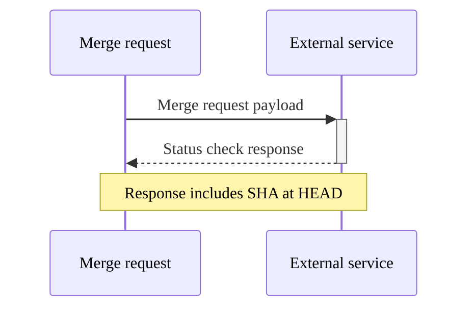



- プラン: Ultimate
- 提供形態: GitLab.com、GitLab Self-Managed、GitLab Dedicated





- `pending`ステータスがGitLab 16.5で[導入されました](https://gitlab.com/gitlab-org/gitlab/-/issues/413723)。
- `pending`ステータスチェックの2分間のタイムアウト間隔がGitLab 16.6で[導入されました](https://gitlab.com/gitlab-org/gitlab/-/issues/388725)。



ステータスチェックは、外部要件のステータスをリクエストする外部システムへのAPIコールです。

サードパーティツールにマージリクエストデータを送信するステータスチェックを作成できます。ユーザーがマージリクエストを作成、変更、またはクローズすると、GitLabは通知を送信します。ユーザーまたは自動化されたワークフローは、GitLabの外部からマージリクエストのステータスを更新できます。

このインテグレーションを使用すると、ServiceNowなどのサードパーティのワークフローツール、または選択したカスタムツールと統合できます。サードパーティツールは、関連するステータスで応答します。このステータスは、マージリクエスト内に非ブロック型のウィジェットとして表示され、マージリクエストレベルでマージリクエストの作成者またはレビュアーにこのステータスを提示します。

個々のプロジェクトに対して、マージリクエストのステータスチェックを設定できます。これらはプロジェクト間で共有されません。

ステータスチェックは、保留中状態のまま2分以上経過すると失敗します。

## アクセス権限 {#access-permissions}

外部ステータスチェックの応答は、以下によって表示できます:

- プロジェクトでレポーター、デベロッパー、メンテナー、またはオーナーロールを持つユーザー
- プロジェクトが内部表示レベルの場合にマージリクエストを表示できる認証済みユーザー

これは、内部プロジェクトがある場合、マージリクエストにアクセスできるログイン済みのユーザーは誰でも外部ステータスチェックの応答を表示できることを意味します。

ユースケース、機能の発見、開発タイムラインに関する詳細については、[エピック3869](https://gitlab.com/groups/gitlab-org/-/epics/3869)を参照してください。

## すべてのステータスチェックが合格しない限り、マージリクエストのマージをブロックする {#block-merges-of-merge-requests-unless-all-status-checks-have-passed}



- GitLab 15.5で`only_allow_merge_if_all_status_checks_passed`[フラグ](../../../administration/feature_flags/_index.md)とともに[導入](https://gitlab.com/gitlab-org/gitlab/-/issues/369859)されました。デフォルトでは無効になっています。
- GitLab 15.8の[GitLab.comで有効になりました](https://gitlab.com/gitlab-org/gitlab/-/issues/372340)。
- GitLab Self-Managedで有効化され、機能フラグはGitLab 15.9で[削除されました](https://gitlab.com/gitlab-org/gitlab/-/merge_requests/111492)。



デフォルトでは、プロジェクト内のマージリクエストは、外部ステータスチェックが失敗してもマージできます。外部チェックが失敗した場合にマージリクエストのマージをブロックするには:

1. 上部のバーで、**検索または移動先**を選択して、プロジェクトを見つけます。
1. 左サイドバーで、**設定** > **マージリクエスト**を選択します。
1. **ステータスチェックが完了する必要があります**チェックボックスを選択します。
1. **変更を保存**を選択します。

## ライフサイクル {#lifecycle}

外部ステータスチェックには、**asynchronous**のワークフローがあります。マージリクエストは、次の場合にマージリクエストのWebhookペイロードを外部サービスに発行します:

- マージリクエストが更新、クローズ、再オープン、承認、承認取り消し、またはマージされる。
- コードがマージリクエストのソースブランチにプッシュされる。



ペイロードが受信されると、外部サービスは、[REST APIを使用して](../../../api/status_checks.md#set-status-of-an-external-status-check)、マージリクエストに応答を投稿する前に、必要なプロセスを実行できます。

マージリクエストは、ソースブランチの現在の`HEAD`を参照しない応答に対して`409 Conflict`エラーを返します。結果として、外部サービスは最新ではないコミットを処理し、応答しても安全です。

外部ステータスチェックには、次の状態があります:

- `pending` - デフォルトの状態。外部サービスからマージリクエストへの応答は受信されていません。
- `passed` - 外部サービスからの応答が受信され、承認されました。
- `failed` - 外部サービスからの応答が受信され、拒否されました。

何か変更がGitLabの外部で発生した場合、[外部ステータスチェックのステータスを](../../../api/status_checks.md#set-status-of-an-external-status-check) APIを使用して設定できます。最初にマージリクエストのWebhookペイロードが送信されるのを待つ必要はありません。

## ステータスチェックサービスを表示 {#view-status-check-services}

マージリクエストの設定からプロジェクトに追加されたステータスチェックサービスの一覧を表示するには:

1. 上部のバーで、**検索または移動先**を選択して、プロジェクトを見つけます。
1. 左サイドバーで、**設定** > **マージリクエスト**を選択します。
1. **ステータスチェック**までスクロールします。このリストには、サービス名、API URL、ターゲットブランチ、およびHMAC認証ステータスが表示されます。


[ブランチルール](../repository/branches/branch_rules.md#add-a-status-check-service)の設定から、ステータスチェックサービスの一覧を表示することもできます。

## ステータスチェックサービスを追加または更新 {#add-or-update-a-status-check-service}

### ステータスチェックサービスの追加 {#add-a-status-check-service}

**ステータスチェック**サブセクション内で、**ステータスチェックの追加**ボタンを選択します。**ステータスチェックの追加**フォームが表示されます。


フォームに入力し、**ステータスチェックの追加**ボタンを選択すると、新しいステータスチェックが作成されます。

ステータスチェックはすべての新しいマージリクエストに適用されますが、既存のマージリクエストには遡って適用されません。

### ステータスチェックサービスを更新 {#update-a-status-check-service}

**ステータスチェック**サブセクションで、編集したいステータスチェックの横にある**編集** () を選択します。**ステータスチェックを更新**フォームが表示されます。


> [!note]
> HMAC共有シークレットの値は表示または変更できません。共有シークレットを変更するには、外部ステータスチェックを削除し、新しい共有シークレット値で再作成します。

ステータスチェックを更新するには、フォームの値を変更し、**ステータスチェックを更新**を選択します。

ステータスチェックの更新はすべての新しいマージリクエストに適用されますが、既存のマージリクエストには遡って適用されません。

### フォーム値 {#form-values}

よくあるフォームエラーについては、以下の[トラブルシューティング](#troubleshooting)セクションを参照してください。

#### サービス名 {#service-name}

この名前は任意の英数字値にすることができ、**必ず**設定する必要があります。名前はプロジェクト内で**必ず**一意でなければなりません。名前はプロジェクト内で**必ず**一意でなければなりません。

#### チェックするAPI {#api-to-check}

このフィールドにはURLが必要であり、HTTPまたはHTTPSプロトコルのいずれかを**必ず**使用する必要があります。マージリクエストデータを転送時に保護するために、HTTPSを使用すること**おすすめします**。URLは**必ず**設定してください。また、プロジェクトで**必ず**一意でなければなりません。

#### ターゲットブランチ {#target-branch}

ステータスチェックを単一のブランチに制限したい場合、このフィールドを使用して制限を設定できます。


ブランチのリストは、プロジェクトの[保護ブランチ](../repository/branches/protected.md)から入力されます。

ブランチが多数あり、探しているブランチがすぐに表示されない場合は、ブランチのリストをスクロールするか、検索ボックスを使用できます。検索を開始するには、検索ボックスに**3つ**の英数字を入力する必要があります。

ステータスチェックを**すべて**のマージリクエストに適用したい場合は、**すべてのブランチ**オプションを選択できます。

#### HMAC共有シークレット {#hmac-shared-secret}

HMAC認証は、リクエストの改ざんを防ぎ、それらが正当なソースからのものであることを保証します。

## ステータスチェックサービスを削除 {#delete-a-status-check-service}

**ステータスチェック**サブセクション内で、削除したいステータスチェックの横にある**削除** () を選択します。**Remove status check?** ダイアログが表示されます。


ステータスチェックの削除を完了するには、**Remove status check**ボタンを選択する必要があります。これにより、ステータスチェックが**完全に**削除され、回復**できません**。

## ステータスチェックウィジェット {#status-checks-widget}



- UIがGitLab 15.2で[更新されました](https://gitlab.com/gitlab-org/gitlab/-/merge_requests/91504)。
- 失敗した外部ステータスチェックを再試行する機能がGitLab 15.8で[追加されました](https://gitlab.com/gitlab-org/gitlab/-/issues/383200)。
- ウィジェットが、GitLab 15.11で保留中のステータスチェックがある場合に更新をポーリングするように[更新されました](https://gitlab.com/gitlab-org/gitlab/-/merge_requests/111763)。



ステータスチェックウィジェットは、マージリクエストに表示され、以下のステータスを表示します:

- **保留中** ()、GitLabが外部ステータスチェックからの応答を待機している間。
- **成功** () または**失敗** ()、GitLabが外部ステータスチェックからの応答を受信した場合。

保留中のステータスチェックがある場合、ウィジェットは、**成功**または**失敗**の応答を受信するまで数秒ごとに更新をポーリングします。

失敗したステータスチェックを再試行するには:

1. 上部のバーで、**検索または移動先**を選択して、プロジェクトを見つけます。
1. 左側のサイドバーで、**コード** > **マージリクエスト**を選択して、マージリクエストを見つけます。
1. マージリクエストのレポートセクションまでスクロールし、ドロップダウンリストを展開して外部ステータスチェックのリストを表示します。
1. 失敗した外部ステータスチェックの行で、**再試行** () を選択します。ステータスチェックは保留中の状態に戻されます。

組織によっては、外部ステータスチェックが合格しない場合にマージリクエストのマージを許可しないポリシーがある場合があります。ただし、ウィジェット内の詳細は情報提供のみを目的としています。

> [!note]
> GitLabは、外部ステータスチェックが関連する外部サービスによって適切に処理されることを保証できません。

## トラブルシューティング {#troubleshooting}

### 重複値エラー {#duplicate-value-errors}

```plaintext
Name is already taken
---
External API is already in use by another status check
```

プロジェクトごとに、ステータスチェックは名前またはAPI URLを一度しか使用できません。これらのエラーは、ステータスチェック名またはAPI URLのいずれかが、このプロジェクトのステータスチェックですでに使用されていることを意味します。

現在のステータスチェックで別の値を選択するか、既存のステータスチェックの値を更新する必要があります。

### 無効なURLエラー {#invalid-url-error}

```plaintext
Please provide a valid URL
```

チェックするAPIフィールドは、提供されるURLがHTTPまたはHTTPSプロトコルのいずれかを使用することを要求します。この要件を満たすには、フィールドの値を更新する必要があります。

### ブランチリスト取得または検索中のエラー {#branch-list-error-during-retrieval-or-search}

```plaintext
Unable to fetch branches list, please close the form and try again
```

ブランチ取得APIから予期せぬ応答が受信されました。提案されているように、フォームを閉じて再度開くか、ページを更新する必要があります。このエラーは一時的なものであるはずですが、問題が続く場合は、[GitLabステータスページ](https://status.gitlab.com/)を確認して、より広範な停止がないか確認してください。

### ステータスチェックの読み込みに失敗しました {#failed-to-load-status-checks}

```plaintext
Failed to load status checks
```

外部ステータスチェックAPIから予期せぬ応答が受信されました。以下のことを行う必要があります:

- このエラーが一時的なものである場合は、ページを更新する。
- 問題が続く場合は、[GitLabステータスページ](https://status.gitlab.com/)を確認して、より広範な停止がないか確認する。

## 関連トピック {#related-topics}

- [外部ステータスチェックAPI](../../../api/status_checks.md)
