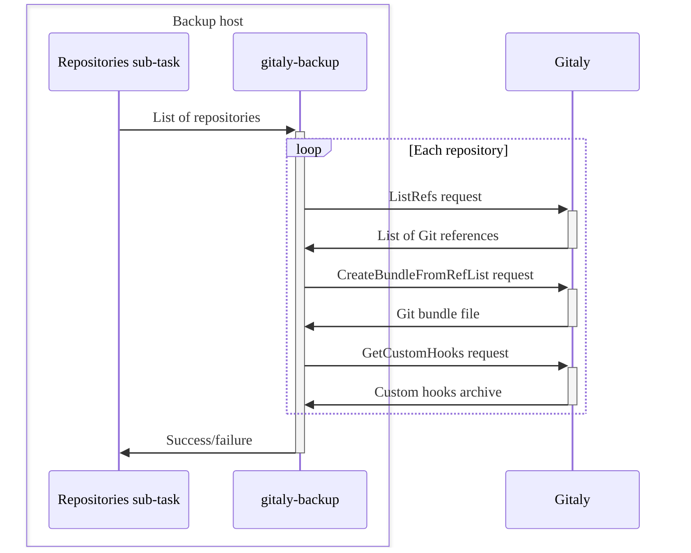
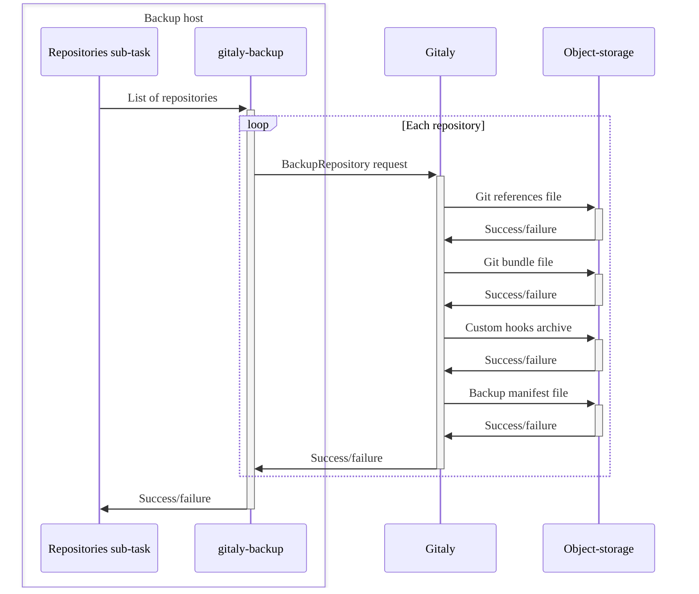

[백업 명령](backup_gitlab.md#backup-command)을 실행하면, 백업 스크립트는 GitLab 데이터를 저장하기 위한 백업 아카이브 파일을 생성합니다.

아카이브 파일을 생성하기 위해 백업 스크립트는 다음을 수행합니다:

1. 증분 백업을 수행할 때 이전 백업 아카이브 파일을 추출합니다.
1. 백업 아카이브 파일을 업데이트하거나 생성합니다.
1. 모든 백업 하위 작업을 실행하여 다음을 수행합니다:
   - [데이터베이스 백업](#back-up-the-database).
   - [Git 리포지토리 백업](#back-up-git-repositories).
   - [파일 백업](#back-up-files).
1. 백업 스테이징 영역을 `tar` 파일로 아카이브합니다.
1. 새 백업 아카이브를 객체 스토리지에 업로드합니다(필요한 경우 [구성](backup_gitlab.md#upload-backups-to-a-remote-cloud-storage)).
1. 아카이브된 [백업 스테이징 디렉터리](#backup-staging-directory) 파일을 정리합니다.

## 데이터베이스 백업 {#back-up-the-database}

데이터베이스를 백업하기 위해 `db` 하위 작업은 다음을 수행합니다:

1. `pg_dump`을 사용하여 [SQL 덤프](https://www.postgresql.org/docs/16/backup-dump.html)를 생성합니다.
1. `pg_dump`의 출력을 `gzip`를 통해 파이프 처리하고 압축된 SQL 파일을 생성합니다.
1. 파일을 [백업 스테이징 디렉터리](#backup-staging-directory)에 저장합니다.

## Git 리포지토리 백업 {#back-up-git-repositories}

Git 리포지토리를 백업하기 위해 `repositories` 하위 작업은 다음을 수행합니다:

1. `gitaly-backup`에 백업할 리포지토리를 알립니다.
1. `gitaly-backup`을 실행하여 다음을 수행합니다:

   - Gitaly에서 일련의 원격 프로시저 호출(RPC)을 호출합니다.
   - 각 리포지토리의 백업 데이터를 수집합니다.

1. 수집된 데이터를 [백업 스테이징 디렉터리](#backup-staging-directory)의 디렉터리 구조로 스트리밍합니다.

다음 다이어그램은 프로세스를 나타냅니다:



Gitaly 클러스터(Praefect) 구성된 스토리지는 독립 실행형 Gitaly 인스턴스와 동일한 방식으로 백업됩니다.

- Gitaly 클러스터(Praefect)가 `gitaly-backup`에서 RPC 호출을 수신하면, 자체 데이터베이스를 다시 구축합니다.
  - Gitaly 클러스터(Praefect) 데이터베이스를 별도로 백업할 필요가 없습니다.
- 각 리포지토리는 복제 계수와 상관없이 한 번만 백업되므로, 백업은 RPC를 통해 작동합니다.

### 서버 측 백업 {#server-side-backups}

서버 측 리포지토리 백업은 Git 리포지토리를 백업하는 효율적인 방법입니다. 이 방법의 장점은 다음과 같습니다:

- 데이터는 Gitaly에서 RPC를 통해 전송되지 않습니다.
- 서버 측 백업은 네트워크 전송이 적게 필요합니다.
- 백업 Rake 작업을 실행하는 머신의 디스크 스토리지가 필요하지 않습니다.

서버 측에서 Gitaly를 백업하기 위해 `repositories` 하위 작업은 다음을 수행합니다:

1. `gitaly-backup`을 실행하여 각 리포지토리에 대해 단일 RPC 호출을 수행합니다.
1. 물리 리포지토리를 저장하는 Gitaly 노드를 트리거하여 백업 데이터를 객체 스토리지에 업로드합니다.
1. 객체 스토리지에 저장된 백업을 [백업 ID](#backup-id)를 사용하여 생성된 백업 아카이브에 연결합니다.

다음 다이어그램은 프로세스를 나타냅니다:



## 파일 백업 {#back-up-files}

다음 하위 작업은 파일을 백업합니다:

- `uploads`:  첨부 파일
- `builds`:  CI/CD 작업 출력 로그
- `artifacts`:  CI/CD 작업 아티팩트
- `pages`:  페이지 콘텐츠
- `lfs`:  LFS 객체
- `terraform_state`:  Terraform 상태
- `registry`:  컨테이너 레지스트리 이미지
- `packages`:  패키지
- `ci_secure_files`:  프로젝트 수준 보안 파일
- `external_diffs`:  머지 리퀘스트 diff(외부에 저장된 경우)

각 하위 작업은 작업별 디렉터리에서 파일 집합을 식별합니다:

1. `tar` 유틸리티를 사용하여 식별된 파일의 아카이브를 생성합니다.
1. `gzip`을 통해 아카이브를 압축하고 디스크에 저장하지 않습니다.
1. `tar` 파일을 [백업 스테이징 디렉터리](#backup-staging-directory)에 저장합니다.

백업은 라이브 인스턴스에서 생성되므로, 백업 프로세스 중에 파일이 수정될 수 있습니다. 이 경우, [대체 전략](backup_gitlab.md#backup-strategy-option)을 사용하여 파일을 백업할 수 있습니다. `rsync` 유틸리티는 백업할 파일의 복사본을 생성하고 아카이빙을 위해 `tar`에 전달합니다.

> [!note]
> 이 전략을 사용하는 경우, 백업 Rake 작업을 실행하는 머신에는 복사된 파일과 압축된 아카이브 모두에 대한 충분한 저장 공간이 있어야 합니다.

## 백업 ID {#backup-id}

백업 ID는 백업 아카이브의 고유 식별자입니다. GitLab을 복원해야 하고 여러 백업 아카이브가 있을 때 이러한 ID는 중요합니다.

백업 아카이브는 `config/gitlab.yml` 파일의 `backup_path` 설정으로 지정된 디렉터리에 저장됩니다. 기본 위치는 `/var/opt/gitlab/backups`입니다.

백업 ID는 다음으로 구성됩니다:

- 백업 생성의 타임스탬프
- 날짜(`YYYY_MM_DD`)
- GitLab 버전
- GitLab 에디션

다음은 백업 ID의 예입니다. `1493107454_2018_04_25_10.6.4-ce`

## 백업 파일명 {#backup-filename}

기본적으로 파일명은 `<backup-id>_gitlab_backup.tar` 구조를 따릅니다. 예를 들어, `1493107454_2018_04_25_10.6.4-ce_gitlab_backup.tar`.

## 백업 정보 파일 {#backup-information-file}

백업 정보 파일인 `backup_information.yml`은 백업에 포함되지 않은 모든 백업 입력을 저장합니다. 파일은 [백업 스테이징 디렉터리](#backup-staging-directory)에 저장됩니다. 하위 작업은 이 파일을 사용하여 [서버 측 리포지토리 백업](#server-side-backups)과 같은 외부 서비스를 사용하여 백업의 데이터를 복원하고 연결하는 방법을 결정합니다.

백업 정보 파일에는 다음이 포함됩니다:

- 백업이 생성된 시간.
- 백업을 생성한 GitLab 버전.
- 기타 지정된 옵션. 예를 들어, 건너뛴 하위 작업.

## 백업 스테이징 디렉터리 {#backup-staging-directory}

백업 스테이징 디렉터리는 백업 및 복원 프로세스 중에 사용되는 임시 스토리지 위치입니다. 이 디렉터리는 다음을 수행합니다:

- GitLab 백업 아카이브를 생성하기 전에 백업 아티팩트를 저장합니다.
- 백업을 복원하거나 증분 백업을 생성하기 전에 백업 아카이브를 추출합니다.

백업 스테이징 디렉터리는 완료된 백업 아카이브가 생성되는 디렉터리와 동일합니다. 압축되지 않은 백업을 생성할 때, 백업 아티팩트는 이 디렉터리에 남아 있으며, 아카이브는 생성되지 않습니다.

다음은 압축되지 않은 백업을 포함하는 백업 스테이징 디렉터리의 예입니다:

```plaintext
backups/
├── 1701728344_2023_12_04_16.7.0-pre_gitlab_backup.tar
├── 1701728447_2023_12_04_16.7.0-pre_gitlab_backup.tar
├── artifacts.tar.gz
├── backup_information.yml
├── builds.tar.gz
├── ci_secure_files.tar.gz
├── db
│   ├── ci_database.sql.gz
│   └── database.sql.gz
├── lfs.tar.gz
├── packages.tar.gz
├── pages.tar.gz
├── repositories
│   ├── manifests/
│   ├── @hashed/
│   └── @snippets/
├── terraform_state.tar.gz
└── uploads.tar.gz
```
