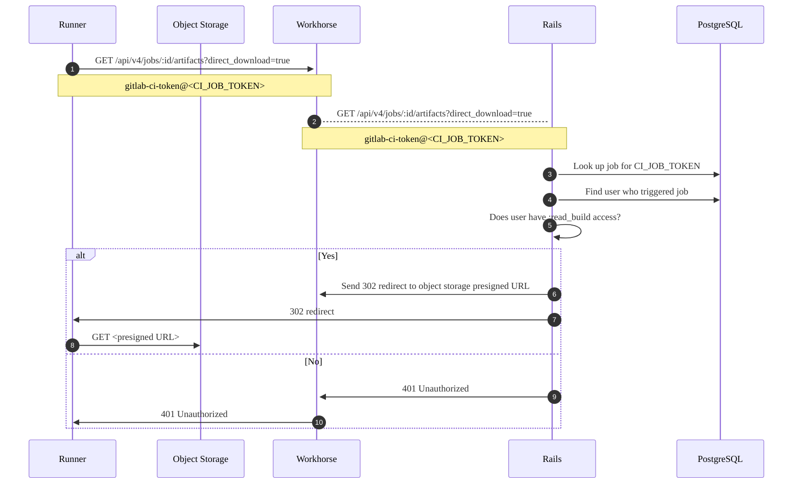
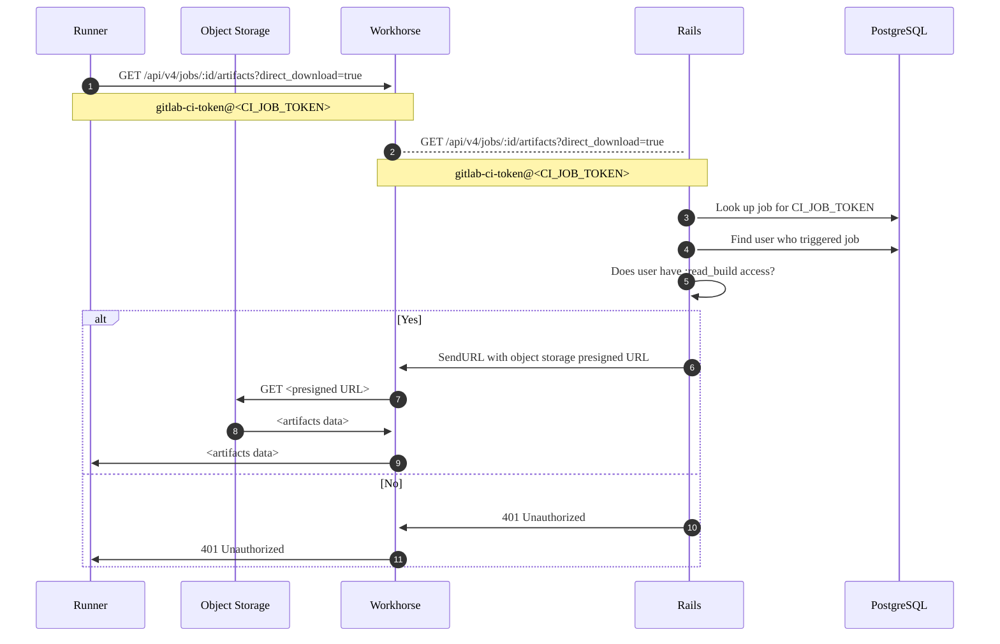



- 계층:  Free, Premium, Ultimate
- 제공:  GitLab Self-Managed



작업 아티팩트를 관리할 때 다음과 같은 이슈가 발생할 수 있습니다.

## 작업 아티팩트의 파일명이 잘못되었을 수 있음 {#job-artifacts-can-have-wrong-filenames}

GitLab 18.6 이전 버전에서는 원격 저장소에서 로컬 저장소로 마이그레이션할 때 아티팩트가 잘못된 파일명으로 복사될 수 있었습니다.

예를 들어:

- 아티팩트는 다음과 유사해야 합니다: `path/to/artifacts/2025_10_15/922/485/artifacts.zip`.
- 파일명이 잘못된 아티팩트는 다음과 유사합니다: `path/to/artifacts/2025_10_15/922/485/4f8681af93715b90c913e507f24b05cc6ca6e` (`.zip` 확장자 없음).

GitLab 인스턴스에서 이 문제가 발생했다면 다음을 실행하세요:

```shell
gitlab-rake gitlab:artifacts:fix_artifact_filepath
```

이 작업은 로컬 저장소에서 파일명이 잘못된 아티팩트를 확인하고 예상된 파일명으로 이름을 바꿉니다.

## 작업 아티팩트가 너무 많은 디스크 공간을 사용함 {#job-artifacts-using-too-much-disk-space}

작업 아티팩트는 예상보다 빠르게 디스크 공간을 가득 채울 수 있습니다. 가능한 이유는 다음과 같습니다:

- 사용자가 작업 아티팩트 만료를 필요 이상으로 길게 설정했습니다.
- 실행한 작업의 수, 따라서 생성된 아티팩트의 수가 예상보다 많습니다.
- 작업 로그가 예상보다 크고 시간이 지남에 따라 누적되었습니다.
- 파일 시스템이 inode를 부족할 수 있습니다. [아티팩트 하우스키핑으로 인해 빈 디렉토리가 남겨지기](https://gitlab.com/gitlab-org/gitlab/-/issues/17465) 때문입니다. [고아 아티팩트 파일을 위한 Rake 작업](../raketasks/cleanup.md#remove-orphan-artifact-files)이 이를 제거합니다.
- 아티팩트 파일이 디스크에 남아 있고 하우스키핑으로 인해 삭제되지 않을 수 있습니다. [고아 아티팩트 파일을 위한 Rake 작업](../raketasks/cleanup.md#remove-orphan-artifact-files)을 실행하여 이를 제거하세요. 이 스크립트는 항상 작업을 찾아야 하는데, 빈 디렉토리도 제거하기 때문입니다(이전 이유 참조).
- `unknown` 상태인 아티팩트는 자동 정리에 의해 처리되지 않을 수 있습니다. [이러한 아티팩트를 확인](#check-for-artifacts-with-unknown-status)하고 정리하여 디스크 공간을 확보할 수 있습니다.
- [최근 성공한 작업에서 최신 아티팩트 유지](../../ci/jobs/job_artifacts.md#keep-artifacts-from-most-recent-successful-jobs) 기능이 활성화되어 있습니다.

이러한 경우 및 기타 경우에 디스크 공간 사용량에 대해 가장 많이 책임이 있는 프로젝트를 식별하고, 가장 많은 공간을 사용하는 아티팩트 유형을 파악하며, 일부 경우 수동으로 작업 아티팩트를 삭제하여 디스크 공간을 확보합니다.

### 아티팩트 하우스키핑 {#artifacts-housekeeping}

아티팩트 하우스키핑은 만료되었으며 삭제할 수 있는 아티팩트를 식별하는 프로세스입니다.

#### `unknown` 상태인 아티팩트 확인 {#check-for-artifacts-with-unknown-status}

일부 아티팩트의 상태가 `unknown`인 이유는 하우스키핑 시스템이 올바른 잠금 상태를 확인할 수 없기 때문입니다. 이러한 아티팩트는 만료된 후에도 자동 정리에 의해 처리되지 않으며 과도한 디스크 공간 사용에 기여할 수 있습니다.

인스턴스에 `unknown` 상태인 아티팩트가 있는지 확인하려면:

1. 데이터베이스 콘솔을 시작하세요:

   

   

   ```shell
   sudo gitlab-psql
   ```

   

   

   ```shell
   # Find the toolbox pod
   kubectl --namespace <namespace> get pods -lapp=toolbox
   # Connect to the PostgreSQL console
   kubectl exec -it <toolbox-pod-name> -- /srv/gitlab/bin/rails dbconsole --include-password --database main
   ```

   

   

   ```shell
   sudo docker exec -it <container_name> /bin/bash
   gitlab-psql
   ```

   

   

   ```shell
   sudo -u git -H psql -d gitlabhq_production
   ```

   

   

1. 다음 쿼리를 실행하세요:

   ```sql
   select expire_at, file_type, locked, count(*) from p_ci_job_artifacts
   where expire_at is not null and
   file_type != 3
   group by expire_at, file_type, locked having count(*) > 1;
   ```

잠금 상태가 `2`인 레코드가 반환되면 이는 `unknown` 아티팩트입니다. 예를 들어:

```plaintext
           expire_at           | file_type | locked | count
-------------------------------+-----------+--------+--------
 2021-06-21 22:00:00+00        |         1 |      2 |  73614
 2021-06-21 22:00:00+00        |         2 |      2 |  73614
 2021-06-21 22:00:00+00        |         4 |      2 |   3522
 2021-06-21 22:00:00+00        |         9 |      2 |     32
 2021-06-21 22:00:00+00        |        12 |      2 |    163
```

`unknown` 아티팩트가 있다면 [더 짧은 만료 시간을 설정](#clean-up-unknown-artifacts)하거나 수동으로 제거하여 디스크 공간을 확보할 수 있습니다.

#### `unknown` 아티팩트 정리 {#clean-up-unknown-artifacts}

`unknown` 아티팩트를 정리하려면 더 짧은 만료 시간을 설정할 수 있으며, 이를 통해 자동 정리 프로세스에서 처리할 수 있습니다:

1. [Rails 콘솔](../operations/rails_console.md#starting-a-rails-console-session)을 시작하세요.
1. `unknown` 아티팩트의 만료를 현재 시간으로 설정하세요:

   ```ruby
   # This marks unknown artifacts for immediate cleanup
   Ci::JobArtifact.where(locked: 2).update_all(expire_at: Time.current)
   ```

자동 하우스키핑 프로세스는 다음 실행 중에 이러한 아티팩트를 정리합니다.

#### `@final` 아티팩트가 객체 저장소에서 삭제되지 않음 {#final-artifacts-not-deleted-from-object-store}

GitLab 16.1 이후 버전에서 아티팩트는 임시 위치를 먼저 사용하는 대신 `@final` 디렉토리의 최종 저장소 위치로 직접 업로드됩니다.

GitLab 16.1 및 16.2의 이슈로 인해 [아티팩트가 만료될 때 객체 저장소에서 삭제되지 않습니다](https://gitlab.com/gitlab-org/gitlab/-/issues/419920). 만료된 아티팩트의 정리 프로세스는 `@final` 디렉토리에서 아티팩트를 제거하지 않습니다. 이 이슈는 GitLab 16.3 이후 버전에서 수정되었습니다.

GitLab 16.1 또는 16.2를 얼마 동안 실행한 GitLab 인스턴스의 관리자는 아티팩트에 사용되는 객체 저장소의 증가를 볼 수 있습니다. 다음 절차를 따라 이러한 아티팩트를 확인하고 제거하세요.

파일 제거는 두 스테이지 프로세스입니다:

1. [고아 파일 식별](#list-orphaned-job-artifacts).
1. [식별된 파일을 객체 저장소에서 삭제](#delete-orphaned-job-artifacts).

##### 고아 작업 아티팩트 나열 {#list-orphaned-job-artifacts}





```shell
sudo gitlab-rake gitlab:cleanup:list_orphan_job_artifact_final_objects
```





```shell
docker exec -it <container-id> bash
gitlab-rake gitlab:cleanup:list_orphan_job_artifact_final_objects
```

컨테이너에 마운트된 영구 볼륨에 쓰거나, 명령이 완료될 때 세션에서 출력 파일을 복사합니다.





```shell
sudo -u git -H bundle exec rake gitlab:cleanup:list_orphan_job_artifact_final_objects RAILS_ENV=production
```





```shell
# find the pod
kubectl get pods --namespace <namespace> -lapp=toolbox

# open the Rails console
kubectl exec -it -c toolbox <toolbox-pod-name> bash
gitlab-rake gitlab:cleanup:list_orphan_job_artifact_final_objects
```

명령이 완료될 때 파일을 세션에서 영구 저장소로 복사합니다.





Rake 작업에는 모든 유형의 GitLab 배포에 적용되는 몇 가지 추가 기능이 있습니다:

- 객체 저장소 스캔을 중단할 수 있습니다. 진행 상황은 Redis에 기록되며, 이를 통해 해당 지점에서 아티팩트 스캔을 재개합니다.
- 기본적으로 Rake 작업은 CSV 파일을 생성합니다: `/opt/gitlab/embedded/service/gitlab-rails/tmp/orphan_job_artifact_final_objects.csv`
- 환경 변수를 설정하여 다른 파일명을 지정하세요:

  ```shell
  # Packaged GitLab
  sudo su -
  FILENAME='custom_filename.csv' gitlab-rake gitlab:cleanup:list_orphan_job_artifact_final_objects
  ```

- 출력 파일이 이미 존재하면(기본값 또는 지정된 파일) 파일에 항목을 추가합니다.
- 각 행은 `object_path,object_size` 필드를 포함하며, 쉼표로 구분되고 파일 헤더가 없습니다. 예를 들어:

  ```plaintext
  35/13/35135aaa6cc23891b40cb3f378c53a17a1127210ce60e125ccf03efcfdaec458/@final/1a/1a/5abfa4ec66f1cc3b681a4d430b8b04596cbd636f13cdff44277211778f26,201
  ```

##### 고아 작업 아티팩트 삭제 {#delete-orphaned-job-artifacts}





```shell
sudo gitlab-rake gitlab:cleanup:delete_orphan_job_artifact_final_objects
```





```shell
docker exec -it <container-id> bash
gitlab-rake gitlab:cleanup:delete_orphan_job_artifact_final_objects
```

- 명령이 완료될 때 세션에서 출력 파일을 복사하거나 컨테이너에 마운트된 볼륨에 씁니다.





```shell
sudo -u git -H bundle exec rake gitlab:cleanup:delete_orphan_job_artifact_final_objects RAILS_ENV=production
```





```shell
# find the pod
kubectl get pods --namespace <namespace> -lapp=toolbox

# open the Rails console
kubectl exec -it -c toolbox <toolbox-pod-name> bash
gitlab-rake gitlab:cleanup:delete_orphan_job_artifact_final_objects
```

- 명령이 완료될 때 파일을 세션에서 영구 저장소로 복사합니다.





다음은 모든 유형의 GitLab 배포에 적용됩니다:

- `FILENAME` 변수를 사용하여 입력 파일명을 지정하세요. 기본적으로 스크립트는 다음을 찾습니다: `/opt/gitlab/embedded/service/gitlab-rails/tmp/orphan_job_artifact_final_objects.csv`
- 스크립트가 파일을 삭제하면서 삭제된 파일의 CSV 파일을 작성합니다:
  - 파일은 입력 파일과 같은 디렉토리에 있습니다
  - 파일명은 `deleted_from--`로 시작합니다. 예: `deleted_from--orphan_job_artifact_final_objects.csv`.
  - 파일의 행은 `object_path,object_size,object_generation/version`입니다. 예시:

    ```plaintext
    35/13/35135aaa6cc23891b40cb3f378c53a17a1127210ce60e125ccf03efcfdaec458/@final/1a/1a/5abfa4ec66f1cc3b681a4d430b8b04596cbd636f13cdff44277211778f26,201,1711616743796587
    ```

### 특정 만료(또는 만료 없음)가 있는 아티팩트를 가진 프로젝트 및 빌드 나열 {#list-projects-and-builds-with-artifacts-with-a-specific-expiration-or-no-expiration}

[Rails 콘솔](../operations/rails_console.md)을 사용하여 다음 중 하나가 있는 작업 아티팩트를 가진 프로젝트를 찾을 수 있습니다:

- 만료 날짜 없음.
- 7일 이상 미래의 만료 날짜.

[아티팩트 삭제](#delete-old-builds-and-artifacts)와 유사하게 다음 예시 시간 프레임을 사용하고 필요에 따라 수정하세요:

- `7.days.from_now`
- `10.days.from_now`
- `2.weeks.from_now`
- `3.months.from_now`
- `1.year.from_now`

다음 스크립트는 각각 `.limit(50)`로 검색 결과를 50개로 제한하지만, 이 숫자도 필요에 따라 변경할 수 있습니다:

```ruby
# Find builds & projects with artifacts that never expire
builds_with_artifacts_that_never_expire = Ci::Build.with_downloadable_artifacts.where(artifacts_expire_at: nil).limit(50)
builds_with_artifacts_that_never_expire.find_each do |build|
  puts "Build with id #{build.id} has artifacts that don't expire and belongs to project #{build.project.full_path}"
end

# Find builds & projects with artifacts that expire after 7 days from today
builds_with_artifacts_that_expire_in_a_week = Ci::Build.with_downloadable_artifacts.where('artifacts_expire_at > ?', 7.days.from_now).limit(50)
builds_with_artifacts_that_expire_in_a_week.find_each do |build|
  puts "Build with id #{build.id} has artifacts that expire at #{build.artifacts_expire_at} and belongs to project #{build.project.full_path}"
end
```

### 저장된 작업 아티팩트의 총 크기별로 프로젝트 나열 {#list-projects-by-total-size-of-job-artifacts-stored}

[Rails 콘솔](../operations/rails_console.md)에서 다음 코드를 실행하여 저장된 작업 아티팩트의 총 크기별로 정렬된 상위 20개 프로젝트를 나열합니다:

```ruby
include ActionView::Helpers::NumberHelper
ProjectStatistics.order(build_artifacts_size: :desc).limit(20).each do |s|
  puts "#{number_to_human_size(s.build_artifacts_size)} \t #{s.project.full_path}"
end
```

`.limit(20)`를 원하는 숫자로 수정하여 나열된 프로젝트의 수를 변경할 수 있습니다.

### 단일 프로젝트의 가장 큰 아티팩트 나열 {#list-largest-artifacts-in-a-single-project}

[Rails 콘솔](../operations/rails_console.md)에서 다음 코드를 실행하여 단일 프로젝트의 50개 가장 큰 작업 아티팩트를 나열합니다:

```ruby
include ActionView::Helpers::NumberHelper
project = Project.find_by_full_path('path/to/project')
Ci::JobArtifact.where(project: project).order(size: :desc).limit(50).map { |a| puts "ID: #{a.id} - #{a.file_type}: #{number_to_human_size(a.size)}" }
```

`.limit(50)`를 원하는 숫자로 수정하여 나열된 작업 아티팩트의 수를 변경할 수 있습니다.

### 단일 프로젝트에서 아티팩트 나열 {#list-artifacts-in-a-single-project}

단일 프로젝트의 아티팩트를 아티팩트 크기별로 정렬하여 나열합니다. 출력에 다음이 포함됩니다:

- 아티팩트를 생성한 작업의 ID
- 아티팩트 크기
- 아티팩트 파일 유형
- 아티팩트 생성 날짜
- 아티팩트의 디스크 위치

```ruby
p = Project.find_by_id(<project_id>)
arts = Ci::JobArtifact.where(project: p)

list = arts.order(size: :desc).limit(50).each do |art|
    puts "Job ID: #{art.job_id} - Size: #{art.size}b - Type: #{art.file_type} - Created: #{art.created_at} - File loc: #{art.file}"
end
```

`limit(50)`에서 숫자를 변경하여 나열된 작업 아티팩트의 수를 변경할 수 있습니다.

### 이전 빌드 및 아티팩트 삭제 {#delete-old-builds-and-artifacts}

> [!warning]
> 이러한 명령은 데이터를 영구적으로 제거합니다. 프로덕션 환경에서 실행하기 전에 테스트 환경에서 먼저 시도하고 필요한 경우 복원할 수 있는 인스턴스의 백업을 만드세요.

#### 프로젝트의 이전 아티팩트 삭제 {#delete-old-artifacts-for-a-project}

이 단계는 사용자가 [아티팩트를 유지하도록 선택](../../ci/jobs/job_artifacts.md#with-an-expiry)한 아티팩트도 삭제합니다:

```ruby
project = Project.find_by_full_path('path/to/project')
builds_with_artifacts =  project.builds.with_downloadable_artifacts
builds_with_artifacts.where("finished_at < ?", 1.year.ago).each_batch do |batch|
  batch.each do |build|
    Ci::JobArtifacts::DeleteService.new(build).execute
  end

  batch.update_all(artifacts_expire_at: Time.current)
end
```

#### 전체 인스턴스의 이전 아티팩트 삭제 {#delete-old-artifacts-instance-wide}

이 단계는 사용자가 [아티팩트를 유지하도록 선택](../../ci/jobs/job_artifacts.md#with-an-expiry)한 아티팩트도 삭제합니다:

```ruby
builds_with_artifacts = Ci::Build.with_downloadable_artifacts
builds_with_artifacts.where("finished_at < ?", 1.year.ago).each_batch do |batch|
  batch.each do |build|
    Ci::JobArtifacts::DeleteService.new(build).execute
  end

  batch.update_all(artifacts_expire_at: Time.current)
end
```

#### 프로젝트의 이전 작업 로그 및 아티팩트 삭제 {#delete-old-job-logs-and-artifacts-for-a-project}

```ruby
project = Project.find_by_full_path('path/to/project')
builds =  project.builds
admin_user = User.find_by(username: 'username')
builds.where("finished_at < ?", 1.year.ago).each_batch do |batch|
  batch.each do |build|
    print "Ci::Build ID #{build.id}... "

    if build.erasable?
      Ci::BuildEraseService.new(build, admin_user).execute
      puts "Erased"
    else
      puts "Skipped (Nothing to erase or not erasable)"
    end
  end
end
```

#### 전체 인스턴스의 이전 작업 로그 및 아티팩트 삭제 {#delete-old-job-logs-and-artifacts-instance-wide}

```ruby
builds = Ci::Build.all
admin_user = User.find_by(username: 'username')
builds.where("finished_at < ?", 1.year.ago).each_batch do |batch|
  batch.each do |build|
    print "Ci::Build ID #{build.id}... "

    if build.erasable?
      Ci::BuildEraseService.new(build, admin_user).execute
      puts "Erased"
    else
      puts "Skipped (Nothing to erase or not erasable)"
    end
  end
end
```

`1.year.ago`는 Rails [`ActiveSupport::Duration`](https://api.rubyonrails.org/classes/ActiveSupport/Duration.html) 메서드입니다. 장기간을 시작하여 여전히 사용 중인 아티팩트를 실수로 삭제할 위험을 줄입니다. 필요에 따라 더 짧은 기간으로 삭제를 다시 실행하세요. 예: `3.months.ago`, `2.weeks.ago` 또는 `7.days.ago`.

`erase_erasable_artifacts!` 메서드는 동기식이며, 실행 시 아티팩트는 즉시 제거됩니다. 백그라운드 큐에 의해 예약되지 않습니다.

### 아티팩트 삭제로 인해 즉시 디스크 공간을 확보하지 않음 {#deleting-artifacts-does-not-immediately-reclaim-disk-space}

아티팩트를 삭제하면 프로세스는 두 단계로 진행됩니다:

1. **Marked as ready for deletion**: `Ci::JobArtifact` 레코드는 데이터베이스에서 제거되고 미래의 `pick_up_at` 타임스탐프를 가진 `Ci::DeletedObject` 레코드로 변환됩니다.
1. **Remove from storage**:  아티팩트 파일은 `Ci::ScheduleDeleteObjectsCronWorker` 워커가 `Ci::DeletedObject` 레코드를 처리하고 파일을 물리적으로 제거할 때까지 디스크에 남아 있습니다.

제거는 시스템 리소스를 압도하는 것을 방지하기 위해 의도적으로 제한됩니다:

- 워커는 시간당 한 번, 16분 표시에 실행됩니다.
- 최대 20개의 동시 작업으로 배치 단위로 객체를 처리합니다.
- 삭제된 각 객체에는 물리적 삭제에 적합한 시점을 결정하는 `pick_up_at` 타임스탐프가 있습니다

대규모 삭제의 경우, 물리적 정리는 디스크 공간이 완전히 확보되기 전에 상당한 시간이 걸릴 수 있습니다. 매우 큰 삭제의 경우 정리에 여러 날이 걸릴 수 있습니다.

디스크 공간을 빠르게 확보해야 하는 경우 아티팩트 삭제를 가속화할 수 있습니다.

#### 아티팩트 제거 가속화 {#expedite-artifact-removal}

많은 수의 아티팩트를 삭제한 후 디스크 공간을 빠르게 확보해야 하는 경우, 표준 스케줄링 제한을 우회하고 삭제 프로세스를 가속화할 수 있습니다.

> [!warning]
> 이러한 명령은 많은 수의 아티팩트를 삭제하는 경우 시스템에 상당한 부하를 가합니다.

```ruby
# Set the pick_up_date to the current time on all artifacts
# This will mark them for immediate deletion
Ci::DeletedObject.update_all(pick_up_at: Time.current)

# Get the count of artifacts marked for deletion
Ci::DeletedObject.where("pick_up_at < ?", Time.current)

# Delete the artifacts from disk
while Ci::DeletedObject.where("pick_up_at < ?", Time.current).count > 0
  Ci::DeleteObjectsService.new.execute
  sleep(10)
end

# Get the count of artifacts marked for deletion (should now be zero)
Ci::DeletedObject.count
```

### 이전 파이프라인 삭제 {#delete-old-pipelines}

> [!warning]
> 이러한 명령은 데이터를 영구적으로 제거합니다. 프로덕션 환경에서 실행하기 전에 지원 엔지니어의 조언을 구하는 것을 고려하세요. 테스트 환경에서 먼저 시도하고 필요한 경우 복원할 수 있는 인스턴스의 백업을 만드세요.

파이프라인 삭제도 파이프라인의 다음을 제거합니다:

- 작업 아티팩트
- 작업 로그
- 작업 메타데이터
- 파이프라인 메타데이터

작업 및 파이프라인 메타데이터를 제거하면 데이터베이스의 CI 테이블 크기를 줄일 수 있습니다. CI 테이블은 일반적으로 인스턴스 데이터베이스의 가장 큰 테이블입니다.

#### 프로젝트의 이전 파이프라인 삭제 {#delete-old-pipelines-for-a-project}

```ruby
project = Project.find_by_full_path('path/to/project')
user = User.find(1)
project.ci_pipelines.where("finished_at < ?", 1.year.ago).each_batch do |batch|
  batch.each do |pipeline|
    puts "Erasing pipeline #{pipeline.id}"
    Ci::DestroyPipelineService.new(pipeline.project, user).execute(pipeline)
  end
end
```

#### 전체 인스턴스의 이전 파이프라인 삭제 {#delete-old-pipelines-instance-wide}

```ruby
user = User.find(1)
Ci::Pipeline.where("finished_at < ?", 1.year.ago).each_batch do |batch|
  batch.each do |pipeline|
    puts "Erasing pipeline #{pipeline.id} for project #{pipeline.project_id}"
    Ci::DestroyPipelineService.new(pipeline.project, user).execute(pipeline)
  end
end
```

## 작업 아티팩트 업로드 실패 오류 500 {#job-artifact-upload-fails-with-error-500}

객체 저장소를 아티팩트에 사용하고 있고 작업 아티팩트 업로드가 실패하는 경우 다음을 검토하세요:

- 유사한 오류 메시지에 대한 작업 로그:

  ```plaintext
  WARNING: Uploading artifacts as "archive" to coordinator... failed id=12345 responseStatus=500 Internal Server Error status=500 token=abcd1234
  ```

- 유사한 오류 메시지에 대한 [workhorse 로그](../logs/_index.md#workhorse-logs):

  ```json
  {"error":"MissingRegion: could not find region configuration","level":"error","msg":"error uploading S3 session","time":"2021-03-16T22:10:55-04:00"}
  ```

두 경우 모두 작업 아티팩트 [객체 저장소 구성](../object_storage.md)에 `region`를 추가해야 할 수 있습니다.

## 작업 아티팩트 업로드 실패 `500 Internal Server Error (Missing file)` {#job-artifact-upload-fails-with-500-internal-server-error-missing-file}

폴더 경로를 포함하는 버킷 이름은 [통합 객체 저장소](../object_storage.md#configure-a-single-storage-connection-for-all-object-types-consolidated-form)에서 지원되지 않습니다. 예를 들어, `bucket/path`. 버킷 이름에 경로가 있으면 다음과 유사한 오류가 발생할 수 있습니다:

```plaintext
WARNING: Uploading artifacts as "archive" to coordinator... POST https://gitlab.example.com/api/v4/jobs/job_id/artifacts?artifact_format=zip&artifact_type=archive&expire_in=1+day: 500 Internal Server Error (Missing file)
FATAL: invalid argument
```

통합 객체 저장소를 사용할 때 작업 아티팩트 업로드가 이전 오류로 인해 실패하면 각 데이터 유형에 대해 [별도 버킷을 사용](../object_storage.md#use-separate-buckets)하고 있는지 확인하세요.

## Windows 마운트를 사용할 때 작업 아티팩트 업로드 실패 `FATAL: invalid argument` {#job-artifacts-fail-to-upload-with-fatal-invalid-argument-when-using-windows-mount}

작업 아티팩트에 CIFS를 사용하는 Windows 마운트를 사용하는 경우 러너가 아티팩트를 업로드하려고 할 때 `invalid argument` 오류가 나타날 수 있습니다:

```plaintext
WARNING: Uploading artifacts as "dotenv" to coordinator... POST https://<your-gitlab-instance>/api/v4/jobs/<JOB_ID>/artifacts: 500 Internal Server Error  id=1296 responseStatus=500 Internal Server Error status=500 token=*****
FATAL: invalid argument
```

이 이슈를 해결하려면 다음을 시도할 수 있습니다:

- CIFS 대신 ext4 마운트로 전환합니다.
- CIFS 파일 리스 관련 많은 중요 버그 수정을 포함하는 최소 Linux 커널 5.15로 업그레이드합니다.
- 이전 커널의 경우 파일 리싱을 비활성화하기 위해 `nolease` 마운트 옵션을 사용합니다.

자세한 내용은 [조사 세부 정보를 참조](https://gitlab.com/gitlab-org/gitlab/-/issues/389995)하세요.

## 사용량 할당량에 잘못된 아티팩트 저장소 사용량 표시 {#usage-quota-shows-incorrect-artifact-storage-usage}

때때로 [아티팩트 저장소 사용량](../../user/storage_usage_quotas.md)은 아티팩트에 사용되는 전체 저장소 공간에 대한 잘못된 값을 표시합니다. 인스턴스의 모든 프로젝트에 대한 아티팩트 사용량 통계를 다시 계산하려면 다음 백그라운드 스크립트를 실행할 수 있습니다:

```shell
gitlab-rake gitlab:refresh_project_statistics_build_artifacts_size[https://example.com/path/file.csv]
```

`https://example.com/path/file.csv` 파일은 아티팩트 저장소 사용량을 다시 계산할 모든 프로젝트의 프로젝트 ID를 나열해야 합니다. 파일에 다음 형식을 사용하세요:

```plaintext
PROJECT_ID
1
2
```

아티팩트 사용량 값은 스크립트 실행 중에 `0`로 변동할 수 있습니다. 다시 계산 후 사용량이 예상대로 표시되어야 합니다.

## 아티팩트 다운로드 플로우 다이어그램 {#artifact-download-flow-diagrams}

다음 플로우 다이어그램은 작업 아티팩트가 어떻게 작동하는지를 보여줍니다. 이 다이어그램은 객체 저장소가 작업 아티팩트에 대해 구성되어 있다고 가정합니다.

### 프록시 다운로드 비활성화 {#proxy-download-disabled}

[`proxy_download`이 `false`으로 설정](../object_storage.md)되면 GitLab은 러너를 리디렉션하여 객체 저장소에서 사전 서명된 URL을 사용하여 아티팩트를 다운로드합니다. 일반적으로 러너가 소스에서 직접 가져오는 것이 더 빠르므로 이 구성이 일반적으로 권장됩니다. 또한 GitLab이 가져와서 러너로 전송할 필요가 없으므로 대역폭 사용량도 줄여야 합니다. 그러나 러너에게 객체 저장소에 대한 직접 액세스를 제공해야 합니다.

요청 플로우는 다음과 같습니다:



이 다이어그램에서:

1. 먼저 러너는 `GET /api/v4/jobs/:id/artifacts` 엔드포인트를 사용하여 작업 아티팩트를 가져오려고 시도합니다. 러너는 첫 시도에서 `direct_download=true` 쿼리 매개변수를 첨부하여 객체 저장소에서 직접 다운로드할 수 있음을 나타냅니다. 직접 다운로드는 [`FF_USE_DIRECT_DOWNLOAD` 기능 플래그](https://docs.gitlab.com/runner/configuration/feature-flags/)를 통해 러너 구성에서 비활성화할 수 있습니다. 이 플래그는 기본적으로 `true`로 설정됩니다.

1. 러너는 `gitlab-ci-token` 사용자명 및 비밀번호로 HTTP 기본 인증을 사용하여 GET 요청을 보내고 자동 생성된 CI/CD 작업 토큰을 비밀번호로 사용합니다. 이 토큰은 GitLab에서 생성되어 작업 시작 시 러너에게 제공됩니다.

1. GET 요청은 GitLab API로 전달되며, 토큰을 데이터베이스에서 찾고 작업을 트리거한 사용자를 찾습니다.

1. 5~8단계에서:

   - 사용자가 빌드에 액세스할 수 있으면 GitLab은 사전 서명된 URL을 생성하고 `Location`이 해당 URL로 설정된 302 리디렉션을 보냅니다. 러너는 302 리디렉션을 따르고 아티팩트를 다운로드합니다.

   - 작업을 찾을 수 없거나 사용자가 작업에 액세스할 수 없으면 API가 401 Unauthorized를 반환합니다.

   러너는 다음 HTTP 상태 코드를 수신하면 재시도하지 않습니다:

   - 200 OK
   - 401 Unauthorized
   - 403 Forbidden
   - 404 Not Found

   그러나 러너가 500 오류와 같은 다른 상태 코드를 수신하면 아티팩트를 다운로드하려는 시도를 2회 더 진행하며 각 시도 간에 1초씩 대기합니다. 다음 시도에서는 `direct_download=true`를 생략합니다.

### 프록시 다운로드 활성화 {#proxy-download-enabled}

`proxy_download`이 `true`이면 GitLab은 항상 객체 저장소에서 아티팩트를 가져와 러너로 데이터를 전송합니다. 러너가 `direct_download=true` 쿼리 매개변수를 보내더라도 마찬가지입니다. 프록시 다운로드는 러너가 제한된 네트워크 액세스 권한을 가진 경우 바람직할 수 있습니다.

다음 다이어그램은 프록시 다운로드 비활성화 예제와 유사하지만 6~9단계에서 GitLab이 러너로 302 리디렉션을 보내지 않습니다. 대신 GitLab은 Workhorse에 데이터를 가져와 러너로 다시 스트리밍하도록 지시합니다. 러너 관점에서 `/api/v4/jobs/:id/artifacts`에 대한 원래 GET 요청은 바이너리 데이터를 직접 반환합니다.



## `413 Request Entity Too Large` 오류 {#413-request-entity-too-large-error}

아티팩트가 너무 크면 작업이 다음 오류로 실패할 수 있습니다:

```plaintext
Uploading artifacts as "archive" to coordinator... too large archive <job-id> responseStatus=413 Request Entity Too Large status=413" at end of a build job on pipeline when trying to store artifacts to <object-storage>.
```

다음을 수행해야 할 수 있습니다:

- [최대 아티팩트 크기](../settings/continuous_integration.md#set-maximum-artifacts-size) 증가.
- NGINX를 프록시 서버로 사용하는 경우 기본값이 1MB로 제한된 파일 업로드 크기 제한을 증가시킵니다. NGINX 구성 파일에서 `client-max-body-size`에 대해 더 높은 값을 설정합니다.
