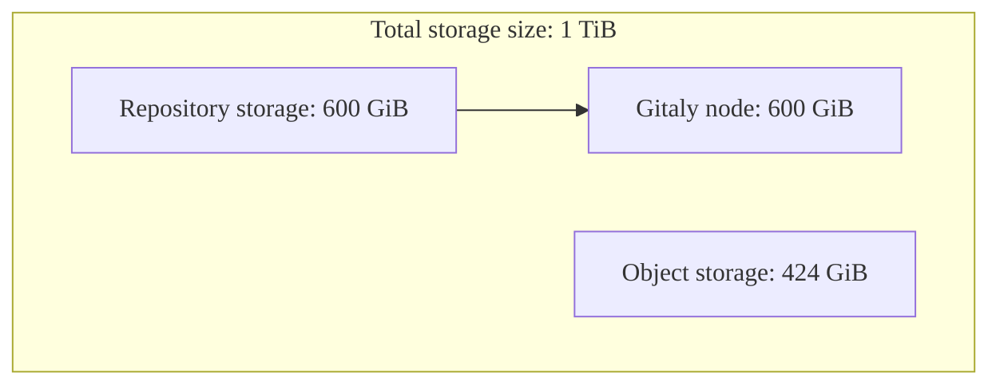
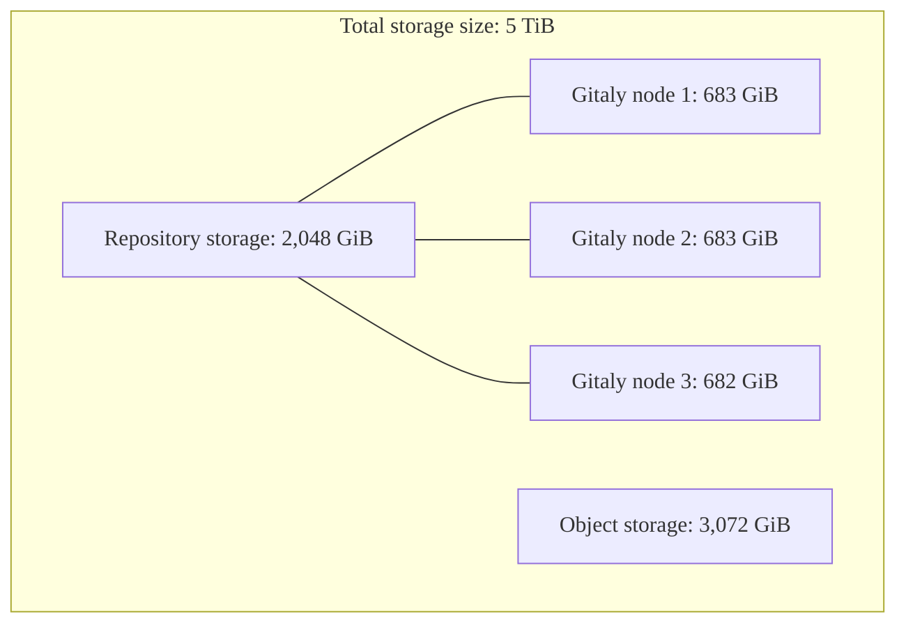



- 계층:  Ultimate
- 제공:  GitLab Dedicated



GitLab Dedicated는 선호하는 AWS 클라우드 영역에 배포된 단일 테넌트, 완전히 관리되는 GitLab 인스턴스를 제공합니다. 계정 팀이 조달 프로세스 중에 스토리지 요구 사항을 결정하도록 지원합니다.

GitLab Dedicated의 스토리지 작동 방식을 이해하면 인스턴스 구성 및 리소스 관리에 대해 정보에 기반한 결정을 내리는 데 도움이 됩니다.

## 스토리지 구성 요소 {#storage-components}

GitLab Dedicated는 다양한 목적을 위해 다양한 유형의 스토리지를 사용합니다. 총 스토리지 할당은 사용 패턴에 따라 이러한 구성 요소 간에 나뉩니다.

### 총 구매 스토리지 {#total-purchased-storage}

총 구매 스토리지는 리포지토리 스토리지와 오브젝트 스토리지를 모두 포함하여 GitLab Dedicated 인스턴스에 할당된 결합된 스토리지입니다. 이 할당은 GitLab Dedicated 구독으로 구매한 총 스토리지 용량을 나타내며 인스턴스 프로비저닝 중에 구성됩니다.

스토리지 요구 사항을 결정할 때 이것이 계획 및 가격 책정에 사용되는 주요 메트릭입니다. 그러면 총 구매 스토리지가 예상 사용 패턴에 따라 리포지토리 스토리지와 오브젝트 스토리지 간에 분배됩니다.

### 리포지토리 스토리지 {#repository-storage}

리포지토리 스토리지는 Gitaly 노드 전체에 할당된 Git 리포지토리의 공간을 나타냅니다. 이 스토리지는 참조 아키텍처를 기반으로 인스턴스의 Gitaly 노드 간에 분배됩니다.

#### Gitaly 노드당 리포지토리 스토리지 {#repository-storage-per-gitaly-node}

인스턴스의 각 Gitaly 노드는 특정 스토리지 용량을 가집니다. 이 용량은 개별 리포지토리의 크기에 영향을 미칩니다. 단일 리포지토리는 단일 Gitaly 노드의 용량을 초과할 수 없기 때문입니다. 스토리지 가중치는 새로운 리포지토리를 받는 Gitaly 노드를 결정합니다. GitLab은 리포지토리를 노드 전체에 균등하게 분배하기 위해 이러한 가중치를 관리합니다.

예를 들어 각 Gitaly 노드에 100GiB의 스토리지 용량이 있고 3개의 Gitaly 노드가 있다면 인스턴스는 총 300GiB의 리포지토리 데이터를 저장할 수 있지만 단일 리포지토리는 100GiB를 초과할 수 없습니다.

### Object Storage {#object-storage}

오브젝트 스토리지는 파일 계층 구조가 아닌 객체로 데이터를 관리하는 스토리지 아키텍처입니다. GitLab에서 오브젝트 스토리지는 Git 리포지토리의 일부가 아닌 다음을 포함한 모든 항목을 처리합니다:

- CI/CD 파이프라인의 작업 아티팩트 및 작업 로그
- 컨테이너 레지스트리에 저장된 이미지
- 패키지 레지스트리에 저장된 패키지
- GitLab Pages로 배포된 웹사이트
- Terraform 프로젝트의 상태 파일

GitLab Dedicated의 오브젝트 스토리지는 데이터 보호를 위한 적절한 복제를 통해 Amazon S3를 사용하여 구현됩니다.

### 혼합 스토리지 {#blended-storage}

혼합 스토리지는 오브젝트 스토리지, 리포지토리 스토리지 및 데이터 전송을 포함하는 GitLab Dedicated 인스턴스에서 사용하는 전체 스토리지입니다.

<!-- vale gitlab_base.Spelling = NO -->

### 분리된 스토리지 {#unblended-storage}

분리된 스토리지는 각 스토리지 유형의 인프라 수준에서의 스토리지 용량입니다. 주로 총 스토리지 크기 및 리포지토리 스토리지 수치와 함께 작업합니다.

<!-- vale gitlab_base.Spelling = YES -->

## 스토리지 계획 및 구성 {#storage-planning-and-configuration}

GitLab Dedicated 인스턴스의 스토리지 계획은 인프라 전체에서 오브젝트 및 리포지토리 스토리지가 할당되는 방식을 이해하는 것입니다.

### 초기 스토리지 할당 결정 {#determining-initial-storage-allocation}

GitLab Dedicated 계정 팀은 다음을 기반으로 적절한 스토리지 양을 결정하는 데 도움이 됩니다:

- 사용자 수
- 리포지토리의 수 및 크기
- CI/CD 사용 패턴
- 예상 성장

### 리포지토리 용량 및 참조 아키텍처 {#repository-capacity-and-reference-architectures}

리포지토리 스토리지는 Gitaly 노드 전체에 분배됩니다. 이는 단일 리포지토리가 단일 Gitaly 노드의 용량을 초과할 수 없으므로 개별 리포지토리의 크기에 영향을 미칩니다.

인스턴스의 Gitaly 노드 수는 온보딩 중에 결정되는 참조 아키텍처에 따라 다르며 주로 사용자 수를 기반으로 합니다. 2,000명을 초과하는 사용자가 있는 인스턴스의 참조 아키텍처는 일반적으로 3개의 Gitaly 노드를 사용합니다. 자세한 내용은 [참조 아키텍처](../../reference_architectures/_index.md)를 참조하세요.

#### 참조 아키텍처 보기 {#view-reference-architecture}

참조 아키텍처를 보려면:

1. [Switchboard](https://console.gitlab-dedicated.com/)에 로그인합니다.
1. 페이지 맨 위에서 **구성**을 선택합니다.
1. 테넌트 개요 페이지에서 **Reference architecture** 필드를 찾습니다.

> [!note]
> 테넌트 아키텍처의 Gitaly 노드 수를 확인하려면 [지원 티켓을 제출](https://support.gitlab.com/hc/en-us/requests/new?ticket_form_id=4414917877650)하세요.

### 스토리지 계산 예제 {#example-storage-calculations}

이 예제들은 스토리지 할당이 리포지토리 크기 제한에 어떻게 영향을 미치는지 보여줍니다:

#### 2,000명의 사용자에 대한 표준 워크로드 {#standard-workload-with-2000-users}

- 참조 아키텍처:  최대 2,000명의 사용자(Gitaly 노드 1개)
- 총 스토리지 크기:  1TiB(1,024GiB)
- 할당:  600GiB 리포지토리 스토리지, 424GiB 오브젝트 스토리지
- Gitaly 노드당 리포지토리 스토리지:  600GiB

#### 10,000명의 사용자에 대한 CI/CD 집약적 워크로드 {#cicd-intensive-workload-with-10000-users}

- 참조 아키텍처:  최대 10,000명의 사용자(Gitaly 노드 3개)
- 총 스토리지 크기:  5TiB(5,120GiB)
- 할당:  2,048GiB 리포지토리 스토리지, 3,072GiB 오브젝트 스토리지
- Gitaly 노드당 리포지토리 스토리지: ~683GiB(2,048GiB ÷ 3 Gitaly 노드)

## 스토리지 증가 관리 {#manage-storage-growth}

스토리지 증가를 효과적으로 관리하려면:

- [패키지 레지스트리](../../../user/packages/package_registry/reduce_package_registry_storage.md#cleanup-policy)에 대한 정리 정책을 설정하여 이전 패키지 자산을 자동으로 제거합니다.
- [컨테이너 레지스트리](../../../user/packages/container_registry/reduce_container_registry_storage.md#cleanup-policy)에 대한 정리 정책을 설정하여 사용하지 않는 컨테이너 태그를 제거합니다.
- [작업 아티팩트](../../../ci/jobs/job_artifacts.md#with-an-expiry)에 대한 만료 기간을 설정합니다.
- [사용하지 않는 프로젝트](../../../user/project/working_with_projects.md)를 검토하고 보관하거나 제거합니다.

## 자주 묻는 질문 {#frequently-asked-questions}

### 인스턴스가 프로비저닝된 후 스토리지 할당을 변경할 수 있습니까? {#can-i-change-my-storage-allocation-after-my-instance-is-provisioned}

네, 계정 팀에 문의하거나 지원 티켓을 열어 추가 스토리지를 요청할 수 있습니다. 스토리지 변경은 청구에 영향을 미칩니다.

### 스토리지가 성능에 어떤 영향을 미칩니까? {#how-does-storage-affect-performance}

적절한 스토리지 할당은 최적의 성능을 보장합니다. 과소 크기의 스토리지는 특히 리포지토리 작업 및 CI/CD 파이프라인에 대한 성능 이슈를 초래할 수 있습니다.

### Geo 복제의 스토리지는 어떻게 처리됩니까? {#how-is-storage-handled-for-geo-replication}

GitLab Dedicated는 기본 사이트 구성을 기반으로 스토리지 할당이 있는 재해 복구용 보조 Geo 사이트를 포함합니다.

### 오브젝트 스토리지에 자체 S3 버킷을 사용할 수 있습니까? {#can-i-bring-my-own-s3-bucket-for-object-storage}

아니요, GitLab Dedicated는 테넌트 계정에서 GitLab이 관리하는 AWS S3 버킷을 사용합니다.

## 관련 항목 {#related-topics}

- [데이터 거주지와 고가용성](data_residency_high_availability.md)
- [참조 아키텍처](../../reference_architectures/_index.md)
- [오브젝트 스토리지](../../object_storage.md)
