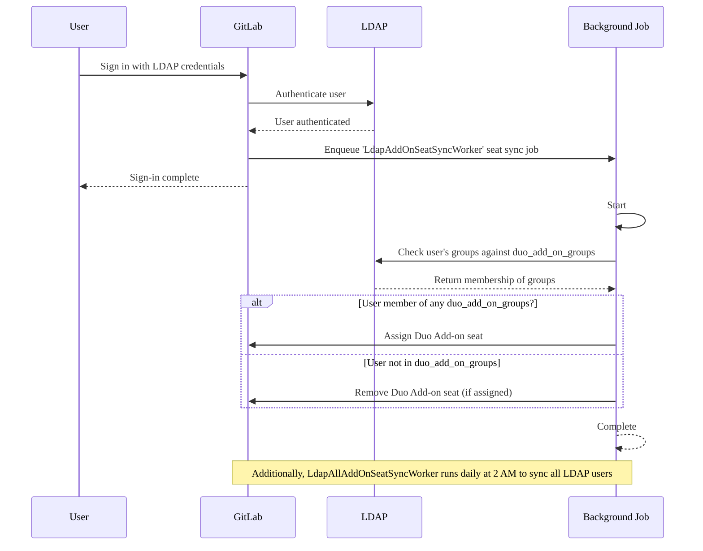



- 티어:  Premium, Ultimate
- 제공 서비스: GitLab Self-Managed





- GitLab 17.8에서 [도입](https://gitlab.com/gitlab-org/gitlab/-/merge_requests/175101)되었습니다.



GitLab 관리자는 LDAP 그룹 멤버십을 기반으로 GitLab Duo 추가 기능 사용자 할당을 자동으로 구성할 수 있습니다. 활성화되면 GitLab은 사용자가 로그인할 때 LDAP 그룹 멤버십에 따라 추가 기능 사용자를 자동으로 할당하거나 제거합니다.

## 사용자 관리 워크플로우 {#seat-management-workflow}

1. **구성**:  관리자는 `duo_add_on_groups` [구성 설정](#configure-gitlab-duo-add-on-seat-management)에서 LDAP 그룹을 지정합니다.
1. **Seat synchronization**:  GitLab은 두 가지 방식으로 LDAP 그룹 멤버십을 확인합니다:
   - **On user sign-in**:  사용자가 LDAP를 통해 로그인하면 GitLab은 즉시 사용자의 그룹 멤버십을 확인합니다.
   - **Scheduled sync**:  GitLab은 매일 오전 02:00에 모든 LDAP 사용자를 동기화하여 사용자 로그인이 없어도 사용자 할당이 최신 상태로 유지되도록 합니다.
1. **Seat assignment**:
   - 사용자가 `duo_add_on_groups`에 나열된 그룹에 속하면 추가 기능 사용자가 할당됩니다(아직 할당되지 않은 경우).
   - 사용자가 나열된 그룹에 속하지 않으면 추가 기능 사용자가 제거됩니다(이전에 할당된 경우).
1. **Async processing**:  사용자 할당 및 제거는 비동기로 처리되어 메인 로그인 플로우가 중단되지 않도록 합니다.

다음 다이어그램은 워크플로우를 보여줍니다:



## GitLab Duo 추가 기능 사용자 관리 구성 {#configure-gitlab-duo-add-on-seat-management}

LDAP를 사용한 추가 기능 사용자 관리를 켜려면:

1. [설치](auth/ldap/ldap_synchronization.md#gitlab-duo-add-on-for-groups)를 위해 편집한 GitLab 구성 파일을 엽니다.
1. LDAP 서버 구성에 `duo_add_on_groups` 설정을 추가합니다.
1. GitLab Duo 추가 기능 사용자를 가져야 하는 LDAP 그룹 이름의 배열을 지정합니다.

다음은 Linux 패키지 설치를 위한 `gitlab.rb` 구성의 예입니다:

```ruby
gitlab_rails['ldap_servers'] = {
  'main' => {
    # Additional LDAP settings removed for readability
    'duo_add_on_groups' => ['duo_users', 'admins'],
  }
}
```
