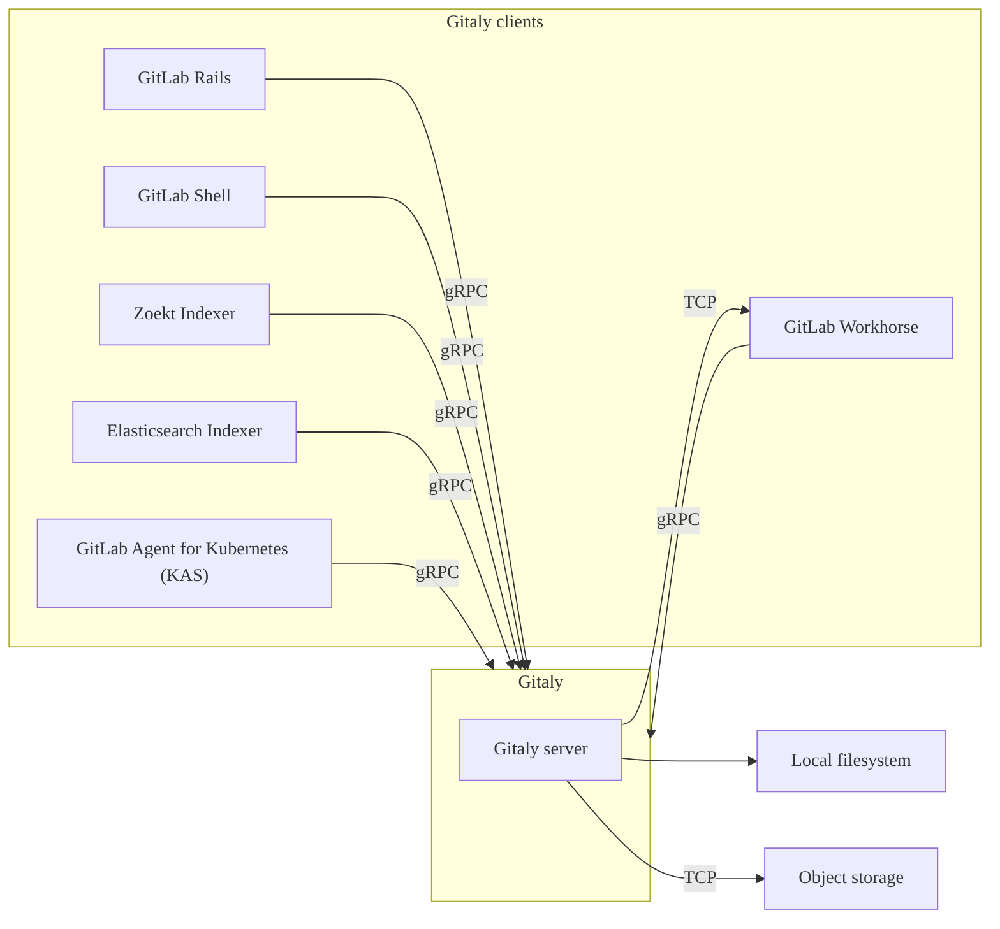



- 계층:  Free, Premium, Ultimate
- 제공:  GitLab Self-Managed



[Gitaly](https://gitlab.com/gitlab-org/gitaly)는 Git 리포지토리에 대한 고수준의 원격 프로시저 호출(RPC) 액세스를 제공합니다. GitLab에서 Git 데이터를 읽고 쓰는 데 사용됩니다.

Gitaly는 모든 GitLab 설치에 존재하며 Git 리포지토리 저장소 및 검색을 조정합니다. Gitaly는 다음과 같을 수 있습니다:

- 단일 인스턴스 Linux 패키지 설치(한 대의 머신에서 모든 GitLab)에서 작동하는 백그라운드 서비스입니다.
- 확장 및 가용성 요구 사항에 따라 자체 인스턴스로 분리되고 전체 클러스터 구성으로 구성됩니다.

> [!note]
> Gitaly는 GitLab의 Git 리ポジ토リ 액세스만 관리합니다. 다른 유형의 GitLab 데이터는 Gitaly를 사용하여 액세스되지 않습니다.

GitLab은 구성된 [리포지토리](../../user/project/repository/_index.md) 에 대해 구성된 [리포지토리 저장소](../repository_storage_paths.md)를 통해 액세스합니다. 각 새로운 리포지토리는 구성된 [가중치](../repository_storage_paths.md#configure-where-new-repositories-are-stored)에 따라 리포지토리 저장소 중 하나에 저장됩니다. 각 리포지토리 저장소는 다음 중 하나입니다:

- [저장소 경로](../repository_storage_paths.md)를 사용하여 리포지토리에 직접 액세스하는 Gitaly 저장소로, 각 리포지토리는 단일 Gitaly 노드에 저장됩니다. 모든 요청이 이 노드로 라우팅됩니다.
- [가상 저장소](praefect/_index.md#virtual-storage) 는 [Gitaly Cluster (Praefect)](praefect/_index.md)에서 제공하며, 각 리포지토리는 장애 허용을 위해 여러 Gitaly 노드에 저장될 수 있습니다. Gitaly Cluster (Praefect)의 경우:
  - 읽기 요청은 여러 Gitaly 노드 간에 분산되므로 성능이 향상될 수 있습니다.
  - 쓰기 요청은 리포지토리 복제본에 브로드캐스트됩니다.

다음은 Gitaly에 직접 액세스하도록 설정된 GitLab을 보여줍니다:

이 예제에서:

- 각 리포지토리는 다음 세 가지 Gitaly 저장소 중 하나에 저장됩니다: `storage-1`, `storage-2`, 또는 `storage-3`.
- 각 저장소는 Gitaly 노드로 서비스됩니다.
- 세 개의 Gitaly 노드는 파일 시스템에 데이터를 저장합니다.

## 디스크 요구 사항 {#disk-requirements}

Gitaly 및 Gitaly Cluster (Praefect)는 대량의 I/O 기반 프로세스이기 때문에 효과적으로 수행하기 위해 빠른 로컬 저장소가 필요합니다. 따라서 모든 Gitaly 노드가 솔리드 스테이트 드라이브(SSD)를 사용할 것을 강력히 권장합니다. 이러한 SSD는 Gitaly가 많은 소규모 파일을 동시에 작동하므로 높은 읽기 및 쓰기 처리량을 가져야 합니다.

참고로 다음 차트는 GitLab.com의 Gitaly 프로덕션 플릿 전체에서 1분 단위의 P99 디스크 IOPS를 보여줍니다. 데이터는 월요일 아침에 시작하여 월요일 아침에 끝나는 7일간의 대표 기간에서 쿼리되었습니다. 업무 주간 중에 트래픽이 더욱 집중되면서 IOPS에서 정기적인 스파이크를 확인하세요. 원시 데이터는 더 큰 스파이크를 보여주며 쓰기가 8000 IOPS에서 최고조에 도달합니다. 사용 가능한 디스크 처리량은 Gitaly 요청의 중단을 방지하기 위해 이러한 스파이크를 처리해야 합니다.

- P99 디스크 IOPS (읽기):

  

- P99 디스크 IOPS (쓰기):

  

일반적으로 다음을 볼 수 있습니다:

- 초당 500~1000회의 읽기, 초당 3500회의 읽기 최고값까지.
- 초당 약 500회의 쓰기, 초당 3000회 이상의 쓰기 최고값까지.

작성 시점 기준 Gitaly 플릿의 대다수는 `t2d-standard-32` 인스턴스이며 `pd-ssd` 디스크를 사용합니다. [광고된](https://cloud.google.com/compute/docs/disks/performance#t2d_instances) 최대 쓰기 및 읽기 IOPS는 60,000입니다.

GitLab.com은 GitLab Self-Managed 인스턴스에서 기본적으로 활성화되지 않은 비용이 많이 드는 Git 작업에 대해 더 엄격한 [동시성 제한](concurrency_limiting.md)을 적용합니다. 완화된 동시성 제한, 특히 큰 모노레포에 대한 작업, 또는 [pack-objects 캐시](configure_gitaly.md#pack-objects-cache) 사용도 디스크 활동을 크게 증가시킬 수 있습니다.

실제로 사용자 환경의 경우 Gitaly 인스턴스에서 관찰하는 디스크 활동은 게시된 결과와 크게 다를 수 있습니다. 클라우드 환경에서 실행 중인 경우 더 큰 인스턴스를 선택하면 일반적으로 사용 가능한 디스크 IOPS가 증가합니다. 프로비저닝된 IOPS 디스크 유형을 보장된 처리량으로 선택할 수도 있습니다. 클라우드 공급자의 설명서를 참조하여 IOPS를 올바르게 구성하는 방법을 알아봅니다.

리포지토리 데이터의 경우 성능 및 일관성 이유로 Gitaly 및 Gitaly Cluster (Praefect)에서는 로컬 저장소만 지원됩니다. [NFS](../nfs.md) 또는 [클라우드 기반 파일 시스템](../nfs.md#avoid-using-cloud-based-file-systems)과 같은 대체 방법은 지원되지 않습니다.

## Gitaly 아키텍처 {#gitaly-architecture}

Gitaly는 클라이언트-서버 아키텍처를 구현합니다:

- Gitaly 서버는 Gitaly 자체를 실행하는 모든 노드입니다.
- Gitaly 클라이언트는 Gitaly 서버에 요청을 하는 프로세스를 실행하는 모든 노드입니다. Gitaly 클라이언트는 Gitaly 소비자로도 알려져 있으며 다음을 포함합니다:
  - [GitLab Rails 애플리케이션](https://gitlab.com/gitlab-org/gitlab)
  - [GitLab Shell](https://gitlab.com/gitlab-org/gitlab-shell)
  - [GitLab Workhorse](https://gitlab.com/gitlab-org/gitlab-workhorse)
  - [GitLab Elasticsearch Indexer](https://gitlab.com/gitlab-org/gitlab-elasticsearch-indexer)
  - [GitLab Zoekt Indexer](https://gitlab.com/gitlab-org/gitlab-zoekt-indexer)
  - [Kubernetes용 GitLab Agent (KAS)](https://gitlab.com/gitlab-org/cluster-integration/gitlab-agent)

다음은 Gitaly 클라이언트-서버 아키텍처를 보여줍니다:

## Gitaly 구성 {#configuring-gitaly}

Gitaly는 Linux 패키지 설치로 사전 구성되어 있으며, 이는 [최대 20 RPS / 1,000명 사용자에게 적합한](../reference_architectures/1k_users.md) 구성입니다. 다음에 대해서는:

- 최대 40 RPS / 2,000명 사용자를 위한 Linux 패키지 설치는 [특정 Gitaly 구성 지침](../reference_architectures/2k_users.md#configure-gitaly)을 참조하세요.
- 자체 컴파일 설치 또는 사용자 정의 Gitaly 설치는 [Gitaly 구성](configure_gitaly.md)을 참조하세요.

일일 Git 쓰기 작업을 수행하는 2000명 이상의 활성 사용자가 있는 GitLab 설치는 Gitaly Cluster (Praefect) 사용에 가장 적합할 수 있습니다.

## Gitaly CLI {#gitaly-cli}



- `gitaly git` 하위 명령이 GitLab 17.4에서 [도입](https://gitlab.com/gitlab-org/gitaly/-/merge_requests/7119)되었습니다.



`gitaly` 명령은 Gitaly 관리자를 위한 추가 하위 명령을 제공하는 명령줄 인터페이스입니다. 예를 들어 Gitaly CLI는 다음과 같은 용도로 사용됩니다:

- 리포지토리에 대해 [사용자 정의 Git 훅 구성](../server_hooks.md)을 수행합니다.
- Gitaly 구성 파일의 유효성을 검사합니다.
- 내부 Gitaly API 접근성을 확인합니다.
- 디스크의 리포지토리에 대해 [Git 명령 실행](troubleshooting.md#use-gitaly-git-when-git-is-required-for-troubleshooting)을 수행합니다.

다른 하위 명령에 대한 자세한 내용은 `sudo -u git -- /opt/gitlab/embedded/bin/gitaly --help`을 실행하세요.

## 리포지토리 백업 {#backing-up-repositories}

GitLab 이외의 도구를 사용하여 리포지토리를 백업하거나 동기화할 때는 리포지토리 데이터를 복사하는 동안 [쓰기를 방지](../backup_restore/backup_gitlab.md#prevent-writes-and-copy-the-git-repository-data)해야 합니다.

## 번들 URI {#bundle-uris}

Gitaly와 함께 Git [번들 URI](https://git-scm.com/docs/bundle-uri)를 사용할 수 있습니다. 자세한 내용은 [번들 URI 설명서](bundle_uris.md)를 참조하세요.

## 리포지토리에 직접 액세스 {#directly-accessing-repositories}

GitLab은 Gitaly가 지속적으로 개선되고 변경되고 있으므로 Git 클라이언트나 다른 도구로 디스크에 저장된 Gitaly 리포지토리에 직접 액세스하지 않을 것을 권장합니다. 이러한 개선 사항은 가정을 무효화하여 성능 저하, 불안정성, 심지어 데이터 손실로 이어질 수 있습니다. 예를 들어:

- Gitaly는 공식 gRPC 인터페이스를 사용하여 리포지토리에 대한 액세스를 제어하고 모니터링하는 [`info/refs` 광고 캐시](https://gitlab.com/gitlab-org/gitaly/blob/master/doc/design_diskcache.md)와 같은 최적화를 가지고 있습니다.
- [Gitaly Cluster (Praefect)](praefect/_index.md) 는 gRPC 인터페이스와 데이터베이스에 의존하여 리포지토리 상태를 결정하는 장애 허용 및 [분산 읽기](praefect/_index.md#distributed-reads)와 같은 최적화가 있습니다.

> [!warning]
> 리포지토리 액세스는 자신의 위험으로 수행되며 지원되지 않습니다.
