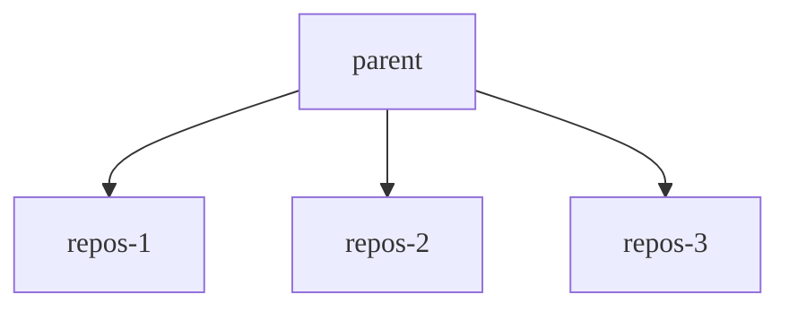

Linux에서 제어 그룹(cgroup)을 사용하여 특정 프로세스에서 사용할 수 있는 메모리와 CPU의 양을 제한할 수 있습니다. Cgroup은 메모리 및 CPU 과다 사용으로 인한 예상 외의 리소스 고갈로부터 시스템을 보호하는 데 도움이 됩니다. Cgroup은 광범위하게 사용 가능하며 컨테이너화의 기본 메커니즘으로 일반적으로 사용됩니다.

Cgroup은 의사 파일 시스템을 사용하여 구성되며, 일반적으로 `/sys/fs/cgroup`에 마운트되고 계층적 방식으로 리소스를 할당합니다. 마운트 포인트는 Gitaly에서 구성 가능합니다. 구조는 사용 중인 cgroup의 버전에 따라 다릅니다:

- Cgroup v1은 리소스 중심의 계층 구조를 따릅니다. 부모 디렉터리는 `cpu` 및 `memory`과 같은 리소스입니다.
- Cgroup v2는 프로세스 중심의 접근 방식을 채택합니다. 부모 디렉터리는 프로세스 그룹이며, 그 내의 파일은 제어되는 각 리소스를 나타냅니다.

자세한 소개는 [cgroup Linux man 페이지](https://man7.org/linux/man-pages/man7/cgroups.7.html)를 참고하세요.

Gitaly가 실행될 때:

- 가상 머신에서는 cgroup v1과 cgroup v2 모두 지원됩니다. Gitaly는 마운트 포인트를 기반으로 사용할 cgroup 버전을 자동으로 감지합니다.
- Kubernetes 클러스터에서는 cgroup v1을 사용하여 cgroup 계층 구조에 대한 읽기 및 쓰기 권한을 컨테이너에 위임할 수 없으므로 cgroup v2만 지원됩니다.

Gitaly가 cgroup v2로 실행할 때 [clone](https://man7.org/linux/man-pages/man2/clone.2.html) syscall을 사용하여 cgroup 아래에서 직접 프로세스를 시작할 수 있는 기능과 같은 추가 기능 및 개선 사항을 사용할 수 있습니다.

## 시작하기 전에 {#before-you-begin}

환경에서 제한을 설정할 때는 신중하게 하며 예상 외의 트래픽으로부터 보호하는 것과 같은 특정한 경우에만 적용해야 합니다. 제한에 도달하면 연결이 끊어져 사용자에게 부정적인 영향을 미칩니다. 일관되고 안정적인 성능을 위해 노드 사양 조정 및 [대규모 리포지토리 검토](../../user/project/repository/monorepos/_index.md) 또는 워크로드와 같은 다른 옵션을 먼저 살펴봐야 합니다.

메모리에 대해 cgroup을 설정할 때는 Gitaly 노드에 스왑이 구성되지 않았는지 확인해야 합니다. 프로세스가 종료되지 않고 대신 스왑 사용으로 전환될 수 있기 때문입니다. 커널은 사용 가능한 스왑 메모리를 cgroup에 의해 부과된 제한에 추가적인 것으로 간주합니다. 이 상황은 성능 저하로 이어질 수 있습니다. Gitaly에서 cgroup을 설정하려면 `repositories` 필드를 `0`보다 큰 `count`로 구성해야 합니다.

## Gitaly가 cgroup에서 이점을 얻는 방법 {#how-gitaly-benefits-from-cgroups}

일부 Git 작업은 다음과 같은 상황에서 고갈 지점까지 과도한 리소스를 소비할 수 있습니다:

- 예상 외의 높은 트래픽.
- 모범 사례를 따르지 않는 대규모 리포지토리에 대해 실행되는 작업입니다.

이러한 리소스를 소비하는 특정 리포지토리의 활동은 "성가신 이웃"으로 알려져 있으며 Gitaly 서버에 호스트되는 다른 리포지토리의 Git 성능 저하로 이어질 수 있습니다.

강력한 보호 수단으로서 Gitaly는 cgroup을 사용하여 커널에 이러한 작업을 시스템 리소스를 모두 차지하고 불안정성을 유발하기 전에 종료하도록 지시할 수 있습니다. Gitaly는 Git 명령이 실행 중인 리포지토리에 따라 Git 프로세스를 cgroup에 할당합니다. 이러한 cgroup을 리포지토리 cgroup이라고 합니다. 각 리포지토리 cgroup:

- 메모리 및 CPU 제한이 있습니다.
- 하나 이상의 리포지토리에 대한 Git 프로세스를 포함합니다. 총 cgroup의 수는 구성 가능합니다. 각 cgroup은 일관된 순환 해시를 사용하여 주어진 리포지토리의 Git 프로세스가 항상 같은 cgroup에서 끝나도록 합니다.

리포지토리 cgroup이 다음에 도달할 때:

- 메모리 제한에 도달하면 커널이 프로세스를 검색하여 종료 후보를 찾으며, 이는 클라이언트 요청 중단으로 이어질 수 있습니다.
- CPU 제한의 경우 프로세스는 종료되지 않지만 프로세스가 허용된 것보다 더 많은 CPU를 소비하지 못하도록 방지되므로 클라이언트 요청이 제한될 수 있지만 중단되지는 않습니다.

이 제한에 도달하면 성능이 감소할 수 있으며 사용자가 연결이 끊어질 수 있습니다.

다음 다이어그램은 cgroup 구조를 보여줍니다:

- 부모 cgroup은 모든 Git 프로세스에 대한 제한을 관리합니다.
- 각 리포지토리 cgroup(`repos-1`부터 `repos-3`까지 이름이 지정됨)은 리포지토리 수준에서 제한을 적용합니다.

Gitaly 스토리지가 다음을 제공하는 경우:

- 3개의 리포지토리만 있으면 각 리포지토리가 cgroup 중 하나로 직접 들어갑니다.
- 리포지토리 cgroup의 수보다 많으면 여러 리포지토리가 일관된 방식으로 같은 그룹에 할당됩니다.



## 오버서브스크립션 구성 {#configuring-oversubscription}

리포지토리 cgroup의 수는 수천 개의 리포지토리를 제공하는 스토리지에서도 격리가 여전히 발생할 수 있도록 충분히 높아야 합니다. 리포지토리 수의 좋은 출발점은 스토리지의 활성 리포지토리 수의 2배입니다.

리포지토리 cgroup이 부모 cgroup 위에 추가 제한을 적용하기 때문에, 부모 제한을 그룹 수로 나누어 구성했다면 지나치게 제한적인 제한이 되었을 것입니다. 예를 들어:

- 부모 메모리 제한은 32 GiB입니다.
- 활성 리포지토리가 약 100개 있습니다.
- `cgroups.repositories.count = 100`을 구성했습니다.

32 GiB를 100으로 나누면 리포지토리 cgroup당 0.32 GiB만 할당됩니다. 이 설정은 성능이 극도로 저하되고 활용도가 현저히 떨어집니다.

오버서브스크립션을 사용하여 정상 작업 중에 기본 수준의 성능을 유지하면서 소수의 높은 워크로드 리포지토리가 필요할 때 "버스트"되도록 허용하고 관련 없는 요청에 영향을 주지 않을 수 있습니다. 오버서브스크립션은 시스템에서 기술적으로 사용 가능한 것보다 더 많은 리소스를 할당하는 것을 의미합니다.

이전 예제를 사용하면 시스템에 10 GiB * 100의 시스템 메모리가 없음에도 불구하고 각 리포지토리 cgroup에 10 GiB의 메모리를 할당하여 오버서브스크립션할 수 있습니다. 이 값은 10 GiB가 모든 하나의 리포지토리에 대한 정상 작업에 충분하지만 두 개의 리포지토리가 각각 10 GiB로 버스트할 수 있고 기본 성능을 유지하기 위한 세 번째 리소스 버킷을 남길 수 있다고 가정합니다.

CPU 시간에는 유사한 규칙이 적용됩니다. 전체 시스템에서 사용 가능한 것보다 더 많은 CPU 코어로 리포지토리 cgroup을 의도적으로 할당합니다. 예를 들어 시스템에 총 400개의 코어가 없더라도 리포지토리 cgroup당 4개의 코어를 할당하도록 결정할 수 있습니다.

오버서브스크립션을 제어하는 두 가지 주요 값:

-`cpu_quota_us` -`memory_bytes`

부모 cgroup과 리포지토리 cgroup 각 값 간의 차이는 오버서브스크립션의 양을 결정합니다.

## 측정 및 튜닝 {#measurement-and-tuning}

오버서브스크립션에 대한 올바른 기본 리소스 요구사항을 설정하고 튜닝하려면 Gitaly 서버의 프로덕션 워크로드를 관찰해야 합니다. 기본적으로 노출되는 [Prometheus 메트릭](../monitoring/prometheus/_index.md)은 이를 위해 충분합니다. 다음 쿼리를 사용하여 특정 Gitaly 서버의 CPU 및 메모리 사용량을 측정하는 것을 가이드로 사용할 수 있습니다:

| 쿼리                                                                                                                                                | 리소스                                                          |
|------------------------------------------------------------------------------------------------------------------------------------------------------|-------------------------------------------------------------------|
| `quantile_over_time(0.99, instance:node_cpu_utilization:ratio{type="gitaly", fqdn="gitaly.internal"}[5m])`    | 지정된 `fqdn`을 가진 Gitaly 노드의 p99 CPU 활용률    |
| `quantile_over_time(0.99, instance:node_memory_utilization:ratio{type="gitaly", fqdn="gitaly.internal"}[5m])` | 지정된 `fqdn`을 가진 Gitaly 노드의 p99 메모리 활용률 |

대표 기간(예: 일반적인 업무 주간) 동안 관찰한 활용률을 기반으로 정상 작업에 필요한 기본 리소스 요구사항을 결정할 수 있습니다. 이전 예제의 구성을 도출하기 위해 업무 주간 동안 일관된 10 GiB 메모리 사용량과 CPU에 대한 4코어 로드를 관찰했을 것입니다.

워크로드가 변경되면 메트릭을 다시 검토하고 cgroup 구성을 조정해야 합니다. cgroup을 설정한 후 현저히 저하된 성능을 발견하면 구성을 조정해야 합니다. 이는 제한이 너무 제한적임을 나타낼 수 있기 때문입니다.

## 사용 가능한 구성 설정 {#available-configuration-settings}



- `max_cgroups_per_repo` [GitLab 16.7에서 도입됨](https://gitlab.com/gitlab-org/gitaly/-/issues/5689).
- 레거시 메서드에 대한 설명서는 [GitLab 17.8에서 제거됨](https://gitlab.com/gitlab-org/gitlab/-/merge_requests/176694).



Gitaly에서 리포지토리 cgroup을 구성하려면 `/etc/gitlab/gitlab.rb`에서 `gitaly['configuration'][:cgroups]`에 대해 다음 설정을 사용합니다:

- `mountpoint`은 부모 cgroup 디렉터리가 마운트되는 위치입니다. `/sys/fs/cgroup`로 기본 설정됩니다.
- `hierarchy_root`은 Gitaly가 그룹을 생성하는 부모 cgroup이며 Gitaly가 실행되는 사용자 및 그룹이 소유할 것으로 예상됩니다. Linux 패키지 설치는 Gitaly가 시작될 때 `mountpoint/<cpu|memory>/hierarchy_root` 디렉터리 세트를 생성합니다.
- `memory_bytes`은 Gitaly가 생성하는 모든 Git 프로세스에 총괄적으로 부과되는 총 메모리 제한입니다. 0은 제한이 없음을 의미합니다.
- `cpu_shares`은 Gitaly가 생성하는 모든 Git 프로세스에 총괄적으로 부과되는 CPU 제한입니다. 0은 제한이 없음을 의미합니다. 최대값은 1024 공유이며, 이는 CPU의 100%를 나타냅니다.
- `cpu_quota_us`은 [`cfs_quota_us`](https://docs.kernel.org/scheduler/sched-bwc.html#management)이며, 이를 통해 cgroup의 프로세스가 이 할당량 값을 초과하면 프로세스를 제한합니다. 우리는 `cfs_period_us`를 `100ms`로 설정하므로 1개 코어는 `100000`입니다. 0은 제한이 없음을 의미합니다.
- `repositories.count`은 cgroup 풀의 cgroup 수입니다. 새 Git 명령이 생성될 때마다 Gitaly는 명령이 수행하는 리포지토리를 기반으로 이러한 cgroup 중 하나에 할당합니다. 순환 해싱 알고리즘은 Git 명령을 이러한 cgroup에 할당하므로 리포지토리의 Git 명령은 항상 같은 cgroup에 할당됩니다.
- `repositories.memory_bytes`은 리포지토리 cgroup에 포함된 모든 Git 프로세스에 부과되는 총 메모리 제한입니다. 0은 제한이 없음을 의미합니다. 이 값은 최상위 수준의 `memory_bytes`을 초과할 수 없습니다.
- `repositories.cpu_shares`은 리포지토리 cgroup에 포함된 모든 Git 프로세스에 부과되는 CPU 제한입니다. 0은 제한이 없음을 의미합니다. 최대값은 1024 공유이며, 이는 CPU의 100%를 나타냅니다. 이 값은 최상위 수준의`cpu_shares`을 초과할 수 없습니다.
- `repositories.cpu_quota_us`은 [`cfs_quota_us`](https://docs.kernel.org/scheduler/sched-bwc.html#management)이며 리포지토리 cgroup에 포함된 모든 Git 프로세스에 부과됩니다. Git 프로세스는 주어진 할당량보다 더 많은 리소스를 사용할 수 없습니다. 우리는 `cfs_period_us`를 `100ms`로 설정하므로 1개 코어는 `100000`입니다. 0은 제한이 없음을 의미합니다.
- `repositories.max_cgroups_per_repo`은 특정 리포지토리를 대상으로 하는 Git 프로세스가 분산될 수 있는 리포지토리 cgroup의 수입니다. 이를 통해 리포지토리 cgroup에 대해 더 보수적인 CPU 및 메모리 제한을 구성할 수 있으면서도 버스트 워크로드를 허용할 수 있습니다. 예를 들어 `max_cgroups_per_repo`이 `2`이고 `memory_bytes` 제한이 10 GB인 경우 특정 리포지토리에 대한 독립적인 Git 작업은 최대 20 GB의 메모리를 소비할 수 있습니다.

예(권장되지 않는 설정):

```ruby
# in /etc/gitlab/gitlab.rb
gitaly['configuration'] = {
  # ...
  cgroups: {
    mountpoint: '/sys/fs/cgroup',
    hierarchy_root: 'gitaly',
    memory_bytes: 64424509440, # 60 GB
    cpu_shares: 1024,
    cpu_quota_us: 400000 # 4 cores
    repositories: {
      count: 1000,
      memory_bytes: 32212254720, # 20 GB
      cpu_shares: 512,
      cpu_quota_us: 200000, # 2 cores
      max_cgroups_per_repo: 2
    },
  },
}
```

## cgroup 모니터링 {#monitoring-cgroups}

cgroup 모니터링에 대한 정보는 [Gitaly cgroup 모니터링](monitoring.md#monitor-gitaly-cgroups)을 참고하세요.
