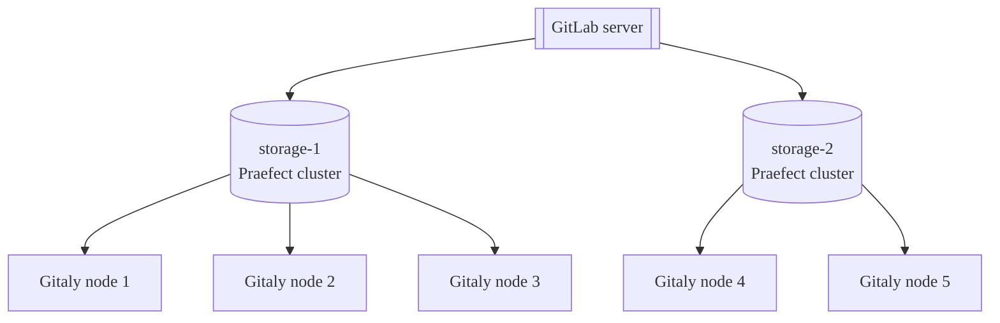
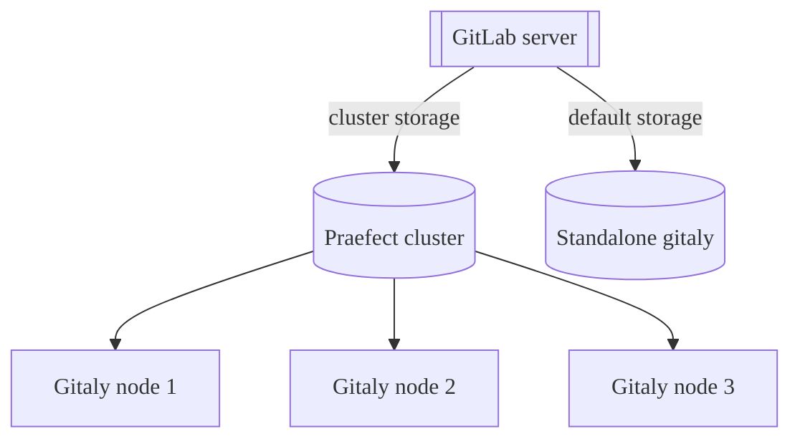



- 계층:  Free, Premium, Ultimate
- 제공:  GitLab Self-Managed



Git 저장소는 GitLab의 Gitaly 서비스를 통해 제공되며 GitLab 작동에 필수적입니다. 사용자, 리포지토리 및 활동 수가 증가하면 다음과 같은 방식으로 Gitaly를 적절하게 확장하는 것이 중요합니다:

- 리소스 소진으로 인해 Git, Gitaly 및 GitLab 애플리케이션 성능이 저하되기 전에 Git에 사용 가능한 CPU 및 메모리 리소스를 증가시킵니다.
- 저장소 제한에 도달하여 쓰기 작업이 실패하기 전에 사용 가능한 저장소를 증가시킵니다.
- 단일 장애점을 제거하여 장애 내성을 개선합니다. 서비스 성능 저하로 인해 프로덕션에 변경 사항을 배포할 수 없게 되면 Git는 미션 크리티컬로 간주해야 합니다.

Gitaly를 클러스터 구성으로 실행할 수 있습니다:

- Gitaly 서비스를 확장합니다.
- 장애 내성을 증가시킵니다.

이 구성에서는 모든 Git 리포지토리를 클러스터의 여러 Gitaly 노드에 저장할 수 있습니다.

Gitaly 클러스터(Praefect)를 사용하면 다음과 같은 방식으로 장애 내성이 증가합니다:

- 쓰기 작업을 웜 대기 Gitaly 노드에 복제합니다.
- Gitaly 노드 장애를 감지합니다.
- Git 요청을 사용 가능한 Gitaly 노드로 자동 라우팅합니다.

> [!note]
> Gitaly 클러스터(Praefect)에 대한 기술 지원은 GitLab Premium 및 Ultimate 고객으로 제한됩니다.

다음 예시는 Gitaly 클러스터(Praefect)에서 제공하는 가상 저장소인 `storage-1`에 액세스하도록 설정된 GitLab을 보여줍니다:


이 예시에서:

- 리포지토리는 `storage-1`이라는 가상 저장소에 저장됩니다.
- 3개의 Gitaly 노드가 `storage-1` 액세스를 제공합니다: `gitaly-1`, `gitaly-2`, 및 `gitaly-3`.
- 3개의 Gitaly 노드는 3개의 별도 해시 저장소 위치에 데이터를 공유합니다.
- [복제 팩터](#replication-factor)는 `3`입니다. 각 리포지토리의 3개 복사본이 유지됩니다.

단일 노드 장애를 가정할 때 Gitaly 클러스터(Praefect)의 가용성 목표는 다음과 같습니다:

- 복구 지점 목표(RPO):  1분 미만입니다.

  쓰기 작업은 비동기로 복제됩니다. 새로 승격된 주 노드에 복제되지 않은 쓰기 작업은 손실됩니다. 실패한 노드에서 진행 중이던 모든 읽기 작업은 종료됩니다.

  [강한 일관성](#strong-consistency)은 일부 경우에 손실을 방지합니다.

- 복구 시간 목표(RTO):  10초 미만입니다. 중단은 각 Praefect 노드에서 매초 실행되는 상태 확인으로 감지됩니다. 장애 조치에는 각 Praefect 노드에서 10번의 연속적인 실패한 상태 확인이 필요합니다.

RPO 및 RTO 개선사항은 에픽 [8903](https://gitlab.com/groups/gitlab-org/-/epics/8903)에서 제안됩니다.

> [!warning]
> 완전한 클러스터 장애가 발생하면 재해 복구 계획을 실행해야 합니다. 이는 이전에 설명한 RPO 및 RTO에 영향을 줄 수 있습니다.

## Gitaly 클러스터(Praefect) 배포 전 {#before-deploying-gitaly-cluster-praefect}

Gitaly 클러스터(Praefect)는 장애 내성의 이점을 제공하지만 추가적인 설정 및 관리 복잡성이 따릅니다. Gitaly 클러스터(Praefect)를 배포하기 전에 다음을 참고하세요:

- 기존 [알려진 문제](#known-issues).
- [스냅숏 백업 및 복구](#snapshot-backup-and-recovery).
- [구성 가이드](../configure_gitaly.md) 및 [리포지토리 저장소 옵션](../../repository_storage_paths.md)을 참고하여 Gitaly 클러스터(Praefect)가 최적의 설정인지 확인하세요.

Gitaly 클러스터(Praefect)로 아직 마이그레이션하지 않은 경우 2가지 옵션이 있습니다:

- 분할된 Gitaly 인스턴스.
- Gitaly 클러스터(Praefect).

질문이 있으면 Customer Success Manager 또는 고객 지원에 문의하세요.

Gitaly 클러스터(Praefect)를 이미 사용 중이며 문제 또는 제한 사항이 발생한 경우, 복구 또는 복구에 대한 즉각적인 도움을 받으려면 고객 지원에 문의하세요.

### 알려진 이슈 {#known-issues}

다음 표는 Gitaly 클러스터(Praefect) 사용에 영향을 미치는 현재 알려진 문제를 설명합니다. 이러한 문제의 현재 상태는 참조된 이슈 및 에픽을 참고하세요.

| 문제                                                                                                 | 요약                                                                                                                                                                                                                                    | 회피 방법                                                                                                                                                                                                                                                                                                                                                                                                               |
|:------------------------------------------------------------------------------------------------------|:-------------------------------------------------------------------------------------------------------------------------------------------------------------------------------------------------------------------------------------------|:---------------------------------------------------------------------------------------------------------------------------------------------------------------------------------------------------------------------------------------------------------------------------------------------------------------------------------------------------------------------------------------------------------------------------|
| Gitaly 클러스터(Praefect) + Geo - 실패한 동기화 재시도 문제                                        | Gitaly 클러스터(Praefect)가 Geo 보조 사이트에서 사용되는 경우, 동기화에 실패한 리포지토리는 Geo가 다시 동기화를 시도할 때 계속 실패할 수 있습니다. 이 상태에서 복구하려면 지원 팀의 도움이 필요하여 수동 단계를 실행해야 합니다. | GitLab 15.0 ~ 15.2에서 Geo 주 사이트에서 [`gitaly_praefect_generated_replica_paths` 기능 플래그](#praefect-generated-replica-paths)를 활성화합니다. GitLab 15.3에서는 기능 플래그가 기본적으로 활성화됩니다.                                                                                                                                                                                                           |
| 업그레이드 후 마이그레이션이 적용되지 않아 Praefect가 데이터베이스에 데이터를 삽입할 수 없음 | 데이터베이스가 완료된 마이그레이션으로 최신 상태로 유지되지 않으면 Praefect 노드는 표준 작업을 수행할 수 없습니다.                                                                                                         | Praefect 데이터베이스가 실행 중이고 모든 마이그레이션이 완료되었는지 확인하세요. 예를 들어, 이 명령어는 적용된 모든 마이그레이션의 목록을 표시해야 합니다: `sudo -u git -- /opt/gitlab/embedded/bin/praefect -config /var/opt/gitlab/praefect/config.toml sql-migrate-status`. [업그레이드 지원 요청](https://about.gitlab.com/support/scheduling-upgrade-assistance/)을 고려하여 업그레이드 계획을 지원 팀에서 검토할 수 있도록 하세요. |
| 실행 중인 클러스터의 스냅숏에서 Gitaly 클러스터(Praefect) 노드 복구                       | Gitaly 클러스터(Praefect)는 일관된 상태로 실행되므로, 뒤처진 단일 노드를 도입하면 클러스터가 노드의 데이터를 다른 노드의 데이터와 조정할 수 없게 됩니다.                                    | 백업 스냅숏에서 단일 Gitaly 클러스터(Praefect) 노드를 복구하지 마세요. 백업에서 복구해야 하는 경우:<br/><br/>1\. [GitLab 종료](../../read_only_gitlab.md#shut-down-the-gitlab-ui).<br/>2\. 모든 Gitaly 클러스터(Praefect) 노드를 동시에 스냅숏으로 만듭니다.<br/>3\. Praefect 데이터베이스의 데이터베이스 덤프를 생성합니다.                                                                                              |
| Kubernetes, Amazon ECS 또는 유사한 환경에서 실행할 때의 제한사항                                        | Gitaly 클러스터(Praefect)는 지원되지 않으며 Gitaly에는 알려진 제한사항이 있습니다. 자세한 내용은 [에픽 6127](https://gitlab.com/groups/gitlab-org/-/epics/6127)을 참고하세요.                                                                     | 저희 [참조 아키텍처](../../reference_architectures/_index.md)를 사용하세요.                                                                                                                                                                                                                                                                                                                                                |
| `PostReceiveHook`은 Praefect에서 기록한 쓰기 전에 호출됩니다                                  | 경쟁 조건으로 인해 `PostReceiveHook`이 모든 노드에 복제되기 전에 실행될 수 있습니다. CI/CD 파이프라인이 아직 쓰기를 받지 않은 복제본을 대상으로 할 때, 이 경쟁 조건으로 인해 파이프라인이 `couldn't find remote ref refs/merge-requests/$iid/{head,merge}` 오류로 실패합니다. 자세한 내용은 [이슈 5406](https://gitlab.com/gitlab-org/gitaly/-/issues/5406)을 참고하세요 | 전체 작업을 다시 시도하거나 소스 페치 단계만 다시 시도하세요. 자세한 내용은 [작업 단계 시도](../../../ci/runners/configure_runners.md#job-stages-attempts)를 참고하세요. |
| HPA 자동 크기 조정으로 인해 저장소 이동이 자동으로 실패할 수 있음                                             | Horizontal Pod Autoscaler(HPA)를 Sidekiq 파드와 함께 사용할 때, 작업 실행 중 파드 스케일링으로 인해 리포지토리 저장소 이동이 자동으로 실패할 수 있습니다.                                                                                                | 리포지토리 저장소 이동을 수행하기 전에 HPA를 고정 복제본으로 구성하고, `minReplicas` = `maxReplicas`로 설정하여 마이그레이션 중 스케일링을 방지하세요.                                                                                                                                                                                                                                                                        |

### 스냅숏 백업 및 복구 {#snapshot-backup-and-recovery}

Gitaly 클러스터(Praefect)는 스냅숏 백업을 지원하지 않습니다. 스냅숏 백업으로 인해 Praefect 데이터베이스가 디스크 저장소와 동기화되지 않을 수 있는 문제가 발생할 수 있습니다. Praefect가 복구 중에 Gitaly 디스크 정보의 복제 메타데이터를 다시 빌드하는 방식 때문에 [공식 백업 및 복구 Rake 작업](../../backup_restore/_index.md)을 사용해야 합니다.

[증분 백업 방법](../../backup_restore/backup_gitlab.md#incremental-repository-backups)을 사용하여 Gitaly 클러스터(Praefect) 백업 속도를 높일 수 있습니다.

두 방법을 모두 사용할 수 없는 경우, 복구 지원을 위해 고객 지원에 문의하세요.

## Geo와의 비교 {#comparison-to-geo}

Gitaly 클러스터(Praefect)와 [Geo](../../geo/_index.md)는 다양한 유형의 중복성을 제공합니다.

- Gitaly 클러스터(Praefect)의 중복성은 데이터 저장소에 장애 내성을 제공하며 사용자에게는 투명합니다.
- Geo의 중복성은 [복제](../../geo/_index.md) (사용자에게 표시됨) 및 GitLab의 전체 인스턴스에 대한 [재해 복구](../../geo/disaster_recovery/_index.md)를 제공합니다. Geo는 Git 데이터를 포함하여 [여러 데이터 유형을 복제](../../geo/replication/datatypes.md#replicated-data-types)합니다.

다음 표는 Gitaly 클러스터(Praefect)와 Geo 간의 주요 차이점을 설명합니다:

| 도구                      | 노드    | 위치 | 지연 시간 허용도                                                                                      | 장애 조치                                                                     | 일관성                   | 중복성 제공 대상 |
|:--------------------------|:---------|:----------|:-------------------------------------------------------------------------------------------------------|:-----------------------------------------------------------------------------|:------------------------------|:------------------------|
| Gitaly 클러스터(Praefect) | 여러 개 | 단일    | [1초 미만, 이상적으로는 한 자리 밀리초](configure.md#network-latency-and-connectivity) | [자동](configure.md#automatic-failover-and-primary-election) | [강함](#strong-consistency) | Git의 데이터 저장소     |
| Geo                       | 여러 개 | 여러 개  | 최대 1분                                                                                       | [수동](../../geo/disaster_recovery/_index.md)                              | 최종적 일관성                      | 전체 GitLab 인스턴스  |

자세한 정보는 다음을 참조하세요:

- Geo [사용 사례](../../geo/_index.md#use-cases).
- Geo [아키텍처](../../geo/_index.md#architecture).

## 가상 저장소 {#virtual-storage}

가상 저장소를 사용하면 GitLab에서 단일 리포지토리 저장소를 보유하여 리포지토리 관리를 간소화할 수 있습니다.

Gitaly 클러스터(Praefect)가 있는 가상 저장소는 일반적으로 직접 Gitaly 저장소 구성을 대체할 수 있습니다. 다만, 각 리포지토리를 여러 Gitaly 노드에 저장하기 위해 추가 저장소 공간이 필요합니다. 직접 Gitaly 저장소에 비해 Gitaly 클러스터(Praefect) 가상 저장소 사용의 이점은 다음과 같습니다:

- 개선된 장애 내성 - 각 Gitaly 노드가 모든 리포지토리의 복사본을 보유하고 있습니다.
- 향상된 리소스 활용 - 읽기 로드가 Gitaly 노드 전체에 분산되므로 샤드별 피크 로드에 대한 과잉 프로비저닝의 필요성이 감소합니다.
- 성능을 위한 수동 재조정이 필요하지 않습니다 - 읽기 로드가 Gitaly 노드 전체에 분산되기 때문입니다.
- 더 간단한 관리 - 모든 Gitaly 노드가 동일합니다.

리포지토리 복제본 수는 [복제 팩터](#replication-factor)를 사용하여 구성할 수 있습니다.

모든 리포지토리에 동일한 복제 팩터를 갖는 것이 경제적이지 않을 수 있습니다. 매우 큰 GitLab 인스턴스에 대한 더 큰 유연성을 제공하기 위해 변수 복제 팩터는 [이 이슈](https://gitlab.com/groups/gitlab-org/-/epics/3372)에서 추적됩니다.

표준 Gitaly 저장소와 마찬가지로 가상 저장소도 분할할 수 있습니다.

### 여러 가상 저장소 {#multiple-virtual-storages}

Gitaly 클러스터(Praefect) 배포에서 여러 가상 저장소를 구성할 수 있습니다. 이를 통해 다음을 수행할 수 있습니다:

- 서로 다른 성능 특성을 갖는 별도의 클러스터로 리포지토리를 구성합니다.
- 다양한 리포지토리 그룹에 서로 다른 복제 팩터를 적용합니다.
- 인프라의 여러 부분을 독립적으로 확장합니다.

가상 저장소는 GitLab 서버의 `gitlab_rails['repositories_storages']`에 구성됩니다. 이 해시의 각 항목은 고유한 가상 저장소를 나타냅니다. Praefect 구성은 각 가상 저장소를 제공하는 Gitaly 노드를 정의합니다. 서로 다른 가상 저장소의 리포지토리는 완전히 독립적이며 가상 저장소 간에 복제되지 않습니다.

예를 들어, 다음을 구성할 수 있습니다:

- `storage-1`:  복제 팩터가 3인 중요한 프로덕션 리포지토리를 위한 가상 저장소.
- `storage-2`:  복제 팩터가 2인 덜 중요한 리포지토리를 위한 가상 저장소.

각 가상 저장소는 자신만의 Gitaly 노드 세트가 필요합니다.



구성 지침은 [여러 가상 저장소 구성](configure.md#configure-multiple-virtual-storages)을 참고하세요.

### 혼합 구성 {#mixed-configuration}

GitLab을 다음의 조합으로 구성할 수 있습니다:

- 독립형 Gitaly 인스턴스(직접 Gitaly 저장소).
- Gitaly 클러스터(Praefect) 가상 저장소.

다음의 경우 혼합 구성을 사용할 수 있습니다:

- 독립형 Gitaly에서 Gitaly 클러스터(Praefect)로 단계적으로 마이그레이션합니다.
- 일부 리포지토리는 고가용성이 필요하고 다른 리포지토리는 필요하지 않습니다.
- 중요한 리포지토리에만 Gitaly 클러스터(Praefect)를 사용하여 비용을 최적화하려고 합니다.

혼합 구성에서 각 저장소는 GitLab에서 독립적으로 구성됩니다:

- 독립형 Gitaly 저장소는 Gitaly 노드에 직접 연결됩니다.
- Gitaly 클러스터(Praefect) 저장소는 Praefect 로드 밸런서에 연결됩니다.

GitLab은 모든 구성된 저장소를 동등하게 처리합니다(독립형인지 클러스터된 것인지 여부 관계없이). 새 리포지토리를 생성할 때 GitLab은 구성된 저장소 가중치 및 사용 가능한 용량을 기반으로 저장소를 선택합니다.



자세한 정보는 다음을 참조하세요:

- [혼합 구성](../configure_gitaly.md#mixed-configuration)의 예시.
- 마이그레이션 가이드는 [기존 GitLab 인스턴스용 TCP 사용](configure.md#use-tcp-for-existing-gitlab-instances)을 참고하세요.

## 저장소 레이아웃 {#storage-layout}

> [!warning]
> 저장소 레이아웃은 Gitaly 클러스터(Praefect)의 내부 세부 사항이며 릴리스 간에 안정적으로 유지되도록 보장되지 않습니다. 여기 정보는 정보 제공 목적과 디버깅 지원을 위해서만 제공됩니다. 디스크에서 리포지토리를 직접 변경하는 것은 지원되지 않으며 손상을 야기하거나 변경 사항을 덮어쓸 수 있습니다.

Gitaly 클러스터(Praefect) 가상 저장소는 단일 저장소로 보이지만 실제로는 여러 물리 저장소로 구성된 추상화입니다. Gitaly 클러스터(Praefect)는 각 작업을 각 물리 저장소에 복제해야 합니다. 작업은 일부 물리 저장소에서는 성공하지만 다른 저장소에서는 실패할 수 있습니다.

부분적으로 적용된 작업은 다른 작업의 문제를 야기할 수 있으며 시스템을 복구할 수 없는 상태로 남길 수 있습니다. 이러한 유형의 문제를 방지하기 위해 각 작업은 완전히 적용되거나 적용되지 않아야 합니다. 이 작업의 속성을 [원자성](https://en.wikipedia.org/wiki/Atomicity_(database_systems))이라고 합니다.

GitLab은 리포지토리 저장소의 저장소 레이아웃을 제어합니다. GitLab은 리포지토리 저장소에 리포지토리를 생성, 삭제 및 이동할 위치를 지시합니다. 이러한 작업은 여러 물리 저장소에 적용될 때 원자성 문제를 야기합니다. 예를 들어:

- GitLab이 복제본 중 하나를 사용할 수 없는 동안 리포지토리를 삭제합니다.
- GitLab이 나중에 리포지토리를 다시 생성합니다.

결과적으로 삭제 시점에 사용할 수 없었던 오래된 복제본은 충돌을 야기할 수 있으며 리포지토리의 재생성을 방지할 수 있습니다.

이러한 원자성 문제는 과거에 다음과 관련된 여러 문제를 야기했습니다:

- Gitaly 클러스터(Praefect)를 사용하여 보조 사이트로 Geo 동기화.
- 백업 복구.
- 리포지토리 저장소 간의 리포지토리 이동.

Gitaly 클러스터(Praefect)는 부분적으로 적용된 작업으로 인해 발생할 수 있는 충돌을 방지하는 특수한 레이아웃으로 디스크에 리포지토리를 저장하여 이러한 작업에 대한 원자성을 제공합니다.

### 클라이언트 생성 복제 경로 {#client-generated-replica-paths}

리포지토리는 [Gitaly 클라이언트](../_index.md#gitaly-architecture)에서 결정된 상대 경로에서 저장소에 저장됩니다. 이러한 경로는 `@cluster` 접두사로 시작하지 않는 것으로 식별할 수 있습니다. 상대 경로는 [해시 저장소](../../repository_storage_paths.md#hashed-storage) 스키마를 따릅니다.

### Praefect 생성 복제 경로 {#praefect-generated-replica-paths}

Gitaly 클러스터(Praefect)가 리포지토리를 생성할 때, _리포지토리 ID_라는 고유하고 영구적인 ID를 리포지토리에 할당합니다. 리포지토리 ID는 Gitaly 클러스터(Praefect)에 내부적이며 GitLab 다른 곳의 ID와 관련이 없습니다. 리포지토리가 Gitaly 클러스터(Praefect)에서 제거되었다가 나중에 다시 이동하면, 리포지토리에는 새 리포지토리 ID가 할당되며 Gitaly 클러스터(Praefect)의 관점에서는 다른 리포지토리입니다. 리포지토리 ID의 시퀀스는 항상 증가하지만 시퀀스에 간격이 있을 수 있습니다.

리포지토리 ID는 클러스터의 각 리포지토리에 대해 _복제 경로_라는 고유한 저장소 경로를 유도하는 데 사용됩니다. 리포지토리의 복제본은 모두 저장소의 동일한 복제 경로에 저장됩니다. 복제 경로는 _상대 경로_와 다릅니다:

- 상대 경로는 Gitaly 클라이언트가 리포지토리를 식별하기 위해 사용하는 이름으로, 가상 저장소와 함께 이를 고유하게 만듭니다.
- 복제 경로는 물리 저장소의 실제 물리 경로입니다.

Praefect는 클라이언트 요청을 처리할 때 RPC의 리포지토리를 가상 `(virtual storage, relative path)` 식별자에서 물리 리포지토리 `(storage, replica_path)` 식별자로 변환합니다.

복제 경로의 형식은:

- Object pools는 `@cluster/pools/<xx>/<xx>/<repository ID>`입니다. Object pools는 다른 리포지토리와 다른 디렉터리에 저장됩니다. Gitaly에서 식별할 수 있어야 하므로 하우스키핑의 일부로 이들을 정리하지 않도록 해야 합니다. Object pools를 정리하면 연결된 리포지토리에서 데이터 손실이 발생할 수 있습니다.
- 다른 리포지토리는 `@cluster/repositories/<xx>/<xx>/<repository ID>`

예를 들어, `@cluster/repositories/6f/96/54771`.

복제 경로의 마지막 구성 요소인 `54771`은 리포지토리 ID입니다. 이는 디스크의 리포지토리를 식별하는 데 사용할 수 있습니다.

`<xx>/<xx>`은 리포지토리 ID의 문자열 표현의 SHA256 해시의 처음 4개 16진 숫자입니다. 이 숫자는 리포지토리를 하위 디렉터리에 균등하게 분산하여 일부 파일 시스템에서 문제를 야기할 수 있는 과도하게 큰 디렉터리를 방지하는 데 사용됩니다. 이 경우 `54771`는 `6f960ab01689464e768366d3315b3d3b2c28f38761a58a70110554eb04d582f7`로 해시되므로 처음 4개 숫자는 `6f` 및 `96`입니다.

### 디스크의 리포지토리 식별 {#identify-repositories-on-disk}

[`praefect metadata`](troubleshooting.md#view-repository-metadata) 하위 명령어를 사용하여:

- 메타데이터 저장소에서 리포지토리의 가상 저장소 및 상대 경로를 검색합니다. 해시 저장소 경로를 가져온 후 Rails 콘솔을 사용하여 프로젝트 경로를 검색할 수 있습니다.
- 다음 중 하나를 사용하여 리포지토리가 클러스터의 어디에 저장되어 있는지 찾으세요:
  - 가상 저장소 및 상대 경로.
  - 리포지토리 ID.

디스크의 리포지토리에는 Git 구성 파일에 프로젝트 경로도 포함되어 있습니다. 리포지토리의 메타데이터가 삭제된 경우에도 구성 파일을 사용하여 프로젝트 경로를 결정할 수 있습니다. [해시 저장소 설명서의 지침](../../repository_storage_paths.md#from-hashed-path-to-project-name)을 따르세요.

### 작업의 원자성 {#atomicity-of-operations}

Gitaly 클러스터(Praefect)는 PostgreSQL 메타데이터 저장소와 저장소 레이아웃을 사용하여 리포지토리 생성, 삭제 및 이동 작업의 원자성을 보장합니다. 디스크 작업은 여러 저장소에 걸쳐 원자적으로 적용할 수 없습니다. 다만, PostgreSQL은 메타데이터 작업의 원자성을 보장합니다. Gitaly 클러스터(Praefect)는 실패한 작업이 항상 메타데이터를 일관된 상태로 남기는 방식으로 작업을 모델링합니다. 디스크는 성공적인 작업 후에도 오래된 상태를 포함할 수 있습니다. 이 상황은 예상되는 현상이며 남은 상태는 향후 작업을 방해하지 않지만 정리가 수행될 때까지 불필요하게 디스크 공간을 사용할 수 있습니다.

저장소에서 남은 리포지토리를 정리하는 [백그라운드 크롤러](https://gitlab.com/gitlab-org/gitaly/-/issues/3719)에 대한 진행 중인 작업이 있습니다.

#### 리포지토리 생성 {#repository-creations}

리포지토리를 생성할 때 Praefect는:

1. PostgreSQL에서 리포지토리 ID를 예약합니다(원자적이며 두 생성 작업이 동일한 ID를 받지 않음).
1. 리포지토리 ID에서 파생된 복제 경로의 Gitaly 저장소에 복제본을 생성합니다.
1. 리포지토리가 디스크에 성공적으로 생성된 후 메타데이터 레코드를 생성합니다.

두 동시 작업이 동일한 리포지토리를 생성하더라도 저장소의 다른 디렉터리에 저장되고 충돌하지 않습니다. 먼저 완료되는 작업이 메타데이터 레코드를 생성하고 다른 작업은 "이미 존재함" 오류로 실패합니다. 실패한 생성은 저장소에 남은 리포지토리를 남깁니다. 저장소에서 남은 리포지토리를 정리하는 [백그라운드 크롤러](https://gitlab.com/gitlab-org/gitaly/-/issues/3719)에 대한 진행 중인 작업이 있습니다.

리포지토리 ID는 PostgreSQL의 `repositories_repository_id_seq`에서 생성됩니다. 이전 예시에서 실패한 작업은 리포지토리를 성공적으로 생성하지 않고 리포지토리 ID 하나를 가져갔습니다. 실패한 리포지토리 생성은 리포지토리 ID에 간격을 초래할 것으로 예상됩니다.

#### 리포지토리 삭제 {#repository-deletions}

리포지토리는 메타데이터 레코드를 제거하여 삭제됩니다. 메타데이터 레코드가 삭제되는 순간 리포지토리는 논리적으로 더 이상 존재하지 않습니다. PostgreSQL은 제거의 원자성을 보장하며 동시 삭제는 "찾을 수 없음" 오류로 실패합니다. 메타데이터 레코드를 성공적으로 삭제한 후 Praefect는 저장소에서 복제본을 제거하려고 시도합니다. 이는 실패하고 저장소에 남은 상태를 남길 수 있습니다. 남은 상태는 결국 정리됩니다.

#### 리포지토리 이동 {#repository-moves}

Gitaly와 달리 Gitaly 클러스터(Praefect)는 저장소의 리포지토리를 이동하지 않고 메타데이터 저장소의 리포지토리의 상대 경로를 업데이트하여 리포지토리를 가상으로만 이동합니다.

## 구성 요소 {#components}

Gitaly 클러스터(Praefect)는 여러 구성 요소로 구성됩니다:

- [로드 밸런서](configure.md#load-balancer)는 요청을 분산하고 Praefect 노드에 대한 장애 내성 액세스를 제공합니다.
- [Praefect](configure.md#praefect) 노드는 클러스터를 관리하고 요청을 Gitaly 노드로 라우팅합니다.
- [PostgreSQL 데이터베이스](configure.md#postgresql) 는 클러스터 메타데이터를 유지하고 Praefect의 데이터베이스 연결을 풀링하기 위해 권장되는 [PgBouncer](configure.md#use-pgbouncer)를 제공합니다.
- Gitaly 노드는 리포지토리 저장소 및 Git 액세스를 제공합니다.

## 아키텍처 {#architecture}

Praefect는 Gitaly의 라우터 및 트랜잭션 관리자이며 Gitaly 클러스터(Praefect)를 실행하기 위한 필수 구성 요소입니다.


자세한 내용은 [Gitaly 고가용성(HA) 설계](https://gitlab.com/gitlab-org/gitaly/-/blob/master/doc/design_ha.md)를 참고하세요.

## 기능 {#features}

Gitaly 클러스터(Praefect)는 다음 기능을 제공합니다:

- Gitaly 노드 간 [분산 읽기](#distributed-reads).
- 보조 복제본의 [강한 일관성](#strong-consistency).
- 증가된 중복성을 위한 리포지토리의 [복제 팩터](#replication-factor).
- 주 Gitaly 노드에서 보조 Gitaly 노드로의 [자동 장애 조치](configure.md#automatic-failover-and-primary-election).
- 복제 큐가 비어있지 않은 경우 가능한 [데이터 손실](recovery.md#check-for-data-loss) 보고.

[에픽 1489](https://gitlab.com/groups/gitlab-org/-/epics/1489) 를 따라 [읽기를 수평으로 분산](https://gitlab.com/groups/gitlab-org/-/epics/2013)하기 포함한 제안된 개선사항을 확인하세요.

### 분산 읽기 {#distributed-reads}

Gitaly 클러스터(Praefect)는 [가상 저장소](#virtual-storage)를 위해 구성된 Gitaly 노드 간에 읽기 작업의 분산을 지원합니다.

`ACCESSOR` 옵션으로 표시된 모든 RPC는 최신 상태이고 정상인 Gitaly 노드로 리디렉션됩니다. 예를 들어, [`GetBlob`](https://gitlab.com/gitlab-org/gitaly/-/blob/v12.10.6/proto/blob.proto#L16).

이 컨텍스트에서 "최신"은 다음을 의미합니다:

- 이 Gitaly 노드에 대해 예약된 복제 작업이 없습니다.
- 마지막 복제 작업은 완료된 상태입니다.

주 노드는 다음의 경우 요청을 제공하기 위해 선택됩니다:

- 최신 노드가 없습니다.
- 노드 선택 중에 다른 오류가 발생합니다.

큰 크기의 많이 수정된 리포지토리(예: 수 GB 단위의 모노리포)가 있는 경우, 주 노드는 변경 사항이 Praefect가 보조 노드에 복제할 수 있는 것보다 더 빠르게 들어오면 대부분 또는 모든 요청을 처리할 수 있습니다. 이 경우 CI/CD 작업과 기타 리포지토리 트래픽은 주 노드의 용량에 의해 병목 현상이 발생합니다.

Prometheus를 사용하여 [읽기 분산 모니터링](monitoring.md)할 수 있습니다.

### 강한 일관성 {#strong-consistency}

Gitaly 클러스터(Praefect)는 모든 정상이고 최신 복제본에 변경 사항을 동기적으로 작성하여 강한 일관성을 제공합니다. 복제본이 트랜잭션 시점에 오래되었거나 비정상인 경우, 쓰기는 비동기적으로 복제됩니다.

강한 일관성은 주 복제 방법입니다. 일부 작업은 여전히 강한 일관성 대신 복제 작업(최종 일관성)을 사용합니다. [강한 일관성 에픽](https://gitlab.com/groups/gitlab-org/-/epics/1189)을 참고하여 자세한 내용을 확인하세요.

강한 일관성을 사용할 수 없는 경우 Gitaly 클러스터(Praefect)는 최종 일관성을 보장합니다. 이 경우 Gitaly 클러스터(Praefect)는 주 Gitaly 노드에 쓰기가 발생한 후 보조 Gitaly 노드에 모든 쓰기를 복제합니다.

강한 일관성 모니터링에 대한 자세한 내용은 [Gitaly 클러스터(Praefect) 모니터링](monitoring.md)을 참고하세요.

### 복제 팩터 {#replication-factor}

복제 팩터는 Gitaly 클러스터(Praefect)가 지정된 리포지토리의 유지하는 복사본의 수입니다. 더 높은 복제 팩터:

- 더 나은 중복성과 읽기 작업 부하 분산을 제공합니다.
- 더 높은 저장소 비용을 초래합니다.

기본적으로 Gitaly 클러스터(Praefect)는 [가상 저장소](#virtual-storage)의 모든 저장소에 리포지토리를 복제합니다.

구성 정보는 [복제 팩터 구성](configure.md#configure-replication-factor)을 참고하세요.

## Gitaly 클러스터(Praefect) 업그레이드 {#upgrade-gitaly-cluster-praefect}

Gitaly 클러스터(Praefect)를 업그레이드하려면 [무중단 업그레이드](../../../update/zero_downtime.md) 설명서를 따르세요.

## Gitaly 클러스터(Praefect)를 이전 버전으로 롤백 {#roll-back-gitaly-cluster-praefect-to-a-previous-version}

Gitaly 클러스터(Praefect)를 이전 버전으로 롤백해야 하는 경우, 일부 Praefect 데이터베이스 마이그레이션을 되돌려야 할 수 있습니다.

여러 Praefect 노드가 있다고 가정할 때 Gitaly 클러스터(Praefect)를 롤백하려면:

1. 모든 Praefect 노드에서 Praefect 서비스를 중지합니다:

   ```shell
   gitlab-ctl stop praefect
   ```

1. Praefect 노드 중 하나에서 GitLab 패키지를 이전 버전으로 롤백합니다.
1. 롤백된 노드에서 Praefect 마이그레이션의 상태를 확인합니다:

   ```shell
   sudo -u git -- /opt/gitlab/embedded/bin/praefect -config /var/opt/gitlab/praefect/config.toml sql-migrate-status
   ```

1. `unknown migration` 을 `APPLIED` 열에서 포함하는 마이그레이션의 수를 계산합니다.
1. 롤백되지 않은 Praefect 노드에서 롤백 드라이 런을 수행하여 되돌릴 마이그레이션을 검증합니다. `<CT_UNKNOWN>`은 롤백된 노드에서 보고된 알려지지 않은 마이그레이션의 수입니다.

   ```shell
   sudo -u git -- /opt/gitlab/embedded/bin/praefect -config /var/opt/gitlab/praefect/config.toml sql-migrate <CT_UNKNOWN>
   ```

1. 결과가 맞는 것처럼 보이면 `-f` 옵션으로 동일한 명령을 실행하여 마이그레이션을 되돌립니다:

   ```shell
   sudo -u git -- /opt/gitlab/embedded/bin/praefect -config /var/opt/gitlab/praefect/config.toml sql-migrate -f <CT_UNKNOWN>
   ```

1. 나머지 Praefect 노드에서 GitLab 패키지를 롤백하고 Praefect 서비스를 다시 시작합니다:

   ```shell
   gitlab-ctl start praefect
   ```

## Gitaly 클러스터(Praefect)로 마이그레이션 {#migrate-to-gitaly-cluster-praefect}

> [!warning]
> Gitaly 클러스터(Praefect)에 일부 [알려진 문제](#known-issues)가 존재합니다. 계속하기 전에 다음 정보를 검토하세요.

Gitaly 클러스터(Praefect)로 마이그레이션하기 전에:

- [Gitaly 클러스터(Praefect) 배포 전](#before-deploying-gitaly-cluster-praefect)을 검토하세요.
- 개선사항 및 버그 수정을 활용하기 위해 GitLab의 최신 가능한 버전으로 업그레이드하세요.

Gitaly 클러스터(Praefect)로 마이그레이션하려면:

1. 필요한 저장소를 생성합니다. [리포지토리 저장소 권장사항](configure.md#repository-storage-recommendations)을 참고하세요.
1. [Gitaly 클러스터(Praefect)](configure.md)를 생성하고 구성합니다.
1. 기존 Gitaly 인스턴스를 [TCP 사용](configure.md#use-tcp-for-existing-gitlab-instances)하도록 구성합니다(아직 구성되지 않은 경우).
1. [리포지토리 이동](../../operations/moving_repositories.md). Gitaly 클러스터(Praefect)로 마이그레이션하려면 Gitaly 클러스터(Praefect) 외부에 저장된 기존 리포지토리를 이동해야 합니다. 자동 마이그레이션은 없지만 GitLab API를 사용하여 이동을 예약할 수 있습니다.

`default` 리포지토리 저장소를 사용하지 않더라도 구성되어 있는지 확인해야 합니다. [이 제한사항에 대해 자세히 알아보세요](../configure_gitaly.md#gitlab-requires-a-default-repository-storage).

Kubernetes의 Gitaly 차트에서 마이그레이션하려면 [특정 마이그레이션 지침](https://docs.gitlab.com/charts/advanced/external-gitaly/#migrate-from-gitaly-chart-to-external-gitaly)을 따르세요.

## Gitaly 클러스터(Praefect)에서 마이그레이션 {#migrate-off-gitaly-cluster-praefect}

Gitaly 클러스터(Praefect)의 제한사항과 트레이드오프가 사용자 환경에 적합하지 않은 것으로 확인되면 Gitaly 클러스터(Praefect)에서 분할된 Gitaly 인스턴스로 마이그레이션할 수 있습니다:

1. 새 [Gitaly 서버](../configure_gitaly.md#run-gitaly-on-its-own-server)를 생성하고 구성합니다.
1. [리포지토리 이동](../../operations/moving_repositories.md) (새로 생성된 저장소로). 샤드별 또는 그룹별로 이동할 수 있으며, 이를 통해 여러 Gitaly 서버에 분산할 수 있습니다.
