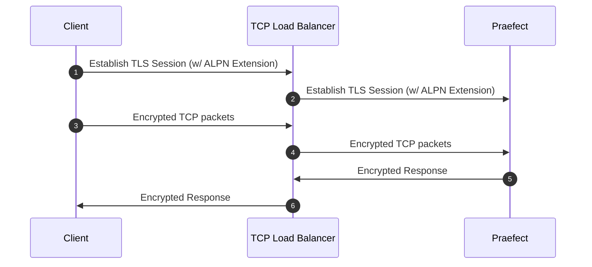
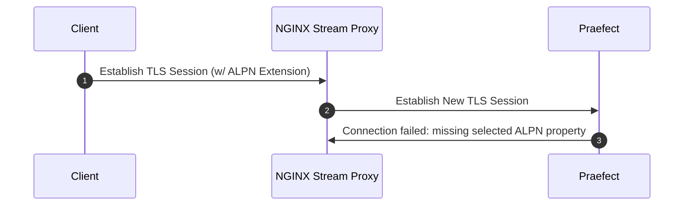

Gitaly 클러스터(Praefect)를 다음 중 하나를 사용하여 구성합니다:

- 다음까지의 설치를 위해 사용 가능한 [참조 아키텍처](../../reference_architectures/_index.md)의 일부로 Gitaly 클러스터(Praefect) 구성 지침:
  - [RPS 60개 또는 3,000명의 사용자](../../reference_architectures/3k_users.md#configure-gitaly-cluster-praefect).
  - [RPS 100개 또는 5,000명의 사용자](../../reference_architectures/5k_users.md#configure-gitaly-cluster-praefect).
  - [RPS 200개 또는 10,000명의 사용자](../../reference_architectures/10k_users.md#configure-gitaly-cluster-praefect).
  - [RPS 500개 또는 25,000명의 사용자](../../reference_architectures/25k_users.md#configure-gitaly-cluster-praefect).
  - [RPS 1000개 또는 50,000명의 사용자](../../reference_architectures/50k_users.md#configure-gitaly-cluster-praefect).
- 이 페이지에 나오는 사용자 정의 구성 지침입니다.

더 작은 GitLab 설치는 [Gitaly 자체](../_index.md)만 필요할 수 있습니다.

> [!note]
> Gitaly 클러스터(Praefect)는 아직 Kubernetes, Amazon ECS 또는 유사한 컨테이너 환경에서 지원되지 않습니다. 자세한 내용은 [에픽 6127](https://gitlab.com/groups/gitlab-org/-/epics/6127)을 참고하세요.

## 요구 사항 {#requirements}

Gitaly 클러스터(Praefect)의 최소 권장 구성에는 다음이 필요합니다:

- 1개의 로드 밸런서
- 1개의 PostgreSQL 서버([지원되는 버전](../../../install/requirements.md#postgresql))
- 3개의 Praefect 노드
- 3개의 Gitaly 노드(1개 주 노드, 2개 보조 노드)

> [!note]
> [디스크 요구 사항](../_index.md#disk-requirements)이 Gitaly 노드에 적용됩니다.

변경하는 RPC 호출에서 하나의 Gitaly 노드가 실패하는 경우 트랜잭션에 결정자가 있도록 홀수 개의 Gitaly 노드를 구성해야 합니다.

구현 세부 사항은 [설계 문서](https://gitlab.com/gitlab-org/gitaly/-/blob/master/doc/design_ha.md)를 참조하세요.

> [!note]
> GitLab에 설정되지 않은 경우 기능 플래그는 콘솔에서 false로 읽혀지고 Praefect는 기본값을 사용합니다. 기본값은 GitLab 버전에 따라 다릅니다.

### 네트워크 지연 및 연결 {#network-latency-and-connectivity}

Gitaly 클러스터(Praefect)의 네트워크 지연은 이상적으로 한 자리 밀리초 단위로 측정 가능해야 합니다. 지연은 특히 다음 항목에 중요합니다:

- Gitaly 노드 상태 확인입니다. 노드는 1초 이내에 응답할 수 있어야 합니다.
- [강력한 일관성](_index.md#strong-consistency)을 적용하는 참조 트랜잭션입니다. 지연 시간이 낮을수록 Gitaly 노드가 변경 사항에 더 빠르게 동의할 수 있습니다.

Gitaly 노드 간의 허용 가능한 지연을 달성합니다:

- 물리 네트워크에서는 일반적으로 높은 대역폭, 단일 위치 연결을 의미합니다.
- 클라우드에서는 일반적으로 가용성 영역 간 복제를 허용하는 동일한 리전을 의미합니다. 이러한 링크는 이러한 유형의 동기화를 위해 설계되었습니다. 2ms 이하의 지연은 Gitaly 클러스터(Praefect)에 충분해야 합니다.

복제를 위해 낮은 네트워크 지연을 제공할 수 없는 경우(예: 먼 위치 간) Geo를 고려하세요. 자세한 내용은 [Geo와의 비교](_index.md#comparison-to-geo)를 참조하세요.

Gitaly 클러스터(Praefect) [구성 요소](_index.md#components)는 여러 경로를 통해 서로 통신합니다. Gitaly 클러스터(Praefect)가 제대로 작동하려면 방화벽 규칙에서 다음을 허용해야 합니다:

| 원본                   | 대상                     | 기본 포트 | TLS 포트 |
|:-----------------------|:-----------------------|:-------------|:---------|
| GitLab                 | Praefect 로드 밸런서 | `2305`       | `3305`   |
| Praefect 로드 밸런서 | Praefect               | `2305`       | `3305`   |
| Praefect               | Gitaly                 | `8075`       | `9999`   |
| Praefect               | GitLab(내부 API)  | `80`         | `443`    |
| Gitaly                 | GitLab(내부 API)  | `80`         | `443`    |
| Gitaly                 | Praefect 로드 밸런서 | `2305`       | `3305`   |
| Gitaly                 | Praefect               | `2305`       | `3305`   |
| Gitaly                 | Gitaly                 | `8075`       | `9999`   |

> [!note]
> Gitaly는 Praefect에 직접 연결되지 않습니다. 그러나 Gitaly에서 Praefect 로드 밸런서로의 요청은 Praefect 노드의 방화벽이 Gitaly 노드에서의 트래픽을 허용하지 않는 한 계속 차단될 수 있습니다.

### Praefect 데이터베이스 스토리지 {#praefect-database-storage}

데이터베이스가 다음의 메타데이터만 포함하므로 요구 사항은 상대적으로 낮습니다:

- 리포지토리가 있는 위치입니다.
- 일부 대기 중인 작업입니다.

리포지토리의 수에 따라 다르지만, 좋은 최솟값은 5-10GB이며 주 GitLab 애플리케이션 데이터베이스와 유사합니다.

## 설정 지침 {#setup-instructions}

Linux 패키지를 사용하여 GitLab을 [설치했으면](https://about.gitlab.com/install/) 아래 단계를 따르세요(매우 권장):

1. [준비](#preparation)
1. [Praefect 데이터베이스 구성](#postgresql)
1. [Praefect 프록시/라우터 구성](#praefect)
1. [각 Gitaly 노드 구성](#gitaly)(각 Gitaly 노드마다 한 번)
1. [로드 밸런서 구성](#load-balancer)
1. [GitLab 서버 구성 업데이트](#gitlab)
1. [Grafana 구성](#grafana)

### 준비 {#preparation}

시작하기 전에 이미 작동하는 GitLab 인스턴스가 있어야 합니다. [GitLab 설치 방법 알아보기](https://about.gitlab.com/install/).

PostgreSQL 서버를 프로비저닝합니다. Linux 패키지와 함께 제공되는 PostgreSQL을 사용하고 이를 사용하여 PostgreSQL 데이터베이스를 구성해야 합니다. 외부 PostgreSQL 서버를 사용할 수 있지만 [수동으로](#manual-database-setup) 설정해야 합니다.

[GitLab을 설치하여](https://about.gitlab.com/install/) 모든 새 노드를 준비합니다. 필요한 항목:

- 1개의 PostgreSQL 노드
- 1개의 PgBouncer 노드(선택사항)
- 최소 1개의 Praefect 노드(최소 스토리지 필요)
- 3개의 Gitaly 노드(높은 CPU, 높은 메모리, 빠른 스토리지)
- 1개의 GitLab 서버

각 노드의 IP/호스트 주소도 필요합니다:

1. `PRAEFECT_LOADBALANCER_HOST`: Praefect 로드 밸런서의 IP/호스트 주소
1. `POSTGRESQL_HOST`: PostgreSQL 서버의 IP/호스트 주소
1. `PGBOUNCER_HOST`: PostgreSQL 서버의 IP/호스트 주소
1. `PRAEFECT_HOST`: Praefect 서버의 IP/호스트 주소
1. `GITALY_HOST_*`: 각 Gitaly 서버의 IP 또는 호스트 주소
1. `GITLAB_HOST`: GitLab 서버의 IP/호스트 주소

Google Cloud Platform, SoftLayer 또는 가상 사설 클라우드(VPC)를 제공하는 다른 공급업체를 사용하는 경우 각 클라우드 인스턴스(Google Cloud Platform의 "내부 주소"에 해당)의 개인 주소를 `PRAEFECT_HOST`, `GITALY_HOST_*`, `GITLAB_HOST`에 사용할 수 있습니다.

#### 비밀 {#secrets}

구성 요소 간의 통신은 아래에 설명된 다양한 비밀로 보호됩니다. 시작하기 전에 각각에 대해 고유한 비밀을 생성하고 기록해 두세요. 이를 통해 설정 프로세스를 완료할 때 이러한 자리 표시자 토큰을 보안 토큰으로 바꿀 수 있습니다.

1. `GITLAB_SHELL_SECRET_TOKEN`: Git 푸시를 수락할 때 GitLab에 콜백 HTTP API 요청을 하기 위해 Git 후크에서 사용됩니다. 이 비밀은 레거시 이유로 GitLab Shell과 공유됩니다.
1. `PRAEFECT_EXTERNAL_TOKEN`: Praefect 클러스터에서 호스팅되는 리포지토리는 이 토큰을 보유한 Gitaly 클라이언트만 액세스할 수 있습니다.
1. `PRAEFECT_INTERNAL_TOKEN`: 이 토큰은 Praefect 클러스터 내의 복제 트래픽에 사용됩니다. 이 토큰은 `PRAEFECT_EXTERNAL_TOKEN`과(와) 다릅니다. Gitaly 클라이언트는 Praefect 클러스터의 내부 노드에 직접 액세스할 수 없어야 하기 때문입니다. 이는 데이터 손실로 이어질 수 있습니다.
1. `PRAEFECT_SQL_PASSWORD`: 이 암호는 Praefect가 PostgreSQL에 연결하는 데 사용됩니다.
1. `PRAEFECT_SQL_PASSWORD_HASH`: Praefect 사용자의 암호 해시입니다. `gitlab-ctl pg-password-md5 praefect`을(를) 사용하여 해시를 생성합니다. 명령은 `praefect` 사용자의 암호를 요청합니다. `PRAEFECT_SQL_PASSWORD` 일반 텍스트 암호를 입력합니다. 기본적으로 Praefect는 `praefect` 사용자를 사용하지만 변경할 수 있습니다.
1. `PGBOUNCER_SQL_PASSWORD_HASH`: PgBouncer 사용자의 암호 해시입니다. PgBouncer는 이 암호를 사용하여 PostgreSQL에 연결합니다. 자세한 내용은 [번들된 PgBouncer](../../postgresql/pgbouncer.md) 설명서를 참조하세요.

이러한 비밀이 필요한 위치는 아래 지침에 표기되어 있습니다.

> [!note]
> Linux 패키지 설치는 `gitlab-secrets.json`에 `GITLAB_SHELL_SECRET_TOKEN`을(를) 사용할 수 있습니다.

### 시간 서버 설정 사용자 정의 {#customize-time-server-setting}

기본적으로 Gitaly 및 Praefect 노드는 시간 동기화 확인을 위해 `pool.ntp.org`의 시간 서버를 사용합니다. 각 노드의 `gitlab.rb`에 다음을 추가하여 이 설정을 사용자 정의할 수 있습니다:

- `gitaly['env'] = { "NTP_HOST" => "ntp.example.com" }`(Gitaly 노드의 경우)
- `praefect['env'] = { "NTP_HOST" => "ntp.example.com" }`(Praefect 노드의 경우)

### PostgreSQL {#postgresql}

> [!note]
> Praefect는 GitLab 애플리케이션 데이터베이스와 별개의 데이터베이스를 사용하여 Gitaly 리포지토리 복제 상태를 관리합니다. [Geo](../../geo/_index.md)와 Gitaly 클러스터(Praefect)를 사용할 때 Praefect 복제 상태는 각 사이트에 고유합니다. 각 Geo 사이트는 Praefect 데이터베이스를 저장할 별도의 읽기-쓰기 PostgreSQL 데이터베이스 인스턴스가 있어야 합니다.
>
> - GitLab 애플리케이션 데이터베이스와 Praefect 데이터베이스를 동일한 PostgreSQL 서버에 저장하면 안 됩니다.
> - Praefect Postgres 데이터베이스가 Geo 기본 사이트에서 Geo 보조 사이트로 복제되도록 구성하면 안 됩니다.

이 지침은 단일 PostgreSQL 데이터베이스를 설정하는 데 도움이 되며, 이는 단일 장애 지점을 만듭니다. 이를 방지하려면 자신의 클러스터된 PostgreSQL을 구성할 수 있습니다. 다른 데이터베이스(예: Praefect 및 Geo 데이터베이스)에 대한 클러스터된 데이터베이스 지원은 [문제 7292](https://gitlab.com/gitlab-org/omnibus-gitlab/-/issues/7292)에서 제안됩니다.

다음 옵션을 사용할 수 있습니다:

- Geo가 아닌 설치의 경우:
  - 문서화된 [PostgreSQL 설정](../../postgresql/_index.md) 중 하나를 사용합니다.
  - 자신의 타사 데이터베이스 설정을 사용합니다. 이는 [수동 설정](#manual-database-setup)이 필요합니다.
- Geo 인스턴스의 경우:
  - 별도의 [PostgreSQL 인스턴스](https://www.postgresql.org/docs/16/high-availability.html)를 설정합니다.
  - 클라우드 관리 PostgreSQL 서비스를 사용합니다. AWS [관계형 데이터베이스 서비스](https://aws.amazon.com/rds/)를 권장합니다.

PostgreSQL을 설정하면 빈 Praefect 테이블이 생성됩니다. 자세한 내용은 [관련 문제 해결 섹션](troubleshooting.md#relation-does-not-exist-errors)을 참조하세요.

#### 동일한 서버에서 GitLab 및 Praefect 데이터베이스 실행 {#running-gitlab-and-praefect-databases-on-the-same-server}

GitLab 애플리케이션 데이터베이스와 Praefect 데이터베이스는 동일한 서버에서 실행할 수 있습니다. 그러나 Linux 패키지에서 PostgreSQL을 사용할 때 Praefect는 자신의 데이터베이스 서버가 있어야 합니다. 장애 조치가 있는 경우 Praefect는 인식하지 못하고 시도하는 데이터베이스가 다음 중 하나일 수 있으므로 실패합니다:

- 사용 불가능합니다.
- 읽기 전용 모드에 있습니다.

#### 수동 데이터베이스 설정 {#manual-database-setup}

이 섹션을 완료하려면 다음이 필요합니다:

- 하나의 Praefect 노드
- 하나의 PostgreSQL 노드
  - 데이터베이스 서버를 관리할 권한이 있는 PostgreSQL 사용자

이 섹션에서는 PostgreSQL 데이터베이스를 구성합니다. 이는 외부 및 Linux 패키지 제공 PostgreSQL 서버 모두에 사용할 수 있습니다.

다음 지침을 실행하려면 Praefect 노드를 사용할 수 있으며, 여기서 `psql`는 Linux 패키지(`/opt/gitlab/embedded/bin/psql`)에 의해 설치됩니다. Linux 패키지 제공 PostgreSQL을 사용하는 경우 대신 PostgreSQL 노드에서 `gitlab-psql`을(를) 사용할 수 있습니다:

1. Praefect에서 사용할 새 사용자 `praefect`을(를) 만듭니다:

   ```sql
   CREATE ROLE praefect WITH LOGIN PASSWORD 'PRAEFECT_SQL_PASSWORD';
   ```

   `PRAEFECT_SQL_PASSWORD`을(를) 준비 단계에서 생성한 강력한 암호로 바꿉니다.

1. `praefect` 사용자가 소유하는 새 데이터베이스 `praefect_production`을(를) 만듭니다.

   ```sql
   CREATE DATABASE praefect_production WITH OWNER praefect ENCODING UTF8;
   ```

Linux 패키지 제공 PgBouncer를 사용할 때는 다음 추가 단계를 수행해야 합니다. Linux 패키지와 함께 제공되는 PostgreSQL을 백엔드로 사용하는 것을 강력히 권장합니다. 다음 지침은 Linux 패키지 제공 PostgreSQL에서만 작동합니다:

1. Linux 패키지 제공 PgBouncer의 경우 실제 암호 대신 `praefect` 암호의 해시를 사용해야 합니다:

   ```sql
   ALTER ROLE praefect WITH PASSWORD 'md5<PRAEFECT_SQL_PASSWORD_HASH>';
   ```

   `<PRAEFECT_SQL_PASSWORD_HASH>`을(를) 준비 단계에서 생성한 암호의 해시로 바꿉니다. `md5` 리터럴 앞에 있습니다.

1. PgBouncer에서 사용할 새 사용자 `pgbouncer`을(를) 만듭니다:

   ```sql
   CREATE ROLE pgbouncer WITH LOGIN;
   ALTER USER pgbouncer WITH password 'md5<PGBOUNCER_SQL_PASSWORD_HASH>';
   ```

   `PGBOUNCER_SQL_PASSWORD_HASH`을(를) 준비 단계에서 생성한 강력한 암호 해시로 바꿉니다.

1. Linux 패키지와 함께 제공되는 PgBouncer는 [`auth_query`](https://www.pgbouncer.org/config.html#generic-settings)을(를) 사용하도록 구성되었으며 `pg_shadow_lookup` 함수를 사용합니다. 이 함수를 `praefect_production` 데이터베이스에 만들어야 합니다:

   ```sql
   CREATE OR REPLACE FUNCTION public.pg_shadow_lookup(in i_username text, out username text, out password text) RETURNS record AS $$
   BEGIN
       SELECT usename, passwd FROM pg_catalog.pg_shadow
       WHERE usename = i_username INTO username, password;
       RETURN;
   END;
   $$ LANGUAGE plpgsql SECURITY DEFINER;

   REVOKE ALL ON FUNCTION public.pg_shadow_lookup(text) FROM public, pgbouncer;
   GRANT EXECUTE ON FUNCTION public.pg_shadow_lookup(text) TO pgbouncer;
   ```

이제 Praefect에서 사용하는 데이터베이스가 구성되었습니다.

이제 Praefect를 데이터베이스를 사용하도록 구성할 수 있습니다:

```ruby
praefect['configuration'] = {
   # ...
   database: {
      # ...
      host: POSTGRESQL_HOST,
      user: 'praefect',
      port: 5432,
      password: PRAEFECT_SQL_PASSWORD,
      dbname: 'praefect_production',
   }
}
```

PostgreSQL을 구성한 후 Praefect 데이터베이스 오류가 표시되면 [문제 해결 단계](troubleshooting.md#relation-does-not-exist-errors)를 참조하세요.

#### 읽기 분산 캐싱 {#reads-distribution-caching}

Praefect 성능은 `session_pooled` 설정을 추가로 구성하여 개선할 수 있습니다:

```ruby
praefect['configuration'] = {
   # ...
   database: {
      # ...
      session_pooled: {
         # ...
         host: POSTGRESQL_HOST,
         port: 5432

         # Use the following to override parameters of direct database connection.
         # Comment out where the parameters are the same for both connections.
         user: 'praefect',
         password: PRAEFECT_SQL_PASSWORD,
         dbname: 'praefect_production',
         # sslmode: '...',
         # sslcert: '...',
         # sslkey: '...',
         # sslrootcert: '...',
      }
   }
}
```

구성될 때 이 연결은 [SQL LISTEN](https://www.postgresql.org/docs/16/sql-listen.html) 기능에 자동으로 사용되며 Praefect가 캐시 무효화를 위해 PostgreSQL에서 알림을 수신할 수 있습니다.

Praefect 로그에서 다음 로그 항목을 찾아 이 기능이 작동하는지 확인합니다:

```plaintext
reads distribution caching is enabled by configuration
```

#### PgBouncer 사용 {#use-pgbouncer}

PostgreSQL 리소스 소비를 줄이려면 PostgreSQL 인스턴스 앞에서 [PgBouncer](https://www.pgbouncer.org/)를 설정하고 구성해야 합니다. 그러나 Praefect가 적은 수의 연결을 만들기 때문에 PgBouncer는 필수가 아닙니다. PgBouncer를 사용하도록 선택하면 GitLab 애플리케이션 데이터베이스 및 Praefect 데이터베이스 모두에 동일한 PgBouncer 인스턴스를 사용할 수 있습니다.

PostgreSQL 인스턴스 앞에 PgBouncer를 구성하려면 Praefect 구성에서 데이터베이스 매개 변수를 설정하여 Praefect를 PgBouncer로 지정해야 합니다:

```ruby
praefect['configuration'] = {
   # ...
   database: {
      # ...
      host: PGBOUNCER_HOST,
      port: 6432,
      user: 'praefect',
      password: PRAEFECT_SQL_PASSWORD,
      dbname: 'praefect_production',
      # sslmode: '...',
      # sslcert: '...',
      # sslkey: '...',
      # sslrootcert: '...',
   }
}
```

Praefect에는 [LISTEN](https://www.postgresql.org/docs/16/sql-listen.html) 기능을 지원하는 PostgreSQL에 대한 추가 연결이 필요합니다. PgBouncer를 사용하면 이 기능은 `session` 풀 모드(`pool_mode = session`)에서만 사용 가능합니다. `transaction` 풀 모드(`pool_mode = transaction`)에서는 지원되지 않습니다.

추가 연결을 구성하려면 다음 중 하나를 수행해야 합니다:

- 동일한 PostgreSQL 데이터베이스 엔드포인트를 사용하지만 다른 풀 모드(`pool_mode = session`)를 사용하는 새 PgBouncer 데이터베이스를 구성합니다.
- Praefect를 PostgreSQL에 직접 연결하고 PgBouncer를 우회합니다.

##### `pool_mode = session`(으)로 새 PgBouncer 데이터베이스 구성 {#configure-a-new-pgbouncer-database-with-pool_mode--session}

PgBouncer를 `session` 풀 모드와 함께 사용해야 합니다. [번들된 PgBouncer](../../postgresql/pgbouncer.md) 를 사용하거나 외부 PgBouncer를 사용하고 [수동으로 구성](https://www.pgbouncer.org/config.html)할 수 있습니다.

다음 예제에서는 번들된 PgBouncer를 사용하고 PostgreSQL 호스트에서 두 개의 별도 연결 풀을 설정합니다. 하나는 `session` 풀 모드에 있고 다른 하나는 `transaction` 풀 모드에 있습니다. 이 예제를 작동하려면 [설정 지침](#manual-database-setup)에 설명된 대로 PostgreSQL 서버를 준비해야 합니다.

그런 다음 PgBouncer 호스트에서 별도 연결 풀을 구성합니다:

```ruby
pgbouncer['databases'] = {
  # Other database configuration including gitlabhq_production
  ...

  praefect_production: {
    host: POSTGRESQL_HOST,
    # Use `pgbouncer` user to connect to database backend.
    user: 'pgbouncer',
    password: PGBOUNCER_SQL_PASSWORD_HASH,
    pool_mode: 'transaction'
  },
  praefect_production_direct: {
    host: POSTGRESQL_HOST,
    # Use `pgbouncer` user to connect to database backend.
    user: 'pgbouncer',
    password: PGBOUNCER_SQL_PASSWORD_HASH,
    dbname: 'praefect_production',
    pool_mode: 'session'
  },

  ...
}

# Allow the praefect user to connect to PgBouncer
pgbouncer['users'] = {
  'praefect': {
    'password': PRAEFECT_SQL_PASSWORD_HASH,
  }
}
```

`praefect_production` 및 `praefect_production_direct`는 동일한 데이터베이스 엔드포인트(`praefect_production`)를 사용하지만 다른 풀 모드를 사용합니다. 이는 PgBouncer의 다음 `databases` 섹션으로 변환됩니다:

```ini
[databases]
praefect_production = host=POSTGRESQL_HOST auth_user=pgbouncer pool_mode=transaction
praefect_production_direct = host=POSTGRESQL_HOST auth_user=pgbouncer dbname=praefect_production pool_mode=session
```

이제 두 연결 모두에 PgBouncer를 사용하도록 Praefect를 구성할 수 있습니다:

```ruby
praefect['configuration'] = {
   # ...
   database: {
      # ...
      host: PGBOUNCER_HOST,
      port: 6432,
      user: 'praefect',
      # `PRAEFECT_SQL_PASSWORD` is the plain-text password of
      # Praefect user. Not to be confused with `PRAEFECT_SQL_PASSWORD_HASH`.
      password: PRAEFECT_SQL_PASSWORD,
      dbname: 'praefect_production',
      session_pooled: {
         # ...
         dbname: 'praefect_production_direct',
         # There is no need to repeat the following. Parameters of direct
         # database connection will fall back to the values specified in the
         # database block.
         #
         # host: PGBOUNCER_HOST,
         # port: 6432,
         # user: 'praefect',
         # password: PRAEFECT_SQL_PASSWORD,
      },
   },
}
```

이 구성을 사용하면 Praefect는 두 연결 유형 모두에 PgBouncer를 사용합니다.

> [!note]
> Linux 패키지 설치는 인증 요구 사항을 처리합니다(`auth_query`사용). 그러나 데이터베이스를 수동으로 준비하고 외부 PgBouncer를 구성하는 경우 PgBouncer에서 사용하는 파일에 `praefect` 사용자 및 암호를 포함해야 합니다. 예를 들어, `userlist.txt`(예: [`auth_file`](https://www.pgbouncer.org/config.html#auth_file) 구성 옵션이 설정됨). 자세한 내용은 PgBouncer 설명서를 참조하세요.

##### Praefect를 PostgreSQL에 직접 연결하도록 구성 {#configure-praefect-to-connect-directly-to-postgresql}

`session` 풀 모드로 PgBouncer를 구성하는 대신 Praefect를 PostgreSQL에 직접 액세스하기 위해 다른 연결 매개 변수를 사용하도록 구성할 수 있습니다. 이 연결은 `LISTEN` 기능을 지원합니다.

PgBouncer를 우회하고 PostgreSQL에 직접 연결하는 Praefect 구성의 예:

```ruby
praefect['configuration'] = {
   # ...
   database: {
      # ...
      session_pooled: {
         # ...
         host: POSTGRESQL_HOST,
         port: 5432,

         # Use the following to override parameters of direct database connection.
         # Comment out where the parameters are the same for both connections.
         #
         user: 'praefect',
         password: PRAEFECT_SQL_PASSWORD,
         dbname: 'praefect_production',
         # sslmode: '...',
         # sslcert: '...',
         # sslkey: '...',
         # sslrootcert: '...',
      },
   },
}
```

### Praefect {#praefect}

Praefect를 구성하기 전에 [예제 Praefect 구성 파일](https://gitlab.com/gitlab-org/gitaly/-/blob/master/config.praefect.toml.example)을(를) 참조하여 숙지하세요. Linux 패키지를 사용하여 GitLab을 설치했으면 예제 파일의 설정을 Ruby로 변환해야 합니다.

Praefect 노드가 여러 개인 경우:

1. 하나의 노드를 배포 노드로 지정하고 다음 단계를 사용하여 구성합니다.
1. 각 추가 노드에 대해 다음 단계를 완료합니다.

이 섹션을 완료하려면 [구성된 PostgreSQL 서버](#postgresql)가 필요합니다(포함):

> [!warning]
> Praefect는 전용 노드에서 실행해야 합니다. 애플리케이션 서버 또는 Gitaly 노드에서 Praefect를 실행하면 안 됩니다.

Praefect 노드에서:

1. `/etc/gitlab/gitlab.rb`을(를) 편집하여 다른 모든 서비스를 비활성화합니다:

<!--
Updates to example must be made at:

- <https://gitlab.com/gitlab-org/gitlab/-/blob/master/doc/administration/gitaly/configure_gitaly.md#configure-gitaly-server>
- All reference architecture pages
-->

   ```ruby
   # Avoid running unnecessary services on the Praefect server
   gitaly['enable'] = false
   postgresql['enable'] = false
   redis['enable'] = false
   nginx['enable'] = false
   puma['enable'] = false
   sidekiq['enable'] = false
   gitlab_workhorse['enable'] = false
   prometheus['enable'] = false
   alertmanager['enable'] = false
   gitlab_exporter['enable'] = false
   gitlab_kas['enable'] = false

   # Enable only the Praefect service
   praefect['enable'] = true

   # Prevent database migrations from running on upgrade automatically
   praefect['auto_migrate'] = false
   gitlab_rails['auto_migrate'] = false
   ```

1. `/etc/gitlab/gitlab.rb`을(를) 편집하여 네트워크 인터페이스를 수신하도록 Praefect를 구성합니다:

   ```ruby
   praefect['configuration'] = {
      # ...
      listen_addr: '0.0.0.0:2305',
   }
   ```

1. `/etc/gitlab/gitlab.rb`을(를) 편집하여 Prometheus 메트릭을 구성합니다:

   ```ruby
   praefect['configuration'] = {
      # ...
      #
      # Enable Prometheus metrics access to Praefect. You must use firewalls
      # to restrict access to this address/port.
      # The default metrics endpoint is /metrics
      prometheus_listen_addr: '0.0.0.0:9652',
      # Some metrics run queries against the database. Enabling separate database metrics allows
      # these metrics to be collected when the metrics are
      # scraped on a separate /db_metrics endpoint.
      prometheus_exclude_database_from_default_metrics: true,
   }
   ```

1. `/etc/gitlab/gitlab.rb`을(를) 편집하여 Praefect에 대한 강력한 인증 토큰을 구성합니다(클러스터 외부의 클라이언트(예: GitLab Shell)에서 Praefect 클러스터와 통신하는 데 필요):

   ```ruby
   praefect['configuration'] = {
      # ...
      auth: {
         # ...
         token: 'PRAEFECT_EXTERNAL_TOKEN',
      },
   }
   ```

1. Praefect를 [PostgreSQL 데이터베이스에 연결하도록](#postgresql) 구성합니다. [PgBouncer](#use-pgbouncer)를 사용하는 것을 강력히 권장합니다.

   TLS 클라이언트 인증서를 사용하려면 아래 옵션을 사용할 수 있습니다:

   ```ruby
   praefect['configuration'] = {
      # ...
      database: {
         # ...
         #
         # Connect to PostgreSQL using a TLS client certificate
         # sslcert: '/path/to/client-cert',
         # sslkey: '/path/to/client-key',
         #
         # Trust a custom certificate authority
         # sslrootcert: '/path/to/rootcert',
      },
   }
   ```

   기본적으로 Praefect는 PostgreSQL에 연결하기 위해 기회주의적 TLS를 사용합니다. 이는 Praefect가 `sslmode`을(를) `prefer`로 설정하여 PostgreSQL에 연결하려고 시도함을 의미합니다. 다음 줄의 주석을 제거하여 이를 무시할 수 있습니다:

   ```ruby
   praefect['configuration'] = {
      # ...
      database: {
         # ...
         # sslmode: 'disable',
      },
   }
   ```

1. `/etc/gitlab/gitlab.rb`을(를) 편집하여 클러스터의 각 Gitaly 노드에 연결하도록 Praefect 클러스터를 구성합니다.

   가상 스토리지의 이름은 GitLab 구성에서 구성된 스토리지 이름과 일치해야 합니다. 이후 단계에서 스토리지 이름을 `default`로 구성하므로 여기서도 `default`를 사용합니다. 이 클러스터에는 서로 복제본이 되도록 의도된 세 개의 Gitaly 노드 `gitaly-1`, `gitaly-2`, `gitaly-3`가 있습니다.

   > [!warning]
   > `default`라는 기존 스토리지에 데이터가 있는 경우 가상 스토리지를 다른 이름으로 구성하고 [나중에 Gitaly 클러스터(Praefect) 스토리지로 데이터를 마이그레이션](_index.md#migrate-to-gitaly-cluster-praefect)해야 합니다.

   `PRAEFECT_INTERNAL_TOKEN`을(를) Praefect가 클러스터의 Gitaly 노드와 통신할 때 사용하는 강력한 비밀로 바꿉니다. 이 토큰은 `PRAEFECT_EXTERNAL_TOKEN`과(와) 다릅니다.

   `GITALY_HOST_*`을(를) 각 Gitaly 노드의 IP 또는 호스트 주소로 바꿉니다.

   클러스터에 더 많은 Gitaly 노드를 추가하여 복제본의 수를 늘릴 수 있습니다. 매우 큰 GitLab 인스턴스의 경우 더 많은 클러스터를 추가할 수도 있습니다.

   > [!note]
   > 가상 스토리지에 추가 Gitaly 노드를 추가할 때 해당 가상 스토리지의 모든 스토리지 이름은 고유해야 합니다. 또한 Praefect 구성에서 참조되는 모든 Gitaly 노드 주소는 고유해야 합니다.

   ```ruby
   # Name of storage hash must match storage name in gitlab_rails['repositories_storages'] on GitLab
   # server ('default') and in gitaly['configuration'][:storage][INDEX][:name] on Gitaly nodes ('gitaly-1')
   praefect['configuration'] = {
      # ...
      virtual_storage: [
         {
            # ...
            name: 'default',
            node: [
               {
                  storage: 'gitaly-1',
                  address: 'tcp://GITALY_HOST_1:8075',
                  token: 'PRAEFECT_INTERNAL_TOKEN'
               },
               {
                  storage: 'gitaly-2',
                  address: 'tcp://GITALY_HOST_2:8075',
                  token: 'PRAEFECT_INTERNAL_TOKEN'
               },
               {
                  storage: 'gitaly-3',
                  address: 'tcp://GITALY_HOST_3:8075',
                  token: 'PRAEFECT_INTERNAL_TOKEN'
               },
            ],
         },
      ],
   }
   ```

1. `/etc/gitlab/gitlab.rb`에 변경 사항을 저장하고 [Praefect를 다시 구성](../../restart_gitlab.md#reconfigure-a-linux-package-installation)합니다:

   ```shell
   gitlab-ctl reconfigure
   ```

1. 대상:

   - "배포 노드":
     1. `praefect['auto_migrate'] = true`을(를) `/etc/gitlab/gitlab.rb`에 설정하여 Praefect 데이터베이스 자동 마이그레이션을 다시 활성화합니다.
     1. 데이터베이스 마이그레이션이 업그레이드할 때 자동으로 실행되지 않고 다시 구성하는 동안에만 실행되도록 하려면 다음을 실행합니다:

        ```shell
        sudo touch /etc/gitlab/skip-auto-reconfigure
        ```

   - 다른 노드의 경우 설정을 그대로 둘 수 있습니다. `/etc/gitlab/skip-auto-reconfigure`이(가) 필수는 아니지만 `apt-get update`와(과) 같은 명령을 실행할 때 GitLab이 자동으로 다시 구성되는 것을 방지하기 위해 설정할 수도 있습니다. 이렇게 하면 추가 구성 변경을 수행한 후 다시 구성을 수동으로 실행할 수 있습니다.

1. `/etc/gitlab/gitlab.rb`에 변경 사항을 저장하고 [Praefect를 다시 구성](../../restart_gitlab.md#reconfigure-a-linux-package-installation)합니다:

   ```shell
   gitlab-ctl reconfigure
   ```

1. Praefect [가 Prometheus 수신 주소를 업데이트했는지](https://gitlab.com/gitlab-org/gitaly/-/issues/2734) 확인하려면 [Praefect를 다시 시작](../../restart_gitlab.md#reconfigure-a-linux-package-installation)합니다:

   ```shell
   gitlab-ctl restart praefect
   ```

1. Praefect가 PostgreSQL에 도달할 수 있는지 확인합니다:

   ```shell
   sudo -u git -- /opt/gitlab/embedded/bin/praefect -config /var/opt/gitlab/praefect/config.toml sql-ping
   ```

   확인에 실패하면 단계를 올바르게 따랐는지 확인합니다. `/etc/gitlab/gitlab.rb`을(를) 편집한 경우 `sql-ping` 명령을 시도하기 전에 `sudo gitlab-ctl reconfigure`을(를) 다시 실행해야 합니다.

#### TLS 지원 활성화 {#enable-tls-support}

Praefect는 TLS 암호화를 지원합니다. 보안 연결을 수신 대기하는 Praefect 인스턴스와 통신하려면 다음을 수행해야 합니다:

- Gitaly가 [TLS에 대해 구성](../tls_support.md)되었는지 확인하고 GitLab 구성의 해당 스토리지 항목에서 `gitaly_address`의 `tls://` URL 체계를 사용합니다.
- 이것이 자동으로 제공되지 않으므로 자신의 인증서를 가져옵니다. 각 Praefect 서버에 해당하는 인증서를 해당 Praefect 서버에 설치해야 합니다.

또한 인증서 또는 해당 인증 기관은 [GitLab 사용자 정의 인증서 구성](https://docs.gitlab.com/omnibus/settings/ssl/#install-custom-public-certificates)(아래 반복)에 설명된 절차에 따라 모든 Gitaly 서버 및 모든 Praefect 클라이언트(이와 통신함)에 설치해야 합니다.

다음을 참고하세요:

- 인증서는 Praefect 서버에 액세스하기 위해 사용하는 주소를 지정해야 합니다. 인증서에 주체 대체 이름으로 호스트 이름 또는 IP 주소를 추가해야 합니다.
- [Gitaly TLS 사용](../tls_support.md) 명령줄에서 `dial-nodes` 및 `list-untracked-repositories`와(과) 같은 Praefect 하위 명령을 실행할 때 Gitaly 인증서를 신뢰할 수 있도록 `SSL_CERT_DIR` 또는 `SSL_CERT_FILE` 환경 변수를 설정해야 합니다. 예를 들어:

  ```shell
  SSL_CERT_DIR=/etc/gitlab/trusted-certs sudo -u git -- /opt/gitlab/embedded/bin/praefect -config /var/opt/gitlab/praefect/config.toml dial-nodes
  ```

- 동시에 `listen_addr` 및 `tls_listen_addr` 암호화된 수신 주소와 같은 암호화되지 않은 수신 주소를 사용하여 Praefect 서버를 구성할 수 있습니다. 이를 통해 필요한 경우 암호화되지 않은 트래픽에서 암호화된 트래픽으로 점진적 전환을 수행할 수 있습니다.

  암호화되지 않은 리스너를 비활성화하려면 설정합니다:

  ```ruby
  praefect['configuration'] = {
    # ...
    listen_addr: nil,
  }
  ```

Praefect를 TLS로 구성합니다.

Linux 패키지 설치의 경우:

1. Praefect 서버에 대한 인증서를 생성합니다.
1. Praefect 서버에서 `/etc/gitlab/ssl` 디렉터리를 만들고 키 및 인증서를 여기에 복사합니다:

   ```shell
   sudo mkdir -p /etc/gitlab/ssl
   sudo chmod 755 /etc/gitlab/ssl
   sudo cp key.pem cert.pem /etc/gitlab/ssl/
   sudo chmod 644 key.pem cert.pem
   ```

1. `/etc/gitlab/gitlab.rb`을(를) 편집하고 추가합니다:

   ```ruby
   praefect['configuration'] = {
      # ...
      tls_listen_addr: '0.0.0.0:3305',
      tls: {
         # ...
         certificate_path: '/etc/gitlab/ssl/cert.pem',
         key_path: '/etc/gitlab/ssl/key.pem',
      },
   }
   ```

1. 파일을 저장하고 [다시 구성](../../restart_gitlab.md#reconfigure-a-linux-package-installation)합니다.
1. Praefect 클라이언트(각 Gitaly 서버 포함)에서 인증서 또는 해당 인증 기관을 `/etc/gitlab/trusted-certs`에 복사합니다:

   ```shell
   sudo cp cert.pem /etc/gitlab/trusted-certs/
   ```

1. Praefect 클라이언트(Gitaly 서버 제외)에서 `/etc/gitlab/gitlab.rb`의 `gitlab_rails['repositories_storages']`을(를) 편집하세요:

   ```ruby
   gitlab_rails['repositories_storages'] = {
     "default" => {
       "gitaly_address" => 'tls://PRAEFECT_LOADBALANCER_HOST:3305',
       "gitaly_token" => 'PRAEFECT_EXTERNAL_TOKEN'
     }
   }
   ```

1. 파일을 저장하고 [GitLab을 다시 구성](../../restart_gitlab.md#reconfigure-a-linux-package-installation)합니다.

자체 컴파일 설치의 경우:

1. Praefect 서버에 대한 인증서를 생성합니다.
1. Praefect 서버에서 `/etc/gitlab/ssl` 디렉터리를 만들고 키 및 인증서를 여기에 복사합니다:

   ```shell
   sudo mkdir -p /etc/gitlab/ssl
   sudo chmod 755 /etc/gitlab/ssl
   sudo cp key.pem cert.pem /etc/gitlab/ssl/
   sudo chmod 644 key.pem cert.pem
   ```

1. Praefect 클라이언트(각 Gitaly 서버 포함)에서 인증서 또는 해당 인증 기관을 시스템 신뢰 인증서에 복사합니다:

   ```shell
   sudo cp cert.pem /usr/local/share/ca-certificates/praefect.crt
   sudo update-ca-certificates
   ```

1. Praefect 클라이언트(Gitaly 서버 제외)에서 `/home/git/gitlab/config/gitlab.yml`의 `storages`을(를) 편집하세요:

   ```yaml
   gitlab:
     repositories:
       storages:
         default:
           gitaly_address: tls://PRAEFECT_LOADBALANCER_HOST:3305
   ```

1. 파일을 저장하고 [GitLab을 다시 시작](../../restart_gitlab.md#self-compiled-installations)합니다.
1. 모든 Praefect 서버 인증서 또는 해당 인증 기관을 각 Gitaly 서버의 시스템 신뢰 인증서에 복사하여 Gitaly 서버에서 호출할 때 Praefect 서버가 인증서를 신뢰합니다:

   ```shell
   sudo cp cert.pem /usr/local/share/ca-certificates/praefect.crt
   sudo update-ca-certificates
   ```

1. `/home/git/praefect/config.toml`을(를) 편집하고 추가합니다:

   ```toml
   tls_listen_addr = '0.0.0.0:3305'

   [tls]
   certificate_path = '/etc/gitlab/ssl/cert.pem'
   key_path = '/etc/gitlab/ssl/key.pem'
   ```

1. 파일을 저장하고 [GitLab을 다시 시작](../../restart_gitlab.md#self-compiled-installations)합니다.

#### 서비스 검색 {#service-discovery}

전제 조건:

- DNS 서버입니다.

GitLab은 서비스 검색을 사용하여 Praefect 호스트 목록을 검색합니다. 서비스 검색은 DNS A 또는 AAAA 레코드의 주기적 확인과 관련이 있으며, 레코드에서 검색한 IP는 대상 노드의 주소로 사용됩니다. Praefect는 SRV 레코드로 서비스 검색을 지원하지 않습니다.

기본적으로 확인 간 최소 시간은 레코드의 TTL과 관계없이 5분입니다. Praefect는 이 간격을 사용자 정의하는 것을 지원하지 않습니다. 클라이언트가 업데이트를 수신하면:

- 새 IP 주소에 대한 새 연결을 설정합니다.
- 기존 IP 주소에 대한 기존 연결을 유지합니다.
- 제거된 IP 주소로의 연결을 드롭합니다.

제거 예정 연결에 대한 실행 중 요청은 완료될 때까지 계속 처리됩니다. Workhorse의 시간 제한은 10분이지만 다른 클라이언트는 정상적인 시간 제한을 지정하지 않습니다.

DNS 서버는 자체 부하 분산 대신 모든 IP 주소를 반환해야 합니다. 클라이언트는 라운드 로빈 방식으로 IP 주소에 요청을 분산할 수 있습니다.

클라이언트 구성을 업데이트하기 전에 DNS 서비스 검색이 올바르게 작동하는지 확인합니다. IP 주소 목록을 올바르게 반환해야 합니다. `dig`은(는) 확인하는 데 사용할 좋은 도구입니다.

```console
❯ dig A praefect.service.consul @127.0.0.1

; <<>> DiG 9.10.6 <<>> A praefect.service.consul @127.0.0.1
;; global options: +cmd
;; Got answer:
;; ->>HEADER<<- opcode: QUERY, status: NOERROR, id: 29210
;; flags: qr aa rd ra; QUERY: 1, ANSWER: 3, AUTHORITY: 0, ADDITIONAL: 1

;; OPT PSEUDOSECTION:
; EDNS: version: 0, flags:; udp: 4096
;; QUESTION SECTION:
;praefect.service.consul.                     IN      A

;; ANSWER SECTION:
praefect.service.consul.              0       IN      A       10.0.0.3
praefect.service.consul.              0       IN      A       10.0.0.2
praefect.service.consul.              0       IN      A       10.0.0.1

;; Query time: 0 msec
;; SERVER: ::1#53(::1)
;; WHEN: Wed Dec 14 12:53:58 +07 2022
;; MSG SIZE  rcvd: 86
```

##### 서비스 검색 구성 {#configure-service-discovery}

기본적으로 Praefect는 DNS 해석을 운영 체제에 위임합니다. 이 경우 Gitaly 주소를 다음 중 하나의 형식으로 설정할 수 있습니다:

- `dns:[host]:[port]`
- `dns:///[host]:[port]`(세 개의 슬래시 참고)

권한 있는 이름 서버를 지정할 수도 있습니다(이 형식으로 설정):

- `dns://[authority_host]:[authority_port]/[host]:[port]`



- GitLab 18.10에 [도입](https://gitlab.com/gitlab-org/gitlab/-/work_items/585789)되었습니다.



TLS 암호화로 서비스 검색을 사용하려면 `dns+tls` 체계를 사용합니다:

- `dns+tls:[host]:[port]`(약식)
- `dns+tls:///[host]:[port]`(세 개의 슬래시 참고)
- `dns+tls://[authority_host]:[authority_port]/[host]:[port]`

`dns+tls://` 체계는 DNS 기반 서비스 검색을 TLS 암호화와 결합합니다. 이 체계를 사용하기 전에 Praefect 서버에서 TLS를 구성해야 합니다. 자세한 내용은 [TLS 활성화](#enable-tls-support)를 참조하세요.

각 Praefect 엔드포인트의 TLS 인증서는 `PRAEFECT_SERVICE_DISCOVERY_ADDRESS` 아래에서 사용되는 호스트 이름과 일치하는 주체 대체 이름(SAN)을 포함해야 합니다. 예를 들어 주소가 `dns+tls:///praefect.service.consul:3305`인 경우 각 Praefect 노드의 인증서는 `praefect.service.consul`를 SAN 항목으로 포함해야 합니다. SAN이 일치하지 않으면 연결이 실패합니다.





1. 각 Praefect 노드의 IP 주소를 DNS 서비스 검색 주소에 추가합니다.
1. Praefect 클라이언트(Gitaly 서버 제외)에서 `/etc/gitlab/gitlab.rb`의 `gitlab_rails['repositories_storages']`을(를) 편집하세요. `PRAEFECT_SERVICE_DISCOVERY_ADDRESS`을(를) `praefect.service.consul`와(과) 같은 Praefect 서비스 검색 주소로 바꿉니다.

   ```ruby
   gitlab_rails['repositories_storages'] = {
     "default" => {
       "gitaly_address" => 'dns:PRAEFECT_SERVICE_DISCOVERY_ADDRESS:2305',
       "gitaly_token" => 'PRAEFECT_EXTERNAL_TOKEN'
     }
   }
   ```

   TLS를 사용하려면 체계를 `dns+tls://`로 변경합니다:

   ```ruby
   gitlab_rails['repositories_storages'] = {
     "default" => {
       "gitaly_address" => 'dns+tls://DNS_SERVER_ADDRESS:53/PRAEFECT_SERVICE_DISCOVERY_ADDRESS:3305',
       "gitaly_token" => 'PRAEFECT_EXTERNAL_TOKEN'
     }
   }
   ```

1. 파일을 저장하고 [GitLab을 다시 구성](../../restart_gitlab.md#reconfigure-a-linux-package-installation)합니다.





1. DNS 서비스 검색 서비스를 설치합니다. 모든 Praefect 노드를 서비스에 등록합니다.
1. Praefect 클라이언트(Gitaly 서버 제외)에서 `/home/git/gitlab/config/gitlab.yml`의 `storages`을(를) 편집하세요:

   ```yaml
   gitlab:
     repositories:
       storages:
         default:
           gitaly_address: dns:PRAEFECT_SERVICE_DISCOVERY_ADDRESS:2305
   ```

   TLS를 사용하려면 체계를 `dns+tls://`로 변경합니다:

   ```yaml
   gitlab:
     repositories:
       storages:
         default:
           gitaly_address: dns+tls://DNS_SERVER_ADDRESS:53/PRAEFECT_SERVICE_DISCOVERY_ADDRESS:3305
   ```

1. 파일을 저장하고 [GitLab을 다시 시작](../../restart_gitlab.md#self-compiled-installations)합니다.





##### Consul을 사용한 서비스 검색 구성 {#configure-service-discovery-with-consul}

아키텍처에 이미 Consul 서버가 있다면 각 Praefect 노드에 Consul 에이전트를 추가하고 `praefect` 서비스를 등록할 수 있습니다. 이렇게 하면 각 노드의 IP 주소를 `praefect.service.consul`에 등록하므로 서비스 검색으로 찾을 수 있습니다.

전제 조건:

- Consul 에이전트를 추적할 하나 이상의 [Consul](../../consul.md) 서버입니다.

1. 각 Praefect 서버에서 `/etc/gitlab/gitlab.rb`에 다음을 추가합니다:

   ```ruby
   consul['enable'] = true
   praefect['consul_service_name'] = 'praefect'

   # The following must also be added until this issue is addressed:
   # https://gitlab.com/gitlab-org/omnibus-gitlab/-/issues/8321
   consul['monitoring_service_discovery'] = true
   praefect['configuration'] = {
     # ...
     #
     prometheus_listen_addr: '0.0.0.0:9652',
   }
   ```

1. 파일을 저장하고 [GitLab을 다시 구성](../../restart_gitlab.md#reconfigure-a-linux-package-installation)합니다.
1. 각 Praefect 서버에서 이전 단계를 반복하여 서비스 검색을 사용합니다.
1. Praefect 클라이언트(Gitaly 서버 제외)에서 `/etc/gitlab/gitlab.rb`의 `gitlab_rails['repositories_storages']`을(를) 편집하세요. `CONSUL_SERVER`을(를) Consul 서버의 IP 또는 주소로 바꿉니다. 기본 Consul DNS 포트는 `8600`입니다.

   ```ruby
   gitlab_rails['repositories_storages'] = {
     "default" => {
       "gitaly_address" => 'dns://CONSUL_SERVER:8600/praefect.service.consul:2305',
       "gitaly_token" => 'PRAEFECT_EXTERNAL_TOKEN'
     }
   }
   ```

1. Praefect 클라이언트에서 `dig`을(를) 사용하여 각 IP 주소가 `praefect.service.consul`에 등록되었는지 `dig A praefect.service.consul @CONSUL_SERVER -p 8600`으로 확인합니다. `CONSUL_SERVER`을(를) 이전에 구성된 값으로 바꾸면 모든 Praefect 노드 IP 주소가 출력에 있어야 합니다.
1. 파일을 저장하고 [GitLab을 다시 구성](../../restart_gitlab.md#reconfigure-a-linux-package-installation)합니다.

### Gitaly {#gitaly}

> [!note]
> 각 Gitaly 노드에 대해 이 단계를 완료합니다.

이 섹션을 완료하려면 다음이 필요합니다:

- [구성된 Praefect 노드](#praefect)
- GitLab이 설치된 3개(이상) 서버를 Gitaly 노드로 구성합니다. 이들은 전용 노드여야 하며 이 노드에서 다른 서비스를 실행하면 안 됩니다.

Praefect 클러스터에 할당된 모든 Gitaly 서버를 구성해야 합니다. 구성은 표준 [독립형 Gitaly 서버](_index.md)와 동일하며, 단:

- 스토리지 이름이 GitLab이 아닌 Praefect에 노출됩니다.
- 비밀 토큰이 GitLab이 아닌 Praefect와 공유됩니다.

Praefect 클러스터의 모든 Gitaly 노드 구성은 동일할 수 있습니다. Praefect가 작업을 올바르게 라우팅하기 때문입니다.

다음 항목에 특별한 주의를 기울여야 합니다:

- 이 섹션에서 구성한 `gitaly['configuration'][:auth][:token]`은(는) Praefect 노드의 `praefect['configuration'][:virtual_storage][<index>][:node][<index>][:token]` 아래 `token` 값과 일치해야 합니다. 이 값은 [이전 섹션](#praefect)에서 설정되었습니다. 이 문서는 전체적으로 자리 표시자 `PRAEFECT_INTERNAL_TOKEN`을(를) 사용합니다.
- 이 섹션에서 구성한 `gitaly['configuration'][:storage]`의 물리적 스토리지 이름은 Praefect 노드의 `praefect['configuration'][:virtual_storage]` 아래 물리적 스토리지 이름과 일치해야 합니다. 이것은 [이전 섹션](#praefect)에서 설정되었습니다. 이 문서는 `gitaly-1`, `gitaly-2`, `gitaly-3`을(를) 물리적 스토리지 이름으로 사용합니다.

Gitaly 서버 구성에 대한 자세한 내용은 [Gitaly 설명서](../configure_gitaly.md#configure-gitaly-servers)를 참조하세요.

1. Gitaly 노드에 SSH로 접속하고 루트로 로그인합니다:

   ```shell
   sudo -i
   ```

1. `/etc/gitlab/gitlab.rb`을(를) 편집하여 다른 모든 서비스를 비활성화합니다:

   ```ruby
   # Disable all other services on the Gitaly node
   postgresql['enable'] = false
   redis['enable'] = false
   nginx['enable'] = false
   puma['enable'] = false
   sidekiq['enable'] = false
   gitlab_workhorse['enable'] = false
   prometheus_monitoring['enable'] = false
   gitlab_kas['enable'] = false

   # Enable only the Gitaly service
   gitaly['enable'] = true

   # Enable Prometheus if needed
   prometheus['enable'] = true

   # Disable database migrations to prevent database connections during 'gitlab-ctl reconfigure'
   gitlab_rails['auto_migrate'] = false
   ```

1. `/etc/gitlab/gitlab.rb`을(를) 편집하여 네트워크 인터페이스를 수신하도록 Gitaly를 구성합니다:

   ```ruby
   gitaly['configuration'] = {
      # ...
      #
      # Make Gitaly accept connections on all network interfaces.
      # Use firewalls to restrict access to this address/port.
      listen_addr: '0.0.0.0:8075',
      # Enable Prometheus metrics access to Gitaly. You must use firewalls
      # to restrict access to this address/port.
      prometheus_listen_addr: '0.0.0.0:9236',
   }
   ```

1. `/etc/gitlab/gitlab.rb`을(를) 편집하여 Gitaly에 대한 강력한 `auth_token`을(를) 구성합니다(이 Gitaly 노드와 통신하려면 클라이언트에서 필요). 일반적으로 이 토큰은 모든 Gitaly 노드에 대해 동일합니다.

   ```ruby
   gitaly['configuration'] = {
      # ...
      auth: {
         # ...
         token: 'PRAEFECT_INTERNAL_TOKEN',
      },
   }
   ```

1. `git push` 작업에 필요한 GitLab Shell 비밀 토큰을 구성합니다. 두 가지 중:

   - 방법 1:

     1. `/etc/gitlab/gitlab-secrets.json`을(를) Gitaly 클라이언트에서 Gitaly 서버 및 다른 Gitaly 클라이언트의 동일한 경로로 복사합니다.
     1. Gitaly 서버에서 [GitLab을 다시 구성](../../restart_gitlab.md#reconfigure-a-linux-package-installation)합니다.

   - 방법 2:

     1. `/etc/gitlab/gitlab.rb`을(를) 편집합니다.
     1. `GITLAB_SHELL_SECRET_TOKEN`을(를) 실제 비밀로 바꿉니다.

        - GitLab 17.5 이상:

          ```ruby
          gitaly['gitlab_secret'] = 'GITLAB_SHELL_SECRET_TOKEN'
          ```

        - GitLab 17.4 이전:

          ```ruby
          gitlab_shell['secret_token'] = 'GITLAB_SHELL_SECRET_TOKEN'
          ```

1. `git push` 작업에도 필요한 `internal_api_url`을(를) 구성합니다:

   ```ruby
   # Configure the gitlab-shell API callback URL. Without this, `git push` will
   # fail. This can be your front door GitLab URL or an internal load balancer.
   # Examples: 'https://gitlab.example.com', 'http://10.0.2.2'
   gitlab_rails['internal_api_url'] = 'https://gitlab.example.com'
   ```

1. `/etc/gitlab/gitlab.rb`에서 `gitaly['configuration'][:storage]`을(를) 설정하여 Git 데이터의 스토리지 위치를 구성합니다. 각 Gitaly 노드는 고유한 스토리지 이름(예: `gitaly-1`)을 가져야 하며 다른 Gitaly 노드에서 복제되면 안 됩니다.

   ```ruby
   gitaly['configuration'] = {
      # ...
      storage: [
        # Replace with appropriate name for each Gitaly nodes.
        {
          name: 'gitaly-1',
          path: '/var/opt/gitlab/git-data/repositories',
        },
      ],
   }
   ```

1. `/etc/gitlab/gitlab.rb`에 변경 사항을 저장하고 [Gitaly를 다시 구성](../../restart_gitlab.md#reconfigure-a-linux-package-installation)합니다:

   ```shell
   gitlab-ctl reconfigure
   ```

1. Gitaly가 [Prometheus 수신 주소를 업데이트했는지](https://gitlab.com/gitlab-org/gitaly/-/issues/2734) 확인하려면 [Gitaly를 다시 시작](../../restart_gitlab.md#reconfigure-a-linux-package-installation)합니다:

   ```shell
   gitlab-ctl restart gitaly
   ```

> [!note]
> 이전 단계를 각 Gitaly 노드에 대해 완료해야 합니다!

모든 Gitaly 노드가 구성된 후 Praefect 연결 확인자를 실행하여 Praefect가 Praefect 구성의 모든 Gitaly 서버에 연결할 수 있는지 확인합니다.

1. 각 Praefect 노드에 SSH로 접속하고 Praefect 연결 확인자를 실행합니다:

   ```shell
   sudo -u git -- /opt/gitlab/embedded/bin/praefect -config /var/opt/gitlab/praefect/config.toml dial-nodes
   ```

### 로드 밸런서 {#load-balancer}

장애 허용 Gitaly 구성에서 로드 밸런서는 GitLab 애플리케이션에서 Praefect 노드로의 내부 트래픽을 라우팅하는 데 필요합니다. 사용할 로드 밸런서 또는 정확한 구성의 구체적인 사항은 GitLab 설명서의 범위를 벗어납니다.

> [!note]
> 로드 밸런서는 GitLab 노드 외에 Gitaly 노드의 트래픽도 수락하도록 구성해야 합니다.

GitLab과 같은 장애 허용 시스템을 관리하고 있다면 이미 선택한 로드 밸런서가 있기를 바랍니다. 몇 가지 예는 [HAProxy](https://www.haproxy.org/) (오픈 소스), [Google 내부 로드 밸런서](https://cloud.google.com/load-balancing/docs/internal/) , [AWS Elastic Load Balancer](https://aws.amazon.com/elasticloadbalancing/), F5 Big-IP LTM 및 Citrix Net Scaler입니다. 이 설명서에서는 구성해야 하는 포트와 프로토콜을 설명합니다.

장시간 실행되는 작업(예: 복제)이 연장된 기간 동안 일부 연결을 열린 상태로 유지하기 때문에 HAProxy `leastconn` 부하 분산 전략과 동등한 기능을 사용해야 합니다.

| LB 포트 | 백엔드 포트 | 프로토콜 |
|:--------|:-------------|:---------|
| 2305    | 2305         | TCP      |

TCP 로드 밸런서를 사용해야 합니다. Praefect에서 HTTP/2 또는 gRPC 로드 밸런서를 사용하는 것은 [Gitaly 사이드채널](https://gitlab.com/gitlab-org/gitaly/-/blob/master/doc/sidechannel.md) 때문에 작동하지 않습니다. 이 최적화는 gRPC 핸드셰이크 프로세스를 가로챕니다. 모든 무거운 Git 작업을 gRPC보다 더 효율적인 "채널"로 리디렉션하지만 HTTP/2 또는 gRPC 로드 밸런서는 그러한 요청을 제대로 처리하지 않습니다.

TLS가 활성화된 경우 [Praefect의 일부 버전](#alpn-enforcement) 에는 [RFC 7540](https://datatracker.ietf.org/doc/html/rfc7540#section-3.3) 당 ALPN(Application-Layer Protocol Negotiation) 확장을 사용해야 합니다. TCP 로드 밸런서는 추가 구성 없이 ALPN을 직접 전달합니다:



일부 TCP 로드 밸런서는 TLS 클라이언트 연결을 수락하고 새 TLS 연결을 사용하여 Praefect에 대한 연결을 프록시하도록 구성할 수 있습니다. 그러나 이는 ALPN이 두 연결 모두에서 지원되는 경우에만 작동합니다.

이 이유로 NGINX의 [`ngx_stream_proxy_module`](https://nginx.org/en/docs/stream/ngx_stream_proxy_module.html)는 `proxy_ssl` 구성 옵션이 활성화된 경우 작동하지 않습니다:



2단계에서 [NGINX가 이를 지원하지 않기 때문에](https://mailman.nginx.org/pipermail/nginx-devel/2017-July/010307.html) ALPN이 사용되지 않습니다. 자세한 내용은 [NGINX 문제 406 추적](https://github.com/nginx/nginx/issues/406)을 참조하세요.

#### ALPN 적용 {#alpn-enforcement}

ALPN 적용은 일부 GitLab 버전에서 활성화되었습니다. 그러나 ALPN 적용이 배포를 중단했으므로 [마이그레이션 경로를 제공하기 위해](https://github.com/grpc/grpc-go/issues/7922) 비활성화되었습니다. 다음 GitLab 버전에는 ALPN 적용이 활성화되어 있습니다:

- GitLab 17.7.0
- GitLab 17.6.0 - 17.6.2
- GitLab 17.5.0 - 17.5.4
- GitLab 17.4.x

[GitLab 17.5.5, 17.6.3, 17.7.1](https://about.gitlab.com/releases/2025/01/08/patch-release-gitlab-17-7-1-released/)을 사용하면 ALPN 적용이 다시 비활성화됩니다. GitLab 17.4 이전에는 ALPN 적용이 활성화되지 않았습니다.

### GitLab {#gitlab}

이 섹션을 완료하려면 다음이 필요합니다:

- [구성된 Praefect 노드](#praefect)
- [구성된 Gitaly 노드](#gitaly)

Praefect 클러스터는 `gitlab_rails['repositories_storages']`을(를) 업데이트하여 GitLab 애플리케이션에 스토리지 위치로 노출되어야 합니다.

다음 항목에 특별한 주의를 기울여야 합니다:

- 이 섹션의 `gitlab_rails['repositories_storages']`에 추가된 스토리지 이름은 Praefect 노드의 `praefect['configuration'][:virtual_storage]` 아래 스토리지 이름과 일치해야 합니다. 이것은 이 가이드의 [Praefect](#praefect) 섹션에서 설정되었습니다. 이 문서는 `default`을(를) Praefect 스토리지 이름으로 사용합니다.

1. GitLab 노드에 SSH로 접속하고 루트로 로그인합니다:

   ```shell
   sudo -i
   ```

1. `/etc/gitlab/gitlab.rb`을(를) 편집하여 `external_url`을(를) 구성하여 GitLab에서 파일을 올바른 엔드포인트 액세스로 제공할 수 있도록 합니다:

   `GITLAB_SERVER_URL`을(를) 현재 GitLab 인스턴스가 제공 중인 실제 외부 URL로 바꿔야 합니다:

   ```ruby
   external_url 'GITLAB_SERVER_URL'
   ```

1. GitLab 호스트에서 실행 중인 기본 Gitaly 서비스를 비활성화합니다. GitLab이 구성된 클러스터에 연결되기 때문에 필요하지 않습니다.

   > [!warning]
   > 기본 Gitaly 스토리지에 저장된 기존 데이터가 있는 경우 먼저 [Gitaly 클러스터(Praefect) 스토리지로 데이터를 마이그레이션](_index.md#migrate-to-gitaly-cluster-praefect)해야 합니다.

   ```ruby
   gitaly['enable'] = false
   ```

1. `/etc/gitlab/gitlab.rb`을(를) 편집하여 Praefect 클러스터를 스토리지 위치로 추가합니다.

   바꿔야 할 항목:

   - `PRAEFECT_LOADBALANCER_HOST`을(를) 로드 밸런서의 IP 주소 또는 호스트 이름으로 바꿉니다.
   - `PRAEFECT_EXTERNAL_TOKEN`을(를) 실제 비밀로 바꿉니다.

   TLS를 사용하는 경우:

   - `gitaly_address`이(가) 대신 `tls://`로 시작해야 합니다.
   - 포트를 `3305`로 변경해야 합니다.

   ```ruby
   gitlab_rails['repositories_storages'] = {
     "default" => {
       "gitaly_address" => "tcp://PRAEFECT_LOADBALANCER_HOST:2305",
       "gitaly_token" => 'PRAEFECT_EXTERNAL_TOKEN'
     }
   }
   ```

1. `git push` 중 Gitaly 노드의 콜백을 적절하게 인증되도록 GitLab Shell 비밀 토큰을 구성합니다. 두 가지 중:

   - 방법 1:

     1. `/etc/gitlab/gitlab-secrets.json`을(를) Gitaly 클라이언트에서 Gitaly 서버 및 다른 Gitaly 클라이언트의 동일한 경로로 복사합니다.
     1. Gitaly 서버에서 [GitLab을 다시 구성](../../restart_gitlab.md#reconfigure-a-linux-package-installation)합니다.

   - 방법 2:

     1. `/etc/gitlab/gitlab.rb`을(를) 편집합니다.
     1. `GITLAB_SHELL_SECRET_TOKEN`을(를) 실제 비밀로 바꿉니다:

        - GitLab 17.5 이상:

          ```ruby
          gitaly['gitlab_secret'] = 'GITLAB_SHELL_SECRET_TOKEN'
          ```

        - GitLab 17.4 이전:

          ```ruby
          gitlab_shell['secret_token'] = 'GITLAB_SHELL_SECRET_TOKEN'
          ```

1. `/etc/gitlab/gitlab.rb`을(를) 편집하여 Prometheus 모니터링 설정을 추가합니다. Prometheus가 다른 노드에서 활성화된 경우 대신 해당 노드에서 편집합니다.

   바꿔야 할 항목:

   - `PRAEFECT_HOST`을(를) Praefect 노드의 IP 주소 또는 호스트 이름으로 바꿉니다.
   - `GITALY_HOST_*`을(를) 각 Gitaly 노드의 IP 주소 또는 호스트 이름으로 바꿉니다.

   ```ruby
   prometheus['scrape_configs'] = [
     {
       'job_name' => 'praefect',
       'static_configs' => [
         'targets' => [
           'PRAEFECT_HOST:9652', # praefect-1
           'PRAEFECT_HOST:9652', # praefect-2
           'PRAEFECT_HOST:9652', # praefect-3
         ]
       ]
     },
     {
       'job_name' => 'praefect-gitaly',
       'static_configs' => [
         'targets' => [
           'GITALY_HOST_1:9236', # gitaly-1
           'GITALY_HOST_2:9236', # gitaly-2
           'GITALY_HOST_3:9236', # gitaly-3
         ]
       ]
     }
   ]
   ```

1. `/etc/gitlab/gitlab.rb`에 변경 사항을 저장하고 [GitLab을 다시 구성](../../restart_gitlab.md#reconfigure-a-linux-package-installation)합니다:

   ```shell
   gitlab-ctl reconfigure
   ```

1. 각 Gitaly 노드에서 Git 후크가 GitLab에 도달할 수 있는지 확인합니다. 각 Gitaly 노드에서 실행:

   ```shell
   sudo -u git -- /opt/gitlab/embedded/bin/gitaly check /var/opt/gitlab/gitaly/config.toml
   ```

1. GitLab이 Praefect에 도달할 수 있는지 확인합니다:

   ```shell
   gitlab-rake gitlab:gitaly:check
   ```

1. Praefect 스토리지가 새 리포지토리를 저장하도록 구성되었는지 확인합니다:

   1. 우측 상단 모서리에서 **운영자**를 선택하세요.
   1. 왼쪽 사이드바에서 **설정** > **리포지토리**를 선택합니다.
   1. **리포지토리 스토리지** 섹션을 확장합니다.

   이 가이드를 따르면 `default` 스토리지의 가중치는 모든 새 리포지토리를 저장하기 위해 100이어야 합니다.

1. 새 프로젝트를 만들어 모든 것이 작동하는지 확인합니다. "README로 리포지토리 초기화" 상자를 확인하여 리포지토리에 볼 수 있는 내용이 있도록 합니다. 프로젝트가 생성되었고 README 파일을 볼 수 있으면 작동합니다!

#### 기존 GitLab 인스턴스에 TCP 사용 {#use-tcp-for-existing-gitlab-instances}

Gitaly 클러스터(Praefect)를 기존 Gitaly 인스턴스에 추가할 때 기존 Gitaly 스토리지는 TCP/TLS를 수신 대기해야 합니다. `gitaly_address`이(가) 지정되지 않으면 Unix 소켓이 사용되어 클러스터와의 통신을 방지합니다.

예를 들어:

```ruby
gitlab_rails['repositories_storages'] = {
  'default' => { 'gitaly_address' => 'tcp://old-gitaly.internal:8075' },
  'cluster' => {
    'gitaly_address' => 'tls://<PRAEFECT_LOADBALANCER_HOST>:3305',
    'gitaly_token' => '<praefect_external_token>'
  }
}
```

여러 Gitaly 스토리지를 실행하는 방법에 대한 자세한 내용은 [혼합 구성](../configure_gitaly.md#mixed-configuration)을 참조하세요.

#### 여러 가상 스토리지 구성 {#configure-multiple-virtual-storages}

여러 가상 스토리지를 구성하여 리포지토리를 별도의 Gitaly 클러스터(Praefect) 클러스터로 구성할 수 있습니다. 각 가상 스토리지는 자신의 Gitaly 노드 및 복제 설정 세트와 함께 독립적으로 작동합니다.

여러 가상 스토리지를 구성하려면:

1. 각 Praefect 노드에서 `virtual_storage` 배열에 여러 항목을 추가하도록 `/etc/gitlab/gitlab.rb`을(를) 편집합니다:

   ```ruby
   praefect['configuration'] = {
      # ...
      virtual_storage: [
         {
            name: 'storage-1',
            default_replication_factor: 3,
            node: [
               {
                  storage: 'gitaly-1',
                  address: 'tcp://GITALY_HOST_1:8075',
                  token: 'PRAEFECT_INTERNAL_TOKEN'
               },
               {
                  storage: 'gitaly-2',
                  address: 'tcp://GITALY_HOST_2:8075',
                  token: 'PRAEFECT_INTERNAL_TOKEN'
               },
               {
                  storage: 'gitaly-3',
                  address: 'tcp://GITALY_HOST_3:8075',
                  token: 'PRAEFECT_INTERNAL_TOKEN'
               }
            ]
         },
         {
            name: 'storage-2',
            default_replication_factor: 2,
            node: [
               {
                  storage: 'gitaly-4',
                  address: 'tcp://GITALY_HOST_4:8075',
                  token: 'PRAEFECT_INTERNAL_TOKEN'
               },
               {
                  storage: 'gitaly-5',
                  address: 'tcp://GITALY_HOST_5:8075',
                  token: 'PRAEFECT_INTERNAL_TOKEN'
               },
               {
                  storage: 'gitaly-6',
                  address: 'tcp://GITALY_HOST_6:8075',
                  token: 'PRAEFECT_INTERNAL_TOKEN'
               }
            ]
         }
      ]
   }
   ```

1. 변경 사항을 저장하고 [Praefect를 다시 구성](../../restart_gitlab.md#reconfigure-a-linux-package-installation)합니다:

   ```shell
   gitlab-ctl reconfigure
   ```

1. GitLab 서버에서 `/etc/gitlab/gitlab.rb`을(를) 편집하여 두 가상 스토리지를 구성합니다:

   ```ruby
   gitlab_rails['repositories_storages'] = {
     "storage-1" => {
       "gitaly_address" => "tcp://PRAEFECT_1_LOADBALANCER_HOST:2305",
       "gitaly_token" => 'PRAEFECT_EXTERNAL_TOKEN'
     },
     "storage-2" => {
       "gitaly_address" => "tcp://PRAEFECT_2_LOADBALANCER_HOST:2305",
       "gitaly_token" => 'PRAEFECT_EXTERNAL_TOKEN'
     }
   }
   ```

1. 변경 사항을 저장하고 [GitLab을 다시 구성](../../restart_gitlab.md#reconfigure-a-linux-package-installation)합니다:

   ```shell
   gitlab-ctl reconfigure
   ```

1. 구성을 확인합니다:

   ```shell
   gitlab-rake gitlab:gitaly:check
   ```

구성 후 다음을 수행할 수 있습니다:

- 스토리지 가중치를 할당하여 새 리포지토리에 사용할 스토리지를 제어합니다. [리포지토리 스토리지 가중치](../../repository_storage_paths.md#configure-where-new-repositories-are-stored)를 참조하세요.
- 스토리지 간에 기존 리포지토리를 이동합니다. [리포지토리 이동](../../operations/moving_repositories.md)을 참조하세요.

#### 혼합 독립형 및 클러스터 스토리지 구성 {#configure-mixed-standalone-and-cluster-storages}

GitLab을 독립형 Gitaly 인스턴스와 Gitaly 클러스터(Praefect) 가상 스토리지를 동시에 사용하도록 구성할 수 있습니다. 마이그레이션 중이거나 일부 리포지토리만 고가용성이 필요한 경우 이렇게 할 수 있습니다.

혼합 설정을 구성하려면:

1. 독립형 Gitaly 인스턴스가 TCP를 수신 대기하도록 구성되어 있는지 확인합니다. 독립형 Gitaly 노드에서 `/etc/gitlab/gitlab.rb`을(를) 편집합니다:

   ```ruby
   gitaly['configuration'] = {
      # ...
      listen_addr: '0.0.0.0:8075'
   }
   ```

1. 독립형 Gitaly 인스턴스에 대한 인증을 구성합니다:

   ```ruby
   gitaly['configuration'] = {
      # ...
      auth: {
         token: 'GITALY_AUTH_TOKEN',
      },
   }
   ```

1. 저장 및 [다시 구성](../../restart_gitlab.md#reconfigure-a-linux-package-installation):

   ```shell
   gitlab-ctl reconfigure
   ```

1. GitLab 서버에서 `/etc/gitlab/gitlab.rb`을(를) 편집하여 독립형 및 클러스터 스토리지를 모두 구성합니다:

   ```ruby
   gitlab_rails['repositories_storages'] = {
     'default' => {
       'gitaly_address' => 'tcp://STANDALONE_GITALY_HOST:8075',
       'gitaly_token' => 'GITALY_AUTH_TOKEN'
     },
     'cluster' => {
       'gitaly_address' => 'tcp://PRAEFECT_LOADBALANCER_HOST:2305',
       'gitaly_token' => 'PRAEFECT_EXTERNAL_TOKEN'
     }
   }
   ```

1. 저장 및 [GitLab을 다시 구성](../../restart_gitlab.md#reconfigure-a-linux-package-installation):

   ```shell
   gitlab-ctl reconfigure
   ```

1. 두 스토리지 모두 액세스 가능한지 확인합니다:

   ```shell
   gitlab-rake gitlab:gitaly:check
   ```

이 구성에서:

- `default` 스토리지는 독립형 Gitaly 노드에 직접 연결됩니다.
- `cluster` 스토리지는 로드 밸런서를 통해 Gitaly 클러스터(Praefect)에 연결됩니다.
- GitLab은 두 스토리지를 동등하게 처리하고 두 스토리지에 리포지토리를 저장할 수 있습니다.
- [스토리지 가중치를 구성](../../repository_storage_paths.md#configure-where-new-repositories-are-stored)하여 새 리포지토리에 대해 한 스토리지를 다른 스토리지보다 선호할 수 있습니다.

자세한 내용은 [혼합 구성](../configure_gitaly.md#mixed-configuration)을 참조하세요.

### Grafana {#grafana}

Grafana는 GitLab과 함께 포함되어 있으며, Praefect 클러스터를 모니터링하는 데 사용할 수 있습니다. 자세한 설명서는 [Grafana Dashboard Service](../../monitoring/performance/grafana_configuration.md)를 참조하세요.

빠르게 시작하려면:

1. GitLab 노드(또는 Grafana가 활성화된 노드)로 SSH 연결하고 루트 사용자로 로그인하세요:

   ```shell
   sudo -i
   ```

1. `/etc/gitlab/gitlab.rb`를 편집하여 Grafana 로그인 양식을 활성화하세요.

   ```ruby
   grafana['disable_login_form'] = false
   ```

1. `/etc/gitlab/gitlab.rb`에 변경 사항을 저장하고 [GitLab을 다시 구성](../../restart_gitlab.md#reconfigure-a-linux-package-installation)합니다:

   ```shell
   gitlab-ctl reconfigure
   ```

1. Grafana 관리자 암호를 설정하세요. 이 명령은 새 암호를 입력하도록 요청합니다:

   ```shell
   gitlab-ctl set-grafana-password
   ```

1. 웹 브라우저에서 `/-/grafana`(예: `https://gitlab.example.com/-/grafana`)을 열고 GitLab 서버에서 접속하세요.

   설정한 암호와 사용자 이름 `admin`을 사용하여 로그인하세요.

1. **탐색**으로 이동하고 `gitlab_build_info`을 쿼리하여 모든 머신에서 메트릭을 수집하고 있는지 확인하세요.

축하합니다! 관찰 가능한 내결함성 Praefect 클러스터를 구성했습니다.

## 복제 팩터 구성 {#configure-replication-factor}

Praefect는 특정 스토리지 노드를 할당하여 리포지토리당 복제 팩터를 구성하는 것을 지원합니다.

> [!warning]
> 객체 풀이나 포크된 리포지토리, 그리고 포크 자체의 복제 팩터를 줄이지 마세요. 이렇게 하면 전체 포크 네트워크가 손상될 수 있습니다. 객체 풀은 `@pools/`로 시작하는 상대 경로를 가집니다. GitLab UI를 통해 리포지토리가 포크되었는지 확인할 수 있습니다.

Praefect는 실제 복제 팩터를 저장하지 않지만, 원하는 복제 팩터를 충족하도록 리포지토리를 호스팅할 충분한 스토리지를 할당합니다. 스토리지 노드가 나중에 가상 스토리지에서 제거되면, 스토리지에 할당된 리포지토리의 복제 팩터가 그에 따라 감소합니다.

다음 중 하나를 구성할 수 있습니다:

- 새로 생성된 리포지토리에 적용되는 각 가상 스토리지의 기본 복제 팩터.
- `set-replication-factor` 서브명령을 사용하여 기존 리포지토리의 복제 팩터를 지정합니다.

### 기본 복제 팩터 구성 {#configure-default-replication-factor}

> [!warning]
> 객체 풀이 있을 때 기본 복제 팩터를 줄이면 일부 연결된 리포지토리가 손상될 수 있습니다. 객체 풀은 `@pools/`로 시작하는 상대 경로를 가집니다.

`default_replication_factor`이 설정되지 않으면, 리포지토리는 항상 `virtual_storages`에 정의된 모든 스토리지 노드에 복제됩니다. 새 스토리지 노드가 가상 스토리지에 도입되면, 새로운 리포지토리와 기존 리포지토리 모두 노드에 자동으로 복제됩니다.

많은 스토리지 노드가 있는 대규모 Gitaly Cluster(Praefect) 배포의 경우, 리포지토리를 모든 스토리지 노드에 복제하는 것은 종종 합리적이지 않으며 문제를 야기할 수 있습니다. 복제 팩터 3은 일반적으로 충분하며, 이는 더 많은 복제본이 사용 가능한 경우에도 리포지토리를 3개의 스토리지로 복제한다는 의미입니다. 더 높은 복제 팩터는 기본 스토리지의 부하를 증가시킵니다.

기본 복제 팩터를 구성하려면 `/etc/gitlab/gitlab.rb` 파일에 구성을 추가하세요:

```ruby
praefect['configuration'] = {
   # ...
   virtual_storage: [
      {
         # ...
         name: 'default',
         default_replication_factor: 3,
      },
   ],
}
```

### 기존 리포지토리의 복제 팩터 구성 {#configure-replication-factor-for-existing-repositories}

`set-replication-factor` 서브명령은 원하는 복제 팩터에 도달하기 위해 필요에 따라 스토리지 노드를 자동으로 할당하거나 할당 해제합니다. 리포지토리의 기본 노드는 항상 먼저 할당되며 할당 해제되지 않습니다.

```shell
sudo -u git -- /opt/gitlab/embedded/bin/praefect -config /var/opt/gitlab/praefect/config.toml set-replication-factor -virtual-storage <virtual-storage> -relative-path <relative-path> -replication-factor <replication-factor>
```

- `-virtual-storage`은 리포지토리가 위치한 가상 스토리지입니다.
- `-relative-path`은 스토리지에서 리포지토리의 상대 경로입니다.
- `-replication-factor`은 리포지토리의 원하는 복제 팩터입니다. 최솟값은 `1`입니다. 기본 노드가 리포지토리의 복사본을 필요로 하기 때문입니다. 최대 복제 팩터는 가상 스토리지의 스토리지 수입니다.

성공하면 할당된 호스트 스토리지가 출력됩니다. 예를 들어:

```shell
$ sudo -u git -- /opt/gitlab/embedded/bin/praefect -config /var/opt/gitlab/praefect/config.toml set-replication-factor -virtual-storage default -relative-path @hashed/3f/db/3fdba35f04dc8c462986c992bcf875546257113072a909c162f7e470e581e278.git -replication-factor 2

current assignments: gitaly-1, gitaly-2
```

### 리포지토리 스토리지 권장 사항 {#repository-storage-recommendations}

필요한 스토리지의 크기는 인스턴스마다 다를 수 있으며 설정된 [복제 팩터](_index.md#replication-factor)에 따라 달라집니다. 리포지토리 스토리지 중복을 구현하는 것을 포함하고 싶을 수 있습니다.

복제 팩터의 경우:

- `1`:  Gitaly와 Gitaly Cluster(Praefect)는 거의 동일한 스토리지 요구 사항을 가집니다.
- `1`보다 큼:  필요한 스토리지의 양은 `used space * replication factor`입니다. `used space`는 계획된 향후 증가를 포함해야 합니다.

## 리포지토리 검증 {#repository-verification}

Praefect는 데이터베이스의 리포지토리에 대한 메타데이터를 저장합니다. Praefect를 통하지 않고 디스크의 리포지토리가 수정되면 메타데이터가 부정확할 수 있습니다. 예를 들어, Gitaly 노드가 새 노드로 교체되지 않고 다시 빌드된 경우, 리포지토리 검증은 이를 감지할 수 있습니다.

메타데이터는 복제 및 라우팅 결정에 사용되므로 부정확성으로 인해 문제가 발생할 수 있습니다. Praefect는 디스크의 실제 상태에 대해 메타데이터를 주기적으로 검증하는 백그라운드 워커를 포함합니다. 워커는:

1. 정상 스토리지에서 검증할 복제본의 배치를 가져옵니다. 복제본은 검증되지 않았거나 구성된 검증 간격을 초과했습니다. 검증된 적이 없는 복제본이 먼저 우선 처리되고, 마지막 성공적인 검증 이후 경과 시간이 가장 긴 순서로 다른 복제본이 뒤따릅니다.
1. 복제본이 각각의 스토리지에 존재하는지 확인합니다. 다음의 경우:
   - 복제본이 존재하면 마지막 성공적인 검증 시간을 업데이트합니다.
   - 복제본이 없으면 메타데이터 레코드를 제거합니다.
   - 검사에 실패하면 다음 워커가 더 많은 작업을 제거할 때 복제본이 다시 검증됩니다.

워커는 검증하려는 각 복제본에 대해 독점 검증 임차를 획득합니다. 이는 여러 워커가 동일한 복제본을 동시에 검증하는 것을 방지합니다. 워커는 검사를 완료하면 임차를 해제합니다. 어떤 이유로 워커가 임차를 해제하지 않고 종료되면 Praefect는 10초마다 오래된 임차를 해제하는 백그라운드 고루틴을 포함합니다.

워커는 메타데이터 제거 각각을 실행하기 전에 기록합니다. `perform_deletions` 키는 무효한 메타데이터 레코드를 실제로 삭제할지 여부를 나타냅니다. 예를 들어:

```json
{
  "level": "info",
  "msg": "removing metadata records of non-existent replicas",
  "perform_deletions": false,
  "replicas": {
    "default": {
      "@hashed/6b/86/6b86b273ff34fce19d6b804eff5a3f5747ada4eaa22f1d49c01e52ddb7875b4b.git": [
        "praefect-internal-0"
      ]
    }
  }
}
```

### 검증 워커 구성 {#configure-the-verification-worker}

워커는 기본적으로 활성화되어 있으며 7일마다 메타데이터 레코드를 검증합니다. 검증 간격은 유효한 [Go 기간 문자열](https://pkg.go.dev/time#ParseDuration)로 구성할 수 있습니다.

3일마다 메타데이터를 검증하려면:

```ruby
praefect['configuration'] = {
   # ...
   background_verification: {
      # ...
      verification_interval: '72h',
   },
}
```

0 이하의 값은 백그라운드 검증기를 비활성화합니다.

```ruby
praefect['configuration'] = {
   # ...
   background_verification: {
      # ...
      verification_interval: '0',
   },
}
```

#### 삭제 활성화 {#enable-deletions}



- [GitLab 15.0에 도입되어 기본적으로 비활성화됨](https://gitlab.com/gitlab-org/gitaly/-/issues/4080)
- [GitLab 15.9에서 기본적으로 활성화됨](https://gitlab.com/gitlab-org/gitaly/-/merge_requests/5321)



> [!warning]
> 삭제는 GitLab 15.9 이전에 기본적으로 비활성화되었습니다. 이는 리포지토리 이름 변경 시 경합 조건으로 인해 잘못된 삭제를 초래할 수 있기 때문이며, Geo가 Geo 없는 인스턴스보다 더 많은 이름 변경을 수행하므로 Geo 인스턴스에서 특히 두드러집니다. GitLab 15.0 ~ 15.5에서는 [`gitaly_praefect_generated_replica_paths` 기능 플래그](_index.md#praefect-generated-replica-paths)가 활성화된 경우에만 삭제를 활성화해야 합니다. 기능 플래그는 GitLab 15.6에서 제거되어 삭제가 항상 안전하게 활성화됩니다.

기본적으로 워커는 무효한 메타데이터 레코드를 삭제합니다. 또한 삭제된 레코드를 기록하고 Prometheus 메트릭을 출력합니다.

다음을 사용하여 무효한 메타데이터 레코드 삭제를 비활성화할 수 있습니다:

```ruby
praefect['configuration'] = {
   # ...
   background_verification: {
      # ...
      delete_invalid_records: false,
   },
}
```

### 검증 수동 우선 순위 지정 {#prioritize-verification-manually}

예약된 다음 검증 시간보다 먼저 일부 복제본의 검증을 우선 순위 지정할 수 있습니다. 예를 들어 디스크 장애 후 관리자가 디스크 콘텐츠가 변경되었을 수 있음을 아는 경우에 필요할 수 있습니다. Praefect는 결국 복제본을 다시 검증하겠지만, 그 사이에 사용자는 오류를 만날 수 있습니다.

일부 복제본의 재검증 우선 순위를 수동으로 지정하려면 `praefect verify` 서브명령을 사용하세요. 서브명령은 복제본을 검증되지 않음으로 표시합니다. 검증되지 않은 복제본은 백그라운드 검증 워커에 의해 우선 순위가 지정됩니다. 복제본을 검증하려면 검증 워커를 활성화해야 합니다.

특정 리포지토리의 복제본 검증을 우선 순위 지정:

```shell
sudo -u git -- /opt/gitlab/embedded/bin/praefect -config /var/opt/gitlab/praefect/config.toml verify -repository-id=<repository-id>
```

가상 스토리지에 저장된 모든 복제본의 검증을 우선 순위 지정:

```shell
sudo -u git -- /opt/gitlab/embedded/bin/praefect -config /var/opt/gitlab/praefect/config.toml verify -virtual-storage=<virtual-storage>
```

스토리지에 저장된 모든 복제본의 검증을 우선 순위 지정:

```shell
sudo -u git -- /opt/gitlab/embedded/bin/praefect -config /var/opt/gitlab/praefect/config.toml verify -virtual-storage=<virtual-storage> -storage=<storage>
```

출력은 검증되지 않음으로 표시된 복제본의 수를 포함합니다.

## 자동 장애 조치 및 기본 선택 {#automatic-failover-and-primary-election}

Praefect는 정기적으로 각 Gitaly 노드의 상태를 확인하며, 이는 현재 기본 노드가 비정상으로 발견될 경우 새로 선택된 기본 Gitaly 노드로 자동으로 장애 조치하는 데 사용됩니다.

[리포지토리별 기본 노드](#repository-specific-primary-nodes)는 유일한 사용 가능한 선택 전략입니다.

### 리포지토리별 기본 노드 {#repository-specific-primary-nodes}

Gitaly Cluster(Praefect)는 각 리포지토리에 대해 기본 Gitaly 노드를 별도로 선택합니다. [구성 가능한 복제 팩터](#configure-replication-factor)와 함께, 스토리지 용량을 수평으로 확장하고 Gitaly 노드 전체에 쓰기 부하를 분산할 수 있습니다.

기본 선택은 게으르게 실행됩니다. 현재 기본 노드가 비정상이면 Praefect는 새 기본 노드를 즉시 선택하지 않습니다. 현재 기본 노드를 사용할 수 없는 동안 요청을 처리해야 하면 새 기본이 선택됩니다.

유효한 기본 노드 후보는 다음과 같은 Gitaly 노드입니다:

- 정상입니다. Gitaly 노드는 `>=50%` Praefect 노드가 지난 10초 동안 Gitaly 노드를 성공적으로 상태 확인한 경우 정상으로 간주됩니다.
- 리포지토리의 완전히 최신 사본을 가지고 있습니다.

기본 노드 후보가 여러 개인 경우 Praefect:

- 임의로 하나를 선택합니다.
- 리포지토리를 호스팅하도록 할당된 Gitaly 노드를 승격하는 것을 우선 순위로 합니다. 기본으로 선택할 할당된 Gitaly 노드가 없으면 Praefect는 임시로 할당되지 않은 노드를 선택할 수 있습니다. 할당되지 않은 기본은 할당된 기본이 사용 가능해지면 삭제됩니다.

리포지토리에 대한 유효한 기본 후보가 없는 경우:

- 비정상 기본 노드는 삭제되고 리포지토리는 기본 노드 없이 남겨집니다.
- 기본 노드가 필요한 작업은 기본이 성공적으로 선택될 때까지 실패합니다.
