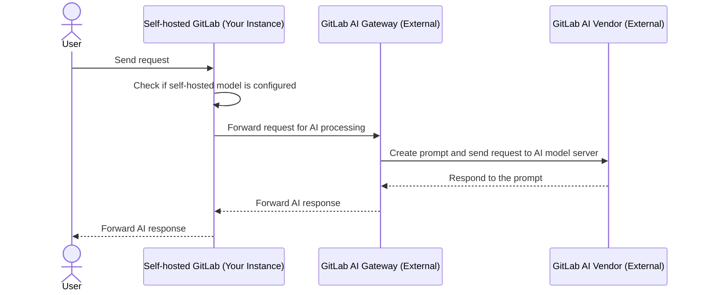
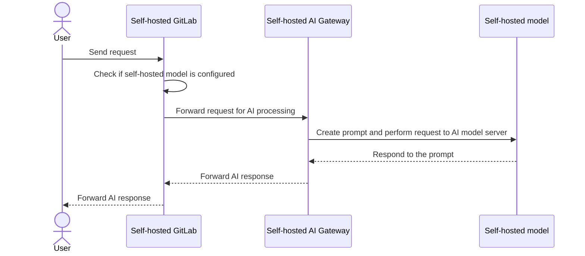
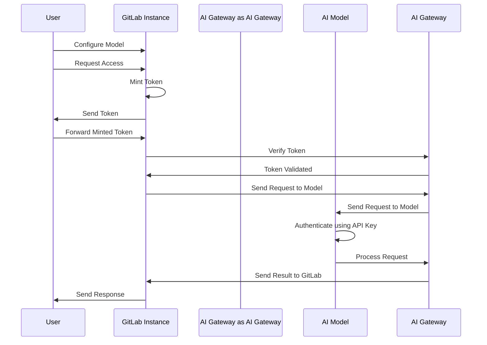



- 계층:  Premium, Ultimate
- 제공:  GitLab Self-Managed





- [GitLab 17.1에서 도입됨](https://gitlab.com/groups/gitlab-org/-/epics/12972) [기능 플래그](../feature_flags/_index.md) `ai_custom_model`이름으로 제공됩니다. 기본적으로 비활성화됨.
- [GitLab Self-Managed에서 활성화됨](https://gitlab.com/groups/gitlab-org/-/epics/15176) GitLab 17.6에서.
- GitLab 17.6 이상에서 GitLab Duo 애드온이 필요하도록 변경되었습니다.
- 기능 플래그 `ai_custom_model` GitLab 17.8에서 제거됨.
- GitLab 17.9에서 정식 버전(GA)으로 제공됩니다.
- GitLab 18.0에서 Premium을 포함하도록 변경되었습니다.



자체 관리 고객을 위한 두 가지 AI 게이트웨이 구성 옵션이 있습니다:

- **GitLab.com AI Gateway**:  이는 GitLab Self-Managed 고객을 위한 기본 구성입니다. GitLab에서 선택한 외부 대규모 언어 모델(LLM) 제공자(예: Google Vertex 또는 Anthropic)와 함께 GitLab 관리형 AI 게이트웨이를 사용합니다.
- **Self-hosted AI Gateway**:  GitLab에서 제공하는 외부 언어 제공자에 의존하지 않고 인프라에서 자신의 AI 게이트웨이와 언어 모델을 배포하고 관리합니다.

## GitLab.com AI 게이트웨이 {#gitlabcom-ai-gateway}

이 구성에서 GitLab 인스턴스는 외부 GitLab AI 게이트웨이에 의존하고 요청을 보내며, 이는 Google Vertex 또는 Anthropic과 같은 외부 AI 공급업체와 통신합니다. 그러면 응답이 GitLab 인스턴스로 다시 전달됩니다.

## 자체 호스팅되는 AI 게이트웨이 {#self-hosted-ai-gateway}

이 구성에서는 전체 시스템이 엔터프라이즈 내에서 격리되어 완전히 자체 호스팅되는 환경을 보장하고 데이터 프라이버시를 보호합니다.

## 자체 호스팅되는 모델에 대한 인증 {#authentication-for-self-hosted-models}

자체 호스팅되는 모델의 인증 프로세스는 안전하고 효율적이며 다음과 같은 주요 구성 요소로 이루어집니다:

- **Self-issued tokens**:  이 아키텍처에서 액세스 자격 증명은 `cloud.gitlab.com`과 동기화되지 않습니다. 대신 토큰은 GitLab.com의 기능과 유사하게 동적으로 자체 발급됩니다. 이 방법은 사용자에게 즉시 액세스를 제공하면서 높은 수준의 보안을 유지합니다.
- **Offline environments**:  오프라인 설정에서는 `cloud.gitlab.com`에 대한 연결이 없습니다. 모든 요청은 자체 호스팅되는 AI 게이트웨이로만 라우팅됩니다.
- **Token minting and verification**:  인스턴스가 토큰을 발급하면 AI 게이트웨이에서 GitLab 인스턴스에 대해 검증합니다.
- **Model configuration and security**:  관리자가 모델을 구성할 때 요청을 인증하기 위해 API 키를 통합할 수 있습니다. 또한 네트워크 내에서 연결 IP 주소를 지정하여 보안을 강화하면 신뢰할 수 있는 IP만 모델과 상호 작용할 수 있습니다.

다음 다이어그램에 설명된 대로:

1. 인증 흐름은 사용자가 GitLab 인스턴스를 통해 모델을 구성하고 GitLab Duo 기능에 액세스하기 위한 요청을 제출할 때 시작됩니다.
1. GitLab 인스턴스가 액세스 토큰을 발급하면 사용자가 이를 GitLab으로 전달하고 검증을 위해 AI 게이트웨이로 전달합니다.
1. 토큰의 유효성을 확인한 후 AI 게이트웨이가 AI 모델에 요청을 보내고, AI 모델이 API 키를 사용하여 요청을 인증하고 처리합니다.
1. 그러면 결과가 GitLab 인스턴스로 다시 전달되어 사용자에게 응답을 보냄으로써 흐름을 완료하며, 이는 안전하고 효율적으로 설계되었습니다.

