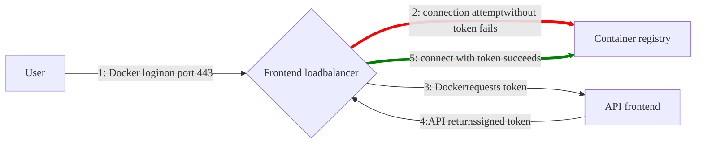



- 계층:  Free, Premium, Ultimate
- 제공:  GitLab Self-Managed



> [!note]
> [차세대 컨테이너 레지스트리](container_registry_metadata_database.md)는 현재 GitLab Self-Managed 인스턴스에서 업그레이드할 수 있습니다. 이 업그레이드된 레지스트리는 온라인 가비지 컬렉션을 지원하며 성능 및 안정성이 크게 향상되었습니다.

GitLab 컨테이너 레지스트리를 사용하면 모든 프로젝트가 Docker 이미지를 저장할 고유한 공간을 가질 수 있습니다.

Distribution Registry에 대한 자세한 내용:

- [구성](https://distribution.github.io/distribution/about/configuration/)
- [저장소 드라이버](https://distribution.github.io/distribution/storage-drivers/)
- [레지스트리 서버 배포](https://distribution.github.io/distribution/about/deploying/)

이 문서는 관리자 가이드입니다. GitLab 컨테이너 레지스트리를 사용하는 방법을 알아보려면 [사용자 문서](../../user/packages/container_registry/_index.md)를 참조하세요.

## 컨테이너 레지스트리 활성화 {#enable-the-container-registry}

컨테이너 레지스트리를 활성화하는 프로세스는 사용 중인 설치 유형에 따라 다릅니다.

### Linux 패키지 설치 {#linux-package-installations}

Linux 패키지를 사용하여 GitLab을 설치한 경우 컨테이너 레지스트리를 기본적으로 사용할 수도 있고 사용하지 않을 수도 있습니다.

컨테이너 레지스트리는 기본 제공 [Let's Encrypt 통합](https://docs.gitlab.com/omnibus/settings/ssl/#enable-the-lets-encrypt-integration)을 사용하는 경우 GitLab 도메인의 포트 5050에서 자동으로 활성화되고 사용 가능합니다.

그렇지 않으면 컨테이너 레지스트리가 활성화되지 않습니다. 활성화하려면:

- [GitLab 도메인](#configure-container-registry-under-an-existing-gitlab-domain)에 대해 구성하거나
- [다른 도메인](#configure-container-registry-under-its-own-domain)에 대해 구성할 수 있습니다.

컨테이너 레지스트리는 기본적으로 HTTPS에서 작동합니다. HTTP를 사용할 수 있지만 권장되지 않으며 이 문서의 범위를 벗어납니다.

### Helm Charts 설치 {#helm-charts-installations}

Helm Charts 설치의 경우 [컨테이너 레지스트리 사용](https://docs.gitlab.com/charts/charts/registry/)을 참조하세요. Helm Charts 문서에서 확인하세요.

### 자체 컴파일된 설치 {#self-compiled-installations}

GitLab을 자체 컴파일한 경우:

1. 설치 중인 GitLab 버전에 해당하는 이미지를 사용하여 레지스트리를 배포해야 합니다(예: `registry.gitlab.com/gitlab-org/build/cng/gitlab-container-registry:v3.15.0-gitlab`).
1. 설치가 완료되면 활성화하려면 `gitlab.yml`에서 Registry의 설정을 구성해야 합니다.
1. [`lib/support/nginx/registry-ssl`](https://gitlab.com/gitlab-org/gitlab/-/blob/master/lib/support/nginx/registry-ssl) 아래에서 샘플 NGINX 구성 파일을 사용하고 `host`, `port` 및 TLS 인증서 경로와 일치하도록 편집합니다.

`gitlab.yml`의 내용은:

```yaml
registry:
  enabled: true
  host: <registry.gitlab.example.com>
  port: <5005>
  api_url: <http://localhost:5000/>
  key: <config/registry.key>
  path: <shared/registry>
  issuer: <gitlab-issuer>
```

위치:

| 매개변수 | 설명 |
| --------- | ----------- |
| `enabled` | `true` 또는 `false`. GitLab에서 레지스트리를 활성화합니다. 기본값은 `false`입니다. |
| `host`    | Registry가 실행되고 사용자가 사용할 수 있는 호스트 URL입니다. |
| `port`    | 외부 Registry 도메인이 수신 대기하는 포트입니다. |
| `api_url` | Registry가 노출되는 내부 API URL입니다. 기본값은 `http://localhost:5000`입니다. [외부 Docker 레지스트리](#use-an-external-container-registry-with-gitlab-as-an-auth-endpoint)를 설정하는 경우가 아니면 변경하지 마세요. |
| `key`     | Registry의 `rootcertbundle`과 쌍을 이루는 개인 키 위치입니다. |
| `path`    | Registry의 `rootdirectory`에 지정된 것과 같은 디렉토리여야 합니다. 이 경로는 GitLab 사용자, 웹 서버 사용자 및 Registry 사용자가 읽을 수 있어야 합니다. |
| `issuer`  | Registry의 `issuer`에 구성된 것과 동일한 값이어야 합니다. |

소스에서 설치하는 경우 Registry init 파일이 GitLab과 함께 제공되지 않습니다. 따라서 [GitLab을 다시 시작](../restart_gitlab.md#self-compiled-installations)해도 설정을 수정하는 경우 Registry는 다시 시작되지 않습니다. 이를 달성하는 방법에 대해 업스트림 문서를 읽으세요.

최소한 Registry 구성에 `container_registry`이 서비스로 있고 `https://gitlab.example.com/jwt/auth`가 영역으로 있는지 확인하세요:

```yaml
auth:
  token:
    realm: <https://gitlab.example.com/jwt/auth>
    service: container_registry
    issuer: gitlab-issuer
    rootcertbundle: /root/certs/certbundle
```

> [!warning]
> `auth`를 설정하지 않으면 사용자가 인증 없이 Docker 이미지를 가져올 수 있습니다.

## 컨테이너 레지스트리 도메인 구성 {#container-registry-domain-configuration}

다음 중 하나의 방식으로 Registry의 외부 도메인을 구성할 수 있습니다:

- [기존 GitLab 도메인 사용](#configure-container-registry-under-an-existing-gitlab-domain). Registry는 포트에서 수신 대기하고 GitLab의 TLS 인증서를 재사용합니다.
- [완전히 별도의 도메인 사용](#configure-container-registry-under-its-own-domain) (해당 도메인의 새로운 TLS 인증서 포함).

컨테이너 레지스트리에는 TLS 인증서가 필요하므로 비용이 고려사항일 수 있습니다.

컨테이너 레지스트리를 처음으로 구성하기 전에 이를 고려하세요.

### 기존 GitLab 도메인 아래의 컨테이너 레지스트리 구성 {#configure-container-registry-under-an-existing-gitlab-domain}

컨테이너 레지스트리가 기존 GitLab 도메인을 사용하도록 구성된 경우 포트에서 컨테이너 레지스트리를 노출할 수 있습니다. 이렇게 하면 기존 GitLab TLS 인증서를 재사용할 수 있습니다.

GitLab 도메인이 `https://gitlab.example.com`이고 외부에 노출되는 포트가 `5050`인 경우 컨테이너 레지스트리를 구성하려면:

- Linux 패키지 설치를 사용하는 경우 `gitlab.rb`를 편집합니다.
- 자체 컴파일된 설치를 사용하는 경우 `gitlab.yml`를 편집합니다.

Registry가 수신 대기하는 포트(기본값: `5000`)와 다른 포트를 선택해야 하며, 그렇지 않으면 충돌이 발생합니다.

> [!note]
> 호스트 및 컨테이너 방화벽 규칙은 `registry_external_url` 라인 아래에 나열된 포트를 통해 트래픽이 들어오도록 허용하도록 구성되어야 하며, `gitlab_rails['registry_port']` 아래에 나열된 포트(기본값: `5000`)가 아닙니다.





1. `/etc/gitlab/gitlab.rb`에는 Registry URL과 GitLab에서 사용하는 기존 TLS 인증서 및 키의 경로가 포함되어야 합니다:

   ```ruby
   registry_external_url '<https://gitlab.example.com:5050>'
   ```

   `registry_external_url`는 기존 GitLab URL에서 HTTPS로 수신 대기하지만 다른 포트에서 수신 대기합니다.

   TLS 인증서가 `/etc/gitlab/ssl/gitlab.example.com.crt`에 없고 키가 `/etc/gitlab/ssl/gitlab.example.com.key`에 없으면 아래 라인의 주석을 제거하세요:

   ```ruby
   registry_nginx['ssl_certificate'] = "</path/to/certificate.pem>"
   registry_nginx['ssl_certificate_key'] = "</path/to/certificate.key>"
   ```

1. 파일을 저장하고 변경 사항을 적용하려면 [GitLab 재구성](../restart_gitlab.md#reconfigure-a-linux-package-installation)합니다.

1. 다음을 사용하여 유효성을 검사합니다:

   ```shell
   openssl s_client -showcerts -servername gitlab.example.com -connect gitlab.example.com:5050 > cacert.pem
   ```

인증서 공급자가 CA 번들 인증서를 제공하면 이를 TLS 인증서 파일에 추가하세요.

관리자는 `5678`과 같은 임의의 포트에서 컨테이너 레지스트리가 수신 대기하기를 원할 수 있습니다. 그러나 레지스트리와 애플리케이션 서버는 포트 `80` 및 `443`에서만 수신 대기하는 AWS 애플리케이션 로드 밸런서 뒤에 있습니다. 관리자는 `registry_external_url`에 대한 포트 번호를 제거할 수 있으므로 HTTP 또는 HTTPS로 간주됩니다. 그러면 포트 `80` 또는 `443`에서 로드 밸런서를 레지스트리로 매핑하는 규칙이 임의의 포트에 적용됩니다. 사용자가 컨테이너 레지스트리의 `docker login` 예제를 사용하는 경우 이는 중요합니다. 다음은 예제입니다:

```ruby
registry_external_url '<https://registry-gitlab.example.com>'
registry_nginx['redirect_http_to_https'] = true
registry_nginx['listen_port'] = 5678
```





1. `/home/git/gitlab/config/gitlab.yml`를 열고 `registry` 항목을 찾아 다음 설정으로 구성합니다:

   ```yaml
   registry:
     enabled: true
     host: <gitlab.example.com>
     port: 5050
   ```

1. 파일을 저장하고 변경 사항을 적용하려면 [GitLab 재시작](../restart_gitlab.md#self-compiled-installations)합니다.
1. NGINX에서도 관련 변경 사항을 수행합니다(도메인, 포트, TLS 인증서 경로).





사용자는 이제 다음을 사용하여 GitLab 자격 증명으로 컨테이너 레지스트리에 로그인할 수 있어야 합니다:

```shell
docker login <gitlab.example.com:5050>
```

### 자신의 도메인 아래의 컨테이너 레지스트리 구성 {#configure-container-registry-under-its-own-domain}

Registry가 자신의 도메인을 사용하도록 구성된 경우 특정 도메인(예: `registry.example.com`)에 대한 TLS 인증서가 필요합니다. 기존 GitLab 도메인의 하위 도메인에 호스팅되는 경우 와일드카드 인증서가 필요할 수 있습니다. 예를 들어 `*.gitlab.example.com`는 `registry.gitlab.example.com`과 일치하는 와일드카드이며 `*.example.com`와 구별됩니다.

수동으로 생성된 SSL 인증서(여기에 설명됨) 외에도 Let's Encrypt에서 자동으로 생성된 인증서도 [Linux 패키지 설치에서 지원됩니다](https://docs.gitlab.com/omnibus/settings/ssl/).

`https://registry.gitlab.example.com`에서 컨테이너 레지스트리에 액세스할 수 있기를 원한다고 가정해 봅시다.





1. TLS 인증서 및 키를 `/etc/gitlab/ssl/<registry.gitlab.example.com>.crt` 및 `/etc/gitlab/ssl/<registry.gitlab.example.com>.key`에 배치하고 올바른 권한이 있는지 확인하세요:

   ```shell
   chmod 600 /etc/gitlab/ssl/<registry.gitlab.example.com>.*
   ```

1. TLS 인증서가 준비되면 `/etc/gitlab/gitlab.rb`을 다음과 같이 편집합니다:

   ```ruby
   registry_external_url '<https://registry.gitlab.example.com>'
   ```

   `registry_external_url`는 HTTPS에서 수신 대기합니다.

1. 파일을 저장하고 변경 사항을 적용하려면 [GitLab 재구성](../restart_gitlab.md#reconfigure-a-linux-package-installation)합니다.

[와일드카드 인증서](https://en.wikipedia.org/wiki/Wildcard_certificate)가 있는 경우 URL 외에 인증서의 경로를 지정해야 하며, 이 경우 `/etc/gitlab/gitlab.rb`는 다음과 같습니다:

```ruby
registry_nginx['ssl_certificate'] = "/etc/gitlab/ssl/certificate.pem"
registry_nginx['ssl_certificate_key'] = "/etc/gitlab/ssl/certificate.key"
```





1. `/home/git/gitlab/config/gitlab.yml`를 열고 `registry` 항목을 찾아 다음 설정으로 구성합니다:

   ```yaml
   registry:
     enabled: true
     host: <registry.gitlab.example.com>
   ```

1. 파일을 저장하고 변경 사항을 적용하려면 [GitLab 재시작](../restart_gitlab.md#self-compiled-installations)합니다.
1. NGINX에서도 관련 변경 사항을 수행합니다(도메인, 포트, TLS 인증서 경로).





사용자는 이제 GitLab 자격 증명을 사용하여 컨테이너 레지스트리에 로그인할 수 있어야 합니다:

```shell
docker login <registry.gitlab.example.com>
```

#### 자체 서명된 인증서 구성 {#configure-self-signed-certificates}

컨테이너 레지스트리에서 자체 서명된 인증서를 사용하려면 Docker 디먼이 자체 서명된 인증서를 신뢰하도록 구성해야 합니다:

1. Docker 디먼에 [자체 서명된 인증서 사용](https://distribution.github.io/distribution/about/insecure/#use-self-signed-certificates)을 지시합니다. 이 단계는 운영 체제에 따라 다릅니다.
1. GitLab Runner `config.toml` 파일에서 Docker 디먼을 마운트하고 `privileged = false`를 설정합니다:

   ```toml
     [runners.docker]
       image = "ruby:2.6"
       privileged = false
       volumes = ["/var/run/docker.sock:/var/run/docker.sock", "/cache"]
   ```

   `privileged = true`를 설정하면 Docker 디먼보다 우선합니다.
1. Docker를 다시 시작합니다.

## 사이트 전체 컨테이너 레지스트리 비활성화 {#disable-container-registry-site-wide}

다음 단계에 따라 Registry를 비활성화할 때 기존 Docker 이미지를 제거하지 않습니다. Docker 이미지 제거는 Registry 애플리케이션 자체에서 처리합니다.





1. `/etc/gitlab/gitlab.rb`를 열고 `registry['enable']`를 `false`로 설정합니다:

   ```ruby
   registry['enable'] = false
   ```

1. 파일을 저장하고 변경 사항을 적용하려면 [GitLab 재구성](../restart_gitlab.md#reconfigure-a-linux-package-installation)합니다.





1. `/home/git/gitlab/config/gitlab.yml`를 열고 `registry` 항목을 찾아 `enabled`를 `false`로 설정합니다:

   ```yaml
   registry:
     enabled: false
   ```

1. 파일을 저장하고 변경 사항을 적용하려면 [GitLab 재시작](../restart_gitlab.md#self-compiled-installations)합니다.





## 새 프로젝트 사이트 전체 컨테이너 레지스트리 비활성화 {#disable-container-registry-for-new-projects-site-wide}

컨테이너 레지스트리가 활성화되면 모든 새 프로젝트에서 사용 가능해야 합니다. 이 기능을 비활성화하고 프로젝트 소유자가 컨테이너 레지스트리를 직접 활성화하도록 하려면 아래 단계를 따르세요.





1. `/etc/gitlab/gitlab.rb`을 편집하고 다음 줄을 추가합니다:

   ```ruby
   gitlab_rails['gitlab_default_projects_features_container_registry'] = false
   ```

1. 파일을 저장하고 변경 사항을 적용하려면 [GitLab 재구성](../restart_gitlab.md#reconfigure-a-linux-package-installation)합니다.





1. `/home/git/gitlab/config/gitlab.yml`를 열고 `default_projects_features` 항목을 찾아 `container_registry`가 `false`로 설정되도록 구성합니다:

   ```yaml
   ## Default project features settings
   default_projects_features:
     issues: true
     merge_requests: true
     wiki: true
     snippets: false
     builds: true
     container_registry: false
   ```

1. 파일을 저장하고 변경 사항을 적용하려면 [GitLab 재시작](../restart_gitlab.md#self-compiled-installations)합니다.





### 토큰 기간 증가 {#increase-token-duration}

GitLab에서 컨테이너 레지스트리의 토큰은 5분마다 만료됩니다. 토큰 기간을 증가시키려면:

1. 오른쪽 위 모서리에서 **운영자**를 선택합니다.
1. 왼쪽 사이드바에서 **설정** > **CI/CD**를 선택합니다.
1. **Container Registry**를 확장합니다.
1. **인증 토큰 유효 기간 (분)**에 대해 값을 업데이트합니다.
1. **변경 사항 저장**을 선택합니다.

## 컨테이너 레지스트리 기능 플래그 {#container-registry-feature-flags}

컨테이너 레지스트리 기능 플래그는 컨테이너 레지스트리에서 실험적이거나 과도적인 기능을 제어하는 환경 변수 토글입니다.

[GitLab 애플리케이션 기능 플래그](../feature_flags/list.md)와 달리 컨테이너 레지스트리 기능 플래그는:

- 레지스트리별 환경 변수를 통해 관리됩니다.
- 컨테이너 레지스트리 코드베이스에서 정의됩니다.
- 변경하려면 레지스트리 재구성이 필요합니다.

### 컨테이너 레지스트리 기능 플래그 구성 {#configure-container-registry-feature-flags}

다음 표는 활성화된 컨테이너 레지스트리 기능 플래그를 나열합니다:

| 기능 플래그 | 설명 | 마일스톤 | 기본 상태 | 제거 마일스톤 |
|--------------|-------------|-----------|---------------|-------------------|
| `REGISTRY_FF_ONGOING_RENAME_CHECK` | 이름 변경 중인 프로젝트에 대해 Redis를 확인합니다. | 16.2 | 비활성화됨 | |
| `REGISTRY_FF_DYNAMIC_MEDIA_TYPES` | 런타임 중에 새 미디어 유형 생성을 허용합니다. | 17.1 | 비활성화됨 | |
| `REGISTRY_FF_BBM` | 비동기 일괄 백그라운드 마이그레이션 프로세스를 제어합니다. | 17.2 | 비활성화됨 | |
| `REGISTRY_FF_ENFORCE_LOCKFILES` | 데이터베이스 또는 레거시 메타데이터 저장소에 대한 잠금 파일 검사를 활성화합니다. | [GitLab 17.6에서 도입됨](https://gitlab.com/gitlab-org/container-registry/-/issues/1335). | GitLab 18.9에서 [GitLab Self-Managed에서 활성화됨](https://gitlab.com/gitlab-org/container-registry/-/work_items/1786). |GitLab 18.10에서 [제거됨](https://gitlab.com/gitlab-org/container-registry/-/issues/1439). |

컨테이너 레지스트리 기능 플래그를 구성하려면 플랫폼에 대한 지침을 따르세요.





`/etc/gitlab/gitlab.rb`에서 기능 플래그를 구성합니다:

```ruby
registry['env'] = {
  '<REGISTRY_FF_FEATURE_NAME>' => 'true' # or 'false' to disable
}
```

그런 다음 컨테이너 레지스트리를 다시 구성합니다:

```shell
sudo gitlab-ctl reconfigure
sudo gitlab-ctl restart registry
```





`values.yaml`에서 기능 플래그를 구성합니다:

```yaml
registry:
  extraEnv:
    <REGISTRY_FF_FEATURE_NAME>: "true"  # or "false" to disable
```

그런 다음 `values.yaml`을 업그레이드합니다:

```shell
helm upgrade gitlab gitlab/gitlab -f values.yaml
```





> [!note]
> Docker Compose에서 직접 환경 변수를 설정하면 작동하지 않습니다. `gitlab.rb`를 통해 구성해야 합니다.

Docker 또는 Docker Compose의 경우 `gitlab.rb`를 생성하거나 편집합니다:

```ruby
registry['env'] = {
  '<REGISTRY_FF_FEATURE_NAME>' => 'true'
}
```

이 구성을 Docker Compose 설정에 마운트하고 시작 시 GitLab이 재구성되도록 하세요.





## 컨테이너 레지스트리 저장소 구성 {#configure-storage-for-the-container-registry}

> [!warning]
> 컨테이너 레지스트리에 저장된 파일이나 객체를 직접 수정하지 마세요. 레지스트리 쓰기 또는 삭제 이외의 다른 방식으로 이러한 항목을 수정하면 인스턴스 전체 데이터 일관성 및 안정성 문제가 발생할 수 있으며, 복구가 불가능할 수 있습니다.

저장소 드라이버를 구성하여 컨테이너 레지스트리가 다양한 저장소 백엔드를 사용하도록 구성할 수 있습니다. 기본적으로 GitLab 컨테이너 레지스트리는 [파일 시스템 드라이버](#use-file-system) 구성을 사용하도록 구성됩니다.

이를 지원하는 저장소 백엔드의 경우 객체 버전 관리를 사용하여 버킷에 저장된 모든 객체의 비현재 버전을 보존, 검색 및 복원할 수 있습니다. 그러나 이로 인해 저장소 사용량과 비용이 증가할 수 있습니다. 레지스트리가 작동하는 방식으로 인해 이미지 업로드는 먼저 임시 경로에 저장된 다음 최종 위치로 전송됩니다. S3 및 GCS를 포함한 객체 저장소 백엔드의 경우 이 전송은 복사 후 삭제를 통해 달성됩니다. 객체 버전 관리가 활성화되면 이러한 삭제된 임시 업로드 아티팩트는 비현재 버전으로 유지되므로 저장소 버킷 크기가 증가합니다. 일정 시간 후 비현재 버전이 삭제되도록 하려면 저장소 공급자를 통해 객체 라이프사이클 정책을 구성해야 합니다.

지원되는 다양한 드라이버:

| 드라이버       | 설명                          |
|--------------|--------------------------------------|
| `filesystem` | 로컬 파일 시스템의 경로를 사용합니다. |
| `azure`      | Microsoft Azure Blob Storage         |
| `gcs`        | Google Cloud Storage                 |
| `s3`         | Amazon Simple Storage Service. 저장소 버킷을 올바른 [S3 권한 범위](https://distribution.github.io/distribution/storage-drivers/s3/#s3-permission-scopes)로 구성해야 합니다. |

대부분의 S3 호환 서비스가 컨테이너 레지스트리에서 작동하지만 AWS S3만 지원을 보장합니다. 타사 S3 구현의 정확성을 확인할 수 없으므로 문제를 디버그할 수는 있지만 AWS S3 버킷에 대해 재현 가능한 문제가 아니면 레지스트리를 패치할 수 없습니다.

### 파일 시스템 사용 {#use-file-system}

이미지를 파일 시스템에 저장하려면 컨테이너 레지스트리의 저장소 경로를 변경할 수 있으며 아래 단계를 따르세요.

이 경로는 다음에 액세스할 수 있습니다:

- 컨테이너 레지스트리 디먼을 실행 중인 사용자.
- GitLab을 실행 중인 사용자.

모든 GitLab, Registry 및 웹 서버 사용자가 이 디렉토리에 액세스할 수 있어야 합니다.





Linux 패키지 설치에서 이미지가 저장되는 기본 위치는 `/var/opt/gitlab/gitlab-rails/shared/registry`입니다. 변경하려면:

1. `/etc/gitlab/gitlab.rb`을 편집합니다:

   ```ruby
   gitlab_rails['registry_path'] = "</path/to/registry/storage>"
   ```

1. 파일을 저장하고 변경 사항을 적용하려면 [GitLab 재구성](../restart_gitlab.md#reconfigure-a-linux-package-installation)합니다.





자체 컴파일된 설치에서 이미지가 저장되는 기본 위치는 `/home/git/gitlab/shared/registry`입니다. 변경하려면:

1. `/home/git/gitlab/config/gitlab.yml`를 열고 `registry` 항목을 찾아 `path` 설정을 변경합니다:

   ```yaml
   registry:
     path: shared/registry
   ```

1. 파일을 저장하고 변경 사항을 적용하려면 [GitLab 재시작](../restart_gitlab.md#self-compiled-installations)합니다.





### 객체 저장소 사용 {#use-object-storage}

로컬 파일 시스템 대신 객체 저장소에 컨테이너 레지스트리 이미지를 저장하려면 지원되는 저장소 드라이버 중 하나를 구성할 수 있습니다.

자세한 내용은 [객체 저장소](../object_storage.md)를 참조하세요.

> [!warning]
> GitLab은 파일 시스템에 저장되지 않은 Docker 이미지를 백업하지 않습니다. 필요한 경우 객체 저장소 공급자와의 백업을 활성화합니다.

#### Linux 패키지 설치를 위한 객체 저장소 구성 {#configure-object-storage-for-linux-package-installations}

컨테이너 레지스트리를 위해 객체 저장소를 구성하려면:

1. 사용하려는 저장소 드라이버를 선택합니다.
1. 적절한 구성으로 `/etc/gitlab/gitlab.rb`를 편집합니다.
1. 파일을 저장하고 변경 사항을 적용하려면 [GitLab 재구성](../restart_gitlab.md#reconfigure-a-linux-package-installation)합니다.





S3 저장소 드라이버는 Amazon S3 또는 S3 호환 객체 저장소 서비스와 통합됩니다.

`s3_v2` 드라이버(베타)는 AWS SDK v2를 사용하며 인증을 위해 Signature Version 4만 지원합니다. 이 드라이버는 성능과 안정성을 향상시키면서 AWS 인증 요구 사항과의 호환성을 보장하므로 이전 서명 방법에 대한 지원이 더 이상 사용되지 않습니다. 자세한 내용은 [에픽 16272](https://gitlab.com/groups/gitlab-org/-/epics/16272)를 참조하세요.

각 드라이버의 전체 구성 매개변수 목록은 [`s3_v1`](https://gitlab.com/gitlab-org/container-registry/-/blob/f4ece8cdba4413b968c8a3fd20497a8186f23d26/docs/storage-drivers/s3_v1.md) 및 [`s3_v2`](https://gitlab.com/gitlab-org/container-registry/-/blob/f4ece8cdba4413b968c8a3fd20497a8186f23d26/docs/storage-drivers/s3_v2.md)를 참조하세요.

S3 저장소 드라이버를 구성하려면 `/etc/gitlab/gitlab.rb` 파일에 다음 구성 중 하나를 추가합니다:

```ruby
# Deprecated: Will be removed in GitLab 19.0
registry['storage'] = {
  's3' => {
    'accesskey' => '<s3-access-key>',
    'secretkey' => '<s3-secret-key-for-access-key>',
    'bucket' => '<your-s3-bucket>',
    'region' => '<your-s3-region>',
    'regionendpoint' => '<your-s3-regionendpoint>'
  }
}
```

또는

```ruby
# Beta: s3_v2 driver
registry['storage'] = {
  's3_v2' => {
    'accesskey' => '<s3-access-key>',
    'secretkey' => '<s3-secret-key-for-access-key>',
    'bucket' => '<your-s3-bucket>',
    'region' => '<your-s3-region>',
    'regionendpoint' => '<your-s3-regionendpoint>'
  }
}
```

보안 향상을 위해 `accesskey` 및 `secretkey` 매개변수를 포함하지 않음으로써 정적 자격 증명 대신 IAM 역할을 사용할 수 있습니다.

저장소 비용 증가를 방지하려면 S3 버킷에 라이프사이클 정책을 구성하여 불완전한 다중 부분 업로드를 제거합니다. 컨테이너 레지스트리는 이를 자동으로 정리하지 않습니다. 불완전한 다중 부분 업로드에 대한 3일 만료 정책은 대부분의 사용 패턴에서 잘 작동합니다.

> [!note]
> `loglevel` 설정은 [`s3_v1`](https://gitlab.com/gitlab-org/container-registry/-/blob/f4ece8cdba4413b968c8a3fd20497a8186f23d26/docs/storage-drivers/s3_v1.md#configuration-parameters) 및 [`s3_v2`](https://gitlab.com/gitlab-org/container-registry/-/blob/f4ece8cdba4413b968c8a3fd20497a8186f23d26/docs/storage-drivers/s3_v2.md#configuration-parameters) 드라이버 간에 다릅니다. 잘못된 드라이버에 대해 `loglevel`을 설정하면 무시되고 경고 메시지가 인쇄됩니다.

`s3_v2` 드라이버를 사용하는 일부 S3 호환 서비스를 사용할 때 AWS 체크섬을 비활성화하기 위해 `checksum_disabled` 매개변수를 추가해야 할 수 있습니다:

```ruby
registry['storage'] = {
  's3_v2' => {
    'accesskey' => '<s3-access-key>',
    'secretkey' => '<s3-secret-key-for-access-key>',
    'bucket' => '<your-s3-bucket>',
    'region' => '<your-s3-region>',
    'regionendpoint' => '<your-s3-regionendpoint>',
    'checksum_disabled' => true
  }
}
```

S3 VPC 엔드포인트의 경우:

```ruby
registry['storage'] = {
  's3_v2' => {  # Beta driver
    'accesskey' => '<s3-access-key>',
    'secretkey' => '<s3-secret-key-for-access-key>',
    'bucket' => '<your-s3-bucket>',
    'region' => '<your-s3-region>',
    'regionendpoint' => '<your-s3-vpc-endpoint>',
    'pathstyle' => false
  }
}
```

S3 구성 매개변수:

- `<your-s3-bucket>`:  기존 버킷의 이름입니다. 하위 디렉토리를 포함할 수 없습니다.
- `regionendpoint`:  S3 호환 서비스 또는 AWS S3 VPC 엔드포인트를 사용할 때만 필요합니다.
- `pathstyle`:  URL 형식을 제어합니다. `true`은 `host/bucket_name/object`(대부분의 S3 호환 서비스)에 대해, `false`은 `bucket_name.host/object`(AWS S3)에 대해 설정합니다.

S3 API의 503 오류를 피하려면 `maxrequestspersecond` 매개변수를 추가하여 연결에 대한 속도 제한을 설정합니다:

```ruby
registry['storage'] = {
  's3' => {
    'accesskey' => '<s3-access-key>',
    'secretkey' => '<s3-secret-key-for-access-key>',
    'bucket' => '<your-s3-bucket>',
    'region' => '<your-s3-region>',
    'regionendpoint' => '<your-s3-regionendpoint>',
    'maxrequestspersecond' => 100
  }
}
```





Azure 저장소 드라이버는 Microsoft Azure Blob Storage와 통합됩니다.

> [!warning]
> 레거시 Azure 저장소 드라이버는 GitLab 17.10에서 [더 이상 사용되지 않으며](https://gitlab.com/gitlab-org/gitlab/-/issues/523096) GitLab 19.0에서 제거될 예정입니다.
>
> 대신 `azure_v2` 드라이버(베타)를 사용합니다. 이 드라이버는 향상된 성능, 안정성 및 현대적인 인증 방법을 제공합니다. 이것이 주요 변경이지만 새 드라이버는 대부분의 구성에 대해 원활한 전환을 보장하기 위해 광범위하게 테스트되었습니다.
>
> 프로덕션에 배포하기 전에 프로덕션 환경이 아닌 환경에서 새 드라이버를 테스트하여 환경 및 사용 패턴과 관련된 모든 엣지 사례를 식별하고 해결하세요.
>
> [이슈 525855](https://gitlab.com/gitlab-org/gitlab/-/issues/525855)를 사용하여 문제나 피드백을 보고합니다.

각 드라이버의 전체 구성 매개변수 목록은 [`azure_v1`](https://gitlab.com/gitlab-org/container-registry/-/blob/7b1786d261481a3c69912ad3423225f47f7c8242/docs/storage-drivers/azure_v1.md) 및 [`azure_v2`](https://gitlab.com/gitlab-org/container-registry/-/blob/7b1786d261481a3c69912ad3423225f47f7c8242/docs/storage-drivers/azure_v2.md)를 참조하세요.

Azure 저장소 드라이버를 구성하려면 `/etc/gitlab/gitlab.rb` 파일에 다음 구성 중 하나를 추가합니다:

```ruby
# Deprecated: Will be removed in GitLab 19.0
registry['storage'] = {
  'azure' => {
    'accountname' => '<your_storage_account_name>',
    'accountkey' => '<base64_encoded_account_key>',
    'container' => '<container_name>'
  }
}
```

또는

```ruby
# Beta: azure_v2 driver
registry['storage'] = {
  'azure_v2' => {
    'credentials_type' => '<client_secret>',
    'tenant_id' => '<your_tenant_id>',
    'client_id' => '<your_client_id>',
    'secret' => '<your_secret>',
    'container' => '<your_container>',
    'accountname' => '<your_account_name>'
  }
}
```

기본적으로 Azure 저장소 드라이버는 `core.windows.net realm`를 사용합니다. Azure 섹션에서 영역에 다른 값을 설정할 수 있습니다(예: Azure Government Cloud의 경우 `core.usgovcloudapi.net`).





GCS 저장소 드라이버는 Google Cloud Storage와 통합됩니다.

```ruby
registry['storage'] = {
  'gcs' => {
    'bucket' => '<your_bucket_name>',
    'keyfile' => '<path/to/keyfile>',
    # If you have the bucket shared with other apps beyond the registry, uncomment the following:
    # 'rootdirectory' => '/gcs/object/name/prefix'
  }
}
```

GitLab은 모든 [사용 가능한 매개변수](https://docs.docker.com/registry/storage-drivers/gcs/)를 지원합니다.





#### 자체 컴파일된 설치 {#self-compiled-installations-1}

저장소 드라이버 구성은 Docker 레지스트리를 배포할 때 생성한 레지스트리 구성 YAML 파일에서 수행됩니다.

`s3` 저장소 드라이버 예제:

```yaml
storage:
  s3:
    accesskey: '<s3-access-key>'                # Not needed if IAM role used
    secretkey: '<s3-secret-key-for-access-key>' # Not needed if IAM role used
    bucket: '<your-s3-bucket>'
    region: '<your-s3-region>'
    regionendpoint: '<your-s3-regionendpoint>'
  cache:
    blobdescriptor: inmemory
  delete:
    enabled: true
```

`<your-s3-bucket>`는 존재하는 버킷의 이름이어야 하며 하위 디렉토리를 포함할 수 없습니다.

#### 다운타임 없이 객체 저장소로 마이그레이션 {#migrate-to-object-storage-without-downtime}

> [!warning]
> [AWS DataSync](https://aws.amazon.com/datasync/)를 사용하여 레지스트리 데이터를 S3 버킷으로 또는 S3 버킷 간에 복사하면 버킷에 잘못된 메타데이터 객체가 생성됩니다. 자세한 내용은 [빈 이름의 태그](container_registry_troubleshooting.md#tags-with-an-empty-name)를 참조하세요. S3 버킷 간에 데이터를 이동하려면 AWS CLI `sync` 작업을 사용하는 것이 좋습니다.

컨테이너 레지스트리를 중지하지 않고 저장소를 마이그레이션하려면 컨테이너 레지스트리를 읽기 전용 모드로 설정합니다. 큰 인스턴스에서 이는 컨테이너 레지스트리가 읽기 전용 모드에 있어야 하는 시간을 요구할 수 있습니다. 이 시간 동안 컨테이너 레지스트리에서 가져올 수 있지만 푸시할 수 없습니다.

1. 선택사항. 마이그레이션할 데이터의 양을 줄이려면 [다운타임 없이 가비지 컬렉션 도구](#performing-garbage-collection-without-downtime)를 실행합니다.
1. 이 예제는 `aws` CLI를 사용합니다. 이전에 CLI를 구성하지 않았으면 `sudo aws configure`를 실행하여 자격 증명을 구성해야 합니다. 관리자가 아닌 사용자는 컨테이너 레지스트리 폴더에 액세스할 수 없을 가능성이 높으므로 `sudo`를 사용해야 합니다. 자격 증명 구성을 확인하려면 [`ls`](https://awscli.amazonaws.com/v2/documentation/api/latest/reference/s3/ls.html)를 실행하여 모든 버킷을 나열합니다.

   ```shell
   sudo aws --endpoint-url <https://your-object-storage-backend.com> s3 ls
   ```

   AWS를 백엔드로 사용하는 경우 [`--endpoint-url`](https://docs.aws.amazon.com/cli/latest/reference/#options)가 필요하지 않습니다.
1. 예를 들어 `aws` CLI [`cp`](https://awscli.amazonaws.com/v2/documentation/api/latest/reference/s3/cp.html) 또는 [`sync`](https://awscli.amazonaws.com/v2/documentation/api/latest/reference/s3/sync.html) 명령을 사용하여 초기 데이터를 S3 버킷에 복사합니다. `docker` 폴더를 버킷 내의 최상위 폴더로 유지하세요.

   ```shell
   sudo aws --endpoint-url <https://your-object-storage-backend.com> s3 sync registry s3://mybucket
   ```

   > [!note]
   > 데이터가 많으면 [병렬 동기화 작업 실행](https://repost.aws/knowledge-center/s3-improve-transfer-sync-command)으로 성능을 개선할 수 있습니다.

1. 최종 데이터 동기화를 수행하려면 [컨테이너 레지스트리를 `read-only` 모드로 설정](#performing-garbage-collection-without-downtime) 하고 [GitLab을 다시 구성](../restart_gitlab.md#reconfigure-a-linux-package-installation)합니다.
1. 초기 데이터 로드 이후의 변경 사항을 S3 버킷으로 동기화하고 대상 버킷에 있지만 소스에는 없는 파일을 삭제합니다:

   ```shell
   sudo aws --endpoint-url <https://your-object-storage-backend.com> s3 sync registry s3://mybucket --delete --dryrun
   ```

   명령이 예상대로 수행되는지 확인한 후 [`--dryrun`](https://docs.aws.amazon.com/cli/latest/reference/s3/sync.html) 플래그를 제거하고 명령을 실행합니다.

   > [!warning]
   > [`--delete`](https://docs.aws.amazon.com/cli/latest/reference/s3/sync.html) 플래그는 대상에는 있지만 소스에는 없는 파일을 삭제합니다. 소스와 대상을 바꾸면 Registry의 모든 데이터가 삭제됩니다.

1. 이 두 명령이 반환하는 파일 개수를 보면 모든 컨테이너 레지스트리 파일이 객체 저장소에 업로드되었는지 확인합니다:

   ```shell
   sudo find registry -type f | wc -l
   ```

   ```shell
   sudo aws --endpoint-url <https://your-object-storage-backend.com> s3 ls s3://<mybucket> --recursive | wc -l
   ```

   이 명령의 출력은 `_uploads` 디렉토리 및 하위 디렉토리의 내용을 제외하고 일치해야 합니다.
1. 레지스트리를 [S3 버킷을 저장소로 사용](#use-object-storage)하도록 구성합니다.
1. 변경 사항을 적용하려면 Registry를 `read-write` 모드로 다시 설정하고 [GitLab을 다시 구성](../restart_gitlab.md#reconfigure-a-linux-package-installation)합니다.

#### Azure Object Storage로 이동 {#moving-to-azure-object-storage}





```ruby
registry['storage'] = {
  'azure' => {
    'accountname' => '<your_storage_account_name>',
    'accountkey' => '<base64_encoded_account_key>',
    'container' => '<container_name>',
    'trimlegacyrootprefix' => true
  }
}
```





```yaml
storage:
  azure:
    accountname: <your_storage_account_name>
    accountkey: <base64_encoded_account_key>
    container: <container_name>
    trimlegacyrootprefix: true
```





기본적으로 Azure Storage Driver는 `core.windows.net` 영역을 사용합니다. `realm`에 다른 값을 설정할 수 있습니다(예: Azure Government Cloud의 경우 `core.usgovcloudapi.net`) `azure` 섹션.

### 저장소 드라이버를 위한 리디렉션 비활성화 {#disable-redirect-for-storage-driver}

기본적으로 원격 백엔드로 구성된 레지스트리에 액세스하는 사용자는 저장소 드라이버의 기본 백엔드로 리디렉션됩니다. 예를 들어 `s3` 저장소 드라이버를 사용하여 레지스트리를 구성할 수 있으며, 이는 GitLab 서버의 로드를 줄이기 위해 원격 S3 버킷에 대한 요청을 리디렉션합니다.

그러나 이 동작은 일반적으로 공개 서버에 액세스할 수 없는 내부 호스트에서 사용되는 레지스트리에는 바람직하지 않습니다. 리디렉션을 비활성화하고 [프록시 다운로드](../object_storage.md#proxy-download)하려면 `disable` 플래그를 true로 설정합니다. 이렇게 하면 모든 트래픽이 항상 Registry 서비스를 통과합니다. 이는 향상된 보안(저장소 백엔드가 공개적으로 액세스할 수 없으므로 공격 표면 감소)으로 인해 성능이 저하되지만(모든 트래픽이 서비스를 통해 리디렉션됨).





1. `/etc/gitlab/gitlab.rb`을 편집합니다:

   ```ruby
   registry['storage'] = {
     's3' => {
       'accesskey' => '<s3_access_key>',
       'secretkey' => '<s3_secret_key_for_access_key>',
       'bucket' => '<your_s3_bucket>',
       'region' => '<your_s3_region>',
       'regionendpoint' => '<your_s3_regionendpoint>'
     },
     'redirect' => {
       'disable' => true
     }
   }
   ```

1. 파일을 저장하고 변경 사항을 적용하려면 [GitLab 재구성](../restart_gitlab.md#reconfigure-a-linux-package-installation)합니다.





1. `redirect` 플래그를 레지스트리 구성 YAML 파일에 추가합니다:

   ```yaml
   storage:
     s3:
       accesskey: '<s3_access_key>'
       secretkey: '<s3_secret_key_for_access_key>'
       bucket: '<your_s3_bucket>'
       region: '<your_s3_region>'
       regionendpoint: '<your_s3_regionendpoint>'
     redirect:
       disable: true
     cache:
       blobdescriptor: inmemory
     delete:
       enabled: true
   ```

1. 파일을 저장하고 변경 사항을 적용하려면 [GitLab 재시작](../restart_gitlab.md#self-compiled-installations)합니다.





#### 암호화된 S3 버킷 {#encrypted-s3-buckets}

AWS KMS와 서버 측 암호화를 [기본적으로 활성화된 SSE-S3 또는 SSE-KMS 암호화](https://docs.aws.amazon.com/kms/latest/developerguide/services-s3.html)가 있는 S3 버킷에 사용할 수 있습니다. CMK(고객 마스터 키) 및 SSE-C 암호화는 모든 요청에서 암호화 키를 보내야 하므로 지원되지 않습니다.

SSE-S3의 경우 레지스트리 설정에서 `encrypt` 옵션을 활성화해야 합니다. 이는 GitLab을 설치한 방법에 따라 달라집니다. 설치 방법과 일치하는 여기의 지침을 따르세요.





1. `/etc/gitlab/gitlab.rb`을 편집합니다:

   ```ruby
   registry['storage'] = {
     's3' => {
       'accesskey' => '<s3_access_key>',
       'secretkey' => '<s3_secret_key_for_access_key>',
       'bucket' => '<your_s3_bucket>',
       'region' => '<your_s3_region>',
       'regionendpoint' => '<your_s3_regionendpoint>',
       'encrypt' => true
     }
   }
   ```

1. 파일을 저장하고 변경 사항을 적용하려면 [GitLab 재구성](../restart_gitlab.md#reconfigure-a-linux-package-installation)합니다.





1. 레지스트리 구성 YAML 파일을 편집합니다:

   ```yaml
   storage:
     s3:
       accesskey: '<s3_access_key>'
       secretkey: '<s3_secret_key_for_access_key>'
       bucket: '<your_s3_bucket>'
       region: '<your_s3_region>'
       regionendpoint: '<your_s3_regionendpoint>'
       encrypt: true
   ```

1. 파일을 저장하고 변경 사항을 적용하려면 [GitLab 재시작](../restart_gitlab.md#self-compiled-installations)합니다.





### 저장소 제한 {#storage-limitations}

저장소 제한이 없으므로 사용자가 임의의 크기의 Docker 이미지를 무한대로 업로드할 수 있습니다. 이 설정은 향후 릴리스에서 구성 가능해야 합니다.

## 레지스트리의 내부 포트 변경 {#change-the-registrys-internal-port}

Registry 서버는 기본적으로 localhost의 포트 `5000`에서 수신 대기하며, 이는 Registry 서버가 연결을 수락해야 하는 주소입니다. 아래 예제에서는 Registry의 포트를 `5010`로 설정합니다.





1. `/etc/gitlab/gitlab.rb`를 열고 `registry['registry_http_addr']`를 설정합니다:

   ```ruby
   registry['registry_http_addr'] = "localhost:5010"
   ```

1. 파일을 저장하고 변경 사항을 적용하려면 [GitLab 재구성](../restart_gitlab.md#reconfigure-a-linux-package-installation)합니다.





1. Registry 서버의 구성 파일을 열고 [`http:addr`](https://distribution.github.io/distribution/about/configuration/#http) 값을 편집합니다:

   ```yaml
   http:
     addr: localhost:5010
   ```

1. 파일을 저장하고 Registry 서버를 다시 시작합니다.





## 프로젝트별 컨테이너 레지스트리 비활성화 {#disable-container-registry-per-project}

GitLab 인스턴스에서 Registry가 활성화되어 있지만 프로젝트에 필요하지 않으면 [프로젝트 설정에서 비활성화](../../user/project/settings/_index.md#configure-project-features-and-permissions)할 수 있습니다.

## GitLab을 인증 엔드포인트로 사용하는 외부 컨테이너 레지스트리 사용 {#use-an-external-container-registry-with-gitlab-as-an-auth-endpoint}

> [!warning]
> GitLab에서 타사 컨테이너 레지스트리 사용은 GitLab 15.8에서 [더 이상 사용되지 않으며](https://gitlab.com/gitlab-org/gitlab/-/issues/376217) GitLab 16.0에서 지원이 종료되었습니다. GitLab 컨테이너 레지스트리 대신 타사 컨테이너 레지스트리를 사용해야 하는 경우 [피드백 이슈 958](https://gitlab.com/gitlab-org/container-registry/-/issues/958)에서 사용 사례를 알려주세요.

외부 컨테이너 레지스트리를 사용하는 경우 컨테이너 레지스트리와 관련된 일부 기능을 사용할 수 없거나 [고유의 위험](../../user/packages/container_registry/reduce_container_registry_storage.md#use-with-external-container-registries)이 있을 수 있습니다.

통합이 작동하려면 외부 레지스트리를 JSON 웹 토큰을 사용하여 GitLab으로 인증하도록 구성해야 합니다. [외부 레지스트리의 런타임 구성](https://distribution.github.io/distribution/about/configuration/#token)에는 다음 항목이 있어야 합니다:

```yaml
auth:
  token:
    realm: https://<gitlab.example.com>/jwt/auth
    service: container_registry
    issuer: gitlab-issuer
    rootcertbundle: /root/certs/certbundle
```

이러한 항목이 없으면 레지스트리 로그인이 GitLab으로 인증할 수 없습니다. GitLab은 프로젝트 계층 구조 아래의 [중첩 이미지 이름](../../user/packages/container_registry/_index.md#naming-convention-for-your-container-images) (예: `registry.example.com/group/project/image-name:tag` 또는 `registry.example.com/group/project/my/image-name:tag`)을 인식하지 못하고 `registry.example.com/group/project:tag`만 인식합니다.

### Linux 패키지 설치 {#linux-package-installations-1}

GitLab을 외부 컨테이너 레지스트리와의 인증 엔드포인트로 사용할 수 있습니다.

1. `/etc/gitlab/gitlab.rb`를 열고 필요한 구성을 설정합니다:

   ```ruby
   gitlab_rails['registry_enabled'] = true
   gitlab_rails['registry_api_url'] = "https://<external_registry_host>:5000"
   gitlab_rails['registry_issuer'] = "gitlab-issuer"
   ```

   - `gitlab_rails['registry_enabled'] = true`는 GitLab 컨테이너 레지스트리 기능 및 인증 엔드포인트를 활성화하는 데 필요합니다. GitLab 번들 컨테이너 레지스트리 서비스는 이 기능이 활성화되어 있어도 시작되지 않습니다.
   - `gitlab_rails['registry_api_url'] = "http://<external_registry_host>:5000"`는 Registry가 설치된 호스트와 일치하도록 변경되어야 합니다. 외부 레지스트리가 TLS를 사용하도록 구성된 경우 `https`도 지정해야 합니다.

1. GitLab과 외부 컨테이너 레지스트리가 안전하게 통신하려면 인증서 키 쌍이 필요합니다. 인증서 키 쌍을 생성하여 공용 인증서(`rootcertbundle`)를 사용하여 외부 컨테이너 레지스트리를 구성하고 개인 키를 사용하여 GitLab을 구성해야 합니다. 이를 위해 `/etc/gitlab/gitlab.rb`에 다음을 추가하세요:

   ```ruby
   # registry['internal_key'] should contain the contents of the custom key
   # file. Line breaks in the key file should be marked using `\n` character
   # Example:
   registry['internal_key'] = "---BEGIN RSA PRIVATE KEY---\nMIIEpQIBAA\n"

   # Optionally define a custom file for a Linux package installation to write the contents
   # of registry['internal_key'] to.
   gitlab_rails['registry_key_path'] = "/custom/path/to/registry-key.key"
   ```

   `registry_key_path`에 지정된 파일은 `internal_key`로 지정된 콘텐츠로 채워집니다. 파일이 지정되지 않으면 Linux 패키지 설치는 기본값을 `/var/opt/gitlab/gitlab-rails/etc/gitlab-registry.key`로 설정하고 채웁니다.

1. GitLab 컨테이너 레지스트리 페이지에 표시되는 컨테이너 레지스트리 URL을 변경하려면 다음 구성을 설정합니다:

   ```ruby
   gitlab_rails['registry_host'] = "<registry.gitlab.example.com>"
   gitlab_rails['registry_port'] = "5005"
   ```

1. 파일을 저장하고 변경 사항을 적용하려면 [GitLab 재구성](../restart_gitlab.md#reconfigure-a-linux-package-installation)합니다.

### 자체 컴파일된 설치 {#self-compiled-installations-2}

1. `/home/git/gitlab/config/gitlab.yml`를 열고 `registry` 아래의 구성 설정을 편집합니다:

   ```yaml
   ## Container registry

   registry:
     enabled: true
     host: "<registry.gitlab.example.com>"
     port: "5005"
     api_url: "https://<external_registry_host>:5000"
     path: /var/lib/registry
     key: </path/to/keyfile>
     issuer: gitlab-issuer
   ```

   [이 매개변수의 의미에 대해 자세히 읽어보기](#enable-the-container-registry).

1. 파일을 저장하고 변경 사항을 적용하려면 [GitLab 재시작](../restart_gitlab.md#self-compiled-installations)합니다.

## 컨테이너 레지스트리 알림 구성 {#configure-container-registry-notifications}



- `threshold`는 GitLab 17.0에서 [더 이상 사용되지 않지만](https://gitlab.com/gitlab-org/container-registry/-/issues/1243) [역방향 호환성](https://gitlab.com/gitlab-org/container-registry/-/merge_requests/2577)을 보장하기 위해 계속 사용할 수 있습니다.



컨테이너 레지스트리를 구성하여 레지스트리에서 발생하는 이벤트에 대응하여 웹후크 알림을 보낼 수 있습니다.

컨테이너 레지스트리 알림 구성 옵션에 대한 자세한 내용은 [Docker Registry 알림 문서](https://distribution.github.io/distribution/about/notifications/)를 참조하세요.

> [!warning]
> `threshold` 매개변수는 GitLab 17.0에서 [더 이상 사용되지 않지만](https://gitlab.com/gitlab-org/container-registry/-/issues/1243) 역방향 호환성을 보장하기 위해 계속 사용할 수 있습니다. 이 매개변수는 향후 마일스톤에서 제거될 수 있습니다. 대신 `maxretries`를 사용하세요. 레지스트리는 기존 임계값 구성을 구성된 `backoff` 기간을 기반으로 동등한 `maxretries` 값으로 자동으로 변환하고 변환된 값을 보여주는 로그에 감소 경고를 내보냅니다. 기존 구성이 계속 작동하지만 자동 변환을 피하려면 `maxretries`를 설정해야 합니다.

컨테이너 레지스트리에 대해 여러 엔드포인트를 구성할 수 있습니다.





Linux 패키지 설치를 위해 알림 엔드포인트를 구성하려면:

1. `/etc/gitlab/gitlab.rb`을 편집합니다:

   ```ruby
   registry['notifications'] = [
     {
       'name' => '<test_endpoint>',
       'url' => 'https://<gitlab.example.com>/api/v4/container_registry_event/events',
       'timeout' => '500ms',
       'threshold' => 5, # DEPRECATED: use `maxretries` instead.
       'maxretries' => 5,
       'backoff' => '1s',
       'headers' => {
         "Authorization" => ["<AUTHORIZATION_EXAMPLE_TOKEN>"]
       }
     }
   ]

   gitlab_rails['registry_notification_secret'] = '<AUTHORIZATION_EXAMPLE_TOKEN>' # Must match the auth token in registry['notifications']
   ```

   > [!note]
   > `<AUTHORIZATION_EXAMPLE_TOKEN>`를 대소문자를 구분하는 영문숫자 문자열로 바꾸고 문자로 시작해야 합니다. 다음을 사용하여 생성할 수 있습니다: `< /dev/urandom tr -dc _A-Z-a-z-0-9 | head -c 32 | sed "s/^[0-9]*//"; echo`

1. 파일을 저장하고 변경 사항을 적용하려면 [GitLab 재구성](../restart_gitlab.md#reconfigure-a-linux-package-installation)합니다.





알림 엔드포인트 구성은 Docker 레지스트리를 배포할 때 생성한 레지스트리 구성 YAML 파일에서 수행됩니다.

예제:

```yaml
notifications:
  endpoints:
    - name: <alistener>
      disabled: false
      url: https://<my.listener.com>/event
      headers: <http.Header>
      timeout: 500
      threshold: 5 # DEPRECATED: use `maxretries` instead.
      maxretries: 5
      backoff: 1000
```





## 정리 정책 실행 {#run-the-cleanup-policy}

전제 조건:

- 컨테이너 레지스트리가 Sidekiq와 다른 노드에서 실행되는 분산 아키텍처를 사용하는 경우 [외부 Sidekiq 사용 시 컨테이너 레지스트리 구성](../sidekiq/_index.md#configure-the-container-registry-when-using-an-external-sidekiq)의 단계를 따르세요.

[정리 정책을 생성](../../user/packages/container_registry/reduce_container_registry_storage.md#create-a-cleanup-policy)한 후 즉시 실행하여 컨테이너 레지스트리 저장소 공간을 줄일 수 있습니다. 예약된 정리를 기다릴 필요가 없습니다.

지정된 프로젝트에서 사용하는 컨테이너 레지스트리 디스크 공간의 양을 줄이려면 관리자는 다음을 수행할 수 있습니다:

1. [프로젝트별 디스크 공간 사용 확인](#registry-disk-space-usage-by-project)하여 정리가 필요한 프로젝트를 식별합니다.
1. GitLab Rails 콘솔을 사용하여 정리 정책을 실행하여 이미지 태그를 제거합니다.
1. [가비지 컬렉션 실행](#container-registry-garbage-collection)하여 참조되지 않은 레이어 및 태그가 지정되지 않은 매니페스트를 제거합니다.

### 프로젝트별 레지스트리 디스크 공간 사용 {#registry-disk-space-usage-by-project}

각 프로젝트에서 사용하는 디스크 공간을 찾으려면 [GitLab Rails 콘솔](../operations/rails_console.md#starting-a-rails-console-session)에서 다음을 실행합니다:

```ruby
projects_and_size = [["project_id", "creator_id", "registry_size_bytes", "project path"]]
# You need to specify the projects that you want to look through. You can get these in any manner.
projects = Project.last(100)

registry_metadata_database = ContainerRegistry::GitlabApiClient.supports_gitlab_api?

if registry_metadata_database
  projects.each do |project|
    size = project.container_repositories_size
    if size > 0
      projects_and_size << [project.project_id, project.creator&.id, size, project.full_path]
    end
  end
else
  projects.each do |project|
    project_layers = {}

    project.container_repositories.each do |repository|
      repository.tags.each do |tag|
        tag.layers.each do |layer|
          project_layers[layer.digest] ||= layer.size
        end
      end
    end

    total_size = project_layers.values.compact.sum
    if total_size > 0
      projects_and_size << [project.project_id, project.creator&.id, total_size, project.full_path]
    end
  end
end

# print it as comma separated output
projects_and_size.each do |ps|
   puts "%s,%s,%s,%s" % ps
end
```

> [!note]
> 이 스크립트는 컨테이너 이미지 레이어를 기반으로 크기를 계산합니다. 레이어는 여러 프로젝트 간에 공유할 수 있으므로 결과는 대략적이지만 프로젝트 간의 상대적 디스크 사용량을 잘 나타냅니다.

이미지 태그를 제거하여 정리 정책을 실행하려면 [GitLab Rails 콘솔](../operations/rails_console.md)에서 다음 명령을 실행합니다:

```ruby
# Numeric ID of the project whose container registry should be cleaned up
P = <project_id>

# Numeric ID of a user with Developer, Maintainer, or Owner role for the project
U = <user_id>

# Get required details / objects
user    = User.find_by_id(U)
project = Project.find_by_id(P)
policy  = ContainerExpirationPolicy.find_by(project_id: P)

# Loop through each container repository
project.container_repositories.find_each do |repo|
  puts repo.attributes

  # Start the tag cleanup
  puts Projects::ContainerRepository::CleanupTagsService.new(container_repository: repo, current_user: user, params: policy.attributes.except("created_at", "updated_at")).execute
end
```

[일정에 따라 정리 실행](../../user/packages/container_registry/reduce_container_registry_storage.md#cleanup-policy)할 수도 있습니다.

모든 프로젝트에 대해 인스턴스 전체적으로 정리 정책을 활성화하려면 컨테이너 레지스트리를 사용하지만 정리 정책이 비활성화된 모든 프로젝트를 찾아야 합니다:

```ruby
# Find all projects where Container registry is enabled, and cleanup policies disabled

projects = Project.find_by_sql ("SELECT * FROM projects WHERE id IN (SELECT project_id FROM container_expiration_policies WHERE enabled=false AND id IN (SELECT project_id FROM container_repositories))")

# Loop through each project
projects.each do |p|

# Print project IDs and project full names
    puts "#{p.id},#{p.full_name}"
end
```

## 컨테이너 레지스트리 메타데이터 데이터베이스 {#container-registry-metadata-database}



- 계층:  Free, Premium, Ultimate
- 제공:  GitLab Self-Managed





- GitLab 17.3에서 [정식 버전(GA)으로 제공됩니다](https://gitlab.com/gitlab-org/gitlab/-/issues/423459).



메타데이터 데이터베이스는 온라인 가비지 컬렉션을 포함하여 많은 새로운 레지스트리 기능을 활성화하고 많은 레지스트리 작업의 효율성을 증가시킵니다. 자세한 내용은 [컨테이너 레지스트리 메타데이터 데이터베이스](container_registry_metadata_database.md) 페이지를 참조하세요.

## 컨테이너 레지스트리 가비지 컬렉션 {#container-registry-garbage-collection}

전제 조건:

- Linux 패키지 또는 [GitLab Helm chart](https://docs.gitlab.com/charts/charts/registry/#garbage-collection)를 사용하여 GitLab을 설치해야 합니다.

> [!note]
> Amazon S3 Lifecycle과 같은 객체 저장소 공급자의 보존 정책이 객체가 제대로 삭제되는 것을 방지할 수 있습니다.

컨테이너 레지스트리는 상당한 저장소 공간을 사용할 수 있으며 [저장소 사용량 줄이기](../../user/packages/container_registry/reduce_container_registry_storage.md)를 원할 수 있습니다. 나열된 옵션 중 태그 삭제가 가장 효과적인 옵션입니다. 그러나 태그 삭제만으로는 이미지 레이어를 삭제하지 않으므로 기본 이미지 매니페스트를 태그 없는 상태로 둡니다.

더 효과적으로 공간을 확보하기 위해 컨테이너 레지스트리는 참조되지 않은 레이어 및 (선택 사항) 태그가 지정되지 않은 매니페스트를 삭제할 수 있는 가비지 컬렉터를 보유합니다.

가비지 컬렉터를 시작하려면 다음 `gitlab-ctl` 명령을 실행합니다:

```shell
sudo gitlab-ctl registry-garbage-collect
```

가비지 컬렉션을 수행하는 데 필요한 시간은 컨테이너 레지스트리 데이터 크기에 비례합니다.

> [!warning]
> `registry-garbage-collect` 명령은 가비지 컬렉션 전에 컨테이너 레지스트리를 종료하고 가비지 컬렉션이 완료된 후에만 다시 시작합니다. 다운타임을 피하려면 컨테이너 레지스트리를 [읽기 전용 모드로 설정하고 `gitlab-ctl`를 무시](#performing-garbage-collection-without-downtime)할 수 있습니다.
>
> 이 명령은 레거시 메타데이터가 사용 중인 경우에만 계속됩니다. [컨테이너 레지스트리 메타데이터 데이터베이스](#container-registry-metadata-database)가 활성화된 경우 이 명령은 진행되지 않습니다.

### 컨텐츠 주소 지정 가능 레이어 이해 {#understanding-the-content-addressable-layers}

다음 예제를 생각해 봅시다. 먼저 이미지를 빌드합니다:

```shell
# This builds an image with content of sha256:<111111...>
docker build -t <my.registry.com>/<my.group>/<my.project>:latest .
docker push <my.registry.com>/<my.group>/<my.project>:latest
```

이제 `latest`를 새 버전으로 덮어씁니다:

```shell
# This builds a image with content of sha256:<222222...>
docker build -t <my.registry.com>/<my.group>/<my.project>:latest .
docker push <my.registry.com>/<my.group>/<my.project>:latest
```

이제 `latest` 태그는 `sha256:<222222...>`의 매니페스트를 가리킵니다. 레지스트리의 아키텍처로 인해 `<my.registry.com>/<my.group>/<my.project>@sha256:<111111...>`에서 이미지를 풀할 때 이 데이터에 계속 액세스할 수 있지만 `latest` 태그를 통해서는 더 이상 직접 액세스할 수 없습니다.

### 참조되지 않은 레이어 제거 {#remove-unreferenced-layers}

이미지 레이어는 컨테이너 레지스트리 저장소의 대부분입니다. 이미지 매니페스트가 참조하지 않으면 레이어는 참조되지 않은 것으로 간주됩니다. 참조되지 않은 레이어는 컨테이너 레지스트리 가비지 컬렉터의 기본 대상입니다.

구성 파일의 기본 위치를 변경하지 않았으면 다음을 실행합니다:

```shell
sudo gitlab-ctl registry-garbage-collect
```

컨테이너 레지스트리 `config.yml`의 위치를 변경한 경우:

```shell
sudo gitlab-ctl registry-garbage-collect /path/to/config.yml
```

[태그가 지정되지 않은 모든 매니페스트 및 참조되지 않은 레이어 제거](#removing-untagged-manifests-and-unreferenced-layers)하여 추가 공간을 복구할 수도 있습니다.

### 태그가 지정되지 않은 매니페스트 및 참조되지 않은 레이어 제거 {#removing-untagged-manifests-and-unreferenced-layers}

기본적으로 컨테이너 레지스트리 가비지 컬렉터는 태그가 지정되지 않은 이미지를 무시하며 사용자는 다이제스트로 태그가 지정되지 않은 이미지를 계속 가져올 수 있습니다. 사용자는 나중에 이미지에 다시 태그를 지정하여 GitLab UI 및 API에서 다시 표시되도록 할 수 있습니다.

태그가 지정되지 않은 이미지 및 이러한 이미지에서만 참조하는 레이어를 신경 쓰지 않으면 모두 삭제할 수 있습니다. `-m` 플래그를 `registry-garbage-collect` 명령에 사용합니다:

```shell
sudo gitlab-ctl registry-garbage-collect -m
```

태그가 지정되지 않은 이미지 삭제에 확실하지 않으면 진행하기 전에 레지스트리 데이터를 백업하세요.

### 다운타임 없이 가비지 컬렉션 수행 {#performing-garbage-collection-without-downtime}

컨테이너 레지스트리를 온라인으로 유지하면서 가비지 컬렉션을 수행하려면 레지스트리를 읽기 전용 모드로 설정하고 기본 제공 `gitlab-ctl registry-garbage-collect` 명령을 무시합니다.

컨테이너 레지스트리가 읽기 전용 모드일 때 이미지를 가져올 수 있지만 푸시할 수 없습니다. 컨테이너 레지스트리는 가비지 컬렉션의 전체 기간 동안 읽기 전용 모드로 유지되어야 합니다.

기본적으로 [레지스트리 저장소 경로](#configure-storage-for-the-container-registry)는 `/var/opt/gitlab/gitlab-rails/shared/registry`입니다.

읽기 전용 모드를 활성화하려면:

1. `/etc/gitlab/gitlab.rb`에서 읽기 전용 모드를 지정합니다:

   ```ruby
   registry['storage'] = {
     'filesystem' => {
       'rootdirectory' => "<your_registry_storage_path>"
     },
     'maintenance' => {
       'readonly' => {
         'enabled' => true
       }
     }
   }
   ```

1. GitLab을 저장 및 재구성:

   ```shell
   sudo gitlab-ctl reconfigure
   ```

   이 명령은 컨테이너 레지스트리를 읽기 전용 모드로 설정합니다.

1. 다음으로 가비지 수집 명령 중 하나를 트리거합니다:

   ```shell
   # Remove unreferenced layers
   sudo /opt/gitlab/embedded/bin/registry garbage-collect /var/opt/gitlab/registry/config.yml

   # Remove untagged manifests and unreferenced layers
   sudo /opt/gitlab/embedded/bin/registry garbage-collect -m /var/opt/gitlab/registry/config.yml
   ```

   이 명령은 가비지 컬렉션을 시작합니다. 완료 시간은 레지스트리 데이터 크기에 비례합니다.

1. 완료되면 `/etc/gitlab/gitlab.rb`에서 다시 읽기-쓰기 모드로 변경합니다:

   ```ruby
   registry['storage'] = {
     'filesystem' => {
       'rootdirectory' => "<your_registry_storage_path>"
     },
     'maintenance' => {
       'readonly' => {
         'enabled' => false
       }
     }
   }
   ```

1. GitLab을 저장 및 재구성:

   ```shell
   sudo gitlab-ctl reconfigure
   ```

### 일정에 따라 가비지 컬렉션 실행 {#running-the-garbage-collection-on-schedule}

이상적으로 레지스트리가 사용 중이 아닐 때 매주 한 번씩 정기적으로 레지스트리의 가비지 컬렉션을 실행하고 싶습니다. 가장 간단한 방법은 주에 한 번씩 정기적으로 실행되는 새로운 crontab 작업을 추가하는 것입니다.

`/etc/cron.d/registry-garbage-collect` 아래에 파일을 생성합니다:

```shell
SHELL=/bin/sh
PATH=/usr/local/sbin:/usr/local/bin:/sbin:/bin:/usr/sbin:/usr/bin

# Run every Sunday at 04:05am
5 4 * * 0  root gitlab-ctl registry-garbage-collect
```

`-m` 플래그를 추가하여 [태그가 지정되지 않은 매니페스트 및 참조되지 않은 레이어 제거](#removing-untagged-manifests-and-unreferenced-layers)할 수 있습니다.

### 가비지 컬렉션 중지 {#stop-garbage-collection}

가비지 컬렉션 중지를 예상하는 경우 [다운타임 없이 가비지 컬렉션 수행](#performing-garbage-collection-without-downtime)에 설명된 대로 수동으로 가비지 컬렉션을 실행해야 합니다. 그런 다음 <kbd>Control</kbd>+<kbd>C</kbd>를 눌러 가비지 컬렉션을 중지할 수 있습니다.

그렇지 않으면 `gitlab-ctl`를 중단하면 레지스트리 서비스가 다운된 상태로 남을 수 있습니다. 이 경우 `gitlab-ctl` 명령이 레지스트리 서비스를 다시 시작할 수 있도록 시스템에서 [가비지 컬렉션 프로세스](https://gitlab.com/gitlab-org/omnibus-gitlab/-/blob/master/files/gitlab-ctl-commands/registry_garbage_collect.rb#L26-35) 자체를 찾아야 합니다.

또한 프로세스의 마크 단계 중에 진행 상황이나 결과를 저장할 방법이 없습니다. Blob이 삭제되기 시작하면 영구적인 작업만 수행됩니다.

### 지속적인 무중단 가비지 컬렉션 {#continuous-zero-downtime-garbage-collection}

[메타데이터 데이터베이스](container_registry_metadata_database.md)로 마이그레이션하면 일정을 잡거나 읽기 전용 모드를 요구할 필요 없이 백그라운드에서 가비지 컬렉션을 실행할 수 있습니다.

## 구성 요소별 크기 조정 {#scaling-by-component}

이 섹션은 구성 요소별로 레지스트리 트래픽이 증가함에 따라 잠재적인 성능 병목 현상을 설명합니다. 각 하위 섹션은 더 작은 레지스트리 워크로드부터 더 큰 레지스트리 워크로드까지 이점이 있는 권장 사항으로 대체로 정렬됩니다. 레지스트리는 [참조 아키텍처](../reference_architectures/_index.md)에 포함되지 않으며 사용자 수 또는 초당 요청 수를 대상으로 하는 크기 조정 가이드가 없습니다.

### 데이터베이스 {#database}

1. 별도의 데이터베이스로 이동:  데이터베이스 로드가 증가하면서 레지스트리 메타데이터 데이터베이스를 별도의 물리적 데이터베이스로 이동하여 수직으로 확장합니다. 별도의 데이터베이스는 레지스트리 데이터베이스에서 사용 가능한 리소스의 양을 늘릴 수 있으면서 레지스트리에서 생성하는 트래픽을 격리합니다.
1. HA PostgreSQL 타사 솔루션으로 이동:  [Praefect](../reference_architectures/5k_users.md#praefect-ha-postgresql-third-party-solution)와 유사하게 평판이 좋은 공급자 또는 솔루션으로 이동하면 HA를 활성화하고 다중 노드 레지스트리 배포에 적합합니다. 레지스트리가 많이 사용하므로 기본 Postgres 분할, 트리거 및 함수를 지원하는 공급자를 선택해야 합니다.

### 레지스트리 서버 {#registry-server}

1. 별도의 노드로 이동:  [별도의 노드](#configure-gitlab-and-registry-on-separate-nodes-linux-package-installations)는 컨테이너 레지스트리 서버 프로세스에 사용 가능한 리소스를 늘리기 위해 수직으로 확장하는 한 가지 방법입니다.
1. 로드 밸런서 뒤의 여러 레지스트리 노드 실행:  레지스트리는 단일 큰 노드로 많은 양의 트래픽을 처리할 수 있지만 일반적으로 여러 배포를 통해 수평으로 확장하도록 의도되었습니다. 여러 개의 더 작은 노드를 구성하면 자동 확장과 같은 기술도 활성화됩니다.

### Redis 캐시 {#redis-cache}

[Redis](https://gitlab.com/gitlab-org/container-registry/-/blob/master/docs/configuration.md?ref_type=heads#redis) 캐시를 활성화하면 성능이 개선되고 레지스트리 이름 변경과 같은 기능도 활성화됩니다.

1. Redis 서버:  단일 Redis 인스턴스가 지원되며 Redis 캐싱의 이점을 액세스하는 가장 간단한 방법입니다.
1. Redis Sentinel:  Redis Sentinel도 지원되며 캐시가 HA가 되도록 활성화합니다.
1. Redis 클러스터:  Redis Cluster는 배포가 성장함에 따라 추가 확장에도 사용할 수 있습니다.

### 저장소 {#storage}

1. 로컬 파일 시스템:  로컬 파일 시스템은 기본값이며 상대적으로 성능이 우수하지만 다중 노드 배포 또는 많은 양의 레지스트리 데이터에는 적합하지 않습니다.
1. 객체 스토리지:  [객체 저장소 사용](#use-object-storage)하여 더 많은 양의 레지스트리 데이터를 실질적으로 저장할 수 있습니다. 객체 저장소는 다중 노드 레지스트리 배포에도 적합합니다.

### 온라인 가비지 컬렉션 {#online-garbage-collection}

1. 기본값 조정:  온라인 가비지 컬렉션이 [검토 큐](container_registry_metadata_database.md#monitor-task-queues) 를 안정적으로 지우지 않는 경우 [`gc`](https://gitlab.com/gitlab-org/container-registry/-/blob/master/docs/configuration.md?ref_type=heads#gc) 구성 섹션 아래의 `manifests` 및 `blobs` 섹션에서 `interval` 설정을 조정할 수 있습니다. 기본값은 `5s`이며 이들은 예를 들어 `500ms` 밀리초로도 구성할 수 있습니다.
1. 레지스트리 서버로 수평 확장:  다중 노드 배포를 통해 레지스트리 애플리케이션을 수평으로 확장하는 경우 온라인 가비지 컬렉션은 구성 변경 없이 자동으로 확장됩니다.

## GitLab 및 레지스트리를 별도의 노드에서 구성(Linux 패키지 설치) {#configure-gitlab-and-registry-on-separate-nodes-linux-package-installations}

기본적으로 GitLab 패키지는 두 서비스 모두 동일한 노드에서 실행된다고 가정합니다. 별도의 노드에서 실행하려면 별도의 구성이 필요합니다.

### 구성 옵션 {#configuration-options}

다음 구성 옵션은 `/etc/gitlab/gitlab.rb`의 각 노드에서 설정되어야 합니다.

#### 레지스트리 노드 설정 {#registry-node-settings}

| 옵션                                     | 설명 |
| ------------------------------------------ | ----------- |
| `registry['registry_http_addr']`           | 레지스트리가 수신 대기하는 네트워크 주소 및 포트입니다. 웹 서버 또는 로드 밸런서에서 도달 가능해야 합니다. 기본값: [프로그래밍 방식으로 설정](https://gitlab.com/gitlab-org/omnibus-gitlab/blob/10-3-stable/files/gitlab-cookbooks/gitlab/libraries/registry.rb#L50). |
| `registry['token_realm']`                  | 일반적으로 GitLab 인스턴스 URL인 인증 엔드포인트 URL입니다. 사용자가 액세스할 수 있어야 합니다. 기본값: [프로그래밍 방식으로 설정](https://gitlab.com/gitlab-org/omnibus-gitlab/blob/10-3-stable/files/gitlab-cookbooks/gitlab/libraries/registry.rb#L53). |
| `registry['http_secret']`                  | 클라이언트 측 변조를 방지하기 위해 사용되는 보안 토큰입니다. [무작위 문자열](https://gitlab.com/gitlab-org/omnibus-gitlab/blob/10-3-stable/files/gitlab-cookbooks/gitlab/libraries/registry.rb#L32)로 생성됩니다. |
| `registry['internal_key']`                 | 토큰 서명 키이며, 레지스트리 서버에서 생성되지만 GitLab에서 사용됩니다. 기본값: [자동으로 생성](https://gitlab.com/gitlab-org/omnibus-gitlab/blob/10-3-stable/files/gitlab-cookbooks/gitlab/recipes/gitlab-rails.rb#L113-119)됩니다. |
| `registry['internal_certificate']`         | 토큰 서명용 인증서입니다. 기본값: [자동으로 생성](https://gitlab.com/gitlab-org/omnibus-gitlab/blob/10-3-stable/files/gitlab-cookbooks/registry/recipes/enable.rb#L60-66)됩니다. |
| `registry['rootcertbundle']`               | `internal_certificate`이 저장되는 파일 경로입니다. 기본값: [프로그래밍 방식으로 설정](https://gitlab.com/gitlab-org/omnibus-gitlab/blob/10-3-stable/files/gitlab-cookbooks/registry/recipes/enable.rb#L60). |
| `registry['health_storagedriver_enabled']` | 스토리지 드라이버의 상태 모니터링을 활성화합니다. 기본값: [프로그래밍 방식으로 설정](https://gitlab.com/gitlab-org/omnibus-gitlab/blob/10-7-stable/files/gitlab-cookbooks/gitlab/libraries/registry.rb#L88). |
| `gitlab_rails['registry_key_path']`        | `internal_key`이 저장되는 파일 경로입니다. 기본값: [프로그래밍 방식으로 설정](https://gitlab.com/gitlab-org/omnibus-gitlab/blob/10-3-stable/files/gitlab-cookbooks/gitlab/recipes/gitlab-rails.rb#L35). |
| `gitlab_rails['registry_issuer']`          | 토큰 발급자 이름입니다. 레지스트리와 GitLab 설정 간에 일치해야 합니다. 기본값: [프로그래밍 방식으로 설정](https://gitlab.com/gitlab-org/omnibus-gitlab/blob/10-3-stable/files/gitlab-cookbooks/gitlab/attributes/default.rb#L153). |

<!--- start_remove The following content will be removed on remove_date: '2026-08-15' -->

> [!warning]
> 컨테이너 레지스트리에서 Amazon S3 Signature Version 2를 사용하여 요청을 인증하는 기능은 GitLab 17.8에서 더 이상 사용되지 않으며 19.0에서 제거될 예정입니다. 대신 Signature Version 4를 사용하세요. 이는 주요 변경 사항입니다. 자세한 내용은 [이슈 1449](https://gitlab.com/gitlab-org/container-registry/-/issues/1449)를 참조하세요.

<!--- end_remove -->

#### GitLab 노드 설정 {#gitlab-node-settings}

| 옵션                              | 설명 |
| ----------------------------------- | ----------- |
| `gitlab_rails['registry_enabled']`  | GitLab 레지스트리 API 통합을 활성화합니다. `true`로 설정해야 합니다. |
| `gitlab_rails['registry_api_url']`  | GitLab에서 사용하는 내부 레지스트리 URL입니다(사용자에게는 표시되지 않음). `registry['registry_http_addr']`을 스키마와 함께 사용합니다. 기본값: [프로그래밍 방식으로 설정](https://gitlab.com/gitlab-org/omnibus-gitlab/blob/10-3-stable/files/gitlab-cookbooks/gitlab/libraries/registry.rb#L52). |
| `gitlab_rails['registry_host']`     | 스키마 없는 공개 레지스트리 호스트명입니다(예: `registry.gitlab.example`). 이 주소는 사용자에게 표시됩니다. |
| `gitlab_rails['registry_port']`     | 사용자에게 표시되는 공개 레지스트리 포트 번호입니다. |
| `gitlab_rails['registry_issuer']`   | 레지스트리 설정과 일치해야 하는 토큰 발급자 이름입니다. |
| `gitlab_rails['registry_key_path']` | 레지스트리에서 사용하는 인증서 키의 파일 경로입니다. |
| `gitlab_rails['internal_key']`      | GitLab에서 사용하는 토큰 서명 키 콘텐츠입니다. |

### 노드 설정 {#set-up-the-nodes}

GitLab과 컨테이너 레지스트리를 별도의 노드에 구성하려면:

1. 레지스트리 노드에서 `/etc/gitlab/gitlab.rb`을 다음 설정으로 편집합니다:

   ```ruby
   # Registry server details
   # - IP address: 10.30.227.194
   # - Domain: registry.example.com

   # Disable unneeded services
   gitlab_workhorse['enable'] = false
   puma['enable'] = false
   sidekiq['enable'] = false
   postgresql['enable'] = false
   redis['enable'] = false
   gitlab_kas['enable'] = false
   gitaly['enable'] = false
   nginx['enable'] = false

   # Configure registry settings
   registry['enable'] = true
   registry['registry_http_addr'] = '0.0.0.0:5000'
   registry['token_realm'] = 'https://<gitlab.example.com>'
   registry['http_secret'] = '<6b86b273ff34fce19d6b804eff5a3f5747ada4eaa22f1d49c01e52ddb7875b4b>'

   # Configure GitLab Rails settings
   gitlab_rails['registry_issuer'] = 'omnibus-gitlab-issuer'
   gitlab_rails['registry_key_path'] = '/etc/gitlab/gitlab-registry.key'
   ```

1. GitLab 노드에서 `/etc/gitlab/gitlab.rb`을 다음 설정으로 편집합니다:

   ```ruby
   # GitLab server details
   # - IP address: 10.30.227.149
   # - Domain: gitlab.example.com

   # Configure GitLab URL
   external_url 'https://<gitlab.example.com>'

   # Configure registry settings
   gitlab_rails['registry_enabled'] = true
   gitlab_rails['registry_api_url'] = '<http://10.30.227.194:5000>'
   gitlab_rails['registry_host'] = '<registry.example.com>'
   gitlab_rails['registry_port'] = 5000
   gitlab_rails['registry_issuer'] = 'omnibus-gitlab-issuer'
   gitlab_rails['registry_key_path'] = '/etc/gitlab/gitlab-registry.key'
   ```

1. `/etc/gitlab/gitlab-secrets.json` 파일을 두 노드 간에 동기화합니다:

   1. GitLab 노드에서 레지스트리 노드로 파일을 복사합니다.
   1. 파일 권한이 올바른지 확인합니다.
   1. 두 노드에서 `sudo gitlab-ctl reconfigure`을 실행합니다.

## 컨테이너 레지스트리 아키텍처 {#container-registry-architecture}

사용자는 컨테이너 레지스트리에 자신의 Docker 이미지를 저장할 수 있습니다. 레지스트리는 클라이언트를 대면하므로, 레지스트리는 웹 서버 또는 로드 밸런서(LB)에 직접 노출됩니다.



인증 흐름은 다음 단계를 포함합니다:

1. 사용자가 클라이언트에서 `docker login registry.gitlab.example`을 실행합니다. 이 요청은 포트 443에서 웹 서버(또는 LB)에 도달합니다.
1. 웹 서버는 레지스트리 백엔드 풀에 연결합니다(기본적으로 포트 5000). 사용자가 유효한 토큰을 가지고 있지 않으므로, 레지스트리는 `401 Unauthorized` HTTP 코드와 토큰을 가져올 URL을 반환합니다. URL은 레지스트리 설정의 [`token_realm`](#registry-node-settings) 설정으로 정의되며 GitLab API를 가리킵니다.
1. Docker 클라이언트가 GitLab API에 연결하여 토큰을 얻습니다.
1. API는 토큰에 레지스트리 키로 서명하고 Docker 클라이언트에 전송합니다.
1. Docker 클라이언트는 API에서 받은 토큰으로 다시 로그인합니다. 인증된 클라이언트는 이제 Docker 이미지를 푸시하고 풀할 수 있습니다.

참조: <https://distribution.github.io/distribution/spec/auth/token/>

### GitLab과 컨테이너 레지스트리 간의 통신 {#communication-between-gitlab-and-the-container-registry}

컨테이너 레지스트리는 사용자를 내부적으로 인증할 수 없으므로, GitLab을 통해 자격증명을 검증합니다. 레지스트리와 GitLab 간의 연결은 TLS로 암호화됩니다.

GitLab은 개인 키를 사용하여 토큰에 서명하고, 레지스트리는 인증서로 제공되는 공개 키를 사용하여 서명을 검증합니다.

기본적으로 자체 서명된 인증서 키 쌍이 모든 설치에 대해 생성됩니다. 레지스트리 설정에서 [`internal_key`](#registry-node-settings) 설정을 사용하여 이 동작을 재정의할 수 있습니다.

다음 단계에서는 통신 흐름을 설명합니다:

1. GitLab은 레지스트리의 개인 키를 사용하여 레지스트리와 상호 작용합니다. 레지스트리 요청이 전송되면, 단기(10분), 네임스페이스 제한 토큰이 생성되고 개인 키로 서명됩니다.
1. 레지스트리는 서명이 설정에 지정된 레지스트리 인증서와 일치하는지 확인하고 작업을 허용합니다.
1. GitLab은 Sidekiq을 통해 백그라운드 작업을 처리하며, 이는 또한 레지스트리와 상호 작용합니다. 이러한 작업은 이미지 삭제를 처리하기 위해 레지스트리와 직접 통신합니다.

## 타사 레지스트리에서 마이그레이션 {#migrate-from-a-third-party-registry}

GitLab에서 외부 컨테이너 레지스트리를 사용하는 것은 GitLab 15.8에서 [더 이상 사용되지 않으며](https://gitlab.com/gitlab-org/gitlab/-/issues/376217), 지원 종료는 GitLab 16.0에서 발생했습니다. 자세한 내용은 [지원 중단 공지](../../update/deprecations.md#use-of-third-party-container-registries-is-deprecated)를 참조하세요.

통합은 GitLab 16.0에서 비활성화되지는 않지만, 디버깅 및 문제 해결에 대한 지원은 더 이상 제공되지 않습니다. 또한, 통합은 더 이상 개발 또는 새 기능으로 향상되지 않습니다. GitLab Self-Managed를 위한 새로운 GitLab 컨테이너 레지스트리 버전을 사용할 수 있게 된 후 타사 레지스트리 기능이 완전히 제거될 수 있습니다(에픽 [5521](https://gitlab.com/groups/gitlab-org/-/epics/5521) 참조). 오직 GitLab 컨테이너 레지스트리만 지원될 것으로 계획되어 있습니다.

이 섹션에서는 관리자가 타사 레지스트리에서 GitLab 컨테이너 레지스트리로 마이그레이션할 때 도움이 되는 정보를 제공합니다. 사용 중인 타사 컨테이너 레지스트리가 여기에 나열되지 않은 경우, [피드백 이슈](https://gitlab.com/gitlab-org/container-registry/-/issues/958)에서 사용 사례를 설명할 수 있습니다.

아래에서 제공하는 모든 지침의 경우, 먼저 테스트 환경에서 시도해야 합니다. 프로덕션에 복제하기 전에 모든 것이 예상대로 계속 작동하는지 확인하세요.

### Docker Distribution Registry {#docker-distribution-registry}

[Docker Distribution Registry](https://docs.docker.com/registry/) 는 CNCF에 기증되었으며 이제 [Distribution Registry](https://distribution.github.io/distribution/)로 알려져 있습니다. 이 레지스트리는 GitLab 컨테이너 레지스트리가 기반을 두고 있는 오픈 소스 구현입니다. GitLab 컨테이너 레지스트리는 지원되는 모든 스토리지 백엔드를 포함하여 Distribution Registry에서 제공하는 기본 기능과 호환됩니다. GitLab 컨테이너 레지스트리로 마이그레이션하려면 이 페이지의 지침을 따르고 Distribution Registry와 같은 스토리지 백엔드를 사용할 수 있습니다. GitLab 컨테이너 레지스트리는 Distribution Registry에 사용하는 동일한 설정을 수락해야 합니다.

## 컨테이너 이미지 삭제를 위한 최대 재시도 횟수 {#max-retries-for-deleting-container-images}



- GitLab 17.5에서 [도입](https://gitlab.com/gitlab-org/gitlab/-/issues/480652) 되었으며 [플래그](../feature_flags/_index.md) 이름은 `set_delete_failed_container_repository`입니다. 기본적으로 비활성화됨.
- GitLab 17.6에서 [일반 공개](https://gitlab.com/gitlab-org/gitlab/-/issues/490354)되었습니다. 기능 플래그 `set_delete_failed_container_repository` 제거됨.



컨테이너 이미지를 삭제할 때 오류가 발생할 수 있으므로, 오류가 일시적 문제가 아님을 확인하기 위해 삭제를 재시도합니다. 삭제는 최대 10번 재시도되며, 재시도 간에 백오프 지연이 있습니다. 이 지연은 모든 일시적 오류를 해결할 수 있도록 재시도 간에 더 많은 시간을 제공합니다.

최대 재시도 횟수를 설정하면 재시도 간에 해결되지 않은 영구적 오류가 있는지 감지하는 데에도 도움이 됩니다. 삭제가 최대 재시도 횟수에 실패한 후, 컨테이너 `status`는 `delete_failed`로 설정됩니다. 이 상태에서는 리포지토리가 더 이상 삭제를 재시도하지 않습니다.

`delete_failed` 상태의 컨테이너 리포지토리를 조사하고 문제를 해결하려고 시도해야 합니다. 문제가 해결된 후 리포지토리 상태를 `delete_scheduled`로 다시 설정할 수 있으므로 이미지를 다시 삭제할 수 있습니다. 리포지토리 상태를 업데이트하려면, rails 콘솔에서:

```ruby
container_repository = ContainerRepository.find(<id>)
container_repository.update(status: 'delete_scheduled')
```
