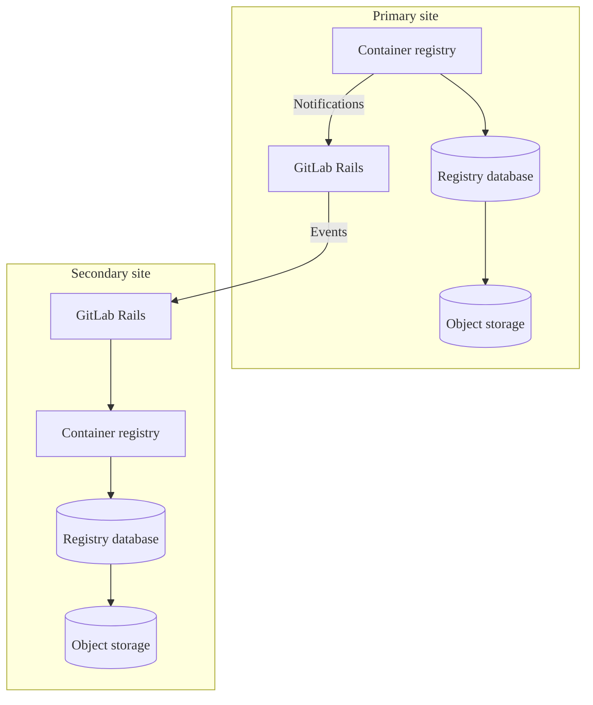



- 계층:  Free, Premium, Ultimate
- 제공:  GitLab Self-Managed





- GitLab 17.3에서 [정식 버전(GA)으로 제공됩니다](https://gitlab.com/gitlab-org/gitlab/-/issues/423459).
- 새 Linux 패키지 및 자체 컴파일 설치의 Prefer 모드 [도입](https://gitlab.com/gitlab-org/container-registry/-/merge_requests/2849)됨 (GitLab 19.0). 기본적으로 활성화됨.



메타데이터 데이터베이스는 성능을 개선하고 새로운 기능을 추가하는 [개선 사항](#enhancements)을 컨테이너 레지스트리에 제공합니다. GitLab Self-Managed 릴리스의 레지스트리 메타데이터 데이터베이스 기능 작업은 [에픽 5521](https://gitlab.com/groups/gitlab-org/-/epics/5521)에서 추적됩니다.

기본적으로 컨테이너 레지스트리는 객체 스토리지 또는 로컬 파일 시스템을 사용하여 컨테이너 이미지와 관련된 메타데이터를 유지합니다. 이러한 메타데이터 저장 방법은 데이터 액세스 효율성을 제한하며, 특히 태그 나열과 같이 여러 이미지에 걸친 데이터의 경우 더욱 그렇습니다. 데이터베이스를 사용하여 이 데이터를 저장하면 [온라인 가비지 컬렉션](https://gitlab.com/gitlab-org/container-registry/-/blob/master/docs/spec/gitlab/online-garbage-collection.md)을 포함하여 많은 새로운 기능이 가능해집니다. 이 기능은 가동 중지 시간 없이 이전 데이터를 자동으로 제거합니다.

이 데이터베이스는 레지스트리에서 이미 사용 중인 스토리지와 함께 작동하지만 객체 스토리지나 파일 시스템을 대체하지 않습니다. 메타데이터 데이터베이스로 메타데이터 가져오기를 수행한 후에도 스토리지 솔루션을 계속 유지해야 합니다.

Helm Charts 설치의 경우 Helm Charts 설명서에서 [컨테이너 레지스트리 메타데이터 데이터베이스 관리](https://docs.gitlab.com/charts/charts/registry/metadata_database/#create-the-database)를 참조하세요.

## 개선 사항 {#enhancements}

메타데이터 데이터베이스 아키텍처는 레거시 메타데이터 스토리지에서 사용할 수 없는 성능 개선, 버그 수정 및 새로운 기능을 지원합니다. 이러한 개선 사항에는 다음이 포함됩니다:

- 자동 [온라인 가비지 컬렉션](../../user/packages/container_registry/delete_container_registry_images.md#garbage-collection)
- 리포지토리, 프로젝트 및 그룹의 [스토리지 사용량 표시](../../user/packages/container_registry/reduce_container_registry_storage.md#view-container-registry-usage)
- [이미지 서명](../../user/packages/container_registry/_index.md#container-image-signatures)
- [리포지토리 이동 및 이름 변경](../../user/packages/container_registry/_index.md#move-or-rename-container-registry-repositories)
- [보호된 태그](../../user/packages/container_registry/protected_container_tags.md)
- [정리 정책](../../user/packages/container_registry/reduce_container_registry_storage.md#cleanup-policy)의 성능 개선으로 대규모 리포지토리의 성공적인 정리가 가능합니다.
- 리포지토리 태그 나열의 성능 개선
- 태그 게시 타임스탬프 추적 및 표시 ([이슈 290949](https://gitlab.com/gitlab-org/gitlab/-/issues/290949) 참조)
- 리포지토리 태그를 이름 이외의 추가 속성으로 정렬

레거시 메타데이터 스토리지의 기술적 제약으로 인해 새로운 기능은 메타데이터 데이터베이스 버전에만 구현됩니다. 보안 이외의 버그 수정은 메타데이터 데이터베이스 버전으로 제한될 수 있습니다.

## 알려진 제한 사항 {#known-limitations}

- 기존 레지스트리의 메타데이터 가져오기에는 읽기 전용 시간이 필요합니다.
- 18.3 이전에는 버전 업그레이드 시 레지스트리 일반 스키마 및 배포 후 데이터베이스 마이그레이션을 수동으로 실행해야 합니다.
- 다중 노드 Linux 패키지 환경의 [업그레이드 중 가동 중지 시간 없음](../../update/zero_downtime.md)을 보장하지 않습니다.
- 기존 레지스트리의 메타데이터 가져오기 중에 이미지 태그의 `createdAt` 및 `publishedAt` 타임스탬프 값이 가져오기 날짜로 설정됩니다. 이는 일관성을 보장하기 위해 의도된 것입니다. 왜냐하면 레거시 레지스트리는 모든 이미지에 대해 태그 게시 날짜를 수집하지 않기 때문입니다. 일부 이미지는 메타데이터에 빌드 날짜를 포함하지만 많은 이미지는 그렇지 않습니다. 자세한 내용은 [이슈 1384](https://gitlab.com/gitlab-org/container-registry/-/issues/1384)를 참조하세요.

## 메타데이터 데이터베이스 기능 지원 {#metadata-database-feature-support}

기존 레지스트리에서 메타데이터 데이터베이스로 메타데이터를 가져올 수 있으며 온라인 가비지 컬렉션을 사용할 수 있습니다.

일부 데이터베이스 활성화 기능은 GitLab.com에서만 활성화되며 레지스트리 데이터베이스의 자동 데이터베이스 프로비저닝은 사용할 수 없습니다. 컨테이너 레지스트리 데이터베이스와 관련된 기능 상태를 확인하려면 [피드백 이슈](https://gitlab.com/gitlab-org/gitlab/-/issues/423459#supported-feature-status)의 기능 지원 표를 참조하세요.

## Linux 패키지 설치를 위한 메타데이터 데이터베이스 활성화 {#enable-the-metadata-database-for-linux-package-installations}

전제 조건:

- GitLab 17.5가 최소 필요 버전이지만 추가 개선 사항과 더 쉬운 구성으로 인해 GitLab 18.3 이상을 권장합니다.
- PostgreSQL 데이터베이스 [버전 요구 사항 범위 내](../../install/requirements.md#postgresql). 레지스트리 노드에서 액세스할 수 있어야 합니다.
- 외부 데이터베이스를 사용하는 경우 먼저 외부 데이터베이스 연결을 설정해야 합니다. 자세한 내용은 [외부 데이터베이스 사용](#using-an-external-database)을 참조하세요.

### 시작하기 전에 {#before-you-start}

- 데이터베이스를 활성화한 후에는 계속 사용해야 합니다. 데이터베이스는 이제 레지스트리 메타데이터의 소스이며, 이 시점 이후에 비활성화하면 데이터베이스가 활성 상태였을 때 작성된 모든 이미지에 대한 레지스트리 가시성이 손실됩니다.
- [오프라인 가비지 컬렉션](container_registry.md#container-registry-garbage-collection)은 더 이상 필요하지 않습니다. GitLab에 포함된 가비지 컬렉션 명령은 데이터베이스가 활성화되면 안전하게 종료되지만, 업스트림 레지스트리에서 제공하는 것과 같은 타사 명령은 태그가 지정된 이미지와 연결된 데이터를 삭제합니다.
- 오프라인 가비지 컬렉션을 자동화하지 않았는지 확인하세요. 특히 타사 명령을 사용하는 경우입니다.
- 프로세스 속도를 높이려면 먼저 [레지스트리의 스토리지를 줄일](../../user/packages/container_registry/reduce_container_registry_storage.md) 수 있습니다.
- [컨테이너 레지스트리 데이터](../backup_restore/backup_gitlab.md#container-registry)를 백업하세요 (가능한 경우).
- 컨테이너 레지스트리 [알림](container_registry.md#configure-container-registry-notifications)을 구성하세요.

### 새 설치를 위한 데이터베이스 활성화 {#enable-the-database-for-new-installations}

컨테이너 레지스트리에 데이터를 작성한 적이 없는 설치의 경우 가져오기가 필요하지 않습니다. 레지스트리에 데이터를 쓰기 전에 데이터베이스를 활성화해야 합니다.

자세한 내용은 [새 설치](container_registry_metadata_database_new_install.md) 지침을 참조하세요.

### 기존 레지스트리를 위한 데이터베이스 활성화 {#enable-the-database-for-existing-registries}

1단계 가져오기 방법 또는 3단계 가져오기 방법을 사용하여 기존 컨테이너 레지스트리 메타데이터를 가져올 수 있습니다. 몇 가지 요소가 가져오기 기간에 영향을 미칩니다:

- 레지스트리의 태그가 지정된 이미지 수.
- 기존 레지스트리 데이터의 크기.
- PostgreSQL 인스턴스의 사양.
- 실행 중인 레지스트리 인스턴스의 수.
- 레지스트리, PostgreSQL 및 구성된 스토리지 간의 네트워크 지연.

가져오기 전 준비 과정에서 다음을 수행할 필요가 없습니다:

- 추가 객체 스토리지 또는 파일 시스템 공간 할당:  가져오기는 이 스토리지에 대해 중요한 쓰기를 수행하지 않습니다.
- 오프라인 가비지 컬렉션 실행:  해롭지는 않지만 오프라인 가비지 컬렉션은 이 명령 실행에 소요된 시간을 보충할 만큼 가져오기를 단축하지 못합니다.

> [!note]
> 메타데이터 가져오기는 태그가 지정된 이미지만 대상으로 합니다. 태그가 지정되지 않은 매니페스트와 이들이 참조하는 계층만 남겨지고 액세스할 수 없게 됩니다. 태그가 지정되지 않은 이미지는 GitLab UI 또는 API를 통해 표시되지 않았지만 '댕글링' 상태가 되어 백엔드에 남겨질 수 있습니다. 새 레지스트리로 가져온 후 모든 이미지는 지속적인 온라인 가비지 컬렉션의 대상이 되며, 기본적으로 24시간 이상 유지되는 태그가 지정되지 않은 매니페스트 및 계층을 삭제합니다.

### 올바른 가져오기 방법 선택 {#choose-the-right-import-method}

정기적으로 [오프라인 가비지 컬렉션](container_registry.md#container-registry-garbage-collection) 을 실행하는 경우 [1단계 가져오기](container_registry_metadata_database_one_step_import.md) 방법을 사용하세요. 이 방법은 유사한 시간이 소요되며 3단계 가져오기 방법과 비교하여 더 간단한 작업입니다.

레지스트리가 너무 커서 정기적으로 오프라인 가비지 컬렉션을 실행할 수 없는 경우 [3단계 가져오기](container_registry_metadata_database_three_step_import.md) 방법을 사용하여 읽기 전용 시간을 크게 줄이세요.

외부 데이터베이스를 사용하는 경우 마이그레이션 경로로 진행하기 전에 외부 데이터베이스 연결을 설정해야 합니다.

자세한 내용은 [외부 데이터베이스 사용](#using-an-external-database)을 참조하세요.

### 중단된 가져오기 복원 {#restore-interrupted-imports}



- GitLab 18.5에서 [도입](https://gitlab.com/gitlab-org/container-registry/-/issues/1162)됨.



지난 72시간 내에 사전 가져오기한 리포지토리를 건너뛰어 중단된 가져오기를 다시 시작합니다. 리포지토리는 다음 중 하나의 방식으로 사전 가져오기됩니다:

- 3단계 가져오기 프로세스의 1단계를 완료합니다.
- 1단계 가져오기 프로세스를 완료합니다.

중단된 가져오기를 복원하려면 `--pre-import-skip-recent` 플래그를 구성하세요. 기본값은 72시간입니다.

예를 들어:

```shell
# Skip repositories imported within 6 hours from the start of the import command
--pre-import-skip-recent 6h

# Disable skipping behavior
--pre-import-skip-recent 0
```

유효한 기간 단위에 대한 자세한 내용은 [Go 기간 문자열](https://pkg.go.dev/time#ParseDuration)을 참조하세요.

### 가져오기 후 {#post-import}

대규모 가져오기를 완료한 후 수백만 개의 블롭이 가비지 컬렉션 검토 대기열에 들어갈 수 있습니다. 이는 정상입니다.

태그가 지정된 이미지가 댕글링 블롭이 인벤토리되기 전에 가져오기되기 때문에 가비지 수집기는 초기에 태그가 지정된 이미지에서 여전히 참조되는 블롭을 검토합니다. 가비지 컬렉션은 이러한 블롭을 대기열에서 제거하지만 스토리지에서 삭제하지 않습니다.

스토리지는 가비지 수집기가 댕글링 블롭에 도달한 후에만 감소합니다. 레지스트리 스토리지는 가비지 수집기가 이미지 블롭 간섭을 피하기 위해 검토를 지연시키기 때문에 가져오기 후 48시간 이상 감소하는 데 걸릴 수 있습니다.

가져오기 후 가비지 컬렉션 백로그를 모니터링하고 관리하려면:

- [온라인 가비지 컬렉션 상태 확인](#check-the-health-of-online-garbage-collection)하여 검토 대기열의 크기와 상태를 확인하세요.
- [가비지 수집기 작업자 간격 조정](#adjust-the-garbage-collector-worker-interval)하여 대규모 백로그의 처리 속도를 일시적으로 높입니다.

## Prefer 모드 {#prefer-mode}



- GitLab 18.7에서 [도입](https://gitlab.com/gitlab-org/omnibus-gitlab/-/work_items/9411)됨.
- GitLab 19.0의 새 Linux 패키지 및 자체 컴파일 설치에 대해 [기본적으로 활성화](https://gitlab.com/gitlab-org/container-registry/-/merge_requests/2849)됨.



Prefer 모드는 기존 레지스트리가 아직 데이터베이스로 가져오기되지 않았을 때 레지스트리가 레거시 메타데이터 스토리지로 폴백할 수 있도록 하는 메타데이터 데이터베이스의 구성 옵션입니다.

### Prefer 모드 활성화 {#enable-prefer-mode}

Prefer 모드를 활성화하려면:

1. `/etc/gitlab/gitlab.rb`에서 `database.enabled`을 `"prefer"` 대신 `true` 또는 `false`로 설정하세요:

   ```ruby
   registry['database'] = {
     'enabled' => 'prefer',
     'host' => '<your_database_host>',
     'port' => 5432,
     'user' => '<your_database_user>',
     'password' => '<your_database_password>',
     'dbname' => '<your_database_name>',
   }
   ```

1. 파일을 저장하고 [GitLab을 다시 구성](../restart_gitlab.md)하세요.

GitLab을 다시 구성한 후 레지스트리는 파일 시스템 또는 데이터베이스에 대한 이전 쓰기를 추적하는 잠금 파일을 기반으로 시작 시 사용할 메타데이터 백엔드를 평가합니다:

- 파일 시스템 잠금 파일이 있습니다:  레지스트리는 기존 파일 시스템 메타데이터를 가지고 있습니다. 레거시 메타데이터 스토리지로 폴백하고 경고를 기록합니다. 레지스트리는 `enabled: false`과 동일하게 작동하며 [메타데이터 가져오기](#enable-the-database-for-existing-registries)를 완료할 때까지입니다.
- 데이터베이스 잠금 파일이 있습니다:  레지스트리는 이미 데이터베이스를 사용합니다. `enabled: true`과 동일하게 정상적으로 데이터베이스에 연결합니다.
- 잠금 파일이 없습니다:  레지스트리는 새로 설치된 것입니다. 구성되고 도달 가능한 데이터베이스가 필요하며 레거시 스토리지로 폴백하지 않습니다.
- 두 잠금 파일이 모두 있습니다:  레지스트리가 시작을 거부합니다. 이는 수동으로 해결해야 하는 구성 오류입니다.

폴백 결정은 시작 시 한 번 발생하며 레지스트리가 실행되는 동안 변경되지 않습니다. 폴백 후 데이터베이스에 자동 재시도 또는 재연결이 없습니다. 폴백 후 파일 시스템에서 데이터베이스 모드로 이동하려면 표준 [메타데이터 가져오기](#enable-the-database-for-existing-registries)를 완료하고 레지스트리를 다시 시작하세요.

### 기본 구성 {#default-configuration}



- 기본 메타데이터 데이터베이스 모드가 GitLab 19.0의 새 Linux 패키지 및 자체 컴파일 설치에 대해 [`prefer`로 변경](https://gitlab.com/gitlab-org/container-registry/-/merge_requests/2849)되었습니다.



GitLab 19.0 이상에서 메타데이터 데이터베이스는 새 설치를 위한 Prefer 모드에서 기본적으로 활성화됩니다:

- Linux 패키지 (Omnibus) 설치: `registry['database']['enabled']`은 `/etc/gitlab/gitlab.rb`에 지정되지 않은 경우 `"prefer"`로 기본 설정됩니다. 자세한 내용은 [이슈 9396](https://gitlab.com/gitlab-org/omnibus-gitlab/-/issues/9396)을 참조하세요.
- 자체 컴파일 설치: `database.enabled`은 레지스트리 구성 파일에 지정되지 않은 경우 `"prefer"`로 기본 설정됩니다.

업그레이드 후 레지스트리가 사용하는 백엔드를 확인하세요. 절차는 [활성 메타데이터 백엔드 확인](#verify-which-metadata-backend-is-active)을 참조하세요.

#### 새 설치 {#new-installations}

새 GitLab 19.0 이상 설치에서 레지스트리는 Prefer 모드에서 시작됩니다. 도달 가능한 메타데이터 데이터베이스가 구성된 경우 레지스트리가 이를 사용합니다. 도달 가능한 데이터베이스가 없으면 레지스트리가 시작되지 않습니다.

새 설치를 파일 시스템 메타데이터에 유지하려면 첫 번째 레지스트리 시작 전에 데이터베이스 모드를 `"false"`로 설정하세요:

- Linux 패키지 (Omnibus) 설치의 경우 `/etc/gitlab/gitlab.rb`에서:

  ```ruby
  registry['database']['enabled'] = "false"
  ```

- 자체 컴파일 설치의 경우 `/home/git/gitlab/config/gitlab.yml`에서:

  ```yaml
  registry:
    database:
      enabled: false
  ```

#### 기존 설치 {#existing-installations}

GitLab 19.0 이상으로 기존 설치를 업그레이드하면 현재 `registry['database']['enabled']` 설정이 유지됩니다. 업그레이드는 메타데이터를 마이그레이션하거나 활성 백엔드를 전환하지 않습니다.

기존 Prefer 모드 설치 및 파일 시스템 메타데이터는 업그레이드 후에도 파일 시스템 메타데이터를 계속 사용합니다. 데이터베이스로 전환하려면 [메타데이터 가져오기](#enable-the-database-for-existing-registries)를 완료하세요.

#### 메타데이터 데이터베이스 백업 {#metadata-database-backups}

레지스트리가 메타데이터 데이터베이스를 사용할 때 레지스트리 데이터베이스를 백업에 포함시키세요. 절차는 [메타데이터 데이터베이스 백업](#backup-with-metadata-database)을 참조하세요.

기존 파일 시스템 메타데이터가 있는 Prefer 모드 설치는 다시 시작할 때도 폴백 상태를 유지합니다. 폴백 중에 레지스트리는 메타데이터 데이터베이스에서 읽거나 쓰지 않습니다. 폴백이 끝날 때까지 메타데이터 데이터베이스를 백업할 필요가 없습니다.

폴백을 끝내려면 [메타데이터 가져오기](#enable-the-database-for-existing-registries)를 완료하고 레지스트리를 다시 시작하세요. 다시 시작 후 레지스트리는 메타데이터 데이터베이스를 사용합니다. 백업 루틴에 포함시키세요.

### 활성 메타데이터 백엔드 확인 {#verify-which-metadata-backend-is-active}

레지스트리가 사용하는 메타데이터 백엔드를 확인하려면 다음 방법 중 하나를 사용하세요.

#### 레지스트리 API 응답 헤더 확인 {#check-the-registry-api-response-header}

1. 레지스트리 `/v2/` 엔드포인트로 요청을 전송하세요:

   ```shell
   curl --silent --head "https://registry.example.com/v2/" | grep --ignore-case gitlab-container-registry-database-enabled
   ```

1. `gitlab-container-registry-database-enabled` 응답 헤더를 검토하세요:

   - `true`의 값은 레지스트리가 메타데이터 데이터베이스를 사용 중임을 의미합니다.
   - `false`의 값은 레거시 파일 시스템 스토리지를 사용 중임을 의미합니다.

#### 디스크의 잠금 파일 확인 {#check-lockfiles-on-disk}

디스크의 잠금 파일을 확인하려면 `<rootdirectory>/docker/registry/lockfiles/`의 구성된 스토리지 백엔드에서 다음 파일을 찾으세요:

- `database-in-use`:  레지스트리가 메타데이터 데이터베이스를 사용 중입니다.
- `filesystem-in-use`:  레지스트리가 레거시 파일 시스템 스토리지를 사용 중입니다.

두 잠금 파일이 모두 있으면 레지스트리가 유효하지 않은 상태이며 시작되지 않습니다.

#### 레지스트리 로그 확인 {#check-registry-logs}

레지스트리는 시작 시 선택하는 메타데이터 백엔드를 기록합니다.

레지스트리 로그를 확인하려면 다음 메시지 중 하나를 찾으세요:

- 레지스트리가 레거시 스토리지로 폴백하는 경우 (Prefer 모드만):

  ```plaintext
  database prefer mode enabled, but found filesystem metadata: falling back to legacy metadata
  ```

- 레지스트리가 데이터베이스에 연결하는 경우:

  ```plaintext
  using the metadata database
  ```

## 데이터베이스 마이그레이션 {#database-migrations}

컨테이너 레지스트리는 두 가지 유형의 마이그레이션을 지원합니다:

- 일반 스키마 마이그레이션:  새 애플리케이션 코드를 배포하기 전에 실행해야 하는 데이터베이스 구조의 변경 사항 (배포 전 마이그레이션이라고도 함). 배포 지연을 피하기 위해 빠르거나 (최대 몇 분) 매우 빨라야 합니다.
- 배포 후 마이그레이션:  애플리케이션이 실행되는 동안 실행할 수 있는 데이터베이스 구조의 변경 사항. 큰 테이블에 인덱스 만들기와 같은 더 오래 걸리는 작업에 사용되며 시작 지연 및 확장 업그레이드 가동 중지 시간을 피합니다.

기본적으로 레지스트리는 일반 스키마 및 배포 후 마이그레이션을 동시에 적용합니다. 업그레이드 중 가동 중지 시간을 줄이려면 배포 후 마이그레이션을 건너뛰고 애플리케이션 시작 후 수동으로 적용할 수 있습니다.

### 데이터베이스 마이그레이션 적용 {#apply-database-migrations}





애플리케이션이 시작되기 전에 일반 스키마 및 배포 후 마이그레이션을 모두 적용하려면:

1. 데이터베이스 마이그레이션을 실행하세요:

   ```shell
   sudo gitlab-ctl registry-database migrate up
   ```

배포 후 마이그레이션을 건너뛰려면:

1. 일반 스키마 마이그레이션만 실행하세요:

   ```shell
   sudo gitlab-ctl registry-database migrate up --skip-post-deployment
   ```

   `--skip-post-deployment` 플래그 대신 `SKIP_POST_DEPLOYMENT_MIGRATIONS` 환경 변수를 `true`로 설정할 수도 있습니다:

   ```shell
   SKIP_POST_DEPLOYMENT_MIGRATIONS=true sudo gitlab-ctl registry-database migrate up
   ```

1. 애플리케이션을 시작한 후 보류 중인 배포 후 마이그레이션을 적용하세요:

   ```shell
   sudo gitlab-ctl registry-database migrate up
   ```





애플리케이션이 시작되기 전에 일반 스키마 및 배포 후 마이그레이션을 모두 적용하려면:

1. 데이터베이스 마이그레이션을 실행하세요:

   ```shell
   sudo -u registry gitlab-ctl registry-database migrate up
   ```

배포 후 마이그레이션을 건너뛰려면:

1. 일반 스키마 마이그레이션만 실행하세요:

   ```shell
   sudo -u registry gitlab-ctl registry-database migrate up --skip-post-deployment
   ```

   `--skip-post-deployment` 플래그 대신 `SKIP_POST_DEPLOYMENT_MIGRATIONS` 환경 변수를 `true`로 설정할 수도 있습니다:

   ```shell
   SKIP_POST_DEPLOYMENT_MIGRATIONS=true sudo -u registry gitlab-ctl registry-database migrate up
   ```

1. 애플리케이션을 시작한 후 보류 중인 배포 후 마이그레이션을 적용하세요:

   ```shell
   sudo -u registry gitlab-ctl registry-database migrate up
   ```





> [!note]
> `migrate up` 명령은 마이그레이션 적용 방식을 제어하는 데 사용할 수 있는 몇 가지 추가 플래그를 제공합니다. 자세한 내용은 `sudo gitlab-ctl registry-database migrate up --help`을 실행하세요.

## 온라인 가비지 컬렉션 모니터링 {#online-garbage-collection-monitoring}

가져오기 프로세스 이후의 온라인 가비지 컬렉션의 초기 실행 시간은 가져온 이미지 수에 따라 달라집니다. 이 기간 동안 온라인 가비지 컬렉션의 효율성과 상태를 모니터링해야 합니다.

### 데이터베이스 성능 모니터링 {#monitor-database-performance}

가져오기를 완료한 후 가비지 컬렉션 대기열이 비워지면서 데이터베이스가 높은 부하 기간을 경험할 수 있습니다. 이 높은 부하는 온라인 가비지 수집기가 대기 중인 작업을 처리하는 많은 수의 개별 데이터베이스 호출로 인해 발생합니다.

PostgreSQL 및 레지스트리 로그에서 오류 또는 경고를 정기적으로 확인하세요. 레지스트리 로그에서 `component=registry.gc.*`로 필터링된 로그에 특별히 주의하세요.

### 메트릭 추적 {#track-metrics}

Prometheus 및 Grafana와 같은 모니터링 도구를 사용하여 가비지 컬렉션 메트릭을 시각화하고 추적하며 `registry_gc_*` 접두사가 있는 메트릭에 초점을 맞추세요. 여기에는 삭제 표시된 객체 수, 성공적으로 삭제된 객체, 실행 간격 및 기간이 포함됩니다. Prometheus를 활성화하는 방법은 [레지스트리 디버그 서버 활성화](container_registry_troubleshooting.md#enable-the-registry-debug-server)를 참조하세요.

### 작업 대기열 모니터링 {#monitor-task-queues}

블롭 및 매니페스트의 가비지 컬렉션 작업 대기열의 상태와 상태를 모니터링하세요.

#### 온라인 가비지 컬렉션 상태 확인 {#check-the-health-of-online-garbage-collection}





다음 명령은 온라인 가비지 컬렉션과 관련된 정보를 표시합니다.

```shell
sudo gitlab-ctl registry-database gc-stats
```

출력 예:

```shell
=== Blob Review Queue ===

Tasks Pending Removal: 42
Tasks ready for GC review (review_after has passed).

┌───────────────────────────────────────────────────────────────────┬─────────────────────┬─────────────────┐
│                              DIGEST                               │    REVIEW AFTER     │      EVENT      │
├───────────────────────────────────────────────────────────────────┼─────────────────────┼─────────────────┤
│ sha256:a3ed95caeb02ffe68cdd9fd84406680ae93d633cb16422d00e8a7c22e  │ 2026-01-16 21:56:13 │ blob_upload     │
│ sha256:b4f5e6d7c8a9b0c1d2e3f4a5b6c7d8e9f0a1b2c3d4e5f6a7b8c9d0e1f2 │ 2026-01-16 19:56:13 │ manifest_delete │
│ sha256:c5d6e7f8a9b0c1d2e3f4a5b6c7d8e9f0a1b2c3d4e5f6a7b8c9d0e1f2a3 │ 2026-01-16 17:56:13 │ layer_delete    │
└───────────────────────────────────────────────────────────────────┴─────────────────────┴─────────────────┘

Long Overdue Tasks: 5
Tasks pending longer than configured delay - may need attention.

┌───────────────────────────────────────────────────────────────────┬─────────────────────┬──────────────┬─────────┐
│                              DIGEST                               │    REVIEW AFTER     │    EVENT     │ OVERDUE │
├───────────────────────────────────────────────────────────────────┼─────────────────────┼──────────────┼─────────┤
│ sha256:d6e7f8a9b0c1d2e3f4a5b6c7d8e9f0a1b2c3d4e5f6a7b8c9d0e1f2a3b4 │ 2026-01-11 23:56:13 │ blob_upload  │ 4d 0h   │
│ sha256:e7f8a9b0c1d2e3f4a5b6c7d8e9f0a1b2c3d4e5f6a7b8c9d0e1f2a3b4c5 │ 2026-01-13 23:56:13 │ layer_delete │ 2d 0h   │
└───────────────────────────────────────────────────────────────────┴─────────────────────┴──────────────┴─────────┘

High Retry Tasks: 2
Tasks with >10 review attempts - may indicate persistent issues.

┌───────────────────────────────────────────────────────────────────┬─────────────────────┬─────────────────┬─────────┐
│                              DIGEST                               │    REVIEW AFTER     │      EVENT      │ RETRIES │
├───────────────────────────────────────────────────────────────────┼─────────────────────┼─────────────────┼─────────┤
│ sha256:f8a9b0c1d2e3f4a5b6c7d8e9f0a1b2c3d4e5f6a7b8c9d0e1f2a3b4c5d6 │ 2026-01-17 00:56:13 │ blob_upload     │ 15      │
│ sha256:a9b0c1d2e3f4a5b6c7d8e9f0a1b2c3d4e5f6a7b8c9d0e1f2a3b4c5d6e7 │ 2026-01-17 01:56:13 │ manifest_delete │ 12      │
└───────────────────────────────────────────────────────────────────┴─────────────────────┴─────────────────┴─────────┘

=== Manifest Review Queue ===

Tasks Pending Removal: 128
Tasks ready for GC review (review_after has passed).

┌───────────────┬─────────────┬─────────────────────┬──────────────────────┐
│ REPOSITORY ID │ MANIFEST ID │    REVIEW AFTER     │        EVENT         │
├───────────────┼─────────────┼─────────────────────┼──────────────────────┤
│ 1001          │ 12345       │ 2026-01-16 22:56:13 │ tag_delete           │
│ 1002          │ 67890       │ 2026-01-16 20:56:13 │ manifest_upload      │
│ 1003          │ 11111       │ 2026-01-16 18:56:13 │ tag_switch           │
│ 2001          │ 22222       │ 2026-01-16 16:56:13 │ manifest_list_delete │
└───────────────┴─────────────┴─────────────────────┴──────────────────────┘

Long Overdue Tasks: 8
Tasks pending longer than configured delay - may need attention.

┌───────────────┬─────────────┬─────────────────────┬─────────────────┬─────────┐
│ REPOSITORY ID │ MANIFEST ID │    REVIEW AFTER     │      EVENT      │ OVERDUE │
├───────────────┼─────────────┼─────────────────────┼─────────────────┼─────────┤
│ 3001          │ 33333       │ 2026-01-12 23:56:13 │ tag_delete      │ 3d 0h   │
│ 3002          │ 44444       │ 2026-01-14 23:56:13 │ manifest_delete │ 1d 0h   │
└───────────────┴─────────────┴─────────────────────┴─────────────────┴─────────┘

High Retry Tasks: 3
Tasks with >10 review attempts - may indicate persistent issues.

┌───────────────┬─────────────┬─────────────────────┬─────────────────┬─────────┐
│ REPOSITORY ID │ MANIFEST ID │    REVIEW AFTER     │      EVENT      │ RETRIES │
├───────────────┼─────────────┼─────────────────────┼─────────────────┼─────────┤
│ 4001          │ 55555       │ 2026-01-17 00:26:13 │ tag_delete      │ 18      │
│ 4002          │ 66666       │ 2026-01-17 00:41:13 │ manifest_upload │ 11      │
└───────────────┴─────────────┴─────────────────────┴─────────────────┴─────────┘
```





### GitLab 컨테이너 레지스트리 메타데이터 데이터베이스에 연결 {#connect-to-the-gitlab-container-registry-metadata-database}

다음 명령을 사용하여 레지스트리 메타데이터 데이터베이스에 연결하세요:

```shell
gitlab-psql -d registry
```

### 온라인 가비지 컬렉션 작업 상태를 확인하기 위한 쿼리 {#queries-to-determine-status-of-online-garbage-collection-tasks}

다음 쿼리는 10회 이상 재시도되었거나 24시간 이상 검토할 수 있는 작업을 반환합니다. 온라인 가비지 수집기는 24시간 이내에 검토할 항목을 선택해야 하며 실패한 시도는 거의 없어야 합니다. 행이 반환되면 온라인 가비지 수집기의 상태를 조사하세요.

매니페스트의 경우:

```sql
SELECT
  repository_id,
  manifest_id,
  ROUND(
    EXTRACT(
      EPOCH
      FROM
        AGE(NOW(), review_after)
    ) / 3600
  ) AS hours_eligible_for_review,
  review_count as failed_review_attempts,
  event
FROM
  gc_manifest_review_queue
WHERE
  review_after < NOW() - INTERVAL '24 hours'
  OR review_count > 10
LIMIT
  20;
```

블롭의 경우:

```sql
SELECT
  substring(encode(digest, 'hex'), 3) AS digest,
  ROUND(
    EXTRACT(
      EPOCH
      FROM
        AGE(NOW(), review_after)
    ) / 3600
  ) AS hours_eligible_for_review,
  review_count as failed_review_attempts,
  event
FROM
  gc_blob_review_queue
WHERE
  review_after < NOW() - INTERVAL '24 hours'
  OR review_count > 10
LIMIT
  20;
```

#### 온라인 가비지 컬렉션 관련 정보성 쿼리 {#informational-queries-related-to-online-garbage-collection}

다음 쿼리를 실행하여 검토할 수 있는 작업 수를 확인하세요:

```sql
SELECT COUNT(*) FROM gc_blob_review_queue WHERE review_after < NOW();
SELECT COUNT(*) FROM gc_manifest_review_queue WHERE review_after < NOW();
```





일반적으로 검토 준비가 된 항목의 수는 상대적으로 적으며 대개 0에 가깝습니다. 그러나 다음과 같은 경우 더 많을 수 있습니다:

- 가져오기가 24~48시간 전에 시작되었습니다.
- 많은 양의 태그가 삭제되었거나 컨테이너 리포지토리가 제거되었습니다.
- 온라인 가비지 컬렉션이 오랜 기간 동안 비활성화되었습니다.

재시도하거나 기한이 초과된 작업이 있으면 가비지 컬렉션과 관련된 메시지를 확인하세요. `component="registry.gc.*` 항목을 필터링하고 오류 메시지를 조사하세요.

#### 문제 해결 전에 확인 {#check-before-troubleshooting}

##### GC 대기열 크기 {#gc-queue-sizes}

`gc_manifest_review_queue` 및 `gc_blob_review_queue`의 필터링되지 않은 크기는 온라인 가비지 수집기의 상태를 잘 나타내는 지표가 아닙니다. 이러한 대기열에는 지속적으로 새 항목이 추가되므로 활성 레지스트리의 경우 이러한 대기열이 완전히 비워지지 않습니다.

또한 이러한 대기열의 모든 항목이 스토리지에서 제거되지는 않습니다. [온라인 가비지 컬렉션](https://gitlab.com/gitlab-org/container-registry/-/blob/master/docs/spec/gitlab/online-garbage-collection.md) 사양을 참조하여 이러한 대기열의 전체 설명을 확인하세요.

##### 검토 준비가 된 많은 작업 {#lots-of-tasks-ready-to-review}

검토할 수 있는 많은 양의 작업도 반드시 우려할 원인이 되지는 않습니다. 가비지 수집기는 활동 급증으로 인한 항목을 처리 중일 수 있습니다.

##### 일부 작업이 오래됨 {#some-tasks-are-old}

마찬가지로 이러한 작업의 `created_at` 날짜만으로는 좋은 상태 표시기가 아닙니다. 이벤트가 동일한 블롭 또는 매니페스트를 대기열에 추가할 때 기존 작업의 `review_after`이 업데이트되어 검토가 연기됩니다. 중복 작업이 생성되지 않습니다.

이것은 여러 번 발생할 수 있으므로 몇 개월 전에 생성된 작업은 우려할 원인이 아닙니다.

### 가비지 수집기 작업자 간격 조정 {#adjust-the-garbage-collector-worker-interval}

검토 준비가 된 작업 수가 높게 유지되고 가비지 컬렉션 블롭 또는 매니페스트 작업자 실행 간 빈도를 높이려면 간격 구성을 기본값 (`5s`)에서 `1s`로 업데이트하세요:

```ruby
registry['gc'] = {
  'blobs' => {
    'interval' => '1s'
  },
  'manifests' => {
    'interval' => '1s'
  }
}
```

가져오기 부하가 제거된 후 데이터베이스 및 레지스트리 인스턴스에 불필요한 CPU 부하를 피하기 위해 장기적으로 이러한 설정을 미세 조정해야 합니다. 성능과 리소스 사용 간의 균형을 맞추는 값으로 간격을 점진적으로 늘릴 수 있습니다.

### 데이터 일관성 검증 {#validate-data-consistency}

가져온 후 데이터 일관성을 보장하려면 [`crane validate`](https://github.com/google/go-containerregistry/blob/main/cmd/crane/doc/crane_validate.md) 도구를 사용하세요. 이 도구는 컨테이너 레지스트리의 모든 이미지 계층 및 매니페스트가 액세스 가능하고 올바르게 연결되어 있는지 확인합니다. `crane validate`을 실행하면 레지스트리의 이미지가 완전하고 액세스 가능한지 확인하여 성공적인 가져오기를 보장합니다.

### 정리 정책 검토 {#review-cleanup-policies}

대부분의 이미지가 태그되어 있으면 가비지 컬렉션이 태그가 지정되지 않은 이미지만 삭제하기 때문에 스토리지 공간을 크게 줄이지 못합니다.

정리 정책을 구현하여 불필요한 태그를 제거합니다. 이는 결국 가비지 컬렉션을 통해 이미지가 제거되고 스토리지 공간이 복구됩니다.

## 외부 데이터베이스 사용 {#using-an-external-database}

기본적으로 GitLab 18.3 이상은 컨테이너 레지스트리 메타데이터를 위해 기본 GitLab 데이터베이스 내에 논리 데이터베이스를 사전 프로비저닝합니다. 그러나 [레지스트리를 확장](container_registry.md#scaling-by-component)하려는 경우 컨테이너 레지스트리를 위해 전용 외부 데이터베이스를 사용할 수 있습니다.

### 단계 {#steps}

- [외부 데이터베이스](../postgresql/external.md#container-registry-metadata-database)를 만드세요.

그 후 기본 데이터베이스에 대해 동일한 단계를 수행하여 자신의 데이터베이스 값을 대체하세요. 데이터베이스를 비활성화된 상태로 시작하여 지시에 따라 데이터베이스를 활성화하고 비활성화하도록 주의하세요:

```ruby
registry['database'] = {
  'enabled' => false,
  'host' => '<registry_database_host_placeholder_change_me>',
  'port' => 5432, # Default, but set to the port of your database instance if it differs.
  'user' => '<registry_database_username_placeholder_change_me>',
  'password' => '<registry_database_placeholder_change_me>',
  'dbname' => '<registry_database_name_placeholder_change_me>',
  'sslmode' => 'require', # See the PostgreSQL documentation for additional information https://www.postgresql.org/docs/16/libpq-ssl.html.
  'sslcert' => '</path/to/cert.pem>',
  'sslkey' => '</path/to/private.key>',
  'sslrootcert' => '</path/to/ca.pem>'
}
```

## 메타데이터 데이터베이스 백업 {#backup-with-metadata-database}



- 레지스트리 메타데이터 데이터베이스의 자동 백업 지원이 GitLab 18.10에서 [도입](https://gitlab.com/gitlab-org/gitlab/-/work_items/581279)되었습니다.



메타데이터 데이터베이스가 켜져 있으면 백업에는 레지스트리 스토리지 백엔드와 데이터베이스가 모두 포함되어야 합니다.

백업 방법은 스토리지 유형에 따라 다릅니다:

- 로컬 파일 시스템 스토리지: `gitlab-backup`은 레지스트리를 자동으로 포함합니다.
- 객체 스토리지:  객체 스토리지를 별도로 백업해야 합니다.

스토리지와 데이터베이스를 가능한 한 가까운 시간에 백업하여 일관된 레지스트리 상태를 보장하세요. 레지스트리를 복원하려면 두 백업을 모두 적용해야 합니다.

### 자동 백업 {#automatic-backup}

GitLab 18.10 이상에서 `gitlab-backup create` 및 `gitlab-backup restore`은 메타데이터 데이터베이스가 구성된 경우 레지스트리 메타데이터 데이터베이스를 자동으로 포함합니다. Helm 차트 (Kubernetes) 설치에서 `backup-utility`도 동일하게 작동합니다.

메타데이터 데이터베이스는 `gitlab.rb` 또는 Helm 값 파일에 구성되어야 합니다.

추가 구성이 필요하지 않습니다. 백업 도구는 기존 구성에서 레지스트리 데이터베이스 연결 설정을 읽습니다.

백업을 실행하는 노드에서 직접 백업 Rake 작업을 호출하는 경우 다음 환경 변수를 설정해야 합니다:

| 변수 | 필수 | 설명 |
|---|---|---|
| `REGISTRY_DATABASE_HOST` | 예 | 데이터베이스 호스트입니다. |
| `REGISTRY_DATABASE_NAME` | 예 | 데이터베이스 이름입니다. |
| `REGISTRY_DATABASE_USER` | 예 | 데이터베이스 사용자입니다. |
| `REGISTRY_DATABASE_PORT` | 아니요 | 데이터베이스 포트입니다. `5432`로 기본 설정됩니다. |
| `REGISTRY_DATABASE_PASSWORD` | 아니요 | 데이터베이스 암호입니다. |
| `REGISTRY_DATABASE_SSLMODE` | 아니요 | SSL 모드 필요 여부입니다. `require`로 설정하거나 생략하세요. |
| `REGISTRY_DATABASE_SSLCERT` | 아니요 | 클라이언트 인증서의 경로입니다. |
| `REGISTRY_DATABASE_SSLKEY` | 아니요 | 클라이언트 개인 키의 경로입니다. |
| `REGISTRY_DATABASE_SSLROOTCERT` | 아니요 | CA 인증서의 경로입니다. |
| `REGISTRY_DATABASE_CONNECT_TIMEOUT` | 아니요 | 연결 시간 제한 (초)입니다. |

백업 Rake 작업은 다음 자격 증명 중 하나를 감지할 때 레지스트리 데이터베이스 백업을 활성화합니다:

- `REGISTRY_DATABASE_PASSWORD`
- `REGISTRY_DATABASE_SSLCERT`
- `REGISTRY_DATABASE_SSLKEY`
- `REGISTRY_DATABASE_SSLROOTCERT`

자격 증명이 없으면 레지스트리 데이터베이스가 백업에 포함되지 않습니다. 복원 시 동일한 환경 변수를 설정해야 합니다.

### 수동 백업 {#manual-backup}

GitLab 18.9 이전을 사용하거나 레지스트리 데이터베이스 백업을 별도로 관리하려는 경우 `pg_dump` 및 `pg_restore`과 같은 표준 PostgreSQL 도구를 사용하여 레지스트리 데이터베이스를 독립적으로 백업 및 복원하세요.

### Helm 차트 (Kubernetes) 백업 및 복원 {#helm-chart-kubernetes-backup-and-restore}



- GitLab 18.10에서 [도입](https://gitlab.com/gitlab-org/charts/gitlab/-/work_items/6207)됨.



Helm 차트 (Kubernetes) 배포의 경우 백업 및 복원 작업을 위해 전용 데이터베이스 자격 증명으로 도구 상자 Pod를 구성하세요. 두 개의 별도 PostgreSQL 사용자가 필요합니다:

- 백업 사용자는 읽기 전용 권한이 있어야 합니다.
- 복원 사용자는 쓰기 권한이 있어야 합니다.

필요한 작업에 따라 하나 또는 두 사용자를 모두 구성하세요.

시작하기 전에 `registry.database.enabled: true`로 설정하여 컨테이너 레지스트리 메타데이터 데이터베이스를 활성화하세요.

#### Kubernetes Secret 생성 {#create-the-kubernetes-secret}

배포하기 전에 Kubernetes Secret을 수동으로 생성해야 합니다. 차트는 이 Secret을 자동으로 생성하지 않습니다.

예를 들어 백업 및 복원 암호로 Secret을 생성하려면:

```shell
kubectl create secret generic my-registry-db-password-secret \
  --from-literal=backupPassword="BACKUP_USER_PASSWORD" \
  --from-literal=restorePassword="RESTORE_USER_PASSWORD"
```

#### 레지스트리 데이터베이스 자격 증명 구성 {#configure-registry-database-credentials}

백업 및 복원 사용자를 구성하려면 Helm `values.yaml`에 필요한 YAML을 추가하세요. 구성 설정 정의를 확인하려면 다음 표를 참조하세요.

| 설정 | 기본값 | 설명 |
|---|---|---|
| `backupUser` | | 백업 작업을 위한 PostgreSQL 사용자 이름입니다. 레지스트리 데이터베이스 백업을 활성화하려면 필수입니다. |
| `restoreUser` | | 복원 작업을 위한 PostgreSQL 사용자 이름입니다. 레지스트리 데이터베이스 복원을 활성화하려면 필수입니다. |
| `password.secret` | `<release-name>-toolbox-registry-database-password` | 암호를 포함하는 Kubernetes Secret의 이름입니다. |
| `password.backupPasswordKey` | `backupPassword` | 백업 사용자의 암호에 대한 Kubernetes Secret의 키입니다. |
| `password.restorePasswordKey` | `restorePassword` | 복원 사용자의 암호에 대한 Kubernetes Secret의 키입니다. |

다음 예에서는 백업 및 복원 사용자를 모두 구성합니다:

```yaml
gitlab:
  toolbox:
    backups:
      registry:
        database:
          # PostgreSQL username for backing up the registry database
          backupUser: "registry_backup"
          # PostgreSQL username for restoring the registry database
          restoreUser: "registry_restore"
          password:
            # Name of the Kubernetes Secret containing the passwords
            secret: "my-registry-db-password-secret"
            # Key in the Secret for the backup user's password
            backupPasswordKey: "backupPassword"
            # Key in the Secret for the restore user's password
            restorePasswordKey: "restorePassword"
```

`backupUser` 또는 `restoreUser`이 구성되지 않은 경우 레지스트리 데이터베이스 백업이 자동으로 건너뛰어지고 도구 상자 Pod가 정상적으로 작동합니다.

#### PostgreSQL 사용자 권한 {#postgresql-user-permissions}

백업 사용자는 레지스트리 데이터베이스를 덤프하기 위해 읽기 전용 액세스가 필요합니다. 복원 사용자는 복원을 위해 슈퍼 사용자 권한이 필요합니다.

Linux 패키지 설치의 경우 `database_backup_username`, `database_backup_password`, `database_restore_username` 및 `database_restore_password`이 구성되면 이러한 사용자와 권한이 자동으로 생성됩니다.

자체 컴파일 또는 외부 데이터베이스 설치의 경우 사용자를 생성하고 수동으로 권한을 부여하세요:

```sql
-- Create the backup user with minimal privileges for pg_dump.
-- The registry database uses both the 'public' and 'partitions' schemas.
CREATE ROLE registry_backup WITH LOGIN PASSWORD 'password'
  NOINHERIT NOCREATEDB NOSUPERUSER NOREPLICATION;

GRANT CONNECT ON DATABASE registry TO registry_backup;

-- Grant read-only access on both schemas
GRANT USAGE ON SCHEMA public TO registry_backup;
GRANT SELECT ON ALL TABLES IN SCHEMA public TO registry_backup;
GRANT SELECT ON ALL SEQUENCES IN SCHEMA public TO registry_backup;
ALTER DEFAULT PRIVILEGES FOR ROLE registry IN SCHEMA public
  GRANT SELECT ON TABLES TO registry_backup;
ALTER DEFAULT PRIVILEGES FOR ROLE registry IN SCHEMA public
  GRANT SELECT ON SEQUENCES TO registry_backup;

GRANT USAGE ON SCHEMA partitions TO registry_backup;
GRANT SELECT ON ALL TABLES IN SCHEMA partitions TO registry_backup;
GRANT SELECT ON ALL SEQUENCES IN SCHEMA partitions TO registry_backup;
ALTER DEFAULT PRIVILEGES FOR ROLE registry IN SCHEMA partitions
  GRANT SELECT ON TABLES TO registry_backup;
ALTER DEFAULT PRIVILEGES FOR ROLE registry IN SCHEMA partitions
  GRANT SELECT ON SEQUENCES TO registry_backup;

-- Create the restore user with superuser privileges.
-- SUPERUSER is required for database restore operations because the
-- restore process must SET ROLE to the registry owner and
-- CREATE TRIGGER on all tables.
CREATE ROLE registry_restore WITH LOGIN PASSWORD 'password' SUPERUSER;
```

#### 자격 증명 볼륨 워크플로 {#credential-volume-workflow}

구성하면 차트는 도구 상자 배포 및 백업 CronJob 모두에 `/etc/gitlab/registry-db/`에 마운트된 볼륨을 생성합니다. 이 볼륨은 읽기 전용이며 다음을 포함합니다:

- 연결 매개 변수:  데이터베이스 호스트, 포트, 이름, SSL 모드 및 연결 시간 제한을 포함하는 레지스트리 차트에서 생성한 ConfigMap입니다.
- 백업 및 복원 사용자 이름:  구성된 `backupUser` 및 `restoreUser`를 사용하는 도구 상자 차트에서 생성한 ConfigMap입니다.
- 암호:  백업 및 복원 암호를 포함하는 사용자 제공 Kubernetes Secret입니다.

도구 상자 Pod의 `backup-utility`은 이러한 파일을 읽고 백업 및 복원 작업에 레지스트리 메타데이터 데이터베이스를 포함합니다.

필수 자격 증명 파일이 누락된 경우 `backup-utility`은 경고를 기록하고 다른 리소스의 백업을 계속합니다.

#### 상호 TLS 제한 {#mutual-tls-limitation}

PostgreSQL을 사용한 상호 TLS 인증을 위한 SSL 인증서 경로는 SSL이 전역으로 구성된 경우에만 포함됩니다 (`global.psql.ssl`). SSL이 레지스트리 서브차트 수준에서만 구성되는 경우 (`registry.database.ssl`) 해당 설정이 도구 상자로 전달되지 않습니다.

### Geo 고려사항 {#geo-considerations}

[Geo](#database-architecture-with-geo)를 사용할 때 각 사이트는 자체 레지스트리 데이터베이스 및 객체 스토리지를 유지합니다. 각 사이트에서 독립적으로 레지스트리 데이터베이스 및 객체 스토리지를 백업하세요. Geo는 사이트 간에 레지스트리 데이터베이스를 복제하지 않습니다.

## 레지스트리 다운그레이드 {#downgrade-a-registry}

가져오기 완료 후 레지스트리를 이전 버전으로 다운그레이드하려면 다운그레이드하기 위해 원하는 버전의 백업으로 복원해야 합니다.

## Geo를 사용한 데이터베이스 아키텍처 {#database-architecture-with-geo}

GitLab Geo를 컨테이너 레지스트리와 함께 사용할 때 각 사이트의 레지스트리에 대해 별도의 데이터베이스 및 객체 스토리지 스택을 구성해야 합니다. 컨테이너 레지스트리로의 Geo 복제는 데이터베이스 복제가 아닌 레지스트리 알림에서 생성된 이벤트를 사용합니다.

### 필수 요구 사항 {#prerequisites}

각 Geo 사이트에는 다음과 같은 별도의 사이트 특정 요소가 필요합니다:

1. 컨테이너 레지스트리 데이터베이스용 PostgreSQL 인스턴스입니다.
1. 컨테이너 레지스트리용 객체 스토리지 인스턴스입니다.
1. 이러한 사이트 특정 리소스를 사용하도록 구성된 컨테이너 레지스트리입니다.

이 다이어그램은 데이터 흐름 및 기본 아키텍처를 보여줍니다:



각 사이트에서 별도의 데이터베이스 인스턴스를 사용하는 이유:

1. 기본 GitLab 데이터베이스는 보조 사이트로 읽기 전용으로 복제됩니다.
1. 이 복제는 레지스트리 데이터베이스에 대해 선택적으로 비활성화할 수 없습니다.
1. 컨테이너 레지스트리는 두 사이트의 데이터베이스에 쓰기 액세스가 필요합니다.
1. 동일한 설정은 Geo 사이트 간의 가장 큰 패리티를 보장합니다.

## 객체 스토리지 메타데이터로 되돌리기 {#revert-to-object-storage-metadata}

메타데이터 가져오기를 완료한 후 레지스트리를 객체 스토리지 메타데이터를 사용하도록 되돌릴 수 있습니다.

> [!warning]
> 객체 스토리지 메타데이터로 되돌리면 가져오기 완료와 이 되돌리기 작업 사이에 추가되거나 삭제된 컨테이너 이미지, 태그 또는 리포지토리를 사용할 수 없습니다.

객체 스토리지 메타데이터로 되돌리려면:

1. 마이그레이션 전에 수행한 [백업](../backup_restore/backup_gitlab.md#container-registry)을 복원하세요.
1. `/etc/gitlab/gitlab.rb` 파일에 다음 구성을 추가하세요:

   ```ruby
   registry['database'] = {
     'enabled' => false,
   }
   ```

1. 파일을 저장하고 [GitLab을 다시 구성](../restart_gitlab.md#reconfigure-a-linux-package-installation)하세요.

## 문제 해결 {#troubleshooting}

오류 및 문제 해결 솔루션 및 해결 방법을 검토하려면 [컨테이너 레지스트리 메타데이터 데이터베이스 문제 해결](container_registry_metadata_database_troubleshooting.md)을 참조하세요.
