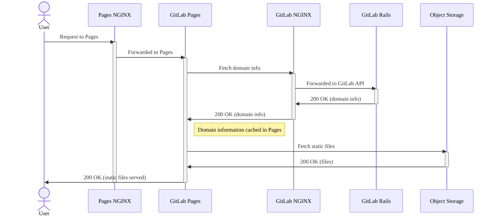
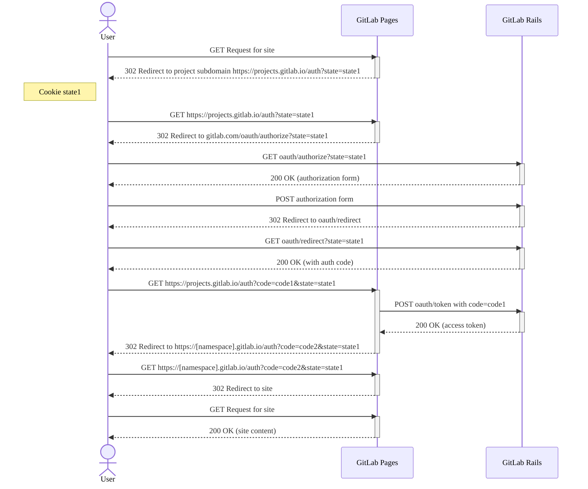



- 계층:  Free, Premium, Ultimate
- 제공:  GitLab Self-Managed



GitLab Pages를 관리할 때 다음과 같은 문제가 발생할 수 있습니다.

## GitLab Pages 로그를 보는 방법 {#how-to-see-gitlab-pages-logs}

다음 명령을 실행하여 Pages 데몬 로그를 볼 수 있습니다:

```shell
sudo gitlab-ctl tail gitlab-pages
```

`/var/log/gitlab/gitlab-pages/current`에서 로그 파일을 찾을 수도 있습니다.

자세한 내용은 [로그에서 상관관계 ID를 가져오는](../logs/tracing_correlation_id.md#getting-the-correlation-id-from-your-logs) 방법을 참조하세요.

## GitLab Pages 디버그 {#debug-gitlab-pages}

다음 시퀀스 다이어그램은 GitLab Pages 요청이 어떻게 처리되는지를 보여줍니다. GitLab Pages 사이트가 어떻게 배포되고 Object Storage에서 정적 콘텐츠를 제공하는지에 대한 자세한 내용은 GitLab Pages Architecture 설명서를 참조하세요.



### 오류 로그 확인 {#identify-error-logs}

이전 시퀀스 다이어그램에 표시된 순서대로 로그를 확인해야 합니다. 도메인을 기반으로 필터링하면 관련 로그를 식별하는 데도 도움이 될 수 있습니다.

로그 추적을 시작하려면:

1. **GitLab Pages NGINX** 로그의 경우 다음을 실행하세요:

   ```shell
   # View GitLab Pages NGINX error logs
   sudo gitlab-ctl tail nginx/gitlab_pages_error.log

   # View GitLab Pages NGINX access logs
   sudo gitlab-ctl tail nginx/gitlab_pages_access.log
   ```

1. **GitLab 페이지** 로그의 경우 다음을 실행하세요:  [로그에서 상관관계 ID 식별](../logs/tracing_correlation_id.md#getting-the-correlation-id-from-your-logs)부터 시작하세요.

   ```shell
   sudo gitlab-ctl tail gitlab-pages
   ```

1. **GitLab NGINX** 로그의 경우 다음을 실행하세요:

   ```shell
   # View GitLab NGINX error logs
   sudo gitlab-ctl tail nginx/gitlab_error.log

   # View GitLab NGINX access logs
   sudo gitlab-ctl tail nginx/gitlab_access.log
   ```

1. **GitLab Rails** 로그의 경우 다음을 실행하세요:  [GitLab Pages 로그](../logs/tracing_correlation_id.md#getting-the-correlation-id-from-your-logs)의 `correlation_id`를 기반으로 이 로그를 필터링할 수 있습니다.

   ```shell
   sudo gitlab-ctl tail gitlab-rails
   ```

## 인증 코드 흐름 {#authorization-code-flow}

다음 시퀀스 차트는 보호된 Pages 사이트에 액세스하기 위해 사용자, GitLab Pages, GitLab Rails 간의 OAuth 인증 흐름을 보여줍니다.

자세한 내용은 [GitLab OAuth 인증 코드 흐름](../../api/oauth2.md#authorization-code-flow)을 참조하세요.



## 오류: `unsupported protocol scheme \"\""` {#error-unsupported-protocol-scheme-}

다음 오류가 표시되면:

```plaintext
{"error":"failed to connect to internal Pages API: Get \"/api/v4/internal/pages/status\": unsupported protocol scheme \"\"","level":"warning","msg":"attempted to connect to the API","time":"2021-06-23T20:03:30Z"}
```

이는 Pages 서버 설정에서 HTTP(S) 프로토콜 스킴을 설정하지 않았음을 의미합니다. 수정 방법:

1. `/etc/gitlab/gitlab.rb`을 편집합니다:

   ```ruby
   gitlab_pages['gitlab_server'] = "https://<your_gitlab_server_public_host_and_port>"
   gitlab_pages['internal_gitlab_server'] = "https://<your_gitlab_server_private_host_and_port>" # optional, gitlab_pages['gitlab_server'] is used as default
   ```

1. GitLab을 재구성합니다:

   ```shell
   sudo gitlab-ctl reconfigure
   ```

## 서버가 IPv6을 통해 수신하지 않을 때 GitLab Pages 프록시에 연결할 때 502 오류 {#502-error-when-connecting-to-gitlab-pages-proxy-when-server-does-not-listen-over-ipv6}

경우에 따라 NGINX는 서버가 IPv6을 통해 수신하지 않을 때도 GitLab Pages 서비스에 연결하기 위해 IPv6을 사용하도록 기본 설정될 수 있습니다. `gitlab_pages_error.log`에 아래와 유사한 로그 항목이 표시되면 이 상황이 발생하고 있음을 알 수 있습니다:

```plaintext
2020/02/24 16:32:05 [error] 112654#0: *4982804 connect() failed (111: Connection refused) while connecting to upstream, client: 123.123.123.123, server: ~^(?<group>.*)\.pages\.example\.com$, request: "GET /-/group/project/-/jobs/1234/artifacts/artifact.txt HTTP/1.1", upstream: "http://[::1]:8090//-/group/project/-/jobs/1234/artifacts/artifact.txt", host: "group.example.com"
```

이를 해결하려면 GitLab Pages `listen_proxy` 설정에 대해 명시적 IP 및 포트를 설정하여 GitLab Pages 데몬이 수신해야 하는 명시적 주소를 정의하세요:

```ruby
gitlab_pages['listen_proxy'] = '127.0.0.1:8090'
```

## 간헐적 502 오류 또는 며칠 후 {#intermittent-502-errors-or-after-a-few-days}

`systemd`을(를) 사용하고 [`tmpfiles.d`](https://www.freedesktop.org/software/systemd/man/tmpfiles.d.html)을(를) 사용하는 시스템에서 Pages를 실행하면 다음과 유사한 오류가 발생하여 Pages를 제공하려고 할 때 간헐적 502 오류가 발생할 수 있습니다:

```plaintext
dial tcp: lookup gitlab.example.com on [::1]:53: dial udp [::1]:53: connect: no route to host"
```

GitLab Pages는 [bind mount](https://man7.org/linux/man-pages/man8/mount.8.html)를 `/tmp/gitlab-pages-*` 내에 생성하며, 여기에는 `/etc/hosts`과(와) 같은 파일이 포함됩니다. 그러나 `systemd`은(는) 정기적으로 `/tmp/` 디렉터리를 정리할 수 있으므로 DNS 구성이 손실될 수 있습니다.

Pages 관련 콘텐츠 정리를 중지하려면 `systemd`을(를) 사용하지 않도록 하세요:

1. Pages `/tmp` 디렉터리를 제거하지 않도록 `tmpfiles.d`에 지시하세요:

   ```shell
   echo 'x /tmp/gitlab-pages-*' >> /etc/tmpfiles.d/gitlab-pages-jail.conf
   ```

1. GitLab Pages를 다시 시작하세요:

   ```shell
   sudo gitlab-ctl restart gitlab-pages
   ```

## GitLab Pages에 액세스할 수 없음 {#unable-to-access-gitlab-pages}

GitLab Pages에 액세스할 수 없거나 `502 Bad Gateway` 오류가 발생하거나 로그인 루프가 발생하고 Pages 로그에 다음 오류 중 하나가 표시되는 경우:

- 컨텍스트 기한 초과 오류:

  ```plaintext
  "error":"retrieval context done: context deadline exceeded","host":"root.docs-cit.otenet.gr","level":"error","msg":"could not fetch domain information from a source"
  ```

- HTTP/HTTPS 프로토콜 불일치 오류:

  ```plaintext
  "error":"Get \"https://gitlab.example.com/api/v4/internal/pages?host=example.com\": http: server gave HTTP response to HTTPS client","level":"error","msg":"could not fetch domain information from a source"
  ```

  이 오류는 로드 밸런서 또는 역방향 프록시가 요청이 GitLab에 도달하기 전에 TLS를 종료할 때 발생합니다. Pages는 HTTPS `external_url`을(를) 사용하여 연결을 시도하지만 일반 HTTP 응답을 받습니다.

이를 해결하려면 `internal_gitlab_server`을(를) 설정하여 로컬 GitLab Rails 인스턴스와 직접 통신하고 외부 URL을 무시하세요:

1. `/etc/gitlab/gitlab.rb`에 다음을 추가하세요:

   ```ruby
   gitlab_pages['internal_gitlab_server'] = 'http://localhost:8080'
   ```

1. GitLab Pages를 다시 시작하세요:

   ```shell
   sudo gitlab-ctl restart gitlab-pages
   ```

## GitLab Pages 요청이 Pages 콘텐츠를 로드하는 대신 로그인 페이지로 리디렉션 {#gitlab-pages-requests-redirect-to-the-sign-in-page-instead-of-loading-pages-content}

경우에 따라 GitLab Pages가 올바르게 구성되어 있지만 요청이 Pages 데몬에 도달하지 않습니다. 대신 사용자는 올바른 자격 증명 및 권한으로도 GitLab 로그인 페이지로 반복적으로 리디렉션됩니다.

이 동작은 주 GitLab 인스턴스와 GitLab Pages가 동일한 NGINX 수신 그룹의 일부가 아닐 때 발생할 수 있습니다.

`nginx['listen_addresses']`을(를) 특정 IP 주소로 설정하면 일치하는 `pages_nginx['listen_addresses']` 값이 있어야 합니다.

이 문제를 해결하려면 주 GitLab 인스턴스와 GitLab Pages가 동일한 `listen_addresses` 값으로 구성되어 있는지 확인하여 동일한 수신 그룹에 속하도록 하세요:

1. `/etc/gitlab/gitlab.rb`을(를) 편집하고 주 GitLab 인스턴스와 GitLab Pages가 일치하는 `listen_addresses`을(를) 가지도록 확인하세요. 예시:

   ```ruby
   nginx['listen_addresses']       = ['10.74.12.5']
   pages_nginx['listen_addresses'] = ['10.74.12.5']
   ```

1. GitLab을 재구성합니다:

   ```shell
   sudo gitlab-ctl reconfigure
   ```

두 구성 요소가 동일한 IP 주소에서 수신하면 NGINX는 `server_name`을(를) 올바르게 평가하고 로그인 페이지로 리디렉션하는 대신 요청을 GitLab Pages로 라우팅할 수 있습니다.

## 내부 GitLab API에 연결 실패 {#failed-to-connect-to-the-internal-gitlab-api}

다음 오류가 표시되면:

```plaintext
ERRO[0010] Failed to connect to the internal GitLab API after 0.50s  error="failed to connect to internal Pages API: HTTP status: 401"
```

[별도의 서버에서 GitLab Pages를 실행](_index.md#running-gitlab-pages-on-a-separate-server)하고 있는 경우 **GitLab server**에서 **Pages server**로 `/etc/gitlab/gitlab-secrets.json` 파일을 복사해야 합니다.

다른 이유로는 방화벽 구성 또는 닫힌 포트와 같은 **GitLab server**와 **Pages server** 간의 네트워크 연결 문제가 있을 수 있습니다. 예를 들어 연결 시간 초과가 있는 경우:

```plaintext
error="failed to connect to internal Pages API: Get \"https://gitlab.example.com:3000/api/v4/internal/pages/status\": net/http: request canceled while waiting for connection (Client.Timeout exceeded while awaiting headers)"
```

## Pages는 GitLab API의 인스턴스와 통신할 수 없음 {#pages-cannot-communicate-with-an-instance-of-the-gitlab-api}

`domain_config_source=auto`의 기본값을 사용하고 여러 GitLab Pages 인스턴스를 실행하는 경우 Pages 콘텐츠를 제공하는 동안 간헐적 502 오류 응답이 표시될 수 있습니다. Pages 로그에서 다음 경고도 볼 수 있습니다:

```plaintext
WARN[0010] Pages cannot communicate with an instance of the GitLab API. Please sync your gitlab-secrets.json file https://gitlab.com/gitlab-org/gitlab-pages/-/issues/535#workaround. error="pages endpoint unauthorized"
```

GitLab Rails와 GitLab Pages 간에 `gitlab-secrets.json` 파일이 오래되었을 수 있습니다. 모든 GitLab Pages 인스턴스에서 [별도의 서버에서 GitLab Pages를 실행](_index.md#running-gitlab-pages-on-a-separate-server)의 8-10단계를 따르세요.

## AWS Network Load Balancer 및 GitLab Pages를 사용할 때 간헐적 502 오류 {#intermittent-502-errors-when-using-an-aws-network-load-balancer-and-gitlab-pages}

클라이언트 IP 보존을 사용하도록 설정한 Network Load Balancer를 사용할 때 연결이 시간 초과되고 [요청이 소스 서버로 다시 루프백](https://docs.aws.amazon.com/elasticloadbalancing/latest/network/load-balancer-troubleshooting.html#loopback-timeout)됩니다. 이는 GitLab 코어 애플리케이션과 GitLab Pages를 모두 실행하는 여러 서버가 있는 GitLab 인스턴스에 발생할 수 있습니다. 이는 GitLab 코어 애플리케이션과 GitLab Pages를 모두 실행하는 단일 컨테이너에서도 발생할 수 있습니다.

AWS는 [IP 대상 유형 사용을 권장](https://repost.aws/knowledge-center/target-connection-fails-load-balancer)하여 이 문제를 해결합니다.

[클라이언트 IP 보존](https://docs.aws.amazon.com/elasticloadbalancing/latest/network/load-balancer-target-groups.html#client-ip-preservation)을(를) 끄면 GitLab 코어 애플리케이션과 GitLab Pages가 동일한 호스트 또는 컨테이너에서 실행될 때 이 문제를 해결할 수 있습니다.

## 500 오류 (with `securecookie: failed to generate random iv` and `Failed to save the session`) {#500-error-with-securecookie-failed-to-generate-random-iv-and-failed-to-save-the-session}

이 문제는 대부분 오래된 운영 체제로 인해 발생합니다. [Pages 데몬은 `securecookie` 라이브러리를 사용](https://gitlab.com/search?group_id=9970&project_id=734943&repository_ref=master&scope=blobs&search=securecookie&snippets=false) 하여 [Go의 `crypto/rand`](https://pkg.go.dev/crypto/rand#pkg-variables)을(를) 사용하여 무작위 문자열을 가져옵니다. 이를 위해서는 `getrandom` 시스템 호출 또는 `/dev/urandom`이(가) 호스트 OS에서 사용 가능해야 합니다. [공식적으로 지원되는 운영 체제](../../install/package/_index.md#supported-platforms)로 업그레이드하는 것이 좋습니다.

## 요청된 범위가 유효하지 않음, 잘못된 형식이거나 알 수 없음 {#the-requested-scope-is-invalid-malformed-or-unknown}

이 문제는 GitLab Pages OAuth 애플리케이션의 권한으로 인해 발생합니다. 수정 방법:

1. 오른쪽 위 모서리에서 **운영자**를 선택합니다.
1. 왼쪽 사이드바에서 **응용 프로그램** > **GitLab 페이지**를 선택하세요.
1. 애플리케이션을 편집하세요.
1. **범위** 아래에서 `api` 범위가 선택되어 있는지 확인하세요.
1. 변경 사항을 저장하세요.

[별도의 Pages 서버](_index.md#running-gitlab-pages-on-a-separate-server)를 실행할 때 이 설정은 주 GitLab 서버에서 구성해야 합니다.

## 와일드카드 DNS 항목을 설정할 수 없는 경우의 해결 방법 {#workaround-in-case-no-wildcard-dns-entry-can-be-set}

와일드카드 DNS [사전 조건](_index.md#prerequisites)을(를) 충족할 수 없으면 제한된 방식으로 GitLab Pages를 사용할 수 있습니다:

1. Pages와 함께 사용해야 하는 모든 프로젝트를 단일 그룹 네임스페이스(예: `pages`)로 [이동](../../user/project/working_with_projects.md#transfer-a-project)하세요.
1. `*.`-와일드카드 없이 [DNS 항목](_index.md#dns-configuration)을(를) 구성하세요(예: `pages.example.io`).
1. `pages_external_url http://example.io/`을(를) `gitlab.rb` 파일에서 구성하세요. GitLab에서 자동으로 추가되므로 그룹 네임스페이스를 생략하세요.

## Pages 데몬이 권한 거부 오류로 실패 {#pages-daemon-fails-with-permission-denied-errors}

`/tmp`이(가) `noexec`으로 마운트되면 Pages 데몬이 다음과 유사한 오류로 시작되지 않습니다:

```plaintext
{"error":"fork/exec /gitlab-pages: permission denied","level":"fatal","msg":"could not create pages daemon","time":"2021-02-02T21:54:34Z"}
```

이 경우 `TMPDIR`을(를) `noexec`으로 마운트되지 않은 위치로 변경하세요. `/etc/gitlab/gitlab.rb`에 다음을 추가하세요:

```ruby
gitlab_pages['env'] = {'TMPDIR' => '<new_tmp_path>'}
```

추가한 후 `sudo gitlab-ctl reconfigure`으로 다시 구성하고 `sudo gitlab-ctl restart`으로 GitLab을 다시 시작하세요.

## `The redirect URI included is not valid.` (Pages Access Control 사용 시) {#the-redirect-uri-included-is-not-valid-when-using-pages-access-control}

`pages_external_url`이(가) 어느 시점에 업데이트된 경우 이 오류가 표시될 수 있습니다. 다음을 확인하세요:

1. [시스템 OAuth 애플리케이션](../../integration/oauth_provider.md#create-an-instance-wide-application)을(를) 확인하세요:

   1. 오른쪽 위 모서리에서 **운영자**를 선택합니다.
   1. **응용 프로그램**을(를) 선택한 다음 **새 애플리케이션 추가**를 선택하세요.
   1. **Callback URL/Redirect URI**이(가) `pages_external_url`가 구성되어 있는 프로토콜(HTTP 또는 HTTPS)을 사용하고 있는지 확인하세요.
1. `Redirect URI`의 도메인 및 경로 구성 요소는 유효해야 합니다. `projects.<pages_external_url>/auth`처럼 보여야 합니다.

## 500 오류 `cannot serve from disk` {#500-error-cannot-serve-from-disk}

Pages에서 500 응답을 받고 다음과 유사한 오류가 발생한 경우:

```plaintext
ERRO[0145] cannot serve from disk                        error="gitlab: disk access is disabled via enable-disk=false" project_id=27 source_path="file:///shared/pages/@hashed/67/06/670671cd97404156226e507973f2ab8330d3022ca96e0c93bdbdb320c41adcaf/pages_deployments/14/artifacts.zip" source_type=zip
```

GitLab Rails가 GitLab Pages에 디스크의 위치에서 콘텐츠를 제공하도록 지시하고 있지만 GitLab Pages가 디스크 액세스를 비활성화하도록 구성되었음을 의미합니다.

디스크 액세스를 활성화하려면:

1. `/etc/gitlab/gitlab.rb`에서 GitLab Pages에 대한 디스크 액세스를 활성화하세요:

   ```ruby
   gitlab_pages['enable_disk'] = true
   ```

1. [GitLab 다시 구성](../restart_gitlab.md#reconfigure-a-linux-package-installation)하세요.

## `httprange: new resource 403` {#httprange-new-resource-403}

다음과 유사한 오류가 표시되면:

```plaintext
{"error":"httprange: new resource 403: \"403 Forbidden\"","host":"root.pages.example.com","level":"error","msg":"vfs.Root","path":"/pages1/","time":"2021-06-10T08:45:19Z"}
```

NFS를 통해 파일을 동기화하는 별도의 서버에서 Pages를 실행하고 있으면 공유 Pages 디렉터리가 주 GitLab 서버와 GitLab Pages 서버에서 다른 경로에 마운트되어 있을 수 있습니다.

이 경우 [객체 저장소를 구성하고 기존 Pages 데이터를 마이그레이션](_index.md#object-storage-settings)하는 것이 좋습니다.

또는 GitLab Pages 공유 디렉터리를 두 서버 모두에서 동일한 경로에 마운트할 수 있습니다.

## GitLab Pages 배포 작업이 오류로 실패`is not a recognized provider` {#gitlab-pages-deploy-job-fails-with-error-is-not-a-recognized-provider}

**페이지** 작업은 성공하지만 **배포** 작업에서 "is not a recognized provider" 오류가 발생합니다:


`is not a recognized provider` 오류 메시지는 GitLab이 객체 저장소에 대한 클라우드 공급자에 연결하는 데 사용하는 `fog` gem에서 발생할 수 있습니다.

수정하려면:

1. `gitlab.rb` 파일을 확인하세요. `gitlab_rails['pages_object_store_enabled']`이(가) 활성화되어 있지만 버킷 세부 정보가 구성되지 않은 경우 다음 중 하나를 수행하세요:

   - [S3 호환 연결 설정](_index.md#s3-compatible-connection-settings) 가이드에 따라 Pages 배포에 대한 객체 저장소를 구성하세요.
   - 해당 줄을 주석 처리하여 배포를 로컬로 저장하세요.

1. `gitlab.rb` 파일에 적용한 변경 사항을 저장한 후 [GitLab 다시 구성](../restart_gitlab.md#reconfigure-a-linux-package-installation)하세요.

## 404 오류 `The page you're looking for could not be found` {#404-error-the-page-youre-looking-for-could-not-be-found}

GitLab Pages에서 `404 Page Not Found` 응답을 받으면:

1. `.gitlab-ci.yml`에 `pages:` 작업이 포함되어 있는지 확인하세요.
1. 현재 프로젝트의 파이프라인에서 `pages:deploy` 작업이 실행 중인지 확인하세요.

`pages:deploy` 작업이 없으면 GitLab Pages 사이트에 대한 업데이트가 발행되지 않습니다.

`namespace_in_path`이 활성화된 별도의 Pages 서버를 사용하고 있으면 [URL이 잘못 표시될 때 404 오류](#404-error-page-not-found-when-pages-ui-shows-incorrect-url)를 참조하세요.

## 404 오류:  Pages UI가 잘못된 URL을 표시할 때 페이지를 찾을 수 없음 {#404-error-page-not-found-when-pages-ui-shows-incorrect-url}

`namespace_in_path`을(를) 구성하고 활성화한 경우 [별도의 GitLab Pages 서버](_index.md#running-gitlab-pages-on-a-separate-server)에서 `404 Page not found` 오류가 발생할 수 있습니다.

이 오류는 `namespace_in_path` 설정이 GitLab Pages 서버 또는 주 GitLab 서버에서 잘못 구성되거나 누락되었을 때 발생합니다.

[전역 설정](_index.md#global-settings) `namespace_in_path`은(는) GitLab Pages 사이트에 대한 URL 구조를 결정합니다. GitLab 서버와 GitLab Pages 서버는 이 설정에 대해 동일한 값을 가져야 합니다.

이 오류를 해결하려면:

1. `/etc/gitlab/gitlab.rb` 파일을 열세요:

   1. GitLab 서버 구성을 확인하세요:

      ```ruby
      gitlab_pages['namespace_in_path'] = true
      ```

   1. GitLab Pages 서버 구성이 동일한지 확인하세요:

      ```ruby
         gitlab_pages['namespace_in_path'] = true
      ```

1. 파일을 저장하세요.
1. 두 서버에서 변경 사항이 적용되도록 [GitLab 다시 구성](../restart_gitlab.md)하세요.

## 503 오류 `Client authentication failed due to unknown client` {#503-error-client-authentication-failed-due-to-unknown-client}

Pages가 등록된 OAuth 애플리케이션이고 [액세스 제어가 활성화](../../user/project/pages/pages_access_control.md)되어 있으면 이 오류는 `/etc/gitlab/gitlab-secrets.json`에 저장된 인증 토큰이 유효하지 않음을 나타냅니다:

```plaintext
Client authentication failed due to unknown client, no client authentication included,
or unsupported authentication method.
```

해결하려면:

1. 비밀 파일을 백업하세요:

   ```shell
   sudo cp /etc/gitlab/gitlab-secrets.json /etc/gitlab/gitlab-secrets.json.$(date +\%Y\%m\%d)
   ```

1. `/etc/gitlab/gitlab-secrets.json`을(를) 편집하고 `gitlab_pages` 섹션을 제거하세요.
1. GitLab을 다시 구성하고 OAuth 토큰을 다시 생성하세요:

   ```shell
   sudo gitlab-ctl reconfigure
   ```

### 다중 노드 OAuth 비밀 동기화 {#multi-node-oauth-secret-synchronization}

여러 노드에서 GitLab Pages를 실행하면 Pages OAuth 비밀은 모든 노드에서 동일해야 합니다. 비밀이 동기화되지 않으면 일부 노드가 동일한 `Client authentication failed due to unknown client` 오류로 인증 요청을 거부할 수 있습니다.

이 문제를 해결하려면:

1. 모든 GitLab 노드에서 비밀 파일을 백업하세요:

   ```shell
   sudo cp /etc/gitlab/gitlab-secrets.json /etc/gitlab/gitlab-secrets.json.$(date +\%Y\%m\%d)
   ```

1. 첫 번째 노드의 `/etc/gitlab/gitlab-secrets.json` 파일에서:

   1. `gitlab_pages` 섹션을 제거하세요.
   1. 파일을 저장하세요.
   1. OAuth 토큰을 다시 생성하기 위해 GitLab을 다시 구성하세요:

      ```shell
      sudo gitlab-ctl reconfigure
      ```

   1. 업데이트된 `gitlab_pages` 섹션을 복사하세요.

1. 다른 모든 노드에서 업데이트된 `gitlab_pages` 섹션을 해당 `gitlab-secrets.json` 파일에 붙여넣고 저장하세요.

1. `gitlab-pages-config` 파일이 업데이트된 비밀로 채워지도록 GitLab을 다시 구성하세요:

   ```shell
   sudo gitlab-ctl reconfigure
   ```

1. `gitlab_pages` 섹션을 `/etc/gitlab/gitlab-secrets.json`의 섹션과 비교하고 각 노드의 `/var/opt/gitlab/gitlab-pages/gitlab-pages-config` 내용을 비교하여 비밀이 모든 노드에서 일관성이 있는지 확인하세요.

## 오류: `Response size over 104857600 bytes` {#error-response-size-over-104857600-bytes}

**페이지** 작업은 성공하지만 **배포** 작업이 실패하면 `Response size over 104857600 bytes`을(를) 나타내는 오류가 발생할 수 있습니다.

이 오류는 압축 해제된 Pages 콘텐츠가 [최대 Gzip 압축 크기](../instance_limits.md#maximum-gzip-compressed-size) 제한을 초과할 때 발생합니다.

이 문제를 해결하려면 `max_http_decompressed_size` 제한을 늘리세요. 다음 방법 중 하나를 사용하세요:

- [Rails 콘솔 세션](../operations/rails_console.md#starting-a-rails-console-session)에서 다음을 실행하세요:

  ```ruby
  ApplicationSetting.update(max_http_decompressed_size: 1000)
  ```

- [응용 프로그램 설정 API](../../api/settings.md)입니다.
