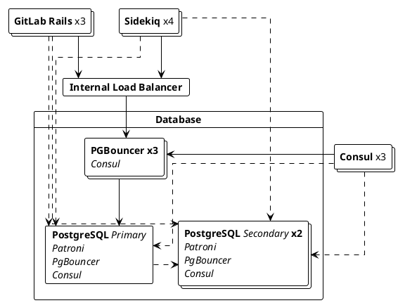



- 계층:  Free, Premium, Ultimate
- 제공:  GitLab Self-Managed



데이터베이스 로드 밸런싱을 사용하면 읽기 전용 쿼리를 여러 PostgreSQL 노드에 분산하여 성능을 향상시킬 수 있습니다.

이 기능은 GitLab Rails 및 Sidekiq에서 기본적으로 제공되며, 외부 종속성 없이 라운드 로빈 방식으로 데이터베이스 읽기 쿼리의 로드 밸런싱을 구성할 수 있습니다:



## 데이터베이스 로드 밸런싱 활성화 요구 사항 {#requirements-to-enable-database-load-balancing}

데이터베이스 로드 밸런싱을 활성화하려면 다음을 확인하세요:

- HA PostgreSQL 설정에는 기본 노드를 복제하는 하나 이상의 보조 노드가 있어야 합니다.
- 각 PostgreSQL 노드는 동일한 자격 증명으로 동일한 포트에 연결되어야 합니다.

Linux 패키지 설치의 경우, [다중 노드 설정을 구성할](replication_and_failover.md) 때 각 PostgreSQL 노드에서 모든 로드 밸런싱된 연결을 풀링하도록 PgBouncer를 구성해야 합니다.

## 데이터베이스 로드 밸런싱 구성 {#configuring-database-load-balancing}

데이터베이스 로드 밸런싱은 두 가지 방식 중 하나로 구성할 수 있습니다:

- (권장) [호스트](#hosts): PostgreSQL 호스트 목록입니다.
- [서비스 검색](#service-discovery): PostgreSQL 호스트 목록을 반환하는 DNS 레코드입니다.

### 호스트 {#hosts}

<!-- Including the Primary host in Database Load Balancing is now recommended for improved performance - Approved by the Reference Architecture and Database groups. -->

호스트 목록을 구성하려면 로드 밸런싱하려는 각 환경의 모든 GitLab Rails 및 Sidekiq 노드에서 다음 단계를 수행하세요:

1. `/etc/gitlab/gitlab.rb` 파일을 편집하세요.
1. `gitlab_rails['db_load_balancing']`에서 로드 밸런싱하려는 데이터베이스 호스트의 배열을 생성하세요. 예를 들어, `primary.example.com`, `secondary1.example.com`, `secondary2.example.com`에서 PostgreSQL이 실행되는 환경에서:

   ```ruby
   gitlab_rails['db_load_balancing'] = { 'hosts' => ['primary.example.com', 'secondary1.example.com', 'secondary2.example.com'] }
   ```

   이 호스트는 `gitlab_rails['db_port']`로 구성된 동일한 포트에서 연결할 수 있어야 합니다.

1. 파일을 저장하고 [GitLab을 재구성하세요](../restart_gitlab.md#reconfigure-a-linux-package-installation).

> [!note]
> 기본 노드를 호스트 목록에 추가하는 것은 선택 사항이지만 권장됩니다. 이렇게 하면 기본 노드가 로드 밸런싱된 읽기 쿼리에 적합하게 되어 기본 노드가 이러한 쿼리를 처리할 용량이 있을 때 시스템 성능을 향상시킵니다. 매우 높은 트래픽의 인스턴스는 읽기 복제본으로 제공할 기본 노드의 용량이 없을 수 있습니다. 기본 노드는 이 목록에 있는지 여부와 관계없이 쓰기 쿼리에 사용됩니다.

### 서비스 검색 {#service-discovery}

서비스 검색을 통해 GitLab은 사용할 PostgreSQL 호스트 목록을 자동으로 검색할 수 있습니다. DNS `A` 레코드를 주기적으로 확인하며, 이 레코드에서 반환된 IP를 보조 노드의 주소로 사용합니다. 서비스 검색이 작동하려면 DNS 서버와 보조 노드의 IP 주소를 포함하는 `A` 레코드만 있으면 됩니다.

Linux 패키지 설치를 사용하는 경우, 제공되는 [Consul](../consul.md) 서비스는 DNS 서버로 작동하며 `postgresql-ha.service.consul` 레코드를 통해 PostgreSQL 주소를 반환합니다. 예를 들어:

1. 각 GitLab Rails / Sidekiq 노드에서 `/etc/gitlab/gitlab.rb`을 편집하고 다음을 추가하세요:

   ```ruby
   gitlab_rails['db_load_balancing'] = { 'discover' => {
       'nameserver' => 'localhost'
       'record' => 'postgresql-ha.service.consul'
       'record_type' => 'A'
       'port' => '8600'
       'interval' => '60'
       'disconnect_timeout' => '120'
     }
   }
   ```

1. 파일을 저장하고 변경 사항이 적용되도록 [GitLab을 재구성하세요](../restart_gitlab.md#reconfigure-a-linux-package-installation).

| 옵션               | 설명                                                                                       | 기본값   |
|----------------------|---------------------------------------------------------------------------------------------------|-----------|
| `nameserver`         | DNS 레코드 조회에 사용할 네임서버입니다.                                              | localhost |
| `record`             | 조회할 레코드입니다. 서비스 검색이 작동하려면 이 옵션이 필수입니다.                     |           |
| `record_type`        | 조회할 선택적 레코드 유형입니다. `A` 또는 `SRV`일 수 있습니다.                                      | `A`       |
| `port`               | 네임서버의 포트입니다.                                                                       | 8600      |
| `interval`           | DNS 레코드 확인 사이의 최소 시간(초)입니다.                                      | 60        |
| `disconnect_timeout` | 호스트 목록이 업데이트된 후 이전 연결이 종료되는 시간(초)입니다. | 120       |
| `use_tcp`            | UDP 대신 TCP를 사용하여 DNS 리소스를 조회합니다.                                                     | false     |
| `max_replica_pools`  | 각 Rails 프로세스가 연결되는 최대 복제본 수입니다. 많은 Postgres 복제본과 많은 Rails 프로세스를 실행하는 경우 유용하며, 이 제한이 없으면 기본적으로 모든 Rails 프로세스가 모든 복제본에 연결됩니다. 설정되지 않은 경우 기본 동작은 무제한입니다. | nil     |

`record_type`이 `SRV`로 설정된 경우, GitLab은 라운드 로빈 알고리즘을 계속 사용하며 레코드의 `weight`과 `priority`을 무시합니다. `SRV` 레코드는 일반적으로 IP 대신 호스트 이름을 반환하므로, GitLab은 `SRV` 응답의 추가 섹션에서 반환된 호스트 이름의 IP를 찾아야 합니다. 호스트 이름에 대한 IP를 찾을 수 없는 경우, GitLab은 구성된 `nameserver`을 쿼리하여 각 호스트 이름에 대해 `ANY` 레코드를 찾고 `A` 또는 `AAAA` 레코드를 찾으며, 최종적으로 IP를 확인할 수 없는 경우 이 호스트 이름을 회전에서 제거합니다.

`interval` 값은 확인 사이의 최소 시간을 지정합니다. `A` 레코드의 TTL이 이 값보다 크면 서비스 검색은 해당 TTL을 준수합니다. 예를 들어, `A` 레코드의 TTL이 90초인 경우, 서비스 검색은 `A` 레코드를 다시 확인하기 전에 최소 90초를 기다립니다.

호스트 목록이 업데이트되면 이전 연결이 종료되는 데 시간이 걸릴 수 있습니다. `disconnect_timeout` 설정을 사용하여 모든 이전 데이터베이스 연결을 종료하는 데 걸리는 시간에 상한을 적용할 수 있습니다.

### 부실 읽기 처리 {#handling-stale-reads}



- 14.0에서 GitLab Premium에서 GitLab Free로 [이동됨](https://gitlab.com/gitlab-org/gitlab/-/issues/327902).



로드 밸런서는 오래된 보조 노드에서의 읽기를 방지하기 위해 기본 노드와 동기화되어 있는지 확인합니다. 데이터가 충분히 최근이면 보조 노드가 사용되고, 그렇지 않으면 무시됩니다. 이러한 확인의 오버헤드를 줄이기 위해 특정 간격에서만 확인을 수행합니다.

이 동작에 영향을 미치는 세 가지 구성 옵션이 있습니다:

| 옵션                       | 설명                                                                                                    | 기본값    |
|------------------------------|----------------------------------------------------------------------------------------------------------------|------------|
| `max_replication_difference` | 보조 노드가 일정 시간 동안 데이터를 복제하지 않을 때 허용되는 지연 데이터의 양(바이트)입니다. | 8 MB       |
| `max_replication_lag_time`   | 보조 노드가 사용 중지되기 전에 허용되는 최대 지연 시간(초)입니다.                    | 60초 |
| `replica_check_interval`     | 보조 노드의 상태를 확인하기 전에 기다려야 하는 최소 시간(초)입니다.                       | 60초 |

기본값은 대부분의 사용자에게 충분해야 합니다.

호스트 목록을 사용하여 이러한 옵션을 구성하려면 다음 예제를 사용하세요:

```ruby
gitlab_rails['db_load_balancing'] = {
  'hosts' => ['primary.example.com', 'secondary1.example.com', 'secondary2.example.com'],
  'max_replication_difference' => 16777216, # 16 MB
  'max_replication_lag_time' => 30,
  'replica_check_interval' => 30
}
```

## 로깅 {#logging}

로드 밸런서는 [`database_load_balancing.log`](../logs/_index.md#database_load_balancinglog)에 다양한 이벤트를 기록합니다.

- 호스트가 오프라인으로 표시될 때
- 호스트가 다시 온라인 상태가 될 때
- 모든 보조 노드가 오프라인 상태일 때
- 쿼리 충돌로 인해 읽기가 다른 호스트에서 다시 시도될 때

로그는 최소한 다음을 포함하는 JSON 객체인 각 항목으로 구조화됩니다:

- 필터링에 유용한 `event` 필드입니다.
- 사람이 읽을 수 있는 `message` 필드입니다.
- 일부 이벤트별 메타데이터입니다. 예를 들어, `db_host`
- 항상 기록되는 컨텍스트 정보입니다. 예를 들어, `severity` 및 `time`.

예를 들어:

```json
{"severity":"INFO","time":"2019-09-02T12:12:01.728Z","correlation_id":"abcdefg","event":"host_online","message":"Host came back online","db_host":"111.222.333.444","db_port":null,"tag":"rails.database_load_balancing","environment":"production","hostname":"web-example-1","fqdn":"gitlab.example.com","path":null,"params":null}
```

## 구현 세부 사항 {#implementation-details}

### 쿼리 로드 밸런싱 {#balancing-queries}

읽기 전용 `SELECT` 쿼리는 주어진 모든 호스트 간에 로드 밸런싱됩니다. 다른 모든 항목(트랜잭션 포함)은 기본 노드에서 실행됩니다. `SELECT ... FOR UPDATE`와 같은 쿼리도 기본 노드에서 실행됩니다.

### 준비된 문 {#prepared-statements}

준비된 문은 로드 밸런싱과 잘 작동하지 않으며 로드 밸런싱이 활성화될 때 자동으로 비활성화됩니다. 이것이 응답 시간에 영향을 주지는 않아야 합니다.

### 기본 노드 고정 {#primary-sticking}

쓰기가 수행된 후, GitLab은 쓰기를 수행한 사용자에 대해 일정 기간 동안 기본 노드를 사용하도록 고정합니다. GitLab은 보조 노드가 따라잡거나 30초 후에 보조 노드 사용으로 돌아갑니다.

### 장애 조치 처리 {#failover-handling}

장애 조치 또는 응답하지 않는 데이터베이스의 경우, 로드 밸런서는 다음으로 사용 가능한 호스트를 사용하려고 합니다. 사용 가능한 보조 노드가 없으면 작업이 기본 노드에서 수행됩니다.

데이터 쓰기 중 연결 오류가 발생하면 작업이 지수 백오프를 사용하여 최대 3회 재시도됩니다.

로드 밸런싱을 사용할 때, 데이터베이스 서버를 안전하게 다시 시작할 수 있으며 즉시 사용자에게 오류가 표시되지 않습니다.

### 개발 가이드 {#development-guide}

데이터베이스 로드 밸런싱에 대한 자세한 개발 가이드는 개발 설명서를 참조하세요.
