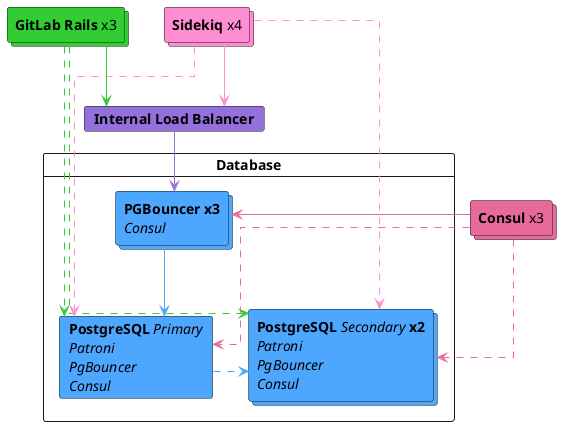



- 계층:  Premium, Ultimate
- 제공:  GitLab Self-Managed



GitLab Self-Managed의 Free 사용자인 경우 클라우드 호스팅 솔루션 사용을 검토하세요. 이 문서는 자체 컴파일된 설치를 다루지 않습니다.

복제 및 장애 조치 설정을 찾고 있지 않다면 Linux 패키지용 [데이터베이스 구성 문서](https://docs.gitlab.com/omnibus/settings/database/)를 참조하세요.

GitLab에서 복제 및 장애 조치를 사용하여 PostgreSQL을 구성하기 전에 이 문서를 완전히 읽는 것을 권장합니다.

## 운영 체제 업그레이드 {#operating-system-upgrades}

다른 운영 체제로 장애 조치하는 경우 [PostgreSQL용 운영 체제 업그레이드에 관한 문서](upgrading_os.md)를 읽으세요. 운영 체제 업그레이드 시 로컬 변경 사항을 고려하지 않으면 데이터 손상이 발생할 수 있습니다.

## 아키텍처 {#architecture}

복제 장애 조치가 포함된 PostgreSQL 클러스터를 위한 Linux 패키지 권장 구성에는 다음이 필요합니다:

- 최소 3개의 PostgreSQL 노드
- 최소 3개의 Consul 서버 노드
- 기본 데이터베이스 읽기 및 쓰기를 추적하고 처리하는 최소 3개의 PgBouncer 노드
  - PgBouncer 노드 간의 요청을 분산하기 위한 내부 로드 밸런서(TCP)
- [데이터베이스 로드 밸런싱](database_load_balancing.md) 활성화됨
  - 각 PostgreSQL 노드에서 구성된 로컬 PgBouncer 서비스 이는 기본을 추적하는 주요 PgBouncer 클러스터와 별개입니다.



네트워크가 단일 장애 지점이 되지 않도록 모든 데이터베이스 및 GitLab 인스턴스 간에 중복 연결이 있는지 확인하여 기본 네트워크 토폴로지도 고려해야 합니다.

### 데이터베이스 노드 {#database-node}

각 데이터베이스 노드는 4개의 서비스를 실행합니다:

- `PostgreSQL`:  데이터베이스 자체입니다.
- `Patroni`:  클러스터의 다른 Patroni 서비스와 통신하고 리더 서버에 문제가 발생할 때 장애 조치를 처리합니다. 장애 조치 절차는 다음으로 구성됩니다:
  - 클러스터의 새 리더 선택
  - 새 노드를 리더로 승격
  - 나머지 서버에 새 리더 노드를 따르도록 지시
- `PgBouncer`:  노드의 로컬 풀러입니다. _읽기_ 쿼리에 사용되며 [데이터베이스 로드 밸런싱](database_load_balancing.md)의 일부입니다.
- `Consul` 에이전트:  현재 Patroni 상태를 저장하는 Consul 클러스터와 통신합니다. 에이전트는 데이터베이스 클러스터의 각 노드 상태를 모니터링하고 Consul 클러스터의 서비스 정의에서 해당 상태를 추적합니다.

### Consul 서버 노드 {#consul-server-node}

Consul 서버 노드는 Consul 서버 서비스를 실행합니다. 이러한 노드는 Patroni 클러스터 부트스트랩 전에 쿼럼에 도달하고 리더를 선출해야 합니다. 그렇지 않으면 데이터베이스 노드는 Consul 리더가 선출될 때까지 대기합니다.

### PgBouncer 노드 {#pgbouncer-node}

각 PgBouncer 노드는 2개의 서비스를 실행합니다:

- `PgBouncer`:  데이터베이스 연결 풀러 자체입니다.
- `Consul` 에이전트:  Consul 클러스터의 PostgreSQL 서비스 정의 상태를 감시합니다. 해당 상태가 변경되면 Consul은 PgBouncer 구성을 업데이트하여 새 PostgreSQL 리더 노드를 가리키고 PgBouncer 서비스를 다시 로드합니다.

### 연결 흐름 {#connection-flow}

패키지의 각 서비스에는 [기본 포트](../package_information/defaults.md#ports) 세트가 포함됩니다. 아래 나열된 연결을 위해 특정 방화벽 규칙을 설정해야 할 수 있습니다:

이 설정에는 여러 연결 흐름이 있습니다:

- [기본](#primary)
- [데이터베이스 로드 밸런싱](#database-load-balancing)
- [복제](#replication)

#### 기본 {#primary}

- 애플리케이션 서버는 [기본 포트](../package_information/defaults.md)를 통해 PgBouncer에 직접 연결하거나 여러 PgBouncer를 제공하는 구성된 내부 로드 밸런서(TCP)를 통해 연결합니다.
- PgBouncer는 기본 데이터베이스 서버의 [PostgreSQL 기본 포트](../package_information/defaults.md)에 연결합니다.

#### 데이터베이스 로드 밸런싱 {#database-load-balancing}

최근에 변경되지 않았고 모든 데이터베이스 노드에서 최신 상태인 데이터에 대한 읽기 쿼리의 경우:

- 애플리케이션 서버는 라운드 로빈 방식으로 각 데이터베이스 노드의 로컬 PgBouncer 서비스에 [기본 포트](../package_information/defaults.md)를 통해 연결합니다.
- 로컬 PgBouncer는 로컬 데이터베이스 서버의 [PostgreSQL 기본 포트](../package_information/defaults.md)에 연결합니다.

#### 복제 {#replication}

- Patroni는 실행 중인 PostgreSQL 프로세스 및 구성을 적극적으로 관리합니다.
- PostgreSQL 보조는 기본 데이터베이스 서버의 [PostgreSQL 기본 포트](../package_information/defaults.md)에 연결합니다.
- Consul 서버 및 에이전트는 각각의 [Consul 기본 포트](../package_information/defaults.md)에 연결합니다.

## 설정 {#setting-it-up}

### 필수 정보 {#required-information}

구성을 진행하기 전에 필요한 모든 정보를 수집해야 합니다.

#### 네트워크 정보 {#network-information}

PostgreSQL은 기본적으로 네트워크 인터페이스에서 수신 대기하지 않습니다. 다른 서비스에 액세스할 수 있도록 수신 대기할 IP 주소를 알아야 합니다. 마찬가지로 PostgreSQL 액세스는 네트워크 소스를 기반으로 제어됩니다.

이것이 필요한 이유입니다:

- 각 노드의 네트워크 인터페이스의 IP 주소입니다. 모든 인터페이스에서 수신 대기하도록 `0.0.0.0`로 설정할 수 있습니다. 루프백 주소 `127.0.0.1`로 설정할 수 없습니다.
- 네트워크 주소입니다. 서브넷(`192.168.0.0/255.255.255.0` 즉) 또는 클래스리스 도메인 간 라우팅(CIDR)(`192.168.0.0/24`) 형식으로 지정할 수 있습니다.

#### Consul 정보 {#consul-information}

기본 설정을 사용할 때 최소 구성에는 다음이 필요합니다:

- `CONSUL_USERNAME`. Linux 패키지 설치의 기본 사용자는 `gitlab-consul`입니다.
- `CONSUL_DATABASE_PASSWORD`. 데이터베이스 사용자의 암호입니다.
- `CONSUL_PASSWORD_HASH`. 이는 Consul 사용자 이름/암호 쌍에서 생성된 해시입니다. 다음을 사용하여 생성할 수 있습니다:

  ```shell
  sudo gitlab-ctl pg-password-md5 CONSUL_USERNAME
  ```

- `CONSUL_SERVER_NODES`. Consul 서버 노드의 IP 주소 또는 DNS 레코드입니다.

서비스 자체에 대한 몇 가지 참고 사항:

- 서비스는 기본적으로 `gitlab-consul` 시스템 계정에서 실행됩니다.
- 다른 사용자 이름을 사용하는 경우 `CONSUL_USERNAME` 변수를 통해 지정해야 합니다.
- 암호는 다음 위치에 저장됩니다:
  - `/etc/gitlab/gitlab.rb`: 해시됨
  - `/var/opt/gitlab/pgbouncer/pg_auth`: 해시됨
  - `/var/opt/gitlab/consul/.pgpass`: 일반 텍스트

#### PostgreSQL 정보 {#postgresql-information}

PostgreSQL을 구성할 때 다음을 수행합니다:

- `max_replication_slots`을(를) 데이터베이스 노드 수의 2배로 설정합니다. Patroni는 복제를 시작할 때 노드당 1개의 추가 슬롯을 사용합니다.
- `max_wal_senders`을(를) 클러스터의 할당된 복제 슬롯 수보다 1개 더 많이 설정합니다. 이는 복제가 사용 가능한 모든 데이터베이스 연결을 사용하지 않도록 방지합니다.

이 문서에서는 3개의 데이터베이스 노드를 가정하므로 이 구성을 만듭니다:

```ruby
patroni['postgresql']['max_replication_slots'] = 6
patroni['postgresql']['max_wal_senders'] = 7
```

앞서 언급했듯이 데이터베이스로 인증할 권한이 필요한 네트워크 서브넷을 준비하세요. 또한 Consul 서버 노드의 IP 주소 또는 DNS 레코드가 필요합니다.

애플리케이션의 데이터베이스 사용자에 대한 다음 암호 정보가 필요합니다:

- `POSTGRESQL_USERNAME`. Linux 패키지 설치의 기본 사용자는 `gitlab`입니다.
- `POSTGRESQL_USER_PASSWORD`. 데이터베이스 사용자의 암호
- `POSTGRESQL_PASSWORD_HASH`. 이는 사용자 이름/암호 쌍에서 생성된 해시입니다. 다음을 사용하여 생성할 수 있습니다:

  ```shell
  sudo gitlab-ctl pg-password-md5 POSTGRESQL_USERNAME
  ```

#### Patroni 정보 {#patroni-information}

Patroni API에 대한 다음 암호 정보가 필요합니다:

- `PATRONI_API_USERNAME`. API에 기본 인증을 위한 사용자 이름
- `PATRONI_API_PASSWORD`. API에 기본 인증을 위한 암호

#### PgBouncer 정보 {#pgbouncer-information}

기본 설정을 사용할 때 최소 구성에는 다음이 필요합니다:

- `PGBOUNCER_USERNAME`. Linux 패키지 설치의 기본 사용자는 `pgbouncer`입니다.
- `PGBOUNCER_PASSWORD`. 이는 PgBouncer 서비스의 암호입니다.
- `PGBOUNCER_PASSWORD_HASH`. 이는 PgBouncer 사용자 이름/암호 쌍에서 생성된 해시입니다. 다음을 사용하여 생성할 수 있습니다:

  ```shell
  sudo gitlab-ctl pg-password-md5 PGBOUNCER_USERNAME
  ```

- `PGBOUNCER_NODE`, PgBouncer를 실행하는 노드의 IP 주소 또는 FQDN입니다.

서비스 자체에 대해 기억할 몇 가지 사항:

- 서비스는 데이터베이스와 동일한 시스템 계정으로 실행됩니다. 패키지에서 기본적으로 `gitlab-psql`입니다.
- PgBouncer 서비스에 기본이 아닌 사용자 계정을 사용하는 경우(기본적으로 `pgbouncer`) 이 사용자 이름을 지정해야 합니다.
- 암호는 다음 위치에 저장됩니다:
  - `/etc/gitlab/gitlab.rb`: 해시됨 및 일반 텍스트
  - `/var/opt/gitlab/pgbouncer/pg_auth`: 해시됨

### Linux 패키지 설치 {#installing-the-linux-package}

먼저 각 노드에 [Linux 패키지를 다운로드하여 설치](https://about.gitlab.com/install/)해야 합니다.

1단계에서 필요한 종속성을 설치하고 2단계에서 GitLab 패키지 저장소를 추가해야 합니다. GitLab 패키지를 설치할 때 `EXTERNAL_URL` 값을 제공하지 마세요.

### 데이터베이스 노드 구성 {#configuring-the-database-nodes}

1. [Consul 노드를 구성](../consul.md)해야 합니다.
1. [`CONSUL_SERVER_NODES`](#consul-information) , [`PGBOUNCER_PASSWORD_HASH`](#pgbouncer-information) , [`POSTGRESQL_PASSWORD_HASH`](#postgresql-information) , [데이터베이스 노드 수](#postgresql-information) , [네트워크 주소](#network-information)를 수집해야 다음 단계를 실행하세요.

#### Patroni 클러스터 구성 {#configuring-patroni-cluster}

이를 사용할 수 있도록 Patroni를 명시적으로 활성화해야 합니다(`patroni['enable'] = true` 포함).

복제를 제어하는 PostgreSQL 구성 항목(예: `wal_level`, `max_wal_senders` 등)은 Patroni에 의해 엄격하게 제어됩니다. 이러한 구성은 `postgresql[...]` 구성 키로 작성한 원래 설정을 재정의합니다. 따라서 모두 `patroni['postgresql'][...]` 아래에 분리되어 배치됩니다. 이 동작은 복제로 제한됩니다. Patroni는 `postgresql[...]` 구성 키로 작성된 다른 PostgreSQL 구성을 준수합니다. 예를 들어 `max_wal_senders`은(는) 기본적으로 `5`로 설정됩니다. 이를 변경하려면 `patroni['postgresql']['max_wal_senders']` 구성 키로 설정해야 합니다.

다음은 예시입니다:

```ruby
# Disable all components except Patroni, PgBouncer and Consul
roles(['patroni_role', 'pgbouncer_role'])

# PostgreSQL configuration
postgresql['listen_address'] = '0.0.0.0'

# Disable automatic database migrations
gitlab_rails['auto_migrate'] = false

# Configure the Consul agent
consul['services'] = %w(postgresql)

# START user configuration
#  Set the real values as explained in Required Information section
#
# Replace PGBOUNCER_PASSWORD_HASH with a generated md5 value
postgresql['pgbouncer_user_password'] = 'PGBOUNCER_PASSWORD_HASH'
# Replace POSTGRESQL_REPLICATION_PASSWORD_HASH with a generated md5 value
postgresql['sql_replication_password'] = 'POSTGRESQL_REPLICATION_PASSWORD_HASH'
# Replace POSTGRESQL_PASSWORD_HASH with a generated md5 value
postgresql['sql_user_password'] = 'POSTGRESQL_PASSWORD_HASH'

# Replace PATRONI_API_USERNAME with a username for Patroni Rest API calls (use the same username in all nodes)
patroni['username'] = 'PATRONI_API_USERNAME'
# Replace PATRONI_API_PASSWORD with a password for Patroni Rest API calls (use the same password in all nodes)
patroni['password'] = 'PATRONI_API_PASSWORD'

# Sets `max_replication_slots` to double the number of database nodes.
# Patroni uses one extra slot per node when initiating the replication.
patroni['postgresql']['max_replication_slots'] = X

# Set `max_wal_senders` to one more than the number of replication slots in the cluster.
# This is used to prevent replication from using up all of the
# available database connections.
patroni['postgresql']['max_wal_senders'] = X+1

# Replace XXX.XXX.XXX.XXX/YY with Network Addresses for your other patroni nodes
patroni['allowlist'] = %w(XXX.XXX.XXX.XXX/YY 127.0.0.1/32)

# Replace XXX.XXX.XXX.XXX/YY with Network Address
postgresql['trust_auth_cidr_addresses'] = %w(XXX.XXX.XXX.XXX/YY 127.0.0.1/32)

# Local PgBouncer service for Database Load Balancing
pgbouncer['databases'] = {
  gitlabhq_production: {
    host: "127.0.0.1",
    user: "PGBOUNCER_USERNAME",
    password: 'PGBOUNCER_PASSWORD_HASH'
  }
}

# Replace placeholders:
#
# Y.Y.Y.Y consul1.gitlab.example.com Z.Z.Z.Z
# with the addresses gathered for CONSUL_SERVER_NODES
consul['configuration'] = {
  retry_join: %w(Y.Y.Y.Y consul1.gitlab.example.com Z.Z.Z.Z)
}
#
# END user configuration
```

모든 데이터베이스 노드는 동일한 구성을 사용합니다. 리더 노드는 구성에서 결정되지 않으며 리더 또는 복제 노드에 대한 추가 또는 다른 구성이 없습니다.

노드 구성이 완료되면 각 노드에서 [GitLab을 다시 구성](../restart_gitlab.md#reconfigure-a-linux-package-installation)해야 변경 사항이 적용됩니다.

일반적으로 Consul 클러스터가 준비되면 먼저 [다시 구성](../restart_gitlab.md#reconfigure-a-linux-package-installation)하는 노드가 리더가 됩니다. 노드 재구성 시퀀스를 지정할 필요가 없습니다. 병렬로 또는 임의의 순서로 실행할 수 있습니다. 임의의 순서를 선택하면 미리 정해진 리더가 없습니다.

#### 모니터링 활성화 {#enable-monitoring}

모니터링을 활성화하는 경우 모든 데이터베이스 서버에서 활성화해야 합니다.

1. `/etc/gitlab/gitlab.rb`을(를) 만들거나 편집하고 다음 구성을 추가하세요:

   ```ruby
   # Enable service discovery for Prometheus
   consul['monitoring_service_discovery'] = true

   # Set the network addresses that the exporters must listen on
   node_exporter['listen_address'] = '0.0.0.0:9100'
   postgres_exporter['listen_address'] = '0.0.0.0:9187'
   ```

1. 구성을 컴파일하려면 `sudo gitlab-ctl reconfigure`을(를) 실행하세요.

#### Patroni API에 대한 TLS 지원 활성화 {#enable-tls-support-for-the-patroni-api}

기본적으로 Patroni [REST API](https://patroni.readthedocs.io/en/latest/rest_api.html#rest-api)는 HTTP를 통해 제공됩니다. TLS를 활성화하고 동일한 [포트](../package_information/defaults.md)를 통해 HTTPS를 사용할 수 있습니다.

TLS를 활성화하려면 PEM 형식의 인증서 및 개인 키 파일이 필요합니다. 두 파일 모두 PostgreSQL 사용자(`gitlab-psql` 기본값 또는 `postgresql['username']`에서 설정한 파일)가 읽을 수 있어야 합니다:

```ruby
patroni['tls_certificate_file'] = '/path/to/server/certificate.pem'
patroni['tls_key_file'] = '/path/to/server/key.pem'
```

서버의 개인 키가 암호화된 경우 암호 해독을 위한 암호를 지정하세요:

```ruby
patroni['tls_key_password'] = 'private-key-password' # This is the plain-text password.
```

자체 서명된 인증서 또는 내부 CA를 사용하는 경우 TLS 검증을 비활성화하거나 내부 CA의 인증서를 전달해야 합니다. 그렇지 않으면 `gitlab-ctl patroni ....` 명령을 사용할 때 예상치 못한 오류가 발생할 수 있습니다. Linux 패키지는 Patroni API 클라이언트가 이 구성을 준수하도록 합니다.

TLS 인증서 검증은 기본적으로 활성화됩니다. 이를 비활성화하려면:

```ruby
patroni['tls_verify'] = false
```

또는 내부 CA의 PEM 형식 인증서를 전달할 수 있습니다. 다시 말해, 파일은 PostgreSQL 사용자가 읽을 수 있어야 합니다:

```ruby
patroni['tls_ca_file'] = '/path/to/ca.pem'
```

TLS가 활성화되면 `patroni['tls_client_mode']` 속성에 따라 달라지는 모든 엔드포인트에 대해 API 서버와 클라이언트의 상호 인증이 가능합니다:

- `none` (기본값):  API는 클라이언트 인증서를 확인하지 않습니다.
- `optional`:  클라이언트 인증서는 모든 [안전하지 않은](https://patroni.readthedocs.io/en/latest/security.html#protecting-the-rest-api) API 호출에 필요합니다.
- `required`:  클라이언트 인증서는 모든 API 호출에 필요합니다.

클라이언트 인증서는 `patroni['tls_ca_file']` 속성으로 지정된 CA 인증서에 대해 검증됩니다. 따라서 이 속성은 상호 TLS 인증에 필요합니다. PEM 형식의 클라이언트 인증서 및 개인 키 파일도 지정해야 합니다. 두 파일 모두 PostgreSQL 사용자가 읽을 수 있어야 합니다:

```ruby
patroni['tls_client_mode'] = 'required'
patroni['tls_ca_file'] = '/path/to/ca.pem'

patroni['tls_client_certificate_file'] = '/path/to/client/certificate.pem'
patroni['tls_client_key_file'] = '/path/to/client/key.pem'
```

검증할 수 있는 한 다른 Patroni 노드의 API 서버와 클라이언트에 대해 다른 인증서와 키를 사용할 수 있습니다. 그러나 CA 인증서(`patroni['tls_ca_file']`), TLS 인증서 검증(`patroni['tls_verify']`) 및 클라이언트 TLS 인증 모드(`patroni['tls_client_mode']`)는 각각 모든 노드에서 동일한 값을 가져야 합니다.

### PgBouncer 노드 구성 {#configure-pgbouncer-nodes}

1. [`CONSUL_SERVER_NODES`](#consul-information) , [`CONSUL_PASSWORD_HASH`](#consul-information) , [`PGBOUNCER_PASSWORD_HASH`](#pgbouncer-information)을(를) 수집해야 다음 단계를 실행하세요.
1. 각 노드에서 `/etc/gitlab/gitlab.rb` 구성 파일을 편집하고 `# START user configuration` 섹션에 표기된 값을 아래와 같이 바꾸세요:

   ```ruby
   # Disable all components except PgBouncer and Consul agent
   roles(['pgbouncer_role'])

   # Configure PgBouncer
   pgbouncer['admin_users'] = %w(pgbouncer gitlab-consul)

   # Configure Consul agent
   consul['watchers'] = %w(postgresql)

   # START user configuration
   # Set the real values as explained in Required Information section
   # Replace CONSUL_PASSWORD_HASH with a generated md5 value
   # Replace PGBOUNCER_PASSWORD_HASH with a generated md5 value
   pgbouncer['users'] = {
     'gitlab-consul': {
       password: 'CONSUL_PASSWORD_HASH'
     },
     'pgbouncer': {
       password: 'PGBOUNCER_PASSWORD_HASH'
     }
   }
   # Replace placeholders:
   #
   # Y.Y.Y.Y consul1.gitlab.example.com Z.Z.Z.Z
   # with the addresses gathered for CONSUL_SERVER_NODES
   consul['configuration'] = {
     retry_join: %w(Y.Y.Y.Y consul1.gitlab.example.com Z.Z.Z.Z)
   }
   #
   # END user configuration
   ```

1. `gitlab-ctl reconfigure`을(를) 실행하세요.
1. Consul이 PgBouncer를 다시 로드할 수 있도록 `.pgpass` 파일을 만들어야 합니다. 메시지가 표시되면 `PGBOUNCER_PASSWORD`을(를) 두 번 입력하세요:

   ```shell
   gitlab-ctl write-pgpass --host 127.0.0.1 --database pgbouncer --user pgbouncer --hostuser gitlab-consul
   ```

1. [모니터링 활성화](pgbouncer.md#enable-monitoring)

#### PgBouncer 체크포인트 {#pgbouncer-checkpoint}

1. 각 노드가 현재 노드 리더와 통신하고 있는지 확인하세요:

   ```shell
   gitlab-ctl pgb-console # Supply PGBOUNCER_PASSWORD when prompted
   ```

   암호를 입력한 후 `psql: ERROR:  Auth failed` 오류가 발생하면 이전에 올바른 형식으로 MD5 암호 해시를 생성했는지 확인하세요. 올바른 형식은 암호와 사용자 이름을 연결하는 것입니다: `PASSWORDUSERNAME`. 예를 들어 `Sup3rS3cr3tpgbouncer`은(는) `pgbouncer` 사용자를 위한 MD5 암호 해시를 생성하기 위해 필요한 텍스트입니다.

1. 콘솔 프롬프트가 사용 가능해진 후 다음 쿼리를 실행하세요:

   ```shell
   show databases ; show clients ;
   ```

   출력은 다음과 유사해야 합니다:

   ```plaintext
           name         |  host       | port |      database       | force_user | pool_size | reserve_pool | pool_mode | max_connections | current_connections
   ---------------------+-------------+------+---------------------+------------+-----------+--------------+-----------+-----------------+---------------------
    gitlabhq_production | MASTER_HOST | 5432 | gitlabhq_production |            |        20 |            0 |           |               0 |                   0
    pgbouncer           |             | 6432 | pgbouncer           | pgbouncer  |         2 |            0 | statement |               0 |                   0
   (2 rows)

    type |   user    |      database       |  state  |   addr         | port  | local_addr | local_port |    connect_time     |    request_time     |    ptr    | link | remote_pid | tls
   ------+-----------+---------------------+---------+----------------+-------+------------+------------+---------------------+---------------------+-----------+------+------------+-----
    C    | pgbouncer | pgbouncer           | active  | 127.0.0.1      | 56846 | 127.0.0.1  |       6432 | 2017-08-21 18:09:59 | 2017-08-21 18:10:48 | 0x22b3880 |      |          0 |
   (2 rows)
   ```

#### 내부 로드 밸런서 구성 {#configure-the-internal-load-balancer}

권장 대로 PgBouncer 노드를 2개 이상 실행하는 경우 각 노드를 올바르게 제공하도록 TCP 내부 로드 밸런서를 설정해야 합니다. 이는 평판이 좋은 모든 TCP 로드 밸런서로 수행할 수 있습니다.

예를 들어 [HAProxy](https://www.haproxy.org/)로 이를 수행하는 방법은 다음과 같습니다:

```plaintext
global
    log /dev/log local0
    log localhost local1 notice
    log stdout format raw local0

defaults
    log global
    default-server inter 10s fall 3 rise 2
    balance leastconn

frontend internal-pgbouncer-tcp-in
    bind *:6432
    mode tcp
    option tcplog

    default_backend pgbouncer

backend pgbouncer
    mode tcp
    option tcp-check

    server pgbouncer1 <ip>:6432 check
    server pgbouncer2 <ip>:6432 check
    server pgbouncer3 <ip>:6432 check
```

자주 사용하는 로드 밸런서 설명서를 참조하여 추가 지침을 확인하세요.

### 애플리케이션 노드 구성 {#configuring-the-application-nodes}

애플리케이션 노드는 `gitlab-rails` 서비스를 실행합니다. 다른 속성을 설정할 수도 있지만 다음을 설정해야 합니다.

1. `/etc/gitlab/gitlab.rb`을(를) 편집하세요:

   ```ruby
   # Disable PostgreSQL on the application node
   postgresql['enable'] = false

   gitlab_rails['db_host'] = 'PGBOUNCER_NODE' or 'INTERNAL_LOAD_BALANCER'
   gitlab_rails['db_port'] = 6432
   gitlab_rails['db_password'] = 'POSTGRESQL_USER_PASSWORD'
   gitlab_rails['auto_migrate'] = false
   gitlab_rails['db_load_balancing'] = { 'hosts' => ['POSTGRESQL_NODE_1', 'POSTGRESQL_NODE_2', 'POSTGRESQL_NODE_3'] }
   ```

1. [GitLab을 다시 구성](../restart_gitlab.md#reconfigure-a-linux-package-installation)하여 변경 사항을 적용하세요.

#### 애플리케이션 노드 사후 구성 {#application-node-post-configuration}

모든 마이그레이션이 실행되었는지 확인하세요:

```shell
gitlab-rake gitlab:db:configure
```

> [!note]
> `rake aborted!` 오류가 발생하면 PgBouncer가 PostgreSQL에 연결하지 못하고 있을 수 있습니다. PgBouncer 노드의 IP 주소가 데이터베이스 노드의 `gitlab.rb`에 있는 PostgreSQL의 `trust_auth_cidr_addresses`에서 누락되었을 수 있습니다. 진행하기 전에 [PgBouncer 오류 `ERROR:  pgbouncer cannot connect to server`](replication_and_failover_troubleshooting.md#pgbouncer-error-error-pgbouncer-cannot-connect-to-server)를 참조하세요.

### 백업 {#backups}

PgBouncer 연결을 통해 GitLab을 백업하거나 복원하지 마세요. 이로 인해 GitLab이 중단됩니다.

[이에 대해 자세히 알아보고 백업을 다시 구성하는 방법](../backup_restore/backup_gitlab.md#back-up-and-restore-for-installations-using-pgbouncer)을(를) 읽으세요.

### GitLab이 실행 중인지 확인 {#ensure-gitlab-is-running}

이 시점에서 GitLab 인스턴스가 실행 중이고 준비되어 있어야 합니다. 로그인할 수 있고 이슈 및 머지 리퀘스트를 만들 수 있는지 확인하세요. 자세한 내용은 [복제 및 장애 조치 문제 해결](replication_and_failover_troubleshooting.md)을(를) 참조하세요.

## 구성 예시 {#example-configuration}

이 섹션에서는 완전히 확장된 여러 구성 예시를 설명합니다.

### 권장 설정 예시 {#example-recommended-setup}

이 예시에서는 3개의 Consul 서버, 3개의 PgBouncer 서버(관련 내부 로드 밸런서 포함), 3개의 PostgreSQL 서버 및 1개의 애플리케이션 노드를 사용합니다.

이 설정에서 모든 서버는 동일한 `10.6.0.0/16` 개인 네트워크 범위를 공유합니다. 서버는 이러한 주소를 통해 자유롭게 통신합니다.

다른 네트워킹 설정을 사용할 수 있지만 클러스터 전체에서 동기식 복제가 발생하도록 허용하는 것을 권장합니다. 일반적으로 2ms 미만의 레이턴시는 복제 작업의 성능을 보장합니다.

GitLab [참조 아키텍처](../reference_architectures/_index.md)는 애플리케이션 데이터베이스 쿼리가 3개 노드 모두에서 공유된다고 가정하도록 크기가 조정됩니다. 2ms보다 높은 통신 레이턴시는 데이터베이스 잠금을 초래할 수 있으며 복제본이 읽기 전용 쿼리를 적시에 제공하는 능력에 영향을 미칠 수 있습니다.

- `10.6.0.22`:  PgBouncer 2
- `10.6.0.23`:  PgBouncer 3
- `10.6.0.31`:  PostgreSQL 1
- `10.6.0.32`:  PostgreSQL 2
- `10.6.0.33`:  PostgreSQL 3
- `10.6.0.41`:  GitLab 애플리케이션

모든 암호는 `toomanysecrets`로 설정됩니다. 이 암호 또는 파생 해시를 사용하지 마세요. GitLab의 `external_url`은(는) `http://gitlab.example.com`입니다.

초기 구성 후 장애 조치가 발생하면 PostgreSQL 리더 노드가 사용 가능한 보조 노드 중 하나로 변경될 때까지 실패합니다.

#### Consul 서버를 위한 권장 설정 예시 {#example-recommended-setup-for-consul-servers}

각 서버에서 `/etc/gitlab/gitlab.rb`을(를) 편집하세요:

```ruby
# Disable all components except Consul
roles(['consul_role'])

consul['configuration'] = {
  server: true,
  retry_join: %w(10.6.0.11 10.6.0.12 10.6.0.13)
}
consul['monitoring_service_discovery'] =  true
```

[GitLab을 다시 구성](../restart_gitlab.md#reconfigure-a-linux-package-installation)하여 변경 사항을 적용하세요.

#### PgBouncer 서버를 위한 권장 설정 예시 {#example-recommended-setup-for-pgbouncer-servers}

각 서버에서 `/etc/gitlab/gitlab.rb`을(를) 편집하세요:

```ruby
# Disable all components except Pgbouncer and Consul agent
roles(['pgbouncer_role'])

# Configure PgBouncer
pgbouncer['admin_users'] = %w(pgbouncer gitlab-consul)

pgbouncer['users'] = {
  'gitlab-consul': {
    password: '5e0e3263571e3704ad655076301d6ebe'
  },
  'pgbouncer': {
    password: '771a8625958a529132abe6f1a4acb19c'
  }
}

consul['watchers'] = %w(postgresql)
consul['configuration'] = {
  retry_join: %w(10.6.0.11 10.6.0.12 10.6.0.13)
}
consul['monitoring_service_discovery'] =  true
```

[GitLab을 다시 구성](../restart_gitlab.md#reconfigure-a-linux-package-installation)하여 변경 사항을 적용하세요.

#### 내부 로드 밸런서 설정 {#internal-load-balancer-setup}

그러면 각 PgBouncer 노드(이 예시에서는 `10.6.0.20`의 IP에서)를 제공하도록 내부 로드 밸런서(TCP)를 설정해야 합니다. 이를 수행하는 방법의 예는 [PgBouncer 내부 로드 밸런서 구성](#configure-the-internal-load-balancer) 섹션에서 찾을 수 있습니다.

#### PostgreSQL 서버를 위한 권장 설정 예시 {#example-recommended-setup-for-postgresql-servers}

데이터베이스 노드에서 `/etc/gitlab/gitlab.rb`을(를) 편집하세요:

```ruby
# Disable all components except Patroni, PgBouncer and Consul
roles(['patroni_role', 'pgbouncer_role'])

# PostgreSQL configuration
postgresql['listen_address'] = '0.0.0.0'
postgresql['hot_standby'] = 'on'
postgresql['wal_level'] = 'replica'

# Disable automatic database migrations
gitlab_rails['auto_migrate'] = false

postgresql['pgbouncer_user_password'] = '771a8625958a529132abe6f1a4acb19c'
postgresql['sql_user_password'] = '450409b85a0223a214b5fb1484f34d0f'
patroni['username'] = 'PATRONI_API_USERNAME'
patroni['password'] = 'PATRONI_API_PASSWORD'
patroni['postgresql']['max_replication_slots'] = 6
patroni['postgresql']['max_wal_senders'] = 7

patroni['allowlist'] = = %w(10.6.0.0/16 127.0.0.1/32)
postgresql['trust_auth_cidr_addresses'] = %w(10.6.0.0/16 127.0.0.1/32)

# Local PgBouncer service for Database Load Balancing
pgbouncer['databases'] = {
  gitlabhq_production: {
    host: "127.0.0.1",
    user: "pgbouncer",
    password: '771a8625958a529132abe6f1a4acb19c'
  }
}

# Configure the Consul agent
consul['services'] = %w(postgresql)
consul['configuration'] = {
  retry_join: %w(10.6.0.11 10.6.0.12 10.6.0.13)
}
consul['monitoring_service_discovery'] =  true
```

[GitLab을 다시 구성](../restart_gitlab.md#reconfigure-a-linux-package-installation)하여 변경 사항을 적용하세요.

#### 권장 설정 수동 단계 예시 {#example-recommended-setup-manual-steps}

배포 후 구성 다음 단계를 따르세요:

1. 기본 데이터베이스 노드를 찾으세요:

   ```shell
   gitlab-ctl get-postgresql-primary
   ```

1. `10.6.0.41`에서 애플리케이션 서버:

   `gitlab-consul` 사용자의 PgBouncer 암호를 `toomanysecrets`로 설정하세요:

   ```shell
   gitlab-ctl write-pgpass --host 127.0.0.1 --database pgbouncer --user pgbouncer --hostuser gitlab-consul
   ```

   데이터베이스 마이그레이션 실행:

   ```shell
   gitlab-rake gitlab:db:configure
   ```

## Patroni {#patroni}

Patroni는 PostgreSQL 고가용성을 위한 주의 깊은 솔루션입니다. PostgreSQL의 제어를 제어하고 구성을 무시하며 수명 주기(시작, 중지, 재시작)를 관리합니다. Patroni는 PostgreSQL 12+ 클러스터링 및 Geo 배포를 위한 계단식 복제의 유일한 옵션입니다.

근본적인 [아키텍처](#example-recommended-setup-manual-steps)는 Patroni에 대해 변경되지 않습니다. 데이터베이스 노드를 프로비저닝할 때 Patroni에 대해 특별한 고려 사항이 필요하지 않습니다. Patroni는 클러스터 상태를 저장하고 리더를 선출하기 위해 Consul에 크게 의존합니다. Consul 클러스터 및 리더 선출의 모든 실패는 Patroni 클러스터로도 전파됩니다.

Patroni는 클러스터를 모니터링하고 장애 조치를 처리합니다. 기본 노드가 실패하면 Consul과 함께 작동하여 PgBouncer에 알립니다. 실패 시 Patroni는 이전 기본 노드를 복제로 전환하고 자동으로 클러스터에 다시 추가합니다.

Patroni를 사용하면 연결 흐름이 약간 다릅니다. 각 노드의 Patroni는 Consul 에이전트에 연결하여 클러스터에 참여합니다. 이 시점 이후에만 노드가 기본인지 복제인지를 결정합니다. 이 결정을 바탕으로 PostgreSQL을 구성 및 시작하며 Unix 소켓을 통해 직접 통신합니다. 이는 Consul 클러스터가 작동하지 않거나 리더가 없으면 Patroni 및 PostgreSQL이 시작되지 않음을 의미합니다. Patroni는 또한 각 노드의 [기본 포트](../package_information/defaults.md)를 통해 액세스할 수 있는 REST API를 노출합니다.

### 복제 상태 확인 {#check-replication-status}

`gitlab-ctl patroni members`을(를) 실행하여 클러스터 상태 요약을 위해 Patroni를 쿼리합니다:

```plaintext
+ Cluster: postgresql-ha (6970678148837286213) ------+---------+---------+----+-----------+
| Member                              | Host         | Role    | State   | TL | Lag in MB |
+-------------------------------------+--------------+---------+---------+----+-----------+
| gitlab-database-1.example.com       | 172.18.0.111 | Replica | running |  5 |         0 |
| gitlab-database-2.example.com       | 172.18.0.112 | Replica | running |  5 |       100 |
| gitlab-database-3.example.com       | 172.18.0.113 | Leader  | running |  5 |           |
+-------------------------------------+--------------+---------+---------+----+-----------+
```

복제 상태를 확인하려면:

```shell
echo -e 'select * from pg_stat_wal_receiver\x\g\x \n select * from pg_stat_replication\x\g\x' | gitlab-psql
```

동일한 명령을 3개의 데이터베이스 서버 모두에서 실행할 수 있습니다. 서버가 수행하는 역할에 따라 사용 가능한 복제 정보를 반환합니다.

리더는 복제본당 1개의 레코드를 반환해야 합니다:

```sql
-[ RECORD 1 ]----+------------------------------
pid              | 371
usesysid         | 16384
usename          | gitlab_replicator
application_name | gitlab-database-1.example.com
client_addr      | 172.18.0.111
client_hostname  |
client_port      | 42900
backend_start    | 2021-06-14 08:01:59.580341+00
backend_xmin     |
state            | streaming
sent_lsn         | 0/EA13220
write_lsn        | 0/EA13220
flush_lsn        | 0/EA13220
replay_lsn       | 0/EA13220
write_lag        |
flush_lag        |
replay_lag       |
sync_priority    | 0
sync_state       | async
reply_time       | 2021-06-18 19:17:14.915419+00
```

다음을 조사하면 더 도움이 됩니다:

- 누락되거나 추가 레코드가 있습니다.
- `reply_time`이(가) 최신이 아닙니다.

`lsn` 필드는 복제된 쓰기 전 로그 세그먼트와 관련이 있습니다. 리더에서 현재 LSN(로그 시퀀스 번호)을 확인하려면 다음을 실행합니다:

```shell
echo 'SELECT pg_current_wal_lsn();' | gitlab-psql
```

복제본이 동기화되지 않은 경우 `gitlab-ctl patroni members`이(가) 누락된 데이터의 양을 표시하고 `lag` 필드가 경과 시간을 나타냅니다.

리더에서 반환된 데이터에 대해 [PostgreSQL 문서](https://www.postgresql.org/docs/16/monitoring-stats.html#PG-STAT-REPLICATION-VIEW)에서 더 알아보고 `state` 필드의 다른 값도 확인하세요.

복제본은 다음을 반환해야 합니다:

```sql
-[ RECORD 1 ]---------+-------------------------------------------------------------------------------------------------
pid                   | 391
status                | streaming
receive_start_lsn     | 0/D000000
receive_start_tli     | 5
received_lsn          | 0/EA13220
received_tli          | 5
last_msg_send_time    | 2021-06-18 19:16:54.807375+00
last_msg_receipt_time | 2021-06-18 19:16:54.807512+00
latest_end_lsn        | 0/EA13220
latest_end_time       | 2021-06-18 19:07:23.844879+00
slot_name             | gitlab-database-1.example.com
sender_host           | 172.18.0.113
sender_port           | 5432
conninfo              | user=gitlab_replicator host=172.18.0.113 port=5432 application_name=gitlab-database-1.example.com
```

복제본에서 반환된 데이터에 대해 [PostgreSQL 문서](https://www.postgresql.org/docs/16/monitoring-stats.html#PG-STAT-WAL-RECEIVER-VIEW)에서 더 알아보세요.

### 적절한 Patroni 복제 방법 선택 {#selecting-the-appropriate-patroni-replication-method}

변경하기 전에 [Patroni 문서를 주의깊게 검토](https://patroni.readthedocs.io/en/latest/yaml_configuration.html#postgresql)하세요. 완전히 이해되지 않은 경우 옵션 중 일부는 잠재적 데이터 손실 위험을 초래할 수 있습니다. 구성된 [복제 모드](https://patroni.readthedocs.io/en/latest/replication_modes.html)는 허용되는 데이터 손실의 양을 결정합니다.

> [!warning]
> 복제는 백업 전략이 아닙니다! 잘 구성되고 테스트된 백업 솔루션을 대체할 수 없습니다.

Linux 패키지 설치는 기본적으로 [`synchronous_commit`](https://www.postgresql.org/docs/16/runtime-config-wal.html#GUC-SYNCHRONOUS-COMMIT)을(를) `on`로 설정합니다.

```ruby
postgresql['synchronous_commit'] = 'on'
gitlab['geo-postgresql']['synchronous_commit'] = 'on'
```

#### Patroni 장애 조치 동작 사용자 정의 {#customizing-patroni-failover-behavior}

Linux 패키지 설치는 [Patroni 복구 프로세스](#recovering-the-patroni-cluster)를 더욱 제어할 수 있는 여러 옵션을 노출합니다.

각 옵션은 `/etc/gitlab/gitlab.rb`에서 기본값과 함께 표시됩니다.

```ruby
patroni['use_pg_rewind'] = true
patroni['remove_data_directory_on_rewind_failure'] = false
patroni['remove_data_directory_on_diverged_timelines'] = false
```

[업스트림 문서는 항상 더 최신입니다](https://patroni.readthedocs.io/en/latest/patroni_configuration.html). 그러나 아래 표에서는 기능에 대한 최소한의 개요를 제공해야 합니다.

| 설정                                       | 개요 |
|-----------------------------------------------|----------|
| `use_pg_rewind`                               | 클러스터에 다시 추가되기 전에 이전 클러스터 리더에서 `pg_rewind`을(를) 실행해 보세요. |
| `remove_data_directory_on_rewind_failure`     | `pg_rewind`이(가) 실패하면 로컬 PostgreSQL 데이터 디렉터리를 제거하고 현재 클러스터 리더에서 다시 복제합니다. |
| `remove_data_directory_on_diverged_timelines` | `pg_rewind`을(를) 사용할 수 없고 이전 리더의 타임라인이 현재 타임라인과 달라진 경우 로컬 데이터 디렉터리를 삭제하고 현재 클러스터 리더에서 다시 복제합니다. |

### Patroni의 데이터베이스 권한 {#database-authorization-for-patroni}

Patroni는 Unix 소켓을 사용하여 PostgreSQL 인스턴스를 관리합니다. 따라서 `local` 소켓의 연결을 신뢰해야 합니다.

복제본은 리더와 통신하기 위해 복제 사용자(`gitlab_replicator` 기본값)를 사용합니다. 이 사용자의 경우 `trust` 및 `md5` 인증 중에서 선택할 수 있습니다. `postgresql['sql_replication_password']`를 설정하면 Patroni는 `md5` 인증을 사용하고 그렇지 않으면 `trust`으로 되돌립니다.

선택한 인증을 기반으로 `postgresql['md5_auth_cidr_addresses']` 또는 `postgresql['trust_auth_cidr_addresses']` 설정에서 클러스터 CIDR을 지정해야 합니다.

### Patroni 클러스터와 상호 작용 {#interacting-with-patroni-cluster}

`gitlab-ctl patroni members`을(를) 사용하여 클러스터 멤버의 상태를 확인할 수 있습니다. 각 노드의 상태를 확인하려면 `gitlab-ctl patroni`는 노드가 기본인지 복제인지를 나타내는 `check-leader` 및 `check-replica` 2개의 추가 하위 명령을 제공합니다.

Patroni가 활성화되면 PostgreSQL의 시작, 중지 및 재시작을 전적으로 제어합니다. 이는 특정 노드에서 PostgreSQL을 종료하려면 동일한 노드에서 Patroni를 다음으로 종료해야 함을 의미합니다:

```shell
sudo gitlab-ctl stop patroni
```

리더 노드에서 Patroni 서비스를 중지하거나 재시작하면 자동 장애 조치가 트리거됩니다. 장애 조치를 트리거하지 않고 Patroni가 구성을 다시 로드하거나 PostgreSQL 프로세스를 재시작해야 하는 경우 `reload` 또는 `restart` 하위 명령을 `gitlab-ctl patroni`의 대신 사용해야 합니다. 이 2개의 하위 명령은 동일한 `patronictl` 명령의 래퍼입니다.

### Patroni의 수동 장애 조치 절차 {#manual-failover-procedure-for-patroni}

> [!warning]
> GitLab 16.5 이전 버전에서는 PgBouncer 노드가 Patroni 노드와 함께 자동으로 장애 조치되지 않습니다. PgBouncer 서비스는 성공적인 전환을 위해 [수동으로 다시 시작](replication_and_failover_troubleshooting.md#pgbouncer-error-error-pgbouncer-cannot-connect-to-server)되어야 합니다.

Patroni는 자동 장애 조치를 지원하지만 약간 다른 두 가지 옵션이 있는 수동 장애 조치를 수행할 수 있습니다:

- 장애 조치: 정상 노드가 없을 때 수동 장애 조치를 수행할 수 있습니다. 이 작업은 PostgreSQL 노드에서 수행할 수 있습니다:

  ```shell
  sudo gitlab-ctl patroni failover
  ```

- 전환: 클러스터가 정상일 때만 작동하며 전환을 예약할 수 있습니다(즉시 발생할 수 있음). 이 작업은 PostgreSQL 노드에서 수행할 수 있습니다:

  ```shell
  sudo gitlab-ctl patroni switchover
  ```

이 주제에 대한 자세한 내용은 [Patroni 문서](https://patroni.readthedocs.io/en/latest/rest_api.html#switchover-and-failover-endpoints)를 참조하세요.

#### Geo 보조 사이트 고려 사항 {#geo-secondary-site-considerations}

Geo 보조 사이트가 `Patroni` 및 `PgBouncer`를 사용하는 기본 사이트에서 복제하는 경우 PgBouncer를 통한 복제는 지원되지 않습니다. 지원을 추가하기 위한 기능 요청이 있습니다. [이슈 #8832](https://gitlab.com/gitlab-org/omnibus-gitlab/-/issues/8832)를 참조하세요.

권장됩니다. `Patroni` 클러스터의 장애 조치를 자동으로 처리하기 위해 기본 사이트에 로드 밸런서를 도입합니다. 자세한 내용은 [Step 2: 기본 사이트에서 내부 로드 밸런서 구성](../geo/setup/database.md#step-2-configure-the-internal-load-balancer-on-the-primary-site)을(를) 참조하세요.

##### 리더 노드에서 직접 복제할 때 Patroni 장애 조치 처리 {#handling-patroni-failover-when-replicating-directly-from-the-leader-node}

보조 사이트가 `Patroni` 클러스터의 리더 노드에서 직접 복제하도록 구성된 경우 `Patroni` 클러스터의 장애 조치는 원본 노드가 팔로워 노드로 다시 추가된 경우에도 보조 사이트로의 복제를 중지합니다.

이 시나리오에서는 `Patroni` 클러스터의 장애 조치 후 보조 사이트를 수동으로 새 리더에서 복제하도록 설정해야 합니다:

```shell
sudo gitlab-ctl replicate-geo-database --host=<new_leader_ip> --replication-slot=<slot_name>
```

이는 보조 사이트 데이터베이스를 다시 동기화하며 동기화할 데이터 양에 따라 매우 오랜 시간이 걸릴 수 있습니다. 재동기화 후에도 복제가 계속 작동하지 않으면 `gitlab-ctl reconfigure`을(를) 실행해야 할 수도 있습니다.

### Patroni 클러스터 복구 {#recovering-the-patroni-cluster}

이전 기본 노드를 복구하고 복제로 클러스터에 다시 추가하려면 다음으로 Patroni를 시작할 수 있습니다:

```shell
sudo gitlab-ctl start patroni
```

추가 구성 또는 개입이 필요하지 않습니다.

### Patroni의 유지 관리 절차 {#maintenance-procedure-for-patroni}

Patroni가 활성화되면 노드에서 계획된 유지 관리를 실행할 수 있습니다. Patroni 없이 한 노드에서 유지 관리를 수행하려면 다음을 사용하여 유지 관리 모드에 넣을 수 있습니다:

```shell
sudo gitlab-ctl patroni pause
```

Patroni가 일시 중지 모드에서 실행되면 PostgreSQL의 상태를 변경하지 않습니다. 완료되면 Patroni를 다시 시작할 수 있습니다:

```shell
sudo gitlab-ctl patroni resume
```

자세한 내용은 [Patroni 문서](https://patroni.readthedocs.io/en/latest/pause.html)를 참조하세요.

### Patroni 클러스터에서 PostgreSQL 주요 버전 업그레이드 {#upgrading-postgresql-major-version-in-a-patroni-cluster}

번들된 PostgreSQL 버전 및 각 릴리스의 기본 버전 목록을 보려면 [Linux 패키지의 PostgreSQL 버전](../package_information/postgresql_versions.md)을(를) 참조하세요.

PostgreSQL을 업그레이드하기 전에 고려해야 할 몇 가지 핵심 사항:

- 주요 사항은 Patroni 클러스터를 종료해야 한다는 것입니다. 이는 GitLab 배포가 데이터베이스 업그레이드 기간 동안 또는 최소한 리더 노드를 업그레이드하는 동안 다운된다는 의미입니다. 이는 데이터베이스 크기에 따라 상당한 가동 중지 시간이 될 수 있습니다.
- PostgreSQL을 업그레이드하면 새 제어 데이터가 포함된 새 데이터 디렉터리가 생성됩니다. Patroni의 관점에서 이는 다시 부트스트랩되어야 하는 새 클러스터입니다. 따라서 업그레이드 절차의 일부로 클러스터 상태(Consul에 저장됨)가 초기화됩니다. 업그레이드가 완료되면 Patroni가 새 클러스터를 부트스트랩합니다. 이는 클러스터 ID를 변경합니다.
- 리더와 복제본을 업그레이드하는 절차는 동일하지 않습니다. 이것이 각 노드에서 올바른 절차를 사용하는 것이 중요한 이유입니다.
- 복제 노드를 업그레이드하면 데이터 디렉터리가 삭제되고 구성된 복제 방법(`pg_basebackup`은(는) 유일하게 사용 가능한 옵션)을 사용하여 리더에서 다시 동기화됩니다. 데이터베이스 크기에 따라 복제본이 리더를 따라잡는 데 시간이 걸릴 수 있습니다.
- 업그레이드 절차의 개요는 [Patroni 문서](https://patroni.readthedocs.io/en/latest/existing_data.html#major-upgrade-of-postgresql-version)에 나와 있습니다. `gitlab-ctl pg-upgrade`을(를) 계속 사용할 수 있습니다. 이는 몇 가지 조정으로 이 절차를 구현합니다.

이를 고려하여 PostgreSQL 업그레이드를 신중하게 계획해야 합니다:

1. 어느 노드가 리더이고 어느 노드가 복제본인지 알아보세요:

   ```shell
   gitlab-ctl patroni members
   ```

   > [!note]
   > Geo 보조 사이트에서 Patroni 리더 노드를 `standby leader`이라고 합니다.

1. 복제본에서만 Patroni를 중지하세요.

   ```shell
   sudo gitlab-ctl stop patroni
   ```

1. 애플리케이션 노드에서 유지 관리 모드를 활성화합니다:

   ```shell
   sudo gitlab-ctl deploy-page up
   ```

1. 리더 노드에서 PostgreSQL을 업그레이드하고 업그레이드가 성공적으로 완료되었는지 확인합니다:

   ```shell
   # Default command timeout is 600s, configurable with '--timeout'
   sudo gitlab-ctl pg-upgrade
   ```

   > [!note]
   > `gitlab-ctl pg-upgrade`이(가) 노드의 역할을 자동 감지하려고 합니다. 어떤 이유로든 자동 감지가 작동하지 않거나 역할을 올바르게 감지하지 못했다고 생각하는 경우 `--leader` 또는 `--replica` 인수를 사용하여 수동으로 재정의할 수 있습니다. 사용 가능한 옵션에 대한 자세한 내용은 `gitlab-ctl pg-upgrade --help`를 사용하세요.

1. 리더와 클러스터의 상태를 확인합니다. 정상 리더가 있는 경우에만 진행할 수 있습니다:

   ```shell
   gitlab-ctl patroni check-leader

   # OR

   gitlab-ctl patroni members
   ```

1. 이제 애플리케이션 노드에서 유지 관리 모드를 비활성화할 수 있습니다:

   ```shell
   sudo gitlab-ctl deploy-page down
   ```

1. 복제본에서 PostgreSQL을 업그레이드합니다(모든 복제본에서 병렬로 수행할 수 있음):

   ```shell
   sudo gitlab-ctl pg-upgrade
   ```

1. 호환되는 버전의 `pg_dump` 및 `pg_restore`이(가) GitLab Rails 인스턴스에서 사용되는지 확인하여 백업 또는 복원을 수행할 때 버전 불일치 오류를 방지합니다. Rails 인스턴스의 `/etc/gitlab/gitlab.rb`에서 PostgreSQL 버전을 지정하여 이를 수행할 수 있습니다:

   ```shell
   postgresql['version'] = 16
   ```

복제본을 업그레이드할 때 문제가 발생하면 [문제 해결 섹션](replication_and_failover_troubleshooting.md#postgresql-major-version-upgrade-fails-on-a-patroni-replica)이(가) 해결책일 수 있습니다.

> [!note]
> `gitlab-ctl revert-pg-upgrade`으로 PostgreSQL 업그레이드를 되돌리는 것과 `gitlab-ctl pg-upgrade`은(는) 동일한 고려 사항이 있습니다. 먼저 복제본을 중지한 후 리더를 되돌린 후 복제본을 되돌리는 동일한 절차를 따라야 합니다.

### Patroni 클러스터에서 PostgreSQL의 거의 무중단 업그레이드 {#near-zero-downtime-upgrade-of-postgresql-in-a-patroni-cluster}



- 상태:  실험



Patroni는 클러스터를 종료하지 않고 주요 PostgreSQL 업그레이드를 실행할 수 있습니다. 그러나 업그레이드된 PostgreSQL을 사용하여 새 Patroni 노드를 호스팅하기 위한 추가 리소스가 필요합니다. 실제로 이 절차를 사용하면:

- 새 PostgreSQL 버전을 사용하여 새 Patroni 클러스터를 만듭니다.
- 기존 클러스터에서 데이터를 마이그레이션합니다.

이 절차는 비침습적이며 전환되기 전에 기존 클러스터에 영향을 미치지 않습니다. 그러나 시간과 리소스를 많이 소비할 수 있습니다. 가용성과의 트레이드오프를 고려합니다.

단계는 순서대로:

1. [새 클러스터를 위한 리소스 프로비저닝](#provision-resources-for-the-new-cluster).
1. [사전 검사](#preflight-check).
1. [새 클러스터의 리더 구성](#configure-the-leader-of-the-new-cluster).
1. [기존 리더에서 게시자 시작](#start-publisher-on-the-existing-leader).
1. [기존 클러스터에서 데이터 복사](#copy-the-data-from-the-existing-cluster).
1. [기존 클러스터에서 데이터 복제](#replicate-data-from-the-existing-cluster).
1. [새 클러스터 확장](#grow-the-new-cluster).
1. [새 클러스터를 사용하도록 애플리케이션 전환](#switch-the-application-to-use-the-new-cluster).
1. [정리](#clean-up).

#### 새 클러스터를 위한 리소스 프로비저닝 {#provision-resources-for-the-new-cluster}

Patroni 노드를 위한 새로운 리소스 세트가 필요합니다. 새 Patroni 클러스터는 기존 클러스터와 정확히 동일한 수의 노드를 필요로 하지 않습니다. 요구 사항에 따라 다른 수의 노드를 선택할 수 있습니다. 새 클러스터는 기존 Consul 클러스터(다른 `patroni['scope']` 포함) 및 PgBouncer 노드를 사용합니다.

최소한 기존 클러스터의 리더 노드가 새 클러스터의 노드에서 액세스할 수 있는지 확인하세요.

#### 사전 검사 {#preflight-check}

Patroni 클러스터의 거의 무중단 업그레이드를 지원하기 위해 PostgreSQL [논리적 복제](https://www.postgresql.org/docs/16/logical-replication.html)를 사용합니다. [논리적 복제 요구 사항](https://www.postgresql.org/docs/16/logical-replication-restrictions.html)을(를) 충족해야 합니다. 특히 `wal_level`은(는) `logical`이어야 합니다. `wal_level`을(를) 확인하려면 기존 클러스터의 모든 노드에서 `gitlab-psql`으로 다음 명령을 실행하세요:

```sql
SHOW wal_level;
```

기본적으로 Patroni는 `wal_level`을(를) `replica`로 설정합니다. 이를 `logical`으로 증가시켜야 합니다. `wal_level`을(를) 변경하려면 PostgreSQL을 다시 시작해야 하므로 이 단계로 인해 짧은 가동 중지 시간(따라서 거의 무중단)이 발생합니다. Patroni 리더 노드에서 이를 수행하려면:

1. `gitlab.rb`을(를) 편집하고 설정:

   ```ruby
   patroni['postgresql']['wal_level'] = 'logical'
   ```

1. `gitlab-ctl reconfigure`을(를) 실행합니다. 이는 구성을 작성하지만 PostgreSQL 서비스를 다시 시작하지 않습니다.
1. `gitlab-ctl patroni restart`을(를) 실행하여 PostgreSQL을 다시 시작하고 장애 조치를 트리거하지 않고 새 `wal_level`을(를) 적용합니다. 재시작 주기 동안 클러스터 리더는 사용할 수 없습니다.
1. `gitlab-psql`으로 `SHOW wal_level`을(를) 실행하여 변경을 확인합니다.

#### 새 클러스터의 리더 구성 {#configure-the-leader-of-the-new-cluster}

새 클러스터의 첫 번째 노드를 구성합니다. 새 클러스터의 리더가 됩니다. 새 PostgreSQL 버전과 호환되는 경우 기존 클러스터의 구성을 사용할 수 있습니다. [Patroni 클러스터 구성](#configuring-patroni-cluster)에 대한 문서를 참조하세요.

일반 구성 외에도 `gitlab.rb`에서 다음을 적용해야 합니다:

1. 새 Patroni 클러스터가 다른 범위를 사용하는지 확인합니다. 범위는 Consul에서 Patroni 설정을 네임스페이스하는 데 사용되므로 기존 및 새 클러스터에 동일한 Consul 클러스터를 사용할 수 있습니다.

   ```ruby
   patroni['scope'] = 'postgresql_new-ha'
   ```

1. Consul 에이전트가 기존 및 새 Patroni 클러스터에서 제공하는 PostgreSQL 서비스를 혼합하지 않도록 합니다. 이 목적으로 내부 속성을 사용해야 합니다:

   ```ruby
   consul['internal']['postgresql_service_name'] = 'postgresql_new'
   ```

#### 기존 리더에서 게시자 시작 {#start-publisher-on-the-existing-leader}

기존 리더에서 `gitlab-psql`으로 이 SQL 문을 실행하여 논리적 복제 게시자를 시작합니다:

```sql
CREATE PUBLICATION patroni_upgrade FOR ALL TABLES;
```

#### 기존 클러스터에서 데이터 복사 {#copy-the-data-from-the-existing-cluster}

기존 클러스터에서 현재 데이터베이스를 덤프하려면 새 클러스터의 리더에서 이 명령을 실행합니다:

1. 선택사항. 전역 데이터베이스 개체를 복사합니다:

   ```shell
   pg_dumpall -h ${EXISTING_CLUSTER_LEADER} -U gitlab-psql -g | gitlab-psql
   ```

   역할과 같은 기존 데이터베이스 개체에 대한 오류는 무시할 수 있습니다. 노드가 처음으로 구성될 때 생성됩니다.

1. 현재 데이터베이스를 복사합니다:

   ```shell
   pg_dump -h ${EXISTING_CLUSTER_LEADER} -U gitlab-psql -d gitlabhq_production -s | gitlab-psql
   ```

   데이터베이스 크기에 따라 이 명령을 완료하는 데 시간이 걸릴 수 있습니다.

`pg_dump` 및 `pg_dumpall` 명령은 `/opt/gitlab/embedded/bin`에 있습니다. 이 명령에서 `EXISTING_CLUSTER_LEADER`은(는) 기존 클러스터의 리더 노드의 호스트 주소입니다.

> [!note]
> `gitlab-psql` 사용자는 새 리더 노드에서 기존 리더를 인증할 수 있어야 합니다.

#### 기존 클러스터에서 데이터 복제 {#replicate-data-from-the-existing-cluster}

초기 데이터 덤프를 수행한 후 새 리더를 기존 클러스터의 최신 변경 사항과 동기화해야 합니다. 새 리더에서 `gitlab-psql`으로 이 SQL 문을 실행하여 기존 리더의 게시를 구독합니다:

```sql
CREATE SUBSCRIPTION patroni_upgrade
  CONNECTION 'host=EXISTING_CLUSTER_LEADER dbname=gitlabhq_production user=gitlab-psql'
  PUBLICATION patroni_upgrade;
```

이 문에서 `EXISTING_CLUSTER_LEADER`은(는) 기존 클러스터의 리더 노드의 호스트 주소입니다. [다른 매개변수](https://www.postgresql.org/docs/16/libpq-connect.html#LIBPQ-PARAMKEYWORDS)를 사용하여 연결 문자열을 변경할 수도 있습니다. 예를 들어 인증 암호를 전달할 수 있습니다.

복제 상태를 확인하려면 다음 쿼리를 실행합니다:

- 기존 리더(게시자)의 `SELECT * FROM pg_replication_slots WHERE slot_name = 'patroni_upgrade'`.
- 새 리더(구독자)의 `SELECT * FROM pg_stat_subscription`.

#### 새 클러스터 확장 {#grow-the-new-cluster}

[리더를 구성](#configure-the-leader-of-the-new-cluster)한 방식으로 새 클러스터의 다른 노드를 구성합니다. 동일한 `patroni['scope']` 및 `consul['internal']['postgresql_service_name']`을(를) 사용하는지 확인하세요.

여기서 일어나는 일:

- 애플리케이션은 여전히 기존 리더를 데이터베이스 백엔드로 사용합니다.
- 논리적 복제는 새 리더가 동기화 상태를 유지하도록 합니다.
- 다른 노드가 새 클러스터에 추가되면 Patroni가 노드에 대한 복제를 처리합니다.

새 클러스터의 복제본 노드가 초기화되고 복제 지연을 따라잡을 때까지 기다리는 것이 좋습니다.

#### 새 클러스터를 사용하도록 애플리케이션 전환 {#switch-the-application-to-use-the-new-cluster}

이 시점까지 기존 클러스터에서 데이터 손실 없이 업그레이드 절차를 중지할 수 있습니다. 애플리케이션의 데이터베이스 백엔드를 전환하여 새 클러스터를 가리키면 이전 클러스터가 새 업데이트를 받지 않습니다. 새 클러스터 뒤에 오는 것입니다. 이 시점 이후로 모든 복구는 새 클러스터의 노드에서 수행해야 합니다.

모든 PgBouncer 노드에서 전환을 수행하려면:

1. `gitlab.rb`을(를) 편집하고 설정:

   ```ruby
   consul['watchers'] = %w(postgresql_new)
   consul['internal']['postgresql_service_name'] = 'postgresql_new'
   ```

1. `gitlab-ctl reconfigure`을(를) 실행합니다.

#### 정리 {#clean-up}

이 단계를 완료한 후 이전 Patroni 클러스터의 리소스를 정리할 수 있습니다. 더 이상 필요하지 않습니다. 그러나 리소스를 제거하기 전에 새 리더에서 `DROP SUBSCRIPTION patroni_upgrade`을(를) `gitlab-psql`으로 실행하여 논리적 복제 구독을 제거하세요.
