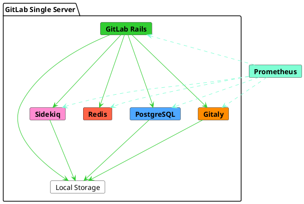



- 티어:  Free, Premium, Ultimate
- 제공 서비스: GitLab Self-Managed



이 참조 아키텍처는 초당 20개 요청(RPS)의 최대 부하를 대상으로 합니다. 실제 데이터를 기반으로 이 부하는 일반적으로 최대 1,000명의 사용자에 해당하며, 수동 및 자동 상호작용을 모두 포함합니다.

전체 참조 아키텍처 목록은 [사용 가능한 참조 아키텍처](_index.md#available-reference-architectures)를 참조하세요.

- **Target Load**:  API:  20 RPS, 웹:  2 RPS, Git(Pull):  2 RPS, Git(Push):  1 RPS
- **High Availability**:  아니오. 고가용성 환경의 경우 수정된 [3K 참조 아키텍처](3k_users.md#supported-modifications-for-lower-user-counts-ha)를 따르십시오.
- **Cloud Native Hybrid**:  아니오. 클라우드 네이티브 하이브리드 환경의 경우 [수정된 하이브리드 참조 아키텍처](#cloud-native-hybrid-reference-architecture-with-helm-charts)를 따를 수 있습니다.
- **Unsure which Reference Architecture to use**? 자세한 내용은 [시작할 아키텍처 결정](_index.md#deciding-which-architecture-to-start-with)을 참조하세요.

| 사용자        | 구성        | GCP 예1 | AWS 예1 | Azure 예1 |
|--------------|----------------------|----------------|--------------|----------|
| 최대 1,000 또는 20 RPS | 8 vCPU, 16GB 메모리 | `n1-standard-8`2 | `c5.2xlarge` | `F8s v2` |

**각주**:

<!-- Disable ordered list rule <https://github.com/DavidAnson/markdownlint/blob/main/doc/Rules.md#md029---ordered-list-item-prefix> -->
<!-- markdownlint-disable MD029 -->
1. 머신 유형 예시는 설명을 위해 제공됩니다. 이러한 유형은 [검증 및 테스트](_index.md#validation-and-test-results)에 사용되지만 규범적 기본값으로 의도되지 않습니다. 나열된 요구 사항을 충족하는 다른 머신 유형으로 전환이 지원되며, 사용 가능한 경우 ARM 변형도 포함됩니다. 자세한 내용은 [지원되는 머신 유형](_index.md#supported-machine-types)을 참조하세요.
2. GCP의 경우 8 vCPU 및 16GB RAM의 권장 요구 사항과 일치하는 가장 가깝고 동등한 표준 머신 유형을 선택했습니다. 필요한 경우 [사용자 지정 머신 유형](https://cloud.google.com/compute/docs/instances/creating-instance-with-custom-machine-type)을 사용할 수도 있습니다.
<!-- markdownlint-enable MD029 -->

다음 다이어그램은 GitLab을 단일 서버에 설치할 수 있지만 내부적으로 여러 서비스로 구성되어 있음을 보여줍니다. 인스턴스가 확장되면 이러한 서비스가 분리되고 특정 요구 사항에 따라 독립적으로 확장됩니다.

경우에 따라 일부 서비스에 PaaS를 활용할 수 있습니다. 예를 들어 일부 파일 시스템에 Cloud Object Storage를 사용할 수 있습니다. 중복성을 위해 일부 서비스는 노드의 클러스터가 되고 동일한 데이터를 저장합니다.

수평 확장된 GitLab 구성에서는 클러스터를 조정하거나 리소스를 검색하기 위해 다양한 보조 서비스가 필요합니다. 예를 들어 PostgreSQL 연결 관리를 위한 PgBouncer 또는 Prometheus 엔드포인트 검색을 위한 Consul입니다.

## 요구 사항 {#requirements}

계속하기 전에 참조 아키텍처의 [요구 사항](_index.md#requirements)을 검토하세요.

> [!warning]
> 노드의 사양은 사용 패턴 및 리포지토리 크기의 높은 백분위수를 기반으로 합니다. 그러나 [대규모 모노레포](_index.md#large-monorepos) (수 GB보다 큼) 또는 [추가 워크로드](_index.md#additional-workloads)가 있는 경우 환경의 성능에 크게 영향을 미칠 수 있습니다. 이것이 귀하에게 적용되는 경우 [추가 조정이 필요할 수 있습니다](_index.md#scaling-an-environment). 연결된 설명서를 참조하고 필요한 경우 추가 지원을 위해 문의하세요.

## 테스트 방법 {#testing-methodology}

20 RPS / 1k 사용자 참조 아키텍처는 대부분의 일반적인 워크플로우를 수용하도록 설계되었습니다. GitLab은 다음 엔드포인트 처리량 목표에 대해 정기적으로 스모크 및 성능 테스트를 수행합니다:

| 엔드포인트 유형 | 대상 처리량 |
| ------------- | ----------------- |
| API           | 20 RPS            |
| 웹           | 2 RPS             |
| Git(풀)    | 2 RPS             |
| Git(푸시)    | 1 RPS             |

이러한 목표는 CI 파이프라인 및 기타 워크로드를 포함하여 지정된 사용자 수에 대한 총 환경 로드를 반영하는 실제 고객 데이터를 기반으로 합니다. 이는 일반적인 워크로드 구성을 나타냅니다. 비정상적인 워크로드 패턴에 대한 지침은 [RPS 구성 이해](sizing.md#understanding-rps-composition-and-workload-patterns)를 참조하세요.

테스트 방법에 대한 자세한 내용은 [검증 및 테스트 결과](_index.md#validation-and-test-results) 섹션을 참조하세요.

### 성능 고려 사항 {#performance-considerations}

환경에 다음이 있는 경우 추가 조정이 필요할 수 있습니다:

- 나열된 대상보다 일관되게 높은 처리량
- [대형 모노레포](_index.md#large-monorepos)
- 상당한 [추가 워크로드](_index.md#additional-workloads)

이러한 경우 자세한 내용은 [환경 확장](_index.md#scaling-an-environment)을 참조하세요. 이러한 고려 사항이 자신에게 적용될 수 있다고 생각되면 필요에 따라 추가 지침을 문의하세요.

## 설정 지침 {#setup-instructions}

이 기본 참조 아키텍처에 대해 GitLab을 설치하려면 표준 [설치 지침](../../install/_index.md)을 사용하세요.

선택적으로 GitLab을 [외부 PostgreSQL 서비스](../postgresql/external.md) 또는 [외부 객체 저장소 서비스](../object_storage.md)를 사용하도록 구성할 수도 있습니다. 성능과 안정성을 개선하지만 복잡성 비용이 증가합니다.

## 고급 검색 구성 {#configure-advanced-search}



- 티어:  Premium, Ultimate
- 제공 서비스: GitLab Self-Managed



Elasticsearch를 활용하고 [고급 검색을 활성화](../../integration/advanced_search/elasticsearch.md)하여 전체 GitLab 인스턴스에서 더 빠르고 고급 코드 검색을 수행할 수 있습니다.

Elasticsearch 클러스터 설계 및 요구 사항은 데이터에 따라 다릅니다. 인스턴스와 함께 Elasticsearch 클러스터를 설정하는 방법에 대한 권장 모범 사례는 [최적의 클러스터 구성 선택](../../integration/advanced_search/elasticsearch.md#guidance-on-choosing-optimal-cluster-configuration)을 참조하세요.

## Helm Charts를 사용한 클라우드 네이티브 하이브리드 참조 아키텍처 {#cloud-native-hybrid-reference-architecture-with-helm-charts}

클라우드 네이티브 하이브리드 참조 아키텍처 설정에서 선택된 상태 비저장 구성 요소는 공식 [Helm Charts](https://docs.gitlab.com/charts/)를 사용하여 Kubernetes에 배포됩니다. 상태 저장 구성 요소는 Linux 패키지가 포함된 컴퓨팅 VM에 배포됩니다.

Kubernetes에서 사용할 수 있는 가장 작은 참조 아키텍처는 [2k 또는 40 RPS GitLab 클라우드 네이티브 하이브리드](2k_users.md#cloud-native-hybrid-reference-architecture-with-helm-charts-alternative) (비 HA) 및 [3k 또는 60 RPS GitLab 클라우드 네이티브 하이브리드](3k_users.md#cloud-native-hybrid-reference-architecture-with-helm-charts-alternative)(HA)입니다.

더 적은 사용자를 제공하거나 더 낮은 RPS인 환경의 경우 노드 사양을 낮출 수 있습니다. 사용자 수에 따라 제안된 모든 노드 사양을 원하는 대로 낮출 수 있습니다. 그러나 [일반 요구 사항](../../install/requirements.md)보다 낮게 내려가면 안 됩니다.

## 다음 단계 {#next-steps}

이제 핵심 기능이 이에 따라 구성된 새로운 GitLab 환경을 갖추고 있습니다. 요구 사항에 따라 추가 선택적 GitLab 기능을 구성할 수 있습니다. [GitLab 설치 후 단계](../../install/next_steps.md)를 참고하여 자세한 내용을 확인하세요.

> [!note]
> 환경 및 요구 사항에 따라 추가 기능을 설정하기 위해 추가 하드웨어 요구 사항 또는 조정이 필요할 수 있습니다. 자세한 내용은 개별 페이지를 참조하세요.
